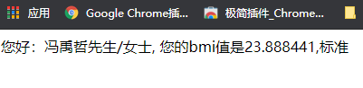
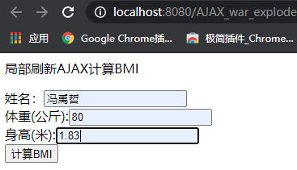
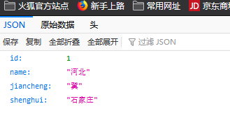

# AJAX

## 一、全局刷新和局部刷新

### 1.1全局刷新和局部刷新的区别

1. 全局刷新

   > 指整个浏览器被新的数据覆盖，在网络中传输大量的数据，浏览器需要加载，渲染页面。
   >
   > - 登录请求处理过程：
   >
   >   
   >
   >   
   >
   > - 全局刷新的原理：
   >
   >   1. 必须由浏览器亲自向服务端发送请求协议包。
   >   2. 这个行为导致服务端直接将【响应包】发送到浏览器内存中。
   >   3. 这个行为导致浏览器内存中原有的内容被覆盖掉。
   >   4. 这个行为导致浏览器在展示数据时候，只有响应数据可以展示。

2. 局部刷新

   > 在浏览器的内部，发起请求，获取数据，改变页面中的部分内容。
   >
   > 其余的页面无需加载和渲染。
   >
   > 网络中传输的数据量少，给用户的感受好。
   >
   > - 局部刷新处理过程：
   >
   >   
   >
   > - 局部刷新原理：
   >
   >   1. 不能由浏览器发送请求给服务端。
   >   2. 浏览器委托浏览器内存中的一个脚本对象代替浏览器发送请求。
   >   3. 这个行为导致服务端直接将【响应包】发送脚本对象内存中。
   >   4. 这个行为导致脚本对象内容被覆盖掉，但是此时浏览器内存中绝大部分内容没有受到任何影响。
   >   5. 这个行为导致浏览器在展示数据时候，同时展示原有数据和响应数据。
   >
   > - **使用AJAX实现局部刷新。**

## 二、异步请求对象

在局部刷新，需要创建一个对象代替浏览器发起请求的行为。（全局刷新是同步行为，局部刷新是异步行为）


### 2.1异步请求对象的功能

这个异步对象用于在后台与服务器交换数据。 XMLHttpRequest就是我们说的异步对象 就是我们说的异步对象。

**异步对象的功能：**

1. 在不重新加载页面的情况下更新网页
2. 在页面已加载后向服务器请求数据
3. 在页面已加载后从服务器接收数据


### 2.2异步对象的创建

通过一行JS代码就可以创建异步对象

```javascript
// AJAX中的核心对象就是XMLHttpRequest
var xmlhttp = new XMLHttpRequest();
```


## 三、AJAX

AJAX（Asynchronous Javascript and XML）异步的JavaScript和Xml

**AJAX是一种无需重新加载整个网页的情况下，不是一种编程语言，而是能够更新部分页面内容的新方法。核心技术有JavaScript和XML**

- Javascript：负责创建异步对象，发送请求，更新页面的dom对象。
- Xml：网络中传输的数据格式。**（现在使用JSON替换了Xml）**


### 3.1AJAX异步实现步骤

> 1. 创建对象
> 2. 为异步对象绑定onreadystatechange事件
> 3. 初始化请求参数
> 4. 发送请求
> 5. 接收服务器响应的数据


**第一步：创建对象**

```javascript
var xmlHttp = new XMLHttpRequest();
```


**第二步：为异步对象绑定onreadystatechange事件**

> 当请求被发送到服务器时，我们需要执行一些基于响应的任务。每当 readyState改变时，就会触发onreadystatechange事件。此事件可以指定一个处理函数 function通过判断XmlHttpReqeust对象的状态，获取服务端返回的数据。

语法格式：

```javascript
xmlHttp.onreadystatechange = function(){
    if(xmlHttp.readyState == 4 && xmlHttp.status == 200){
        // 处理服务器返回数据
    }
}
```

- **readyState属性:**

  存在xmlHttpRequest的状态，从0-4发生变化。

  0：请求未初始化，创建异步请求对象时 var xmlHttp = new XMLHttpRequest();

  1：初始化异步请求对象，xmlHttp.open(请求方式，请求地址，true);

  2：异步对象发送请求，xmlHttp.send();

  3：异步对象接收应答数据，从服务端返回数据。XMLHttpRequest内部处理（获取原始数据，一般不用）。

  4：异步请求对象已经将数据解析完毕，此时才可以读取数据（开发人员在4的时候处理数据，拿到数据，更新页面）。

- **status属性：**

  200："OK"

  404：未找到页面


**第三步：初始化请求参数**

```javascript
// 初始化请求参数方法
open(method, url, async);
```

- method：请求的类型	get / post
- url：服务器的servlet地址
- async：true（异步）/	false（同步）

例如：

```javascript
xmlHttp.open("get", "http://192.168.1.2:8080/loginServlet?name=zs&pwd=123", true);
```


**第四步：使用异步对象发送请求**

```javascript
xmlHttp.send();
```


**第五步：接收服务器响应的数据**

获取服务器端返回的数据，需要使用异步对象的属性

```javascript
xmlHttp.responseText
xmlHttp.responseXML
```

- responseText：获取字符串形式的响应数据
- responseXML：获取XML形式的响应数据


## 四、AJAX实例一

### 4.1实现全局刷新BMI

需求：计算某个用户的BMI，用户在JSP输入自己的身高，体重；servlet中计算BMI，并显示BMI的计算结果和建议。

计算方法：体重公斤数除以身高米数平方

BMI标准：

- 过轻：<18.5
- 正常：18.5-23.9
- 过重：24-27
- 肥胖：28-32
- 非常肥胖：高于32


需要构建一个JavaWeb项目


第一步：写index.jsp页面

```jsp
<%@ page contentType="text/html; charset=UTF-8" pageEncoding="UTF-8" %>
<!DOCTYPE html>
<html>
<head>
  <title>JSP - Hello World</title>
</head>
<body>
<p>全局刷新bmi</p>
<form action="bmiServlet" method="get">
  姓名:<input type="text" name="name"><br>
  体重（公斤）:<input type="text" name="w"><br>
  身高（米）:<input type="text" name="h"><br>
  <input type="submit" value="提交">
</form>
</body>
</html>
```

第二步：创建servlet类

```java
package com.example.AJAX;

import javax.servlet.*;
import javax.servlet.http.*;
import javax.servlet.annotation.*;
import java.io.IOException;

@WebServlet(name = "BmiServlet", value = "/BmiServlet")
public class BmiServlet extends HttpServlet {
    @Override
    protected void doGet(HttpServletRequest request, HttpServletResponse response) throws ServletException, IOException {
        // 接收请求参数
        String strName = request.getParameter("name");
        String height = request.getParameter("h");
        String weight = request.getParameter("w");

        // 计算bmi : bmi = 体重 / 身高的平方
        float h = Float.valueOf(height);
        float w = Float.valueOf(weight);
        float bmi = w / (h * h);

        // 判断bmi范围
        String msg = "";
        if (bmi <= 18.5){
            msg = "比较瘦";
        }else if (bmi > 18.5 && bmi <= 23.9){
            msg = "标准";
        }else if (bmi > 24 && bmi <= 27){
            msg = "过重";
        }else {
            msg = "肥胖";
        }

        System.out.println("msg = " + msg);

        msg = "您好：" + strName + "先生/女士, 您的bmi值是" + bmi + "," + msg;

        // 把数据存入到request
        request.setAttribute("msg", msg);

        //转发到新的页面
        request.getRequestDispatcher("/result.jsp").forward(request, response);
    }

    @Override
    protected void doPost(HttpServletRequest request, HttpServletResponse response) throws ServletException, IOException {

    }
}
```

第三步：将servlet配置到web.xml中

```xml
<?xml version="1.0" encoding="UTF-8"?>
<web-app xmlns="http://xmlns.jcp.org/xml/ns/javaee"
         xmlns:xsi="http://www.w3.org/2001/XMLSchema-instance"
         xsi:schemaLocation="http://xmlns.jcp.org/xml/ns/javaee http://xmlns.jcp.org/xml/ns/javaee/web-app_4_0.xsd"
         version="4.0">
    <servlet>
        <servlet-name>BmiServlet</servlet-name>
        <servlet-class>com.example.AJAX.BmiServlet</servlet-class>
    </servlet>
    <servlet-mapping>
        <servlet-name>BmiServlet</servlet-name>
        <url-pattern>/bmiServlet</url-pattern>
    </servlet-mapping>
</web-app>
```

第四步：写结果页面jsp

```jsp
<%--
  Created by IntelliJ IDEA.
  User: Mr.Feng
  Date: 2021/1/6
  Time: 21:59
  To change this template use File | Settings | File Templates.
--%>
<%@ page contentType="text/html;charset=UTF-8" language="java" %>
<html>
<head>
    <title>结果</title>
</head>
<body>
    <p>显示bmi计算结果</p>
    <h3>${msg}</h3>
</body>
</html>

```

第五步：启动tomcat


**实现全局刷新，因为新页面中的数据都是全新的。**


#### 4.1.1使用HttpServletResponse输出数据

将以上代码修改

第一步：将BmiServlet修改

```java
package com.example.AJAX;

import javax.servlet.ServletException;
import javax.servlet.annotation.WebServlet;
import javax.servlet.http.HttpServlet;
import javax.servlet.http.HttpServletRequest;
import javax.servlet.http.HttpServletResponse;
import java.io.IOException;
import java.io.PrintWriter;

@WebServlet(name = "BmiServlet", value = "/BmiServlet")
public class BmiPrintServlet extends HttpServlet {
    @Override
    protected void doGet(HttpServletRequest request, HttpServletResponse response) throws ServletException, IOException {
        // 接收请求参数
        String strName = request.getParameter("name");
        String height = request.getParameter("h");
        String weight = request.getParameter("w");

        // 计算bmi : bmi = 体重 / 身高的平方
        float h = Float.valueOf(height);
        float w = Float.valueOf(weight);
        float bmi = w / (h * h);

        // 判断bmi范围
        String msg = "";
        if (bmi <= 18.5){
            msg = "比较瘦";
        }else if (bmi > 18.5 && bmi <= 23.9){
            msg = "标准";
        }else if (bmi > 24 && bmi <= 27){
            msg = "过重";
        }else {
            msg = "肥胖";
        }

        System.out.println("msg = " + msg);

        msg = "您好：" + strName + "先生/女士, 您的bmi值是" + bmi + "," + msg;

        //----------------------------------此处做出修改--------------------------------------
        
        // 使用HttpServletResponse输出数据
        response.setContentType("text/html;charset=utf-8");
        // 获取PrintWriter
        PrintWriter pw = response.getWriter();
        // 输出数据
        pw.println(msg);
        // 清空缓存
        pw.flush();
        // 关闭
        pw.close();
    }

    @Override
    protected void doPost(HttpServletRequest request, HttpServletResponse response) throws ServletException, IOException {
    }
}

```

第二步：将新的servlet重新配置到web.xml中

第三步：将新的jsp页面修改表单action

运行结果：





### 4.2实现局部刷新BMI

使用AJAX的局部刷新，有两大步

先写大框架，并测试

第一步：编写jsp

```jsp
<%--
  Created by IntelliJ IDEA.
  User: Mr.Feng
  Date: 2021/1/7
  Time: 10:59
  To change this template use File | Settings | File Templates.
--%>
<%@ page contentType="text/html;charset=UTF-8" language="java" %>
<html>
<head>
    <title>局部刷新AJAX</title>
    <script type="text/javascript">

        function doAjax(){
            // 使用内存中的异步对象，代替浏览器发起请求。异步对象是使用js创建和管理的

            // 1.创建异步对象
            var xmlHttp = new XMLHttpRequest();

            // 2.绑定事件
            xmlHttp.onreadystatechange = function (){
                // 处理服务器端返回的数据，更新当前页面
            }

            // 3.初始请求参数
            xmlHttp.open("get", "bmiAjax", true);

            // 4.发起请求
            xmlHttp.send();
        }

    </script>
</head>
<body>
    <p>局部刷新AJAX计算BMI</p>
    <div>
        <!-- 没有使用表单，AJAX请求不是使用表单提交，是否使用表单都可以 -->
        姓名：<input type="text" id="name" /><br>
        体重(公斤):<input type="text" id="w" /><br>
        身高(米):<input type="text" id="h" /><br>
        <input type="button" value="计算BMI" onclick="doAjax()">
    </div>
</body>
</html>
```

第二步：编写servlet

```java
package com.example.AJAX;

import javax.servlet.ServletException;
import javax.servlet.http.HttpServlet;
import javax.servlet.http.HttpServletRequest;
import javax.servlet.http.HttpServletResponse;
import java.io.IOException;


public class BmiAjaxServlet extends HttpServlet {
    @Override
    protected void doGet(HttpServletRequest request, HttpServletResponse response) throws ServletException, IOException {
        System.out.println("===接收了ajax的请求===");
    }
    @Override
    protected void doPost(HttpServletRequest request, HttpServletResponse response) throws ServletException, IOException {

    }
}

```

第三步：编写web.xml

```xml
<?xml version="1.0" encoding="UTF-8"?>
<web-app xmlns="http://xmlns.jcp.org/xml/ns/javaee"
         xmlns:xsi="http://www.w3.org/2001/XMLSchema-instance"
         xsi:schemaLocation="http://xmlns.jcp.org/xml/ns/javaee http://xmlns.jcp.org/xml/ns/javaee/web-app_4_0.xsd"
         version="4.0">

    <servlet>
        <servlet-name>BmiAjaxServlet</servlet-name>
        <servlet-class>com.example.AJAX.BmiAjaxServlet</servlet-class>
    </servlet>
    <servlet-mapping>
        <servlet-name>BmiAjaxServlet</servlet-name>
        <url-pattern>/bmiAjax</url-pattern>
    </servlet-mapping>
</web-app>
```

第四步：测试


单击按钮：


#### 4.2.1如果从servlet中返回数据，该如何接收数据

第一步：修改servlet中的代码，返回一条数据

```java
package com.example.AJAX;

import javax.servlet.ServletException;
import javax.servlet.http.HttpServlet;
import javax.servlet.http.HttpServletRequest;
import javax.servlet.http.HttpServletResponse;
import java.io.IOException;
import java.io.PrintWriter;


public class BmiAjaxServlet extends HttpServlet {
    @Override
    protected void doGet(HttpServletRequest request, HttpServletResponse response) throws ServletException, IOException {
        System.out.println("===接收了ajax的请求===");
        PrintWriter pw = response.getWriter();
        pw.println("hello ajax");
        pw.flush();
        pw.close();
    }
    @Override
    protected void doPost(HttpServletRequest request, HttpServletResponse response) throws ServletException, IOException {

    }
}

```

第二步：修改jsp接收

```jsp
<%--
  Created by IntelliJ IDEA.
  User: Mr.Feng
  Date: 2021/1/7
  Time: 10:59
  To change this template use File | Settings | File Templates.
--%>
<%@ page contentType="text/html;charset=UTF-8" language="java" %>
<html>
<head>
    <title>局部刷新AJAX</title>
    <script type="text/javascript">

        function doAjax(){
            // 使用内存中的异步对象，代替浏览器发起请求。异步对象是使用js创建和管理的

            // 1.创建异步对象
            var xmlHttp = new XMLHttpRequest();

            // 2.绑定事件
            xmlHttp.onreadystatechange = function (){
                // 处理服务器端返回的数据，更新当前页面
                // alert("readyState属性值======" + xmlHttp.readyState + "| status的属性值======" + xmlHttp.status);
                if (xmlHttp.readyState ==4 && xmlHttp.status == 200){
                    alert(xmlHttp.responseText);
                }
            }

            // 3.初始请求参数
            xmlHttp.open("get", "bmiAjax", true);

            // 4.发起请求
            xmlHttp.send();
        }

    </script>
</head>
<body>
    <p>局部刷新AJAX计算BMI</p>
    <div>
        <!-- 没有使用表单，AJAX请求不是使用表单提交，是否使用表单都可以 -->
        姓名：<input type="text" id="name" /><br>
        体重(公斤):<input type="text" id="w" /><br>
        身高(米):<input type="text" id="h" /><br>
        <input type="button" value="计算BMI" onclick="doAjax()">
    </div>
</body>
</html>
```


实现局部刷新，即使文本框中添加数据依然不影响，页面依然在当前页面刷新。


**JSP页面：使用xmlHttp发起请求，接收数据。不会影响页面，并且可以有多个xmlHttp对象。**

**服务器端Servlet：接收请求，使用HttpServletResponse来输出数据。**


#### 4.2.2新建JSP，使用XMLHttpRequest异步对象

> 有四个步骤：
>
> 1. 创建
> 2. 绑定事件
> 3. 初始请求
> 4. 发送请求

```jsp
<%--
  Created by IntelliJ IDEA.
  User: Mr.Feng
  Date: 2021/1/7
  Time: 10:59
  To change this template use File | Settings | File Templates.
--%>
<%@ page contentType="text/html;charset=UTF-8" language="java" %>
<html>
<head>
    <title>局部刷新AJAX</title>
    <script type="text/javascript">

        function doAjax(){
            // 使用内存中的异步对象，代替浏览器发起请求。异步对象是使用js创建和管理的

            // 1.创建异步对象
            var xmlHttp = new XMLHttpRequest();

            // 2.绑定事件
            xmlHttp.onreadystatechange = function (){
                // 处理服务器端返回的数据，更新当前页面
                // alert("readyState属性值======" + xmlHttp.readyState + "| status的属性值======" + xmlHttp.status);
                if (xmlHttp.readyState ==4 && xmlHttp.status == 200){
                    alert(xmlHttp.responseText);
                }
            }

            // 3.初始请求参数
            // 获取dom对象value属性值
            var name = document.getElementById("name").value;
            var weight = document.getElementById("w").value;
            var height = document.getElementById("h").value;

            var param = "name=" + name + "&w=" + weight + "&h=" + height;
            // alert("param:" + param); // param:name=李四&w=80&h=1.8

            xmlHttp.open("get", "bmiAjax?" + param, true);


            // 4.发起请求
            xmlHttp.send();
        }

    </script>
</head>
<body>
    <p>局部刷新AJAX计算BMI</p>
    <div>
        <!-- 没有使用表单，AJAX请求不是使用表单提交，是否使用表单都可以 -->
        姓名：<input type="text" id="name" /><br>
        体重(公斤):<input type="text" id="w" /><br>
        身高(米):<input type="text" id="h" /><br>
        <input type="button" value="计算BMI" onclick="doAjax()">
    </div>
</body>
</html>
```


#### 4.2.3创建服务器端的Servlet，接收并处理数据，把数据输出给异步对象

```java
package com.example.AJAX;

import javax.servlet.ServletException;
import javax.servlet.http.HttpServlet;
import javax.servlet.http.HttpServletRequest;
import javax.servlet.http.HttpServletResponse;
import java.io.IOException;
import java.io.PrintWriter;


public class BmiAjaxServlet extends HttpServlet {
    @Override
    protected void doGet(HttpServletRequest request, HttpServletResponse response) throws ServletException, IOException {
        System.out.println("===接收了ajax的请求===");

        // 接收参数
        String strName = request.getParameter("name");
        String strweight = request.getParameter("w");
        String strheight = request.getParameter("h");
        // 计算
        float weight = Float.valueOf(strweight);
        float height = Float.valueOf(strheight);
        float bmi = weight / (height * height);
        // 判断bmi范围
        String msg = "";
        if (bmi <= 18.5){
            msg = "比较瘦";
        }else if (bmi > 18.5 && bmi <= 23.9){
            msg = "标准";
        }else if (bmi > 24 && bmi <= 27){
            msg = "过重";
        }else {
            msg = "肥胖";
        }

        System.out.println("msg = " + msg);

        msg = "您好：" + strName + "先生/女士, 您的bmi值是" + bmi + "," + msg;

        // 响应AJAX需要的数据，使用HttpServletResponse输出数据
        response.setContentType("text/html;charset=utf-8");
        // 获取PrintWriter
        PrintWriter pw = response.getWriter();
        // 输出数据
        pw.println(msg);
        // 清空缓存
        pw.flush();
        // 关闭
        pw.close();
    }
    @Override
    protected void doPost(HttpServletRequest request, HttpServletResponse response) throws ServletException, IOException {

    }
}
```





**实现了页面局部刷新，接收服务端的数据并弹框，页面数据没有全局刷新，文本框的数据依然还在。**


#### 4.2.4优化代码，使结果显示到页面中，局部刷新

```java
package com.example.AJAX;

import javax.servlet.ServletException;
import javax.servlet.http.HttpServlet;
import javax.servlet.http.HttpServletRequest;
import javax.servlet.http.HttpServletResponse;
import java.io.IOException;
import java.io.PrintWriter;


public class BmiAjaxServlet extends HttpServlet {
    @Override
    protected void doGet(HttpServletRequest request, HttpServletResponse response) throws ServletException, IOException {
        System.out.println("===接收了ajax的请求===");

        // 接收参数
        String strName = request.getParameter("name");
        String strweight = request.getParameter("w");
        String strheight = request.getParameter("h");
        // 计算
        float weight = Float.valueOf(strweight);
        float height = Float.valueOf(strheight);
        float bmi = weight / (height * height);
        // 判断bmi范围
        String msg = "";
        if (bmi <= 18.5){
            msg = "比较瘦";
        }else if (bmi > 18.5 && bmi <= 23.9){
            msg = "标准";
        }else if (bmi > 24 && bmi <= 27){
            msg = "过重";
        }else {
            msg = "肥胖";
        }

        System.out.println("msg = " + msg);

        msg = "您好：" + strName + "先生/女士, 您的bmi值是" + bmi + "," + msg;

        // 响应AJAX需要的数据，使用HttpServletResponse输出数据
        response.setContentType("text/html;charset=utf-8");
        // 获取PrintWriter
        PrintWriter pw = response.getWriter();
        // 输出数据
        pw.println(msg);
        // 清空缓存
        pw.flush();
        // 关闭
        pw.close();
    }
    @Override
    protected void doPost(HttpServletRequest request, HttpServletResponse response) throws ServletException, IOException {

    }
}

```

```jsp
<%--
  Created by IntelliJ IDEA.
  User: Mr.Feng
  Date: 2021/1/7
  Time: 10:59
  To change this template use File | Settings | File Templates.
--%>
<%@ page contentType="text/html;charset=UTF-8" language="java" %>
<html>
<head>
    <title>局部刷新AJAX</title>
    <script type="text/javascript">

        function doAjax(){
            // 使用内存中的异步对象，代替浏览器发起请求。异步对象是使用js创建和管理的

            // 1.创建异步对象
            var xmlHttp = new XMLHttpRequest();

            // 2.绑定事件
            xmlHttp.onreadystatechange = function (){
                // 处理服务器端返回的数据，更新当前页面
                // alert("readyState属性值======" + xmlHttp.readyState + "| status的属性值======" + xmlHttp.status);
                if (xmlHttp.readyState ==4 && xmlHttp.status == 200){
                    // alert(xmlHttp.responseText);
                    var data = xmlHttp.responseText;
                    document.getElementById("mydata").innerText = data;
                }
            }

            // 3.初始请求参数
            // 获取dom对象value属性值
            var name = document.getElementById("name").value;
            var weight = document.getElementById("w").value;
            var height = document.getElementById("h").value;

            var param = "name=" + name + "&w=" + weight + "&h=" + height;
            // alert("param:" + param); // param:name=李四&w=80&h=1.8

            xmlHttp.open("get", "bmiAjax?" + param, true);


            // 4.发起请求
            xmlHttp.send();
        }

    </script>
</head>
<body>
    <p>局部刷新AJAX计算BMI</p>
    <div>
        <!-- 没有使用表单，AJAX请求不是使用表单提交，是否使用表单都可以 -->
        姓名：<input type="text" id="name" /><br>
        体重(公斤):<input type="text" id="w" /><br>
        身高(米):<input type="text" id="h" /><br>
        <input type="button" value="计算BMI" onclick="doAjax()">
        <br><br><br>
        <div id="mydata">等待加载数据...</div>
    </div>
</body>
</html>
```

```xml
<?xml version="1.0" encoding="UTF-8"?>
<web-app xmlns="http://xmlns.jcp.org/xml/ns/javaee"
         xmlns:xsi="http://www.w3.org/2001/XMLSchema-instance"
         xsi:schemaLocation="http://xmlns.jcp.org/xml/ns/javaee http://xmlns.jcp.org/xml/ns/javaee/web-app_4_0.xsd"
         version="4.0">

    <servlet>
        <servlet-name>BmiAjaxServlet</servlet-name>
        <servlet-class>com.example.AJAX.BmiAjaxServlet</servlet-class>
    </servlet>
    <servlet-mapping>
        <servlet-name>BmiAjaxServlet</servlet-name>
        <url-pattern>/bmiAjax</url-pattern>
    </servlet-mapping>
</web-app>
```


## 五、AJAX实例二

### 5.1局部刷新实现根据省份ID查询省份名称

需求：用户在文本框中输入省份的编号id，在其他文本框显示省份名称。

要求连接数据库

第一步：创建JSP

```jsp
<%--
  Created by IntelliJ IDEA.
  User: Mr.Feng
  Date: 2021/1/7
  Time: 10:59
  To change this template use File | Settings | File Templates.
--%>
<%@ page contentType="text/html;charset=UTF-8" language="java" %>
<html>
<head>
    <title>局部刷新AJAX</title>
    <script type="text/javascript">
        function search(){
            // 发起ajax请求，传递参数给服务器，服务器返回数据
            // 1.创建对象
            var xmlHttp = new XMLHttpRequest();

            // 2.绑定事件
            xmlHttp.onreadystatechange = function (){
                // 处理数据
               if (xmlHttp.readyState == 4 && xmlHttp.status == 200){
                   // alert(xmlHttp.responseText);
                   // 更新页面
                   document.getElementById("proname").value = xmlHttp.responseText;
               }
            }

            // 3.初始化异步对象
            var proid = document.getElementById("proid").value;
            xmlHttp.open("get", "queryProvince?proid=" + proid, "true");

            // 4.发送请求
            xmlHttp.send();
        }
    </script>
</head>
<body>
    <p>AJAX根据省份id获取名称</p>
    <table>
        <tr>
            <td>省份编号：</td>
            <td>
                <input type="text" id="proid">
                <input type="button" value="搜索" onclick="search()">
            </td>
        </tr>
        <tr>
            <td>省份名称：</td>
            <td>
                <input type="text" id="proname">
            </td>
        </tr>
    </table>
</body>
</html>
```

第二步：编写dao

```java
package com.bjpowernode.dao;

import java.sql.*;

// 使用jdbc访问数据库
public class ProvinceDao {
    // 根据id获取名称
    public String queryProvinceNameById(Integer provinceId){
        Connection conn = null;
        PreparedStatement ps = null;
        ResultSet rs = null;
        String sql = null;
        String url = "jdbc:mysql://localhost:3306/springdb?useUnicode=true&characterEncoding=UTF-8&serverTimezone=Asia/Shanghai";
        String username = "root";
        String password = "12345";
        String name = "";

        // 加载驱动
        try {
            Class.forName("com.mysql.cj.jdbc.Driver");
            conn = DriverManager.getConnection(url, username, password);
            // 创建PreparedStatement
            sql = "select name from province where id = ?";
            ps = conn.prepareStatement(sql);
            // 设置参数
            ps.setInt(1, provinceId);
            rs = ps.executeQuery();
            if (rs.next()){
                name = rs.getString("name");
            }
        } catch (ClassNotFoundException e) {
            e.printStackTrace();
        } catch (SQLException throwables) {
            throwables.printStackTrace();
        }finally {
            if (rs != null){
                try {
                    rs.close();
                } catch (SQLException throwables) {
                    throwables.printStackTrace();
                }
            }
            if (ps != null){
                try {
                    ps.close();
                } catch (SQLException throwables) {
                    throwables.printStackTrace();
                }
            }
            if (conn != null){
                try {
                    conn.close();
                } catch (SQLException throwables) {
                    throwables.printStackTrace();
                }
            }
        }
        return name;
    }
}
```

第三步：编写servlet

```java
package com.bjpowernode.controller;

import com.bjpowernode.dao.ProvinceDao;

import javax.servlet.ServletException;
import javax.servlet.http.HttpServlet;
import javax.servlet.http.HttpServletRequest;
import javax.servlet.http.HttpServletResponse;
import java.io.IOException;
import java.io.PrintWriter;

public class QueryProvinceServlet extends HttpServlet {
    @Override
    protected void doGet(HttpServletRequest req, HttpServletResponse resp) throws ServletException, IOException {
        // 处理get请求
        String strProid = req.getParameter("proid");
        System.out.println("strProid = " + strProid);
        String name = "默认无数据";

        // 访问dao，查询数据库
        if (strProid != null && !"".equals(strProid.trim())){
            ProvinceDao dao = new ProvinceDao();
            name = dao.queryProvinceNameById(Integer.valueOf(strProid));
        }

        // 使用HttpServletResponse输出数据
        resp.setContentType("text/html;charset=utf-8");
        PrintWriter pw = resp.getWriter();
        pw.println(name);
        pw.flush();
        pw.close();
    }
}
```

第四步：编写web.xml

```xml
<?xml version="1.0" encoding="UTF-8"?>
<web-app xmlns="http://xmlns.jcp.org/xml/ns/javaee"
         xmlns:xsi="http://www.w3.org/2001/XMLSchema-instance"
         xsi:schemaLocation="http://xmlns.jcp.org/xml/ns/javaee http://xmlns.jcp.org/xml/ns/javaee/web-app_4_0.xsd"
         version="4.0">

<!--    声明servlet-->
    <servlet>
        <servlet-name>QueryProvince</servlet-name>
        <servlet-class>com.bjpowernode.controller.QueryProvinceServlet</servlet-class>
    </servlet>
    <servlet-mapping>
        <servlet-name>QueryProvince</servlet-name>
        <url-pattern>/queryProvince</url-pattern>
    </servlet-mapping>
</web-app>
```

运行结果：


## 六、JSON的应用

### 6.1使用JSON作为数据交换格式

ajax发起请求----------servlet（返回的一个json格式的字符串{"name" : "河北", "jiancheng" : "冀", "shenghui" : "石家庄"}）

> JSON分类：
>
> 1. JSON对象：JSONObject，格式：名称 : 值，也可以看成key : value格式。
> 2. JSON数组：JSONArray，格式：[{"name" : "河北", "jiancheng" : "冀", "shenghui" : "石家庄"}, {"name" : "辽宁", "jiancheng" : "辽", "shenghui" : "沈阳"}, ...]

**为什么要使用JSON？**

1. JSON格式好理解。
2. JSON格式的数据在多种语言中，比较容易处理。
3. JSON格式的数据占用的空间小，在网络中传输快。


### 6.2处理JSON的工具库

1. GSON（Google）
2. fastJSON（阿里巴巴）：速度快，不符合JSON处理规范。
3. jackson：性能好，规范好。
4. JSON-Lib：性能差，依赖多。


### 6.3使用JSON工具库将Java对象转换成JSON格式的字符串

```java
package com.bjpowernode.dao;

import com.bjpowernode.pojo.Province;
import com.fasterxml.jackson.core.JsonProcessingException;
import com.fasterxml.jackson.databind.ObjectMapper;

public class TestJson {
    public static void main(String[] args) throws JsonProcessingException {
        // 使用jackson 把java对象转成json格式的字符串
        Province province = new Province();
        province.setId(1);
        province.setName("河北");
        province.setJiancheng("冀");
        province.setShenghui("石家庄");

        //使用jackson将province转换成JSON格式的字符串
        ObjectMapper om = new ObjectMapper();
        // writeValueAsString(),将参数的java对象转换成JSON格式的字符串
        String json = om.writeValueAsString(province);

        System.out.println("转换的JSON：" + json);
    }
}

```


### 6.4测试servlet的方法

启动tomcat后，手动发起请求。

```java
package com.bjpowernode.controller;

import com.bjpowernode.dao.ProvinceDao;
import com.bjpowernode.pojo.Province;
import com.fasterxml.jackson.databind.ObjectMapper;

import javax.servlet.*;
import javax.servlet.http.*;
import java.io.IOException;
import java.io.PrintWriter;

public class QueryJsonServlet extends HttpServlet {
    @Override
    protected void doGet(HttpServletRequest request, HttpServletResponse response) throws ServletException, IOException {
        // 获取请求参数，省份id
        String strProid = request.getParameter("id");

        // 默认值："{}" 表示JSON格式的数据
        String json = "{}";

        // 判断proid有值时，调用dao查询数据
        if (strProid != null && strProid.trim().length() > 0){
            ProvinceDao dao = new ProvinceDao();
            Province province = dao.queryProvinceNameById(Integer.valueOf(strProid));

            // 需要使用jackson把province对象转换成json
            ObjectMapper objectMapper = new ObjectMapper();
            json = objectMapper.writeValueAsString(province);
        }

        // 把获取的数据通过网络传给ajax中的异步对象，响应结果数据
        // 用来指定servlet返回给浏览器的是json格式的数据
        response.setContentType("application/json;charset=utf-8");
        PrintWriter pw = response.getWriter();
        pw.println(json);
        pw.flush();
        pw.close();
    }

    @Override
    protected void doPost(HttpServletRequest request, HttpServletResponse response) throws ServletException, IOException {

    }
}

```

在浏览器中输入

```url
http://localhost:8080/AJAX_war_exploded/QueryJson?id=1
// 手动输入后边地址/AJAX_war_exploded/QueryJson?id=1
// /AJAX_war_exploded:部署的项目名
// QueryJson:请求地址
// ?id=1参数
```

返回的数据：



### 6.5使用JSON作为数据交换格式实现5.1的案例


第一步：编写dao

```java
package com.bjpowernode.dao;

import com.bjpowernode.pojo.Province;

import java.sql.*;

// 使用jdbc访问数据库
public class ProvinceDao {
    // 根据id获取一个完整的Province对象
    public Province queryProvinceNameById(Integer provinceId){
        Connection conn = null;
        PreparedStatement ps = null;
        ResultSet rs = null;
        String sql = "";

        String url = "jdbc:mysql://localhost:3306/springdb?useUnicode=true&characterEncoding=UTF-8&serverTimezone=Asia/Shanghai";
        String username = "root";
        String password = "12345";

        Province province = null;

        // 加载驱动
        try {
            Class.forName("com.mysql.cj.jdbc.Driver");
            conn = DriverManager.getConnection(url, username, password);
            // 创建PreparedStatement
            sql = "select id, name, jiancheng, shenghui from province where id = ?";
            ps = conn.prepareStatement(sql);
            // 设置参数
            ps.setInt(1, provinceId);
            rs = ps.executeQuery();
            if (rs.next()){
                province = new Province();
                province.setId(rs.getInt("id"));
                province.setName(rs.getString("name"));
                province.setJiancheng(rs.getString("jiancheng"));
                province.setShenghui(rs.getString("shenghui"));
            }
        } catch (ClassNotFoundException e) {
            e.printStackTrace();
        } catch (SQLException throwables) {
            throwables.printStackTrace();
        }finally {
            if (rs != null){
                try {
                    rs.close();
                } catch (SQLException throwables) {
                    throwables.printStackTrace();
                }
            }
            if (ps != null){
                try {
                    ps.close();
                } catch (SQLException throwables) {
                    throwables.printStackTrace();
                }
            }
            if (conn != null){
                try {
                    conn.close();
                } catch (SQLException throwables) {
                    throwables.printStackTrace();
                }
            }
        }
        return province;
    }
}

```

第二步：编写servlet

```java
package com.bjpowernode.controller;

import com.bjpowernode.dao.ProvinceDao;
import com.bjpowernode.pojo.Province;
import com.fasterxml.jackson.databind.ObjectMapper;

import javax.servlet.*;
import javax.servlet.http.*;
import java.io.IOException;
import java.io.PrintWriter;

public class QueryJsonServlet extends HttpServlet {
    @Override
    protected void doGet(HttpServletRequest request, HttpServletResponse response) throws ServletException, IOException {
        // 获取请求参数，省份id
        String strProid = request.getParameter("proid");

        // 默认值："{}" 表示JSON格式的数据
        String json = "{}";

        // 判断proid有值时，调用dao查询数据
        if (strProid != null && strProid.trim().length() > 0){
            ProvinceDao dao = new ProvinceDao();
            Province province = dao.queryProvinceNameById(Integer.valueOf(strProid));

            // 需要使用jackson把province对象转换成json
            ObjectMapper objectMapper = new ObjectMapper();
            json = objectMapper.writeValueAsString(province);
        }

        // 把获取的数据通过网络传给ajax中的异步对象，响应结果数据
        // 用来指定servlet返回给浏览器的是json格式的数据
        response.setContentType("application/json;charset=utf-8");
        PrintWriter pw = response.getWriter();
        pw.println(json);
        pw.flush();
        pw.close();
    }

    @Override
    protected void doPost(HttpServletRequest request, HttpServletResponse response) throws ServletException, IOException {

    }
}
```

第三步：编写jsp

```jsp
<%--
  Created by IntelliJ IDEA.
  User: Mr.Feng
  Date: 2021/1/7
  Time: 19:04
  To change this template use File | Settings | File Templates.
--%>
<%@ page contentType="text/html;charset=UTF-8" language="java" %>
<html>
<head>
    <title>使用JSON格式的数据</title>
</head>
    <script type="text/javascript">
        function doSearch(){
            // 1。创建异步对象
            var xmlHttp = new XMLHttpRequest();

            // 2.绑定事件
            xmlHttp.onreadystatechange = function (){
                // 处理数据
                // alert(xmlHttp.responseText);
                if (xmlHttp.readyState == 4 && xmlHttp.status == 200){
                    var data = xmlHttp.responseText;
                    var jsonObj = eval("(" + data + ")");
                    // alert(jsonObj.id + jsonObj.name + jsonObj.jiancheng + jsonObj.shenghui);
                    document.getElementById("proname").value = jsonObj.name;
                    document.getElementById("projiancheng").value = jsonObj.jiancheng;
                    document.getElementById("proshenghui").value = jsonObj.shenghui;
                }
            }

            // 3. 初始化异步对象
            var proid = document.getElementById("proid").value;
            xmlHttp.open("get", "QueryJson?proid=" + proid , true);

            // 4.发送请求
            xmlHttp.send();
        }
    </script>
<body>
    <p>AJAX请求，使用JSON格式的数据</p>
    <table>
        <tr>
            <td>省份编号：</td>
            <td>
                <input type="text" id="proid" />
                <input type="button" value="搜索" onclick="doSearch()" />
            </td>
        </tr>
        <tr>
            <td>省份名称：</td>
            <td><input type="text" id="proname"></td>
        </tr>
        <tr>
            <td>省份简称：</td>
            <td><input type="text" id="projiancheng"></td>
        </tr>
        <tr>
            <td>省会名称：</td>
            <td><input type="text" id="proshenghui"></td>
        </tr>
    </table>
</body>
</html>
```

第四步：部署servlet

```xml
<?xml version="1.0" encoding="UTF-8"?>
<web-app xmlns="http://xmlns.jcp.org/xml/ns/javaee"
         xmlns:xsi="http://www.w3.org/2001/XMLSchema-instance"
         xsi:schemaLocation="http://xmlns.jcp.org/xml/ns/javaee http://xmlns.jcp.org/xml/ns/javaee/web-app_4_0.xsd"
         version="4.0">

<!--    声明servlet-->
    <servlet>
        <servlet-name>QueryJsonServlet</servlet-name>
        <servlet-class>com.bjpowernode.controller.QueryJsonServlet</servlet-class>
    </servlet>
    <servlet-mapping>
        <servlet-name>QueryJsonServlet</servlet-name>
        <url-pattern>/QueryJson</url-pattern>
    </servlet-mapping>
</web-app>
```


## 七、同步和异步

xmlHttp.open(get, url, true/false)

1. 异步(true)：异步处理请求，使用异步对象发起请求后，不用等待数据处理完毕，就可以执行其他操作。在send之后执行其他代码，可以同时执行多个异步请求。
2. 同步(false)：异步对象必须必须完成请求，从服务端获取数据后，才能执行send之后的代码，任意时刻只能执行一个异步请求。一次只能执行一个异步请求，必须请求处理完成后，才能执行其他请求处理。