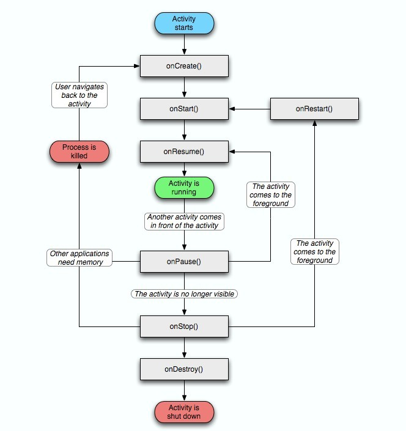
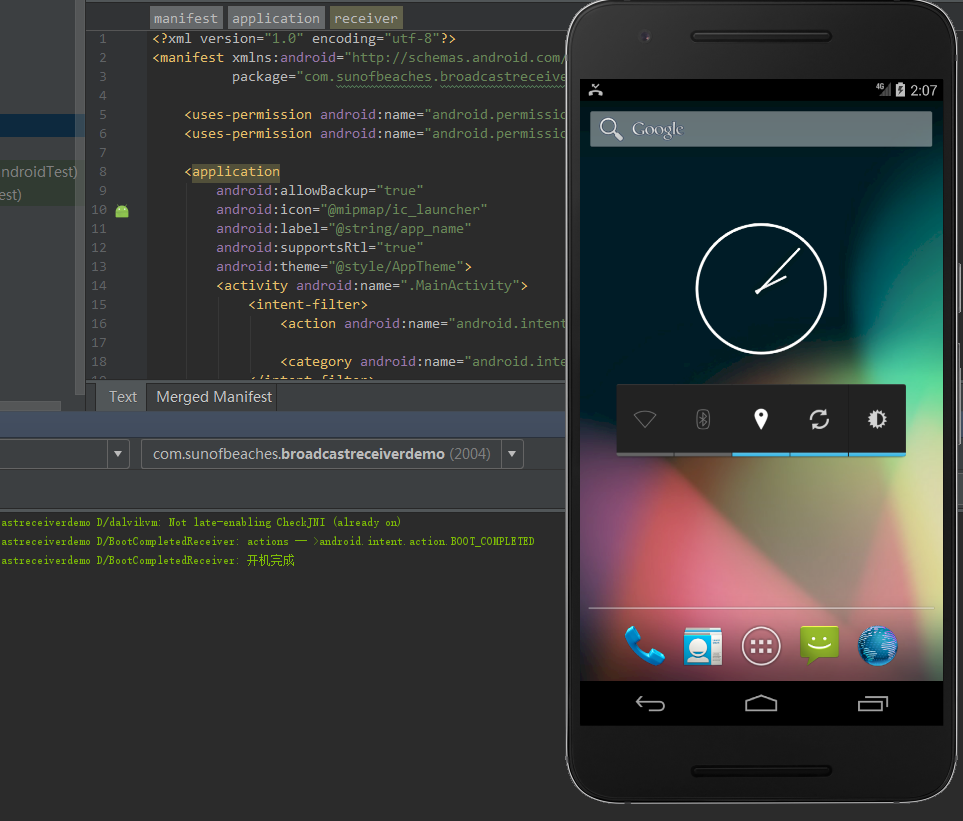

# Android四大组件

## 一、Activity

### 1.1AndroidManifest.xml

AndroidManifest.xml为Android项目中的描述文件，用来描述项目内容。


由图可知，在该文件中有包名，Application，Activity等，在该文件中，还可以声明读写权限，网络权限等。

1. 声明读写权限

   

   ```xml
   <uses-permission android:name="android.permission.WRITE_EXTERNAL_STORAGE"/>
   <uses-permission android:name="android.permission.READ_EXTERNAL_STORAGE"/>
   ```

2. Application也可以自定义

   可以自己创建一个自定义的类来继承Application类并重写生命周期方法，并在AndroidManifest.xml文件中进行注册。

   这样可以自定义生命周期中的方法。

   

   

3. 其他属性的含义

   > - android:allowBackup="true"：是否允许备份
   > - android:icon="@mipmap/ic_launcher"：应用的图标
   > - android:label="@string/app_name"：应用的名称
   > - android:supportsRtl="true"：支持从右到左的布局方向（如果设为true并且在开发者选项中设置强制布局从右到左就可以改变布局方向，如果不设置则不会改变）
   > - android:theme="@style/AppTheme"：控制样式

4. Activity标签

   ```xml
   <activity
       android:name=".MainActivity"
       android:label="@string/app_name">
       <intent-filter>
           <action android:name="android.intent.action.MAIN"/>
           <category android:name="android.intent.category.LAUNCHER"/>
       </intent-filter>
   </activity>
   ```

   - android:name：指定要注册的类
   - android:label：设置标签
   - < intent-filter >标签：默认写法指定主入口

   


**Android中的四大组件（Activity、Service、ContentProvider、BroadcastReceiver）都需要在该文件中注册。**

一个程序只有一个Application，其中可以包含四大组件。


### 1.2什么是Activity

Activity（活动），用来跟用户进行交互，是用户直接看到的界面。Activity是单一独立的，它用于处理用户操作。几乎所有的Activity都与用户交互，所以Activity负责创建窗口来放你所设置的UI内容。综上，我们可以理解Activity是一个容器，是一个窗口。


### 1.3Activity之间的跳转


#### 1.3.1显式意图

显式意图就是按全限定类名指定要启动的组件。通常会在应用中使用显式意图来启动组件，因为知道要启动的组件Activity或者服务的全限定类名。

```java
Intent intent = new Intent(this, SecondActivity.class);
startActivity(intent);
```

这里面的话，我们可以直接看到SecondActivity，也就是说可以看到具体的类名。这就是显式意图。

**创建显式Intent启动Activity或者Service时，系统会立即启动Intent对象中指定的应用组件。**


##### 1.3.1.1通过显式意图跳转到第三方应用

第一种方式：

```java
Intent intent = new Intent();
intent.setClassName("com.android.browser", "com.android.browser.BrowserActivity");
startActivity(intent);
```

第二种方式：

```java
Intent intent = new Intent();
ComponentName componentName = new ComponentName("com.android.browser", "com.android.browser.BrowserActivity")
intent.setComponent(componentName);
startActivity(intent);
```


#### 1.3.2隐式意图

不会指定特定的组件，而是声明要执行的常规操作，从而允许其他应用中的组件来启动它。例如在地图上向用户显示位置，可以使用隐式意图来启动另一个具有此功能的应用在地图上显示指定的位置。

```xml
<activity
    android:name=".ThirdActivity">
    <!-- Intent过滤器 -->
    <intent-filter>
        <action android:name="com.test.LOGIN_INFO"/>
        <category android:name="android.intent.category.DEFAULT"/>
    </intent-filter>
</activity>
```

```java
Intent intent = new Intent();
intent.setAction("com.test.LOGIN_INFO");
intent.addCategory(Intent.CATEGORY_DEFAULT);
startActivity(intent);
```

**创建隐式Intent时，Android系统通过将Intent的内容与设备上其他应用的清单文件中声明的Intent过滤器进行比较，从而找到要启动的相应组件。如果Intent和Intent过滤器匹配，则启动该组件，并向其传递Intent对象，如果多个Intent过滤器兼容，则系统会给出一个对话框，支持用户选取要使用的应用。**


##### 1.3.2.1通过隐式意图跳转到第三方应用

```java
Intent intent = new Intent();
intent.setAction("android.intent.action.SEARCH");
intent.addCategory(Intent.CATEGORY_DEFAULT);
// 5.1以上的版本需要指定包名
intent.setPackage("com.android.browser");
startActivity(intent);
```


**如何选择显式意图和隐式意图：**

显式意图：一般用于应用内组件之间的跳转

隐式意图：一般用于多个应用之间的跳转


#### 1.3.3Intent过滤器

Intent过滤器是应用清单文件中的一个表达式，用来指定该组件要接收的Intent类型。

```xml
<activity
    android:name=".ThirdActivity">
    <!-- Intent过滤器 -->
    <intent-filter>
        <action android:name="com.test.LOGIN_INFO"/>
        <!-- 可以有多个category -->
        <category android:name="android.intent.category.DEFAULT"/>
    </intent-filter>
</activity>
```

如果为Activity声明了Intent过滤器，那么使用其他应用可以直接通过特定类型的Intent来启动Activity，如果没有声明，那么该Activity只能通过显式意图来启动。


### 1.4数据传输


#### 1.4.1基本数据类型传输


跳转Activity或者Service需要一个Intent对象，需要使用Intent作为数据的载体，将数据保存到Intent中。


保存数据通过putExtra方法来保存，其中使用key-value的格式。在跳转到的Activity中取数据需要先获得Intent对象，使用getIntent()方法，在通过get方法获取传递过来的数据。


```java
/**
 * 第一个按钮被点击了
 *
 * @param view
 */
public void firstClick(View view) {
    Intent intent = new Intent(this, SecondActivity.class);
    intent.putExtra("booleanKey", true);
    intent.putExtra("charKey", 'a');
    intent.putExtra("byteKey", (byte) 1);
    intent.putExtra("shortKey", (short) 2);
    intent.putExtra("intKey", 3);
    intent.putExtra("longKey", 4l);
    intent.putExtra("floatKey", 0.5f);
    intent.putExtra("doubleKey", 0.6d);
    startActivity(intent);
}
```

```java
public class SecondActivity extends Activity {

    private static final String TAG = "SecondActivity";

    @Override
    protected void onCreate(Bundle savedInstanceState) {
        super.onCreate(savedInstanceState);

        /**
         * 拿到启动这个Activity的意图对象
         */
        Intent intent = getIntent();
        if (intent != null) {
            //前面的是key，后面的是默认值，假设获取不到的时候，就会返回默认值，也就是后面的那个值。
            //比如说我们把key写错了，这样子就获取不到值了。
            boolean booleanValue = intent.getBooleanExtra("booleanKey", false);
            //
            char charValue = intent.getCharExtra("charKey", '*');
            //
            byte byteValue = intent.getByteExtra("byteKey", (byte) 0);
            //
            short shortValue = intent.getShortExtra("shortKey", (short) 0);
            //
            int intValue = intent.getIntExtra("intKey", -1);
            //
            long longValue = intent.getLongExtra("longKey", 0l);
            //
            float floatValue = intent.getFloatExtra("floatKey", 0.0f);
            //
            double doubleValue = intent.getDoubleExtra("doubleKey", 0.0d);

            Log.d(TAG, "booleanValue = " + booleanValue);
            Log.d(TAG, "charValue = " + charValue);
            Log.d(TAG, "byteValue = " + byteValue);
            Log.d(TAG, "shortValue = " + shortValue);
            Log.d(TAG, "intValue = " + intValue);
            Log.d(TAG, "longValue = " + longValue);
            Log.d(TAG, "floatValue = " + floatValue);
            Log.d(TAG, "doubleValue = " + doubleValue);
        }
    }
}
```


#### 1.4.2引用数据类型传输

String也是引用类型，那么是如何传递的呢？


可以看到String实现了序列化接口，也就是说我们要传递引用类型也需要实现序列化接口。

创建一个对象并且序列化，这里使用Parcelable接口，是Google推荐的序列化方式，Serializable是Java推荐的序列化方式。

```java
public class User implements Parcelable {
    private String name;
    private int age;

    public User(String name, int age) {
        this.age = age;
        this.name = name;
    }

    public void setName(String name) {
        this.name = name;
    }

    public void setAge(int age) {
        this.age = age;
    }

    public String getName() {
        return name;
    }

    public int getAge() {
        return age;
    }
    
    protected User(Parcel in) {
        name = in.readString();
        age = in.readInt();
    }

    public static final Creator<User> CREATOR = new Creator<User>() {
        @Override
        public User createFromParcel(Parcel in) {
            return new User(in);
        }

        @Override
        public User[] newArray(int size) {
            return new User[size];
        }
    };

    @Override
    public int describeContents() {
        return 0;
    }

    @Override
    public void writeToParcel(Parcel dest, int flags) {
        dest.writeString(name);
        dest.writeInt(age);
    }
}
```

开始传递

```java
/**
 * 第二个按钮被点击了
 */
public void secondClick(View view) {
    User user = new User("TrillGates", 25);
    Intent intent = new Intent(this, SecondActivity.class);
    intent.putExtra("user", user);
    startActivity(intent);
}
```

```java
User user = intent.getParcelableExtra("user");
Log.d(TAG, "usr Name == " + user.getName());
Log.d(TAG, "usr age == " + user.getAge());
```


#### 1.4.3通过协议的形式传输

在Intent过滤器中有一个< data >标签，在这个标签中可以给定数据约束

```xml
<!-- Android源码中phone应用中Manifest.xml文件中的一个Intent过滤器 --> 
<intent-filter>
     <action android:name="android.intent.action.CALL" />
     <category android:name="android.intent.category.DEFAULT" />
     <data android:scheme="tel" />
</intent-filter>
```

```java
/*
	打电话
*/
Intent intent = new Intent();
intent.setAction("android.intent.action.CALL");
intent.category("android.intent.category.DEFAULT");
Uri uri = Uri.parse("tel:10086");
intent.setData(uri);
startActivity(intent);
```

```xml
<!-- 需要获取打电话权限 -->
<uses-permission android:name="android.permission.CALL_PHONE">
```

**使用setData()来保存数据，那么在其他组件中可以使用getData来进行获取。获取的是Uri对象，内容是带有约束名的（tel:10086）**


#### 1.4.4Intent封装数据的大小限制


从上面的文章我们可以知道，它限制的大小为1M。


#### 1.4.5数据回传

以上都是从界面A传递到界面B，数据回传的意思则是，数据传递到界面B后，界面B处理完数据将其返回给界面A。

```java
// 界面AActivity
private static final int PAY_REQUEST_CODE = 1;
Intent intent = new Intent(this, BActivity.class);
// 第一步：使用startActivityForResult代替原来的startActivity
startActivityForResult(intent, PAY_REQUEST_CODE);
// 第二部，重写方法onActivityResult()，返回结果会在这个方法中回调
protected void onActivityResult(int requestCode, int resultCode, Intent data){
    super.onActivityResult(Code, resultCode, data);
    if(requestCode == PAY_REQUEST_CODE){
        if(resultCode == 2){
            // 返回成功!
            Log.d("AActivity", data.getStringExtra("resultContent"));
        }
    }
}
```

```java
// 界面BActivity
Intent intent = new Intent();
intent.putExtra("resultContent", "我是返回的结果")
setResult(2, intent);
```

1. 请求码requestCode**（唯一值即可，用来在之后的回调中判断数据的来源）**

   第一个界面—>startActivityForResult()发送请求码—>第二个界面setResult()发送请求码—>onActivityResult()

2. 结果码resultCode**（用来向上一个活动返回处理结果）**

   第二个界面发送结果码—>onActivityResult()


### 1.5Activity的生命周期

被创建—>被开始—>被可视—>被暂停—>被停止—>被销毁




#### 1.5.1返回栈

Android是使用任务（Task）来管理Activity的，一个任务就是一组存放在栈里的Activity的集合，这个栈也被称作任务栈（Task Stack）。

默认情况下，每当启动了一个新的Activity，它会在返回栈中入栈并处于栈顶的位置。而每当按下back键或者调用finish()方法去摧毁一个Activity时，处于栈顶的Activity会出栈，这时前一个入栈的Activity会重新处于栈顶的位置。


#### 1.5.2Activity的状态

1. 运行状态：

   当一个活动位于返回栈的栈顶时，这时活动处于运行状态。

2. 暂停状态：

   当一个活动不再处于栈顶的位置，但仍然可见时，这时活动就处于暂停状态。（比如弹出对话框，位于对话框底下的活动就处于暂停状态）

3. 停止状态：

   当一个活动不再处于栈顶的位置，并且完全不可见的时候，此时处于停止状态，该状态下，当其他地方需要内存时，该活动随时可能被系统回收。

4. 销毁状态：

   当一个活动从返回栈中移除后，就变成了销毁状态。


#### 1.5.3onCreate()

onCreate()这个方法是在Activity被创建的时候调用的.在这个方法里头，我们一般做一些初始化的动作，比如说，设置和获取到UI的控件，设置对应的监听事件等。

onCreate这个方法会在Activity启动的时候被调用。在这个启动的阶段，也就是在这个方法的内部，你可以去做一些初始化的动作。就是前面我们说到的初始化控件，初始化事件之类的。在这个方法里，也应该通过setContentView这个方法来设置Activity加载的UI内容。使用findViewById来找到这个UI里的各控件。

**我们要知道的是onCreate里面做初始化动作，并且要知道的是，Activity如果没有被销毁，再次启动的时候onCreate是不会被执行的，比如说，我们点击Home键的时候，Activity只是退到后台，并没有销毁掉的。所以，再次启动的时候，是不会调用onCreate方法的。**

如果你在这个方法里头调用finish()方法，那么系统就会直接调用onDestroy()方法了，它会跳过onStart()方 法，会跳过onResume()方法，也会跳过onPause()方法。

继承自Activity的类，实现了onCreate方法，必须要调用super.onCreate(savedInstanceState)这个方法，否则会抛出异常。


> 需要调用 super.onCreate(savedInstanceState);
>
> savedInstanceState 这个参数是用来做什么的呢？这里先说一下，这个其实是用来保存数据的。
>
> 一般情况下，这个saveInstanceState为空的，那什么时候它不为空呢？当点击home键的时候，系统就会调用onSaveInstanceState这个方法，你可以在这个方法里保存临时退出时要保存的内容，比如说下载状态呀，当前的进度之类的。
>
> ```java
> public class MainActivity extends AppCompatActivity {
> 
>     private static final String TAG = "MainActivity";
> 
>     @Override
>     protected void onCreate(Bundle savedInstanceState) {
>         super.onCreate(savedInstanceState);
>         setContentView(R.layout.activity_main);
>         Log.d(TAG, "onCreate...");
>         if (savedInstanceState != null) {
>             String saveData = savedInstanceState.getString("saveData");
>             Log.d(TAG, "上次系统杀死时保存的内容... " + saveData);
>         }
>     }
> 
>     @Override
>     protected void onSaveInstanceState(Bundle outState) {
>         super.onSaveInstanceState(outState);
>         Log.d(TAG, "onSaveInstanceState...");
>         outState.putString("saveData", "我是保存的数据");
>     }
> 
>     @Override
>     protected void onDestroy() {
>         super.onDestroy();
>         Log.d(TAG, "onDestroy...");
>     }
> }
> ```
>
> 启动这个应用，我们可以看到执行了onCreate方法，接着，点击home键，就发会现执行onSaveInstanceState这个方法，在这个方法里头，我们保存了一条数据。接着，我们模拟系统杀死这个应用，我们打开DDMS,直接选择当前的进程，然后stop掉，再次启动我们的应用时，就会发现，onCreate方法的时候 ，这个savedInstanceState就不为空了。并且保存着上次的数据，我们读出来。
>
> **这个onSaveInstanceState方法什么时候会执行呢？**
>
> 系统把你退到后台的时候会执行。
>
> 比如说：点击了home键盘；长按home键选择其他应用的时候，也就是切换应用；从当前的Activity启动到新的Activity里也会被调用；横竖屏的切换也会被调用。


#### 1.5.4onStart()

这个方法会在onCreate方法以后调用，或者会在onRestart这个方法调用以后被调用，也就是在活动由不可见变为可见的时候调用。


#### 1.5.5onResume()

这个方法会在onRestoreInstanceState方法或者onRestart方法或者onPause这个方法以后被调用。这个方法以后就可以和用户进行交互了。**此时的活动一定位于返回栈的栈顶，并且处于运行状态。**


#### 1.5.6onPause()

在当前Activity进入后台但又没被杀死的时候会被调用，在系统准备去启动或恢复另一个活动的时候调用。

**通常会在这个方法中将一些消耗CPU的资源释放掉，以及保存一些关键数据，但这个方法的执行速度一定要快，否则会影响到新的栈顶活动的使用。**


#### 1.5.7onStop()

这个方法会在活动完全不可见的时候调用。**它和onPause()方法的区别主要是，如果启动的新活动是一个对话框式的活动，那么onPause()方法会执行，而onStop()方法不会执行。**


#### 1.5.8onDestroy()

这个方法会在活动被销毁之前调用，之后活动的状态会变成销毁状态。


#### 1.5.9onRestart()

这个方法会在活动由停止状态变为运行状态之前调用，也就是活动被重新启动了。


#### 1.5.10总结

以上方法中除了onRestart()，其他都是两两成对的，onCreate对onDestroy，onStart对onStop，onResume对onPause，从而可以将活动分为三种生存期。

1. 完整生存期：

   活动在onCreate和onDestroy之间所经历的就是完整生存期。通常会在onCreate()方法中完成各种初始化操作，而在onDestroy()方法中完成释放内存的操作。

2. 可见生存期：

   活动在onStart和onStop之间所经历的就是可见生存期。在可见生存期内，活动对用户总是可见的，即使可能无法交互，但仍然可以通过这两个方法管理对用户可见的资源，比如在onStart()方法中对资源进行加载，而在onStop()方法中对资源进行释放。

3. 前台生存期：

   活动在onResume和onPause之间所经历的就是前台生存期。在前台生存期内，活动总是处于运行状态的，此时的活动是可以和用户交互的。


**onPause和onStop的关系：**

通过测试可以发现当点击Home键时，生命周期会执行onPause—>onStop，onPause是失去焦点的意思，对应着onResume获得焦点。onStop是不可见的意思。所以活动先失去焦点，后不可见，所以就有了这样的生命周期。


### 1.6onSaveInstanceState()

当一个活动进入了停止状态，是有可能会被系统回收的。那么假如有一个活动A，用户在活动A的基础上启动了活动B，活动A就进入了停止状态，这个时候如果因为系统内存不足，将活动A回收掉了。此时用户按下返回键返回活动A，如果之前活动A中的输入框用户输入了一段文字，返回以后由于活动A重新创建不会执行onRestart()方法，而是执行onCreate()方法，就会导致文字消失。该如何解决这样的问题？

**在Activity中提供了onSaveInstanceState()回调方法，这个方法可以保证在活动被回收之前一定会被调用，因此可以通过这个方法来解决活动被回收时临时数据得不到保存的问题。**

onSaveInstanceState()方法会携带一个Bundle类型的参数，Bundle提供了一系列的方法用来保存数据。

```java
@Override
protected void onSaveInstanceState(Bundle outState){
    super.onSaveInstanceState(outState);
    String tempData = "Something you just typed";
    outState.putString("data_key", tempData);
}
```

那么该如何恢复数据呢？

```java
@Override
protected void onCreate(Bundle savedInstanceState){
    super.onCreate(savedInstanceState);
    setContentView(R.layout.activity_main);
    if(savedInstanceState != null){
        String tempData = savedInstanceState.getString("data_key");
        Log.d(TAG, tempData);
    }
}
```


### 1.7Activity的启动模式

在实际项目中可以根据特定的需求为每个活动指定恰当的启动模式。

启动模式一共有四种：standard、singleTop、singleTask、singleInstance。

可以在AndroidManifest.xml中通过给<activity>标签指定android:launchMode属性来选择启动模式


#### 1.7.1Standard标准模式

Standard是Activity默认的启动模式，在没有指定启动模式的情况下，所有的Activity都会自动使用这种启动模式。

在Standard模式下，每当启动一个新Activity，它都会在返回栈中入栈，并处于栈顶的位置，**系统不会在乎这个Activity是否在返回栈中已经存在，每次启动都会创建该Activity的一个新的实例。**


#### 1.7.2SingleTop单一栈顶模式

在SingleTop模式下，当Activity启动时，如果发现返回栈的栈顶是该Activity，则认为可以直接使用它，而不会再创建新的Activity实例。**不过如果该Activity不在返回栈的栈顶，还是会创建新的Activity实例。**


#### 1.7.3SingleTask单任务模式

使用SingleTask模式可以很好的解决重复创建栈顶Activity的问题。在SingleTask模式下，每次启动该Activity时系统**首先会在返回栈中检查是否存在该Activity的实例**，如果发现已经存在则直接使用该实例，并且把这个Activity之上的所有Activity统统出栈，如果没有发现就会创建一个新的Activity实例。


#### 1.7.4SingleInstance单例模式

**在SingleInstance模式下的Activity会启用一个新的返回栈来管理这个Activity。**

想象这样一个场景：程序中有一个Activity是允许其他程序调用的，如果想实现其他程序和我们的程序可以共享这个Activity的实例，使用前面几种启动模式都是做不到的，因为每个应用程序都有自己的返回栈，同一个Activity在不同的返回栈中肯定是创建了新的实例。而使用SingleInstance可以解决这个问题，在这个模式下，会有一个单独的返回栈管理这个Activity，不管哪个应用来访问这个Activity，都共用的同一个返回栈。


## 二、Service

Service（服务），用于执行长期在后台运行的任务，并且与用户没有交互。服务的运行不依赖于任何用户界面，即使程序被切换到后台，或者用户打开了另外一个应用程序，服务仍然能够保持正常运行。

**不过注意，服务并不是运行在一个独立的进程中的，而是依赖于创建服务时所在的应用程序进程中。**

每一个服务都需要在配置文件AndroidManifest.xml中进行声明，声明方式和Activity一致，通过Context.startService()来启动服务，通过Context.stopService()来停止服务，还有一种启动形式就是通过Context.bindService()方法。


### 2.1为什么使用服务

由于服务是用来执行长期在后台运行的操作，没有界面，但是有些程序仍然需要工作。比如：后台播放音乐，后台下载任务等。


### 2.2服务的基本用法

创建一个类继承于Service

```java
public class FirstService extends Service{

    private static final String TAG = "FirstService";

    @Nullable
    @Override
    public IBinder onBind(Intent intent) {
        return null;
    }

    @Override
    public void onCreate() {
        Log.d(TAG, "onCreate...");
        super.onCreate();
    }

    @Override
    public int onStartCommand(Intent intent, int flags, int startId) {
        Log.d(TAG, "onStartCommand...");
        return super.onStartCommand(intent, flags, startId);
    }

    @Override
    public void onDestroy() {
        Log.d(TAG, "onDestroy...");
        super.onDestroy();
    }
}
```

在AndroidManifest.xml文件中去注册服务

```xml
<service android:name=".FirstService"></service>
```

至此，一个服务就定义好了。

在Activity中使用服务也有两种启动方式，一种显式Intent启动，一种隐式Intent启动。

```java
// 这里使用显式Intent启动服务
public class MainActivity extends AppCompatActivity {

    private static final String TAG = "MainActivity";；

    @Override
    protected void onCreate(Bundle savedInstanceState) {
        super.onCreate(savedInstanceState);
        setContentView(R.layout.activity_main);
    }

    public void startService(View view) {
        Log.d(TAG, "start service ... ");
        startService(new Intent(this, FirstService.class));
    }

    public void stopService(View view) {
        Log.d(TAG, "stop service....");
        stopService(new Intent(this, FirstService.class));
    }
}
```


**如果使用隐式Intent来启动服务，也需要配置Intent过滤器。**


### 2.3启动和停止服务

从上边的例子可以看出，使用startService(Intent intent)可以启动服务，使用stopService(Intent intent)可以停止服务。

**在启动服务之后，执行了Service中的onCreate()和onStartCommand()方法。其实onCreate()方法只有在Service第一次启动时会执行，如果多次启动同一个Service就会发现onCreate()方法只会执行一次，而onStartCommand()方法每次都会执行。**

**在停止服务之后，执行了Service中的onDestroy()方法。**


### 2.4Activity和Service进行通信

上述方法有一个弊端，虽然在Activity中启动了Service，但是启动了Service之后，Activity和Service之间就没什么关系了。通过startService()的方式启动了Service之后，onCreate()和onStartCommand()方法会执行，然后Service一直处于运行状态，但是具体运行的什么逻辑，Activity就控制不了了。

此时就需要使用bindService()方法来将Activity和Service之间进行绑定了。

先创建一个Service并重写onBind()和onUnBind()方法

```java
public class SecondService extends Service {

    private static final String TAG = "SecondService";

    @Override
    public IBinder onBind(Intent intent) {
        Log.d(TAG, "onBind");
        return null;
    }

    @Override
    public boolean onUnbind(Intent intent) {
        Log.d(TAG, "onUnbind");
        return super.onUnbind(intent);
    }

    @Override
    public void onCreate() {
        Log.d(TAG, "onCreate");
        super.onCreate();

    }

    @Override
    public int onStartCommand(Intent intent, int flags, int startId) {
        Log.d(TAG, "onStartCommand");
        return super.onStartCommand(intent, flags, startId);
    }

    @Override
    public void onDestroy() {
        Log.d(TAG, "onDestroy");
        super.onDestroy();
    }
}
```

在AndroidManifest.xml文件中注册服务

```xml
 <service android:name=".SecondService"></service>
```

在Activity中绑定服务

```java
// 绑定服务方法
public void bindServiceClick(View view) {
    //创建意图对象
    Intent intent = new Intent(this, SecondService.class);
    //第一个是参数是意图对象,第二个参数是回调,第三个参数是标记,这个是自动创建的意思,如果服务没有start,那么会自己创建。
    bindService(intent, mServiceConnection, BIND_AUTO_CREATE);
}

private ServiceConnection mServiceConnection = new ServiceConnection() {
    @Override
    public void onServiceConnected(ComponentName name, IBinder service) {

    }

    @Override
    public void onServiceDisconnected(ComponentName name) {

    }
};

// 解绑服务方法
public void unBindServiceClick(View view) {
    //解绑服务
    if (mServiceConnection != null) {
        unbindService(mServiceConnection);
    }
}
```


**可以看出使用绑定服务时，会先执行onCreate()方法，然后执行onBind()方法，没有执行onStartCommand()方法。**

**而解绑服务时，会执行onUnBind()方法和onDestroy()方法。**

我们看一下onBind()方法

```java
@Override
public IBinder onBind(Intent intent) {
    Log.d(TAG, "onBind");
    return null;
}
```

在这个方法中需要返回一个IBinder，我们可以创建一个内部类来继承Binder类，修改Service类

```java
public class SecondService extends Service {
	// Binder类实现了IBinder接口
    public class CommunicateBinder extends Binder{
        void callInnerMethod(){
            innerMethod();
        }
    }

    private static final String TAG = "SecondService";

    private void innerMethod() {
        Log.d(TAG, "innerMethod was called...");
    }

    @Override
    public IBinder onBind(Intent intent) {
        Log.d(TAG, "onBind");
        return new CommunicateBinder();
    }

    @Override
    public boolean onUnbind(Intent intent) {
        Log.d(TAG, "onUnbind");
        return super.onUnbind(intent);
    }

    @Override
    public void onCreate() {
        Log.d(TAG, "onCreate");
        super.onCreate();

    }

    @Override
    public int onStartCommand(Intent intent, int flags, int startId) {
        Log.d(TAG, "onStartCommand");
        return super.onStartCommand(intent, flags, startId);
    }

    @Override
    public void onDestroy() {
        Log.d(TAG, "onDestroy");
        super.onDestroy();
    }
}
```

这样当绑定服务之后，就会将CommunicateBinder对象返回给绑定服务的地方，看看绑定服务的地方是如何获得这个类的

```java
public class BindServiceActivity extends Activity {
    // 省略组件初始化和绑定事件的代码
    @Override
    protected void onCreate(Bundle savedInstanceState) {
        super.onCreate(savedInstanceState);
        setContentView(R.layout.activity_bind_service);
    }

    public void bindServiceClick(View view) {
        //创建意图对象
        Intent intent = new Intent(this, SecondService.class);
        //第一个是参数是意图对象,第二个参数是回调,第三个参数是标记,这个是自动创建的意,如果服务没有start,那么会自己创建。
        bindService(intent, mServiceConnection, BIND_AUTO_CREATE);
    }

    private SecondService.CommunicateBinder mCommunicateBinder;

    private ServiceConnection mServiceConnection = new ServiceConnection() {


        @Override
        public void onServiceConnected(ComponentName name, IBinder service) {
            if (service instanceof SecondService.CommunicateBinder) {
                mCommunicateBinder = (SecondService.CommunicateBinder) service;
            }
        }

        @Override
        public void onServiceDisconnected(ComponentName name) {

        }
    };

    public void unBindServiceClick(View view) {
        //解绑服务
        if (mServiceConnection != null) {
            unbindService(mServiceConnection);
        }
    }

    public void callServiceMethod(View view) {
        if (mCommunicateBinder != null) {
            //调用服务内部的方法
            mCommunicateBinder.callInnerMethod();
        }
    }
}
```


如果对上边代码进行优化，则可以对于服务内部的方法，应该隐藏起来，而公共的东西进行抽取，所以，我们应该定义一个接口，把服务里的

```java
public class CommunicateBinder extends Binder{
    void callInnerMethod(){
        innerMethod();
    }
}
```

这个方法进行隐藏，可以定义一个公共的接口，并且用私有的类来实现接口

```java
public interface IServiceControl {
    void callServiceInnerMethod();
}
```

```java
private class CommunicateBinder extends Binder implements IServiceControl{
    @Override
    public void callServiceInnerMethod() {
        innerMethod();
    }
}
```

优化后的代码

```java
public class BindServiceActivity extends Activity {
    @Override
    protected void onCreate(Bundle savedInstanceState) {
        super.onCreate(savedInstanceState);
        setContentView(R.layout.activity_bind_service);
    }

    public void bindServiceClick(View view) {
        //创建意图对象
        Intent intent = new Intent(this, SecondService.class);
        //第一个是参数是意图对象,第二个参数是回调,第三个参数是标记,这个是自动创建的意,如果服务没有start,那么会自己创建。
        bindService(intent, mServiceConnection, BIND_AUTO_CREATE);
    }

    private IServiceControl mCommunicateBinder;

    private ServiceConnection mServiceConnection = new ServiceConnection() {


        @Override
        public void onServiceConnected(ComponentName name, IBinder service) {
            if (service instanceof IServiceControl) {
                mCommunicateBinder = (IServiceControl) service;
            }
        }

        @Override
        public void onServiceDisconnected(ComponentName name) {

        }
    };

    public void unBindServiceClick(View view) {
        //解绑服务
        if (mServiceConnection != null) {
            unbindService(mServiceConnection);
        }
    }

    public void callServiceMethod(View view) {
        if (mCommunicateBinder != null) {
            //调用服务内部的方法
            mCommunicateBinder.callServiceInnerMethod();
        }
    }
}
```


**总结绑定服务的特点：**

> 1. 绑定服务在系统设置里是没有显进服务正在跑着的；
> 2. 如果onBind方法返回的是null,那么onServiceConnected方法不会被调用;
> 3. 绑定服务的生命周期跟Activity是不求同时生，但求同时死，Activity没了，服务也要解绑；
> 4. 服务在解除绑定以后会停止运行，执行unBind方法—>onDestroy方法；
> 5. 绑定服务开启的服务，只可以解绑一次，多次解绑会抛异常；
> 6. 绑定的connection要跟解绑的connection要对应着，否则没法解绑

**startService()和bindService()的区别:**

> 1. startService这个方法来启动服务的话，是长期运行的，只有stopService才会停止服务。而bindService来启动服务，不用的时候，需要调用unBindService，否则会导致context泄漏，所以bindService不是长期运行的。当context销毁的时候，则会停止服务运行。
> 2. startService来启动服务可以长期运行，但是不可以通讯，而bindService的方式来启动服务则可以通讯，两者都有优缺点，所以我们就有了混合起来使用的方法。


### 2.5Service的生命周期

从上述例子中，我们知道Service中生命周期的回调方法有onCreate()、onStartCommand()、onBind()、onUnBind()、onDestroy()，那么它们分别会在什么时候调用呢？

1. **一旦在项目中的任意位置调用了Context的startService()方法，相应的服务就会启动，并且回调onStartCommand()方法，注意：如果这个Service之前还没有创建过，那么会先执行onCreate()方法再执行onStartCommand()方法。**
2. 虽然每调用一次startService()方法都会执行一次onStartCommand()方法，但实际上每个Service都只会存在一个实例。
3. **另外也可以调用Context的bindService()来获取一个服务的持久连接，这时会回调onBind()方法，类似的，如果这个Service之前没有被创建过，也会先执行onCreate()方法再执行onBind()方法。调用onBind()方法会返回一个IBinder对象实例。**
4. 当调用了startService()方法后又去调用stopService()方法，这时会回调onDestroy()方法，表示服务已经销毁。
5. 当调用了bindService()方法后又去调用unBindService()方法，这时也会回调onDestroy()方法。
6. **但是如果先调用startService()启动服务后再去调用bindService()绑定服务，这时需要同时调用stopService()和unBindService()才会回调onDestroy()方法。**


### 2.6混合启动服务

从上述例子可以得知，两种开启服务各有各自的优点和缺点。startService的方法可以长期地在后台运行，而bindService的方法则不可以长期于后台运行；bindService启动服务，可以跟服务进行通讯，但是startService启动服务不可以跟服务进行通讯。

为了解决这样的问题，可以使用混合启动服务方式，也就是先startService()再bindService()。这样子的话，服务可以长期于后台运行，又可以跟服务进行通讯了。

**注意：在使用混合启动服务方式时，销毁服务需要执行解绑服务和停止服务才会销毁服务。**

> 第一步：startService–>这一步是为了服务可以长期后台运行
>
> 第二步：bindService–>这一步的目录是为了拿到服务的控制binder
>
> 第三步：调用服务里的方法
>
> 第四步：unBindService—>解绑服务，否则无法停止服务的（但是服务，仍然在后台运行）
>
> 第五步：在不需要服务的时候停止服务stopService


### 2.7Android多线程编程

当我们执行一些耗时操作，比如发起一条网络请求时，考虑到网速等原因，服务器未必会立刻响应请求，所以需要将这些耗时操作放在子线程中去运行。否则会导致主线程被阻塞，从而影响用户对软件的正常使用。


#### 2.7.1线程的基本用法

创建一个线程

```java
class MyThread extends Thread{
    @Override
    public void run(){
        // 处理具体的逻辑
    }
}
```

启动一个线程

````java
new MyThread().start();
````

通常都会使用实现Runnable接口的方式来定义一个线程

```java
class MyThread implements Runnable{
    @Override
    public void run(){
        // 处理具体的逻辑
    }
}
// 启动一个线程
MyThread myThread = new MyThread();
new Thread(myThread).start();
```

也可以使用匿名内部类的形式来启动线程

```java
new Thread(new Runnable(){
    @Override
    public void run(){
        //处理具体的逻辑
    }
}).start();
```


#### 2.7.2尝试在子线程中修改UI

需求：页面中有一个Button和一个TextView，我们希望单击Button修改TextView的内容

省略布局文件，在Activity中

```java
public class MainActivity extends AppCompatActivity implements View.OnClickListener{
    private TextView text;
    
    @Override
    protected void onCreate(Bundle savedInstanceState){
        super.onCreate(savedInstanceState);
        setContentView(R.layout.activity_main);
        text = findViewById(R.id.text);
        Button btnChange = findViewById(R.id.btn_change);
        btnChange.setOnClickListener(this);
    }
    
    @Override
    public void onClick(View v){
        switch(v.getId()){
            case R.id.btn_change:
                new Thread(new Runnable(){
                    @Override
                    public void run(){
                        text.setText("Nice to meet you");
                    }
                }).start();
                break;
            default:
                break;
        }
    }
}
```

可以看出，在按钮的单击事件中开启了一个子线程，然后在子线程中更新了UI，运行后会发现程序崩溃。

logcat中的错误日志如下：

```
android.view.ViewRootImpl$CalledFromWrongTHreadException:Only the original thread that created a view hierarchy can touch its views.
```

由此证明在Android中不允许在子线程中更新UI，但是有时候，必须在子线程中执行一些耗时任务，然后通过任务的结果来更新UI，该如何解决这样的问题？

在Android中，提供了一套异步消息处理机制来解决在子线程中更新UI操作的问题。

修改上述代码：

```java
public class MainActivity extends AppCompatActivity implements View.OnClickListener{
    private TextView text;
    public static final int UPDATE_TEXT = 1;
    
    private Handler handler = new Handler(){
        public void handleMessage(Message msg){
            switch(msg.what){
                case UPDATE_TEXT:
                    // 在这里可以进行更新UI操作
                    text.setText("Nice to meet you");
                    break;
                default:
                    break;
            }
        }
    };
    
    @Override
    protected void onCreate(Bundle savedInstanceState){
        super.onCreate(savedInstanceState);
        setContentView(R.layout.activity_main);
        text = findViewById(R.id.text);
        Button btnChange = findViewById(R.id.btn_change);
        btnChange.setOnClickListener(this);
    }
    
    @Override
    public void onClick(View v){
        switch(v.getId()){
            case R.id.btn_change:
                new Thread(new Runnable(){
                    @Override
                    public void run(){
                        Message message = new Message();
                        message.what = UPDATE_TEXT;
                        handler.sendMessage(message);
                    }
                }).start();
                break;
            default:
                break;
        }
    }
}
```

在这里先定义了常量UPDATE_TEXT用来表示更新text的动作，然后重写Handler对象中的handleMessage()方法，在这里对Message进行处理，如果Message的what字段的值等于UPDATE_TEXT，那么就执行更新text的动作。

这次没有在子线程中直接更新UI，而是通过一个Message对象，并将它的what字段的值指定为UPDATE_TEXT，然后调用Handler的sendMessage()方法将这条Message发送出去。随后Handler就能收到这条Message，并在handleMessage()方法中对它进行处理。而handleMessage()方法在主线程中运行，所以可以在这个方法中进行更新UI操作。


#### 2.7.3异步消息处理机制

在Android中的异步消息处理主要由四部分组成：**Message、Handler、MessageQueue、Looper**

1. Message：

   Message是在线程之间传递的消息，可以在内部携带少量的信息，用于在不同线程之间交换数据。**在Message中有what字段，除此之外还可以使用arg1和arg2来携带整型数据，使用obj来携带object数据。**

2. Handler：

   处理者，主要用来发送和处理Message的，**发送消息一般使用sendMessage()方法，发送的消息最终会传递到Handler的handleMessage()方法中。**

3. MessageQueue：

   消息队列，主要用于存放所有通过Handler发送的消息。这部分消息会一直存在于消息队列中，等待被处理。**每个线程中都只会有一个MessageQueue对象。**

4. Looper：

   Looper是每个线程中用来管理MessageQueue的，每个线程中也只会有一个Looper对象。调用了Looper的loop()方法后，就会进入到一个无限循环中，每当发现MessageQueue中存在一条Message，就会将它取出，并传递到Handler的handleMessage()的方法中。

---

**异步消息处理的流程：**

首先在主线程中创建一个Handler对象并重写handleMessage()方法。然后在子线程中如果需要更新UI时，就可以创建一个Message对象，并且通过Handler将这条Message发送出去。之后这条Message就会就会被添加到MessageQueue的队列中等待被处理，而Looper则会一直尝试从MessageQueue中取出待处理消息，最后分发回Handler的handlerMessage()方法中。


#### 2.7.4runOnUiThread()

使用runOnUiThread()方法来切换主线程的方式非常简单，背后的实现原理其实也是异步消息处理机制。

```java
runOnUiThread(new Runnable() {
     void run() {
         // 处理具体的逻辑
     }
});
```

这样就可以使run()中的方法在主线程中运行，那么是为什么呢？先看这部分的源码

```java
final Handler mHandler = new Handler();
private Thread mUiThread;
// ...
public final void runOnUiThread(Runnable action) {
    if (Thread.currentThread() != mUiThread) {
        mHandler.post(action);
     } else {
         action.run();
     }
// ...
}
```

首先判断当前的线程是否是主线程，如果是住线程就直接执行Runnable接口的run()方法；但如果不是主线程呢？这时调用Handler的post(Runnable)方法。

如果我们需要一个线程一直存活并等待新的指令，那么一般情况下，会使用死循环的方式来实现。

```java
public class MyThread extends Thread {

    private boolean running;

    @Override
    public void run() {
        while (running) {
            // do something...
        }
    }
}
```

那么在Looper中其实就是实现这样的一个意思，保持线程一直存活。

```java
public class MyThread extends Thread {

    @Override
    public void run() {
        Looper.prepare(); 
        Looper.loop();
    }
}
```

调用Looper.prepare()检查当前线程中是否有Looper，如果没有则创建。调用Looper.loop()后Looper开始循环。这样，Looper循环并保持线程存活，但这样什么也不做的线程存活是没有意义的。
所以当创建Looper时，它创建了一个消息队列（MessageQueue），用来存放消息（Message）。

Handler被创建的时候是指向特定的Looper的。有两种不同的创建方式：

在构造方法中指定Looper：

```java
Handler handler = new Handler(Looper looper);
```

使用空构造方法，此时指向当前线程的Looper：

```java
Handler handler = new Handler();
```

Handler能非常便利的创建消息并将其添加到Looper的消息队列末尾，如post()。
所以，我们只需将Runnable传到post()中：

```java
handler.post（new Runnable（）{ 
    @Override 
    public void run（）{ 
        // do something ... 
    } 
}）;
```

此时，回头再来看源码。

**首先在主线程里通过无参的构造方法创建一个Handler，这个Handler是指向主线程的。当执行runOnUiThread()时，当前线程不是主线程，调用mHandler.post(action)，将Runnable添加到主线程的消息队列中这样，Runnable的语句就是在主线程执行的了。**


#### 2.7.5使用AsyncTask

AsyncTask是Android为我们封装的一个类，用来更方便的从子线程切换到主线程。其实背后的实现原理也是基于异步消息处理机制。

1. 基本用法：

   AsyncTask是一个抽象类，想要使用它需要创建一个子类去继承它，在继承时需要为AsyncTask类指定三个泛型参数。

   - Params：在执行AsyncTask时**需要传入的参数**，用于在后台任务中使用。
   - Progress：后台任务执行时，如果需要在界面上显示当前进度，则使用这里的泛型作为**进度单位。**
   - Result：当任务执行完毕后，如果需要对结果进行返回，则使用这里的泛型作为**返回值类型。**

   ```java
   class MyTask extends AsyncTask<Void, Integer, Boolean>{
       ...
   }
   ```

   这里第一个参数表示在执行AsyncTask的时候不需要传入参数给后台任务，第二个参数表示使用整型数据来作为进度显示单位。第三个参数指定为Boolean，则表示使用boolean型数据来反馈执行结果。

2. 需要重写以下四个方法：

   - onPreExecute()：

     这个方法会在后台任务开始执行之前调用。

   - doInBackground(Params...)：

     **这个方法中的所有代码都会在子线程中运行，在这里去处理所有的耗时任务。**任务一旦完成就可以通过return语句来将任务的执行结果返回，如果AsyncTask的第三个泛型参数指定Void，就可以不用返回执行结果。

     **在该方法中不可以对UI进行操作，如果需要反馈当前任务的进度，可以调用publishProgress(Progres...)方法完成。**

   - onProgressUpdate(Progress...)：

     当在后台任务中调用了publishProgress(Progress...)方法后，onProgressUpdate(Progress...)方法就会很快被调用，该方法中携带的参数就是后台任务中传递过来的。在这个方法中可以对UI进行操作。

   - onPostExecute(Result)：

     当后台任务执行完毕并通过return语句进行返回时，这个方法会被调用。返回的数据会作为参数传递到此方法中。可以利用返回的数据进行一些UI操作。

3. 案例：

   ```java
   class MyTask extends AsyncTask<Void, Integer, Boolean>{
       class MyTask extends AsyncTask<Void, Integer, Boolean>{
   
           @Override
           protected void onPreExecute() {
               super.onPreExecute();
               progressDialog.show();// 显示进度条对话框
           }
   
           @Override
           protected Boolean doInBackground(Void... voids) {
               try{
                   while (true){
                       int downloadPercent = doDownload(); // 虚构的方法
                       publishProgress(downloadPercent);
                       if (downloadPercent >= 100){
                           break;
                       }
                   }
               }catch (Exception e){
                   return false;
               }
               return true;
           }
   
           @Override
           protected void onProgressUpdate(Integer... values) {
               super.onProgressUpdate(values);
               progressDialog.setMessage("Downloaded " + values[0] + "%");
           }
   
           @Override
           protected void onPostExecute(Boolean aBoolean) {
               super.onPostExecute(aBoolean);
               progressDialog.dismiss();
               if (boolean){
                   Toast.makeText(context, "Download succeed", Toast.LENGTH_SHORT).show();
               }else{
                   Toast.makeText(context, "Download failed", Toast.LENGTH_SHORT).show();
               }
           }
       }
   }
   ```

4. 启动这个AsyncTask

   ```java
   new MyTask().execute();
   ```


### 2.8跨进程通讯AIDL

IPC（inter process communication）：进程间通讯

AIDL（android interface definition language ）：安卓接口定义语言，是Android中IPC方式的其中一种，它的作用简单来说就是让我们自己在自己的应用中去绑定一个其他应用的Service，来实现App之间的交互。


#### 2.8.1什么是跨进程通讯

要知道什么是进程间通讯，那就要从进程的角度去理解了。在window下的话，我们打开一个应用，它就会给这个应用开一个进程，那么在Android中也是如此。因为进程之间是独立的，所以每个应用使用的内存也是独立的。那么进程之间是如何实现通讯的呢？

我们可以划出一个公共的内存空间，然后把要通讯的数据通过这个空间来交流即可，这个空间就是Binder。


- 本地服务

  相对于自己来说，本地服务就是自己应用上的服务。

- 远程服务

  相对于自己来说，远程服务就是其他应用上的服务。


#### 2.8.2数据类型

AIDL默认支持一些数据类型，在使用这些数据类型的时候是不需要导包的，**但是除了这些类型之外的数据类型，在使用之前必须导包。**

- java基本数据类型：byte、short、int、long、float、double、boolean、char
- String类型
- CharSequence类型
- List类型：**List中的所有元素必须是AIDL支持的类型之一**，或者是一个其他AIDL生成的接口，或者是定义的parcelable。**List可以使用泛型。**
- Map类型：**Map中的所有元素必须是AIDL支持的类型之一**，或者是一个其他AIDL生成的接口，或者是定义的parcelable。**Map是不支持泛型的。**
- **自定义类型：如果使用自定义类型，必须继承parcelable接口实现序列化，并且实现方法，并引入一个序列化对象的AIDL文件，该文件路径应该与自定义类的路径保持一致。**

自定义类型实现parcelable接口后的案例：

```java
public class MusicBean implements Parcelable {
    
    private int mid;

    private String musicName;

    private String singer;

    private String lrc;

    private int image;

   	// 这里省略构造方法以及getter和setter

    @Override
    public int describeContents() {
        return 0;
    }

    @Override
    public void writeToParcel(Parcel dest, int flags) {
        dest.writeInt(mid);
        dest.writeString(musicName);
        dest.writeString(singer);
        dest.writeString(lrc);
        dest.writeInt(image);
    }
    
    /**
     * 注意：这个方法不是自动生成的，默认生成的只支持in的定向tag，如果想使用out或者inout，需要手动实现该方法
     */
    public void readFromParcel(Parcel dest) {
        //注意，此处的读值顺序应当是和writeToParcel()方法中一致的
        mid = dest.readInt();
        musicName = dest.readString();
        singer = dest.readString();
        lrc = dest.readString();
        image = dest.readInt();
	}

    protected MusicBean(Parcel in) {
        mid = in.readInt();
        musicName = in.readString();
        singer = in.readString();
        lrc = in.readString();
        image = in.readInt();
    }

    public static final Creator<MusicBean> CREATOR = new Creator<MusicBean>() {
        @Override
        public MusicBean createFromParcel(Parcel in) {
            return new MusicBean(in);
        }

        @Override
        public MusicBean[] newArray(int size) {
            return new MusicBean[size];
        }
    };
}

```


#### 2.8.3定向Tag

关于定向Tag，官方文档给出的解释如下

> All non-primitive parameters require a directional tag indicating which way the data goes. Either in, out, or inout. Primitives are in by default, and cannot be otherwise.
>  **Caution:** You should limit the direction to what is truly needed, because marshalling parameters is expensive.

大概的意思就是所有非基本类型的参数在传递时都需要指定一个方向tag来指定数据的流向，可以是in、out、inout。默认基本数据类型的tag都是in。

**in表示数据只能由客户端流向服务端，out表示数据只能由服务端流向客户端，而inout则表示数据可以在服务端和客户端之间双向流通。**

---

其中数据流向的概念是针对在客户端中那个传入的对象而言的。

- 定向tag设置为in，表现为服务端将会接收到一个那个对象的完整数据，但是客户端的那个对象不会因为服务端对传参的修改而发生变动
- 定向tag设置为out，表现为服务端将会接收到那个对象的的空对象，但是在服务端对接收到的空对象有任何修改之后客户端将会同步变动**（使用out时，服务端会直接通过无参构造直接创建一个空对象，所以参数对应的类必须有无参构造）**
- 定向tag设置为inout，表现为服务端将会接收到客户端传来对象的完整信息，并且客户端将会同步服务端对该对象的任何变动

**注意：不要滥用定向tag，应该根据实际需要来限制方向，因为参数的编排开销是很大的。**

使用方式：

```java
List<MusicBean> getMusicListBySingerName(String singerName,in List<MusicBean> mMusicList);
```


#### 2.8.4AIDL文件定义

1. AIDL文件的类型：

   - 自定义数据类型对应的aidl文件

     ```java
     // MusicBean.aidl
     // 该AIDL文件的路径应该与实体类java文件的路径保持一致
     package com.example.myhomework0720.bean;
     // 自定义类型需要实现parcelable接口进行序列化
     parcelable MusicBean;
     ```

   - 定义接口的aidl文件

     ```java
     package com.example.myhomework0720;
     // 使用自定义类型时，即使在同一个包内，也需要使用import来引入包
     import com.example.myhomework0720.bean.MusicBean;
     interface IMyAidlInterface {
         List<MusicBean> getMusicList();
         List<MusicBean> getMusicListBySinger(String singerName,in List<MusicBean> mMusicList);
     }
     ```


#### 2.8.5创建AIDL文件

在Project目录结构下，右键单击main目录，选择新建文件夹，会弹出这样的窗口，选择aidl


紧接着可以在该文件夹下选择aidl文件


#### 2.8.6在Service子类中实现AIDL的方法

首先在上面我们创建了一个实体类并且实现了parcelable接口进行了序列化，现在来创建两个AIDL文件，一个是parcelable类的，一个是接口方法的。

```java
package com.example.myhomework0720.bean;

parcelable MusicBean;
```

```java
package com.example.myhomework0720;
// 因为使用了自定义类，所以需要引入包
import com.example.myhomework0720.bean.MusicBean;
interface IMyAidlInterface {
    List<MusicBean> getMusicList();
    List<MusicBean> getMusicListBySinger(String singerName,in List<MusicBean> mMusicList);
}
```

注意：parcelable类的包名需要和实体类的包名保持一致


到这我们已经把AIDL的文件全部创建完毕，如果想使用AIDL并且实现它的接口方法需要先编译项目，然后会生成对应的java文件。


编写服务端代码：这个java文件才是与跨进程通讯密切相关的东西，基本的操作流程就是在服务端实现AIDL中定义的方法接口的具体逻辑，然后在客户端调用这些接口，从而达到跨进程通信的目的。

```java
public class MyService extends Service {

    @Override
    public IBinder onBind(Intent intent) {
        return new MyBind();
    }

    class MyBind extends IMyAidlInterface.Stub {

        @Override
        public List<MusicBean> getMusicList() throws RemoteException {
            // AIDL接口方法的具体实现
            return null;
        }
        
        @Override
        public List<MusicBean> getMusicListBySinger(String singerName, List<MusicBean> mMusicList) throws RemoteException {
            // AIDL接口方法的具体实现
            return null;
        }
    }
}
```


#### 2.8.7在客户端中调用服务端方法

上面我们已经完成AIDL的创建和在服务端给出方法的实现，下面我们来实现两个进程中的通信，也就是在客户端中调用服务端的方法。

```java
public class MainActivity extends AppCompatActivity {

    private IMyAidlInterface mIMyAidlInterface = null;

    @Override
    protected void onCreate(Bundle savedInstanceState) {
        super.onCreate(savedInstanceState);
        setContentView(R.layout.activity_main);
    }

    /**
     * 这个方法用于绑定服务
     *
     * @param view
     */
    public void remoteServiceBindClick(View view) {
        Intent intent = new Intent();
        //设置远程服务B的包名
        intent.setPackage("com.example.myhomework0720");
        //设置服务的action，这里的action是在AndroidManifest.xml中注册Service时，在Intent过滤器中给定的
        intent.setAction("com.example.myhomework0720.INNER_SERVICE");
        //绑定服务,服务不能重复绑定
        if (mIMyAidlInterface == null) {
            bindService(intent, mServiceConnection, BIND_AUTO_CREATE);
        }
    }

    private ServiceConnection mServiceConnection = new ServiceConnection() {
        /**
         * 	这个方法在Service连接时回调
         */
        @Override
        public void onServiceConnected(ComponentName name, IBinder service) {
            // 通过AIDL接口的.Stub.asInterface(IBinder binder)方法可以获取到这个接口类的实例，然后将该实例赋值给成员变量
            mIMyAidlInterface = IMyAidlInterface.Stub.asInterface(service);
            Log.d(TAG, "远程服务绑定了...");
        }

        /**
         * 	这个方法在Service断开连接时回调
         */
        @Override
        public void onServiceDisconnected(ComponentName name) {
            mIMyAidlInterface = null;
            Log.d(TAG, "远程服务断开绑定了...");
        }
    };

    /**
     * 这个方法用于解绑服务
     *
     * @param view
     */
    public void unBindRemoteService(View view) {
        unBindRemoteService();
    }
    
    private void unBindRemoteService() {
        if (mServiceConnection != null && mIMyAidlInterface != null) {
            unbindService(mServiceConnection);
            mIMyAidlInterface = null;
        }
    }

    @Override
    protected void onDestroy() {
        super.onDestroy();
        unBindRemoteService();
    }
}
```


#### 2.8.8AIDL移植

我们需要保证，在客户端和服务端中都有我们需要用到的aidl文件和其中涉及到的java文件，因此不管在哪一端写的这些东西，写完之后我们都要把这些文件复制到另一端去。


在创建parcelable实体类的AIDL文件时，一直在强调，它的包名必须和实体类java文件的包名保持一致。在这里有两个解决方案：

1. 将java文件放入到java包下，aidl文件放在aidl的包下，保持包名一致。

   - 缺点：移植不方便，需要把实体类的包和AIDL的包一起移植，并且路径需要一致。

2. 将java文件放入到aidl的包下，这样移植可以直接移植AIDL的包，并且无需注意包名。

   - 缺点：由于Android使用Gradle来构建项目，而Gradle在构建项目时，默认将java代码的访问路径设置在java包下，这样一来java文件放在AIDL包下的话，就会出现找不到java文件的错误。

   - 解决方法：可以在build.gradle文件中添加配置，使gradle在编译项目时，去java目录和aidl目录下去查找.java文件，在android{}中添加以下代码

     ```gradle
     sourceSets {
         main {
             java.srcDirs = ['src/main/java', 'src/main/aidl']
         }
     }
     ```


## 三、Broadcast Receiver

类似在学校中的广播一样，一旦有什么重要的通知，就会播放一条广播来告知全校的师生。类似的工作机制在计算机中也有，比如在一个IP段中，最大的IP地址总是被保留作为广播地址来使用的，广播数据包会被发送到同一网络上的所有端口，这样在该网络中的所有主机都会收到这条广播。

### 3.1广播机制

在Android中的广播消息机制更加的灵活，因为在Android中每个应用程序都可以对自己感兴趣的广播进行注册，这样该程序就只会接收到自己所关心的广播内容，这些广播可能是来自于系统的，也可能是来自于其他应用程序的。

在Android中提供了一套完整的API，可以自由地发送和接收广播。

在Android中广播主要分为两个类型：标准广播和有序广播

- 标准广播：

  **标准广播，也叫无序广播，是一种完全异步执行的广播，**所有的广播接收器几乎都会在同一时刻接收到这条广播消息，因此它们之间没有任何先后顺序。这种广播的效率比较高，同时也意味着它是无法被截断的。

  

- 有序广播：

  **有序广播是一种同步执行的广播，**同一时刻只有一个广播接收器能够接收到这条广播消息。当这个广播接收器中的逻辑执行完毕后，广播才会继续传递。所以此时的广播接收器是有先后顺序的，优先级高的广播接收器就可以先收到广播消息，并且前面的广播接收器还可以截断正在传递的广播，这样后面的广播接收器就无法收到广播消息了。

  


### 3.2接收系统广播

Android内置了很多系统级别的广播，比如电量变化，开机等，接收这些广播就需要广播接收器。创建广播接收器的方式有两种，动态注册和静态注册，在代码中注册是动态注册，在AndroidManifest.xml文件中注册是静态注册。


#### 3.2.1动态注册广播接收器

这里实现使用动态注册广播接收器来监听网络的变化

首先创建一个广播接收器，创建一个子类继承BroadcastReceiver并且重写onReceive()方法即可，这样当有广播到来时，onReceive()方法就能够得到执行。

```java
public class MainActivity extends AppCompatActivity {

    private NetworkChangeReceiver networkChangeReceiver;
    private IntentFilter intentFilter;

    @Override
    protected void onCreate(Bundle savedInstanceState) {
        super.onCreate(savedInstanceState);
        setContentView(R.layout.activity_main);
        intentFilter = new IntentFilter();
        intentFilter.addAction("android.net.conn.CONNECTIVITY_CHANGE");
        networkChangeReceiver = new NetworkChangeReceiver();
        registerReceiver(networkChangeReceiver, intentFilter);
    }

    @Override
    protected void onDestroy() {
        super.onDestroy();
        unregisterReceiver(networkChangeReceiver);
    }

    class NetworkChangeReceiver extends BroadcastReceiver{

        @Override
        public void onReceive(Context context, Intent intent) {
            Toast.makeText(context, "network changes", Toast.LENGTH_SHORT).show();
        }
    }
}
```


在这段代码中，我们创建了一个内部类来继承了BroadcastReceiver，并且重写了父类的onReceiver()方法，这样每当收到广播时，也就是网络变化时onReceive()方法都会得到执行。在onCreate()方法中，创建了一个Intent过滤器，并且为其添加了一个值为"android.net.conn.CONNECTIVITY_CHANGE"的action。因为当网络发生变化时，系统发出的正是这样的一条广播。**也就是说我们的广播接收器想要监听什么广播，就需要添加对应的action。**接下来调用registerReceiver()传入一个BroadcastReceiver的实例和IntentFilter的实例进行注册，这样就可以监听网络变化了。

**注意：动态注册的广播接收器一定要取消注册！！！这里我们在onDestroy()方法中调用unregisterReceiver()来实现取消注册。**

我们可以对以上代码进行优化，通知用户当前有网络还是无网络

```java
public class MainActivity extends AppCompatActivity {

    private NetworkChangeReceiver networkChangeReceiver;
    private IntentFilter intentFilter;

    @Override
    protected void onCreate(Bundle savedInstanceState) {
        super.onCreate(savedInstanceState);
        setContentView(R.layout.activity_main);
        intentFilter = new IntentFilter();
        intentFilter.addAction("android.net.conn.CONNECTIVITY_CHANGE");
        networkChangeReceiver = new NetworkChangeReceiver();
        registerReceiver(networkChangeReceiver, intentFilter);
    }

    @Override
    protected void onDestroy() {
        super.onDestroy();
        unregisterReceiver(networkChangeReceiver);
    }

    class NetworkChangeReceiver extends BroadcastReceiver{

        @Override
        public void onReceive(Context context, Intent intent) {
            ConnectivityManager connectivityManager = (ConnectivityManager) getSystemService(Context.CONNECTIVITY_SERVICE);
            NetworkInfo networkInfo = connectivityManager.getActiveNetworkInfo();
            if (networkInfo != null && networkInfo.isAvailable()){
                Toast.makeText(context, "网络可用", Toast.LENGTH_SHORT).show();
            }else {
                Toast.makeText(context, "网络不可用", Toast.LENGTH_SHORT).show();
            }
        }
    }
}
```


在这里首先通过getSystemService()方法得到了ConnectivityManager的实例，这是 一个系统服务类，用来专门管理网络连接的。调用它的getActivityNetworkInfo()方法接着调用isAvailable()方法就可以判断是否有网络了。

**注意：Android系统为了保护用户隐私，访问系统的网络状态需要声明权限，在AndroidManifest.xml文件中。**

```xml
<uses-permission android:name="android.permission.ACCESS_NETWORK_STATE" />
```

**动态注册广播接收器可以自由地控制注册与注销，在灵活性方面有很大的优势，但是它的缺点就是必须要在程序启动之后才能接收到广播，因为注册的逻辑onCreate()方法中。**


#### 3.2.2静态注册广播接收器

使用静态方式注册广播接收器，这样可以让程序在未启动的情况下就接收到广播，下面我们使用静态注册方式来实现监听开机启动。

```java
public class BootCompletedReceiver extends BroadcastReceiver {

    public static final String TAG = "BootCompletedReceiver";

    @Override
    public void onReceive(Context context, Intent intent) {
        String action = intent.getAction();
        Log.d(TAG, "actions -- >" + action);
        if (Intent.ACTION_BOOT_COMPLETED.equals(action)) {
            Log.d(TAG, "开机完成");
        }
    }
}
```

**注意：静态的广播接收器一定要在AndroidManifes.xml文件中注册才能使用。**

```xml
 <receiver android:name=".BootCompletedReceiver"
           android:enabled="true"
           android:exported="true">
     <intent-filter>
         <action android:name="android.intent.action.BOOT_COMPLETED"/>
     </intent-filter>
  </receiver>
```

并且添加权限

```xml
<uses-permission android:name="android.permission.RECEIVE_BOOT_COMPLETED" />
```




#### 3.2.3动态注册和静态注册的区别

1. 静态注册可以一直监听着，即使应用没有起来，也可以监听着，但是耗资源，长期监听着。
2. 静态注册的广播优先级高于动态注册的广播。
3. 动态注册的优点就是省资源，需要的时候才监听，不需要的时候需要取消注册。

---------------------------------------

**不可以使用静态注册的广播：**

- android.intent.action.SCREEN_ON
- android.intent.action.SCREEN_OFF
- android.intent.action.BATTERY_CHANGED
- android.intent.action.CONFIGURATION_CHANGED
- android.intent.action.TIME_TICK

为什么不可以使用静态注册：

如果不是必须一直监听着的广播，如果一直监听着会消耗资源，所以静态注册会提高系统的效率。而动态注册的话需要释放资源取消注册，否则会报错的。这样子有利于提高系统的速度。


### 3.3发送自定义广播

上面我们已经实现了接收广播，广播主要分为两种类型：无序广播和有序广播，下面我们看看这两种广播的使用

> PS：额外的知识，我们学习android的广播机制有什么用呢，其实就是用于通知。如果在应用内，我们常用的通知方式是回调和广播。
>
> 这两者之前，回调的速度快，保障性高，而广播则简单，但是速度没有回调高。
>
> 什么情况下使用广播呢？当有多个地方使用等待通知的时候，可以使用广播。原理上广播和回调差不多的，广播的原理就是使用Binder机制，把action注册到ActivityManagerService里头，然后广播的时候，就去里面寻找符合规则的，再调用onReceive这个方法。
>
> 另外一种情况就是跨进程通讯，比如之前的AIDL，这里的话是广播。广播是可以跨应用通知的，也可以进行权限的控制，谁可以接收到这样的广播。


#### 3.3.1发送标准广播（无序广播）

实现单击按钮发送自定义广播，也需要创建一个广播接收器，这里我们使用静态注册的方式

```java
public class SendBroadcastActivity extends Activity {

    @Override
    protected void onCreate(Bundle savedInstanceState) {
        super.onCreate(savedInstanceState);
        setContentView(R.layout.activity_broadcast);

    }
    
	// 为按钮绑定的单击事件
    public void sendBroadcast(View view) {
        Intent intent = new Intent();
        //action只能有一个,所以叫setAction而不是addActon。
        //而广播接收者可以监听多个广播,所以是addAction
        //action的命名一般是报名+动作名,这样子比较唯一
        intent.setAction("com.broadcastdemo.SEND_BROADCAST_CLICK");
        //也可以携带数据
        intent.putExtra("Content", "这是我点击按钮发送的广播!");
        sendBroadcast(intent);
    }

    public static class InnerReceiver extends BroadcastReceiver{
        private static final String TAG = "InnerReceiver";
        @Override
        public void onReceive(Context context, Intent intent) {
            String action = intent.getAction();
            Log.d(TAG, "Inner receiver 接收到的actions... " + action);
            if ("com.broadcastdemo.SEND_BROADCAST_CLICK".equals(action)) {
                // 可以获取到intent中携带的内容
                String content = intent.getStringExtra("Content");
                Log.d(TAG, "content is == " + content);
            }
        }
    }
}
```

注册广播接收器

```xml
<receiver android:name=".SendBroadcastActivity$InnerReceiver">
    <intent-filter>
        <action android:name="com.broadcastdemo.SEND_BROADCAST_CLICK"/>
    </intent-filter>
</receiver>
```


**无序广播，也就是发出去后，任何应用都可以接收到，只要有对应的Action即可。**


#### 3.3.2发送有序广播

有序广播类似于单位的通知，由最上级一级一级往下传。

特点是：有序；可以截断；可以修改广播内容

这里我们举个例子：我们有一个广播发送者叫做xxx基金会，给每个贫困学生发送1000块钱的资助金。

布局和上一个一样，只有一个按钮，单击发送广播，然后实现发送有序广播

```java
public class DonationBroadcastActivity extends Activity {

    @Override
    protected void onCreate(Bundle savedInstanceState) {
        super.onCreate(savedInstanceState);
        setContentView(R.layout.activity_donation);
    }

    // 单击事件
    public void sendDonation(View view) {
        Intent intent = new Intent();
        intent.setAction("com.broadcastdemo.DONATION");
        Bundle bundle = new Bundle();
        bundle.putInt("money", 1000 * 500);
        sendOrderedBroadcast(intent, null, null, null, 1, "给每个贫困的学生资助1000元", bundle);
    }
}
```

这里可以看出发送广播的方法没有使用之前的sendBroadcast()，而是使用了sendOrderedBroadcast()方法，里面有很多的参数，这里说明一下：

源码如下：

```java
/**
 *	Intent intent:意图对象,用于封装数据和设置过滤
 *  String receiverPermission:权限,很少用
 *	BroadcastReceiver resultReceiver:广播接收者,这个广播接收者是最终接收的广播接收者,用于检查数据是否有传达或者数据被修改.
 *	Handler scheduler:自定义的Hanlder,用于处理最终的结果接收者,也就是上面那个接收者的回调。
 *	int initialCode:初始码,这个会作为结果码,通常是Activity.RESULT_OK,也就是-1
 *	String initialData:用于传递数据的,这个数据在各个Receiver里获取到,通过getResultData方法获取,通常为null
 *	Bundle initialExtras:用于封装数据的,不同的是,这个用于封装数据集合
 */
@Override
public void sendOrderedBroadcast(
    Intent intent, 
    String receiverPermission, 
    BroadcastReceiver resultReceiver,
    Handler scheduler, 
    int initialCode, 
    String initialData,
    Bundle initialExtras
) {
    mBase.sendOrderedBroadcast(intent, receiverPermission,
                               resultReceiver, scheduler, initialCode,
                               initialData, initialExtras);
}
```

接着来创建四个广播接收器

```java
// 学校接收者
public class SchoolReceiver extends BroadcastReceiver {
    private static final String TAG = "SchoolReceiver";

    @Override
    public void onReceive(Context context, Intent intent) {
        Bundle resultExtras = getResultExtras(true);
        int money = resultExtras.getInt("money");
        //学校处理一下,分给5个年级
        int perGrade = money / 5;
        Log.d(TAG, "学校接收到捐款 " + money);
        Bundle bundle = new Bundle();
        bundle.putInt("money", perGrade);
        setResultExtras(bundle);
    }
}
```

```java
// 年级接收者
public class GradeReceiver extends BroadcastReceiver {
    private static final String TAG = "GradeReceiver";

    @Override
    public void onReceive(Context context, Intent intent) {
        Bundle resultExtras = getResultExtras(true);
        //假设每个年级有10个班
        resultExtras.putInt("money", resultExtras.getInt("money") / 10);
        Log.d(TAG, "年级收到捐款 " + resultExtras.getInt("money"));
    }
}
```

```java
// 班级接收者
public class ClassReceiver extends BroadcastReceiver {
    private static final String TAG = "ClassReceiver";

    @Override
    public void onReceive(Context context, Intent intent) {
        Bundle resultExtras = getResultExtras(true);
        //假设每个班有10个贫困的孩子
        int perStudent = resultExtras.getInt("money")/10;
        Log.d(TAG, "班级收到捐款--> " + resultExtras.getInt("money"));
        Bundle bundle = new Bundle();
        bundle.putInt("money", perStudent);
        setResultExtras(bundle);
    }
}
```

```java
// 贫困生接收者
public class PoorStudentReceiver extends BroadcastReceiver {
    private static final String TAG = "PoorStudentReceiver";

    @Override
    public void onReceive(Context context, Intent intent) {
        Bundle resultExtras = getResultExtras(true);
        int money = resultExtras.getInt("money");
        Log.d(TAG, "接收到捐款 --> " + money);
        Log.d(TAG, "感谢各位好心人士...");
    }
}
```

接下来使用静态注册的方式注册广播接收器

```xml
<receiver android:name=".SchoolReceiver">
    <!--优先级是1000~-1000之间,超出了范围则会使用边界值-->
    <intent-filter android:priority="1000">
        <action android:name="com.broadcastdemo.DONATION"/>
    </intent-filter>
</receiver>

<receiver android:name=".GradeReceiver">
    <intent-filter android:priority="500">
        <action android:name="com.broadcastdemo.DONATION"/>
    </intent-filter>
</receiver>

<receiver android:name=".ClassReceiver">
    <intent-filter android:priority="100">
        <action android:name="com.broadcastdemo.DONATION"/>
    </intent-filter>
</receiver>

<receiver android:name=".PoorStudentReceiver">
    <intent-filter android:priority="-1000">
        <action android:name="com.broadcastdemo.DONATION"/>
    </intent-filter>
</receiver>
```


**从上面的例子，我们可以看到，广播是按优先级通知的，并且可以修改广播的内容。**

-----

也可以终止广播的传达，假设这笔捐款到了学校就不往下传了，怎么处理呢？

```java
public class SchoolReceiver extends BroadcastReceiver {
    private static final String TAG = "SchoolReceiver";

    @Override
    public void onReceive(Context context, Intent intent) {
        Bundle resultExtras = getResultExtras(true);
        int money = resultExtras.getInt("money");
        //学校处理一下,分给5个年级
        int perGrade = money / 5;
        Log.d(TAG, "学校接收到捐款 " + money);
        Bundle bundle = new Bundle();
        bundle.putInt("money", perGrade);
        setResultExtras(bundle);
        //终止广播往下传
        abortBroadcast();
    }
}
```


### 3.4本地广播

前面我们发送和接收的广播全部都属于全局广播，这样很容易引起安全性问题，假如我们发送一些携带关键数据的广播有可能会被其他应用截获，或者其他程序不停地向我们广播接收器中发送垃圾广播。

**在Android中引入了一套本地广播机制，使用这个机制发出的广播只有在程序内部进行传递，并且广播接收器只能接收来自本程序内部发出的广播。**

主要使用了一个LocalBroadcastManager来对广播进行管理，并提供了发送广播和注册广播接收器的方法。

```java
public class MainActivity extends AppCompatActivity {

    private LocalReceiver localReceiver;
    
    private IntentFilter intentFilter;
    
    private LocalBroadcastManager localBroadcastManager;

    @Override
    protected void onCreate(Bundle savedInstanceState) {
        super.onCreate(savedInstanceState);
        setContentView(R.layout.activity_main);
        
        localBroadcastManager = LocalBroadcastManager.getInstance(this); // 获取实例
        Button button = findViewById(R.id.btn_1);
        button.setOnClickListener(v -> {
            Intent intent = new Intent("com.example.broadcasttest.LOCAL_BROADCAST");
            localBroadcastManager.sendBroadcast(intent); // 发送本地广播
        });
        
        intentFilter = new IntentFilter();
        intentFilter.addAction("com.example.broadcasttest.LOCAL_BROADCAST");
        localReceiver = new LocalReceiver();
        localBroadcastManager.registerReceiver(localReceiver, intentFilter); // 注册本地广播监听器
        
    }

    @Override
    protected void onDestroy() {
        super.onDestroy();
        unregisterReceiver(localReceiver);
    }

    class LocalReceiver extends BroadcastReceiver{
        @Override
        public void onReceive(Context context, Intent intent) {
            Toast.makeText(context, "received local broadcast", Toast.LENGTH_SHORT).show();
        }
    }
}
```

**本地广播无法通过静态注册的方式来接收，因为发送本地广播时，程序肯定是运行状态。**


### 3.5广播的权限

**广播的权限分为两部分，一部分是我发的广播谁可以接收到，一部分是谁可以给我发广播。这就是权限。**


#### 3.5.1我发的广播谁可以接收到

如果想实现到我发的广播，有权限的人才能接收到，那么需要这样做：

在AndroidManifest.xml中声明permission

```xml
 <permission android:name="com.permission.DONATION"/>
```

在发送广播时添加权限

```java
public void sendDonation(View view) {
    Intent intent = new Intent();
    intent.setAction("com.broadcastdemo.DONATION");
    Bundle bundle = new Bundle();
    bundle.putInt("money", 1000 * 500);
    // 添加权限
    sendOrderedBroadcast(intent, Manifest.permission.DONATION, null, null, 1, "给每个贫困的学生资助1000元", bundle);
}
```

在需要接收的应用里头，添加权限，因为我们这里是同一个应用，所以在本应用添加就可以了：

```xml
<uses-permission android:name="com.permission.DONATION"/>
```


#### 3.5.2谁可以给我发广播

谁有权限给我发广播，这个其实在receiver的节点里头，就有一个permission的属性：


这个Permission声明就是用于控制谁有权限给我发广播的。


## 四、Content Provider


### 4.1内容提供器简介

主要用于在不同的应用程序之间实现数据共享的功能，通过它可以允许一个程序访问另一个程序中的数据，同时还能保证被访数据的安全性。目前使用内容提供器是Android实现跨程序共享数据的标准方式。

和sharedPerferences中的两种全局可读写操作模式不同的是，内容提供器可以选择只对哪一部分的数据进行共享， 保证了程序中的隐私数据不会泄露。


### 4.2运行时权限

在使用广播时，就接触了Android权限的相关内容，为了监听系统的网络状态和开机广播，在AndroidManifest.xml中添加这两条权限：

```xml
<uses-permission android:name="android.permission.ACCESS_NETWORK_STATE" />
<uses-permission android:name="android.permission.RECEIVE_BOOT_COMPLETED" />
```

通过这就可以保护用户设备的安全性，如果用户的系统低于6.0就会在安装界面上给出申请权限的界面。用户也可以在应用程序管理界面查看任意一个程序的权限申请情况。这种是在安装软件时一次性授权权限，如果用户不同意，那只能不安装该软件。


但是在Android6.0以后，加入了运行时权限的功能，也就是说，用户不需要在安装软件时一次性授权所有申请的权限，而是在软件的使用过程中，对某一项权限进行申请进行授权。比如一款相机应用在运行时申请了地理位置定位权限，就算拒绝该权限，但是仍然可以使用这个软件的其他功能。

但是不停的授权也很繁琐，所以Android将所有的权限分成了两类，一类是普通权限，另一类是危险权限。其实还有第三类特殊权限，使用的很少。

- 普通权限：那些不会直接威胁到用户的安全和隐私的权限，对于这部分权限申请，系统会自动帮我们进行授权。如开机，网络变化等。
- 危险权限：那些可能会触及用户隐私或者对设备安全性造成影响的权限，如联系人信息等，这种权限需要手动授权。

这里列出危险权限，一共9组24个权限。

1. CALENDAR：
   - READ_CALENDAR
   - WRITE_CALENDAR
2. CAMERA：
   - CAMERA
3. CONTACTS：
   - READ_CONTACTS
   - WRITE_CONTACTS
   - GET_ACCOUNTS
4. LOCATION：
   - ACCESS_FINE_LOCATION
   - ACCESS_COARSE_LOCATION
5. MICROPHONE：
   - RECORD_AUDIO
6. PHONE：
   - READ_PHONE_STATE
   - CALL_PHONE
   - READ_CALL_LOG
   - WRITE_CALL_LOG
   - ADD_VOICEMAIL
   - USE_SIP
   - PROCESS_OUTGOING_CALLS
7. SENSORS：
   - BODY_SENSORS
8. SMS：
   - SEND_SMS
   - RECEIVE_SMS
   - READ_SMS
   - RECEIVE_WAP_PUSH
   - RECEIVE_MMS
9. STORAGE：
   - READ_EXTERNAL_STORAGE
   - WRITE_EXTERNAL_STORAGE


### 4.3在程序运行时申请权限

需求：实现点击按钮拨打电话功能

```java
Button btnCall = findViewById(R.id.btn_call);
btnCall.setOnClickListener(v -> {
    try {
        Intent intent = new Intent(Intent.ACTION_CALL);
        intent.setData(Uri.parse("tel:10086"));
        startActivity(intent);
    }catch (Exception e){
        e.printStackTrace();
    }
});
```

```xml
<uses-permission android:name="android.permission.CALL_PHONE" />
```

在这里使用了隐式Intent来拨打电话，运行以后发现


**这段程序在Android6.0以下是可以运行的，但由于该工程的版本高于6.0，所以这里提醒我们Permission Denial，可以看出是由于权限被禁止所导致的，所以在Android6.0以上的系统在使用危险权限时都必须进行运行时权限处理。**

修改代码

```java
public class MainActivity extends AppCompatActivity {

    @Override
    protected void onCreate(Bundle savedInstanceState) {
        super.onCreate(savedInstanceState);
        setContentView(R.layout.activity_main);
        Button btnCall = findViewById(R.id.btn_call);
        btnCall.setOnClickListener(v -> {
            if (ContextCompat.checkSelfPermission(MainActivity.this, Manifest.permission.CALL_PHONE) != PackageManager.PERMISSION_GRANTED){
                ActivityCompat.requestPermissions(MainActivity.this, new String[]{Manifest.permission.CALL_PHONE}, 1);
            }else {
                call();
            }
        });
    }

    private void call() {
        try {
            Intent intent = new Intent(Intent.ACTION_CALL);
            intent.setData(Uri.parse("tel:10086"));
            startActivity(intent);
        }catch (SecurityException e){
            e.printStackTrace();
        }
    }

    @Override
    public void onRequestPermissionsResult(int requestCode, @NonNull String[] permissions, @NonNull int[] grantResults) {
        super.onRequestPermissionsResult(requestCode, permissions, grantResults);
        switch (requestCode){
            case 1:
                if (grantResults.length > 0 && grantResults[0] == PackageManager.PERMISSION_GRANTED){
                    call();
                }else {
                    Toast.makeText(this, "You denied", Toast.LENGTH_SHORT).show();
                }
                break;
            default:
                break;
        }
    }
}
```


分析：

第一步判断用户是否已经给过授权，通过ContextCompat.checkSelfPermission(Context context, String permission)，第一个参数是上下文，第二个参数是具体的权限，如果授权则直接使用隐式Intent打电话，否则调用ActivityCompat.requestPermissions(Activity activity, String[] permissions, int requestCode)方法进行授权。第一个参数是Activity的实例，第二个参数是一个String数组，是我们需要申请的权限名称，第三个是请求码，必须是唯一值。

在调用完requestPermissions()方法后，系统会弹出权限申请的对话框，然后用户可以选择允许或拒绝。不论结果如何，最后都会回调onRequestPermissionsResult(int requestCode, String[] permissions, int[] grantResults)方法，而授权的结果会封装到grantResults参数中，只需要判断一下最后的授权结果即可。


### 4.4访问其他程序中的数据

内容提供器的用法一般有两种：

- 一种是使用现有的内容提供器来读取和操作相应程序中的数据。
- 另一种是创建自己的内容提供器给我们程序的数据提供外部访问接口。

如果一个应用通过内容提供器对其数据提供了外部访问接口，那么任何其他的应用程序就都可以对这部分数据进行访问。比如电话簿、短信等。


#### 4.4.1ContentResolver的基本用法

对每一个应用程序来说，如果想访问内容提供器中共享的数据，就一定要借助ContentResolver类，**可以通过Context中的getContentResolver()方法获取到该类的实例。**

在该类中，提供了一系列对数据的CRUD操作的方法，比如insert()、update()、delete()、query()。

和SQLiteDatabase不同的是，**ContentResolver类提供的CRUD方法不接收表名参数，而是使用一个Uri参数代替。**这个参数成为内容URI，它为内容提供器中的数据建立了唯一标识符，**主要由两部分组成，authority和path。**

- authority：用于对不同的应用程序做区分，一般为了避免冲突，都采用程序包名 + .provider来命名。比如com.example.app.provider
- path：用于对同一个程序中不同的表做区分，通常都会添加到authority的后面，比如/table1、/table2
- 为了标识它是URI，还需要在最前面加上数据类型约束

完整的URI样例：content://com.example.app.provider/table1、content://com.example.app.provider/table2

使用时需要传入一个URI对象

```java
Uri uri = Uri.parse("content://com.example.app.provider/table2");
```

使用ContentResolver执行CRUD操作

```java
Cursor cursor = getContentResolver().query(
	uri,
    projection,
    selection,
    selectionArgs,
    sortOrder);
```

| query()方法参数 | 对应SQL                   | 描述              |
| --------------- | ------------------------- | ----------------- |
| uri             | from table_name           | 指定查询的表      |
| projection      | select column1, column2   | 指定查询的列名    |
| selection       | where column = value      | 指定where约束条件 |
| selectionArgs   | -                         | where中占位符的值 |
| sortOrder       | order by column1, column2 | 排序方式          |

添加、修改、删除

```java
// 添加
ContentValues values = new ContentValues();
values.put("column1", "text");
values.put("column2", 1);
getXContentResolver().insert(uri, values);

// 修改
ContentValues values = new ContentValues();
values.put("column1", "");
getXContentResolver().update(uri, values, "column1 = ? and column2 = ?", new String[]{"text", 1});

// 删除
getContentResolver().delect(uri, "column2 = ?", new String[]{"1"});
```


#### 4.4.2读取系统通讯录

布局文件中只有一个ListView

```java
public class MainActivity extends AppCompatActivity {

    private ArrayAdapter<String> adapter;
    private List<String> contactList = new ArrayList<>();

    @Override
    protected void onCreate(Bundle savedInstanceState) {
        super.onCreate(savedInstanceState);
        setContentView(R.layout.activity_main);
        ListView contactsView = findViewById(R.id.contacts_view);
        adapter = new ArrayAdapter<String>(this, android.R.layout.simple_list_item_1, contactList);
        contactsView.setAdapter(adapter);
         if (ContextCompat.checkSelfPermission(this, Manifest.permission.READ_CONTACTS) != PackageManager.PERMISSION_GRANTED){
             ActivityCompat.requestPermissions(this, new String[]{Manifest.permission.READ_CONTACTS}, 1);
         }else {
             readContacts();
         }
    }

    private void readContacts() {
        Cursor cursor = null;
        try {
            // 查询联系人数据
            cursor = getContentResolver().query(ContactsContract.CommonDataKinds.Phone.CONTENT_URI, null, null, null, null);
            if (cursor != null){
                while (cursor.moveToNext()){
                    // 获取联系人姓名
                    String displayName = cursor.getString(cursor.getColumnIndex(ContactsContract.CommonDataKinds.Phone.DISPLAY_NAME));
                    // 获取联系人手机号
                    String number = cursor.getString(cursor.getColumnIndex(ContactsContract.CommonDataKinds.Phone.NUMBER));
                    contactList.add(displayName + "\n" + number);
                }
                adapter.notifyDataSetChanged();
            }
        }catch (Exception e){
           e.printStackTrace();
        }finally {
            if (cursor != null){
                cursor.close();
            }
        }
    }


    @Override
    public void onRequestPermissionsResult(int requestCode, @NonNull String[] permissions, @NonNull int[] grantResults) {
        super.onRequestPermissionsResult(requestCode, permissions, grantResults);
        switch (requestCode){
            case 1:
                if (grantResults.length > 0 && grantResults[0] == PackageManager.PERMISSION_GRANTED){
                    readContacts();
                }else {
                    Toast.makeText(this, "You denied", Toast.LENGTH_SHORT).show();
                }
                break;
            default:
                break;
        }
    }
}
```

添加权限

```xml
<uses-permission android:name="android.permission.READ_CONTACTS"/>
```


分析：

首先获取了ListView的实例并且设置好了适配器，然后开始调用运行时权限的处理逻辑，这里我们在用户授权后调用了readContacts()方法获取联系人信息。

在readContacts()方法中，使用了ContentResolver的query()方法来查询系统的联系人数据，不过这里使用的Uri并不是上面说的，这是因为Android已经为我们做好了封装。

然后获取到一个Cursor对象，通过对它的遍历，将其中的数据逐个取出，最后添加到ListView的数据源里。


### 4.5创建自定义内容提供器


#### 4.5.1创建内容提供器的步骤

通过创建一个子类来继承ContentProvider类，并重写它的六个方法

```java
public class MyProvider extends ContentProvider {

    /**
     * 初始化内容提供器时调用，通常在这里完成数据库的创建和升级等操作
     * @return true表示初始化成功，false表示失败
     */
    @Override
    public boolean onCreate() {
        return false;
    }

    /**
     * 从内容提供器中查询数据
     * @param uri 查询的表
     * @param projection 查询那些列
     * @param selection 约束条件
     * @param selectionArgs 占位符的值
     * @param sortOrder 排序条件
     * @return 存放到Cursor中返回
     */
    @Nullable
    @Override
    public Cursor query(@NonNull Uri uri, @Nullable String[] projection, @Nullable String selection, @Nullable String[] selectionArgs, @Nullable String sortOrder) {
        return null;
    }

    /**
     * 根据传入的内容URI来返回相应的MIME类型
     * @param uri
     * @return
     */
    @Nullable
    @Override
    public String getType(@NonNull Uri uri) {
        return null;
    }

    /**
     * 向内容提供者中添加一条数据
     * @param uri 要添加的表
     * @param values 数据
     * @return
     */
    @Nullable
    @Override
    public Uri insert(@NonNull Uri uri, @Nullable ContentValues values) {
        return null;
    }

    /**
     * 从内容提供器中删除数据
     * @param uri 要删除的表
     * @param selection 约束条件
     * @param selectionArgs 占位符的值
     * @return
     */
    @Override
    public int delete(@NonNull Uri uri, @Nullable String selection, @Nullable String[] selectionArgs) {
        return 0;
    }

    /**
     * 更新内容提供器中已有的数据
     * @param uri 要更新的表
     * @param values 数据
     * @param selection 约束条件
     * @param selectionArgs 占位符的值
     * @return
     */
    @Override
    public int update(@NonNull Uri uri, @Nullable ContentValues values, @Nullable String selection, @Nullable String[] selectionArgs) {
        return 0;
    }
}

```

**可以看到每一个方法都会带有Uri这个参数，都是调用ContentResolver的方法时传递过来的，那么在这里就需要从中分析调用者期望访问的表和数据。**

在这里就需要回顾标准的内容Uri的写法：

```java
Uri uri = Uri.parse("content://com.example.app.provider/table1");
```

还可以在内容Uri后面加上一个id，如：

```java
Uri uri = Uri.parse("content://com.example.app.provider/table1/1");
```

表示调用方期望访问的是table1表中id为1的数据。

**内容Uri的格式主要有这两种，以路径结尾就表示期望访问该表中的所有的数据，以ID结尾就表示期望访问该表中拥有相应ID的数据，可以使用通配符的方式分别匹配这两种格式的内容Uri**

- *：表示匹配任意长度的任意字符
- #：表示匹配任意长度的数字

所以，匹配任意表的内容Uri就可以写成：

```java
Uri uri = Uri.parse("content://com.example.app.provider/*");
```

匹配table1表中任意一行数据的内容Uri可以写成：

```java
Uri uri = Uri.parse("content://com.example.app.provider/table1/#");
```

**借助UriMatcher这个类就可以实现匹配内容Uri的功能，UriMatcher中提供了一个addURI()的方法，接收三个参数，可以分别把authority、path和一个自定义代码传进去，这样当调用UriMatcher的match()方法时，就可以将一个Uri对象传入，返回值是某个能够匹配这个Uri对象所对应的自定义代码。**

```java
public class MyProvider extends ContentProvider {
    
    public static final int TABLE1_DIR = 0;
    public static final int TABLE1_ITEM = 1;
    public static final int TABLE2_DIR = 2;
    public static final int TABLE2_ITEM = 3;
    
    public static UriMatcher uriMatcher;
    
    static{
        uriMatcher = new UriMatcher(UriMatcher,NO_MATCH);
        uriMatcher.addURI("com.example.app.provider", "table1", TABLE1_DIR);
        uriMatcher.addURI("com.example.app.provider", "table1/#", TABLE1_ITEM);
        uriMatcher.addURI("com.example.app.provider", "table2", TABLE2_DIR);
        uriMatcher.addURI("com.example.app.provider", "table2/#", TABLE2_ITEM);
    }

    ...
    
    /**
     * 从内容提供器中查询数据
     * @param uri 查询的表
     * @param projection 查询那些列
     * @param selection 约束条件
     * @param selectionArgs 占位符的值
     * @param sortOrder 排序条件
     * @return 存放到Cursor中返回
     */
    @Nullable
    @Override
    public Cursor query(@NonNull Uri uri, @Nullable String[] projection, @Nullable String selection, @Nullable String[] selectionArgs, @Nullable String sortOrder) {
        switch(uriMatcher.match(uri)){
            case TABLE1_DIR:
                // 查询table1表中的所有数据
                break;
            case TABLE1_ITEM:
                // 查询table1表中的单条数据
                break;
            case TABLE2_DIR:
                // 查询table2表中的所有数据
                break;
            case TABLE2_ITEM:
                // 查询table2表中的单条数据
                break;
            default:
                break;
        }
        return null;
    }
    
    ...

    /**
     * 根据传入的内容URI来返回相应的MIME类型
     * @param uri
     * @return
     */
    @Nullable
    @Override
    public String getType(@NonNull Uri uri) {
        return null;
    }
}

```

在这段代码中，使用了UriMatcher，在静态代码块中创建了UriMatcher的实例，并且调用addURI()方法，将期望匹配的内容URI格式传递进去，可以使用通配符。

然后在query()方法中通过UriMatcher的match()方法对传入的Uri对象进行匹配，如果匹配成功，则返回相应的自定义代码，就可以判断出调用方期望访问的数据。

insert()，update()、delete()的使用方式和query()基本一致。

---

**这里说一下getType()方法，它是内容提供器必须提供的一个方法，用来获取Uri对象所对应的MIME类型，一个内容URI对应的MIME字符串主要由三部分组成，三部分的规定如下：**

- 必须以vnd开头
- 如果内容URI以路径结尾，则在vnd后接android.cursor.dir/，如果内容URI以ID结尾，则在vnd后接android.cursor.item/
- 最后接上vnd.<authority>.<path>

例如：针对content://com.example.app.provider/table1这个内容URI，它对应的MIME类型就是：

```java
vnd.android.cursor.dir/vnd.com.example.app.provider.table1
```

例如：针对content://com.example.app.provider/table1/1这个内容URI，它对应的MIME类型就是：

```java
vnd.android.cursor.item/vnd.com.example.app.provider.table1
```

完善getType()代码

```java
public class MyProvider extends ContentProvider {
    
    public static final int TABLE1_DIR = 0;
    public static final int TABLE1_ITEM = 1;
    public static final int TABLE2_DIR = 2;
    public static final int TABLE2_ITEM = 3;
    
    public static UriMatcher uriMatcher;
    
    static{
        uriMatcher = new UriMatcher(UriMatcher,NO_MATCH);
        uriMatcher.addURI("com.example.app.provider", "table1", TABLE1_DIR);
        uriMatcher.addURI("com.example.app.provider", "table1/#", TABLE1_ITEM);
        uriMatcher.addURI("com.example.app.provider", "table2", TABLE2_DIR);
        uriMatcher.addURI("com.example.app.provider", "table2/#", TABLE2_ITEM);
    }

    ...
    
    /**
     * 从内容提供器中查询数据
     * @param uri 查询的表
     * @param projection 查询那些列
     * @param selection 约束条件
     * @param selectionArgs 占位符的值
     * @param sortOrder 排序条件
     * @return 存放到Cursor中返回
     */
    @Nullable
    @Override
    public Cursor query(@NonNull Uri uri, @Nullable String[] projection, @Nullable String selection, @Nullable String[] selectionArgs, @Nullable String sortOrder) {
        switch(uriMatcher.match(uri)){
            case TABLE1_DIR:
                // 查询table1表中的所有数据
                break;
            case TABLE1_ITEM:
                // 查询table1表中的单条数据
                break;
            case TABLE2_DIR:
                // 查询table2表中的所有数据
                break;
            case TABLE2_ITEM:
                // 查询table2表中的单条数据
                break;
            default:
                break;
        }
        return null;
    }
    
    ...

    /**
     * 根据传入的内容URI来返回相应的MIME类型
     * @param uri
     * @return
     */
    @Nullable
    @Override
    public String getType(@NonNull Uri uri) {
        switch(uriMatcher.match(uri)){
            case TABLE1_DIR:
                return "vnd.android.cursor.dir/vnd.com.example.app.provider.table1";
            case TABLE1_ITEM:
                return "vnd.android.cursor.item/vnd.com.example.app.provider.table1";
            case TABLE2_DIR:
                return "vnd.android.cursor.dir/vnd.com.example.app.provider.table2";
            case TABLE2_ITEM:
                return "vnd.android.cursor.item/vnd.com.example.app.provider.table2";
            default:
                break;
        }
        return null;
    }
}
```

至此一个完整的内容提供器就创建完成了。


#### 4.5.2实现跨程序数据共享

创建完自定义内容提供器后，需要在清单文件中进行注册：

```xml
<provider android:name=".MyProvider"
          android:authorities="com.example.app.provider"
          android:enabled="true"
          android:exported="true">
</provider>
```

使用时和基本使用方式一样，先创建一个Uri对象，然后通过getContentResolver()方法来获取一个ContentResolver实例然后执行CRUD操作

```java
// 查询
Button btnQuery = findById(R.id.btn_query);
btnQuery.setOnClickListener(v -> {
    Uri uri = Uri.parse("com.example.app.provider/table1");
    Cursor cursor = getContentResolver().query(uri, null, null, null, null);
    // 遍历Cursor对象
});

// 添加
Button btnInsert = findById(R.id.btn_insert);
btnInsert.setOnClickListener(v -> {
    Uri uri = Uri.parse("com.example.app.provider/table1");
	ContentValues values = new ContentValues();
    values.put("column1", "test");
    values.put("column2", 1);
	Uri newUri = getContentResolver().insert(uri, values);
    // 后面会用到这个id
    // getPathSegments()会把内容URI权限之后的部分以"/"符号进行分割，get(1)就是id了，get(0)就是路径
    newId = newUri.getPathSegments().get(1);
});

// 修改
Button btnUpdate = findById(R.id.btn_update);
btnUpdate.setOnClickListener(v -> {
    Uri uri = Uri.parse("com.example.app.provider/table1/" + newId);
	ContentValues values = new ContentValues();
    values.put("column1", "test2");
    values.put("column2", 2);
	getContentResolver().update(uri, values, null, null);
});

// 删除
Button btnUpdate = findById(R.id.btn_update);
btnUpdate.setOnClickListener(v -> {
    Uri uri = Uri.parse("com.example.app.provider/table1/" + newId);
	getContentResolver().update(uri, v null, null);
});
```

