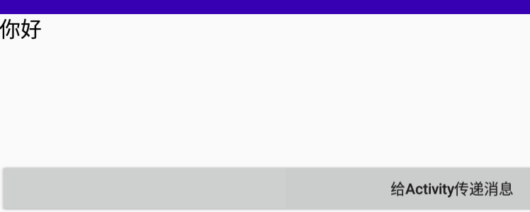
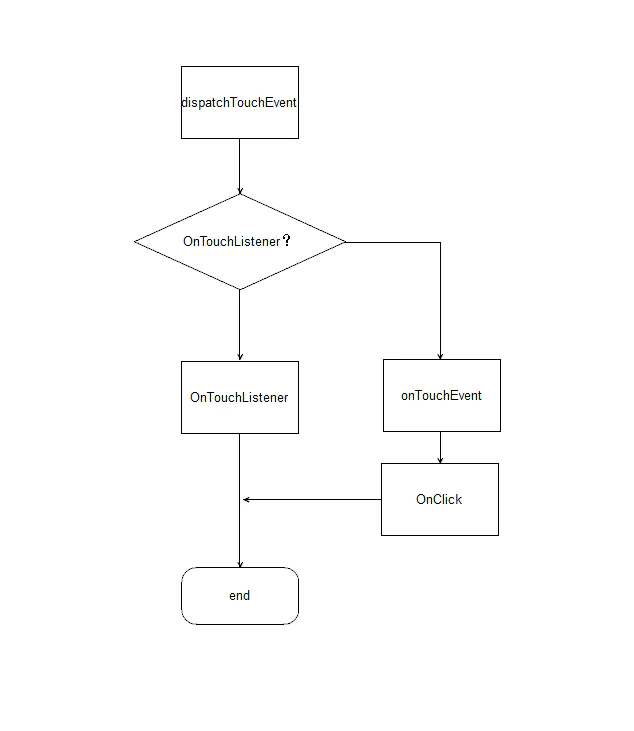
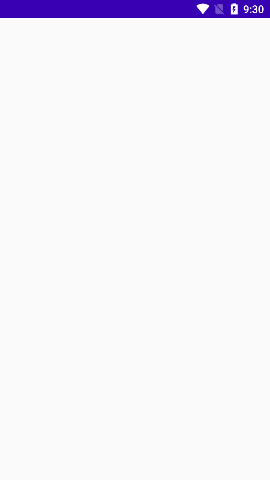
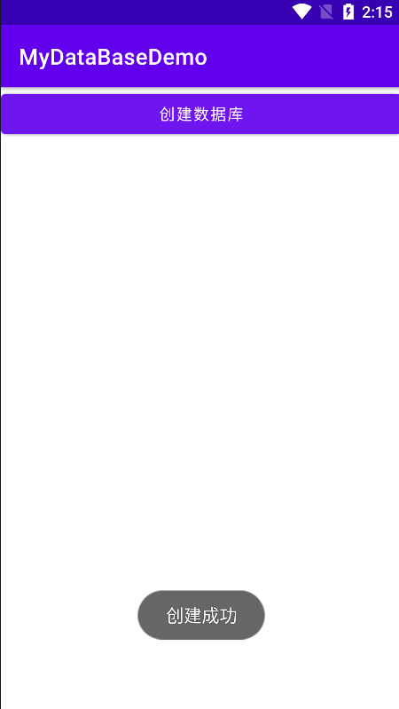

# Android基础

## 一、Android概述

### 1.1Android概述

- Android是Google开发的操作系统
- 主要是移动应用开发的表现形式之一，其他移动应用的开发比如：iOS、H5 App、ionic等


### 1.2完整项目最精简的流程

- Android-->接口-->数据库-->接口-->Android


### 1.3Android开发工具

- Android Studio


### 1.4第一个Android应用

1. 新建一个项目

   

2. 选择布局

   

3. 设置项目名和Android版本

   

4. 完成

   

5. 目录文件

   

   AndroidManifest.xml：用于注册应用中用到的所有的Activity

   build.gradle：用来定义SDK的版本、工具的版本、版本号等，依赖的库

6. 运行

   


## 二、UI组件—基础组件

### 2.1布局管理器

#### 2.1.1线性布局（LinearLayout）

最常用的属性

| 属性                   | 介绍                   |
| ---------------------- | ---------------------- |
| android:id             | 标识                   |
| android:layout_width   | 宽度                   |
| android:layout_height  | 高度                   |
| android:background     | 背景                   |
| android:layout_margin  | 外边距                 |
| android:layout_padding | 内边距                 |
| android:orientation    | 控件中内容的布局方向   |
| android:gravity        | 内容元素排放的对齐方式 |

默认的布局文件：


修改布局文件：

```xml
<?xml version="1.0" encoding="utf-8"?>
<!--
    LinearLayout线性布局默认是水平方向排列，如果需要垂直方向排列需要在标签中添加设置android:orientation的属性为vertical
-->
<LinearLayout xmlns:android="http://schemas.android.com/apk/res/android"
    xmlns:app="http://schemas.android.com/apk/res-auto"
    xmlns:tools="http://schemas.android.com/tools"
    android:layout_width="match_parent"
    android:layout_height="match_parent"
    android:orientation="vertical"
    tools:context=".MainActivity">


    <!--
        android:id——————唯一标识符
        android:layout_width——————宽度:
                                  wrap_content表示包含内容，宽度就是内容的多少;
                                  match_parent表示父控件的宽度;
                                  自定义宽度:XXXdp
        android:layout_height——————高度:
                                  wrap_content表示包含内容，高度就是内容的多少;
                                  match_parent表示父控件的高度;
                                  自定义宽度:XXXdp
        android:orientation——————该控件中内容的布局方向:
                                  vertical表示垂直方向;
                                  horizontal表示水平方向
        android:background——————背景
        android:padding——————内边距
        android:margin——————外边距
    -->
    <LinearLayout
        android:id="@+id/ll_1"
        android:layout_width="200dp"
        android:layout_height="200dp"
        android:orientation="vertical"
        android:background="@color/black"
        android:paddingLeft="20dp"
        android:paddingRight="20dp"
        android:paddingTop="20dp"
        android:paddingBottom="20dp"
        android:layout_marginBottom="20dp"
        >

    <!--
        View是所有控件的父类
    -->
        <View
            android:layout_width="match_parent"
            android:layout_height="match_parent"
            android:background="#FF0033"
            >
        </View>
    </LinearLayout>

    <!--
        当父控件的宽度被占用了200dp时，即使该控件的宽度选择了match_parent，也只会占用剩余的所有宽度，不会占用全部宽度
        android:gravity——————内容元素排放的对齐方式:
                             bottom:左下角
                             right:右上角
                             center:垂直水平居中
                             center_vertical:垂直居中
                             center_horizontal:水平居中
     -->
    <LinearLayout
        android:layout_width="match_parent"
        android:layout_height="200dp"
        android:orientation="horizontal"
        android:background="#0066FF"
        android:layout_marginLeft="15dp"
        android:layout_marginRight="15dp"
        android:gravity="center"
        >
        <!--
            由于父控件的内容布局方式为水平方向，所以该view控件会在左上角的位置
        -->
        <View
            android:layout_width="50dp"
            android:layout_height="50dp"
            android:background="#FFFFFF"
            >
        </View>
    </LinearLayout>

</LinearLayout>
```


##### 2.1.1.1在一个线性布局中实现左右分割

1. 方法一：在父控件中给定宽度，两个子控件各占一半

   ```xml
   <LinearLayout
       android:layout_width="400dp"
       android:layout_height="200dp"
       android:orientation="horizontal"
       android:background="#0066FF"
       android:gravity="center"
       >
       <View
             android:layout_width="200dp"
             android:layout_height="100dp"
             android:background="#FFFFFF"
             >
       </View>
       <View
             android:layout_width="200dp"
             android:layout_height="100dp"
             android:background="#000000"
             >
       </View>
   </LinearLayout>
   ```

   

2. 方法二：权重

   ```xml
   <LinearLayout
       android:layout_width="400dp"
       android:layout_height="200dp"
       android:orientation="horizontal"
       android:background="#0066FF"
       android:gravity="center"
       >
       <!--
               将两个控件的宽度都设置为0，并且权重值都设为1，当权重值相等时，就会各占一半的宽度
               权重：
               假设父控件的宽度为1，通过权重比例来平分控件的宽度
               如果宽度不给设置为0，则会先为子控件赋予设置好的宽度，并在此基础上父控件剩余的宽度来划分权重
           -->
       <View
             android:layout_width="10dp"
             android:layout_height="100dp"
             android:background="#FFFFFF"
             android:layout_weight="1"
             >
       </View>
       <View
             android:layout_width="0dp"
             android:layout_height="100dp"
             android:background="#000000"
             android:layout_weight="1"
             >
       </View>
       <View
             android:layout_width="0dp"
             android:layout_height="100dp"
             android:background="#FF0033"
             android:layout_weight="1"
             >
       </View>
   </LinearLayout>
   ```

#### 2.1.2相对布局（RelativeLayout）

相对布局包含线性布局的所有属性，在此之外还包括以下特有的属性

| 属性                             | 介绍             |
| -------------------------------- | ---------------- |
| android:layout_toLeftOf          | 在谁的左边       |
| android:layout_toRightOf         | 在谁的右边       |
| android:layout_alignBottom       | 和谁底部对齐     |
| android:layout_alignParentBottom | 和父控件底部对齐 |
| android:layout_below             | 在谁的下边       |

将配置文件标签修改为相对布局

```xml
<?xml version="1.0" encoding="utf-8"?>
<!--
    LinearLayout线性布局默认是水平方向排列，如果需要垂直方向排列需要在标签中添加设置android:orientation的属性为vertical
-->
<RelativeLayout xmlns:android="http://schemas.android.com/apk/res/android"
    xmlns:tools="http://schemas.android.com/tools"
    android:layout_width="match_parent"
    android:layout_height="match_parent"
    tools:context=".MainActivity">

    <!--
        android:layout_alignParentBottom——————设置为靠父控件的底部对齐
        android:layout_alignParentRight——————设置为靠父控件的右部对齐
    -->
    <View
        android:id="@+id/rl_1"
        android:layout_width="100dp"
        android:layout_height="100dp"
        android:background="#000000"
        android:layout_alignParentRight="true"
        >
    </View>

    <!--
        android:layout_toLeftOf——————将该控件设置到谁的左边
        android:layout_toRightOf——————将该控件设置到谁的右边
    -->
    <View
        android:id="@+id/rl_2"
        android:layout_width="100dp"
        android:layout_height="100dp"
        android:background="#FF0033"
        android:layout_toLeftOf="@id/rl_1"
        >
    </View>
    <!--
		android:layout_below——————将该控件设置到谁的下边
    -->
    <View
        android:id="@+id/rl_3"
        android:layout_width="100dp"
        android:layout_height="100dp"
        android:background="#0066FF"
        android:layout_below="@id/rl_1"
        android:layout_alignParentRight="true"
        >
    </View>
</RelativeLayout>
```


#### 2.1.3布局的嵌套

```xml
<?xml version="1.0" encoding="utf-8"?>
<!--
    LinearLayout线性布局默认是水平方向排列，如果需要垂直方向排列需要在标签中添加设置android:orientation的属性为vertical
-->
<RelativeLayout xmlns:android="http://schemas.android.com/apk/res/android"
    xmlns:tools="http://schemas.android.com/tools"
    android:layout_width="match_parent"
    android:layout_height="match_parent"
    tools:context=".MainActivity">

    <LinearLayout
        android:id="@+id/ll_1"
        android:layout_width="match_parent"
        android:layout_height="200dp"
        android:background="#FF0033"
        android:orientation="horizontal"
        android:padding="15dp"
        >
        <View
            android:id="@+id/view_1"
            android:layout_width="100dp"
            android:layout_height="match_parent"
            android:background="#0066FF">
        </View>
        <RelativeLayout
            android:id="@+id/rl_1"
            android:layout_width="match_parent"
            android:layout_height="match_parent"
            android:background="#000000"
            android:padding="15dp"
            >
            <View
                android:id="@+id/view_2"
                android:layout_width="100dp"
                android:layout_height="match_parent"
                android:background="#FF9900"
                >
            </View>
            <View
                android:id="@+id/view_3"
                android:layout_width="100dp"
                android:layout_height="match_parent"
                android:background="#0066FF"
                android:layout_marginLeft="10dp"
                android:layout_toRightOf="@id/view_2"
                >
            </View>
        </RelativeLayout>
    </LinearLayout>
</RelativeLayout>
```


### 2.2TextView

主要用于设置文字的内容、大小、颜色等

先在布局的配置文件中添加一个按钮

```xml
<?xml version="1.0" encoding="utf-8"?>
<!--
    LinearLayout线性布局默认是水平方向排列，如果需要垂直方向排列需要在标签中添加设置android:orientation的属性为vertical
-->
<LinearLayout xmlns:android="http://schemas.android.com/apk/res/android"
    xmlns:tools="http://schemas.android.com/tools"
    android:layout_width="match_parent"
    android:layout_height="match_parent"
    tools:context=".MainActivity"
    android:orientation="vertical"
    >

    <Button
        android:id="@+id/btn_textview"
        android:layout_width="match_parent"
        android:layout_height="wrap_content"
        android:text="TextView"
        >
    </Button>

</LinearLayout>
```

在入口方法中添加一个Button组件变量，并为该组件初始化，为其添加一个单击事件

```java
package com.feng.myapp;

import androidx.appcompat.app.AppCompatActivity;

import android.os.Bundle;
import android.view.View;
import android.widget.Button;

public class MainActivity extends AppCompatActivity {

    // 声明Button组件
    private Button mBtnTextView;

    @Override
    protected void onCreate(Bundle savedInstanceState) {
        super.onCreate(savedInstanceState);
        setContentView(R.layout.activity_main);
        // 使用findViewById()方法通过布局配置文件中配置的组件id来找到该组件
        mBtnTextView = findViewById(R.id.btn_textview);
        // 添加一个点击事件
        mBtnTextView.setOnClickListener(new View.OnClickListener() {
            @Override
            public void onClick(View v) {
                // 跳转到TextView演示页面

            }
        });
    }
}
```

新建一个Empty Activity


**注意：每个activity需要在AndroidManifest.xml文件中声明。**

```xml
<?xml version="1.0" encoding="utf-8"?>
<manifest xmlns:android="http://schemas.android.com/apk/res/android"
    xmlns:tools="http://schemas.android.com/tools"
    package="com.feng.myapp">

    <application
        android:allowBackup="true"
        android:icon="@mipmap/ic_launcher"
        android:label="@string/app_name"
        android:roundIcon="@mipmap/ic_launcher_round"
        android:supportsRtl="true"
        android:theme="@style/Theme.MyApp">
        <!-- AS中自动声明 -->
        <activity android:name=".TextViewActivity"></activity>
        <activity android:name=".MainActivity">
            <intent-filter>
                <action android:name="android.intent.action.MAIN" />

                <category android:name="android.intent.category.LAUNCHER" />
            </intent-filter>
        </activity>
    </application>

</manifest>
```

完善MainActivity.java代码

```java
package com.feng.myapp;

import androidx.appcompat.app.AppCompatActivity;

import android.content.Intent;
import android.os.Bundle;
import android.view.View;
import android.widget.Button;

public class MainActivity extends AppCompatActivity {

    // 声明Button组件
    private Button mBtnTextView;

    @Override
    protected void onCreate(Bundle savedInstanceState) {
        super.onCreate(savedInstanceState);
        setContentView(R.layout.activity_main);
        // 使用findViewById()方法通过布局配置文件中配置的组件id来找到该组件
        mBtnTextView = findViewById(R.id.btn_textview);
        // 添加一个点击事件
        mBtnTextView.setOnClickListener(new View.OnClickListener() {
            @Override
            public void onClick(View v) {
                // 跳转到TextView演示页面
                Intent intent = new Intent(MainActivity.this, TextViewActivity.class);
                startActivity(intent);
            }
        });
    }
}
```

在values/strings.xml文件中添加需要使用的文字

```xml
<resources>
    <string name="app_name">MyApp</string>
    <string name="tv_test1">梦开始的地方！</string>
</resources>
```

完善TextViewActivity演示页面对应的布局配置文件中的代码

```xml
<?xml version="1.0" encoding="utf-8"?>
<LinearLayout xmlns:android="http://schemas.android.com/apk/res/android"
    xmlns:tools="http://schemas.android.com/tools"
    android:layout_width="match_parent"
    android:layout_height="match_parent"
    tools:context=".TextViewActivity"
    android:orientation="vertical"
    >

    <!--
        android:text——————文字内容:可以设置为strings.xml文件中的name;也可以直接输入文字
        android:textColor——————文字颜色
        android:textSize——————文字大小:XXXsp
    -->
    <TextView
        android:id="@+id/tv_1"
        android:layout_width="wrap_content"
        android:layout_height="wrap_content"
        android:text="@string/tv_test1"
        android:textColor="#0066FF"
        android:textSize="30sp"
        >
    </TextView>

</LinearLayout>
```


#### 2.2.1当文字比宽度大时，显示...

```xml
    <!--
        android:maxLines——————表示显示的最大行数
        android:ellipsize——————当文字内容多于控件的宽度时:
                               end:省略号在结尾
                               start:省略号在开头
                               middle:省略号在中间
                               marquee:跑马灯
     -->
    <TextView
        android:id="@+id/tv_2"
        android:layout_width="400px"
        android:layout_height="wrap_content"
        android:text="梦开始的地方"
        android:maxLines="1"
        android:ellipsize="middle"
        android:textColor="#0066FF"
        android:textSize="30sp"
        >
    </TextView>
```


#### 2.2.2文字+icon

在网上下好icon图标素材，放入drawable文件夹下。


```xml
<!--
	android:drawableRight——————在文字的右边添加图标
	android:drawablePadding——————设置图标距离文字的距离
-->
<TextView
          android:id="@+id/tv_4"
          android:layout_width="wrap_content"
          android:layout_height="wrap_content"
          android:text="筛选"
          android:drawableRight="@drawable/icon_put_down"
          android:drawablePadding="5dp"
          android:textColor="#0066FF"
          android:textSize="30sp"
          android:layout_marginTop="10dp"
          >
</TextView>
```


#### 2.2.3中划线和下划线

先定义一段文字

```xml
    <TextView
        android:id="@+id/tv_5"
        android:layout_width="wrap_content"
        android:layout_height="wrap_content"
        android:text="@string/tv_test1"
        android:textColor="#0066FF"
        android:textSize="30sp"
        android:layout_marginTop="10dp"
        >
    </TextView>
```

在TextViewActivity.java中实现中划线效果

```java
package com.feng.myapp;

import androidx.appcompat.app.AppCompatActivity;

import android.graphics.Paint;
import android.os.Bundle;
import android.widget.TextView;

public class TextViewActivity extends AppCompatActivity {

    private TextView textView;

    @Override
    protected void onCreate(Bundle savedInstanceState) {
        super.onCreate(savedInstanceState);
        setContentView(R.layout.activity_text_view);
        textView = findViewById(R.id.tv_5);
        // 添加中划线
        textView.getPaint().setFlags(Paint.STRIKE_THRU_TEXT_FLAG);
        // 去除锯齿
        textView.getPaint().setAntiAlias(true);
    }
}
```


同样的方法，修改java文件

```java
package com.feng.myapp;

import androidx.appcompat.app.AppCompatActivity;

import android.graphics.Paint;
import android.os.Bundle;
import android.widget.TextView;

public class TextViewActivity extends AppCompatActivity {

    private TextView textView;

    @Override
    protected void onCreate(Bundle savedInstanceState) {
        super.onCreate(savedInstanceState);
        setContentView(R.layout.activity_text_view);
        textView = findViewById(R.id.tv_5);
        // 添加下划线
        textView.getPaint().setFlags(Paint.UNDERLINE_TEXT_FLAG);
        // 去除锯齿
        textView.getPaint().setAntiAlias(true);
    }
}
```


#### 2.2.4跑马灯

```xml
<!--
        android:ellipsize="marquee"——————表示该段文字有跑马灯的效果
        android:singleLine="true"——————要实现跑马灯效果，则必须添加该行属性表示只有一行，并设置为true
        android:marqueeRepeatLimit——————表示循环的次数，marquee_forever表示一直
        跑马灯效果需要获得焦点才能实现，因此需要将focusable和focusableInTouchMode两个属性设置为true
     -->
    <TextView
        android:id="@+id/tv_7"
        android:layout_width="wrap_content"
        android:layout_height="wrap_content"
        android:text="梦开始的地方梦开始的地方梦开始的地方梦开始的地方梦开始的地方梦开始的地方"
        android:textColor="#0066FF"
        android:textSize="30sp"
        android:layout_marginTop="10dp"
        android:ellipsize="marquee"
        android:singleLine="true"
        android:marqueeRepeatLimit="marquee_forever"
        android:focusable="true"
        android:focusableInTouchMode="true"
        >
    </TextView>
```


### 2.3Button

#### 2.3.1设置按钮的颜色以及文字的颜色大小

```xml
<!--
    设置文字的大小和颜色以及按钮的背景颜色
-->
<Button
    android:id="@+id/btn_1"
    android:layout_width="match_parent"
    android:layout_height="50dp"
    android:text="按钮1"
    android:textSize="20dp"
    android:textColor="#FFFFFF"
    android:backgroundTint="#FF0000"
    >
</Button>
```


#### 2.3.2设置圆角效果

先创建一个按钮

```xml
<Button
        android:id="@+id/btn_2"
        android:layout_width="match_parent"
        android:layout_height="50dp"
        android:text="按钮1"
        android:textSize="20dp"
        android:textColor="#FFFFFF"
        android:backgroundTint="#FF0000"
        android:layout_below="@id/btn_1"
        >
</Button>
```

在drawable文件夹中创建自定义xml文件


```xml
<?xml version="1.0" encoding="utf-8"?>
<shape xmlns:android="http://schemas.android.com/apk/res/android"
    android:shape="rectangle">

    <!--
        solid——————设置填充颜色
        corners——————设置圆角
    -->
    <solid android:color="#FF9900"/>
    <corners android:radius="15dp"/>
</shape>
```


#### 2.3.3设置只有描边的按钮

```xml
    <!--
        只有描边的按钮
    -->
    <Button
        android:id="@+id/btn_3"
        android:layout_width="match_parent"
        android:layout_height="50dp"
        android:text="按钮3"
        android:textSize="20dp"
        android:textColor="#FF9900"
        android:background="@drawable/bg_btn3"
        android:layout_below="@id/btn_2"
        android:layout_marginTop="10dp"
        >
    </Button>
```

drawable中的xml文件

```xml
<?xml version="1.0" encoding="utf-8"?>
<shape xmlns:android="http://schemas.android.com/apk/res/android"
    android:shape="rectangle">

    <!--
        stroke——————设置描边的宽度
    -->
    <stroke android:width="1dp"
            android:color="#FF9900"/>

    <corners android:radius="10dp"/>
</shape>
```


#### 2.3.4设置按钮按下的效果

先创建一个按钮

```xml
<!--
    按下效果
-->
<Button
        android:id="@+id/btn_4"
        android:layout_width="match_parent"
        android:layout_height="50dp"
        android:text="按钮4"
        android:textSize="20dp"
        android:textColor="#FFFFFF"
        android:backgroundTint="#FF0000"
        android:layout_below="@id/btn_3"
        android:layout_marginTop="10dp"
        >
</Button>
```

在drawable中创建一个xml文件，选择selector

```xml
<?xml version="1.0" encoding="utf-8"?>
<selector xmlns:android="http://schemas.android.com/apk/res/android">

    <!--按压时-->
    <item android:state_pressed="true">
        <shape>
            <solid android:color="#CC7A00" />
            <corners android:radius="15dp" />
        </shape>
    </item>

    <!--没有按压时-->
    <item android:state_pressed="false">
        <shape>
            <solid android:color="#FF9900" />
            <corners android:radius="15dp" />
        </shape>
    </item>

</selector>
```


#### 2.3.5点击事件

方法一：在布局xml文件中，添加onClick属性并给定方法名，在activity文件中，给出方法实现**（不常用）**

```xml
 <!--
        点击事件
        需要添加android:onClick属性，给定函数名
    -->
    <Button
        android:id="@+id/btn_5"
        android:layout_width="match_parent"
        android:layout_height="50dp"
        android:text="按钮5"
        android:textSize="20sp"
        android:textColor="#FFFFFF"
        android:background="@drawable/bg_btn4"
        android:layout_below="@id/btn_4"
        android:onClick="showToast"
        android:layout_marginTop="10dp"
        >
    </Button>
```

在activity中给出方法实现

```java
public class ButtonActivity extends AppCompatActivity {

    @Override
    protected void onCreate(Bundle savedInstanceState) {
        super.onCreate(savedInstanceState);
        setContentView(R.layout.activity_button);
    }

    public void showToast(View view){
        Toast.makeText(ButtonActivity.this, "点击成功", Toast.LENGTH_SHORT).show();
    }
}
```


方法二：直接在activity文件中为按钮添加监听器

```java
public class ButtonActivity extends AppCompatActivity {

    private Button btn4;

    @Override
    protected void onCreate(Bundle savedInstanceState) {
        super.onCreate(savedInstanceState);
        setContentView(R.layout.activity_button);
        btn4 = findViewById(R.id.btn_4);
        btn4.setOnClickListener(new View.OnClickListener() {
            @Override
            public void onClick(View v) {
                Toast.makeText(ButtonActivity.this, "按钮4点击成功", Toast.LENGTH_SHORT).show();
            }
        });
    }
}
```


### 2.4EditText

#### 2.4.1基本属性

```xml
<EditText
          android:id="@+id/et_1"
          android:layout_width="match_parent"
          android:layout_height="50dp"
          android:textSize="15sp"
          android:textColor="#FFAD33"
          android:hint="请输入用户名"
          />
```


#### 2.4.2密码

```xml
<!--
	通过android:inputType——————可以设置输入内容的限制：只能输入数字等...
-->    
<EditText
        android:id="@+id/et_2"
        android:layout_width="match_parent"
        android:layout_height="50dp"
        android:textSize="15sp"
        android:textColor="#FFAD33"
        android:hint="请输入密码"
        android:inputType="textPassword"
        android:layout_below="@id/et_1"
        android:layout_marginTop="15dp"
        />
```


#### 2.4.3更改输入框样式实现登录界面

```xml
<?xml version="1.0" encoding="utf-8"?>
<RelativeLayout xmlns:android="http://schemas.android.com/apk/res/android"
    xmlns:app="http://schemas.android.com/apk/res-auto"
    xmlns:tools="http://schemas.android.com/tools"
    android:layout_width="match_parent"
    android:layout_height="match_parent"
    android:padding="10dp"
    tools:context=".EditTextActivity">

    <EditText
        android:id="@+id/et_1"
        android:layout_width="match_parent"
        android:layout_height="50dp"
        android:textSize="15sp"
        android:textColor="#FFAD33"
        android:background="@drawable/bg_username"
        android:paddingLeft="10dp"
        android:paddingRight="10dp"
        android:maxLines="1"
        android:drawableLeft="@drawable/icon_username"
        android:drawablePadding="5dp"
        android:hint="请输入用户名"
        />

    <EditText
        android:id="@+id/et_2"
        android:layout_width="match_parent"
        android:layout_height="50dp"
        android:textSize="15sp"
        android:textColor="#FFAD33"
        android:hint="请输入密码"
        android:inputType="textPassword"
        android:background="@drawable/bg_username"
        android:paddingLeft="10dp"
        android:paddingRight="10dp"
        android:maxLines="1"
        android:drawableLeft="@drawable/icon_password"
        android:drawablePadding="5dp"
        android:layout_below="@id/et_1"
        android:layout_marginTop="15dp"
        />

    <Button
        android:id="@+id/btn_login"
        android:layout_width="match_parent"
        android:layout_height="40dp"
        android:layout_below="@id/et_2"
        android:layout_marginTop="40dp"
        android:background="@drawable/bg_btn4"
        android:text="登录"
        android:textColor="#FFFFFF"
        android:textSize="20sp"
        />
</RelativeLayout>
```

```xml
<?xml version="1.0" encoding="utf-8"?>
<shape xmlns:android="http://schemas.android.com/apk/res/android"
    android:shape="rectangle">

    <stroke android:color="#999999"
            android:width="1dp"/>
    <corners android:radius="10dp" />
</shape>
```

 


#### 2.4.4为输入框添加监听事件

```java
public class EditTextActivity extends AppCompatActivity {

    private EditText editTextUsername;

    @Override
    protected void onCreate(Bundle savedInstanceState) {
        super.onCreate(savedInstanceState);
        setContentView(R.layout.activity_edit_text);
        editTextUsername = findViewById(R.id.et_1);
        editTextUsername.addTextChangedListener(new TextWatcher() {

            /*
                在文字改变之前
             */
            @Override
            public void beforeTextChanged(CharSequence s, int start, int count, int after) {

            }

            /*
                在文字改变中
             */
            @Override
            public void onTextChanged(CharSequence s, int start, int before, int count) {
                Log.d("editText", s.toString());
            }

            /*
                在文字改变后
             */
            @Override
            public void afterTextChanged(Editable s) {

            }
        });
    }
}
```


### 2.5RadioButton

#### 2.5.1基本属性

```xml
<?xml version="1.0" encoding="utf-8"?>
<RelativeLayout xmlns:android="http://schemas.android.com/apk/res/android"
    xmlns:app="http://schemas.android.com/apk/res-auto"
    xmlns:tools="http://schemas.android.com/tools"
    android:layout_width="match_parent"
    android:layout_height="match_parent"
    android:padding="15dp"
    tools:context=".RadioButtonActivity">

    <RadioGroup
        android:id="@+id/rg_1"
        android:layout_width="wrap_content"
        android:layout_height="wrap_content"
        android:orientation="vertical"
        >

        <!--
            如果设置android:checked为true，那么必须为每一个按钮设置id
        -->
        <RadioButton
            android:id="@+id/rb_1"
            android:layout_width="wrap_content"
            android:layout_height="wrap_content"
            android:text="男"
            android:checked="true"
            android:textSize="18sp"
            android:textColor="#FF6600"
            />

        <RadioButton
            android:id="@+id/rb_2"
            android:layout_width="wrap_content"
            android:layout_height="wrap_content"
            android:text="女"
            android:textSize="18sp"
            android:textColor="#FF6600"
            />
    </RadioGroup>

</RelativeLayout>
```


#### 2.5.2为按钮设置自定义样式

```xml
<RadioGroup
        android:id="@+id/rg_2"
        android:layout_width="wrap_content"
        android:layout_height="wrap_content"
        android:orientation="horizontal"
        android:layout_below="@id/rg_1"
        android:layout_marginTop="50dp"
        >

        <RadioButton
            android:id="@+id/rb_3"
            android:layout_width="70dp"
            android:layout_height="wrap_content"
            android:text="男"
            android:gravity="center"
            android:button="@null"
            android:checked="true"
            android:background="@drawable/selector_orange"
            android:textSize="18sp"
            android:textColor="#FFFFFF"
            android:layout_marginRight="15dp"
            />

        <RadioButton
            android:id="@+id/rb_4"
            android:layout_width="70dp"
            android:layout_height="wrap_content"
            android:text="女"
            android:gravity="center"
            android:button="@null"
            android:background="@drawable/selector_orange"
            android:textSize="18sp"
            android:textColor="#FFFFFF"
            />
    </RadioGroup>
```

自定义样式xml

```xml
<?xml version="1.0" encoding="utf-8"?>
<selector xmlns:android="http://schemas.android.com/apk/res/android">

    <!--按压时-->
    <item android:state_checked="true">
        <shape>
            <solid android:color="#CC7A00" />
            <corners android:radius="15dp" />
        </shape>
    </item>

    <!--没有按压时-->
    <item android:state_checked="false">
        <shape>
            <solid android:color="#FF9900" />
            <corners android:radius="15dp" />
        </shape>
    </item>

</selector>
```


#### 2.5.3为其添加监听事件

```java
package com.feng.myapp;

import androidx.appcompat.app.AppCompatActivity;

import android.os.Bundle;
import android.widget.RadioButton;
import android.widget.RadioGroup;
import android.widget.Toast;

public class RadioButtonActivity extends AppCompatActivity {

    private RadioGroup mRg1;

    @Override
    protected void onCreate(Bundle savedInstanceState) {
        super.onCreate(savedInstanceState);
        setContentView(R.layout.activity_radio_button);
        mRg1.setOnCheckedChangeListener(new RadioGroup.OnCheckedChangeListener() {
            @Override
            public void onCheckedChanged(RadioGroup group, int checkedId) {
                RadioButton radioButton = group.findViewById(checkedId);
                Toast.makeText(RadioButtonActivity.this, radioButton.getText(), Toast.LENGTH_SHORT).show();
            }
        });
    }
}
```


### 2.6CheckBox

#### 2.6.1基本属性

```xml
<?xml version="1.0" encoding="utf-8"?>
<RelativeLayout xmlns:android="http://schemas.android.com/apk/res/android"
    xmlns:app="http://schemas.android.com/apk/res-auto"
    xmlns:tools="http://schemas.android.com/tools"
    android:layout_width="match_parent"
    android:layout_height="match_parent"
    tools:context=".CheckBoxActivity"
    android:padding="15dp">

    
    <CheckBox
        android:id="@+id/cb_1"
        android:layout_width="wrap_content"
        android:layout_height="wrap_content" 
        android:text="Java"
        android:textSize="20sp"
        />

    <CheckBox
        android:id="@+id/cb_2"
        android:layout_width="wrap_content"
        android:layout_height="wrap_content"
        android:text="C++"
        android:textSize="20sp"
        android:layout_below="@id/cb_1"
        />

    <CheckBox
        android:id="@+id/cb_3"
        android:layout_width="wrap_content"
        android:layout_height="wrap_content"
        android:text="C"
        android:textSize="20sp"
        android:layout_below="@id/cb_2"
        />
</RelativeLayout>
```


#### 2.6.2icon+checkbox

```xml
<?xml version="1.0" encoding="utf-8"?>
<RelativeLayout xmlns:android="http://schemas.android.com/apk/res/android"
    xmlns:app="http://schemas.android.com/apk/res-auto"
    xmlns:tools="http://schemas.android.com/tools"
    android:layout_width="match_parent"
    android:layout_height="match_parent"
    tools:context=".CheckBoxActivity"
    android:padding="15dp">


    <CheckBox
        android:id="@+id/cb_1"
        android:layout_width="wrap_content"
        android:layout_height="wrap_content"
        android:text="Java"
        android:button="@drawable/bg_checkbox"
        android:textSize="20sp"
        />

    <CheckBox
        android:id="@+id/cb_2"
        android:layout_width="wrap_content"
        android:layout_height="wrap_content"
        android:text="C++"
        android:button="@drawable/bg_checkbox"
        android:textSize="20sp"
        android:layout_below="@id/cb_1"
        />

    <CheckBox
        android:id="@+id/cb_3"
        android:layout_width="wrap_content"
        android:layout_height="wrap_content"
        android:text="C"
        android:button="@drawable/bg_checkbox"
        android:textSize="20sp"
        android:layout_below="@id/cb_2"
        />
</RelativeLayout>
```

自定义样式xml

```xml
<?xml version="1.0" encoding="utf-8"?>
<selector xmlns:android="http://schemas.android.com/apk/res/android">
    <item android:state_checked="true" android:drawable="@drawable/icon_select" />
    <item android:state_checked="false" android:drawable="@drawable/icon_unselect" />
</selector>
```


#### 2.6.3为checkBox添加监听事件

```java
public class CheckBoxActivity extends AppCompatActivity {

    private CheckBox checkBox1, checkBox2;

    @Override
    protected void onCreate(Bundle savedInstanceState) {
        super.onCreate(savedInstanceState);
        setContentView(R.layout.activity_check_box);
        checkBox1 = findViewById(R.id.cb_1);
        checkBox2 = findViewById(R.id.cb_2);
        checkBox1.setOnCheckedChangeListener(new CompoundButton.OnCheckedChangeListener() {
            @Override
            public void onCheckedChanged(CompoundButton buttonView, boolean isChecked) {
                Toast.makeText(CheckBoxActivity.this, checkBox1.getText(), Toast.LENGTH_SHORT).show();
            }
        });

        checkBox2.setOnCheckedChangeListener((buttonView, isChecked) -> {
            Toast.makeText(CheckBoxActivity.this, checkBox2.getText(), Toast.LENGTH_SHORT).show();
        });
    }
}
```


### 2.7ImageView

#### 2.7.1基本属性

```xml
<?xml version="1.0" encoding="utf-8"?>
<RelativeLayout xmlns:android="http://schemas.android.com/apk/res/android"
    xmlns:app="http://schemas.android.com/apk/res-auto"
    xmlns:tools="http://schemas.android.com/tools"
    android:layout_width="match_parent"
    android:layout_height="match_parent"
    android:padding="15dp"
    tools:context=".ImageViewActivity">

    <!--
        android:background——————设置背景颜色
        android:src——————设置内容
        android:scaleType——————缩放类型
                                     fitXY:拉伸XY轴，铺满控件
                                     fitCenter:保持宽高比缩放，直至能够完全显示
                                     centerCrop:保持宽高比缩放，直至完全覆盖控件，裁剪显示

    -->
    <ImageView
        android:id="@+id/iv_1"
        android:layout_width="200dp"
        android:layout_height="100dp"
        android:background="#FF9900"
        android:src="@drawable/sfg_2"
        android:scaleType="fitXY"
        />

    <ImageView
        android:id="@+id/iv_2"
        android:layout_width="200dp"
        android:layout_height="100dp"
        android:background="#FF9900"
        android:src="@drawable/sfg_2"
        android:scaleType="fitCenter"
        android:layout_marginTop="15dp"
        android:layout_below="@id/iv_1"
        />

    <ImageView
        android:id="@+id/iv_3"
        android:layout_width="200dp"
        android:layout_height="100dp"
        android:background="#FF9900"
        android:src="@drawable/sfg_2"
        android:scaleType="centerCrop"
        android:layout_marginTop="15dp"
        android:layout_below="@id/iv_2"
        />

    <ImageView
        android:id="@+id/iv_4"
        android:layout_width="200dp"
        android:layout_height="100dp"
        android:background="#FF9900"
        android:scaleType="centerCrop"
        android:layout_marginTop="15dp"
        android:layout_below="@id/iv_3"
        />

</RelativeLayout>
```


#### 2.7.2加载网络图片

通过第三方Glide库来加载网络图片，打开Glide的github


下载方式，jar包，或者通过gradle导入依赖


使用方式


将依赖拷贝到build.gradle中

```gradle
repositories {
    google()
    mavenCentral()
}

dependencies {

    implementation 'androidx.appcompat:appcompat:1.3.0'
    implementation 'com.google.android.material:material:1.4.0'
    implementation 'androidx.constraintlayout:constraintlayout:2.0.4'
    testImplementation 'junit:junit:4.+'
    androidTestImplementation 'androidx.test.ext:junit:1.1.3'
    androidTestImplementation 'androidx.test.espresso:espresso-core:3.4.0'
    implementation 'com.github.bumptech.glide:glide:4.12.0'
    annotationProcessor 'com.github.bumptech.glide:compiler:4.12.0'
}
```

然后同步项目使用

先在AndroidManifest.xml文件中赋予应用的网络权限

```xml
<uses-permission android:name="android.permission.INTERNET" />
```

在activity文件中使用Glide来加载网络图片

```java
package com.feng.myapp;

import androidx.appcompat.app.AppCompatActivity;

import android.os.Bundle;
import android.widget.ImageView;

import com.bumptech.glide.Glide;

public class ImageViewActivity extends AppCompatActivity {

    private ImageView mImageView4;

    @Override
    protected void onCreate(Bundle savedInstanceState) {
        super.onCreate(savedInstanceState);
        setContentView(R.layout.activity_image_view);
        mImageView4 = findViewById(R.id.iv_4);
        Glide.with(this).load("https://www.baidu.com/img/PCfb_5bf082d29588c07f842ccde3f97243ea.png").into(mImageView4);
    }
}
```


### 2.8ListView

#### 2.8.1常用属性

创建一个ListView布局

```xml
<?xml version="1.0" encoding="utf-8"?>
<LinearLayout xmlns:android="http://schemas.android.com/apk/res/android"
    xmlns:app="http://schemas.android.com/apk/res-auto"
    xmlns:tools="http://schemas.android.com/tools"
    android:layout_width="match_parent"
    android:layout_height="match_parent"
    tools:context=".listView.ListViewActivity">
    <ListView
        android:id="@+id/lv_1"
        android:layout_width="match_parent"
        android:layout_height="wrap_content"
        />
</LinearLayout>
```

创建ListView中每个item的布局

````xml
<?xml version="1.0" encoding="utf-8"?>
<LinearLayout xmlns:android="http://schemas.android.com/apk/res/android"
    android:layout_width="match_parent"
    android:layout_height="match_parent"
    android:orientation="horizontal"
    android:paddingLeft="15dp"
    android:paddingRight="15dp"
    android:paddingTop="10dp"
    android:paddingBottom="10dp">

    <ImageView
        android:id="@+id/iv_item"
        android:layout_width="100dp"
        android:layout_height="100dp"
        android:scaleType="centerCrop"
        android:background="#000000"
        />

    <LinearLayout
        android:layout_width="match_parent"
        android:layout_height="match_parent"
        android:orientation="vertical"
        android:paddingLeft="10dp">
        <TextView
            android:id="@+id/tv_title"
            android:layout_width="wrap_content"
            android:layout_height="wrap_content"
            android:text="Hello"
            android:textSize="25sp"
            android:textColor="#000000"
            />

        <TextView
            android:id="@+id/tv_time"
            android:layout_width="wrap_content"
            android:layout_height="wrap_content"
            android:text="2021-07-17"
            android:textSize="20sp"
            android:textColor="#808080"
            android:layout_marginTop="10dp"
            />

    </LinearLayout>
</LinearLayout>
````

创建一个ListView的适配器MyListViewAdaptor.java，它需要继承BaseAdaptor类并实现父类方法

````java
package com.feng.myapp.listView;

import android.content.Context;
import android.view.LayoutInflater;
import android.view.View;
import android.view.ViewGroup;
import android.widget.BaseAdapter;
import android.widget.ImageView;
import android.widget.TextView;

import com.feng.myapp.R;

import java.util.Date;

public class MyListAdaptor extends BaseAdapter {

    private Context mContext;
    // LayoutInflater是一个控件，通过它的from方法设置上下文并实例化，可以找到该布局中的某个控件，与findViewById类似
    private LayoutInflater mLayoutInflater;

    public MyListAdaptor(Context mContext) {
        this.mContext = mContext;
        mLayoutInflater = LayoutInflater.from(mContext);
    }

    @Override
    public int getCount() {
        return 10;
    }

    @Override
    public Object getItem(int position) {
        return null;
    }

    @Override
    public long getItemId(int position) {
        return 0;
    }

    @Override
    public View getView(int position, View convertView, ViewGroup parent) {
        Holder holder = null;
        if (convertView == null){
            convertView = mLayoutInflater.inflate(R.layout.layout_list_item, null);
            holder = new Holder();
            holder.imageView = convertView.findViewById(R.id.iv_item);
            holder.textViewTitle = convertView.findViewById(R.id.tv_title);
            holder.textViewTime = convertView.findViewById(R.id.tv_time);
            convertView.setTag(holder);
        }else {
            holder = (Holder) convertView.getTag();
        }
        holder.imageView.setBackgroundResource(R.drawable.sfg_2);
        holder.textViewTitle.setText("Hello");
        holder.textViewTime.setText(new Date().toString());
        return convertView;
    }

    class Holder{
        public ImageView imageView;
        public TextView textViewTitle, textViewTime;
    }
}

````

在Activity中配置适配器

```java
package com.feng.myapp.listView;

import android.os.Bundle;
import android.view.View;
import android.widget.AdapterView;
import android.widget.ListView;
import android.widget.Toast;

import androidx.appcompat.app.AppCompatActivity;

import com.feng.myapp.R;

public class ListViewActivity extends AppCompatActivity {

    private ListView mListView1;

    @Override
    protected void onCreate(Bundle savedInstanceState) {
        super.onCreate(savedInstanceState);
        setContentView(R.layout.activity_list_view);
        mListView1 = findViewById(R.id.lv_1);
        mListView1.setAdapter(new MyListAdaptor(ListViewActivity.this));
    }
}
```


#### 2.8.2自定义样式

```xml
<?xml version="1.0" encoding="utf-8"?>
<LinearLayout xmlns:android="http://schemas.android.com/apk/res/android"
    xmlns:app="http://schemas.android.com/apk/res-auto"
    xmlns:tools="http://schemas.android.com/tools"
    android:layout_width="match_parent"
    android:layout_height="match_parent"
    tools:context=".listView.ListViewActivity">

    <!--
        android:divider——————设置分割线颜色
        android:dividerHeight——————设置分割线高度
        android:listSelector——————可以自定义按下效果
    -->
    <ListView
        android:id="@+id/lv_1"
        android:layout_width="match_parent"
        android:layout_height="wrap_content"
        android:divider="@color/black"
        android:dividerHeight="2dp"
        android:listSelector="@drawable/list_press"
        />

</LinearLayout>
```

drawable文件

```xml
<?xml version="1.0" encoding="utf-8"?>
<selector xmlns:android="http://schemas.android.com/apk/res/android">
    <item android:state_pressed="true">
        <shape>
            <solid android:color="#00FF66" />
        </shape>
    </item>
    <item android:state_pressed="false">
        <shape>
            <solid android:color="#FFFFFF" />
        </shape>
    </item>
</selector>
```


#### 2.8.3单击事件

```java
package com.feng.myapp.listView;

import android.os.Bundle;
import android.view.View;
import android.widget.AdapterView;
import android.widget.ListView;
import android.widget.Toast;

import androidx.appcompat.app.AppCompatActivity;

import com.feng.myapp.R;

public class ListViewActivity extends AppCompatActivity {

    private ListView mListView1;

    @Override
    protected void onCreate(Bundle savedInstanceState) {
        super.onCreate(savedInstanceState);
        setContentView(R.layout.activity_list_view);
        mListView1 = findViewById(R.id.lv_1);
        mListView1.setAdapter(new MyListAdaptor(ListViewActivity.this));
        mListView1.setOnItemClickListener(new AdapterView.OnItemClickListener() {
            @Override
            public void onItemClick(AdapterView<?> parent, View view, int position, long id) {
                Toast.makeText(ListViewActivity.this, "点击pos:" + position, Toast.LENGTH_SHORT).show();
            }
        });

        mListView1.setOnItemLongClickListener(new AdapterView.OnItemLongClickListener() {
            @Override
            public boolean onItemLongClick(AdapterView<?> parent, View view, int position, long id) {
                Toast.makeText(ListViewActivity.this, "长按pos:" + position, Toast.LENGTH_SHORT).show();
                return false;
            }
        });
    }
}
```


### 2.9GridView

#### 2.9.1常用属性

创建一个GridView布局

```xml
<?xml version="1.0" encoding="utf-8"?>
<LinearLayout xmlns:android="http://schemas.android.com/apk/res/android"
    xmlns:app="http://schemas.android.com/apk/res-auto"
    xmlns:tools="http://schemas.android.com/tools"
    android:layout_width="match_parent"
    android:layout_height="match_parent"
    android:padding="15dp"
    tools:context=".gridView.GridViewActivity">

    <!--
        android:numColumns——————列数
        android:horizontalSpacing——————水平间距
        android:verticalSpacing——————垂直间距
    -->
    <GridView
        android:id="@+id/gv_1"
        android:layout_width="match_parent"
        android:layout_height="wrap_content"
        android:numColumns="3"
        android:horizontalSpacing="10dp"
        android:verticalSpacing="10dp"
        />

</LinearLayout>
```

创建GridView中每个item的布局

```xml
<?xml version="1.0" encoding="utf-8"?>
<LinearLayout xmlns:android="http://schemas.android.com/apk/res/android"
    android:layout_width="match_parent"
    android:layout_height="match_parent"
    android:orientation="vertical"
    android:gravity="center_horizontal"
    >

    <ImageView
        android:id="@+id/iv_grid"
        android:layout_width="match_parent"
        android:layout_height="100dp"
        android:scaleType="fitCenter"
        android:background="@color/black"
        />

    <TextView
        android:id="@+id/tv_grid_title"
        android:layout_width="match_parent"
        android:layout_height="wrap_content"
        android:text="Hello"
        android:textColor="#FF4081"
        android:gravity="center"
        android:layout_marginTop="10dp"
        />
</LinearLayout>
```

创建一个GridView的适配器MyGridViewAdaptor.java，它需要继承BaseAdaptor类并实现父类方法

```java
package com.feng.myapp.gridView;

import android.content.Context;
import android.media.Image;
import android.view.LayoutInflater;
import android.view.View;
import android.view.ViewGroup;
import android.widget.BaseAdapter;
import android.widget.ImageView;
import android.widget.TextView;

import com.feng.myapp.R;

public class MyGridViewAdaptor extends BaseAdapter {

    private LayoutInflater mLayoutInflater;
    private Context mContext;

    public MyGridViewAdaptor(Context mContext) {
        this.mContext = mContext;
        mLayoutInflater = LayoutInflater.from(mContext);
    }

    @Override
    public int getCount() {
        return 10;
    }

    @Override
    public Object getItem(int position) {
        return null;
    }

    @Override
    public long getItemId(int position) {
        return 0;
    }

    @Override
    public View getView(int position, View convertView, ViewGroup parent) {
        Holder holder = null;
        if (convertView == null){
            convertView = mLayoutInflater.inflate(R.layout.layout_grid_item, null);
            holder = new Holder();
            holder.imageView = convertView.findViewById(R.id.iv_grid);
            holder.textView = convertView.findViewById(R.id.tv_grid_title);
            convertView.setTag(holder);
        }else {
            holder = (Holder) convertView.getTag();
        }
        holder.imageView.setBackgroundResource(R.drawable.sfg_2);
        holder.textView.setText("Hello");
        return convertView;
    }

    class Holder{
        ImageView imageView;
        TextView textView;
    }
}

```

在Activity中配置适配器

````java
package com.feng.myapp.gridView;

import androidx.appcompat.app.AppCompatActivity;

import android.os.Bundle;
import android.widget.GridView;

import com.feng.myapp.R;

public class GridViewActivity extends AppCompatActivity {

    private GridView gridView;

    @Override
    protected void onCreate(Bundle savedInstanceState) {
        super.onCreate(savedInstanceState);
        setContentView(R.layout.activity_grid_view);
        gridView = findViewById(R.id.gv_1);
        gridView.setAdapter(new MyGridViewAdaptor(GridViewActivity.this));
    }
}
````


#### 2.9.2单击事件

和ListView一样


### 2.10滚动视图

**垂直滚动：ScrollView**

**水平滚动：HorizontalScrollView**

当内容在当前页面显示不全时，可以使用这两个标签来包含内容布局，这样内容可以通过上下滚动来显示。

**注意：这两个标签只能有一个子元素，所以当滚动的内容元素较多时，可以使用< LinearLayout >来包含后，在外面添加滚动视图。**


### 2.11ReCyclerView

**很重要！！！**

> ReCyclerView能够**灵活**实现大数据集的展示，视图的复用管理比ListView更好，能够展示列表，网格，瀑布流等形式，而且不同的ViewHolder能够实现Item多元化的功能。


#### 2.11.1基本使用

使用ReCyclerView之前，需要先引入依赖，在build.gradle文件中添加

```
implementation 'androidx.recyclerview:recyclerview:1.2.0'
```

创建一个ReCyclerView布局

```xml
<?xml version="1.0" encoding="utf-8"?>
<LinearLayout xmlns:android="http://schemas.android.com/apk/res/android"
    xmlns:app="http://schemas.android.com/apk/res-auto"
    xmlns:tools="http://schemas.android.com/tools"
    android:layout_width="match_parent"
    android:layout_height="match_parent"
    tools:context=".reCyclerView.LinearReCyclerViewActivity">

    <androidx.recyclerview.widget.RecyclerView
        android:id="@+id/rv_main"
        android:layout_width="match_parent"
        android:layout_height="wrap_content"
        android:background="#ADADAD" />

</LinearLayout>
```

创建列表中每个item的布局文件

```xml
<?xml version="1.0" encoding="utf-8"?>
<LinearLayout xmlns:android="http://schemas.android.com/apk/res/android"
    android:layout_width="match_parent"
    android:layout_height="match_parent">
    
    <TextView
        android:id="@+id/tv_linear_title"
        android:layout_width="match_parent"
        android:layout_height="50dp"
        android:gravity="center"
        android:background="#FFF"
        android:textColor="@color/black"
        android:textSize="20sp"
        />

</LinearLayout>
```

创建适配器

```java
package com.feng.myapp.reCyclerView;

import android.content.Context;
import android.view.LayoutInflater;
import android.view.View;
import android.view.ViewGroup;
import android.widget.TextView;

import androidx.annotation.NonNull;
import androidx.recyclerview.widget.RecyclerView;

import com.feng.myapp.R;

public class LinearReCyclerViewAdaptor extends RecyclerView.Adapter<LinearReCyclerViewAdaptor.LinearViewHolder> {

    private LayoutInflater mLayoutInflater;
    private Context mContext;

    public LinearReCyclerViewAdaptor(Context mContext) {
        this.mContext = mContext;
        mLayoutInflater = LayoutInflater.from(mContext);
    }

    @NonNull
    @Override
    public LinearViewHolder onCreateViewHolder(@NonNull  ViewGroup parent, int viewType) {
        View view = mLayoutInflater.inflate(R.layout.layout_linear_item, parent, false);
        return new LinearViewHolder(view);
    }

    @Override
    public void onBindViewHolder(@NonNull  LinearReCyclerViewAdaptor.LinearViewHolder holder, int position) {
        holder.textView.setText("Hello");
    }

    @Override
    public int getItemCount() {
        return 10;
    }

    class LinearViewHolder extends RecyclerView.ViewHolder{

        public TextView textView;

        public LinearViewHolder(@NonNull  View itemView) {
            super(itemView);
            textView = itemView.findViewById(R.id.tv_linear_title);
        }
    }
}
```

在activity中使用

```java
package com.feng.myapp.reCyclerView;

import androidx.appcompat.app.AppCompatActivity;
import androidx.recyclerview.widget.GridLayoutManager;
import androidx.recyclerview.widget.LinearLayoutManager;
import androidx.recyclerview.widget.RecyclerView;
import androidx.recyclerview.widget.StaggeredGridLayoutManager;

import android.os.Bundle;

import com.feng.myapp.R;

public class LinearReCyclerViewActivity extends AppCompatActivity {

    private RecyclerView recyclerView;

    @Override
    protected void onCreate(Bundle savedInstanceState) {
        super.onCreate(savedInstanceState);
        setContentView(R.layout.activity_linear_re_cycler_view);
        recyclerView = findViewById(R.id.rv_main);
        // 使用RecyclerView时需要设置布局格式
        // new LinearLayoutManager()线性布局
        // new GridLayoutManager()网格布局
        // new StaggeredGridLayoutManager()类似瀑布流
        LinearLayoutManager layoutManager = new LinearLayoutManager(LinearReCyclerViewActivity.this);
        recyclerView.setLayoutManager(layoutManager);
        recyclerView.setAdapter(new LinearReCyclerViewAdaptor(LinearReCyclerViewActivity.this));
    }
}
```


#### 2.11.2设置item样式

需要创建一个样式类，该类继承于ItemDecoration，该类中有三个方法onDraw()，onDrawOver()，getItemOffSets()

> onDraw()：
>
> 该方法会在每个Item绘制之前，执行绘制一些内容，所有的Item会覆盖在该内容上面，比如背景等
>
> onDrawOver()：
>
> 该方法会在每个Item绘制之后，执行绘制一些内容，所有的Item会在该内容下面
>
> getItemOffSets()：
>
> 该方法会在Item周边绘制一些内容

通过getItemOffSets()来实现分割线效果

```java
package com.feng.myapp.reCyclerView;

import androidx.annotation.NonNull;
import androidx.appcompat.app.AppCompatActivity;
import androidx.recyclerview.widget.GridLayoutManager;
import androidx.recyclerview.widget.LinearLayoutManager;
import androidx.recyclerview.widget.RecyclerView;
import androidx.recyclerview.widget.StaggeredGridLayoutManager;

import android.graphics.Rect;
import android.os.Bundle;
import android.view.View;

import com.feng.myapp.R;

public class LinearReCyclerViewActivity extends AppCompatActivity {

    private RecyclerView recyclerView;

    @Override
    protected void onCreate(Bundle savedInstanceState) {
        super.onCreate(savedInstanceState);
        setContentView(R.layout.activity_linear_re_cycler_view);
        recyclerView = findViewById(R.id.rv_main);
        // 使用RecyclerView时需要设置布局格式
        // new LinearLayoutManager()线性布局
        // new GridLayoutManager()网格布局
        // new StaggeredGridLayoutManager()类似瀑布流
        LinearLayoutManager layoutManager = new LinearLayoutManager(LinearReCyclerViewActivity.this);
        recyclerView.setLayoutManager(layoutManager);
        // 设置装饰器
        recyclerView.addItemDecoration(new MyDecoration());
        recyclerView.setAdapter(new LinearReCyclerViewAdaptor(LinearReCyclerViewActivity.this));
    }

    class MyDecoration extends RecyclerView.ItemDecoration {
        @Override
        public void getItemOffsets(@NonNull Rect outRect, @NonNull View view, @NonNull RecyclerView parent, @NonNull RecyclerView.State state) {
            super.getItemOffsets(outRect, view, parent, state);
            // 为底部设置1dp的宽度
            outRect.set(0, 0, 0, getResources().getDimensionPixelOffset(R.dimen.dividerHeight));
        }
    }
}
```

```xml
<?xml version="1.0" encoding="utf-8"?>
<resources>
    <dimen name="dividerHeight">1dp</dimen>
</resources>
```


#### 2.11.3设置单击事件

可以在Adaptor中设置单击事件，直接在onBindViewHolder方法中设置

```java
@Override
    public void onBindViewHolder(@NonNull  LinearReCyclerViewAdaptor.LinearViewHolder holder, int position) {
        holder.textView.setText("Hello");
        holder.itemView.setOnClickListener(v -> {
            Toast.makeText(mContext, "单击 pos:" + position, Toast.LENGTH_SHORT).show();
        });
    }
```

如果想在外部使用，可以使用回调方法的方式

````java
package com.feng.myapp.reCyclerView;

import android.content.Context;
import android.view.LayoutInflater;
import android.view.View;
import android.view.ViewGroup;
import android.widget.TextView;
import android.widget.Toast;

import androidx.annotation.NonNull;
import androidx.recyclerview.widget.RecyclerView;

import com.feng.myapp.R;

public class LinearReCyclerViewAdaptor extends RecyclerView.Adapter<LinearReCyclerViewAdaptor.LinearViewHolder> {

    private LayoutInflater mLayoutInflater;
    private Context mContext;
    private OnItemClickListener mOnItemClickListener;

    // 创建接口
    public interface OnItemClickListener{
        void onClick(int pos);
    }

    public LinearReCyclerViewAdaptor(Context mContext, OnItemClickListener onItemClickListener) {
        this.mContext = mContext;
        this.mOnItemClickListener = onItemClickListener;
        mLayoutInflater = LayoutInflater.from(mContext);
    }

    @NonNull
    @Override
    public LinearViewHolder onCreateViewHolder(@NonNull  ViewGroup parent, int viewType) {
        View view = mLayoutInflater.inflate(R.layout.layout_linear_item, parent, false);
        return new LinearViewHolder(view);
    }

    @Override
    public void onBindViewHolder(@NonNull  LinearReCyclerViewAdaptor.LinearViewHolder holder, int position) {
        holder.textView.setText("Hello");
        holder.itemView.setOnClickListener(v -> {
            mOnItemClickListener.onClick(position);
        });
    }

    @Override
    public int getItemCount() {
        return 10;
    }

    class LinearViewHolder extends RecyclerView.ViewHolder{

        public TextView textView;

        public LinearViewHolder(@NonNull  View itemView) {
            super(itemView);
            textView = itemView.findViewById(R.id.tv_linear_title);
        }
    }
}

````

````java
package com.feng.myapp.reCyclerView;

import android.content.Context;
import android.view.LayoutInflater;
import android.view.View;
import android.view.ViewGroup;
import android.widget.TextView;
import android.widget.Toast;

import androidx.annotation.NonNull;
import androidx.recyclerview.widget.RecyclerView;

import com.feng.myapp.R;

public class LinearReCyclerViewAdaptor extends RecyclerView.Adapter<LinearReCyclerViewAdaptor.LinearViewHolder> {

    private LayoutInflater mLayoutInflater;
    private Context mContext;
    private OnItemClickListener mOnItemClickListener;

    // 创建接口
    public interface OnItemClickListener{
        void onClick(int pos);
    }

    public LinearReCyclerViewAdaptor(Context mContext, OnItemClickListener onItemClickListener) {
        this.mContext = mContext;
        this.mOnItemClickListener = onItemClickListener;
        mLayoutInflater = LayoutInflater.from(mContext);
    }

    @NonNull
    @Override
    public LinearViewHolder onCreateViewHolder(@NonNull  ViewGroup parent, int viewType) {
        View view = mLayoutInflater.inflate(R.layout.layout_linear_item, parent, false);
        return new LinearViewHolder(view);
    }

    @Override
    public void onBindViewHolder(@NonNull  LinearReCyclerViewAdaptor.LinearViewHolder holder, int position) {
        holder.textView.setText("Hello");
        holder.itemView.setOnClickListener(v -> {
            mOnItemClickListener.onClick(position);
        });
    }

    @Override
    public int getItemCount() {
        return 10;
    }

    class LinearViewHolder extends RecyclerView.ViewHolder{

        public TextView textView;

        public LinearViewHolder(@NonNull  View itemView) {
            super(itemView);
            textView = itemView.findViewById(R.id.tv_linear_title);
        }
    }
}

````

```java
package com.feng.myapp.reCyclerView;

import androidx.annotation.NonNull;
import androidx.appcompat.app.AppCompatActivity;
import androidx.recyclerview.widget.GridLayoutManager;
import androidx.recyclerview.widget.LinearLayoutManager;
import androidx.recyclerview.widget.RecyclerView;
import androidx.recyclerview.widget.StaggeredGridLayoutManager;

import android.graphics.Rect;
import android.os.Bundle;
import android.view.View;
import android.widget.Toast;

import com.feng.myapp.R;

public class LinearReCyclerViewActivity extends AppCompatActivity {

    private RecyclerView recyclerView;

    @Override
    protected void onCreate(Bundle savedInstanceState) {
        super.onCreate(savedInstanceState);
        setContentView(R.layout.activity_linear_re_cycler_view);
        recyclerView = findViewById(R.id.rv_main);
        // 使用RecyclerView时需要设置布局格式
        // new LinearLayoutManager()线性布局
        // new GridLayoutManager()网格布局
        // new StaggeredGridLayoutManager()不规则网格布局，类似瀑布流
        LinearLayoutManager layoutManager = new LinearLayoutManager(LinearReCyclerViewActivity.this);
        recyclerView.setLayoutManager(layoutManager);
        // 通过回调方法来实现单击事件
        recyclerView.setAdapter(new LinearReCyclerViewAdaptor(LinearReCyclerViewActivity.this, new LinearReCyclerViewAdaptor.OnItemClickListener() {
            @Override
            public void onClick(int pos) {
                Toast.makeText(LinearReCyclerViewActivity.this, "单击 pos:" + pos, Toast.LENGTH_SHORT).show();
            }
        }));
    }
}
```


#### 2.11.4水平滚动效果

只需要在activity中，设置LayoutManager时，为其设置横向布局即可

```java
package com.feng.myapp.reCyclerView;

import androidx.appcompat.app.AppCompatActivity;
import androidx.recyclerview.widget.LinearLayoutManager;
import androidx.recyclerview.widget.RecyclerView;

import android.os.Bundle;
import android.widget.Toast;

import com.feng.myapp.R;

public class HorRecycleViewActivity extends AppCompatActivity {

    private RecyclerView recyclerView;

    @Override
    protected void onCreate(Bundle savedInstanceState) {
        super.onCreate(savedInstanceState);
        setContentView(R.layout.activity_hor_recycle_view);
        recyclerView = findViewById(R.id.rv_hor);
        LinearLayoutManager layoutManager = new LinearLayoutManager(this);
        // 设置为水平方向
        layoutManager.setOrientation(LinearLayoutManager.HORIZONTAL);
        recyclerView.setLayoutManager(layoutManager);
        recyclerView.setAdapter(new HorReCyclerViewAdaptor(HorRecycleViewActivity.this, new HorReCyclerViewAdaptor.OnItemClickListener() {
            @Override
            public void onClick(int pos) {
                Toast.makeText(HorRecycleViewActivity.this, "单击 pos:" + pos, Toast.LENGTH_SHORT).show();
            }
        }));
    }
}
```


#### 2.11.5网格布局效果

设置网格布局效果只需要在activity中创建LayOutManager时指定GridLayOutManger即可

```java
package com.feng.myapp.reCyclerView;

import androidx.appcompat.app.AppCompatActivity;
import androidx.recyclerview.widget.GridLayoutManager;
import androidx.recyclerview.widget.RecyclerView;

import android.os.Bundle;
import android.widget.Toast;

import com.feng.myapp.R;

public class GridRecyclerViewActivity extends AppCompatActivity {

    private RecyclerView recyclerView;

    @Override
    protected void onCreate(Bundle savedInstanceState) {
        super.onCreate(savedInstanceState);
        setContentView(R.layout.activity_grid_recycler_view);
        recyclerView = findViewById(R.id.rv_grid);
        // 每行展示3个
        GridLayoutManager layoutManager = new GridLayoutManager(GridRecyclerViewActivity.this, 3);
        recyclerView.setLayoutManager(layoutManager);
        recyclerView.setAdapter(new GridReCyclerViewAdaptor(GridRecyclerViewActivity.this, new GridReCyclerViewAdaptor.OnItemClickListener() {
            @Override
            public void onClick(int pos) {
                Toast.makeText(GridRecyclerViewActivity.this, "单击 pos:" + pos, Toast.LENGTH_SHORT).show();
            }
        }));
    }
}
```


#### 2.11.6瀑布流效果

设置每个Item的布局

```xml
<?xml version="1.0" encoding="utf-8"?>
<LinearLayout xmlns:android="http://schemas.android.com/apk/res/android"
    android:layout_width="wrap_content"
    android:layout_height="wrap_content">

    <ImageView
        android:id="@+id/iv_pu"
        android:layout_width="wrap_content"
        android:layout_height="wrap_content"
        android:scaleType="centerCrop"
        />

</LinearLayout>
```

在activity中创建StaggeredGridManager

```java
package com.feng.myapp.reCyclerView;

import androidx.appcompat.app.AppCompatActivity;
import androidx.recyclerview.widget.RecyclerView;
import androidx.recyclerview.widget.StaggeredGridLayoutManager;

import android.os.Bundle;
import android.widget.Toast;

import com.feng.myapp.R;

public class PuRecyclerViewActivity extends AppCompatActivity {

    private RecyclerView recyclerView;

    @Override
    protected void onCreate(Bundle savedInstanceState) {
        super.onCreate(savedInstanceState);
        setContentView(R.layout.activity_pu_recycler_view);
        recyclerView = findViewById(R.id.rv_pu);
        // 垂直最多几列，如果是水平那就是最多几行
        StaggeredGridLayoutManager layoutManager = new StaggeredGridLayoutManager(2, StaggeredGridLayoutManager.VERTICAL);
        recyclerView.setLayoutManager(layoutManager);
        recyclerView.setAdapter(new StaggeredGridReCyclerViewAdaptor(PuRecyclerViewActivity.this, new StaggeredGridReCyclerViewAdaptor.OnItemClickListener() {
            @Override
            public void onClick(int pos) {
                Toast.makeText(PuRecyclerViewActivity.this, "单击 pos:" + pos, Toast.LENGTH_SHORT).show();
            }
        }));
    }
}
```

在适配器中通过position的奇偶来设置图片，运行后的结果


#### 2.11.7使用不同的ViewHolder来实现不同的布局

创建两个item布局

```xml
<?xml version="1.0" encoding="utf-8"?>
<LinearLayout xmlns:android="http://schemas.android.com/apk/res/android"
    android:layout_width="match_parent"
    android:layout_height="50dp">

    <TextView
        android:id="@+id/tv_linear_title"
        android:layout_width="match_parent"
        android:layout_height="50dp"
        android:gravity="center"
        android:background="#FFF"
        android:textColor="@color/black"
        android:textSize="20sp"
        />

</LinearLayout>
```

```xml
<?xml version="1.0" encoding="utf-8"?>
<LinearLayout xmlns:android="http://schemas.android.com/apk/res/android"
    android:layout_width="match_parent"
    android:layout_height="wrap_content"
    android:orientation="vertical"
    android:gravity="center">

    <TextView
        android:id="@+id/tv_linear_title"
        android:layout_width="match_parent"
        android:layout_height="50dp"
        android:background="#FFF"
        android:textColor="@color/black"
        android:textSize="20sp"
        />

    <ImageView
        android:id="@+id/iv_linear_img"
        android:layout_width="wrap_content"
        android:layout_height="wrap_content"
        android:scaleType="centerCrop"
        />
</LinearLayout>
```

通过Adaptor中的getItemViewType()方法可以返回不同的ViewType，然后在onCreateViewHolder()方法中，对形参ViewType进行判断，即可进行不同的视图布局

```java
package com.feng.myapp.reCyclerView;

import android.content.Context;
import android.util.Log;
import android.view.LayoutInflater;
import android.view.View;
import android.view.ViewGroup;
import android.widget.ImageView;
import android.widget.TextView;

import androidx.annotation.NonNull;
import androidx.recyclerview.widget.RecyclerView;

import com.feng.myapp.R;

public class LinearReCyclerViewAdaptor extends RecyclerView.Adapter<RecyclerView.ViewHolder> {

    private final String TAG = this.getClass().getSimpleName();
    private LayoutInflater mLayoutInflater;
    private Context mContext;

    public LinearReCyclerViewAdaptor(Context mContext) {
        this.mContext = mContext;
        mLayoutInflater = LayoutInflater.from(mContext);
    }

    @NonNull
    @Override
    public RecyclerView.ViewHolder onCreateViewHolder(@NonNull  ViewGroup parent, int viewType) {
        View view = null;
        if (viewType == 0) {
            view = mLayoutInflater.inflate(R.layout.layout_linear_item, parent, false);
            return new LinearViewHolder1(view);
        }else {
            view = mLayoutInflater.inflate(R.layout.layout_linear_item_2, parent, false);
            return new LinearViewHolder2(view);
        }
    }

    // 通过该方法返回不同的布局
    @Override
    public int getItemViewType(int position) {
        if (position % 2 == 0){
            return 0;
        }else {
            return 1;
        }
    }

    @Override
    public void onBindViewHolder(@NonNull  RecyclerView.ViewHolder holder, int position) {
        if (holder instanceof LinearViewHolder1){
            ((LinearViewHolder1)holder).textView.setText("Hello");
        }else if (holder instanceof LinearViewHolder2){
            ((LinearViewHolder2)holder).textView.setText("Hello World");
            ((LinearViewHolder2)holder).imageView.setImageResource(R.drawable.sfg_2);
        }
    }

    @Override
    public int getItemCount() {
        return 10;
    }

    class LinearViewHolder1 extends RecyclerView.ViewHolder{

        public TextView textView;

        public LinearViewHolder1(@NonNull  View itemView) {
            super(itemView);
            textView = itemView.findViewById(R.id.tv_linear_title);
        }
    }

    class LinearViewHolder2 extends RecyclerView.ViewHolder{
        public TextView textView;
        public ImageView imageView;

        public LinearViewHolder2(@NonNull  View itemView) {
            super(itemView);
            textView = itemView.findViewById(R.id.tv_linear_title);
            imageView = itemView.findViewById(R.id.iv_linear_img);
        }
    }
}
```


#### 2.11.8使用XRecycleView实现刷新加载效果


### 2.12WebView

1. 加载网络URL

   ```java
   webview.loadUrl("http://www.baidu.com");
   ```

   

2. 加载assets下的html文件

   ```java
   webview.loadUrl("file:///android_asset/test.html");
   ```

3. 加载html代码

   ```java
   webview.loadData();
   webview.loadDataWithBaseURL();
   ```

4. 网页的前进后退

   ```java
   webview.canGoBack(); // 该网页能否返回
   webview.goBack(); // 返回
   webview.canGoForward(); // 该网页能否前进
   webview.goForward(); // 前进
   webview.canGoBackOrForward(int steps); // 是否可以返回或者前进几步，+2表示前进两步，-2表示后退两步
   webview.goBackOrForward(int steps); // 前进或后退
   ```

5. 在app中按下返回键，默认是退出当前Activity，如果希望是WebView中的页面后退，需要重写onKeyDown()方法

   ```java
   @Override
   public boolean onKeyDown(int keyCode, KeyEvent event){
       if((keyCode) == KeyEvent.KEYCODE_BACK) && webView.canGoBack()){
           webView.goBack();
           return true;
       }
       return super.onKeyDown(keyCode, event);
   }
   ```


#### 2.12.1加载本地url

打开本地的html文件

在main目录下新建一个assets文件夹，并在文件夹中创建一个html文件


```html
<html>
    <b>Hello World!</b>
</html>
```

创建WebView布局

```xml
<?xml version="1.0" encoding="utf-8"?>
<LinearLayout xmlns:android="http://schemas.android.com/apk/res/android"
    xmlns:app="http://schemas.android.com/apk/res-auto"
    xmlns:tools="http://schemas.android.com/tools"
    android:layout_width="match_parent"
    android:layout_height="match_parent"
    tools:context=".WebViewActivity">
    
    <WebView
        android:id="@+id/wv_1"
        android:layout_width="match_parent"
        android:layout_height="match_parent"
        />
</LinearLayout>
```

在activity中设置html路径

```java
package com.example.myapplication;

import androidx.appcompat.app.AppCompatActivity;

import android.os.Bundle;
import android.webkit.WebView;

public class WebViewActivity extends AppCompatActivity {

    private WebView mWebView;

    @Override
    protected void onCreate(Bundle savedInstanceState) {
        super.onCreate(savedInstanceState);
        setContentView(R.layout.activity_web_view);
        mWebView = findViewById(R.id.wv_1);
        // 注意路径
        mWebView.loadUrl("file:///android_asset/test.html");
    }
}
```


#### 2.12.2加载网络url

如果加载的网络url需要JS的支持，需要设置，因为默认不支持JS

```java
package com.example.myapplication;

import androidx.appcompat.app.AppCompatActivity;

import android.os.Bundle;
import android.webkit.WebView;

public class WebViewActivity extends AppCompatActivity {

    private WebView mWebView;

    @Override
    protected void onCreate(Bundle savedInstanceState) {
        super.onCreate(savedInstanceState);
        setContentView(R.layout.activity_web_view);
        mWebView = findViewById(R.id.wv_1);
        // 需要设置JS支持
        mWebView.getSettings().setJavaScriptEnabled(true);
        mWebView.loadUrl("https://m.baidu.com");
    }
}
```


在此有几个问题

> 1. 单击返回按钮会直接返回到上一个activity
>
>    ```java
>    // 重写onKeyDown方法
>    // 单击返回键不想退出当前activity
>    @Override
>    public boolean onKeyDown(int keyCode, KeyEvent event) {
>        if (keyCode == KeyEvent.KEYCODE_BACK && mWebView.canGoBack()){
>            mWebView.goBack();
>            return true;
>        }
>        return super.onKeyDown(keyCode, event);
>    }
>    ```
>
> 
>
> 2. 点击网页中的链接会弹出使用其他浏览器打开的对话框，创建WebViewClient的子类，重写shouldOverrideUrlLoading()方法
>
>    ```java
>    class MyWebViewClient extends WebViewClient {
>        @Override
>        public boolean shouldOverrideUrlLoading(WebView view, WebResourceRequest request) {
>            // 继续加载url在当前webview中加载
>            view.loadUrl(request.getUrl().toString());
>            return true;
>        }
>                         
>        // 网页何时开始加载
>        @Override
>        public void onPageStarted(WebView view, String url, Bitmap favicon) {
>            super.onPageStarted(view, url, favicon);
>        }
>                         
>        // 网页合适加载完毕
>        @Override
>        public void onPageFinished(WebView view, String url) {
>            super.onPageFinished(view, url);
>        }
>    }
>    ```
>
>    ```java
>    package com.example.myapplication;
>                         
>    public class WebViewActivity extends AppCompatActivity {
>                         
>        private WebView mWebView;
>                         
>        @Override
>        protected void onCreate(Bundle savedInstanceState) {
>            super.onCreate(savedInstanceState);
>            setContentView(R.layout.activity_web_view);
>            mWebView = findViewById(R.id.wv_1);
>            mWebView.getSettings().setJavaScriptEnabled(true);
>            // 设置WebViewClient
>            mWebView.setWebViewClient(new MyWebViewClient());
>            mWebView.loadUrl("https://m.baidu.com");
>        }
>                         
>        // 单击返回键不想退出当前activity
>        @Override
>        public boolean onKeyDown(int keyCode, KeyEvent event) {
>            if (keyCode == KeyEvent.KEYCODE_BACK && mWebView.canGoBack()){
>                mWebView.goBack();
>                return true;
>            }
>            return super.onKeyDown(keyCode, event);
>        }
>    ```
>
>
> ```java
>    class MyWebViewClient extends WebViewClient {
> 
>        @Override
>        public boolean shouldOverrideUrlLoading(WebView view, WebResourceRequest request) {
>            // 继续加载url在当前webview中加载
>            view.loadUrl(request.getUrl().toString());
>            return true;
>        }
> 
>        // 网页何时开始加载
>        @Override
>        public void onPageStarted(WebView view, String url, Bitmap favicon) {
>            super.onPageStarted(view, url, favicon);
>        }
> 
>        // 网页合适加载完毕
>        @Override
>        public void onPageFinished(WebView view, String url) {
>            super.onPageFinished(view, url);
>        }
>    }
> ```
>
>   3. setWebChromeClient()方法，可以设置自定义的WebChromeClient的子类
>
>    ```java
> class MyWebChromeClient extends WebChromeClient{
> 
>     // 页面的进度变化，newProgress的值为0-100
>     @Override
>     public void onProgressChanged(WebView view, int newProgress) {
>         super.onProgressChanged(view, newProgress);
>     }
> 
>     // 获取当前页面html的<title>标签
>     @Override
>     public void onReceivedTitle(WebView view, String title) {
>         setTitle(title);
>         super.onReceivedTitle(view, title);
>     }
> }
>    ```
>
>    
>
> 4. 如何通过webview来加载js中的方法，使用WebView.evaluateJavascript()，也可以使用WebView.load()
>
>    ```java
>    // 在MyWebViewClient中设置网页加载完毕后弹窗
>    // 网页合适加载完毕
>    @Override
>    public void onPageFinished(WebView view, String url) {
>        super.onPageFinished(view, url);
>        // mWebView.loadUrl("javascript:alert('Hello World')");
>        mWebView.evaluateJavascript("javascript:alert('Hello World')", null);
>    }
>    ```
>
>    


## 三、UI组件—弹出组件

### 3.1Toast

Toast是一个消息提示组件，可以设置显示的位置和内容

#### 3.1.1基本属性

1. 默认使用

   ```java
   Toast.makeText(ToastActivity.this, "Toast", Toast.LENGTH_SHORT).show();
   ```

   

2. 改变位置显示

   ```java
   // 居中
   mBtnToast2 = findViewById(R.id.btn_toast_2);
   mBtnToast2.setOnClickListener(v -> {
       Toast toastCenter = Toast.makeText(ToastActivity.this, "居中Toast", Toast.LENGTH_SHORT);
       toastCenter.setGravity(Gravity.CENTER, 0, 0);
       toastCenter.show();
   });
   ```

   

3. 设置为图片

   先创建布局文件

   ```xml
   <?xml version="1.0" encoding="utf-8"?>
   <LinearLayout xmlns:android="http://schemas.android.com/apk/res/android"
                 android:layout_width="200dp"
                 android:layout_height="200dp"
                 android:background="#99000000"
                 android:orientation="vertical"
                 android:gravity="center"
                 >
   
       <ImageView
                  android:id="@+id/iv_toast"
                  android:layout_width="100dp"
                  android:layout_height="100dp"
                  android:scaleType="fitCenter"
                  />
   
       <TextView
                 android:id="@+id/tv_toast"
                 android:layout_width="wrap_content"
                 android:layout_height="wrap_content"
                 android:textSize="15sp"
                 android:textColor="@color/white"
                 android:layout_marginTop="10dp"
                 />
   </LinearLayout>
   ```

   ```java
   mBtnToast3 = findViewById(R.id.btn_toast_3);
   mBtnToast3.setOnClickListener(v -> {
       Toast toast = new Toast(ToastActivity.this);
       LayoutInflater inflater = LayoutInflater.from(ToastActivity.this);
       View view = inflater.inflate(R.layout.layout_toast, null);
       ImageView imageView = view.findViewById(R.id.iv_toast);
       imageView.setImageResource(R.drawable.heart);
       TextView textView = view.findViewById(R.id.tv_toast);
       textView.setText("爱心");
       toast.setView(view);
       toast.show();
   });
   ```

   

4. 如果单击多次，则Toast会排队显示，假如单击一次显示两秒钟，则快速点击五次，则会显示十秒钟，如果我们想要将点击时间从最后一次开始计算该如何实现

   ```java
   // 创建一个封装类
   public class ToastUtil {
       public static Toast mToast;
       public static void showMsg(Context context, String msg){
           if (mToast == null){
               mToast = Toast.makeText(context, msg, Toast.LENGTH_LONG);
           }else {
               mToast.setText(msg);
           }
           mToast.show();
       }
   }
   ```


### 3.2AlertDialog

#### 3.2.1基本属性

````java
mBtnDialog1 = findViewById(R.id.btn_alert_1);
mBtnDialog1.setOnClickListener(v -> {
    AlertDialog.Builder builder = new AlertDialog.Builder(AlertDialogActivity.this);
    // 设置对话框图标、标题、内容、积极按钮、中性按钮、消极按钮
    builder.setIcon(R.drawable.icon_alert).
        setTitle("请回答").
        setMessage("课程如何？").
        setPositiveButton("好", new DialogInterface.OnClickListener() {
            @Override
            public void onClick(DialogInterface dialog, int which) {
                Toast.makeText(AlertDialogActivity.this, "说得对", Toast.LENGTH_SHORT).show();
            }
        }).
        setNeutralButton("还行", (dialog, which) -> {
            Toast.makeText(AlertDialogActivity.this, "还行", Toast.LENGTH_SHORT).show();
        }).
        setNegativeButton("不好", (dialog, which) -> {
            Toast.makeText(AlertDialogActivity.this, "睁眼说瞎话", Toast.LENGTH_SHORT).show();
        }).
        create().
        show();
});
````


#### 3.2.2弹出单选框

```java
mBtnDialog2 = findViewById(R.id.btn_alert_2);
mBtnDialog2.setOnClickListener(v -> {
    String[] arraySex = new String[]{"男", "女"};
    AlertDialog.Builder builder = new AlertDialog.Builder(AlertDialogActivity.this);
    builder.setTitle("选择性别").
        setItems(arraySex, (dialog, which) -> {
            // which是索引
            Toast.makeText(AlertDialogActivity.this, arraySex[which], Toast.LENGTH_SHORT).show();
        }).
        create().
        show();
});
```


另一种单选框形式

```java
mBtnDialog3 = findViewById(R.id.btn_alert_3);
mBtnDialog3.setOnClickListener(v -> {
    String[] arraySex = new String[]{"男", "女"};
    AlertDialog.Builder builder = new AlertDialog.Builder(AlertDialogActivity.this);
    builder.setTitle("选择性别")
        .setSingleChoiceItems(arraySex,0, (dialog, which) -> {
            // 传入的数组，默认选中的item下标， 监听
            Toast.makeText(AlertDialogActivity.this, arraySex[which], Toast.LENGTH_SHORT).show();
        }).
        create().
        show();
});
```


**注意：这种对话框有一个问题，点击选项后弹窗不消失，点击其他位置，弹窗消失。**

修改代码

```java
mBtnDialog3 = findViewById(R.id.btn_alert_3);
mBtnDialog3.setOnClickListener(v -> {
    String[] arraySex = new String[]{"男", "女"};
    AlertDialog.Builder builder = new AlertDialog.Builder(AlertDialogActivity.this);
    builder.setTitle("选择性别")
        .setSingleChoiceItems(arraySex,0, (dialog, which) -> {
            // 传入的数组，默认选中的item下标， 监听
            Toast.makeText(AlertDialogActivity.this, arraySex[which], Toast.LENGTH_SHORT).show();
            // 点击选项后，弹窗消失
            dialog.dismiss();
        }).
        // 点击其他位置，弹窗不消失
        setCancelable(false).
        create().
        show();
});
```


#### 3.2.3弹出多选框

```java
mBtnDialog4 = findViewById(R.id.btn_alert_4);
mBtnDialog4.setOnClickListener(v -> {
    String[] arrayHobby = new String[]{"唱", "跳", "rap", "篮球"};
    boolean[] isSelected = new boolean[]{true, false, true, false};
    AlertDialog.Builder builder = new AlertDialog.Builder(AlertDialogActivity.this);
    builder.setTitle("选择爱好").
        setMultiChoiceItems(arrayHobby, isSelected, (dialog, which, isChecked) -> {
            Toast.makeText(AlertDialogActivity.this, arrayHobby[which] + ":" + isChecked, Toast.LENGTH_SHORT).show();
        }).
        setPositiveButton("确定", (dialog, which) -> {

        }).
        setNegativeButton("取消", (dialog, which) -> {

        }).
        create().
        show();
});
```


#### 3.2.4自定义弹窗样式

创建自定义布局文件

```xml
<?xml version="1.0" encoding="utf-8"?>
<LinearLayout xmlns:android="http://schemas.android.com/apk/res/android"
    android:layout_width="match_parent"
    android:layout_height="match_parent"
    android:padding="15dp"
    android:orientation="vertical">

    <EditText
        android:id="@+id/et_username"
        android:layout_width="match_parent"
        android:layout_height="wrap_content"
        android:hint="username"
        android:maxLines="1"
        />

    <EditText
        android:id="@+id/et_password"
        android:layout_width="match_parent"
        android:layout_height="wrap_content"
        android:hint="password"
        android:inputType="textPassword"
        android:maxLines="1"
        android:layout_marginTop="10dp"
        />
    
    <Button
        android:id="@+id/btn_login"
        android:layout_width="match_parent"
        android:layout_height="wrap_content"
        android:text="login"
        android:textAllCaps="false"
        android:layout_marginTop="10dp"
        />

</LinearLayout>
```

```java
mBtnDialog5 = findViewById(R.id.btn_alert_5);
mBtnDialog5.setOnClickListener(v -> {
    View view = LayoutInflater.from(AlertDialogActivity.this).inflate(R.layout.layout_dialog, null);
    AlertDialog.Builder builder = new AlertDialog.Builder(AlertDialogActivity.this);
    EditText etUserName = view.findViewById(R.id.et_username);
    EditText etPassWord = view.findViewById(R.id.et_password);
    Button button = view.findViewById(R.id.btn_login);
    button.setOnClickListener(v1 -> {
        Toast.makeText(AlertDialogActivity.this, "登陆成功", Toast.LENGTH_SHORT).show();
    });
    builder.setTitle("请先登录").
        setView(view).
        create().
        show();
});
```


### 3.3ProgressBar

进度条，加载中等效果

#### 3.3.1基本属性

```xml
<?xml version="1.0" encoding="utf-8"?>
<LinearLayout xmlns:android="http://schemas.android.com/apk/res/android"
    xmlns:tools="http://schemas.android.com/tools"
    android:layout_width="match_parent"
    android:layout_height="match_parent"
    android:orientation="vertical"
    android:gravity="center_horizontal"
    tools:context=".ProgressActivity">

    <ProgressBar
        android:id="@+id/pb_1"
        android:layout_width="wrap_content"
        android:layout_height="wrap_content"
        />

    <ProgressBar
        android:id="@+id/pb_2"
        android:layout_width="match_parent"
        android:layout_height="wrap_content"
        style="@android:style/Widget.ProgressBar"
        android:layout_marginTop="20dp"
        />

    <!--
        android:max——————最大值
        android:progress——————当前进度
        android:secondaryProgress——————第二进度
        android:progressDrawable——————自定义进度条样式
    -->
    <ProgressBar
        android:id="@+id/pb_3"
        android:layout_width="match_parent"
        android:layout_height="wrap_content"
        style="@android:style/Widget.ProgressBar.Horizontal"
        android:layout_marginTop="20dp"
        android:max="100"
        android:progress="30"
        android:secondaryProgress="50"
        />

    <ProgressBar
        android:id="@+id/pb_4"
        android:layout_width="match_parent"
        android:layout_height="wrap_content"
        style="@android:style/Widget.Material.ProgressBar.Horizontal"
        android:layout_marginTop="20dp"
        android:max="100"
        android:progress="30"
        android:secondaryProgress="50"
        />
</LinearLayout>
```


#### 3.3.2模拟进度条加载效果

```java
package com.example.myapplication;

import androidx.annotation.NonNull;
import androidx.appcompat.app.AppCompatActivity;

import android.os.Bundle;
import android.os.Handler;
import android.os.Message;
import android.widget.Button;
import android.widget.ProgressBar;
import android.widget.Toast;

public class ProgressActivity extends AppCompatActivity {

    private ProgressBar mProgressBar3;
    private Button button;

    @Override
    protected void onCreate(Bundle savedInstanceState) {
        super.onCreate(savedInstanceState);
        setContentView(R.layout.activity_progress);
        mProgressBar3 = findViewById(R.id.pb_3);
        button = findViewById(R.id.btn_start);
        button.setOnClickListener(v -> {
            handler.sendEmptyMessage(0);
        });
        mProgressBar3.setProgress(40);
    }

    Handler handler = new Handler(){
        @Override
        public void handleMessage(@NonNull Message msg) {
            super.handleMessage(msg);
            if (mProgressBar3.getProgress() < 100){
                handler.postDelayed(runnable, 500);
            }else {
                Toast.makeText(ProgressActivity.this, "加载完成", Toast.LENGTH_SHORT).show();
            }
        }
    };

    Runnable runnable = new Runnable() {
        @Override
        public void run() {
            mProgressBar3.setProgress(mProgressBar3.getProgress() + 5);
            handler.sendEmptyMessage(0);
        }
    };
}
```


#### 3.2.3自定义加载图标

先创建自定义样式drawable的xml文件


```xml
<?xml version="1.0" encoding="utf-8"?>
<!--
    设置图标和锚点，pivotX和pivotY可以设置旋转中心
-->
<animated-rotate xmlns:android="http://schemas.android.com/apk/res/android"
    android:drawable="@drawable/icon_loading"
    android:pivotX="50%"
    android:pivotY="50%"
    >

</animated-rotate>
```

```xml
<ProgressBar
             android:id="@+id/pb_loading"
             android:layout_width="match_parent"
             android:layout_height="wrap_content"
             style="@android:style/Widget.ProgressBar"
             android:layout_marginTop="20dp"
             android:indeterminateDrawable="@drawable/bg_progress"
             />
```


第二种实现方式：通过style，创建style.xml文件

```xml
<?xml version="1.0" encoding="utf-8"?>
<resources>
    <style name="MyProgressBar">
        <item name="android:indeterminateDrawable">
            @drawable/bg_progress
        </item>
    </style>
</resources>
```

```xml
<ProgressBar
             android:id="@+id/pb_loading"
             android:layout_width="match_parent"
             android:layout_height="wrap_content"
             style="@style/MyProgressBar"
             android:layout_marginTop="20dp"
             />
```


### 3.4ProgressDialog

```java
mBtnProgressDialog1 = findViewById(R.id.btn_progress_dialog1);
mBtnProgressDialog1.setOnClickListener(v -> {
    ProgressDialog progressDialog = new ProgressDialog(ProgressActivity.this);
    progressDialog.setTitle("提示");
    progressDialog.setMessage("正在加载中...");
    progressDialog.show();
    // 加载完毕监听
    progressDialog.setOnDismissListener(dialog -> {
        Toast.makeText(ProgressActivity.this, "加载完成", Toast.LENGTH_SHORT).show();
    });
    // 手动取消监听
    progressDialog.setOnCancelListener(dialog -> {
        Toast.makeText(ProgressActivity.this, "取消加载", Toast.LENGTH_SHORT).show();
    });
});
```


**注意：如果我们不想加载对话框因为点击其他位置而取消，则需要手动设置**

```java
progressDialog.setCancelable(false);
```


### 3.5自定义Dialog

创建CustomDialog类继承Dialog

```java
package com.example.myapplication.widget;

import android.app.Dialog;
import android.content.Context;
import android.os.Bundle;
import android.text.TextUtils;
import android.view.View;
import android.widget.TextView;

import androidx.annotation.NonNull;

import com.example.myapplication.R;

public class CustomDialog extends Dialog implements View.OnClickListener {

    private TextView mTvTitle, mTvMessage, mTvCancel, mTvOk;
    private String title, message, cancel, ok;
    private IOnCancelListener iOnCancelListener;
    private IOnOkListener iOnOkListener;

    public String getTitle() {
        return title;
    }

    public void setTitle(String title) {
        this.title = title;
    }

    public String getMessage() {
        return message;
    }

    public void setMessage(String message) {
        this.message = message;
    }

    public String getCancel() {
        return cancel;
    }

    // 同时设置监听事件
    public void setCancel(String cancel, IOnCancelListener iOnCancelListener) {
        this.cancel = cancel;
        this.iOnCancelListener = iOnCancelListener;
    }

    public String getOk() {
        return ok;
    }

    public void setOk(String ok, IOnOkListener iOnOkListener) {
        this.ok = ok;
        this.iOnOkListener = iOnOkListener;
    }

    public CustomDialog(@NonNull Context context) {
        super(context);
    }

    public CustomDialog(@NonNull Context context, int themeResId) {
        super(context, themeResId);
    }

    @Override
    protected void onCreate(Bundle savedInstanceState) {
        super.onCreate(savedInstanceState);
        setContentView(R.layout.layout_custom_dialog);
        mTvTitle = findViewById(R.id.tv_title);
        if (!TextUtils.isEmpty(title)){
            mTvTitle.setText(title);
        }

        mTvMessage = findViewById(R.id.tv_message);
        if (!TextUtils.isEmpty(message)){
            mTvMessage.setText(message);
        }

        mTvCancel = findViewById(R.id.tv_cancel);
        if (!TextUtils.isEmpty(cancel)){
            mTvCancel.setText(cancel);
        }
        mTvCancel.setOnClickListener(this);

        mTvOk = findViewById(R.id.tv_ok);
        if (!TextUtils.isEmpty(ok)){
            mTvOk.setText(ok);
        }
        mTvOk.setOnClickListener(this);
    }

    @Override
    public void onClick(View v) {
        switch (v.getId()){
            case R.id.tv_cancel:
                if (iOnCancelListener != null){
                    iOnCancelListener.onCancel(this);
                }
                break;
            case R.id.tv_ok:
                if (iOnOkListener != null){
                    iOnOkListener.onOk(this);
                }
                break;
        }
    }

    // 取消的回调接口
    public interface IOnCancelListener{
        void onCancel(CustomDialog dialog);
    }

    // 确定的回调接口
    public interface IOnOkListener{
        void onOk(CustomDialog dialog);
    }
    
}
```

创建弹窗的自定义布局文件

```xml
<?xml version="1.0" encoding="utf-8"?>
<LinearLayout xmlns:android="http://schemas.android.com/apk/res/android"
    android:layout_width="300dp"
    android:layout_height="match_parent"
    android:orientation="vertical"
    android:gravity="center_horizontal"
    android:background="@drawable/bg_dialog">

    <TextView
        android:id="@+id/tv_title"
        android:layout_width="wrap_content"
        android:layout_height="wrap_content"
        android:textSize="20sp"
        android:textColor="@color/black"
        android:text="提示"
        android:textStyle="bold"
        android:layout_marginTop="20dp"
        />

    <TextView
        android:id="@+id/tv_message"
        android:layout_width="wrap_content"
        android:layout_height="wrap_content"
        android:textSize="20sp"
        android:textColor="@color/black"
        android:text="删除？"
        android:layout_marginTop="20dp"
        android:layout_marginBottom="20dp"
        />

    <View
        android:layout_width="match_parent"
        android:layout_height="0.5dp"
        android:background="@color/black"
        />

    <LinearLayout
        android:layout_width="match_parent"
        android:layout_height="45dp"
        android:orientation="horizontal"

        >
        <TextView
            android:id="@+id/tv_cancel"
            android:layout_width="0dp"
            android:layout_height="match_parent"
            android:layout_weight="1"
            android:text="取消"
            android:textSize="20sp"
            android:textColor="@color/black"
            android:gravity="center"
            />

        <View
            android:layout_width="0.5dp"
            android:layout_height="match_parent"
            android:background="@color/black"
            />

        <TextView
            android:id="@+id/tv_ok"
            android:layout_width="0dp"
            android:layout_height="match_parent"
            android:layout_weight="1"
            android:text="确定"
            android:textSize="20sp"
            android:textColor="@color/black"
            android:gravity="center"
            />
    </LinearLayout>

</LinearLayout>
```

```java
package com.example.myapplication;

import androidx.appcompat.app.AppCompatActivity;

import android.os.Bundle;
import android.widget.Button;

import com.example.myapplication.widget.CustomDialog;

public class CustomDialogActivity extends AppCompatActivity {

    private Button mBtnDialog;

    @Override
    protected void onCreate(Bundle savedInstanceState) {
        super.onCreate(savedInstanceState);
        setContentView(R.layout.activity_custom_dialog);
        mBtnDialog = findViewById(R.id.btn_custom_dialog);
        mBtnDialog.setOnClickListener(v -> {
            CustomDialog dialog = new CustomDialog(CustomDialogActivity.this);
            dialog.setTitle("提示");
            dialog.setMessage("确认删除？");
            dialog.setCancel("取消", new CustomDialog.IOnCancelListener() {
                @Override
                public void onCancel(CustomDialog dialog) {

                }
            });
            dialog.setOk("确认", new CustomDialog.IOnOkListener() {
                @Override
                public void onOk(CustomDialog dialog) {

                }
            });
            dialog.show();
        });
    }
}
```


通过drawable也可以实现按钮的按压效果等，可以多多尝试。


### 3.7PopupWindow

#### 3.7.1基本属性

先创建一个按钮，并且绑定单击监听

创建PopupWindow弹出窗口的布局文件

```xml
<?xml version="1.0" encoding="utf-8"?>
<LinearLayout xmlns:android="http://schemas.android.com/apk/res/android"
    android:layout_width="match_parent"
    android:layout_height="match_parent"
    android:orientation="vertical">

    <TextView
        android:id="@+id/tv_good"
        android:layout_width="match_parent"
        android:layout_height="wrap_content"
        android:textSize="20sp"
        android:textColor="@color/black"
        android:text="好"
        android:gravity="center"
        android:paddingTop="8dp"
        android:paddingBottom="8dp"
        />
    
    <View
        android:layout_width="match_parent"
        android:layout_height="0.5dp"
        android:background="@color/black"
        />
    
    <TextView
        android:layout_width="match_parent"
        android:layout_height="wrap_content"
        android:textSize="20sp"
        android:textColor="@color/black"
        android:text="还行"
        android:gravity="center"
        android:paddingTop="8dp"
        android:paddingBottom="8dp"
        />

    <View
        android:layout_width="match_parent"
        android:layout_height="0.5dp"
        android:background="@color/black"
        />
    
    <TextView
        android:layout_width="match_parent"
        android:layout_height="wrap_content"
        android:textSize="20sp"
        android:textColor="@color/black"
        android:text="不好"
        android:gravity="center"
        android:paddingTop="8dp"
        android:paddingBottom="8dp"
        />
</LinearLayout>
```

```java
package com.feng.myapp;

import androidx.annotation.ContentView;
import androidx.appcompat.app.AppCompatActivity;

import android.os.Bundle;
import android.view.LayoutInflater;
import android.view.View;
import android.view.ViewGroup;
import android.widget.Button;
import android.widget.PopupWindow;

public class PopupWindowActivity extends AppCompatActivity {

    private Button mBtnPop;
    private PopupWindow mPop;

    @Override
    protected void onCreate(Bundle savedInstanceState) {
        super.onCreate(savedInstanceState);
        setContentView(R.layout.activity_popup_window);

        mBtnPop = findViewById(R.id.btn_pop);
        mBtnPop.setOnClickListener(v -> {
            View view = LayoutInflater.from(this).inflate(R.layout.layout_pop, null);
			// 宽度和高度
            mPop = new PopupWindow(view, mBtnPop.getWidth(), ViewGroup.LayoutParams.WRAP_CONTENT);
            mPop.showAsDropDown(mBtnPop);
        });
    }
}
```


**如何让它点击消失呢？**

```java
// 设置这个方法，单击空白处消失
mPop.setOutsideTouchable(true);

// 设置这个方法，单击按钮或者空白处都消失
mPop.setFocusable(true);
```


#### 3.7.2设置单击事件

```java
package com.feng.myapp;

import androidx.annotation.ContentView;
import androidx.appcompat.app.AppCompatActivity;

import android.os.Bundle;
import android.view.LayoutInflater;
import android.view.View;
import android.view.ViewGroup;
import android.widget.Button;
import android.widget.PopupWindow;
import android.widget.TextView;
import android.widget.Toast;

public class PopupWindowActivity extends AppCompatActivity {

    private Button mBtnPop;
    private PopupWindow mPop;

    @Override
    protected void onCreate(Bundle savedInstanceState) {
        super.onCreate(savedInstanceState);
        setContentView(R.layout.activity_popup_window);

        mBtnPop = findViewById(R.id.btn_pop);
        mBtnPop.setOnClickListener(v -> {
            View view = LayoutInflater.from(this).inflate(R.layout.layout_pop, null);
            TextView textView = view.findViewById(R.id.tv_good);
            textView.setOnClickListener(v1 -> {
                mPop.dismiss();
                Toast.makeText(this, "好", Toast.LENGTH_SHORT).show();
            });
            // 宽度和高度
            mPop = new PopupWindow(view, mBtnPop.getWidth(), ViewGroup.LayoutParams.WRAP_CONTENT);
//            mPop.setOutsideTouchable(true);
            mPop.setFocusable(true);
            mPop.showAsDropDown(mBtnPop);
        });
    }
}
```


## 四、Activity和Fragment

在App上的每一个界面，都需要一个Activity。

Fragment是碎片化的界面，一个Activity中可以有多个Fragment，但是Fragment不能单独存在，它必须依赖于Activity。

### 4.1Activity

#### 4.1.1Activity的创建三部曲

> 1. 新建类继承Activity或其子类
> 2. 在AndroidManifest.xml中声明
> 3. 创建Layout布局文件，并且在Activity的onCreate中设置

AndroidManifest.xml文件讲解


#### 4.1.2Activity的生命周期


创建一个activity，重写这些方法

```java
package com.feng.myapp;

import android.os.Bundle;
import android.util.Log;

import androidx.annotation.Nullable;
import androidx.appcompat.app.AppCompatActivity;

public class LifeActivity extends AppCompatActivity {
    @Override
    protected void onCreate(@Nullable Bundle savedInstanceState) {
        super.onCreate(savedInstanceState);
        setContentView(R.layout.activity_life);
        Log.d("lifeCycle", "---onCreate---");
    }

    @Override
    protected void onRestart() {
        super.onRestart();
        Log.d("lifeCycle", "---onRestart---");
    }

    @Override
    protected void onStart() {
        super.onStart();
        Log.d("lifeCycle", "---onStart---");
    }

    @Override
    protected void onResume() {
        super.onResume();
        Log.d("lifeCycle", "---onResume---");
    }

    @Override
    protected void onPause() {
        super.onPause();
        Log.d("lifeCycle", "---onPause---");
    }

    @Override
    protected void onStop() {
        super.onStop();
        Log.d("lifeCycle", "---onStop---");
    }

    @Override
    protected void onDestroy() {
        super.onDestroy();
        Log.d("lifeCycle", "---onDestroy---");
    }
}

```

加载activity时


单击返回后


单击home键


#### 4.1.3Activity的跳转和数据传递

1. 显式跳转和隐式跳转

   > 1. 显式跳转的几种方式
   >
   >    ```java
   >    // 第一种
   >    Intent intent = new Intent(AActivity.this, BActivity.class);
   >    startActivity(intent);
   >    ```
   >
   >    ```java
   >    // 第二种
   >    Intent intent = new Intent();
   >    intent.setClass(AActivity.this, BActivity.class);
   >    startActivity(intent);
   >    ```
   >
   >    ```java
   >    // 第三种
   >    Intent intent = new Intent();
   >    intent.setClassName(AActivity.this, "com.feng.myapp.jump.BActivity");
   >    startActivity(intent);
   >    ```
   >
   >    ```java
   >    // 第四种
   >    Intent intent = new Intent();
   >    intent.setComponent(new ComponentName(AActivity.this, "com.feng.myapp.jump.BActivity"));
   >    startActivity(intent);
   >    ```
   >
   > 2. 隐式跳转
   >
   >    ```xml
   >    <!--第一种-->
   >    <!--
   >    	修改AndroidManifest,xml文件
   >    -->
   >    <activity android:name=".jump.BActivity" android:label="B">
   >        <intent-filter>
   >            <action android:name="com.feng.myapp.jump.BActivity" />
   >                         
   >            <category android:name="android.intent.category.DEFAULT" />
   >        </intent-filter>
   >    </activity>
   >    ```
   >
   >    ```java
   >    Intent intent = new Intent();
   >    intent.setAction("com.feng.myapp.jump.BActivity");
   >    startActivity(intent);
   >    ```

2. 数据传递

   > 数据的传递是通过Bundle传递的
   >
   > 数据传递的几种方式
   >
   > ```java
   > // 第一种
   > // 存数据
   > Intent intent = new Intent(AActivity.this, BActivity.class);
   > Bundle bundle = new Bundle();
   > bundle.putString("name", "姜云升");
   > intent.putExtras(bundle);
   > startActivity(intent);
   > // 取数据
   > Intent intent = getIntent();
   > Bundle bundle = intent.getExtras();
   > String name = bundle.getString("name");
   > ```

3. startActivityForResult()和startActivity()的区别

   假如从A跳转到B，B处理完数据后将数据返回给A，此时需要使用startActivityForResult()方法。

   ```java
   // 从A跳转到B
   Intent intent = new Intent(AActivity.this, BActivity.class);
   Bundle bundle = new Bundle();
   bundle.putString("name", "姜云升");
   intent.putExtras(bundle);
   startActivityForResult(intent, 0);
   // 从B跳回到A
   Intent intent = new Intent();
   Bundle bundle = new Bundle();
   bundle.putString("titile", "回来了");
   intent.putExtras(bundle);
   setResult(Activity.RESULT_OK, intent);
   finish();
   // A接收数据
   @Override
   protected void onActivityResult(int requestCode, int resultCode, @Nullable Intent data) {
       super.onActivityResult(requestCode, resultCode, data);
       Toast.makeText(AActivity.this, data.getExtras().getString("title"), Toast.LENGTH_SHORT).show();
   }
   ```


#### 4.1.4Activity的四种启动模式

> Activity是由任务栈管理的，每启动一个Activity，就会被放入栈中，按返回键，就会从栈顶移除一个Activity。

在Activity标签的android:launchMode属性设置

- standard：默认，标准模式，每启动一个activity，不管之前启没启动过，都创建一个新的实例。
- singleTop：Task栈顶复用模式，启动一个activity，如果该activity位于工作栈的栈顶，那就不会创建一个新的实例，如果该activity不在栈顶，则会重新创建一个实例。
- singleTask：Task栈内复用模式，只要该activity在工作栈中，就会使用该实例，不会重新创建实例。
- singleInstance：全局单例模式，会把该activity单独放入一个栈中，不和其他activity共用一个栈。


### 4.2Fragment

- Fragment有自己的生命周期

  

- Fragment依赖于Activity

- Fragment可以通过getActivity()可以获取所在的Activity

- Activity通过FragmentManager的findFragmentById()或者findFragmentByTag()获取Fragment

- Fragment和Activity是多对多的关系


#### 4.2.1基本使用

创建一个容器Activity和它的布局文件

```xml
<?xml version="1.0" encoding="utf-8"?>
<RelativeLayout xmlns:android="http://schemas.android.com/apk/res/android"
    xmlns:tools="http://schemas.android.com/tools"
    android:layout_width="match_parent"
    android:layout_height="match_parent"
    tools:context=".fragment.ContainerActivity">

    <Button
        android:id="@+id/btn_change"
        android:layout_width="match_parent"
        android:layout_height="50dp"
        android:text="更换Fragment"
        />
    
    <FrameLayout
        android:id="@+id/fl_container"
        android:layout_width="match_parent"
        android:layout_height="match_parent"
        android:layout_below="@+id/btn_change"
        />
    
</RelativeLayout>
```

创建一个Fragment继承于Fragment

```java
package com.feng.myapp.fragment;

import android.os.Bundle;
import android.view.LayoutInflater;
import android.view.View;
import android.view.ViewGroup;
import android.widget.TextView;

import androidx.annotation.NonNull;
import androidx.annotation.Nullable;
import androidx.fragment.app.Fragment;

import com.feng.myapp.R;

public class AFragment extends Fragment {

    private TextView mTvTitle;

    @Nullable
    @Override
    public View onCreateView(@NonNull LayoutInflater inflater, @Nullable ViewGroup container, @Nullable Bundle savedInstanceState) {
        View view = inflater.inflate(R.layout.fragment_a, container, false);
        return view;
    }

    @Override
    public void onViewCreated(@NonNull View view, @Nullable Bundle savedInstanceState) {
        super.onViewCreated(view, savedInstanceState);
        mTvTitle = view.findViewById(R.id.tv_title);
    }
}

```

创建Fragment布局文件

```xml
<?xml version="1.0" encoding="utf-8"?>
<LinearLayout xmlns:android="http://schemas.android.com/apk/res/android"
    android:layout_width="match_parent"
    android:layout_height="match_parent"
    android:orientation="vertical"
    android:gravity="center"
    >

    <TextView
        android:id="@+id/tv_title"
        android:layout_width="match_parent"
        android:layout_height="wrap_content"
        android:textColor="@color/black"
        android:textSize="20sp"
        android:text="我是AFragment"
        android:gravity="center"
        />
</LinearLayout>
```

在容器activity中添加Afragment

```java
package com.feng.myapp.fragment;

import androidx.appcompat.app.AppCompatActivity;
import androidx.fragment.app.Fragment;

import android.os.Bundle;

import com.feng.myapp.R;

public class ContainerActivity extends AppCompatActivity {

    private AFragment aFragment;

    @Override
    protected void onCreate(Bundle savedInstanceState) {
        super.onCreate(savedInstanceState);
        setContentView(R.layout.activity_container);

        // 实例化
        aFragment = new AFragment();
        // 把AFragment添加到Activity中
        getSupportFragmentManager().beginTransaction().add(R.id.fl_container, aFragment).commitAllowingStateLoss();
    }
}
```


#### 4.2.2单击容器按钮更换Fragment

再创建一个Fragment，在activity中添加方法

```java
package com.feng.myapp.fragment;

import androidx.appcompat.app.AppCompatActivity;
import androidx.fragment.app.Fragment;

import android.os.Bundle;
import android.widget.Button;

import com.feng.myapp.R;

public class ContainerActivity extends AppCompatActivity {

    private AFragment aFragment;
    private BFragment bFragment;
    private Button mBtnChange;

    @Override
    protected void onCreate(Bundle savedInstanceState) {
        super.onCreate(savedInstanceState);
        setContentView(R.layout.activity_container);

        // 实例化
        aFragment = new AFragment();
        // 把AFragment添加到Activity中
        getSupportFragmentManager().beginTransaction().add(R.id.fl_container, aFragment).commitAllowingStateLoss();

        mBtnChange = findViewById(R.id.btn_change);
        mBtnChange.setOnClickListener(v -> {
            if (bFragment == null) {
                bFragment = new BFragment();
            }
            getSupportFragmentManager().beginTransaction().replace(R.id.fl_container, bFragment).commitAllowingStateLoss();
        });
    }
}
```


#### 4.2.3Fragment中的getActivity()为null的问题

在Fragment生命周期中有两个方法，onAttach()和onDetach()

当onAttach()方法运行时，该Fragment和Activity会建立联系

当onDetach()方法运行时，该Fragment和Activity会脱离关系，此时getActivity()必然会为空

**可以在onViewCreated()方法中判断getActivity()是否为空**


#### 4.2.4Fragment中传递参数

在Fragment中，不建议使用带参数的构造方法，所以可以自定义静态方法传递参数

```java
public static AFragment newInstance(String title){
	AFragment fragment = new AFragment();
	Bundle bundle = new Bundle();
	bundle.putString("title", title);
	fragment.setArguments(bundle);
	return fragment;
}
```

然后在onViewCreated()方法中直接使用

```java
if(getArguments != null){
    mTvTitle.setText(getArguments().getString("title"));
}
```


#### 4.2.5Fragment回退栈

每启动一个Activity会被放到任务栈中，每次按下返回键，会从栈顶依次弹出Activity，这就是回退栈的过程，同样Fragment也有这样的机制。

比如向一个Activity中add了很多个Fragment，按下返回键时，希望Fragment依次往前回退，这样的过程该如何实现。

修改容器布局和AFragment布局

```xml
<?xml version="1.0" encoding="utf-8"?>
<RelativeLayout xmlns:android="http://schemas.android.com/apk/res/android"
    xmlns:tools="http://schemas.android.com/tools"
    android:layout_width="match_parent"
    android:layout_height="match_parent"
    tools:context=".fragment.ContainerActivity">
    
    <FrameLayout
        android:id="@+id/fl_container"
        android:layout_width="match_parent"
        android:layout_height="match_parent"
        />
</RelativeLayout>
```

```xml
<?xml version="1.0" encoding="utf-8"?>
<LinearLayout xmlns:android="http://schemas.android.com/apk/res/android"
    android:layout_width="match_parent"
    android:layout_height="match_parent"
    android:orientation="vertical"
    android:gravity="center"
    >
    <Button
        android:id="@+id/btn_change"
        android:layout_width="match_parent"
        android:layout_height="50dp"
        android:text="更换BFragment"
        android:textAllCaps="false"
        />

    <Button
        android:id="@+id/btn_reset"
        android:layout_width="match_parent"
        android:layout_height="50dp"
        android:text="更换TextView文字内容"
        android:textAllCaps="false"
        />

    <TextView
        android:id="@+id/tv_title"
        android:layout_width="match_parent"
        android:layout_height="wrap_content"
        android:textColor="@color/black"
        android:textSize="20sp"
        android:text="我是AFragment"
        android:gravity="center"
        />
</LinearLayout>
```

修改容器activity，让activity直接加载AFragment

```java
package com.feng.myapp.fragment;

import androidx.appcompat.app.AppCompatActivity;
import androidx.fragment.app.Fragment;

import android.os.Bundle;
import android.widget.Button;

import com.feng.myapp.R;

public class ContainerActivity extends AppCompatActivity {

    private AFragment aFragment;

    @Override
    protected void onCreate(Bundle savedInstanceState) {
        super.onCreate(savedInstanceState);
        setContentView(R.layout.activity_container);

        // 实例化
        aFragment = new AFragment();
        // 把AFragment添加到Activity中
        getSupportFragmentManager().beginTransaction().add(R.id.fl_container, aFragment).commitAllowingStateLoss();
    }
}
```

修改AFragment

```java
package com.feng.myapp.fragment;

import android.os.Bundle;
import android.util.Log;
import android.view.LayoutInflater;
import android.view.View;
import android.view.ViewGroup;
import android.widget.Button;
import android.widget.TextView;

import androidx.annotation.NonNull;
import androidx.annotation.Nullable;
import androidx.fragment.app.Fragment;

import com.feng.myapp.R;

public class AFragment extends Fragment {

    private TextView mTvTitle;
    private Button mBtnChange, mBtnReset;
    private BFragment bFragment;

    @Nullable
    @Override
    public View onCreateView(@NonNull LayoutInflater inflater, @Nullable ViewGroup container, @Nullable Bundle savedInstanceState) {
        View view = inflater.inflate(R.layout.fragment_a, container, false);
        Log.d("AFragment", "----onCreateView---- ");
        return view;
    }

    @Override
    public void onViewCreated(@NonNull View view, @Nullable Bundle savedInstanceState) {
        super.onViewCreated(view, savedInstanceState);
        mTvTitle = view.findViewById(R.id.tv_title);
        mBtnChange = view.findViewById(R.id.btn_change);
        mBtnChange.setOnClickListener(v -> {
            if (bFragment == null){
                bFragment = new BFragment();
            }
            getFragmentManager().beginTransaction().replace(R.id.fl_container, bFragment).commitAllowingStateLoss();
        });

        mBtnReset = view.findViewById(R.id.btn_reset);
        mBtnReset.setOnClickListener(v -> {
            mTvTitle.setText("我是新文字");
        });
    }
}

```

运行


点击第一个按钮


点击返回


**可以发现会返回到主页面，那如果想返回到上一个页面该如何做呢？**

```java
// 在为按钮添加单击事件，跳转页面时，commit之前，添加一个addToBackStack()方法
getFragmentManager().beginTransaction().replace(R.id.fl_container,bFragment).addToBackStack(null).commitAllowingStateLoss();
```

**注意看日志！**


可以发现虽然不会重新创建Fragment实例，但是还是会重新创建视图，这就会导致一个问题，先在AFragment修改文字，再跳转到BFragment，然后再按返回键，此时的文字又变回最初的样子了。


```java
// 在activity中添加fragment时，设置一个tag
getSupportFragmentManager().beginTransaction().add(R.id.fl_container, aFragment, "a").commitAllowingStateLoss();
```

```java
package com.feng.myapp.fragment;

import android.os.Bundle;
import android.util.Log;
import android.view.LayoutInflater;
import android.view.View;
import android.view.ViewGroup;
import android.widget.Button;
import android.widget.TextView;

import androidx.annotation.NonNull;
import androidx.annotation.Nullable;
import androidx.fragment.app.Fragment;

import com.feng.myapp.R;

public class AFragment extends Fragment {

    private TextView mTvTitle;
    private Button mBtnChange, mBtnReset;
    private BFragment bFragment;

    @Nullable
    @Override
    public View onCreateView(@NonNull LayoutInflater inflater, @Nullable ViewGroup container, @Nullable Bundle savedInstanceState) {
        View view = inflater.inflate(R.layout.fragment_a, container, false);
        Log.d("AFragment", "----onCreateView---- ");
        return view;
    }

    @Override
    public void onViewCreated(@NonNull View view, @Nullable Bundle savedInstanceState) {
        super.onViewCreated(view, savedInstanceState);
        mTvTitle = view.findViewById(R.id.tv_title);
        mBtnChange = view.findViewById(R.id.btn_change);
        mBtnChange.setOnClickListener(v -> {
            if (bFragment == null){
                bFragment = new BFragment();
            }
            Fragment fragment = getFragmentManager().findFragmentByTag("a");
            if (fragment != null) {
                // 先隐藏A再添加B，这样回退时就不会重新创建视图
                getFragmentManager().beginTransaction().hide(fragment).add(R.id.fl_container, bFragment).addToBackStack(null).commitAllowingStateLoss();
            }else {
                getFragmentManager().beginTransaction().replace(R.id.fl_container, bFragment).addToBackStack(null).commitAllowingStateLoss();
            }
        });

        mBtnReset = view.findViewById(R.id.btn_reset);
        mBtnReset.setOnClickListener(v -> {
            mTvTitle.setText("我是新文字");
        });
    }
}

```


#### 4.2.6Activity和Fragment之间的通信

方法一：不推荐用

在容器Activity中创建一个TextView，然后在AFragment布局创建一个按钮，实现单击Fragment中的按钮，修改Activity中TextView的内容。

```xml
<?xml version="1.0" encoding="utf-8"?>
<RelativeLayout xmlns:android="http://schemas.android.com/apk/res/android"
    xmlns:tools="http://schemas.android.com/tools"
    android:layout_width="match_parent"
    android:layout_height="match_parent"
    tools:context=".fragment.ContainerActivity">

    <TextView
        android:id="@+id/tv_title"
        android:layout_width="wrap_content"
        android:layout_height="wrap_content"
        android:textSize="20sp"
        android:textColor="@color/black"
        android:text="Hello"
        />
    <FrameLayout
        android:id="@+id/fl_container"
        android:layout_width="match_parent"
        android:layout_height="match_parent"
        />

</RelativeLayout>
```

```xml
<?xml version="1.0" encoding="utf-8"?>
<LinearLayout xmlns:android="http://schemas.android.com/apk/res/android"
    android:layout_width="match_parent"
    android:layout_height="match_parent"
    android:orientation="vertical"
    android:gravity="center"
    >
    <Button
        android:id="@+id/btn_message"
        android:layout_width="match_parent"
        android:layout_height="50dp"
        android:text="给Activity传递消息"
        android:textAllCaps="false"
        />
</LinearLayout>
```

可以在Activity中创建一个公共的方法来设置内容，然后再Fragment中通过getActivity()方法获取Activity后调用该方法赋值

```java
package com.feng.myapp.fragment;

import androidx.appcompat.app.AppCompatActivity;
import androidx.fragment.app.Fragment;

import android.os.Bundle;
import android.widget.Button;
import android.widget.TextView;

import com.feng.myapp.R;

public class ContainerActivity extends AppCompatActivity {

    private AFragment aFragment;
    private TextView mTvTitle;

    @Override
    protected void onCreate(Bundle savedInstanceState) {
        super.onCreate(savedInstanceState);
        setContentView(R.layout.activity_container);

        // 实例化
        aFragment = new AFragment();
        mTvTitle = findViewById(R.id.tv_title);
        // 把AFragment添加到Activity中
        // 为aFragment添加标识"a"
        getSupportFragmentManager().beginTransaction().add(R.id.fl_container, aFragment, "a").commitAllowingStateLoss();
    }

    public void setData(String text){
        mTvTitle.setText(text);
    }
}
```

```java
package com.feng.myapp.fragment;

import android.os.Bundle;
import android.util.Log;
import android.view.LayoutInflater;
import android.view.View;
import android.view.ViewGroup;
import android.widget.Button;
import android.widget.TextView;

import androidx.annotation.NonNull;
import androidx.annotation.Nullable;
import androidx.fragment.app.Fragment;

import com.feng.myapp.R;

public class AFragment extends Fragment {
    
    private Button mBtnMessage;

    @Nullable
    @Override
    public View onCreateView(@NonNull LayoutInflater inflater, @Nullable ViewGroup container, @Nullable Bundle savedInstanceState) {
        View view = inflater.inflate(R.layout.fragment_a, container, false);
        return view;
    }

    @Override
    public void onViewCreated(@NonNull View view, @Nullable Bundle savedInstanceState) {

        mBtnMessage = view.findViewById(R.id.btn_message);
        mBtnMessage.setOnClickListener(v -> {
            ((ContainerActivity)getActivity()).setData("你好");
        });

    }
}
```


方法二：常用，使用回调接口来实现

```java
package com.feng.myapp.fragment;

public class AFragment extends Fragment {

    private Button mBtnMessage;

    private IOnMessageClick iOnMessageClick;

    public interface IOnMessageClick{
        void onClick(String text);
    }

    @Override
    public void onAttach(@NonNull Context context) {
        super.onAttach(context);
        try {
            iOnMessageClick = (IOnMessageClick) context;
        }catch (ClassCastException e){
            throw new ClassCastException("Activity必须实现IOnMessageClick接口");
        }
    }

    @Nullable
    @Override
    public View onCreateView(@NonNull LayoutInflater inflater, @Nullable ViewGroup container, @Nullable Bundle savedInstanceState) {
        View view = inflater.inflate(R.layout.fragment_a, container, false);
        return view;
    }

    @Override
    public void onViewCreated(@NonNull View view, @Nullable Bundle savedInstanceState) {
        mBtnMessage = view.findViewById(R.id.btn_message);
        mBtnMessage.setOnClickListener(v -> {
            iOnMessageClick.onClick("你好");
        });
    }
}
```

```java
package com.feng.myapp.fragment;

public class ContainerActivity extends AppCompatActivity implements AFragment.IOnMessageClick {

    private AFragment aFragment;
    private TextView mTvTitle;

    @Override
    protected void onCreate(Bundle savedInstanceState) {
        super.onCreate(savedInstanceState);
        setContentView(R.layout.activity_container);

        // 实例化
        aFragment = new AFragment();
        mTvTitle = findViewById(R.id.tv_title);
        // 把AFragment添加到Activity中
        // 为aFragment添加标识"a"
        getSupportFragmentManager().beginTransaction().add(R.id.fl_container, aFragment, "a").commitAllowingStateLoss();
    }

    @Override
    public void onClick(String text) {
        mTvTitle.setText(text);
    }
}
```





## 五、Android的事件处理

当用户在应用界面上执行各种操作时，应用程序需要为用户的动作提供响应，这种响应的过程就是事件处理。


### 5.1基于监听的事件处理机制

> 监听三要素：
>
> 1. Event Source：事件源
> 2. Event：事件
> 3. Event Listener：事件监听器
>
> 例如：
>
> ```java
> mBtnTest.setOnClickListener(new View.OnClickListener(){
>     @Override
>     public void onClick(View v){
>         Log.d(TAG, "---OnClick---");
>     }
> })
> // 事件源————mBtnTest
> // 事件————不明确
> // 事件监听器————new View.OnClickListener(){};
> ```
>
> ```java
> mBtnTest.setOnTouchListener(new View.OnTouchListener(){
>     @Override
>     public boolean onTouch(View v, MotionEvent event){
>         switch(event.getAction()){
>             case MotionEvent.ACTION_DOWN;break;
>             case MotionEvent.ACTION_UP;break;
>         }
>         return false;
>     }
> })
> // 事件源————mBtnTest
> // 事件————MotionEvent
> // 事件监听器————new View.OnTouchListener(){};
> ```

1. 实现监听事件的方法

   - 通过内部类实现

     在一个Activity中创建一个类来实现OnClickListener接口并重写方法，使用时为一个Btn创建单击监听时，new一个内部类

     ```java
     public class EventActivity extends AppCompatActivity {
     
         private Button mBtnEvent;
     
         @Override
         protected void onCreate(Bundle savedInstanceState) {
             super.onCreate(savedInstanceState);
             setContentView(R.layout.activity_event);
             mBtnEvent = findViewById(R.id.btn_event_1);
             // 内部类
             mBtnEvent.setOnClickListener(new MyOnClick());
         }
     
         class MyOnClick implements View.OnClickListener{
             @Override
             public void onClick(View v) {
                 switch (v.getId()){
                     case R.id.btn_event_1:
                         Toast.makeText(EventActivity.this, "单击1", Toast.LENGTH_SHORT).show();
                         break;
                 }
             }
         }
     }
     ```

   - 通过匿名内部类

     在监听器中new一个内部类并给出方法实现

     ```java
     public class EventActivity extends AppCompatActivity {
     
         private Button mBtnEvent;
     
         @Override
         protected void onCreate(Bundle savedInstanceState) {
             super.onCreate(savedInstanceState);
             setContentView(R.layout.activity_event);
             mBtnEvent = findViewById(R.id.btn_event_1);
             // 匿名内部类
             mBtnEvent.setOnClickListener(new View.OnClickListener() {
                 @Override
                 public void onClick(View v) {
                     Toast.makeText(EventActivity.this, "单击1", Toast.LENGTH_SHORT).show();
                 }
             });
         }
     }
     ```

   - 通过事件源所在类实现

     通过所在类Activity直接实现OnClickListener接口并给出方法实现，那么在为Btn添加单击事件时，可以直接将Activity作为参数传给它

     ```java
     public class EventActivity extends AppCompatActivity implements View.OnClickListener {
     
         private Button mBtnEvent;
     
         @Override
         protected void onCreate(Bundle savedInstanceState) {
             super.onCreate(savedInstanceState);
             setContentView(R.layout.activity_event);
             mBtnEvent = findViewById(R.id.btn_event_1);
             // 事件源所在类
             mBtnEvent.setOnClickListener(EventActivity.this);
         }
     
         @Override
         public void onClick(View v) {
             switch (v.getId()){
                 case R.id.btn_event_1:
                     Toast.makeText(EventActivity.this, "单击1", Toast.LENGTH_SHORT).show();
                     break;
             }
         }
     }
     ```

   - 通过外部类实现（不常用）

     ```java
     // 创建一个外部类
     package com.feng.myapp;
     
     public class MyClickListener implements View.OnClickListener {
     
         private Activity mActivity;
     
         public MyClickListener(Activity activity) {
             this.mActivity = activity;
         }
     
         @Override
         public void onClick(View v) {
             Toast.makeText(mActivity, "单击1", Toast.LENGTH_SHORT).show();
         }
     }
     ```

     ```java
     package com.feng.myapp;
     
     public class EventActivity extends AppCompatActivity implements View.OnClickListener {
     
         private Button mBtnEvent;
     
         @Override
         protected void onCreate(Bundle savedInstanceState) {
             super.onCreate(savedInstanceState);
             setContentView(R.layout.activity_event);
             mBtnEvent = findViewById(R.id.btn_event_1);
             // 通过外部类
             mBtnEvent.setOnClickListener(new MyClickListener(EventActivity.this));
         }
     }
     ```

   - 在布局文件中onClick属性（不常用）

     在onClick属性中给出方法名，在Activity中给出方法实现

     ```xml
     <!--布局文件-->
     <Button
        android:id="@+id/btn_event_1"
        android:layout_width="match_parent"
        android:layout_height="wrap_content"
        android:text="Click Me"
        android:textAllCaps="false"
        android:onClick="show"
     />
     ```

     ```java
     package com.feng.myapp;
     
     public class EventActivity extends AppCompatActivity implements View.OnClickListener {
     
         private Button mBtnEvent;
     
         @Override
         protected void onCreate(Bundle savedInstanceState) {
             super.onCreate(savedInstanceState);
             setContentView(R.layout.activity_event);
             mBtnEvent = findViewById(R.id.btn_event_1);
         }
     
         public void show(View v){
             switch (v.getId()){
                 case R.id.btn_event_1:
                     Toast.makeText(EventActivity.this, "单击1", Toast.LENGTH_SHORT).show();
                     break;
             }
         }
     }
     ```

2. 如果为同一个事件源添加多个同类型的监听器会怎么样？

   ```java
   public class EventActivity extends AppCompatActivity{
   
       private Button mBtnEvent;
   
       @Override
       protected void onCreate(Bundle savedInstanceState) {
           super.onCreate(savedInstanceState);
           setContentView(R.layout.activity_event);
           mBtnEvent = findViewById(R.id.btn_event_1);
           // 内部类实现
            mBtnEvent.setOnClickListener(new MyOnClick());
   
           // 匿名内部类
           mBtnEvent.setOnClickListener(new View.OnClickListener() {
               @Override
               public void onClick(View v) {
                   Log.d("EventActivity", "onClick: 匿名内部类");
                   Toast.makeText(EventActivity.this, "单击1", Toast.LENGTH_SHORT).show();
               }
           });
       }
   
       class MyOnClick implements View.OnClickListener{
           @Override
           public void onClick(View v) {
               switch (v.getId()){
                   case R.id.btn_event_1:
                       Log.d("EventActivity", "onClick: 内部类");
                       Toast.makeText(EventActivity.this, "单击1", Toast.LENGTH_SHORT).show();
                       break;
               }
           }
       }
   }
   ```

   

   **结论：当为同一个事件源设置同种类型的多个监听器时，只有最后一个会生效。**

   在布局文件中设置的onClick属性的优先级最后，是最先注册的。


### 5.2基于回调的事件处理机制

1. 回调机制与监听机制的区别

   > - 监听事件的发生需要三要素，事件源和事件监听器是分开的，而回调机制中，事件源和事件监听是绑定在一起的。

2. 基于回调的事件传播

   创建一个自定义Button

   ```java
   public class MyButton extends AppCompatButton {
       public MyButton(@NonNull Context context) {
           super(context);
       }
   
       public MyButton(@NonNull  Context context, @Nullable  AttributeSet attrs) {
           super(context, attrs);
       }
   
       public MyButton(@NonNull  Context context, @Nullable  AttributeSet attrs, int defStyleAttr) {
           super(context, attrs, defStyleAttr);
       }
   
       @Override
       public boolean onTouchEvent(MotionEvent event) {
           super.onTouchEvent(event);
           switch (event.getAction()){
               case MotionEvent.ACTION_DOWN:
                   Log.d("MyButton", "===onTouchEvent===");
                   break;
           }
           return false;
       }
   }
   ```

   ```xml
   <?xml version="1.0" encoding="utf-8"?>
   <LinearLayout xmlns:android="http://schemas.android.com/apk/res/android"
       xmlns:tools="http://schemas.android.com/tools"
       android:layout_width="match_parent"
       android:layout_height="match_parent"
       android:orientation="vertical"
       tools:context=".EventActivity">
   
       <com.feng.myapp.widget.MyButton
           android:id="@+id/my_btn"
           android:layout_width="match_parent"
           android:layout_height="wrap_content"
           android:text="myButton"
           android:textAllCaps="false"
           />
   </LinearLayout>
   ```

   ```java
   public class EventActivity extends AppCompatActivity implements View.OnClickListener {
   
       private MyButton myButton;
   
       @Override
       protected void onCreate(Bundle savedInstanceState) {
           super.onCreate(savedInstanceState);
           setContentView(R.layout.activity_event);
           myButton = findViewById(R.id.my_btn);
       }
   
       @Override
       public boolean onTouchEvent(MotionEvent event) {
           super.onTouchEvent(event);
           switch (event.getAction()){
               case MotionEvent.ACTION_DOWN:
                   Log.d("EventActivity", "onTouchEvent...");
                   break;
           }
           return false;
       }
   
       @Override
       public void onClick(View v) {
           switch (v.getId()){
               case R.id.btn_event_1:
                   Toast.makeText(EventActivity.this, "单击1", Toast.LENGTH_SHORT).show();
                   break;
           }
       }
   }
   ```

   

   此处打印了两个，因为自定义Button重写了onTouchEvent方法，当自定义按钮按下事件被触发时会回调该方法，而Activity中实现了OnClickListener接口并且重写了onTouchEvent方法，按下事件被触发时也会回调该方法，并且顺序是先从控件开始然后执行Activity的按下回调。**也就是说事件的传播是向上传播的，这是由于方法的返回值设置为false，false表示这个事件我处理完，别人可以继续处理。如果设置为true表示该方法处理到此处即结束。**

3. 修改代码为按钮添加onTouchListener监听器，再进行测试

   ```java
   public class EventActivity extends AppCompatActivity implements View.OnClickListener {
   
       private Button mBtnEvent;
       private MyButton myButton;
   
       @Override
       protected void onCreate(Bundle savedInstanceState) {
           super.onCreate(savedInstanceState);
           setContentView(R.layout.activity_event);
   
           myButton = findViewById(R.id.my_btn);
           myButton.setOnTouchListener(new View.OnTouchListener() {
               @Override
               public boolean onTouch(View v, MotionEvent event) {
                   switch (event.getAction()){
                       case MotionEvent.ACTION_DOWN:
                           Log.d("Listener", "onTouchEvent...");
                           break;
                   }
                   return false;
               }
           });
       }
   
       @Override
       public boolean onTouchEvent(MotionEvent event) {
           super.onTouchEvent(event);
           switch (event.getAction()){
               case MotionEvent.ACTION_DOWN:
                   Log.d("EventActivity", "onTouchEvent...");
                   break;
           }
           return false;
       }
   
       @Override
       public void onClick(View v) {
           switch (v.getId()){
               case R.id.btn_event_1:
                   Toast.makeText(EventActivity.this, "单击1", Toast.LENGTH_SHORT).show();
                   break;
           }
       }
   }
   ```

   

   **监听优先于回调**


### 5.3View的事件分发

在MyButton中重写dispatchTouchEven()方法，该方法是点击事件的入口函数

```java
public class MyButton extends AppCompatButton {

    public MyButton(@NonNull Context context) {
        super(context);
    }

    public MyButton(@NonNull  Context context, @Nullable  AttributeSet attrs) {
        super(context, attrs);
    }

    public MyButton(@NonNull  Context context, @Nullable  AttributeSet attrs, int defStyleAttr) {
        super(context, attrs, defStyleAttr);
    }

    @Override
    public boolean dispatchTouchEvent(MotionEvent event) {
        Log.d("MyButton", "===dispatchTouchEvent===");
        return super.dispatchTouchEvent(event);
    }

    @Override
    public boolean onTouchEvent(MotionEvent event) {
        super.onTouchEvent(event);
        switch (event.getAction()){
            case MotionEvent.ACTION_DOWN:
                Log.d("MyButton", "===onTouchEvent===");
                break;
        }
        return true;
    }
}
```

并且在Activity中为按钮添加一个单击事件

```java
public class EventActivity extends AppCompatActivity implements View.OnClickListener {
    
    private MyButton myButton;

    @Override
    protected void onCreate(Bundle savedInstanceState) {
        super.onCreate(savedInstanceState);
        setContentView(R.layout.activity_event);
        myButton = findViewById(R.id.my_btn);
        myButton.setOnTouchListener(new View.OnTouchListener() {
            @Override
            public boolean onTouch(View v, MotionEvent event) {
                switch (event.getAction()){
                    case MotionEvent.ACTION_DOWN:
                        Log.d("OnTouchListener", "onTouchEvent...");
                        break;
                }
                return false;
            }
        });

        myButton.setOnClickListener(new View.OnClickListener() {
            @Override
            public void onClick(View v) {
                Log.d("OnClickListener", "onClick...");
            }
        });
    }

    @Override
    public boolean onTouchEvent(MotionEvent event) {
        super.onTouchEvent(event);
        switch (event.getAction()){
            case MotionEvent.ACTION_DOWN:
                Log.d("EventActivity", "onTouchEvent...");
                break;
        }
        return false;
    }

    @Override
    public void onClick(View v) {
        switch (v.getId()){
            case R.id.btn_event_1:
                Toast.makeText(EventActivity.this, "单击1", Toast.LENGTH_SHORT).show();
                break;
        }
    }
}
```


看一下dispatchTouchEvent()的源码

```java
public boolean dispatchTouchEvent(MotionEvent event) {
        // If the event should be handled by accessibility focus first.
        if (event.isTargetAccessibilityFocus()) {
            // We don't have focus or no virtual descendant has it, do not handle the event.
            if (!isAccessibilityFocusedViewOrHost()) {
                return false;
            }
            // We have focus and got the event, then use normal event dispatch.
            event.setTargetAccessibilityFocus(false);
        }
        boolean result = false;

        if (mInputEventConsistencyVerifier != null) {
            mInputEventConsistencyVerifier.onTouchEvent(event, 0);
        }

        final int actionMasked = event.getActionMasked();
        if (actionMasked == MotionEvent.ACTION_DOWN) {
            // Defensive cleanup for new gesture
            stopNestedScroll();
        }

        if (onFilterTouchEventForSecurity(event)) {
            if ((mViewFlags & ENABLED_MASK) == ENABLED && handleScrollBarDragging(event)) {
                result = true;
            }
            //noinspection SimplifiableIfStatement
            ListenerInfo li = mListenerInfo;
            if (li != null && li.mOnTouchListener != null
                    && (mViewFlags & ENABLED_MASK) == ENABLED
                    && li.mOnTouchListener.onTouch(this, event)) {
                result = true;
            }

            if (!result && onTouchEvent(event)) {
                result = true;
            }
        }

        if (!result && mInputEventConsistencyVerifier != null) {
            mInputEventConsistencyVerifier.onUnhandledEvent(event, 0);
        }

        // Clean up after nested scrolls if this is the end of a gesture;
        // also cancel it if we tried an ACTION_DOWN but we didn't want the rest
        // of the gesture.
        if (actionMasked == MotionEvent.ACTION_UP ||
                actionMasked == MotionEvent.ACTION_CANCEL ||
                (actionMasked == MotionEvent.ACTION_DOWN && !result)) {
            stopNestedScroll();
        }

        return result;
    }
```

> 在dispatchTouchEvent中，会首先判断OnTouchListener是否为空，如果代码中对View调用了setOnTouchListener，那么这里会直接处理，同时跳过对onTouchEvent（OnClick在该方法中被执行）的调用，否则会直接执行onTouchEvent事件。**因此，在View中，OnTouchListener的优先级高于OnClick，同时一个手势操作最多只能被其中一个处理。**
>
> dispatchTouchEvent->setOnTouchListener->onTouchEvent
>
> onClick/onLongClick来自onTouchEvent的处理
>
> 


### 5.4Handler消息处理

主要用来异步消息的处理，或者未来某时做某事


#### 5.4.1使用Handler实现延迟执行

设置Handler，使其三秒钟后跳转页面

```java
public class HandlerActivity extends AppCompatActivity {

    private Handler handler;

    @Override
    protected void onCreate(Bundle savedInstanceState) {
        super.onCreate(savedInstanceState);
        setContentView(R.layout.activity_handler);

        handler = new Handler();
        handler.postDelayed(new Runnable() {
            @Override
            public void run() {
                Intent intent = new Intent(HandlerActivity.this, ButtonActivity.class);
                startActivity(intent);
            }
        }, 3000);
    }
}
```




三秒钟后...


#### 5.4.2使用Handler实现多线程通信

```java
public class HandlerActivity extends AppCompatActivity {

    private Handler handler;

    @Override
    protected void onCreate(Bundle savedInstanceState) {
        super.onCreate(savedInstanceState);
        setContentView(R.layout.activity_handler);

        handler = new Handler();
        handler.postDelayed(new Runnable() {
            @Override
            public void run() {
                Intent intent = new Intent(HandlerActivity.this, ButtonActivity.class);
                startActivity(intent);
            }
        }, 3000);

        handler = new Handler(){
            @Override
            public void handleMessage(@NonNull Message msg) {
                super.handleMessage(msg);
                switch (msg.what){
                    case 1:
                        Toast.makeText(HandlerActivity.this, "线程通信成功", Toast.LENGTH_SHORT).show();
                        break;
                }
            }
        };

        new Thread(){
            @Override
            public void run() {
                super.run();
                Message message = new Message();
                message.what = 1;
                handler.sendMessage(message);
            }
        }.start();
    }
}
```


## 六、数据存储

### 6.1SharedPreferencs轻量数据存储

- 主要是以XML文件存储，存储的形式是K-V形式
- 主要用于轻量数据存储
- 通过SharedPreferences来读数据
- 通过SharedPreferences.Editor来写数据

创建一个布局文件

```xml
<?xml version="1.0" encoding="utf-8"?>
<LinearLayout xmlns:android="http://schemas.android.com/apk/res/android"
    xmlns:tools="http://schemas.android.com/tools"
    android:layout_width="match_parent"
    android:layout_height="match_parent"
    android:padding="15dp"
    android:orientation="vertical"
    tools:context=".SharedPreferencesActivity">

    <EditText
        android:id="@+id/ed_name"
        android:layout_width="match_parent"
        android:layout_height="wrap_content"
        android:hint="输入文字"
        />

    <Button
        android:id="@+id/btn_save"
        android:layout_width="match_parent"
        android:layout_height="wrap_content"
        android:layout_marginTop="10dp"
        android:text="保存"
        />

    <Button
        android:id="@+id/btn_show"
        android:layout_width="match_parent"
        android:layout_height="wrap_content"
        android:layout_marginTop="10dp"
        android:text="显示"
        />

    <TextView
        android:id="@+id/tv_show"
        android:layout_width="match_parent"
        android:layout_height="wrap_content"
        android:layout_marginTop="10dp"
        />
</LinearLayout>
```

```java
public class SharedPreferencesActivity extends AppCompatActivity {

    private EditText mEtName;
    private Button mBtnSave, mBtnShow;
    private TextView mTvShow;
    private SharedPreferences mSharedPreferences;
    private SharedPreferences.Editor mEditor;

    @Override
    protected void onCreate(Bundle savedInstanceState) {
        super.onCreate(savedInstanceState);
        setContentView(R.layout.activity_shared_preferences);

        mEtName = findViewById(R.id.ed_name);
        mBtnSave = findViewById(R.id.btn_save);
        mBtnShow = findViewById(R.id.btn_show);
        mTvShow = findViewById(R.id.tv_show);


        mSharedPreferences = getSharedPreferences("data", MODE_PRIVATE);
        mEditor = mSharedPreferences.edit();

        mBtnSave.setOnClickListener(v -> {
            mEditor.putString("name", mEtName.getText().toString());
            mEditor.apply();
        });

        mBtnShow.setOnClickListener(v -> {
            mTvShow.setText(mSharedPreferences.getString("name", ""));
        });
    }
}
```


**文件目录：/data/data/< applicationId >/shared_prefs**


### 6.2Android存储概念

**Android存储分为两部分**

1. 内部存储（Internal Storage）
   - 机身自带内存
   - 随着应用卸载而被删除
   - /data/data/< applicationId >/shared_prefs
   - /data/data/< applicationId >/databases
   - /data/data/< applicationId >/files
   - /data/data/< applicationId >/cache
2. 外部存储（External Storage）
   - 存储卡等
   - 分为公有目录和私有目录
     - 公有目录
       - Environment.getExternalStoragePublicDirectory(int type)
     - 私有目录
       - /mnt/sdcard/Android/data/data/< applicationId >/cache
       - /mnt/sdcard/Android/data/data/< applicationId >/files


### 6.3File内部存储

- 主要使用Java的I/O流
- FileOutputStream/FileInputStream

```java
public class FileActivity extends AppCompatActivity {

    private EditText mEtName;
    private Button mBtnSave, mBtnShow;
    private TextView mTvShow;
    private final String mFileName = "test.txt";

    @Override
    protected void onCreate(Bundle savedInstanceState) {
        super.onCreate(savedInstanceState);
        setContentView(R.layout.activity_file);

        mEtName = findViewById(R.id.ed_name);
        mBtnSave = findViewById(R.id.btn_save);
        mBtnShow = findViewById(R.id.btn_show);
        mTvShow = findViewById(R.id.tv_show);

        mBtnSave.setOnClickListener(v -> {
            save(mEtName.getText().toString().trim());
        });

        mBtnShow.setOnClickListener(v -> {
            mTvShow.setText(read());
        });
    }

    // 存储
    private void save(String content){
        FileOutputStream out = null;
        try {
            out = openFileOutput(mFileName, MODE_PRIVATE);
            out.write(content.getBytes());
        } catch (IOException e) {
            e.printStackTrace();
        }finally {
            if (out != null) {
                try {
                    out.close();
                } catch (IOException e) {
                    e.printStackTrace();
                }
            }
        }
    }

    // 读取
    private String read(){
        FileInputStream in = null;
        try {
            in = openFileInput(mFileName);
            byte[] buff = new byte[1024];
            StringBuffer buffer = new StringBuffer();
            int len = 0;
            while ((len = in.read(buff)) > 0){
                buffer.append(new String(buff, 0, len));
                return buffer.toString();
            }
        } catch (IOException e) {
            e.printStackTrace();
        }finally {
            if (in != null){
                try {
                    in.close();
                } catch (IOException e) {
                    e.printStackTrace();
                }
            }
        }
        return null;
    }
}
```


### 6.4File外部存储

需要在manifest.xml获取权限

```xml
<uses-permission android:name="android.permission.WRITE_EXTERNAL_STORAGE"/>
```

并且在打开APP时就请求权限，在mainActivity中添加这段代码

```java
ActivityCompat.requestPermissions(this, new String[]{Manifest.permission.WRITE_EXTERNAL_STORAGE}, 1);
```

```java
public class FileActivity extends AppCompatActivity {

    private EditText mEtName;
    private Button mBtnSave, mBtnShow;
    private TextView mTvShow;
    private final String mFileName = "test.txt";

    @Override
    protected void onCreate(Bundle savedInstanceState) {
        super.onCreate(savedInstanceState);
        setContentView(R.layout.activity_file);

        mEtName = findViewById(R.id.ed_name);
        mBtnSave = findViewById(R.id.btn_save);
        mBtnShow = findViewById(R.id.btn_show);
        mTvShow = findViewById(R.id.tv_show);

        mBtnSave.setOnClickListener(v -> {
            save(mEtName.getText().toString().trim());
        });

        mBtnShow.setOnClickListener(v -> {
            mTvShow.setText(read());
        });
    }

    // 存储
    private void save(String content){
        FileOutputStream out = null;
        try {
            File dir = new File(Environment.getExternalStorageDirectory(), "myapp");
            // 判断是否存在该目录
            if (!dir.exists()){
                dir.mkdirs();
            }
            File file = new File(dir, mFileName);
            if (!file.exists()){
                file.createNewFile();
            }
            out = new FileOutputStream(file);
            out.write(content.getBytes());
        } catch (IOException e) {
            e.printStackTrace();
        }finally {
            if (out != null) {
                try {
                    out.close();
                } catch (IOException e) {
                    e.printStackTrace();
                }
            }
        }
    }

    // 读取
    private String read(){
        FileInputStream in = null;
        try {
            File file =new File(Environment.getExternalStorageDirectory().getAbsolutePath()+ File.separator +"myapp", mFileName);
            in = new FileInputStream(file);
            byte[] buff = new byte[1024];
            StringBuffer buffer = new StringBuffer();
            int len = 0;
            while ((len = in.read(buff)) > 0){
                buffer.append(new String(buff, 0, len));
                return buffer.toString();
            }
        } catch (IOException e) {
            e.printStackTrace();
        }finally {
            if (in != null){
                try {
                    in.close();
                } catch (IOException e) {
                    e.printStackTrace();
                }
            }
        }
        return null;
    }
}
```


### 6.5Sqlite数据库存储

在Android中，内置了嵌入式数据库SQLite，它是一款轻量级的关系型数据库，它的运算速度非常快，占用资源也很少，特别适合在移动设备上使用。它不仅支持标准的SQL语法，还遵循数据库的ACID事务。

使用以上的几种存储方式只能保存一些简单的数据和键值对，如果需要存储大量复杂的关系型数据的时候，就需要使用数据库存储了。


#### 6.5.1创建数据库

在Android中专门提供了一个SQLiteOpenHelper帮助类，借助这个类就可以非常简单地对数据库进行创建和升级。

SQLiteOpenHelper是一个抽象类，使用它的话需要创建一个子类继承它，**在SQLiteOpenHelper中有两个抽象方法分别是onCreate()和onUpgrade()，需要重写这两个方法，分别在这两个方法中去实现创建、升级数据库的逻辑。**

在SQLiteOpenHelper中还有两个非常重要的实例方法，分别是getReadableDatabase()和getWritableDatabase()。这两个方法都可以创建或打开一个现有的数据库（如果数据库已存在则打开，否则创建一个新的数据库），并返回一个可对数据库进行读写操作的对象。**区别是当数据库不可写的时候（如磁盘空间已满），getReadableDatabase()方法返回的对象将以只读的方式去打开数据库，而getWritableDatabase()方法则会出现异常。**

它的构造方法也有两个可以重写，一般重写这个构造方法，构建出实例后，再调用它的getReadableDatabase()或者getWritableDatabase()就可以创建数据库了

```java
/**
`*	context:上下文
 *	name:数据库名
 *	cursor:游标，当查询数据的时候可以返回一个自定义的Cursor
 *	version:当前数据库的版本号
 */
public SQLiteOpenHelper(@Nullable Context context, @Nullable String name,
                        @Nullable CursorFactory cursor, int version) {
    this(context, name, cursor, version, null);
}
```

**数据库文件会存放在/data/data/<package name>/databases/目录下**

创建一个简单的数据库

```java
public class MainActivity extends AppCompatActivity {

    private Button mBtnCreateDB;

    @Override
    protected void onCreate(Bundle savedInstanceState) {
        super.onCreate(savedInstanceState);
        setContentView(R.layout.activity_main);
        mBtnCreateDB = findViewById(R.id.btn_createDB);
        MyDatabase myDatabase = new MyDatabase(this, "Book.db", null, 1);
        mBtnCreateDB.setOnClickListener(v -> {
            myDatabase.getWritableDatabase();
        });
    }

    public class MyDatabase extends SQLiteOpenHelper{

        /*
            integer表示整型，real表示浮点型，text表示字符串类型
         */
        private static final String CREATE_BOOK = "CREATE TABLE BOOK(" +
                "ID INTEGER PRIMARY KEY AUTOINCREMENT, " +
                "AUTHOR TEXT, PRICE REAL, " +
                "PAGES INTEGER, " +
                "NAME TEXT)";

        private Context mContext;

        public MyDatabase(@Nullable Context context, @Nullable String name, @Nullable SQLiteDatabase.CursorFactory factory, int version) {
            super(context, name, factory, version);
            mContext = context;
        }

        @Override
        public void onCreate(SQLiteDatabase db) {
            db.execSQL(CREATE_BOOK);
            Toast.makeText(mContext, "创建成功", Toast.LENGTH_SHORT).show();
        }

        @Override
        public void onUpgrade(SQLiteDatabase db, int oldVersion, int newVersion) {
        }
    }
}
```



创建成功，可以使用DB Browser for SQLite工具来查看数据库，将模拟器中的数据库文件拖动到工具中


#### 6.5.2升级数据库

我们可以使用onUpgrade()方法来对数据库进行升级，使用onUpgrade()方法来为数据库添加一个表

添加表不能直接在onCreate()方法中添加一条创建表的SQL，因为在这之前BOOK表已经存在，不能重复创建，所以需要先删除已有表，再去onCreate()即可

```java
public class MainActivity extends AppCompatActivity {

    private Button mBtnCreateDB;

    @Override
    protected void onCreate(Bundle savedInstanceState) {
        super.onCreate(savedInstanceState);
        setContentView(R.layout.activity_main);
        mBtnCreateDB = findViewById(R.id.btn_createDB);
        MyDatabase myDatabase = new MyDatabase(this, "Book.db", null, 1);
        mBtnCreateDB.setOnClickListener(v -> {
            myDatabase.getWritableDatabase();
        });
    }

    public class MyDatabase extends SQLiteOpenHelper{

        /*
            integer表示整型，real表示浮点型，text表示字符串类型
         */
        private static final String CREATE_BOOK = "CREATE TABLE BOOK(" +
                "ID INTEGER PRIMARY KEY AUTOINCREMENT, " +
                "AUTHOR TEXT, PRICE REAL, " +
                "PAGES INTEGER, " +
                "NAME TEXT)";
        
        private static final String CREATE_BOOK_CATEGORY = "CREATE TABLE CATEGORY(" +
                "ID INTEGER PRIMARY KEY AUTOINCREMENT, " +
                "CATEGORY_NAME TEXT, " +
                "CATEGORY_CODE INTEGER)";

        private Context mContext;

        public MyDatabase(@Nullable Context context, @Nullable String name, @Nullable SQLiteDatabase.CursorFactory factory, int version) {
            super(context, name, factory, version);
            mContext = context;
        }

        @Override
        public void onCreate(SQLiteDatabase db) {
            db.execSQL(CREATE_BOOK);
            db.execSQL(CREATE_BOOK_CATEGORY);
            Toast.makeText(mContext, "创建成功", Toast.LENGTH_SHORT).show();
        }

        @Override
        public void onUpgrade(SQLiteDatabase db, int oldVersion, int newVersion) {
            // 先删除存在的表，然后再创建
            db.execSQL("DROP TABLE IF EXISTS BOOK");
            db.execSQL("DROP TABLE IF EXISTS CATEGORY");
            onCreate(db);
        }
    }
}
```

只要在创建数据库时更新版本号就会执行onUpgrade()方法了

```java
MyDatabase myDatabase = new MyDatabase(this, "Book.db", null, 2);
```


#### 6.5.3CRUD操作

对数据的操作只有四种，增删改查，在Android中对其进行了封装，通过调用getWritableDatabase()和getReadableDatabase()可以获取到一个SQLiteOpenHelper对象，那么就可以继续通过链式结构来对数据库进行操作。

1. 添加数据：

   ```java
   /**
    *	源码
    *	table:表名
    *	nullColumnHack:用来指定添加数据时可以为空的列
    *	values:ContentValues对象实例，它提供了一系列的put()方法的重载用来向ContentValues添加数据
    */
   public long insert(String table, String nullColumnHack, ContentValues values) {
       try {
           return insertWithOnConflict(table, nullColumnHack, values, CONFLICT_NONE);
       } catch (SQLException e) {
           Log.e(TAG, "Error inserting " + values, e);
           return -1;
       }
   }
   ```

   ````java
   // 使用
   mBtnInsert.setOnClickListener(v -> {
       ContentValues values = new ContentValues();
       values.put("name", "断掌事件");
       values.put("author", "乙一");
       values.put("pages", 305);
       values.put("price", 29.80);
       myDatabase.getWritableDatabase().insert("book", null, values);
       values.clear();
   
       values.put("name", "北洋夜行记");
       values.put("author", "金醉");
       values.put("price", 50.80);
       myDatabase.getWritableDatabase().insert("book", "pages", values);
   });
   ````

   

2. 修改数据：

   ```java
   /**
    *	源码
    *	table:表名
    *	values:ContentValues对象实例
    *	whereClause:查询条件，列名
    *	whereArgs:查询条件，值
    */
   public int update(String table, ContentValues values, String whereClause, String[] whereArgs) {
       return updateWithOnConflict(table, values, whereClause, whereArgs, CONFLICT_NONE);
   }
   ```

   ```java
   // 使用
   mBtnUpdate.setOnClickListener(v -> {
       ContentValues values = new ContentValues();
       values.put("name", "夜行实录");
       values.put("author", "徐浪");
       myDatabase.getWritableDatabase().update("book", values, "name = ? and author = ?", new String[]{"北洋夜行记", "金醉"});
   });
   ```

   

3. 删除数据：

   ```java
   /**
    *	源码
    *	table:表名
    *	whereClause:查询条件，列名
    *	whereArgs:查询条件，值
    */
   public int delete(String table, String whereClause, String[] whereArgs) {
       acquireReference();
       try {
           SQLiteStatement statement =  new SQLiteStatement(this, "DELETE FROM " + table +
                                                            (!TextUtils.isEmpty(whereClause) ? " WHERE " + whereClause : ""), whereArgs);
           try {
               return statement.executeUpdateDelete();
           } finally {
               statement.close();
           }
       } finally {
           releaseReference();
       }
   }
   ```

   ```java
   // 使用
   mBtnCreateDB.setOnClickListener(v -> {
       myDatabase.getWritableDatabase().delete("book", "author = ?", new String[]{"徐浪"});
   });
   ```

   

4. 查询数据：

   query()方法用来查询，在SQLiteOpenHelper中有多个重载方法，在这里只说一个参数最少的

   ```java
   public Cursor query(String table, String[] columns, String selection,
                       String[] selectionArgs, String groupBy, String having,
                       String orderBy) {
   
       return query(false, table, columns, selection, selectionArgs, groupBy,
                    having, orderBy, null /* limit */);
   }
   ```

   | 参数                    | 对应SQL                   | 描述                         |
   | ----------------------- | ------------------------- | ---------------------------- |
   | table                   | from table_name           | 表名                         |
   | columns                 | select column1, column2   | 列名                         |
   | selection               | where column = value      | where的约束条件              |
   | selectionArgs           | -                         | where中占位符对应的值        |
   | groupBy                 | group by colum            | 指定需要group by的列         |
   | having                  | having column = value     | 对group by后的结果再一次筛选 |
   | orderby                 | order by column1, column2 | 排序方式                     |
   | limit(上边的方法中没有) | limit                     | 指定行                       |

   ```java
   // 使用
   mBtnCreateDB.setOnClickListener(v -> {
       // 全部查询
       Cursor queryAll = myDatabase.getWritableDatabase().query("book", null, null, null, null, null, null);
       // 游标移动下一行
       while (queryAll.moveToNext()){
           int id = queryAll.getInt(0);
           String author = queryAll.getString(1);
           double price = queryAll.getDouble(2);
           int pages = queryAll.getInt(3);
           String name = queryAll.getString(4);
           Log.d(TAG, "query All : book id = " + id);
           Log.d(TAG, "query All : book name = " + name);
           Log.d(TAG, "query All : book author = " + author);
           Log.d(TAG, "query All : book pages = " + pages);
           Log.d(TAG, "query All : book price = " + price);
       }
       // 通过作者查询
       Cursor queryByAuthor = myDatabase.getWritableDatabase().query("book", null, "author = ?", new String[]{"徐浪"}, null, null, null);
       if (queryByAuthor.moveToFirst()){
           do {
               // 通过列名遍历数据时需要注意列名大小写
               int id = queryByAuthor.getInt(queryByAuthor.getColumnIndex("ID"));
               String name = queryByAuthor.getString(queryByAuthor.getColumnIndex("NAME"));
               String author = queryByAuthor.getString(queryByAuthor.getColumnIndex("AUTHOR"));
               int pages = queryByAuthor.getInt(queryByAuthor.getColumnIndex("PAGES"));
               double price = queryByAuthor.getDouble(queryByAuthor.getColumnIndex("PRICE"));
               Log.d(TAG, "query By Author : book id = " + id);
               Log.d(TAG, "query By Author : book name = " + name);
               Log.d(TAG, "query By Author : book author = " + author);
               Log.d(TAG, "query By Author : book pages = " + pages);
               Log.d(TAG, "query By Author : book price = " + price);
           }while (queryByAuthor.moveToNext());
       }
   });
   ```

   

   **这里使用了两种遍历方式，一个是通过下标，另一个是通过列名，使用列名遍历时需要先使用moveToFirst()将游标指针指向表头，并且注意列名大小写。**


### 6.6ROOM

Room是Jetpack组件库一员，属于ORM库，主要是对Sqlite做了一层抽象，从而简化开发者对数据库操作。**Room支持编译时的语法检查，并且支持返回LiveData。**


#### 6.6.1相关概念

- Entity：实体类，对应的是数据库中一张表的结构，需要使用注解@Entity标记。
- Dao：包含访问一系列访问数据库的方法，需要使用注解@Dao标记。
- Database：数据库，作为与应用持久化相关数据的底层连接的主要接入点。需要使用注解 @Database 标记。 **使用@Database注解需满足以下条件： 定义的类必须是一个继承于RoomDatabase的抽象类。 在注解中需要定义与数据库相关联的实体类列表。 包含一个没有参数的抽象方法并且返回一个带有注解的 @Dao。**
- 


#### 6.6.2使用方式

首先需要在build.gradle文件中添加依赖项

```groovy
dependencies {
    def room_version = "2.3.0"

    implementation "androidx.room:room-runtime:$room_version"
    annotationProcessor "androidx.room:room-compiler:$room_version"

    // optional - RxJava2 support for Room
    implementation "androidx.room:room-rxjava2:$room_version"
}
```

创建实体类

```java
@Entity(tableName = "users")
class User(
    @PrimaryKey(autoGenerate = true) 
    private int userId;
    @ColumnInfo(name = "user_name")
	private String userName;
    @ColumnInfo(defaultValue = "china")
    private String address,
    @Ignore 
    private boolean sex;
)
```

在这里定义了一个User类，其中有几个注解，下面解释一下几个注解

- @Entity(tableName = "users")：表示该实体类对应数据库中的一张表，tableName指定了这张表在数据库中的表名，如果不指定将使用类名作为表名。
- @PrimaryKey：用来表示表的主键，并且使用autoGenerate = true来指定了主键自增长。
- @ColumnInfo：用来表示表对应的列的信息比如表名、默认值等等。
- @Ignore：表示忽略这个字段，使用了这个注解的字段将不会在数据库中生成对应的列信息。

创建Dao类

```java
@Dao
public interface UserDao {

    /**
     * 添加
     */
    @Insert
    void add(User user);
    
    /**
     * 添加
     */
    @Insert
    void addAll(User... users);

    /**
     * 修改
     */
    @Update
    void modify(User user);
    
    /**
     * 根据姓名查询
     * @return
     */
    @Query("select * from user where user_name = :userName")
    List<User> queryUserByUserName(String userName);

    /**
     * 查询全部
     * @return
     */
    @Query("select * from user")
    List<User> queryAllUser();

    /**
     * 删除
     */
    @Delete
    void removeUser(User user);
    
    /**
     * 删除全部
     */
    @Query("delete from music")
    void removeAllUser();
}
```

创建数据库类

```java
@Database(entities = {User.class}, version = 1)
public abstract class UsersDatabase extends RoomDatabase {
  public abstract UserDao userDao();
}
```

这样我们就创建好了数据库相关的文件，由于在使用时，每次都会创建一个新的数据库实例，**所以建议创建数据库类时使用单例模式来创建。**这里不给出案例了。

使用方法

```java
UsersDatabase db = Room.databaseBuilder(context.getApplicationContext(), UsersDatabase.class, "user.db").build(); 
```

通过db可以得到dao的实例，然后就可以操作数据库了

```java
db.userDao().queryAllUser();
```


#### 6.6.3其他注意事项

room还有很多使用方式，比如查询方法返回值可以返回LiveData<>这样在主线程中可以直接修改数据。

**在连接数据和对数据库的所有操作必须在子线程中进行，不能在主线程中操作数据库，具体可以使用Handler+Thread等方式。**


## 七、自定义View

> 在Android中可以根据基本布局类View和ViewGroup类来构建界面，在Android中包含了几种预构建的View和ViewGroup的子类，分别称作微件和布局，用来构建界面。
>
> - 常用的微件：Button、TextView、EditText、ListView、CheckBox、RadioButton、Gallery、Spinner等
> - 常用的布局：LinearLayout、FrameLayout、RelativeLayout等
>
> 如果有特殊需求可以创建View的子类，对现有的微件和布局进行调整即可创建自定义View
>
> **使用步骤：**
>
> 1. 创建自定义View类并继承View类
> 2. 重写父类的方法，例如onDraw()、onMeasure()等
> 3. 使用即可

### 7.1了解自定义View

1. 自定义View的几种方式：

   | 类型              | 介绍                                               |
   | ----------------- | -------------------------------------------------- |
   | 自定义组合控件    | 使用多个控件组合成一个控件，方便复用               |
   | 继承View控件      | 继承Button、TextView等系统控件，在此基础上进行扩展 |
   | 继承View          | 不复用系统控件逻辑，继承View进行功能定义           |
   | 继承ViewGroup控件 | 继承LinearLayout等系统控件，在此基础上进行扩展     |
   | 继承ViewGroup     | 不复用系统控件逻辑，继承ViewGroup进行功能定义      |

2. View绘制流程：

   View的绘制基本由onMeasure()、onDraw()、onLayout()这三个函数完成

   | 函数        | 作用                                 |
   | ----------- | ------------------------------------ |
   | onMeasure() | 确定此视图及其所有子级的大小时调用。 |
   | onDraw()    | 渲染其内容时调用。                   |
   | onLayout()  | 为其所有子级分配大小和位置           |

3. Android坐标系：

   屏幕左上角为原点，向右是X轴的正轴，向下是Y轴的正轴

   

4. View坐标系：

   

   > 从上图可以得知：
   >
   > 1. 计算View自身的高度和宽度
   >
   >    ```java
   >    // 宽度
   >    width = getRight()-getLeft();
   >    getWidth();
   >    // 高度
   >    height = getButtom()-getTop();
   >    getHeight();
   >    ```
   >
   > 2. View到其父控件的距离
   >
   >    ```java
   >    // View右边距离父控件左边的距离
   >    getRight();
   >    // View左边距离父控件左边的距离
   >    getLeft();
   >    // View底部距离父控件顶部的距离
   >    getButtom();
   >    // View顶部距离父控件顶部的距离
   >    getTop();
   >    ```


### 7.2View的构造函数

使用自定义View需要继承View并且必须重写View的任意一个构造函数

```java
public class MyCustomView extends View {
    /**
     * 在Java代码中，对其实例化时调用
     * @param context
     */
    public MyCustomView(Context context) {
        super(context);
    }

    /**
     * 在xml文件中使用该自定义View时会调用
     * @param context
     * @param attrs
     */
    public MyCustomView(Context context, @Nullable AttributeSet attrs) {
        super(context, attrs);
    }

    /**
     * 不会自动调用，如果有默认style时，在第二个构造函数中调用
     * @param context
     * @param attrs
     * @param defStyleAttr
     */
    public MyCustomView(Context context, @Nullable AttributeSet attrs, int defStyleAttr) {
        super(context, attrs, defStyleAttr);
    }

    /**
     * 只有在API版本>21时才会用到
     * @param context
     * @param attrs
     * @param defStyleAttr
     * @param defStyleRes
     */
    public MyCustomView(Context context, @Nullable AttributeSet attrs, int defStyleAttr, int defStyleRes) {
        super(context, attrs, defStyleAttr, defStyleRes);
    }
}
```


### 7.3自定义View的属性

在布局文件中使用系统控件时，会有"Android："开头的属性，都是系统自带的属性，在此之外为了方便配置自定义View的属性值，也可以设置自定义属性值。

> 设置步骤：
>
> 1. 自定义一个View
> 2. 编写values/attrs.xml文件，在其中编写< styleable >和< attr >等标签元素
> 3. 在布局文件中的自定义View中使用自定义属性
> 4. 在自定义View中的构造方法中通过TypedArray获取属性值
>
> ```xml
> <?xml version="1.0" encoding="utf-8"?>
> <resources>
>     <declare-styleable name="MyCustomView">
>         <attr name="text" format="string" />
>         <attr name="testAttr" format="integer" />
>     </declare-styleable>
> </resources>
> ```
>
> ```java
> <?xml version="1.0" encoding="utf-8"?>
> <LinearLayout xmlns:android="http://schemas.android.com/apk/res/android"
>     xmlns:app="http://schemas.android.com/apk/res-auto"
>     xmlns:tools="http://schemas.android.com/tools"
>     android:layout_width="match_parent"
>     android:layout_height="match_parent"
>     tools:context=".MainActivity">
> 
>     <com.example.mycustomview.customview.MyCustomView
>         android:layout_width="match_parent"
>         android:layout_height="wrap_content"
>         app:text="Hello World"
>         app:testAttr="999"
>         tools:ignore="MissingConstraints" />
> 
> </LinearLayout>
> ```
>
> ```java
> public class MyCustomView extends View {
> 
>     private final String TAG = this.getClass().getSimpleName();
> 
>     /**
>      * 在xml文件中使用该自定义View时会调用
>      * @param context
>      * @param attrs
>      */
>     public MyCustomView(Context context, @Nullable AttributeSet attrs) {
>         super(context, attrs);
>         TypedArray typedArray = context.obtainStyledAttributes(attrs, R.styleable.MyCustomView);
>         String text = typedArray.getString(R.styleable.MyCustomView_text);
>         int testArr = typedArray.getInteger(R.styleable.MyCustomView_testAttr, 0);
>         Log.d(TAG, "MyCustomView: text = " + text + "; testArr = " + testArr);
>     }
> }
> ```
>
> 

**在自定义属性时，attrs.xml文件中，attr标签的format属性需要指定属性类型，类型如下：**

| 属性类型     | 描述       | 举例                                                         |
| ------------ | ---------- | ------------------------------------------------------------ |
| reference    | 某一资源ID | @drawable/图片ID                                             |
| color        | 颜色       | #FFFFFF                                                      |
| boolean      | 布尔类型   | true                                                         |
| dimension    | 尺寸值     | 42dp                                                         |
| float        | 浮点值     | 1.0                                                          |
| integer      | 整型值     | 11                                                           |
| string       | 字符串     | "hello world"                                                |
| fraction     | 百分数     | 200%                                                         |
| enum         | 枚举值     | < attr name="sex" > < enum  name="man" value="0" /> < enum  name="woman" value="1" /> < /attr > |
| type1\|type2 | 混合类型   | reference\|color                                             |


### 7.4View绘制流程

View的绘制基本由onMeasure()、onDraw()、onLayout()这三个函数完成

#### 7.4.1onMeasure()

1. MeasureSpec

   MeasureSpec是View中的一个内部类，主要封装了View的尺寸，在onMeasure()方法中通过MeasureSpec的值来确定View的宽度和高度。

   **MeasureSpec的值是一个int类型的值，一个int类型的值有4个字节，32位。其中前2位表示mode，后30位表示size**

   **MeasureSpec = mode + size**，mode和size的意义如下对应关系。

   | mode        | 意义                                                         | 对应         |
   | ----------- | ------------------------------------------------------------ | ------------ |
   | EXACTLY     | 精准模式，View需要一个精准值，这个值就是MeasureSpec中的size  | match_parent |
   | AT_MOST     | 最大模式，View的尺寸应当有一个最大值，View不超过它，这个值就是MeasureSpec中的Size | wrap_content |
   | UNSPECIFIED | 无限制，View对尺寸没有限制，View设置多大就是多大             | 系统控件使用 |

   ```java
   // 获取测量模式（Mode）
   int specMode = MeasureSpec.getMode(measureSpec)
   
   // 获取测量大小（Size）
   int specSize = MeasureSpec.getSize(measureSpec)
   
   // 通过Mode 和 Size 生成新的SpecMode
   int measureSpec=MeasureSpec.makeMeasureSpec(size, mode);
   ```

   onMeasure()方法的源码如下：

   ```java
   protected void onMeasure(int widthMeasureSpec, int heightMeasureSpec) {
   	setMeasuredDimension( 
                               getDefaultSize(getSuggestedMinimumWidth(), widthMeasureSpec),
                               getDefaultSize(getSuggestedMinimumHeight(), heightMeasureSpec)
                			);
       }
   ```

   > - setMeasuredDimension(int measuredWidth, int measuredHeight)：该方法用来设置View的宽和高
   > - getDefaultSize(int size, int measureSpec)：该方法用来获取View默认的宽和高
   > - getSuggestedMinimumWidth()：当View没有设置背景时，默认大小就是mMinWidth，这个值对应Android:minWidth属性，如果没有设置时默认为0。如果有设置背景，则默认大小为mMinWidth和mBackground.getMinimumWidth()当中的较大值。

2. 重写onMeasure()方法定制宽度和高度

   ```java
   @Override
   protected void onMeasure(int widthMeasureSpec, int heightMeasureSpec) {
       setMeasuredDimension(200, 200);
   }
   ```

   这样就可以把View默认的测量流程覆盖掉，不管在布局文件中定义该视图的大小是多少，最终都会是200*200。


#### 7.4.2onLayout()

onLayout()用来给视图布局，确定视图的位置

```java
layout(int l, int t, int r, int b)
// 分别代表左、上、右、下四个位置的坐标，该坐标是相对于父视图而言的。
```

在layout()方法中，首先会调用setFrame()方法来判断视图的大小是否发生过变化，以确定有没有必要对当前的视图进行重绘，同时还会在这里把传递过来的四个参数分别赋值给mLeft、mTop、mRight和mBottom这几个变量。

随后调用onLayout()方法，通过源码可以发现onLayout()方法为空方法，所以必须重写该方法。

```java
public class SimpleLayout extends ViewGroup {
 
    public SimpleLayout(Context context, AttributeSet attrs) {
        super(context, attrs);
    }
 
    @Override
    protected void onMeasure(int widthMeasureSpec, int heightMeasureSpec) {
        super.onMeasure(widthMeasureSpec, heightMeasureSpec);
        if (getChildCount() > 0) {
            View childView = getChildAt(0);
            measureChild(childView, widthMeasureSpec, heightMeasureSpec);
        }
    }
 
    @Override
    protected void onLayout(boolean changed, int l, int t, int r, int b) {
        if (getChildCount() > 0) {
            View childView = getChildAt(0);
            childView.layout(0, 0, childView.getMeasuredWidth(), childView.getMeasuredHeight());
        }
    }
}
```

> 1. 这里在onMeasure()方法中判断SimpleLayout中是否有包含一个子视图，如果有的话就调用measureChild()方法来测量出子视图的大小。
>
> 2. 接着在onLayout()方法中同样判断SimpleLayout是否有包含一个子视图，然后调用这个子视图的layout()方法来确定它在SimpleLayout布局中的位置，这里传入的四个参数依次是0、0、childView.getMeasuredWidth()和childView.getMeasuredHeight()
>
>    分别代表着子视图在SimpleLayout中左上右下四个点的坐标。其中，调用childView.getMeasuredWidth()和childView.getMeasuredHeight()方法得到的值就是在onMeasure()方法中测量出的宽和高。

```xml
<com.example.viewtest.SimpleLayout xmlns:android="http://schemas.android.com/apk/res/android"
    android:layout_width="match_parent"
    android:layout_height="match_parent" >
    
    <ImageView 
        android:layout_width="wrap_content"
        android:layout_height="wrap_content"
        android:src="@mipmap/ic_launcher"
        />
</com.example.viewtest.SimpleLayout>
```


#### 7.4.3onDraw()

onDraw()方法才是真正开始对视图开始绘制。

源代码中通过调用View.draw(Canvas canvas)方法来执行具体的绘制工作。

```java
public class MyView extends View {
    private Paint mPaint;
    public MyView(Context context, AttributeSet attrs) {
        super(context, attrs);
        mPaint = new Paint(Paint.ANTI_ALIAS_FLAG);
    }

    @Override
    protected void onDraw(Canvas canvas) {
        mPaint.setColor(Color.YELLOW);
        canvas.drawRect(0, 0, getWidth(), getHeight(), mPaint);
        mPaint.setColor(Color.BLUE);
        mPaint.setTextSize(20);
        String text = "Hello View";
        canvas.drawText(text, 0, getHeight() / 2, mPaint);
    }
}
```

> 创建了一个自定义的MyView继承自View，并在MyView的构造函数中创建了一个Paint对象。Paint就像是一个画笔一样，配合着Canvas就可以进行绘制了。
>
> 这里的绘制逻辑比较简单，在onDraw()方法中先是把画笔设置成黄色，然后调用Canvas的drawRect()方法绘制一个矩形。然后在把画笔设置成蓝色，并调整了一下文字的大小，然后调用drawText()方法绘制了一段文字。
>
> 在xml文件中调用
>
> ```xml
> <LinearLayout xmlns:android="http://schemas.android.com/apk/res/android"
>     android:layout_width="match_parent"
>     android:layout_height="match_parent" >
> 
>     <com.example.diyview.MyView
>         android:layout_width="200dp"
>         android:layout_height="100dp" />
> 
> </LinearLayout>
> ```
>
> 


## 八、网络编程


### 8.1Http协议

HyperText Transfer Protocol超文本传输协议，协议就是指约定，意思就是Http相关的格式，Http是基于TCP/IP协议之上的应用层协议。


#### 8.1.1Http的工作流程

客户端发起一个请求，然后服务器处理请求，做出响应。


#### 8.1.2Http不保存状态

Http是无状态协议，也就是说一个响应完成时，一个Http请求就完成了。一次请求完成后，下一次再发起请求，又是新的。


#### 8.1.3Http的请求方式

- get
- post
- put
- delete
- head
- trace
- options
- connect

常用的只有前四个


#### 8.1.4Http的响应码

响应码，是服务器给客户端结果码


#### 8.1.5Http请求格式

当使用Http向服务器发起一个请求，它的格式包含了四部分：


- 请求行：

  

- 请求头

  - Host：要访问的主机
  - Connection：连接保持，http1.1有，1.0没有这个。keep-alive可以提高效率，在一定时间里不断开tcp连接，进行下一个请求。
  - Content-Length：内容长度，指的是后面请求正文的数据长度。
  - Accept：响应内容格式，也就是返回内容格式。
  - Origin 这个是源（不是标准http里的内容，因为我访问用的是chrome，是chrome加的）
  - User-Agent：用户客户端相关的信息，比如说浏览器呀，操作系统信息之类的。
  - Content-Type：提交的内容类型，我提及的是json,编码是utf-8。
  - Referer：来源，访问入口。
  - Accept-Encoding：响应内容的编码格式。
  - Accept-Language：响应内容的语言。
  - Cookie：cookies。

- 空行

- 请求体


#### 8.1.6Http响应格式

当服务器接收到请求后，给的响应体格式：


- 响应行
- 响应头
- 空行
- 响应体


### 8.2使用HttpURLConnection

之前在Android上发送Http请求，一般有两种方式：HttpURLConnection和HttpClient。不过由于HttpClient的API数量过多，在Android6.0以后，HttpClient就被移除了，所以都使用HttpURLConnection了。

首先需要获取一个HttpURLConnection实例，一般需要new出一个URL对象，并传入目标的网络地址，然后调用openConnection()即可

```java
URL url = new URL("http://www.baidu.com");
HttpURLConnection connection = (HttpURLConnection)url.openConnection();
```

通过HttpURLConnection对象就可以设置请求方式、连接超时的毫秒数等信息

```java
connection.setRequestMethod("GET");
connection.setConnectionTimeout(8000);
connection.setReadTimeout(8000);
...
```

之后使用getInputStream()方法就可以获取到服务器返回的输入流了

```java
InputStream in = connection.getInputStream();
```

最后调用disconnect()方法将这个Http连接关闭

```java
connection.disconnection();
```


#### 8.2.1案例

布局使用一个Button和一个TextView，设置一个单击事件发起Http请求

```java
public class MainActivity extends AppCompatActivity {

    private Button mBtnSendHttp;
    private TextView mTvResponse;

    @Override
    protected void onCreate(Bundle savedInstanceState) {
        super.onCreate(savedInstanceState);
        setContentView(R.layout.activity_main);
        mBtnSendHttp = findViewById(R.id.send_request);
        mTvResponse = findViewById(R.id.response_text);
        mBtnSendHttp.setOnClickListener(v -> {
            new Thread(new Runnable() {
                @Override
                public void run() {
                    HttpURLConnection connection = null;
                    BufferedReader reader = null;
                    try {
                        URL url = new URL("https://www.baidu.com");
                        connection = (HttpURLConnection) url.openConnection();
                        connection.setRequestMethod("GET");
                        connection.setConnectTimeout(8000);
                        connection.setReadTimeout(8000);
                        InputStream in = connection.getInputStream();
                        // 对获取到的输入流进行读取
                        reader = new BufferedReader(new InputStreamReader(in));
                        StringBuilder builder = new StringBuilder();
                        String line;
                        while ((line = reader.readLine()) != null){
                                builder.append(line);
                        }
                        // 在主线程中更新UI
                        runOnUiThread(new Runnable() {
                            @Override
                            public void run() {
                                mTvResponse.setText(builder.toString());
                            }
                        });
                    }catch (Exception e){
                        e.printStackTrace();
                    }finally {
                        if (reader != null) {
                            try {
                                reader.close();
                            } catch (IOException e) {
                                e.printStackTrace();
                            }
                        }
                        if (connection != null){
                            connection.disconnect();
                        }
                    }
                }
            }).start();
        });
    }
}
```


---

**发送请求携带数据该如何使用？**

```java
connection.setRequestMethod("POST");
DataOutputStream out = new DataOutputStream(connection.getOutputStream());
out.writeBytes("username=admin&password=123456");
```


### 8.3XML格式数据

通常我们向服务器可以提交数据，也可以从服务器上获取数据。那么这些数据到底以什么格式在网络上传输的呢？肯定不能是一段文本，因为对方不知道这段文本的含义是什么。

因此，一般我们都会在网络上传输一些格式化后的数据，这种数据会有一定的结构规格和语义，这样另一方接收到数据之后，可以按照同样的结构规格来解析，从而取出他想要的那部分内容。

**在网络上传输数据时最常用的格式有两种：XML和JSON**


#### 8.3.1解析XML文件

##### 8.3.1.1Pull解析

这里使用OkHttp框架来请求在服务器上的XML文件，服务器上的XML文件通过Apache服务器部署。

```xml
<apps>
	<app>
    	<id>1</id>
        <name>Google Maps</name>
        <version>1.0</version>
    </app>
    <app>
    	<id>2</id>
        <name>Chrome</name>
        <version>2.1</version>
    </app>
    <app>
    	<id>1</id>
        <name>Google Play</name>
        <version>2.3</version>
    </app>
</apps>
```

```java
@Override
protected void onCreate(Bundle savedInstanceState) {
    super.onCreate(savedInstanceState);
    setContentView(R.layout.activity_main);
    mBtnSendHttp = findViewById(R.id.send_request);
    mTvResponse = findViewById(R.id.response_text);
    mBtnSendHttp.setOnClickListener(v -> {
        new Thread(new Runnable() {
            @Override
            public void run() {
                try {
                    OkHttpClient client = new OkHttpClient();
                    Request request = new Request.Builder()
                        	// 指定访问的服务器地址是电脑本机
                        	.url("http://10.0.2.2/get_data.xml")
                        	.build();
                    Response response = client.newCall(request).execute();
                    String responseData = response.body().string();
                    parseXMLWithPull(responseData);
                }catch (Exception e){
                    e.printStackTrace();
                }
            }
        }).start();
    });
}

...
    
private void parseXMLWithPull(String xmlData){
    try{
        XmlPullParserFactory factory = XmlPullParserFactory.newInstance();
        XmlPullParser xmlPullParser = factory.newPullParser();
        xmlPullParser.setInput(New StringReader(xmlData));
        int eventType = xmlPullParser.getEventType();
		// XML文件标签
        String id = "";
        String name = "";
        String version = "";
        while(eventType != XmlPullParser.END_DOCUMENT){
            String nodeName = xmlPullParser.getName();
            switch(eventType){
            	// 开始解析某个节点
                case XmlPullParser.START_TAG:{
                    if("id".equals(nodeName)){
                        id = xmlPullParser.nextText();
                    }else if("name".equals(nodeName)){
                        name = xmlPullParser.nextText();
                    }else if("version".equals(nodeName)){
                        version = xmlPullParser.nextText();
                    }
                    break;
                }
                // 完成解析某个节点
                case XmlPullParser.END_TAG:{
					if("app".equals(nodeName)){
                        Log.d("MainActivity", "id is" + id);
                        Log.d("MainActivity", "name is" + name);
                        Log.d("MainActivity", "version is" + version);
                    }	
                    break;   
                }
                default:
                    break;
            }
            eventType = xmlPullParser.next();
        }
    }catch(Exception e){
        e.printStackTrace();
    }
}
```

解析XML主要在parseXMLWithPull()方法中，首先获取了一个XmlPullParserFactory的实例，并通过这个实例得到XmlPullParser对象，然后调用XmlPullParser的setInput()方法将服务器返回的XML数据设置进去，然后开始解析。

首先通过getEventType()可以得到当前的解析事件，然后在一个while循环中不断地进行解析，如果当前的解析事件不等于XmlPullParser.END_DOCUMENT说明解析工作还没完成，调用next()方法可以继续获取下一个解析事件。

在循环中，通过getName()方法得到当前节点的名字，如果发现节点名等于标签名，那么就调用nextText()方法来获取节点内的具体内容，每当解析完一个app时就打印。


##### 8.3.1.2SAX解析

对文档进行顺序扫描,**当扫描到文档(document)开始与结束、元素(element)开始与结束、文档(document)结束等地方时通知事件处理函数，由事件处理函数做相应动作，**然后继续同样的扫描，直至文档结束。解析速度快，占用的内存也少，每需要解析一类xml，就需要编写新的适合该类xml的处理类，使用相对麻烦，采用的是流式解析，解析是同步的，即读到哪儿就处理哪儿。

使用SAX解析方式时，需要创建一个类来继承DefaultHandler，并重写父类的五个方法，并且只能解析一类XML

```java
public class MyHandler extends DefaultHandler{
        /**
         * 开始XML解析时调用
         * @throws SAXException
         */
        @Override
        public void startDocument() throws SAXException {
            super.startDocument();
        }

        /**
         * 开始解析某个节点时调用
         * @param uri
         * @param localName
         * @param qName
         * @param attributes
         * @throws SAXException
         */
        @Override
        public void startElement(String uri, String localName, String qName, Attributes attributes) throws SAXException {
            super.startElement(uri, localName, qName, attributes);
        }

        /**
         * 获取节点中内容时调用
         * @param ch
         * @param start
         * @param length
         * @throws SAXException
         */
        @Override
        public void characters(char[] ch, int start, int length) throws SAXException {
            super.characters(ch, start, length);
        }

        /**
         * 完成解析某个节点时调用
         * @param uri
         * @param localName
         * @param qName
         * @throws SAXException
         */
        @Override
        public void endElement(String uri, String localName, String qName) throws SAXException {
            super.endElement(uri, localName, qName);
        }

        /**
         * 完成解析整个XML时调用
         * @throws SAXException
         */
        @Override
        public void endDocument() throws SAXException {
            super.endDocument();
        }
    }
```

案例：

```java
public class MyHandler extends DefaultHandler{

        private String nodeName;
        private StringBuilder id;
        private StringBuilder name;
        private StringBuilder version;

        /**
         * 开始XML解析时调用
         * @throws SAXException
         */
        @Override
        public void startDocument() throws SAXException {
            super.startDocument();
            id = new StringBuilder();
            name = new StringBuilder();
            version = new StringBuilder();
        }

        /**
         * 开始解析某个节点时调用
         * @param uri
         * @param localName
         * @param qName
         * @param attributes
         * @throws SAXException
         */
        @Override
        public void startElement(String uri, String localName, String qName, Attributes attributes) throws SAXException {
            super.startElement(uri, localName, qName, attributes);
            // 记录当前节点名
            nodeName = localName;
        }

        /**
         * 获取节点中内容时调用
         * @param ch
         * @param start
         * @param length
         * @throws SAXException
         */
        @Override
        public void characters(char[] ch, int start, int length) throws SAXException {
            super.characters(ch, start, length);
            // 根据当前节点名判断将内容追加到哪个StringBuilder中
            if ("id".equals(nodeName)){
                id.append(ch, start, length);
            }else if ("name".equals(nodeName)){
                name.append(ch, start, length);
            }else if ("version".equals(nodeName)){
                version.append(ch, start, length);
            }
        }

        /**
         * 完成解析某个节点时调用
         * @param uri
         * @param localName
         * @param qName
         * @throws SAXException
         */
        @Override
        public void endElement(String uri, String localName, String qName) throws SAXException {
            super.endElement(uri, localName, qName);
            if ("app".equals(localName)){
                Log.d("MyHandler", "id is " + id.toString().trim());
                Log.d("MyHandler", "name is " + name.toString().trim());
                Log.d("MyHandler", "version is " + version.toString().trim());
                // 然后将StringBuilder清空
                id.setLength(0);
                name.setLength(0);
                version.setLength(0);
            }
        }

        /**
         * 完成解析整个XML时调用
         * @throws SAXException
         */
        @Override
        public void endDocument() throws SAXException {
            super.endDocument();
        }
    }
```

在这个类中，首先为节点分别定义一个StringBuilder对象并且初始化，每当开始解析某个节点时，startElement()方法就会被调用，使用localName记录当前节点的名字。每次在解析节点中具体内容时就会调用characters()方法，然后根据当前的节点名进行判断。在endElement()方法中进行判断，如果app节点解析完成就打印出内容，需要注意为了防止子节点中的内容包含空格或换行符，需要在打印之前调用trim()方法删除空格，打完之后清空StringBuilder，否则影响下一次的读取。

下面在Activity中使用该类

```java
@Override
protected void onCreate(Bundle savedInstanceState) {
    super.onCreate(savedInstanceState);
    setContentView(R.layout.activity_main);
    mBtnSendHttp = findViewById(R.id.send_request);
    mTvResponse = findViewById(R.id.response_text);
    mBtnSendHttp.setOnClickListener(v -> {
        new Thread(new Runnable() {
            @Override
            public void run() {
                try {
                    OkHttpClient client = new OkHttpClient();
                    Request request = new Request.Builder()
                        	// 指定访问的服务器地址是电脑本机
                        	.url("http://10.0.2.2/get_data.xml")
                        	.build();
                    Response response = client.newCall(request).execute();
                    String responseData = response.body().string();
                    parseXMLWithPull(responseData);
                }catch (Exception e){
                    e.printStackTrace();
                }
            }
        }).start();
    });
}

...
    
private void parseXMLWithPull(String xmlData){
    try{
        SAXParserFactory factory = SAXParserFactory.newInstance();
        XMLReader xmlReader = factory.newSAXParser().getXMLReader();
        MyHandler handler = new MyHandler();
        // 将MyHandler的实例设置到XMLReader中
        xmlReader.setContentHandler(handler);
        // 开始执行解析
        xmlReader.parse(new InputSource(new StringReader(xmlData)));
        }
    }catch(Exception e){
        e.printStackTrace();
    }
}
```

在parseXMLWithPull()方法中，先创建了一个SAXParserFactory对象，再获取到XMLReader对象，接着将我们编写的MyHandler的实例设置到XMLReader中，然后调用parse()方法解析。


##### 8.3.1.3DOM解析

先把xml文档都读到内存中，然后再用DOM API来访问树形结构，并获取数据。**这个写起来很简单，但是很消耗内存，所以不建议在Android设备中使用。可以解析简单的xml文件。**常用的五个接口类:Document，Element，Node，NodeList，DOMParserDom是整个文件解析到内存中，供用户需要的结点信息，支持随机访问。不常用，这里不做案例。


#### 8.3.2解析JSON格式数据

比起XML，JSON的体积更小，在网络上传输的时候可以更省流量，但缺点在于它的语义较差，不如XML直观。

先在服务器上部署一个JSON文件

```json
[
    {
        "id" : "5",
        "version" : "5.5",
        "name" : "Clash of Clans"
    },
    {
        "id" : "6",
        "version" : "7.0",
        "name" : "Boom Beach"
    },
    {
        "id" : "7",
        "version" : "3.5",
        "name" : "Clash Royale"
    }
]
```


##### 8.3.2.1JSONObject解析

JSONObject只是一种数据结构，可以理解为Json格式的数据结构（key-value 结构），可以使用put方法给Json对象添加元素。JSONObject可以很方便的转换成字符串，也可以很方便的把其他对象转换成JSONObject对象。

```java
private void parseJSONWithJSONObject(String jsonData){
    try{
        JSONArray jsonArray = new JSONArray(jsonData);
        for(int i = 0; i < jsonArray.length(); i++){
            JSONObject jsonObject = jsonArray.getJSONObject(i);
            String id = jsonObject.getString("id");
            String name = jsonObject.getString("name");
            String version = jsonObject.getString("version");
            Log.d("MainActivity", "id is " + id);
            Log.d("MainActivity", "name is " + name);
            Log.d("MainActivity", "version is " + version);
        }
    }catch(Exception e){
        e.printStackTrace();
    }
}
```

代码很简单，使用JSONArray来解析Json数组，使用JSONObject来解析Json对象，调用getString()就可以取出对应的数据。


##### 8.3.2.2GSON解析

解析方式是Google开源的一套解析方式，通过提供的Gson.jar包，通过静态方法直接由字符串解析成****Java****对象，简单方便。

需要添加依赖

```groovy
dependencies{
    compile 'com.google.code.gson:gson:2.7'
}
```

使用GSON时，它可以将一段JSON格式的字符串自动映射成一个对象，所以我们需要定义一个实体类

```java
public class App{
    private String id;
    private String name;
    private String version;
    // 省略getter和setter
}
```

```java
// 解析对象格式的JSON{"id" : "1", "name" : "google", "version" : "1.1"}
Gson gson = new Gson();
App app = gson.fromJson(jsonData, App.class);

// 如果解析数组格式，则需要TypeToken将期望解析成的数据类型传入fromJson()方法中
List<App> apps = gson.fromJson(jsonData, new TypeToken<List<App>>(){}.getType());
```


##### 8.3.2.3其他方式

其他解析JSON的方式很多，引入第三方库，比如FastJson或者Jackson等。


### 8.4网络框架

#### 8.4.1OkHttp

HTTP是现代应用常用的一种交换数据和媒体的网络方式，高效地使用HTTP能让资源加载更快，节省带宽。OkHttp是一个高效的HTTP客户端，它有以下特性：

- 支持HTTP/2，允许所有同一个主机地址的请求共享同一个socket连接
- 连接池减少请求延时
- 透明的GZIP压缩减少响应数据的大小
- 缓存响应内容，避免一些完全重复的请求

当网络出现问题的时候OkHttp依然坚守自己的职责，它会自动恢复一般的连接问题，如果你的服务有多个IP地址，当第一个IP请求失败时，OkHttp会交替尝试你配置的其他IP，OkHttp使用现代TLS技术(SNI, ALPN)初始化新的连接，当握手失败时会回退到TLS 1.0。

使用需要先引入OkHttp的依赖，[github地址](https://github.com/square/okhttp)

```groovy
implementation 'com.squareup.okhttp3:okhttp:4.9.1'
```

发起Http请求需要申请网络权限

```xml
<uses-permission android:name="android.permission.INTERNET" />
```


##### 8.4.1.1发起异步GET请求

```java
String url = "http://wwww.baidu.com";
OkHttpClient okHttpClient = new OkHttpClient();
final Request request = new Request.Builder()
        .url(url)
        .get()//默认就是GET请求，可以不写
        .build();
Call call = okHttpClient.newCall(request);
call.enqueue(new Callback() {
    @Override
    public void onFailure(Call call, IOException e) {
        Log.d(TAG, "onFailure: ");
    }

    @Override
    public void onResponse(Call call, Response response) throws IOException {
        Log.d(TAG, "onResponse: " + response.body().string());
    }
});
```

首先创建一个OkHttpClient的实例，接下来如果想要发起一条Http请求，就需要创建一个Request对象，然后将build()方法之前连缀多个其他方法来设置属性。

然后通过OkHttpClient的newCall()方法来创建一个Call对象并调用它的enqueue()来发起异步GET请求


##### 8.4.1.2发起同步GET请求

和异步GET请求的区别就是最后一步使用Call.execute()来发起请求

```java
String url = "http://wwww.baidu.com";
OkHttpClient okHttpClient = new OkHttpClient();
final Request request = new Request.Builder()
        .url(url)
        .build();
final Call call = okHttpClient.newCall(request);
new Thread(new Runnable() {
    @Override
    public void run() {
        try {
            Response response = call.execute();
            Log.d(TAG, "run: " + response.body().string());
        } catch (IOException e) {
            e.printStackTrace();
        }
    }
}).start();
```

**注意这种方式会阻塞调用线程，所以在Android中应放在子线程中执行，否则有可能引起ANR异常。**


##### 8.4.1.3发起POST请求

这种方式与前面的区别就是在构造Request对象时，需要多构造一个**RequestBody对象，用它来携带我们要提交的数据。**在构造RequestBody需要指定**MediaType对象，用于描述请求/响应body的内容类型。**

1. Post方式提交携带String类型参数

   ```java
   MediaType mediaType = MediaType.parse("text/x-markdown; charset=utf-8");
   String requestBody = "I am Jdqm.";
   Request request = new Request.Builder()
           .url("https://api.github.com/markdown/raw")
           .post(RequestBody.create(mediaType, requestBody))
           .build();
   OkHttpClient okHttpClient = new OkHttpClient();
   okHttpClient.newCall(request).enqueue(new Callback() {
       @Override
       public void onFailure(Call call, IOException e) {
           Log.d(TAG, "onFailure: " + e.getMessage());
       }
   
       @Override
       public void onResponse(Call call, Response response) throws IOException {
           Log.d(TAG, response.protocol() + " " +response.code() + " " + response.message());
           Headers headers = response.headers();
           for (int i = 0; i < headers.size(); i++) {
               Log.d(TAG, headers.name(i) + ":" + headers.value(i));
           }
           Log.d(TAG, "onResponse: " + response.body().string());
       }
   });
   ```

2. Post方式提交携带流

   ```java
   RequestBody requestBody = new RequestBody() {
       @Nullable
       @Override
       public MediaType contentType() {
           return MediaType.parse("text/x-markdown; charset=utf-8");
       }
   
       @Override
       public void writeTo(BufferedSink sink) throws IOException {
           sink.writeUtf8("I am Jdqm.");
       }
   };
   
   Request request = new Request.Builder()
           .url("https://api.github.com/markdown/raw")
           .post(requestBody)
           .build();
   OkHttpClient okHttpClient = new OkHttpClient();
   okHttpClient.newCall(request).enqueue(new Callback() {
       @Override
       public void onFailure(Call call, IOException e) {
           Log.d(TAG, "onFailure: " + e.getMessage());
       }
   
       @Override
       public void onResponse(Call call, Response response) throws IOException {
           Log.d(TAG, response.protocol() + " " +response.code() + " " + response.message());
           Headers headers = response.headers();
           for (int i = 0; i < headers.size(); i++) {
               Log.d(TAG, headers.name(i) + ":" + headers.value(i));
           }
           Log.d(TAG, "onResponse: " + response.body().string());
       }
   });
   ```

3. Post方式提交携带文件

   ```java
   MediaType mediaType = MediaType.parse("text/x-markdown; charset=utf-8");
   OkHttpClient okHttpClient = new OkHttpClient();
   File file = new File("test.md");
   Request request = new Request.Builder()
           .url("https://api.github.com/markdown/raw")
           .post(RequestBody.create(mediaType, file))
           .build();
   okHttpClient.newCall(request).enqueue(new Callback() {
       @Override
       public void onFailure(Call call, IOException e) {
           Log.d(TAG, "onFailure: " + e.getMessage());
       }
   
       @Override
       public void onResponse(Call call, Response response) throws IOException {
           Log.d(TAG, response.protocol() + " " +response.code() + " " + response.message());
           Headers headers = response.headers();
           for (int i = 0; i < headers.size(); i++) {
               Log.d(TAG, headers.name(i) + ":" + headers.value(i));
           }
           Log.d(TAG, "onResponse: " + response.body().string());
       }
   });
   ```

4. Post方式提交携带表单

   ```java
   OkHttpClient okHttpClient = new OkHttpClient();
   // 使用RequestBody的实现类FormBody来描述请求体，它可以携带一些经过编码的key-value请求体
   RequestBody requestBody = new FormBody.Builder()
           .add("search", "Jurassic Park")
           .build();
   Request request = new Request.Builder()
           .url("https://en.wikipedia.org/w/index.php")
           .post(requestBody)
           .build();
   
   okHttpClient.newCall(request).enqueue(new Callback() {
       @Override
       public void onFailure(Call call, IOException e) {
           Log.d(TAG, "onFailure: " + e.getMessage());
       }
   
       @Override
       public void onResponse(Call call, Response response) throws IOException {
           Log.d(TAG, response.protocol() + " " +response.code() + " " + response.message());
           Headers headers = response.headers();
           for (int i = 0; i < headers.size(); i++) {
               Log.d(TAG, headers.name(i) + ":" + headers.value(i));
           }
           Log.d(TAG, "onResponse: " + response.body().string());
       }
   });
   ```


#### 8.4.2Retrofit

一个RESTful的HTTP的网络请求框架，基于OkHttp。

1. 它的基本功能：

   - 基于OkHttp并且遵循RESTful API设计风格
   - 通过注解来配置网络请求参数
   - 支持同步和异步请求
   - 支持多种数据的解析和序列化格式
   - 支持RxJava

2. 本质上还是OkHttp完成，Retrofit仅负责网络请求接口的封装。

   


##### 8.4.2.1使用介绍

使用步骤：

1. 添加Retrofit库依赖，添加网络权限

   ```groovy
   dependencies {    
       implementation 'com.squareup.okhttp3:okhttp:4.9.1'
       implementation 'com.squareup.retrofit2:retrofit:2.9.0'
   }
   ```

   ```xml
   <uses-permission android:name="android.permission.INTERNET"/>
   ```

2. 创建接收服务器返回数据的类

3. 创建用来描述网络请求的接口

4. 创建Retrofit实例

5. 创建网络接口实例并配置网络请求参数

6. 发送网络请求（异步/同步）

7. 处理服务器返回的数据
