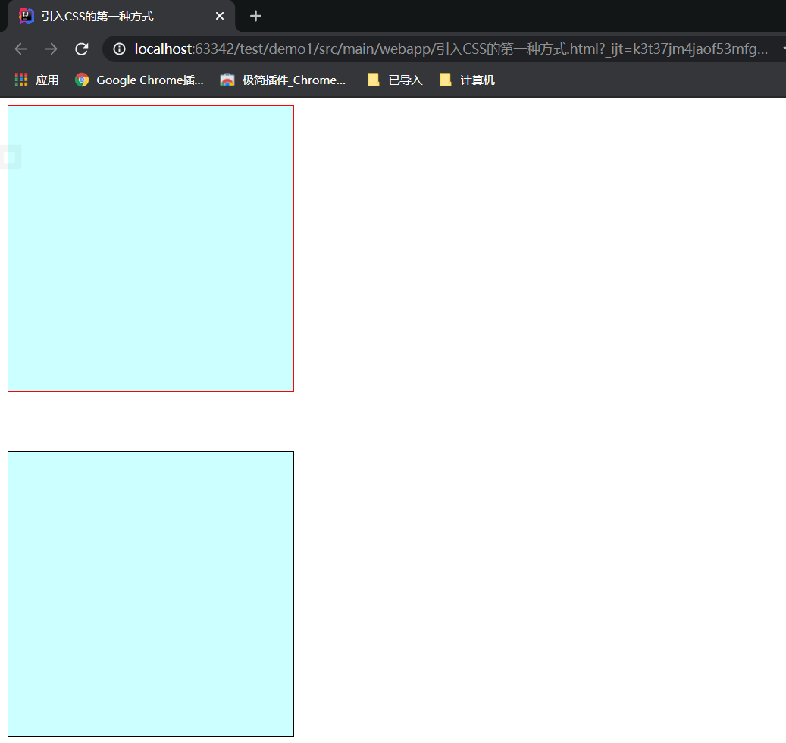
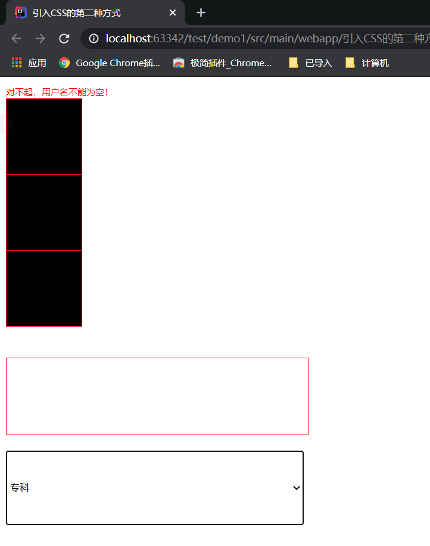
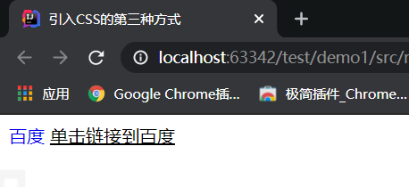
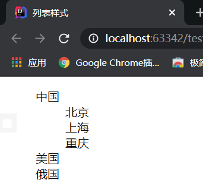
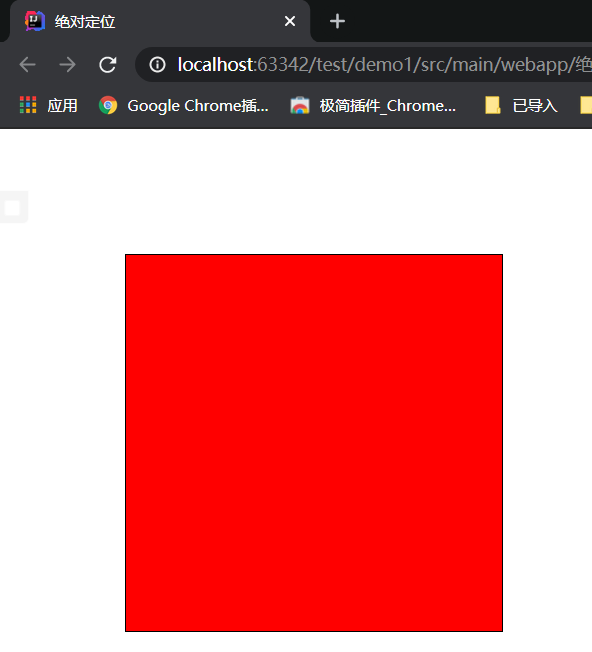

# CSS基础

## 一、什么是CSS，CSS的作用

### 1.1什么是CSS

> CSS（Cascading Style Sheet）层叠样式表语言
>
> 作用：
>
> - 修饰HTML页面
> - 设置HTML页面中某些元素的样式，让HTML页面更好看


### 1.2在HTML中嵌套CSS的三种方式

> 1. 内联定义 (Inline Styles)
>
>    内联定义即是在对象的标记内使用对象的style属性定义适用其的样式表属性。示例如下：
>
>    ```html
>    <p style="margin-left: 0.5in;  margin-right:0.5in">这一行被增加了左右的外补丁<p> 
>    ```
>
>    语法格式：
>
>    ```html
>    <标签  style="样式名：样式值; 样式名：样式值; ..."></标签>
>    ```
>
> 2. 定义内部样式块对象 (Embedding a Style Block)
>
>    你可以在你的HTML文档的<HEAD>标记之间插入一个<STYLE>...</STYLE>块对象。  定义方式请参阅样式表语法。示例如下： 
>
>    ```html
>    <html>
>    <head>
>    <title>文档标题</title>
>    <style  type="text/css">
>    body {font: 10pt "Arial"}
>    h1 {font:  15pt/17pt "Arial"; font-weight: bold; color: maroon}
>    h2 {font: 13pt/15pt  "Arial"; font-weight: bold; color: blue}
>    p {font: 10pt/12pt "Arial"; color:  black}
>    </style>
>    </head>
>    <body> 
>    ```
>
>    语法格式：
>
>    ```html
>    <head>
>    	<style type="text/css">
>    		选择器{
>    			样式名 : 样式值;
>    			样式名 : 样式值;
>    			样式名 : 样式值;
>    			...
>    		}
>    		选择器{
>    			样式名 : 样式值;
>    			样式名 : 样式值;
>    			样式名 : 样式值;
>    			...
>    		}
>    		...
>    	</style>
>    </head>
>    ```
>
>    **注意：这里将style对象的type属性设置为"text/css"，是允许不支持这类型的浏览器忽略样式表单。** 
>
> 3. 链入外部样式表文件 (Linking to a Style Sheet)
>
>    你可以先建立外部样式表文件（.css），然后使用HTML的link对象。示例如下：
>
>    ```html
>    <head>
>    <title>文档标题</title>
>    <link  rel=stylesheet href="http://www.dhtmlet.com/dhtmlet.css"  type="text/css">
>    </head>
>    ```
>
>    语法格式：
>
>    ```html
>    <link type="text/css" rel="stylesheet" ref="css文件的路径" />
>    ```
>
>    优点：
>
>    - 这种方式易维护

#### 1.2.1内联定义

```html
<!DOCTYPE html>
<html lang="en">
<head>
    <meta charset="UTF-8">
    <title>引入CSS的第一种方式</title>
</head>
<body>
    <!--
        width 宽度样式
        height 高度样式
        background-color 背景颜色
        display 布局样式（none表示隐藏，block表示显示）
        border-color 边框颜色
        border-width 表示边框宽度
        border-style 表示边框样式（默认位none隐藏）
    -->
    <div style="width: 300px; height: 300px; background-color: #CCFFFF; display: block; border-color: red; border-width: 1px; border-style: solid"></div>
    <br/><br/><br/>

    <!--
        样式还可以这样写
        border: 1px solid black
     -->
    <div style="width: 300px; height: 300px; background-color: #CCFFFF; display: block; border: 1px solid black"></div>
</body>
</html>
```



#### 1.2.2定义内部样式块对象 

1. 选择器
   - id选择器
   - 标签选择器
   - 类选择器

```html
<!DOCTYPE html>
<html lang="en">
<head>
    <meta charset="UTF-8">
    <title>引入CSS的第二种方式</title>
    <style type="text/css">
        /*
            这是CSS的注释
         */
        /*
            id选择器：#id{样式名: 样式值;...}
         */
        #usernameErrorMsg{
            color: red;
            font-size: 12px;
        }
        /*
            标签选择器：标签名{样式名: 样式值;...}
            标签选择器作用范围比id选择器广
         */
        div{
            background-color: black;
            border: 1px solid red;
            width: 100px;
            height: 100px;
        }
        /*
            类选择器：.class{样式名: 样式值;...}
            可以跨标签（类名一样）
         */
        .student{
            border: 1px solid red;
            width: 400px;
            height: 30px;
        }
    </style>
</head>
<body>
    <!--
        设置样式字体大小12px，颜色为红色
    -->
    <span id="usernameErrorMsg">对不起，用户名不能为空！</span>

    <div></div>
    <div></div>
    <div></div>
    <br/><br/>

    <input type="text" class="student"/>
    <br/><br/>
    <select class="student">
        <option>专科</option>
        <option>本科</option>
    </select>
</body>
</html>
```



#### 1.2.3链入外部样式表文件

```html
<!DOCTYPE html>
<html lang="en">
<head>
    <meta charset="UTF-8">
    <title>引入CSS的第三种方式</title>
    <link rel="stylesheet" type="text/css" href="css/1.css">
</head>
<body>
    <a href="www.baidu.com">百度</a>
    <span id="baiduspan">单击链接到百度</span>
</body>
</html>
```



### 1.3列表样式

可以设置列表中的样式

```html
<!DOCTYPE html>
<html lang="en">
<head>
    <meta charset="UTF-8">
    <title>列表样式</title>
    <style>
        ul{
            list-style-type: none;
        }
    </style>
</head>
<body>
    <ul>
        <li>中国
            <ul>
                <li>北京</li>
                <li>上海</li>
                <li>重庆</li>
            </ul>
        </li>
        <li>美国</li>
        <li>俄国</li>
    </ul>
</body>
</html>
```



### 1.4绝对定位

定位左上角的点

```html
<!DOCTYPE html>
<html lang="en">
<head>
    <meta charset="UTF-8">
    <title>绝对定位</title>
    <style type="text/css">
        #div1{
            position: absolute; /* 绝对定位 */
            background-color: red;
            border: 1px black solid;
            width: 300px;
            height: 300px;
            left: 100px;
            top: 100px;
        }
    </style>
</head>
<body>
    <div id="div1"></div>
</body>
</html>
```

