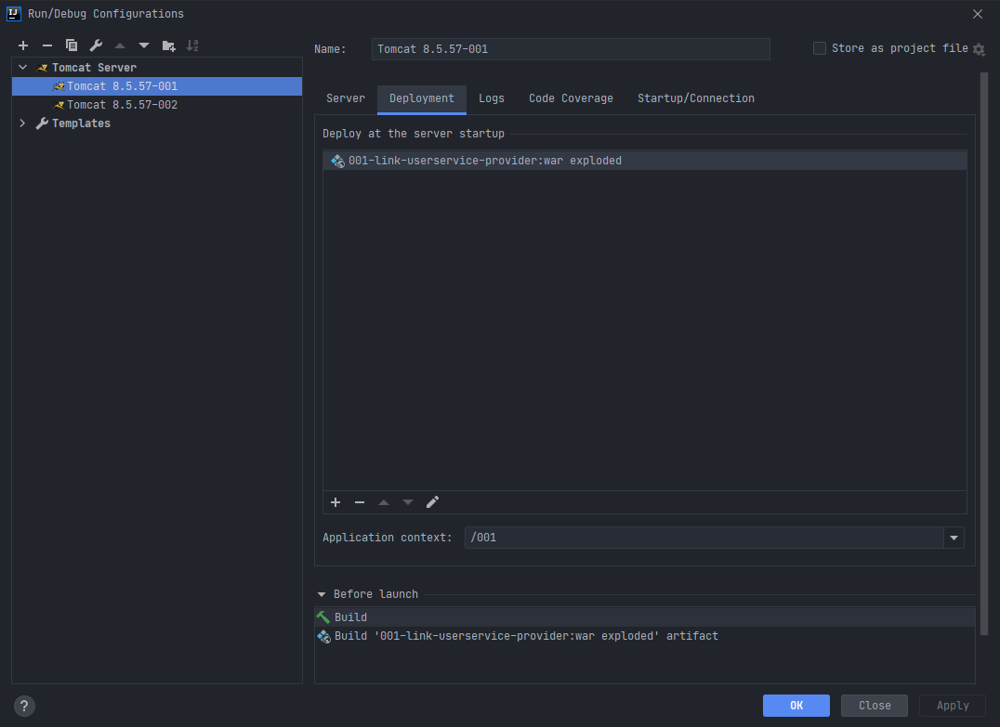

# Dubbo

## 一、应用架构简介

### 1.1什么是分布式框架

分布式系统是若干独立系统的集合，但是用户使用起来像是在使用一套系统。


### 1.2应用架构的发展

1. 单一架构

   网站流量很小时，将所有的业务放到一台服务器上，打包运行即可。

   优点：开发简单，部署简单。

   缺点：扩展不容易，性能提升难

2. 垂直应用架构

   将大应用拆分成小应用，根据不同的访问频率决定各业务部署的服务器数量。

   优点：扩展容易

   缺点：界面一改，可能造成整个项目重新部署，业务和界面没有分离开。

3. 分布式架构

   将业务拆分后，用某种方式实现各个业务模块的远程调用和复用，这时一个好的RPC（Remote Procedure Call 远程过程调用）框架就决定了你的分布式架构的性能。

   优点：解决了分布式系统中互相调用的问题

   缺点：缺少统一管理服务器的调度中心


## 二、Dubbo框架

### 2.1Dubbo框架

Apache Dubbo是一款高性能，轻量级的开源Java RPC框架，提供了三大核心能力：面向接口的远程方法调用，智能容错和复杂均衡，以及服务自动注册和发现。

Dubbo是一个分布式服务框架，致力于提高性能和透明化的RPC远程服务调用方案、服务治理方案。


### 2.2基本架构


> - 服务提供者（Provider）：
>
>   暴露服务的服务提供方，服务提供者在启动时，向注册中心注册自己提供的服务。
>
> - 服务消费者（Consumer）：
>
>   调用远程服务的服务消费方，服务消费者在启动时，向注册中心订阅自己的所需的服务，服务消费者，从提供者地址列表中，基于软负载均衡算法，选一台提供者进行调用，如果调用失败，再选另一台调用。
>
> - 注册中心（Registry）：
>
>   注册中心返回服务提供者地址列表给消费者，如果有变更，注册中心将基于长连接推送变更数据给消费者。
>
> - 监控中心（Monitor）：
>
>   服务消费者和提供者，在内存中累计调用次数和调用时间，定时每分钟发送一次统计数据到监控中心。

> **调度关系说明：**
>
> - 服务容器负责启动，加载，运行服务提供者。
> - 服务提供者在启动时，向注册中心注册自己提供的服务。
> - 服务消费者在启动时，向注册中心订阅自己所需的服务。
> - 注册中心返回服务提供者地址列表给消费者，如果有变更，注册中心将基于长连接推送变更数据给消费者。
> - 服务消费者，从提供者地址列表中，基于软负载均衡算法，选一台提供者进行调用，如果调用失败，再选另一台调用。
> - 服务消费者和提供者，在内存中累计调用次数和调用时间，定时每分钟发送一次统计数据到监控中心。


### 2.3Dubbo支持的协议

支持多种协议，官方推荐Dubbo协议，默认端口20880

使用Dubbo协议，Spring配置文件加入：

```xml
<dubbo:protocol name="name" port="20880"/>
```


### 2.4直连方式

点对点的直连项目：消费者直接访问服务提供者，没有注册中心。消费者必须指定服务提供者的访问地址(url)


准备工作：搭建环境，创建空项目，新建服务提供者的maven web工程模块


完善目录结构并引入依赖

```xml
<?xml version="1.0" encoding="UTF-8"?>

<project xmlns="http://maven.apache.org/POM/4.0.0" xmlns:xsi="http://www.w3.org/2001/XMLSchema-instance"
  xsi:schemaLocation="http://maven.apache.org/POM/4.0.0 http://maven.apache.org/xsd/maven-4.0.0.xsd">
  <modelVersion>4.0.0</modelVersion>

  <groupId>com.bjpowernode.dubbo</groupId>
  <artifactId>001-link-userservice-provider</artifactId>
  <version>1.0-SNAPSHOT</version>
	
  <!--
  	需要改成jar包打包后再改回war
  -->
  <!--<packaging>jar</packaging>-->
  <packaging>war</packaging>
    

  <!--spring依赖-->
  <dependencies>
    <dependency>
      <groupId>org.springframework</groupId>
      <artifactId>spring-context</artifactId>
      <version>4.3.7.RELEASE</version>
    </dependency>

    <!--springmvc依赖-->
    <dependency>
      <groupId>org.springframework</groupId>
      <artifactId>spring-webmvc</artifactId>
      <version>4.3.7.RELEASE</version>
    </dependency>

    <!--dubbo依赖-->
    <dependency>
      <groupId>com.alibaba</groupId>
      <artifactId>dubbo</artifactId>
      <version>2.6.2</version>
    </dependency>
  </dependencies>

  <build>
    <plugins>
      <!--编译插件-->
      <plugin>
        <artifactId>maven-compiler-plugin</artifactId>
        <version>3.1</version>
        <configuration>
          <target>1.8</target>
          <source>1.8</source>
        </configuration>
      </plugin>
    </plugins>
  </build>
</project>
```


新建服务消费者的maven web工程模块


完善目录结构并引入依赖

```xml
<?xml version="1.0" encoding="UTF-8"?>

<project xmlns="http://maven.apache.org/POM/4.0.0" xmlns:xsi="http://www.w3.org/2001/XMLSchema-instance"
  xsi:schemaLocation="http://maven.apache.org/POM/4.0.0 http://maven.apache.org/xsd/maven-4.0.0.xsd">
  <modelVersion>4.0.0</modelVersion>

  <groupId>com.bjpowernode.dubbo</groupId>
  <artifactId>002-link-consumer</artifactId>
  <version>1.0-SNAPSHOT</version>

  <packaging>war</packaging>

  <dependencies>
    <!--spring依赖-->
    <dependency>
      <groupId>org.springframework</groupId>
      <artifactId>spring-context</artifactId>
      <version>4.3.7.RELEASE</version>
    </dependency>
    <!--springmvc依赖-->
    <dependency>
      <groupId>org.springframework</groupId>
      <artifactId>spring-webmvc</artifactId>
      <version>4.3.7.RELEASE</version>
    </dependency>
    <!--dubbo依赖-->
    <dependency>
      <groupId>com.alibaba</groupId>
      <artifactId>dubbo</artifactId>
      <version>2.6.2</version>
    </dependency>
    <!--服务提供者依赖-->
    <dependency>
      <groupId>com.bjpowernode.dubbo</groupId>
      <artifactId>001-link-userservice-provider</artifactId>
      <version>1.0-SNAPSHOT</version>
    </dependency>
  </dependencies>

  <build>
    <plugins>
      <!--编译插件-->
      <plugin>
        <artifactId>maven-compiler-plugin</artifactId>
        <version>3.1</version>
        <configuration>
          <target>1.8</target>
          <source>1.8</source>
        </configuration>
      </plugin>
    </plugins>
  </build>
</project>
```


#### 2.4.1服务提供者

> 1. 创建一个maven web工程：服务提供者
> 2. 创建一个实体bean查询的结果
> 3. 提供一个服务接口
> 4. 实现这个服务接口
> 5. 配置dubbo服务提供者的核心配置文件
>    1. 声明dubbo服务提供者的名称：保证唯一
>    2. 声明dubbo使用的协议和端口号
>    3. 暴露服务，使用直连方式
> 6. 添加监听器

需求描述：查询用户详情

第一步：创建实体类

```java
public class User implements Serializable {
    
    private Integer id;
    
    private String name;

    public Integer getId() {
        return id;
    }

    public void setId(Integer id) {
        this.id = id;
    }

    public String getName() {
        return name;
    }

    public void setName(String name) {
        this.name = name;
    }
}
```

第二步：创建service接口和实现类

```java
public interface UserService {
    /**
     * 根据用户id查询用户信息
     * @param id
     * @return
     */
    User queryUserById(Integer id);
}
```

```java
public class UserServiceImpl implements UserService {
    // 模拟查询结果
    @Override
    public User queryUserById(Integer id) {
        User user = new User();
        user.setId(1001);
        user.setName("张三");
        return user;
    }
}
```

第三步：创建dubbo核心配置文件

```xml
<?xml version="1.0" encoding="UTF-8"?>
<beans xmlns="http://www.springframework.org/schema/beans"
       xmlns:xsi="http://www.w3.org/2001/XMLSchema-instance" xmlns:dubbo="http://dubbo.apache.org/schema/dubbo"
       xsi:schemaLocation="http://www.springframework.org/schema/beans http://www.springframework.org/schema/beans/spring-beans.xsd http://dubbo.apache.org/schema/dubbo http://dubbo.apache.org/schema/dubbo/dubbo.xsd">

    <!--服务提供者声明名称：必须保证服务名称的唯一性，它的名称是dubbo内部使用的唯一标识-->
    <dubbo:application name="001-link-userservice-provider"/>

    <!--设置访问服务协议的名称以及端口号，官方推荐使用dubbo协议，端口号默认为20880-->
    <!--
        name:协议名称
        port:端口号
    -->
    <dubbo:protocol name="dubbo" port="20880"/>

    <!--
        暴露服务接口 <dubbo:service/>
        interface:暴露服务接口的全限定类名
        ref:接口引用服务的实现类在spring容器中的标识
        registry:决定是否使用注册中心，不使用则值为："N/A"
    -->
    <dubbo:service interface="com.bjpowernode.dubbo.service.UserService" ref="userService" registry="N/A"/>
    
    <!--将接口的实现类加载到spring容器中-->
    <bean id="userService" class="com.bjpowernode.dubbo.service.impl.UserServiceImpl"/>
</beans>
```

第四步：在web.xml中配置监听器

```xml
<?xml version="1.0" encoding="UTF-8"?>
<web-app xmlns="http://xmlns.jcp.org/xml/ns/javaee"
         xmlns:xsi="http://www.w3.org/2001/XMLSchema-instance"
         xsi:schemaLocation="http://xmlns.jcp.org/xml/ns/javaee http://xmlns.jcp.org/xml/ns/javaee/web-app_4_0.xsd"
         version="4.0">
    
    <context-param>
        <param-name>contextConfigLocation</param-name>
        <param-value>classpath:dubbo-userservice-provider.xml</param-value>
    </context-param>
    
    <listener>
        <listener-class>org.springframework.web.context.ContextLoaderListener</listener-class>
    </listener>
</web-app>
```

第五步：配置tomcat





#### 2.4.2服务消费者

> 1. 创建一个maven web工程：服务消费者
> 2. 配置pom文件，添加依赖，（需要添加服务提供者依赖，首先将服务提供者模块的打包方式改成jar，打包后改回war，在服务消费者模块中引入依赖）
> 3. 设置dubbo的核心配置文件
> 4. 编写controller
> 5. 配置中央调度器(DispatcherServlet)

第一步：创建核心配置文件dubbo-consumer.xml

```xml
<?xml version="1.0" encoding="UTF-8"?>
<beans xmlns="http://www.springframework.org/schema/beans"
       xmlns:xsi="http://www.w3.org/2001/XMLSchema-instance" xmlns:dubbo="http://dubbo.apache.org/schema/dubbo"
       xsi:schemaLocation="http://www.springframework.org/schema/beans http://www.springframework.org/schema/beans/spring-beans.xsd http://dubbo.apache.org/schema/dubbo http://dubbo.apache.org/schema/dubbo/dubbo.xsd">

    <!-- 声明服务消费者的名称：保证唯一性 -->
    <dubbo:application name="002-link-consumer" />
    
    <!--
        引用远程服务接口：
        id：远程访问接口对象的名称
        interface：调用远程接口的全限定类名
        url：访问服务接口的地址
        registry：不使用注册中心，值为N/A
    -->
    <dubbo:reference id="userService" 
                     interface="com.bjpowernode.dubbo.service.UserService" 
                     url="dubbo://localhost:20880" 
                     registry="N/A" />
    
</beans>
```

第二步：创建spring配置文件，配置扫描器

```xml
<?xml version="1.0" encoding="UTF-8"?>
<beans xmlns="http://www.springframework.org/schema/beans"
       xmlns:xsi="http://www.w3.org/2001/XMLSchema-instance"
       xmlns:context="http://www.springframework.org/schema/context"
       xmlns:mvc="http://www.springframework.org/schema/mvc"
       xsi:schemaLocation="http://www.springframework.org/schema/beans http://www.springframework.org/schema/beans/spring-beans.xsd http://www.springframework.org/schema/context http://www.springframework.org/schema/context/spring-context.xsd http://www.springframework.org/schema/mvc http://www.springframework.org/schema/mvc/spring-mvc.xsd">

    <!--扫描器-->
    <context:component-scan base-package="com.bjpowernode.dubbo.controller" />

    <!--配置注解驱动-->
    <mvc:annotation-driven />

    <!--配置视图解析器-->
    <bean class="org.springframework.web.servlet.view.InternalResourceViewResolver">
        <property name="suffix" value="/" />
        <property name="prefix" value=".jsp" />
    </bean>
</beans>
```

第三步：编写controller

```java
@Controller
public class UserController {

    @Autowired
    private UserService userService;

    @RequestMapping("/user")
    public String userDetail(Model model, Integer id){
        User user = userService.queryUserById(id);
        model.addAttribute("user", user);
        return "userDetail";
    }
}
```

第四步：在web.xml中配置中央调度器

```xml
<?xml version="1.0" encoding="UTF-8"?>
<web-app xmlns="http://xmlns.jcp.org/xml/ns/javaee"
         xmlns:xsi="http://www.w3.org/2001/XMLSchema-instance"
         xsi:schemaLocation="http://xmlns.jcp.org/xml/ns/javaee http://xmlns.jcp.org/xml/ns/javaee/web-app_4_0.xsd"
         version="4.0">

    <servlet>
        <servlet-name>DispatcherServlet</servlet-name>
        <servlet-class>org.springframework.web.servlet.DispatcherServlet</servlet-class>
        <init-param>
            <param-name>contextConfigLocation</param-name>
            <param-value>classpath:application.xml,classpath:dubbo-consumer.xml</param-value>
        </init-param>
    </servlet>
    <servlet-mapping>
        <servlet-name>DispatcherServlet</servlet-name>
        <url-pattern>/</url-pattern>
    </servlet-mapping>
</web-app>
```

第五步：编写页面

```jsp
<%@ page contentType="text/html;charset=UTF-8" language="java" %>
<html>
<head>
    <title>Title</title>
</head>
<body>
    <h1>用户详情</h1>
    用户ID：${user.id}<br/>
    用户名称:${user.name}
</body>
</html>
```

第六步：为服务消费者配置tomcat


分别启动两个tomcat


> dubbo官方推荐必须要有一个接口工程，它就是一个maven java工程
>
> 要求接口工程里存放的内容如下：
>
> - 对外暴露的服务接口（service接口）
> - 实体bean对象


### 2.5Dubbo服务化的最佳实践

#### 2.5.1分包

建议将服务接口、服务模型、服务异常等均放在公共包中。

#### 2.5.2粒度

- 服务接口尽可能大粒度，**每个服务方法应代表一个功能，而不是功能中的某一个步骤。**
- 服务接口建议以业务场景为单位划分，并对相近业务做抽象，防止接口数量爆炸。
- 不建议使用过于抽象的通用接口。如：Map query(Map)

#### 2.5.3版本

每个接口都应该对应版本号，区分同一接口的不同实现，如：

```xml
<dubbo:service interface="com.xxx.XxxService" version="1.0" />
```


### 2.6改造该项目

> 使用dubbo官方推荐使用的一种模式，将实体类和业务接口存放到接口工程中

创建一个新的maven java模块作为接口工程


创建一个新的maven web模块作为服务提供者模块


创建一个新的maven web模块作为服务消费者


#### 2.6.1接口工程

创建实体类

```java
public class User implements Serializable {
    private Integer id;
    private String name;

    public Integer getId() {
        return id;
    }

    public void setId(Integer id) {
        this.id = id;
    }

    public String getName() {
        return name;
    }

    public void setName(String name) {
        this.name = name;
    }
}
```

创建服务接口

```java
public interface UserService {
    User queryUserDetail(Integer id);
}
```


#### 2.6.2服务提供者工程

添加依赖，需要引入接口工程

```xml
<?xml version="1.0" encoding="UTF-8"?>
<project xmlns="http://maven.apache.org/POM/4.0.0" xmlns:xsi="http://www.w3.org/2001/XMLSchema-instance"
         xsi:schemaLocation="http://maven.apache.org/POM/4.0.0 http://maven.apache.org/xsd/maven-4.0.0.xsd">
    <modelVersion>4.0.0</modelVersion>

    <groupId>com.bjpowernode.dubbo</groupId>
    <artifactId>004-link-userservice-provider</artifactId>
    <version>1.0-SNAPSHOT</version>
    <packaging>war</packaging>

    <dependencies>
        <!--spring依赖-->
        <dependency>
            <groupId>org.springframework</groupId>
            <artifactId>spring-context</artifactId>
            <version>4.3.7.RELEASE</version>
        </dependency>
        <!--springmvc依赖-->
        <dependency>
            <groupId>org.springframework</groupId>
            <artifactId>spring-webmvc</artifactId>
            <version>4.3.7.RELEASE</version>
        </dependency>
        <!--dubbo依赖-->
        <dependency>
            <groupId>com.alibaba</groupId>
            <artifactId>dubbo</artifactId>
            <version>2.6.2</version>
        </dependency>
        <!--引入接口工程-->
        <dependency>
            <groupId>com.bjpowernode.dubbo</groupId>
            <artifactId>003-link-interface</artifactId>
            <version>1.0-SNAPSHOT</version>
        </dependency>
    </dependencies>

    <build>
        <plugins>
            <!--编译插件-->
            <plugin>
                <artifactId>maven-compiler-plugin</artifactId>
                <version>3.1</version>
                <configuration>
                    <target>1.8</target>
                    <source>1.8</source>
                </configuration>
            </plugin>
        </plugins>
    </build>
</project>
```

创建接口工程服务接口的实现类

```java
public class UserServiceImpl implements UserService {
    @Override
    public User queryUserDetail(Integer id) {
        User user = new User();
        user.setId(id);
        user.setName("张三");
        return user;
    }
}
```

创建服务提供者的配置文件dubbo-userservice-provider.xml

```xml
<?xml version="1.0" encoding="UTF-8"?>
<beans xmlns="http://www.springframework.org/schema/beans"
       xmlns:xsi="http://www.w3.org/2001/XMLSchema-instance" xmlns:dubbo="http://dubbo.apache.org/schema/dubbo"
       xsi:schemaLocation="http://www.springframework.org/schema/beans http://www.springframework.org/schema/beans/spring-beans.xsd http://dubbo.apache.org/schema/dubbo http://dubbo.apache.org/schema/dubbo/dubbo.xsd">

    <!--声明dubbo服务提供者的名称：保证唯一性-->
    <dubbo:application name="004-link-userservice-provider" />
    
    <!--设置dubbo使用的协议和端口号-->
    <dubbo:protocol name="dubbo" port="20880" />
    
    <!--暴露服务接口-->
    <dubbo:service interface="com.bjpowernode.dubbo.service.UserService" ref="userService" registry="N/A"/>
    
    <!--加载业务接口的实现类到spring容器中-->
    <bean id="userService" class="com.bjpowernode.dubbo.service.impl.UserServiceImpl" />
</beans>
```

配置监听器

```xml
<?xml version="1.0" encoding="UTF-8"?>
<web-app xmlns="http://xmlns.jcp.org/xml/ns/javaee"
         xmlns:xsi="http://www.w3.org/2001/XMLSchema-instance"
         xsi:schemaLocation="http://xmlns.jcp.org/xml/ns/javaee http://xmlns.jcp.org/xml/ns/javaee/web-app_4_0.xsd"
         version="4.0">

    <context-param>
        <param-name>contextConfigLocation</param-name>
        <param-value>classpath:dubbo-userservice-provider.xml</param-value>
    </context-param>
    <listener>
        <listener-class>org.springframework.web.context.ContextLoaderListener</listener-class>
    </listener>
</web-app>
```

配置tomcat


#### 2.6.3服务消费者工程

添加依赖，需要引入接口工程

```xml
<?xml version="1.0" encoding="UTF-8"?>
<project xmlns="http://maven.apache.org/POM/4.0.0" xmlns:xsi="http://www.w3.org/2001/XMLSchema-instance"
         xsi:schemaLocation="http://maven.apache.org/POM/4.0.0 http://maven.apache.org/xsd/maven-4.0.0.xsd">
    <modelVersion>4.0.0</modelVersion>

    <groupId>com.bjpowernode.dubbo</groupId>
    <artifactId>005-link-consumer</artifactId>
    <version>1.0-SNAPSHOT</version>
    <packaging>war</packaging>

    <dependencies>
        <!--spring依赖-->
        <dependency>
            <groupId>org.springframework</groupId>
            <artifactId>spring-context</artifactId>
            <version>4.3.7.RELEASE</version>
        </dependency>
        <!--springmvc依赖-->
        <dependency>
            <groupId>org.springframework</groupId>
            <artifactId>spring-webmvc</artifactId>
            <version>4.3.7.RELEASE</version>
        </dependency>
        <!--dubbo依赖-->
        <dependency>
            <groupId>com.alibaba</groupId>
            <artifactId>dubbo</artifactId>
            <version>2.6.2</version>
        </dependency>
        <!--引入接口工程-->
        <dependency>
            <groupId>com.bjpowernode.dubbo</groupId>
            <artifactId>003-link-interface</artifactId>
            <version>1.0-SNAPSHOT</version>
        </dependency>
    </dependencies>

    <build>
        <plugins>
            <!--编译插件-->
            <plugin>
                <artifactId>maven-compiler-plugin</artifactId>
                <version>3.1</version>
                <configuration>
                    <target>1.8</target>
                    <source>1.8</source>
                </configuration>
            </plugin>
        </plugins>
    </build>
</project>
```

配置服务消费者的配置文件dubbo-consumer.xml

```xml
<?xml version="1.0" encoding="UTF-8"?>
<beans xmlns="http://www.springframework.org/schema/beans"
       xmlns:xsi="http://www.w3.org/2001/XMLSchema-instance" xmlns:dubbo="http://dubbo.apache.org/schema/dubbo"
       xsi:schemaLocation="http://www.springframework.org/schema/beans http://www.springframework.org/schema/beans/spring-beans.xsd http://dubbo.apache.org/schema/dubbo http://dubbo.apache.org/schema/dubbo/dubbo.xsd">

    <!--声明服务消费者名称：保证唯一性-->
    <dubbo:application name="005-link-consumer" />

    <!--引用远程接口服务-->
    <dubbo:reference id="userService" 
                     interface="com.bjpowernode.dubbo.service.UserService" 
                     url="dubbo://localhost:20880" 
                     registry="N/A"/>
</beans>
```

创建spring配置文件

```xml
<?xml version="1.0" encoding="UTF-8"?>
<beans xmlns="http://www.springframework.org/schema/beans"
       xmlns:xsi="http://www.w3.org/2001/XMLSchema-instance"
       xmlns:context="http://www.springframework.org/schema/context"
       xmlns:mvc="http://www.springframework.org/schema/mvc"
       xsi:schemaLocation="http://www.springframework.org/schema/beans http://www.springframework.org/schema/beans/spring-beans.xsd http://www.springframework.org/schema/context http://www.springframework.org/schema/context/spring-context.xsd http://www.springframework.org/schema/mvc http://www.springframework.org/schema/mvc/spring-mvc.xsd">

    <!--扫描器-->
    <context:component-scan base-package="com.bjpowernode.dubbo.controller" />

    <!--配置注解驱动-->
    <mvc:annotation-driven />

    <!--视图解析器-->
    <bean class="org.springframework.web.servlet.view.InternalResourceViewResolver">
        <property name="prefix" value="/" />
        <property name="suffix" value=".jsp" />
    </bean>
</beans>
```

创建controller

```java
@Controller
public class UserController {

    @Autowired
    private UserService userService;

    @RequestMapping("/user")
    public String queryUser(Model model, Integer id){
        User user = userService.queryUserDetail(id);
        model.addAttribute("user", user);
        return "userDetail";
    }
}
```

配置中央调度器

```xml
<?xml version="1.0" encoding="UTF-8"?>
<web-app xmlns="http://xmlns.jcp.org/xml/ns/javaee"
         xmlns:xsi="http://www.w3.org/2001/XMLSchema-instance"
         xsi:schemaLocation="http://xmlns.jcp.org/xml/ns/javaee http://xmlns.jcp.org/xml/ns/javaee/web-app_4_0.xsd"
         version="4.0">

    <servlet>
        <servlet-name>dispatcherServlet</servlet-name>
        <servlet-class>org.springframework.web.servlet.DispatcherServlet</servlet-class>
        <init-param>
            <param-name>contextConfigLocation</param-name>
            <param-value>classpath:applicationContext.xml,classpath:dubbo-consumer.xml</param-value>
        </init-param>
    </servlet>
    <servlet-mapping>
        <servlet-name>dispatcherServlet</servlet-name>
        <url-pattern>/</url-pattern>
    </servlet-mapping>
</web-app>
```

创建页面

```jsp
<%@ page contentType="text/html;charset=UTF-8" language="java" %>
<html>
<head>
    <title>Title</title>
</head>
<body>
<h1>用户详情</h1>
用户ID：${user.id}<br/>
用户名称:${user.name}
</body>
</html>
```

配置tomcat


启动tomcat测试


### 2.7常用标签

#### 2.7.1公用标签

1. < dubbo:application name="服务的名称" />配置应用信息
2. < dubbo:registry address="ip:port" protocol="协议" />配置注册中心

#### 2.7.2服务提供者标签

1. < dubbo:service interface="服务接口名" ref="服务实现对象bean" />配置暴露的服务

#### 2.7.3服务消费者标签

1. < dubbo:reference id="服务引用bean的id" interface="服务接口名" />配置服务消费者引用远程服务

## 三、注册中心ZooKeeper

### 3.1注册中心概述

对于服务提供方，它需要发布服务，而且由于应用系统的复杂性，服务的数量、类型也不断膨胀；

对于服务消费方，它最关心如何获取到它所需要的服务，而面对复杂的应用系统，需要管理大量的服务调用。

对于服务提供方和服务消费方来说，他们还有可能兼具这两种角色，即需要提供服务，又需要消费服务。

通过将服务统一管理起来，可以有效地优化内部应用对服务发布/使用的流程和管理。

服务注册中心可以通过特定协议来完成服务对外的统一。

Dubbo提供的注册中心有如下几种类型可供选：

1. Multicast注册中心：组播方式
2. Redis注册中心：使用 Redis作为注册中心
3. Simple注册中心：就是一个 dubbo服务。作为注册中心。提供査找服务的功能。
4. Zookeeper注册中心(推荐使用)：使用 Zookeeper作为注册中心


**Zookeeper是一个高性能，分布式的分布式应用程序协调服务。是一个树形结构，和文件系统相似，每个节点被称作Znode，表示一个唯一服务资源。**


### 3.2使用注册中心改造项目

创建一个新的maven java模块作为接口工程

> 接口工程：存放实体bean（必须进行序列化）和业务接口


创建一个新的maven web模块作为服务提供者模块


创建一个新的maven web模块作为服务消费者模块


#### 3.2.1接口工程

创建实体类并序列化

```java
public class User implements Serializable {
    private Integer id;
    private String name;

    public Integer getId() {
        return id;
    }

    public void setId(Integer id) {
        this.id = id;
    }

    public String getName() {
        return name;
    }

    public void setName(String name) {
        this.name = name;
    }
}
```

创建服务接口

```java
public interface UserService {
    User queryUserDetail(Integer id);
}
```


#### 3.2.2服务提供者工程

引入依赖

```xml
<?xml version="1.0" encoding="UTF-8"?>
<project xmlns="http://maven.apache.org/POM/4.0.0" xmlns:xsi="http://www.w3.org/2001/XMLSchema-instance"
         xsi:schemaLocation="http://maven.apache.org/POM/4.0.0 http://maven.apache.org/xsd/maven-4.0.0.xsd">
    <modelVersion>4.0.0</modelVersion>
    
    <groupId>com.bjpowernode.dubbo</groupId>
    <artifactId>007-zk-userservice-provider</artifactId>
    <version>1.0-SNAPSHOT</version>
    <packaging>war</packaging>

    <dependencies>
        <!--spring依赖-->
        <dependency>
            <groupId>org.springframework</groupId>
            <artifactId>spring-context</artifactId>
            <version>4.3.7.RELEASE</version>
        </dependency>
        <!--springmvc依赖-->
        <dependency>
            <groupId>org.springframework</groupId>
            <artifactId>spring-webmvc</artifactId>
            <version>4.3.7.RELEASE</version>
        </dependency>
        <!--dubbo依赖-->
        <dependency>
            <groupId>com.alibaba</groupId>
            <artifactId>dubbo</artifactId>
            <version>2.6.2</version>
        </dependency>
        <!--引入接口工程-->
        <dependency>
            <groupId>com.bjpowernode.dubbo</groupId>
            <artifactId>006-zk-interface</artifactId>
            <version>1.0-SNAPSHOT</version>
        </dependency>
        <!--Zookeeper依赖-->
        <dependency>
            <groupId>org.apache.curator</groupId>
            <artifactId>curator-framework</artifactId>
            <version>4.1.0</version>
        </dependency>
    </dependencies>

    <build>
        <plugins>
            <!--编译插件-->
            <plugin>
                <artifactId>maven-compiler-plugin</artifactId>
                <version>3.1</version>
                <configuration>
                    <target>1.8</target>
                    <source>1.8</source>
                </configuration>
            </plugin>
        </plugins>
    </build>
</project>
```

实现业务接口

```java
public class UserServiceImpl implements UserService {
    
    @Override
    public User queryUserDetail(Integer id) {
        User user = new User();
        user.setId(id);
        user.setName("李四");
        return user;
    }
}
```

创建核心配置文件

```xml
<?xml version="1.0" encoding="UTF-8"?>
<beans xmlns="http://www.springframework.org/schema/beans"
       xmlns:xsi="http://www.w3.org/2001/XMLSchema-instance" xmlns:dubbo="http://dubbo.apache.org/schema/dubbo"
       xsi:schemaLocation="http://www.springframework.org/schema/beans http://www.springframework.org/schema/beans/spring-beans.xsd http://dubbo.apache.org/schema/dubbo http://dubbo.apache.org/schema/dubbo/dubbo.xsd">

    <!--声明服务提供者的名称：保证唯一性-->
    <dubbo:application name="007-zk-userservice-provider" />

    <!--声明dubbo使用的协议名称和端口号-->
    <dubbo:protocol name="dubbo" port="20880" />

    <!--现在要使用Zookeeper注册中心-->
    <!--指定注册中心地址和端口号-->
    <dubbo:registry address="zookeeper://localhost:2181" />
    
    <!--暴露服务接口-->
    <dubbo:service interface="com.bjpowernode.dubbo.service.UserService" ref="userService" />

    <!--加载接口实现类-->
    <bean id="userService" class="com.bjpowernode.dubbo.service.impl.UserServiceImpl" />
</beans>
```

配置监听器

```xml
<?xml version="1.0" encoding="UTF-8"?>
<web-app xmlns="http://xmlns.jcp.org/xml/ns/javaee"
         xmlns:xsi="http://www.w3.org/2001/XMLSchema-instance"
         xsi:schemaLocation="http://xmlns.jcp.org/xml/ns/javaee http://xmlns.jcp.org/xml/ns/javaee/web-app_4_0.xsd"
         version="4.0">
    
    <context-param>
        <param-name>contextConfigLocation</param-name>
        <param-value>classpath:dubbo-zk-userservice-provider.xml</param-value>
    </context-param>
    <listener>
        <listener-class>org.springframework.web.context.ContextLoaderListener</listener-class>
    </listener>
</web-app>
```

配置tomcat


#### 3.2.3服务消费者工程

引入依赖，和服务提供者依赖相同

创建dubbo核心配置文件

```xml
<?xml version="1.0" encoding="UTF-8"?>
<beans xmlns="http://www.springframework.org/schema/beans"
       xmlns:xsi="http://www.w3.org/2001/XMLSchema-instance" xmlns:dubbo="http://dubbo.apache.org/schema/dubbo"
       xsi:schemaLocation="http://www.springframework.org/schema/beans http://www.springframework.org/schema/beans/spring-beans.xsd http://dubbo.apache.org/schema/dubbo http://dubbo.apache.org/schema/dubbo/dubbo.xsd">

    <!--声明dubbo服务消费者名称：保证唯一性-->
    <dubbo:application name="008-zk-consumer" />

    <!--指定注册中心-->
    <dubbo:registry address="zookeeper://localhost:2181" />

    <!--引用远程接口服务-->
    <dubbo:reference id="userService"
                     interface="com.bjpowernode.dubbo.service.UserService" />
</beans>
```

创建spring核心配置文件

```xml
<?xml version="1.0" encoding="UTF-8"?>
<beans xmlns="http://www.springframework.org/schema/beans"
       xmlns:xsi="http://www.w3.org/2001/XMLSchema-instance"
       xmlns:context="http://www.springframework.org/schema/context"
       xmlns:mvc="http://www.springframework.org/schema/mvc"
       xsi:schemaLocation="http://www.springframework.org/schema/beans
       http://www.springframework.org/schema/beans/spring-beans.xsd
       http://www.springframework.org/schema/context
       http://www.springframework.org/schema/context/spring-context.xsd http://www.springframework.org/schema/mvc http://www.springframework.org/schema/mvc/spring-mvc.xsd">

    <!--扫描器-->
    <context:component-scan base-package="com.bjpowernode.dubbo.controller" />

    <!--注解驱动-->
    <mvc:annotation-driven />

    <!--视图解析器-->
    <bean class="org.springframework.web.servlet.view.InternalResourceViewResolver">
        <property name="prefix" value="/" />
        <property name="suffix" value=".jsp" />
    </bean>
</beans>
```

配置中央调度器

```xml
<?xml version="1.0" encoding="UTF-8"?>
<web-app xmlns="http://xmlns.jcp.org/xml/ns/javaee"
         xmlns:xsi="http://www.w3.org/2001/XMLSchema-instance"
         xsi:schemaLocation="http://xmlns.jcp.org/xml/ns/javaee http://xmlns.jcp.org/xml/ns/javaee/web-app_4_0.xsd"
         version="4.0">
    
    <servlet>
        <servlet-name>dispatcherServlet</servlet-name>
        <servlet-class>org.springframework.web.servlet.DispatcherServlet</servlet-class>
        <init-param>
            <param-name>contextConfigLocation</param-name>
            <param-value>classpath:applicationContext.xml, classpath:dubbo-zk-consumer.xml</param-value>
        </init-param>
    </servlet>
    <servlet-mapping>
        <servlet-name>dispatcherServlet</servlet-name>
        <url-pattern>/</url-pattern>
    </servlet-mapping>
</web-app>
```

创建controller

```java
@Controller
public class UserController {
    
    @Autowired
    private UserService userService;
    
    @RequestMapping("/user")
    public String queryUserDetail(Model model, Integer id){
        User user = userService.queryUserDetail(id);
        model.addAttribute("user", user);
        return "userDetail";
    }
}
```

创建jsp页面

```jsp
<%@ page contentType="text/html;charset=UTF-8" language="java" %>
<html>
<head>
    <title>Title</title>
</head>
<body>
<h1>用户详情</h1>
用户ID：${user.id}<br/>
用户名称:${user.name}
</body>
</html>
```

配置tomcat


启动Zookeeper，bin目录下的zkServer.cmd


启动tomcat


## 四、版本号

每个接口都应定义版本号，为后续不兼容升级提供可能。当一个接口有不同的实现，项目早期使用的一个实现类，之后创建接口的新的实现类。区分不同的接口实现使用 version特别是项目需要把早期接口的实现全部换为新的实现类，也需要使用 version。

在上个接口工程基础上新建一个服务提供者模块和服务消费者模块


添加依赖，和之前一样

在服务提供者中，创建两个接口实现类，用来表示不同版本

```java
public class UserServiceImpl implements UserService {
    @Override
    public User queryUserDetail(Integer id) {
        User user = new User();
        user.setId(id);
        user.setName("张三123");
        return user;
    }
}
```

```java
public class UserServiceImpl2 implements UserService {
    @Override
    public User queryUserDetail(Integer id) {
        User user = new User();
        user.setId(id);
        user.setName("李四456");
        return user;
    }
}
```

创建服务提供者的配置文件

```xml
<?xml version="1.0" encoding="UTF-8"?>
<beans xmlns="http://www.springframework.org/schema/beans"
       xmlns:xsi="http://www.w3.org/2001/XMLSchema-instance" xmlns:dubbo="http://dubbo.apache.org/schema/dubbo"
       xsi:schemaLocation="http://www.springframework.org/schema/beans http://www.springframework.org/schema/beans/spring-beans.xsd http://dubbo.apache.org/schema/dubbo http://dubbo.apache.org/schema/dubbo/dubbo.xsd">

    <!--声明dubbo服务提供者名称-->
    <dubbo:application name="009-zk-userservice-multi-provider" />

    <!--声明dubbo的协议和端口号-->
    <dubbo:protocol name="dubbo" port="20880" />

    <!--使用注册中心-->
    <dubbo:registry address="zookeeper://localhost:2181" />

    <!--暴露服务-->
    <!--不管一个接口有多少个实现类，只要服务提供者提供接口时指定了版本号，那作为服务消费者引用远程接口服务的时候就必须指定版本号！！！-->
    <dubbo:service interface="com.bjpowernode.dubbo.service.UserService" ref="userServiceImpl1" version="1.0.0" />
    <dubbo:service interface="com.bjpowernode.dubbo.service.UserService" ref="userServiceImpl2" version="2.0.0" />

    <!--bean接口实现类-->
    <bean id="userServiceImpl1" class="com.bjpowernode.dubbo.service.impl.UserServiceImpl" />
    <bean id="userServiceImpl2" class="com.bjpowernode.dubbo.service.impl.UserServiceImpl2" />
</beans>
```

配置监听器，和之前一样


创建服务消费者中的controller

```java
@Controller
public class UserController {

    @Autowired
    private UserService userService;

    @Autowired
    private UserService userService2;

    @RequestMapping("/user")
    public String userDetail(Model model, Integer id){
        User user = userService.queryUserDetail(id);
        model.addAttribute("user1", user);
        user = userService2.queryUserDetail(id);
        model.addAttribute("user2", user);
        return "userDetail";
    }
}
```

创建服务消费者的配置文件

```xml
<?xml version="1.0" encoding="UTF-8"?>
<beans xmlns="http://www.springframework.org/schema/beans"
       xmlns:xsi="http://www.w3.org/2001/XMLSchema-instance" xmlns:dubbo="http://dubbo.apache.org/schema/dubbo"
       xsi:schemaLocation="http://www.springframework.org/schema/beans http://www.springframework.org/schema/beans/spring-beans.xsd http://dubbo.apache.org/schema/dubbo http://dubbo.apache.org/schema/dubbo/dubbo.xsd">

    <!--声明dubbo服务消费者名称-->
    <dubbo:application name="010-zk-multi-consumer" />

    <!--指定注册中心-->
    <dubbo:registry address="zookeeper://localhost:2181" />

    <!--引用远程接口服务-->
    <dubbo:reference id="userService"
                     interface="com.bjpowernode.dubbo.service.UserService"
                     version="1.0.0"/>

    <dubbo:reference id="userService2"
                     interface="com.bjpowernode.dubbo.service.UserService"
                     version="2.0.0"/>

</beans>
```

创建spring配置文件以及在web.xml中配置中央调度器，和之前一样

创建JSP页面

```jsp
<%@ page contentType="text/html;charset=UTF-8" language="java" %>
<html>
<head>
    <title>Title</title>
</head>
<body>
<h1>用户详情</h1>
用户1ID：${user1.id}<br/>
用户1名称:${user1.name}<br/>
用户2ID：${user2.id}<br/>
用户2名称:${user2.name}
</body>
</html>
```

配置完tomcat并测试


## 五、Dubbo的常见属性

### 5.1关闭检查

dubbo缺省会在启动时检查依赖的服务是否可用，不可用时会抛出异常，阻止Spring初始化完成，默认为check="true"，设置为"false"关闭检查。

例：关闭某个服务的启动时检查

```xml
<dubbo reference interface="com.xxx.XxxService" check="false" />
```

例：关闭注册中心启动时检查

```xml
<dubbo:registry check="false" />
```


### 5.2重试次数

消费者访问提供者，如果访问失败，则切换重试访问其他服务器，但重试会带来更长延迟。访问时间变长，用户体验较差，多次重新访问服务器有可能访问成功。

通过retries="2"来设置重试次数（不包含第一次），通常默认。

```xml
<dubbo:service retries="2" />
<dubbo:reference retries="2" />
```


### 5.3超时时间

由于网络或服务端不可靠，会导致调用出现一种不确定的中间状态（超时）。为了避免超时导致客户端资源挂起耗尽，必须设置超时时间。通过timeout="15000"（毫米）

```xml
<dubbo:service timeout="15000" />
<dubbo:reference timeout="15000" />
```

