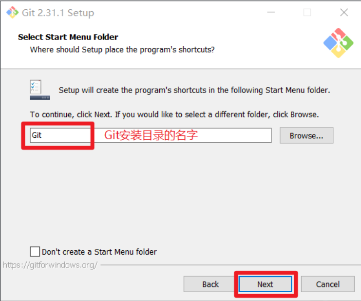

# Git

## 一、Git概述

Git是一个免费的、开源的**分布式版本控制系统**，可以快速高效地处理从小型到大型的各种项目。

Git易于学习，面积小，性能快，具有廉价的本地库，方便的暂存区域和多个工作流分支等特性。其性能优于Subversioon、CVS、Perforce、ClearCase等版本控制工具。

### 1.1 何为版本控制

版本控制是一种**记录文件内容变化**，以便将来查阅特定版本修订情况的系统。

版本控制其实最重要的是可以记录文件修改历史记录，从而让用户能够查看历史版本，方便版本切换。


### 1.2 为什么需要版本控制

从个人开发过渡到团队协作。


### 1.3 版本控制工具

#### 1.3.1 集中式版本控制工具

- CVS、SVN、VSS...

  > 集中化的版本控制系统诸如 CVS、SVN 等，都**有一个单一的集中管理的服务器**，保存所有文件的修订版本，而协同工作的人们都通过客户端连到这台服务器，取出最新的文件或者提交更新。多年以来，这已成为版本控制系统的标准做法。
  >
  > - 好处：
  >   1. 每个人都可以在一定程度上看到项目中的其他人正在做些什么。
  >   2. 管理员也可以轻松掌控每个开发者的权限，并且管理一个集中化的版本控制系统，要远比在各个客户端上维护本地数据库来得轻松容易。
  > - 坏处：
  >   1. 服务器宕机一小时，那么在这一小时内，谁都无法提交更新，也就无法协同工作。
  >
  > 


#### 1.3.2 分布式版本控制工具

- **Git**、Mercurial、Bazaar、Darcs...

  > 像 Git 这种分布式版本控制工具，**客户端提取的不是最新版本的文件快照，而是把代码仓库完整地镜像下来（本地库）**。这样任何一处协同工作用的文件发生故障，事后都可以用其他客户端的本地仓库进行恢复。因为每个客户端的每一次文件提取操作，实际上都是一次对整个文件仓库的完整备份。
  >
  > - 克服了集中式版本控制的缺陷：
  >   1. 服务器断网的情况下也可以进行开发（因为版本控制是在本地进行的）
  >   2. 每个客户端保存的也都是整个完整的项目（包含历史记录，更加安全）
  >
  > 


### 1.4 Git工作机制


1. 工作区：

   指代码文件保存到磁盘的位置(文件夹)

2. 暂存区：

   在工作区写了代码之后，需要让git知道这个文件。此时需要将工作区中的文件添加到暂存区。

3. 本地库：

   提交到本地库的代码会正式添加到历史版本中。也就是说在工作区和暂存区中的删除是无法恢复的，但是在本地库的可以恢复。


### 1.5 Git和代码托管中心

代码托管中心是基于网络服务器的远程代码仓库，称为**远程库**。

- 局域网：

  GitLab

- 互联网：

  GitHub

  Gitee


## 二、Git安装





## 三、Git常用命令

| 命令                                 | 作用           |
| ------------------------------------ | -------------- |
| git config --global user.name 用户名 | 设置用户签名   |
| git config --global user.email 邮箱  | 设置用户签名   |
| git init                             | 初始化本地库   |
| git status                           | 查看本地库状态 |
| git add 文件名                       | 添加到暂存区   |
| git commit -m "日志信息" 文件名      | 提交到本地库   |
| git reflog                           | 查看历史记录   |
| git reset --hard 版本号              | 版本穿梭       |

### 3.1 设置用户签名

#### 3.1.1 基本语法

git config --global user.name 用户名

git config --global user.email 邮箱

#### 3.1.2 案例

```bash
fengyz@fengyz-1 MINGW32 ~/Desktop
$ git config --global user.name fengyz

fengyz@fengyz-1 MINGW32 ~/Desktop
$ git config --global user.email fengyz@meixing.com

fengyz@fengyz-1 MINGW32 ~/Desktop
$ cat ~/.gitconfig
[user]
        email = fengyz@meixing.com
        name = fengyz
[color]
        ui = auto
```

> 说明：
>
> - **签名的作用是区分不同操作者身份**。用户的签名信息在每一个版本的提交信息中能够看到，以此确认本次提交是谁做的。
> - **Git 首次安装必须设置一下用户签名，否则无法提交代码。**
>
> 注意：
>
> - **这里设置用户签名和将来登录 GitHub（或其他代码托管中心）的账号没有任何关系。**


### 3.2 初始化本地库

#### 3.2.1 基本语法

git init

#### 3.2.2 案例

```bash
fengyz@fengyz-1 MINGW32 /d/example
$ git init
Initialized empty Git repository in D:/example/.git/

fengyz@fengyz-1 MINGW32 /d/example (master)
$ ll -a
total 8
drwxr-xr-x 1 fengyz 1049089 0  3月 26 15:27 ./
drwxr-xr-x 1 fengyz 1049089 0  3月 26 15:26 ../
drwxr-xr-x 1 fengyz 1049089 0  3月 26 15:27 .git/
```


### 3.3 查看本地库状态

#### 3.3.1 基本语法

git status

#### 3.3.2 案例

1. 首次查看本地库状态

   ```bash
   fengyz@fengyz-1 MINGW32 /d/example (master)
   $ git status
   #当前在master分支
   On branch master 
   #没有任何提交
   No commits yet
   #没有任何需要提交的文件
   nothing to commit (create/copy files and use "git add" to track)
   ```

2. 新增文件

   ```bash
   fengyz@fengyz-1 MINGW32 /d/example (master)
   #新建文件
   $ vim hello.txt
   
   fengyz@fengyz-1 MINGW32 /d/example (master)
   #查看文件目录
   $ ll
   total 1
   -rw-r--r-- 1 fengyz 1049089 390  3月 26 15:45 hello.txt
   
   fengyz@fengyz-1 MINGW32 /d/example (master)
   #查看文件内容
   $ cat hello.txt
   hello git! hello atguigu!
   hello git! hello atguigu!
   hello git! hello atguigu!
   hello git! hello atguigu!
   hello git! hello atguigu!
   hello git! hello atguigu!
   hello git! hello atguigu!
   hello git! hello atguigu!
   hello git! hello atguigu!
   hello git! hello atguigu!
   hello git! hello atguigu!
   hello git! hello atguigu!
   hello git! hello atguigu!
   hello git! hello atguigu!
   hello git! hello atguigu!
   ```

3. 再次查看本地库状态

   ```bash
   fengyz@fengyz-1 MINGW32 /d/example (master)
   $ git status
   On branch master
   
   No commits yet
   #一个未被追踪到的文件，这个文件只存在于工作区
   Untracked files:
     (use "git add <file>..." to include in what will be committed)
           hello.txt
   
   #可以使用 git add来追踪
   nothing added to commit but untracked files present (use "git add" to track)
   ```


### 3.4 添加暂存区

#### 3.4.1 基本语法

git add 文件名

#### 3.4.2 案例

```bash
fengyz@fengyz-1 MINGW32 /d/example (master)
$ git add hello.txt
```

**当暂存区中有文件时，查看本地库状态**

```bash
fengyz@fengyz-1 MINGW32 /d/example (master)
$ git status
On branch master

No commits yet
#你可以使用git rm --cache 文件名来将文件移除出暂存区(工作区依然存在)
Changes to be committed:
  (use "git rm --cached <file>..." to unstage)
#暂存区中的新文件
        new file:   hello.txt
```


### 3.5 提交本地库

#### 3.5.1 基本语法

git commit -m "日志信息" 文件名

#### 3.5.2 案例

```bash
fengyz@fengyz-1 MINGW32 /d/example (master)
$ git commit -m "my first commit" hello.txt
#master分支的一次提交，本地版本号(cbd7ebb)
[master (root-commit) cbd7ebb] my first commit
#改变一个文件，插入15行内容
1 file changed, 15 insertions(+)
 create mode 100644 hello.txt
```

**再次查看本地库状态**

```bash
fengyz@fengyz-1 MINGW32 /d/example (master)
$ git status
On branch master
#在当前分支，没有东西需要提交，你的工作树是干净的
nothing to commit, working tree clean
```


### 3.6 修改文件

#### 3.6.1 案例

```bash
fengyz@fengyz-1 MINGW32 /d/example (master)
$ vim hello.txt

fengyz@fengyz-1 MINGW32 /d/example (master)
$ cat hello.txt
hello git! hello atguigu!2222222222222
hello git! hello atguigu!
hello git! hello atguigu!
hello git! hello atguigu!
hello git! hello atguigu!
hello git! hello atguigu!
hello git! hello atguigu!
hello git! hello atguigu!
hello git! hello atguigu!
hello git! hello atguigu!
hello git! hello atguigu!
hello git! hello atguigu!
hello git! hello atguigu!
hello git! hello atguigu!
hello git! hello atguigu!
```

**当工作区有文件被修改，查看本地库状态**

```bash
fengyz@fengyz-1 MINGW32 /d/example (master)
$ git status
On branch master
Changes not staged for commit:
  (use "git add <file>..." to update what will be committed)
  (use "git restore <file>..." to discard changes in working directory)
#文件被修改
        modified:   hello.txt

no changes added to commit (use "git add" and/or "git commit -a")
```

再次添加到暂存区，并查看状态

```bash
fengyz@fengyz-1 MINGW32 /d/example (master)
$ git add hello.txt
```

```bash
fengyz@fengyz-1 MINGW32 /d/example (master)
$ git status
On branch master
Changes to be committed:
  (use "git restore --staged <file>..." to unstage)
        modified:   hello.txt
```

提交到本地库

```bash
fengyz@fengyz-1 MINGW32 /d/example (master)
$ git commit -m "my second commit" hello.txt
#新版本号 日志
[master c9e6347] my second commit
#一个文件被改变，新插入一行，删除一行
 1 file changed, 1 insertion(+), 1 deletion(-)
```

查看本地库状态

```bash
fengyz@fengyz-1 MINGW32 /d/example (master)
$ git status
On branch master
nothing to commit, working tree clean
```

查看版本信息

```bash
fengyz@fengyz-1 MINGW32 /d/example (master)
$ git reflog
#当前指针指向master分支的c9e6347版本
c9e6347 (HEAD -> master) HEAD@{0}: commit: my second commit
cbd7ebb HEAD@{1}: commit (initial): my first commit
```


### 3.7 查看版本信息

#### 3.7.1 查看历史版本

##### 3.7.1.1 基本语法

git reflog 查看版本信息

git log 查看版本详细信息

##### 3.7.1.2 案例

```bash
fengyz@fengyz-1 MINGW32 /d/example (master)
$ git reflog
#精简版本号 当前指针指向master分支的c9e6347版本 日志
c9e6347 (HEAD -> master) HEAD@{0}: commit: my second commit
cbd7ebb HEAD@{1}: commit (initial): my first commit
```

```bash
fengyz@fengyz-1 MINGW32 /d/example (master)
$ git log
#完整版本号 提交人 日期 日志
commit c9e6347a0d9114e10bfd0939f45ee1f2cc97f2b7 (HEAD -> master)
Author: fengyz <fengyz@meixing.com>
Date:   Sat Mar 26 16:17:11 2022 +0800

    my second commit

commit cbd7ebb35d3a915d5ecc267fc8a0659449f080e5
Author: fengyz <fengyz@meixing.com>
Date:   Sat Mar 26 16:01:31 2022 +0800

    my first commit
```


#### 3.7.2 版本穿梭

如果想切换到其他版本的状态，可以使用该命令

##### 3.7.2.1 基本语法

git reset --hard 版本号

##### 3.7.2.2 案例

```bash
#先查看历史版本
fengyz@fengyz-1 MINGW32 /d/example (master)
$ git reflog
c9e6347 (HEAD -> master) HEAD@{0}: commit: my second commit
cbd7ebb HEAD@{1}: commit (initial): my first commit

# 切换版本
fengyz@fengyz-1 MINGW32 /d/example (master)
$ git reset --hard cbd7ebb
HEAD is now at cbd7ebb my first commit
```

再查看历史版本

```bash
fengyz@fengyz-1 MINGW32 /d/example (master)
$ git reflog
#日志，切换到了cbd7ebb版本
cbd7ebb (HEAD -> master) HEAD@{0}: reset: moving to cbd7ebb
#历史版本
c9e6347 HEAD@{1}: commit: my second commit
#当前指针指向cbd7ebb版本
cbd7ebb (HEAD -> master) HEAD@{2}: commit (initial): my first commit
```

再查看文件，已经变成第一次提交的版本

```bash
fengyz@fengyz-1 MINGW32 /d/example (master)
$ cat hello.txt
hello git! hello atguigu!
hello git! hello atguigu!
hello git! hello atguigu!
hello git! hello atguigu!
hello git! hello atguigu!
hello git! hello atguigu!
hello git! hello atguigu!
hello git! hello atguigu!
hello git! hello atguigu!
hello git! hello atguigu!
hello git! hello atguigu!
hello git! hello atguigu!
hello git! hello atguigu!
hello git! hello atguigu!
hello git! hello atguigu!
```


## 四、Git分支操作


### 4.1 什么是分支

在版本控制过程中，同时推进多个任务，为每个任务，我们就可以创建每个任务的单独分支。使用分支意味着程序员可以把自己的工作从开发主线上分离开来，开发自己分支的时候，不会影响主线分支的运行。对于初学者而言，分支可以简单理解为副本，一个分支就是一个单独的副本。（分支底层其实也是指针的引用）


### 4.2 使用分支的好处

1. 同时并行推进多个功能的开发，提高开发效率。
2. 各个分支在开发的过程中，如果某一个分支开发失败，不会对其他分支有任何影响。失败的分支删除重新开发即可。


### 4.3 分支的操作

| 命令                | 作用                         |
| ------------------- | ---------------------------- |
| git branch 分支名   | 创建分支                     |
| git branch -v       | 查看分支                     |
| git checkout 分支名 | 切换分支                     |
| git merge 分支名    | 把指定的分支合并到当前分支上 |


#### 4.3.1 查看分支

##### 4.3.1.1 基本语法

git branch -v

##### 4.3.1.2 案例

```bash
fengyz@fengyz-1 MINGW32 /d/example (master)
$ git branch -v
#当前只有一个master分支
* master cbd7ebb my first commit
```


#### 4.3.2 创建分支

##### 4.3.2.1 基本语法

git branch 分支名

##### 4.3.2.2 案例

```bash
fengyz@fengyz-1 MINGW32 /d/example (master)
$ git branch hot-fix

fengyz@fengyz-1 MINGW32 /d/example (master)
$ git branch -v
  hot-fix cbd7ebb my first commit
* master  cbd7ebb my first commit
```


#### 4.3.3 切换分支

##### 4.3.3.1 基本语法

git checkout 分支名

##### 4.3.3.2 案例

```bash
fengyz@fengyz-1 MINGW32 /d/example (master)
$ git branch -v
  hot-fix cbd7ebb my first commit
#当前在master分支
* master  c9e6347 my second commit

fengyz@fengyz-1 MINGW32 /d/example (master)
$ git checkout hot-fix
#切换到hot-fix分支
Switched to branch 'hot-fix'

fengyz@fengyz-1 MINGW32 /d/example (hot-fix)
$ git branch -v
* hot-fix cbd7ebb my first commit
  master  c9e6347 my second commit
```


#### 4.3.4 修改分支

##### 4.3.4.1 案例

先查看当前分支

```bash
fengyz@fengyz-1 MINGW32 /d/example (hot-fix)
$ git branch -v
#当前在hot-fix分支上
* hot-fix cbd7ebb my first commit
  master  c9e6347 my second commit
```

在hot-fix分支对文件修改

```bash
fengyz@fengyz-1 MINGW32 /d/example (hot-fix)
$ vim hello.txt

fengyz@fengyz-1 MINGW32 /d/example (hot-fix)
$ cat hello.txt
hello git! hello atguigu!2222222222222
hello git! hello atguigu!
hello git! hello atguigu!
hello git! hello atguigu!
hello git! hello atguigu!
hello git! hello atguigu!
hello git! hello atguigu!
hello git! hello atguigu!
hello git! hello atguigu!
hello git! hello atguigu!
hello git! hello atguigu!
hello git! hello atguigu!
hello git! hello atguigu!
hello git! hello atguigu!
hello git! hello atguigu!999999999999
```

查看本地库状态

```bash
fengyz@fengyz-1 MINGW32 /d/example (hot-fix)
$ git status
On branch hot-fix
Changes not staged for commit:
  (use "git add <file>..." to update what will be committed)
  (use "git restore <file>..." to discard changes in working directory)
        modified:   hello.txt

no changes added to commit (use "git add" and/or "git commit -a")
```

将修改添加暂存区并提交本地库

```bash 
fengyz@fengyz-1 MINGW32 /d/example (hot-fix)
$ git add hello.txt

fengyz@fengyz-1 MINGW32 /d/example (hot-fix)
$ git status
On branch hot-fix
Changes to be committed:
  (use "git restore --staged <file>..." to unstage)
        modified:   hello.txt

fengyz@fengyz-1 MINGW32 /d/example (hot-fix)
$ git commit -m "hot-fix first commit" hello.txt
[hot-fix 05e5a1b] hot-fix first commit
 1 file changed, 1 insertion(+), 1 deletion(-)

fengyz@fengyz-1 MINGW32 /d/example (hot-fix)
$ git status
On branch hot-fix
nothing to commit, working tree clean
```

查看本地库文件

```bash
fengyz@fengyz-1 MINGW32 /d/example (hot-fix)
$ cat hello.txt
hello git! hello atguigu!2222222222222
hello git! hello atguigu!
hello git! hello atguigu!
hello git! hello atguigu!
hello git! hello atguigu!
hello git! hello atguigu!
hello git! hello atguigu!
hello git! hello atguigu!
hello git! hello atguigu!
hello git! hello atguigu!
hello git! hello atguigu!
hello git! hello atguigu!
hello git! hello atguigu!
hello git! hello atguigu!
hello git! hello atguigu!999999999999
```

查看历史记录能发现，当前指向的是hot-fix分支下的第一个版本

```bash
fengyz@fengyz-1 MINGW32 /d/example (hot-fix)
$ git reflog
05e5a1b (HEAD -> hot-fix) HEAD@{0}: commit: hot-fix first commit
c9e6347 (master) HEAD@{1}: reset: moving to c9e6347
cbd7ebb HEAD@{2}: checkout: moving from master to hot-fix
c9e6347 (master) HEAD@{3}: reset: moving to c9e6347
cbd7ebb HEAD@{4}: reset: moving to cbd7ebb
cbd7ebb HEAD@{5}: reset: moving to cbd7ebb
c9e6347 (master) HEAD@{6}: commit: my second commit
cbd7ebb HEAD@{7}: commit (initial): my first commit
```

此时切换回master分支就会发现，文件还是master分支下的版本

```bash
fengyz@fengyz-1 MINGW32 /d/example (hot-fix)
$ git checkout master
Switched to branch 'master'

fengyz@fengyz-1 MINGW32 /d/example (master)
$ cat hello.txt
hello git! hello atguigu!2222222222222
hello git! hello atguigu!
hello git! hello atguigu!
hello git! hello atguigu!
hello git! hello atguigu!
hello git! hello atguigu!
hello git! hello atguigu!
hello git! hello atguigu!
hello git! hello atguigu!
hello git! hello atguigu!
hello git! hello atguigu!
hello git! hello atguigu!
hello git! hello atguigu!
hello git! hello atguigu!
hello git! hello atguigu!
```


#### 4.3.5 合并分支

##### 4.3.5.1 基本语法

git merge 分支名

##### 4.3.5.2 案例

1. 在master分支上合并hot-fix分支

   ```bash
   #将hot-fix合并到master分支，需要将当前分支切换到master分支
   fengyz@fengyz-1 MINGW32 /d/example (master)
   $ git merge hot-fix
   Updating c9e6347..05e5a1b
   Fast-forward
    hello.txt | 2 +-
    1 file changed, 1 insertion(+), 1 deletion(-)
    
    fengyz@fengyz-1 MINGW32 /d/example (master)
   $ cat hello.txt
   hello git! hello atguigu!2222222222222
   hello git! hello atguigu!
   hello git! hello atguigu!
   hello git! hello atguigu!
   hello git! hello atguigu!
   hello git! hello atguigu!
   hello git! hello atguigu!
   hello git! hello atguigu!
   hello git! hello atguigu!
   hello git! hello atguigu!
   hello git! hello atguigu!
   hello git! hello atguigu!
   hello git! hello atguigu!
   hello git! hello atguigu!
   hello git! hello atguigu!999999999999
   ```

2. 产生冲突

   > 什么时候会产生冲突：
   >
   > 合并分支时，两个分支在**同一个文件的同一个位置**有两套完全不同的修改。Git 无法替我们决定使用哪一个。必须**人为决定**新代码内容。
   >
   > 制造产生冲突的情况：
   >
   > 首先修改master分支的文件内容并添加暂存区提交本地库：
   >
   > ```bash
   > fengyz@fengyz-1 MINGW32 /d/example (master)
   > $ vim hello.txt
   > 
   > fengyz@fengyz-1 MINGW32 /d/example (master)
   > $ cat hello.txt
   > hello git! hello atguigu!2222222222222
   > hello git! hello atguigu!
   > hello git! hello atguigu!
   > hello git! hello atguigu!
   > hello git! hello atguigu!
   > hello git! hello atguigu!
   > hello git! hello atguigu!
   > hello git! hello atguigu!
   > hello git! hello atguigu!
   > hello git! hello atguigu!
   > hello git! hello atguigu!
   > hello git! hello atguigu!
   > hello git! hello atguigu!
   > hello git! hello atguigu!master test
   > hello git! hello atguigu!999999999999
   > 
   > fengyz@fengyz-1 MINGW32 /d/example (master)
   > $ git add hello.txt
   > 
   > fengyz@fengyz-1 MINGW32 /d/example (master)
   > $ git commit -m "master test" hello.txt
   > [master b2640b6] master test
   >  1 file changed, 1 insertion(+), 1 deletion(-)
   > ```
   >
   > 将分支切换到hot-fix，也修改文件内容并提交：
   >
   > ```bash
   > fengyz@fengyz-1 MINGW32 /d/example (master)
   > $ git checkout hot-fix
   > Switched to branch 'hot-fix'
   > 
   > fengyz@fengyz-1 MINGW32 /d/example (hot-fix)
   > $ vim hello.txt
   > 
   > fengyz@fengyz-1 MINGW32 /d/example (hot-fix)
   > $ cat hello.txt
   > hello git! hello atguigu!2222222222222
   > hello git! hello atguigu!
   > hello git! hello atguigu!
   > hello git! hello atguigu!
   > hello git! hello atguigu!
   > hello git! hello atguigu!
   > hello git! hello atguigu!
   > hello git! hello atguigu!
   > hello git! hello atguigu!
   > hello git! hello atguigu!
   > hello git! hello atguigu!
   > hello git! hello atguigu!
   > hello git! hello atguigu!
   > hello git! hello atguigu!hot-fix test
   > hello git! hello atguigu!999999999999
   > 
   > fengyz@fengyz-1 MINGW32 /d/example (hot-fix)
   > $ git add hello.txt
   > 
   > fengyz@fengyz-1 MINGW32 /d/example (hot-fix)
   > $ git commit -m "hot-fix test" hello.txt
   > [hot-fix 7f6c3c5] hot-fix test
   >  1 file changed, 1 insertion(+), 1 deletion(-)
   > ```

   切换回master分支合并hot-fix分支

   ```bash
   fengyz@fengyz-1 MINGW32 /d/example (hot-fix)
   $ git checkout master
   Switched to branch 'master'
   
   fengyz@fengyz-1 MINGW32 /d/example (master)
   $ git merge hot-fix
   Auto-merging hello.txt
   #冲突，在hello.txt有合并冲突，自动合并失败
   CONFLICT (content): Merge conflict in hello.txt
   Automatic merge failed; fix conflicts and then commit the result.
   
   #当前在master分支中，状态是正在合并中...
   fengyz@fengyz-1 MINGW32 /d/example (master|MERGING)
   $ 
   
   fengyz@fengyz-1 MINGW32 /d/example (master|MERGING)
   $ git status
   On branch master
   You have unmerged paths.
     (fix conflicts and run "git commit")
     (use "git merge --abort" to abort the merge)
   #没合并的路径，hello.txt有两个修改
   Unmerged paths:
     (use "git add <file>..." to mark resolution)
           both modified:   hello.txt
   
   no changes added to commit (use "git add" and/or "git commit -a")
   ```

   **处理：需要手动打开该文件**

   ```bash
   hello git! hello atguigu!2222222222222
   hello git! hello atguigu!
   hello git! hello atguigu!
   hello git! hello atguigu!
   hello git! hello atguigu!
   hello git! hello atguigu!
   hello git! hello atguigu!
   hello git! hello atguigu!
   hello git! hello atguigu!
   hello git! hello atguigu!
   hello git! hello atguigu!
   hello git! hello atguigu!
   hello git! hello atguigu!
   <<<<<<< HEAD
   #当前分支代码
   hello git! hello atguigu!master test
   =======
   #冲突分支代码
   hello git! hello atguigu!hot-fix test
   >>>>>>> hot-fix
   hello git! hello atguigu!999999999999
   ~                                                                                                               ~                                                                                                               ~                                                                                                               ~                                                                                                               ~                                                                                                               ~                                                                                                               ~                                                                                                               ~                                                                                                               ~                                                                                                               hello.txt [unix] (17:57 26/03/2022) 
   ```

   手动修改文件，保存退出

   ```bash
   hello git! hello atguigu!2222222222222
   hello git! hello atguigu!
   hello git! hello atguigu!
   hello git! hello atguigu!
   hello git! hello atguigu!
   hello git! hello atguigu!
   hello git! hello atguigu!
   hello git! hello atguigu!
   hello git! hello atguigu!
   hello git! hello atguigu!
   hello git! hello atguigu!
   hello git! hello atguigu!
   hello git! hello atguigu!
   hello git! hello atguigu!master test
   hello git! hello atguigu!hot-fix test
   hello git! hello atguigu!999999999999
   ```

   将修改后的文件重新添加暂存区并提交本地库，**注意：此时提交本地库的文件不能带文件名**

   ```bash
   fengyz@fengyz-1 MINGW32 /d/example (master|MERGING)
   $ git add hello.txt
   
   fengyz@fengyz-1 MINGW32 /d/example (master|MERGING)
   $ git commit -m "merge hot-fix"
   [master f04c1dc] merge hot-fix
   
   #MERGING消失，解决冲突
   fengyz@fengyz-1 MINGW32 /d/example (master)
   $ 
   
   fengyz@fengyz-1 MINGW32 /d/example (master)
   $ cat hello.txt
   hello git! hello atguigu!2222222222222
   hello git! hello atguigu!
   hello git! hello atguigu!
   hello git! hello atguigu!
   hello git! hello atguigu!
   hello git! hello atguigu!
   hello git! hello atguigu!
   hello git! hello atguigu!
   hello git! hello atguigu!
   hello git! hello atguigu!
   hello git! hello atguigu!
   hello git! hello atguigu!
   hello git! hello atguigu!
   hello git! hello atguigu!master test
   hello git! hello atguigu!hot-fix test
   hello git! hello atguigu!999999999999
   ```


### 4.4 分支原理

master、hot-fix 其实都是指向具体版本记录的指针。当前所在的分支，其实是由 HEAD决定的。所以**创建分支的本质就是多创建一个指针。**

HEAD 如果指向 master，那么我们现在就在 master 分支上。

HEAD 如果指向 hotfix，那么我们现在就在 hotfix 分支上。


## 五、Git团队协作机制

### 5.1  团队内合作


### 5.2 跨团队合作


## 六、GitHub操作

### 6.1 创建远程仓库


### 6.2 远程仓库操作

| 命令                               | 作用                                                     |
| ---------------------------------- | -------------------------------------------------------- |
| git remote -v                      | 查看当前所有远程地址别名                                 |
| git remote add 别名 远程地址       | 起别名                                                   |
| git push 别名 分支                 | 推送本地分支上的内容到远程仓库                           |
| git clone 远程地址                 | 将远程仓库的内容克隆到本地                               |
| git pull 远程库地址别名 远程分支名 | 将远程仓库对于分支最新内容拉下来后与当前本地分支直接合并 |


#### 6.2.1 创建远程仓库别名

##### 6.2.1.1 基本语法

git remote -v 查看当前所有远程地址别名

git remote add 别名 远程地址 起别名

##### 6.2.1.2 案例

```bash
fengyz@fengyz-1 MINGW32 /d/example (hot-fix)
$ git remote add myblogs https://github.com/ZzzPro/MyBlogs.git

fengyz@fengyz-1 MINGW32 /d/example (hot-fix)
$ git remote -v
#拉取和推送
myblogs https://github.com/ZzzPro/MyBlogs.git (fetch)
myblogs https://github.com/ZzzPro/MyBlogs.git (push)
```


#### 6.2.2 推送本地分支到远程仓库

##### 6.2.2.1 基本语法

git push 别名 分支

##### 6.2.2.2 案例

