# HTML基础

## 一、系统结构

1. B/S结构：

   Browser / Server （浏览器/服务器的交互形式。）

   Browser支持哪些语言：HTML、CSS、JavaScript

   

   写HTML、CSS、JavaScript的叫做：WEB前端开发工程师

   前端页面上的图片需要UI设计师完成

   Server是服务器端，主要语言很多：C、C++、Java、Python...

   

   B/S架构的优点和缺点：

   - 缺点：速度慢、体验不好、界面不炫酷
   - 优点：升级方便，只升级服务器端，维护成本低

2. C/S结构：

   Client / Server （客户端/服务端的交互形式。）

   

   常见的C/S架构的系统：QQ、微信...

   

   - 缺点：升级麻烦，维护成本高
   - 优点：速度快、体验好、界面炫酷


## 二、什么是HTML？怎么开发HTML？怎么运行HTML？

### 2.1什么是HTML？

Hyper Text Markup Language（超文本标记语言）

> 由大量的标签组成，每一个标签都有开始标签和结束标签<标签>
>
> ​	<标签>
>
> ​		<标签 属性名="属性值">
>
> ​		</标签>
>
> ​	</标签>
>
> </标签>

超文本：流媒体、图片、声音、视频...

### 2.2怎么开发HTML

html开发的时候使用普通的文本编辑器就行，创建的文件扩展名是.html或者.htm

### 2.3怎么运行HTML

直接使用浏览器打开HTML文件就行

### 2.4HTML是谁制定的

W3C指定了HTML的规范，每个浏览器生产厂家都会遵守规范，HTML规范目前最高的版本是HTML5（H5）


## 三、第一个HTML页面

```html
<!doctype html> <!--加上这行代码说明此html是html5页面，不加就是html4-->
<!--注释方法-->
<html>
    <!--头-->
	<head>
        <!--网页标题，显示在左上角-->
		<title>网页标题</title>
	</head>
    <!--体-->
	<body>
		网页的主体内容，欢迎学习HTML
	</body>
</html>
```

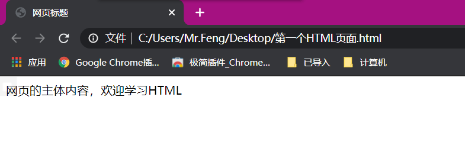

## 四、HTML的基本标签

```html
<!doctype html>
<html>
	<head>
		<title>HTML的基本标签</title>
	</head>
	<body>
		
		<!--段落标记-->
		<p>发大股东噶地方后台回复会发生个股分化和发大股东噶地方后台回复会发生个股分化和发大股东噶地方后台回复会发</p><p>生个股分化和发大股东噶地方后台回复会发生个股分化和发大股东噶地方后台回复会发生个股分化和发大股</p>东噶地方后台回复会发生个股分化发大股东噶地方后台回复会发生个股分化发大股东噶地方后台回复会发生个股分化发大股东噶地方后台回复会发生个股分化和发大股东噶地方后台回复会发生个股分化和

		<!--标题字：是HTML预留的格式，和Word中的标题字相同-->
		<h1>标题字</h1>
		<h2>标题字</h2>
		<h3>标题字</h3>
		<h4>标题字</h4>
		<h5>标题字</h5>
		<h6>标题字</h6>

		<!--换行标记,br标签是一个独目标记-->
		hello
		world!
		hello <br> world!

		<!--横线标记-->
		<hr>
		<!--color和width是hr标签的属性-->
		<hr color="red" width="50%">
		<!--语法很松散-->
		<hr color='green' width=30%>

		<!--预留格式-->
		<pre>
		for(int i = 0; i < 10; i++){
			System.out.println("i = " + i);
		}
		</pre>

		<del>删除字</del>
		<ins>插入字</ins>
		<b>粗体字</b>
		<i>斜体字</i>

		<!--右上角加字-->
		10<sup>2</sup>
		
		<!--右下角加字-->
		10<sub>2</sub>

		<!--字体标签-->
		<font color="red" size="20">字体标签</font>
	</body>
</html>
```

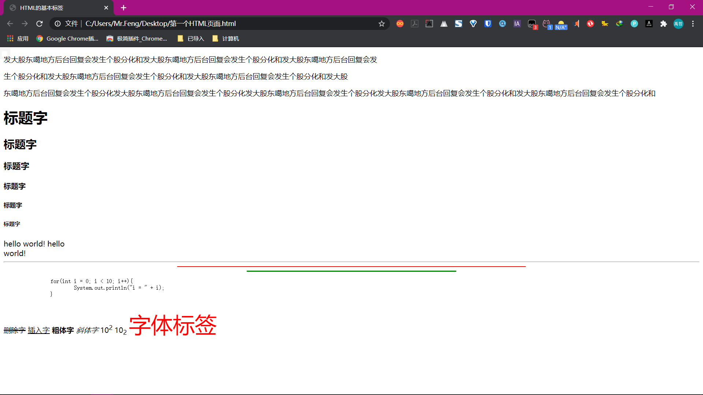

## 五、HTML的实体符号

在html中如果要写大于号或小于号，会被解析成标记符号

- 如果想显示b < a > c，该如何写

  ```html
  <!doctype html>
  <html>
  	<head>
  		<title>实体符号</title>
  	</head>
  	<body>
  		<!-- 显示b<a>c -->
  		b<a>c
          <!-- 实体符号特点是：以&开头，以;结尾。 -->
  		b&lt;a&gt;c
          <!-- 该如何显示空格 -->
          a&nbsp;&nbsp;&nbsp;&nbsp;bc
  	</body>
  </html>
  ```

  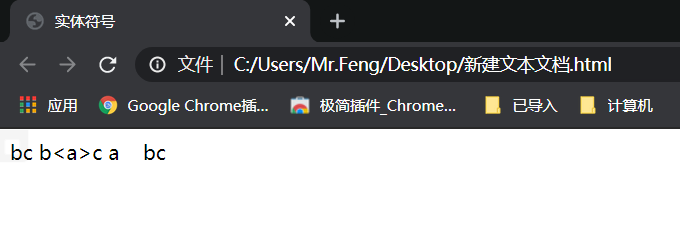

## 六、HTML的表格

语法格式：

```html
<!--table表示表格，tr表示行，td表示每行的列-->
<table>
	<tr>
    	<td></td>
    </tr>
</table>
```

### 6.1表格中的常用标签

```html
<!doctype html>
<html>
	<head>
		<title>表格</title>
	</head>
	<body>
		<!-- 
			border="1px" 设置表格的边框为1像素宽度 
			width宽度
			height高度
		-->

		<!-- 
		<table border="1px" width="300px"> 
		-->

		<!-- 百分比宽度按照当前窗口宽度计算 -->
		<table align="center" border="1px" width="30%" height="150px">

			<!-- align对齐方式 -->
			<tr align="center">
				<td>1</td>
				<td>2</td>
				<td>3</td>
			</tr>
			
			<tr>
				<td>4</td>
				<td>5</td>
				<td>6</td>
			</tr>
			
			<tr>
				<td>7</td>
				<td>8</td>
				<td align="center">9</td>
			</tr>
		</table>
	</body>
</html>
```

### 6.2表格中的合并单元格

使用**rowspan**和**colspan**标签合并单元格

- 需要合并7和8、6和9的单元格该如何操作

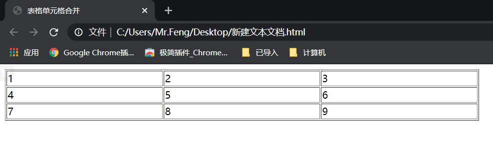

```html
<!doctype html>
<html>
	<head>
		<title>表格单元格合并</title>
	</head>
	<body>
		<!--注意事项：
			1.row合并的时候，删除下边的单元格
			2.col合并的时候，删除哪个都可以
		-->
		<table border="1px" width="50%">
			<tr>
				<td>1</td>
				<td>2</td>
				<td>3</td>
			</tr>
			<tr>
				<td>4</td>
				<td>5</td>
				<td rowspan="2">6</td>
			</tr>
			<tr>
				<!--<td>7</td>-->
				<td colspan="2">8</td>
				<!-- 通常删去下边的单元格，如果删去上边的单元格，在下边的单元格使用rowspan会出错 -->
				<!--<td>9</td>-->
        </table>
	</body>
</html>
```


### 6.3th标签

```html
<!DOCTYPE html>
<html>
	<head>
		<title></title>
	</head>
	<body>
		<table width="50%" border="1px">
			<tr>
				<th>员工编号</th>
				<th>员工名称</th>
				<th>部门名称</th>
			</tr>
			<tr>
				<td>1</td>
				<td>2</td>
				<td>3</td>
			</tr>
			<tr>
				<td>4</td>
				<td>5</td>
				<td>6</td>
			</tr>
			<tr>
				<td>7</td>
				<td>8</td>
				<td>9</td>
			</tr>
		</table>
	</body>
</html>
```

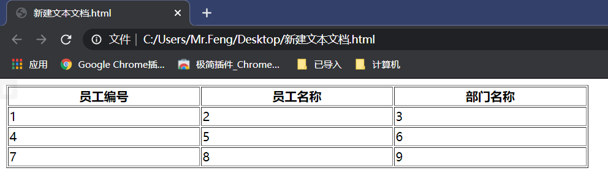

**th标签也是一个单元格，但是和td标签的区别是自动加粗居中。**


### 6.4thead、tbody、tfoot标签

对表格的头、体、脚更方便操作，在table中不是必须的标签，但为了后期js代码的编写，建议用。

```html
<!DOCTYPE html>
<html>
	<head>
		<title></title>
	</head>
	<body>
		<table width="50%" border="1px">
			<!-- 头 -->
			<thead>
			<tr>
				<th>员工编号</th>
				<th>员工名称</th>
				<th>部门名称</th>
			</tr>
			</thead>
			<!-- 体 -->
			<tbody>
			<tr>
				<td>1</td>
				<td>2</td>
				<td>3</td>
			</tr>
			<tr>
				<td>a</td>
				<td>b</td>
				<td rowspan="2">c</td>
			</tr>
			<tr>
				<td colspan="2">d</td>
			</tr>
			</tbody>
			<!-- 脚 -->
			<tfoot>
			<tr>
				<td>4</td>
				<td>5</td>
				<td>6</td>
			</tr>
			</tfoot>

		</table>
	</body>
</html>
```

## 七、背景颜色和背景图片

使用bgcolor设置背景颜色，使用background设置背景图片

```html
<!DOCTYPE html>
<html lang="en">
<head>
    <!-- 告诉浏览器使用哪种字符集打开此html文件 -->
    <!-- 通常文件采用什么字符集就赋给什么字符集 -->
    <meta charset="UTF-8">
    <title>背景颜色和背景图片</title>
</head>
<body bgcolor="red" background="image/2_trapped2_4k.jpg">

</body>
</html>
```

### 7.1图片

> 图片和背景图片的区别：
>
> 图片是在网页上的一个元素。
>
> 背景图片是贴在页面的背景上的。

1. img标签是图片标签
2. src属性是图片路径
3. width属性设置宽度，height属性设置高度
4. title属性鼠标悬停图片会显示title信息
5. alt属性如果网页没找到图片或者加载失败时，会显示alt信息
6. 设置图片大小时，只设置宽度即可，高度会等比例缩放

```html
<!DOCTYPE html>
<html lang="en">
<head>
    <meta charset="UTF-8">
    <title>图片</title>
</head>
<body>
    <!-- 只设置宽度即可，等比例縮放 -->
    

    <br><br><br>

    
</body>
</html>
```

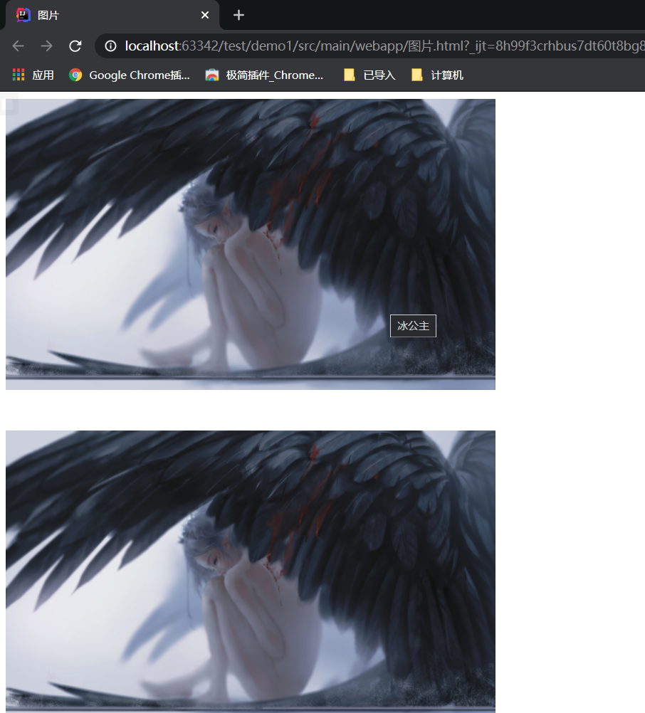


## 八、超链接

### 8.1文字超链接

使用a标签可以设置超链接

```html
<!DOCTYPE html>
<html lang="en">
<head>
    <meta charset="UTF-8">
    <title>超链接</title>
</head>
<body>
    <!-- href(hot references 热引用)href后边一定是一个资源的地址 -->
    <!-- 后边的路径可以是绝对路径或相对路径，可以是网络中某个资源的路径，也可以是本地资源的路径 -->
    <a href="http://www.baidu.com">百度</a>
</body>
</html>
```

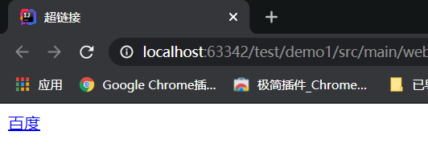

### 8.2图片超链接

```html
<!DOCTYPE html>
<html lang="en">
<head>
    <meta charset="UTF-8">
    <title>超链接</title>
</head>
<body>
    <a href="http://www.baidu.com">
        
    </a>
</body>
</html>
```

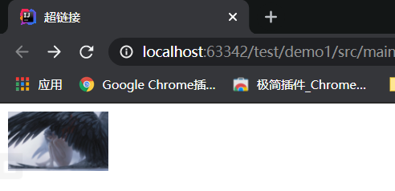

### 8.3超链接的特点

1. 有下划线
2. 鼠标停留在超链接上面显示小手形状
3. 点击超链接后可以跳转页面

### 8.4target属性

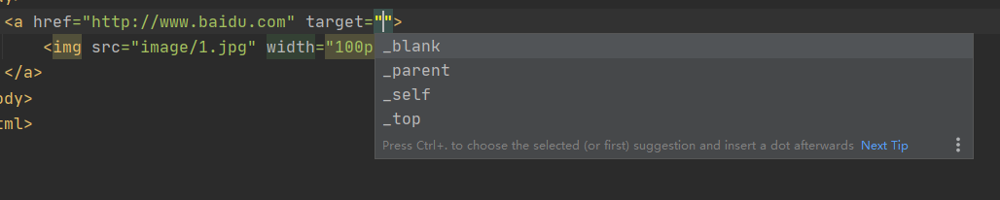

> target可取值：
>
> 1. _blank：新窗口打开
> 2. _parent：父窗口打开
> 3. _self：当前窗口打开
> 4. _top：顶级窗口打开

### 8.5超链接的作用

通过超链接可以从浏览器向服务器发送请求。

请求（request）——浏览器向服务器发送数据

响应（response）——服务器向浏览器发送数据


B/S结构的系统：每一个请求都会对应一个响应

B——请求——>S

S——响应——>B


## 九、列表

   列表分为有序列表和无序列表

### 9.1无序列表

可以通过type改变无序列表的标记

```html
    <!-- 无序列表 -->
    <ul type="circle">
        <li>中国
            <ul type="square">
                <li>北京
                    <ul type="disc">
                        <li>海淀</li>
                        <li>中关村</li>
                    </ul>
                </li>
                <li>辽宁</li>
                <li>天津</li>
            </ul>
        </li>
        <li>美国</li>
        <li>韩国</li>
    </ul>
```

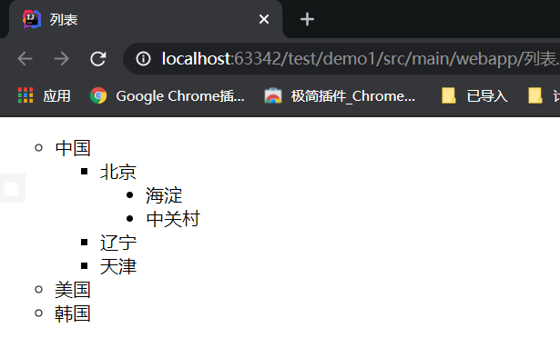

### 9.2有序列表

可以通过type改变有序列表标记

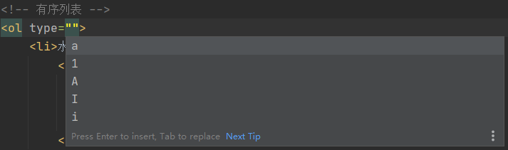

```html
<!-- 有序列表 -->
    <ol>
        <li>水果
            <ol>
                <li>苹果</li>
                <li>西瓜</li>
                <li>桃子</li>
            </ol>
        </li>
        <li>蔬菜
            <ol>
                <li>西红柿</li>
            </ol>
        </li>
        <li>甜点</li>
    </ol>
```


## 十、表单（重要）

### 10.1表单的用处

> 1. 用来接收用户的信息
> 2. 表单展现之后，用户填写表单，点击提交按钮提交数据给服务器


### 10.2如何画表单

使用form标签，**一个html中可以有多个表单**


### 10.3form标签中的action属性

由于表单最终需要提交给服务器，所以需要在action属性中给出**服务器地址**

**action属性用来指定数据提交给哪个服务器。**

**action属性和超链接中href属性一样，都可以向服务器发送请求（request）**


### 10.4input标签

#### 10.4.1type属性

1. submit：

   > 表示该按钮是一个提交按钮，具有提交表单的能力

2. button：

   > 表示是一个普通按钮，不具备提交表单的能力
   >
   > - 可以通过value属性来设置按钮上显示的文本

3. text：

   > 表示是一个文本框

4. password：

   > 表示是一个密码框

5. checkbox：

   > 表示是一个复选框

6. radio：

   > 表示是一个单选按钮
   
7. reset：

   > 表示是一个清空按钮


### 10.5一个简单的用户名表单

```html
<!DOCTYPE html>
<html lang="en">
<head>
    <meta charset="UTF-8">
    <title>表单form</title>
</head>
<body>
    <form>
        用户名:<input type="text"/>
        密码:<input type="password"/>
        <input type="submit" value="提交">
    </form>
</body>
</html>
```

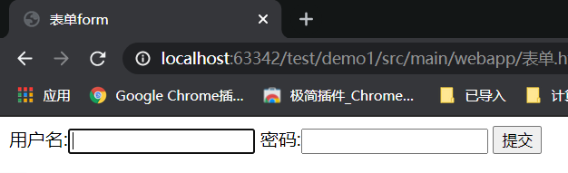

使用表格优化后

```html
<!DOCTYPE html>
<html lang="en">
<head>
    <meta charset="UTF-8">
    <title>表单form</title>
</head>
<body>
    <form>
        用户名:<input type="text"/>
        密码:<input type="password"/>
        <input type="submit" value="提交">
    </form>
    <br/>
    <br/>
    <br/>
    <br/>
    <form action="">
    <table>
        <tr>
            <td>用户名:</td>
            <td><input type="text"></td>
        </tr>
        <tr>
            <td>密码:</td>
            <td><input type="password"></td>
        </tr>
        <tr align="center">
            <td colspan="2">
                <input type="submit" value="登录">
                &nbsp;&nbsp;&nbsp;&nbsp;&nbsp;&nbsp;
                <input type="reset" value="清空">
            </td>
        </tr>
    </table>
    </form>
</body>
</html>
```

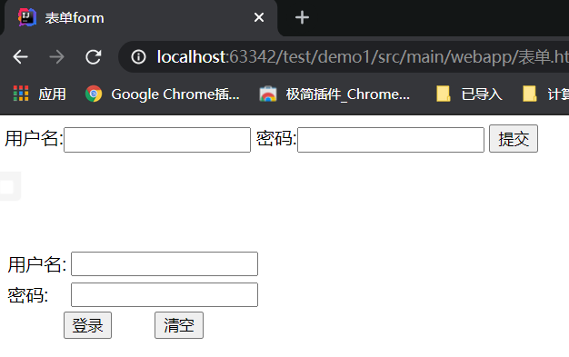

### 10.6如何提交数据

**需要在input标签中设置name才会提交**

1. 未设置name时

   > ```html
   > <form action="http://localhost:8080/jd/login">
   >     <table>
   >         <tr>
   >             <td>用户名:</td>
   >             <td><input type="text"></td>
   >         </tr>
   >         <tr>
   >             <td>密码:</td>
   >             <td><input type="password"></td>
   >         </tr>
   >         <tr align="center">
   >             <td colspan="2">
   >                 <input type="submit" value="登录">
   >                 &nbsp;&nbsp;&nbsp;&nbsp;&nbsp;&nbsp;
   >                 <input type="reset" value="清空">
   >             </td>
   >         </tr>
   >     </table>
   >     </form>
   > ```
   >
   > 点击提交按钮后：
   >
   > 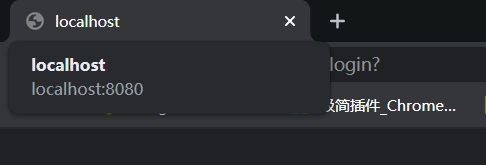

2. 设置name后

   > ```html
   >     <form action="http://localhost:8080/jd/login">
   >     <table>
   >         <tr>
   >             <td>用户名:</td>
   >             <td><input type="text" name="username"></td>
   >         </tr>
   >         <tr>
   >             <td>密码:</td>
   >             <td><input type="password" name="userpwd"></td>
   >         </tr>
   >         <tr align="center">
   >             <td colspan="2">
   >                 <input type="submit" value="登录">
   >                 &nbsp;&nbsp;&nbsp;&nbsp;&nbsp;&nbsp;
   >                 <input type="reset" value="清空">
   >             </td>
   >         </tr>
   >     </table>
   >     </form>
   > ```
   >
   > 设置name后，点击提交按钮后：
   >
   > 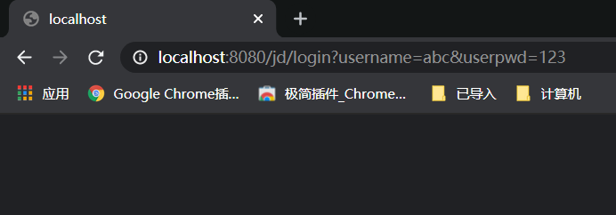

**表单以“http://localhost:8080/jd/login?username=abc&userpwd=123”的格式来提交到服务器**

**格式：action?name=value&name=value&name=value&name=value**

**重点：表单项写了name属性的一律会提交给服务器，不想提交这项，不要写name属性。**


### 10.7综合（用户注册的表单）

```html
<!DOCTYPE html>
<html lang="en">
<head>
    <meta charset="UTF-8">
    <title>用户注册的表单</title>
</head>
<body>
<!--
    用户注册：
        用户名
        密码
        确认密码
        性别
        兴趣爱好
        学历
        简介
-->
    <form action="http://localhost:8080/jd/register">
        <table>
            <tr>
                <td>用户名：</td>
                <td>
                    <input type="text" name="username" />
                </td>
            </tr>
            <tr>
                <td> 密码：</td>
                <td>
                    <input type="password" name="userpwd">
                </td>
            </tr>
            <tr>
                <!-- 确认密码不用提交到服务器，前台判断可以通过JavaScript判断 -->
                <td>确认密码：</td>
                <td>
                    <input type="password">
                </td>
            </tr>
            <tr>
                <!-- 通过设置相同的name可以设置为一组单选框 -->
                <!-- 单选按钮的value需要手动指定 -->
                <!-- 默认选中需要指定checked -->
                <td>性别：</td>
                <td>
                    <input type="radio" name="sex" value="1" checked/>男
                    <input type="radio" name="sex" value="0"/>女
                </td>
            </tr>
            <tr>
                <!-- 默认选中同样可以使用checked指定 -->
                <td>兴趣爱好：</td>
                <td>
                    <input type="checkbox" name="hobby" value="basketball">篮球
                    <input type="checkbox" name="hobby" value="football">足球
                    <input type="checkbox" name="hobby" value="ping-pong" checked>乒乓球
                </td>
            </tr>
            <tr>
                <!-- 下拉列表中默认选中使用selected指定 -->
                <td>学历：</td>
                <td>
                    <select name="grade">
                        <option value="gz">高中</option>
                        <option value="dz">大专</option>
                        <option value="bk" selected>本科</option>
                        <option value="ss">硕士</option>
                    </select>
                </td>
            </tr>
            <tr>
                <!-- 文本域没有value属性，用户输入的内容即是value -->
                <!-- 文本域可以指定行数和列数 -->
                <td>简介：</td>
                <td>
                    <textarea name="introduce" rows="10" cols="60">
                    </textarea>
                </td>
            </tr>
            <tr align="center">
                <td colspan="2">
                    <input type="submit" value="注册"/>
                    &nbsp;&nbsp;&nbsp;&nbsp;&nbsp;&nbsp;
                    <input type="reset" value="重置"/>
                </td>
            </tr>
        </table>
    </form>
</body>
</html>
```

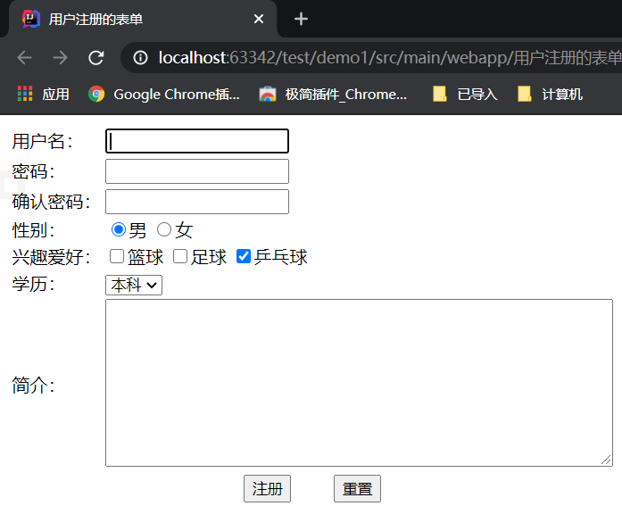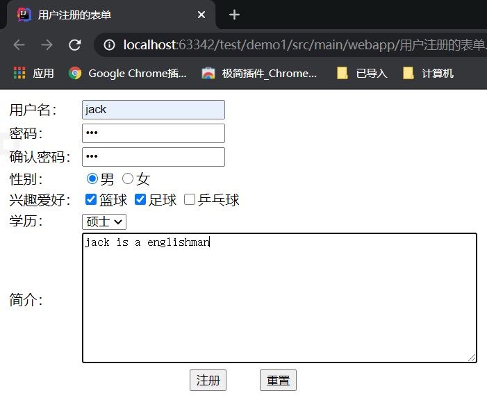


```
// 地址栏显示
http://localhost:8080/jd/register?username=jack&userpwd=123&sex=1&hobby=basketball&hobby=football&grade=ss&introduce=jack+is+a+englishman
```

### 10.8form标签中的method属性

method的属性有**"get"**和**"post"**两种

1. get

   > 如果method使用get属性，用户提交的属性会显示在地址栏中。
   >
   > 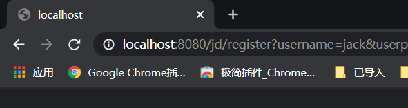

2. post

   > 如果method使用post属性，用户提交的属性不会显示在地址栏中。
   >
   > 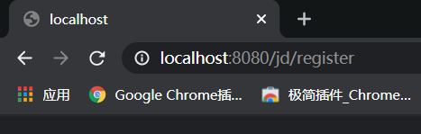

3. **注意：method属性不指定，或者指定get，这种情况下，默认都是get。除非指定method属性是post的时候，才是post请求，剩下所有的请求都是get。**

4. 超链接也可以提交数据到服务器，但是提交的数据是固定不变的

   > ```html
   > <a href="http://localhost:8080/oa/save?username=jack&password=111">提交</a>
   > ```
   >
   > **注意：超链接是get请求，不是post请求。**

### 10.9下拉列表

#### 10.9.1下拉列表支持多选

使用select标签中的multiple属性来指定多选（按住ctrl即可多选）

```html
<!DOCTYPE html>
<html lang="en">
<head>
    <meta charset="UTF-8">
    <title>下拉列表支持多选</title>
</head>
<body>
    <select multiple="multiple">
        <option>北京</option>
        <option>吉林</option>
        <option>辽宁</option>
        <option>内蒙古</option>
        <option>黑龙江</option>
        <option>上海</option>
    </select>
</body>
</html>
```

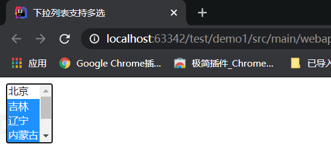

> 使用multiple="multiple"来指定多选，使用size属性可以指定显示的条数

### 10.10file控件

使用file控件可以选择文件，**文件上传专用**

```html
<!DOCTYPE html>
<html lang="en">
<head>
    <meta charset="UTF-8">
    <title>file控件</title>
</head>
<body>
    <input type="file">
</body>
</html>
```

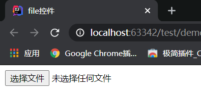

### 10.11hidden控件

隐藏域（hidden）：网页上看不到，但是表单提交的时候数据会自动提交给服务器

```html
<!DOCTYPE html>
<html lang="en">
<head>
    <meta charset="UTF-8">
    <title>hidden控件</title>
</head>
<body>
    <form action="http://localhost:8080/oa/save">
        <input type="hidden" name="userid" value="111">
        用户代码：<input type="text" name="usercode">
        <input type="submit" value="提交">
    </form>
</body>
</html>
```

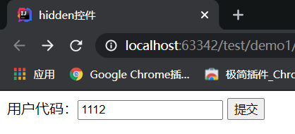

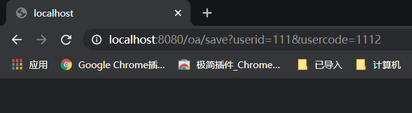

### 10.12readonly与disabled

```html
<!DOCTYPE html>
<html lang="en">
<head>
    <meta charset="UTF-8">
    <title>readonly和disabled</title>
</head>
<body>
    <form action="http://localhost:8080/oa/save">
        用户代码：<input type="text" name="usercode" value="110" readonly>
        <br>
        用户姓名：<input type="text" name="username" value="张三" disabled>
        <br>
        <input type="submit" value="提交">
    </form>
</body>
</html>
```

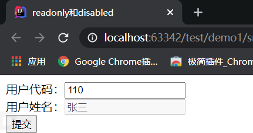

> 共同点：
>
> 1. 都是只读，无法更改
> 2. 数据用户可以看到
>
> 不同点：
>
> 1. 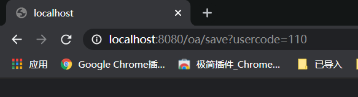
> 2. readonly可以提交给服务器，disabled数据不会提交，即使有name和value属性

### 10.13input控件的maxlength属性

1. 当maxlength属性在text中时

   > ```html
   > <input type="text" maxlength="5">
   > ```
   >
   > 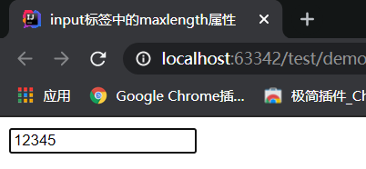
   >
   > **最多输入五个字符**

## 十一、Html中元素的id属性

1. 在html文档中，任何元素（节点）都有id属性

2. id属性是该节点的唯一标识，所以在同一个html文档中，id值不能重复

3. 表单提交数据时，和id没有关系，和name有关系

4. **id的用处**

   > - 为了更方便的获取元素
   > - JavaScript可以对html文档中的任意节点进行增删改操作
   > - 在增删改之前需要先得到这个节点，通常通过id获取节点对象

## 十二、div和span在网页中的应用

1. div和span的用处

   > - 布局，div和span都可以称为“图层”
   > - 图层的作用是为了保证页面可以灵活的布局
   > - 最早的网页使用table布局，但是table不灵活。当下开发中div最多，很少使用table布局
   > - 图层就是一个盒子，div嵌套div就是盒子套盒子
   > - div和span是可以定位的，只需要定下div的左上角的x轴和y轴即可

2. div和span的区别

   > - 默认情况下div独自占用一行
   >
   > - span不会独自占用一行
   >
   >   ```html
   >   <!DOCTYPE html>
   >   <html lang="en">
   >   <head>
   >       <meta charset="UTF-8">
   >       <title>div和span</title>
   >   </head>
   >   <body>
   >       <div id="div1">
   >           我是一个div
   >       </div>
   >       <div id="div2">
   >           我是一个div
   >       </div>
   >       <span id="span1">
   >           我是一个span
   >       </span>
   >       <span id="span2">
   >           我是一个span
   >       </span>
   >   </body>
   >   </html>
   >   ```
   >
   >   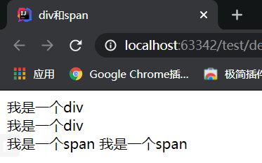

