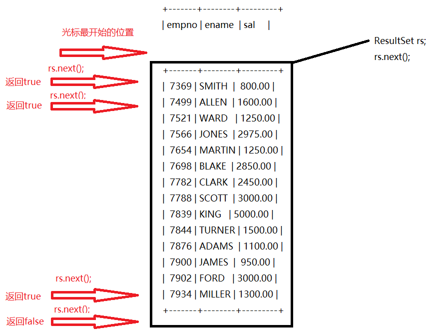
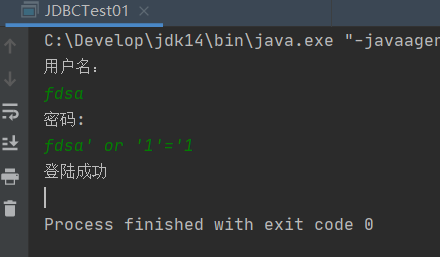
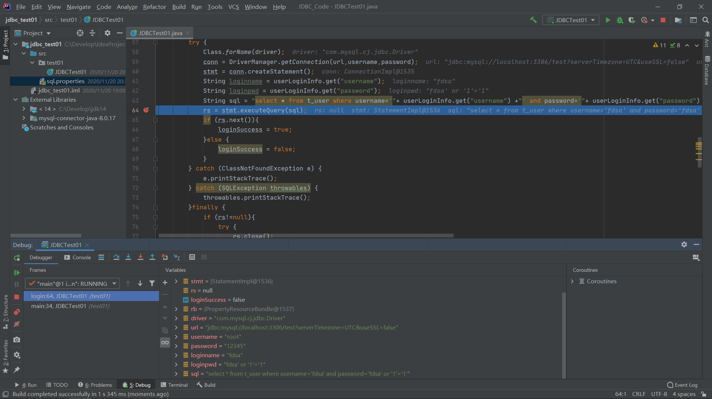
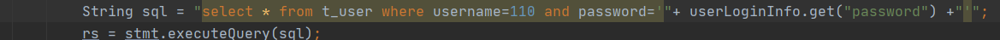
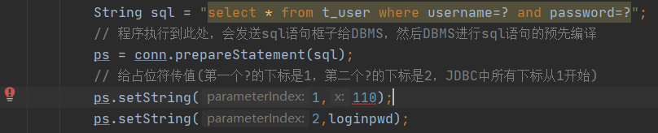
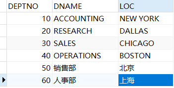
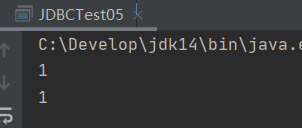
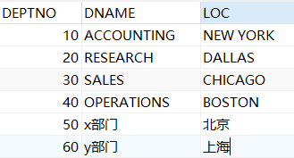

# JDBC

## 一、JDBC概念

Java DataBase Connectivity（Java语言连接数据库）


## 二、JDBC的本质

JDBC是Sun公司制定的一种接口。

**java.sql.*：这个包下有很多接口**

接口都有调用者和实现者。

面向接口调用、面向接口写实现类都属于面向接口编程。


### 2.1面向接口编程的好处

解耦合，降低程序的耦合度，提高程序的扩展力（多态机制）。


### 2.2为什么Sun制定一套JDBC接口

因为每一个数据库的底层实现原理不一样，Oracle或Mysql都有自己的原理...**每一个数据库都有自己独特的实现原理**。

> Sun公司提供了JDBC接口（一套Interface），各个数据库厂家的Java程序员编写了JDBC对应的实现类，而Java程序员只需要面对JDBC接口进行编程。
>
> 其中JDBC接口是JDK提供，各个数据库厂家编写的实现类需要去各个数据库官网下载Jar包。
>
> 数据库厂家提供的Jar包也叫驱动（MySQL驱动，Oracle驱动...所有的驱动都是以Jar包的形式存在，Jar包中有很多的.class文件，这些.class文件就是对JDBC的实现，驱动由数据库厂家提供）。

 

## 三、JDBC开发前的准备工作

**先从官网下载对应的驱动jar包，然后将其配置到环境变量classpath中。**

- 使用文本编辑器的方式开发，需要配置环境变量：

  > classpath=.;C:\XXX\mysql-connector-java-8.0.2-bin.jar

- 使用idea工具开发时，不需要配置环境变量，但idea有自己的配置方式

  

## 四、JDBC编程六步（背会）

第一步：注册驱动（告诉java程序，即将要连接的是哪个数据库）

第二步：获取连接（表示JVM的进程和数据库的进程之间的通道打开了，这属于进程之间的通信，重量级的，使用完后一定要关闭）

第三步：获取数据库操作对象（专门执行sql语句的对象）

第四步：执行SQL语句（DQL,DML...）

第五步：处理查询结果集（只有当第四步执行的是select语句的时候，才会有第五步处理查询结果集）

第六步：释放资源（使用完资源之后一定要关闭资源，java和数据库属于进程间的通信，开启之后一定要关闭）


## 五、案例

### 5.1完成插入操作

```java
/*
JDBC编程六步
*/
import java.sql.Driver;
import java.sql.DriverManager;
import java.sql.SQLException;
import java.sql.Connection;
import java.sql.Statement;

public class JDBCTest01{
	public static void main(String[] args){
		Statement stmt = null;
		Connection conn = null;
		try{
			// 1、注册驱动
			Driver driver = new com.mysql.cj.jdbc.Driver(); //多态
			DriverManager.registerDriver(driver);

			// 2、获取连接
			/*
				url:统一资源定位符（网络中某个资源的绝对路径）
				url包括及部分:协议、IP、PORT、资源名
				说明：
				jdbc:mysql://协议
				127.0.0.1 IP地址(localhost和127.0.0.1都是本机IP地址)
				3306 mysql数据库端口号
				bjpowernode 具体的数据库实例名
				serverTimezone=UTC&useSSL=false 时区
			*/
			String url = "jdbc:mysql://127.0.0.1:3306/bjpowernode?serverTimezone=UTC&useSSL=false";
			String user = "root";
			String password = "12345";
			conn = DriverManager.getConnection(url,user,password);
			System.out.println("数据库连接对象 = " + conn);

			// 3、获取数据库操作对象(Statement专门执行sql语句
			stmt = conn.createStatement();

			// 4、执行sql语句
			String sql = "insert into dept(deptno,dname,loc) values (50,'人事部','北京')";
			// 专门执行DML语句(insert delete update)
			// 返回值是“影响数据库中的记录条数”
			int count = stmt.executeUpdate(sql);
			System.out.println(count == 1 ? "保存成功" : "保存失败");

			// 5、处理查询结果集
		}
		catch (SQLException e){
			e.printStackTrace();
		}finally{
			// 6、释放资源
			// 为了保证资源一定释放，在finally语句块中关闭资源，并且遵循从小到大以此关闭。
			// 分别对其try...catch
			if(stmt != null){
				try{
					stmt.close();
				}catch(SQLException e){
					e.printStackTrace();
				}
			}
			if(conn != null){
				try{
					conn.close();
				}catch(SQLException e){
					e.printStackTrace();
				}
			}
		}
	}
}
```


### 5.2注册驱动的两种方式

```java
import java.sql.*;

public class JDBCTest01{
	public static void main(String[] args){
		try{
			// 1、注册驱动
			// 这是注册驱动的第一种方式
			// DriverManager.registerDriver(new com.mysql.cj.jdbc.Driver());
			// 这是注册驱动的第二种方式(通过反射机制)：常用的
			// 参数是一个字符串，可以写到xxx.properties中
			// 以下方式不需要接收返回值，只需要它的类加载动作
			Class.forName("com.mysql.cj.jdbc.Driver");
			// 2、获取连接
                Connection conn = DriverManager.getConnection("jdbc:mysql://127.0.0.1:3306/bjpowernode?serverTimezone=UTC&useSSL=false","root","12345");
			System.out.println(conn);
		}
		catch (SQLException e){
			e.printStackTrace();
		}catch (ClassNotFoundException e){
			e.printStackTrace();
		}
	}
}
```

**使用反射机制注册驱动完成删除操作**

```java
import java.sql.*;
import java.util.*;

public class JDBCTest01{
	public static void main(String[] args){

		// 使用资源绑定器绑定属性配置文件
		ResourceBundle bundle = ResourceBundle.getBundle("JDBC");
		String driver = bundle.getString("driver");
		String url = bundle.getString("url");
		String username = bundle.getString("username");
		String password = bundle.getString("password");

		Statement stmt = null;
		Connection conn = null;
		try{
			// 1、注册驱动
			Class.forName(driver);

			// 2、获取连接
			conn = DriverManager.getConnection(url,username,password);
			System.out.println("数据库连接对象 = " + conn);

			// 3、获取数据库操作对象(Statement专门执行sql语句)
			stmt = conn.createStatement();

			// 4、执行sql语句
			String sql = "delete from dept where deptno=50";
			int count = stmt.executeUpdate(sql);
			System.out.println(count == 1 ? "删除成功" : "删除失败");

			// 5、处理查询结果集
		}
		catch (SQLException e){
			e.printStackTrace();
		}
		catch (ClassNotFoundException e){
			e.printStackTrace();
		}
		finally{
			// 6、释放资源
			// 为了保证资源一定释放，在finally语句块中关闭资源，并且遵循从小到大以此关闭。
			// 分别对其try...catch
			if(stmt != null){
				try{
					stmt.close();
				}catch(SQLException e){
					e.printStackTrace();
				}
			}
			if(conn != null){
				try{
					conn.close();
				}catch(SQLException e){
					e.printStackTrace();
				}
			}
		}
	}
}
                           
// 配置文件
driver=com.mysql.cj.jdbc.Driver
url=jdbc:mysql://127.0.0.1:3306/bjpowernode?serverTimezone=UTC&useSSL=false
username=root
password=12345
```

### 5.3完成查询操作

1. 遍历结果集的原理

   

   ```java
   import java.sql.*;
   import java.util.*;
   
   public class JDBCTest01{
   	public static void main(String[] args){
   
   		// 使用资源绑定器绑定属性配置文件
   		ResourceBundle bundle = ResourceBundle.getBundle("JDBC");
   		String driver = bundle.getString("driver");
   		String url = bundle.getString("url");
   		String username = bundle.getString("username");
   		String password = bundle.getString("password");
   
   		Connection conn = null;
   		Statement stmt = null;
   		ResultSet rs = null;
   
   		try{
   			// 1、注册驱动
   			Class.forName(driver);
   
   			// 2、获取连接
   			conn = DriverManager.getConnection(url,username,password);
   			System.out.println("数据库连接对象 = " + conn);
   
   			// 3、获取数据库操作对象(Statement专门执行sql语句
   			stmt = conn.createStatement();
   
   			// 4、执行sql语句
   			String sql = "select empno,ename b,sal c from emp";
   			// 专门执行DQL语句的方法
   			rs = stmt.executeQuery(sql);
   			// 5、处理查询结果集
   			/*
   			boolean flag1 = rs.next();
   			System.out.println(flag1);// true
   			if(flag1){
   				 光标指向的行有数据
   				 取数据
   				 getString()方法的特点是：不管数据库中的数据类型是什么，都以String形式取出
   				String empno = rs.getString(1);
   				String ename = rs.getString(2);
   				String sal = rs.getString(3);
   				System.out.println("empno = " + empno + ",ename = " + ename + ",sal = " + sal);
   			}
   			*/
   			while(rs.next()){
   				// 可以通过查询结果集的下标来取值
   				/*
   				String empno = rs.getString(1);
   				String ename = rs.getString(2);
   				String sal = rs.getString(3);
   				*/
   				// 可以通过列名称取值，注意，列名称不是表中的列名称，而是查询结果集中的列名称
   				// 如果对列名没有起别名，则可以通过列名取值
   				String empno = rs.getString("empno");
   				// 如果起了别名，则必须通过别名取值
   				String ename = rs.getString("b");
   				// 可以取出Double类型的值，数值类型的值可以进行数学运算，注意：该列的表中类型必须是Double类型
   				Double sal = rs.getDouble("c");
   				System.out.println("empno = " + empno + ",ename = " + ename + ",sal = " + (sal+100));
   			}
   		}
   		catch (SQLException e){
   			e.printStackTrace();
   		}
   		catch (ClassNotFoundException e){
   			e.printStackTrace();
   		}
   		finally{
   			// 6、释放资源
   			// 为了保证资源一定释放，在finally语句块中关闭资源，并且遵循从小到大以此关闭。
   			// 分别对其try...catch
   			if(rs != null){
   				try{
   					rs.close();
   				}catch(SQLException e){
   					e.printStackTrace();
   				}
   			}
   			if(stmt != null){
   				try{
   					stmt.close();
   				}catch(SQLException e){
   					e.printStackTrace();
   				}
   			}
   			if(conn != null){
   				try{
   					conn.close();
   				}catch(SQLException e){
   					e.printStackTrace();
   				}
   			}
   		}
   	}
   }
   ```

#### 5.3.1如果使用模糊查询查询emp表中姓名包含“%”的员工信息怎么查

```java
String sql = "select * from emp where ename like '%!%%' escape '!'";
```

因为java中没有\%的转义字符，所以需要使用escape


## 六、使用JDBC模拟用户登录

```java
package test01;
/*
* 实现功能：
*   1.需求：模拟用户登录功能
*   2.业务描述：
*       程序运行的时候，提供一个输入的入口，可以输入用户名和密码
*       用户输入用户名和密码后，提交信息，java程序收集到用户信息
*       java程序连接数据库验证用户名和密码是否合法
*       合法：显示登录成功
*       不合法：显示登陆失败
*   3.数据的准备
* */

import java.sql.*;
import java.util.HashMap;
import java.util.Map;
import java.util.ResourceBundle;
import java.util.Scanner;

public class JDBCTest01 {
    public static void main(String[] args) {
        // 初始化一个页面
        Map<String,String> userLoginInfo = initUI();
        // 验证用户名和密码
        boolean loginSuccess = login(userLoginInfo);
        // 输出结果
        System.out.println(loginSuccess?"登陆成功":"登录失败");
    }

    /**
     * 用户登录
     * @param userLoginInfo 用户登录信息
     * @return false表示登录失败，true表示登录成功
     * */
    private static boolean login(Map<String, String> userLoginInfo) {
        // 编写JDBC代码
        Connection conn = null;
        Statement stmt = null;
        ResultSet rs = null;
        boolean loginSuccess = false;

        ResourceBundle rb = ResourceBundle.getBundle("sql");
        String driver = rb.getString("driver");
        String url = rb.getString("url");
        String username = rb.getString("username");
        String password = rb.getString("password");

        try {
            Class.forName(driver);
            conn = DriverManager.getConnection(url,username,password);
            stmt = conn.createStatement();
            String sql = "select * from t_user where username='"+ userLoginInfo.get("username") +"' and password='"+ userLoginInfo.get("password") +"'";
            rs = stmt.executeQuery(sql);
            if (rs.next()){
                loginSuccess = true;
            }else {
                loginSuccess = false;
            }
        } catch (ClassNotFoundException e) {
            e.printStackTrace();
        } catch (SQLException throwables) {
            throwables.printStackTrace();
        }finally {
            if (rs!=null){
                try {
                    rs.close();
                } catch (SQLException throwables) {
                    throwables.printStackTrace();
                }
            }
            if (stmt!=null){
                try {
                    stmt.close();
                } catch (SQLException throwables) {
                    throwables.printStackTrace();
                }
            }
            if (conn!=null){
                try {
                    conn.close();
                } catch (SQLException throwables) {
                    throwables.printStackTrace();
                }
            }
        }

        return loginSuccess;
    }

    /**
     * 初始化用户界面
     * @return 用户输入的用户名和密码等登录信息
     * */
    private static Map<String,String> initUI() {
        Scanner sc = new Scanner(System.in);
        System.out.println("用户名：");
        String username = sc.nextLine();
        System.out.println("密码:");
        String password = sc.nextLine();
        Map<String,String> userLoginInfo = new HashMap<>();
        userLoginInfo.put("username",username);
        userLoginInfo.put("password",password);
        return userLoginInfo;
    }
}
```

### 6.1SQL注入

当前程序存在的问题



原因：

在程序中Debug测试之后显示如下



```mysql
// 通过输入的用户名和密码后，sql语句变成如下：
select * from t_user where username='fdsa' and password='fdsa' or '1'='1'
// 在dos界面运行的结果：
mysql> select * from t_user where username='fdsa' and password='fdsa' or '1'='1';
+----+----------+----------+----------+
| id | username | password | realname |
+----+----------+----------+----------+
|  1 | zhangsan | 123      | 张三     |
|  2 | jack     | 123      | 杰克     |
+----+----------+----------+----------+
2 rows in set (0.00 sec)
```

由于1=1恒成立，通过or连接，所以语句一定执行成功。

**上边代码正好完成了SQL语句的拼接，下边代码继续发送sql语句给DBMS，DBMS进行sql编译，正好将用户提供的"非法信息"编译进去。导致了原sql语句的含义被扭曲了**

**用户输入的信息中含有sql语句的关键字，并且这些关键字参与sql语句的编译过程，导致sql语句的原意被扭曲，进而达到sql注入。**

### 6.2如何解决SQL注入问题

> 只要用户提供的信息不参与sql的编译过程，问题就解决了
> 即使用户提供的信息中含有sql语句的关键字，但是没有参与编译，不起作用
> 要想用户信息不参与sql语句的编译，那么必须使用java.sql.PreparedStatement
> PreparedStatement继承了java.sql.Statement
> PreparedStatement是属于预编译的数据库操作对象
> PreparedStatement的原理是预先对SQL语句的框架进行编译，然后再给SQL语句传"值"

```java
package test01;
/*
*   1.解决SQL注入问题
*       只要用户提供的信息不参与sql的编译过程，问题就解决了
*       即使用户提供的信息中含有sql语句的关键字，但是没有参与编译，不起作用
*       要想用户信息不参与sql语句的编译，那么必须使用java.sql.PreparedStatement
*       PreparedStatement继承了java.sql.Statement
*       PreparedStatement是属于预编译的数据库操作对象
*       PreparedStatement的原理是预先对SQL语句的框架进行编译，然后再给SQL语句传"值"
* */

import java.sql.*;
import java.util.HashMap;
import java.util.Map;
import java.util.ResourceBundle;
import java.util.Scanner;

public class JDBCTest02 {
    public static void main(String[] args) {
        // 初始化一个页面
        Map<String,String> userLoginInfo = initUI();
        // 验证用户名和密码
        boolean loginSuccess = login(userLoginInfo);
        // 输出结果
        System.out.println(loginSuccess?"登陆成功":"登录失败");
    }

    /**
     * 用户登录
     * @param userLoginInfo 用户登录信息
     * @return false表示登录失败，true表示登录成功
     * */
    private static boolean login(Map<String, String> userLoginInfo) {
        // 编写JDBC代码
        Connection conn = null;
        PreparedStatement ps = null;    // 这里使用PreparedStatement（预编译的数据库操作对象）
        ResultSet rs = null;
        boolean loginSuccess = false;
        String loginname = userLoginInfo.get("username");
        String loginpwd = userLoginInfo.get("password");

        ResourceBundle rb = ResourceBundle.getBundle("sql");
        String driver = rb.getString("driver");
        String url = rb.getString("url");
        String username = rb.getString("username");
        String password = rb.getString("password");

        try {
            // 1.注册驱动
            Class.forName(driver);
            // 2.获取连接
            conn = DriverManager.getConnection(url,username,password);
            // 3.获取预编译的数据库操作对象
            // ?是占位符，一个?接收一个"值"，并且不能被''括起来，被认为只能是字符串
            String sql = "select * from t_user where username=? and password=?";
            // 程序执行到此处，会发送sql语句框子给DBMS，然后DBMS进行sql语句的预先编译
            ps = conn.prepareStatement(sql);
            // 给占位符传值(第一个?的下标是1，第二个?的下标是2，JDBC中所有下标从1开始)
            ps.setString(1,loginname);
            ps.setString(2,loginpwd);
            // 4.执行sql
            rs = ps.executeQuery();
            // 5.处理查询结果集
            if (rs.next()){
                loginSuccess = true;
            }else {
                loginSuccess = false;
            }
        } catch (ClassNotFoundException e) {
            e.printStackTrace();
        } catch (SQLException throwables) {
            throwables.printStackTrace();
        }finally {
            // 6.释放资源
            if (rs!=null){
                try {
                    rs.close();
                } catch (SQLException throwables) {
                    throwables.printStackTrace();
                }
            }
            if (ps!=null){
                try {
                    ps.close();
                } catch (SQLException throwables) {
                    throwables.printStackTrace();
                }
            }
            if (conn!=null){
                try {
                    conn.close();
                } catch (SQLException throwables) {
                    throwables.printStackTrace();
                }
            }
        }

        return loginSuccess;
    }

    /**
     * 初始化用户界面
     * @return 用户输入的用户名和密码等登录信息
     * */
    private static Map<String,String> initUI() {
        Scanner sc = new Scanner(System.in);
        System.out.println("用户名：");
        String username = sc.nextLine();
        System.out.println("密码:");
        String password = sc.nextLine();
        Map<String,String> userLoginInfo = new HashMap<>();
        userLoginInfo.put("username",username);
        userLoginInfo.put("password",password);
        return userLoginInfo;
    }
}
```

- 解决SQL注入的关键是什么？

  > 用户提供的信息中即使含有sql语句的关键字，但是这些关键字并没有参与编译，不起作用。

### 6.3对比Statement和PreparedStatement

- Statement存在SQL注入问题，PreparedStatement解决了SQL注入问题

- Statement的执行效率比PrepareStatement低

  > 在mysql中，同样的sql语句(一模一样包括空格)执行不会重新编译。
  >
  > 所以在使用Statement的时候，每次传值进去导致sql语句每次都不一致，所以每次执行都会重新编译，所以编译一次，执行一次。
  >
  > 但是使用PreparedStatement，编译时在传值之前，并且sql语句不会改变，只传值，所以只会编译一次，执行N次。

- PreparedStatement会在编译阶段做类型的安全检查

  > 使用Statement时，如果传的值和表中类型不匹配，不会报错。
  >
  > 
  >
  > 而使用PreparedStatement时，如果传的值和表中类型不匹配，会报错。
  >
  > 

  **综上所述，PreparedStatement使用较多，只有少数情况会使用Statement**

### 6.4什么情况下使用Statement

业务方面要求必须支持SQL注入的时候，Statement支持sql注入，凡是业务方面要求需要sql语句拼接的，必须使用Statement

```java
package test01;
/*
* 1. 用户在控制台输入desc就是降序，输入asc就是升序
*/
import java.sql.*;
import java.util.ResourceBundle;
import java.util.Scanner;

public class JDBCTest03 {
    public static void main(String[] args) {
        // 用户在控制台输入desc就是降序，输入asc就是升序
        Scanner sc = new Scanner(System.in);
        System.out.println("请输入Desc或Asc,desc表示降序,asc表示升序:");
        System.out.println("请输入");
        String keywords = sc.nextLine();

        // 执行SQL
        Connection conn = null;
        Statement stmt = null;
        PreparedStatement ps = null;
        ResultSet rs = null;

        ResourceBundle rb = ResourceBundle.getBundle("sql");
        String driver = rb.getString("driver");
        String url = rb.getString("url");
        String username = rb.getString("username");
        String password = rb.getString("password");

        try {
            Class.forName(driver);
            conn = DriverManager.getConnection(url,username,password);

            // 使用Statement，sql语句拼接
            stmt = conn.createStatement();
            String sql = "select ename from emp order by ename "+ keywords +"";
            rs = stmt.executeQuery(sql);
            while (rs.next()){
                String ename = rs.getString("ename");
                System.out.println(ename);
            }
            
            // 使用PreparedStatement
            /*String sql = "select ename from emp order by ename ?";
            ps = conn.prepareStatement(sql);
            ps.setString(1,keywords);
            // 执行sql
            rs = ps.executeQuery();
            while (rs.next()){
                String ename = rs.getString("ename");
                System.out.println(ename);
            }*/
            
        } catch (SQLException throwables) {
            throwables.printStackTrace();
        } catch (ClassNotFoundException e) {
            e.printStackTrace();
        }finally {
            if (rs!=null){
                try {
                    rs.close();
                } catch (SQLException throwables) {
                    throwables.printStackTrace();
                }
            }
            if (stmt!=null){
                try {
                    stmt.close();
                } catch (SQLException throwables) {
                    throwables.printStackTrace();
                }
            }
            if (conn!=null){
                try {
                    conn.close();
                } catch (SQLException throwables) {
                    throwables.printStackTrace();
                }
            }
        }
    }
}

```

### 6.5使用PreparedStatement完成增删改查操作

```java
package test01;

import java.sql.Connection;
import java.sql.DriverManager;
import java.sql.PreparedStatement;
import java.sql.SQLException;
import java.util.ResourceBundle;

/*
*   1.使用PreparedStatement完成增删改操作
* */
public class JDBCTest04 {
    public static void main(String[] args) {
        Connection conn = null;
        PreparedStatement ps = null;

        ResourceBundle rb = ResourceBundle.getBundle("sql");
        String driver = rb.getString("driver");
        String url = rb.getString("url");
        String username = rb.getString("username");
        String password = rb.getString("password");

        try {
            // 1.注册驱动
            Class.forName(driver);
            // 2.获取连接
            conn = DriverManager.getConnection(url,username,password);
            // 3.获取预编译的数据库操作对象

            // 插入
            /*String sql = "insert into dept(deptno,dname,loc) values (?,?,?)";
            ps = conn.prepareStatement(sql);
            ps.setInt(1,50);
            ps.setString(2,"人事部");
            ps.setString(3,"北京");*/

            // 修改
            /*String sql = "update dept set dname = ?,loc= ? where deptno = ?";
            ps = conn.prepareStatement(sql);
            ps.setString(1,"人事部");
            ps.setString(2,"北京");
            ps.setInt(3,50);*/

            // 删除
            String sql = "delete from dept where deptno = ?";
            ps = conn.prepareStatement(sql);
            ps.setInt(1,50);
            
            // 4.执行sql
            int count = ps.executeUpdate();
            System.out.println(count);
        } catch (ClassNotFoundException e) {
            e.printStackTrace();
        } catch (SQLException throwables) {
            throwables.printStackTrace();
        }finally {
            // 6.释放资源
            if (ps!=null){
                try {
                    ps.close();
                } catch (SQLException throwables) {
                    throwables.printStackTrace();
                }
            }
            if (conn!=null){
                try {
                    conn.close();
                } catch (SQLException throwables) {
                    throwables.printStackTrace();
                }
            }
        }
    }
}
```

## 七、JDBC的事务机制

### 7.1.JDBC中的事务是自动提交的

> 只要执行任意一条DML语句，则自动提交一次，这是JDBC默认的事务行为，但是在实际的业务中，都是N条DML语句联合完成的，必须保证DML语句在同一个事务中同时成功或同时失败。


### 7.2验证JDBC的事务是否是自动提交

表中数据：



```java
package test01;

import java.sql.Connection;
import java.sql.DriverManager;
import java.sql.PreparedStatement;
import java.sql.SQLException;
import java.util.ResourceBundle;

/**
 * JDBC事务机制：
 *      1.JDBC中的事务是自动提交的。
 *          只要执行任意一条DML语句，则自动提交一次，这是JDBC默认的事务行为
 *          但是在实际的业务中，都是N条DML语句联合完成的
 *          必须保证DML语句在同一个事务中同时成功或同时失败。
 */
public class JDBCTest05 {
    public static void main(String[] args) {
        Connection conn = null;
        PreparedStatement ps = null;

        ResourceBundle rb = ResourceBundle.getBundle("sql");
        String driver = rb.getString("driver");
        String url = rb.getString("url");
        String username = rb.getString("username");
        String password = rb.getString("password");

        try {
            // 1.注册驱动
            Class.forName(driver);
            // 2.获取连接
            conn = DriverManager.getConnection(url,username,password);
            // 3.获取预编译的数据库操作对象
            String sql1 = "update dept set dname= ? where deptno = ?";
            ps = conn.prepareStatement(sql1);
            // 4.执行sql
            ps.setString(1,"x部门");
            ps.setInt(2,50);
            int count = ps.executeUpdate();
            System.out.println(count);
            // 重新给占位符传值
            ps.setString(1,"y部门");
            ps.setInt(2,60);
            count = ps.executeUpdate();
            System.out.println(count);
        } catch (ClassNotFoundException e) {
            e.printStackTrace();
        } catch (SQLException throwables) {
            throwables.printStackTrace();
        }finally {
            // 6.释放资源
            if (ps!=null){
                try {
                    ps.close();
                } catch (SQLException throwables) {
                    throwables.printStackTrace();
                }
            }
            if (conn!=null){
                try {
                    conn.close();
                } catch (SQLException throwables) {
                    throwables.printStackTrace();
                }
            }
        }
    }
}
```

运行结果：





**说明JDBC只要执行任意一条DML语句，就提交一次**

> 假如做转账业务，当扣钱的sql语句执行结束，事务自动提交，账户中的钱已经扣除，但是如果代码出现异常导致程序在入账sql执行之前中断，那么程序就出现问题


### 7.3手动提交事务

在Java.sql.Connection下有一个方法setAutoCommit(boolean autoCommit)可以将自动提交设置成false

```java
conn.setAutoCommit(false);
// 在需要提交的地方可以手动提交事务
conn.commit();
// 为了保护数据安全性，会在遇到异常时，将事务回滚
try{
    
}catch(Exception e){
    if(conn != null){
        try{
         conn.rollback();   
        }catch(SQLException e1){
            e1.printStackTrace();
        }
    }
}
```


## 八、JDBC工具类

```java
package test01.Util;

import jdk.dynalink.beans.StaticClass;

import java.sql.*;

public class DBUtil {
    /*
    * 工具类中的构造方法都是私有的
    * 因为工具类中的方法都是静态的，不需要new对象，直接采用类名调用
    * */
    private DBUtil(){}

    static{
        try {
            Class.forName("com.mysql.cj.jdbc.Driver");
        } catch (ClassNotFoundException e) {
            e.printStackTrace();
        }
    }

    /**
     * 获取数据库连接对象
     * @return 连接对象
     * @throws SQLException
     */
    public static Connection getConnection() throws SQLException {
        return DriverManager.getConnection("jdbc:mysql://localhost:3306/bjpowernode?serverTimezone=UTC&useSSL=false","root","12345");
    }

    /**
     * 关闭资源
     * @param conn 连接对象
     * @param ps 数据库操作对象
     * @param rs 结果集
     */
   public static void close(Connection conn, Statement ps, ResultSet rs){
        if (rs!=null){
            try {
                rs.close();
            } catch (SQLException throwables) {
                throwables.printStackTrace();
            }
        }
       if (ps!=null){
           try {
               ps.close();
           } catch (SQLException throwables) {
               throwables.printStackTrace();
           }
       }
       if (conn!=null){
           try {
               conn.close();
           } catch (SQLException throwables) {
               throwables.printStackTrace();
           }
       }
   }
}
```

### 8.1使用工具类实现模糊查询

```java
package test01;

import test01.Util.DBUtil;

import java.sql.Connection;
import java.sql.PreparedStatement;
import java.sql.ResultSet;
import java.sql.SQLException;

/**
 *      1.测试DBUtil是否好用
 *      2.模糊查询怎么写
 */
public class JDBCTest06 {
    public static void main(String[] args) {
        Connection conn = null;
        PreparedStatement ps = null;
        ResultSet rs = null;
        try {
            // 获取连接
            conn = DBUtil.getConnection();
            // 获取预编译的数据库操作对象

            // 错误写法
            /*String sql = "select ename from emp where ename like '_?%'";
            ps = conn.prepareStatement(sql);
            ps.setString(1,"A");*/

            // 正确写法
            String sql = "select ename from emp where ename like ?";
            ps = conn.prepareStatement(sql);
            ps.setString(1,"_A%");
            rs = ps.executeQuery();
            while (rs.next()){
                System.out.println(rs.getString("ename"));
            }

        } catch (Exception throwables) {
            throwables.printStackTrace();
        }finally {
            // 释放资源
            DBUtil.close(conn,ps,rs);
        }
    }
}
```
