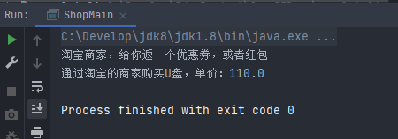

# JDK动态代理

## 一、动态代理介绍

**基于反射机制，需要掌握的程度：**

- 什么是动态代理？

  > 使用jdk的反射机制，创建对象的能力，创建的是代理类的对象，而不用创建类文件。
  >
  > 动态：在程序执行时，调用jdk提供的方法才能创建代理类的对象。
  >
  > JDK动态代理必须有接口。

  

- 知道动态代理能做什么？

  > **可以在不改变原来目标方法功能的前提下，可以在代理中增强自己的功能代码。**
  >
  > 比如：你所在的项目中，有一个功能是其他人写好的。你可以使用。
  >
  > 别人写好的---->GongNeng.class
  >
  > 你使用的---->GongNeng gn = new GongNeng();			gn.print();
  >
  > 但是你发现这个功能存在缺点，不能完全满足你项目的需要，此时需要在gn.print();执行后需要自己在增加代码。用代理来实现gn.print();调用时，增加自己的代理，而不用去改变原来的GongNeng.class文件。

**动态：**

- 在程序执行时，调用JDK提供的方法才能创建代理类的对象。


### 1.1代理

1. 现实生活中的代理：例如：中介、代购、换IP、商家等等。

> - 比如有一家美国的大学，可以对全世界招生。
> - 留学中介（代理）：用来帮助这家美国大学招生，中介是学校的代理，中介是代替学校完成招生的功能。
> - 代理的特点：
>   - 中介和学校他们要做的事情是一致的：招生
>   - 中介是学校的代理，学校是目标
>   - 家长---->中介（学校介绍，办入学手续）----->美国学校
>   - 中介是代理，不能白干活，需要收取费用
>   - 代理不让你访问目标
> - 为什么要找中介？
>   - 中介是专业的，方便
>   - 家长现在不能自己去找学校，家长没有能力访问学校，或者学校不接受个人来访。

2. 在开发中也会有这样的情况

> - 你有a类，本来是调用c类的方法，完成某个功能，但是c不让a类调用。
> - a---------->不能调用c的方法
> - 在a和c之间，创建一个b代理，c让b访问
> - a------->访问b------->访问c
> - 

3. 实际的例子：

> - 登录，注册有短信验证码，验证码是手机短信。
> - 中国移动，联通，电信能发短信。
> - 中国移动，联通，电信有子公司或者关联公司，他们面向社会提供短信的发送功能。
> - 张三项目发送短信------>子公司，或者关联公司------>中国移动，联通，电信发短信。


## 二、代理模式

> 代理模式指，为其他对象提供一种代理可以控制对这个对象的访问。在某些情况下，一个对象不适合或者不能直接引用另一个对象，而代理对象可以在客户类和目标对象之间起到中介的作用。
>
> **使用代理对象，是为了在不修改目标对象的基础上，增强主业务逻辑。客户类真正的想要访问的对象是目标对象，但客户类真正可以访问的对象是代理对象。**
>
> 客户类对目标对象的访问是通过代理对象实现的。


### 2.1代理模式的作用

1. 功能增强

   在你原有的功能上，增加额外的功能，新增加的功能，叫功能增强。例如：通过中介留学，需要给中介交钱。

2. 控制访问

   代理类不让你访问业务目标。例如：商家不让用户访问厂家。


### 2.2实现代理的方式

#### 2.2.1静态代理

- 代理类是自己手动实现的，自己需要创建一个Java类，表示代理类。

- 同时你所要代理的目标类是确定的。

- 特点：实现简单，容易理解

- 实例：

  > **需求：用户购买U盘行为**
  >
  > - 用户：客户端类
  > - 商家：代理，代理某个品牌的U盘
  > - 厂家：目标类
  > - 三者的关系：用户（客户端）----->访问商家（代理）----->厂家（目标）
  > - 商家和厂家都是卖U盘的，他们完成的功能是一致的。
  >
  > 
  >
  > **实现步骤：**
  >
  > 1. 创建一个接口，定义卖U盘的方法。表示你的厂家和商家做的事情。
  > 2. 创建厂家类，实现1步骤的接口。
  > 3. 创建商家，就是代理，也需要实现1步骤的接口。
  > 4. 创建客户端类，调用商家的方法买一个U盘。
  >
  > 
  >
  > **实现：**
  >
  > 第一步：创建一个卖U盘的接口
  >
  > ```java
  > package com.bjpowernode.service;
  > 
  > // 表示功能，厂家，商家都要完成的功能
  > public interface UsbSell {
  > 
  >     /**
  >      * 定义方法
  >      * @param amount 表示一次购买的数量，暂时不用
  >      * @return 表示一个u盘的价格
  >      */
  >     float shell(int amount);
  > 
  >     // 可以定义多个其他的方法
  > }
  > 
  > ```
  >
  > 第二步：创建目标类，金士顿U盘厂家
  >
  > ```java
  > package com.bjpowernode.factory;
  > 
  > import com.bjpowernode.service.UsbSell;
  > 
  > // 目标类：金士顿厂家
  > public class UsbKingFactory implements UsbSell {
  > 
  >     @Override
  >     public float shell(int amount) {
  >         // 一个128G的u盘是85元
  >         // 后期根据amount，可以实现不同的价格，例如买1W个，单价是80...
  >         return 85.0f;
  >     }
  > }
  > ```
  >
  > 第三步：创建代理类，淘宝商家
  >
  > ```java
  > package com.bjpowernode.shangjia;
  > 
  > import com.bjpowernode.factory.UsbKingFactory;
  > import com.bjpowernode.service.UsbSell;
  > 
  > // 商家，代理金士顿U盘销售
  > public class TaoBao implements UsbSell {
  > 
  >     // 声明商家代理的厂家具体是谁
  >     private UsbSell factory = new UsbKingFactory();
  > 
  >     // 实现销售U盘功能
  >     @Override
  >     public float shell(int amount) {
  > 
  >         // 向厂家发送订单，告诉厂家，我卖了U盘，厂家发货
  >         float price = factory.shell(amount);
  > 
  >         // 商家需要加价，也就是代理要增加价格
  >         price += 25;
  >         
  >         // 在目标类的方法调用后，你做的功能都是增强的意思。
  >       	System.out.println("淘宝商家，给你返一个优惠券，或者红包");
  > 
  >         // 增加利润后的价格, 增强功能
  >         return price;
  >     }
  > }
  > ```
  >
  > 第四步：测试，购买U盘
  >
  > ```java
  > package com.bjpowernode;
  > 
  > import com.bjpowernode.shangjia.TaoBao;
  > 
  > public class ShopMain {
  >     public static void main(String[] args) {
  >         // 创建一个商家对象
  >         TaoBao taoBao = new TaoBao();
  >         float price = taoBao.shell(1);
  >         System.out.println("通过淘宝的商家购买U盘，单价：" + price);
  >     }
  > }
  > 
  > ```
  >
  > 结果：
  >
  > 
  >
  > 
  >
  > **代理类中完成的功能：**
  >
  > - 目标类中方法的调用（一定会调用目标类中的方法）
  > - 功能增强
  >
  > 
  >
  > **如果此时还需要一个闪迪U盘，那需要再创建一个闪迪厂家目标对象，销售闪迪的代理商，此时才可以在主方法中“购买”闪迪U盘。不灵活**
  >
  > **静态代理的缺点：**
  >
  > - 当目标类增加了，代理类也可能需要成倍的增加，代理类数量过多。
  > - 当你的接口中功能增加，或者修改了，会影响所有的实现类，厂家类，代理类都需要修改。

  

#### 2.2.2动态代理

1. 介绍：

   > **在程序执行过程中**，使用JDK的反射机制，来创建代理类对象，并动态的指定要代理的目标类。
   >
   > 换句话说，**动态代理是一种创建JAVA对象的能力**，让你不用创建TaoBao类，就能创建代理对象。
   >
   > - 在Java中，创建对象：
   >   1. 创建类文件，java文件编译为class文件
   >   2. 使用构造方法，创建类对象
   > - 动态代理，创建对象：
   >   1. 调用JDK的方法来创建类对象

2. 特点：

   > - 当静态代理中的目标类很多时，可以使用动态代理，避免静态代理中的缺点。
   > - 动态代理中的目标类即使很多，代理数量可以很少。
   > - 当你修改了接口中的方法时，不会影响代理类。
   > - 不用创建代理类，可以为不同的目标对象随时创建代理类。

3. 分类：

   > - JDK动态代理
   >
   >   - 使用JAVA反射包中的类和接口实现动态代理的功能
   >
   >   - 反射包：java.lang.reflect   里面有三个类：InvocationHandler、Method、Proxy
   >
   > - CGLIB动态代理（Code Generation Library）
   >
   >   - CGLIB是第三方的工具库，创建代理对象
   >   - CGLIB的原理是继承，CGLIB通过继承目标类，创建它的子类，在子类中重写父类同名的方法，实现功能的修改。
   >   - 因为CGLIB是继承后重写方法，所以要求目标类不能是final的，方法也不能是final的。
   >   - CGLIB的要求目标类比较宽松，只要能继承就可以
   >   - CGLIB在很多的框架中使用，比如：MyBatis，Spring框架中都有使用。


##### 2.2.2.1JDK动态代理

**JDK动态代理的实现**

通过反射包：java.lang.reflect   里面有三个类：InvocationHandler、Method、Proxy


1. InvocationHandler接口（调用处理器）

> 其中就一个方法invoke()，用来表示代理对象执行的功能代码，你的代理类要完成的功能就写在invoke()方法中。
>
> - 代理类要完成的功能：
>   1. 调用目标对象的方法，执行目标方法的功能。
>   2. 增强功能，在目标方法调用时，增加功能。
>
> 源代码：
>
> ```java
> package java.lang.reflect;
> public interface InvocationHandler {
> 	/*
> 		参数：
> 			Object proxy:JDK创建的代理对象，无需赋值
> 			Method method:目标对象中的方法，JDK提供method对象
> 			Object[] args:目标对象中方法的参数
>     */
>     public Object invoke(Object proxy, Method method, Object[] args) throws Throwable;
> }
> ```
>
> - 怎么用
>   1. 创建类，实现接口InvocationHandler
>   2. 重写invoke()方法，把原来静态代理中代理类要完成的功能，写在这里。


2. Method类

> 表示方法的，确切的说就是目标类中的方法。
>
> - Method类的作用：
>   1. 通过Method可以执行某个类的方法，Method.invoke();**注意:这里的invoke和InvocationHandler中的invoke只是恰好一个名字而已！！！**
>   2. 可以执行任意对象的指定方法，而无需知道方法的名字。
>
> ```java
> method.invoke(目标对象, 方法的参数);
> Object obj = method.invoke(service, "李四");
> ```
>
> - 说明;
>
>   1. method.invoke()就是执行目标方法的，等同于静态代理中的下面代码：
>
>      ```java
>      // 向厂家发送订单，告诉厂家，我卖了U盘，厂家发货
>      float price = factory.shell(amount);
>      ```


3. Proxy类

> 核心的对象，创建代理对象。之前创建对象都是（new 类的构造方法），现在我们使用Proxy类的方法，代替new的使用
>
> - 方法：
>
>   ```
>   静态方法 newProxyInstance();
>   ```
>
> - 作用：
>
>   1. 创建代理对象，等同于静态代理中的下面代码：
>
>      ```
>      // 创建一个商家对象
>      TaoBao taoBao = new TaoBao();
>      ```
>
> - 源代码：
>
>   ```java
>   /*
>   	参数:
>   		ClassLoader loaderA:目标对象的类加载器，负责向内存中加载对象的。使用反射机制获取对象的ClassLoader
>   							类A，a.getClass().getClassLoader();
>   		Class<?>[] interfaces:接口，目标对象所实现的接口，也是通过反射机制获取。
>   		InvocationHandler h:我们自己写的，代理类要完成的功能
>   	返回值：就是目标对象的代理对象
>   */
>   public static Object newProxyInstance(ClassLoader loader, Class<?>[] interfaces, InvocationHandler h) throws IllegalArgumentException{
>   	// 省略方法体
>   }
>   ```


##### 2.2.2.2实现动态代理的步骤

1. 创建接口，定义目标类要实现的功能

   ```java
   package com.bjpowernode.service;
   
   //目标接口
   public interface UsbSell {
   
       float sell(int amount);
   }
   ```

2. 创建目标类实现接口

   ```java
   package com.bjpowernode.factory;
   
   import com.bjpowernode.service.UsbSell;
   
   // 目标类
   public class UsbKingFactory implements UsbSell {
   
       // 目标方法
       @Override
       public float sell(int amount) {
           System.out.println("目标类中，执行了sell目标方法");
           return 85.0f;
       }
   }
   ```

3. 创建InvocationHandler接口的实现类，在invoke方法中完成代理类的功能

   1. 调用目标方法
   2. 增强功能

   ```java
   package com.bjpowernode.handler;
   
   import java.lang.reflect.InvocationHandler;
   import java.lang.reflect.Method;
   
   // 必须实现InvocationHandler接口，完成代理类要做的功能（1. 调用目标方法  2. 功能增强）
   public class MySellHandler implements InvocationHandler {
   
       private Object target = null;
   
       // 动态代理：目标对象是活动的，不是固定的，需要传入进来
       // 传入是谁，就给谁创建代理
       public MySellHandler(Object target) {
           // 给目标对象赋值
           this.target = target;
       }
   
       @Override
       public Object invoke(Object proxy, Method method, Object[] args) throws Throwable {
   
           Object res = null;
   
           // 向厂家发送订单，告诉厂家，我卖了U盘，厂家发货
           // float price = factory.shell(amount);
           res = method.invoke(target ,args); // 执行目标方法，等同于上面代码
   
   
           // 商家需要加价，也就是代理要增加价格
           // price += 25;
           if (res != null){
               Float price =(Float) res;
               price += 25;
               res = price;
           }
   
           System.out.println("淘宝商家，给你返一个优惠券，或者红包");
   
           // 增加利润后的价格, 增强功能
           return res;
       }
   }
   ```

4. 使用Proxy类的静态方法，创建代理对象，并把返回值转为接口类型。

   ```java
   package com.bjpowernode;
   
   import com.bjpowernode.factory.UsbKingFactory;
   import com.bjpowernode.handler.MySellHandler;
   import com.bjpowernode.service.UsbSell;
   
   import java.lang.reflect.InvocationHandler;
   import java.lang.reflect.Proxy;
   
   public class MainShop {
       public static void main(String[] args) {
           // 创建代理对象，使用Proxy
           // 1.创建目标对象
           UsbSell factory = new UsbKingFactory();
   
           // 2.创建InvacationHandler对象
           InvocationHandler handler = new MySellHandler(factory);
   
           // 3.创建代理对象
           UsbSell proxy = (UsbSell) Proxy.newProxyInstance(factory.getClass().getClassLoader(), factory.getClass().getInterfaces(), handler);
           // com.sun.proxy.$Proxy0 ======= 是JDK中proxy的类型
           // System.out.println(proxy.getClass().getName());
   
           // 4.通过代理执行方法
           float price = proxy.sell(1);
           System.out.println("通过动态代理调用方法: " + price);
       }
   }
   ```

   


