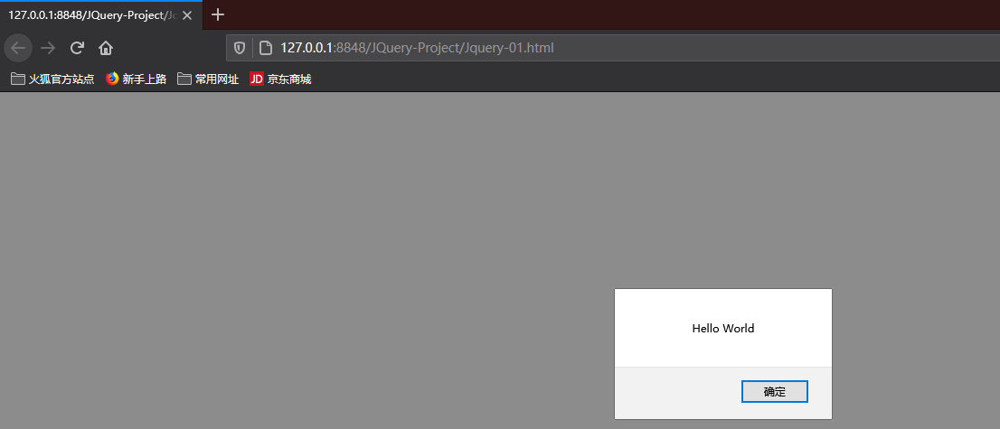
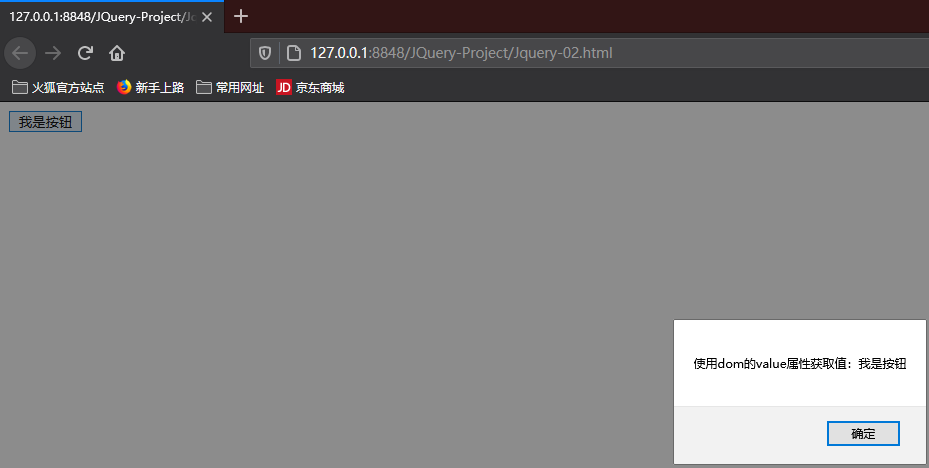
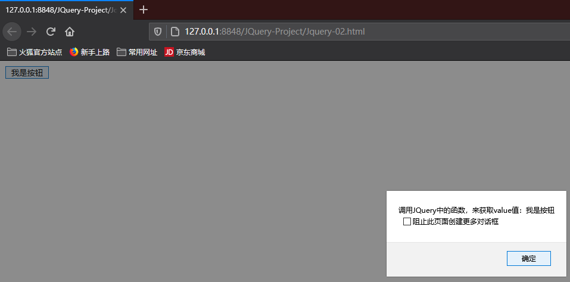
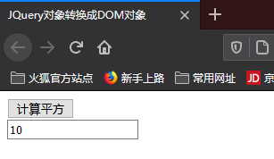
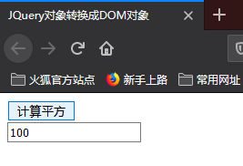
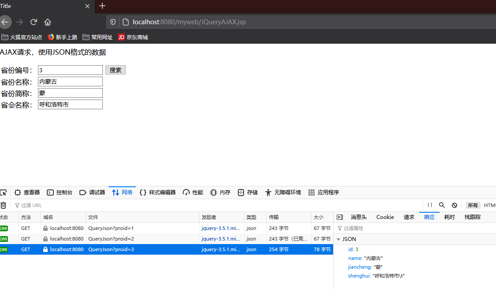
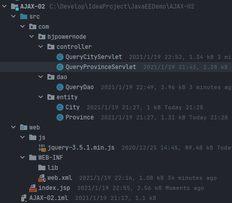
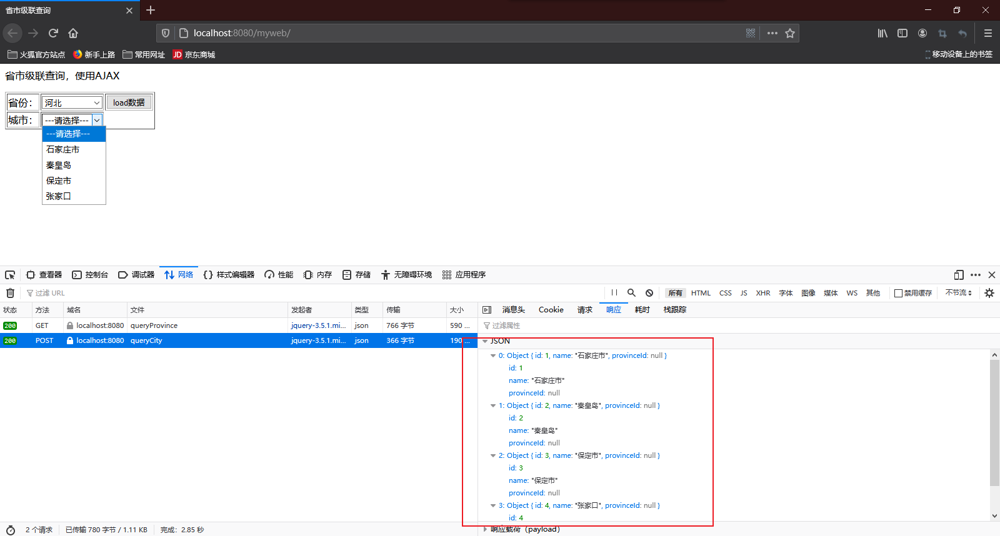
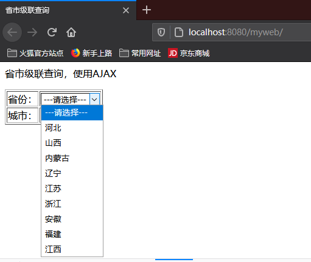

# JQuery基础

## 一、JQuery介绍

JQuery是一款跨主流浏览器的JavaScript库，封装了JavaScript相关方法调用，简化了JavaScript对HTML DOM操作。

简单说JQuery就是存放js代码的地方，存放js代码写的function。


## 二、使用JQuery

先将JQuery.js放到web项目中的js文件夹下，在html中引入JQuery。

```html
<!DOCTYPE html>
<html>
	<head>
		<meta charset="utf-8">
		<title></title>
        <!-- 指定JQuery的库文件位置，使用相对路径，当前项目的JS目录下的指定文件 -->
		<script type="text/javascript" src="js/jquery-3.5.1.min.js"></script>
        <script type="text/javascript">
			/*
            	1.$(document):$是函数名称，document是函数参数，作用是document对象变成一个JQuery函数库可以使用的对象。
                2.ready:JQuery中的函数，是准备的意思，当页面的dom对象加载成功后会执行ready函数的内容，ready相当于js中的onload事件。
                3.function():自定义函数，onload之后要执行的功能。
            */
            $(document).ready(function(){
				alert("Hello World");
			})
            
		</script>
	</head>
	<body>
	</body>
</html>
```




入口函数的简写方式

```html
<!DOCTYPE html>
<html>
	<head>
		<meta charset="utf-8">
		<title></title>
		<script type="text/javascript" src="js/jquery-3.5.1.min.js"></script>
		<script type="text/javascript">
            /* 页面加载后要执行的操作 */
			$(function(){
				alert("Hello World");
			})
		</script>
	</head>
	<body>
	</body>
</html>
```


### 2.1DOM对象和JQuery对象

- DOM对象：使用JavaScript语法创建的对象，也看做是JS对象。

  ```javascript
  var obj = document.getElementById("btn");
  // obj是dom对象，也叫做js对象
  ```

- JQuery对象：使用JQuery语法表示对象叫做JQuery对象。**注意：JQuery表示的对象都是数组**

  ```javascript
  var jobObj = $("#text");
  // jobObj就是使用JQuery语法表示的对象，也就是JQuery对象，它是一个数组！！现在数组中只有一个值。
  ```

- DOM对象和JQuery对象可以相互转换。


#### 2.1.1DOM对象和JQuery对象相互转换

1. 语法：

   ```javascript
   // DOM对象转换成JQuery对象
   $(dom对象);
   // JQuery对象转换成DOM对象
   // 从数组来获取第一个对象，第一个对象就是dom对象，可以使用下标的方式
   JQuery对象[0];
   JQuery对象.get(0);
   ```

2. 转换的目的：

   > 目的是要使用对象的方法或者属性。
   >
   > 当是dom对象时，可以使用dom对象的属性或方法。
   >
   > 当是JQuery对象时，可以使用JQuery库中的属性或方法。

3. DOM对象转换成JQuery对象：

   ```html
   <!DOCTYPE html>
   <html>
   	<head>
   		<meta charset="utf-8">
   		<title></title>
   		<script type="text/javascript" src="js/jquery-3.5.1.min.js"></script>
   		<script type="text/javascript">
   			function btnClick(){
   				// 获取dom对象
   				var obj = document.getElementById("btn");
   				// 使用dom的value属性获取值
   				alert("使用dom的value属性获取值：" + obj.value);
   				
   				// 把dom对象转成JQuery对象，使用JQuery库中的函数
   				var $obj = $(obj);
   				// 调用JQuery中的函数，来获取value值
   				alert("调用JQuery中的函数，来获取value值：" + $obj.val());
   			}
   		</script>
   	</head>
   	<body>
   		<input type="button" id="btn" value="我是按钮" onclick="btnClick()" />
   	</body>
   </html>
   ```

   

   

4. JQuery对象转换成DOM对象：

   ```html
   <!DOCTYPE html>
   <html>
   	<head>
   		<meta charset="utf-8">
   		<title>JQuery对象转换成DOM对象</title>
   	</head>
   	<script type="text/javascript" src="js/jquery-3.5.1.min.js"></script>
   	<script type="text/javascript">
   		function btnClick(){
   			// 使用JQuery语法获取页面中的dom对象
   			var obj = $("#txt")[0]; // 从数组中获取下标是0的dom对象
               // var obj = $("#txt").get(0);
   			// alert(obj.value);
   			
   			var num = obj.value;
   			obj.value = num * num;
   		}
   	</script>
   	<body>
   		<div>
   			<input type="button" id="btn" value="计算平方" onclick="btnClick()"/><br/>
   			<input type="text" id="txt" value="整数" />
   		</div>
   	</body>
   </html>
   
   ```

   

   


## 三、选择器

选择器：就是一个字符串，是定位条件，通知JQuery函数定位满足条件的DOM对象，定位了DOM对象后才可以通过JQuery函数操作DOM函数。

### 3.1基本选择器

1. id选择器：

   ```javascript
   $("#DOM对象ID值"); //通过ID找对象，id在当前页面中是唯一的
   ```

2. class选择器：

   ```javascript
   $(".class样式名"); // 使用样式名定位DOM对象
   ```

3. 标签选择器：

   ```javascript
   $("标签名称"); // 使用标签名称定位DOM对象
   ```

### 3.2所有选择器

1. 语法：

   ```javascript
   $("*");
   ```


### 3.3组合选择器

组合选择器是多个被选对象使用逗号分隔后形成的选择器，可以组合Id，class，标签名等。

1. 语法：

   ```javascript
   $("#id, .class, 标签名");
   ```

   

### 3.4实例

```html
<!DOCTYPE html>
<html>
	<head>
		<meta charset="utf-8">
		<title>选择器</title>
	</head>
	<style type="text/css">
		div{
			background: gray;
			width: 200px;
			height: 100px;
		}
	</style>
	<script type="text/javascript" src="js/jquery-3.5.1.min.js"></script>
	<script type="text/javascript">
		function fun1(){
			// id选择器
			var obj = $("#one");
			// 使用JQuery中改变样式的函数
			obj.css("background","red");
		}
		function fun2(){
			// 样式选择器
			var obj = $(".two");
			// 使用JQuery中改变样式的函数
			obj.css("background","yellow");
		}
		function fun3(){
			// 标签选择器
			var obj = $("div"); // 一个数组，有三个DOM对象
			// JQuery的操作都是操作数组中的全部成员
			// 为所有的div都设置背景色
			obj.css("background","blue");
		}
		function fun4(){
			// 所有选择器
			var obj = $("*"); 
            // 为DOM中全部标签设置背景色
			obj.css("background","green");
		}
		function fun5(){
			// 组合选择器
			var obj = $("#one, span"); 
			obj.css("background","orange");
		}
	</script>
	<body>
		<div id="one">我是onediv</div><br/>
		<div class="two">我是twodiv</div><br/>
		<div>我是无id和class的div</div><br/>
		<span>我是span标签</span><br/>
		<input type="button" id="btn1" value="获取ID是one的DOM对象" onclick="fun1()" />
		<input type="button" id="btn2" value="获取class样式是two的DOM对象" onclick="fun2()" />
		<input type="button" id="btn3" value="使用标签选择器" onclick="fun3()" />
		<input type="button" id="btn4" value="所有选择器" onclick="fun4()" />
		<input type="button" id="btn5" value="组合选择器" onclick="fun5()" />
	</body>
</html>

```


### 3.5表单选择器

为了更好的操作表单中的元素< input >，JQuery提供了表单选择器，通过< input >标签的type属性值来定位dom对象的方式。

1. 语法：

   ```javascript
   $(":type属性值"); // 必须是<input>标签的元素才可以。
   $(":text"); //选取所有的单行文本框
   $(":password"); //选取所有的密码框
   $(":radio"); //选取所有的单选框
   ...
   ```

2. 实例：

   ```html
   <!DOCTYPE html>
   <html>
   	<head>
   		<meta charset="utf-8">
   		<title>表单选择器</title>
   	</head>
   	<style type="text/css">
   
   	</style>
   	<script type="text/javascript" src="js/jquery-3.5.1.min.js"></script>
   	<script type="text/javascript">
   		function fun1(){
   			// 定位text
   			var obj = $(":text");
   			// 获取obj的值，val()是JQuery中的函数，用来读取value属性值
   			alert(obj.val());
   		}
   		function fun2(){
   			// 定位radio
   			var obj = $(":radio"); //是一个数组，目前两个对象man, woman
   			// 循环数组
   			for(var i = 0; i < obj.length; i++){
   				// 使用下标方式从数组获取成员
   				var domObj = obj[i];
   				// 使用dom对象的属性获取value值
   				alert(domObj.value); // man  woman
   			}
   		}
   		function fun3(){
   			// 定位checkbox
   			var obj = $(":checkbox");//是一个数组，目前三个对象
   			// 循环数组
   			for(var i = 0; i < obj.length; i++){
   				// 使用下标方式从数组获取成员
   				var domObj = obj[i];
   				// 使用dom对象的属性获取value值
   				alert("dom对象的value属性 = " + domObj.value); // bike music read
   				// 使用JQuery对象的函数val()获取value值
   				alert("jquery的函数调用 = " + $(domObj).val()); // bike music read
   			}
   		}
   	</script>
   	<body>
   		<input type="text" value="我是type=text" /><br/><br/>
   		
   		<input type="radio" name="sex" value="man" />男
   		<input type="radio" name="sex" value="woman" />女<br/><br/>
   		
   		<input type="checkbox" name="hobby" value="bike" />骑车
   		<input type="checkbox" name="hobby" value="music" />音乐
   		<input type="checkbox" name="hobby" value="read" />看书<br/><br/>
   		
   		<input type="button" id="btn1" value="读取text值" onclick="fun1()" />
   		<input type="button" id="btn2" value="读取radio值" onclick="fun2()" />
   		<input type="button" id="btn3" value="读取checkbox值" onclick="fun3()" />
   	</body>
   </html>
   
   ```


## 四、过滤器

过滤器就是过滤条件，对已经定位到数组中的DOM对象进行过滤筛选，**过滤条件不能独立出现在JQuery函数中，必须和选择器一起使用。**


### 4.1JQuery中对象存储的DOM对象顺序与页面标签声明位置的关系

```html
<div>1</div>    <!--dom1-->
<div>2</div>    <!--dom2-->
<div>3</div>    <!--dom3-->
<!-- $("div")==[dom1, dom2, dom3] -->
```


### 4.2基本过滤器

1. 选择第一个first，保留数组中第一个DOM对象

   ```html
   $("选择器:first");
   $("div:first"); <!-- 取到dom1 -->
   ```

2. 选择最后一个last，保留数组中最后的DOM对象

   ```html
   $("选择器:last");
   $("div:last"); <!-- 取到dom3 -->
   ```

3. 选择数组中指定对象

   ```html
   $("选择器:eq(数组索引)");
   $("div:eq(1)"); <!-- 取到dom2 -->
   ```

4. 选择数组中小于指定索引的所有DOM对象

   ```html
   $("选择器:lt(数组索引)");
   $("div:lt(2)"); <!-- 取到dom1, dom2 -->
   ```

5. 选择数组中大于指定索引的所有DOM对象

   ```html
   $("选择器:gt(数组索引)");
   $("div:gt(1)"); <!-- 取到dom3 -->
   ```

6. 实例：

   ```html
   <!DOCTYPE html>
   <html>
   	<head>
   		<meta charset="utf-8">
   		<title>过滤器</title>
   	</head>
   	<style type="text/css">
   		div{
   			background-color: gray;
   			
   		}
   	</style>
   	<script type="text/javascript" src="js/jquery-3.5.1.min.js"></script>
   	<script type="text/javascript">
   		// $(document).ready(函数):当页面中的dom对象加载成功后，会执行ready() 相当于onload事件，所以绑定事件需要在ready()中去做
   		$(function(){
   			// 当页面dom对象加载后，给对象绑定事件，因为此时button对象已经在内存中创建好了才能使用。
   			$("#btn1").click(function(){
   				// 过滤器
   				var obj = $("div:first");
   				obj.css("background", "red");
   			})
   			
   			$("#btn2").click(function(){
   				// 过滤器
   				var obj = $("div:last");
   				obj.css("background", "green");
   			})
   			
   			$("#btn3").click(function(){
   				// 过滤器
   				var obj = $("div:eq(3)");
   				obj.css("background", "blue");
   			})
   			
   			$("#btn4").click(function(){
   				// 过滤器
   				var obj = $("div:lt(3)");
   				obj.css("background", "orange");
   			})
   			
   			$("#btn5").click(function(){
   				// 过滤器
   				var obj = $("div:gt(3)");
   				obj.css("background", "yellow");
   			})
   		})
   	</script>
   	<body>
   		<div id="one">我是div-0</div>
   		<div id="two">我是div-1</div>
   		<div>我是div-2
   			<div class="son">我是div-3</div>
   			<div class="son">我是div-4</div>
   		</div>
   		<div>我是div-5</div>
   		<br/>
   		<span>我是span</span>
   		<br/>
   		<input type="button" id="btn1" value="选择第一个div" />
   		<input type="button" id="btn2" value="选择最后一个div" />
   		<input type="button" id="btn3" value="选择下标等于3的div" />
   		<input type="button" id="btn4" value="选择下标小于3的div" />
   		<input type="button" id="btn5" value="选择下标大于3的div" />
   	</body>
   </html>
   
   ```


### 4.3表单属性过滤器

根据表单中DOM对象的状态情况，来定位DOM对象。

比如：启用状态（enabled），不可用状态（disabled），选择状态（checked）

1. 选择可用的文本框：

   ```javascript
   $(":text:enabled");
   ```

2. 选择不可用的文本框：

   ```javascript
   $(":text:disabled");
   ```

3. 复选框选中的元素：

   ```javascript
   $(":checkbox:checked");
   ```

4. 选择指定下拉列表的被选中元素：

   ```javascript
   选择器>option:selected
   ```

5. 实例：

   ```html
   <!DOCTYPE html>
   <html>
   	<head>
   		<meta charset="utf-8">
   		<title>过滤器2</title>
   	</head>
   	<style type="text/css">
   
   	</style>
   	<script type="text/javascript" src="js/jquery-3.5.1.min.js"></script>
   	<script type="text/javascript">
   		// $(document).ready(函数):当页面中的dom对象加载成功后，会执行ready() 相当于onload事件，所以绑定事件需要在ready()中去做
   		$(function(){
   			// 当页面dom对象加载后，给对象绑定事件，因为此时button对象已经在内存中创建好了才能使用。
   			$("#btn1").click(function(){
   				// 获取所有可以使用的text
   				var obj = $(":text:enabled");
   				// 设置JQuery数组中所有dom对象的value值
   				obj.val("hello");
   			})
   			
   			$("#btn2").click(function(){
   				// 获取所有选中的checkbox
   				var obj = $(":checkbox:checked");
   				// 设置JQuery数组中所有dom对象的value值
   				for(var i = 0; i < obj.length; i++){
   					// alert(obj[i].value);
   					alert($(obj[i]).val());
   				}
   			})
   			
   			$("#btn3").click(function(){
   				// 获取select选中的值
   				// var obj = $("select>option:selected");
   				var obj = $("#language>option:selected");
   				alert(obj.val());
   			})
   		})
   	</script>
   	<body>
   		<input type="text" id="txt1" value="text1"/><br/>
   		<input type="text" id="txt2" value="text2" disabled/><br/>
   		<input type="text" id="txt3" value="text3"/><br/>
   		<input type="text" id="txt4" value="text4" disabled/><br/>
   		<hr>
   		<input type="checkbox" value="游泳" />游泳
   		<input type="checkbox" value="音乐" checked />音乐
   		<input type="checkbox" value="看书" checked />看书
   		<hr>
   		<select id="language">
   			<option value="java">java语言</option>
   			<option value="c" selected>c语言</option>
   			<option value="js">js语言</option>
   		</select>
   		<hr>
   		<input type="button" id="btn1" value="所有可用的text设值hello" />
   		<input type="button" id="btn2" value="显示被选中的复选框的值" />
   		<input type="button" id="btn3" value="显示下拉列表选中的值" />
   	</body>
   </html>
   ```

   


## 五、事件

### 5.1定义元素监听事件

1. 语法：

   ```javascript
   $(选择器).监听事件名称(处理函数);
   // 为页面中所有的button绑定事件onclick，并关联处理函数
   $("button").click(function(){
       alert("按钮被单击了");
   })
   ```

2. 说明：

   > 监听事件名称是js的事件句柄去掉on后的内容，js中的onclick的监听事件名称就是click

3. 该如何绑定事件

   ```javascript
   <script type="text/javascript">
       // $(document).ready(函数):当页面中的dom对象加载成功后，会执行ready() 相当于onload事件，所以绑定事件需要在ready()中去做
       // $(document).ready(funtion(){		})和$(funtion(){		})等价
       $(function(){
       	// 当页面dom对象加载后，给对象绑定事件，因为此时button对象已经在内存中创建好了才能使用。
           $("#btn1").click(function(){
               alert("按钮单击");
           })
   	})
   </script>
   ```


### 5.2on()绑定事件

on()方法在被选元素上添加事件处理程序，该方法给API带来很多便利，推荐使用。

1. 语法：

   ```javascript
   $("选择器").on(event, function);
   // event:事件一个或者多个, 多个事件空格分开, JS中的事件句柄去掉on
   // function:可选, 规定当事件发生时运行的函数
   $("#btn").on("click", function(){
       处理按钮单击
   })
   ```

2. 实例：

   ```html
   <!DOCTYPE html>
   <html>
   	<head>
   		<meta charset="utf-8">
   		<title>绑定事件</title>
   	</head>
   	<style type="text/css">
   		
   	</style>
   	<script type="text/javascript" src="js/jquery-3.5.1.min.js"></script>
   	<script type="text/javascript">
   		$(function(){
   			$("#btn1").click(function(){
   				// 使用append增加dom对象
   				$("#mydiv").append("<button id='btn2'>我是新增加的按钮</button>");
   				
   				$("#btn2").on("click", function(){
   					alert("新按钮被单击了");
   				})
   			})
   		})
   	</script>
   	<body>
   		<div id="mydiv">
   			我是一个div,需要增加一个button
   		</div>
   		<br/>
   		<button id="btn1">创建button，绑定一个click</button>
   	</body>
   </html>
   
   ```

   


## 六、函数

### 6.1第一组函数

#### 6.1.1val()函数

1. 作用：

   > 操作数组中DOM对象的value属性。

2. 使用：

   ```javascript
   $("选择器").val(); //无参数调用形式，读取数组中第一个DOM对象的value属性值
   $("选择器").val(值); // 有参数调用形式，对数组中所有DOM对象的value属性值统一赋值
   ```

   


#### 6.1.2text()函数

1. 作用：

   > 操作数组中所有DOM对象的【文字显示内容属性】

2. 使用：

   ```javascript
   $("选择器").text(); // 无参调用形式，读取数组中所有DOM对象的文字显示内容，将得到内容拼接为一个字符串返回
   $("选择器").text(值); // 有参调用形式，对数组中所有的DOMD对象的文字显示内容进行统一赋值
   ```

   


#### 6.1.3attr()函数

1. 作用：

   > 对val、text之外的其他属性操作

2. 使用：

   ```javascript
   $("选择器").attr("属性名"); // 获取DOM数组第一个对象的属性值
   $("选择器").attr("属性名", "值"); // 对数组中所有DOM对象的属性设为新值
   ```

   

#### 6.1.4实例

```html
<!DOCTYPE html>
<html>
	<head>
		<meta charset="utf-8">
		<title>函数1</title>
	</head>
	<style type="text/css">
		div{
			background-color: orange;
		}
	</style>
	<script type="text/javascript" src="js/jquery-3.5.1.min.js"></script>
	<script type="text/javascript">
		$(function(){
			$("#btn1").click(function(){
				// val() 获取dom数组中的第一个对象的value属性值
				var text = $(":text").val();
				alert(text);
			})
			
			$("#btn2").click(function(){
				// val() 设置所有text的value为新值
				$(":text").val("三国演义");
			})
			
			$("#btn3").click(function(){
				// text() 获取div的所有文本
				var text = $("div").text();
				alert(text);
			})
			
			$("#btn4").click(function(){
				// text() 设置div新文本
				$("div").text("新的div文本内容");
			})
			
			$("#btn5").click(function(){
				// attr() 读取指定属性值
				var src = $("img").attr("src");
				alert(src);
			})
			
			$("#btn6").click(function(){
				// attr() 设置指定属性值
				$("img").attr("src", "img/837.png");
			})
		})
	</script>
	<body>
		<input type="text" id="txt1" value="刘备"/><br/>
		<input type="text" id="txt2" value="关羽"/><br/>
		<input type="text" id="txt3" value="张飞"/><br/>
		<hr>
		<div>1.我是第一个div</div>
		<div>2.我是第二个div</div>
		<div>3.我是第三个div</div>
		<hr>
		
		<hr>
		<button id="btn1">获取第一个文本框的值</button>
		<button id="btn2">设置所有文本框的新值</button>
		<button id="btn3">获取div的所有文本</button>
		<button id="btn4">设置div新文本</button>
		<button id="btn5">读取src属性值</button>
		<button id="btn6">修改src属性值</button>
	</body>
</html>

```


### 6.2第二组函数

#### 6.2.1remove()函数

1. 作用：

   > 将数组中所有的**DOM对象及其子对象一并删除。**

2. 使用：

   ```javascript
   $("选择器").remove();
   ```

   

#### 6.2.2empty()函数

1. 作用：

   > 将数组中所有**DOM对象的子对象删除。**

2. 使用：

   ```javascript
   $("选择器").empty();
   ```

   

#### 6.2.3append()函数

1. 作用：

   > 为数组中所有DOM对象添加子对象。

2. 使用：

   ```javascript
   $("选择器").append("增加的内容");
   $("选择器").append("<div>动态添加的div</div>");
   ```

   

#### 6.2.4html()函数

1. 作用：

   > 设置或返回元素的内容（innerHTML）

2. 使用：

   ```javascript
   $("选择器").html(); // 无参调用方法，获取DOM数组中第一个匹配元素的内容
   $("选择器").html(值); // 有参调用方法，用于设置DOM数组中所有元素的内容
   ```


#### 6.2.5each()函数

1. 作用：

   > 对数组，json、dom数组等的遍历，对每一个元素调用一次函数
   >
   > var arr = [1, 2, 3];
   >
   > var json = {"name" : "elle", "age" : 20};
   >
   > var dom = ${":text"};

2. 使用：

   ```javascript
   $.each(要遍历的对象, function(index, element){ 处理程序 }); // 使用each循环数组，每个数组成员都会执行后面的"处理函数"一次
   JQuery对象.each(function(index, element){ 处理程序 });
   // index: 数组的下标
   // element: 数组的对象
   ```


#### 6.2.6实例

```html
<!DOCTYPE html>
<html>
	<head>
		<meta charset="utf-8">
		<title>函数2</title>
	</head>
	<style type="text/css">
		
	</style>
	<script type="text/javascript" src="js/jquery-3.5.1.min.js"></script>
	<script type="text/javascript">
		$(function(){
			$("#btn1").click(function(){
				// 使用remove删除父和子的所有dom对象
				$("select").remove();
			})
			
			$("#btn2").click(function(){
				// 使用empty删除子dom对象
				$("select").empty();
			})
			
			$("#btn3").click(function(){
				// 使用append增加dom对象
				// $("#father").append("<input type='button' value='我是一个按钮' />");
				// 增加一个table
				$("#father").append("<table border='1'><tr><td>第一列</td><td>第二列</td></tr></table>");
			})
			
			$("#btn4").click(function(){
				// 使用html函数，获取数组中第一个dom对象的文本值（innerHTML）
				alert($("span").html()); // 我是mysql<b>数据库</b>
			})
			
			$("#btn5").click(function(){
				// 使用html函数，设置dom对象的文本值
				$("span").html("我是新的<b>数据</b>"); 
			})
			
			$("#btn6").click(function(){
				// 循环普通数组，非DOM数组
				var arr = [1, 2, 3];
				$.each(arr, function(index, element){
					alert("循环变量:" + index + "|数组成员:" + element); // 循环变量:0|数组成员:1、循环变量:1|数组成员:2、循环变量:2|数组成员:3
				})
			})
			
			$("#btn7").click(function(){
				// 循环json
				var json = {"name":"张三", "age":20};
				$.each(json, function(index, element){
					alert("index是key:" + index + "|element是value:" + element); // index是key:name|element是value:张三、index是key:age|element是value:20
				})
			})
			
			$("#btn8").click(function(){
				// 循环DOM数组
				var domArr = $(":text");
				$.each(domArr, function(index, element){
					// element是数组中的DOM对象
					alert("index:" + index + "|element:" + element.value); // index:0|element:刘备、index:1|element:张飞、index:2|element:关羽
				})
			})
			
			$("#btn9").click(function(){
				// 循环JQuery对象，JQuery对象就是DOM数组
				$(":text").each(function(index, element){
					alert("index:" + index + "|element:" + element.value); // index:0|element:刘备、index:1|element:张飞、index:2|element:关羽
				})
			})
		})
	</script>
	<body>
		<select>
			<option value="老虎">老虎</option>
			<option value="狮子">狮子</option>
			<option value="豹">豹</option>
		</select>
		<hr/>
		<select>
			<option value="美洲">美洲</option>
			<option value="欧洲">欧洲</option>
			<option value="亚洲">亚洲</option>
		</select>
		<hr/>
		<div id="father" style="background: red;">我是父div</div>
		<hr/>
		<span>我是mysql<b>数据库</b></span>
		<span>我是jdbc</span>
		<hr/>
		<input type="text" value="刘备" />
		<input type="text" value="张飞" />
		<input type="text" value="关羽" />
		<hr/>
		
		<button id="btn1">使用remove删除所有对象</button>
		<button id="btn2">使用empty删除所有子DOM对象</button>
		<button id="btn3">增加一个子DOM对象</button>
		<button id="btn4">获取文本带有html标签内容</button>
		<button id="btn5">设置dom文本值</button>
		<button id="btn6">循环数组</button>
		<button id="btn7">循环JSON</button>
		<button id="btn8">循环DOM数组</button>
		<button id="btn9">循环JQuery对象</button>
	</body>
</html>

```


## 七、AJAX

**使用JQuery的函数实现AJAX的处理。**

没有JQuery之前，使用异步对象来实现AJAX，有四个步骤。

JQuery简化了AJAX的处理，使用三个函数可以实现AJAX请求的处理。

```javascript
$.ajax(); // JQuery中实现AJAX的核心函数
$.post(); // 使用post方式做AJAX请求
$.get();  // 使用get方式发送AJAX请求
/*
	$.post()和$.get()他们都是在内部都是调用的$.ajax()
*/
```

### 7.1$.ajax()函数的使用

1. 参数：

   $.ajax()的参数是一个json结构。

   ```javascript
   $.ajax({
       名称1 : 值1,
       名称2 : 值2,
       名称3 : 值3,
       ...
   })
   ```

   json参数说明

   ```javascript
   $.ajax({
       async : true,
       contentType : "appliaction/json",
       data : {"name" : "elle", "age" : 20},
       dateType : "json",
       error : function(){	请求出现错误时执行的函数 },
       success : function(data){	/* data就是responseText，返回的数据 */ },
       type : "get/post",
       url : "bmiAjax"
   })
   ```

   > - async : 布尔值，表示请求是否异步处理，默认是true，可以不写。
   >
   > - contentType : 浏览器发送数据到服务器时所使用的参数类型，可以不写。（例如:"application/json"）。
   >
   > - data : 规定要发送到服务器的数据，可以是字符串、数组、多数是JSON。
   >
   > - dateType : 期望从服务器响应的数据类型，JQuery从xml、json、text、html这些中测试最可能的类型。
   >
   >   当我们使用$.ajax()发送请求时，会把dataType的值发送给服务器，那我们的servlet能够读取到dataType的值，就知道你的浏览器需要的是xml或json的数据，那么服务器就可以返回你需要的数据格式。
   >
   > - error : 一个函数，如果请求失败要运行的函数。
   >
   > - success(resp) : 当请求成功时运行的函数，从服务器返回了数据，会执行success指定的函数，之前使用XMLHttpRequest对象，当readyState= =4 && status= =200的时候。
   >
   > - type : 规定请求的类型（GET或POST等），默认是GET。不区分大小写。
   >
   > - url : 规定发送请求的URL

   **常用这样的结构：**

   ```javascript
   $.ajax({
       data : {"name" : "elle", "age" : 20},
       dateType : "json",
       success : function(data){	/* data就是responseText，返回的数据 */ },
       url : "bmiAjax"
   })
   ```


### 7.2实例：使用JQuery对AJAX中6.5的案例修改，使用JQuery实现AJAX

直接修改JSP页面

```jsp
<%@ page contentType="text/html;charset=UTF-8" language="java" %>
<html>
<head>
    <title>Title</title>
<script type="text/javascript" src="js/jquery-3.5.1.min.js"></script>
<script type="text/javascript">
    $(function (){
        $("#btn").on("click", function (){
            // 获取dom的value值
            var proid = $("#proid").val();
            // 发起ajax请求
            $.ajax({
                url : "QueryJson",
                type : "get",
                data : {
                    "proid" : proid
                },
                dataType : "json",
                success : function (resp){
                    // alert(resp.name + "-----" + resp.jiancheng);
                    $("#proname").val(resp.name);
                    $("#projiancheng").val(resp.jiancheng);
                    $("#proshenghui").val(resp.shenghui);
                }
            })
        })
    })
</script>
</head>
<body>
<p>AJAX请求，使用JSON格式的数据</p>
<table>
    <tr>
        <td>省份编号：</td>
        <td>
            <input type="text" id="proid"/>
            <input type="button" value="搜索" id="btn"/>
        </td>
    </tr>
    <tr>
        <td>省份名称：</td>
        <td><input type="text" id="proname"></td>
    </tr>
    <tr>
        <td>省份简称：</td>
        <td><input type="text" id="projiancheng"></td>
    </tr>
    <tr>
        <td>省会名称：</td>
        <td><input type="text" id="proshenghui"></td>
    </tr>
</table>
</body>
</html>
```



### 7.3$.get()函数

$.get()方法使用Http Get请求从服务端加载数据。

语法：

```javascript
$.get(url, data, function(resp), dataType);
```


### 7.4$.post()函数

$.post()方法使用Http Get请求从服务端加载数据。

语法：

```javascript
$.post(url, data, function(resp), dataType);
```


### 7.5实例：使用AJAX实现级联查询

实现两个下拉列表，选中省份，出现对应的城市信息



第一步：先编写JSP页面（JQuery脚本以及AJAX请求需要在servlet之后写）

```jsp
<%@ page contentType="text/html;charset=UTF-8" language="java" %>
<html>
  <head>
    <title>省市级联查询</title>
    <script type="text/javascript" src="js/jquery-3.5.1.min.js"></script>
    <script type="text/javascript">
      $(function (){

        // 添加按钮单击事件
        $("#btn").on("click", function (){
          // 做ajax请求，使用jquery的$.ajax()
          $.ajax({
            url:"queryProvince",
            dataType:"json",
            success:function (resp){
              //[{"id":1,"name":"河北","jiancheng":"冀","shenghui":"石家庄"},...]
              // alert(resp);
              // 删除旧的数据，将已经存在的数据清空
              $("#province").empty();
              $("#province").append("<option value='0'>---请选择---</option>");
              $.each(resp, function (index, element){
                $("#province").append("<option value='" + element.id + "'>" + element.name + "</option>");
              })
            }
          })
        })

        // 为省份下拉列表框添加一个change事件，当下拉列表框发生改变时，触发事件
        $("#province").on("change", function(){
          // alert("测试");
          // 获取选中的列表框的值
          var obj = $("#province>option:selected");
          // alert("测试：" + obj.val() + "----" + obj.text());
          var provinceId = obj.val(); // 1, 2, 3, ...
          // 做一个ajax请求，获取省份所有城市信息
          $.post("queryCity", {proId : provinceId}, function (resp){
            // 删除旧的数据，将已经存在的数据清空
            $("#city").empty();
            $("#city").append("<option value='0'>---请选择---</option>");
            $.each(resp, function (index, element){
              $("#city").append("<option value='" + element.id + "'>" + element.name + "</option>");
            })
          }, "json");
        })
      })
    </script>
  </head>
  <body>
  <p>省市级联查询，使用AJAX</p>
  <div>
    <table border="1px">
      <tr>
        <td>省份：</td>
        <td>
          <select id="province">
            <option value="0">---请选择---</option>
          </select>
        </td>
        <td>
          <input type="button" value="load数据" id="btn" />
        </td>
      </tr>
      <tr>
        <td>城市：</td>
        <td>
          <select id="city">
            <option value="0">---请选择---</option>
          </select>
        </td>
      </tr>
    </table>
  </div>
  </body>
</html>

```

第二步：编写对应的dao

```java
package com.bjpowernode.dao;

import com.bjpowernode.entity.City;
import com.bjpowernode.entity.Province;

import java.net.URL;
import java.sql.*;
import java.util.ArrayList;
import java.util.List;

public class QueryDao {

    private Connection conn;
    private PreparedStatement ps;
    private ResultSet rs;
    private String sql;
    private String url = "jdbc:mysql://localhost:3306/springdb?useUnicode=true&characterEncoding=UTF-8&serverTimezone=Asia/Shanghai";
    private String username = "root";
    private String password = "12345";

    // 查询所有的省份信息
    public List<Province> queryProvinceList(){
        List<Province> provinceList = new ArrayList<>();
        try {
            Province p = null;
            Class.forName("com.mysql.cj.jdbc.Driver");
            conn = DriverManager.getConnection(url, username, password);
            sql = "select id, name, jiancheng, shenghui from province order by id";
            ps = conn.prepareStatement(sql);
            rs = ps.executeQuery();
            while (rs.next()){
                p = new Province();
                p.setId(rs.getInt("id"));
                p.setName(rs.getString("name"));
                p.setJiancheng(rs.getString("jiancheng"));
                p.setShenghui(rs.getString("shenghui"));
                provinceList.add(p);
            }
        } catch (ClassNotFoundException e) {
            e.printStackTrace();
        } catch (SQLException throwables) {
            throwables.printStackTrace();
        } finally {
            if (rs != null){
                try {
                    rs.close();
                } catch (SQLException throwables) {
                    throwables.printStackTrace();
                }
            }
            if (ps != null){
                try {
                    ps.close();
                } catch (SQLException throwables) {
                    throwables.printStackTrace();
                }
            }
            if (conn != null){
                try {
                    conn.close();
                } catch (SQLException throwables) {
                    throwables.printStackTrace();
                }
            }
        }
        return provinceList;
    }

    // 查询省份下面的所有城市
    public List<City> queryCityList(Integer provinceId){
        List<City> cityList = new ArrayList<>();
        City c = null;
        try {
            Class.forName("com.mysql.cj.jdbc.Driver");
            conn = DriverManager.getConnection(url, username, password);
            sql = "select id, name from city where provinceid = ?";
            ps = conn.prepareStatement(sql);
            // 设置参数值
            ps.setInt(1, provinceId);
            rs = ps.executeQuery();
            while (rs.next()){
                c = new City();
                c.setId(rs.getInt("id"));
                c.setName(rs.getString("name"));
                cityList.add(c);
            }
        } catch (ClassNotFoundException e) {
            e.printStackTrace();
        } catch (SQLException throwables) {
            throwables.printStackTrace();
        } finally {
            if (rs != null){
                try {
                    rs.close();
                } catch (SQLException throwables) {
                    throwables.printStackTrace();
                }
            }
            if (ps != null){
                try {
                    ps.close();
                } catch (SQLException throwables) {
                    throwables.printStackTrace();
                }
            }
            if (conn != null){
                try {
                    conn.close();
                } catch (SQLException throwables) {
                    throwables.printStackTrace();
                }
            }
        }
        return cityList;
    }
}

```

第三步：编写对应的servlet并配置到web.xml

```java
package com.bjpowernode.controller;

import com.bjpowernode.dao.QueryDao;
import com.bjpowernode.entity.Province;
import com.fasterxml.jackson.databind.ObjectMapper;

import javax.servlet.*;
import javax.servlet.http.*;
import java.io.IOException;
import java.io.PrintWriter;
import java.util.List;

public class QueryProvinceServlet extends HttpServlet {
    @Override
    protected void doGet(HttpServletRequest request, HttpServletResponse response) throws ServletException, IOException {

        String json = "{}";
        // 调用dao，获取所有的省份信息，是一个List集合
        QueryDao dao = new QueryDao();

        List<Province> provinceList = (List<Province>) dao.queryProvinceList();
        // 把list集合转为json格式的数据，输出给ajax请求
        if (provinceList != null){
            // 调用jackson工具库，实现List-->json
            ObjectMapper om = new ObjectMapper();
            json = om.writeValueAsString(provinceList);
        }

        // 输出json数据，响应ajax请求，返回数据
        response.setContentType("application/json;charset=utf-8");
        PrintWriter pw = response.getWriter();
        pw.println(json);
        pw.flush();
        pw.close();
    }
}

```

```java
package com.bjpowernode.controller;

import com.bjpowernode.dao.QueryDao;
import com.bjpowernode.entity.City;
import com.fasterxml.jackson.databind.ObjectMapper;

import javax.servlet.*;
import javax.servlet.http.*;
import java.io.IOException;
import java.io.PrintWriter;
import java.util.List;

public class QueryCityServlet extends HttpServlet {
    @Override
    protected void doGet(HttpServletRequest request, HttpServletResponse response) throws ServletException, IOException {

    }

    @Override
    protected void doPost(HttpServletRequest request, HttpServletResponse response) throws ServletException, IOException {
        QueryDao dao = new QueryDao();
        String json = "{}";
        // 获取请求传过来的参数
        String strProId = request.getParameter("proId");
        if (strProId != null && !"".equals(strProId.trim())){
            Integer proId = Integer.valueOf(strProId);
            List<City> cityList = dao.queryCityList(proId);
            // 把list转为JSON
            ObjectMapper om = new ObjectMapper();
            json = om.writeValueAsString(cityList);
        }
        response.setContentType("application/json;charset=utf-8");
        PrintWriter pw = response.getWriter();
        pw.println(json);
        pw.flush();
        pw.close();
    }
}

```



**为程序优化，删除加载按钮，在页面加载完毕后自动加载省份信息**

```jsp
<%@ page contentType="text/html;charset=UTF-8" language="java" %>
<html>
  <head>
    <title>省市级联查询</title>
    <script type="text/javascript" src="js/jquery-3.5.1.min.js"></script>
    <script type="text/javascript">
      $(function (){

        // 优化------------------------start---------------------------------
        // $(function (){})在页面的dom对象加载成功后执行的函数，在此发起ajax
        loadDataAjax();
        // 添加按钮单击事件
        $("#btn").on("click", function (){
          loadDataAjax();
        })
        // 优化------------------------end----------------------------------

        // 为省份下拉列表框添加一个change事件，当下拉列表框发生改变时，触发事件
        $("#province").on("change", function(){
          // alert("测试");
          // 获取选中的列表框的值
          var obj = $("#province>option:selected");
          // alert("测试：" + obj.val() + "----" + obj.text());
          var provinceId = obj.val(); // 1, 2, 3, ...
          // 做一个ajax请求，获取省份所有城市信息
          $.post("queryCity", {proId : provinceId}, function (resp){
            // 删除旧的数据，将已经存在的数据清空
            $("#city").empty();
            $("#city").append("<option value='0'>---请选择---</option>");
            $.each(resp, function (index, element){
              $("#city").append("<option value='" + element.id + "'>" + element.name + "</option>");
            })
          }, "json");
        })
      })

      // 优化------------------------start-----------------------
      function loadDataAjax(){
        // 做ajax请求，使用jquery的$.ajax()
        $.ajax({
          url:"queryProvince",
          dataType:"json",
          success:function (resp){
            //[{"id":1,"name":"河北","jiancheng":"冀","shenghui":"石家庄"},...]
            // alert(resp);
            // 删除旧的数据，将已经存在的数据清空
            $("#province").empty();
            $("#province").append("<option value='0'>---请选择---</option>");
            $.each(resp, function (index, element){
              $("#province").append("<option value='" + element.id + "'>" + element.name + "</option>");
            })
          }
        })
      }
      // 优化------------------------end-----------------------
    </script>
  </head>
  <body>
  <p>省市级联查询，使用AJAX</p>
  <div>
    <table border="1px">
      <tr>
        <td>省份：</td>
        <td>
          <select id="province">
            <option value="0">---请选择---</option>
          </select>
        </td>
      </tr>
      <tr>
        <td>城市：</td>
        <td>
          <select id="city">
            <option value="0">---请选择---</option>
          </select>
        </td>
      </tr>
    </table>
  </div>
  </body>
</html>

```



