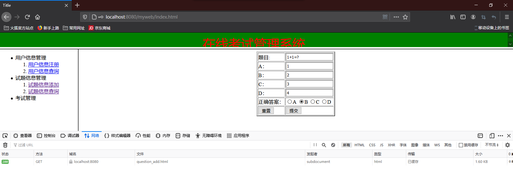

# JSP基础

## 一、JSP规范

> 1. 来自于JAVAEE规范中的一种
> 2. JSP规范制定了如何开发JSP文件代替响应对象将处理结果写入到响应体的开发流程
> 3. JSP规范制定了Http服务器应该如何调用管理JSP文件


### 1.1响应对象存在弊端

> 适合将数据量少的处理结果写入到响应体，而数据量多的时候，会增加开发难度。


### 1.2格式

```jsp
<!-- JSP文件在执行时，会自动将文件所有内容写入到响应体中，从而节省书写out.print的时间 -->
<%@ page contentType="text/html;charset=UTF-8" language="java" %>
<!-- page contentType="text/html;charset=UTF-8" 用来设置响应包中响应头中的contentType属性，该使用什么编辑器和字符编码 -->
<!-- language 表示可以在JSP中写JAVA命令 -->

<html>
  <head>
    <title>$Title$</title>
  </head>
  <body>
  $END$
  </body>
</html>
```


## 二、在JSP中书写JAVA命令规则

如果直接在JSP中书写JAVA命令会怎样？

```jsp
<%@ page contentType="text/html;charset=UTF-8" language="java" %>

  <!-- 在JSP中直接书写JAVA命令，是不能被JSP识别的，只能被当作普通字符串 -->
  int num1 = 20;
  int num2 = 30;
  int num3 = num1 + num2;
```


**很明显是错误的，所以在JSP中需要在特定的标签中书写JAVA命令。**


### 2.1<%%>执行标记

**在<%%>执行标记中可以书写JAVA变量，运算表达式以及控制语句。**

```jsp
<%@ page contentType="text/html;charset=UTF-8" language="java" %>

<%
  // 在JSP中，只有书写在执行标记中的内容才会被当作JAVA命令
  // 1. 声明JAVA变量
  int num1 = 100;
  int num2 = 200;
  
  // 2.声明运算表达式，数学表达式，关系运算，逻辑运算
  int num3 = num1 + num2;
  int num4 = num2 >= num1 ? num2 : num1;
  boolean num5 = num2 >= 200 && num1 >= 100;
  
  // 3.声明控制语句
  if (num2 >= num1){
    
  }else{
    
  }
  
  for (int i = 1; i <= 10; i++){
    
  }
%>
```


### 2.2<%=%>执行标记

**可以通过<%= %>来向响应体中写变量值**

```jsp
<%@ page contentType="text/html;charset=UTF-8" language="java" %>

<%
    int num1 = 100;
    int num2 = 200;
%>

<!-- 在JSP中，也是通过输出标记来通知JSP将JAVA变量的值写入到响应体中的 -->
变量num1的值：<%=num1%> <br/>
变量num2的值：<%=num2%> <br/>

<!-- 执行标记还可以将运算结果写入到响应体中 -->
num1 + num2 = <%=num1 + num2%> <br/>
```


### 2.3通过执行标记进行的一些简单操作

1. **如何操作类对象？**

```jsp
<%@ page import="com.bjpowernode.entity.Student" %>
<%@ page import="java.util.ArrayList" %>
<%@ page import="java.util.List" %>
<%@ page contentType="text/html;charset=UTF-8" language="java" %>

<%
    // 创建一个Student类型的对象
    Student student = new Student(10, "jack");
    List list = new ArrayList<>();
%>

学员编号：<%=student.getSno()%><br/>
学员姓名：<%=student.getSname()%><br/>
```


**在JSP中，所有的执行标记都当作一个整体。**


2. **如何在JSP中通过控制语句来控制写入到响应体中的内容？**

```jsp
<%@ page contentType="text/html;charset=UTF-8" language="java" %>

<%
    int age = 15;
%>

<%
    if (age >= 18){
%>
    <font style="color: red; font-size: 45px">热烈欢迎</font>
<%
    }else {
%>
    <font style="color: red; font-size: 45px">谢绝入内</font>
<%
    }
%>

<!--
    相当于
    {
        int age = 15;
        if (age >= 18){
            out.print("<font style='color: red; font-size: 45px'>热烈欢迎</font>");
        }else {
            out.print("<font style='color: red; font-size: 45px'>谢绝入内</font>");
        }
    }
-->
```


3. **使用执行标记遍历循环**

```jsp
<%@ page import="com.bjpowernode.entity.Student" %>
<%@ page import="java.util.List" %>
<%@ page import="java.util.ArrayList" %><%--
  Created by IntelliJ IDEA.
  User: Mr.Feng
  Date: 2021/1/16
  Time: 11:43
  To change this template use File | Settings | File Templates.
--%>
<%@ page contentType="text/html;charset=UTF-8" language="java" %>

<!-- 数据 -->
<%
    Student stu1 = new Student(10, "jack");
    Student stu2 = new Student(20, "elle");
    Student stu3 = new Student(30, "mike");
    List<Student> list = new ArrayList();
    list.add(stu1);
    list.add(stu2);
    list.add(stu3);
%>

<!-- 输出 -->
<table border="2" align="center">
    <tr>
        <th>学员编号</th>
        <th>学员姓名</th>
    </tr>
    <%
        for (Student student : list) {
    %>
    <tr>
        <td><%=student.getSno()%></td>
        <td><%=student.getSname()%></td>
    </tr>
    <%
        }
    %>
</table>
```


## 三、JSP文件内置对象

### 3.1JSP内置对象：request

> - JSP内置对象：request
>
> - 类型：HttpServletRequest
>
> - 作用：
>
>   1. 在JSP文件运行时读取请求包信息
>   2. 与Servlet在请求转发过程中实现数据共享
>
>   ```url
>   http://localhost:8080/myweb/request.jsp?userName=mike&password=123
>   ```

```jsp
<%@ page contentType="text/html;charset=UTF-8" language="java" %>

<%
    // 在JSP文件执行时，借助于内置request对象来读取请求包信息
    String userName = request.getParameter("userName");
    String password = request.getParameter("password");
%>
来访用户姓名：<%=userName%> <br/>
来访用户密码：<%=password%> <br/>
```


### 3.2JSP内置对象：Session

> - JSP内置对象：Session
> - 类型：HttpSession
> - 作用：
>   1. JSP文件在运行时，可以Session指向当前用户私人储物柜，添加共享数据或读取共享数据。

```jsp
<%@ page contentType="text/html;charset=UTF-8" language="java" %>

<!-- 在Session_1.jsp中向session添加共享数据 -->
<%
    // HttpSession session = request.getSession();
    session.setAttribute("key1", 200);
%>
```

```jsp
<%@ page contentType="text/html;charset=UTF-8" language="java" %>

<!--
    Session_1.jsp 与 Session_2.jsp为同一个用户/浏览器提供服务
    因此可以使用当前用户在服务端的session进行数据共享
-->
<%
    Integer value = (Integer) session.getAttribute("key1");
%>

Session_2.jsp从当前用户的session中读取的数据：<%=value%>
```


### 3.3JSP内置对象：application

> - JSP内置对象：application
> - 类型：ServletContext
> - 作用：
>   1. 同一个网站中的Servlet与JSP，都可以通过当前网站的全局作用域对象实现数据共享

````jsp
<%@ page contentType="text/html;charset=UTF-8" language="java" %>

<!--
    ServletContext application;全局作用域对象
    同一个网站中的Servlet与JSP，都可以通过当前网站的全局作用域对象实现数据共享
    JSP文件内置对象，application
-->
<%
    application.setAttribute("key1", "Hello World");
%>

````

```java
package com.bjpowernode.controller;

import javax.servlet.*;
import javax.servlet.http.*;
import java.io.IOException;

public class OneServlet extends HttpServlet {
    @Override
    protected void doGet(HttpServletRequest request, HttpServletResponse response) throws ServletException, IOException {

        ServletContext application = request.getServletContext();
        String value =(String) application.getAttribute("key1");
        System.out.println(value);
    }
}

```

先访问jsp，再访问servlet


```java
package com.bjpowernode.controller;

import javax.servlet.*;
import javax.servlet.http.*;
import java.io.IOException;

public class OneServlet extends HttpServlet {
    @Override
    protected void doGet(HttpServletRequest request, HttpServletResponse response) throws ServletException, IOException {

        ServletContext application = request.getServletContext();
        String value =(String) application.getAttribute("key1");
        System.out.println(value);
    }
}

```

先访问JSP，再访问Servlet


## 四、Servlet与JSP文件的分工

### 4.1Servlet与JSP之间的分工

1. Servlet：
   - 负责处理业务并得到处理结果
2. JSP：
   - 不负责业务处理，主要任务将Servlet中的处理结果写入到响应体中。


### 4.2Servlet与JSP之间的调用关系

> Servlet工作完毕后，一般通过请求转发的方式，向tomcat申请调用JSP


### 4.3Servlet与JSP之间如何实现数据共享

> Servlet将处理结果添加到【请求作用域对象】中，JSP文件在运行时从【请求作用域对象】得到处理结果


### 4.4实现

第一步：编写servlet

```java
package com.bjpowernode.controller;

import com.bjpowernode.entity.Student;

import javax.servlet.*;
import javax.servlet.http.*;
import java.io.IOException;
import java.util.ArrayList;
import java.util.List;

public class OneServlet extends HttpServlet {

    // 处理业务，得到处理结果...
    @Override
    protected void doGet(HttpServletRequest request, HttpServletResponse response) throws ServletException, IOException {

        Student stu1 = new Student(10, "elle");
        Student stu2 = new Student(10, "jack");
        List<Student> studentList = new ArrayList();
        studentList.add(stu1);
        studentList.add(stu2);

        // 将处理结果添加到请求作用域对象中
        request.setAttribute("key", studentList);

        // 通过请求转发方案向tomcat申请调用user_show.jsp
        // 同时将request和response通过tomcat交给user_show.jsp使用
        request.getRequestDispatcher("/user_show.jsp").forward(request, response);
    }
}

```

第二步：编写JSP

```jsp
<%@ page import="com.bjpowernode.entity.Student" %>
<%@ page import="java.util.List" %>
<%@ page contentType="text/html;charset=UTF-8" language="java" %>

<%
    // 从请求作用域对象中得到OneServlet添加进去的集合
    List<Student> stuList =(List) request.getAttribute("key");
%>

<!-- 将处理结果写入到响应体 -->
<table border="2" align="center">
    <tr>
        <th>用户编号</th>
        <th>用户姓名</th>
    </tr>
    <%
        for (Student student : stuList) {
    %>
        <tr>
            <td><%=student.getSno()%></td>
            <td><%=student.getSname()%></td>
        </tr>
    <%
        }
    %>
</table>
```


## 五、JSP文件运行原理

### 5.1Http服务器调用JSP文件步骤（面试题）

1. Http服务器将JSP文件内容【编辑】为一个Servlet接口实现类（.java）
2. Http服务器将Servlet接口实现类【编译】为class文件（.class）
3. Http服务器负责创建这个class的实例对象，这个实例对象就是Servlet实例对象
4. Http服务器通过Servlet实例对象调用_jspService方法，将JSP文件内容写入到响应体中


### 5.2Http服务器【编辑】与【编译】JSP文件的位置

**在【work】下面看到了这个文件。**

在本机上的路径是

```
C:\Users\Mr.Feng\AppData\Local\JetBrains\IntelliJIdea2020.3\tomcat\90d1cf3b-53f8-4323-91a7-5fed90217f32\work\Catalina\localhost\myweb\org\apache\jsp
```


所有在JSP中编写的内容都在对应的JSP编译文件【.java】中的_jspService方法的try...catch语句块中。

```java
public void _jspService(final javax.servlet.http.HttpServletRequest request, final javax.servlet.http.HttpServletResponse response)
      throws java.io.IOException, javax.servlet.ServletException {

    final java.lang.String _jspx_method = request.getMethod();
    if (!"GET".equals(_jspx_method) && !"POST".equals(_jspx_method) && !"HEAD".equals(_jspx_method) && !javax.servlet.DispatcherType.ERROR.equals(request.getDispatcherType())) {
      response.sendError(HttpServletResponse.SC_METHOD_NOT_ALLOWED, "JSP 只允许 GET、POST 或 HEAD。Jasper 还允许 OPTIONS");
      return;
    }

    final javax.servlet.jsp.PageContext pageContext;
    //-----------------JSP文件内置对象--------------------
    javax.servlet.http.HttpSession session = null;
    final javax.servlet.ServletContext application;
    final javax.servlet.ServletConfig config;
    javax.servlet.jsp.JspWriter out = null;
    final java.lang.Object page = this;
    javax.servlet.jsp.JspWriter _jspx_out = null;
    javax.servlet.jsp.PageContext _jspx_page_context = null;


    try {
      response.setContentType("text/html;charset=UTF-8");
      pageContext = _jspxFactory.getPageContext(this, request, response,
      			null, true, 8192, true);
      _jspx_page_context = pageContext;
      application = pageContext.getServletContext();
      config = pageContext.getServletConfig();
      session = pageContext.getSession();
      out = pageContext.getOut();
      _jspx_out = out;
	//----------------------------------------------------------
      out.write("\r\n");
      out.write("\r\n");
      out.write("\r\n");
      out.write("Hello World");
    //----------------------------------------------------------
    } catch (java.lang.Throwable t) {
      if (!(t instanceof javax.servlet.jsp.SkipPageException)){
        out = _jspx_out;
        if (out != null && out.getBufferSize() != 0)
          try {
            if (response.isCommitted()) {
              out.flush();
            } else {
              out.clearBuffer();
            }
          } catch (java.io.IOException e) {}
        if (_jspx_page_context != null) _jspx_page_context.handlePageException(t);
        else throw new ServletException(t);
      }
    } finally {
      _jspxFactory.releasePageContext(_jspx_page_context);
    }
  }
```


## 六、实例：在线考试管理系统------试题信息管理模块

### 6.1试题信息添加

第一步：创建html添加表单页面

```html
<!DOCTYPE html>
<html lang="en">
<head>
    <meta charset="UTF-8">
    <title>Title</title>
</head>
<body>
    <center>
        <form action="/myweb/user/add" method="get">
            <table border="2">
                <tr>
                    <td>用户名</td>
                    <td><input type="text" name="userName"/></td>
                </tr>
                <tr>
                    <td>用户密码</td>
                    <td><input type="password" name="password"/></td>
                </tr>
                <tr>
                    <td>用户性别</td>
                    <td>
                        <input type="radio" name="sex" value="男">男
                        <input type="radio" name="sex" value="女">女
                    </td>
                </tr>
                <tr>
                    <td>用户邮箱</td>
                    <td><input type="text" name="email"></td>
                </tr>
                <tr>
                    <td><input type="reset" value="重置"></td>
                    <td><input type="submit" value="注册"></td>
                </tr>
            </table>
        </form>
    </center>
</body>
</html>
```

第二步：编写对应的servlet并配置到web.xml

```java
package com.bjpowernode.controller;

import com.bjpowernode.dao.QuestionDao;
import com.bjpowernode.entity.Question;

import javax.servlet.*;
import javax.servlet.http.*;
import java.io.IOException;

public class QuestionAddServlet extends HttpServlet {
    @Override
    protected void doGet(HttpServletRequest request, HttpServletResponse response) throws ServletException, IOException {

        String title, optionA, optionB, optionC, optionD, answer;
        QuestionDao dao = new QuestionDao();
        Question question = null;
        int result = 0;
        // 1.调用请求对象读取请求头中的信息，得到新增信息内容
        title = request.getParameter("title");
        optionA = request.getParameter("optionA");
        optionB = request.getParameter("optionB");
        optionC = request.getParameter("optionC");
        optionD = request.getParameter("optionD");
        answer = request.getParameter("answer");
        // 2.调用dao对象将Insert命令推送到数据库，并得到处理结果
        question = new Question(null, title, optionA, optionB, optionC, optionD, answer);
        result = dao.add(question);
        // 3.通过请求转发，向Tomcat索要info.jsp将处理结果写入到响应体
        if (result == 1){
            request.setAttribute("info", "试题添加成功");
        }else {
            request.setAttribute("info", "试题添加失败");
        }
        request.getRequestDispatcher("/info.jsp").forward(request, response);
    }
}

```

第三步：编写对应的dao类的add方法

```java
public int add(Question question){
        String sql = "insert into question (title, optionA, optionB, optionC, optionD, answer) values (?, ?, ?, ?, ?, ?)";
        PreparedStatement ps = util.createStatement(sql);
        int result = 0;
        try {
            ps.setString(1, question.getTitle());
            ps.setString(2, question.getOptionA());
            ps.setString(3, question.getOptionB());
            ps.setString(4, question.getOptionC());
            ps.setString(5, question.getOptionD());
            ps.setString(6, question.getAnswer());
            result = ps.executeUpdate();
        } catch (SQLException throwables) {
            throwables.printStackTrace();
        } finally {
            util.close();
        }
        return result;
    }
```

第四步：编写请求转发到的jsp页面

```jsp
<%@ page contentType="text/html;charset=UTF-8" language="java" %>
<html>
<head>
    <title>Title</title>
</head>
<body>
    <center>
        <%
            String result = (String) request.getAttribute("info");
        %>
        <font style="color: red; font-size: 45px">
            <%=result%>
        </font>
    </center>
</body>
</html>

```




### 6.2全部试题信息查询

第一步：编写servlet并配置web.xml

```java
package com.bjpowernode.controller;

import com.bjpowernode.dao.QuestionDao;

import javax.servlet.*;
import javax.servlet.http.*;
import java.io.IOException;
import java.util.List;

public class QuestionFindServlet extends HttpServlet {
    @Override
    protected void doGet(HttpServletRequest request, HttpServletResponse response) throws ServletException, IOException {
        QuestionDao dao = new QuestionDao();
        // 1.调用dao推送查询命令得到所有的试题
        List list = dao.findAll();
        // 2.将得到的试题添加到请求作用域对象中，作为共享数据
        request.setAttribute("key", list);
        // 3.通过请求转发向tomcat申请调用questions.jsp将结果与html标签写入到响应体中
        request.getRequestDispatcher("/questions.jsp").forward(request, response);
    }
}

```

第二步：编写对应的dao类findall方法

```java
    public List findAll(){
        String sql = "select * from question";
        List<Question> questionList = new ArrayList();
        Question question = null;
        PreparedStatement ps = util.createStatement(sql);
        ResultSet rs = null;
        try {
            rs = ps.executeQuery();
            while (rs.next()){
                Integer questionId = rs.getInt("questionId");
                String title = rs.getString("title");
                String optionA = rs.getString("optionA");
                String optionB = rs.getString("optionB");
                String optionC = rs.getString("optionC");
                String optionD = rs.getString("optionD");
                String answer = rs.getString("answer");
                question = new Question(questionId, title, optionA, optionB, optionC, optionD, answer);
                questionList.add(question);
            }
        } catch (SQLException throwables) {
            throwables.printStackTrace();
        } finally {
            util.close(rs);
        }
        return questionList;
    }
```

第三步：编写请求转发到的jsp页面

```jsp
<%@ page import="java.util.List" %>
<%@ page import="com.bjpowernode.entity.Question" %>
<%@ page contentType="text/html;charset=UTF-8" language="java" %>
<html>
<head>
    <title>Title</title>
</head>
<body>
    <table border="2" align="center">
        <tr>
            <th>题目编号</th>
            <th>题目信息</th>
            <th>A</th>
            <th>B</th>
            <th>C</th>
            <th>D</th>
            <th>正确答案</th>
        </tr>
            <%
                List<Question> list = (List) request.getAttribute("key");
                for (Question question : list) {
            %>
        <tr>
            <td><%=question.getQuesionId()%></td>
            <td><%=question.getTitle()%></td>
            <td><%=question.getOptionA()%></td>
            <td><%=question.getOptionB()%></td>
            <td><%=question.getOptionC()%></td>
            <td><%=question.getOptionD()%></td>
            <td><%=question.getAnswer()%></td>
        </tr>
            <%
                }
            %>
    </table>
</body>
</html>

```


### 6.3删除试题

第一步：在查询全部试题的jsp中作出修改

```jsp
<%@ page import="java.util.List" %>
<%@ page import="com.bjpowernode.entity.Question" %>
<%@ page contentType="text/html;charset=UTF-8" language="java" %>
<html>
<head>
    <title>Title</title>
</head>
<body>
    <table border="2" align="center">
        <tr>
            <th>题目编号</th>
            <th>题目信息</th>
            <th>A</th>
            <th>B</th>
            <th>C</th>
            <th>D</th>
            <th>正确答案</th>
            <th colspan="2">操作</th>
        </tr>
            <%
                List<Question> list = (List) request.getAttribute("key");
                for (Question question : list) {
            %>
        <tr>
            <td><%=question.getQuesionId()%></td>
            <td><%=question.getTitle()%></td>
            <td><%=question.getOptionA()%></td>
            <td><%=question.getOptionB()%></td>
            <td><%=question.getOptionC()%></td>
            <td><%=question.getOptionD()%></td>
            <td><%=question.getAnswer()%></td>
            <td><a href="/myweb/question/delete?questionId=<%=question.getQuesionId()%>">删除试题</a></td>
            <td><a href="/myweb/question/findById?questionId=<%=question.getQuesionId()%>">详细信息</a></td>
        </tr>
            <%
                }
            %>
    </table>
</body>
</html>

```

第二步：编写servlet并配置到web.xml

```java
package com.bjpowernode.controller;

import com.bjpowernode.dao.QuestionDao;

import javax.servlet.*;
import javax.servlet.http.*;
import java.io.IOException;

public class QuestionDeleteServlet extends HttpServlet {
    @Override
    protected void doGet(HttpServletRequest request, HttpServletResponse response) throws ServletException, IOException {

        QuestionDao dao = new QuestionDao();
        String questionId = null;
        int result = 0;
        // 1.调用请求对象获取请求参数
        questionId = request.getParameter("questionId");

        // 2.调用dao
        result = dao.delete(questionId);

        // 3.通过请求转发的方式将结果写入到请求对象
        if (result == 1){
            request.setAttribute("info", "试题删除成功");
        }else {
            request.setAttribute("info", "试题删除失败");
        }
        request.getRequestDispatcher("/info.jsp").forward(request, response);
    }
}

```

第三步：编写dao类

```java
    public int delete(String questionId){
        String sql = "delete from question where questionId = ?";
        int result = 0;
        PreparedStatement ps = util.createStatement(sql);
        try {
            ps.setInt(1, Integer.valueOf(questionId));
            result = ps.executeUpdate();
        } catch (SQLException throwables) {
            throwables.printStackTrace();
        } finally {
            util.close();
        }
        return result;
    }
```


### 6.4更新试题

第一步：在查询全部试题的jsp中作出修改

```jsp
<%@ page import="java.util.List" %>
<%@ page import="com.bjpowernode.entity.Question" %><%--
  Created by IntelliJ IDEA.
  User: Mr.Feng
  Date: 2021/1/16
  Time: 16:52
  To change this template use File | Settings | File Templates.
--%>
<%@ page contentType="text/html;charset=UTF-8" language="java" %>
<html>
<head>
    <title>Title</title>
</head>
<body>
    <table border="2" align="center">
        <tr>
            <th>题目编号</th>
            <th>题目信息</th>
            <th>A</th>
            <th>B</th>
            <th>C</th>
            <th>D</th>
            <th>正确答案</th>
            <th colspan="2">操作</th>
        </tr>
            <%
                List<Question> list = (List) request.getAttribute("key");
                for (Question question : list) {
            %>
        <tr>
            <td><%=question.getQuesionId()%></td>
            <td><%=question.getTitle()%></td>
            <td><%=question.getOptionA()%></td>
            <td><%=question.getOptionB()%></td>
            <td><%=question.getOptionC()%></td>
            <td><%=question.getOptionD()%></td>
            <td><%=question.getAnswer()%></td>
            <td><a href="/myweb/question/delete?questionId=<%=question.getQuesionId()%>">删除试题</a></td>
            <td><a href="/myweb/question/findById?questionId=<%=question.getQuesionId()%>">详细信息</a></td>
        </tr>
            <%
                }
            %>
    </table>
</body>
</html>

```

第二步：先编写根据ID查询试题的servlet并配置到web.xml

```java
package com.bjpowernode.controller;

import com.bjpowernode.dao.QuestionDao;
import com.bjpowernode.entity.Question;

import javax.servlet.*;
import javax.servlet.http.*;
import java.io.IOException;

public class QuestionFindByIdServlet extends HttpServlet {
    @Override
    protected void doGet(HttpServletRequest request, HttpServletResponse response) throws ServletException, IOException {
        String questionId = null;
        QuestionDao dao = new QuestionDao();
        Question question = null;
        // 1.调用请求对象读取请求头参数信息
        questionId = request.getParameter("questionId");
        // 2.调用dao推送查询命令得到这个试题编号对应的试题信息
        question = dao.findById(questionId);
        // 3.调用question_update.jsp将试题写入到响应体
        request.setAttribute("key", question);
        request.getRequestDispatcher("/question_update.jsp").forward(request, response);
    }
}

```

第三步：编写对应的dao

```java
    public Question findById(String questionId){
        String sql = "select * from question where questionId = ?";
        ResultSet rs = null;
        PreparedStatement ps = util.createStatement(sql);
        Question question = null;
        try {
            ps.setInt(1, Integer.valueOf(questionId));
            rs = ps.executeQuery();
            while (rs.next()) {
                Integer questionid = rs.getInt("questionId");
                String title = rs.getString("title");
                String optionA = rs.getString("optionA");
                String optionB = rs.getString("optionB");
                String optionC = rs.getString("optionC");
                String optionD = rs.getString("optionD");
                String answer = rs.getString("answer");
                question = new Question(questionid, title, optionA, optionB, optionC, optionD, answer);
            }
        } catch (SQLException throwables) {
            throwables.printStackTrace();
        } finally {
            util.close(rs);
        }
        return question;
    }
```

第四步：编写请求转发到的jsp页面

```jsp
<%@ page import="com.bjpowernode.entity.Question" %>
<%@ page contentType="text/html;charset=UTF-8" language="java" %>
<html>
<head>
    <title>Title</title>
</head>
<body>
<%
    Question question = (Question) request.getAttribute("key");
%>
<center>
    <form action="/myweb/question/update" method="get">
        <table border="2" align="center">
            <tr>
                <td>题目编号:</td>
                <td><input type="text" name="questionId" value="<%=question.getQuesionId()%>" readonly></td>
            </tr>
            <tr>
                <td>题目:</td>
                <td><input type="text" name="title" value="<%=question.getTitle()%>"></td>
            </tr>
            <tr>
                <td>A：</td>
                <td><input type="text" name="optionA" value="<%=question.getOptionA()%>"></td>
            </tr>
            <tr>
                <td>B：</td>
                <td><input type="text" name="optionB" value="<%=question.getOptionB()%>"></td>
            </tr>
            <tr>
                <td>C：</td>
                <td><input type="text" name="optionC" value="<%=question.getOptionC()%>"></td>
            </tr>
            <tr>
                <td>D：</td>
                <td><input type="text" name="optionD" value="<%=question.getOptionD()%>"></td>
            </tr>
            <tr>
                <td>正确答案：</td>
                <td>
                    <input type="radio" name="answer" value="A" <%="A".equals(question.getAnswer())?"checked":""%> >A
                    <input type="radio" name="answer" value="B" <%="B".equals(question.getAnswer())?"checked":""%> >B
                    <input type="radio" name="answer" value="C" <%="C".equals(question.getAnswer())?"checked":""%> >C
                    <input type="radio" name="answer" value="D" <%="D".equals(question.getAnswer())?"checked":""%> >D
                </td>
            </tr>
            <tr>
                <td><input type="reset" value="重置"></td>
                <td><input type="submit" value="更新试题"></td>
            </tr>
        </table>
    </form>
</center>
</body>
</html>

```

第五步：编写更新试题的servlet并配置到web.xml

```java
package com.bjpowernode.controller;

import com.bjpowernode.dao.QuestionDao;
import com.bjpowernode.entity.Question;

import javax.servlet.*;
import javax.servlet.http.*;
import java.io.IOException;

public class QuestionUpdateServlet extends HttpServlet {
    @Override
    protected void doGet(HttpServletRequest request, HttpServletResponse response) throws ServletException, IOException {

        String questionId, title, optionA, optionB, optionC, optionD, answer;
        QuestionDao dao = new QuestionDao();
        Question question = null;
        int result = 0;
        // 1.调用请求对象读取请求头参数信息
        questionId = request.getParameter("questionId");
        title = request.getParameter("title");
        optionA = request.getParameter("optionA");
        optionB = request.getParameter("optionB");
        optionC = request.getParameter("optionC");
        optionD = request.getParameter("optionD");
        answer = request.getParameter("answer");
        // 2.调用Dao类实现更新操作
        question = new Question(Integer.valueOf(questionId), title, optionA, optionB, optionC, optionD, answer);
        result = dao.update(question);
        // 3.调用info.jsp将操作结果写入到响应体
        if (result == 1){
            request.setAttribute("info", "试题更新成功");
        }else {
            request.setAttribute("info", "试题更新失败");
        }
        request.getRequestDispatcher("/info.jsp").forward(request, response);
    }
}

```

第六步：编写对应的dao

```java
    public int update(Question question){
        String sql = "update question set title = ?, optionA = ?, optionB = ?, optionC = ?, optionD = ?, answer = ? where questionId = ?";
        PreparedStatement ps = util.createStatement(sql);
        int result = 0;
        try {
            ps.setString(1, question.getTitle());
            ps.setString(2, question.getOptionA());
            ps.setString(3, question.getOptionB());
            ps.setString(4, question.getOptionC());
            ps.setString(5, question.getOptionD());
            ps.setString(6, question.getAnswer());
            ps.setInt(7, Integer.valueOf(question.getQuesionId()));
            result = ps.executeUpdate();
        } catch (SQLException throwables) {
            throwables.printStackTrace();
        } finally {
            util.close();
        }
        return result;
    }
```


## 七、EL技术

### 7.1EL工具包

> 由Java技术开发的jar包，主要为了降低JSP开发时Java命令的开发难度，Tomcat服务器本身自带了EL工具包（根目录/lib/el-api.jar）


### 7.2JSP文件的作用和主要开发步骤

> 主要代替响应对象将Servlet中的doGet和doPost的执行结果写入到响应体。

将作用域存放的处理结果读取出来并写入到响应体

```jsp
<%
	String value = (String) request.getAttribute("key");
%>

<%=
	value
%>
<!--
	1.从指定作用域对象中读取处理结果
	2.将得到数据进行类型转换
	3.将转换后的数据写入到响应体
-->
```

**读取基本数据类型**

```java

public class OneServlet extends HttpServlet {

    @Override
    protected void doGet(HttpServletRequest request, HttpServletResponse response) throws ServletException, IOException {

        // 1.分别将共享数据添加作用域对象中
        ServletContext application = request.getServletContext();
        HttpSession session = request.getSession();

        application.setAttribute("sid", 10);
        session.setAttribute("sname", "elle");
        request.setAttribute("home", "USA");

        // 2.通过请求转发方式向tomcat申请调用index1.jsp，由index1.jsp负责将作用域对象的共享数据读取并写入到响应体中
        request.getRequestDispatcher("/index1.jsp").forward(request, response);
    }
}
```

```jsp
<%@ page contentType="text/html;charset=UTF-8" language="java" %>

<%
    Integer sid = (Integer) application.getAttribute("sid");
    String sname = (String) session.getAttribute("sname");
    String home = (String) request.getAttribute("home");
%>

学员ID：<%=sid%> <br>
学员姓名：<%=sname%> <br>
学院地址：<%=home%> <br>
```


**读取引用数据类型**

```java
package com.bjpowernode.controller;

import com.bjpowernode.entity.Student;

import javax.servlet.*;
import javax.servlet.http.*;
import java.io.IOException;

public class OneServlet extends HttpServlet {
    @Override
    protected void doGet(HttpServletRequest request, HttpServletResponse response) throws ServletException, IOException {

        // 1.创建一个引用类型实例对象
        Student student = new Student(10, "elle");

        // 2.将引用类型对象存入到请求作用域对象中
        request.setAttribute("key", student);
        // 3.通过请求转发向tomcat申请调用index1.jsp
        request.getRequestDispatcher("/index1.jsp").forward(request, response);
    }
}

```

```jsp
<%@ page import="com.bjpowernode.entity.Student" %>
<%@ page contentType="text/html;charset=UTF-8" language="java" %>
<%
    Student stu = (Student) request.getAttribute("key");
%>

学员编号：<%=stu.getSid()%><br/>
学员姓名：<%=stu.getSname()%><br/>
```


### 7.3EL表达式

使用EL表达式

```jsp
<%@ page contentType="text/html;charset=UTF-8" language="java" %>

<%
    Integer sid = (Integer) application.getAttribute("sid");
    String sname = (String) session.getAttribute("sname");
    String home = (String) request.getAttribute("home");
%>

学员ID：<%=sid%> <br>
学员姓名：<%=sname%> <br>
学院地址：<%=home%> <br>
<hr>

学员ID：${applicationScope.sid} <br>
学员姓名：${sessionScope.sname} <br>
学院地址：${requestScope.home} <br>
```


1. 命令格式：

   > ${作用域对象别名.共享数据}

2. 命令作用：

   > 1. EL表达式是EL工具包提供的一种特殊命令格式【表达式命令格式】
   > 2. EL表达式在JSP文件上使用
   > 3. 负责在JSP文件上从作用域对象读取指定的共享数据并输出到响应体中


### 7.4EL表达式——作用域对象别名

#### 7.4.1JSP文件中可以使用的作用域对象

查看JSP编译文件的_jspService方法

```java
// 1.形参中的请求作用域对象---------------------------------------------------------------
public void _jspService(final javax.servlet.http.HttpServletRequest request, final javax.servlet.http.HttpServletResponse response)
      throws java.io.IOException, javax.servlet.ServletException {

    final java.lang.String _jspx_method = request.getMethod();
    if (!"GET".equals(_jspx_method) && !"POST".equals(_jspx_method) && !"HEAD".equals(_jspx_method) && !javax.servlet.DispatcherType.ERROR.equals(request.getDispatcherType())) {
      response.sendError(HttpServletResponse.SC_METHOD_NOT_ALLOWED, "JSP 只允许 GET、POST 或 HEAD。Jasper 还允许 OPTIONS");
      return;
    }
// 4.当前页作用域对象----------------只能在JSP文件中出现的作用域对象---------------------
    final javax.servlet.jsp.PageContext pageContext;
// 2.会话作用域对象---------------------------------------------------------------
    javax.servlet.http.HttpSession session = null;
// 3.全局作用域对象---------------------------------------------------------------
    final javax.servlet.ServletContext application;
    final javax.servlet.ServletConfig config;
    javax.servlet.jsp.JspWriter out = null;
    final java.lang.Object page = this;
    javax.servlet.jsp.JspWriter _jspx_out = null;
    javax.servlet.jsp.PageContext _jspx_page_context = null;


    try {
      response.setContentType("text/html;charset=UTF-8");
      pageContext = _jspxFactory.getPageContext(this, request, response,
      			null, true, 8192, true);
      _jspx_page_context = pageContext;
      application = pageContext.getServletContext();
      config = pageContext.getServletConfig();
      session = pageContext.getSession();
      out = pageContext.getOut();
      _jspx_out = out;

      out.write("\r\n");
      out.write("\r\n");
//----------------------JSP中的转格式和输出-------------------------------
    Integer sid = (Integer) application.getAttribute("sid");
    String sname = (String) session.getAttribute("sname");
    String home = (String) request.getAttribute("home");

      out.write("\r\n");
      out.write("\r\n");
      out.write("学员ID：");
      out.print(sid);
      out.write(" <br>\r\n");
      out.write("学员姓名：");
      out.print(sname);
      out.write(" <br>\r\n");
      out.write("学院地址：");
      out.print(home);
      out.write(" <br>\r\n");
//----------------------JSP中的转格式和输出-------------------------------
        
//---------------------------EL表达式-----------------------------------
      out.write("<hr>\r\n");
      out.write("学员ID：");
      out.write((java.lang.String) org.apache.jasper.runtime.PageContextImpl.proprietaryEvaluate("${applicationScope.sid}", java.lang.String.class, (javax.servlet.jsp.PageContext)_jspx_page_context, null));
        
      out.write(" <br>\r\n");
      out.write("学员姓名：");
      out.write((java.lang.String) org.apache.jasper.runtime.PageContextImpl.proprietaryEvaluate("${sessionScope.sname}", java.lang.String.class, (javax.servlet.jsp.PageContext)_jspx_page_context, null));
        
      out.write(" <br>\r\n");
      out.write("学院地址：");
      out.write((java.lang.String) org.apache.jasper.runtime.PageContextImpl.proprietaryEvaluate("${requestScope.home}", java.lang.String.class, (javax.servlet.jsp.PageContext)_jspx_page_context, null));
//---------------------------EL表达式-----------------------------------
        
      out.write(" <br>");
    } catch (java.lang.Throwable t) {
      if (!(t instanceof javax.servlet.jsp.SkipPageException)){
        out = _jspx_out;
        if (out != null && out.getBufferSize() != 0)
          try {
            if (response.isCommitted()) {
              out.flush();
            } else {
              out.clearBuffer();
            }
          } catch (java.io.IOException e) {}
        if (_jspx_page_context != null) _jspx_page_context.handlePageException(t);
        else throw new ServletException(t);
      }
    } finally {
      _jspxFactory.releasePageContext(_jspx_page_context);
    }
  }
```

> 1. ServletContext application：全局作用域对象
>
> 2. HttpSession session：会话作用域对象
>
> 3. HttpServletRequest request：请求作用域对象
>
> 4. PageContext pageContext：当前页作用域对象，这是JSP文件独有的作用域对象，Servlet中不存在。在当前页作用域对象存放的共享数据仅能在当前JSP文件中使用，不能共享给其他Servlet或者其他JSP文件。真实开发过程中主要用于JSTL标签与JSP文件之间数据共享。
>
>    JSTL--------数据------->pageContext--------->JSP


#### 7.4.2EL表达式提供作用域对象别名

| JSP         | EL表达式                       |
| ----------- | ------------------------------ |
| application | ${applicationScope.共享数据名} |
| session     | ${sessionScope.共享数据名}     |
| request     | ${requestScope.共享数据名}     |
| pageContext | ${pageScope.共享数据名}        |

模拟：

```jsp
<%@ page contentType="text/html;charset=UTF-8" language="java" %>

<%
    // 在实际开发中，pageContext数据由JSTL标签命令写入
    // 由于目前没有学习JSTL技术，所以手动通过JAVA命令写入
    // 这种过程在实际开发中不存在
    pageContext.setAttribute("sex", "男");
%>

性别：${pageScope.sex}
```


#### 7.4.3EL表达式将引用对象写入到响应体

1. 命令格式：

   ```
   ${作用域对象别名.共享数据名.属性名}
   ```

2. 命令作用：

   > 从作用域对象读取指定共享数据关联的引用对象的属性值，并自动将属性的结果写入到响应体。

3. 属性名：

   > 一定要与引用类型的属性名完全一致。


实例：

```jsp
<%@ page import="com.bjpowernode.entity.Student" %>
<%@ page contentType="text/html;charset=UTF-8" language="java" %>
<%
    Student stu = (Student) request.getAttribute("key");
%>

学员编号：<%=stu.getSid()%><br/>
学员姓名：<%=stu.getSname()%><br/>

<hr>
<!-- sid和sname来自Student类中的属性，大小写要完全一致 -->
学员编号：${requestScope.key.sid}<br/>
学员姓名：${requestScope.key.sname}<br/>
```


4. **EL表达式没有提供遍历集合的方法，因此无法从作用域对象读取集合内容进行输出。**


### 7.5EL表达式简化版

1. 命令格式：

   ```
   ${共享数据名}
   ```

2. 命令作用：

   > EL表达式允许开发人员开发时省略作用域对象别名

3. 实例：

   ```java
   package com.bjpowernode.controller;
   
   import javax.servlet.*;
   import javax.servlet.http.*;
   import java.io.IOException;
   
   public class OneServlet extends HttpServlet {
       @Override
       protected void doGet(HttpServletRequest request, HttpServletResponse response) throws ServletException, IOException {
   
           // 1.向session添加一个数据
           HttpSession session = request.getSession();
           session.setAttribute("key", "elle");
   
           // 2.请求转发申请调用index1.jsp
           request.getRequestDispatcher("/index1.jsp").forward(request, response);
       }
   }
   
   ```

   ```jsp
   <%@ page contentType="text/html;charset=UTF-8" language="java" %>
   
   标准EL表达式输出session中的key：${sessionScope.key} <br>
   简化EL表达式输出session中的key：${key} <br>
   ```

   

**注意！！！修改以上servlet**

```java
package com.bjpowernode.controller;

import javax.servlet.*;
import javax.servlet.http.*;
import java.io.IOException;

public class OneServlet extends HttpServlet {
    @Override
    protected void doGet(HttpServletRequest request, HttpServletResponse response) throws ServletException, IOException {

        // 1.向session添加一个数据
        HttpSession session = request.getSession();
        session.setAttribute("key", "elle");

        // 2.向请求作用域对象中添加一个数据
        request.setAttribute("key", "jack");

        // 3.请求转发申请调用index1.jsp
        request.getRequestDispatcher("/index1.jsp").forward(request, response);
    }
}

```


3. 工作原理：

   > - 在EL表达式简化版中，由于没有指定作用域对象，所以在执行时采用【猜】算法。
   > - 首先到【pageContext】定位共享数据，如果存在直接读取输出并结束执行。
   > - 如果在【pageContext】没有定位成功，则到【request】中定位共享数据，如果存在直接读取输出并结束执行。
   > - 如果在【request】没有定位成功，则到【session】中定位共享数据，如果存在直接读取输出并结束执行。
   > - 如果在【session】没有定位成功，则到【application】中定位共享数据，如果存在直接读取输出并结束执行。
   > - 如果在【application】没有定位成功，则返回null。

4. 存在隐患：

   > 容易降低程序执行速度。
   >
   > 容易导致数据定位错误。

5. 应用场景：

   > 设计目的，就是简化从pageContext中读取数据并输出的难度。

6. EL表达式简化版尽管存在很多隐患，但在实际开发过程中，开发人员一般都使用简化版。


### 7.6EL表达式------支持运算表达式

- 前提：在JSP文件中，有时需要将读取的共享数据进行一番运算之后将运算结果写入到响应体中。

- 运算表达式：

  1. 数学运算

     ```java
     package com.bjpowernode.controller;
     
     import javax.servlet.*;
     import javax.servlet.http.*;
     import java.io.IOException;
     
     public class OneServlet extends HttpServlet {
         @Override
         protected void doGet(HttpServletRequest request, HttpServletResponse response) throws ServletException, IOException {
     
             request.setAttribute("key1",  "100");
             request.setAttribute("key2", 200);
     
             request.getRequestDispatcher("/index1.jsp").forward(request, response);
         }
     }
     
     ```

     ```jsp
     <%@ page contentType="text/html;charset=UTF-8" language="java" %>
     
     <!-- 将作用域对象中的共享数据读取出来相加，将结果写入到响应体 -->
     
     <%
         String num1 = (String) request.getAttribute("key1");
         Integer num2 = (Integer) request.getAttribute("key2");
         int sum = Integer.valueOf(num1) + num2;
     %>
     
     传统的JAVA命令计算后的结果：<%=sum%>
     <hr>
     EL表达式计算后的结果：${key1+key2}
     ```

     

  2. 关系运算：>(gt)      >=(ge)      ==(eq)      <(lt)      <=(le)      !=

     ```java
     package com.bjpowernode.controller;
     
     import javax.servlet.*;
     import javax.servlet.http.*;
     import java.io.IOException;
     
     public class TwoServlet extends HttpServlet {
         @Override
         protected void doGet(HttpServletRequest request, HttpServletResponse response) throws ServletException, IOException {
     
             request.setAttribute("age", "25");
             request.getRequestDispatcher("/index2.jsp").forward(request, response);
         }
     }
     
     ```

     ```jsp
     <%@ page contentType="text/html;charset=UTF-8" language="java" %>
     
     <!-- 传统JAVA方式 -->
     <%
         String age = (String) request.getAttribute("age");
         if (Integer.valueOf(age) >= 18){
     %>
         欢迎光临<br>
     <%
         }else {
     %>
         谢绝入内<br>
     <%
         }
     %>
     
     <!-- EL表达式 -->
     EL表达式输出关系运算：${age >= 18 ? "欢迎光临" : "谢绝入内"}
     ```

     

  3. 逻辑运算： &&      ||       ！


### 7.7EL表达式中的其他内置对象

#### 7.7.1param内置对象

1. 命令格式：

   ```
   ${param.请求参数名}
   ```

2. 命令作用：

   > 从通过请求对象读取当前请求包中请求参数内容，并将请求参数内容写入到响应体。

3. 代替命令：

   ```jsp
   <!-- 向index.jsp发送请求：http://localhost:8080/myweb/index.jsp?userName=elle&password=123 -->
   <%
   	String userName = (String) request.getParameter("userName");
   	String password = (String) request.getParameter("password");
   %>
   <%=userName%>
   <%=password%>
   ```

4. 实例：

   ```jsp
   <%@ page contentType="text/html;charset=UTF-8" language="java" %>
   
   <!-- http://localhost:8080/myweb/index1.jsp?userName=elle&password=123 -->
   
   来访者姓名：${param.userName}<br>
   来访者密码：${param.password}<br>
   ```

   

#### 7.7.2paramValues内置对象

1. 命令格式：

   ```jsp
   ${paramValues.请求参数名[下标]}
   ```

2. 命令作用：

   > 如果浏览器发送的请求参数是一个请求参数关联多个值，此时可以通过paramValues读取请求参数下指定位置的值，并写入响应体。

3. 代替命令：

   ```jsp
   <!-- 向index.jsp发送请求：http://localhost:8080/myweb/index.jsp?pageNo=1&pageNo=2&pageNo=3 -->
   <!-- 此时pageNo请求参数在请求包以数组形式存在，pageNo:[1,2,3] -->
   <%
   	String[] array =(String[]) request.getParameterValues("pageNo");
   %>
   第一个值:<%=array[0]%>
   第二个值:<%=array[1]%>
   第三个值:<%=array[2]%>
   ```

4. 实例：

   ```jsp
   <%@ page contentType="text/html;charset=UTF-8" language="java" %>
   <!-- http://localhost:8080/myweb/index2.jsp?pageNo=1&pageNo=2&pageNo=3 -->
   
   第一个编号：${paramValues.pageNo[0]}
   第二个编号：${paramValues.pageNo[1]}
   第三个编号：${paramValues.pageNo[2]}
   ```

   

### 7.8常见异常

#### 7.8.1javax.el.PropertyNotFoundException:在对象中没用找到指定属性

先创建一个Student类：

```java
public class Student {      
    private Integer sid;    
    private String sname;   
    // 省略无参有参构造器以及对应的setter和getter
}
```

创建servlet并配置到web.xml

```java
package com.bjpowernode.controller;

import com.bjpowernode.entity.Student;

import javax.servlet.*;
import javax.servlet.http.*;
import java.io.IOException;

public class OneServlet extends HttpServlet {
    @Override
    protected void doGet(HttpServletRequest request, HttpServletResponse response) throws ServletException, IOException {

        Student stu = new Student(10, "elle");
        request.setAttribute("key", stu);
        request.getRequestDispatcher("/index1.jsp").forward(request, response);
    }
}

```

编写对应的jsp，将参数写错

```jsp
<%@ page contentType="text/html;charset=UTF-8" language="java" %>
学员编号：${key.sid}<br>
<!-- Student类中的姓名属性:sname -->
学员姓名：${key.name}
```

分析异常的步骤：


## 八、JSTL技术

标签工具类

### 8.1介绍

> - JSP Standard Tag Lib：JSP中标准的标签工具类库
> - SUN公司提供
> - 组成：
>   1. 核心标签：Java在JSP上基本功能进行封装 if、while...
>   2. sql标签：JDBC在JSP上使用的功能（现在用不上了）
>   3. xml标签：DOM4J在JSP上的使用功能
>   4. format标签：JSP文件格式转换


### 8.2配置

1. 导入jar包：jstl.jar、standard.jar

2. 在JSP文件中引入JSTL中core包依赖约束

   ```
   <%@ taglib uri="http://java.sun.com/jsp/jstl/core" prefix="c"%>
   ```

3. 


### 8.3标签使用介绍

#### 8.3.1< c:set >

1. 作用：

   > 在JSP文件上设置域对象中的共享数据

2. 使用：

   ```jsp
   <c:set scope="session" var="key" value="10">
   // 用来代替以下命令
   <%
   	session.setAttribute("key", "10"/)
   %>
   ```

3. 属性：

   - scope：范围，指定操作与域对象别名

     ```jsp
     scope="application"
     scope="session"
     scope="request"
     scope="page"
     ```

   - var：声明域对象中的关键字

   - value：存入的共享数据

4. 实例：

   ```jsp
   <%@ taglib uri="http://java.sun.com/jsp/jstl/core" prefix="c"%>
   <%@ page contentType="text/html;charset=UTF-8" language="java" %>
   
   <c:set scope="application" var="sid" value="10" />
   <c:set scope="session" var="sname" value="elle" />
   <c:set scope="request" var="age" value="24" />
   <c:set scope="page" var="home" value="USA" />
   
   学员编号：${applicationScope.sid}<br>
   学员姓名：${sessionScope.sname}<br>
   学员年龄：${requestScope.age}<br>
   学员籍贯：${pageScope.home}<br>
   ```

   

5. set标签与EL表达式联合使用

   ```jsp
   <%@ page contentType="text/html;charset=UTF-8" language="java" %>
   <%@ taglib uri="http://java.sun.com/jsp/jstl/core" prefix="c"%>
   
   <!-- 设置今年的年龄 -->
   <c:set scope="request" var="age" value="20" /><br>
   <!-- 设置用户两年之后的年龄 -->
   <c:set scope="request" var="age" value="${requestScope.age + 2}" />
   <!--
   	执行顺序：${requestScope.age + 2}----age=22--- >写入到value------ >执行set标签，把request作用域中的age的值更新
   -->
   用户两年之后的年龄：${age}
   ```

   


#### 8.3.2< c:if >

1. 作用：

   > 在JSP文件上控制哪些内容可以写入到响应体。

2. 使用：

   ```jsp
   <c:if test="通过EL表达式进行判断">
   	内容
   </c:if>
   ```

3. 实例：

   ```jsp
   <%@ page contentType="text/html;charset=UTF-8" language="java" %>
   <%@ taglib uri="http://java.sun.com/jsp/jstl/core" prefix="c"%>
   <c:set scope="session" var="age" value="23" />
   
   <c:if test="${sessionScope.age >= 18}">
       <font color="red">欢迎光临</font>
   </c:if>
   <c:if test="${sessionScope.age < 18}">
       <font color="red">禁止入内</font>
   </c:if>
   ```

   

#### 8.3.3< c:choose >

1. 作用：

   > 在JSP文件上实现多分支选择判断，来决定哪一个内容能写入到响应体中

2. 使用：

   ```jsp
   <c:choose>
   	<c:when test="EL表达式1">
       	内容1
       </c:when>
       <c:when test="EL表达式2">
       	内容2
       </c:when>
       <c:when test="EL表达式3">
       	内容3
       </c:when>
       ...
       <!-- 这个标签可写可不写 -->
       <c:otherwise>
       	内容4
       </c:otherwise>
   </c:choose>
   ```

3. 实例：

   ```jsp
   <%@ taglib uri="http://java.sun.com/jsp/jstl/core" prefix="c"%>
   <%@ page contentType="text/html;charset=UTF-8" language="java" %>
   
   <c:set scope="page" var="sal" value="15000" />
   
   <c:choose>
       <c:when test="${pageScope.sal >= 50000}">高工资</c:when>
       <c:when test="${pageScope.sal >= 20000}">正常工资</c:when>
       <c:when test="${pageScope.sal >= 10000}">低工资</c:when>
       <c:otherwise>不正常工资</c:otherwise>
   </c:choose>
   ```

   


#### 8.3.4< c:forEach >

1. 作用：

   > 循环遍历

2. 第一种形式：

   ```jsp
   <%@ page contentType="text/html;charset=UTF-8" language="java" %>
   <%@ taglib uri="http://java.sun.com/jsp/jstl/core" prefix="c"%>
   <select>
       <%
           for(int i = 1; i <= 5; i++){
       %>
       <option>第<%=i%>页</option>
       <%
           }
       %>
   
   </select>
   <hr>
   <select>
       <c:forEach var="i" begin="1" end="5" step="1">
           <option>第${pageScope.i}页</option>
       </c:forEach>
   </select>
   ```

   

   > 属性：
   >
   > - var：声明循环变量名，被保存在【pageContext】中
   > - begin：循环遍历的初始值
   > - end：循环遍历的最大值
   > - step：递增值或递减值，可以不写默认递增递减1

3. 第二种形式：

   ```java
   package com.bjpowernode.controller;
   
   import com.bjpowernode.entity.Student;
   
   import javax.servlet.*;
   import javax.servlet.http.*;
   import java.io.IOException;
   import java.util.ArrayList;
   import java.util.List;
   
   public class SixServlet extends HttpServlet {
       @Override
       protected void doGet(HttpServletRequest request, HttpServletResponse response) throws ServletException, IOException {
   
           Student stu1 = new Student(10, "elle");
           Student stu2 = new Student(20, "jack");
           Student stu3 = new Student(30, "morgan");
           List<Student> list = new ArrayList();
           list.add(stu1);
           list.add(stu2);
           list.add(stu3);
           request.setAttribute("key", list);
           request.getRequestDispatcher("/index6.jsp").forward(request, response);
       }
   }
   
   ```

   ```jsp
   <%@ page import="com.bjpowernode.entity.Student" %>
   <%@ page import="java.util.List" %>
   <%@ taglib uri="http://java.sun.com/jsp/jstl/core" prefix="c"%>
   <%@ page contentType="text/html;charset=UTF-8" language="java" %>
   <html>
   <head>
       <title>Title</title>
   </head>
   <body>
       <!-- JAVA -->
       <table border="2">
           <tr>
               <td>学员编号</td>
               <td>学员姓名</td>
           </tr>
           <%
               List<Student> stuList = (List) request.getAttribute("key");
               for (Student student : stuList) {
           %>
           <tr>
               <td><%=student.getSid()%></td>
               <td><%=student.getSname()%></td>
           </tr>
           <%
               }
           %>
       </table>
   <hr>
       <!--JSTL-->
       <table border="2">
           <tr>
               <td>学员编号</td>
               <td>学员姓名</td>
           </tr>
           <c:forEach items="${requestScope.key}" var="student">
               <tr>
                   <td>${student.sid}</td>
                   <td>${student.sname}</td>
               </tr>
           </c:forEach>
       </table>
   </body>
   </html>
   
   ```

   

   > 属性：
   >
   > - items：通过EL表达式获得域对象集合
   > - var：声明一个循环变量
   > - 输出：${循环变量名称.属性名}

4. 通过forEach遍历map集合：

   ```java
   package com.bjpowernode.controller;
   
   import com.bjpowernode.entity.Student;
   
   import javax.servlet.*;
   import javax.servlet.http.*;
   import java.io.IOException;
   import java.util.ArrayList;
   import java.util.HashMap;
   import java.util.List;
   import java.util.Map;
   
   public class SixServlet extends HttpServlet {
       @Override
       protected void doGet(HttpServletRequest request, HttpServletResponse response) throws ServletException, IOException {
   
           Student stu1 = new Student(10, "elle");
           Student stu2 = new Student(20, "jack");
           Student stu3 = new Student(30, "morgan");
   
           Map map = new HashMap();
           map.put("一班", stu1);
           map.put("一班", stu2);
           map.put("二班", stu3);
   
           request.setAttribute("key2", map);
   
           request.getRequestDispatcher("/index6.jsp").forward(request, response);
       }
   }
   
   ```

   ```jsp
   <%@ page import="com.bjpowernode.entity.Student" %>
   <%@ page import="java.util.List" %>
   <%@ taglib uri="http://java.sun.com/jsp/jstl/core" prefix="c"%>
   <%@ page contentType="text/html;charset=UTF-8" language="java" %>
   <html>
   <head>
       <title>Title</title>
   </head>
   <body>
       <table border="2">
           <tr>
               <td>班级名称</td>
               <td>学员编号</td>
               <td>学员姓名</td>
           </tr>
           <!--
               遍历map时，每次得到的是一个【键值对】
               将【键值对】交给循环变量
               循环变量.key 获得键值对中关键字的名字
               循环变量.value 获得键值对中关键字的名字
           -->
           <c:forEach items="${requestScope.key2}" var="key_value">
               <tr>
                   <td>${key_value.key}</td>
                   <td>${key_value.value.sid}</td>
                   <td>${key_value.value.sname}</td>
               </tr>
           </c:forEach>
       </table>
   </body>
   </html>
   
   ```

   


## 九、实例

### 8.1自动出题

在数据库中编写查询语句时可以按照字段排序，然后截取结果，使用不同的字段排序，截取到的数据行内容也不一样，**但也可以使用数字来代替字段名。**

```sql
#查询职员信息，按照职员编号倒序，截取前两个
select * from emp order by empno desc limit 0,2;
select * from emp order by 1 desc limit 0,2;
```

**而且mysql中还可以使用rand()函数随即返回0-1之间的小数，两者结合即可实现随机取结果的功能。**

```sql
# 在mysql中如果在order by后使用rand()函数，则会自动变成整数，0.5---->5----->order by 5
# 并且当rand()函数返回的数字超出了表中的字段，会自动变成1
select * from question order by rand() limit 0,4;
```

第一步：编写Servlet

```java
package com.bjpowernode.controller;

import com.bjpowernode.dao.QuestionDao;
import com.bjpowernode.entity.Question;

import javax.servlet.*;
import javax.servlet.http.*;
import java.io.IOException;
import java.util.List;

public class QuestionRandServlet extends HttpServlet {
    @Override
    protected void doGet(HttpServletRequest request, HttpServletResponse response) throws ServletException, IOException {
        QuestionDao dao = new QuestionDao();
        List<Question> questionList = null;
        // 1.调用dao对象随机从question表中取出四道题目
        questionList = dao.findRand();
        // 2.将四道题目添加到request中作为共享数据
        request.setAttribute("key", questionList);
        // 3.请求转发，申请调用exam.jsp将题目写入到响应体
        request.getRequestDispatcher("/exam.jsp").forward(request, response);
    }
}

```

第二步：编写对应的dao

```java
    public List<Question> findRand() {
        String sql = "select * from question order by rand() limit 0, 4";
        List<Question> questionList = new ArrayList();
        Question question = null;
        PreparedStatement ps = util.createStatement(sql);
        ResultSet rs = null;
        try {
            rs = ps.executeQuery();
            while (rs.next()) {
                Integer questionId = rs.getInt("questionId");
                String title = rs.getString("title");
                String optionA = rs.getString("optionA");
                String optionB = rs.getString("optionB");
                String optionC = rs.getString("optionC");
                String optionD = rs.getString("optionD");
                String answer = rs.getString("answer");
                question = new Question(questionId, title, optionA, optionB, optionC, optionD, answer);
                questionList.add(question);
            }
        } catch (SQLException throwables) {
            throwables.printStackTrace();
        } finally {
            util.close(rs);
        }
        return questionList;
    }
```

第三步：编写对应的jsp

```jsp
<%@ page import="java.util.List" %>
<%@ page import="com.bjpowernode.entity.Question" %>
<%@ page contentType="text/html;charset=UTF-8" language="java" %>
<html>
<head>
    <title>Title</title>
</head>
<body>
    <center>
        <form action="" method="get">
            <table border="2">
                <tr>
                    <th>题目编号</th>
                    <th>题目信息</th>
                    <th>A</th>
                    <th>B</th>
                    <th>C</th>
                    <th>D</th>
                    <th>答案</th>
                </tr>
                <%
                    List<Question> questionList = (List) request.getAttribute("key");
                    for (Question question : questionList) {
                %>
                <tr>
                    <td><%=question.getQuestionId()%></td>
                    <td><%=question.getTitle()%></td>
                    <td><%=question.getOptionA()%></td>
                    <td><%=question.getOptionB()%></td>
                    <td><%=question.getOptionC()%></td>
                    <td><%=question.getOptionD()%></td>
                    <td>
                        <input type="radio" name="answer_<%=question.getQuestionId()%>" value="A"/>A
                        <input type="radio" name="answer_<%=question.getQuestionId()%>" value="B"/>B
                        <input type="radio" name="answer_<%=question.getQuestionId()%>" value="C"/>C
                        <input type="radio" name="answer_<%=question.getQuestionId()%>" value="D"/>D
                    </td>
                </tr>
                <%
                    }
                %>
                <tr align="center">
                    <td colspan="3"><input type="reset" value="重置"></td>
                    <td colspan="4"><input type="submit" value="提交"></td>
                </tr>
            </table>
        </form>
    </center>
</body>
</html>
```


### 8.2自动批卷


第一步：使用Session来存储随机的题目，所以需要修改Servlet

```java
package com.bjpowernode.controller;

import com.bjpowernode.dao.QuestionDao;
import com.bjpowernode.entity.Question;

import javax.servlet.*;
import javax.servlet.http.*;
import java.io.IOException;
import java.util.List;

public class QuestionRandServlet extends HttpServlet {
    @Override
    protected void doGet(HttpServletRequest request, HttpServletResponse response) throws ServletException, IOException {
        QuestionDao dao = new QuestionDao();
        List<Question> questionList = null;
        HttpSession session = request.getSession(false);
        // 1.调用dao对象随机从question表中取出四道题目
        questionList = dao.findRand();
        // 2.将四道题目添加到request中作为共享数据
        session.setAttribute("key", questionList);
        // 3.请求转发，申请调用exam.jsp将题目写入到响应体
        request.getRequestDispatcher("/exam.jsp").forward(request, response);
    }
}

```

第二步：修改jsp

```jsp
<%@ page import="java.util.List" %>
<%@ page import="com.bjpowernode.entity.Question" %>
<%@ page contentType="text/html;charset=UTF-8" language="java" %>
<html>
<head>
    <title>Title</title>
</head>
<body>
    <center>
        <form action="/myweb/exam" method="get">
            <table border="2">
                <tr>
                    <th>题目编号</th>
                    <th>题目信息</th>
                    <th>A</th>
                    <th>B</th>
                    <th>C</th>
                    <th>D</th>
                    <th>答案</th>
                </tr>
                <%
                    List<Question> questionList = (List) session.getAttribute("key");
                    for (Question question : questionList) {
                %>
                <tr>
                    <td><%=question.getQuestionId()%></td>
                    <td><%=question.getTitle()%></td>
                    <td><%=question.getOptionA()%></td>
                    <td><%=question.getOptionB()%></td>
                    <td><%=question.getOptionC()%></td>
                    <td><%=question.getOptionD()%></td>
                    <td>
                        <input type="radio" name="answer_<%=question.getQuestionId()%>" value="A"/>A
                        <input type="radio" name="answer_<%=question.getQuestionId()%>" value="B"/>B
                        <input type="radio" name="answer_<%=question.getQuestionId()%>" value="C"/>C
                        <input type="radio" name="answer_<%=question.getQuestionId()%>" value="D"/>D
                    </td>
                </tr>
                <%
                    }
                %>
                <tr align="center">
                    <td colspan="3"><input type="reset" value="重置"></td>
                    <td colspan="4"><input type="submit" value="提交"></td>
                </tr>
            </table>
        </form>
    </center>
</body>
</html>

```

第三步：编写判分的Servlet

```java
package com.bjpowernode.controller;

import com.bjpowernode.entity.Question;

import javax.servlet.*;
import javax.servlet.http.*;
import java.io.IOException;
import java.util.List;

public class ExamServlet extends HttpServlet {
    @Override
    protected void doGet(HttpServletRequest request, HttpServletResponse response) throws ServletException, IOException {

        HttpSession session = request.getSession(false);
        List<Question> questionList = null;
        int score = 0;
        // 1.从当前用户私人储物柜中得到系统提供的四道题目信息
        questionList =(List) session.getAttribute("key");
        // 2.从请求包中得到用户对四道题目给出的答案
        for (Question question : questionList) {
            String answer = question.getAnswer();
            Integer questionId = question.getQuestionId();
            String userAnswer = request.getParameter("answer_" + question.getQuestionId());
            // 3.判分
            if (userAnswer.equals(answer)){
                score += 25;
            }
        }
        // 4.将分数写入到request中作为共享数据
        request.setAttribute("info", "本次考试成绩：" + score);
        // 5.通过请求转发调用jsp将用户本次考试分数写入到响应体中
        request.getRequestDispatcher("/info.jsp").forward(request, response);
    }
}

```


## 十、面试题

1. 什么时候选择post请求，什么时候使用get请求。
2. 什么请求下服务器读取的请求参数是乱码，为什么？
3. 作用域对象有几种，都是什么。
4. 请求转发和重定向的区别？

