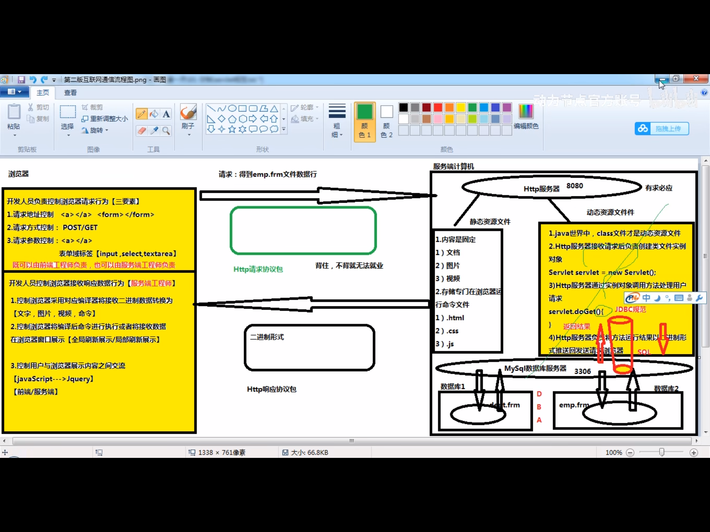
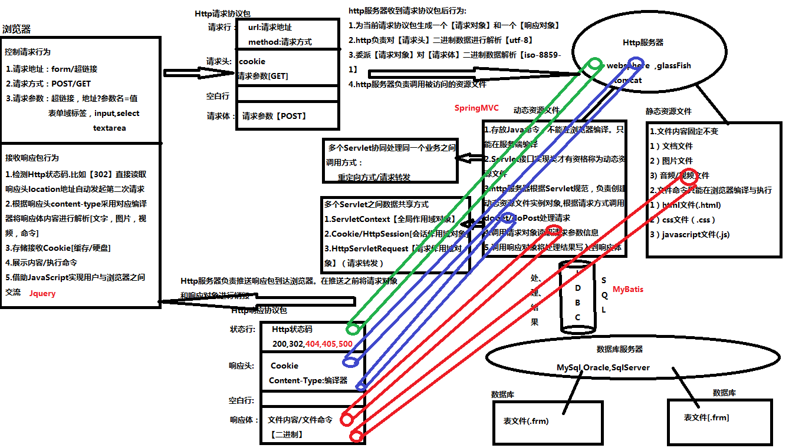
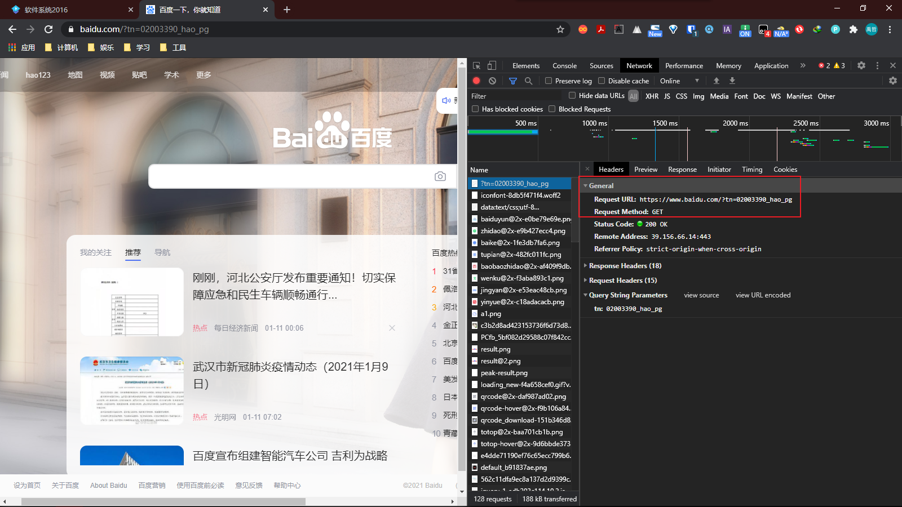
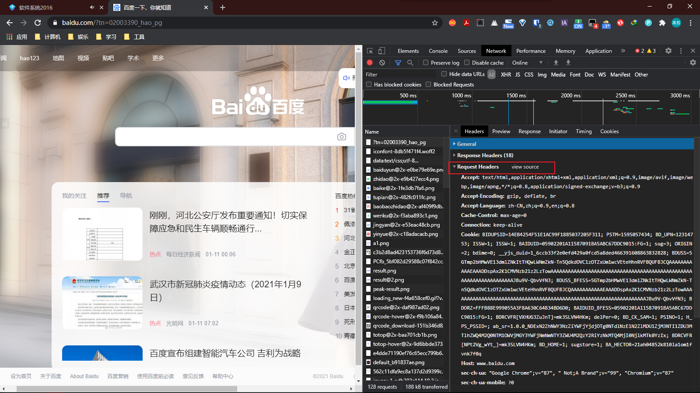
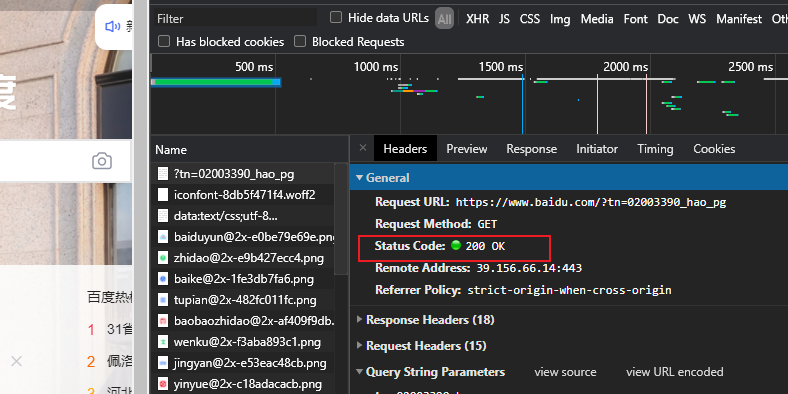
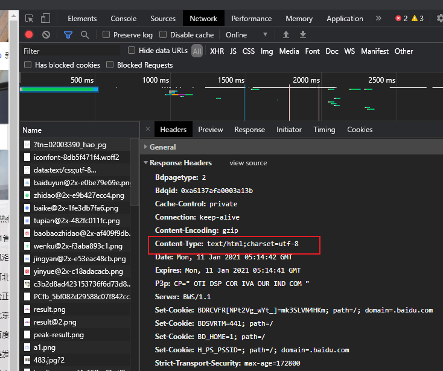
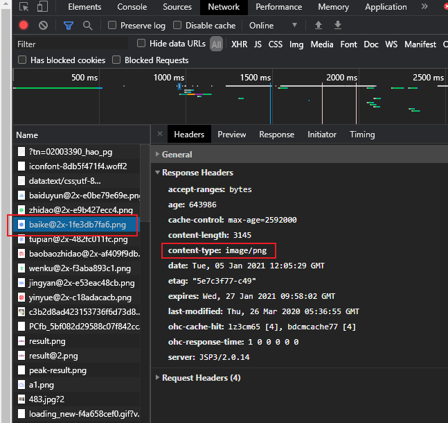
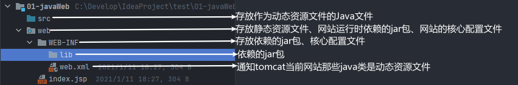

# Java Web基础

## 一、互联网通信开发流程

两台计算机通过网络实现文件共享的行为，就叫互联网通信。

1. 互联网通信过程的角色划分：

   > - 客户端计算机：
   >
   >   用来发送请求，来索要资源文件的计算机。
   >
   > - 服务端计算机：
   >
   >   用来接收请求，提供对应的资源的计算机。

2. 互联网通信模型：

   > 两台计算机通信时使用的软件被称作互联网通信模型。
   >
   > 1. **C/S通信模型：**
   >
   >    C：client software：
   >
   >    - 客户端软件，专门安装在客户端计算机上。
   >    - 帮助客户端计算机向指定的服务端计算机发送请求，索要资源文件。
   >    - 帮助客户端计算机将服务端计算机发送过来的二进制数据解析成文字、数字、图片、视频等文件。
   >
   >    S：Server software：
   >
   >    - 服务器软件：专门安装在服务端计算机上。
   >    - 服务器软件用户接收来自于特定的客户端软件发送的请求
   >    - 服务器软件在接收到请求后自动的在服务端计算机上定位被访问的资源文件。
   >    - 服务器软件自动的将定位的文件内容解析为二进制数据，通过网络发送回发起请求的客户端软件中。
   >
   >    优点：
   >
   >    - 安全性高
   >    - 有效降低服务端计算机工作压力
   >
   >    缺点：
   >
   >    - 增加客户获得服务的成本
   >    - 更新较为繁琐
   >
   > 2. **B/S通信模型：**
   >
   >    B：Browser：
   >
   >    - 浏览器，安装在客户端计算机软件
   >    - 可以向任意服务器发送请求，索要资源文件
   >    - 可以将服务器返回的二进制数据解析为文字、数字、图片、视频等文件
   >
   >    S：Server software：
   >
   >    - 服务器软件，专门安装在服务端计算机上
   >    - 可以接收任意浏览器发送请求
   >    - 自动的在服务端计算机上定位被访问的资源文件
   >    - 自动的将定位的资源文件内容以二进制形式发送回发起请求浏览器上
   >
   >    优点：
   >
   >    - 不会增加用户获得服务的成本
   >    - 几乎不需要更新
   >
   >    缺点：
   >
   >    - 几乎无法有效的对服务端计算机资源文件进行保护
   >    - 服务端计算机工作压力异常巨大

3. 共享资源文件：

   > 1. 什么是共享资源文件：
   >    - 可以通过网络进行传输的文件，所有的文件都是共享资源文件。
   > 2. 分类：
   >    - 静态资源文件
   >    - 动态资源文件
   > 3. 静态资源文件：
   >    - 文件中的内容固定
   >    - 文件存放的不是内容而是命令，这些命令只能在浏览器中编译与执行
   > 4. 动态资源文件：
   >    - 文件存放的不是内容而是命令，这些命令不能在浏览器编译和执行，只能在服务端中编译与执行
   > 5. 静态资源文件和动态资源文件调用的区别：
   >    - 静态文件被索要时，Http服务器直接通过输出流将静态文件中的内容或命令以二进制形式推送给发起请求的浏览器
   >    - 动态文件被索要时，Http服务器需要创建当前类文件的实例对象，通过实例对象调用对应的方法处理用户请求，通过输出流将运行结果以二进制的形式推送给发送请求的浏览器
   
4. 开发人员在互联网通信流程中的职责：

   > 1. 控制浏览器行为（三要素）
   >    - 控制浏览器发送的请求地址
   >    - 控制浏览器发送请求方式
   >    - 控制浏览器发送请求携带参数
   > 2. 开发动态资源文件解决用户请求



**第三版互联网通信流程图**



## 二、HTTP协议包

### 2.1网络协议包

1. 在网络中传递信息都是以二进制的形式存在的。

2. 接收方【浏览器/服务器】在接收信息后，要做第一件事就是将二进制数据进行编译成图片，文字，视频等。

3. 传递信息数据量往往比较巨大，导致接收方很难在一组连续二进制得到对应数据。

4. 网络协议包是一组有规律的二进制数据，在这组数据存在了固定空间，每一个空间专门存放特定信息，这样接收方在接收网络协议包之后就可以到固定空间得到对应信息，网络协议包的出现极大降低了接收方对接收二进制数据编译难度。

   【0000（id地址）		0000（端口号）		0000（资源文件名）		0000】


### 2.2常见的网络协议

1. FTP网络协议包
2. Http网络协议包


### 2.3Http网络协议包

1. 在基于B/S结构下的互联网通信过程中，所有在网络中传递信息都是保存在Http网络协议包的
2. 分类：
   - Http请求协议包
   - Http响应协议包


### 2.4Http请求协议包和Http响应协议包的介绍

1. Http请求协议包：

   在浏览器准备发送请求时，负责创建一个Http请求协议包，浏览器将请求信息以二进制形式保存在Http请求协议包中。

   由浏览器将Http请求协议包推送到指定的服务端计算机中。

2. Http响应协议包：

   HTTP服务器在定位到被访问的资源文件之后，负责创建一个Http响应协议包，Http服务器将定位文件内容或文件命令以二进制形式写入到Http响应协议包推送回发起请求的浏览器上。


### 2.5Http请求协议包的内部空间（背会）

1. 按照自上而下划分，分为四个空间：

   > - 请求行：[
   >
   >   ​						url：请求地址（http://192.168.100.1:8080/index.html）
   >
   >   ​						method：请求方式（get/post）
   >
   >   ]
   >
   >   
   >
   > - 请求头：[
   >
   >   ​						请求参数信息【GET】
   >
   >   ]
   >
   >   
   >
   > - 空白行：[
   >
   >   ​						没有任何内容，起到隔离作用
   >
   >   ]
   >
   > - 请求体：[
   >
   >   ​						请求参数信息【POST】
   >
   >   ]


### 2.6Http响应协议包的内部结构

1. 按照自上而下划分，分为四个空间：

   > - 状态行：[
   >
   >   ​						Http状态码
   >
   >   ]
   >
   >   
   >
   > - 响应头：[
   >
   >   ​						content-type：指定浏览器采用对应的编译器对响应体二进制数据进行解析
   >
   >   ]
   >
   >   
   >
   >   
   >
   > - 空白行：[
   >
   >   ​						没有任何内容，起到隔离作用
   >
   >   ]
   >
   > - 响应体：[
   >
   >   ​						可能被访问静态资源文件内容
   >
   >   ​						可能被访问的静态资源文件命令
   >
   >   ​						可能被访问的动态资源文件运行结果
   >
   >   ​						都是以二进制形式
   >
   >   ]


## 三、Http服务器

Http服务器是服务器中的一种，其行为与Http协议相关。

> Http服务器可以接收来自于浏览器发送的Http请求协议包，并自动对Http请求协议包内容进行解析。
>
> 解析后，自动定位被访问的文件，并将定位的文件写入到Http响应协议包中。
>
> 最后，负责将Http响应协议包推送回发起请求的浏览器上。


### 3.1Http服务器的分类

1. JBoss服务器
2. Glassfish服务器
3. Websphere服务器
4. Tomcat服务器


## 四、Tomcat服务器

1. 启动/关闭 服务器
   - 在安装目录/bin目录下
   - 启动：startuo.bat
   - 关闭：shutdown.bat


### 4.1Tomcat服务器内部文件结构

1. 根目录/conf：核心配置文件

   > server.xml文件：
   >
   > - Connector executor标签的port表示请求端口号

2. 根目录/lib：tomcat工程运行时需要的jar包

3. 根目录/logs：日志信息

4. 根目录/temp：tomcat运行时生成的临时文件

5. 根目录/webapps：当tomcat接收到请求后，会默认到webapps文件夹中定位资源文件

6. 根目录/work：工作空间，将jsp文件编译成java文件，并生成对应的class文件


## 五、模拟一次互联网通信

第一步：打开webapps文件夹，创建一个文件夹【myweb】

第二步：将一个静态资源文件添加到文件夹中【car.jpg】

第三步：启动tomcat

第四步：启动浏览器，命令浏览器向tomcat索要静态资源文件

**URL格式：网络协议包://服务端计算机IP地址:Http端口号/网站名/资源文件名称**

```
http://localhost:8080/myweb/car.jpg
```


## 六、文件结构

