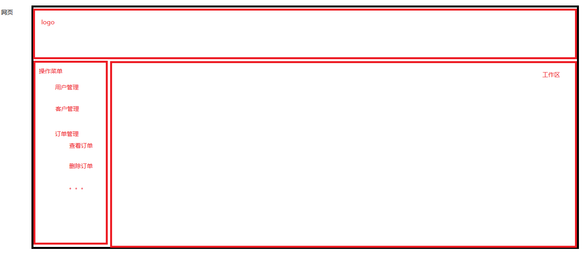
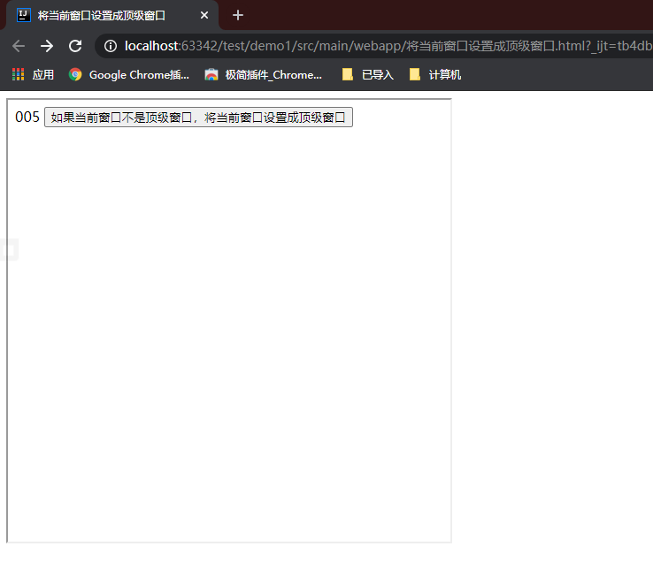
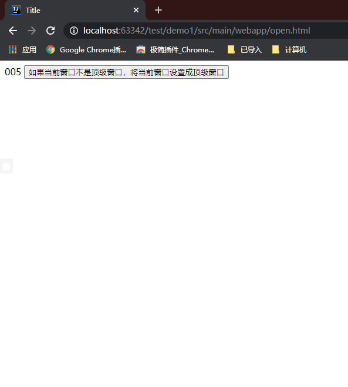

# JavaScript基础-BOM

## 一、open和close

> 1. 在BOM编程中，window对象是顶级对象，代表浏览器窗口。
> 2. window有open和close方法，可以开启窗口和关闭窗口。

### 1.1使用open()的几种形式

```html
<input type="button" value="开启百度(新窗口)" onclick="window.open('http://www.baidu.com')">
<input type="button" value="开启百度(当前窗口)" onclick="window.open('http://www.baidu.com', '_self')">
<input type="button" value="开启百度(新窗口)" onclick="window.open('http://www.baidu.com', '_blank')">
<input type="button" value="开启百度(父窗口)" onclick="window.open('http://www.baidu.com', '_parent')">
<input type="button" value="开启百度(顶级窗口)" onclick="window.open('http://www.baidu.com', '_top')">
```


### 1.2使用close()

close方法和浏览器右上角的X是一个原理

```html
<input type="button" value="关闭窗口" onclick="window.close()">
```


## 二、弹出消息框和确认框

```html
<!DOCTYPE html>
<html lang="en">
<head>
    <meta charset="UTF-8">
    <title>弹出消息框和确认框</title>
</head>
<body>
    <script type="text/javascript">
        function del(){
            window.confirm("确认删除吗？"); // 该方法会有boolean类型的返回值，返回true是确认删除，返回false是取消删除
        }
    </script>
    <input type="button" value="弹出消息框" onclick="alert('消息框！')">
    <input type="button" value="弹出确认框" onclick="del()">
</body>
</html>
```


## 三、将当前窗口设置成顶级窗口

以下代码要背会；

```html
if(window.top != window.self){
	window.top.location = window.self.location;
}
```



> 一个操作员正在使用系统，出去后隔了很久后回来，再次回来的时候继续操作，此时点击左侧的操作菜单的时候会跳转到登陆页面重新登陆（因为登录已经超时）。
>
> 如果没有做任何设置，那么登录页面会显示在右侧工作区中，其他位置正常。
>
> **此时需要将该登陆页面设置成顶级窗口。**

```html
<!DOCTYPE html>
<html lang="en">
<head>
    <meta charset="UTF-8">
    <title>Title</title>
</head>
<body>
    <script type="text/javascript">
        function setTop(){
            // window是当前窗口
            // window.top（当前窗口的顶级窗口）如果不是自己
            if (window.top != window.self){
                // 那么将当前窗口的顶级窗口设置成当前窗口
                window.top.location = window.self.location;
            }
        }
    </script>
    005
    <input type="button" value="如果当前窗口不是顶级窗口，将当前窗口设置成顶级窗口" onclick="setTop()">
</body>
</html>
```





## 三、History对象

```html
<!DOCTYPE html>
<html lang="en">
<head>
    <meta charset="UTF-8">
    <title>history对象</title>
</head>
<body>
    <a href="007.html">007</a>
</body>
</html>
```

````html
<!DOCTYPE html>
<html lang="en">
<head>
    <meta charset="UTF-8">
    <title>007</title>
</head>
<body>
    007页面
    <input type="button" value="后退" onclick="window.history.back()">
    <input type="button" value="后退" onclick="window.history.go(-1)">
</body>
</html>
````

**通过window.history.back()可以实现后退功能，和浏览器后退的原理一致。**

**window.history.go(-1)方法是前进，但是参数为-1的效果和back方法一致。**

**如果使用window.history.go(1)需要点击超链接前进后，再退回后才好用，需要有前进记录。**


## 四、设置浏览器地址栏上的URL

几种方式：

```html
<!DOCTYPE html>
<html lang="en">
<head>
    <meta charset="UTF-8">
    <title>设置浏览器地址栏上的URL</title>
</head>
<body>
    <script type="text/javascript">
        function goBaidu(){
            // var locationObj = window.location;
            // locationObj.href = "http://www.baidu.com";

            // window.location.href = "http://www.baidu.com";

            // window.location = "http://www.baidu.com";

            // document.location.href = "http://www.baidu.com";

            document.location = "http://www.baidu.com";
        }
    </script>
    <input type="button" value="百度" onclick="goBaidu()">
</body>
</html>
```

## 五、总结

**有哪些方法可以通过浏览器向服务器发送请求？**

> 1. 表单form提交
> 2. 超链接，超链接提交的数据是写死的。
> 3. document.location
> 4. window.location
> 5. window.open("url")
> 6. 直接在浏览器上手动输入url，然后回车。用户提交的数据也是写死的。