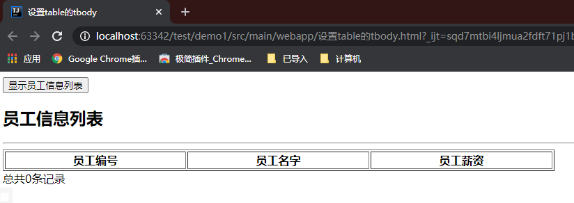

# JavaScript基础-DOM

## 一、获取文本框的value

在文本框中输入什么，拿到什么


```html
<body>
    <script type="text/javascript">
        window.onload = function (){
            /*
            document.getElementById("btn").onclick = function (){
                // 1. 先获取文本框元素
                var usernameObj = document.getElementById("username");
                var username = usernameObj.value;
                alert(username);
            }
            */
            document.getElementById("btn").onclick = function (){
                alert(document.getElementById("username").value)
            }
        }
    </script>
    <input type="text" id="username">
    <input type="button" value="获取文本框的value" id="btn">
</body>
```


### 1.1JS中的this

```html
<input type="text" onblur="alert(this.value)">
```

在这个文本框中，输入什么，就会弹出什么对话框。

**this代表的是当前input节点对象。this.value就是这个节点对象的value属性。**


## 二、innerHTML和innerText操作div和span

使用innerHTML和innerText来向div中添加内容

```html
<!DOCTYPE html>
<html lang="en">
<head>
    <meta charset="UTF-8">
    <title>innerHTML和innerText操作div和span</title>
    <style type="text/css">
        #div1{
            width: 300px;
            height: 300px;
            border: 1px black solid;
            position: absolute;
            top: 100px;
            left: 100px;
            background-color: red;
        }
    </style>
</head>
<body>
    <input type="button" value="设置div中的内容" id="btn">
    <div id="div1"></div>
</body>
</html>
```


### 2.1使用innerHTMl的效果

```html
<!DOCTYPE html>
<html lang="en">
<head>
    <meta charset="UTF-8">
    <title>innerHTML和innerText操作div和span</title>
    <style type="text/css">
        #div1{
            width: 300px;
            height: 300px;
            border: 1px black solid;
            position: absolute;
            top: 100px;
            left: 100px;
            background-color: red;
        }
    </style>
</head>
<body>
    <script type="text/javascript">
        window.onload = function (){
            document.getElementById("btn").onclick = function (){
                var divObj = document.getElementById("div1");
                divObj.innerHTML = "<font color='aqua'>用户名不能为空</font>"; // 通过innerHTML来添加内容，如果添加的是html代码会自动解释并执行
            }
        }
    </script>
    <input type="button" value="设置div中的内容" id="btn">
    <div id="div1"></div>
</body>
</html>
```


### 2.2使用innerText的效果

```html
<!DOCTYPE html>
<html lang="en">
<head>
    <meta charset="UTF-8">
    <title>innerHTML和innerText操作div和span</title>
    <style type="text/css">
        #div1{
            width: 300px;
            height: 300px;
            border: 1px black solid;
            position: absolute;
            top: 100px;
            left: 100px;
            background-color: red;
        }
    </style>
</head>
<body>
    <script type="text/javascript">
        window.onload = function (){
            document.getElementById("btn").onclick = function (){
                var divObj = document.getElementById("div1");
                divObj.innerText = "<font color='aqua'>用户名不能为空</font>"; // 通过innerHTML来添加文本内容
            }
        }
    </script>
    <input type="button" value="设置div中的内容" id="btn">
    <div id="div1"></div>
</body>
</html>
```


### 2.3两者的区别

1. 相同点：
   - 都是设置元素内部的内容
2. 不同点：
   - innerHTML会把后边的字符串当作一段HTML代码解释并执行
   - innerTEXT即使后边是一段HTML代码，也只是当作普通字符串


## 三、正则表达式

### 3.1正则表达式是什么？有什么用？

> 1. 正则表达式（Regular Expression），用在字符串格式匹配方面。
> 2. 正则表达式实际上是一门独立的学科，大部分编程语言都支持正则表达式。
> 3. 对于使用JavaScript编程，正则表达式需要掌握哪些内容？
>    - 常见的正则表达式符号要认识。
>    - 简单的正则表达式要会写。
>    - 他人编写的正则表达式要能看懂。
>    - 在JavaScript中怎么创建正则表达式对象。
>    - 在JavaScript中，正则表达式对象有哪些方法。
>    - 要能快速的在网络上找到自己需要的正则表达式，并且测试其有效性。
> 4. 常见的正则表达式？
>    - 查看帮助文档

### 3.2常用的正则表达式符号

1. 常用的元字符

| 代码 | 说明                         |
| ---- | ---------------------------- |
| .    | 匹配除换行符以外的任意字符   |
| \w   | 匹配字母或数字或下划线或汉字 |
| \s   | 匹配任意的空白符             |
| \d   | 匹配数字                     |
| \b   | 匹配单词的开始或结束         |
| ^    | 匹配字符串的开始             |
| $    | 匹配字符串的结束             |

2. 常用的限定符

| 代码/语法 | 说明             |
| --------- | ---------------- |
| *         | 重复零次或更多次 |
| +         | 重复一次或更多次 |
| ?         | 重复零次或一次   |
| {n}       | 重复n次          |
| {n,}      | 重复n次或更多次  |
| {n,m}     | 重复n到m次       |

3. 常见的反义符号

| 代码/语法 | 说明                                       |
| --------- | ------------------------------------------ |
| \W        | 匹配任意不是字母，数字，下划线，汉字的字符 |
| \S        | 匹配任意**不是**空白符的字符               |
| \D        | 匹配任意**非**数字的字符                   |
| \B        | 匹配**不是**单词开头或结束的位置           |
| [^x]      | 匹配除了x以外的任意字符                    |
| [^aeiou]  | 匹配除了aeiou这几个字母以外的任意字符      |

### 3.3简单的正则表达式要会写

例：QQ号的正则表达式

```
^[1-9][0-9]{4,}$
[1-9]表示1-9的任意一个字符，一次
[A-Za-z0-9]表示A-Za-z0-9的任意一个字符，一次
[A-Za-z0-9-]表示A-Z，a-z，0-9，-中的任意一个字符，一次
```

### 3.4怎么创建正则表达式对象，怎么调用正则表达式对象的方法？

1. 第一种：

   ```javascript
   var regExp = /正则表达式/flags;
   ```

2. 第二种：

   ```javascript
   // 使用内置支持类RegExp
   var regExp = new RegExp("正则表达式", "flags");
   ```

3. 关于flags：

   ```
   // 可取值
   g：全局匹配
   i：忽略大小写
   m：多行搜索（如果前边是正则表达式的话，不能写m。只有前面是普通字符串的时候才可以使用。）
   // 可以是单个，也可以多个组合，主要使用g和i
   ```

   

### 3.5正则表达式的test()方法

使用方法：

```javascript
正则表达式对象.test(用户填写的字符串); // true or false
// true：字符串格式匹配成功
// false：字符串格式匹配失败
```

### 3.6实例

实现邮箱验证

```html
<!DOCTYPE html>
<html lang="en">
<head>
    <meta charset="UTF-8">
    <title>正则表达式</title>
</head>
<body>
    <script type="text/javascript">
        window.onload = function (){
            document.getElementById("btn").onclick = function (){
                var regExp = new RegExp("^\\w+([-+.]\\w+)*@\\w+([-.]\\w+)*\\.\\w+([-.]\\w+)*$");
                if(!regExp.test(document.getElementById("email").value)){
                    document.getElementById("emailError").innerText = "邮箱地址不合法！";
                }
            }
        }
    </script>
    
    <input type="text" id="email">
    <span id="emailError" style="color: red; font-size: 12px;"></span>
    <input type="button" value="验证邮箱" id="btn">
</body>
</html>
```

## 四、表单验证实例

需求：

> 1. 用户名不能为空
> 2. 用户名必须在6-14位之间
> 3. 用户名只能有数字和字母组成，不能含有其它符号（正则表达式）
> 4. 密码和确认密码一致，邮箱地址合法
> 5. 统一失去焦点验证
> 6. 错误提示信息统一在span标签中提示，并且要求字体12号，红色
> 7. 文本框再次获得焦点后，清空错误提示信息，如果文本框中数据不合法要求清空文本框的 value
> 8. 最终表单中所有项均合法方可提交

```html
<!DOCTYPE html>
<html lang="en">
<head>
    <meta charset="UTF-8">
    <title>表单验证</title>
</head>
<body>
    <script type="text/javascript">
        window.onload = function (){

            // 用户名获得焦点
            document.getElementById("username").onfocus = function (){
                if (document.getElementById("usernameError").innerText != ""){
                    document.getElementById("username").value = "";
                }
                document.getElementById("usernameError").innerText = "";
            }

            // 用户名失去焦点
            document.getElementById("username").onblur = function (){
                var username = document.getElementById("username").value;
                username = username.trim();

                // 用户名不能为空
                if (username === ""){
                    document.getElementById("usernameError").innerText = "用户名不能为空！";
                }else{
                    // 用户名必须在6-14位之间
                    if (username.length < 6 || username.length > 14){
                        document.getElementById("usernameError").innerText = "用户名必须在6-14位之间！";
                    }else{
                        // 用户名只能有数字和字母组成
                        var usernameReg3 = new RegExp("^[A-Za-z0-9]+$");
                        if (!usernameReg3.test(username)){
                            document.getElementById("usernameError").innerText = "用户名只能有数字和字母组成！";
                        }
                    }
                }
            }

            // 确认密码获得焦点
            document.getElementById("repeatPwd").onfocus = function (){
                if (document.getElementById("repeatPwdError").innerText != ""){
                    document.getElementById("repeatPwd").value = "";
                }
                document.getElementById("repeatPwdError").innerText = "";
            }

            // 确认密码失去焦点
            document.getElementById("repeatPwd").onblur = function (){
                var password = document.getElementById("password").value;
                var repeatPwd = document.getElementById("repeatPwd").value;
                if (password != repeatPwd){
                    document.getElementById("repeatPwdError").innerText = "两次密码输入不一致！";
                }
            }

            // 邮箱获得焦点
            document.getElementById("email").onfocus = function (){
                if (document.getElementById("emailError").innerText != ""){
                    document.getElementById("email").value = "";
                }
                document.getElementById("emailError").innerText = "";
            }

            // 邮箱失去焦点
            document.getElementById("email").onblur = function (){
                var emailReg = new RegExp("^\\w+([-+.]\\w+)*@\\w+([-.]\\w+)*\\.\\w+([-.]\\w+)*$");
                var email = document.getElementById("email").value;
                if (!emailReg.test(email)){
                    document.getElementById("emailError").innerText = "邮箱地址输入有误！";
                }
            }

            // 提交单击
            document.getElementById("submitBtn").onclick = function (){
                // 触发username, repeatPwd, email的blur
                document.getElementById("username").focus();
                document.getElementById("username").blur();
                document.getElementById("repeatPwd").focus();
                document.getElementById("repeatPwd").blur();
                document.getElementById("email").focus();
                document.getElementById("email").blur();
                if (document.getElementById("usernameError").innerText == "" && document.getElementById("repeatPwdError").innerText == "" && document.getElementById("emailError").innerText == ""){
                    // 提交表单
                    document.getElementById("userForm").submit();
                }
            }
        }
    </script>
    <form action="http://localhost:8080/jd/save" method="get" id="userForm">
        <table>
            <tr>
                <td>
                    用户名：
                </td>
                <td>
                    <input type="text" id="username" name="username"/>
                    <span id="usernameError" style="color: red; font-size: 12px"></span>
                </td>
            </tr>
            <tr>
                <td>
                    密　码：
                </td>
                <td>
                    <input type="password" id="password" name="password"/>
                    <span id="passwordError" style="color: red; font-size: 12px"></span><br>
                </td>
            </tr>
            <tr>
                <td>
                    重复密码：
                </td>
                <td>
                    <input type="password" id="repeatPwd" />
                    <span id="repeatPwdError" style="color: red; font-size: 12px"></span><br>
                </td>
            </tr>
            <tr>
                <td>
                    邮　箱：
                </td>
                <td>
                    <input type="text" id="email" name="email"/>
                    <span id="emailError" style="color: red; font-size: 12px"></span><br>
                </td>
            </tr>
            <tr>
                <td>
                    <input type="button" value="注册" id="submitBtn" />
                    <input type="reset" value="重置"/>
                </td>
            </tr>
        </table>
    </form>
</body>
</html>
```


## 五、复选框的全选和取消全选

在HTML DOM中有Checkbox 对象，它有一个属性叫checked

> checked：设置或返回 checkbox 是否应被选中。

通过这个属性可以设置复选框的状态。

```html
<!DOCTYPE html>
<html lang="en">
<head>
    <meta charset="UTF-8">
    <title>复选框的全选和取消全选</title>
</head>
<body>
    <script type="text/javascript">
        window.onload = function (){
            var chkEle = document.getElementById("firstChk");
            chkEle.onclick = function (){
                // 获取第一个复选框的选中状态
                // alert(chkEle.checked);
                // 根据name获取元素
                var hobbys = document.getElementsByName("hobby");
                if (chkEle.checked){
                    // 全选
                    for(var i in hobbys){
                        hobbys[i].checked = true;
                    }
                }else{
                    // 取消全选
                    for(var i in hobbys){
                        hobbys[i].checked = false;
                    }
                }
            }
        }
    </script>
    <input type="checkbox" value="全选" id="firstChk">全选<br>
    <input type="checkbox" name="hobby" value="smoke">抽烟<br>
    <input type="checkbox" name="hobby" value="drunk">喝酒<br>
    <input type="checkbox" name="hobby" value="firehair">烫头<br>
</body>
</html>
```


### 5.1优化上述代码

```html
<!DOCTYPE html>
<html lang="en">
<head>
    <meta charset="UTF-8">
    <title>复选框的全选和取消全选</title>
</head>
<body>
    <script type="text/javascript">
        window.onload = function (){
            var chkEle = document.getElementById("firstChk");
            var hobbys = document.getElementsByName("hobby");
            chkEle.onclick = function (){
                for(var i in hobbys){
                    // 此处优化
                    hobbys[i].checked = chkEle.checked;
                }
            }
        }
    </script>
    <input type="checkbox" value="全选" id="firstChk">全选<br>
    <input type="checkbox" name="hobby" value="smoke">抽烟<br>
    <input type="checkbox" name="hobby" value="drunk">喝酒<br>
    <input type="checkbox" name="hobby" value="firehair">烫头<br>
</body>
</html>
```

如何实现选中下边三个复选框的时候上面全选自动勾选，没选中三个时自动取消全部勾选？

```html
<!DOCTYPE html>
<html lang="en">
<head>
    <meta charset="UTF-8">
    <title>复选框的全选和取消全选</title>
</head>
<body>
    <script type="text/javascript">
        window.onload = function (){
            var chkEle = document.getElementById("firstChk");
            var hobbys = document.getElementsByName("hobby");
            chkEle.onclick = function (){
                for(var i in hobbys){
                    hobbys[i].checked = chkEle.checked;
                }
            }

            var all = hobbys.length;
            for(var i in hobbys){
                // 通过循环为复选框绑定单击事件
                hobbys[i].onclick = function (){
                    var count = 0;
                    // 每次发生单击事件后，使用循环判断选中的复选框个数
                    for (var i in hobbys){
                        if (hobbys[i].checked){
                            count++;
                        }
                    }
                    
                    /*  优化此段代码
                    // 如果选中的个数和总数一样，将全选框选中
                    if (count == all){
                        chkEle.checked = true;
                    }else{
                        // 否则取消选中全选框
                        chkEle.checked = false;
                    }
                    */
                    chkEle.checked = (count == all);
                }
            }
        }
    </script>
    <input type="checkbox" value="全选" id="firstChk">全选<br>
    <input type="checkbox" name="hobby" value="smoke">抽烟<br>
    <input type="checkbox" name="hobby" value="drunk">喝酒<br>
    <input type="checkbox" name="hobby" value="firehair">烫头<br>
</body>
</html>
```

## 六、获取下拉列表选中项的value

通过onchange事件来实现

```html
<!DOCTYPE html>
<html lang="en">
<head>
    <meta charset="UTF-8">
    <title>获取下拉列表选中项的value</title>
</head>
<body>
    <script type="text/javascript">
        window.onload = function (){
            var provinceListElt = document.getElementById("provinceList");
            provinceListElt.onchange = function (){
                // 获取选中项的value
                alert(provinceListElt.value);
            }
        }
    </script>
    <select id="provinceList">
        <option>---请选择省份---</option>
        <option value="001">河北省</option>
        <option value="002">辽宁省</option>
        <option value="003">吉林省</option>
        <option value="004">山东省</option>
        <option value="005">黑龙江省</option>
    </select>
</body>
</html>
```


## 七、周期函数setInterval

### 7.1JS中的内置日期类

JS中内置的支持类：Date，可以用来获取日期/时间

获取日期的三种方式

```html
<!DOCTYPE html>
<html lang="en">
<head>
    <meta charset="UTF-8">
    <title>周期函数setInterval</title>
</head>
<body>
    <script type="text/javascript">
        // 获取系统当前时间
        var now = new Date();
        // 输出
        document.write(now); // Mon Jan 04 2021 20:41:43 GMT+0800 (中国标准时间)
        document.write("<br/><br/><br/>");

        // 转换成具有本地语言环境的日期格式
        now = now.toLocaleString();
        document.write(now); // 2021/1/4 下午8:41:43
        document.write("<br/><br/><br/>");

        // 当以上格式都不是自己想要的，可以通过日期获取年月日等信息，自定义格式
        var t = new Date();
        var year = t.getFullYear(); // 全日期格式,返回2021
        var month = t.getMonth(); // 月份是0-11
        // var dayOfWeek = t.getDay(); // 一周中的第几天0-6
        var day = t.getDate(); // 获取日信息
        document.write(year + "年" + (month+1) + "月" + day + "日");
        document.write("<br/><br/><br/>");
    </script>
</body>
</html>
```

### 7.2如何获取毫秒数(重点)

会使用毫秒数做时间戳（timestamp）

```html
// 如何获取日期中的毫秒数，从1970年1月1日 00：00：00 000 到系统当前时间的总毫秒数
var times = t.getTime();
document.write(times);
// 获取当前日期的毫秒数
document.write(new Date().getTime());
```

### 7.3如何在HTML中动态的显示时钟

使用setInterval() 方法

**setInterval() ：可按照指定的周期（以毫秒计）来调用函数或计算表达式。**

语法格式：

```javascript
setInterval(code,millisec[,"lang"])
// code:函数
// millisec:毫秒数
// 该函数有返回值
// 一个可以传递给 Window.clearInterval() 从而取消对 code 的周期性执行的值。
```

```html
<!DOCTYPE html>
<html lang="en">
<head>
    <meta charset="UTF-8">
    <title>周期函数setInterval</title>
</head>
<body>
    <script type="text/javascript">
        function displayTime(){
            var time = new Date();
            var strTime = time.toLocaleString();
            document.getElementById("timeDiv").innerText = strTime;
        }

        // 触发单击事件后，运行此函数
        function start(){
            // 每隔一秒调用一次displayTime()函数
            window.setInterval("displayTime()", 1000);
        }

    </script>
    <input type="button" value="显示系统时间" onclick="start();"/>
    <div id="timeDiv"></div>
</body>
</html>
```

**使用clearInterval()方法停止循环**

```html
<!DOCTYPE html>
<html lang="en">
<head>
    <meta charset="UTF-8">
    <title>周期函数setInterval</title>
</head>
<body>
    <script type="text/javascript">
        function displayTime(){
            var time = new Date();
            var strTime = time.toLocaleString();
            document.getElementById("timeDiv").innerText = strTime;
        }

        function start(){
            // 每隔一秒调用一次displayTime()函数
            // v全局变量
            v = window.setInterval("displayTime()", 1000);
        }

        function stop(){
            window.clearInterval(v);
        }

    </script>
    <input type="button" value="显示系统时间" onclick="start();"/>
    <input type="button" value="砸瓦鲁多！" onclick="stop();">
    <div id="timeDiv"></div>
</body>
</html>
```


## 八、JS内置支持类Array类(了解)

### 8.1创建数组的几种方式

```html
<!DOCTYPE html>
<html lang="en">
<head>
    <meta charset="UTF-8">
    <title>Array类</title>
</head>
<body>
    <script type="text/javascript">
       // 创建长度为0的数组
       var arr1 = [];
       alert(arr1.length); // 0

       var arr2 = [1, 2, false, "abc", 3.14];
       alert(arr2.length); // 5

       // 下标会越界吗
       arr2[8] = "test";
       for(var i in arr2){
           document.write(arr2[i] + "<br/>"); // 1 2 false abc 3.14 test
       }
       // 下标不会越界，自动扩容

       // 创建数组的其他方法
       var a1 = new Array();
       alert(a1.length); // 0

       var a2 = new Array(3);
       alert(a2.length); // 3，表示长度

       var a3 = new Array(3, 2);
       alert(a3.length); // 2， 表示括号里元素的个数
    </script>
</body>
</html>
```


### 8.2数组类的几种方法

```html
<!DOCTYPE html>
<html lang="en">
<head>
    <meta charset="UTF-8">
    <title>Array类</title>
</head>
<body>
    <script type="text/javascript">
       var a = [1, 2, 3, 4];
       var str = a.join("-"); // join方法可以将数组中的数据取出，并用特定字符串连接成新字符串
       alert(str); // 1-2-3-4

       // 表示在数组的末尾添加一个元素，数组长度+1
       a.push(10);
       alert(a.join("-")); // 1-2-3-4-10

       // 将数组末尾的元素弹出，数组长度-1
       var endElt = a.pop();
       alert(endElt); // 10
       alert(a.join("-")); // 1-2-3-4

       // JS中的数组可以自动模拟栈数据结构

       a.reverse();
       alert(a.join("-")); // 4-3-2-1
    </script>
</body>
</html>
```


## 九、设置table的tbody

如何动态的显示前台表格中的内容

```html
<!DOCTYPE html>
<html lang="en">
<head>
    <meta charset="UTF-8">
    <title>设置table的tbody</title>
</head>
<body>
    <script type="text/javascript">
        // 有这些JSON数据
        var data = {
            "total" : 4,
            "emps" : [
                {"empno" : 7369, "ename" : "SMITH1", "sal" : 800.0},
                {"empno" : 7362, "ename" : "SMITH2", "sal" : 450.0},
                {"empno" : 7339, "ename" : "SMITH3", "sal" : 5400.0},
                {"empno" : 7359, "ename" : "SMITH4", "sal" : 8650.0},
            ],
        };

        // 希望把数据展示到table中

        window.onload = function (){
            var displayBtnElt = document.getElementById("displayBtn");
            displayBtnElt.onclick = function (){
                var emps = data.emps;
                var html = "";
                for (var i = 0; i < emps.length; i++){
                    var emp = emps[i];
                    html += "<tr>";
                    html += "<td>" + emp.empno +"</td>";
                    html += "<td>"+ emp.ename + "</td>";
                    html += "<td>" + emp.sal + "</td>";
                    html += "</tr>";
                }
                document.getElementById("emptbody").innerHTML = html;
                document.getElementById("count").innerHTML = data.total;
            }
        }
    </script>
    <input type="button" value="显示员工信息列表" id="displayBtn">
    <h2>员工信息列表</h2>
    <hr>
    <table border="1px black soild" width="50%">
        <tr>
            <th>员工编号</th>
            <th>员工名字</th>
            <th>员工薪资</th>
        </tr>
        <tbody id="emptbody">
        <!--
            <tr>
                <td>7369</td>
                <td>SMITH</td>
                <td>800.0</td>
            </tr>
            <tr>
                <td>7369</td>
                <td>SMITH</td>
                <td>800.0</td>
            </tr>
            <tr>
                <td>7369</td>
                <td>SMITH</td>
                <td>800.0</td>
            </tr>
        -->
        </tbody>
    </table>
    总共<span id="count">0</span>条记录
</body>
</html>
```



