# JavaScript基础-ECMAScript

## 一、什么是JavaScript，JavaScript有什么用

### 1.1什么是JavaScript

JavaScript是运行在浏览器上的脚本语言，简称**JS**。

JavaScript是一门事件驱动型的编程语言，依靠事件去驱动，然后执行对应的程序。


#### 1.2JavaScript有什么用

JavaScript使浏览器更加的生动，不再是单纯的静态页面了，页面更有交互性。

JavaScript和Java没有任何的关系，JavaScript运行在浏览器的内存当中并且不需要编译，Java运行在JVM当中并且需要编译。

**JavaScript的“目标程序”以普通文本形式保存，这种语言都叫做“脚本语言”。**


### 1.3JavaScript包括三大块

1. ECMAScript：

   JavaScript的核心语法：变量、数据类型、控制语句、运算符等等。

1. DOM：

   文档对象模型（document object model）：操作网页中元素节点的增删改

   var domObj = document.getElementById("id");

2. BOM：

   浏览器对象模型（browser object model）：对网页的前进后退打开关闭以及url地址。


### 1.4DOM和BOM的区别和联系

1. BOM的顶级对象是：window
2. DOM的顶级对象是：document
3. **实际上BOM是包括DOM的。**

## 二、在HTML中怎么嵌入JavaScript代码

在JS中有很多事件，其中有一个事件叫做：鼠标单击，单词：click

并且任何事件都会对应一个事件句柄叫做：onclick

**注意：事件和事件句柄的区别是事件句柄是在时间单词前添加一个"on"，而事件句柄是以html标签的属性存在的。**

```html
<!-- 通过onclick事件句柄绑定标签，js代码会当click事件发生的时候执行 -->
<!-- 页面打开的时候，js代码不会执行，只是把这段js代码注册到按钮的click事件上了 -->
<!-- 等这个按钮发生click事件之后，注册在onclick后面的js代码会被浏览器自动调用 -->
<body>
    <input type="button" value="hello" onclick="js代码">
</body>
```

- 怎么使用js弹出消息框

  > 在js中有一个内置的对象叫window，全部小写，可以直接拿来用，window代表的是浏览器对象。
  >
  > 在window对象有一个函数叫：alert
  >
  > 用法是：**window.alert("消息");**这样就可以弹窗了。

1. 第一种方式（标签属性中加事件句柄（代码））：

   ```html
   <!DOCTYPE html>
   <html lang="en">
   <head>
       <meta charset="UTF-8">
       <title>嵌入js的第一种模式</title>
   </head>
   <body>
       <input type="button" value="hello" onclick='window.alert("hello world")'>
   
       <input type="button" value="hello" onclick="window.alert('hello world')">
   
       <input type="button" value="hello" onclick="window.alert('hello zhangsan')
                                                   window.alert('hello lisi')
                                                   window.alert('hello wangwu')">
   
       <input type="button" value="hello" onclick="alert('hello world')">
   </body>
   </html>
   ```

   > 1. JS中的字符串可以使用单引号也可以使用双引号。
   > 2. JS中的一条语句结束后可以使用分号";"，也可以不用。
   > 3. **window.**可以省略。

   

2. 第二种方式（脚本块）：

   ```html
   <script type="text/javascript">
       window.alert("first....");
   </script>
   
   <!DOCTYPE html>
   <html lang="en">
   <head>
       <meta charset="UTF-8">
       <title>嵌入js的第二种方式</title>
   
       <script type="text/javascript">
           window.alert("head....");
       </script>
   
   </head>
   <body>
       <!-- 脚本框：JS代码 -->
       <script type="text/javascript">
           /*
               暴露在脚本块当中的程序，在页面打开的时候执行，并且自上而下依次逐行执行
               并且不需要事件
            */
           window.alert("body");
       </script>
   
       <input type="button" value="world">
   </body>
   </html>
   <script type="text/javascript">
       window.alert("end....");
   </script>
   ```

   > 1. JavaScript的脚本块可以出现多次。
   > 2. 脚本块可以放在html中的任意位置。
   > 3. 暴露在脚本块之中的语言，在打开页面的时候自动执行，并且自上而下依次逐行执行。
   > 4. **注意：alert函数会阻塞整个HTML页面的加载**

3. 第三种方式（引入外部独立的js文件）：

   ```html
   <!DOCTYPE html>
   <html lang="en">
   <head>
       <meta charset="UTF-8">
       <title>嵌入js的第三种方式</title>
   </head>
   <body>
       <!-- 在需要的位置引入js脚本文件 -->
       <script type="text/javascript" src="js/1.js"></script>
       
       <!-- 这样写，里边的代码不会执行！ -->
       <script type="text/javascript" src="js/1.js">
       	window.alert("test");
       </script>
   </body>
   </html>
   ```

   ```javascript
   window.alert("hello js!");
   ```

   > 1. 引入外部独立的js文件的时候，js文件中的代码会遵循自上而下的顺序依次逐行执行。
   >
   > 2. 同一个js文件可以被引入多次。
   >
   > 3. **注意：引入js文件时，使用src。**
   >
   > 4. **注意：不能这样写：**
   >
   >    ```html
   >    <script type="text/javascript" src="js/1.js" />
   >    ```
   >
   > 5. ```html
   >    <!-- 这样写，里边的代码不会执行！ -->
   >    <script type="text/javascript" src="js/1.js">
   >        window.alert("test");
   >    </script>
   >    <!-- 但是可以这样写 -->
   >    <script type="text/javascript" src="js/1.js"></script>
   >    <script type="text/javascript">
   >        window.alert("test");
   >    </script>
   >    ```


## 三、标识符和关键字

### 3.1标识符（按Java的来）

1. 标识符命名规则：

   > 由数字，字母，下划线，美元符号组成，不能以数字开头，严格区分大小写，理论上没有长度限制，不能以关键字作为标识符。

2. 标识符命名规范：

   > 驼峰命名法，见名知意。


## 四、变量

### 4.1怎么声明变量

> var 变量名;


### 4.2怎么给变量赋值

> 变量名 = 值;
> **JavaScript是一种弱类型语言，没有编译阶段，一个变量可以随意赋值，赋什么类型的值都行**
>
> ```javascript
>  var i = 100;
>  i = false;
>  i = "abc";
>  i = new Object();
>  i = 3.14;
> ```
>
> **重点：JavaScript是一种弱类型编程语言。**
>
> **重点：JavaScript是一种弱类型编程语言。**

```html
<!DOCTYPE html>
<html lang="en">
<head>
    <meta charset="UTF-8">
    <title>关于js中的变量</title>
</head>
<body>
    <script type="text/javascript">
        var i;
        alert("i = " + i);
    </script>
</body>
</html>
```


**注意！undefined在JS中是一个具体的值！**

> 在JS中，当一个变量没有手动赋值的时候，系统默认赋值undefined。


- 如果alert中添加未初始化的变量会怎么样？

  ```html
  <!DOCTYPE html>
  <html lang="en">
  <head>
      <meta charset="UTF-8">
      <title>关于js中的变量</title>
  </head>
  <body>
      <script type="text/javascript">
          alert(i);
      </script>
  </body>
  </html>
  ```

  在网页中看不出来错误，按F12**（在浏览器中，常用F12中的查看器、控制台、网络）**

  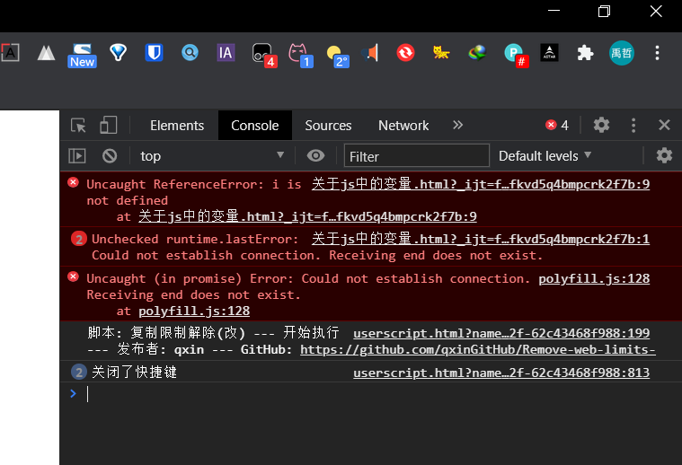

  可以看出，变量i未定义。**（以后通过F12和控制台来查看html代码的错误）**

### 4.3JS的局部变量和全局变量

1. 生命周期不同

   > - 全局变量：
   >
   >   在函数体之外声明的变量，生命周期是**浏览器打开时声明，浏览器关闭时销毁。**
   >
   >   尽量少用，占浏览器内存，全局变量会一直在浏览器的内存中，耗费内存空间。
   >
   > - 局部变量：
   >
   >   在函数体当中声明的变量，包括一个函数的形参都属于局部变量。
   >
   >   **生命周期是函数开始执行时局部变量的内存空间开辟，函数执行结束时局部变量的内存空间释放。**
   >
   > - ```html
   >   <!DOCTYPE html>
   >   <html lang="en">
   >   <head>
   >       <meta charset="UTF-8">
   >       <title>局部变量和全局变量</title>
   >   </head>
   >   <body>
   >       <script type="text/javascript">
   >           // 全局变量
   >           var username = "jack";
   >           function accessUsername(){
   >               // 局部变量
   >               var username = "tom";
   >               // 就近原则，访问局部变量
   >               alert("username = " + username);
   >           }
   >   		// 调用函数
   >           accessUsername(); // tom
   >           alert("username = " + username); // jack
   >       </script>
   >   </body>
   >   </html>
   >   ```
   >
   >   **变量的访问采用就近原则。**
   >
   > - **以下语法是很奇怪的**
   >
   >   ```html
   >   <!DOCTYPE html>
   >   <html lang="en">
   >   <head>
   >       <meta charset="UTF-8">
   >       <title>局部变量和全局变量</title>
   >   </head>
   >   <body>
   >       <script type="text/javascript">
   >           function myfun() {
   >               myname = "jack";
   >           }
   >           myfun();
   >           alert("myname = " + myname);
   >       </script>
   >   </body>
   >   </html>
   >   ```
   >
   >   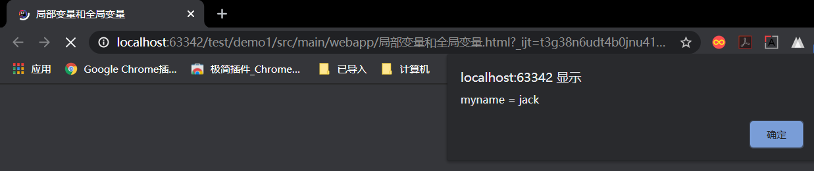
   >
   >   **注意：如果一个变量声明时，没有使用var关键字，那么不管这个变量在哪声明，都是全局变量！**


## 五、函数

JS中的函数，相当于Java中的方法，也是一段可以被重复利用的代码片段。

函数一般都是可以完成某个特定功能的。

### 5.1函数的定义

语法格式：

```html
<!-- 第一种方式 -->
function 函数名 (形式参数列表){
	函数体;
}
<!-- 第二种方式 -->
函数名 = function(形式参数列表){
	函数体;
}
```

**JS中的函数不需要指定返回值类型，返回什么类型都行。**

### 5.2函数的调用

函数必须调用才会执行

```html
<!DOCTYPE html>
<html lang="en">
<head>
    <meta charset="UTF-8">
    <title>函数初步</title>
</head>
<body>
    <script type="text/javascript">
        function sum(a, b) {
            alert(a + b);
        }

        sayHello = function(username){
            alert(username);
        }
        sum(10, 20)
        sayHello("jack");
    </script>
</body>
</html>
```

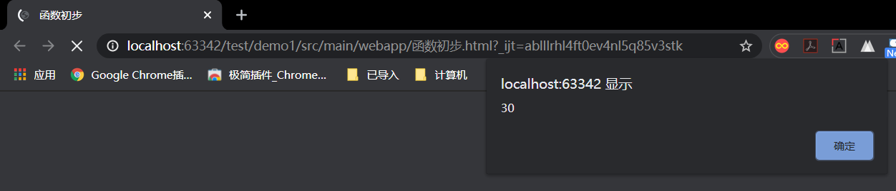

```html
<!-- 可以将函数放到事件中 -->
<!DOCTYPE html>
<html lang="en">
<head>
    <meta charset="UTF-8">
    <title>函数初步</title>
</head>
<body>
    <script type="text/javascript">
        sayHello = function(username){
            alert(username);
        }
    </script>
    <input type="button" value="hello" onclick="sayHello('jack')">
</body>
</html>
```

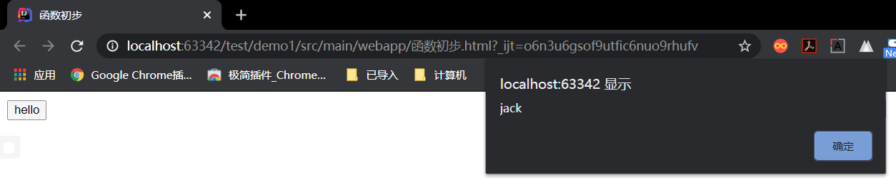

### 5.3JS函数的重载

如果实参传的值不一样会怎么样？

```html
<!DOCTYPE html>
<html lang="en">
<head>
    <meta charset="UTF-8">
    <title>函数初步</title>
</head>
<body>
    <script type="text/javascript">
        function sum(a, b){
            return a + b;
        }
        
        var var1 = sum(1, 2);
        alert(var1); // 3
        var var2 = sum("jack");
        alert(var2);// jackundefined
        var var3 = sum();
        alert(var3);// NaN(NaN是一个具体的值，该值表示不是具体的数字。Not a Number)
        var var4 = sum(1, 2, 3);
        alert(var4);// 3，将1和2传到形参，3没用
    </script>
</body>
</html>
```

**可以传不同类型的实参，如果传字符串，会变成字符串拼接。**

**函数调用时，参数的类型可以随意，参数的个数可以随意。**

### 5.4两个同名函数出现时

```html
<!DOCTYPE html>
<html lang="en">
<head>
    <meta charset="UTF-8">
    <title>函数初步</title>
</head>
<body>
    <script type="text/javascript">
        function test(username){
            alert("test1");
        }

        function test(){
            alert("test1 test1");
        }

        test("jack");
    </script>
</body>
</html>
```

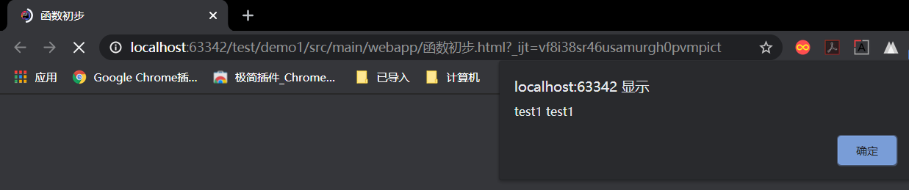

**在JS当中，函数的名字不能重名，当两个函数同名时，后出现的函数会覆盖先出现的函数。**


## 六、JS的数据类型

虽然JS在变量声明的时候不需要指定数据类型，但是在赋值时，每一个数据还是有类型的。

JS中数据类型有**原始类型**和**引用类型**。

> ES规范（ECMAScript规范）
>
> 在ES6版本之前的数据类型有6种：
>
> - Undefined
> - Number
> - String
> - Null
> - Boolean
> - Object
>
> 在ES6版本及之后包括的数据类型有7种：
>
> - 除了以上六种以外
> - Symbol（有印象）


### 6.1Typeof运算符

JS中有一个运算符叫typeof，这个运算符可以在程序的运行阶段动态的获取变量的数据类型。

语法格式：

```javascript
typeof 变量名;
```

**运算结果是以下六个字符串之一，注意字符串全部小写。**

- "undefined"
- "number"
- "string"
- "boolean"
- "object"
- "function"

```html
<!DOCTYPE html>
<html lang="en">
<head>
    <meta charset="UTF-8">
    <title>JS的数据类型</title>
</head>
<body>
    <script type="text/javascript">
        var a;
        alert(typeof a);// "undefined"

        var b = 10;
        alert(typeof b);// "number"

        var c = "abc";
        alert(typeof c);// "string"

        var d = null;
        alert(typeof d);// "object" 注意：null属于Null类型，但是typeof运算符的结果是"object"

        var e = false;
        alert(typeof e);// "boolean"
        
        var obj = new Object();
        alert(typeof obj);// "object"
        
        function sayHello(){
            
        }
        alert(typeof sayHello);// "function"
    </script>
</body>
</html>
```


#### 6.1.1使用typeof控制函数变量类型

**在JS中比较字符串使用"=="比较，没有equals。**

```html
<!DOCTYPE html>
<html lang="en">
<head>
    <meta charset="UTF-8">
    <title>JS的数据类型</title>
</head>
<body>
    <script type="text/javascript">
        function sum(a, b) {
            if (typeof a == "number" && typeof b == "number"){
                return a + b;
            }
        }
        var var1 = sum(1, 2);
        alert(var1);
        var var2 = sum("hello", "world");
        alert(var2);
    </script>
</body>
</html>
```

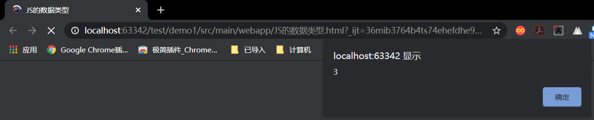

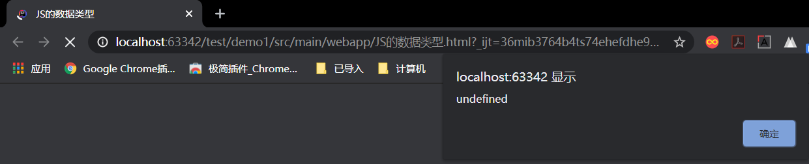

### 6.2原始类型

原始类型包括：Undefined，Number，String，Boolean，Null


#### 6.2.1Undefined类型

Undefined类型只有一个值，这个值就是Undefined，当一个变量没有手动赋值的时候，系统变量默认赋值Undefined。

也可以给一个变量手动赋值Undefined。

```html
// 注意区分
var i; // undefined
var k = undefined; // undefined
var y = "undefined"; // "undefined"
alert(i == k);// true
alert(i == y);// false
```


#### 6.2.2Number类型

1. Number类型包括哪些值：

   > -1、0、1、2.3、3.14、100、......NaN、Infinity
   >
   > 整数、小数、正数、负数、不是数字、无穷大都属于Number类型

```html
<!DOCTYPE html>
<html lang="en">
<head>
    <meta charset="UTF-8">
    <title>Number类型</title>
</head>
<body>
    <script type="text/javascript">
        var var1 = 1;
        var var2 = 3.14;
        var var3 = -100;
        var var4 = NaN;
        var var5 = Infinity;
        alert(typeof var1);// "number"
        alert(typeof var2);// "number"
        alert(typeof var3);// "number"
        alert(typeof var4);// "number"
        alert(typeof var5);// "number"

    </script>
</body>
</html>
```

2. 关于NaN

   表示Not a Number，不是一个数字，但是属于Number类型。

   - 什么情况下结果会是一个NaN呢？

     运算结果本来应该是一个数字，最后算完不是一个数字的时候。

     ```javascript
     var a = 100;
     var b = "hello";
// 除号的后一位应该是一个数字，但是运行过程中后一位不是数字，那么结果就是NaN。
     alert(a / b);
     
     var a = "abc";
     var b = 10;
     alert(a + b); //结果为 "abc10"
     
     // Infinity表示无穷大，当除数为0的时候，结果为无穷大
     alert(10 / 0); // Infinity
     ```
     
   
3. isNaN()函数

   > 用法：
   >
   > isNaN(数据)
   >
   > 结果为true表示不是一个数字
   >
   > 结果为false表示是一个数字
   >
   > is Not a Number
   >
   > ```javascript
   > function sum (a, b){
   > 	if(isNaN(a) || isNaN(b)){
   > 		alert("输入的必须是一个数字");
   > 		return;
   > 	}
   > 	return a + b;
   > }
   > ```

4. parseInt()函数

   > 可以将字符串自动转换成数字，取整数位
   >
   > ```javascript
   > alert(parseInt("3.99999")); // 3
   > alert(parseInt(3.99999)); // 3
   > ```

5. parseFloat()函数

   > 可以将字符串自动转换成数字，取整数位
   >
   > ```javascript
   > alert(parseInt("3.14") + 1); // 4.14
   > ```

6. Math.ceil()函数

   > Math是数学类，其中有一个函数叫ceil()，作用是向上取整。
   >
   > ```javascript
   > alert(Math.ceil("2.1")); // 3
   > ```


#### 6.2.3Boolean类型

JS中布尔类型永远都只有两个值：true和false。

```javascript
<!DOCTYPE html>
<html lang="en">
<head>
    <meta charset="UTF-8">
    <title>Boolean类型</title>
</head>
<body>
    <script type="text/javascript">
        var username = "";
        if(username){
            alert("欢迎你" + username);
        }else {
            alert("用户名不能为空");
        }
    </script>
</body>
</html>
```

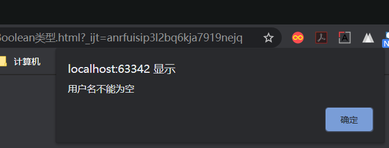

```javascript
<!DOCTYPE html>
<html lang="en">
<head>
    <meta charset="UTF-8">
    <title>Boolean类型</title>
</head>
<body>
    <script type="text/javascript">
        var username = "jack";
        if(username){
            alert("欢迎你" + username);
        }else {
            alert("用户名不能为空");
        }
    </script>
</body>
</html>
```

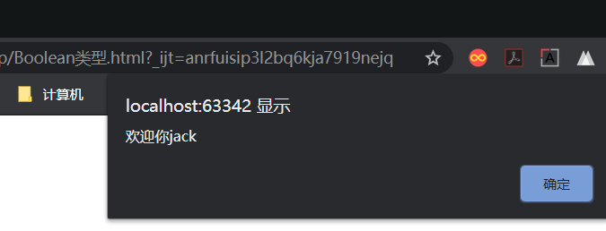

> 为什么参数不是Boolean类型，但是依然可以判断？
>
> **在Boolean类型中有一个函数叫：Boolean()**
>
> 语法格式：Boolean（数据）
>
> 作用：将非Boolean类型转换成Boolean类型
>
> **在if中会自动调用Boolean()函数**
>
> ```javascript
> // 测试
> alert(Boolean(1)); // true
> alert(Boolean(0)); // false
> alert(Boolean("")); //false
> alert(Boolean("abc")); // true
> alert(Boolean(null)); // false
> alert(Boolean(NaN)); // false
> alert(Boolean(undefined)); // false
> alert(Boolean(Infinity)); // true
> ```
>
> **规律："有"就转换成true，"没有"就转换成false**


#### 6.2.4Null类型

Null类型只有一个值——null

但是注意：

```javascript
alert(typeof null); // 结果是"object"
```


#### 6.2.5String类型

1. 在JS中，字符串可以使用''也可以使用""

2. 在JS中，如何创建字符串对象？

   > 第一种：
   >
   > ```javascript
   > var s = "abc";
   > ```
   >
   > 第二种：
   >
   > ```javascript
   > var s = new String("abc");
   > ```
   >
   > 使用JS内置的支持类String，但需要注意的是：String是一个内置的类，可以直接用，String的父类是Object。
   >
   > **注意：**
   >
   > ```javascript
   > // 这种方式称为"小String"，属于原始类型String
   > var x = "abc";
   > alert(typeof x); // "string"
   > 
   > // 这种方式称为"大String"，大String不属于String，属于Object类型
   > var y = new String("abcde");
   > alert(typeof y); // "object"
   > ```
   >
   > **但不论是"大String"还是"小String"，它们的属性和函数都是通用的。**
   >
   > ```javascript
   > // 获取字符串长度(JS中的length是String类型的属性，而不是方法)
   > alert(x.length); // 3
   > alert(y.length); // 5
   > ```

3. 关于String类型的常用属性和函数

   - 常用属性：

     length 字符串长度

   - 常用函数：

     ```javascript
     strObj.indexOf(subString[,startIndex]); // 返回 String 对象内第一次出现子字符串的字符位置，可以设置起始位置，如果包含返回>=0
     strObj.lastIndexOf(substring[,startindex]); // 返回 String 对象中子字符串最后出现的位置。可以设置起始位置
     stringObj.replace(rgExp, replaceText); // 返回根据正则表达式进行文字替换后的字符串的复制。
     stringObj.split([separator[,limit]]); // 将一个字符串分割为子字符串，然后将结果作为字符串数组返回。
     stringvar.substr(start [,length ]); // 返回一个从指定位置开始的指定长度的子字符串。
     strVariable.substring(start, end); // 返回位于 String 对象中指定位置的子字符串。 
     strVariable.toLowerCase(); // 返回一个字符串，该字符串中的字母被转换为小写字母。
     strVariable.toUpperCase(); // 返回一个字符串，该字符串中的所有字母都被转化为大写字母。
     ```

   - replace()函数

     ```javascript
     alert("name%password%text".replace("%", "&")); // name&password%text 只替换了第一个%
     alert("name%password%text".replace("%", "&").replace("%", "&")); // name&password&text 使用两次replace方法可以全部替换
     // 如果想全部替换需要使用正则表达式
     ```

   - 考点：substr()和substring()的区别

     ```javascript
     alert("abcdefxyz".substr(2, 4)); // cdef (2--起始位置，4--截取长度)
     alert("abcdefxyz".substring(2, 4)); // cd (2--起始位置，4--终止位置但不包含下标4的字符)
     ```

     

### 6.3引用类型

引用类型包括：Object以及Object的子类


#### 6.3.1Object类型

1. Object类型是所有类型的超类，自定义的任何类型，默认继承Object。
2. Object类包括哪些属性：prototype属性（比较重要），constructor属性。
3. Object类包括哪些函数：toString()，valueOf()，toLocaleString()。
4. 在JS中定义的类默认继承Object，会继承Object类中的所有的属性和函数。


#### 6.3.2在Object类中怎么定义类？怎么new对象？

1. 定义类

   > 语法格式：
   >
   > - 第一种方式：
   >
   >   ```javascript
   >   function 类名(形参){
   >   
   >   }
   >   ```
   >
   > - 第二种方式：
   >
   >   ```javascript
   >   类名 = function(形参){
   >   
   >   }
   >   ```

2. 创建对象

   > 语法格式：
   >
   > ```javascript
   > new 类名(实参); //类名就是构造方法名，两者一致
   > ```

3. 类和函数的区别

   > ```javascript
   > <script type = "text/script">
   >         function sayHello(){
   > 
   >         }
   > 
   > 	sayHello();  // 如果这样调用，那就是函数
   > 	
   > 	var obj = new sayHello(); // 这种方式，表示把sayHello当作一个类来创建对象，obj是一个引用，保存内存地址指向堆内存中的对象
   > 
   > </script>
   > ```

4. 测试

   ```javascript
   <script type="text/javascript">
       function Student(){
       	alert("Student......"); // Student......
   	}
   
       //当作函数调用
       Student();
   
       //当作类创建对象
       var stu = new Student(); // Student......
       alert(stu); // [object Object]，Object的toString方法会自动加一个[]
   </script>
   ```

#### 6.3.3JS中类的定义，同时又是一个构造函数的定义

在JS中，类的定义和构造函数的定义是放在一起完成的。

```javascript
<script type="text/javascript">

    function User(a, b, c){// a, b, c是形参，属于局部变量
        // 声明属性（this表示当前对象）
        // User类中有三个属性（sno/sname/sage）
        this.sno = a;
        this.sname = b;
        this.sage = c;
	}

    var u1 = new User(111, "张三", 30);
    alert(u1.sno); // 111
    alert(u1.sname); // "张三"
    alert(u1.sage); // 30

    // 访问类中属性，还可以使用这种形式
    var u2 = new User(222, "jack", 20);
    alert(u2["sno"]); // 222
    alert(u2["sname"]); // "jack"
    alert(u2["sage"]); // 20

    // 定义类的另一种语法
    Emp = function (ename, sal){
        this.ename = ename;
        this.sal = sal;
    }

    var v3 = new Emp("李四", 3000);
    alert(v3.ename);
    alert(v3.sal);

    var v4 = new Emp("tom", 2200);
    alert(v4["ename"]);
    alert((v4["sal"]));
</script>
```

#### 6.3.4在类中定义函数

```javascript
<script type="text/javascript">
    Product = function (pno, pname, price){
        // 属性
        this.pno = pno;
        this.pname = pname;
        this.price = price;
        // 函数
        this.getPrice = function (){
            return this.price;
        }
	}

    var v1 = new Product(111, "西瓜", 4.0);
    var v2 = v1.getPrice();
    alert(v2);// 4
</script>
```

#### 6.3.5使用prototype这个属性给类动态扩展属性以及函数

```javascript
<script type="text/javascript">
    Product = function (pno, pname, price){
        // 属性
        this.pno = pno;
        this.pname = pname;
        this.price = price;
        // 函数
        this.getPrice = function (){
            return this.price;
        }
	}

    var v1 = new Product(111, "西瓜", 4.0);
    var v2 = v1.getPrice();
    alert(v2);// 4

    // 使用prototype为类动态扩展属性以及函数
    Product.prototype.getPname = function (){
        return this.pname;
    }
    // 调用扩展的函数
    var v3 = v1.getPname();
    alert(v3); // 西瓜

    // 可以给自带类扩展函数
    String.prototype.suiyi = function (){
        alert("这是给String扩展的函数！"); // 这是给String扩展的函数！
    }
    "abc".suiyi();
</script>
```


## 七、null、NaN、undefined的区别

### 7.1JS中的比较运算符

在JS中有两个特殊的比较运算符

1. "=="：等同运算符

   只判断值是否相等。

2. "==="：全等运算符

   既判断值是否相等，又判断数据类型是否相等。


### 7.2三者的区别

```javascript
<script type="text/javascript">
    // 1. 数据类型不一样
    alert(typeof null); // "object"
    alert(typeof NaN); // "number"
    alert(typeof undefined); // "undefined"

    // 2. null和undefined可以等同
    alert(null == NaN); // false
    alert(null == undefined); // true
    alert(undefined == NaN); // false
</script>
```


## 八、JS中的常用事件

**JS中的常用事件（重点）：**

> 1. blur 失去焦点
> 2. focus 获得焦点
> 3. click 鼠标单击
> 4. dblclick 鼠标双击
> 5. keydown 键盘按下
> 6. keyup 键盘弹起
> 7. mousedown 鼠标按下
> 8. mouseover 鼠标经过
> 9. mousemove 鼠标移动
> 10. mouseout 鼠标离开
> 11. mouseup 鼠标弹起
> 12. reset 表单重置
> 13. submit 表单提交
> 14. load 页面加载完毕（整个html页面中所有的元素加载完毕后发生）
> 15. select 文本被选定
> 16. change 下拉列表选中项改变，或文本框内容改变

**任何一个事件都会对应一个事件句柄，事件句柄是在事件前添加on，"onXXX"这个事件句柄出现在标签的属性位置上。（事件句柄以属性的形式存在。）**


### 8.1注册事件的两种方式

**第一种（直接在标签中使用事件句柄）：**

```html
<!DOCTYPE html>
<html lang="en">
<head>
    <meta charset="UTF-8">
    <title>JS中的常用事件</title>
</head>
<body>
    <script type="text/javascript">
        function sayHello(){
            alert("Hello World!")
        }
    </script>
	<!-- 以下代码的含义是，将sayHello函数注册到按钮上，等待click事件发生以后，该函数被浏览器调用，称这个函数为回调函数 -->
    <input type="button" value="hello" onclick="sayHello()" />
</body>
</html>
```

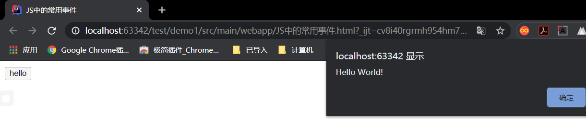

> **回调函数：**
>
> 对于当前程序来说，sayHello() 被称为回调函数（callback函数）
>
> **什么叫回调函数：**
>
> 自己把函数代码写出来后，不是自己负责调用，而是由其他程序负责调用该函数，这样的函数被称为回调函数。


**第二种（使用纯JS代码完成事件的注册）：**

- 第一步：先获取这个按钮对象
- 第二步：为这个对象的事件属性赋值
- 第三步：赋值一个回调函数
- **注意：赋值时函数不能加小括号！！！**

```html
<!DOCTYPE html>
<html lang="en">
<head>
    <meta charset="UTF-8">
    <title>JS中的常用事件</title>
</head>
<body>

    <input type="button" value="hello" id="mybtn"/>

    <script type="text/javascript">
        // 1.先获取这个按钮对象（document全部小写，内置对象，可以直接用，document就代表整个HTML页面）
        var btnObj = document.getElementById("mybtn"); // 通过id得到元素
        // 2.给按钮对象的onclick属性赋值
        btnObj.onclick = sayHello;// 注意！不能加小括号，btnObj.onclick = sayHello();这是错误的写法！！！！

        function sayHello(){
            alert("Hello World")
        }
    </script>
</body>
</html>
```

**第三种（使用匿名函数进行赋值）：**

```html
<!DOCTYPE html>
<html lang="en">
<head>
    <meta charset="UTF-8">
    <title>JS中的常用事件</title>
</head>
<body>

    <input type="button" value="hello" id="mybtn"/>

    <script type="text/javascript">
        // 1.先获取这个按钮对象（document全部小写，内置对象，可以直接用，document就代表整个HTML页面）
        var btnObj = document.getElementById("mybtn"); // 通过id得到元素
        // 2.给按钮对象的onclick属性赋值
        // 可以使用匿名函数进行赋值
        btnObj.onclick = function (){ // 这个函数没有名字，叫匿名函数，匿名函数也叫回调函数
            alert("Hello");
        };
    </script>
</body>
</html>
```

整理之后可以写成

```html
<script type="text/javascript">
    document.getElementById("mybtn").onclick = function (){
        alert("Hello");
    };
</script>
```

**注意：匿名函数在页面打开时不会执行，只是注册上。事件不发生匿名函数不会被调用。**

## 九、JS代码的执行顺序

```html
<!DOCTYPE html>
<html lang="en">
<head>
    <meta charset="UTF-8">
    <title>js代码的执行顺序</title>
</head>
<body>
    <script type="text/javascript">
        document.getElementById("btn").onclick = function (){ // 此时btn还没加载到内存
            alert("hello world");
        }
    </script>

    <input type="button" value="hello" id="btn">
</body>
</html>
```

> 由于在<script>标签中的代码是在页面打开时自上而下的执行，所以以上代码当加载到获取元素id时，下边的<input>标签还未执行到，按钮btn在内存中不存在，所以会报错
>
> 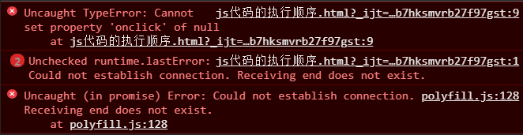

### 9.1如何解决这个问题

**使用onload()事件来解决。**

```html
<!DOCTYPE html>
<html lang="en">
<head>
    <meta charset="UTF-8">
    <title>js代码的执行顺序</title>
</head>
<!-- load事件在全部元素加载完毕后发生 -->
<body onload="ready()">

    <script type="text/javascript">

        function ready(){
            document.getElementById("btn").onclick = function (){
                alert("hello world");
            }
        }

    </script>

    <input type="button" value="hello" id="btn">
</body>
</html>
```

> 由于onload（）事件在页面全部元素加载完毕后发生
>
> 将ready函数赋给onload事件，那么ready函数就会在全部元素加载完毕后执行
>
> 通过把<script>脚本中的事件函数放到ready中
>
> 所以执行ready函数中的代码时，页面元素已经全部加载完毕
>
> 所以此时不会出现页面元素未加载的情况


**此段代码可以继续优化**

```html
<!DOCTYPE html>
<html lang="en">
<head>
    <meta charset="UTF-8">
    <title>js代码的执行顺序</title>
</head>
<body>

    <script type="text/javascript">
		window.onload = function(){ // 通过window来定义onload事件	这个回调函数叫a
            document.getElementById("btn").onclick = function (){ // 这个回调函数叫b
                alert("hello world");
            }
        }

    </script>

    <input type="button" value="hello" id="btn">
</body>
</html>
```

> **原理：**
>
> 页面加载的时候，将a函数注册给了load事件
>
> 页面加载完毕之后，load事件发生，此时执行回调函数a
>
> 回调函数a执行的过程中，将回调函数b注册给了id="btn"的click事件
>
> 当id="btn"的节点发生onclick事件之后，b函数被调用并执行


### 9.2JS代码设置节点的属性

```html
<!DOCTYPE html>
<html lang="en">
<head>
    <meta charset="UTF-8">
    <title>JS代码设置节点的属性</title>
</head>
<body>
    <script type="text/javascript">
        window.onload = function (){
            document.getElementById("btn").onclick = function (){
                var mytext = document.getElementById("mytext");
                // 一个节点对象中只要有的属性都可以"."
                mytext.type = "checkbox";
            }
        }
    </script>

    <input type="text" id="mytext" />

    <input type="button" value="将文本框修改为复选框" id="btn" />

</body>
</html>
```

**一个节点对象中只要有的属性都可以"."**


## 十、捕捉回车键

在一些网页的登录界面上，可以使用回车键来进行登录。

可以使用onkeydown（）事件来绑定文本框，实现按下键盘任意按键发生事件。

```html
<!DOCTYPE html>
<html lang="en">
<head>
    <meta charset="UTF-8">
    <title>JS捕捉回车键</title>
</head>
<body>
    <script type="text/javascript">
        window.onload = function (){
            var username = document.getElementById("username");
            username.onkeydown = function (){
                alert(111);
            }
        }
    </script>

    <input type="text" id="username"/>
</body>
</html>
```

**可以通过执行绑定Onkeydown()事件的回调函数时获取键值，来捕捉回车键**

常用按键的键值：

- 回车键：13
- ESC键：27

> **事件对象：**
>
> username这个元素拿到之后，为它注册一个onkeydown（）事件，当这个事件发生后，浏览器会调用这个回调函数，此时会自动将这个事件对象作为参数传过去。此时可以在回调函数中写一个形参来接收这个事件对象。
>
> - 自己编写函数时，可以写形参，或不写形参。
>
> - 当浏览器作为调用者来调用回调函数时，可以传递参数。
>
> - 当调用回调函数加了参数，而原来的函数没有形参的时候，只是没有接收参数而已
>
>   ```html
>   <!DOCTYPE html>
>   <html lang="en">
>   <head>
>       <meta charset="UTF-8">
>       <title>JS捕捉回车键</title>
>   </head>
>   <body>
>       <script type="text/javascript">
>           // 定义函数
>           function sum(){
>               alert("sum....");
>           }
>           // 回调函数，不管加没加参数，加几个参数，函数都可以调用。
>           // 但可以修改函数，为它加上一个形参来接收调用者传递的参数
>           sum();
>           sum("hello world");
>           sum(1, 2, 3);
>       </script>
>   </body>
>   </html>
>   ```
>
> **使用一个参数来接收事件对象并输出的结果：**
>
> ```html
>     <script type="text/javascript">
>         window.onload = function (){
>             var username = document.getElementById("username");
>             username.onkeydown = function (event){
> 				// event就是事件对象，表示该事件已经发生。（形参的名字随意）
>                 // 即使不写event，事件对象依然会作为局部变量传递过来，只是接收不到而已
>                 alert(event); // [object KeyboardEvent]
>             }
>         }
>     </script>
> ```
>
> 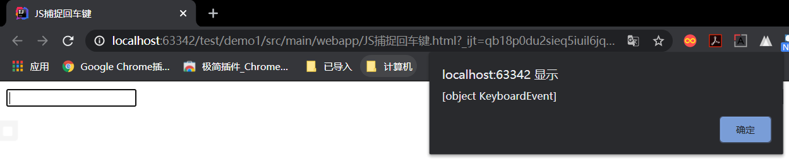
>
> **此时event代表一个键盘事件对象**
>
> **如果使用两个形参来接收会得到什么？**
>
> ```html
> <!DOCTYPE html>
> <html lang="en">
> <head>
>     <meta charset="UTF-8">
>     <title>JS捕捉回车键</title>
> </head>
> <body>
>     <script type="text/javascript">
>         window.onload = function (){
>             var username = document.getElementById("username");
>             username.onkeydown = function (a, b){
>                 // 在回调函数中有一个局部变量代表发生的事件，名称随意，只是一个局部变量
>                 // 此处用event来接收一个事件对象
>                 // 获取键值
>                 alert(a);
>                 alert(b)
>             }
>         }
>     </script>
> 
>     <input type="text" id="username"/>
> </body>
> </html>
> ```
>
> 
>
> 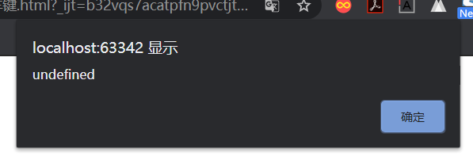
>
> **通过测试可以看出，回调函数的参数只有一个，而且是当前事件对象。**

### 10.1键值

**注意：对于键盘事件对象来说，都有一个keyCode属性用来获取键值！！！**

```html
<!DOCTYPE html>
<html lang="en">
<head>
    <meta charset="UTF-8">
    <title>JS捕捉回车键</title>
</head>
<body>
    <script type="text/javascript">
        window.onload = function (){
            var username = document.getElementById("username");
            username.onkeydown = function (event){
                alert(event.keyCode);
            }
        }
    </script>

    <input type="text" id="username"/>
</body>
</html>
```

按下ESC键后：

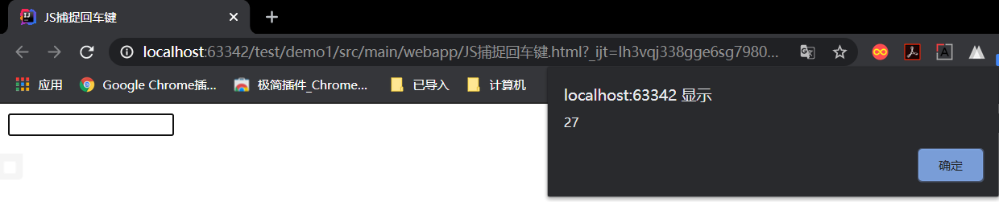

### 10.2使用js捕捉回车键实现按下回车显示登陆验证

```html
<!DOCTYPE html>
<html lang="en">
<head>
    <meta charset="UTF-8">
    <title>JS捕捉回车键</title>
</head>
<body>
    <script type="text/javascript">
        window.onload = function (){
            var username = document.getElementById("username");
            username.onkeydown = function (event){
                if (event.keyCode === 13){
                    alert("正在验证....")
                }
            }
        }
    </script>

    <input type="text" id="username"/>
</body>
</html>
```

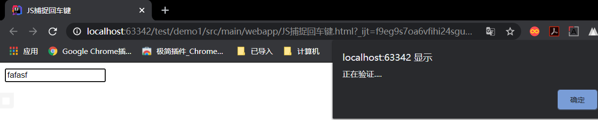

## 十一、void运算符

JS中有很多运算符，大部分使用方法都和JAVA一致，但是JAVA中没有void运算符。

**需求：既保留住超链接的样式，同时用户单击该超链接的时候执行一段js代码，但页面还不能跳转**

```html
<!DOCTYPE html>
<html lang="en">
<head>
    <meta charset="UTF-8">
    <title>void运算符</title>
</head>
<body>
    页面顶部<br><br><br><br><br><br><br><br><br><br><br><br><br><br><br><br><br><br><br><br><br><br><br><br>
    <br><br><br><br><br><br><br><br><br><br><br><br><br><br><br><br><br><br><br><br><br><br><br><br><br><br>
    <br><br><br><br><br><br><br><br><br><br><br><br><br><br><br><br><br><br><br><br><br><br><br><br><br><br>
    <br><br><br><br><br><br><br><br><br><br><br><br><br><br><br><br><br><br><br><br><br><br><br><br><br><br>
    <a href="" onclick="window.alert('hello')">既保留住超链接的样式，同时用户单击该超链接的时候执行一段js代码，但页面还不能跳转</a>
</body>
</html>
```

**由于href属性为空，系统默认跳转当前页面，所以单击超链接会跳转到页面顶部。**


此时需要使用void运算符

含义：

**执行表达式，但不返回任何结果**

语法格式：

```html
void(表达式);
```

**注意：""和void(0)不一样，""返回空字符串，而void(0)什么都不返回**

```html
<!DOCTYPE html>
<html lang="en">
<head>
    <meta charset="UTF-8">
    <title>void运算符</title>
</head>
<body>
    页面顶部<br><br><br><br><br><br><br><br><br><br><br><br><br><br><br><br><br><br><br><br><br><br><br><br>
    <br><br><br><br><br><br><br><br><br><br><br><br><br><br><br><br><br><br><br><br><br><br><br><br><br><br>
    <br><br><br><br><br><br><br><br><br><br><br><br><br><br><br><br><br><br><br><br><br><br><br><br><br><br>
    <br><br><br><br><br><br><br><br><br><br><br><br><br><br><br><br><br><br><br><br><br><br><br><br><br><br>
    <a href="javascript:void(0)" onclick="window.alert('hello')">既保留住超链接的样式，同时用户单击该超链接的时候执行一段js代码，但页面还不能跳转</a>
</body>
</html>
<!-- 需要在"void(0)"前面加上"javascript:"表示这段代码是JavaScript代码而不是路径！如果不加，会认为void(0)是一段路径，单击后会跳转。 -->
<!-- javascript:void()语法错误，小括号中必须有表达式 -->
```

 

## 十二、JS的控制语句

**JS中的控制语句除了特有的以外，其他和Java使用方法一致。**

### 12.1选择分支语句

#### 12.1.1if语句

#### 12.1.2switch语句


### 12.2循环语句

> **在JS中如何创建数组：**
>
> ```javascript
> <!-- 在JS的数组中对数据的个数限制，自动扩容 -->
> var arr = [];
> <!-- 在JS的数组中对数据类型没有严格限制 -->
> var arr1 = [false, true, 1, "abc", 3.14];
> <!-- JS中如何遍历数组 -->
> for(var i = 0; i < arr.length; i++){
>     alert(arr1[i]);
> }
> ```

#### 12.2.1while语句

#### 12.2.2do...while语句

#### 12.2.3for语句


### 12.3转向语句

#### 12.3.1break语句

#### 12.3.2continue语句


### 12.4JS特有语句（了解）

#### 12.4.1for...in语句

语法相当于java中的foreach，但是不一样的是i是数组arr的下标，而不是元素。

语法格式：

```javascript
var arr = [false, true, 1, "abc", 3.14];
for(var i in arr){
    alert(i); //1, 2, 3, 4, 5
    alert(arr[i]); //false, true, 1, "abc", 3.14
}
```

**for...in语句可以遍历对象的属性**

```javascript
<script type="text/javascript">
    // 创建一个类
    User = function (username, password){
    this.username = username;
    this.password = password;
}

var u = new User("张三", "444");
alert(u.username + "," + u.password);
alert(u["username"] + "," + u["password"]);

for (var i in u){
    alert(i); // 属性名:username, password
    alert(typeof i); // "string", "string"
    alert(u[i]); // "张三", "444"
}
</script>
```

#### 12.4.2with语句

使用with语句遍历属性

```javascript
<script type="text/javascript">
    User = function (username, password){
    this.username = username;
    this.password = password;
}

var u = new User("张三", "444");
alert(u.username); // "张三"
alert(u.password); // "444"

with (u){
    alert(username); // "张三"
    alert(password); // "444"
}
</script>
```

**缺点：假如在with语句中访问一个其他的变量test，在语句中会自动变成u.test，此时会出错。慎用！！！**