# Java基础部分（上）

## 一、Java开发环境搭建

### 1.1Java语言概述

- Java编程语言是Sun公司的James Gosling在1990年创建的，于1995年公布于世（一般说Java诞生于1995年）。
- Java是一门面向对象的编程语言，底层使用C++语言编写。
- Java语言具有功能强大和简单易用两个特征。

### 1.2Java语言发展史

Java包括三大块，分别是JavaSE、JavaEE、JavaME，这三者之间存在什么样的关系呢？

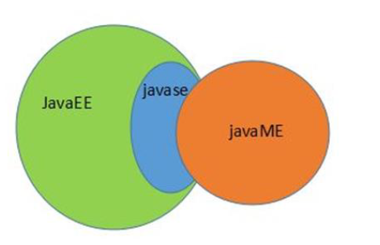

- JavaEE和JavaME都包含JavaSE。实际上，这三大块就是Java的三大版本。
- JavaSE是Java的标准版，是学习JavaEE和JavaME的基础，JavaEE是企业版，JavaME是微型版。
- JavaSE(Java标准版)，主要做一般的Java应用，比如应用软件/ QQ之类的通信软件等等。
- JavaEE(Java企业版)，主要做企业应用，比如公司网站，企业解决方案等。
- JavaME(Java微型版)，主要面向嵌入式等设备应用的开发，比如手机游戏等。

### 1.3Java语言特性

- 简单性：虽然底层采用C++，但相对于C++而言，Java是简单的，摒弃了C++的指针和多继承等概念。

- 面向对象：Java提供了封装，继承，多态等机制。

- **健壮性**：由于Java提供了自动垃圾回收机制（GC机制），启动一个单独的垃圾回收线程，在特定的时机回收/释放垃圾数据，使内存时刻处于最好的状态。而C++需要编程人员手动释放垃圾和无用数据。

- 多线程：Java语言支持多个线程同时并发执行，同时也提供了多线程环境下的安全机制。

- **可移植性/跨平台**：Java语言只需要编写/编译一次，即可处处运行（Linux/Windows等等）。功劳主要是因为Java虚拟机（Java Virtual Machine，简称JVM）机制

  > JVM机制
  >
  > 实际上Java程序运行的时候并不是直接运行在操作系统上的，而是在操作系统上先安装上一个JVM，把Java程序放到了JVM中运行，JVM屏蔽了各操作系统之间的差异，这样就完成了跨平台。
  >
  > 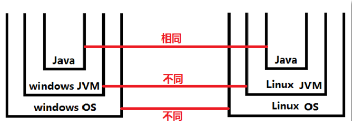
  >
  > 由图可见，不同的操作系统中安装的JVM肯定是不同的。

### 1.4JDK、JRE、JVM三者关系

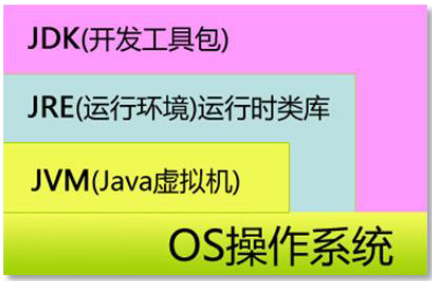

> 由图可见，JDK、JRE、JVM之间存在这样的包含关系：
>
> JDK包含JRE，JRE又包含JVM，所以只要安装了JDK，那么JRE和JVM自动就安装了。

#### 1.4.1JDK、JRE、JVM分别代表什么

1. JDK（Java Development Kit）

   Java语言的软件开发工具包，是每个Java软件开发人员必须安装的。JDK安装之后，会自带一个JRE，因为编写完代码总是需要运行的。**所以，如果只是想在机器上运行Java程序，是不需要安装JDK，只需要安装JRE即可。**

2. JRE（Java Runtime Environment）

   Java语言的运行环境，运行Java程序所必须的环境的集合，包含JVM标准实现及Java核心类库。

3. JVM（Java Virtual Machine）

   Java语言的虚拟机，JVM是一种用于计算机设备的规范，是通过在实际的计算机上模拟各种计算机功能来实现的。JVM是实现Java语言跨平台的核心。

### 1.5Java的加载与执行

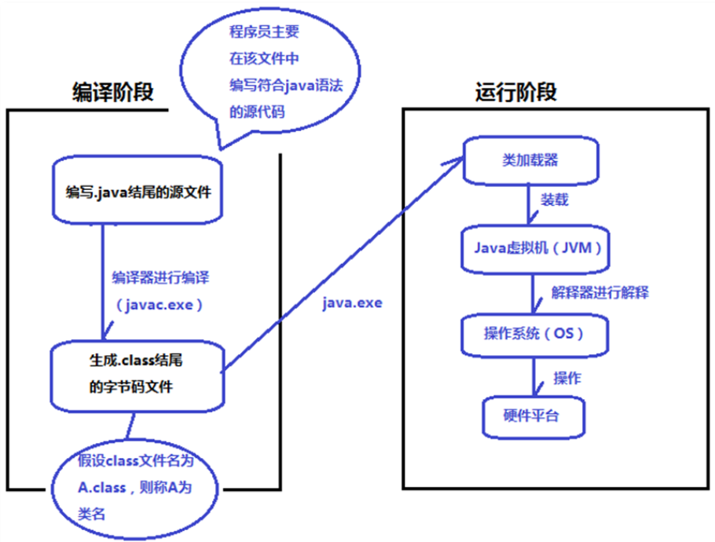

>由图可见，Java程序的运行过程是这样的：
>
>1. 写代码：创建一个以**.java**结尾的文件，在该文件中编写符合Java语法的源代码，这个文件叫java源文件
>
>2. 编译：使用**"javac"**命令对java源文件进行编译，如果编译成功，会生成一个以**.class**结尾的文件，我们称之为字节码文件
>
>   **注意，这里有一个类名的概念，假如生成的文件是A.class，则表示类名为A，B.class的类名是B。**
>
>   **注意，一个java源文件可能会编译生成多个class文件。**
>
>   **注意，当java源文件中的语法规则不符合java语法规则时，编译出错并且不会生成class文件。**
>
>3. 运行：使用**"java"**命令运行已编译的java程序，假设编译之后的字节码文件是A.class，则在dos命令窗口中执行**"java A"**命令，这时候JVM就启动了，通过**"类装载器ClassLoader"**从硬盘中找到A.class文件并装载，class文件被装载到JVM之后，JVM解释器对字节码进行解释，最终解释为二进制码，然后操作系统通过执行二进制指令来和硬件平台完成交互。

### 1.6Windows系统常用的DOS命令

打开DOS命令窗口，使用快捷键Win+r，输入cmd，单击回车

1. dir命令：查看当前目录下的所有子文件和子目录

2. cd命令：切换路径

   1. **cd + 绝对路径**：cd C:\Program Files\Java 跳转到C盘Program Files文件夹的Java子文件夹目录下
   2. **cd + 相对路径**：cd Program Files\Java 跳转到当前盘Program Files文件夹的Java子文件夹目录下
   3. **cd..**：回到上级
   4. **cd\ **：回到根目录下

3. 切换盘符命令：**c:**或**d: **切换盘符

4. del命令：删除文件或目录

   del *.class：删除当前目录下的所有.class文件

5. ipconfig命令：查看ip地址等信息，详细信息可以使用ipconfig/all

6. ping命令：查看两台计算机之间是否可以正常通信

7. mkdir命令：创建目录

   mkdir abc：表示在当前目录下创建abc文件夹

8. cls命令：清屏

9. exit命令：退出DOS命令窗口

### 1.7常用的文本编辑快捷键

|        快捷键        |       作用       |
| :------------------: | :--------------: |
|       ctrl + c       |       复制       |
|       ctrl + v       |       粘贴       |
|       ctrl + x       |       剪切       |
|       ctrl + s       |       保存       |
|       ctrl + z       |       撤销       |
|       ctrl + y       |       重做       |
|       ctrl + a       |       全选       |
|         home         |   光标回到行首   |
|         end          |   光标回到行尾   |
|     ctrl + home      | 光标回到文章开始 |
|      ctrl + end      | 光标回到文章末尾 |
|  shift + home / end  |     选中一行     |
|       鼠标双击       |   选中一个单词   |
| ctrl + shift + ← / → |   选中一个单词   |
|       ctrl + f       |       查找       |

### 1.8JDK的下载与安装

1. 下载JDK

   从[Oracle](https://www.oracle.com)官网下载，选择JavaSE


2. 选择下载


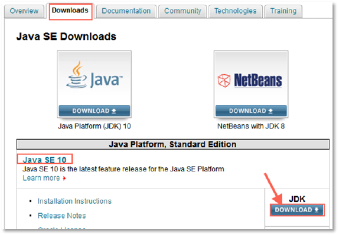

3. 勾选Accpet...，然后选择下载

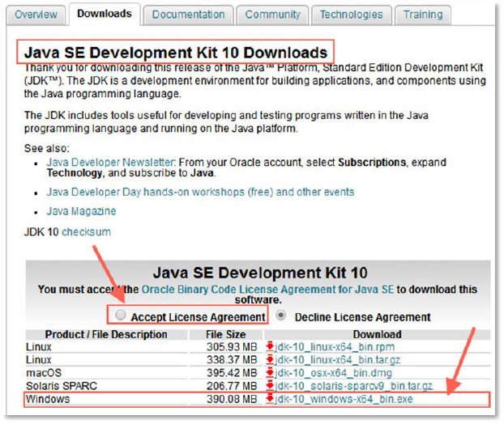

4. 下载完成双击安装，安装目录可以改也可以不改

5. 配置环境变量

   右键计算机——>属性——>高级系统设置——>环境变量

   添加环境变量

   JAVA_HOME	JDK根目录

   Path	;%JAVA_HOME%\bin

   保存即可

6. 查看是否安装成功

   打开DOS窗口，输入java -version，如果显示编译器版本，安装成功。

### 1.9Java中的注释

> Java中的注释有三种

1. 单行注释，格式如下

   ```java
   // 单行注释
   ```

2. 多行注释，格式如下

   ```java
   /*
    *
    * 多行注释
    */
   ```

3. 文档注释，格式如下

   ```java
   /**
   * 文档注释
   * @author 作者名字
   * @version 版本号
   */
   ```

   **注意，文档注释会被JDKbin目录下的javadoc.exe命令解析并生成帮助文档**

### 1.10public class 和 class的区别

- 一个java源文件中可以有多个class类，编译后可以生成多个字节码文件，而且带有public修饰符的class可以没有。

- 在java源文件中定义的公共类的名字必须和文件名相同，也就是说在A.java中的公共类必须是public class A

- 任何一个class中都可以设定程序入口，也就是说任何一个class中都可以写main方法（主方法），想从哪个入口进去执行，则让类加载器先加载对应的类即可

  例如：想让A类中的main方法执行，则执行：java A，想让B类中的main方法执行，则执行：java B。

  但实际上，对于一个完整的独立的应用来说，只需要提供一个入口，也就是说只需要定义一个main方法即可。

## 二、标识符与关键字

- 在计算机语言中，标识符通常指用户编程时使用的名字，用于给变量、常量、函数、语句块等命名，以建立起名称与使用之间的关系。

- 标识符通常由字母和数字以及其他字符构成。

- 在Java源程序中，凡是程序员自己有权力修改的名字都是标识符。

### 2.1标识符

#### 2.1 .1标识符都可以标识什么

- 类名：例如：Student学生类
- 接口名：例如：Runable可运行的
- 变量名：例如：name名字
- 方法名：例如：login登录
- 常量名：例如：LOGIN_SUCCESS

#### 2.1.2标识符命名规则（重点）

Java语言中标识符命名必须严格遵守以下规则，否则编译时会出错

1. 标识符只能由数字、字母、下划线“_”、美元符号“$”组成，不能含有其它符号。
2. 标识符不能以数字开始。
3. java关键字和保留字不能作为标识符。
4. 标识符严格区分大小写。
5. 标识符理论上没有长度限制。

#### 2.1.3标识符命名规范（重点）

1. 命名规则和命名规范的区别：

- 命名规则是一种语法上的要求，如果违背了，则表示语法错误，程序是无法正常编译的。
- 命名规范在一个团队中进行协同开发时尤为重要，如果大家都按照统一的命名规范书写代码，那么代码看起来就会像是同一个人编写的一样，能够很大程度上提高代码的可读性。

2. **以下有几种通用的命名规范：**

- 见名知意：看到这个单词就知道它表示什么，增强程序的可读性，例如：Student则表示学生类型，User则表示用户类型。

- 遵循驼峰命名方式：可以很好的分隔单词，每个单词之间会划清界限，同样也是增强程序的可读性。

- 类名、接口名首字母大写，后面每个单词首字母大写，这是遵守驼峰命名方式的。

  例如：public class UserService{} 用户业务类。

- 变量名、方法名首字母小写，后面每个单词首字母大写，这也是遵守驼峰命名方式的。

  例如：String name则表示变量名字；getName则表示方法获取名字。

- 常量名全部大写，单词和单词之间使用“_”衔接，为了表示清楚含义，不要怕单词长。

  例如：INT_MAX_VALUE则表示int类型最大值。

### 2.2关键字

Java中的关键字是事先定义的，有特殊意义的单词，Java中所有关键字都是小写的英语单词，它们都是有特殊意义的，或表示数据类型，或表示程序结构等。

1. 常用的关键字

|      byte      |    short    |       int        |      long      |    float     |
| :------------: | :---------: | :--------------: | :------------: | :----------: |
|   **double**   | **boolean** |     **char**     |     **if**     |   **else**   |
|    **for**     |  **while**  |      **do**      |  **continue**  |  **break**   |
|   **public**   | **private** |  **protected**   |  **default**   |  **throw**   |
|   **throws**   |   **try**   |    **catch**     |   **final**    | **finally**  |
|   **switch**   |  **case**   |  **transient**   |  **package**   |   **new**    |
|   **static**   |  **this**   |   **abstract**   |  **strictfp**  |  **native**  |
|    **goto**    |  **super**  |   **extends**    | **implements** |  **import**  |
| **instanceof** | **return**  | **synchronized** |    **void**    |  **const**   |
|   **class**    |  **enum**   |    **assert**    | **interface**  | **volatile** |

2. 每个关键字的大致含义

|      关键字      |                             含义                             |
| :--------------: | :----------------------------------------------------------: |
|     **byte**     |                **基本数据类型之一，字节类型**                |
|    **short**     |               **基本数据类型之一，短整数类型**               |
|     **int**      |                **基本数据类型之一，整数类型**                |
|     **long**     |               **基本数据类型之一，长整数类型**               |
|    **float**     |            **基本数据类型之一，单精度浮点数类型**            |
|    **double**    |            **基本数据类型之一，双精度浮点数类型**            |
|   **boolean**    |          **基本数据类型之一，声明布尔类型的关键字**          |
|     **char**     |                **基本数据类型之一，字符类型**                |
|      **if**      |                     **条件语句的引导词**                     |
|     **else**     |         **用在条件语句中，表明当条件不成立时的分支**         |
|     **for**      |                   **一种循环结构的引导词**                   |
|    **while**     |                      **用在循环结构中**                      |
|   **continue**   |                    **回到一个块的开始处**                    |
|    **break**     |                      **提前跳出一个块**                      |
|    **public**    |                **一种访问控制方式：共用模式**                |
|   **private**    |                **一种访问控制方式：私用模式**                |
|  **protected**   |                **一种访问控制方式：保护模式**                |
|   **default**    |     **默认，例如，用在switch语句中，表明一个默认的分支**     |
|    **throw**     |                       **抛出一个异常**                       |
|    **throws**    |       **声明在当前定义的成员方法中所有需要抛出的异常**       |
|     **try**      |               **尝试一个可能抛出异常的程序块**               |
|    **catch**     |               **用在异常处理中，用来捕捉异常**               |
|    **final**     |                    **表示不可变，最终的**                    |
|   **finally**    | **用于处理异常情况，用来声明一个基本肯定会被执行到的语句块** |
|    **switch**    |                   **分支语句结构的引导词**                   |
|     **case**     |          **用在switch语句之中，表示其中的一个分支**          |
|    **break**     |                      **提前跳出一个块**                      |
|  **transient**   |                  **声明不用序列化的成员域**                  |
|   **package**    |                            **包**                            |
|    **static**    |                     **表明具有静态属性**                     |
|     **new**      |                    **用来创建新实例对象**                    |
|     **this**     |                  **指向当前实例对象的引用**                  |
|   **abstract**   |              **表明类或者成员方法具有抽象属性**              |
|   **strictfp**   | **用来声明FP_strict（单精度或双精度浮点数）表达式遵循IEEE 754算术规范** |
|    **native**    | **用来声明一个方法是由与计算机相关的语言（如C/C++语言）实现的** |
|     **goto**     |                 **保留关键字，没有具体含义**                 |
|    **super**     |      **表明当前对象的父类型的引用或者父类型的构造方法**      |
|   **extends**    | **表明一个类型是另一个类型的子类型，这里常见的类型有类和接口** |
|  **implements**  |                **表明一个类实现了给定的接口**                |
|    **import**    |                  **表明要访问指定的类或包**                  |
|  **instanceof**  |         **用来测试一个对象是否是指定类型的实例对象**         |
|    **return**    |                   **从成员方法中返回数据**                   |
| **synchronized** |                 **表明一段代码需要同步执行**                 |
|     **void**     |                **声明当前成员方法没有返回值**                |
|    **const**     |                 **保留关键字，没有具体含义**                 |
|    **class**     |                        **声明一个类**                        |
|    **assert**    |                  **断言，用来进行程序调试**                  |
|     **enum**     |                           **枚举**                           |
|  **interface**   |                           **接口**                           |
|   **volatile**   |          **表明两个或者多个变量必须同步地发生变化**          |


## 三、变量

### 3.1字面量

字面量就是数据/数值

例如：1234，true，”abc”，‟中‟，3.14等等…

#### 3.1.1数据的类型

数据被分为：整数型、浮点型、字符型、布尔型、字符串型等等

- 整数型：1、2、-1、100
- 浮点型：1.0、3.14
- 字符型：'a'、'中'
- 布尔型：false、true
- 字符串型："我是中国人"

### 3.2变量

变量是内存当中存储数据最基本的单元，将数据（字面量）放到内存当中，给这块内存空间起一个名字，这就是变量。

所以变量就是内存中的一块空间，**这块空间有名字，有类型，有值，这就是变量必须具备的三要素。**

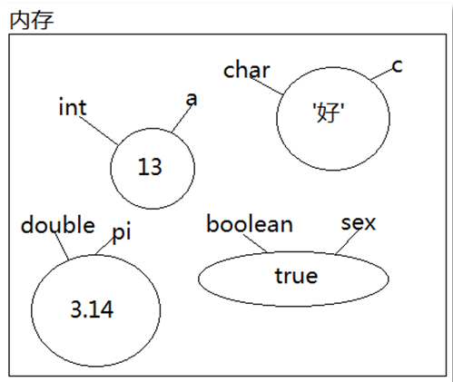

#### 3.2.1使用变量

使用变量之前需要先声明变量，语法格式：

> - 数据类型 变量名;
>
> - int a;

声明变量之后需要为变量赋值，语法格式

> - 变量名 = 值;
> - a = 10;

我们也可以在声明的同时来赋值，语法格式：

> - 数据类型 变量名 = 值;
> - int a = 10;

我们也可以一次声明多个变量

> - int x, y, z;
> - int a = 100, b = 200, c = 300;

**注意：变量只能声明一个，不得重复声明。也就是说"在同一个域中"变量名不能重复**

```java
public class Test{
    public static void main(String[] args){
        int age = 25;
        // 重复声明age变量，编译出错
        int age = 23;
        System.out.println(age);
    }
}
```

#### 3.2.2变量分类

变量根据声明的位置不同可以分为不同的变量：

- 局部变量：在方法体中声明的被称作局部变量
- 成员变量：在类体中，方法体外声明的被称作成员变量
  1. 静态变量：成员变量声明时如果使用static关键字修饰的为静态成员变量（简称静态变量）
  2. 实例变量：如果没有static关键字修饰则称为实例成员变量（简称实例变量）

```java
public class Test{
    int x = 20;	// 实例变量
    static int y = 30; // 静态变量
    public static void sum(int a, int b){ // 局部变量
        int sum = 100; // 局部变量
    }
}
```

#### 3.2.3变量作用域

所谓变量的作用域就是变量的有效范围，因为局部变量，实例变量，静态变量存储在JVM的不同内存区域上，所以变量是有作用域的，记住一个口诀**"出了大括号就不认识了"。**

之前我们说，变量在同一个作用域中不能重复声明，请观察以下代码

```java
public class Test{
    static int k = 100;
    public static void main(Strin[] args){
        int k = 300;
        System.out.println("main k = " + k);
        // 输出结果 main k = 300
    }
}
```

由于静态变量k声明在类体域中，而局部变量k声明在方法体中，所以当在主方法中调用k的时候调用的的是方法体中的k，而不是类体中的k，因此我们可以得出变量也遵循**"就近原则"。**

对以上代码做出修改，再观察运行结果

```java
public class Test{
    static int k = 100;
    public static void main(Strin[] args){
        int k = 300;
        System.out.println("main k = " + k);
        m();
        /*
        	输出结果：main k = 300
        			m k = 100
        */
    }
    public static void m(){
        System.out.println("m k = " + k);
    }
}
```

此时我们的m方法调用的则是静态变量k，所以依然符合变量**"出了大括号就不认识了和就近原则"。**


## 四、数据类型

数据类型是变量三要素之一，而且是最重要的一个要素。由于软件的主要作用就是进行数据的处理，现实中的数据有很多，所以编程语言中也对其进行了分门别类，由此产生了数据类型，不同的数据类型会给其分配不同大小的空间进行存储。也就是说，数据类型的作用就是决定程序运行阶段该给变量分配多大的内存空间。

java中的数据类型分为两大类：一类是基本数据类型，另一类是引用数据类型。

### 4.1基本数据类型

基本数据类型分为四类八种

1. 整数型：byte、short、int、long
2. 浮点型：float、double
3. 字符型：char
4. 布尔型：boolean

| 数据类型 | 占字节数 | 取值范围          | 缺省默认值 |
| -------- | -------- | ----------------- | ---------- |
| byte     | 1        | -$2^7$ ~ $2^7$ -1 | 0          |
| short    | 2        | -2^15^  ~ 2^15^-1 | 0          |
| int      | 4        | -2^31^ ~ 2^31^-1  | 0          |
| long     | 8        | - 2^63^​ ~ 2^63^-1 | 0L         |
| float    | 4        | -2^31^ ~ 2^31^-1  | 0.0f       |
| double   | 8        | -2^63^ ~ 2^63^-1  | 0.0        |
| boolean  | 1        | true、false       | false      |
| char     | 2        | 0~ 2^16^ -1       | '\u0000'   |

#### 4.1.1字符型

字符型char在Java语言中占用2个字节，char类型的字面量必须使用半角的单引号括起来，取值范围为[0-65535]，char和short都占用2个字节，但是char可以取到更大的正整数，因为char类型没有负数。

1. 使字符型数据的使用

   字符型数据赋值需要用**单引号引起单个字符。**

```java
public class Test{
    public static void main(String[] args){
        char a = 'a';
        System.out.println(a);
        // 输出结果 a
    }
}
```

2. 转义字符的使用

   > 转义字符指用一些普通的字符组合代表一些特殊的字符，由于组合用的字符改变了原意,称为转义字符。
   >
   > Java中的转义字符以 \ 开始，常见的转义字符有：\t、\n、\u、\\、\\'，\\"，
   >
   > 其中\t代表制表符，\n是换行符，\\表示一个普通的\字符，\\'表示一个普通的'，\\"表示一个普通的"

```java
public class Test{
    public static void main(String[] args){
        char a = 'a';
        System.out.println("这是一个普通字符：" + a);
        // 输出结果 a
        char b = '\t';
        System.out.println("abc" + b + "def");
        // 输出结果 abc		def 
        // 中间有一个制表符
    }
}
```

#### 4.2.2整数型

整数型数据在java中有4种表示方式，分别是十进制、八进制、十六进制、二进制。

四种进制写法也不同

- 二进制：以0b开头，例如：ob10
- 八进制：以0开头，例如：010
- 十进制：正常写，例如：10
- 十六进制：以0x开头，例如：0x10

```java
public class Test{
    public static void main(String[] args){
        System.out.println("二进制：" + 0b10);
        System.out.println("八进制：" + 010);
        System.out.println("十进制：" + 10);
        System.out.println("十六进制：" + 0x10);
        // 输出结果，按十进制输出
        /*
        	二进制：2
        	八进制：8
        	十进制：10
        	十六进制：16
        */ 
    }
}
```

**注意，在整数型变量中，我们使用long型数据在赋值时，需要在字面量后面添加L/l，建议大写L，因为小写字母l和数字1不好区分**

> long a = 100L;

#### 4.2.3自动类型转换

```java
public class Test{
    public static void main(String[] args){
        int a = 10;
        long b = 20;
        System.out.println("a = " + a);
        System.out.println("b = " + b);
        // 运行结果
        // a = 10
        // b = 20
    }
}
```

运行没有问题，说明程序语法正确，在Java中会将10默认当作int类型数据处理，int类型赋给long类型也可以成功赋值，因为int占用4个字节，而long占用8个字节，在Java中小容量可以直接赋给大容量。这个过程，称作自动类型转换

对此代码做出更改，看下面代码：

```java
public class Test{
    public static void main(String[] args){
        long a = 10;
        int b = a;
        System.out.println("a = " + a);
        System.out.println("b = " + b);
        // 运行结果
        // 错误：不兼容的类型：从long转换到int可能会有损失
    }
}
```

由此我们可以得出，以上编写方式有问题，这是因为a是long类型，占用8个字节，而b是int类型，占4个字节。很明显是大容量转换成小容量，所以出现类型转换错误。

**所以在Java中规定，小容量转换成大容量可以自动类型转换，而大容量转换成小容量，需要用到强制类型转换。**

对以上代码进行修改

```java
public class Test{
    public static void main(String[] args){
        long a = 10;
        int b = (int)a;
        System.out.println("a = " + a);
        System.out.println("b = " + b);
        // 运行结果
        // a = 10
        // b = 10
    }
}
```

这就是强制类型转换，语法格式：

> (类型)变量值;

**总结：**

1. 两者类型一致，不存在类型转换

2. 小容量赋值给大容量，自动类型转换

3. 大容量赋值给小容量，需要强制类型转换

   **注意，如果大杯中的水多，导入小杯就会溢出。所以当大容量的数据过大的时候，强制类型转换可能会损失数据！！！**

```java
public class Test{
    public static void main(String[] args){
        int a = 300;
        byte b = (byte)a;
        System.out.println("b = " + b);
        // 运行结果
        // b = 44
    }
}
```

> 4个字节的int类型300强制转换成1个字节的byte类型，最终结果是44，大容量的数据通过强制类型转换成小容量数据导致数据缺失。
>
> 4个字节的300使用二进制表示：00000000 00000000 00000001 00101100
>
> 强制类型转换后一个字节的表示：00101100
>
> 所以输出结果44

分析以下代码：

```java
public class Test{
    public static void main(String[] args){
        long num = 2147483648;
        System.out.println("num = " + num);
        // 运行出错：过大的整数：2147483648
    }
}
```

这是因为Java在读到这个整数的时候，默认将其当作int类型来处理，但这个数字已经超出了int类型的取值范围，所以编译报错。

那么如何解决呢

> 只需要在数字后加上L即可
>
> long num = 2147483648L;

**byte类型可不可以直接赋值?**

观察以下代码：

```java
public class Test{
    public static void main(String[] args){
        byte b = 1;
        System.out.println("b = " + b);
        // 运行结果
        // b = 1
    }
}
```

可以看出程序运行没有问题，但是int型数据的1占四个字节，而byte类型的数据占一个字节。我们知道大容量赋值给小容量需要强制类型转换，这里没有强转，这是为什么？

**这是因为在java语言有这样一条规定，大家记住就行了，如果当一个整数型字面量没有超出byte类型取值范围时，可以直接赋值给byte类型变量。**

再对以上代码作出修改：

```java
public class Test{
    public static void main(String[] args){
        byte b = 1;
        byte x = 127;
        byte y = 128;
        System.out.println("b = " + b);
        System.out.println("x = " + x);
        System.out.println("y = " + y);
        // 运行出错：不兼容的类型：从int转换成byte可能会有损失（第五行）
    }
}
```

由此可知第五行需要强转，再对代码作出修改

```java
public class Test{
    public static void main(String[] args){
        byte b = 1;
        byte x = 127;
        byte y = (byte)128;
        System.out.println("b = " + b);
        System.out.println("x = " + x);
        System.out.println("y = " + y);
        // 运行结果
        // b = 1
        // x = 127
        // y = -128
    }
}
```

这也印证了我们上面所说：当整数型字面量没有超出byte类型取值范围时，可以直接赋值。不过，如果超出了byte类型的取值范围，在使用时必须进行强制类型转换。

**其实除了byte有这样的规定以外，short和char也同样有这样的规定。记住即可**

#### 4.2.4布尔型

在Java语言中布尔类型的值只包括true和false，没有其它值，布尔类型的数据在开发中主要使用在逻辑判断方面。

#### 4.2.5浮点型

在现实世界中存在无穷的数据，数据是无穷的，但是内存是有限的，所以只能存储近似值，float单精度占4个字节，double双精度占8个字节，相对来说double精度要高一些。

由于浮点型数据存储的是近似值，所以一般判断两个浮点型数据是否相等的操作很少。

**在java语言中有这样的一条规定：只要是浮点型的字面量，例如1.0、3.14等默认会被当做double类型来处理，如果想让程序将其当做float类型来处理，需要在字面量后面添加f/F。**

```java
public class Test{
    public static void main(String[] args){
        float f = 3.0;
        System.out.println("f = " + f);
        // 运行出错：不兼容的类型：从double转换到float可能会有损失
    }
}
```

这是因为默认将3.0当作double类型来处理，占用8个字节，而f是float类型4个字节，所以大容量赋值给小容量需要做强制类型转换。

#### 4.2.6基本数据类型转换

基本数据类型之间是存在固定的转换规则的，现总结出以下6条规则，无论是哪个程序，将这6个规则套用进去，问题迎刃而解：

1. 八种基本数据类型中，除boolean类型不能转换，剩下七种类型之间都可以进行转换。
2. 如果整数型字面量没有超出byte,short,char的取值范围，可以直接将其赋值给byte,short,char类型的变量。
3. 小容量向大容量转换称为自动类型转换，容量从小到大的排序为：byte < short(char) < int < long < float < double，其中short和char都占用两个字节，但是char可以表示更大的正整数。
4. 大容量转换成小容量，称为强制类型转换，编写时必须添加“强制类型转换符”，但运行时可能出现精度损失，谨慎使用。
5. byte,short,char类型混合运算时，先各自转换成int类型再做运算。
6. 多种数据类型混合运算，各自先转换成容量最大的那一种再做运算。

## 五、运算符

运算符是指对操作数的运算方式。

例如：1+2，其中1和2都是操作数，+是操作符，操作符和操作数联合起来构成表达式。

### 5.1概念

#### 5.1.1运算符的分类

- 按照其要求的操作数数目来分，可以有单目运算符（1个操作数）、双目运算符（2个操作数）和三目运算符（3个操作数）。
- 运算符按其功能来分，有算术运算符、赋值运算符、关系运算符、逻辑运算符、位运算符、条件运算符、字符串连接运算符和其他运算符。

#### 5.1.2常用的运算符

| 算术运算符       | +、-、*、/、%（取模）、++（自加1【单目】）、--（自减1【单目】） |
| ---------------- | ------------------------------------------------------------ |
| 关系运算符       | **>、>=、<、<=、==、!=**                                     |
| 逻辑运算符       | **&（逻辑与）、\|（逻辑或）、！（逻辑非）、&&（短路与）、\|\|（短路或）** |
| 赋值运算符       | **=、+=、-=、*=、/=、%=、^=、&=、\|=、<<=、>>=**             |
| 位运算符         | **&（按位与）、\|（按位或）、^（按位异或）、~（按位取反【单目】）、<<（左移）、>>（带符号右移）、>>>（无符号右移）** |
| 条件运算符       | **布尔表达式?表达式1:表达式2 （三目）**                      |
| 字符串连接运算符 | **+**                                                        |
| 其他运算符       | **instanceof、new**                                          |

#### 5.1.3优先级

- 如果不确定运算符的优先级可以直接加小括号，有小括号的优先级一定是高的，记住这条即可。

### 5.2运算符详解

#### 5.2.1算术运算符

算术运算符包括：

```
+（两个数字求和）

-（两个数字相减）

*（两个数字乘积）

/（两个数字相除）

%（两个数字取模或者求余）

++（单目运算符，对数字自加1）

--（单目运算符，对数字自减1）
```

#### 5.2.2关系运算符

关系运算符主要是完成数据和数据之间的比较，常用的关系运算符包括：

```
>、>=、<、<=、==、!=
```

**注意：关系运算符的运算结果都是布尔类型，最后的结果不是true就是false，没有其他值。**

#### 5.2.3逻辑运算符

逻辑运算符主要包括：

```
逻辑与（&），逻辑或（|），逻辑异或（^），短路与（&&），短路或（||）
```

**所有逻辑运算符的特点是操作数都是布尔类型，并且最终的运算结果也是布尔类型。**

逻辑运算符的运算规则：

| 操作数 |      例子       | 结果 | 描述                                                         |
| :----: | :-------------: | :--: | ------------------------------------------------------------ |
|   &    |    true&true    | TRUE | (5>3) & (5>4)：5大于3并且5大于4                              |
|   \|   |  true \| false  | TRUE | (5>3) \| (5>10)：5大于3或者5大于10                           |
|   ！   |     !false      | TRUE | false取反是true，true取反就是false                           |
|   ^    |   true^false    | TRUE | 异或运算符，只要两边的操作数不同，结果就是true               |
|   &&   |   true&&true    | TRUE | 短路与（&&）和逻辑与（&）实际上最终的运行结果是完全相同的，只不过短路与（&&）会存在短路现象。 |
|  \|\|  | true \|\| false | TRUE | 短路或（\|\|）和逻辑或（\|）实际上最终的运行结果是完全相同的，只不过短路或（\|\|）会存在短路现象。 |

**短路原则**

> 短路与（&&）在左边的表达式结果为false的时候，**右边的表达式则不再执行**，这种现象被称为短路现象。
>
> 同理短路或（||）在左边的表达式结果为true的时候，**右边的表达式也不再执行**。

#### 5.2.4赋值运算符

赋值运算符包括：

```
=、+=、-=、*=、/=、%=
```

x += 1和x = x + 1真的是完全相同吗？我们来看下面的代码：

```java
public class Test {
    public static void main(String[] args) {
        byte b = 10;
        b += 1;
        System.out.println("b = " + b);
        // 运行结果
        // b = 11
    }
}
```

```java
public class Test {
    public static void main(String[] args) {
        byte b = 10;
        b = b + 1;
        System.out.println("b = " + b);
        // 运行出错
        // 错误:不兼容的类型: 从int转换到byte可能会有损失
        /* 
        * 编译没有通过的原因：b是byte类型，1是int类型，根据之前 
        * 讲解的类型转换规则得知，byte和int混合运算最后结果是 
        * int类型，int类型的值无法直接赋值给byte类型的变量b， 
        * 所以编译报错。 
        */
    }
}
```

通过以上代码可以得知：b = b + 1和b += 1是不一样的，那么b += 1等同于什么呢

> 实际上java对于扩展类的赋值运算符进行了特殊的处理，所有的扩展赋值运算符，最终都不会改变运算的结果类型，假设前面的变量是byte类型，那么后面的表达式运算之后的结果还是byte类型。所以实际上b += 1等同于：
>
> b = (byte)b + 1;

根据以上代码测试得出，对于扩展类的赋值运算符在运算的过程中不会改变运算的结果类型，也就是说byte b = 100; b += 1000;b变量最初是byte类型，最后的运算结果还是一个byte类型。这是一条固定的语法规则，大家记住就行了，以后在使用扩展类赋值运算符的时候要谨慎，不小心就会精度损失的。

#### 5.2.5条件运算符

条件运算符属于三目运算符。

它的语法结构是：布尔表达式?表达式1:表达式2。

它的运行原理是这样的，先判断布尔表达式的结果是true还是false，如果是true，则选择表达式1的结果作为整个表达式的结果，反之则选择表达式2的结果作为整个表达式的结果。

#### 5.2.6字符串连接运算符

字符串连接运算符：+

实际上“+”运算符在java语言中有两个作用，作用一是对数字进行求和运算，作用二就是字符串连接运算。

当“+”运算的时候，两边的操作数都是数字的话，一定会进行求和运算，只要其中有一个操作数是字符串类型，那么一定会进行字符串拼接运算，字符串拼接之后的结果还是字符串类型。

**注意，当一个表达式当中有多个“+”，并且在没有小括号的前提下，遵循自左向右的顺序依次执行。**

```java
public class Test {
    public static void main(String[] args) {
        int a = 10;
        int b = 20;
        int c = a + b;
        System.out.println(a + " + " + b + " = " + a + b);
        // 10 + 20 = 1020

        System.out.println(a + " + " + b + " = " + (a + b));
        // 10 + 20 = 30
    }
}
```

## 六、控制语句

在大部分编程语言当中都会存在控制语句，控制语句是一个程序的灵魂。

Java语言中共有8种控制语句：

> 1. 选择语句：if语句、switch语句
> 2. 循环语句：for循环、while循环、do...while循环
> 3. 转向语句：break语句、continue语句
> 4. 返回语句：return语句

### 6.1选择语句

选择语句又称为分支语句，它通过对给定的条件进行判断，从而决定执行两个或多个分支中的哪一支。

在编写选择语句之前，应该首先明确判断条件是什么，并确定当判断结果为“真”或“假”时应分别执行什么样的操作/算法。

Java中提供了两种选择语句：一个是if语句，另一个是switch语句

#### 6.1.1if语句

if语句的编写方式归纳为以下四种：

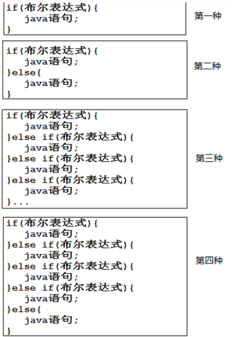

if被翻译为如果，else被翻译为其它，我们针对以上第二种写法进行说明：如果布尔表达式的结果是“真”，则执行它后面的分支，反之则执行else对应的分支。

1. 第一种

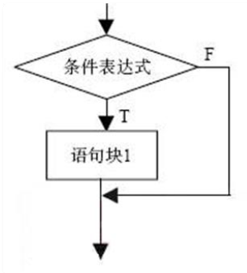

2. 第二种

   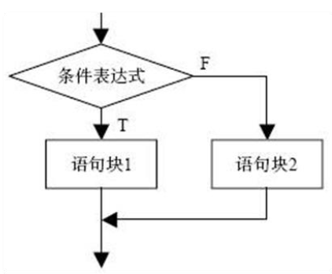

3. 第三种

   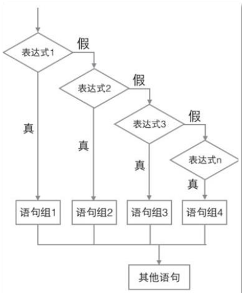

4. 第四种

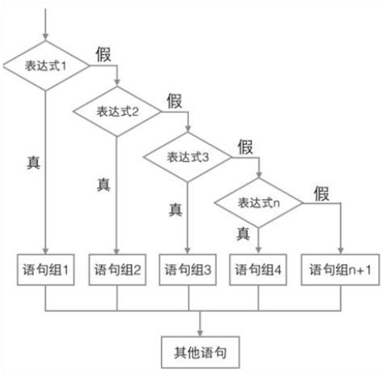

#### 6.1.2switch语句

switch语句和if语句一样，都属于选择语句（分支语句），语法格式：

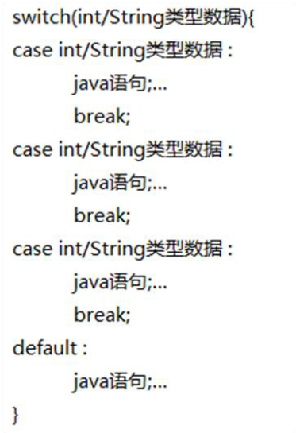

switch的运行原理：

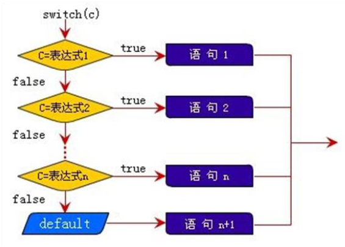

**switch语句的注意事项：**

1. switch语句后面的小括号“()”当中都可以出现什么，在JDK1.6之前（包括1.6在内）switch只能探测int类型的数据，但是在JDK1.7之后（包括1.7在内），switch语句除了支持int类型之外，还支持String类型。也就是说从Java7开始switch后面小括号中可以出现字符串。

2. switch虽然只能探测int类型，但是也可以将byte,short,char类型放到小括号当中，因为这些类型会自动转换成int类型（小容量向大容量转换称为自动类型转换）。

3. switch语句当中case是可以进行合并的。

   ```java
   switch(90){
       case 100:case 90:case 80:case 70:
           System.out.println("过关了");break;
       case 60:
           System.out.println("失败了");break;
       default:
           System.out.println("出错了");
   }
   ```

4. switch语句当中当某个分支匹配成功，则开始执行此分支当中的java语句，当遇到当前分支中的“break;”语句，switch语句就结束了，但是如果当前分支中没有“break;”语句，则会发生case穿透现象，也就是说下一个分支也不再进行匹配，直接进入下一个分支执行，直到遇到“break;”为止。

   ```java
   char c = 'A';
   switch(c){
       case 'A' : 
           System.out.println(1); 
       case 'B' : 
           System.out.println(2);break;
       default : 
           System.out.println(3); 
       // 运行结果
       // 1
       // 2
   }
   ```

#### 6.1.3循环语句

在不少实际问题中有许多具有规律性的重复操作，因此在程序中就需要重复执行某些语句。

一组被重复执行的语句称之为循环体，能否继续重复，取决于循环的终止条件。

循环结构是在一定条件下反复执行某段程序的流程结构，被反复执行的程序被称为循环体。

循环语句是由循环体及循环的终止条件两部分组成的。

java中的循环语句共包括三个，分别是：for循环、while循环、do..while循环。

##### 6.1.3.1for循环

for循环的语法格式

> for(初始化表达式; 布尔表达式; 迭代表达式){
>
> ​		循环体;
>
> }

执行过程：

> 初始化表达式最先执行，并且在整个循环当中初始化表达式只执行一次。
>
> 布尔表达式结果是true或者false，true表示循环可以继续执行，false表示循环结束。
>
> 循环体当中的代码就是需要反复执行的代码。
>
> 迭代表达式一般是用来更新某个变量的值，更新操作之后可能布尔表达式的结果就不再是true了。

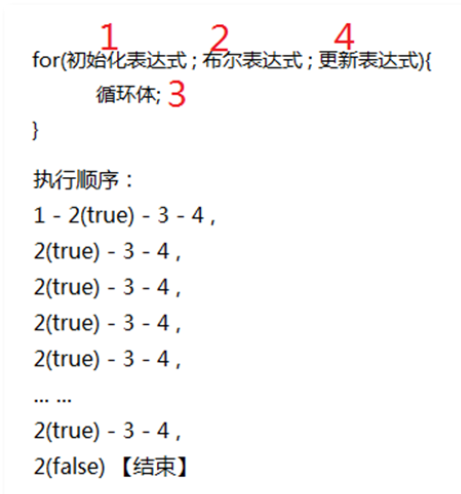

**注意：对for循环来说，这三个表达式都不是必须的，当布尔表达式缺失的时候，没有条件控制的前提下，会形成死循环。**

**注意：当在for循环中声明的变量，只在for循环中访问/有效。**

**嵌套循环**

实现9*9乘法口诀表

```java
public class DataTest {
    public static void main(String[] args) {
        for(int a = 1;a < 10; a++){
            for (int b = 1; b <= a; b++){
                System.out.print(a + "*" + b + "=" + a*b + '\t');
            }
            System.out.println();
        }
    }
}
```

##### 6.1.3.2while循环

while循环的语法结构

> while(布尔表达式){
>
> ​		循环体;
>
> }

执行过程：

> 先判断布尔表达式的结果，如果是true，则执行循环体。
>
> 循环体结束之后，再次判断布尔表达式的结果，如果是true，再执行循环体。
>
> 循环体结束之后，再判断布尔表达式的结果。
>
> 直到结果为false的时候，while循环结束。
>
> 如果第一次判断布尔表达式的结果是false，那么while循环执行次数是0次

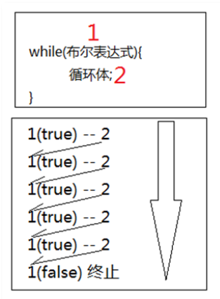

##### 6.1.3.3do...while循环

do..while循环是while循环的变形，它们的区别在于do..while循环可以保证循环体执行次数至少为1次，也就是说do..while循环的循环体执行次数是1 ~ N次，它有点儿先斩后奏的意思，而while循环的循环体执行次数为0 ~ N次。

语法格式

> do{
>
> 循环体;
>
> }while(布尔表达式);

执行过程

> 先执行循环体，然后再进行条件判断。
>
> 如果布尔表达式的值为true，则返回继续执行循环体。如果是false，则跳出循环。

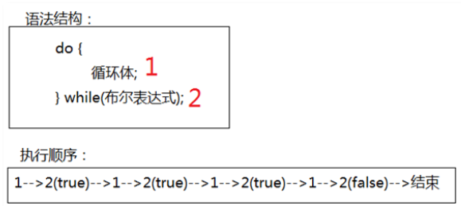

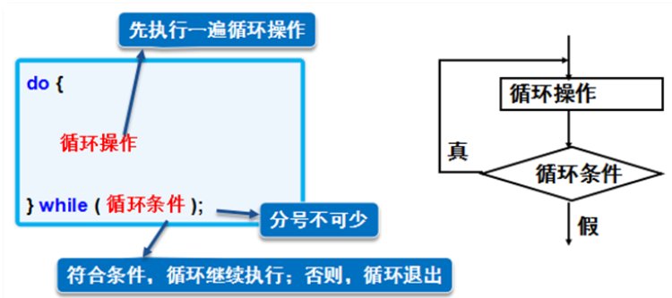

#### 6.1.4转向语句

转向语句用于实现循环执行过程中程序流程的跳转，在Java中转向语句有break和continue语句。

##### 6.1.4.1break语句

使用break这一个单词就可以在java语言中自成一条java语句，break语句的语法格式：

> break;

break语句用在哪里？

> 1. 它可以使用在switch语句当中，用来终止switch语句的执行。
> 2. break语句重点是使用在循环语句当中，用来终止/跳出循环。

```java
/*
 *从键盘不断的接收用户输入的整数，只要用户输入的数字在[0~100]之间，
 *则将输入的数字累加，一旦用户输入的整数不在[0-100]的范围，
 *则终止循环的执行，并输出计算结果。
**/
public class Test {
    public static void main(String[] args) {
        java.util.Scanner scanner = new java.util.Scanner(System.in);
        int sum = 0;
        while(true){
            System.out.print("请输入[0-100]的整数：");
            int num = scanner.nextInt();
            if(num >= 0 && num <= 100){
                sum += num; System.out.println("累加" + num + "成功！");
            }else{
                System.out.println("不在合法范围，无法累加" + num);
                break;
            }
        }
        System.out.println("最终累加结果 = " + sum);
    }
}

```

当用户输入不在0-100范围内的数字的时候break执行，并跳出循环输出最终结果。

如果break在多层嵌套循环的时候，执行break会跳出哪个循环呢？

```java
public class Test{
    public static void main(String[] args){
        for(int j = 1; j <= 2; j++){ 
            for(int i = 1; i <= 10 ; i++){ 
                if(i == 5){ 
                    break; 
                } 
                System.out.println("i = " + i); 
            } 
        }
        // 运行结果
        /*
        i = 1
        i = 2
        i = 3
        i = 4
        i = 1
        i = 2
        i = 3
        i = 4
        */
    }
}
```

通过分析，可以得知**break语句默认情况下只能终止离它“最近”的“一层”循环。**以上的break语句则终止的是内部循环，不影响外部循环的执行。

那么怎么通过break语句来终止指定循环呢？

```java
public class Test{
    public static void main(String[] args){
        first:for(int j = 1; j <= 2; j++){
            for(int i = 1; i <= 10; i++){
                if(i == 5){
                    break first;
                }
                System.out.println("i = " + i);
            }
        }
        // 运行结果
        /*
        i = 1
        i = 2
        i = 3
        i = 4
        */
    }
}
```

**通过以上程序的测试，我们可以得知当多层循环嵌套的时候，可以给每个循环设置标识，例如：first:for...、second:for...，当某个条件成立时，想终止指定循环的话，可以这样做：break first;或者break second;，这样指定的循环就结束了。**

##### 6.1.4.2continue语句

continue语句也是单个单词自成一条java语句，语法格式：

> continue;

它和break语句都是用来控制循环的，break语句是用来终止循环的执行，而continue语句则是用来终止当前本次循环，直接进入下一次循环继续执行。

```java
for(int i = 1; i <= 10; i++){ 
    if(i == 5){ 
        continue; 
    } 
    System.out.println("continue : i = " + i); 
}
// 运行结果依次输出1、2、3、4、6、7、8、9、10
```

对于以上程序，当“continue;”语句执行的时候，当前本次循环剩下的代码就不再执行了（不再执行下面的输出语句），直接执行“i++”去了，而break就不同了，当以上程序“break;”语句执行之后整个for循环就结束了。

**对于break语句有“break first;”这种写法，其实continue语句也是有这种语法机制的，记住即可。**

## 七、方法

方法其实就是一段普通的代码片段，并且这段代码可以完成某个特定的功能，而且可以被重复的调用/使用。java中的方法又叫做method，在C语言中叫做函数。

### 7.1方法的定义以及调用

1. 方法的声明格式:

   > [修饰符列表] 返回值类型 方法名(形式参数列表){ 
   >
   > 方法体; 
   >
   > }

```java
public static int sumInt(int a , int b){ 
    int c = a + b; 
    return c; 
}
```

**一些声明方法时的规则：**

> 1. [修饰符列表]，此项是可选项，不是必须的，目前大家统一写成public static，后面的课程会详细讲解。
> 2. 返回值类型，此项可以是java语言当中任何一种数据类型，包括基本数据类型，也包括所有的引用数据类型，当然，如果一个方法执行结束之后不准备返回任何数据，则返回值类型必须写void。返回值类型例如：byte,short,int,long,float,double,boolean,char,String,void等。
> 3. 方法名，此项需要是合法的标识符，开发规范中要求方法名首字母小写，后面每个单词首字母大写，遵循驼峰命名方式，见名知意，例如：login、getUsername、findAllUser等。
> 4. 形式参数列表(int a, int b)，此项又被称为形参，其实每一个形参都是“局部变量”，形参的个数为0~N个，如果是多个参数，则采用半角“,”进行分隔，形参中起决定性作用的是参数的数据类型，参数名就是变量名，变量名是可以修改的，也就是说(int a , int b)也可以写成(int x , int y)。
> 5. 方法体，由一对儿大括号括起来，在形参的后面，这个大括号当中的是实现功能的核心代码，方法体由java语句构成，方法体当中的代码只能遵循自上而下的顺序依次逐行执行，不能跳行执行，核心代码在执行过程中如果需要外部提供数据，则通过形参进行获取。

2. 如何调用方法：

   > 当调用的方法的修饰符列表中带有static关键字时：
   >
   > 类名.方法名(实际参数列表);

```java
public class MethodTest { 
    public static void main(String[] args) { 
        MethodTest.sumInt(100, 200); 
        MethodTest.sumDouble(1.0, 2.0); 
    } 
    public static void sumInt(int x , int y){ 
        System.out.println(x + "+" + y + "=" + (x + y)); 
    } 
    public static void sumDouble(double a , double b){ 
        System.out.println(a + "+" + b + "=" + (a + b)); 
    } 
    // 运行结果
    /*
    100+200=300
    1.0+2.0=3.0
    */
}
```

**当调用的方法和主方法在同一个类中时，"类名."可以省略，但如果调用其他类中的方法时，则不能省。**

### 7.2方法的返回值

java语言中方法的返回值类型可以是任何一种数据类型，包括基本数据类型，也包括引用数据类型。

如果这个方法在执行完之后不需要返回任何数据，返回值类型必须写void关键字，不能空着不写。

**注意，如果方法指定了返回值，那在方法结束后必须返回指定类型的数据，此时用到return语句。语法格式是"return 数据;"**

**如果方法指定void，无返回值的时候，则不用写return语句**


**使用return语句的一些特殊情况**

请分析以下代码：

```java
public static int method1(){
    return 1;
    System.out.println("hello world!"); 
    // 运行出错：“System.out.println("hello world!");”这行代码是无法访问的语句。
}
```

这是因为方法中一旦执行了带有"return"关键字的语句，此方法就会结束，所以以上程序的这段代码是无法执行到的，所以编译报错。


请分析以下代码：

```java
public static int method1(){ 
    boolean flag = true; 
    if(flag){ 
        return 1; 
    } 
    // 运行出错：“缺少返回语句”
}
```

这是因为Java语法要求方法能够百分之百保证方法结束时返回int类型的数据，以上代码return出现在if语句中，所以return语句可能执行也有可能不执行，所以编译出错。


请分析以下代码：

```java
public static void method1(){
    return 10; 
    // 编译出错
}
public static void method2(){ 
    return; 
    // 编译通过
}
```

通过以上代码，我们可以知道，在无返回值类型的方法中，可以允许return语句的出现，在遇到return;时，方法终止执行，但是如果返回一个数据则编译无法通过。

### 7.3栈数据结构

常见的数据结构有哪些呢？

例如：栈、队列、链表、数组、树、图、堆、散列表等。

#### 7.3.1相关概念

目前我们先来学习一下栈（stack）数据结构，这是一种非常简单的数据结构。

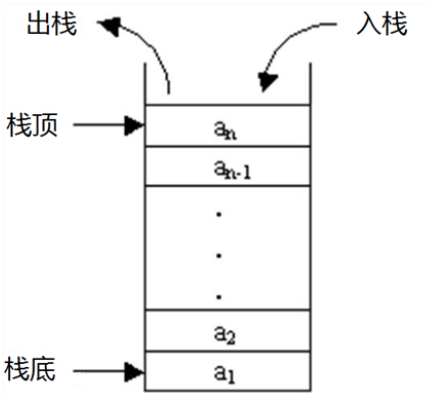

栈（stack）又名堆栈，它是一种运算受限的线性表。其限制是：仅允许在表的一端进行插入和删除运算。

这一端被称为栈顶，相对地，把另一端称为栈底。

向一个栈插入新元素又称作进栈、入栈或压栈（push），它是把新元素放到栈顶元素的上面，使之成为新的栈顶元素；

从一个栈删除元素又称作出栈、退栈或弹栈（pop），它是把栈顶元素删除掉，使其相邻的元素成为新的栈顶元素。

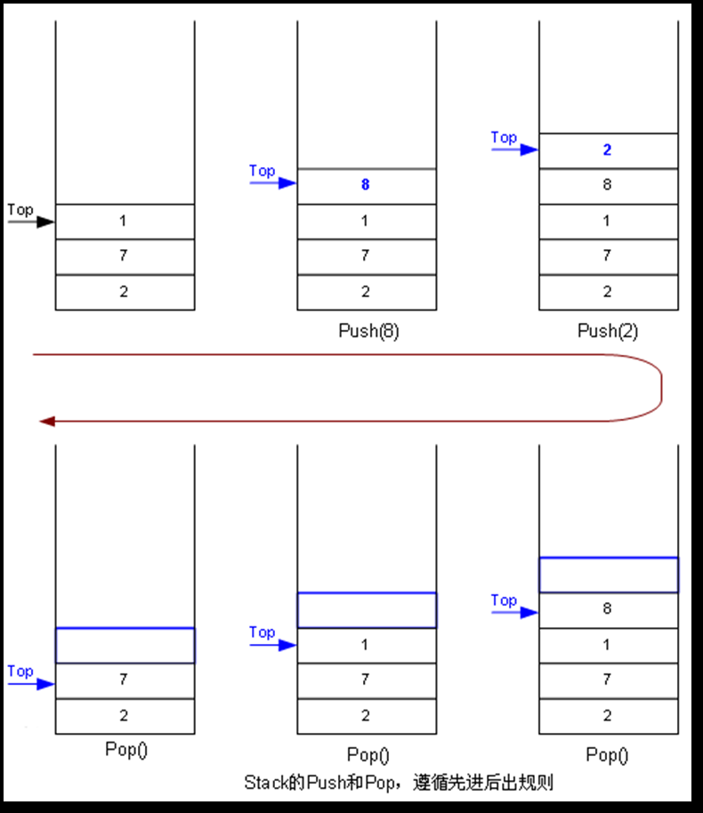

通过以上的学习，我们可以得知栈数据结构存储数据有这样的特点：先进后出，或者后进先出原则。也就是说最先进去的元素一定是最后出去，最后进去的元素一定是最先出去，因为一端是开口的，另一端是封闭的。

### 7.4方法执行过程中内存的变化

方法的执行过程中内存是如何变化的

下图表示JVM内存中的结构，目前我们只看方法区和栈。

- 方法区中存放了类的信息，或者可以理解为代码片段。

- 方法在执行过程中需要的内存空间在栈中分配。

> java程序开始执行的时候先通过类加载器子系统找到硬盘上的字节码(class)文件.
>
> 然后将其加载到java虚拟机的方法区当中，开始调用main方法。
>
> main方法被调用的瞬间，会给main方法在“栈”内存中分配所属的活动空间。
>
> 此时发生压栈动作，main方法的活动空间处于栈底。

方法只定义不去调用的话，只是把它的代码片段存储在方法区当中，java虚拟机是不会在栈内存当中给该方法分配活动空间的，只有在调用的瞬间，java虚拟机才会在“栈内存”当中给该方法分配活动空间，此时发生压栈动作，直到这个方法执行结束的时候，这个方法在栈内存中所对应的活动空间就会释放掉，此时发生弹栈动作。

由于栈的特点是先进后出，所以最先调用的方法（最先压栈）一定是最后结束的（最后弹栈）。

比如：main方法最先被调用，那么它一定是最后一个结束的。换句话说：main方法结束了，程序也就结束了。

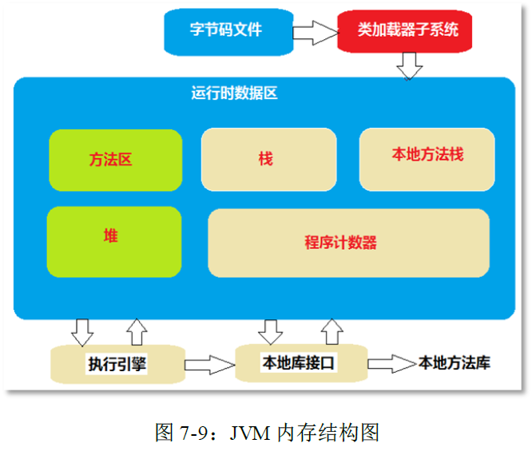

分析以下代码，画出内存图：

```java
public class MethodTest { 
    public static void main(String[] args) { 
        System.out.println("main begin");
        m1(); 
        System.out.println("main over"); 
    } 
    public static void m1() {
        System.out.println("m1 begin"); 
        m2(); 
        System.out.println("m1 over"); 
    } 
    public static void m2() { 
        System.out.println("m2 begin"); 
        System.out.println("m2 over"); 
    } 
}
```

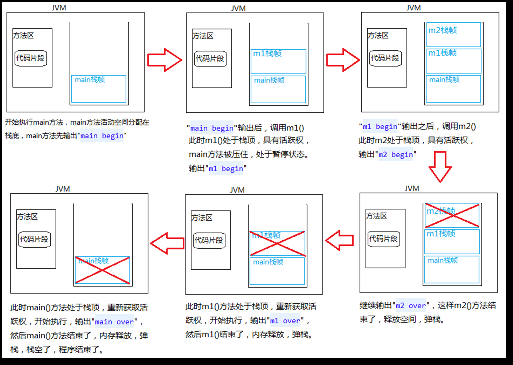

> 1. 类加载器将class文件加载到方法区。
> 2. 开始调用main方法，在栈内存中给main方法分配空间，开始执行main方法，输出”main begin”。
> 3. 调用m1()方法，在栈内存中给m1()方法分配空间，m1()方法处于栈顶，具备活跃权，输出”m1 begin”。
> 4. 调用m2()方法，在栈内存中给m2()方法分配空间，m2()方法处于栈顶，具备活跃权，输出”m2 begin”，继续输出”m2 over”。
> 5. m2()方法执行结束，内存释放，弹栈。
> 6. m1()方法这时处于栈顶，具备活跃权，输出”m1 over”。
> 7. m1()方法执行结束，内存释放，弹栈。
> 8. main()方法这时处于栈顶，具备活跃权，输出”main over”。
> 9. main()方法执行结束，内存释放，弹栈。
> 10. 栈空了，程序结束。

### 7.5方法重载/Overload

方法重载（overload）是指在一个类中定义多个同名的方法，但要求**每个方法具有不同的参数的类型或参数的个数。**

调用重载方法时，Java编译器能通过检查调用的方法的参数类型和个数选择一个恰当的方法。

方法重载通常用于创建完成一组任务相似但参数的类型或参数的个数不同的方法。

调用方法时通过传递给它们的不同个数和类型的实参来决定具体使用哪个方法。


什么时候我们考虑使用方法重载呢？

在同一个类当中，如果多个功能是相似的，可以考虑将它们的方法名定义的一致，使用方法重载机制，这样便于程序员的调用。


代码满足什么条件的时候能构成方法重载呢？

>1. 在同一个类当中。
>2. 方法名相同。
>3. 参数列表不同：个数不同算不同，顺序不同算不同，类型不同也算不同。

### 7.6方法递归

递归其实就是方法在执行的过程中调用了另一个方法，而另一个方法则是自己本身。

```java
public class RecursionTest01 {
    public static void main(String[] args) {
        m(); 
    } 
    public static void m(){ 
        System.out.println("m begin");
        m(); 
        System.out.println("m over"); 
    } 
}
```

上述代码由于在调用后一直在压栈，最终会导致栈内存溢出错误。**java.lang.StackOverflowError（栈内存溢出错误）**

所以一个递归程序有的时候存在合法有效的终止条件，但由于递归的太深，在还没有等到条件成立的时候，栈内存已经发生了溢出，这种情况也是存在的，所以实际开发中我们尽可能使用循环来代替递归算法，原则是：能不用递归尽量不用，能用循环代替的尽可能使用循环。

一个正确的递归程序应该如何写呢

```java
/*
完成1~N的求和
*/
public class RecursionTest03 {
    public static void main(String[] args) {
        int n = 5;
        int result = accumulate(n); 
        System.out.println("1到" + n + "的和是：" + result);
    } 
    public static int accumulate(int n){ 
        if(n == 1){
            return 1; 
        } 
        return n + accumulate(n - 1);
    }
}
```

内存图如下：

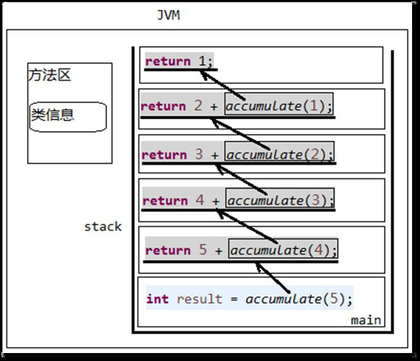


