# Java基础部分（下）


## 八、认识面向对象

### 8.1面向过程和面向对象的区别

1. “面向过程”(Procedure Oriented)是一种以过程为中心的编程思想，简称OP。就是分析出解决问题所需要的步骤，然后用函数把这些步骤一步一步实现，使用的时候一个一个依次调用就可以了。所以面向过程的编程方式关注点不在“事物”上，而是做这件事分几步，先做什么，后做什么。

   

   > 例如：早晨起来：起床、穿衣、洗漱、上班，只要按照这个步骤来，就能实现“一天”的功能，整个这个过程中关注的是一步一步怎么做，并没有关注“人”这个事物。


2. “面向对象”(Object Oriented)是一种以对象为中心的编程思想，简称OO。随着计算机技术的不断提高，计算机被用于解决越来越复杂的问题。一切事物皆对象，通过面向对象的方式，将现实世界的事物抽象成对象。通过面向对象的方法，更利于用人理解的方式对复杂系统进行分析、设计与编程。

   同时，面向对象能有效提高编程的效率，通过封装技术，可以像搭积木的一样快速开发出一个全新的系统。面向对象将对象作为程序的基本单元，将程序和数据封装其中，以提高软件的重用性、灵活性和扩展性。

   **面向对象开发的三要素：**

   1. OOA：面向对象分析（Object-Oriented Analysis）
   2. OOD：面向对象设计（Object-Oriented Design）
   3. OOP：面向对象编程（Object-Oriented Programming）


3. 两者有什么关系？

   面向过程其实是最为实际的一种思考方式，就算是面向对象的方法也是含有面向过程的思想。可以说面向过程是一种基础的方法。它考虑的是实际地实现。一般的面向过程是从上往下步步求精。面向对象主要是把事物给对象化，对象包括属性与行为。

> 我们再来设想一个场景，假如说编写一段程序，模拟一个人抽烟的场景。
>
> 1. 采用面向过程的方式：
>
>    买烟->买打火机->找能够抽烟的场合->点燃香烟->开抽
>
>    只要按照这个流程一步一步来，就可以实现抽烟场景。
>
>    
>
> 2. 采用面向对象的方式：
>
>    我们会想这个场景都有什么事物参与，每个事物应该有什么行为，然后将这些事物组合在一起，来描述这个场景。
>
>    一个会抽烟的人（对象）+香烟（对象）+打火机（对象）+允许抽烟的场所（对象），将以上4个对象组合在一起，就实现了抽烟场景，其中采用面向对象的方式开发具有很强的扩展力。
>
>    例如：人这个对象是可以更换的，打火机也是可以更换的，香烟的品牌也是可以更换的，包括抽烟的场合也是可以更换的。
>
>    
>
>    如果采用面向过程方式开发，一步依赖另一步，任何一步都不能变化，变化其中一步则整个软件都会受到影响。

​		面向过程编程耦合度很高，以至于"可维护性"比较差。软件工程追求的目标之一就是可维护性，可维护性主要表现在3个方面：可理		解性、可测试性和可修改性。面向对象的好处之一就是显著的改善了软件系统的可维护性。

### 8.2面向对象的三大特征

面向对象具有三大特征：

1. 封装（Encapsulation）
2. 继承（Inheritance）
3. 多态（Polymorphism）

### 8.3类

#### 8.3.1类和对象的概念

类是现实世界当中具有共同特征的事物进行抽象形成的模板或概念。而对象是实际存在的个体。

> 例如：
>
> “明星”是一个**类**，“刘德华”就是一个**对象**。“沈腾”、“赵本山”、“宋丹丹”都是**实际存在的对象**。
>
> 他们都属于**“笑星”类**，类描述事物的共同特征，那么“笑星”类都有哪些共同特征呢？
>
> 笑星类都有姓名、性别、年龄等状态信息（属性），他们还有一个共同的行为就是“演出”（方法）。
>
> 但当具体到某个对象上之后，我们发现姓名是不同的，性别是不同的，年龄也是不同的，演出的效果也是不同的。
>
> 所以我们在访问姓名、性别、年龄的时候，必须先有笑星对象，通过真实存在的笑星对象去访问他的属性，包括“演出”的时候，只有“笑星”类是不行的，必须先有笑星对象，让笑星对象去执行“演出”这个动作。

通过类可以创建对象，对象又被称为实例（instance），这个过程也可以称为实例化。

对象1、2、3具有共同特征，进行抽象形成了类，所以从对象到类称为抽象。

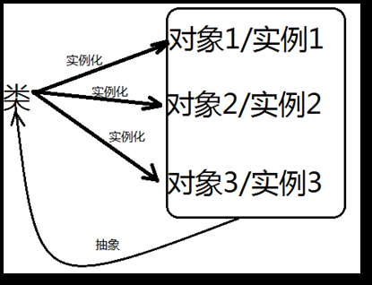

通过以上的描述，我们得知：类 = 属性 + 方法，而属性描述的是状态，方法描述的是行为动作。

**行为动作以方法的形式存在，属性以实例变量形式存在。**

#### 8.3.2类的发现和设计

**Unified Modeling Language (UML)又称统一建模语言或标准建模语言**，它是一个支持模型化和软件系统开发的图形化语言，为软件开发的所有阶段提供模型化和可视化支持，包括由需求分析到规格，到构造和配置。

UML规范用来描述建模的概念有：类、对象、关联、职责、行为、接口、用例、包、顺序、协作，以及状态。

通过UML建模工具来设计类

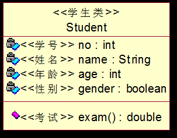

> 通过以上类图，我们可以看到一个学生有学号、姓名、年龄、性别属性，并且有一个考试的方法。其中学号采用整数型，姓名采用字符串类型，年龄采用整数型，性别采用布尔型，考试返回值类型设计为浮点型double。

#### 8.3.3类的定义

```java
[修饰符] class 类名 { 
    类体 = 属性 + 方法
}
```

```java
public class Student { 
    //学号 
    int no; 
    //姓名 
    String name; 
    //年龄 
    int age; 
    //性别 
    boolean sex; 
    //考试
    public double exam(){
        
    }
}
```


## 九、对象的创建和使用

### 9.1对象的创建

类定义之后，就可以使用类这个“模板”来创造“对象”了，一个类是可以创建多个对象！

语法是什么？其实语法格式很简单：new 类名()，这样就可以完成对象的创建了。

> new Student();

```java
public class StudentTest {
    public static void main(String[] args) {
        //创建一个学生对象 
        Student s1;
        s1 = new Student(); 
        //再创建一个学生对象 
        Student s2 = new Student(); 
    } 
}
```

> Student s1 = new Student()实际上和int i = 10是类似的.
>
> 对于int i = 10来说，int是一种基本数据类型，i是变量名，10是int类型的字面量。
>
> 那对于Student s1 = new Student()来说，其中Student是一种引用数据类型，s1是变量名，new Student()执行之后是一个Student类型的对象。

### 9.2对象的使用

创建了对象之后怎么去访问这个对象的属性呢，或者说学生对象现在有了，怎么去访问他的学号、姓名、性别、年龄等信息呢。

```java
public class StudentTest {
    public static void main(String[] args) {
        // 创建一个学生对象 
        Student s1;
        s1 = new Student(); 
        // 再创建一个学生对象 
        Student s2 = new Student(); 
        // 对象的使用
        int no1 = s1.no;
        System.out.println("学号：" + no1);
        String name1 = s1.name;
        System.out.println("姓名：" + name1);
        int age1 = s1.age; 
        System.out.println("年龄：" + age1);
        boolean sex1 = s1.sex; 
        System.out.println("性别：" + sex1);
        // 也可以这样使用
        System.out.println("学号 = " + s2.no); 
        System.out.println("姓名 = " + s2.name); 
        System.out.println("年龄 = " + s2.age); 
        System.out.println("性别 = " + s2.sex);
    } 
}
```

运行结果：

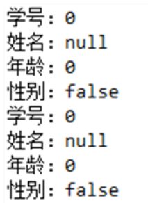

这是因为在java语言当中，当实例变量没有手动赋值，在创建对象的时候，也就是说在new的时候，系统会对实例变量默认赋值：

| 数据类型 | 默认值 |
| :------: | :----: |
|   byte   |   0    |
|  short   |   0    |
|   int    |   0    |
|   long   |   0L   |
|  float   |  0.0f  |
|  double  |  0.0   |
| boolean  | false  |
|   char   | \u0000 |
| 引用类型 |  null  |

### 9.3对象创建和使用的深层次解密

#### 9.3.1java虚拟机内存管理

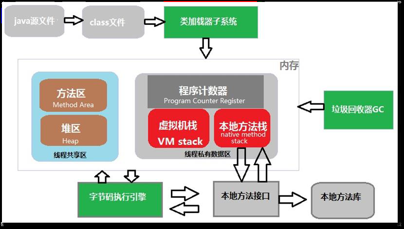

1. 程序计数器

   - 概念：可以看做当前线程所执行的字节码的行号指示器。
   - 特点：线程私有的内存

2. **java虚拟机栈（重点）：**

   - 概念：描述的是java方法执行的内存模型。

     （每个方法在执行的时候会创建一个栈帧，用于存储局部变量表，操作数栈，动态链接，方法出口等信息。每个方法从调用直至完成的过程，就对应一个栈帧从入栈到出栈的过程。）

   - 特点：线程私有，生命周期和线程相同。

     这个区域会出现两种异常：

     StackOverflowError异常：（栈溢出异常）若线程请求的深度大于虚拟机所允许的深度。

     OutOfMemoryError异常：（堆溢出异常）若虚拟机可以动态扩展，如果扩展是无法申请到足够的内存。

3. 本地方法栈：

   - 概念：它与虚拟机栈所发挥的作用是相似的，区别是java虚拟机栈为执行java方法服务，而本地方法栈是为本地方法服务。
   - 特点：线程私有，也会抛出两类异常：StackOverflowError和OutOfMemoryError。

4. **java堆（重点）：**

   - 概念：是被所有线程共享的一块区域，在虚拟机启动时创建。
   - 特点：线程共享，存放的是对象实例（所有的对象实例和数组），GC管理的主要区域。可以处于物理上不连续的内存空间。

5. **方法区（重点）：**

   - 概念：存储已被虚拟机加载的类信息、常量、静态变量，即时编译器编译后的代码等数据。
   - 特点：线程共享的区域，抛出异常OutOfMemory异常：当方法区无法满足内存分配需求的时候。

**总结：**

针对于目前来说，大家必须要知道java虚拟机有三块主要的内存空间，分别是“虚拟机栈（后面简称栈）”、“方法区”、“堆区”。

方法区存储类的信息

栈中存储方法执行时的栈帧以及局部变量

堆区中主要存储new出来的对象，以及对象内部的实例变量。

其中垃圾回收器主要针对的是堆内存，方法区中最先有数据，因为程序执行之前会先进行类加载。栈内存活动最频繁，因为方法不断的执行并结束，不断的进行压栈弹栈操作。

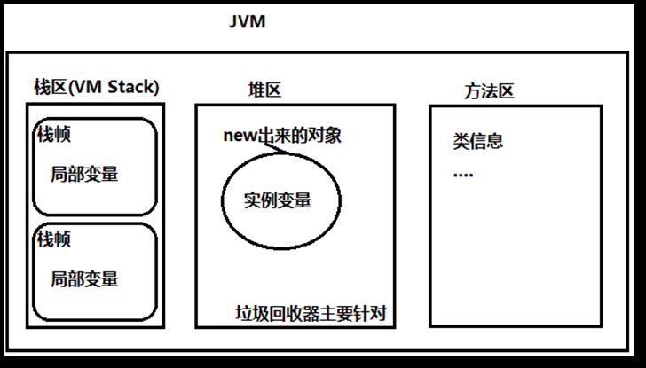

```java
public class StudentTest {
    public static void main(String[] args) { 
        int i = 10; 
        Student s1 = new Student(); 
    } 
}
```

分析上述代码的内存变化：

> 1. 第一步：类加载
>
>    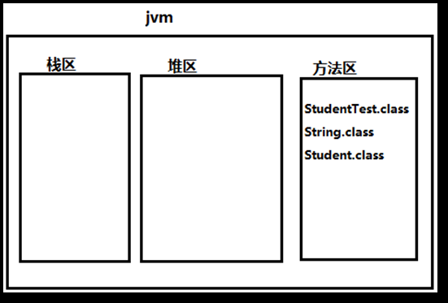
>
> 2. 第二步：main方法调用，给main方法分配栈帧（压栈）
>
>    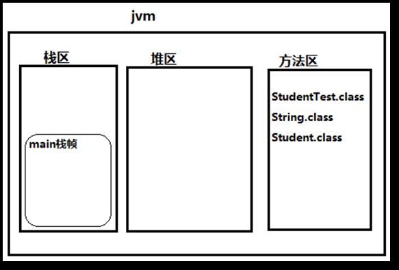
>
> 3. 第三步：执行int i = 10，局部变量
>
>    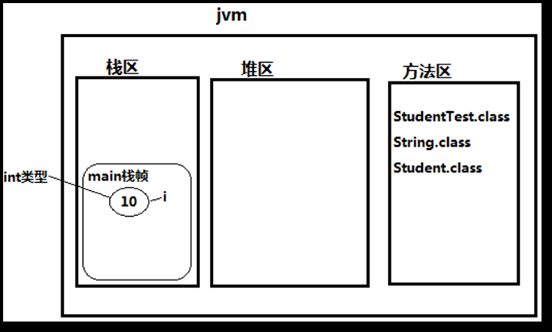
>
> 4. 第四步：第四步执行new Student()，在堆中创建对象，同时初始化实例变量
>
>    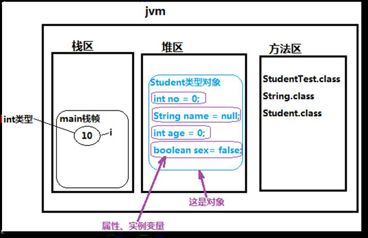
>
> 5. 第五步：堆区中学生对象的内存地址赋值给局部变量s1
>
>    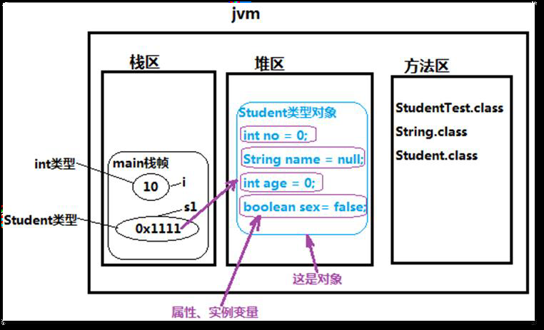
>
>    - 上图中i变量和s1变量都是局部变量，都在栈内存当中，只不过i变量是基本数据类型int，而s1变量是引用数据类型Student。
>
>      
>
>    - 上图中堆区当中的称为“对象”，该“对象”内部no、name、age、sex都是实例变量/属性，这些变量在new对象的时候初始化，如果没有手动赋值，系统会赋默认值。
>
>      
>
>    - 上图堆区中“对象”创建完成之后，该对象在堆区当中的内存地址是：0x1111，程序中的“=”将0x1111这个堆内存地址赋值给s1变量，也就是说s1变量保存了堆内存对象的内存地址，我们对于这种变量有一种特殊的称呼，叫做“引用”。也就是说对于Student s1 = new Student()代码来说，s1不是对象，是一个引用，对象实际上是在堆区当中，s1变量持有这个对象的内存地址。
>
>      
>
>    - java中没有指针的概念（指针是C语言当中的机制），所以java程序员没有权利直接操作堆内存，只能通过“引用”去访问堆内存中的对象，例如：s1.no、s1.name、s1.sex、s1.age。访问一个对象的内存，其实就是访问该对象的实例变量，而访问实例变量通常包括两种形式，要么就是读取数据，要么就是修改数据，例如：System.out.println(s1.no)这就是读取数据，s1.no = 100这就是修改数据。

#### 9.3.2构造方法Constructor

构造方法是类中特殊的方法，通过调用构造方法来完成对象的创建，以及对象属性的初始化操作。

**构造方法怎么定义，请看以下的语法格式：**

> [修饰符列表] 构造方法名(形式参数列表){
> 构造方法体;
> }

​	**注意：**

1. 构造方法名和类名一致。
2. 构造方法用来创建对象，以及完成属性初始化操作。
3. 构造方法返回值类型不需要写，写上就报错，包括void也不能写。
4. 构造方法的返回值类型实际上是当前类的类型。
5. 一个类中可以定义多个构造方法，这些构造方法构成方法重载。

**构造方法怎么调用：**

语法格式是：

> new 构造方法名(实际参数列表);

**调用无参构造方法：**

```java
/*
先定义出无参构造方法
*/
public class Date {
    int year; //年 
    int month; //月 
    int day; //日
    //构造方法(无参数构造方法) 
    public Date(){
        System.out.println("Date类无参数构造方法执行");
    } 
}
```

```java
/*
调用
*/
public class DateTest {
    public static void main(String[] args) { 
        System.out.println("main begin"); 
        new Date(); 
        System.out.println("main over"); 
    } 
    // 运行结果
    /*
    main begin
    Date类无参数构造方法执行
    main over
    */
}
```

**调用有参构造方法：**

```java
/*
先定义出有参构造方法
*/
public class Date {
    int year; //年 
    int month; //月 
    int day; //日
    //构造方法(无参数构造方法) 
    public Date(int year){
        System.out.println("Date类无参数构造方法执行");
    } 
}
```

```java
/*
调用
*/
public class DateTest {
    public static void main(String[] args) { 
        System.out.println("main begin"); 
        new Date(100);  // 需要给定参数
        System.out.println("main over"); 
    } 
    // 运行结果
    /*
    main begin
    Date类无参数构造方法执行
    main over
    */
}
```

由此得知

当一个类没有显示的定义任何构造方法的时候，系统默认提供无参数构造方法，

当显示的定义构造方法之后，系统则不再提供无参数构造方法。

无参数构造方法又叫做缺省构造器，或者默认构造方法。一般在开发中为了方便编程，建议程序员手动的将无参数构造方法写上，因为不写无参数构造方法的时候，这个默认的构造方法很有可能就不存在了。


使用构造方法对属性赋值

```java
public class Date { 
    int year; //年 
    int month; //月 
    int day; //日 
    public Date(){
    }
    public Date(int year1){ 
        year = year1; 
    } 
    public Date(int year1 , int month1){
        year = year1; 
        month = month1; 
    }
    public Date(int year1 , int month1 , int day1){ 
        year = year1; 
        month = month1; 
        day = day1; 
    } 
}
```

```java
public class DateTest { 
    public static void main(String[] args) { 
        System.out.println("main begin");
        Date time1 = new Date(); 
        System.out.println(time1.year + "年" + time1.month + "月" + time1.day + "日"); 
        Date time2 = new Date(2008); 
        System.out.println(time2.year + "年" + time2.month + "月" + time2.day + "日");
        Date time3 = new Date(2008 , 8);
        System.out.println(time3.year + "年" + time3.month + "月" + time3.day + "日"); 
        Date time4 = new Date(2008 , 8 , 8); 
        System.out.println(time4.year + "年" + time4.month + "月" + time4.day + "日"); 
        System.out.println("main over");
    }
}
```

运行结果：

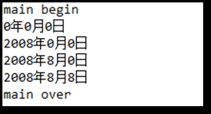


**注意：一个类当中可以定义多个构造方法，构造方法是支持重载机制的，具体调用哪个构造方法，那要看调用的时候传递的实际参数列表符合哪个构造方法了。构造方法虽然在返回值类型方面不写任何类型，但它执行结束之后实际上会返回该对象在堆内存当中的内存地址，这个时候可以定义变量接收对象的内存地址，这个变量就是之前所学的“引用”**

**注意，构造方法的参数名字问题**

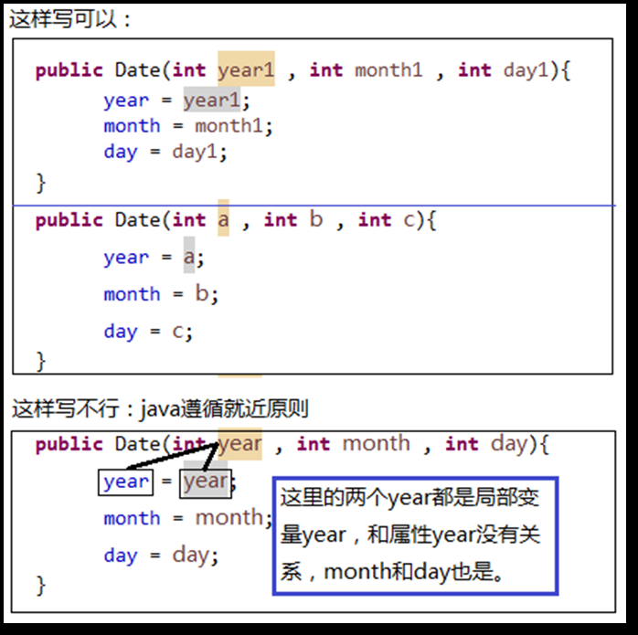

总结：

通过以上内容的学习得知，构造方法的作用是专门用来创建对象同时给属性赋值的，它的语法很简单，比普通方法还要简单，因为构造方法名和类名一致，还不需要写返回值类型，使用new就可以调用了。

在一个类当中可以同时定义多个构造方法，它们之间构成重载关系。这样就做到了在java中你想要什么就new什么，每一次new都会在堆内存中创建对象，并且对象内部的实例变量被初始化了。

一定要注意，实例变量没有手动赋值的时候系统会默认赋值，但不管是手动赋值还是系统赋默认值，都是在**构造方法执行的时候才会进行赋值操作**，类加载的时候并不会初始化实例变量的空间，那是因为实例变量是对象级别的变量，没有对象，哪来实例变量，这也是为什么实例变量不能采用“类名”去访问的原因。


#### 9.3.3空指针异常

当一个空的引用去访问实例变量会出现什么问题吗？

```java
public class Balloon { 
    //颜色 
    String color; 
    //气体 
    String gas; 
    //构造方法 
    public Balloon(){
    } 
    public Balloon(String _color , String _gas){ 
        color = _color; 
        gas = _gas; 
    }
}
```

```java
public class BalloonTest { 
    public static void main(String[] args) { 
    Balloon ball = new Balloon("红色" , "氢气"); 
    System.out.println("气球颜色是：" + ball.color);
    System.out.println("气球中的气体是：" + ball.gas);
    ball = null;
    //空指针异常 
    System.out.println("气球颜色是：" + ball.color);
    }
}
```

运行结果：

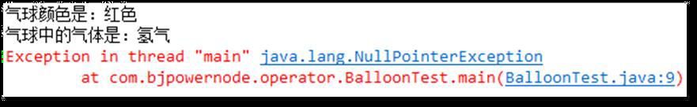

**java.lang.NullPointerException被称为空指针异常**

分析上述代码的内存图：

此时Balloon ball = new Balloon("红色" , "氢气");

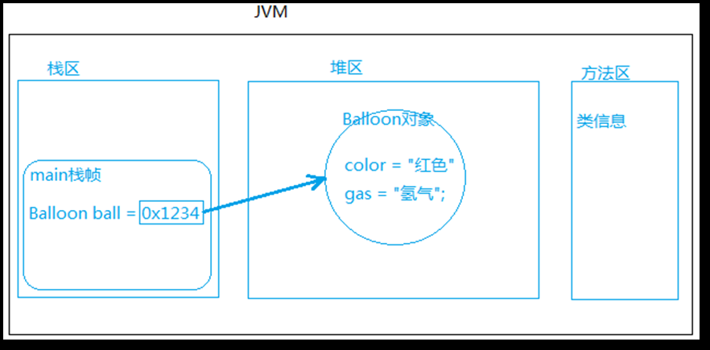

此时ball = null;

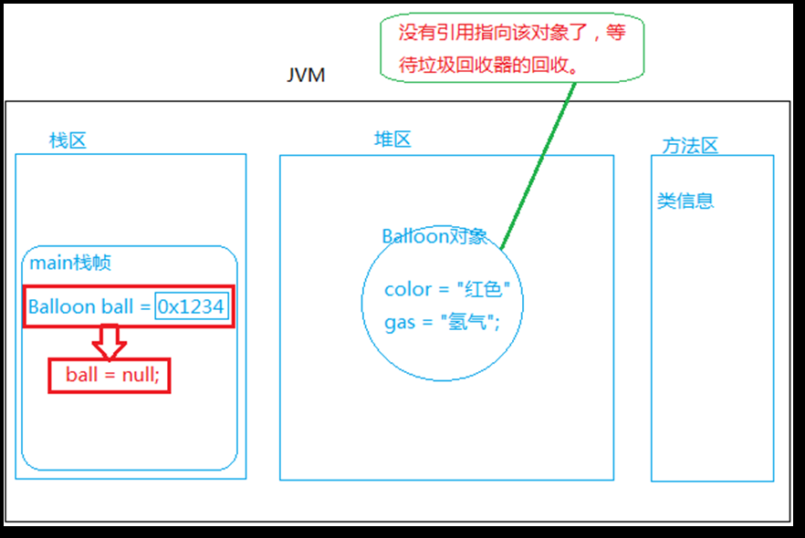

> 在Balloon类中有color属性，所以编译器允许通过ball引用去访问color属性.
>
> 例如以上代码的ball.color。但是程序在运行阶段会通过ball引用查找堆内存当中的对象，因为color是实例变量，该变量存储在java对象内部。
>
> 当ball = null执行之后表示“引用ball”不再保存java对象的内存地址，换句话说通过ball引用已经无法找到堆内存当中的java对象了，对于程序来说这个时候就没有办法正常访问了，这种情况下就会发生空指针异常。

#### 9.3.4当实例变量是一个引用时

例如在Student学生类当中有一个属性“String name;”，name变量的数据类型是String类型，String类型不属于基本数据类型的范畴，也就是说String类型属于引用数据类型，换句话说String类型应该对应一个String.class文件才对。

什么是引用：引用就是一个变量，只不过该变量中存储的是java对象的内存地址。

当属性是其他类型引用的时候，请看代码：

```java
public class Date { 
    int year;
    int month;
    int day; 
    public Date(){ 
        
    } 
    public Date(int year1 , int month1 , int day1){ 
        year = year1; 
        month = month1;
        day = day1; 
    } 
}
```

```java
public class Vip { 
    int id;
    String name; 
    Date birth; // Date类型上边定义的
    public Vip(){ 
    
    } 
    public Vip(int _id,String _name,Date _birth){
        id = _id;
        name = _name; 
        birth = _birth; 
    } 
}
```

```java
public class VipTest { 
    public static void main(String[] args) { 
        Date d = new Date(1983 , 5 , 6);
        Vip v = new Vip(123 , "jack" , d); 
        System.out.println("编号=" + v.id);
        System.out.println("姓名=" + v.name);
        System.out.println("生日=" + v.birth.year + "年" + v.birth.month + "月" + v.birth.day + "日"); 
    }
}
```

运行结果：

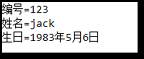

分析上述代码的内存图：

new出Date对象时Date d = new Date(1983 , 5 , 6)：

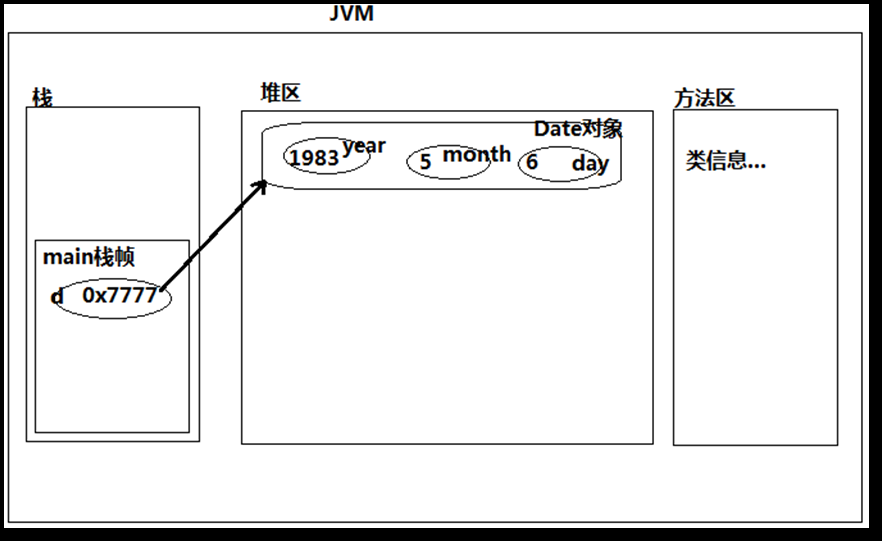

new出Vip对象时Vip v = new Vip(123 , "jack" , d)：

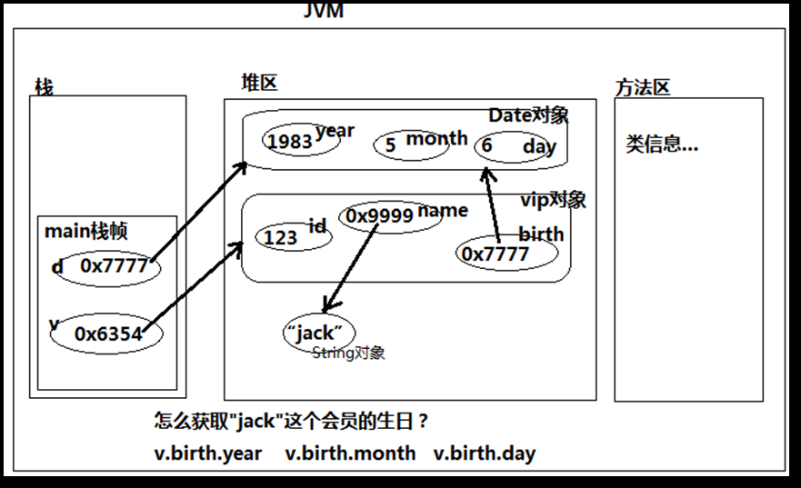

**任何“引用”当中存储一定是对象的内存地址，“引用”不一定只是以局部变量的形式存在，例如以上程序，其中Vip类当中的birth属性就是一个“引用”，它是一个实例变量。**


#### 8.3.5方法调用时参数的传递问题

```java
public class AssignmentTest { 
    public static void main(String[] args) { 
        //基本数据类型
        int a = 10; 
        int b = a; //a赋值给b，a把什么给了b？ 
        //引用数据类型 
        Bird bird1 = new Bird("polly"); 
        //bird1赋值给bird2，bird1把什么给了bird2？ 
        Bird bird2 = bird1; 
    } 
}
```

```java
class Bird { 
    String name;
    public Bird(){
        
    } 
    public Bird(String _name){ 
        name = _name;
    }
}
```

上述代码：a把什么赋值给了b，bird1把什么赋值给了bird2

其实a，b，bird1，bird2就是4个普通的变量，唯一的区别只是a和b都是基本数据类型的变量，bird1和bird2都是引用数据类型的变量。

a变量中保存的那个“值”是10，bird1变量中保存的那个“值”是0x8888（java对象内存地址）。

本质上来说10和0x8888都是“值”，只不过一个“值”是整数数字，另一个“值”是java对象的内存地址。

赋值就是把“值”赋上去。a赋值给b，本质上不是把a给了b，而是把a变量中保存的“值10”复制了一份给了b。bird1赋值给bird2本质上不是把bird1给了bird2，而是把bird1变量中保存的“值0x8888”复制了一份给了bird2。

内存图是如何变化的？

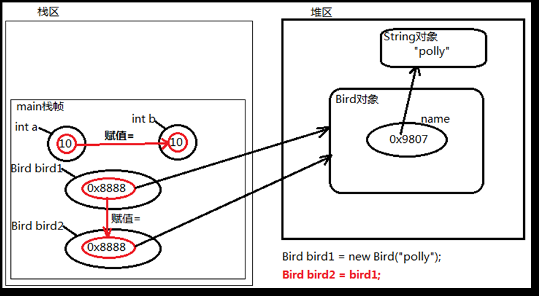

**通过内存图可以得知，基本数据类型和堆内存中的对象无关，也就是说a++，b中的值不受影响。但是引用数据类型指向了同一个内存地址，那么通过bird1.name来对其更改为"波利"后，bird2.name的值也会随之改变。**


## 十、封装

### 10.1概念

封装从字面上来理解就是包装的意思，专业点就是信息隐藏，是指利用抽象数据类型将数据和基于数据的操作封装在一起，使其构成一个不可分割的独立实体，数据被保护在抽象数据类型的内部，**尽可能地隐藏内部的细节，只保留一些对外接口使之与外部发生联系。**

**系统的其他对象只能通过包裹在数据外面的已经授权的操作来与这个封装的对象进行交流和交互。**也就是说用户是无需知道对象内部的细节，但可以通过该对象对外提供的接口来访问该对象。

> 比如“鼠标”，外部有一个壳，将内部的原件封装起来，至于鼠标内部的细节是什么，我们不需要关心，只需要知道鼠标对外提供了左键、右键、滚动滑轮这三个简单的操作。
>
> 封装之后就形成了独立实体，独立实体可以在不同的环境中重复使用，显然封装可以降低程序的耦合度，提高程序的扩展性，以及重用性或复用性，例如“鼠标”可以在A电脑上使用，也可以在B电脑上使用。

### 10.2不封装会有什么问题

```java
public class MobilePhone {
    //电压：手机正常电压在3~5V 
    double voltage; 
}
```

```java
public class MobilePhoneTest { 
    public static void main(String[] args) {
        MobilePhone phone = new MobilePhone();
        phone.voltage = 3.7; 
        System.out.println("手机电压 = " + phone.voltage);
        phone.voltage = 100; 
        System.out.println("手机电压 = " + phone.voltage); 
    } 
}
```

> 以上程序MobilePhone类未进行封装，其中的电压属性voltage对外暴露。
>
> 在外部程序当中可以对MobilePhone对象的电压voltage属性进行随意访问，导致了它的不安全。
>
> 例如手机的正常电压是3~5V，但是以上程序已经将手机电压设置为100V，这个时候显然是要出问题的，但这个程序编译以及运行仍然是正常的，没有出现任何问题，这是不对的。

### 10.3如何封装

1. 第一步：将应该隐藏的数据隐藏起来，起码在外部是无法随意访问这些数据的。

**使用private修饰符**

private修饰的数据表示私有的，私有的数据只能在本类当中访问。

```java
public class MobilePhone {
    //电压：手机正常电压在3~5V 
    private double voltage; 
}
```

```java
public class MobilePhoneTest { 
    public static void main(String[] args) {
        MobilePhone phone = new MobilePhone();
        phone.voltage = 3.7; 
        System.out.println("手机电压 = " + phone.voltage);
        phone.voltage = 100; 
        System.out.println("手机电压 = " + phone.voltage); 
    } 
}
```

运行出错：

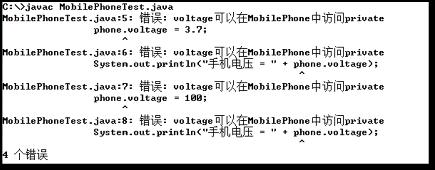

> 通过以上的测试，手机对象的电压属性确实受到了保护，在外部程序中无法访问了。但从当前情况来看，voltage属性有点儿太安全了，一个对象的属性无法被外部程序访问，自然这个数据就没有存在的价值了。

2. 第二步：对外提供公开的访问入口，让外部程序统一通过这个入口去访问数据，我们可以在这个入口处设立关卡，进行安全控制，这样对象内部的数据就安全了。

> 通常情况下我们访问对象的某个属性，不外乎读取（get）和修改（set），所以对外提供的访问入口应该有两个，这两个方法通常被称为set方法和get方法
>
> **注意：set和get方法访问的都是某个具体对象的属性，不同的对象调用get方法获取的属性值不同，所以set和get方法必须有对象的存在才能调用，这样的方法定义的时候不能使用static关键字修饰，被称为实例方法。**

```java
public class MobilePhone {
    //电压：手机正常电压在3~5V 
    private double voltage; 
    public void setVoltage(double _voltage){
        if(_voltage < 3 || _voltage > 5){ 
            //当电压低于3V或者高于5V时抛出异常，程序则终止
            throw new RuntimeException("电压非法，请爱护手机！");
        }
        //程序如果能执行到此处说明以上并没有发生异常，电压值合法 
        voltage = _voltage;
    }
    public double getVoltage(){ 
        return voltage;
    }
}
```

```java
public class MobilePhoneTest { 
    public static void main(String[] args) {
        MobilePhone phone = new MobilePhone();
        phone.setVoltage = 3.7; 
        System.out.println("手机电压 = " + phone.getVoltage);
        phone.setVoltage = 100; 
        System.out.println("手机电压 = " + phone.getVoltage); 
    } 
}
```

运行结果：

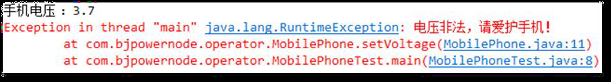

> 通过以上程序，可以看出MobilePhone的voltage属性不能在外部程序中随意访问了，只能调用MobilePhone的setVoltage()方法来修改电压，调用getVoltage()方法来读取电压，在setVoltage()方法中编写了安全控制代码，当电压低于3V，或者高于5V的时候，程序抛出了异常，不允许修改电压值，程序结束了。只有合法的时候，才允许程序修改电压值。

**总结：**

需要被保护的属性使用private进行修饰。

给这个私有的属性对外提供公开的set和get方法，其中set方法用来修改属性的值，get方法用来读取属性的值。

并且set和get方法在命名上也是有规范的，规范中要求set方法名是set + 属性名（属性名首字母大写），get方法名是get + 属性名（属性名首字母大写）。

其中set方法有一个参数，用来给属性赋值，set方法没有返回值，一般在set方法内部编写安全控制程序，因为毕竟set方法是修改内部数据的，而get方法不需要参数，返回值类型是该属性所属类型


## 十一、this和static关键字

### 11.1this关键字

this可以看做一个变量，它是一个引用，存储在Java虚拟机堆内存的对象内部，this这个引用保存了当前对象的内存地址指向自身，任何一个堆内存的java对象都有一个this，也就是说创建100个java对象则分别对应100个this。

```java
public class Customer { 
    private String name;
    public Customer(){ 
    } 
    public Customer(String _name){
        name = _name; 
    } 
    public void setName(String _name){
        name = _name; 
    } 
    public String getName(){ 
        return name; 
    } 
}
```

```java
public class CustomerTest {
    public static void main(String[] args) {
        Customer jack = new Customer("jack"); 
        Customer rose = new Customer("rose");
    } 
}
```

内存图：

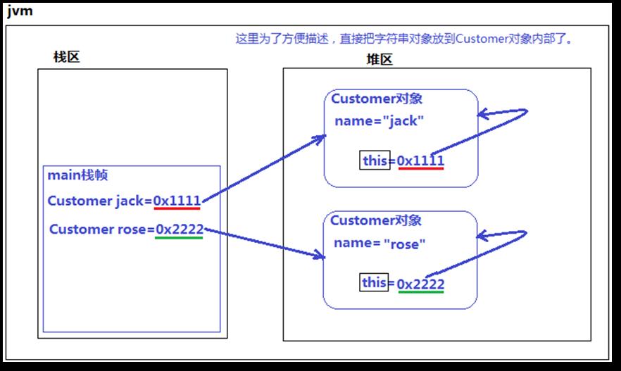

通过内存图可以得出，对象.引用等同于this.引用，也就是说jack.name和this.name是一样的

this指向“当前对象”，也可以说this代表“当前对象”，this可以使用在实例方法中以及构造方法中，语法格式分别为“this.”和“this(..)”。this不能出现在带有static的方法当中。

为什么不能出现在static方法中？

> 首先static的方法，在调用的时候是不需要创建对象的，直接采用“类名”的方式调用。
>
> 也就是说static方法执行的过程中是不需要“当前对象”参与的。
>
> 所以static的方法中不能使用this，因为this代表的就是“当前对象”。

**this可以出现在实例方法当中，因为实例方法在执行的时候一定是对象去触发的，实例方法一定是对象才能去调用的，而this恰巧又代表“当前对象”，所以“谁”去调用这个实例方法this就是“谁”。**

```java
public class Customer { 
    private String name;
    public Customer(){
    } 
    public Customer(String _name){
        name = _name;
    }
    public void setName(String _name){
        name = _name;
    }
    public String getName(){ 
        return name;
    }
    public void shopping(){ 
        System.out.println(name + " is shopping!"); 
        System.out.println(this.name + " is shopping!");
    }
}
```

```java
public class CustomerTest {
    public static void main(String[] args) {
        Customer jack = new Customer("jack");
        jack.shopping();
    }
    // 运行结果
    // jack is shopping!
    // jack is shopping!
}
```

通过以上的测试我们得知：System.out.println(name + " is shopping!")和System.out.println(this.name + " is shopping!")是等效的。也就是说在shopping()这个“实例方法”当中直接访问“实例变量”name就表示访问当前对象的name。换句话说**在实例方法中可以直接访问当前对象的实例变量，而“this.”是可以省略的。**


**那么在什么时候"this."不能省略呢**

```java
public class Customer { 
    private String name;
    public Customer(){
    } 
    public Customer(String name){ 
        this.name = name;//这里的“this.”不能省略 
    }
    public void setName(String name){
        this.name = name;//这里的“this.”不能省略
    } 
    public String getName(){ 
        return name; //这里的“this.”可以省略 
    } 
    public void shopping(){ 
        //这里的“this.”可以省略 
        System.out.println(name + " is shopping!");
    } 
}
```

以上代码当中this.name = name，其中this.name表示实例变量name，等号右边的name是局部变量name，此时如果省略“this.”，则变成name = name，这两个name都是局部变量（java遵守就近原则），和实例变量name无关了，显然是不可以省略“this.”的。

**总结：**

1. this不能出现在static的方法中。
2. 可以出现在实例方法中，代表当前对象。
3. 大部分情况下this都是可以省略的，只有当在实例方法中区分局部变量和实例变量的时候不能省略。

this的扩展

```java
public class ThisTest {
    int i = 10; 
    public static void main(String[] args) {
        System.out.println(i); 
    } 
}
```

运行出错：

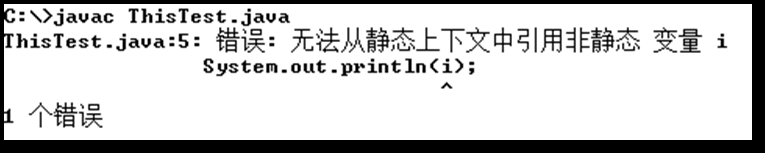

这是变量i是实例变量，访问实例变量需要创建对象，然后通过"引用."来访问，而main方法是static方法，main方法是通过类名来调用的，在main方法中没有当前对象的概念，所以在main方法中不能用this，所以报错了。

对代码做出修改：

```java
public class ThisTest { 
    int i = 10;
    public static void main(String[] args) {
        //这肯定是不行的，因为main方法带有static，不能用this 
        //System.out.println(this.i); 
        //可以自己创建一个对象 
        ThisTest tt = new ThisTest(); 
        //通过引用访问 System.out.println(tt.i); 
    }
}
```

同理，在main方法中也不能直接调用实例方法，同样需要创建对象，然后通过"引用."来调用。


**this在构造方法中使用**

this还有另外一种用法，使用在构造方法第一行（只能出现在第一行，这是规定，记住就行），通过当前构造方法调用本类当中其它的构造方法，其目的是为了代码复用。

调用时的语法格式是：

> this(实际参数列表);

```java
public class Date { 
    private int year;
    private int month;
    private int day;
    //业务要求，默认创建的日期为1970年1月1日
    public Date(){
        this.year = 1970;
        this.month = 1;
        this.day = 1;
    }
    public Date(int year,int month,int day){ 
        this.year = year;
        this.month = month;
        this.day = day;
    }
    public int getYear() {
        return year;
    } 
    public void setYear(int year) {
        this.year = year;
    }
    public int getMonth() {
        return month;
    }
    public void setMonth(int month) {
        this.month = month;
    }
    public int getDay() {
        return day;
    }
    public void setDay(int day) { 
        this.day = day;
    }
}
```

```java
public class DateTest { 
    public static void main(String[] args) {
        Date d1 = new Date(); 
        System.out.println(d1.getYear() + "年" + d1.getMonth() + "月" + d1.getDay() + "日"); 
        Date d2 = new Date(2008 , 8, 8);
        System.out.println(d2.getYear() + "年" + d2.getMonth() + "月" + d2.getDay() + "日"); 
    } 
}
```

运行结果：

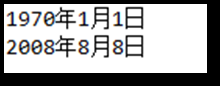

以上代码的问题：

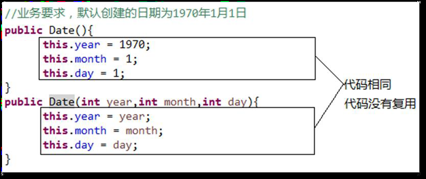

这个时候我们可以使用this关键字来调用有参数的构造方法，使代码得到复用：

```java
public class Date { 
    private int year;
    private int month;
    private int day;
    //业务要求，默认创建的日期为1970年1月1日
    public Date(){
		this(1970,1,1);
    }
    public Date(int year,int month,int day){ 
        this.year = year;
        this.month = month;
        this.day = day;
    }
    public int getYear() {
        return year;
    } 
    public void setYear(int year) {
        this.year = year;
    }
    public int getMonth() {
        return month;
    }
    public void setMonth(int month) {
        this.month = month;
    }
    public int getDay() {
        return day;
    }
    public void setDay(int day) { 
        this.day = day;
    }
}
```

**注意，this()语法必须出现在构造方法的第一行**

### 11.2static关键字

static是java语言中的关键字，表示“静态的”，它可以用来修饰变量、方法、代码块等，修饰的变量叫做静态变量，修饰的方法叫做静态方法，修饰的代码块叫做静态代码块。

在java语言中凡是用static修饰的都是类相关的，不需要创建对象，直接通过“类名”即可访问，即使使用“引用”去访问，在运行的时候也和堆内存当中的对象无关。

#### 11.2.1静态变量

java中的变量包括：局部变量和成员变量。

在方法体中声明的变量为局部变量。

> 有效范围很小，只能在方法体中访问，方法结束之后局部变量内存就释放了，在内存方面局部变量存储在栈当中。

在类体中定义的变量为成员变量，而成员变量又包括实例变量和静态变量。

当成员变量声明时使用了static关键字，那么这种变量称为静态变量，没有使用static关键字称为实例变量。

> 实例变量是对象级别的，每个对象的实例变量值可能不同，所以实例变量必须先创建对象，通过“引用”去访问。
>
> 静态变量访问时不需要创建对象，直接通过“类名”访问。
>
> 实例变量存储在堆内存当中，静态变量存储在方法区当中。
>
> 实例变量在构造方法执行过程中初始化，静态变量在类加载时初始化。

**什么时候把变量定义成静态变量？**

当一个类的所有对象的某个“属性值”不会随着对象的改变而变化的时候，建议将该属性定义为静态属性

```java
public class Man { 
    //身份证号 
    int idCard;
    //性别（所有男人的性别都是“男”） 
    //true表示男，false表示女 
    static boolean sex = true;
    public Man(int idCard){
        this.idCard = idCard;
    } 
    //静态方法 
    public static void printInfo(){ 
        System.out.println("-----" + (Man.sex ? "男" : "女") + "------");
    }
}
```

```java
public class ManTest {
    public static void main(String[] args) {
        //静态变量比较正式的访问方式 
        System.out.println("性别 = " + Man.sex);
        //创建对象 
        Man jack = new Man(100);
        //使用“引用”来访问静态变量可以吗？
        System.out.println("性别 = " + jack.sex);
        //对象被垃圾回收器回收了 
        jack = null; 
        //使用“引用”还可以访问吗？
        System.out.println("性别 = " + jack.sex);
        //静态方法比较正式的访问方式 
        Man.printInfo(); 
        //访问静态方法可以使用引用吗？并且空的引用可以吗？ 
        jack.printInfo(); 
    }
}
```

运行结果：

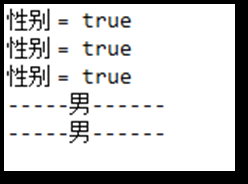

>通过以上代码测试得知：
>
>静态变量和静态方法比较正式的方式是直接采用“类名”访问，但实际上使用“引用”也可以访问，并且空引用访问静态变量和静态方法并不会出现空指针异常。
>
>**实际上，在开发中并不建议使用“引用”去访问静态相关的成员，因为这样会让程序员困惑，因为采用“引用”方式访问的时候，程序员会认为你访问的是实例相关的成员。**
>
>总之，所有实例相关的，包括实例变量和实例方法，必须先创建对象，然后通过“引用”的方式去访问，如果空引用访问实例相关的成员，必然会出现空指针异常。所有静态相关的，包括静态变量和静态方法，直接使用“类名”去访问。
>
>虽然静态相关的成员也能使用“引用”去访问，但这种方式并不被主张。

#### 11.2.2静态代码块

**静态代码块在类加载时执行，并且只执行一次。静态代码块在构造方法前执行。**

语法格式：

```java
类{ 
	//静态代码块 
	static{ 
	java语句; 
	} 
}
```

测试一下

```java
public class StaticTest01 { 
    //静态代码块 
    static{ 
        System.out.println(2);
    } 
    //静态代码块
    static{ 
        System.out.println(1); 
    } 
    //main方法
    public static void main(String[] args) { 
        System.out.println("main execute!"); 
    } 
    //静态代码块 
    static{ 
        System.out.println(0); 
    }
}
```

运行结果：

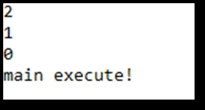

可以看出，在一个类中可以编写多个静态代码块，并且静态代码块的执行顺序是由上到下依次执行，另外静态代码块中的代码在main方法执行之前执行，这是因为静态代码块在类加载时执行，并且只执行了一次。

```java
public class StaticTest02 { 
    int i = 100;
    static{ 
        System.out.println(i); 
    } 
}
```

运行出错：

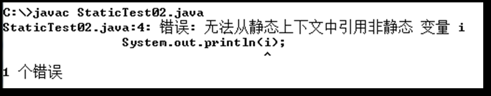

这是因为i是实例变量，需要创建对象才能访问，而静态代码块在类加载时执行，这个时候对象还未创建，所以无法访问。

可以将i变成静态变量，这样可以直接访问。

#### 11.2.3静态方法

方法实际上描述的是行为动作

从设计思想角度出发，我认为当某个动作在触发的时候需要对象的参与，这个方法应该定义为实例方法。

从代码的角度出发，当方法体中需要直接访问当前对象的实例变量或者实例方法的时候，该方法必须定义为实例方法。

在实际的开发中，“工具类”当中的方法一般定义为静态方法，因为工具类就是为了方便大家的使用，将方法定义为静态方法，比较方便调用，不需要创建对象，直接使用类名就可以访问。

### 11.2.4单例设计模式

在类外使用多个对象访问同一个实例

```java
public class Singleton {

	private static Singleton singleton = new Singleton();
	
	private Singleton() {
		// TODO Auto-generated constructor stub
	}
	public static Singleton getInstance() {
		return singleton;
	}
}

public class TestSingleton {

	public static void main(String[] args) {
		// TODO Auto-generated method stub
		Singleton s1 = Singleton.getInstance();
		Singleton s2 = Singleton.getInstance();
		System.out.println(s1);
		System.out.println(s2);
	}
}
```

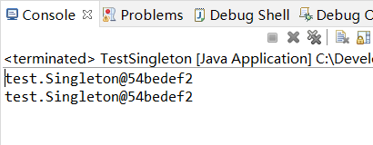


## 十二、继承

### 12.1概念

继承是面向对象三大特征之一，封装居首位，封装之后形成了独立体，独立体A和独立体B之间可能存在继承关系。

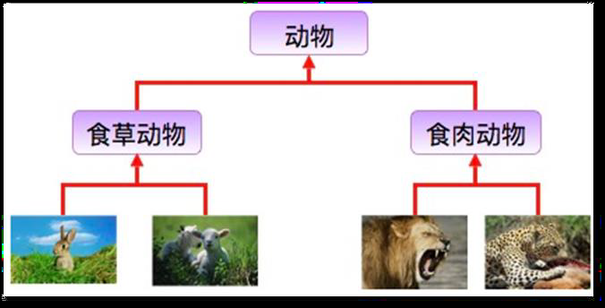

**继承时子类继承父类的特征和行为，使得子类对象（实例）具有父类的属性，或子类从父类继承方法，使得子类具有与父类相同的行为。**

继承需要符合的关系是：is-a（Bird is-a Animal），父类更通用，子类更具体。

### 12.2如何使用继承机制

语法格式：

```java
class 类名 extends 父类名{
    类体; 
}
```

例如：

```java
public class Account { 
    //银行账户类 
    //账号
    private String actno; 
    //余额 
    private double balance; 
    //账号和余额的set和get方法 
    public String getActno() { 
        return actno;
    }
    public void setActno(String actno) { 
        this.actno = actno; 
    }
    public double getBalance() { 
        return balance; 
    } 
    public void setBalance(double balance) { 
        this.balance = balance; 
    } 
}
```

```java
public class CreditAccount extends Account{ 
    //信用账户类
    //信誉度（特有属性）
    private double credit;
    //信誉度的set和get方法 
    public double getCredit() { 
        return credit; 
    } 
    public void setCredit(double credit) {
        this.credit = credit;
    } 
}
```

**继承可以解决代码臃肿的问题。换句话说，继承解决了代码复用的问题（代码复用就是代码的重复利用），这是继承机制最基本的作用。**


### 12.3继承的相关特性（重要）

1. B类继承A类，则称A类为超类(superclass)、父类、基类，B类则称为子类(subclass)、派生类、扩展类。
2. java中的继承只支持单继承，不支持多继承，C++中支持多继承，这也是java体现简单性的一点，换句话说，java中不允许这样写代码：class B extends A,C{ }。
3. 虽然java中不支持多继承，但有的时候会产生间接继承的效果，例如：class C extends B，class B extends A，也就是说，C直接继承B，其实C还间接继承A。
4. java中规定，子类继承父类，除构造方法和被private修饰的数据不能继承外，剩下都可以继承。
5. java中的类没有显示的继承任何类，则默认继承Object类，Object类是java语言提供的根类（老祖宗类），也就是说，一个对象与生俱来就有Object类型中所有的特征。
6. 继承也存在一些缺点，例如：CreditAccount类继承Account类会导致它们之间的耦合度非常高，Account类发生改变之后会马上影响到CreditAccount类。

### 12.4对继承自Object类的方法的测试

先看一下Object类中的方法：

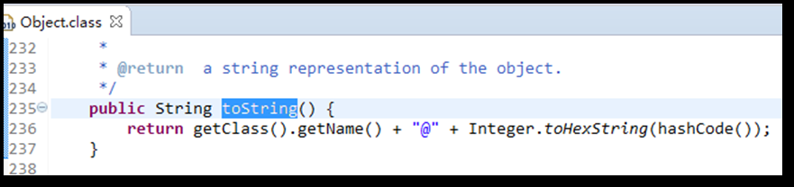

调用这个方法：

```java
public class ExtendsTest{ 
    public static void main(String[] args) { 
        ExtendsTest et = new ExtendsTest();
        String s = et.toString(); 
        System.out.println(s); 
    } 
}
```

运行结果：


由此可知，方法确实被继承过来了。


## 十三、方法覆盖和多态

### 13.1方法覆盖

#### 13.1.1什么时候需要方法覆盖

例如有一个父类是人类，它有一个方法是打招呼speakHi();

然后用两个子类（中国人类和美国人类）来继承这个父类

中国人类希望调用方法输出"你好，我叫张三，很高兴见到你"

美国人类希望调用方法输出"Hi,My name is jackson,Nice to meet you"

此时就需要使用方法覆盖机制了。

#### 13.1.2怎么进行方法覆盖

针对上述问题，请看以下代码：

```java
public class People {
    private String name; 
    public String getName() {
        return name; 
    } 
    public void setName(String name) { 
        this.name = name; 
    } 
    public void speakHi(){ 
        System.out.println(this.name + "和别人打招呼!"); 
    } 
}
```

```java
public class ChinaPeople extends People { 
    public void speakHi(){
        System.out.println("你好，我叫"+this.getName()+"，很高兴认识你！"); 
    } 
}
```

```java
public class AmericaPeople extends People {
    public void speakHi(){
        System.out.println("Hi,My name is "+this.getName()+",Nice to meet you!"); 
    } 
}
```

```java
public class PeopleTest { 
    public static void main(String[] args) { 
        ChinaPeople cp = new ChinaPeople(); 
        cp.setName("张三"); 
        cp.speakHi(); 
        AmericaPeople ap = new AmericaPeople(); 
        ap.setName("jackson"); 
        ap.speakHi(); 
    } 
}
```

运行结果：


> 以上程序中ChinaPeople和AmericaPeople将从People类中继承过来的speakHi()方法进行了覆盖，我们也看到了当speakHi()方法发生覆盖之后，子类对象会调用覆盖之后的方法，不会再去调用之前从父类中继承过来的方法。

#### 13.1.3方法覆盖的条件及注意事项（重要）

1. **条件：**
   1. 方法覆盖发生在具有继承关系的父子类之间，这是首要条件。
   2. 覆盖之后的方法与原方法具有相同的返回值类型、相同的方法名、相同的形式参数列表。
2. **注意事项：**
   1. 由于覆盖之后的方法与原方法一模一样，建议在开发的时候采用复制粘贴的方式，不建议手写，因为手写的时候非常容易出错。
   2. 私有的方法不能被继承，所以不能被覆盖。
   3. 构造方法不能被继承，所以也不能被覆盖。
   4. 覆盖之后的方法不能比原方法拥有更低的访问权限，可以更高。
   5. 覆盖之后的方法不能比原方法抛出更多的异常，可以相同或更少。
   6. 方法覆盖只是和方法有关，和属性无关。
   7. 静态方法不存在覆盖（不是静态方法不能覆盖，是静态方法覆盖意义不大，学习了多态机制之后就明白了）

### 13.2多态

多态（Polymorphism）属于面向对象三大特征之一，它的前提是封装形成独立体，独立体之间存在继承关系，从而产生多态机制。多态是同一个行为具有多个不同表现形式或形态的能力。

**多态就是“同一个行为”发生在“不同的对象上”会产生不同的效果。**

**在java中允许这样的两种语法出现，一种是向上转型（Upcasting），一种是向下转型（Downcasting），向上转型是指子类型转换为父类型，又被称为自动类型转换，向下转型是指父类型转换为子类型，又被称为强制类型转换。**

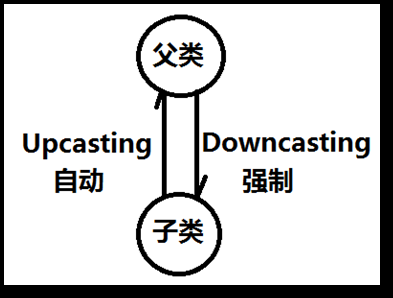

**在Java中有这样一条规定，无论是向上转型还是向下转型，两者之间必须要有继承关系，没有继承关系的情况会编译报错。**

```java
public class Animal {
    public void move(){ 
        System.out.println("Animal move!"); 
    } 
}
```

```java
public class Cat extends Animal{ 
    //方法覆盖
    public void move(){ 
        System.out.println("走猫步！"); 
    } 
    //子类特有 
    public void catchMouse(){ 
        System.out.println("抓老鼠！"); 
    } 
}
```

```java
public class Bird extends Animal{ 
    //方法覆盖
    public void move(){ 
        System.out.println("鸟儿在飞翔！");
    } 
    //子类特有 
    public void sing(){ 
        System.out.println("鸟儿在歌唱！");
    }
}
```

```java
public class Test01 { 
    public static void main(String[] args) { 
        //创建Animal对象
        Animal a = new Animal();
        a.move(); 
        //创建Cat对象 
        Cat c = new Cat(); 
        c.move(); 
        //创建鸟儿对象 
        Bird b = new Bird(); 
        b.move();
    } 
}
```

运行结果：

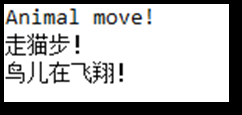

在Java中还允许这样写：

```java
public class Test02 { 
    public static void main(String[] args) { 
        Animal a1 = new Cat();
        a1.move();
        Animal a2 = new Bird(); 
        a2.move(); 
    }
}
```

运行结果：


这段程序演示的就是多态，多态就是“同一个行为（move）”作用在“不同的对象上”会有不同的表现结果。java中之所以有多态机制，是因为java允许一个父类型的引用指向一个子类型的对象。

**也就是说允许这种写法：Animal a2 = new Bird()，因为Bird is a Animal是能够说通的。其中Animal a1 = new Cat()或者Animal a2 = new Bird()都是父类型引用指向了子类型对象，都属于向上转型（Upcasting），或者叫做自动类型转换。**

> 解释这段代码【Animal a1 = new Cat();a1.move();】
>
> java程序包括编译和运行两个阶段，分析java程序一定要先分析编译阶段，然后再分析运行阶段。
>
> 在编译阶段编译器只知道a1变量的数据类型是Animal，那么此时编译器会去Animal.class字节码中查找move()方法，发现Animal.class字节码中存在move()方法，然后将该move()方法绑定到a1引用上，编译通过了，这个过程我们可以理解为“静态绑定”阶段完成了。
>
> 紧接着程序开始运行，进入运行阶段，在运行的时候实际上在堆内存中new的对象是Cat类型，也就是说真正在move移动的时候，是Cat猫对象在移动，所以运行的时候就会自动执行Cat类当中的move()方法，这个过程可以称为“动态绑定”。
>
> 但无论是什么时候，必须先“静态绑定”成功之后才能进入“动态绑定”阶段。

```java
public class Test03 { 
    public static void main(String[] args) {
        Animal a = new Cat();
        a.catchMouse(); 
    }
}
```

运行出错：

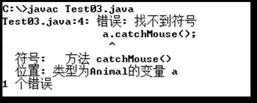

因为“Animal a = new Cat();”在编译的时候，编译器只知道a变量的数据类型是Animal，也就是说它只会去Animal.class字节码中查找catchMouse()方法，结果没找到，自然“静态绑定”就失败了，编译没有通过。就像以上描述的错误信息一样：在类型为Animal的变量a中找不到方法catchMouse()。

对这段代码作出修改：

```java
public class Test04 { 
    public static void main(String[] args) { 
        //向上转型 
        Animal a = new Cat(); 
        //向下转型：为了调用子类对象特有的方法 
        Cat c = (Cat)a; 
        c.catchMouse(); 
    }
}
```

运行结果：


可以看到直接使用a引用是无法调用catchMouse()方法的，因为这个方法属于子类Cat中特有的行为，不是所有Animal动物都可以抓老鼠的，要想让它去抓老鼠，**就必须做向下转型（Downcasting）**，也就是使用强制类型转换将Animal类型的a引用转换成Cat类型的引用c（Cat c = (Cat)a;），使用Cat类型的c引用调用catchMouse()方法。

```java
public class Test05 { 
    public static void main(String[] args) { 
        Animal a = new Bird();
        Cat c = (Cat)a; 
    } 
}
```

运行出错：

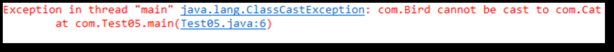

以上代码可以编译通过吗？答案是可以的，为什么呢？那是因为编译器只知道a变量是Animal类型，Animal类和Cat类之间存在继承关系，所以可以进行向下转型，语法上没有错误，所以编译通过了。但是运行的时候会出错，因为毕竟a引用指向的真实对象是一只小鸟。

**java.lang.ClassCastException类型转换异常**，这种异常通常出现在向下转型的操作当中，当类型不兼容的情况下进行转型出现的异常。

**为了避免这种异常的发生，建议在向下转型之前进行类型判断**

**insanceof运算符**，语法格式：

（引用 insanceof 类型）

instanceof运算符的运算结果是布尔类型，可能是true也可能是false

> 例如 c instanceof Cat
>
> 结果是true则表示在运行阶段c引用指向的对象是Cat类型
>
> 结果是false则表示在运行阶段c引用指向的对象不是Cat类型

有了instanceof，向下转型可以这样写：

```java
public class Test05 { 
    public static void main(String[] args) { 
        Animal a = new Bird();
        if(a instanceof Cat){
        	Cat c = (Cat)a; 
            c.catchMouce();
        }else if(a instanceof Bird){
            Bird b = (Bird)a;
            b.sing();
        }
    } 
}
```


#### 13.2.1多态在开发中的作用

在软件开发过程中，有这样的一个开发原则：**开闭原则**。

开闭原则（OCP）是面向对象设计中“可复用设计”的基石，是面向对象设计中最重要的原则之一，其它很多的设计原则都是实现开闭原则的一种手段。

OCP：“软件实体应当对扩展开放，对修改关闭”。

这句话说得略微有点专业，我们把它讲得更通俗一点，也就是：软件系统中包含的各种组件，例如模块（Modules）、类（Classes）以及功能（Functions）等等，应该在不修改现有代码的基础上，引入新功能。开闭原则中“开”，是指对于组件功能的扩展是开放的，是允许对其进行功能扩展的；开闭原则中“闭”，是指对于原有代码的修改是封闭的，即修改原有的代码对外部的使用是透明的。


## 十四、super

### 14.1概念

super和this可以对比着学：

1. this关键字

   - this是一个引用，保存内存地址指向自己。
   - this出现在实例方法中，谁调用这个实例方法，this就代表谁，this代表当前正在执行这个动作的对象。
   - this不能出现在静态方法中。
   - this大部分情况下可以省略，在方法中区分实例变量和局部变量的时候不能省略。
   - “this(实际参数列表)”出现在构造方法第一行，通过当前的构造方法去调用本类当中其它的构造方法。

2. super关键字

   - 严格来说，super其实并不是一个引用，它只是一个关键字，super代表了当前对象中从父类继承过来的那部分特征。this指向一个独立的对象，super并不是指向某个“独立”的对象。

     > 假设张大明是父亲，张小明是儿子，有这样一句话：大家都说张小明的眼睛、鼻子和父亲的很像。
     >
     > 那么也就是说儿子继承了父亲的眼睛和鼻子特征，那么眼睛和鼻子肯定最终还是长在儿子的身上。
     >
     > 假设this指向张小明，那么super就代表张小明身上的眼睛和鼻子。换句话说super其实是this的一部分。
     >
     > 如下图所示：张大明和张小明其实是两个独立的对象，两个对象内存方面没有联系，super只是代表张小明对象身上的眼睛和鼻子，因为这个是从父类中继承过来的，在内存方面使用了super关键字进行了标记，对于下图来说“this.眼睛”和“super.眼睛”都是访问的同一块内存空间。
     >
     > 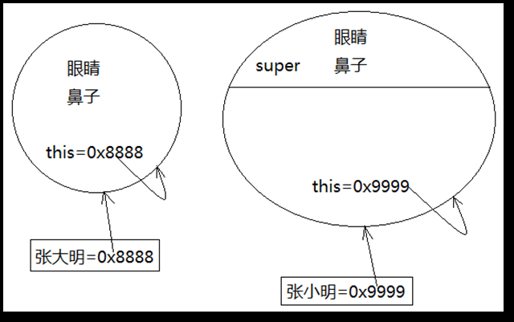

   - super和this都可以使用在实例方法当中。
   - super不能使用在静态方法当中，因为super代表了当前对象上的父类型特征，静态方法中没有this，肯定也是不能使用super的。
   - super也有这种用法：“super(实际参数列表);”，这种用法是通过当前的构造方法调用父类的构造方法。

```java
public class SuperTest01 extends Object{ 
    //实例方法 
    public void doSome(){ 
        System.out.println(this); 
        System.out.println(super);
    } 
}
```

运行出错：

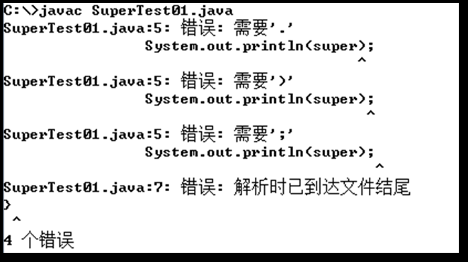

可以看出this是可以单独使用的引用，但super无法输出，编译器提示super要使用必须是“super.xxx”，显然super并不指向独立的对象，并不是保存某个对象的内存地址。

### 14.2super使用在构造方法中

**super使用在构造方法中，语法格式为：super(实际参数列表)，这行代码和“this(实际参数列表)”都是只允许出现在构造方法第一行（这一点记住就行了），所以这两行代码是无法共存的。**

“super(实际参数列表)”这种语法表示子类构造方法执行过程中调用父类的构造方法。

```java
public class People { 
    String idCard; 
    String name;
    boolean sex;
    public People(){
    }
    public People(String idCard,String name,boolean sex){
        this.idCard = idCard;
        this.name = name; 
        this.sex = sex;
    } 
}
```

```java
public class Student extends People{
    //学号是子类特有的 
    int sno;
    public Student(){
    }
    public Student(String idCard,String name,boolean sex,int sno){
        super(idCard,name,sex);
        this.sno = sno;
    }
}
```

```java
public class StudentTest { 
    public static void main(String[] args) { 
        Student s = new Student("12345x","jack",true,100);
        System.out.println("身份证号" + s.idCard);
        System.out.println("姓名" + s.name); 
        System.out.println("性别" + s.sex); 
        System.out.println("学号" + s.sno);
    }
}
```

**“super(实际参数列表);”语法表示调用父类的构造方法，代码复用性增强了。**

> 当一个构造方法第一行没有显示的调用“super(实际参数列表)”的话，系统默认调用父类的无参数构造方法“super()”。当然前提是“this(实际参数列表)”也没有显示的去调用（因为super()和this()都只能出现在构造方法第一行，所以不能并存）。

```java
public class A { 
    //有参数构造方法定义之后 
    //系统则不再提供无参数构造方法 
    public A(String s){ 
    } 
}
```

```java
public class B extends A { 
    public B(){
    }
}
```

运行出错：

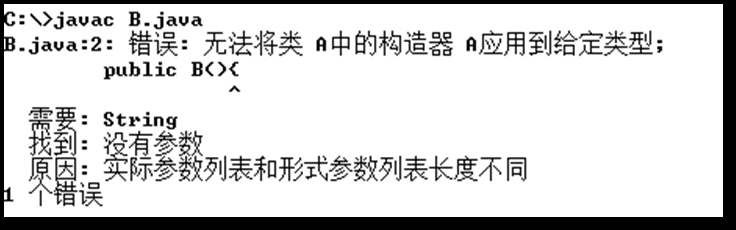

原因是B类的构造方法第一行默认会调用“super()”，而super()会调用父类A的无参数构造方法，但由于父类A中提供了有参数构造方法，导致无参数构造方法不存在，从而编译报错了。

**在实际开发中还是建议程序员将无参数构造方法显示的定义出来，这样就可以避免对象的创建失败了。**

### 14.3super使用在实例方法中

super和this都可以使用在实例方法中，并且都不能使用在静态方法当中，“this”大部分情况下都是可以省略的，只有在方法中区分局部变量和实例变量的时候不能省略。那“super”什么时候可以省略。

```java
//书 
public class Book { 
    //书名 
    String name; 
    //构造方法 
    public Book(){ 
        super();
    }
    public Book(String name){ 
        super(); 
        this.name = name; 
    } 
}
```

```java
//纸质书
public class PaperBook extends Book { 
    //构造方法
    public PaperBook(){
        super(); 
    } 
    public PaperBook(String name){
        super(); 
        this.name = name;
    }
    //打印书名 
    public void printName(){ 
        System.out.println("this.name->书名 ： " + this.name);
        System.out.println("super.name->书名 ： " + super.name); 
    } 
}
```

```java
public class BookTest {
    public static void main(String[] args) { 
        PaperBook book1 = new PaperBook("零基础学Java卷I"); 
        book1.printName(); 
    }
}
```

运行结果：

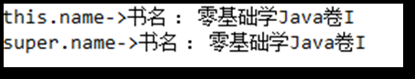

> 结果super.name和this.name的输出结果是一样的
>
> 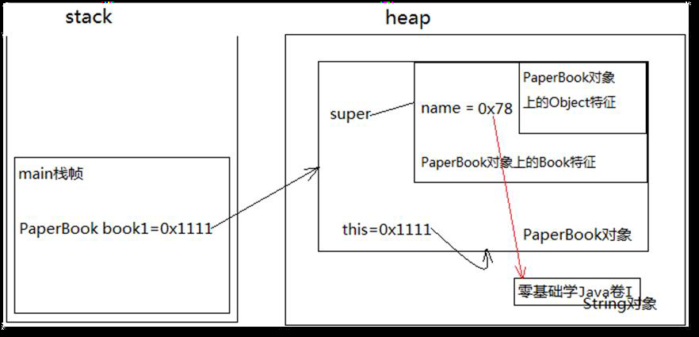
>
> 发现this.name和super.name实际上是同一块内存空间，所以它们的输出结果是完全一样的。

将上述PaperBook类修改：

```java
//纸质书
public class PaperBook extends Book { 
    String name;//在子类中也定义一个name属性
    //构造方法
    public PaperBook(){
        super(); 
    } 
    public PaperBook(String name){
        super(); 
        this.name = name;
    }
    //打印书名 
    public void printName(){ 
        System.out.println("this.name->书名 ： " + this.name);
        System.out.println("super.name->书名 ： " + super.name); 
    } 
}
```

运行结果：

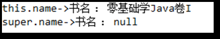

> 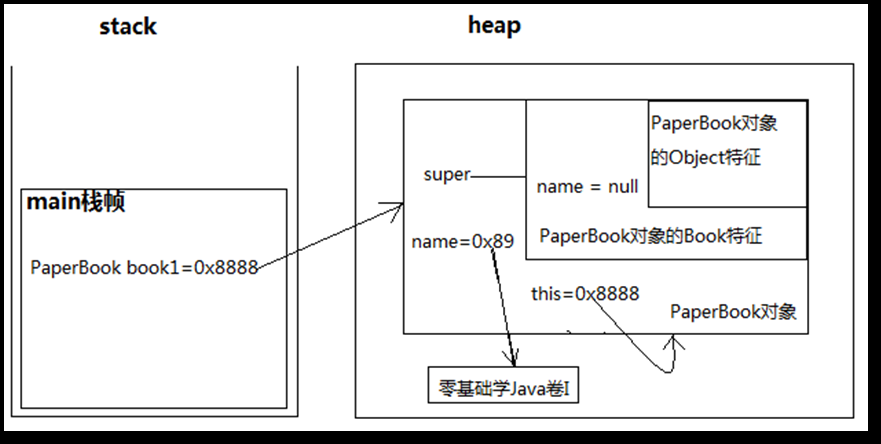
>
> 通过以上内存图可以清楚的看到，父类Book的构造方法在执行的时候给super.name赋值null，子类PaperBook的构造方法在执行的时候给this.name赋值“零基础学Java卷I”，**由于在子类PaperBook中定义了重名的变量name导致在当前对象中有两个name，一个是从父类中继承过来的，一个是自己的，如果此时想访问父类中继承过来的name则必须使用super.name，**当直接访问name或者this.name都表示访问当前对象自己的name。

**当父类中有该实例变量，子类中又重新定义了同名的实例变量，如果想在子类中访问父类的实例变量，super不能省略。**

**父类和子类中有同名实例变量或者有同名的实例方法，想在子类中访问父类中的实例变量或实例方法，则super是不能省略的，其它情况都可以省略。**