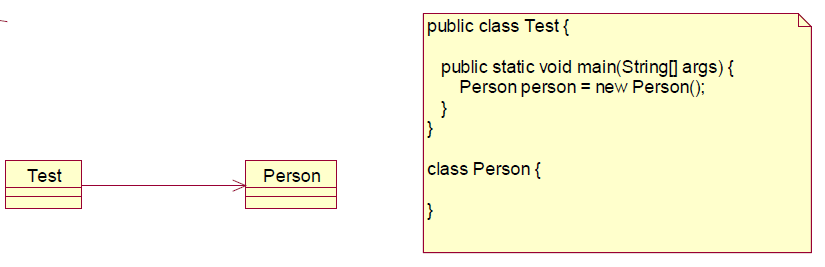
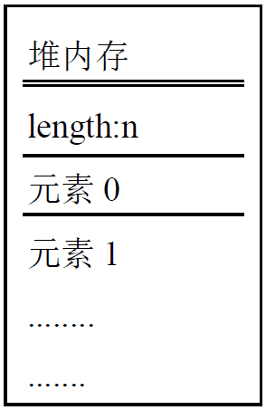
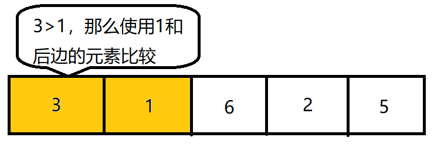

# Java进阶部分（上）

## 一、面向对象

### 1.1final关键字

final表示不可改变的含义

**final关键字的特点：**

- 采用final修饰的类不能被继承

- 采用final修饰的方法不能被覆盖

- 采用final修饰的变量不能被修改

- final修饰的变量必须显示初始化

- 如果修饰的引用，那么这个引用只能指向一个对象，也就是说这个引用不能再次赋值，但被指向的对象是可以修改的构造方法不能被final修饰

  > ```java
  > public class FinalTest05 {
  > 	public static void main(String[] args) {
  > 		Person p1 = new Person();
  > 		//可以赋值
  > 		p1.name = "张三";
  > 		System.out.println(p1.name);
  > 		final Person p2 = new Person();
  > 		p2.name = "李四";
  > 		System.out.println(p2.name);
  > 		//不能编译通过
  > 		//p2采用final修饰，主要限制了p2指向堆区中的地址不能修改(也就是p2只能指向一个对象)
  > 		//p2指向的对象的属性是可以修改的
  > 		p2 = new Person();
  > 	}
  > }
  > class Person {
  > 	String name;
  > }
  > ```

- 会影响JAVA类的初始化：final定义的静态常量调用时不会执行java的类初始化方法，也就是说不会执行static代码块等相关语句，这是由java虚拟机规定的。我们不需要了解的很深，有个概念就可以了。

### 1.2抽象类

以前示例中的Person、Student和Employee，从我们使用的角度来看主要对Student和Employee进行实例化，Person中主要包含了一些公共的属性和方法，而Person我们通常不会实例化，所以我们可以把它定义成抽象的。


**抽象类的作用：**

- 降低接口实现类对接口实现过程的难度，将接口中不需要使用的抽象方法交给抽象类进行完成，这样接口实现类只需要对接口需要方法进行重写。


**abstract关键字的特点：**

- 在java中采用abstract关键字定义的类就是抽象类，采用abstract关键字定义的方法就是抽象方法
- 抽象的方法只需在抽象类中提供声明，不需要实现
- 如果一个类中含有抽象方法，那么这个类必须定义成抽象类
- **如果这个类是抽象的，那么这个类被子类继承，抽象方法必须被重写。如果在子类中不重写该抽象方法，那么必须将此类再次声明为抽象类**
- 抽象的类是不能实例化的，就像现实世界中人其实是抽象的，张三、李四才是具体的
- **抽象类不能被final修饰**
- **抽象方法不能被final修饰**，因为抽象方法就是被子类实现的
- **抽象类中可以没有抽象方法，但是抽象方法必须在抽象类中**

> 抽象类中可以包含方法实现，可以将一些公共的代码放到抽象类中，另外在抽象类中可以定义一些抽象的方法，这样就会存在一个约束，而子类必须实现我们定义的方法，如：teacher必须实现printInfo方法，Student也必须实现printInfo方法，方法名称不能修改，必须为printInfo，这样就能实现多态的机制，有了多态的机制，我们在运行期就可以动态的调用子类的方法。所以在运行期可以灵活的互换实现。

**抽象的方法只需在抽象类中，提供声明，不需要实现，起到了一个强制的约束作用，要求子类必须实现**

```java
public class AbstractTest{
    public static void main(String[] args){
        Person p = new Student();
        p.setName("张三");
        p.printInfo();
    }
}
// 定义抽象类
abstract class Person{
    private String name;
    public void setName(String name){
        this.name = name;
    }
    public String getName(){
        return name;
    }
    // 定义抽象方法
    // 如果有一个方法为抽象的，那么此类必须为抽象的
	// 如果一个类是抽象的，并不要求具有抽象的方法	
    public abstract void printInfo();
}
// 定义Student类继承Person类
public class Student extends Person{
    // 必须实现抽象方法
    public void printInfo(){
        System.out.println("Student.printInfo()");
    }
}
```

**如果这个类是抽象的，那么这个类被子类继承，抽象方法必须被覆盖。如果在子类中不覆盖该抽象方法，那么必须将此方法再次声明为抽象方法**

```java
public class AbstractTest{
    public static void main(String[] args){
        // Student类也是抽象类，这样new会出错
        Person p = new Student();
    }
}
// 定义抽象类
abstract class Person{
    private String name;
    public void setName(String name){
        this.name = name;
    }
    public String getName(){
        return name;
    }
    // 定义抽象方法
    // 如果有一个方法为抽象的，那么此类必须为抽象的
	// 如果一个类是抽象的，并不要求具有抽象的方法	
    public abstract void printInfo();
}
// 定义抽象类Student继承抽象类Person
abstract class Student extends Person{
    // 再次声明为抽象方法
    public void printInfo();
}
```

### 1.3接口

接口我们可以看作是**抽象类的一种特殊情况**，在接口中只能**定义抽象的方法和常量。**

**接口interface关键字的特点：**

- 在java中接口采用interface声明

- 接口中的**方法默认**都是public abstract的，不能更改

- 接口中的**变量默认**都是public static final类型的，不能更改，所以必须显示的初始化

- 接口**不能被实例化**，接口中没有构造函数的概念

- 接口之间**可以继承**，但接口之间不能实现

- 接口中的方法只能通过类来实现，**通过implements关键字**

- 如果一个类实现了接口，那么接口中**所有的方法必须实现**

- 一类可以实现多个接口

  > 实现多个接口，采用逗号隔开，这样这个类就拥有了多种类型，等同于现实中的多继承，所以采用java中的接口可以实现多继承。
  >
  > ```java
  > class InterImpl implements Inter1, Inter2, Inter3 {
  >     
  > }
  > ```

**使用接口的好处：**

- 采用接口明确的声明了它所能提供的服务

- 解决了Java单继承的问题

- **实现了可接插性（重要）**

  > 例如：完成学生信息的增删改操作，系统要求适用于多个数据库，如：适用于Oracle和MySQL。
  >
  > 1. 第一种方案，不使用接口，每个数据库实现一个类
  >
  >    
  >
  >    ```java
  >    //Oracle的实现
  >    public class StudentOracleImpl {
  >    	public void add(int id, String name) {
  >    		System.out.println("StudentOracleImpl.add()");
  >    	}
  >    	public void del(int id) {
  >    		System.out.println("StudentOracleImpl.del()");
  >    	}
  >    	public void modify(int id, String name) {
  >    		System.out.println("StudentOracleImpl.modify()");
  >    	}
  >    }
  >    ```
  >
  >    需求发生变化了，客户需要将数据移植Mysql上
  >
  >    ```java
  >    //Mysql的实现
  >    public class StudentMysqlImpl {
  >    	public void addStudent(int id, String name) {
  >    		System.out.println("StudentMysqlImpl.addStudent()");
  >    	}
  >    	public void deleteStudent(int id) {
  >            System.out.println("StudentMysqlImpl.deleteStudent()");
  >    	}
  >    	public void udpateStudent(int id, String name) {
  >    		System.out.println("StudentMysqlImpl.udpateStudent()");
  >    	}
  >    }
  >    ```
  >
  >    调用以上两个类完成向Oracle数据库和Mysql数据存储数据
  >
  >    ```java
  >    public class StudentManager {
  >    	public static void main(String[] args) {
  >    	//对Oracle数据库的支持
  >    	/*
  >    	StudentOracleImpl studentOracleImpl = new StudentOracleImpl();
  >    	studentOracleImpl.add(1, "张三");
  >    	studentOracleImpl.del(1);
  >    	studentOracleImpl.modify(1, "张三");
  >    	*/
  >    	//需要支持Mysql数据库
  >    	StudentMysqlImpl studentMysqlImpl = new StudentMysqlImpl();
  >    	studentMysqlImpl.addStudent(1, "张三");
  >    	studentMysqlImpl.deleteStudent(1);
  >    	studentMysqlImpl.udpateStudent(1, "张三");
  >    	}
  >    }
  >    ```
  >
  >    以上代码不能灵活的适应需求，当需求发生改变需要改动的代码量太大，这样可能会导致代码的冗余，另外可能会导致项目的失败，为什么会导致这个问题，在开发中没有考虑到程序的扩展性，就是一味的实现，这样做程序是不行的，所以大的项目比较追求程序扩展性，有了扩展性才可以更好的适应需求。
  >
  >    
  >
  > 2. 使用接口
  >
  >    
  >
  >    ```java
  >    //Oracle的实现
  >    public class Student4OracleImpl implements IStudent {
  >    	public void add(int id, String name) {
  >    		System.out.println("Student4OracleImpl.add()");
  >    	}
  >    	public void del(int id) {
  >    		System.out.println("Student4OracleImpl.del()");
  >    	}
  >    	public void modify(int id, String name) {
  >    		System.out.println("Student4OracleImpl.modify()");
  >    	}
  >    }
  >    ```
  >
  >    ```java
  >    //MySql的实现
  >    public class Student4MysqlImpl implements IStudent {
  >    	public void add(int id, String name) {
  >    		System.out.println("Student4MysqlImpl.add()");
  >    	}
  >        public void del(int id) {
  >    		System.out.println("Student4MysqlImpl.del()");
  >    	}
  >    	public void modify(int id, String name) {
  >    		System.out.println("Student4MysqlImpl.modify()");
  >    	}
  >    }
  >    ```
  >
  >    ```java
  >    public class StudentService {
  >    	public static void main(String[] args) {
  >    		/*
  >    		IStudent istudent = new Student4OracleImpl();
  >    		IStudent istudent = new Student4MysqlImpl();
  >    		istudent.add(1, "张三");
  >    		istudent.del(1);
  >    		istudent.modify(1, "张三");
  >    		*/
  >    		//IStudent istudent = new Student4OracleImpl();
  >    		//IStudent istudent = new Student4MysqlImpl();
  >    		//doCrud(istudent);
  >    		//doCrud(new Student4OracleImpl());
  >    		//doCrud(new Student4MysqlImpl());
  >    		//doCrud(new Student4OracleImpl());
  >    		doCrud(new Student4MysqlImpl());
  >    	}
  >    //此种写法没有依赖具体的实现
  >    //而只依赖的抽象，就像你的手机电池一样：你的手机只依赖电池（电池是一个抽象的事物），
  >    //而不依赖某个厂家的电池(某个厂家的电池就是具体的事物了)
  >    //因为你依赖了抽象的事物，每个抽象的事物都有不同的实现
  >    //这样你就可以利用多态的机制完成动态绑定，进行互换，是程序具有较高的灵活
  >    //我们尽量遵循面向接口（抽象）编程,而不要面向实现编程
  >    public static void doCrud(IStudent istudent) {
  >    	istudent.add(1, "张三");
  >    	istudent.del(1);
  >    	istudent.modify(1, "张三");
  >    }
  >    //以下写法不具有扩展性
  >    //因为它依赖了具体的实现
  >    //建议不要采用此种方法，此种方案是面向实现编程，就依赖于具体的东西了
  >    /*
  >    public static void doCrud(Student4OracleImpl istudent) {
  >    	istudent.add(1, "张三");
  >    	istudent.del(1);
  >    	istudent.modify(1, "张三");
  >    }
  >    */
  >    }
  >    ```

### **1.4接口和抽象类的区别**

- 接口描述了方法的特征，不给出实现，一方面解决java 的单继承问题，实现了强大的可接插性。
- 抽象类提供了部分实现，抽象类是不能实例化的，抽象类的存在主要是可以把公共的代码移植到抽象类中。
- 面向接口编程，而不要面向具体编程（面向抽象编程，而不要面向具体编程）。
- 优先选择接口（因为继承抽象类后，此类将无法再继承，所以会丧失此类的灵活性）。

### 1.5类之间的关系

1. 泛化关系，类和类之间的继承关系及接口与接口之间的继承关系

   

2. 实现关系，类对接口的实现

   

3. 关联关系，类与类之间的连接，一个类可以知道另一个类的属性和方法，在java 语言中使用成员变量体现

   

4. 聚合关系，是关联关系的一种，是较强的关联关系，是整体和部分的关系。

   如：汽车和轮胎，它与关联关系不同，关联关系的类处在同一个层次上，而聚合关系的类处在不平等的层次上，一个代表整体，一个代表部分，在java 语言中使用实例变量体现

   

5. 合成关系，是关系的一种，比聚合关系强的关联关系

   如：人和四肢，整体对象决定部分对象的生命周期，部分对象每一时刻只与一个对象发生合成关系，在java 语言中使用实例变量体现

   

6. 依赖关系，依赖关系是比关联关系弱的关系，在java 语言中体现为返回值，参数，局部变量和静态方法调用

   

   

### 1.6 is a、is like a、has a

1. is a

   ```java
   public class A{
       
   }
   public class B extends A{
       
   }
   ```

2. is like a

   ```java
   public interface I{
       public void methodI();
   }
   public class A implement I{
       public void methodI(){
           
       }
   }
   ```

3. has a

   ```java
   public class A{
       private B b;
   }
   public class B{
       
   }
   ```


### 1.7Object类

特点：

- Object类是所有Java类的根基类
- 如果在类的声明中未使用extends关键字指明其基类，则默认基类为Object类

#### 1.7.1toString()方法

返回该对象的字符串表示。

通常toString 方法会返回一个“以文本方式表示”此对象的字符串，Object 类的 toString 方法返回一个字符串，该字符串由类名加标记@和此对象哈希码的无符号十六进制表示组成。

> toString()源代码：
>
> ```java
>     public String toString() {
>         return getClass().getName() + "@" + Integer.toHexString(hashCode());
>     }
> ```
>
> 在进行String与其它类型数据的连接操作时，如：System.out.println(student);，它自动调用该对象(student)的 toString()方法。
>
> 所以在创建类的时候，最好重写类的toString()方法，这样在输出对象的时候会自动调用对象的toString()方法。

#### 1.7.2finalize

**垃圾回收器（Garbage Collection），也叫GC。**

垃圾回收器的特点：

- 当对象不再被程序使用时，垃圾回收器将会将其回收
- 垃圾回收是在后台运行的，我们无法命令垃圾回收器马上回收资源，但是我们可以告诉他，尽快回收资源

```java
System.gc
Runtime.getRuntime().gc()
```

- 垃圾回收器在回收某个对象的时候，首先会调用该对象的finalize方法
- GC主要针对堆内存
- 单例模式的缺点

#### 1.7.3==与equals()方法

1. 等号"=="

   等号可以比较基本类型和引用类型，等号比较的是值，特别是比较引用类型，比较的是引用的内存地址。

   ```java
   public class Test{
       public static void main(String[] args){
           Person p1 = new Person();
           p1.no = 1001;
           p1.name = "zhangsan";
           Person p2 = new Person();
           p2.no = 1001;
           p2.name = "zhangsan";
           System.out.println((p1==p2)?"p1==p2":"p1!=p2");
           // 输出结果
           // p1!=p2 这是因为"=="比较的是内存地址，而p1,p2的内存地址不同
           Person p3 = p1;
           System.out.println((p1==p3)?"p1==p3":"p1!=p3");
           // 输出结果
           // p1==p3 这是因为"=="比较的是内存地址，而p1,p3的内存地址相同
       }
   }
   class Person{
       int no;
       String name;
   }
   ```

2. 采用equals比较两个对象是否相等

   ```java
   public class Test {
   	public static void main(String[] args) {
   		String s1 = "abc";
   		String s2 = "abc";
   		System.out.println((s1==s2)?"s1==s2":"s1=s2");
           // 输出s1==s2
   		String s3 = new String("abc");
   		String s4 = new String("abc");
   		System.out.println((s3==s4)?"s3==s4":"s3!=s4");
   		System.out.println(s3.equals(s4)? "s3等于s4": "s3不等于s4");
           // 输出s3!=s4，说明"=="比较内存地址
           // 输出s3等于s4，所以确定string的equals比较的是具体的内容
           Person p1 = new Person();
           p1.no = 1001;
           p1.name = "zhangsan";
           Person p2 = new Person();
           p2.no = 1001;
           p2.name = "zhangsan";
           System.out.println(p1.equals(p2)?"p1等于p2":"p1不等于p2");
           // 输出p1不等于p2，这是为什么？
       }
   }
   class Person{
       int no;
       String name;
   }
   ```

   > 因为p1调用equals()方法默认调用的是Object类中的equals()方法，而Object类中的equals()方法是比较的内存地址。
   >
   > Object类中的equals方法的源代码如下：
   >
   > ```java
   >     public boolean equals(Object obj) {
   >         return (this == obj);
   >     }
   > ```
   >
   > 那为什么String类型可以直接比较内容呢？来看一下String类型的源代码：
   >
   > ```java
   >     public boolean equals(Object anObject) {
   >         // 如果内存地址相同，返回true
   >         if (this == anObject) {
   >             return true;
   >         }
   >         // 如果是String类型，则强转类型，然后每个字符去比较，比较相同，返回true。
   >         if (anObject instanceof String) {
   >             String anotherString = (String)anObject;
   >             int n = value.length;
   >             if (n == anotherString.value.length) {
   >                 char v1[] = value;
   >                 char v2[] = anotherString.value;
   >                 int i = 0;
   >                 while (n-- != 0) {
   >                     if (v1[i] != v2[i])
   >                         return false;
   >                     i++;
   >                 }
   >                 return true;
   >             }
   >         }
   >         return false;
   >     }
   > ```
   >
   > 那么我们可以发现，如果不准备调用父类的equals方法，那么必须覆盖父类的equals方法行为。
   >
   > ```java
   > public class Test {
   > 	public static void main(String[] args) {
   >         Person p1 = new Person();
   >         p1.no = 1001;
   >         p1.name = "zhangsan";
   >         Person p2 = new Person();
   >         p2.no = 1001;
   >         p2.name = "zhangsan";
   >         System.out.println(p1.equals(p2)?"p1等于p2":"p1不等于p2");
   >         // 输出结果：p1等于p2
   >     }
   > }
   > class Person{
   > 	int id;
   > 	String name;
   > 	//覆盖父类的方法
   > 	//加入我们自己的比较规则
   > 	public boolean equals(Object obj) {
   > 		if (this == obj) {
   > 		return true;
   > 		}
   > 		//确定比较类型为person
   > 		//同一类型，才具有可比性
   > 		if (obj instanceof Person) {
   > 			//强制转换，必须实现知道该类型是什么
   > 			Person p = (Person)obj;
   > 			//如果id相等就认为相等
   > 			if (this.id == p.id) {
   > 				return true;
   >         	}
   > 		}
   > 	return false;
   > 	}	
   > }
   > ```

### 1.8包和import

#### 1.8.1包package

包其实就是目录，特别是项目比较大，java文件特别多的情况下，我们应该分目录管理,在java中称为分包管理，**包名称通常采用小写，包的命名有规则，不能重复，一般采用公司网站逆序。**

> 例如：com.bjpowernode.项目名称.模块名称
>
> com.bjpowernode.exam

**package必须放到所有语句的第一行，注释除外**

#### 1.8.2import

如何使用包下的class文件?

> ```java
> // 采用import引入需要使用的类
> import com.bjpowernode.exam.model.User;
> // 可以采用 * 通配符引入包下的所有类
> // 此种方式不明确，但简单
> import com.bjpowernode.exam.model.*;
> ```

**如果都在同一个包下就不需要import引入了。**

**JDK常用开发包：**

> - java.lang，此包Java语言标准包，使用此包中的内容无需import引入
> - java.sql，提供了JDBC接口类
> - java.util，提供了常用工具类
> - java.io，提供了各种输入输出流

### 1.9访问控制权限

java访问级别修饰符主要包括：private、protected和public，可以限定所有的类，属性以及方法的使用权限。

| 修饰符    | 同一个类中 | 同包中的不同的类中 | 子类中 | 任何地方 |
| --------- | ---------- | ------------------ | ------ | -------- |
| private   | Y          | N                  | N      | N        |
| default   | Y          | Y                  | N      | N        |
| protected | Y          | Y                  | Y      | N        |
| public    | Y          | Y                  | Y      | Y        |

- private修饰的方法或变量只能在同一个类中直接使用
- protected声明的变量或方法只有子类或同一个包下的类可以调用
- 如果class不采用public修饰，那么此时的class，只能被该包下的类访问，其他包下无法访问

### 1.10内部类

在一个类的内部定义的类，称为内部类。

> 内部类的分类：
>
> - 实例内部类
> - 静态内部类
> - 局部内部类

#### 1.10.1实例内部类

```java
public class InnerClassTest01 {
	private int a;
	private int b;
	InnerClassTest01(int a, int b) {
		this.a = a;
		this.b = b;
	}
    //内部类可以使用private和protected修饰
	private class Inner1 {
		int i1 = 0;
		int i2 = 1;
		int i3 = a;
		int i4 = b;
        //实例内部类不能采用static声明
        //static int i5 = 20;
    }
    public static void main(String[] args) {
		InnerClassTest01.Inner1 inner1 = new InnerClassTest01(100, 200).new Inner1();
		System.out.println(inner1.i1);
		System.out.println(inner1.i2);
		System.out.println(inner1.i3);
		System.out.println(inner1.i4);
	}
}
```

#### 1.10.2静态内部类

> 静态内部类不会持有外部的类的引用，创建时可以不用创建外部类。
>
> 静态内部类可以访问外部的静态变量，如果访问外部类的成员变量必须通过外部类的实例访问。

```java
public class InnerClassTest02 {
	static int a = 200;
	int b = 300;
	static class Inner2 {
        
		//在静态内部类中可以定义实例变量
		int i1 = 10;
		int i2 = 20;
        
        //可以定义静态变量
		static int i3 = 100;
        
		//可以直接使用外部类的静态变量
		static int i4 = a;
        
		//不能直接引用外部类的实例变量
		//int i5 = b;
        
		//采用外部类的引用可以取得成员变量的值
		int i5 = new InnerClassTest02().b;
	}
    public static void main(String[] args) {
		InnerClassTest02.Inner2 inner = new InnerClassTest02.Inner2();
		System.out.println(inner.i1);
	}
}
```

#### 1.10.3局部变量类

> 局部内部类是在方法中定义的，它只能在当前方法中使用，和局部变量的作用一样
>
> 局部内部类和实例内部类一致，不能包含静态成员

````java
public class InnerClassTest03 {
	private int a = 100;
    
    //局部变量，在内部类中使用必须采用final修饰
	public void method1(final int temp) {
        
		class Inner3 {
			int i1 = 10;
			//可以访问外部类的成员变量
			int i2 = a;
			int i3 = temp;
		}
        
		//使用内部类
		Inner3 inner3 = new Inner3();
		System.out.println(inner3.i1);
		System.out.println(inner3.i3);
	}
    
	public static void main(String[] args) {
		InnerClassTest03 innerClassTest03 = new InnerClassTest03();
		innerClassTest03.method1(300);
	}
    // 运行结果：
    // 10
    // 300
}
````

#### 1.10.4匿名内部类

> 一种特殊的内部类，该类没有名字

```java
public class InnerClassTest05 {
	public static void main(String[] args) {
		/*
		没使用匿名内部类时：
		MyInterface myInterface = new MyInterfaceImpl();
		myInterface.add();
		*/
    
		/*
		MyInterface myInterface = new MyInterfaceImpl();
		InnerClassTest05 innerClassTest05 = new InnerClassTest05();
		innerClassTest05.method1(myInterface);
		*/
    	
        // 使用匿名内部类时：
		InnerClassTest05 innerClassTest05 = new InnerClassTest05();
		innerClassTest05.method1(new MyInterface() {  
			public void add() {
				System.out.println("-------add------");
			}
		});
	}
	private void method1(MyInterface myInterface) {
		myInterface.add();
	}
}

// 接口
interface MyInterface {
	public void add();
}

// 接口实现类
class MyInterfaceImpl implements MyInterface {
	public void add() {
		System.out.println("-------add------");
	}
}

```

## 二、数组

### 2.1概念

**数组是一种引用数据类型**



> - 数组是一组数据的**集合**
> - 数组是一种**引用**类型
> - 数组元素的类型可以是基本类型，也可以是引用类型，但**同一个数组只能是同一种类型**
> - 数组作为对象，数组中的元素作为对象的属性，除此之外数组还包括一个成员属性length，length表示数组的长度
> - 数组的长度在数组对象创建后就确定了，就**无法再修改**了
> - 数组元素是有下标的，下标从0开始，也就是**第一个元素的下标为0，依次类推最后一个元素的下标为n-1**，我们可以通过数组的下标来访问数组的元素

### 2.2一维数组的声明和使用

#### 2.2.1声明

声明格式有以下两种：

> ```java
> // 数组元素的类型[] 变量名称;
> int[] a;
> Student[] stu;
> // 数组元素的类型 变量名称[];
> int b[];
> String str[];
> // 也可以声明多个数组
> int[] a, b, c;
> Student[] stu1, stu2, stu3;
> ```

#### 2.2.2创建

数组的创建有两种方式：

> 1. 使用new操作符来创建数组
>
>    格式为：new 数组元素的数据类型[数组元素的个数]
>
>    ```java
>    // 声明一个长度为5的int类型数组
>    int[] a = new int[5];
>    // 赋值
>    a[0] = 0;
>    a[1] = 1;
>    a[2] = 2;
>    a[3] = 3;
>    a[4] = 4;
>    // 通过length方法和for循环来赋值
>    for(int i = 0; i < a.length; i++){
>        a[i] = i;
>    }
>    ```
>
>    ```java
>    // 声明一个引用类型的数组
>    Student[] student = new Student[2];
>    student[0].id = 1001;
>    student[0].name = "张三";
>    student[1].id = 1002;
>    student[1].name = "李四";
>    // 运行出错：java.lang.NullPointerException异常，空指针异常，因为还没赋值，默认为空
>    ```
>
>    
>
>    ```java
>    // 正确的声明引用数组的方法
>    //声明引用类型的数组
>    Student[] student = new Student[2];
>    //初始数组元素为Student对象
>    student[0] = new Student();
>    student[1] = new Student();
>    student[0].id = 1001;
>    student[0].name = "张三";
>    student[1].id = 1002;
>    student[1].name = "李四";
>    ```
>
>    


> 2. 使用数组的初始化语句
>
>    格式为：数组元素的类型[] 变量名称 = {数组元素1，数组元素2,......数组元素n}
>
>    ```java
>    // 基本数据类型
>    int a[] = {0, 1};
>    // 引用数据类型
>    Student stu1 = new Student();
>    stu1.id = 1001;
>    stu1.name = "zhangsan";
>    Student stu2 = new Student();
>    stu2.id = 1002;
>    stu2.name = "lisi";
>    Student[] stu = {stu1, stu2};
>    ```

### 2.3二维数组的声明和使用

**当数组元素的类型是数组时就成了多维数组**

声明格式如下：
> 1. 数组元素的数据类型[ ] [ ] 变量名;
> 2. 数组元素的数据类型 变量名[ ] [ ];
>
> ```java
> int[][] a;
> ```

#### 2.3.1创建

二维数组的创建有三种方式：

> 1. 采用new关键字直接创建
>
>    ```java
>    // 基本数据类型
>    // 声明
>    int[][] data = new int[2][2];
>    // 赋值
>    data[0][0] = 1;
>    data[0][1] = 2;
>    data[1][0] = 3;
>    data[1][1] = 4;
>    ```
>
>    


> 2. 从高维开始逐维创建
>
>    ```java
>    // 基本数据类型
>    // 声明
>    int[][] data = new int[2][];
>    data[0] = new int[2];
>    data[1] = new int[3];
>    // 赋值同上
>    ```


> 3. 采用初始化语句块创建数组对象
>
>    ```java
>    // 静态初始化
>    // 多个数组之间用逗号隔开
>    int[][] data = {{1,2},{1,2,3,4}};
>    ```

### 2.4数组的排序

#### 2.4.1冒泡排序

原理：

假设要求从小到大排序：

首先从数组的最左边开始，取出第0号位置（左边）的数据和第1号位置（右边）的数据，如果左边的数据大于右边的数据，则进行交换，否而不进行交换。

接下来右移一个位置，取出第1个位置的数据和第2个位置的数据，进行比较，如果左边的数据大于右边的数据，则进行交换，否而不进行交换。

沿着这个算法一直排序下去，最大的数就会冒出水面，这就是冒泡排序。

第一次排序：


第一次排序结果：


最大的数据已经冒出

从上面我们看到了比较了N-1次，那么第二遍就为N-2次比较了，如此类推，比较次数的公式如下：

(N-1) + (N-2)+...+1=((N-1)*N)/2*

所以以上总共比较次数为((5-1)*5)/2=10

```java
public class test {
    public static void main(String[] args) {
        int[] a = {3, 1, 6, 2, 5};
        int temp;
        for (int i = a.length - 1; i > 0; i--) {
            for (int j = 0; j < i; j++) {
                if (a[j] > a[j + 1]){
                    temp = a[j];
                    a[j] = a[j + 1];
                    a[j + 1] = temp;
                }
            }
        }
        for (int i : a){
            System.out.print(i + "  ");
        }
    }
}
```

```java
	public static int[] sort (int a[]) {
		int t;
        // 外层循环（长度-1）次
        // 里层循环（长度-外层循环-1）次
		for (int i = 0; i < a.length - 1; i++) {
			for (int j = 0; j < a.length - i - 1; j++) {
				if (a[j] > a[j + 1]) {
					t = a[j];
					a[j] = a[j + 1];
					a[j + 1] = t; 
				}
			}
		}
		return a;
	}
```

#### 2.4.2选择排序

选择排序对冒泡排序进行了改进，使交换次数减少，但比较次数仍然没有减少。

原理：

采用选择排序，选择排序是这样的，先从左端开始，找到下标为0的元素，然后和后面的元素依次比较，如果找到了比下标0小的元素，那么再使用此元素，再接着依次比较，直到比较完成所有的元素，最后把最小的和第0个位置交换。

第一次排序：




第一次排序结果：


第二遍排序将从下标为1的元素开始，以此类推，经过N(N-1)/2次比较，经过N次数据交互就完成了所有元素的排序。

```java
public class test {
    public static void main(String[] args) {
        int[] a = {3, 1, 6, 2, 5};
        int temp = 0;
        for(int i = 0; i < a.length; i++){
            int min = i;
            for (int j = i + 1; j < a.length; j++){
                if (a[j] < a[min]){
                    min = j;
                }
            }
            if (min != i){
                temp = a[i];
                a[i] = a[min];
                a[min] = temp;
            }
        }
        for (int i : a) {
            System.out.print(i + "\t");
        }
    }
}

```

### 2.5数组的搜索

#### 2.5.1二分法（折半法）查找

查找数组中的元素我们可以遍历数组中的所有元素，这种方式称为**线性查找**。

线性查找适合与小型数组，大型数组效率太低。

**如果一个数组已经排好序，那么我们可以采用效率比较高的二分查找或叫折半查找算法。**

**原理：**

| 数值 | 11   | 12   | 13   | 14   | 15   | 16   | 17   | 18   | 19   | 20   |
| ---- | ---- | ---- | ---- | ---- | ---- | ---- | ---- | ---- | ---- | ---- |
| 下标 | 0    | 1    | 2    | 3    | 4    | 5    | 6    | 7    | 8    | 9    |

- 假设，我们使用二分查找法来查找18在数组中的位置

> 1. 第一步，先取得数组中的最中间的元素。
>
>    最中间元素的位置：**（开始元素下标0 + 结束元素下标9）/ 2 = 4**
>
>    通过下标取得元素**15**
>
>    由于18 > 15，所以对后半部分进行查找
>
> 2. 第二步，取数组4~9的中间元素。
>
>    4~9的中间元素位置：**（开始元素下标4 + 结束元素下标9）/ 2 =  6**
>
>    通过下标取得元素**17**
>
> 3. 以此类推，最终查找完毕

**此种方法必须保证数组事先是排好序的，这一点一定要注意。**

```java
public class test {
    public static void main(String[] args) {
        int[] data = {11, 12, 13, 14, 15, 16, 17, 18, 19, 20};
        System.out.print(Search(data, 17));
    }
    public static int Search(int data[], int value){
        int begin = 0;
        int end = data.length - 1;
        int mid = 0;
        while (begin < end) {
            mid = (begin + end) / 2;
            if (data[mid] == value){
                return mid;
            }else if (data[mid] < value){
                begin = mid;
            }else if( data[mid] > value){
                end = begin;
            }
        }
        return -1;
    }
}
```

### 2.6Arrays工具类

#### 2.6.1Arrays.sort()

```java
public class sort{
    public static void main(String[] args){
        int data[] = {3, 1, 6, 2, 5};
        Arrays.sort(data);
        for(int a : data){
        System.out.println(a);
        }
    }
    // 运行结果：12356
}
```

调用Arrays.sort()方法自动从小到大排序

#### 2.6.2Arrays.binarySearch()

```java
public class sort{
    public static void main(String[] args){
        int data[] = {3, 1, 6, 2, 5};
        Arrays.sort(data);
        for(int a : data){
        System.out.println(a);
        }
        // 运行结果：12356
        int index = Arrays.binarySearch(data, 3);
        System.out.println(a);
        // 运行结果：2
    }
}
```

调用Arrays.binarySearch()方法使用二分查找法查找下标

## 三、常用类

### 3.1String类

#### 3.1.1String类是不可变类，也就是说String对象声明后，将不可修改。

```java
public class test {
    public static void main(String[] args) {
        String s1 = "a";
        String s2 = "b";
        s1 = s1 + s2;
        System.out.println(s1);
    }
}
```


> 从以上内存图，大家可以看到，String对象赋值后不能再修改，这就是不可变对象，如果对字符串修改，那么将会创建新的对象。
>
> **注意：只要采用双引号赋值字符串，那么在编译期将会放到方法区中的字符串的常量池里,如果是运行时对字符串相加或相减会放到堆中（放之前会先验证方法区中是否含有相同的字符串常量，如果存在，把地址返回，如果不存在，先将字符串常量放到池中，然后再返回该对象的地址）**

#### 3.1.2String s1 = “abc”和 String s2 = new String(“abc”)

```java
public class test {
    public static void main(String[] args) {
        String s1 = "abc";
        String s2 = "abc";
        String s3 = new String("abc");
        System.out.println("s1 == s2:" + (s1 == s2));
        System.out.println("s2 == s3:" + (s2 == s3));
        System.out.println("s2 equals s3:" + s2.equals(s3));
    }
}
```

运行结果：

s1 == s2:true
s2 == s3:false
s2 equals s3:true

内存图：


> - 如果是采用双引号引起来的字符串常量，首先会到常量池中去查找，如果存在就不再分配，如果不存在就分配，常量池中的数据是在编译期赋值的，也就是生成class文件时就把它放到常量池里了，所以s1和s2都指向常量池中的同一个字符串“abc”。
> - 关于s3，s3采用的是new的方式，在new的时候存在双引号，所以他会到常量区中查找“abc”，而常量区中存在“abc”，所以常量区中将不再放置字符串，而new关键子会在堆中分配内存，所以在堆中会创建一个对象abc，s3会指向abc。
> - 如果比较s2和s3的值必须采用equals，String已经对eqauls方法进行了覆盖

#### 3.1.3String类常用方法

1. endsWith：判断字符串是否以指定的后缀结束
2. startsWith：判断字符串是否以指定的前缀开始
3. equals：字符串相等比较，不忽略大小写
4. equalsIgnoreCase：字符串相等比较，忽略大小写
5. indexOf：取得指定字符在字符串的位置
6. lastIndexOf：返回最后一次字符串出现的位置
7. length：取得字符串的长度
8. replaceAll：替换字符串中指定的内容
9. split：根据指定的表达式拆分字符串
10. substring：截子串
11. trim：去前尾空格
12. valueOf：将其他类型转换成字符串

#### 3.1.4注意事项

String是不可变对象，如果多个字符串进行拼接，将会形成多个对象，这样可能会造成内存溢出，这种情况下，可以使用StringBuffer或StringBuilder。

#### 3.1.5正则表达式

正则表达式主要用来做字符串处理，描述特定的字符模式。

> - 如"a{2}" 表示由两个字符"a"组成的字符串"aa"
> - 如”\d” 表示任意一个数字0~9
> - "\D" 代表所有的非数字
> - "\w" 代表所有的英文字母
> - "\W" 代表所有的非英文字母

**public boolean matches(String regex)，返回此字符串是否匹配给定的正则表达式。**

```java
String str = "aa";
boolean b = str.matches("a{2}");
// b = true
```

**public String replaceAll(String regex, String replacement)使用给定的 replacement 字符串替换此字符串匹配给定的正则表达式的每个子字符串。**

```java
String str = "aabbcc";
String str2 = str.replaceAll("b{2}",vv);
// str2 = "aavvcc"
```

### 3.2StringBuffer和StringBuilder

#### 3.2.1StringBuffer

StringBuffer称为字符串缓冲区，它的工作原理是：预先申请一块内存，存放字符序列，如果字符序列满了，会重新改变缓存区的大小，以容纳更多的字符序列。

**StringBuffer是可变对象，这是和String不一样的地方。**

```java
StringBuffer sub = new StringBuffer();
sub.append("1");
sub.append("2");
System.out.println(sub);
// 输出12
```

#### 3.2.2StringBuilder

用法同StringBuffer。

**StringBuffer中所有的方法都是同步的，是线程安全的，但速度慢，StringBuilder的速度快，但不是线程安全的。**

### 3.3基本类型对应的包装类

基本类型的包装类主要提供了更多的实用操作，这样更容易处理基本类型。所有的包装类都是final的，所以不能创建其子类，包装类都是不可变对象

| 基本类型 | 包装类    |
| -------- | --------- |
| byte     | Byte      |
| short    | Short     |
| int      | Integer   |
| long     | Long      |
| float    | Float     |
| double   | Double    |
| boolean  | Boolean   |
| char     | Character |

类层次结构：


除了boolean和Character外，其它的包装类都有valueOf()和parseXXX 方法，并且还具有XXXVaue()方法，这些方法是最常用的方法。

#### 3.3.1自动装箱和拆箱

JDK1.5之后引入了自动装箱和自动拆箱机制。

自动装箱：自动将基础类型转换为对象
自动拆箱：自动将对象转换为基础类型

```java
// JDK1.5之前
Integer i1 = new Integer (100);
int i2 = i1.intValue();
// JDK1.5之后
Integer i3 = 100;
int i4 = i2;
```

### 3.4日期类

常用日期类：

- java.util.Date
- java.text.SimpleDateFormat
- java.util.Calendar

```java
// 使用Date类获取日期
Date today = new Date();
System.out.println(today);
// 运行结果：Sat Sep 05 13:01:27 CST 2020

// 使用SimpleDateFormat格式化日期
SimpleDateFormat sdf = new SimpleDateFormat("yyyy-MM-dd HH:mm:ss");
System.out.println(sdf.format(today));
// 运行结果：2020-09-05 13:03:03
```

### 3.5数字类

- java.text.DecimalFormat

- java.math.BigDecimal

  BigDecimal可以精确计算，特别是财务数据

```java
//加入千分位，保留两位小数
DecimalFormat df = new DecimalFormat("###,###.##");
System.out.println(df.format(1234.23452));
// 运行结果：1,234.23
```

### 3.6Random

Random位于java.util包下，可以产生随机数

```java
// 生成五个0~100的随机数
Random r = new Random();
for (int i = 0; i < 5; i++) {
	System.out.println(r.nextInt(100));
}
```

### 3.7Enum枚举类型

#### 3.7.1为什么使用枚举

当我们调用一个返回值为int的方法时，假如返回1代表成功，返回0代表失败。但也可能会返回111，此时编译不会报错，但实际程序是有问题的。

此时，可以使用枚举类型。

3.7.2使用枚举

使用枚举可以限定取值的范围

```java
public class test {
    public static void main(String[] args) throws Exception{
        Result r = method1(10, 2);
        if (r == Result.SUCCESS) {
            System.out.println("成功！");
        }
        if (r == Result.FAILURE) {
            System.out.println("失败！");
        }
    }
    //正确返回SUCCESS，失败返回：FAILURE
    private static Result method1(int value1, int value2) {
        try {
            int v = value1/value2;
            return Result.SUCCESS;
        }catch(Exception e) {
            return Result.FAILURE;
        }
    }
}
enum Result {
    SUCCESS,FAILURE
}
```


## 四、异常处理

### 4.1基本概念

在程序运行过程中出现的错误，称为异常

### 4.2异常的分类

#### 4.2.1异常的结构


#### 4.2.2异常的分类

异常主要分为：错误、一般性异常（受控异常）、运行期异常（非受控异常）

- 错误：如果应用程序出现了Error，那么将无法恢复，只能重新启动应用程序，最典型的
  Error 的异常是：OutOfMemoryError
- 受控异常：出现了这种异常必须显示的处理，不显示处理java 程序将无法编译通过
- 非受控异常：此种异常可以不用显示的处理，例如被0 除异常，java 没有要求我们一定要
  处理

#### 4.2.3try、catch 和finally

```java
try{
    
}catch(OneException e){
    
}catch(TwoException e){
    
}finally{
    
}
```

> - try中包含了可能产生异常的代码
> - try后面是catch，catch可以有一个或多个，catch中是需要捕获的异常
> - **当try中的代码出现异常时，出现异常下面的代码不会执行，马上会跳转到相应的catch语句块中，如果没有异常不会跳转到catch中**
> - **finally表示，是否出现异常，finally里的代码都执行，finally和catch可以分开使用，但finally必须和try一块使用。**

#### 4.2.4getMessage和printStackTrace()

使用这两个方法可以取到异常对象的具体信息。

- 取得异常描述信息：getMessage()

  

- 取得异常的堆栈信息(比较适合于程序调试阶段)：printStackTrace();

  

#### 4.2.5受控异常

```java
public class ExceptionTest05 {
	public static void main(String[] args) {
		FileInputStream fis = new FileInputStream("test.txt");
	}
}
```


可以看出无法编译，抛出了一个异常，这个异常叫受控异常，也就是说在调用的时候必须处理文件无法找到的情况。

修改后的程序：

```java
public class ExceptionTest05 {
	public static void main(String[] args) {
        try{
            FileInputStream fis = new FileInputStream("test.txt");
        }catch(FileNotFoundException ffe){
            ffe.printStackTrace();
        }
	}
}
```

#### 4.2.6finally关键字

**finally在任何情况下都会执行，通常在finally里关闭资源**

```java
public class ExceptionTest05 {
	public static void main(String[] args) {
        try{
            FileInputStream fis = new FileInputStream("test.txt");
        }catch(FileNotFoundException ffe){
            ffe.printStackTrace();
        }finally{
            fis.close();
        }
	}
}
```

**注意，只有在Java虚拟机关闭的时候，才不会执行finally，其他时候都会执行**

```java
public class ExceptionTest05 {
	public static void main(String[] args) {
        try{
            FileInputStream fis = new FileInputStream("test.txt");
            System.exit(-1); // 虚拟机退出
        }catch(FileNotFoundException ffe){
            ffe.printStackTrace();
        }
        // finally不会执行
        finally{
            fis.close();
        }
	}
}
```

#### 4.2.7如何声明异常

在方法定义处采用throws声明异常，如果声明的异常为受控异常，那么调用方法必须处理此异常。

```java
// 在方法中采用throws声明异常
public static void method throws Exception{}

//采用try…catch方法来处理异常
try {

}catch(Exception e) {

}
```

**声明非受控异常，不需要使用try…catch来处理异常，但受控异常必须处理**

#### 4.2.8如何手动抛出异常

```java
if(){
    throw new Exception();
}
```

**thorws是声明异常，throw是抛出异常**

#### 4.2.9异常的捕获顺序

**异常的捕获顺序应该是：从小到大**

```java
try {
	FileInputStream fis = new FileInputStream("test.txt");
	fis.close();
}catch(IOException e) {
	e.printStackTrace();
}catch(FileNotFoundException e) {
	e.printStackTrace();
}
```

> 将IOException放到前面，会出现编译问题
> 因为IOException是FileNotFoundException的父类
> 所以截获了IOException异常后，IOException的子异常
> 都不会执行到，所以再次截获FileNotFoundException没有任何意义
> 异常的截获一般按照由小到大的顺序，也就是先截获子异常，再截获父异常

### 4.3自定义异常

自定义异常通常继承于Exception或RuntimeException，到底继承那个应该看具体情况来定。

```java
// 自定义受控异常
public class ExceptionTest19 {
	public static void main(String[] args) {
		try {
			method1(10, 0);
		}catch(MyException e) {
		//必须拦截,拦截后必须给出处理，如果不给出处理，就属于吃掉了该异常
		//系统将不给出任何提示，使程序的调试非常困难
			System.out.println(e.getMessage());
		}
	}
	
    private static void method1(int value1, int value2)throws MyException { //如果是受控异常必须声明
		if (value2 == 0) {
		throw new MyException("除数为0");
	}
		int value3 = value1 / value2;
		System.out.println(value3);
	}
}
	
//自定义受控异常
class MyException extends Exception {
		public MyException() {
		//调用父类的默认构造函数
		super();
		}
	public MyException(String message) {
		//手动调用父类的构造方法
		super(message);
	}
}
```

```java
// 自定义非受控异常
public class ExceptionTest19 {
	public static void main(String[] args) {
        method1(10, 0);
		}
	
    private static void method1(int value1, int value2){
		if (value2 == 0) {
		throw new MyException("除数为0");
	}
		int value3 = value1 / value2;
		System.out.println(value3);
	}
}
	
//自定义非受控异常
class MyException extends RuntimeException {
		public MyException() {
		//调用父类的默认构造函数
		super();
		}
	public MyException(String message) {
		//手动调用父类的构造方法
		super(message);
	}
}
```

### 4.4方法覆盖与异常

方法覆盖的条件：子类方法不能抛出比父类方法更多的异常，但可以抛出父类方法异常的子异常