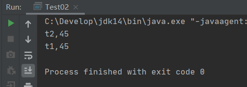

# Java进阶部分（下）

## 七、多线程

### 7.1概念

线程指进程中的一个执行场景，也就是执行流程。

> 进程：每个进程是一个应用程序，都有独立的内存空间
>
> - 计算机引入多进程的作用：提高CPU的使用率。
> - 重点：进程和进程之间的内存独立。
>
> 线程：同一个进程中的线程共享其进程中的内存和资源
>
> - 提高进程的使用率。
> - 重点：线程和线程之间栈内存独立，堆内存和方法区内存共享。一个线程一个栈。
>
> **共享的内存是堆内存和方法区内存，栈内存不共享，每个线程有自己的。**

Java程序执行原理：

Java命令执行会启动JVM，JVM的启动表示启动一个应用程序，表示启动了一个进程。该进程会自动启动一个“主线程”，然后主线程负责调用某个类的main方法。所以main方法的执行是在主线程中执行的。然后通过main方法代码的执行可以启动其他的“分支线程”。所以，main方法结束程序不一定结束，因为其他的分支线程有可能还在执行。

### 7.2线程的创建和启动

Java虚拟机的主线程入口是main方法，用户可以自己创建线程。

> 创建方法：
>
> - 继承Thread类
> - 实现Runnable接口（推荐）

#### 7.2.1继承Thread类

> Thread类中的创建线程最重要的两个方法：
>
> - public void run();
> - public void start();

采用Thread类创建线程，用户只需要继承Thread，覆盖run方法，最后使用start启动线程即可。

```java
// 不使用线程
public class Test02 {
    public static void main(String[] args) {
        Person person = new Person();
        person.run();
        method();
    }
    public static void method(){
        System.out.println("-------method-------");
    }
}
class Person{
    public void run (){
        for (int i = 0; i < 10; i++){
            System.out.println(i);
        }
    }
}
```

运行结果：


run方法完全执行完成后，才执行method方法，也就是method1必须等待前面的方法返回才可以得到执行，这是一种**“同步编程模型”**

```java
// 使用线程
public class Test02 {
    public static void main(String[] args) {
        Person person = new Person();
        person.start();
        method();
    }
    public static void method(){
        System.out.println("-------method-------");
    }
}
class Person extends Thread{
    public void run (){
        for (int i = 0; i < 10; i++){
            System.out.println(i);
        }
    }
}
```

运行结果：


通过输出结果会看到，没有顺序执行，而在输出数字的同时执行了method()方法，如果从效率上看，采用多线程的示例要快些，因为我们可以看作他是同时执行的，method()方法没有等待前面的操作完成才执行，这叫**“异步编程模型”**

#### 7.2.2使用Runnable接口

**其实Thread对象本身就实现了Runnable接口，但一般建议直接使用Runnable接口来写多线程程序，因为接口会比类带来更多的好处。**

```java
public class Test02 {
    public static void main(String[] args) {
        Runnable r1 = new Person();
        Thread t1 = new Thread(r1);
        t1.start();
        method();
    }
    public static void method(){
        System.out.println("-------method-------");
    }
}
class Person implements Runnable{
    public void run (){
        for (int i = 0; i < 10; i++){
            System.out.println(i);
        }
    }
}
```

### 7.3线程的生命周期

线程的生命周期存在五个状态：新建、就绪、运行、阻塞、死亡。


> - 新建：采用new语句创建完成
> - 就绪：执行start 后
> - 运行：占用CPU 时间
> - 阻塞：执行了wait 语句、执行了sleep 语句和等待某个对象锁，等待输入的场合
> - 终止：退出run()方法

### 7.4线程的调度与控制

通常我们的计算机只有一个CPU，CPU 在某一个时刻只能执行一条指令，线程只有得到CPU时间片，也就是使用权，才可以执行指令。在单CPU 的机器上线程不是并行运行的，只有在多个CPU 上线程才可以并行运行。Java 虚拟机要负责线程的调度，取得CPU的使用权，目前有两种调度模型。

> 分时调度模型和抢占式调度模型，Java使用抢占式调度模型。
>
> - 分时调度模型：所有线程轮流使用CPU的使用权，平均分配每个线程占用CPU的时间片。
> - 抢占式调度模型：优先级高的线程获取CPU的时间片相对多一些，如果线程的优先级相同，那么会随机选择一个。

#### 7.4.1线程优先级

> 线程优先级主要分三种：
>
> - MAX_PRIORITY（最高级）
> - MIN_PRIORITY（最低级）
> - NOM_PRIORITY（标准）默认

```java
public class Test02 {
    public static void main(String[] args) {
        Runnable r1 = new Person();
        // 设置别名
        Thread t1 = new Thread(r1,"t1");
        t1.setPriority(Thread.MAX_PRIORITY);
        Thread t2 = new Thread(r1,"t2");
        t2.setPriority(Thread.MIN_PRIORITY);
        t1.start();
        t2.start();
    }
}
class Person implements Runnable{
    public void run (){
        for (int i = 0; i < 100; i++){
            System.out.println(Thread.currentThread().getName() + "," + i);
        }
    }
}
```

运行结果：


> 可以看出，优先级高的线程（t1）会得到的CPU时间多一些，优先执行完成。

#### 7.4.2Thread.sleep

sleep设置休眠的时间,单位毫秒，当一个线程遇到sleep的时候，就会睡眠，进入到阻塞状态,放弃CPU，腾出cpu时间片，给其他线程用，所以在开发中通常我们会这样做，使其他的线程能够取得CPU时间片，当睡眠时间到达了，线程会进入**可运行状态**，得到CPU时间片继续执行，如果线程在睡眠状态被中断了，将会抛出IterruptedException异常。

```java
public class Test02 {
    public static void main(String[] args) {
        Runnable r1 = new Person();
        // 设置别名
        Thread t1 = new Thread(r1,"t1");
        Thread t2 = new Thread(r1,"t2");
        t1.start();
        t2.start();
    }
}
class Person implements Runnable{
    public void run (){
        for (int i = 0; i < 100; i++){
            System.out.println(Thread.currentThread().getName() + "," + i);
            if (i % 10 == 0){
                try {
                    // 睡眠1000毫秒，主要是放弃CPU的使用，将CPU时间片交给其他线程使用
                    Thread.sleep(1000);
                } catch (InterruptedException e) {
                    e.printStackTrace();
                }
            }
        }
    }
}
```

#### 7.4.3Thread.yield

与sleep()类似，只是不能由用户指定暂停多长时间，并且yield()方法只能让同优先级的线程有执行的机会。

```java
public class Test02 {
    public static void main(String[] args) {
        Runnable r1 = new Person();
        // 设置别名
        Thread t1 = new Thread(r1,"t1");
        t1.setPriority(Thread.NORM_PRIORITY);
        Thread t2 = new Thread(r1,"t2");
        t2.setPriority(Thread.NORM_PRIORITY);
        t1.start();
        t2.start();
    }
}
class Person implements Runnable{
    public void run (){
        for (int i = 0; i < 100; i++){
            System.out.println(Thread.currentThread().getName() + "," + i);
            if (i % 10 == 0){
                System.out.println("---------------------");
                Thread.yield();
            }
        }
    }
}
```


#### 7.4.4Thread.join

当前线程可以调用另一个线程的join方法，调用后当前线程会被阻塞不再执行，直到被调用的线程执行完毕，当前线程才会执行。

```java
public class Test02 {
    public static void main(String[] args) {
        Runnable r1 = new Person();
        // 设置别名
        Thread t1 = new Thread(r1,"t1");
        t1.start();
        try {
            // t1调用join方法后会阻碍主线程main，直到t1线程执行完毕再继续执行主线程main
            t1.join();
        } catch (InterruptedException e) {
            e.printStackTrace();
        }
        System.out.println("-------main end---------");
    }
}
class Person implements Runnable{
    public void run (){
        for (int i = 0; i < 10; i++){
            System.out.println(Thread.currentThread().getName() + "," + i);
        }
    }
}
```

#### 7.4.5interrupt（中断）

如果线程正在睡眠，可以采用interrupt进行中断

```java
public class Test02 {
    public static void main(String[] args) {
        Runnable r1 = new Person();
        Thread t1 = new Thread(r1, "t1");
        t1.start();
        try {
        //设置为3000毫秒，没有出现中断异常，因为3000毫秒之后调用t1.interrupt()时，会出现中断异常，因为t1还在睡眠线程，会出现异常并执行catch语句
            Thread.sleep(3000);
        } catch (Exception e) {
            e.printStackTrace();
        }
        t1.interrupt();
    }
}

class Person implements Runnable {
    public void run() {
        for (int i = 1; i < 100; i++) {
            System.out.println(Thread.currentThread().getName() + "," + i);
            if (i % 50 == 0) {
                try {
                    Thread.sleep(6000);
                } catch (Exception e) {
                    System.out.println("-------中断-------");
                }
            }
        }
    }
}
```

#### 7.4.6如何停止一个线程

通常定义一个标记，来判断标记的状态停止线程的执行。

```java
public class Test02 {
    public static void main(String[] args) {
        Person p1 = new Person();
        Thread t1 = new Thread(p1,"t1");
        t1.start();
        try {
            Thread.sleep(6000);
        } catch (InterruptedException e) {
            e.printStackTrace();
        }
        p1.setFlag(true);
    }
}

class Person implements Runnable {
    private boolean flag;

    public void setFlag(boolean flag) {
        this.flag = flag;
    }

    public void run() {
        for (int i = 1; i < 100; i++) {
            System.out.println(Thread.currentThread().getName() + "," + i);
            if (flag){
                break;
            }
        }
    }
}
```

### 7.5线程的同步（加锁）

#### 7.5.1为什么使用线程同步

```java
// 共享一个对象启动两个线程，对象中有一个局部变量s
public class Test02 {
    public static void main(String[] args) {
        Runnable r1 = new Processor();
        Thread t1 = new Thread(r1, "t1");
        Thread t2 = new Thread(r1, "t2");
        t1.start();
        t2.start();
    }
}

class Processor implements Runnable{
    @Override
    public void run() {
        int s = 0;
        for (int i = 0; i < 10; i++){
            s+=i;
        }
        System.out.println(Thread.currentThread().getName() + "," + s);
    }
}
```



​	

> 可以看出输出结果都是一样的，说明t1和t2并发执行，s为每个线程的局部变量，位于各自的栈帧中，因为栈帧中的数据是不会互相干扰的，所有计算结果都为45。

```java
// 共享一个对象启动两个线程，对象中有一个成员变量s
public class Test02 {
    public static void main(String[] args) {
        Runnable r1 = new Processor();
        Thread t1 = new Thread(r1, "t1");
        Thread t2 = new Thread(r1, "t2");
        t1.start();
        t2.start();
    }
}

class Processor implements Runnable{
    int s = 0;
    @Override
    public void run() {
        for (int i = 0; i < 10; i++){
            s+=i;
        }
        System.out.println(Thread.currentThread().getName() + "," + s);
    }
}
```


>为什么出现以上的问题，因为共享了同一个对象的成员变量s，两个线程同时对其进行操作，所以产生了问题，此时称为此时Processor为线程不安全的，如果想得到正确的结果，必须采用线程同步，加锁，该变量不能共享使用。

#### 7.5.2使用线程同步

线程同步，指某一个时刻，指允许一个线程来访问共享资源，线程同步其实是对对象加锁，如果对象中的方法都是同步方法，那么某一时刻只能执行一个方法。

> 采用线程同步解决以上的问题，我们只要保证线程一操作s时，线程二不允许操作即可，只有线程一使用完成s后，再让线程二来使用s变量。

```java
public class Test02 {
    public static void main(String[] args) {
        Runnable r1 = new Processor();
        Thread t1 = new Thread(r1, "t1");
        Thread t2 = new Thread(r1, "t2");
        t1.start();
        t2.start();
    }
}

class Processor implements Runnable{
    private int s = 0;
    @Override
    // synchronized是对对象加锁,采用synchronized同步最好只同步有线程安全的代码
    // 可以优先考虑使用synchronized同步块
    // 因为同步的代码越多，执行的时间就会越长，其他线程等待的时间就会越长,影响效率
    public void run() {
        //使用同步块
        synchronized (this) {
            for (int i = 0; i < 10; i++) {
                s += i;
            }
            System.out.println(Thread.currentThread().getName() + ", s=" + s);
            s = 0;
        }
    }
}
```

> 如果不采用线程同步该如何解决线程安全问题？可以让每个线程创建一个对象，这样在堆内存中不会共享对象，从而避免线程安全问题。

### 7.6守护线程

从线程分类上可以分为**用户线程**和**守护线程**，以上都是用户线程，而守护线程是这样的，所有的用户线程结束生命周期后，守护线程才会结束生命周期。只要有一个用户线程存在，守护线程就不会结束。

> 比如：垃圾回收机器就是一个守护线程。只有所有线程结束，它才会结束。

```java
public class Test02 {
    public static void main(String[] args) {
        Runnable r1 = new Processor();
        Thread t1 = new Thread(r1, "t1");
        t1.start();
        for (int i = 0; i < 10; i++){
            System.out.println(Thread.currentThread().getName() + "," + i);
        }
        System.out.println("主线程结束！");
    }
}

class Processor implements Runnable{
    @Override
    public void run() {
        for (int i =0; i < 10; i++){
            System.out.println(Thread.currentThread().getName() + "," + i);
        }
    }
}
```


可以看出主线程main已经结束，但是t1线程仍在继续。

#### 7.6.1设置为守护线程

```java
// 使用setDaemon方法把线程标记为守护线程
Thread.setDaemon(boolean on);
```

```java
public class Test02 {
    public static void main(String[] args) {
        Runnable r1 = new Processor();
        Thread t1 = new Thread(r1, "t1");
        t1.setDaemon(true);
        t1.start();
        for (int i = 0; i < 10; i++){
            System.out.println(Thread.currentThread().getName() + "," + i);
        }
        System.out.println("主线程结束！");
    }
}

class Processor implements Runnable{
    @Override
    public void run() {
        for (int i =0; i < 100; i++){
            System.out.println(Thread.currentThread().getName() + "," + i);
        }
    }
}
```


> 可以看出当把t1线程设置成守护线程后，主线程结束后，守护线程并没有把所有的数据输出完就提前结束了，也就是说守护线程是为了用户线程服务的。
>
> **当用户线程全部结束后，守护线程才会结束。**

### 7.7Timer定时器

Timer类在Java.util包下，通过schedule方法可以设置定时器。

```java
// 安排指定的任务从指定的延迟后开始进行重复的固定延迟执行。
void schedule(TimerTask task, Date FirstTime, long period);
```

```java
public class Test02 {
    public static void main(String[] args) throws ParseException {
        Timer t = new Timer();
        Date firsDate = new SimpleDateFormat("yyyy-MM-dd HH:mm:ss").parse("2020-09-15 15:30:00");
        // 也可以使用匿名类来完成
        t.schedule(new MyTimerTask(),firsDate,100*100);
    }
}

class MyTimerTask extends TimerTask {

    @Override
    public void run() {
        System.out.println(new Date());
    }
}
```


### 7.8实现线程的第三种方法

**实现Callable接口（JDK8新特性）**

**这种方式实现的线程，可以获取线程的返回值。**

之前两种无法返回，因为run()方法返回void。

```java
import java.util.concurrent.Callable;
import java.util.concurrent.ExecutionException;
import java.util.concurrent.FutureTask;

public class Test02 {
    public static void main(String[] args){
        FutureTask task = new FutureTask(new Callable() {
            @Override
            // call方法相当于run方法，只不过有返回值
            public Object call() throws Exception {
                for (int i = 0; i < 10; i++){
                    System.out.println(Thread.currentThread().getName() + "," + i);
                }
                int a = 10;
                int b = 20;
                return a + b;
            }
        });
        Thread t = new Thread(task, "t");
        t.start();
        // 在主线程中怎么获得t线程的返回值
        Object obj = null;
        try {
            // get()方法执行会导致当前线程阻塞
            obj = task.get();
        } catch (InterruptedException e) {
            e.printStackTrace();
        } catch (ExecutionException e) {
            e.printStackTrace();
        }

        // main方法这里的程序想要执行，必须等待get()方法结束，而get()方法可能需要很久
        // 因为get()方法是为了拿另一个线程的执行结果，而另一个线程的执行是需要时间的
        System.out.println("obj = " + obj);
    }
}

```

**使用这种方法创建线程有一个缺点，效率比较低，在获取t线程结果的时候，当前线程阻塞。优点是可以获取线程的执行结果。**


### 7.9关于Object类中的wait()方法和notify()方法（生产者和消费者模式）

这两个方法不是线程中的方法，而是任何一个类都有的方法。因为这两个方法是Object类中的方法。

**注意：这两个方法的调用不是t.wait()和t.notify()，而是通过java对象去调用的。**

#### 7.9.1wait()方法

```java
Object o = new Object();
o.wait();
// 表示：让正在o对象上活动的线程（当前线程）进入无期限等待状态，直到被唤醒为止。
```

#### 7.9.2notify()方法

```java
o.notify();
// 表示，将正在o对象上等待的线程（当前线程）唤醒
o.notifyAll();
// 表示，将正在o对象上所有等待的线程（当前线程）唤醒
```

#### 7.9.3生产者和消费者模式

生产者和消费者模式是为了专门解决某个特定需求的


实现生产者和消费者模式：

```java
package File_IO_Demo;

// 使用wait和notify方法实现生产者消费者模式
// 1. 生产线程负责生产
// 2. 消费线程负责消费
// 3. 两者达到均衡
// 4. 这是一种特殊的业务需求，在这种情况下需要使用wait和notify方法
// 5. wait和notify不是线程对象的方法，而是java对象的方法
// 6. 两者建立在线程同步的基础之上，因为多线程同时操作一个仓库，有线程安全问题

import java.util.ArrayList;
import java.util.List;

/**
 * 模拟这样一个需求：
 * 仓库使用list集合
 * 1个元素表示仓库满
 * 如果list集合中的元素个数为0，表示仓库空了
 * 保证list集合中永远最多存的是一个元素
 * */

public class Test02 {
    public static void main(String[] args){
        // 创建一个仓库对象，共享的
        List list = new ArrayList();
        // 创建两个线程对象
        // 生产者线程
        Thread t1 = new Thread(new Producer(list), "生产者线程");
        // 消费线程
        Thread t2 = new Thread(new Consumer(list), "消费者线程");
        t1.start();
        t2.start();
    }
}

// 生产线程
class Producer implements Runnable{
    // 仓库
    private List list;

    public Producer(List list) {
        this.list = list;
    }

    @Override
    public void run() {
        // 一直生产(使用死循环模拟)
        while (true){
            // 给仓库对象list加锁
            synchronized (list) {
                if (list.size() > 0) {
                    try {
                        // 当前线程等待,并且释放Producer之前占有的list集合的锁
                        list.wait();
                    } catch (InterruptedException e) {
                        e.printStackTrace();
                    }
                }
                // 程序能执行到这说明仓库为空
                Object obj = new Object();
                list.add(obj);
                System.out.println(Thread.currentThread().getName() + "," + obj);
                // 唤醒消费者线程，进行消费
                list.notify();
            }
        }
    }
}

// 消费线程
class Consumer implements Runnable{
    // 仓库
    private List list;

    public Consumer(List list) {
        this.list = list;
    }

    @Override
    public void run() {
        // 一直消费
        while (true){
            synchronized (list){
                if (list.size() == 0){
                    // 仓库已经空了
                    try {
                        // 消费者线程等待，释放掉list的锁
                        list.wait();
                    } catch (InterruptedException e) {
                        e.printStackTrace();
                    }
                }
                // 程序能够执行到此，说明仓库有数据，进行消费
                Object obj = list.remove(0);
                System.out.println(Thread.currentThread().getName() + "," + obj);
                // 唤醒生产者生产
                // 即使唤醒所有线程也没关系，因为唤醒操作不会释放锁
                list.notify();
            }
        }
    }
}
```


> 达到生产一个消费一个的目的。

## 八、反射机制

### 8.1概念

指程序可以访问、检测和修改它本身状态或行为的一种能力, 并能根据自身行为的状态和结果，调整或修改应用所描述行为的状态和相关的语义。

Java中，反射是一种强大的工具。它使您能够创建灵活的代码，这些代码可以在运行时装配，无需在组件之间进行源代码链接。

反射允许我们在编写与执行时，使我们的程序代码能够接入装载到JVM中的类的内部信息，而不是源代码中选定的类协作的代码。这使反射成为构建灵活的应用的主要工具。

- java反射机制可以操作字节码文件，可以读改字节码文件，可以操作代码片段
- 反射机制在 java.lang.reflect.* 包下

**但需注意的是：如果使用不当，反射的成本很高。**

### 8.2反射机制相关的重要的类有哪些

- java.lang.class：代表字节码文件，代表整个类
- java.lang.reflect.Method：代表字节码中的方法字节码，代表类中的方法
- java.lang.reflect.Constructor：代表字节码中的构造方法字节码，代表类中的构造方法
- java.lang.reflect.Field：代表字节码中的属性字节码，代表类中的成员变量（静态变量，实例变量）

```java
// java.lang.Class
public class User{
    // Field
    int no;
    // Constructor
    public User(){
        
    }
    
    public User(int no){
        this.no = no;
    }
    // Method
    public void setNo(int no){
        this.no = no;
    }
    
    public int getNo(){
        return no;
    }
}
```

### 8.3如何获取字节码文件

```java
// 第一种
Class c = Class.forName("完整类名带包名");
Class c = Class.forName("java.lang.String");
// 第二种
Class c = 对象.getClass();
String s = "abc";
Class c = s.getClass();
// 第三种
Class c = 任何类型.class；
Class c = String.class;
```

看以下代码：

```java
public class ReflectTest {
    public static void main(String[] args) {
        Class c1 = null;
        try {
            c1 = Class.forName("java.lang.String");
            Class c2 = Class.forName("java.util.Date");
            Class c3 = Class.forName("java.lang.Integer");
            Class c4 = Class.forName("java.lang.System");
        } catch (ClassNotFoundException e) {
            e.printStackTrace();
        }
        String s = "abc";
        Class x = s.getClass();
        System.out.println(c1 == x);
    }
}
// 输出结果为true
```

> 这是因为字节码文件装载到JVM中的时候，只装载一份。也就是说c1和x指向的是方法区中同一个字节码文件，所以比较内存地址为true。

### 8.4通过反射机制实例化对象

在同一个工程的bean包下创建一个User类，然后在另一个包下通过反射机制使用newInstance方法来实例化对象

```java
package demo;

public class ReflectTest {
    public static void main(String[] args) {
        // 通过反射机制获取Class，通过Class来实例化对象
        try {
            Class c = Class.forName("bean.User");
            // newInstance会调用类的无参构造方法
            Object obj = c.newInstance();
            System.out.println(obj);
        } catch (ClassNotFoundException e) {
            e.printStackTrace();
        } catch (IllegalAccessException e) {
            e.printStackTrace();
        } catch (InstantiationException e) {
            e.printStackTrace();
        }
    }
}
```


> 可以发现，对象实例化成功。

在User类中写上无参构造方法后


> 在实例化对象之前会调用类的无参构造方法。

在User类中写上有参构造方法后


> 会出现java.lang.InstantiationException异常，实例化异常。因为创建时没有无参构造方法。所以把无参构造方法加上后依然可以正常运行。

**由此可知，newInstance方法会自动调用无参构造，必须保证无参构造方法存在。**

**使用反射机制实例化对象的灵活之处**

文件结构


```java
package demo;

import java.io.FileNotFoundException;
import java.io.FileReader;
import java.util.Properties;

/**
 * 验证反射机制的灵活性
 * */
public class ReflectTest {
    public static void main(String[] args) throws Exception {
        // 通过IO流读取classinfo.properties文件
        FileReader reader = new FileReader("classinfo.properties");
        // 创建属性类对象Map
        Properties pro = new Properties();
        // 加载
        pro.load(reader);
        // 关闭流
        reader.close();
        // 通过key获取value
        String classname = pro.getProperty("className");
        System.out.println(classname);
        // 通过类名实例化对象
        Class c = Class.forName(classname);
        Object obj = c.newInstance();
        System.out.println(obj);
    }
}

```

```java
// classinfo.properties
   className=bean.User
```


> 可以通过编写配置文件来实例化对象，这样在实例化对象的时候可以直接修改配置文件，不必修改java代码，非常的灵活！

### 8.5静态代码块和反射机制

静态代码块会在类创建时自动执行，而且只执行一次。

如果使用forName()方法会调用类的静态代码块吗？

```java
public class ReflectTest {
    public static void main(String[] args) throws Exception {
        Class.forName("demo.MyClass");
    }
}
class MyClass{
    static{
        System.out.println("这是MyClass的静态代码块");
    }
}
```


> 可以看出在使用forName方法后，自动执行类的静态代码块。如果只希望某个类的静态代码块执行，可以使用反射机制。
>
> **这个方法会导致类加载，类加载时，静态代码块会执行。**

### 8.6文件路径问题

使用以上读取配置文件路径，可移植性差，只有在idea中可以找到，可能换个工具或者设备就找不到文件了

以下方法比较通用，即使文件换位置了，依然通用，但这种方法的前提是：这个文件必须在类路径src下。

```java
public class ReflectTest {
    public static void main(String[] args) throws Exception {
        // Thread.currentThread() 获取当前线程
        // getContextClassLoader() 是线程对象的方法，可以获取到当前线程的类加载器对象
        // getResource() 【获取资源】这是类加载器的方法，当前线程的类加载器默认从类的根目录下加载资源
        // getPath() 可以拿到一个文件的绝对路径
        String path = Thread.currentThread().getContextClassLoader().getResource("classinfo.properties").getPath();
        System.out.println(path);
    }
}
//运行结果：/C:/Develop/IdeaProject/Java_Reflect_Exercise/out/production/Java_Reflect_Exercise/classinfo.properties
```

> 此方法为通用方法，但必须要求文件在类路径下。

使用这种方法来实例化对象

```java
public class ReflectTest {
    public static void main(String[] args) throws Exception {
        String path = Thread.currentThread().getContextClassLoader().getResource("classinfo.properties").getPath();
        FileReader reader  = new FileReader(path);
        Properties pro = new Properties();
        pro.load(reader);
        reader.close();
        String classname = pro.getProperty("className");
        Class c = Class.forName(classname);
        System.out.println(c);
    }
}
```

使用流的方式来实例化对象

```java
public class ReflectTest {
    public static void main(String[] args) throws Exception {
        InputStream in = Thread.currentThread().getContextClassLoader().getResourceAsStream("classinfo.properties");
        Properties pro = new Properties();
        pro.load(in);
        in.close();
        String classname = pro.getProperty("className");
        Class c = Class.forName(classname);
        System.out.println(c);
    }
}
```

### 8.7资源绑定器

java.util包下提供了一个资源绑定器，便于获取属性配置文件中的内容。

**使用以下方式的时候，属性配置文件必须放到类路径下。**

```java
public class ReflectTest {
    public static void main(String[] args) throws Exception {
        // 资源绑定器只能绑定XXX.properties文件
        // 这个文件必须在类路径下，文件扩展名必须是properties
        // 写路径时，后缀省略
        ResourceBundle bundle = ResourceBundle.getBundle("classinfo");
        String classname = bundle.getString("className");
        System.out.println(classname);
    }
}
// 运行结果：bean.User
```

### 8.8类加载器

专门负责加载类的命令/工具，ClassLoader

**JDK中自带三个类加载器:**

> - 启动类加载器（父加载器）：rt.jar
> - 扩展类加载器（母加载器）：ext/*.jar
> - 应用类加载器：classpath
>
> 双亲委派机制：优先从父加载器加载，加载不到从母加载器加载，如果都加载不到，则从应用类加载器加载，为了保证类加载的安全。
>
> - 假如有一个自定义类叫String，但是加载时会优先加载Sun公司提供的String，为了防止自定义String类有后门，不安全。

代码在开始执行之前，会将所需要类全部加载到JVM中，通过类加载器加载，看到代码会找对应的class文件，找到就加载。

### 8.9Java反射机制中的主要类和方法

| 方法名                          | 描述                                                         |
| ------------------------------- | ------------------------------------------------------------ |
| Class.forName(String className) | 返回与带有给定字符串名的类或接口相关联的`Class`对象。        |
| Class.getName()                 | 以`String`的形式返回此`Class`对象所表示的实体（类、接口、数组类、基本类型或`void`）名称。 |
| Class.getSimpleName()           | 返回源代码中给出的底层类的简称。                             |
| Class.getFields()               | 返回一个包含某些`Field`对象的数组，这些对象反映此`Class`对象所表示的类或接口的所有可访问公共字段。 |
| Class.getDeclaredFields()       | 返回`Field`对象的一个数组，这些对象反映此`Class`对象所表示的类或接口所声明的所有字段。 |
| Field.getName()                 | 返回此 `Field` 对象表示的字段的名称。                        |
| Field.getType()                 | 返回一个 `Class` 对象，它标识了此 `Field` 对象所表示字段的声明类型。 |
| Field.getModifiers()            | 以**整数形式**返回由此 `Field` 对象表示的字段的 Java 语言修饰符。每个数字是修饰符的代号。 |
| Modifier.toString(int mod)      | 返回描述指定修饰符中的访问修饰符标志的字符串。               |

### 8.10通过反射机制访问Java对象的属性

访问对象三要素：

> - 获取对象
> - 获取属性
> - 赋值

```java
public class ReflectTest {
    public static void main(String[] args) throws Exception {
        // 获取类
        Class c = Class.forName("bean.Student");
        // 实例化Student对象
        Object obj = c.newInstance();
        // 获取no属性
        Field nofield = c.getDeclaredField("no");
        // 为obj的no属性赋值
        nofield.set(obj,22222);
        System.out.println(((Student)obj).no);
    }
}
// 运行结果：22222
```

通过反射机制来访问对象非常灵活，可以写在配置文件中。

如何访问私有变量：

```java
public class ReflectTest {
    public static void main(String[] args) throws Exception {
        Class c = Class.forName("bean.Student");
        Object obj = c.newInstance();
        Field namefield = c.getDeclaredField("name");
        // 打破封装（反射机制的缺点：打破封装可能会给不法分子留下机会）
        namefield.setAccessible(true);
        namefield.set(obj,"jack");
        System.out.println(namefield.get(obj));
    }
}
```

### 8.11通过反射机制访问Java对象的方法

#### 8.11.1可变长参数

语法：

类型... （注意：一定是三个点）

```java
public class ReflectTest {
    public static void main(String[] args) throws Exception {
        m();
        m(1);
        m(1, 2, 3);
    }
    public static void m(int... args){
        System.out.println("m方法执行...");
    }
}
// 运行结果：
// m方法执行...
// m方法执行...
// m方法执行...
```

> - 可变长参数只能放在参数列表中的最后一个。
> - 可变长参数在参数列表中只能有一个。
> - 可变长参数可以当作一个数组来看，可以使用数组传递形参，可以使用length方法，有下标可以遍历。

#### 8.11.2反射Method

```java
public class ReflectTest {
    public static void main(String[] args) throws Exception {
        // 获取类
        Class aClass = Class.forName("bean.Student");
        // 获取所有方法
        Method[] methods = aClass.getDeclaredMethods();
        // 遍历
        for (Method method : methods){
            // 获取修饰符列表
            System.out.print(Modifier.toString(method.getModifiers()) + " ");
            // 获取返回值类型
            System.out.print(method.getReturnType().getSimpleName() + " ");
            // 获取方法名
            System.out.print(method.getName() + " (");
            // 获取参数列表
            Class[] parameterTypes = method.getParameterTypes();
            for (Class type : parameterTypes){
                System.out.print(type);
            }
            System.out.println(")");
        }
    }
}

```


#### 8.11.3使用反射机制调用方法

```java
public class ReflectTest {
    public static void main(String[] args) throws Exception {
        // 获取类
        Class c = Class.forName("bean.Student");
        // 获取对象
        Object obj = c.newInstance();
        // 获取无参方法
        Method method1 = c.getDeclaredMethod("s",null);
        // 调用无返回值的方法
        method1.invoke(obj);
        // 获取有参方法
        Method method2 = c.getDeclaredMethod("f", int.class);
        // 调用有返回值的方法
        Object o = method2.invoke(obj, 5);
        System.out.println(o);
    }
}
class Student{
    public void s(){
        Systemout.println("调用s方法");
    }
    public int f(int i){
        System.out.println("调用f方法,返回:");
        return i;
    }
}
```


**使用反射机制来调用方法的优点：**

可以通过配置文件来配置四要素，更通用，灵活，直接修改配置文件即可

### 8.12通过反射机制访问Java对象的构造方法

```java
public class ReflectTest {
    public static void main(String[] args) throws Exception {
        // 获取类
        Class c = Class.forName("bean.Student");
        // 获取类的无参构造方法
        Constructor constructor1 = c.getConstructor();
        // 使用无参构造实例Student类
        Object obj1 = constructor1.newInstance();
        System.out.println(obj1);
        // 获取类的有参构造方法
        Constructor constructor2 = c.getConstructor(Integer.class, String.class);
        // 使用有参构造实例Student类
        Object obj2 = constructor2.newInstance(1001,"jack");
        System.out.println(obj2);
        // 获取类的有参构造方法
        Constructor constructor3 = c.getConstructor(Integer.class, String.class, boolean.class);
        Object obj3 = constructor3.newInstance(1002, "tom", true);
        System.out.println(obj3);
    }
}

public class Student {

    private Integer no;
    private String name;
    private boolean sex;

    public Student() {
        System.out.println("这是Student类的无参构造方法...");
    }

    public Student(Integer no, String name) {
        this.no = no;
        this.name = name;
    }

    public Student(Integer no, String name, boolean sex) {
        this.no = no;
        this.name = name;
        this.sex = sex;
    }

    @Override
    public String toString() {
        return "Student{" +
                "no=" + no +
                ", name='" + name + '\'' +
                ", sex=" + sex +
                '}';
    }
}

```


> 通过Class.getSupeclass()方法可以获取该类继承的父类；
>
> 通过Class.getInterfaces()方法可以获取该类实现的接口；

## 九、注解

注解，也叫注释(Annotation)，注解是一种引用数据类型，编译之后产生XXX.class文件。

如何自定义注解：

> [修饰符列表] @interface 注解类型名{
>
> }

```java
/*
自定义注解MyAnnotation
*/
public @interface MyAnnotation{
    
}
```

### 9.1注解怎么使用，用在什么地方

1. 如何使用：

   @注解类型名

2. 注解可以出现在哪里：

   类上、属性上、方法上、变量上等...

   还可以出现在注解类型上。

   **默认情况下，注解可以使用在任何位置上。**

### 9.2注解的分类

根据注解的作用，可以将注解分为三类：

- 编写文档：通过代码里标识的元数据生成文档。
- 代码分析：通过代码里标识的元数据对代码进行分析。
- 编译检查：通过代码里标识的元数据让编译器能实现基本的编译检查。

### 9.3基本内置注解

1. @Override（掌握）

   > @Override 注释能实现编译时检查，你可以为你的方法添加该注释，以声明该方法是用于覆盖父类中的方法。如果该方法不是覆盖父类的方法，将会在编译时报错。

2. @Deprecated（掌握）

   > 对已过时的方法添加注释，当编程人员使用这些方法时，将会在编译时显示提示已过时信息。

3. @SuppressWarnings

   > 需要添加一个参数才能正确使用，这些参数值都是已经定义好了的。
   >
   > - deprecation：使用了过时的类或方法时的警告
   > - unchecked：执行了未检查的转换时的警告，例如当使用集合时没有用泛型 (Generics) 来指定
   >   集合保存的类型
   > - fallthrough：当Switch程序块直接通往下一种情况而没有Break时的警告
   > - path：在类路径、源文件路径等中有不存在的路径时的警告
   > - serial：当在可序列化的类上缺少serialVersionUID定义时的警告
   > - finally：任何finally子句不能正常完成时的警告
   > - all：关于以上所有情况的警告

### 9.4元注解

注解注解类型的注解叫做元注解

```java
// 注解注解类型的注解
@Target(ElementType.METHOD)
@Retention(RetentionPolicy.SOURCE)
public @interface Override {
}
```

常见的元注解：

**@Target（掌握）：**

这是一个元注解，用来标注"注解类型"的"注解"。

Target注解用来标注被标注的注解可以出现在哪些位置上。

@Target(ElementType.METHOD)表示"被标注的注解只能出现在方法上"。.

@Target(value={CONSTRUCTOR, FIELD, LOCAL_VARIABLE, METHOD, PACKAGE, MODULE, PARAMETER, TYPE})

表示”被标注的注解“可以出现在：构造方法、字段、局部变量、方法等等...

**@Retention（掌握）：**

这是一个元注解，用来标注"注解类型"的"注解"。

Retention注解用来标注被标注的注解最终保存到哪里。

@Retention(RetentionPolicy.SOURCE)表示"被标注的注解"只能被保留在Java源文件中。

@Retention(RetentionPolicy.CLASS)表示"被标注的注解"只能被保留在Class文件中。

@Retention(RetentionPolicy.RUNTIME)表示"被标注的注解"只能被保留在Class文件中，并且可以被反射机制所读取。

### 9.5使用自定义注解添加变量

我们知道@SuppressWarnings()是需要添加参数的，那么自定义注解同理可以添加参数，但参数的类型只能是**基本类型、String、Class、枚举类型、数组等，并且参数不能为空。**

在注解中定义属性：

```java
public @interface MyAnnotation {
    /**
     *  通常在注解当中可以定义属性，以下这个是Annotation的name属性。
     *  看着像一个方法，但实际上称之为属性name
     * */
    String name();
    // 默认值
    int age() default 25;
}

public class Test {
    // 当一个注解有属性，那么必须给属性赋值，除非有默认值的属性，可以不赋值
    // @MyAnnotation(属性名 = 属性值)
    @MyAnnotation(name = "zhangsan")
    public void doSome(){

    }
    public static void main(String[] args) {

    }
}
```

**当注解中属性有且只有一个**，并且属性名为value时：

```java
public @interface MyAnnotation {
    /**
     *如果一个注解的属性有且只有一个，而且属性名是value的话，在使用的时候可以省略"value = "
     * */
    String value();
}

public class Test {

    @MyAnnotation(value = "haha")
    public void doSome(){

    }

    @MyAnnotation("hehe")
    public void doOther(){

    }

    public static void main(String[] args) {

    }
}
```

当注解中的属性是数组的时候：

```java
public @interface MyAnnotation {
    String[] email();
}

public class Test {

    @MyAnnotation(email = {"zhangsan@qq.com", "zhangsan@163.com"})
    public void doSome(){

    }

    // 数组中只有一个元素，大括号可以省略
    @MyAnnotation(email = "zhangsan@qq.com")
    public void doOther(){

    }
    
    public static void main(String[] args) {

    }
}
```

当注解中的属性是枚举类型时：

```java
public enum  Season {
    SPRING,WINTER,SUMMER,AUTUMN
}

public @interface MyAnnotation {
    Season season();
}

public class Test {

    @MyAnnotation(season = Season.AUTUMN)
    public void doSome(){

    }

    public static void main(String[] args) {

    }
}
```

### 9.6反射注解

通过反射机制来获取注解的值

```java
@Target(ElementType.TYPE)
@Retention(RetentionPolicy.RUNTIME)
public @interface MyAnnotation {
    String value() default "北京";
}

@MyAnnotation
public class MyAnnotationTest {

}

public class Test {
    public static void main(String[] args) throws Exception {
        Class c = Class.forName("bean.MyAnnotationTest");
        System.out.println(c.isAnnotationPresent(MyAnnotation.class));
        if (c.isAnnotationPresent(MyAnnotation.class)){
            MyAnnotation myannotation = (MyAnnotation)c.getAnnotation(MyAnnotation.class);
            String value = myannotation.value();
            System.out.println(value);
        }
    }
}
```


通过反射机制获取注解对象属性的值

```java
@Target(ElementType.METHOD)
@Retention(RetentionPolicy.RUNTIME)
public @interface MyAnnotation {
    String username();
    String password();
}

public class MyAnnotationTest {

    @MyAnnotation(username = "zhangsan", password = "123")
    public void doSome(){

    }

    public static void main(String[] args) throws Exception{
        // 获取MyAnnotationTest的doSome()方法上面的注解信息
        Class c = Class.forName("bean.MyAnnotationTest");
        Method method= c.getDeclaredMethod("doSome");
        if (method.isAnnotationPresent(MyAnnotation.class)) {
            MyAnnotation annotation = method.getAnnotation(MyAnnotation.class);
            String username = annotation.username();
            String password = annotation.password();
            System.out.println("username:" + username + "   password:" + password);
        }
    }
}
```


### 9.7注解有什么用

需求;

假设有这样一个注解，叫做@Id

这个注解只能出现在类上面，当类上有这个注解的时候，要求这个类有一个int类型的id属性。

如果没有这个属性，就报异常，反之可以正常执行。