# Java进阶部分（中）

## 五、集合

集合Collection的结构图：

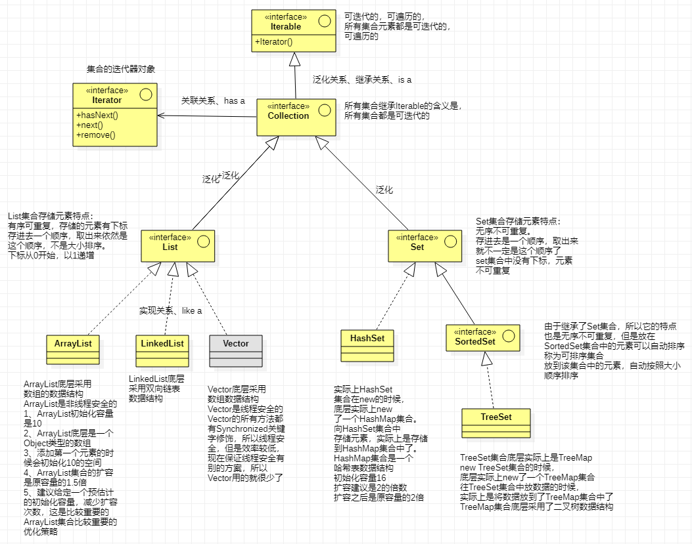

集合Map结构图：

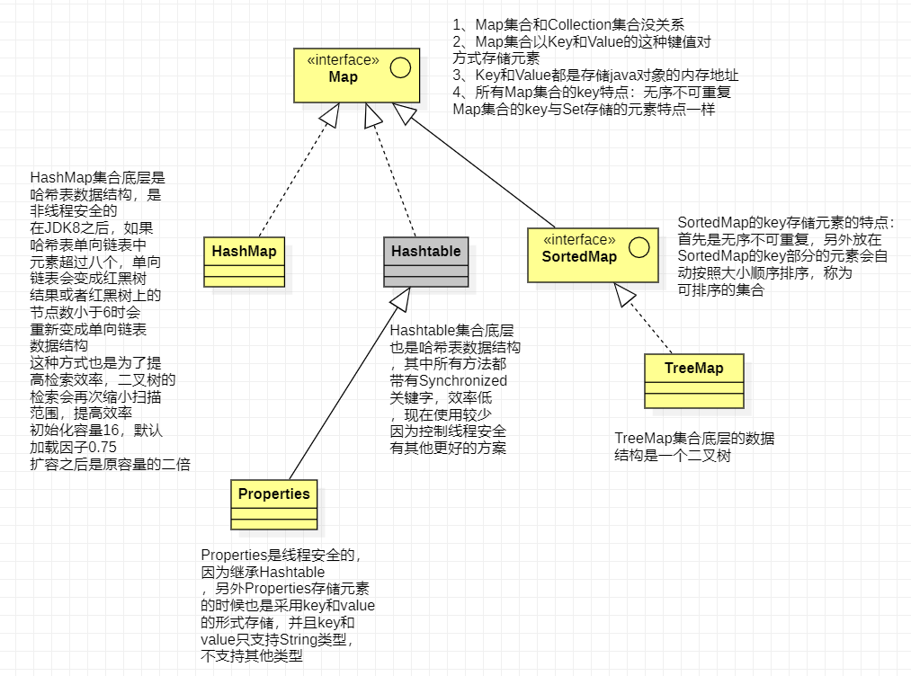

### 5.1概述

Java的集合有三种类型：

1. List集合：是一个**有序**集合，可以存放重复的数据
2. Set集合：是一个**无序**集合，不允许存放重复的数据
3. Map集合：是一个**无序**集合，集合中包含键值对（一个键对象，一个值对象，键对象不允许重复，值对象可以重复）

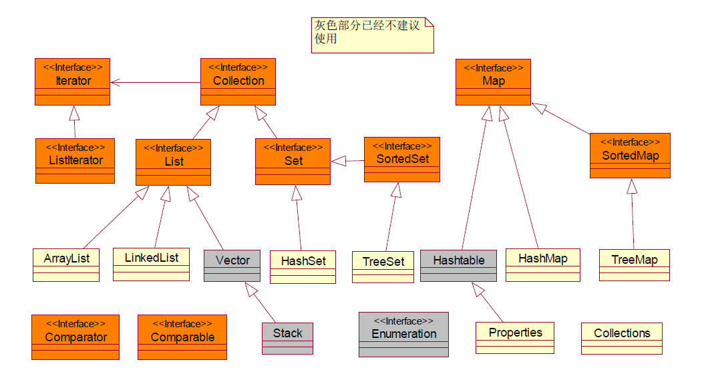

### 5.2 Collection 和 Iterator

Collection是List和Set的父接口，Collection中有一些常用的方法

| **方法摘要** |                                                              |
| ------------ | ------------------------------------------------------------ |
| boolean      | **add(E e)** 确保此 collection 包含指定的元素（可选操作）。  |
| boolean      | **addAll(collection<? extends E> c)** 将指定  collection 中的所有元素都添加到此 collection 中（可选操作）。 |
| void         | **clear()** 移除此 collection 中的所有元素（可选操作）。     |
| boolean      | **contains(Object o)** 如果此 collection 包含指定的元素，则返回 `true`。 |
| boolean      | **containsAll(collection<?> c)** 如果此 collection 包含指定 collection 中的所有元素，则返回 `true`。 |
| boolean      | **equals(Object o)** 比较此 collection 与指定对象是否相等。  |
| int          | **hashCode()** 返回此 collection 的哈希码值。                |
| boolean      | **isEmpty()** 如果此 collection 不包含元素，则返回 `true`。  |
| Iterator<E>  | **iterator()** 返回在此 collection 的元素上进行迭代的迭代器。 |
| boolean      | **remove(Object o)** 从此 collection 中移除指定元素的单个实例，如果存在的话（可选操作）。 |
| boolean      | **removeAll(Collection<?> c)** 移除此 collection 中那些也包含在指定 collection 中的所有元素（可选操作）。 |
| boolean      | **retainAll(Collection<?> c)** 仅保留此 collection 中那些也包含在指定 collection 的元素（可选操作）。 |
| int          | **size()** 返回此 collection 中的元素数。                    |
| Object[]     | **toArrayt()** 返回包含此 collection 中所有元素的数组。      |
| <T>  T[]     | **toArray(T[] a)** 返回包含此 collection  中所有元素的数组；返回数组的运行时类型与指定数组的运行时类型相同。 |

Iterator称为迭代接口，通过此接口可以遍历集合中的数据,Iterator中有一些常用方法

| 方法摘要 |                                                   |
| -------- | ------------------------------------------------- |
| boolean  | **hasNext() **如果仍有元素可以迭代，则返回 true。 |
| E        | **next()** 返回迭代的下一个元素                   |

### 5.3List接口

#### 5.3.1概述

List接口下面主要有两个实现ArrayList和LinkedList。

它们都是有顺序的（存进去什么顺序，取出来就是什么顺序），线性存储，看作一个可变数组。

> 1. ArrayList：查询数据比较快，添加和删除数据比较慢**（基于可变数组）**
> 2. LinkedList：查询数据比较慢，添加和删除数据比较快**（基于链表数据结构）**
> 3. Vector：Vector已经不建议使用，Vector中的方法都是同步的，效率慢，已经被ArrayList取代
> 4. Stack：是继承Vector实现了一个栈，栈结构是后进先出，目前已经被LinkedList取代

1. ArrayList

```java
public class test {
    public static void main(String[] args) throws Exception{
        List l = new ArrayList();
        
        // 添加元素
        l.add(1);
        l.add(2);
        l.add(3);
        l.add(1);
        
        // 遍历元素
        for (int i = 0; i < l.size(); i++) {
            Integer e = (Integer)l.get(i);
            System.out.print(e);
            // 输出1231
        }
        
        // 删除元素
        l.remove(1);

        // 使用Iterator遍历集合(while循环)
        Iterator iter = l.iterator();
        while (iter.hasNext()) {
            Integer i = (Integer) iter.next();
            System.out.println(i);
        }
        
        //采用Iterator遍历数据（for循环）
        for (Iterator iter1=l.iterator(); iter1.hasNext();) {
            Integer v = (Integer)iter1.next();
            System.out.println(v);
        }
        
        // 是否包含元素2
        System.out.println(l.contains(2));
        
        // 是否为空
        System.out.println(l.isEmpty());
    }
}

```

2. LinkedList

LinkedList的方法和ArrayList类似

### 5.4Set接口

#### 5.4.1哈希表

哈希表是一种数据结构，哈希表能够提供快速存取操作。

哈希表是基于数组的，所以也存在缺点，数组一旦创建将不能扩展。

> 正常的数组，如果需要查询某个值，需要对数组进行遍历，只是一种线性查找，查找的速度比较慢。如果数组中的元素值和下标能够存在明确的对应关系，那么通过数组元素的值就可以换算出数据元素的下标，通过下标就可以快数定位数组元素，这样的数组就是哈希表。

#### 5.4.2HashSet

> HashSet中的数据是无序的不可重复的（存进去一个顺序，取出来就不一定是这个顺序了）。
>
> HashSet按照哈希算法存取数据的，具有非常好性能，它的工作原理是这样的，当向HashSet中插入数据的时候，他会调用对象的hashCode得到该对象的哈希码，然后根据哈希码计算出该对象插入到集合中的位置。

```java
public class test {
    public static void main(String[] args){
        Set set = new HashSet();
        // 添加元素
        set.add("a");
        set.add("b");
        set.add("c");
        //采用Iterator遍历数据（for循环）
        for (Iterator iter1=set.iterator(); iter1.hasNext();) {
            System.out.print(iter1.next());
            // 运行结果：abc
        }
        // 加入重复数据
        set.add("a");
        System.out.println();
        // 再次遍历
        for (Iterator iter1=set.iterator(); iter1.hasNext();) {
            System.out.print(iter1.next());
            // 运行结果abc
        }
        String s1 = "abc";
        String s2 = "abc";
        System.out.println("s1 equals s2 ," + s1.equals(s2));
        // 运行结果：abcs1 equals s2 ,true
        //equals相等，hashcode一定是相等的
        System.out.println("s1.hashCode=" + s1.hashCode());
        System.out.println("s2.hashCode=" + s2.hashCode());
        // s1.hashCode=96354
        // s2.hashCode=96354
    }
}
```

#### 5.4.3equals和hashCode

观察以下代码，加入重复数据的情况

```java
public class test {
    public static void main(String[] args){
        Person p1 = new Person();
        p1.name = "张三";
        p1.age = 20;

        Person p2 = new Person();
        p2.name = "李四";
        p2.age = 30;

        Person p3 = new Person();
        p3.name = "张三";
        p3.age = 40;

        Set set = new HashSet();
        set.add(p1);
        set.add(p2);
        set.add(p3);

        for (Iterator iter=set.iterator(); iter.hasNext();) {
            Person p = (Person)iter.next();
            System.out.println("name=" + p.name + ", age=" + p.age);
        }

        System.out.println("p1.hashCode=" + p1.hashCode());
        System.out.println("p2.hashCode=" + p2.hashCode());
        System.out.println("p3.hashCode=" + p3.hashCode());
    }
}
class Person {
    String name;
    int age;
}
```

运行结果：

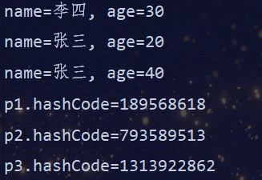

> 加入了重复的数据，因为hashCode是不同的，所以会根据算出不同的位置，存储格式

**完善Person类的equals方法改善代码后：**

```java
public class test {
    public static void main(String[] args){
        Person p1 = new Person();
        p1.name = "张三";
        p1.age = 20;

        Person p2 = new Person();
        p2.name = "李四";
        p2.age = 30;

        Person p3 = new Person();
        p3.name = "张三";
        p3.age = 40;

        Set set = new HashSet();
        set.add(p1);
        set.add(p2);
        set.add(p3);
        
        System.out.println("p1 equals p2," + p1.equals(p2));
        System.out.println("p1 equals p3," + p1.equals(p3));

        for (Iterator iter=set.iterator(); iter.hasNext();) {
            Person p = (Person)iter.next();
            System.out.println("name=" + p.name + ", age=" + p.age);
        }

        System.out.println("p1.hashCode=" + p1.hashCode());
        System.out.println("p2.hashCode=" + p2.hashCode());
        System.out.println("p3.hashCode=" + p3.hashCode());
    }
}
class Person {
    String name;
    int age;
    //覆盖equals
    @Override
    public boolean equals(Object obj) {
        if (this == obj) {
            return true;
        }
        if (obj instanceof Person) {
            Person p = (Person)obj;
            return this.name.equals(p.name);
        }
        return false;
    }
}
```

运行结果：

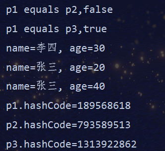

> 以上仍然存在重复数据，在Person中覆盖了hashCode方法，能够正确的比较出两个Person是相等的还是不等的，但是为什么HashSet中还是放入了重复数据？因为Person对象的hashCode不同，所以它就换算出了不同的位置，让后就会把相关的值放到不同的位置上，就忽略equlas，所以我们必须覆盖hashCode方法。

**只覆盖hashCode方法不覆盖equals的情况：**

```java
public class test {
    public static void main(String[] args){
        Person p1 = new Person();
        p1.name = "张三";
        p1.age = 20;

        Person p2 = new Person();
        p2.name = "李四";
        p2.age = 30;

        Person p3 = new Person();
        p3.name = "张三";
        p3.age = 40;

        Set set = new HashSet();
        set.add(p1);
        set.add(p2);
        set.add(p3);
        
        System.out.println("p1 equals p2," + p1.equals(p2));
        System.out.println("p1 equals p3," + p1.equals(p3));

        for (Iterator iter=set.iterator(); iter.hasNext();) {
            Person p = (Person)iter.next();
            System.out.println("name=" + p.name + ", age=" + p.age);
        }

        System.out.println("p1.hashCode=" + p1.hashCode());
        System.out.println("p2.hashCode=" + p2.hashCode());
        System.out.println("p3.hashCode=" + p3.hashCode());
    }
}
class Person {
    String name;
    int age;
    //覆盖hashCode
    @Override
    public int hashCode() {
		return (name==null)?0:name.hashCode();
	}
}
```

运行结果：

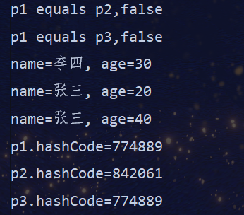

> 以上示例，张三的hashCode相同，当两个对象的equals不同，所以认为值是以不一样的，那么java会随机换算出一个新的位置，放重复数据。

**同时覆盖hashCode和equals方法，改善代码：**

```java
public class test {
    public static void main(String[] args){
        Person p1 = new Person();
        p1.name = "张三";
        p1.age = 20;

        Person p2 = new Person();
        p2.name = "李四";
        p2.age = 30;

        Person p3 = new Person();
        p3.name = "张三";
        p3.age = 40;

        Set set = new HashSet();
        set.add(p1);
        set.add(p2);
        set.add(p3);
        
        System.out.println("p1 equals p2," + p1.equals(p2));
        System.out.println("p1 equals p3," + p1.equals(p3));

        for (Iterator iter=set.iterator(); iter.hasNext();) {
            Person p = (Person)iter.next();
            System.out.println("name=" + p.name + ", age=" + p.age);
        }

        System.out.println("p1.hashCode=" + p1.hashCode());
        System.out.println("p2.hashCode=" + p2.hashCode());
        System.out.println("p3.hashCode=" + p3.hashCode());
    }
}
class Person {
    String name;
    int age;
    
    //覆盖equals
    @Override
    public boolean equals(Object obj) {
        if (this == obj) {
            return true;
        }
        if (obj instanceof Person) {
            Person p = (Person)obj;
            return this.name.equals(p.name);
        }
        return false;
    }
    
    //覆盖hashCode
    @Override
    public int hashCode() {
		return (name==null)?0:name.hashCode();
	}
}
```

运行结果：

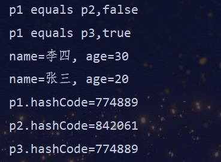

> 以上输出完全正确的，因为覆盖了equals和hashCode，当hashCode相同，它会调用equals进行比较，如果equals比较相等将不加把此元素加入到Set中，但equals比较不相等会重新根据hashCode换算位置仍然会将该元素加入进去的。

**再次强调：特别是向HashSet或HashMap中加入数据时必须同时覆盖equals和hashCode方法，应该养成一种习惯覆盖equals的同时最好同时覆盖hashCode**

**Java要求：**

- **两个对象equals相等，那么它的hashcode相等**
- **两个对象equals不相等，那么它的hashcode并不要求它不相等，但一般建议不相等**
- **hashcode相等不代表两个对象相等（采用equals比较）**

#### 5.4.4TreeSet

TreeSet不能放入重复数据，可以对Set集合进行排序，默认自然排序（即升序，排序只能对一种类型排序），但也可以做客户化的排序，

**注意：基本类型的包装类和String他们都是可以排序的，他们都实现Comparable接口，如果要对对象类型进行排序，则必须实现Comparable接口**

```java
public class test {
    public static void main(String[] args) {
        Person p1 = new Person();
        p1.name = "张三";
        p1.age = 20;

        Person p2 = new Person();
        p2.name = "李四";
        p2.age = 30;

        Person p3 = new Person();
        p3.name = "张三";
        p3.age = 40;

        Set set = new TreeSet();
        set.add(p1);
        set.add(p2);
        set.add(p3);

        for (Iterator iter = set.iterator(); iter.hasNext(); ) {
            Person p = (Person) iter.next();
            System.out.println("name=" + p.name + ", age=" + p.age);
        }
    }
}
class Person implements Comparable{
    String name;
    int age;

    //如果覆盖了equals，最好保证equals和compareto在
    //相等情况下的比较规则是一致的
    @Override
    public int compareTo(Object o) {
        if (o instanceof Person) {
            Person p = (Person)o;
            //升序
            //return (this.age - p.age);
            //降序
            return (p.age-this.age);
        }
        throw new IllegalArgumentException("非法参数，o=" + o);
    }
}
```

运行结果：按年龄降序

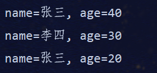

**比较器的实现还有其他方法：**

1. 实现Comparator接口完成排序

   查看TreeSet源代码的构造方法

   ```java
   TreeSet(Comparator<? super E> comparator) 
   // 构造一个新的空 TreeSet，它根据指定比较器进行排序。
   ```

   查看Comparator源代码中的方法

   ```java
   int compare(T o1, T o2) 
   // 比较用来排序的两个参数。 
   boolean equals(Object obj) 
   // 指示某个其他对象是否“等于”此 Comparator。 
   ```

   ```java
   //在主方法中将构造器作为参数传进去即可
   Comparator personComparator = new PersonComparator();
   Set set = new TreeSet(personComparator);
   
   //实现Person的比较器
   //Comparator和Comparable的区别？
   //Comparable是默认的比较接口，Comparable和需要比较的对象紧密结合到一起了
   //Comparator可以分离比较规则，所以它更具灵活性
   class PersonComparator implements Comparator {
   	public int compare(Object o1, Object o2) {
   		if (!(o1 instanceof Person)) {
   			throw new IllegalArgumentException("非法参数，o1=" + o1);
   		}
   		if (!(o2 instanceof Person)) {
   			throw new IllegalArgumentException("非法参数，o2=" + o2);
   	    }
   	Person p1 = (Person)o1;
   	Person p2 = (Person)o2;
   	return p1.age - p2.age;
   	}
   }
   ```

2. 采用匿名类完成Comparator的实现

   ```java
   // 创建对象的同时使用匿名内部类将构造器传回
   Set set = new TreeSet(new Comparator() {
       public int compare(Object o1, Object o2) {
   		if (!(o1 instanceof Person)) {
   			throw new IllegalArgumentException("非法参数，o1=" + o1);
   		}
   		if (!(o2 instanceof Person)) {
   			throw new IllegalArgumentException("非法参数，o2=" + o2);
   		}
   	Person p1 = (Person)o1;
   	Person p2 = (Person)o2;
   	return p1.age - p2.age;
   	}
   });
   ```

**Comparable和Comparator的区别？**

一个类实现了Camparable接口则表明这个类的对象之间是可以相互比较的，这个类对象组成的集合就可以直接使用sort方法排序。

Comparator可以看成一种算法的实现，将算法和数据分离，Comparator也可以在下面两种环境下使用：

1. 类的没有考虑到比较问题而没有实现Comparable，可以通过Comparator来实现排序而不必改变对象本身。
2. 可以使用多种排序标准，比如升序、降序等。

### 5.5Map接口

**Map中可以放置键值对，也就是每一个元素都包含键对象和值对象。**

> Map实现较常用的为HashMap，HashMap对键对象的存取和HashSet一样，仍然采用的是哈希算法，所以如果使用自定类作为Map的键对象，必须重写equals和hashCode方法。

#### 5.5.1HashMap

```java
public class test {
    public static void main(String[] args) {
        Map map = new HashMap();
        // 添加数据
        map.put("1001", "jack");
        map.put("1002", "tom");
        map.put("1003", "cat");

        // 遍历方法
        // 采用entrySet遍历Map
        // 使用entrySet方法获取映射中包含的映射关系的Set视图。
        Set entrySet = map.entrySet();
        for (Iterator it = entrySet.iterator(); it.hasNext();){
            // Map.Entry映射项（键-值对）。Map.entrySet 方法返回映射的 collection 视图，其中的元素属于此类。
            Map.Entry entry = (Map.Entry) it.next();
            System.out.println(entry.getKey() + "," + entry.getValue());
        }

        // 通过map中指定的key来读取数据
        System.out.println();
        Object o = map.get("1002");
        System.out.println("1002:" + o);

        // 通过keySet和get取得map中的数据
        System.out.println();
        for (Iterator it = map.keySet().iterator(); it.hasNext(); ) {
            String k = (String)it.next();
            System.out.println(k + ":" + map.get(k));
        }
    }
}
```

运行结果：

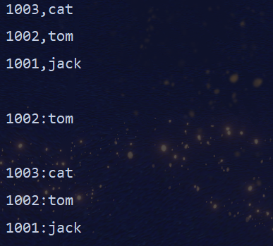

**也可以使用自定义类来作为key和value，例如：key为身份证号类，value为人的类。但是使用自定义类的时候需要注意，HashMap底层实现采用hash表，所以必须重写key的自定义类的hashCode和equals方法，这样才能避免加入重复数据！！！**

#### 5.5.2TreeMap

TreeMap可以对Map中的key进行排序，**如果map中的key采用的是自定义类那么需要实现Comparable或Comparator接口才能实现排序。**

```java
public class test {
    public static void main(String[] args) {
        Map map = new TreeMap();
        // 添加数据
        map.put("1003", "jack");
        map.put("1001", "tom");
        map.put("1002", "cat");

        // 遍历方法
        // 采用entrySet遍历Map
        // 使用entrySet方法获取映射中包含的映射关系的Set视图。
        Set entrySet = map.entrySet();
        for (Iterator it = entrySet.iterator(); it.hasNext();){
            // Map.Entry映射项（键-值对）。Map.entrySet 方法返回映射的 collection 视图，其中的元素属于此类。
            Map.Entry entry = (Map.Entry) it.next();
            System.out.println(entry.getKey() + "," + entry.getValue());
        }
    }
}
```

运行结果：

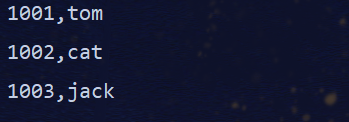

### 5.6Collections工具类

**Collections**在java.util包下，提供了一系列实用方法，排序，查找等。

> ```java
> // 对集合排序
> // 不能对Set集合排序，需要将Set集合转换成List集合再排序
> Collections.sort(List list);
> // 使用二分搜索法搜索指定列表，以获得指定对象。
> Collections.binarySearch(List list, T key);
> //  反转指定列表中元素的顺序。
> Collection.reverse(List list);
> ```

### 5.7泛型初步

泛型能够更早的发现错误，例如类型转换错误，通常在运行时才会发现，如果使用泛型，那么在编译器就会发现。

#### 5.7.1为什么使用泛型

```java
public class test {
    public static void main(String[] args) {
        List l = new ArrayList();
        l.add(1);
        l.add(2);
        l.add(3);
        for (Iterator it = l.iterator(); it.hasNext();){
            String s = (String) it.next();
            System.out.println(s);
        }
        // Exception in thread "main" java.lang.ClassCastException: 
        // class java.lang.Integer cannot be cast to class java.lang.String 
        // (java.lang.Integer and java.lang.String are in module java.base of loader 'bootstrap')
    }
}
```

> 由于没有定义泛型，所以it.next()返回Object类型，所以需要强制转换类型，但是由于数据本身属于Integer类型，但上面代码强制转换成了String类型，所以会报类型转换错误。

```java
public class test {
    public static void main(String[] args) {
        List<Integer> l = new ArrayList();
        l.add(1);
        l.add(2);
        l.add(3);
        // 将String类型数据放到集合中会出错
        // l.add("abc");
        for (Iterator<Integer> it = l.iterator(); it.hasNext();){
            // 编译时会发现错误
            // String s = (String) it.next();
            
            // 使用泛型无需进行强制类型转换，而且使用泛型返回的是真正的类型，可以直接取得数据
            Integer i = it.next();
            System.out.println(i);
        }
    }
}
```

**使用泛型来改善自定义比较器：**

```java
// 如果使用泛型来实现Comparable接口的时候，重写compareTo方法不需要使用instanceof了
class Person implements Comparable<Person>{
    String name;
    int age;
    public int compareTo(Person o){
        return this.age - o.age;
    }
}
```

#### 5.7.2自定义泛型 

```java
public class test<T> {
    private T obj;
    public void setObj(T obj){
        this.obj = obj;
    }
    public T getObj(){
        return obj;
    }
    public static void main(String[] args){
	    // 可以指定泛型
        test<String> t1 = new test<>();
        // 这时方法参数只能使用指定泛型
        t1.setObj("abc");
        String s1 = t1.getObj();
        
        test<Integer> t2 = new test<>();
        t2.setObj(1);
        Integer i2 = t2.getObj();
    }
}
```

### 5.8遗留类对比

| 遗留类      | 缺点                                | 取代类                |
| ----------- | ----------------------------------- | --------------------- |
| Vector      | 方法都是同步的，影响性能            | ArrayList和LinkedList |
| Hashtable   | 方法都是同步的，影响性能            | HashMap               |
| Stack       | 因为Stack继承了Vector，同样影响性能 | LinkedList            |
| Enumeration | 只能与历史集合使用                  | Iterator              |

## 六、IO流

**InputStream和OutputStream的继承结构图**

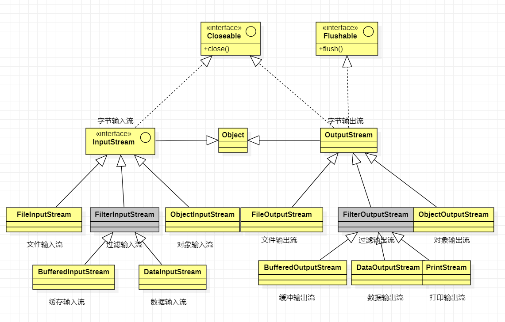

**Reader和Writer继承结构图**

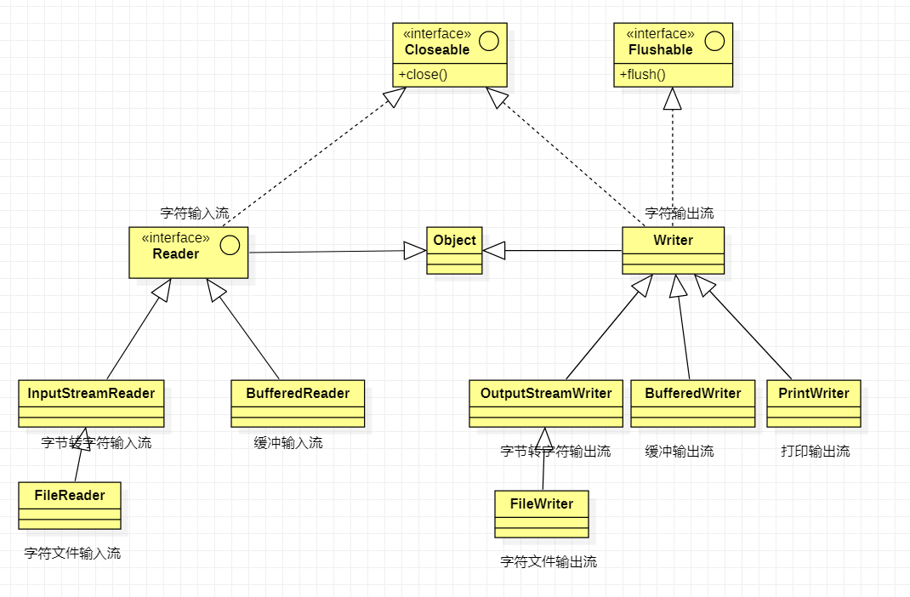

### 6.1Java流

#### 6.1.1概述

文件通常由一连串的字节或字符构成，其中组成文件的**字节序列**称为**字节流**，组成文件的**字符序列**称为**字符流**。

Java根据流的方向还可以分为**输入流**和**输出流**

> 输入流：将文件或其它输入设备的数据加载到内存的过程。
>
> 输出流：将内存中的数据保存到文件或其他输出设备的过程。

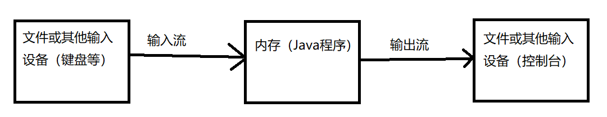

由于文件是由字符或字节构成，所以在Java语言中把输入流和输出流分成了两个，**字节输入输出流**和**字符输入输出流**。

> 输入流：
>
> - 字节输入：InputStream
> - 字符输入：Reader
>
> 输出流：
>
> - 字节输出：OutputStream
> - 字符输出：Writer

#### 6.1.2InputStream（字节输入流）

InputStream是字节输入流，一个抽象类，所有继承了InputStream的类都是字节输入流。

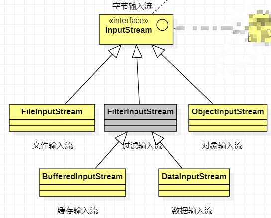

主要方法：

| 主要方法                             | 描述                                                  |
| ------------------------------------ | ----------------------------------------------------- |
| void close()                         | 关闭此输入流并释放与该流关联的所有系统资源            |
| abstract int read()                  | 从输入流读取下一个数据字节                            |
| int read(byte[] b)                   | 从输入流中读取一定数量的字节并将其存储在缓冲区数组b中 |
| int read(byte[] b, int off, int len) | 将输入流中最多len个数据字节读入字节数组               |

#### 6.1.3OutputStream（字节输出流）

OputStream是字节输出流，一个抽象类，所有继承了OutputStream的类都是字节输出流。

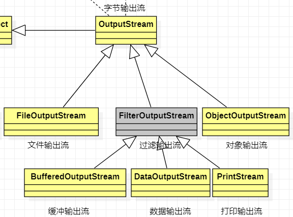

主要方法：

| 主要方法                               | 描述                                                   |
| -------------------------------------- | ------------------------------------------------------ |
| void  close()                          | 关闭此输出流并释放与此流有关的所有系统资源             |
| void flush()                           | 刷新此输出流并**强制**写出所有的缓冲字节               |
| void write(byte[] b)                   | 将b.length个字节从指定的字节数组写入此输出流           |
| void write(byte[] b, int off, int len) | 将指定字节数组中从偏移量off开始的len个字节写入此输出流 |
| abstract void write(int b)             | 将指定的字节写入此输出流                               |

#### 6.1.4Reader（字符输入流）

Reader是字符输入流，一个抽象类，所有继承了Reader的类都是字符输入流。

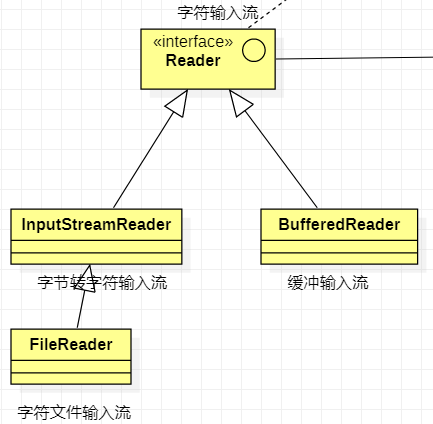

主要方法：

| 主要方法                                         | 描述                     |
| ------------------------------------------------ | ------------------------ |
| abstract void close()                            | 关闭该流                 |
| int read()                                       | 读取单个字符             |
| int read(char[] cbuf)                            | 将字符读入数组           |
| abstract int read(char[] cbuf, int off, int len) | 将字符读入数组的某一部分 |

#### 6.1.5Writer（字符输出流）

Writer是字符输出流，一个抽象类，所有继承了Writer的类都是字符输出流。

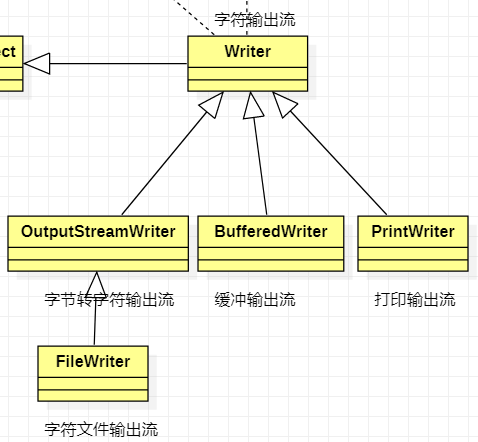

主要方法：

| 主要方法                                           | 描述                     |
| -------------------------------------------------- | ------------------------ |
| Writer append(char c)                              | 将指定字符追加到此writer |
| abstract void close()                              | 关闭此流，但要先刷新它   |
| abstract void flush()                              | 刷新此流                 |
| void write(char[] cbuf)                            | 写入字符数组             |
| abstract void write(char[] cbuf, int off, int len) | 写入字符数组的某一部分   |
| void write(int c)                                  | 写入单个字符             |
| void write(String str)                             | 写入字符串               |
| void write(String str, int off, int len)           | 写入字符串的某一部分     |

#### 6.1.6关于UTF-8，GBK，ANSI之间的关系和区别

> GBK是属于ANSI之中的，在ANSI的国际通用集，GBK是专门来解决中文编码的，是双字节的，不论中英文都是双字节。
>
> 而UTF-8是采用的另外的一种编码方式，对英文用8位，对中文用24位，是和ANSI和GBK的编码方式有本质区别的。
>
> 记事本默认的保存方式是ANSI，并且用不同的编码方式编写的文件必须用对应的编码格式来读取，否则会出现乱码。

****

### 6.2文件流

>输入流：
>
>- 文件字节输入流
>- 文件字符输入流
>
>输出流：
>
>- 文件字节输出流
>- 文件字符输出流

#### 6.2.1FileInputStream（文件字节输入流）

FileInputStream主要按照字节方式读取文件。

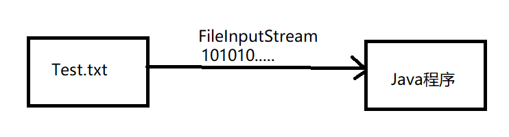

```java
package File_IO_Demo;

import java.io.FileInputStream;
import java.io.FileNotFoundException;
import java.io.IOException;
import java.io.InputStream;

public class Test {
    public static void main(String[] args) {
        InputStream in = null;
        try {
            in = new FileInputStream("c:\\test.txt");
            int b = 0;
            while ((b = in.read()) != -1){
                System.out.println(b);
            }
        } catch (FileNotFoundException e) {
            e.printStackTrace();
        } catch (IOException e) {
            e.printStackTrace();
        }finally {
            try {
                if (in != null) {
                    in.close();
                }
            } catch (IOException e) {
                e.printStackTrace();
            }
        }
    }
}
```

运行结果：

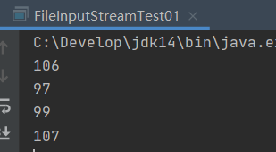

>test.txt中的文本内容是jack
>
>可以看出文件可以正确读取，但是读取出的是ASCII码，原因在于使用了字节输入流，是一个字节一个字节读取的，所以读出一个字节就打印，打出来了每个字母的ASCII码。

#### 6.2.2FileOutputStream（文件字节输出流）

FileOutputStream主要按照字节方式写文件

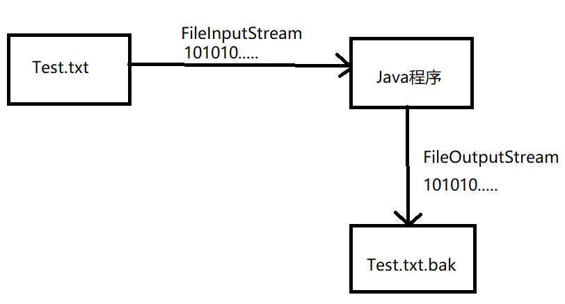

```java
package File_IO_Demo;

import java.io.*;

public class Test {
    public static void main(String[] args) {
        InputStream in = null;
        OutputStream out = null;
        try {
            in = new FileInputStream("c:\\test.txt");
            out = new FileOutputStream("c:\\testbak.txt");
            int b = 0;
            while ((b = in.read()) != -1){
                out.write(b);
            }
            System.out.println("文件复制完毕！");
        } catch (FileNotFoundException e) {
            e.printStackTrace();
        } catch (IOException e) {
            e.printStackTrace();
        }finally {
            try {
                if (in != null) {
                    in.close();
                }
                if (out != null){
                    out.close();
                }
            } catch (IOException e) {
                e.printStackTrace();
            }
        }
    }
}
```

#### 6.2.3FileReader（文件字符输入流）

FileReader是以字符为单位读取文件的流，也可以一次读取两个字节。

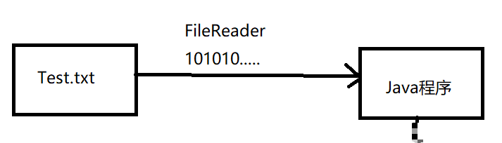

```java
package File_IO_Demo;

import java.io.*;

public class Test {
    public static void main(String[] args) {
        Reader r = null;
        try {
            r = new FileReader("c:\\test.txt");
            int b = 0;
            while ((b = r.read()) != -1){
                System.out.print((char)b);
            }
        } catch (FileNotFoundException e) {
            e.printStackTrace();
        } catch (IOException e) {
            e.printStackTrace();
        }finally {
            try {
                if (r != null){
                    r.close();
                }
            }catch (IOException e){
                e.printStackTrace();
            }
        }
    }
}
```

#### 6.2.4FileWriter（文件字符输出流）

```java
package File_IO_Demo;

import java.io.*;

public class Test {
    public static void main(String[] args) {
        Reader r = null;
        Writer w = null;
        try {
            r = new FileReader("c:\\test.txt");
            w = new FileWriter("c:\\testbak.txt");
            int b = 0;
            while ((b = r.read()) != -1){
                w.append((char)b);
            }
            System.out.println("文件复制成功！");
        } catch (FileNotFoundException e) {
            e.printStackTrace();
        } catch (IOException e) {
            e.printStackTrace();
        }finally {
            try {
                if (r != null){
                    r.close();
                }
                if (w != null){
                    w.close();
                }
            } catch (IOException e) {
                e.printStackTrace();
            }
        }
    }
}
```

### 6.3缓冲流

缓冲流主要是为了提高效率而存在的，减少物理读取次数。

> 缓冲流主要有：
>
> - BufferedInputStream
> - BufferedOutputStream
> - BufferedReader
> - BufferedWriter

**BufferedReader提供了实用方法readLine()，可以直接读取一行。**

**BufferWriter提供了newLine()可以写换行符。**

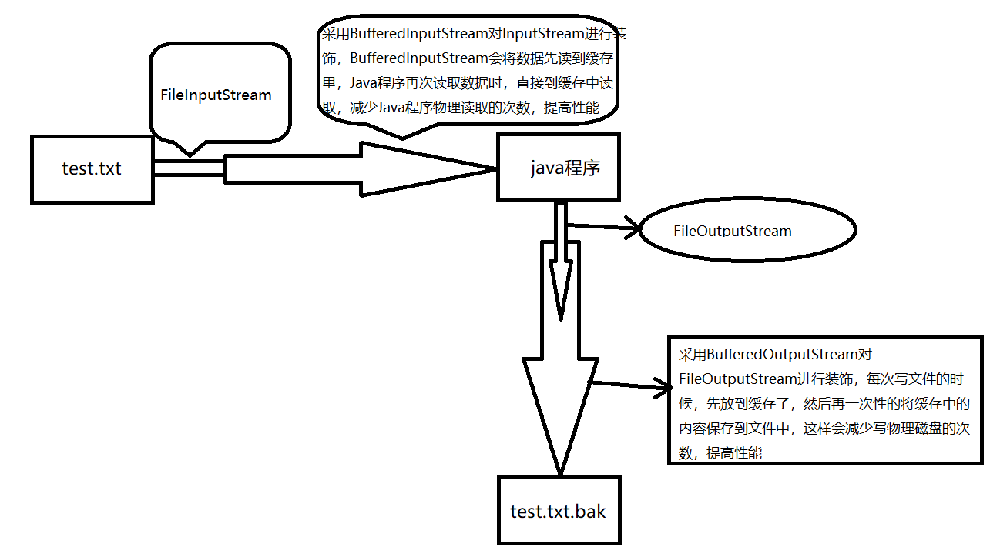

#### 6.3.1使用BufferedInputStream和BufferedOutputStream来改造代码

```java
package File_IO_Demo;

import java.io.*;

public class Test {
    public static void main(String[] args) throws IOException {
        InputStream in = null;
        OutputStream out = null;
        // 方便起见先将异常抛出
        in = new BufferedInputStream(new FileInputStream("c:\\test.txt"));
        out = new BufferedOutputStream(new FileOutputStream("c:\\testbak.txt"));
        int b = 0;
        while ((b = in.read()) != -1) {
            out.write(b);
        }
        System.out.println("文件复制完毕！");
        if (in != null) {
            in.close();
        }
        if (out != null) {
            out.flush();
            out.close();
        }
    }
}
```

> **flush的含义是刷新缓冲区,也就是将缓存区中的数据写到磁盘上，不再放到内存里了,在执行out.close()时，其实默认执行了out.flush(),我们在这里可以不用显示的调用。**

#### 6.3.2使用BufferedReader和BufferedWriter来改造代码

```java
package File_IO_Demo;

import java.io.*;

public class Test {
    public static void main(String[] args) throws IOException {
        BufferedReader r = null;
        BufferedWriter w = null;
        r = new BufferedReader(new FileReader("c:\\test.txt"));
        w = new BufferedWriter(new FileWriter("c:\\testbak.txt"));
        String s = null;
        while ((s = r.readLine()) != null){
            w.write(s);
            w.newLine();
        }
        System.out.println("文件复制完毕！");
        if (r != null){
            r.close();
        }
        if (w != null){
            w.flush();
            w.close();
        }
    }
}
```

### 6.4转换流

#### 6.4.1InputStreamReader

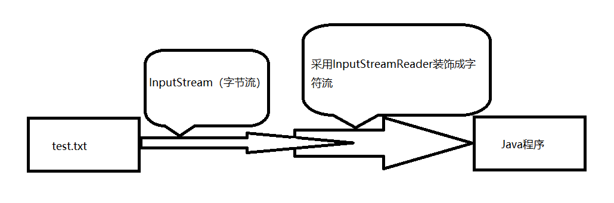

使用InputStreamReader和OutputStreamWriter改造代码

```java
package File_IO_Demo;

import java.io.*;

public class Test {
    public static void main(String[] args) throws IOException {
        BufferedReader r = null;
        BufferedWriter w = null;
        // 使用FileInputStream字节输入流读取文件，使用InputStreamReader将字节流转换成字符流
        r = new BufferedReader(new InputStreamReader(new FileInputStream("c:\\test.txt")));
        w = new BufferedWriter(new OutputStreamWriter(new FileOutputStream("c:\\testbak.txt")));
        String s = null;
        while ((s = r.readLine()) != null){
            w.write(s);
            w.newLine();
        }
        System.out.println("文件复制完毕！");
        if (r != null){
            r.close();
        }
        if (w != null){
            w.flush();
            w.close();
        }
    }
}
```

### 6.5打印流

**打印流主要包含两个：PrintStream和PrintWriter，分别对应字节流和字符流。**

#### 6.5.1完成屏幕打印的重定向

> System.out其实对应的就是PrintStream，默认输出到控制台，我们可以重定向它的输出，可以定向到文件，也就是执行System.out.println(“hello”)不输出到屏幕，而输出到文件。

```java
package File_IO_Demo;

import java.io.*;

public class Test {
    public static void main(String[] args) throws IOException {
        OutputStream out = null;
        out = new FileOutputStream("c:\\test.txt");
        System.setOut(new PrintStream(out));
        System.out.println("123456");
        if (out != null){
            out.close();
        }
    }
}
```

#### 6.5.2接受屏幕输入

```java
package File_IO_Demo;

import java.io.*;

public class Test {
    public static void main(String[] args) throws IOException {
        BufferedReader br = null;
        br = new BufferedReader(new InputStreamReader(System.in));
        String s = null;
        while ((s = br.readLine()) != null){
            System.out.println(s);
            // 输入q退出循环
            if ("q".equals(s)){
                break;
            }
        }
        if (br != null){
            br.close();
        }
    }
}
```

运行结果：

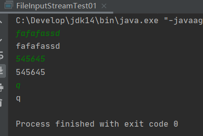

### 6.6对象流

对象流可以将Java对象转换成二进制写入磁盘，这个过程通常叫做**序列化**，并且还可以从磁盘读出完整的Java对象，而这个过程叫做**反序列化**。

> 对象输入流：ObjectInputStream
>
> 对象输出流：ObjectOutputStream

#### 6.6.1如何实现序列化和反序列化

**如果实现序列化该类必须实现序列化接口java.io.Serializable，该接口没有任何方法，该接口只是一种标记接口，标记这个类是可以序列化的**

序列化：

```java
package File_IO_Demo;

import java.io.*;

public class Test01 {
    public static void main(String[] args) throws IOException {
        ObjectOutputStream oos = null;
        oos = new ObjectOutputStream(new FileOutputStream("c:/test.txt"));
        Person p = new Person();
        p.name = "张三";
        oos.writeObject(p);
        if (oos != null){
            oos.close();
        }
    }
}
class Person implements Serializable{
    String name;
}
```

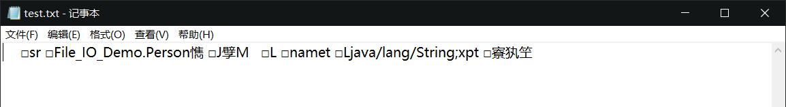

反序列化：

```java
package File_IO_Demo;

import java.io.*;

public class Test02 {
    public static void main(String[] args) throws IOException, ClassNotFoundException {
        ObjectInputStream ois = null;
        ois = new ObjectInputStream(new FileInputStream("c:\\test.txt"));
        Person person = (Person)ois.readObject();
        System.out.println(person.name);
        if (ois != null){
            ois.close();
        }
    }
}
```

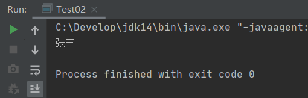

#### 6.6.2transient关键字

**采用transient关键字修饰此属性，序列化时会忽略。**

```java
// 使用transient关键字修饰age属性，并在对象输出流时赋值20，进行序列化
class Person implements Serializable{
    String name;
    transient int age;
}

// 在输入流进行反序列化的时候，会忽略这个属性
package File_IO_Demo;

import java.io.*;

public class Test02 {
    public static void main(String[] args) throws IOException, ClassNotFoundException {
        ObjectInputStream ois = null;
        ois = new ObjectInputStream(new FileInputStream("c:\\test.txt"));
        Person person = (Person)ois.readObject();
        System.out.println(person.name);
        System.out.println(person.age);
        if (ois != null){
            ois.close();
        }
    }
}
```

运行结果：

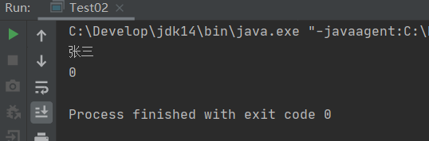

#### 6.6.3serialVersionUID属性

在上面代码中序列化时的Person类不变，在反序列化时中加入sex属性，运行会出错。

```java
Exception in thread "main" java.io.InvalidClassException: File_IO_Demo.Person; local class incompatible: stream classdesc serialVersionUID = -8777751755610395719, local class serialVersionUID = 1070709798622267912
	at java.base/java.io.ObjectStreamClass.initNonProxy(ObjectStreamClass.java:715)
	at java.base/java.io.ObjectInputStream.readNonProxyDesc(ObjectInputStream.java:2021)
	at java.base/java.io.ObjectInputStream.readClassDesc(ObjectInputStream.java:1890)
	at java.base/java.io.ObjectInputStream.readOrdinaryObject(ObjectInputStream.java:2183)
	at java.base/java.io.ObjectInputStream.readObject0(ObjectInputStream.java:1707)
	at java.base/java.io.ObjectInputStream.readObject(ObjectInputStream.java:517)
	at java.base/java.io.ObjectInputStream.readObject(ObjectInputStream.java:475)
	at File_IO_Demo.Test02.main(Test02.java:9)
```

这说明在序列化时，会为该类生成一个serialVersionUID=-8777751755610395719，但在加入了新的属性以后，又生成了一个新的

serialVersionUID = 1070709798622267912，而这两个id不同，所以Java认为是不兼容的两个类。

通常在序列化的类中加入如下定义：

```java
static final long serialVersionUID = -111111111111111111L;
// 系统会把当前serialVersionUID成员域的值作为类的序列号（类的版本号），这样不管你的类如何升级，那么他的序列号（版本号）都是一样的，就不会产生类的兼容问题。
```

### 6.7File类

File提供了大量的文件操作：删除文件，修改文件，得到文件修改日期，建立目录、列表文件等等。

```java
package File_IO_Demo;

import java.io.File;
import java.io.IOException;

// 递归读取目录及子目录下的文件
public class Test02 {
    public static void main(String[] args) throws IOException, ClassNotFoundException {
        listFile(new File("c:\\Blogs"), 0);
    }
    public static void listFile(File f, int level){
        String s = "";
        for (int i = 0; i < level; i++){
            s+="--";
        }
        File[] files = f.listFiles();
        for (int i = 0; i < files.length; i++){
            System.out.println(s + files[i].getName());
            if (files[i].isDirectory()){
                listFile(files[i],level+1);
            }
        }
    }
}

```

