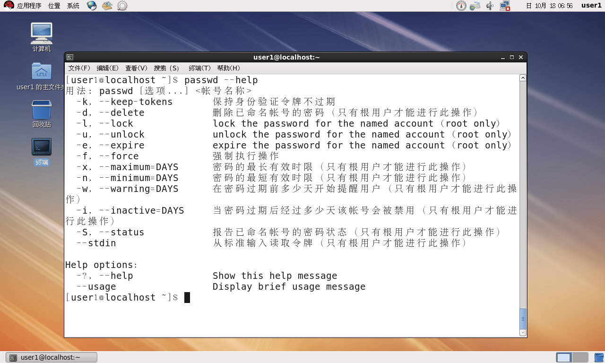
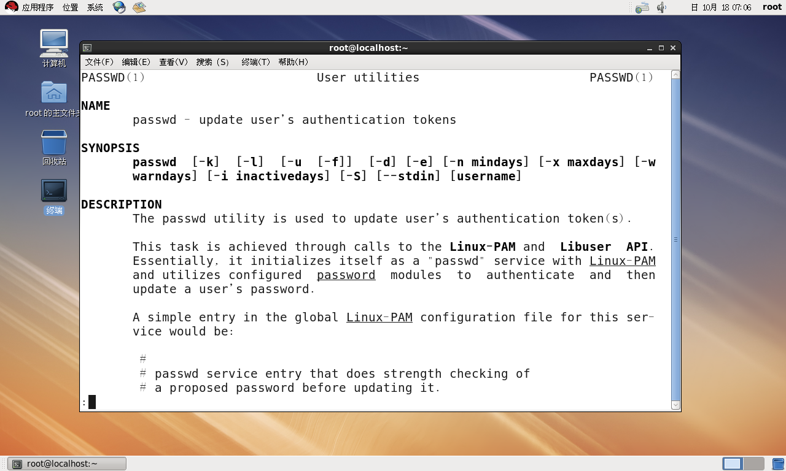
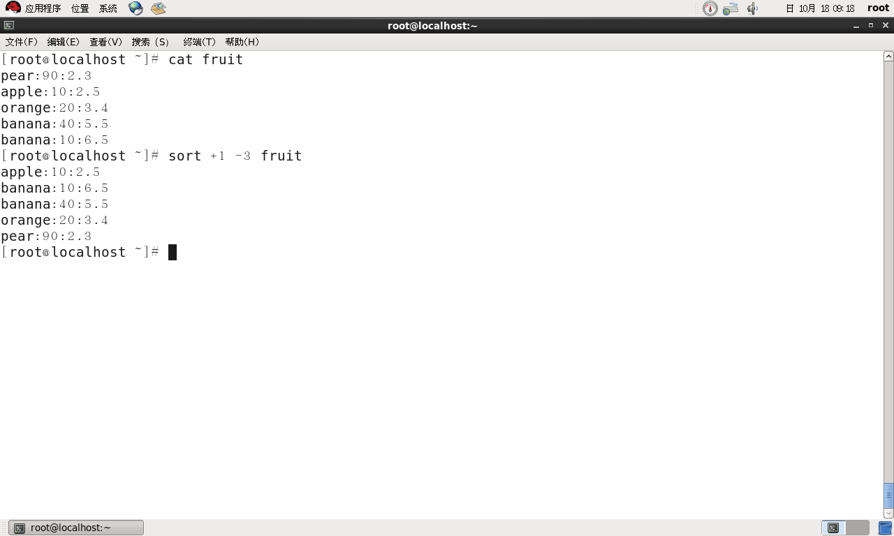

# Linux复习


## 第一章：Linux基础及安装


### 1.3Linux基础

#### 1.3.6Linux的基本命令

1. passwd命令

> 使用passwd命令修改密码，命令格式：
>
> ```
> passwd
> ```
>
> 

2. --help命令

> --help选项放在命令之后，用来显示命令的一些信息，命令格式：
>
> ```
> // Command是命令
> Command --help
> ```
>
> 

3. man命令

> man命令可以显示系统文档中的man页内容，命令格式：
>
> ```
> man Command
> ```
>
> 

4. info命令

> 使用info命令可以查看关于命令的说明文档，命令格式：
>
> ```
> info Command
> ```
>
> 

5. who命令

> who命令用于查看当前登录到系统的用户信息，命令格式：
>
> ```
> who [lqsu]
> // l:显示系统中登录的终端
> // q:显示本地系统上的用户名称和用户总数
> // s:显示登录用户名、终端号、日期和时间
> // u:显示此时在系统中的用户
> // 第一列是用户名；第二列是用户连接的终端名；第三列是用户登录的日期及时间
> ```
>
> 

6. uname命令

> uname命令显示正在使用的Linux系统信息，命令格式：
>
> ```
> uname [-rnv]
> // -r:显示操作系统的内核发行号
> // -n:显示网络上本机的节点名
> // -v:显示操作系统的内核版本号
> ```
>
> 

7. date命令

> 显示或设置系统的时间，命令格式：
>
> ```
> date [+%adDhHjmMrSTwWy]
> // +%adDhHjmMrSTwWy 显示日期的各种方式
> // j:指明是一年中的第几天
> // w:以0-6显示星期几，星期天为0
> // W:指明是一年中的第几周
> ```
>
> 

8. cal命令：

> 在屏幕上输出日历信息，命令格式：
>
> ```
> cal [month] [year]
> // month:表示月份1-12
> // year:表示年1-9999
> ```
>
> 

9. echo命令：

> 用于回显输入内容，命令格式：
>
> ```
> echo strings
> ```
>
> 

10. clear命令

> 清除Shell窗口中的内容，命令格式：
>
> ```
> clear
> ```

11. su命令

> 切换到其他用户使用的系统使用su命令，从切换用户退回到原来用户使用exit命令，命令格式：
>
> ```
> su username
> exit
> ```
>
> 

### 第一章 习题

1. **Linux的主要特点是什么？**

> Linux具有UNIX的所有特性并且具有自己独特的魅力，主要表现在以下几个方面：
>
> - 开放性
> - 多用户
> - 多任务
> - 出色的稳定性能
> - 良好的用户界面
> - 设备独立性
> - 丰富的网络功能
> - 可靠的安全性
> - 良好的可移植性

2. **Linux的主要组成包括什么？**

> - Linux内核（Kernel）
> - Linux的Shell
> - Linux 文件系统
> - Linux 实用程序(utilities)和应用程序（Applications）

3. **什么是Linux的内核版本和发行版本？**

> Linux的内核版本是指在Linus Torvalds领导下开发小组开发出的系统内核的版本号。内核版本号由3个数字组成，形式如下：
>
> ```
> major.minor.patchlevel
> // major：目前发布的Kernel主版本号。
> // minor：为次版本号
> // 一般来说偶数的版本标明这是一个可以使用的稳定版本，而奇数的版本一般加入了一些新的内容，不一定很稳定，是测试版本。
> // patchlevel：表示对当前版本的修补次数
> ```
>
> 发行版本是一些组织或厂家将Linux系统内核与应用软件和文档封装起来，并提供一些安装界面和系统设定管理工具的一个软件包的集合。目前已经有了几百种发行版本。

4. **Linux系统的用户有哪些？**

> Linux是多用户系统，用户分为根用户（系统管理员）和普通用户两大类，还有特殊用户。
>
> - 根用户（系统管理用）又称为超级用户，用户账号为root，在系统中拥有最高权限，主要负责系统的管理工作。
> - 普通用户账号有根用户创建，命名时不能以数字和下划线作为第一个字符。普通用户是系统的使用者，只在自己的目录下工作，没有系统管理权限。、
> - 特殊用户，是系统的一个虚拟用户，用于系统的日常管理。

5. **什么是运行级别？Linux有哪些运行级别？**

> 所谓运行级别就是操作系统当前正在运行的功能级别。这个级别从0到6，具有不同的功能，在/etc/inittab 文件中定义。七个运行级别为：
>
> - 0 - 关机（千万不要把initdefault 设置为0 ）
> - 1 - 单用户模式 
> - 2 - 多用户模式，但是没有 NFS 
> - 3 - 完全多用户模式
> - 4 - 没有用到 
> - 5 - X11 
> - 6 - 重启（千万不要把initdefault 设置为6 ）

6. **如何安全关闭系统？**

> - 图形界面：系统—>关机
> - 文本界面：有shutdown、halt、reboot、init


## 第二章：Linux的文件系统


### 2.3Linux文件系统操作

#### 2.3.2文件操作命令

##### 2.3.2.1显示文件命令

1. cat命令：

> 使用cat命令可以把多个文件连接后输出到标准输出（屏幕），或加">文件名"输出到另一个文件中。命令格式：
>
> ```
> cat [选项] ...[文件]...
> // -b:从1开始对所有非空输出行进行编号
> // -n:从1开始对所有输出行编号
> // -s:将连续两行以上的空白行合并成一行空白行
> ```
>
> 
>
> 

2. more命令：

> 使用more命令可以显示文本文件的内容，一次显示一屏，命令格式：
>
> ```
> more [选项...] [文件...]
> // -num:指定一个整数，表示一屏显示多少行
> // -d:在每屏底部显示提示信息，包括当前显示百分比，按键提示等
> // -c或-p:不滚屏，显示下一屏之前先清屏
> // +num:从行号num开始显示
> // +/pattern:定义一字符串，在文件中查找该字符串，从该字符串后开始显示
> ```
>
> 

3. less命令：

> 和more命令相似，less命令允许用户向前(PageUp)或向后(PageDown)浏览文件，命令格式：
>
> ```
> less [选项...] [文件...]
> // -i:搜索时忽略大小写，除非搜索串中包含大写字母
> // -I:搜索时忽略大小写
> // -m:显示读取文件的百分比
> // -M:显示读取文件的百分比、行号及总行数
> // -N:在每行前输出行号
> // -p pattern:定义一字符串，在文件中查找该字符串，从该字符串后开始显示
> ```
>
> 
>
> 

4. head命令：

> 用于查看一个文件的开头部分，行数由参数值决定，默认是10，命令格式：
>
> ```
> head [选项...] [文件...]
> // -cNum:显示文件前Num个字节
> // -nNum:显示文件前Num行，默认显示10行
> ```
>
> 

5. tail命令：

> 用于查看文件的末尾若干行，行数由参数值指定，默认10行，命令格式：
>
> ```
> tail [选项...] [文件...]
> // -cNum:显示文件最后Num个字节
> // -nNum:显示文件最后Num行，默认显示10行
> ```
>
> 

##### 2.3.2.2搜索、排序及去掉重复内容命令

1. grep命令：

> 使用grep命令可以在文本中查找指定模式的词或短语，并把匹配的打印出来，命令格式：
>
> ```
> grep [选项...] 查找模式 [文件...]
> // -b:在显示符合匹配字符串行前，标识该行第一个字符的位编号
> // -c:计算符合匹配字符串的行数
> // -E:将查找模式解释成扩展的正则表达式
> // -F:将查找模式解释成单纯的字符串
> // -i:忽略字符大小写
> // -n:在显示包含匹配字符串的行之前，标示该行的行号
> // -v:反转查找，显示不包含匹配字符串的文本行
> // -V:显示版本信息
> // -x:只显示全行都严格匹配的行
> ```
>
> **grep正则表达式元字符集：**
>
> | 元字符        | 说明                                                      |
> | ------------- | --------------------------------------------------------- |
> | ^             | 行首定位，指定行的头部。'^apple'——所有以apple开头的字符串 |
> | $             | 行尾定位，指定行的尾部。                                  |
> | .             | 匹配任意单个字符，'app.e'——匹配apple，appoe等             |
> | *             | 匹配0个或多个前导字符                                     |
> | [ ]           | 匹配[ ]中的任意单个字符                                   |
> | \ <           | 从匹配正则表达式的行开始                                  |
> | > \           | 到匹配正则表达式的行结束                                  |
> | x \ {m , n\ } | m代表前导字符数量的下限，n代表上限                        |
>
> 

2. sort命令：

> 对指定文件中的所有行排序，将结果显示在标准输出上，默认按ASCII码顺序排序，命令格式：
>
> ```
> sort [选项...] [文件...]
> // -m:若给定文件已排好序，合并文件
> // -c:检查给定文件是否排序，未排序打印出错信息
> // -u:对排序后相同的行只保留一行
> // -o:将排序输出写到输出文件中
> // -d:按字典顺序排序
> // -f:忽略大小写
> // -r:按逆序输出结果，默认按升序输出
> // +pos1-pos2:指定一个或几个字段作为排序关键字，字段位置从pos1开始到pos2位置结束（包括pos1，不包括pos2）
> ```
>
> 

3. uniq命令：

> 用来检查及删除文本中的重复行，读入文件检查和删除**相邻重复出现**的行，然后写到输出文件中，如果输入文件用"-"表示，则从标准输入读取，命令格式：
>
> ```
> uniq [选项...] [输入文件 [输出文件]]
> // -c:显示输出中，在每行行首加上本行在文件中出现的次数
> // -d:只显示文件中各重复行
> // -u:只显示文件中不重复的行
> ```
>
> 

##### 2.3.2.3比较文件内容的命令

1. comm命令：

> 对两个已经排好序的文件进行比较，生成三行输出：在两个文件中都出现的行，仅在文件1中出现的行，仅在文件2中出现的行。命令格式：
>
> ```
> comm [选项...] 文件1 文件2
> // -123:选项123分别表示不显示comm输出中的第一列、第二列和第三列
> ```
>
> 

2. diff命令：

> 比较文件，并找出它们的不同，不要求文件预先排好序，如果两个文件完全一样，则不显示任何输出，命令格式：
>
> ```
> diff [选项...] 文件列表
> // -b:忽略空格
> // -B:忽略空行
> // -i:忽略大小写
> // -r:如果两个文件都是目录文件，则递归比较子目录中的文件
> ```
>
> 
>
> 表示memo1的第二行和memo2的第二行不同

##### 2.3.2.4复制、删除和移动文件的命令

1. cp命令：

> 完成文件的复制。
>
> 如果源是普通文件，该命令将源文件复制成指定文件或指定目录下。
>
> 如果源是目录，目标是已存在目录，那么该命令把源目录下所有文件及子目录复制到目标目录下。
>
> 如果目标是不存在目录，将报错。命令格式：
>
> ```
> cp [选项] 源文件或目录 目标文件或目录
> // -a:等同于-dpR
> // -d:复制符号链接时，将目标文件或目录也建立成符号链接并指向源文件初始链接的原始文件或目录
> // -f:强制执行
> // -i:覆盖目标文件之前需要确认
> // -n:不覆盖已存在文件
> // -p:复制源文件的同时复制文件属性
> // -R:递归复制目录
> ```

2. rm命令：

> 可以删除文件或目录，删除目录必须要加**"-r"**选项，对于链接文件，只删除链接文件，原有文件保持不变，命令格式：
>
> ```
> rm [选项...] 文件或目录
> // -f:强制执行
> // -i:删除前需要用户确认
> // -r:递归删除目录及其子目录和文件
> ```

3. mv命令：

> 移动文件或目录（当源和目标文件不在同一路径时），更改文件或目录的名称（当源和目标文件在同一路径下时），命令格式：
>
> ```
> mv [选项] 源文件或目录 目标文件或目录
> // -i:覆盖文件前确认
> // -f:强制执行
> // -n:不覆盖已存在文件
> // -u:移动或更改文件名时，若目标文件已存在，且文件日期比源文件新，则不覆盖
> ```

##### 2.3.2.5文件内容统计命令

1. wc命令：

> 统计给定文件中的字节数、字数、行数，命令格式：
>
> ```
> wc [选项] [文件]
> // -c:统计字节数
> // -m:统计字符数
> // -l:统计行数
> // -w:统计字数
> ```

##### 2.3.2.6查找文件和目录命令

1. find命令：

> 用于查找符合条件的文件和目录，命令格式：
>
> ```
> find [路径名...] [表达式]
> find命令的表达式很多，可以查找find命令手册
> ```

##### 2.3.2.7文件的压缩和备份

1. bzip2命令：

> .bz2文件的压缩程序，若未加任何参数，bzip2压缩完文件后会产生.bz2的压缩文件并删除原文件，命令格式：
>
> ```
> bzip2 [选项] [要压缩的文件]
> // -c:将压缩或解压缩的结果发送到标准输出
> // -d:执行解压缩
> // -f:压缩或解压缩时，若文件与现有文件同名，则覆盖
> // -k:压缩或解压缩后，保留初始文件
> ```
>
> 

2. gzip命令：

> gzip压缩完文件会产生".gz"的压缩文件，并**删除原始文件**，命令格式：
>
> ```
> gzip [选项] [文件]
> // -c:压缩后输出到标准输出，不改变原始文件
> // -d:解压缩文件
> // -f:强制执行
> // -n:压缩文件时，不保存原来的文件名称和时间戳
> // -N:压缩文件时，保存原来的文件名称和时间戳
> // -r:递归处理，将目录下所有文件一并处理
> ```
>
> 

3. tar命令：

> 用来建立、还原备份文件的工具程序，可以加入、解开备份文件内的文件，命令格式：
>
> ```
> tar [选项] [文件或目录]
> // -A:新增tar文件到已存在的备份文件
> // -c:建立新的备份文件
> // -f<备份文件>:指定备份文件
> // -t:列出备份文件的内容
> // -v:显示指令执行过程
> // -x:从备份文件中还原文件
> // --delete:从备份文件中删除指定的文件
> ```
>
> 

#### 2.3.3目录操作命令

##### 2.3.3.1切换工作目录和显示目录内容的命令

1. cd命令：

> 切换目录到指定目录，命令格式：
>
> ```
> cd 目的目录
> // 回到上级目录：cd ..
> ```

2. pwd命令：

> 查看当前工作目录，命令格式：
>
> ```
> pwd
> ```

3. ls命令：

> 列出目录的内容，包括子目录和文件，命令格式：
>
> ```
> ls [选项] [文件或目录...]
> // -a:列出目录下的所有文件和目录,包括以"."开头的隐含文件
> // -i:列出当前目录文件的结点号
> // -l:列出文件详细信息
> // 可以使用通配符
> ```
>
> - 详细信息分为七个字段列表：
>
>   文件类型	  访问权限	 文件链接数	 文件所有者	文件所属用户组	  文件大小	最后修改时间	文件名
>
> - 文件类型：
>
>   -：表示该文件是一个普通文件
>
>   d：表示该文件是一个目录
>
>   c：表示该文件是字符设备文件
>
>   b：表示该文件是块设备文件
>
>   p：表示该文件是管道文件
>
>   l：表示该文件是符号链接文件
>
>   s：表示该文件是套接字
>
> 

##### 2.3.3.2创建和删除目录命令

1. mkdir命令：

> 创建目录，同时可以设置目录的权限，命令格式：
>
> ```
> mkdir [选项] [目录名]
> // -m:对新建目录设置存取权限
> // -p:如果新建目录的上级目录不存在，则一并建立
> ```
>
> 

2. rmdir命令：

> 从一个目录中删除一个或多个目录，删除目录时，**必须对父目录有写权限**，命令格式：
>
> ```
> rmdir [选项] [目录名]
> // -p:删除指定目录后，若该目录上级目录变成空目录则一并删除
> ```
>
> 

### 第二章 习题

1. **在所用的Linux系统上，根目录下主要含有哪些子目录，各子目录的含义？**

>- /bin：存放二进制可执行命令目录；
>- /home：用户主目录的基点目录，默认情况下每个用户的主目录都设在该目录下，如默认情况下用户user01的主目录就是/home/user01；
>- /lib：存放标准程序设计库目录，又叫动态链接共享库目录，目录中存放的文件作用类似windows里的.dll文件；
>- /etc：存放系统管理和配置文件目录；
>- /dev：存放设备特殊文件目录，如声卡文件、磁盘文件等；
>- /usr：最庞大的目录，存放应用程序和文件目录，其中包含如下目录：
>   - /usr/local/bin：存放本地增加的命令目录；
>   - /usr/local/lib：存放本地增加的库目录；
>   - /usr/X11R6：存放X window目录；
>   - /usr/bin：存放众多的应用程序目录；
>   - /usr/sbin：存放超级用户的一些管理程序目录；
>   - /usr/doc：存放linux文档目录；
>   - /usr/include：存放Linux下开发和编译应用程序所需头文件目录；
>   - /usr/lib：存放常用的动态链接库和软件包的配置文件目录；
>   - /usr/man：存放帮助文档目录；
>   - usr/src：存放源代码目录，Linux内核的源代码就放在/usr/src/linux子目录中；
>- /proc：虚拟目录，是系统内存的映射，可直接访问这个目录来获取系统信息；
>- /root：系统管理员的主目录；
>- /var：存放系统产生的经常变化文件目录，例如打印机、邮件、新闻等假脱机目录、日志文件、格式化后的手册页以及一些应用程序的数据文件等等；
>- /tmp：存放公用临时文件目录。

2. **什么是文件？Linux下主要有哪些类型文件？**

> 文件是指由创建者定义的，具有文件名的一组相关元素的集合，文件可以是文本文档、图片、程序等。
>
> Linux下的文件类型包括：
>
> - 普通文件，也称为常规文件，是Linux中最一般格式的文件。
> - 包括系统文件、用户文件和库函数。
> - 目录文件，是由文件目录信息构成的特殊文件，目录文件的内容不是应用程序和数据，而是用来检索普通文件的目录信息。
> - 设备文件，在Linux中输入输出设备被看做特殊文件，设备文件分两类，字符设备文件和块设备文件。
> - 符号链接文件，是一种特殊类型的文件，它的内容只是一个字符串，该字符串可能指向一个存在的文件也可能什么都不指向。

3. 什么是工作目录、用户主目录 ？

> 工作目录是用户在登录到Linux系统中后所处于的目录，也称为当前目录。
>
> 工作目录用“.”表示，其父目录用“..”表示。可用pwd命令查看工作目录，可用cd命令改变工作目录。 
>
> 用户主目录是系统管理员增加用户时创建的（以后也可以改变），每个用户都有自己的主目录。
>
> 普通用户的主目录在/home下，root用户作为系统管理员，因为身份特殊所以有自己的主目录，在/root下。

4. 根据下图，圆圈代表目录，方框代表文件，当前目录为n，用相对路径法和绝对路径放分别写出文件g、o、z的路径。

   

> 1. 文件g：
>    - 绝对路径：/e/g
>    - 相对路径：../../e/g
> 2. 文件o：
>    - 绝对路径：/e/i/o
>    - 相对路径：../../e/i/o
> 3. 文件z：
>    - 绝对路径：/f/n/v/x/z
>    - 相对路径：./v/x/z

5. 将主目录下的文件.bashrc复制到/tmp下，并重命名为bashrc，用命令实现上述过程。

> ```
> cp ~/.bashrc /tmp/bashrc
> ```

6. 将/home/stud1/wang目录做归档压缩，压缩后生成wang.tar.gz文件，并将此文件保存到/home目录下，用命令实现上述过程。

> ```
> cd /home/stud1
> tar -cvf /home/wang.tar wang
> gzip /home/wang.tar
> ```

7. 在Linux下有一文件列表内容为 lrwxrwxrwx	1	hawkeye	users	6	Jul	18	09:41	nurse2—>nurse1

   （1）要完整显示如上文件类别信息，应该使用什么命令？

   > ```
   > ls -l
   > ```

   （2）上述文件列表内容的第一列内容“lrwxrwxrwx”中的“l”是什么含义？对于其它类型的文件或目录还可能出现什么字符，它们分别表示什么含义？

   > -：表示该文件是一个普通文件
   >
   > d：表示该文件是一个目录
   >
   > c：表示该文件是字符设备文件
   >
   > b：表示该文件是块设备文件
   >
   > p：表示该文件是管道文件
   >
   > l：表示该文件是符号链接文件
   >
   > s：表示该文件是套接字

   （3）上述文件列表内容的第一列内容“lrwxrwxrwx”中的第一、二、三个“rwx”分别代表什么含义？

   > - 第一个“rwx”表示该文件的文件主人具有读写执行的权限
   >
   > - 第二个“rwx”表示该文件的主人同组用户具有读写执行的权限
   >
   > - 第三个“rwx”表示该文件的其他用户具有读写执行的权限。

8. 在用户user的主目录下新建目录software，并将路径/etc下所有以h开头的文件及目录拷贝到software中，用命令实现上述过程。

> ```
> mkdir /home/user/software
> cp /etc/h* /home/user/software
> ```


## 第三章：Linux的vim编辑器

### 3.4vim的编辑命令


#### 3.4.2文本插入

1. 插入命令：

> 使用该命令插入文本，命令格式：
>
> ```
> i/I
> // i:从光标所在位置前插入
> // I:将光标移动到当前行首插入
> ```

2. 附加命令：

> 使用该命令追加文本，命令格式：
>
> ```
> a/A
> // a:从光标所在位置之后追加文本
> // A:将光标移动到所在行的行尾，从行尾插入文本
> ```

3. 打开命令：

> 使用该命令可以插入一行，命令格式：
>
> ```
> o/O
> // o:在当前行的下面插入一行
> // O:在当前行的上面插入一行
> ```

#### 3.4.3文本删除

1. 在命令模式下删除文本

> 一些常用的删除文本命令
>
> | 命令     | 功能                             |
> | -------- | -------------------------------- |
> | x        | 删除当前字符                     |
> | d0(数字) | 删除从当前字符的前一个字符到行首 |
> | d$       | 删除从当前字符到行尾             |
> | dd       | 删除当前行                       |
> | ndd      | 删除当前行开始连续的n行          |

2. 在末行模式下删除文本

> 可以实现对文本指定行的删除，命令格式：
>
> ```
> : 行x, 行y d
> // 表示删除x至y行的文本内容
> ```
>
> **vim编辑环境默认不显示行号，显示行号的命令如下：**
>
> ```
> :set number
> ```

3. **撤销操作：**

> 使用该命令可以撤销上次操作，命令格式：
>
> ```
> u
> ```

#### 3.4.4文本复制与粘贴

1. 命令模式下的文本复制：

> 在命令模式下，文本复制的命令格式：
>
> ```
> yw	// 将光标所在位置到字尾的字符复制到缓冲区
> nyw // 将从光标所在位置开始的n个字符复制到缓冲区
> yy  // 将光标所在的行复制到缓冲区
> nyy // 将光标所在的行开始连续n行复制到缓冲区
> p	// 将缓冲区的字符粘贴到光标所在位置
> ```
>
> **注意：所有的复制命令都要与p命令配合使用才会完成复制粘贴！**

2. 末行模式下的文本复制：

> 末行模式下的复制，命令格式：
>
> ```
> : 行x, 行y co 行z
> // 将文本x~y行的内容，复制到z行下
> ```


#### 3.4.5文本移动

1. 在命令模式下文本移动：

> // 1.使用文本删除命令将要移动的文本删除
>
> // 2.使用光标移动命令将光标移动到目标位置
>
> // 3.使用p命令将刚刚删除的文本粘贴到目标位置

2. 在末行模式下文本移动：

> 在末行模式下进行文本移动，命令格式：
>
> ```
> : 行x, 行y m 行z
> // 将x~y行的文本内容移动到z行下
> ```


### 第三章 习题

1. vim有几种工作模式？各模式之间如何转换？

> 

2. 进入vim有几种方式？退出vim有几种方式？

> - 进入：vim或者vim+filename
> - 退出：命令模式ZZ，末行模式：q或者q！

3. 在末行模式下如何复制一段文本？移动一段文本？替换一段文本？

> 1. 复制：n1,n2 co n3
> 2. 移动：n1,n2 m n3
> 3. 替换：n1,n2 s/pattern1/pattern2

4. 使用哪个命令可以在当前工作编辑环境中向后搜索以单词hello开始的行？

> 使用命令方式下：/hello

5. 如何撤销上次操作？

> u


## 第四章：Linux系统管理基础

### 第四章 习题

1. 在Linux系统中运行级别分为几级？分别有何特点？

> 系统的运行级别是系统运行时所处的一种状态，不同的运行级别在用户登录及使用上有一些不同。Linux系统提供7种运行级别，7种运行级别定义如下：
>
> - 运行级别0：系统停机状态，系统默认运行级别不能设为0，否则不能正常启动。
> - 运行级别1：单用户工作状态，root权限，用于系统维护，禁止远程登陆。
> - 运行级别2：多用户状态（没有NFS支持）
> - 运行级别3：完全的多用户状态（有NFS），标准运行级别，登录后进入命令行模式。
> - 运行级别4：系统未使用，保留。
> - 运行级别5：多用户模式，X11控制台，登录后进入图形GUI模式。
> - 运行级别6：系统正常关闭并重启，默认运行级别不能设为6，否则不能正常启动。

2. Linux系统用户的类型都有哪些？

> 1. 超级用户
> 2. 普通用户
> 3. 特殊用户

3. Linux用户管理相关的文件有哪些？解释文件内容

> 在Linux系统中，主要使用/etc目录下的三个文件来维护用户及用户组的相关信息。
>
> 1. /etc/passwd文件，其中存放关于账户相关的信息
> 2. /etc/shadow文件，/etc/passwd的影子文件，来存放用户的加密口令
> 3. /etc/group文件，其中存放用户组相关的信息资料

4. 使用useradd命令添加用户student，然后使用userdel删除该用户。

> ```.
> useradd student
> passwd student
> userdel student
> ```

5. 如何进行u盘挂载？卸载？

> ```
> 挂载u盘设备（假设u盘标识为sdb1）到/mnt/usb目录。
> mount /dev/sdb1 /mnt/usb
> ```

6. 什么是进程？**进程的分类？**

> “进程”（Process）来描述程序动态执行过程。
>
> 进程分为两大类：
>
> - **系统进程**：系统进程与终端无关，不由用户启动，通常也叫做守护进程，是核心专用的特殊程序。
>   - **进程0**：sysproc进程。管理换入与换出的进程，对系统中运行的进程进行合理调度。将进程从硬盘交换区调入内存的过程成为调入；将进程从内存调到硬盘交换区的过程称为调出。该进程是UNIX核心创建的第一个进程。
>   - **进程1**：init进程。系统初始化进程，是所有用户进程和非sysproc进程的祖先。
> - **用户进程**


## 第五章：Linux的网络管理及应用

### 5.1Linux网络管理命令

1. ifconfig命令：

> 用于查看和更改接口的地址和参数，命令格式：
>
> ```
> ifconfig
> // interface:网络接口名，如eth1,eth0
> // up:激活网卡设备
> // down:关闭网卡设备
> // address:指定设备ip地址
> ```
>
> 

2. ping命令：

> 使用ping命令来检测整个网络连通清情况，命令格式：
>
> ```
> ping 本机IP
> ping 本机主机名
> ping 网关
> // -cN:设置回应几次:
> ```


### 5.2文件服务器配置：NFS

**实验三报告**


## 第六章：Linux下Shell编程

### 6.4Shell变量

#### 6.4.1用户自定义变量

1. 变量的定义和使用：

> 格式：
>
> ```
> 变量名=值
> ```
>
> **注意：如果字符串中包含空格，必须使用引号括起来，等号两边不能有空格！**

2. 

> 格式：
>
> ```
> unset 变量名
> ```


#### 6.4.3位置变量

如果脚本执行时有参数，那么会创建一些额外的变量，称为位置变量。

```
// Shell提供的位置变量有:
$0、$2、$3、$4、$5、$6、$7、$8、$9
// 其中$0存放脚本名，$1~$9依次存放参数
```

当命令行上的参数超过九个时，Shell提供`shift`命令可以把所有参数变量左移一个位置，使`$2`变成`$1`,以此类推。原来的`$1`将被丢弃，`$0`保持不变。

```
shift [n]
// n表示向左移动参数的个数，默认为1
```

1. 示例shift_script：

> ```shell
> #!/bin/bash
> #This is script test shift
> echo $0
> echo $1,$2,$3,$4,$5,$6,$7,$8,$9
> shift
> echo $1,$2,$3,$4,$5,$6,$7,$8,$9
> shift
> echo $1,$2,$3,$4,$5,$6,$7,$8,$9
> shift 2
> echo $1,$2,$3,$4,$5,$6,$7,$8,$9
> shift 2
> echo $1,$2,$3,$4,$5,$6,$7,$8,$9
> #script end
> ```
>
> 


#### 6.4.4特殊变量

Shell中有一些变量是系统定义的，有特殊含义，变量值由系统指定，称之为系统变量。

> ```
> 常见的特殊变量：
> // $#:表示传递给脚本的实际参数个数
> // $$:当前Shell脚本的进程号
> // $*:位置参数的值，参数之间使用IFS中定义的字符分隔开
> // $@:位置参数的值，不使用IFS环境变量
> ```
>
> 两者的区别：
>
> 
>
> 1. 示例specialvar_demo:
>
> ```shell
> #!/bin/bash
> #This script test special variable
> echo "the script name is :$0"
> echo "the total arguments number is :$#"
> echo "the arguments are $@"
> echo "the arguments are $*"
> echo '$$' is $$
> echo "end"
> ```
>
> 


### 6.5Shell编程基础

#### 6.5.2Shell的逻辑运算

##### 6.5.2.1条件测试

> Shell脚本编程中有两条测试命令，命令格式：
>
> ```
> test 条件表达式
> [ 条件表达式 ]
> ```

1. 字符串比较

| 字符串比较         | 结果                       |
| ------------------ | -------------------------- |
| string1 = string2  | 如果两个字符串相同结果为真 |
| string1 != string2 | 如果两个字符串不同结果为真 |
| -n string          | 如果字符串不为空则结果为真 |
| -z string          | 如果字符串为空则结果为真   |

2. 算术比较

| 算术比较            | 结果                                 |
| ------------------- | ------------------------------------ |
| 表达式1 -eq 表达式2 | 如果两个表达式相等结果为真           |
| 表达式1 -ne 表达式2 | 如果两个表达式不等结果为真           |
| 表达式1 -gt 表达式2 | 如果表达式1大于表达式2结果为真       |
| 表达式1 -ge 表达式2 | 如果表达式1大于或等于表达式2结果为真 |
| 表达式1 -lt 表达式2 | 如果表达式1小于表达式2结果为真       |
| 表达式1 -le 表达式2 | 如果表达式1小于或等于表达式2结果为真 |
| ！表达式            | 取反                                 |

3. 文件测试

| 文件条件测试 | 结果                         |
| ------------ | ---------------------------- |
| -d file      | 如果文件是目录结果为真       |
| -e file      | 如果文件存在结果为真         |
| -f file      | 如果是普通文件结果为真       |
| -g file      | 如果文件的SGID被设置结果为真 |
| -r file      | 如果文件可读结果为真         |
| -s file      | 如果文件长度不为0结果为真    |
| -u file      | 如果文件的SUID被设置结果为真 |
| -w file      | 如果文件可写结果为真         |
| -x file      | 如果文件可执行结果为真       |

##### 6.5.2.2逻辑运算

1. AND运算:

> AND运算符为&&，前面所有的命令都执行成功时执行最后一条命令，命令格式：
>
> ```
> statement1 && statement2 && statement3...
> ```
>
> 1. 示例and_script:
>
> ```shell
> #!/bin/bash
> touch file1
> rm -f file2
> if [ -f file1 ] && echo "hello" && [ -f file2 ] && echo "world"
> then
> echo "in if"
> else
> echo "in else"
> fi
> exit 0
> ```
>
> 

2. OR运算:

> OR运算符为||，持续执行一系列命令直到有一条命令成功为止，其后的命令不再被执行。命令格式：
>
> ```
> statement1 || statement2 || statement3...
> ```
>
> 1. 示例or_script:
>
> ```shell
> #!/bin/bash
> touch file1
> rm -f file2
> if [ -f file1 ] || echo "hello" || [ -f file2 ] || echo "world"
> then
> echo "in if"
> else
> echo "in else"
> fi
> exit 0
> ```
>
> 


### 6.6Shell的控制结构

#### 6.6.1if语句

> 1. 基本的if语句，命令格式：
>
> ```shell
> if condition
> then
> 	statements
> else 
> 	statements
> fi
> ```
>
> - 示例if_script:
>
> ```shell
> #!/bin/bash
> #this script is about if
> echo "abc is the user's name? please answer yes or no"
> read name
> if [ $name="yes" ]
> then
> echo "hello abc!"
> else
> echo "abc isn't the user's name?"
> fi
> exit 0
> ```
>
> 
>
> 2. elif语句，命令格式：
>
> ```shell
> if condition1
> then
> 	statements
> elif condition2
> then
> 	statements
> elif condition3
> then
> 	statements
> ...
> else
> 	statements
> fi
> ```
>
> - 示例elif_script:
>
> ```shell
> #!/bin/bash
> #this script is about elif
> echo "abc is the user's name? please answer yes or no"
> read name
> if [ "$name" = "yes" ]
> then
> echo "hello abc!"
> elif [ "$name" = "no" ]
> then
> echo "abc isn't the user's name"
> else
> echo "input error!"
> fi
> exit 0
> ```
>
> 
>
> - 示例elif1_script:
>
> ```shell
> #!/bin/bash
> echo "please input filename:"
> read file
> if [ -r $file ]
> then
> 	echo "$file is an ordinary file."
> elif [ -d $file ]
> then
> 	echo "$file is an directory."
> else
> 	echo "$file isn't an ordinary file or directory."
> fi
> exit 0
> ```
>
> 


#### 6.6.2case语句

> 1. 多分支结构，根据变量的值执行对应的语句，命令格式：
>
> ```
> case variable in
> pattern1) statements;;
> pattern2) statements;;
> ...
> patternn) statements;;
> *) statements;;
> esac
> // variable表示变量名
> // pattern1)...表示匹配的模式
> // *)表示默认情况
> // esac表示语句结束
> ```
>
> - 示例case_script:
>
> ```shell
> #!/bin/bash
> echo "please enter the number of the week:"
> read number
> case $number in
> 1) echo "Monday";;
> 2) echo "Tuesday";;
> 3) echo "Wednsday";;
> 4) echo "Thursday";;
> 5) echo "Friday";;
> 6) echo "Saturday";;
> 7) echo "Sunday";;
> *) echo "your enter must be in 1-7.";;
> esac
> ```
>
> 
>
> - 示例case1_script:
>
> ```shell
> #!/bin/bash
> echo "abc is the user's name? please answer yes or no"
> read name
> case "$name" in
> y|yes|Y|YES) echo "hello abc!";;
> n*|N*) echo "abc isn't the user's name!";;
> *) echo "sorry,your input isn't recognized.";;
> esac
> exit 0
> ```
>
> 
>
> - 示例case2_script:
>
> ```shell
> #!/bin/bash
> echo "abc is the user's name? please answer yes or no"
> read name
> case "$name" in
> y|yes|Y|YES)
> 	echo "hello abc!"
> 	echo "yes!";;
> n*|N*)
> 	echo "abc isn't the user's name!"
> 	echo "no";;
> *)
> 	echo "sorry,your input isn't recognized."
> 	echo "please answer yes or no"
> exit 1
> ;;
> esac
> exit 0
> ```
>
> 


#### 6.6.3for语句

> 1. 循环处理一组值，可以是任意字符串的集合，可以在脚本里被简单的列出，更常见的是结合通配符使用，命令格式：
>
> ```shell
> for variable in values
> do
> 	statements
> done
> ```
>
> - 示例for_script:
>
> ```shell
> #!/bin/bash
> for var in hello world 123
> do
> echo $var
> done
> exit 0
> ```
>
> 
>
> - 示例for1_script:
>
> ```shell
> #!/bin/bash
> for file in $(ls *_script)
> do
> echo $file
> done
> exit 0
> ```
>
> 
>
> - 示例for2_script:
>
> ```shell
> #!/bin/bash
> for var in $*
> do
> echo "print the arguments $var in the command line."
> done
> exit 0
> ```
>
> 
>
> - 示例for3_script:
>
> ```shell
> #!/bin/bash
> for var in 1 2 3 4 5 6 7 8 9 10
> do
> echo "ok,ready!"
> done
> exit 0
> ```
>
> 


#### 6.6.4while语句

> 1. 在默认情况下所有shell变量值都被认为是字符串，所以for循环适合于对一系列字符串进行循环处理，命令格式：
>
> ```shell
> while condition
> do
> 	statements
> done
> ```
>
> - 示例while_script:
>
> ```shell
> #!/bin/bash
> echo -n "please enter password:"
> read password
> while [ "$password" != "12345" ]
> do
> echo "sorry,try again"
> read password
> done
> exit 0
> ```
>
> 
>
> - 示例while1_script:
>
> ```shell
> #!/bin/bash
> var=1
> while [ "$var" -le 10 ]
> do
> echo "ok,ready!"
> let var=var+1
> done
> exit 0
> ```
>
> 


#### 6.6.5until语句

> 1. until语句和while语句一样，都是循环语句，但处理方式相反，当判断条件为真时，循环停止，命令格式：
>
> ```shell
> until condition
> do
> 	statements
> done
> ```
>
> - 示例until_script:
>
> ````shell
> #!/bin/bash
> until [ -z "$1" ]
> do
> echo -n "$1"
> shift
> done
> echo
> exit 0
> ````
>
> 


#### 6.6.6break和continue语句

> 1. break语句：
>
>    在控制条件未满足之前，跳出for、while、until循环，可以为break命令提供一个额外的数值参数来表明所要跳出的循环层数，默认只跳出一层循环，命令格式：
>
>    ```shell
>    break
>    ```
>
>    - 示例break_script:
>
>    ```shell
>    #!/bin/bash
>    var=0
>    while [ "$var" -le 5 ]
>    do
>    var=$(($var+1))
>    if [ "$var" -gt 2 ]
>    then
>    break
>    fi
>    echo -n "$var"
>    done
>    echo
>    exit 0
>    ```
>
>    
>
> 2. continue语句：
>
>    使for、while、until循环跳出到下一次循环继续执行，循环变量取循环列表的下一个值，命令格式：
>
>    ```shell
>    continue
>    ```
>
>    - 示例continue_script：
>
>    ```shell
>    #!/bin/bash
>    echo "printing numbers 1-10 (but not 3 and 7)."
>    var=0
>    while [ $var -lt 10 ]
>    do
>    let var=var+1
>    if [ $var -eq 3 ] || [ $var -eq 7 ]
>    then
>    continue
>    fi
>    echo -n "$var"
>    done
>    echo
>    exit 0
>    ```
>
>    


### 6.7Shell函数

#### 6.7.1函数定义

> 定义函数，命令格式：
>
> ```shell
> function_name{
> 	statements
> }
> ```

#### 6.7.2函数调用

> 使用时，通过函数名调用
>
> 1. 示例func_script:
>
> ```shell
> #!/bin/bash
> REPEAT=3
> fa(){
> echo "Now fa function is starting..."
> echo 
> }
> fb(){
> i=0
> echo "And now the fb bebins."
> sleep 1
> while [ $i -lt $REPEAT ]
> do
> echo "---functions---"
> echo "------are------"
> echo "-------fb------"
> let i=i+1
> done
> }
> echo "This main script is starting..."
> fa
> fb
> echo "main script ended"
> ```
>
> 
>
> 2. 示例func1_script:
>
> ```shell
> #!/bin/bash
> yesorno(){
> echo "Is your name $*?"
> while true
> do
> echo -n "Enter yes or no:"
> read enter
> case "$enter" in
> y|yes|Y|YES) return 0;;
> n|no|N|NO) return 1;;
> *) echo "please answer yes or no"
> esac
> done
> }
> echo "original paramenters are $*"
> if yesorno "$1"
> then
> echo "Hello $1"
> else
> echo "sorry."
> fi
> exit 0
> ```
>
> 

### 第六章 习题

1. 如何编辑一个shell脚本、shell脚本的执行方式有哪些？

> Vim + shell脚本名称
>
> 执行方式：
>
> - 为脚本文件加上可执行权限，然后在命令行直接输入shell脚本文件名执行。
> - sh shell脚本名
> - . shell脚本名

2. shell变量都有哪些？

> - 用户自定义变量
> - 环境变量
> - 位置变量
> - 特殊变量

3. shell中都有哪些引号，他们之间的区别是什么？

> 在shell中引号分为三种：单引号，双引号和反引号
>
> - 单引号 （‘） ：由单引号括起来的字符都作为普通字符出现。特殊字符用单引号括起来以后也会失去原有意义，而只作为普通字符解释。
> - 双引号（“）：由双引号括起来的字符，除“$”、“\”、“ ‘ ”、和“ “ ”这几个字符仍是特殊字符并保留其特殊功能外，其余字符作为普通字符对待。
> - 反引号（`）：反引号括起来的字符串被shell解释为命令，在执行时，shell首先执行该命令，并以它的标准输出结果取代整个反引号（包括两个反引号）部分。

4. 一个shell脚本，内容如下：

   ```shell
   #!/bin/bash
   if [ $# -ne 2 ]
   then
    echo “usage: $0 mdays size ” 1>&2
    exit 1
   fi
   if [ $1 –lt 0 –o $1 –gt 30 ]
   then
    echo “mdays is out of range”
    exit 2
   fi
   if [ $2 –le 20 ]
   then
    echo “size is out of range”
    exit 3
   fi
   find / -xdev –mtime $1 –size +$2 –print
   ```

   验证该脚本执行结果。

> ```
> 从根目录开始查找所有$1小时前修改，大小大于$2块的文件。
> ```

5. 一个shell脚本，内容如下：

   ```shell
   echo –n  “which color do you like?”
   read color
   case “$color” in
   [Bb]l??)
   	echo I feel $color
   	echo The sky is $color;;
   [Gg]ree*)
   	echo $color is for trees
   	echo $color is for seasick;;
   red | orange)
   	echo $color is very warm!;;
   *)
   	echo no such color as $color;;
   esac
   echo “out of case”
   ```

   验证该脚本执行结果。

> 

6. 设计一个shell脚本：求命令行上所有整数和。

> ```shell
> #!/bin/bash
> sum=0
> while [ $# ！= 0 ]
> do
> let sum=sum+$1
> shift
> done
> echo "sum=$sum"
> exit 0
> ```

7. 设计一个shell脚本：判断当前工作目录下所有的文件类型，如果是目录显示目录名，如果是文件查看文件内容，如果都不是，显示提示信息。

> ```shell
> #!/bin/bash
> for file in $(ls $1)
> do
> if [ -d $file ]
> then
> echo "$file is a directory"
> elif [ -f $file ]
> then
> echo "$file is a file"
> cat "$file"
> fi
> done
> ```

## 第七章：Linux下C编程

### 7.2常用工具

#### 7.2.1GCC简介

> 使用GCC编译编译程序的四个阶段：
>
> 1. 预处理
>
>    - ```
>      gcc -E file.c -o file.i
>      // 使用-E选项生成".i"文件
>      ```
>
> 2. 编译
>
>    - ```
>      gcc -S file.i -o file.s
>      // 使用-S选项生成".s"文件
>      ```
>
> 3. 汇编
>
>    - ```
>      gcc -c file.s -o file.o
>      // 使用-c选项生成".o"文件
>      ```
>
> 4. 链接
>
>    - ```
>      gcc file.o -o file
>      // 将".o"文件链接成可执行文件
>      ```
>
> **如果不想生成中间各类型的文件，可以使用如下命令直接编译链接成可执行文件。**
>
> ```
> gcc file.c -o file
> ```


### 7.3进程控制与系统调用

1. #### 创建进程

> - 函数名：
>
>   ```
>   pid_t fork(void);
>   ```
>
> 
>
> - 作用：
>
>   假如有一个进程a，当它调用了fork()时，会分出多个分支进程，一个是a进程的本身，另外的是a进程的子进程。
>
> - 返回值：
>
>   - 失败时：返回-1，此时不会分出子进程。
>   - 成功时：会返回两个值，并成功创建子进程。
>     1. 父进程返回子进程的id
>     2. 子进程返回0
>
> - 工作流程：
>
>   1. 首先父进程初始化
>   2. 父进程调用fork()函数创建子进程，内核会根据父进程复制一个子进程
>   3. 如果某个时刻父进程被调度执行，从内核返回后就从fork返回，返回值是子进程的id，是一个大于0的整数，执行对应的语句
>   4. 如果某个时刻子进程被调度执行，从内核返回后就从fork返回，返回值是0，然后执行对应的语句
>
> - 案例：
>
>   ```c
>   #include<stdio.h>
>   #include<unistd.h>
>   main(){
>           pid_t pid;
>           printf("fork begin...\n");
>           pid = fork();
>           if(pid==0){
>                   printf("child begin...\n");
>                   printf("child end...\n");
>           }else{
>                   printf("fork end...\n");
>           }
>   }
>   ```
>
>   

### 第七章 习题

1. gcc编译过程一般分为哪几个阶段？各阶段的主要工作是什么？

> gcc编译过程一般分为预处理、编译、汇编、链接四个阶段，各阶段的主要工作如下：
>
> 1. 预处理阶段
>
>    **在该阶段，编译器将上述代码中的stdio.h编译进来。GCC首先调用cpp进行预处理，根据以字符#开头的命令修改原始的C程序。**如hello.c中#include <stdio.h>指令告诉预处理器读系统头文件stdio.h的内容，并把它直接插入到程序文本中去。结果就得到经过编译预处理的源代码hello.i。
>
>    
>
>    实际工作中通常不用专门生成这种文件，因为基本上用不到。若非要生成这种文件不可，可以利用下面的示例命令。
>
>    $gcc  -E hello.c -o  hello.i 
>
>    
>
> 2. 编译阶段
>
>    **GCC调用cc1检查代码的规范性，是否有语法错误等，以确定代码实际要做的工作，在检查无误后，把代码翻译成汇编语言，生成汇编处理后的汇编代码**hello.s。这个阶段对应的GCC命令如下所示。
>
>    $gcc -S hello.i -o hello.s 
>
>    
>
>    汇编语言是非常有用的，它为不同高级语言不同编译器提供了通用的语言。如：C编译器和Fortran编译器产生的输出文件用的都是一样的汇编语言。
>
>    
>
> 3. 汇编阶段
>
>    **GCC调用as把编译阶段生成的hello.s文件转成编译后的目标文件hello.o，但hello.c中所引用的其他文件中函数（如printf）的内存位置尚未定义。**这个阶段对应的GCC命令如下所示：
>
>    $gcc -c hello.s -o hello.o 
>
>    
>
> 4. 链接阶段
>
>    **GCC调用ld将程序的目标文件与所需的所有附加的目标文件连接起来，最终生成可执行文件。**如GCC找到hello.c所调用的函数printf函数库所在位置/user/lib，把函数的实现链接进来，生成最终的可执行文件hello。可以利用下面的示例命令完成。
>
>    $gcc hello.o -o hello 
>
>    
>
>     **如果我们不想生成中间的各类型文件，可用如下命令由源文件直接编译链接成可执行文件。**
>
>    **$gcc hello.c -o hello**

2. 简述GNU make的工作过程

> make的主要功能是执行生成新版本的目标程序所需的各个步骤，即自动检测一个大型程序的哪一部分需要重新编译，然后发出命令重新编译。GNC的make的工作过程如下：
>
> 1. 依次读入每个makefile文件；
> 2. 初始化文件中的变量；
> 3. 推导隐式规则，并分析所有规则；
> 4. 为所有目标文件创建依赖关系链；
> 5. 根据依赖关系和时间数据，确定哪些文件需要重新生成；
> 6. 执行相应生成命令。

3. makefile文件的作用是什么？其书写规则是怎样的？

> **要用make维护一个程序，必须创建一个makefile文件，makefile文件告诉make以何种方式编译源代码和链接程序。**
>
> makefile有自己的书写格式、关键字、函数，像C语言有自己的格式、关键字和函数一样，makefile描述规则组成如下所示。
>
>   目标 : 依赖文件
>
>   [TAB]命令

4. 编写程序，用系统调用fork()创建两子进程。父进程显示50次字符串“father”，子进程1显示50次字符串“son”，子进程2显示50次字符串“daughter”。观察并记录屏幕上显示结果，分析原因。（提示：可在各进程中加入sleep，观察结果分析原因。）

> ```c
> #include <stdio.h>
> #include <unistd.h>
> main(){
>    int p1,p2,i,j,k;
>    while ((p1=fork())==-1); // 使用fork()为当前进程fork创建子进程fork1
>    if(p1==0){   // fork1子进程被调度执行
>         for(i=0;i<50;i++){ // 输出50次son
>                 printf("son%d\n",i);
>         }
>    }
>    else{ // 当前主进程fork被调度执行
>         while ((p2=fork())==-1); // 使用fork()为当前进程fork创建子进程fork1_1
>         if(p2==0){      // fork1_1子进程被调度执行
>                 for (j=0;j<50;j++){ // 输出50次daughter
>                         printf("daughter%d\n",j);
>                 }
>         }
>         else{ // 当前进程fork被调度执行
>                 for(k=0;k<50;k++){ // 输出50次father
>                         printf("father%d,fatherpid=%d\n",k,getpid());
>                 }
>         }
>    }
> ```
>
> 
>
> 
>
> - 分析：
>   1. 首先使用while循环通过fork函数来创建第一个子进程。
>   2. 创建成功后，如果某个时刻系统调度了子进程，那么fork返回值是0，执行对应的if语句，输出son。
>   3. 如果某个时刻系统调度了主进程，那么fork返回值是子进程的id，执行对应的else语句，else语句中使用while循环继续使用fork函数来创建第二个子进程。
>   4. 如果系统调度了第二个子进程，会执行else中对应的if语句，输出daughter。
>   5. 如果系统调度了主进程，会执行else中的else语句，输出father。
>   6. 由于如何调度取决于内核的调度算法，所以每次执行程序的结果不一致。