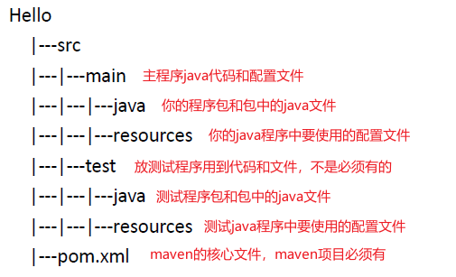
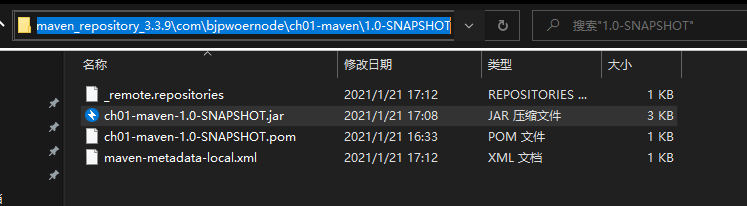
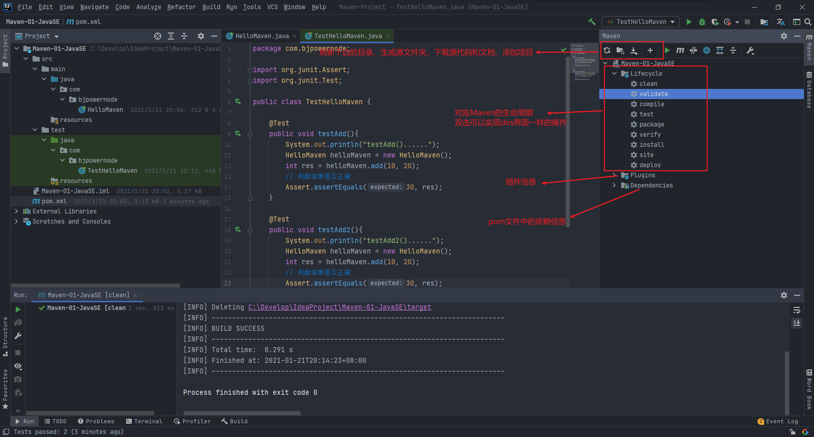
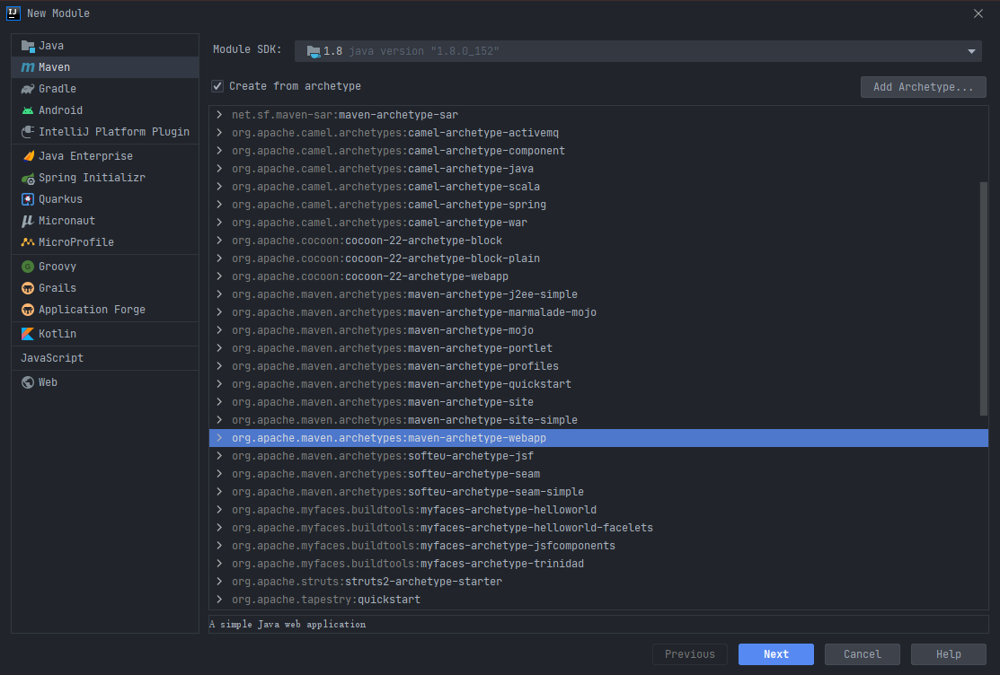

# Maven基础

## 一、Maven简介

Maven是自动化构建工具。

### 1.1完成一个Java项目，需要做哪些工作？

- 分析项目要做什么，知道项目有哪些组成部分
- 设计项目，通过哪些步骤，使用哪些技术，需要多少人，多长时间
- 组建团队，找人，购置设备，服务器，软件，笔记本
- 开发人员写代码，开发人员需要测试代码，重复多次的工作
- 测试人员，测试项目功能是否符合要求。开发人员提交代码，如果测试有问题，需要开发人员修改，再次提交代码给测试，如果还有问题，如此反复


### 1.2传统开发项目的问题，没有使用maven管理的项目，存在什么问题

- 有很多模块，模块之间有关系，手工管理关系，比较繁琐。

- 需要很多第三方功能，需要很多jar包文件，需要手工从网络中去下载jar包。

- 需要管理jar的版本，你需要的是mysql5.1.5.jar，那你不能给一个mysql1.4.0.jar

- 管理jar文件之间的依赖，你的项目要使用a.jar，它需要使用b.jar里边的类。想使用a.jar必须先获取到b.jar才可以。

  a.jar需要b.jar这个关系叫依赖，或者你的项目中要使用mysql的驱动，也可以叫项目依赖mysql驱动。


### 1.3需要改进项目的开发和管理，需要maven

- maven可以管理jar文件
- 自动下载jar和他的文档，源代码
- 管理jar直接的依赖，a.jar需要b.jar，maven会自动下载b.jar
- 管理你需要的jar版本
- 帮你编译程序，把java编译为class
- 帮你测试你的代码是否正确
- 帮你打包文件，形成jar文件，或者war文件
- 帮你部署项目


### 1.4构建

项目的构建，构建是面向过程的，就是一些步骤，可以完成项目代码的编译，测试，运行，打包，部署等等。

maven支持的构建包括有：

- 清理，把之前项目编译的东西删除掉，为新的编译代码做准备。
- 编译，把程序源代码编译为执行代码，java.class文件，批量的，maven可以同时把成千上百的文件编译为class。和javac不一样，javac一次只编译一个文件。
- 测试：maven可以执行测试程序代码，验证你的功能是否正确，批量的，maven可以同时执行多个测试代码，同时测试很多功能。
- 报告：生成测试结果的文件，测试通过没有问题。
- 打包：把你的项目中所有class文件，配置文件等所有资源放到一个压缩文件中，这个压缩文件就是项目的结果文件，通常java程序，压缩文件是.jar扩展名的。对于web应用，压缩文件扩展名就是.war的。
- 安装：把打包生成的文件，安装到本机仓库。
- 部署：把程序安装好可以执行。


## 二、Maven的核心概念

用好maven，需要了解这些概念

1. POM

   > 一个文件，名称是pom.xml，pom（project object model项目对象模型），maven的核心。
   >
   > maven把一个项目当作一个模型使用，可以控制maven构建项目的过程，管理jar依赖。

2. 约定的目录结构

   > maven项目的目录和文件的位置都是固定的。

3. 坐标

   > 一个唯一的字符串，用来表示资源的。

4. 依赖管理

   > 管理你的项目中可以使用的jar文件。

5. 仓库管理（了解）

   > 你的资源存放的位置。

6. 生命周期

   > maven工具构建项目的过程，就是生命周期。

7. 插件和目标（了解）

   > 执行maven构建的时候使用的工具就是插件。

8. 继承

9. 聚合


### 2.1maven工具的安装和配置


1. 下载zip文件，解压缩到一个目录，不要有中文目录。

2. 子目录 bin（执行程序，主要是mvn.cmd）、conf（maven工具本身的配置文件settings.xml）

3. 配置环境变量。

   

   

4. 配置完验证，dos界面运行mvn -v

   

   

### 2.2maven工程约定目录结构

约定：是大家都遵循的一个规则。

maven中约定的目录结构：




### 2.3手动创建一个Maven项目并构建

1. 在文件夹中创建一个maven项目

   

2. 在src/main/java中编写一个java程序

   

3. 使用maven来编译java文件，在项目根目录下启动cmd，会自动编译main目录下的所有java文件

   

   > 1. 为什么会进行大量的下载？
   >
   >    Maven工具执行的操作需要很多的的插件（java类---jar文件）完成
   >
   > 2. 下载什么东西了？
   >
   >    jar文件---在Maven中叫插件，是完成某些功能的。
   >
   > 3. 下载的东西存放到哪里了？
   >
   >    默认放在C:\Users\Mr.Feng\.m2\repository（默认仓库，本机仓库）中
   >
   >    

4. 下载完成后

   

5. 会生成一个结果目录，maven编译的java程序，最后的class文件都放在target目录中。

   

   

   


### 2.4修改本机存放资源的目录位置

1. 修改maven的配置文件：

   maven安装目录/conf/settings.xml，修改之前先备份settings.xml

2. 修改< localrepository >指定你的目录（不要使用中文目录）

   假设修改成此目录C:\Develop\Maven\maven_repository_3.3.9

   

   


### 2.5仓库

1. 仓库是什么？

   > 是存放maven使用的jar包和我们项目使用的jar包。
   >
   > - maven使用的插件（各种jar包）
   > - 我们项目使用的jar（第三方工具，mysql驱动，jackson等等）

2. 仓库的分类？

   > - 本地仓库：在个人计算机上的文件夹，存放各种jar包的
   >
   > - 远程仓库：在互联网上的，使用网络才能使用的仓库
   >
   >   1. 中央仓库：最权威的，所有的开发人员都共享的一个集中的仓库，用的人多。
   >
   >      中央仓库地址：https://repo.maven.apache.org
   >
   >   2. 中央仓库的镜像：就是中央仓库的备份，在各大洲，重要的城市都有镜像。
   >
   >   3. 私服：在公司内部，在局域网使用的，不是对外使用的。

3. 仓库的使用

   maven仓库的使用不需要人为参与。

   开发人员需要使用mysql驱动----->maven首先查本地仓库----->私服------>镜像------>中央仓库


### 2.6pom.xml文件

Project Object Model项目对象模型是Maven项目的核心

1. 基本信息：

   > 1. modelVersion：
   >
   >    - Maven模型的版本，目前只有4.0.0
   >
   > 2. groupId：
   >
   >    - 组织id，一般是公司域名的倒写，格式：com.baidu或者com.bjpowernode.app
   >
   > 3. artifactId：
   >
   >    - 项目名称，也是模块名称，对应groupId中项目中的一个子项目。
   >
   > 4. version：
   >
   >    - 项目的版本号，如果项目还在开发中，是不稳定版本，通常在版本后带-SNAPSHOT，通常使用三位数字表示，例如：1.1.0
   >
   > 5. packaging：
   >
   >    - 项目打包的类型，可以是jar，war，rar，ear，pom，默认是jar
   >
   >    
   >
   > 6. **groupId、artifactId、version三个元素生成了一个Maven项目的基本坐标，在众多的maven项目中可以唯一定位到某一个项目。坐标也决定着将来项目在仓库中的路径及名称。**

2. 依赖：

   > 1. dependencies和dependency：
   >    - 项目中依赖的jar包，在Maven中，这些jar包被称作依赖。使用标签< dependency >来配置，而这种依赖的配置正是通过坐标来定位的。
   >    - 
   > 2. 在中央仓库搜索jar包：
   >    - 登录搜索用的中央仓库：www.mvnrepository.com
   >    - 
   >    - 
   >    - 
   >    - 

3. 配置属性：

   > 1. properties：
   >    - 用来定义一些配置属性，例如：project.build.sourceEncoding（项目构建源码编码方式），可以设置为UTF-8，防止中文乱码
   >    - 

4. 构建：

   > 1. build：
   >    - 表示与构建相关的配置，例如：设置编译插件的jdk版本。

5. 继承：

   > 1. parent：
   >    - 在Maven中，如果多个模块都需要声明相同的配置，例如：groupId、version、有相同的依赖或者相同的组件配置等。可以用parent声明要继承的父工程pom配置。

6. 聚合：

   > 1. modules：
   >    - 在Maven的多模块开发中，为了统一构建整个项目的所有模块，可以提供一个额外的模块，该模块打包方式为pom，并且在其中使用modules聚合的其他模块，这样通过本模块就可以一键自动识别模块间的依赖关系来构建所有的模块。


### 2.7坐标

maven把任何一个插件都作为仓库中的一个项目进行管理，用一组三个向量来组成的坐标来表示。坐标在仓库中可以唯一定位一个maven项目。

groupId、artifactId、version决定项目在仓库中的路径。


## 三、Maven的生命周期、常用命令和插件

### 3.1Maven的生命周期

就是Maven构建项目的过程：清理，编译，测试，报告，打包，安装，部署


### 3.2Maven的常用命令

Maven有三大功能：管理依赖、构建项目、管理项目信息。

Maven可以使用命令，完成生命周期的操作

- mvn clean：清理

  会删除原来编译和测试的目录，target目录，但是已经install到仓库里的包不会删除

- mvn compile：编译主程序

  会在当前目录下生成一个target，里边存放编译主程序之后生成的字节码文件，同时把main/java/resources中的文件拷贝到target/classes目录下

- mvn test-compile：编译测试程序

  会在当前目录下生成一个target，里边存放编译测试程序之后生成的字节码文件

- mvn test：测试

  会生成一个目录surefire-reports，保存测试结果

- mvn package：打包主程序

  打包主程序（会编译、编译测试、测试、并按照pom.xml配置把主程序打包生成的jar包或者war包）

- mvn install：安装主程序

  安装主程序，把本工程打包，按照本工程的坐标保存到本地仓库中

- mvn deploy：部署主程序

  部署主程序，把本工程打包，按照本工程的坐标保存到本地仓库中，并且还会保存到私服仓库中，还会自动把项目部署到web容器中。


### 3.3Maven的插件

maven命令执行时，真正完成功能的是插件，插件就是一些jar文件，一些类。


### 3.4单元测试（测试方法的）

用的是Junit，Junit是一个专门测试的框架（工具）

测试的内容：测试的是类中的方法，每一个方法都是独立测试的。（方法是测试的基本单位。）

**maven借助单元测试来批量测试类中的大量方法是否符合预期的。**

> 使用步骤：
>
> 1. 加入依赖，在pom.xml中加入依赖
>
>    ```xml
>    <!-- 单元测试 -->
>    <dependency>
>        <groupId>junit</groupId>
>        <artifactId>junit</artifactId>
>        <version>4.11</version>
>        <scope>test</scope>
>    </dependency>
>    ```
>
> 2. 在maven项目中的src/test/java目录下，创建测试程序。
>
>    - 推荐的创建类和方法的提示：
>
>      - 测试类的名称是：Test + 你要测试的类名
>
>      - 测试的方法名称是：Test + 方法名称
>
>      - 例如：
>
>        ```java
>        // 测试HelloMaven
>        // 创建测试类TestHelloMaven
>        @Test
>        public void testAdd(){
>            // 测试HelloMaven的add方法是否正确
>        }
>        ```
>
>      - 其中testAdd叫做测试方法，它的定义规则：
>
>        - 方法必须是public的
>        - 方法必须没有返回值
>        - 方法的名称是自定义的，推荐是：Test + 方法名称
>        - 在方法的上面加入：@Test
>
> 3. 实例：
>
>    - 第一步，在test/java文件夹中创建一个测试类，包名和main/java中的HelloMaven的包保持一致。
>
>      
>
>    - 测试mvn clean：清理
>
>      运行之前：
>
>      
>
>      运行之后：
>
>      
>
>    - 测试mvn compile：编译主程序
>
>      
>
>    - 测试mvn test-compile：编译测试程序
>
>      
>
>      
>
>    - 测试mvn test：测试
>
>      
>
>      **在执行mvn test命令时，会自动执行生命周期在mvn test之前的命令，比如编译主程序，编译测试程序**
>
>      
>
>      在测试程序中编写一个错误的程序：
>
>      ```java
>      @Test
>      public void testAdd2(){
>          System.out.println("Maven junit 的testAdd()...");
>          HelloMaven hello = new HelloMaven();
>          int res = hello.add(10, 20);
>          // 验证10 + 20 是不是30，junit提供的方法，对比结果
>          // assertEquals(期望值，实际值)。
>          // 如果两个值相等，说明是正确是。不等就抛出异常
>          Assert.assertEquals(50, res);
>      }
>      ```
>
>      
>
>      生成对应的测试报告：
>
>      
>
>    - 测试mvn package：打包主程序
>
>      
>
>      
>
>    - 测试mvn install：安装主程序
>
>      
>
>      


## 四、常用插件

1. 最常用的是maven的编译插件，用来设置JDK版本，在pom.xml中的< build >标签中设置

   ```xml
   <!-- 控制配置maven构建项目的参数设置，设置JDK版本 -->
   <build>
       <!-- 配置插件 -->
       <plugins>
           <!-- 配置具体的插件 -->
           <plugin>
               <groupId>org.apache.maven.plugins</groupId>
               <!-- 插件名称 -->
               <artifactId>maven-compiler-plugin</artifactId>
               <!-- 插件的版本 -->
               <version>3.8.1</version>
               <!-- 配置插件的信息 -->
               <configuration>
                   <!-- 告诉maven我们写的代码是在JDK1.8上编译的 -->
                   <source>1.8</source>
                   <!-- 我们的程序应该运行在1.8的JDK上 -->
                   <target>1.8</target>
               </configuration>
           </plugin>
       </plugins>
   </build>
   ```


## 五、在IDEA中使用Maven

idea中内置了maven，一般不使用内置的，因为用内置的修改配置不方便，使用自己安装的maven，需要覆盖idea中默认的设置。

配置的入口：

1. file----->settings（只对当前工程有效）
2. file----->new Project settings （对以后的新工程有效）


### 5.1在IDEA中使用Maven创建JavaSE项目


**需要手动创建resources文件夹，并右键作为resources文件**


**正确的目录结构：**


pom文件结构

```xml
<?xml version="1.0" encoding="UTF-8"?>

<project xmlns="http://maven.apache.org/POM/4.0.0" xmlns:xsi="http://www.w3.org/2001/XMLSchema-instance"
  xsi:schemaLocation="http://maven.apache.org/POM/4.0.0 http://maven.apache.org/xsd/maven-4.0.0.xsd">
  <modelVersion>4.0.0</modelVersion>

  <!-- 项目坐标 -->
  <groupId>com.bjpowernode</groupId>
  <artifactId>Maven-01-JavaSE</artifactId>
  <version>1.0</version>
  <packaging>jar</packaging>

  <properties>
    <!-- maven构建项目使用的是UTF-8，避免中文乱码 -->
    <project.build.sourceEncoding>UTF-8</project.build.sourceEncoding>
    <!-- 编译java使用的jdk版本 -->
    <maven.compiler.source>1.8</maven.compiler.source>
    <!-- 你的java项目应该运行在什么样的JDK版本 -->
    <maven.compiler.target>1.8</maven.compiler.target>
  </properties>

  <!-- 依赖 -->
  <dependencies>
    <!-- 单元测试 -->
    <dependency>
      <groupId>junit</groupId>
      <artifactId>junit</artifactId>
      <version>4.11</version>
      <scope>test</scope>
    </dependency>
  </dependencies>
  
</project>

```

实例：

创建一个java类

```java
package com.bjpowernode;

public class HelloMaven {
    public int add(int n1, int n2){
        return n1+n2;
    }

    public static void main(String[] args) {
        HelloMaven hello = new HelloMaven();
        int res = hello.add(10, 20);
        System.out.println("10 + 20 =" + res);
    }
}
```

创建一个测试类

```java
package com.bjpowernode;

import org.junit.Assert;
import org.junit.Test;

public class TestHelloMaven {

    @Test
    public void testAdd(){
        HelloMaven helloMaven = new HelloMaven();
        int res = helloMaven.add(10, 20);
        // 判断结果是否正确
        Assert.assertEquals(30, res);
    }
}
```





### 5.2在IDEA中使用Maven创建JavaWeb项目



创建好的目录，需要自己增加目录


完整的目录结构：


pom文件结构：

```xml
<?xml version="1.0" encoding="UTF-8"?>

<project xmlns="http://maven.apache.org/POM/4.0.0" xmlns:xsi="http://www.w3.org/2001/XMLSchema-instance"
  xsi:schemaLocation="http://maven.apache.org/POM/4.0.0 http://maven.apache.org/xsd/maven-4.0.0.xsd">
  <modelVersion>4.0.0</modelVersion>

  <groupId>com.bjpowernode</groupId>
  <artifactId>Maven-02-JavaWeb</artifactId>
  <version>1.0</version>
  <!-- web项目是war文件 -->
  <packaging>war</packaging>

  <properties>
    <project.build.sourceEncoding>UTF-8</project.build.sourceEncoding>
    <maven.compiler.source>1.8</maven.compiler.source>
    <maven.compiler.target>1.8</maven.compiler.target>
  </properties>

  <dependencies>
    <dependency>
      <groupId>junit</groupId>
      <artifactId>junit</artifactId>
      <version>4.11</version>
      <scope>test</scope>
    </dependency>
  </dependencies>

</project>

```

实例：

先创建servlet和jsp依赖

pom.xml：

```xml
<?xml version="1.0" encoding="UTF-8"?>

<project xmlns="http://maven.apache.org/POM/4.0.0" xmlns:xsi="http://www.w3.org/2001/XMLSchema-instance"
  xsi:schemaLocation="http://maven.apache.org/POM/4.0.0 http://maven.apache.org/xsd/maven-4.0.0.xsd">
  <modelVersion>4.0.0</modelVersion>

  <groupId>com.bjpowernode</groupId>
  <artifactId>Maven-02-JavaWeb</artifactId>
  <version>1.0</version>
  <!-- web项目是war文件 -->
  <packaging>war</packaging>

  <properties>
    <project.build.sourceEncoding>UTF-8</project.build.sourceEncoding>
    <maven.compiler.source>1.8</maven.compiler.source>
    <maven.compiler.target>1.8</maven.compiler.target>
  </properties>

  <dependencies>
    <dependency>
      <groupId>junit</groupId>
      <artifactId>junit</artifactId>
      <version>4.11</version>
      <scope>test</scope>
    </dependency>

    <!-- 加入servlet依赖（jar包） -->
    <!-- https://mvnrepository.com/artifact/javax.servlet/javax.servlet-api -->
    <dependency>
      <groupId>javax.servlet</groupId>
      <artifactId>javax.servlet-api</artifactId>
      <version>3.1.0</version>
      <scope>provided</scope>
    </dependency>

    <!-- 加入jsp依赖 -->
    <!-- https://mvnrepository.com/artifact/javax.servlet.jsp/jsp-api -->
    <dependency>
      <groupId>javax.servlet.jsp</groupId>
      <artifactId>jsp-api</artifactId>
      <version>2.1</version>
      <scope>provided</scope>
    </dependency>

  </dependencies>

</project>

```

创建servlet并配置web.xml

```java
package com.bjpowernode.controller;

import javax.servlet.*;
import javax.servlet.http.*;
import java.io.IOException;
import java.io.PrintWriter;

public class HelloServlet extends HttpServlet {
    @Override
    protected void doGet(HttpServletRequest request, HttpServletResponse response) throws ServletException, IOException {

        response.setContentType("text/html;charset=utf-8");
        PrintWriter pw = response.getWriter();
        pw.println("hello world");
        pw.flush();
        pw.close();
    }
}

```

创建jsp

```jsp
<%@ page contentType="text/html;charset=utf-8" language="java" %>
<html>
<body>
<h2>Hello World!</h2>
<a href="hello">访问servlet</a>
</body>
</html>

```


**javaWeb文件如何打包？**

使用右侧的maven窗口单击package，在target中生成war文件


**war文件该如何在tomcat中运行**

> - 将war文件放到tomcat的webapps文件夹中
>
> - 运行bin目录下的startup.bat
>
> - 直接打开浏览器运行，输入war文件名作为网站名
>
>   


### 5.3一些使用小技巧

1. 当你的IDEA中的pom文件中的依赖有红色波浪线时，可以重新加载项目

   


### 5.3在IDEA中如何导入一个现有的Maven工程

先将当前工程中的javaweb移除

- 打开工程结构，左侧选中module，右侧选择加号

  

- 选择import module，选择要导入的文件夹

  

- 单击OK后选择导入模块，maven项目

  

- 配置JDK

  

- 完成


## 六、依赖管理

### 6.1依赖范围

```xml
<dependency>
    <groupId>javax.servlet</groupId>
    <artifactId>javax.servlet-api</artifactId>
    <version>3.1.0</version>
    <!-- 依赖范围 -->
    <scope>provided</scope>
</dependency>
```

依赖范围scope的值：

scope：表示依赖使用的范围，在maven构建项目的哪些阶段中起作用。

- compile：默认是compile，表示项目在编译，测试，打包，安装，部署时都会用到这个依赖

- test：表示这个依赖在测试阶段才会起作用

- provided：提供者，表示项目在编译，测试时会用到这个依赖，打包，安装时不需要。

  比如servlet.jar，在编译，测试时需要这个jar包，但是在打包，安装时，由tomcat自动提供。


## 七、Maven的常用设置

### 7.1Maven的属性设置

pom.xml中

```xml
<properties>
    <!-- Maven创建项目使用的编码方式，避免中文乱码 -->
    <project.build.sourceEncoding>UTF-8</project.build.sourceEncoding>
    <!-- 编译代码使用的JDK版本 -->
    <maven.compiler.source>1.8</maven.compiler.source>
    <!-- 运行程序时使用的JDK版本 -->
    <maven.compiler.target>1.8</maven.compiler.target>
    <!-- 生成报告的编码方式 -->
    <project.reporting.outputEncoding>UTF-8</project.reporting.outputEncoding>
</properties>
```


### 7.2Maven的全局变量

自定义属性：

1. 在< properties >通过自定义标签声明变量（标签名就是变量名）
2. 在pom.xml文件中的其他位置，使用${标签名}，使用变量的值

自定义全局变量一般是定义依赖的版本号，当你的项目中要使用多个相同的版本号，先使用全局变量定义，再使用${变量名}

```xml
<?xml version="1.0" encoding="UTF-8"?>

<project xmlns="http://maven.apache.org/POM/4.0.0" xmlns:xsi="http://www.w3.org/2001/XMLSchema-instance"
  xsi:schemaLocation="http://maven.apache.org/POM/4.0.0 http://maven.apache.org/xsd/maven-4.0.0.xsd">
  <modelVersion>4.0.0</modelVersion>

  <groupId>com.bjpowernode</groupId>
  <artifactId>Maven-02-JavaWeb</artifactId>
  <version>1.0</version>
  <!-- web项目是war文件 -->
  <packaging>war</packaging>

  <properties>
    <project.build.sourceEncoding>UTF-8</project.build.sourceEncoding>
    <maven.compiler.source>1.8</maven.compiler.source>
    <maven.compiler.target>1.8</maven.compiler.target>
    <!-- 自定义版本号 -->
    <!-- 可以省去修改版本号的时间 -->
    <spring-version>5.2.5</spring-version>
  </properties>

  <dependencies>

    <!-- spring依赖 -->
    <dependency>
      <groupId>org.springframework</groupId>
      <artifactId>spring-core</artifactId>
      <version>${spring-version}</version>
    </dependency>

    <dependency>
      <groupId>org.springframework</groupId>
      <artifactId>spring-aop</artifactId>
      <version>${spring-version}</version>
    </dependency>

    <dependency>
      <groupId>org.springframework</groupId>
      <artifactId>spring-context</artifactId>
      <version>${spring-version}</version>
    </dependency>

  </dependencies>

</project>

```


### 7.3指定资源的插件

作用：mybatis会用到

- 默认没有使用resources的时候，maven在执行编译代码时，会把src/main/resource目录中的文件拷贝到target/classe目录中

  对于src/main/java目录下的非.java文件不处理，不拷贝到target/classes文件中

- 我们的程序有需要把一些文件放在src/main/java目录中，当我在执行java程序时，需要用的src/main/java目录中的文件，就需要告诉maven在编译src/main/java目录下的程序时，需要把文件一同拷贝到target/classes目录中，此时就需要在< build >中加入< resource >

```xml
<build>
    <resources>
        <resource>
            <!-- 需要处理的目录-->
            <directory>src/main/java</directory>
            <!-- 需要处理的文件，包括目录下的.properties,.xml 文件都会扫描到-->
            <includes>
                <include>**/*.properties</include>
                <include>**/*.xml</include>
            </includes>
            <!-- filtering选项 false不启用过滤器，*.property已经起到过滤的作用了 -->
            <filtering>false</filtering>
        </resource>
    </resources>
</build>
```


## 八、Maven管理多模块应用

### 8.1场景描述

- commonModel：提供公共的基础服务，工具类，常量类等。
- bussinessModel：业务模块，系统真正要实现的业务，依赖于common模块。
- application：可发布的web应用，由各个bussinessModel组成，最终满足项目整体需求。
- 第三方模块：包括各类框架，spring，mybatis等，整个项目依赖它们完成开发。


**使用Maven进行多模块应用管理，分布式开发。**


## 九、使用Maven管理多模块应用

### 9.1实现方式

第一步：先创建父工程，任意Maven工程


**作为父工程的maven工程必须有以下两点要求：**

> 1. packaging标签的值为Pom
> 2. 把src目录删除掉


第二步：创建子模块，选择父工程


第三步：创建web子模块，指定父工程


#### 9.1.1子模块继承父工程所有依赖

子模块会继承父工程的所有依赖，所以可以统一管理依赖


**注意：这样的话会导致，其他工程中即使用不到该依赖，但是依然会加载该依赖，冗余很大，如何避免这种情况呢？**

加入< dependencyManagement >标签来包裹起来，这样子模块不能无条件继承父工程的依赖，在子模块中需要引入指定依赖。


**此时，子模块依赖的版本号默认继承父工程依赖的版本号，如果子模块指定了版本号，则使用指定的版本号。**


#### 9.1.2子模块继承父工程编译插件

