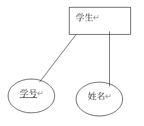

# MySQL基础部分

## 一、MySQL概述

### 1.1概念

SQL、DB、DBMS分别是什么，它们之间的关系？

- SQL：结构化查询语言，是一门标准通用的语言，标准的sql语言适合于所有的数据库产品。SQL属于高级语言，在执行的时候，实际上内部也会先编译，然后再执行sql。（SQL语句的编译由DBMS完成）

- DB：DataBase（数据库，数据库实际上在硬盘上以文件形式存在）

- DBMS：DataBase Management System（数据库管理系统，常见的有：MySql、Oracle、DB2、Sybase、sqlserver...）

- DBMS负责执行SQL语句，通过执行SQL语句来操作DB当中的数据。

- DBMS-(执行)->SQL-(操作)->DB

### 1.2表(Table)

- 表：table

  是数据库的基本组成单元，所有的数据都以表格的形式组织，目的是可读性强。

- 表的组成：

  - 行：被称为数据/记录（data）
  - 列：被称为字段（column）

| 学号（int） | 姓名（varchar） | 年龄（int） |
| ----------- | --------------- | ----------- |
| 110         | 张三            | 20          |
| 120         | 李四            | 21          |

- 每一个字段应该包括哪些属性：
  - 字段名
  - 数据类型
  - 相关的约束

### 1.3SQL语句

SQL语句的分类：

- DQL：（数据查询语言）查询语句，凡是select语句都是DQL
- DML：（数据操作语言）insert、detele、update，对表中的数据进行增删改。
- DDL：（数据定义语言）create、drop、alter，对表结构的增删改。
- TCL：（事务控制语言）commit提交事务，rollback回滚事务。
- DCL：（数据控制语言）grant授权，revoke撤销权限等。

### 1.4导入数据

1. 登录mysql数据库管理系统

   dos窗口：

   mysql -uroot -p12345

2. 查看有哪些数据库

   show databases; (这个不是sql语句，属于mysql命令)

   +-----------------------------+
   | Database                    |
   +-----------------------------+
   | information_schema   | 
   | mysql                          |
   | performance_schema |
   | sakila               		   |
   | sys                   		   |
   | test                   		   |	
   | world               			|
   +-----------------------------+

3. 创建自己的数据库

   create database bjpowernode;

4. 使用bjpowernode数据库

   use bjpowernode;

5. 查看当前数据库有哪些表

   show tables;

6. 初始化数据

   source + sql文件地址

### 1.5Sql脚本

当一个文件以**.sql**结尾，并且该文件中编写了大量的sql语句，我们称这样的文件为sql脚本。

### 1.6删除数据库

drop database bjpowernode;

### 1.7查看表结构

desc + 表名;


表名称：dept

描述：部门信息表

| 英文字段名称 | 中文描述 | 类型        |
| ------------ | -------- | ----------- |
| DEPTNO       | 部门编号 | INT(2)      |
| DNAME        | 部门名称 | VARCHAR(14) |
| LOC          | 位置     | VARCHAR(13) |

表名称：emp

描述：员工信息表 

| 英文字段名称 | 中文描述 | 类型         |
| ------------ | -------- | ------------ |
| EMPNO        | 员工编号 | INT (4)      |
| ENAME        | 员工姓名 | VARCHAR(10)  |
| JOB          | 工作岗位 | VARCHAR(9)   |
| MGR          | 上级领导 | INT (4)      |
| HIREDATE     | 入职日期 | DATE         |
| SAL          | 薪水     | DOUBLE(7,2)  |
| COMM         | 津贴     | DOUBLE (7,2) |
| DEPTNO       | 部门编号 | INT(2)       |

注：DEPTNO字段是外键，DEPTNO的值来源于dept表的主键，起到了约束的作用

表名称：salgrade

描述：薪水等级信息表

| 英文字段名称 | 中文描述 | 类型 |
| ------------ | -------- | ---- |
| GRADE        | 等级     | INT  |
| LOSAL        | 最低薪水 | INT  |
| HISAL        | 最高薪水 | INT  |

### 1.8表中的数据

select * from 表名


### 1.9E-R图

实体与实体之间的联系图

- 实体：实际存在的一个个体，用矩形描述 
- 属性：用椭圆形描述
- 联系：1:1, 1:m, m:n

> 例子：学生，课程。
>
> 1. 用ER图进行描述:
>
> 
>
> 2. 使用实体属性图来描述学生实体：
>
>    
>
> **如果没有实体属性图来描述对应的实体，那么在ER图中需要把实体的属性描述完整。如果在ER图中实体的属性过多，可以在实体属性图中加以说明。**


## 二、常用命令

### 2.1查看mysql版本

- mysql -V
- mysql --version


### 2.2创建数据库

- create database 数据库名;

### 2.3查询当前使用数据库

- select database();

  

### 2.4终止一条语句

输入\c


### 2.5退出mysql

exit;

## 三、查看演示数据表结构

### 3.1查看现有数据库

show databases;

### 3.2指定使用数据库

use 数据库名;

### 3.3查看当前使用的数据库

select database();

### 3.4查看当前数据库中的表

show tables;

### 3.5查看其他数据库中的表

show tables from 其他数据库名;

### 3.6查看表结构

desc + 表名;

### 3.7查看表的创建语句

show create table 表名;

## 四、简单的查询（DQL）

select 字段名1, 字段名2, 字段名3, ... from 表名;

> - 任何一条sql语句都以分号结尾
> - sql语句不区分大小写


### 4.1查询单个字段

- 查询员工的名字

  select ename from emp;

### 4.2查询多个字段

- 查询员工的年薪

  select ename,sal * 12 from emp;

  ###### 重命名**（==起别名==）**

  select ename,sal * 12 as yearsal from emp;

  select ename,sal * 12 as '年薪' from emp;

  **注意：标准sql语句中要求字符串使用单引号（双引号）括起来，as可以省略。**
  
  **计算列（表中不存在），虚列，但可以把它当作真正的列来使用。**
  
- 查询员工的员工名和员工号，在一列中显示==使用字符串连接列==

  select concat(ename,',',empno) from emp;

  ###### **可以通过concat(String1, String2, ...)函数连接起来，字符串需要用引号括起来==（Oracle中用||作为字符串连接符号）==**

  

### 4.2查询全部字段

- select * from 表名;

  **实际开发中，不建议用*，效率较低。**

## 五、条件查询

语法格式：

```mysql
select 字段, 字段
from 表名
where 条件;
```

**执行顺序：先from，再where，最后select**

- 查询工资等于5000的员工姓名

  select ename from emp where sal=5000;

### **5.1常用运算符**

条件查询需要用到where语句，where必须放到from语句表的后面

支持如下运算符

| 运算符           | 说明                                                         |
| ---------------- | ------------------------------------------------------------ |
| =                | 等于                                                         |
| <>或!=           | 不等于                                                       |
| <                | 小于                                                         |
| <=               | 小于等于                                                     |
| >                | 大于                                                         |
| >=               | 大于等于                                                     |
| between … and …. | 两个值之间,**等同于 >= and <=** (可以使用字符 between 'a' and 'c' 左闭右开原则) |
| is null          | 为null（is not null 不为空）                                 |
| and              | 并且，左右表达式都为真，结果为真                             |
| or               | 或者，左右表达式只有一个为真，结果为真1                      |
| in               | 包含，相当于多个or（not in不在这个范围中）**范围中不能有null值** |
| not              | not可以取非，主要用在is 或in中                               |
| like             | like称为模糊查询，支持%或下划线匹配<br/>%匹配任意个字符<br/> _匹配一个字符 |

- 字符串比较：

  按照ASCII码比较：a-z：97-122	A-Z：65-90

- 日期比较：

  标准日期格式：'DD-Mon-yy'**（Oracle默认日期格式）**

  例：'10-11月-20'（2020年11月10日）

  ```mysql
  // 查询入职日期在87年后的员工信息(Oracle)
  select * from emp where hiredate>'1-1月-87';
  // 查询入职日期在87年后的员工信息(Mysql)
  select * from emp where hiredate>'1987-01-01';
  ```

- 逻辑运算优先级：

  NOT->AND->OR

  **当AND和OR同时使用时，会先执行AND再执行OR，如果想要先判断或运算，需要在OR加括号**

  ```mysql
  // 查询部门10和20中工资大于3000的员工信息
  select * from emp where (deptno=10 or deptno=20) and sal>3000;
  ```

 

## 六、排序数据

```mysql
// 执行顺序
select 字段名      3
from 表名	         1
where 条件		 2
order by 排序字段  4
// 如果在select中为字段起别名，那么在where中不可以使用别名进行查询，但是在order by中可以使用别名进行排序
```

- 按照工资升序，找出员工名和薪资

  select ename,sal from emp order by sal;

**order by 默认升序，asc表示升序，desc表示降序。**

- 按照工资降序排列，当工资相同的情况下，再按照名字的升序排列，找出员工名和薪资

  select ename,sal from emp order by sal desc,ename asc;

**注意：越靠前的字段越能起到主导作用，只有当前面字段无法完成排序的时候，才会使用后边的字段名排序。**

- 找出工作岗位是salesman的员工，并且要求薪资降序排序

  select ename,sal,job from emp where job = 'salesman' order by sal desc;


**在Oracle中，有一个==rownum==列，是一个虚列，表示一个集合结果行序，为表中数据加一个标识。**

> 如何进行行序？
>
> 1. rownum的初始值为0，再进行每一条记录Select之前先+1，再看where条件是否满足，如果满足，则rownum+1的值给当前记录，如果where条件不满足，则rownum-1的值恢复刚才的值。
>
> 2. 使用rownum可以为表添加虚列
>
>    ```mysql
>    select rownum from emp;
>    ```
>
> 3. 如何使用rownum进行查询数据
>
>    ```mysql
>    select rownum from emp where rownum between 3 and 6;
>    // 注意：由于执行顺序的问题，where子句中的rownum不存在，会出错
>    ```
>
> 4. 使用嵌套查询进行使用rownum
>
>    ```mysql
>    select * from (select rownum num from emp) where num between 3 and 6;
>    ```
>    
> 5. 按员工工资降序查询员工信息，添加rownum编号（Oracle）
>
>    ```mysql
>    select rownum num,s.* from ( select * from emp order by sal desc ) s;
>    ```

## 七、分组函数

- count 计数
- sum 求和
- avg 平均值
- max 最大值
- min 最小值

**注意：所有分组函数都是对"某一组"数据进行操作的，如果当前查询没有分组，则把表看成是一个组进行查询。**

- 找出工资总和

  select sum(sal) from emp;

- 找出最高工资

   select max(sal) from emp;

- 找出最低工资

   select min(sal) from emp;

- 找出平均工资

   select avg(sal) from emp;

- 找出总人数

  select count(*) from emp;

### 7.1多行处理函数

分组函数一共五个，分组函数还叫：多行处理函数（输入多行，输出一行）

**==注意：分组函数自动忽略NULL==**

- 查询平均薪资

  select ename,sal from emp where sal > avg(sal);  	//ERROR 1111 (HY000): Invalid use of group function

  出现错误：无效的使用了分组函数

  **==原因：sql语句中有一个语法规则，分组函数不可直接使用在where子句中。==**

  **因为group by在where执行结束之后才会执行。**

  ```mysql
// 执行顺序
  select ...		5
from ...		1
  where ...		2
  group by ...	3
  having ...		4
  order by ...	6
  ```
  
  
  
  select ename,sal from emp where sal > (select avg(sal) from emp);
  
  
  
  
  

#### 7.1.1count(*)和count(某一个字段)有什么区别

select count(*) from emp; //14

select count(comm) from emp; //4

select count(distinct deptno) from emp;//3

**==count(*)统计总记录条数，和某个字段无关，count(具体字段)统计该字段不为null的记录条数，count(distinct 字段名)统计该字段不为null并且去重的记录条数。==**


### 7.2单行处理函数

输入一行，输出一行

- 计算每个员工的年薪

  select ename,(sal+comm) * 12 as yearsal from emp;

  

发现有很多员工的年薪是NULL，这是为什么，因为他们的补助(COMM)是NULL

**注意：在数据库中有一个规定，在进行数学表达式运算时，有一个数据是NULL，那么最后的运算结果也是NULL**

- 那么如何计算年薪

  **使用ifnull()空处理函数（Oracle中使用nvl()来作为空处理函数）**

  - ifnull(可能为NULL的数据，被当作什么看待)——属于单行处理函数

  select ename,(sal + ifnull(comm,0)) *12 as yearsal from emp;

  

### 7.3group by 和 having 

#### 7.3.1group by

按照某个字段或某些字段分组。


#### 7.3.2多列分组

group by 列1,列2...

先按列1分组，再按照列2分组...

- 查看各部门各职务的平均工资

```mysql
mysql> select deptno,job,avg(sal) from emp group by deptno,job order by deptno;
+--------+-----------+-------------+
| deptno | job       | avg(sal)    |
+--------+-----------+-------------+
|     10 | CLERK     | 1300.000000 |
|     10 | MANAGER   | 2450.000000 |
|     10 | PRESIDENT | 5000.000000 |
|     20 | ANALYST   | 3000.000000 |
|     20 | CLERK     |  950.000000 |
|     20 | MANAGER   | 2975.000000 |
|     30 | CLERK     |  950.000000 |
|     30 | MANAGER   | 2850.000000 |
|     30 | SALESMAN  | 1400.000000 |
+--------+-----------+-------------+
```


#### 7.3.2having

对分组之后的数据进行再次过滤


#### 7.3.3案例

- 找出每个工作岗位的最高薪资

  select job,max(sal) from emp group by job;

  

  **注意：select ename,job,max(sal) from emp group by job;执行结果会出错，但编译能够通过，数据对应不上**

  **==当一条sql语句中有group by时，select之后的字段只能跟参与分组的字段和分组函数！！！==**

**注意：分组函数一般都会和group by联合使用，这也是为什么它被称为分组函数的原因。并且每一个分组函数都是在group by执行结束后才会执行的。当一条sql语句没有group by的话，整张表的数据会自成一组。**

**==当sql语句中没有group by的时候，会自动有一个缺省的group by，所以无法在where中使用分组函数。==**

- 多个字段能不能一块分组

- 查询每个部门不同工作岗位的最高薪资

  select deptno,job,max(sal) from emp group by deptno,job;

- 找出每个部门的最高薪资，要求显示薪资大于2900的数据

  select deptno,max(sal) as maxsal from emp group by deptno having maxsal > 2900;

   select deptno,max(sal) from emp where sal > 2900 group by deptno;(建议使用这种，效率高)

- 找出每个部门的平均薪资，要求显示薪资大于2000的数据

  select deptno,avg(sal) from emp group by deptno having avg(sal) > 2000;

### 7.4分组函数的嵌套（Oracle）

- 案例：查询每个部门的平均工资的最高平均工资

  ```mysql
  select max(avg(sal)) from emp group by deptno;
  ```

  **注意：Oracle中最多嵌套两层循环，MySql中不支持分组函数嵌套**

- 案例：查询每个部门平均工资的最高平均工资的部门编号

  ```mysql
  select deptno max(avg(sal)) 
  from emp 
  group by deptno;
  // 以上代码会出错，原因是因为分组函数嵌套时，会优先执行底层的avg(sal)，执行完会生成一个只有deptno和avg(sal)字段的表，然后再执行max()函数，此时执行的max()函数是对一个表进行运算，因此会报错。
  // 所以要显示部门编号需要使用嵌套查询
  select deptno,avg(sal) 
  from emp 
  where deptno is not null 
  group by deptno  
  having avg(sal)=(select max(avg(sal)) from emp where deptno is not null group by deptno);
  ```

## 八、Oracle中常用函数

### 8.1数值函数

> 1. abs：求绝对值
> 2. sqrt：开平方
> 3. power(2,3)->8：幂函数
> 4. cos：取余弦
> 5. mod(5,2)：取模
> 6. ceil:取天棚值
>    ceil(5.5)->6
> 7. floor：取地板值
>    floor(5.5)->5
> 8. round：根据哪位四舍五入，小数点右边是0，小数点左边是-1
>    round(35.67,1)->35.7
>    round(35.67,0)->36
>    round(35.67,-1)->40
> 9. trunc：只舍不入
>    trunc(35.67,1)->35.6
>    trunc(35.67,0)->35
>    trunc(35.67,-1)->30

### 8.2字符串函数

> 1. ascii：输出对应字符的ascii码
> 2. chr：根据ascii码输出对应字符
> 3. lower：将字符串转换成小写
> 4. upper：将字符串转换成大写
> 5. initcap：将每个单词的首字母大写
> 6. concat：字符串连接
> 7. substr：字符串截取
>    select substr('thisisapple',2,4) from dual;
> 8. length：计算字符串长度
> 9. instr：查找子字符串i在字符串中thisisiapple从第四个字符开始第二次出现的位置
>    select instr('thisisiapple','i',4,2) from dual;
> 10. lpad：字符串左填充
> 11. rpad：字符串右填充
>     select rpad('tom',10,'-') from dual;
> 12. replace：字符串替换
>     select replace('tom','o','-') from dual;

### 8.3日期函数

> 1. 标准日期格式：'dd-MON-yy'，年份默认为1950-2049
> 2. sysdate:**必须记住**返回系统当前的日期
> 3. months_between：两个日期间相隔几个月
>    select months_between(sysdate,'1-5月-20') from dual;
> 4. add_months：加月份
>    select add_months(sysdate,1) from dual;
> 5. next_day：查看下周一是哪天
>    select next_day(sysdate,1) from dual;
> 6. last_day：查看所在月的最后一天是几号
>    select last_day(sysdate) from dual;
> 7. round：对日期四舍五入
>    select round(sysdate,'year') from dual;
>    select round(sysdate,'month') from dual;
>    select round(to_date('3-9月-20'),'day') from dual;
> 8. trunc：对日期只舍不入

### 8.4转换函数

> 1. to_char：转换成字符
> 2. to_number：转换成整数
> 3. to_date：将字符串转换成标准日期格式

### 8.5其他函数(Oracle)

> 1. decode();
>
>    decode(表达式/判断条件，c1,v1,c2,v2,....[Vn]):
>
>    表达式与C1,C2进行匹配，如果有匹配的C1或C2，则返回相应的V1或V2，如果没有匹配的，则返回Vn
>
> ```mysql
> // 求预计上调的员工工资，当员工属于部门10时，为原工资的1.5倍，当员工属于部门20时为1.25倍，其它不变
> select ename,empno,sal,decode(deptno,10,sal*1.5,20,sal*1.25,sal) from emp order by deptno;
> ```
>
> 

## 九、总结sql语句执行顺序

select ...	——5

from ...	——1

where ...	——2

group by ...	——3

having ...	——4（为了过滤分组后的数据而存在，故不可单独的出现）

order by ...	——6

> 1. 首先执行where语句过滤原始数据
> 2. 执行group by进行分组
> 3. 执行having对分组数据进行操作
> 4. 执行select选出数据
> 5. 执行order by排序
>
> **能在where中过滤尽量在where中过滤，效率高。having是专门对分组后的数据进行过滤的。**

**书写顺序，不能颠倒，但可以省略。**


