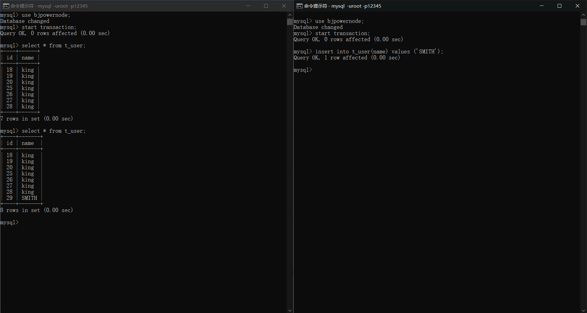
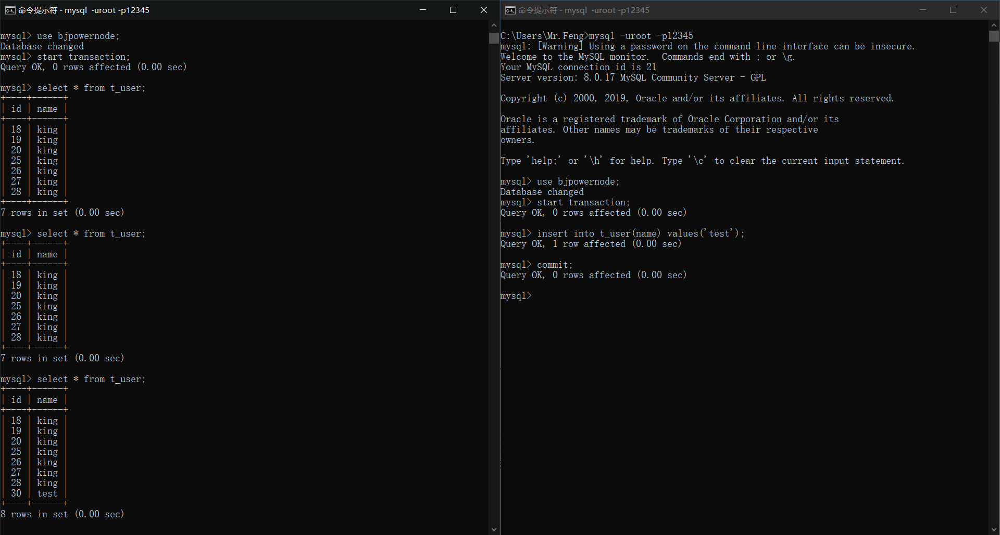
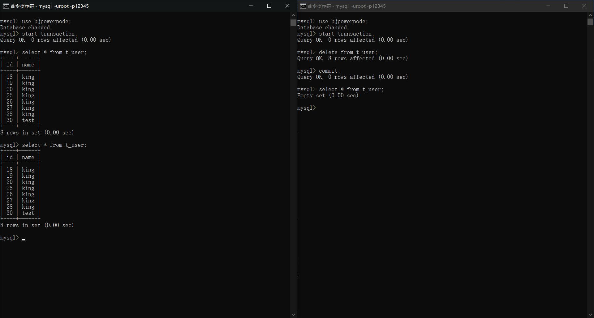
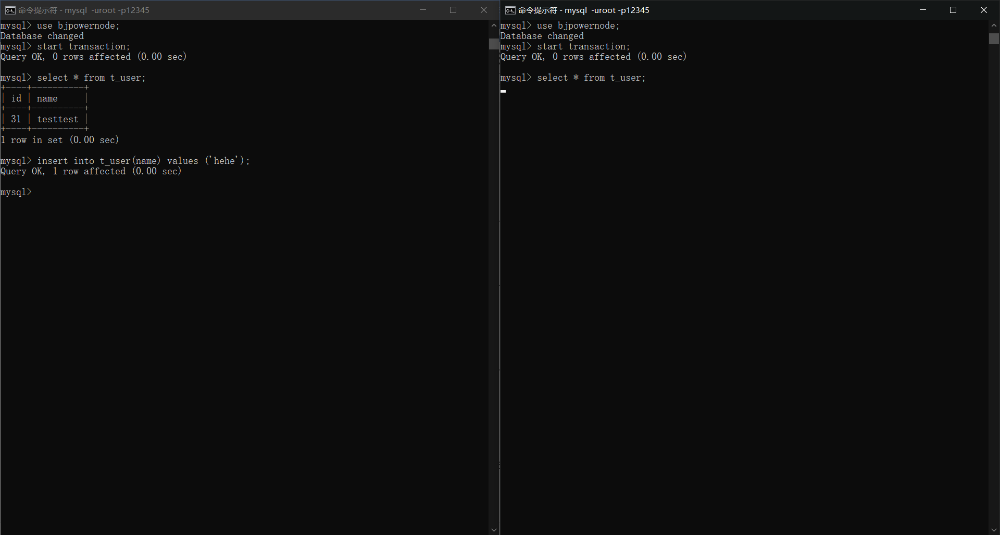
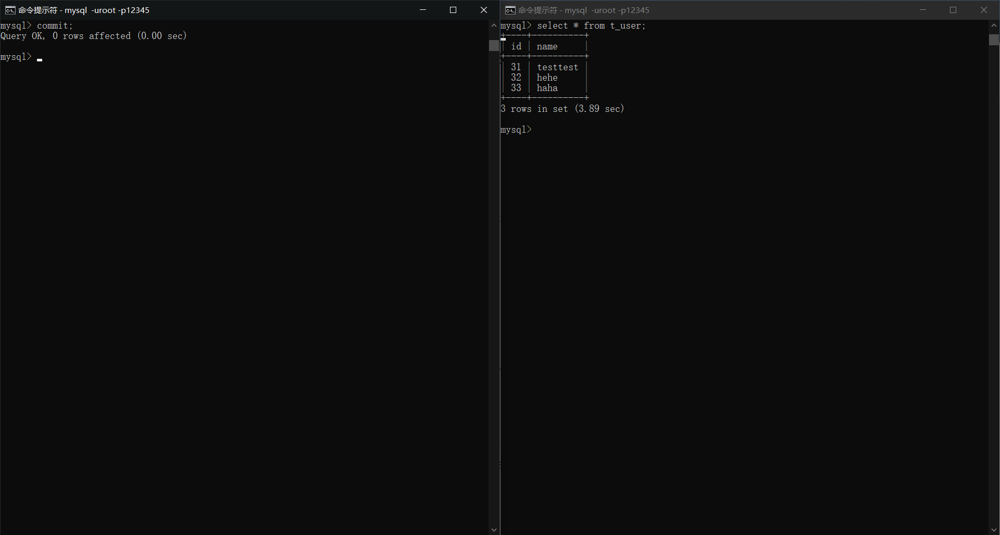
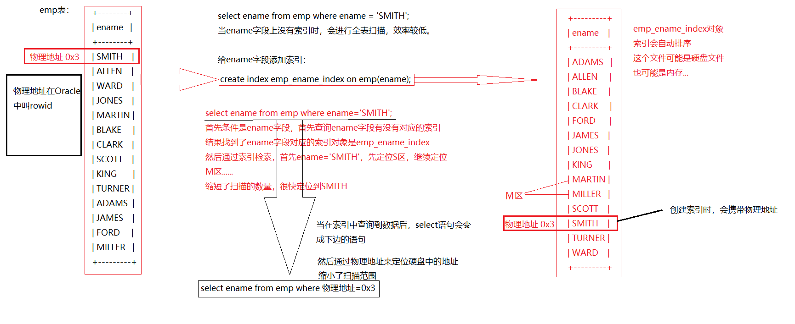

# MySQL进阶部分


## 一、关于查询结果集的去重

**distinct关键字：去除重复记录。**

- 查询所有工作岗位，去掉重复数据

  select distinct job from emp;

- 查询所有部门的所有工作岗位，去掉重复数据

  select distinct deptno,job from emp;

**distinct只能出现在所有字段的最前面，当distinct后边有多个字段时，后边所有字段联合起来去除重复数据。**

- 统计岗位的数量

  select count(distinct job) from emp;


## 二、连接查询

### 2.1什么是连接查询

在实际开发中，大部分情况下都不是在单表中查询数据，一般都是多张表联合查询，取出最终的结果。

在实际开发中，一般一个业务都会对应多张表，比如：学生和班级，起码两张表。

stuno		stuname				classno					classname

---------------------------------------------------------------------------------

1				zs							1							沈阳市第一高中

2 				ls							1							沈阳市第一高中

...

**学生和班级存储在一张表中，结果就像上边一样，数据存在大量重复，导致数据的冗余。**

### 2.2连接查询的分类

1. 根据语法出现的年代来划分，包括：
   - SQL92（一些老的DBA可能还在使用，DBA：DataBase Administrator数据库管理员）
   - SQL99（比较新的语法）
2. 根据表的连接方式划分，包括：
   - 内连接：
     - 等值连接
     - 非等值连接
     - 自连接
   - 外连接
     - 左外连接（左连接）
     - 右外连接（右连接）
     - 全连接（很少用）

### 2.3在表的连接查询方面有一种现象被称为：笛卡尔积现象（笛卡尔乘积现象）

- 找出每一个员工的部门名称，要求显示员工名和部门名

  先查询员工表

  ```mysql
  mysql> select * from emp;
  +-------+--------+-----------+------+------------+---------+---------+--------+
  | EMPNO | ENAME  | JOB       | MGR  | HIREDATE   | SAL     | COMM    | DEPTNO |
  +-------+--------+-----------+------+------------+---------+---------+--------+
  |  7369 | SMITH  | CLERK     | 7902 | 1980-12-17 |  800.00 |    NULL |     20 |
  |  7499 | ALLEN  | SALESMAN  | 7698 | 1981-02-20 | 1600.00 |  300.00 |     30 |
  |  7521 | WARD   | SALESMAN  | 7698 | 1981-02-22 | 1250.00 |  500.00 |     30 |
  |  7566 | JONES  | MANAGER   | 7839 | 1981-04-02 | 2975.00 |    NULL |     20 |
  |  7654 | MARTIN | SALESMAN  | 7698 | 1981-09-28 | 1250.00 | 1400.00 |     30 |
  |  7698 | BLAKE  | MANAGER   | 7839 | 1981-05-01 | 2850.00 |    NULL |     30 |
  |  7782 | CLARK  | MANAGER   | 7839 | 1981-06-09 | 2450.00 |    NULL |     10 |
  |  7788 | SCOTT  | ANALYST   | 7566 | 1987-04-19 | 3000.00 |    NULL |     20 |
  |  7839 | KING   | PRESIDENT | NULL | 1981-11-17 | 5000.00 |    NULL |     10 |
  |  7844 | TURNER | SALESMAN  | 7698 | 1981-09-08 | 1500.00 |    0.00 |     30 |
  |  7876 | ADAMS  | CLERK     | 7788 | 1987-05-23 | 1100.00 |    NULL |     20 |
  |  7900 | JAMES  | CLERK     | 7698 | 1981-12-03 |  950.00 |    NULL |     30 |
  |  7902 | FORD   | ANALYST   | 7566 | 1981-12-03 | 3000.00 |    NULL |     20 |
  |  7934 | MILLER | CLERK     | 7782 | 1982-01-23 | 1300.00 |    NULL |     10 |
  +-------+--------+-----------+------+------------+---------+---------+--------+
  ```

  再查询部门表

  ```mysql
  mysql> select * from dept;
  +--------+------------+----------+
  | DEPTNO | DNAME      | LOC      |
  +--------+------------+----------+
  |     10 | ACCOUNTING | NEW YORK |
  |     20 | RESEARCH   | DALLAS   |
  |     30 | SALES      | CHICAGO  |
  |     40 | OPERATIONS | BOSTON   |
  +--------+------------+----------+
  ```

  查询

  ```mysql
  mysql> select ename,dname from emp,dept;
  +--------+------------+
  | ename  | dname      |
  +--------+------------+
  | SMITH  | ACCOUNTING |
  | SMITH  | RESEARCH   |
  | SMITH  | SALES      |
  | SMITH  | OPERATIONS |
  | ALLEN  | ACCOUNTING |
  | ALLEN  | RESEARCH   |
  | ALLEN  | SALES      |
  | ALLEN  | OPERATIONS |
  | WARD   | ACCOUNTING |
  | WARD   | RESEARCH   |
  | WARD   | SALES      |
  | WARD   | OPERATIONS |
  | JONES  | ACCOUNTING |
  | JONES  | RESEARCH   |
  | JONES  | SALES      |
  | JONES  | OPERATIONS |
  | MARTIN | ACCOUNTING |
  | MARTIN | RESEARCH   |
  | MARTIN | SALES      |
  | MARTIN | OPERATIONS |
  | BLAKE  | ACCOUNTING |
  | BLAKE  | RESEARCH   |
  | BLAKE  | SALES      |
  | BLAKE  | OPERATIONS |
  | CLARK  | ACCOUNTING |
  | CLARK  | RESEARCH   |
  | CLARK  | SALES      |
  | CLARK  | OPERATIONS |
  | SCOTT  | ACCOUNTING |
  | SCOTT  | RESEARCH   |
  | SCOTT  | SALES      |
  | SCOTT  | OPERATIONS |
  | KING   | ACCOUNTING |
  | KING   | RESEARCH   |
  | KING   | SALES      |
  | KING   | OPERATIONS |
  | TURNER | ACCOUNTING |
  | TURNER | RESEARCH   |
  | TURNER | SALES      |
  | TURNER | OPERATIONS |
  | ADAMS  | ACCOUNTING |
  | ADAMS  | RESEARCH   |
  | ADAMS  | SALES      |
  | ADAMS  | OPERATIONS |
  | JAMES  | ACCOUNTING |
  | JAMES  | RESEARCH   |
  | JAMES  | SALES      |
  | JAMES  | OPERATIONS |
  | FORD   | ACCOUNTING |
  | FORD   | RESEARCH   |
  | FORD   | SALES      |
  | FORD   | OPERATIONS |
  | MILLER | ACCOUNTING |
  | MILLER | RESEARCH   |
  | MILLER | SALES      |
  | MILLER | OPERATIONS |
  +--------+------------+
  ```

  结果出现了14*4=56条记录，如果两张表进行连接查询，没有条件限制的话，最终的结果的条数是两张表的记录条数的乘积。被称为"笛卡尔积现象"。

**通常使用连接查询时，会给表起一个别名**

```mysql
select e.ename,d.dname from emp e,dept d;
```

> 起别名的好处：
>
> - 执行效率高
> - 可读性好

### 2.4如何避免笛卡尔积现象

**加条件进行过滤**

**避免了笛卡尔积现象，依然会匹配记录条数乘积的次数，只不过只会显示有效记录。也就是说避免了笛卡尔积现象并不会提高执行效率。**

- 找出每一个员工的部门名称，要求显示员工名和部门名

  ```mysql
  mysql> select e.ename,d.dname from emp e,dept d where e.deptno = d.deptno;
  +--------+------------+
  | ename  | dname      |
  +--------+------------+
  | SMITH  | RESEARCH   |
  | ALLEN  | SALES      |
  | WARD   | SALES      |
  | JONES  | RESEARCH   |
  | MARTIN | SALES      |
  | BLAKE  | SALES      |
  | CLARK  | ACCOUNTING |
  | SCOTT  | RESEARCH   |
  | KING   | ACCOUNTING |
  | TURNER | SALES      |
  | ADAMS  | RESEARCH   |
  | JAMES  | SALES      |
  | FORD   | RESEARCH   |
  | MILLER | ACCOUNTING |
  +--------+------------+
  ```

### 2.5内连接

#### 2.5.1等值连接

特点：条件是等量关系

- 查询每个员工的部门名称，要求显示员工名和部门名

  SQL92（不常用）：

  ```mysql
  select e.ename,d.dname
  from emp e,dept d
  where e.deptno = d.deptno;
  ```

  SQL99（常用）：

  ```mysql
  select e.ename,d.dname
  from emp e
  join dept d
  on e.deptno = d.deptno;
  // join on 语法
  ```

  语法格式：

  > ...
  >
  > ​	A表
  >
  > join
  >
  > ​	B表
  >
  > on
  >
  > ​	连接条件
  >
  > where
  >
  > ​	...

  **SQL99语法结构更清晰一些，表的连接条件和后边的where条件分离了。**

#### 2.5.2非等值连接

特点：连接条件中的关系是非等量关系

- 找出每个员工的工资等级，要求显示员工名，工资，工资等级

  ```mysql
  // SQL 99 
  mysql> select e.ename, e.sal, s.grade
      -> from emp e
      -> join salgrade s
      -> on e.sal between s.losal and s.hisal;
  +--------+---------+-------+
  | ename  | sal     | grade |
  +--------+---------+-------+
  | SMITH  |  800.00 |     1 |
  | ALLEN  | 1600.00 |     3 |
  | WARD   | 1250.00 |     2 |
  | JONES  | 2975.00 |     4 |
  | MARTIN | 1250.00 |     2 |
  | BLAKE  | 2850.00 |     4 |
  | CLARK  | 2450.00 |     4 |
  | SCOTT  | 3000.00 |     4 |
  | KING   | 5000.00 |     5 |
  | TURNER | 1500.00 |     3 |
  | ADAMS  | 1100.00 |     1 |
  | JAMES  |  950.00 |     1 |
  | FORD   | 3000.00 |     4 |
  | MILLER | 1300.00 |     2 |
  +--------+---------+-------+
  ```

#### 2.5.3自连接

特点：一张表看作两张表，自己连自己

- 找出每个员工的上级领导，要求显示员工名和对应的领导名

  ```mysql
  // SQL 99
  // 使用别名来区分员工和领导
  mysql> select a.ename as '员工',b.ename as '领导'
      -> from emp a
      -> inner join emp b   	// inner可以省略
      -> on a.mgr = b.empno;
  +--------+-------+
  | 员工   | 领导  |
  +--------+-------+
  | SMITH  | FORD  |
  | ALLEN  | BLAKE |
  | WARD   | BLAKE |
  | JONES  | KING  |
  | MARTIN | BLAKE |
  | BLAKE  | KING  |
  | CLARK  | KING  |
  | SCOTT  | JONES |
  | TURNER | BLAKE |
  | ADAMS  | SCOTT |
  | JAMES  | BLAKE |
  | FORD   | JONES |
  | MILLER | CLARK |
  +--------+-------+
  // 只有13条数据，没有KING的数据，这是因为KING的mgr对应是NULL，所以丢失一条数据
  ```

### 2.6外连接

外连接和内连接有什么区别：

> - 内连接：
>
>   假设A和B进行连接，使用内连接的话，凡是A表和B表能够匹配上的记录查询出来，这就是内连接。
>
>   AB两张表没有主副之分，两张表是平等的。
>
> - 外连接：
>
>   假设A和B进行连接，使用外连接的话，AB两张表中有一张表是主表，一张表是副表，主要查询主表中的数据，捎带着查询副表，当副表中的数据没有和主表中的数据匹配上，副表自动模拟出NULL与之匹配。

**外连接最重要的特点是：主表的数据无条件的全部查询出来。**

#### 2.6.1左外连接（左连接）

特点：左边的表是主表，左连接有右连接的写法。

- 找出每个员工的上级领导

  ```mysql
  // 使用左连接，左边的表是主表，这样查询不会丢失KING的数据
  mysql> select a.ename,b.ename
      -> from emp a
      -> left outer join emp b   	 	// outer可以省略
      -> on a.mgr = b.empno;
  +--------+-------+
  | ename  | ename |
  +--------+-------+
  | SMITH  | FORD  |
  | ALLEN  | BLAKE |
  | WARD   | BLAKE |
  | JONES  | KING  |
  | MARTIN | BLAKE |
  | BLAKE  | KING  |
  | CLARK  | KING  |
  | SCOTT  | JONES |
  | KING   | NULL  |
  | TURNER | BLAKE |
  | ADAMS  | SCOTT |
  | JAMES  | BLAKE |
  | FORD   | JONES |
  | MILLER | CLARK |
  +--------+-------+
  ```

#### 2.6.2右外连接（右连接）

特点：右边的表是主表，右连接有左连接的写法。

- 找出每个员工的上级领导（使用右外连接）

```mysql
mysql> select a.ename '员工',b.ename '领导'
    -> from emp b
    -> right outer join emp a
    -> on a.mgr = b.empno;
+--------+-------+
| 员工   | 领导  |
+--------+-------+
| SMITH  | FORD  |
| ALLEN  | BLAKE |
| WARD   | BLAKE |
| JONES  | KING  |
| MARTIN | BLAKE |
| BLAKE  | KING  |
| CLARK  | KING  |
| SCOTT  | JONES |
| KING   | NULL  |
| TURNER | BLAKE |
| ADAMS  | SCOTT |
| JAMES  | BLAKE |
| FORD   | JONES |
| MILLER | CLARK |
+--------+-------+
```

**区分内外连接不是使用inner和outer，而是通过left和right，如果都没有就是内连接。inner和outer只是为了可读性强。**


**左右连接的区别：**

> 左连接以左面的表为准和右边的表比较，和左表相等的不相等都会显示出来，右表符合条件的显示,不符合条件的不显示
>
> 右连接恰恰相反，以上左连接和右连接也可以加入outer关键字，但一般不建议这种写法

- 找出哪个部门没有员工

  ```mysql
  mysql> select d.*
      -> from emp e
      -> right join dept d
      -> on e.deptno = d.deptno
      -> where e.empno is null;
  +--------+------------+--------+
  | DEPTNO | DNAME      | LOC    |
  +--------+------------+--------+
  |     40 | OPERATIONS | BOSTON |
  +--------+------------+--------+
  ```

#### 2.6.3全连接

特点：将两张表的数据全部显示出来

- Oracle使用full join ... on ...来表示全连接
- MySql没有full join ... on ...关键字，MySql使用Union关键字来合并结果集来达到全连接的效果

### 2.7三张表的连接查询

- 找出每一个员工的部门名称和工资等级

  ```mysql
  // 多表连接需要多个join...on...
  mysql> select a.ename,b.dname,c.grade
      -> from emp a
      -> join dept b
      -> on a.deptno = b.deptno
      -> join salgrade c
      -> on a.sal between c.losal and c.hisal;
  +--------+------------+-------+
  | ename  | dname      | grade |
  +--------+------------+-------+
  | SMITH  | RESEARCH   |     1 |
  | ALLEN  | SALES      |     3 |
  | WARD   | SALES      |     2 |
  | JONES  | RESEARCH   |     4 |
  | MARTIN | SALES      |     2 |
  | BLAKE  | SALES      |     4 |
  | CLARK  | ACCOUNTING |     4 |
  | SCOTT  | RESEARCH   |     4 |
  | KING   | ACCOUNTING |     5 |
  | TURNER | SALES      |     3 |
  | ADAMS  | RESEARCH   |     1 |
  | JAMES  | SALES      |     1 |
  | FORD   | RESEARCH   |     4 |
  | MILLER | ACCOUNTING |     2 |
  +--------+------------+-------+
  ```

- 找出每一个员工的部门名称、工资等级、以及上级领导

  ```mysql
  mysql> select a.ename,d.dname,s.grade,b.ename
      -> from emp a
      -> left join emp b
      -> on a.mgr = b.empno
      -> join dept d
      -> on a.deptno = d.deptno
      -> join salgrade s
      -> on a.sal between s.losal and s.hisal;
  +--------+------------+-------+-------+
  | ename  | dname      | grade | ename |
  +--------+------------+-------+-------+
  | SMITH  | RESEARCH   |     1 | FORD  |
  | ALLEN  | SALES      |     3 | BLAKE |
  | WARD   | SALES      |     2 | BLAKE |
  | JONES  | RESEARCH   |     4 | KING  |
  | MARTIN | SALES      |     2 | BLAKE |
  | BLAKE  | SALES      |     4 | KING  |
  | CLARK  | ACCOUNTING |     4 | KING  |
  | SCOTT  | RESEARCH   |     4 | JONES |
  | KING   | ACCOUNTING |     5 | NULL  |
  | TURNER | SALES      |     3 | BLAKE |
  | ADAMS  | RESEARCH   |     1 | SCOTT |
  | JAMES  | SALES      |     1 | BLAKE |
  | FORD   | RESEARCH   |     4 | JONES |
  | MILLER | ACCOUNTING |     2 | CLARK |
  +--------+------------+-------+-------+
  ```


## 三、子查询

select语句中嵌套select语句，被嵌套的select语句是子查询。

```mysql
select
	..(select).
from
	..(select).
where
	..(select).
```

### 3.1在where子句中使用子查询

```mysql
// 找出高于平均薪资的员工信息
select * from emp where sal > (select avg(sal) from emp);

// 查询与7788员工职位和工资相同的员工信息
select * from emp where (job,sal)=(select job,sal from emp where empno=7788);

// 查询每个部门的平均工资
select DEPTNO,AVG(sal) avgsal from emp GROUP BY DEPTNO; 

// 查询平均工资最高的部门
select s.deptno,MAX(avgsal) from (select DEPTNO,AVG(sal) avgsal from emp GROUP BY DEPTNO order by deptno) s;

// 查询平均工资最高的部门的员工信息
select e.* from emp e where e.deptno=(select d.deptno from (select s.deptno,MAX(avgsal) from (select DEPTNO,AVG(sal) avgsal from emp group by deptno order by deptno) s) d) order by sal desc;

// 查询平均工资最高部门的员工中工资最高的员工信息
select * from (select e.* from emp e join (select s.deptno,MAX(avgsal) from (select DEPTNO,AVG(sal) avgsal from emp GROUP BY DEPTNO order by deptno) s) d on e.deptno=d.deptno order by sal desc limit 0,1) e;

// 查询平均工资最高部门的员工中工资排第三的员工信息
select * from (select e.* from emp e join (select s.deptno,MAX(avgsal) from (select DEPTNO,AVG(sal) avgsal from emp GROUP BY DEPTNO order by deptno) s) d on e.deptno=d.deptno order by sal desc limit 2,1) e;
```


#### 3.1.1ALL关键字

ALL前面只能有>,<,>=,<=

字段>ALL(集合)：字段大于集合中的所有值，**==大于集合中的最大值==**

```mysql
// 查询工资高于部门30中与员工最高工资的员工信息
select * from emp where sal>all(select sal from emp where deptno=30);
```


#### 3.1.2ANY关键字

ANY前面只能有>,<,>=,<=

字段>ANY(集合)：字段大于集合中的所有值，**==大于集合中的最小值==**

```mysql
// 查询工资高于部门30中员工最低工资的员工信息
select * from emp where sal>any(select sal from emp where deptno=30);
```


#### 3.1.3EXISTS关键字

exists用于检查子查询是否会返回一行数据，但是该子查询实际上不返回任何数据，而返回false或true，使用exists指定一个子查询来检测行的存在。

```mysql
// 查询编号为7596的员工是否存在，如果存在则查询编号7788的员工信息，否则不查询
select * from emp where exists(select * from emp where empno=7569) and empno=7788;
```


### 3.2在from子句中使用子查询

- 找出每个部门平均薪水等级

  select a.*,s.grade
  from (select deptno, avg(sal) as avgsal from emp group by deptno) a
  left join salgrade s 
  on a.avgsal between s.losal and s.hisal;

- 找出每个部门平均的薪水等级

  - 第一步：找出找出每个员工的薪水等级

    select e.ename,e.deptno,s.grade 
    from emp e 
    left join salgrade s 
    on e.sal between s.losal and s.hisal;
  
  - 第二步：基于以上结果，继续按照deptno进行分组，求grade的平均值
  
    select e.deptno,avg(s.grade) as avgsal
    from emp e
    left join salgrade s
    on e.sal between s.losal and s.hisal
    group by e.deptno;
  

### 3.3在select后面嵌套子查询

- 找出每个员工所在的部门名称，要求显示员工名和部门名

  select e.ename,(select d.dname from dept d where e.deptno = d.deptno) as dname 
  from emp e;


## 四、Union

可以将查询结果集相加

- 找出工作岗位是salesman和manager的员工

  1. 方法一：

     select ename,job
     from emp 
     where job in ('salesman','manager');

  2. 方法二：

     select ename,job
     from emp 
     where job = 'salesman' or job = 'manager';

  3. 方法三：

     select ename,job
     from emp
     where job = 'salesman'
     union
     select ename,job
     from emp
     where job = 'manager';

**当需求无法使用or或者in关键字满足的时候，可以通过union关键字来完成。**

**注意：当两个select语句查找的列数不同时，会出错。**


## 五、limit（重点）

> **limit是mysql特有的，其他数据库没有，不通用。**
>
> **limit的作用是取结果集中的部分数据。**

### 5.1语法格式

limit startIndex, length

startIndex：表示起始位置

length：表示取几个

- 取出工资前五名

  select ename,sal 
  from emp
  order by sal desc
  limit 0,5;

### 5.2执行顺序

**limit是sql语句中最后执行的。**

### 5.3案例

- 找出工资排名在第四到第九的员工

  // 第四名的下标是3，往下数6名

  select ename,sal 
  from emp
  order by sal desc
  limit 3,6;

### 5.4通用的标准分页SQL

**类似百度查询分页**

每页显示三条记录：

第一页：0，3——0，1，2

第二页：3，3——3，4，5

第三页：6，3——6，7，8

第四页：9，3——9，10，11

**每页显示pageSize条记录：**

**第pageNo页：？，pageSize**

**？= （pageNo - 1）* pageSize**

```java
java代码{
    int pageNo = 2;  // 页码是2
    int pageSize = 10;   // 每页显示10条
    // limit 10, 10
}
```


## 六、创建表

### 6.1语法格式

```mysql
create table 表名{
	字段名1 数据类型,
	字段名2 数据类型,
	....
};
```

MySql中常用的字段的数据类型：

> int：整数型
>
> bigint：长整型
>
> float：浮点型
>
> char：定长字符串（char(6)，在存储空间自动分配长度为6的空间，字符串长度不够6自动补齐到6，超过6报错。）
>
> varchar：可变长字符串（可以根据存储的数据长度动态的分配存储空间，但是超出设定长度会报错。）
>
> date：日期类型
>
> BLOB：二进制大对象（存储图片，视频等流媒体信息。）
>
> CLOB：字符大对象（存储较大文本，比如存储4G的字符串。）

### 6.2char和varchar该如何选择

> 当某个字段的数据长度不发生改变的时候，是定长的，例如：性别，生日等都是使用char
>
> 当一个字段的数据长度不确定，例如：简介，姓名等都是使用varchar

### 6.3BLOB和CLOB类型的使用

> 电影表：t_movie
>
> id（int）			name（varchar）			playtime（date）		poster（BOLB）		stroy（CLOB）
>
> 1						蜘蛛侠							...									...								...
>
> ...

使用BLOB和CLOB通常使用java中的IO流来保存数据，但是好处是便于维护，坏处是如果文件过大，会过多占用数据库资源。**所以一般大文件会通过文件在硬盘中的保存位置来存到数据库，小文件通常会直接使用IO流来保存到数据库中。**	


### 6.4表名命名规则

**表名在数据库中一般建议以：t_ 或者tb1_ 开始。**

- 创建学生表

  学生信息包括：学号、姓名、性别、班级编号、生日

  学号：bigint

  姓名：varchar

  性别：char

  班级编号：int

  生日：date

  ```mysql
  create table t_student{
  	no bigint,
  	name varchar(255),
  	sex char(1),
  	classno int,
  	birthday date
  };
  ```

### 6.5default关键字

```mysql
create table t_student{
	no bigint,
	name varchar(255),
	sex char(1) default 'f',  	// 默认为f
 	classno int,
	birthday date
}; 
```

**当字段名指定了默认值的时候，在插入数据时如果没有给这个字段插入数据，那么会自动将默认值赋给这条数据。**


### 6.6表的复制

语法格式：

```mysql
create table 表名 
as select语句;
// 将查询结果作为一个表创建出来
create table emp1 
as select * from emp;
```

### 6.7将查询结果插入到一张表中

语法格式：

```mysql
insert into 表名 select语句;
// 将查询结果插入到一张表中
insert into emp1 select * from emp;
```

**注意：结果的字段数要和插入到的表的字段数一致。**


## 七、删除表

### 7.1语法格式

```mysql
drop table 表名;
// 删除表
drop table if exists t_student;
// 如果t_student表存在，则删除，oracle不支持这个语法
```


## 八、插入数据

### 8.1语法格式

```mysql
insert into 表名(字段名1, 字段名2, 字段名3, ...) values (值1, 值2, 值3, ...);
```

要求字段数量和值的数量相同，并且数据类型对应相同。

插入数据的几种情况：

```mysql
insert into t_student (no, name, sex, classno, birthday) values (1, 'zhangsan', 'f', 0301, '1990-05-12');
```

```mysql
insert into t_student (name, sex, classno, birthday, no) values ('lisi', 'f', 0302, '1990-06-12', 2);
```

```mysql
insert into t_student (name) values ('wangwu');
// 其他字段自动为NULL
```

```mysql
insert into t_student values (3, 'zhaoliu', 'm', 0303, '1994-05-12');
// 当省略字段名的时候，值的顺序和数量必须和字段名一一对应
```

```mysql
insert into t_student (no, name, sex, classno, birthday) 
values (1, 'zhangsan', 'f', 0301, '1990-05-12'), 
	   (2, 'lisi', 'f', 0302, '1992-06-08'),
	   (3, 'wangwu', 'm', 0306, '1993-01-09');
// 可以插入多条数据
```

**注意：当一条insert语句执行成功以后，表格当中必然会多出一条记录，即使多的这一行记录中有些字段是null，后期也没办法再执行insert插入数据，只能使用update来修改数据。**


## 九、修改数据

### 9.1语法格式

```mysql
update 表名 set 字段名1=值1, 字段名2=值2, ... where 条件;
```

**注意：没有条件整张表数据全部更新。**

- 将部门10的location修改为上海，将部门名称修改为人事部

  ```mysql
  update dept set loc = 'SHANGHAI', dname = 'RENSHIBU' where deptno = 10;
  ```


## 十、删除数据

### 10.1语法格式

```mysql
delete from 表名 where 条件;
```

**注意：没有条件，全部删除。**

- 删除10部门数据

  ```mysql
  delete * from dept where deptno = 10;
  ```

### 10.2如何删除大表

当表中的数据特别大的时候，使用delete删除时也许会删除很长时间，这是因为没有释放数据真实的存储空间，所以使用delete可以恢复数据。

语法格式：

```mysql
truncate table 表名;
```

**表被截断，不可回滚，数据永久丢失。**

**注意：使用truncate删除数据，不可恢复！**


**增删改查有一个术语：CRUD操作**

> Create（增）
>
> Retrieve（检索）
>
> Update（修改）
>
> Delete（删除）


## 十一、约束（Constraint）

### 11.1什么是约束，常见的约束有哪些

约束在创建表的时候，可以给表中的字段添加相应的约束，添加约束的目的是为了保证表中数据的合法性、有效性、完整性。

> 常见的约束：
>
> 非空约束（not null）：约束的字段不能为NULL
>
> 唯一约束（unique）：约束的字段不能重复
>
> 主键约束（primary key）：约束的字段既不能为NULL，也不能重复
>
> 外键约束（foreign key）
>
> 检查约束（check）：注意Oracle数据库有check约束，但是mysql没有，目前mysql不支持该约束

### 11.2非空约束not null

```mysql
create table t_user(
	id int,
	username varchar(255) not null,
	password varchar(255)
);
```

当插入数据的时候，如果username字段不给出值，会出错。

### 11.3唯一性约束（Unique）

**唯一性约束修饰的字段具有唯一性，不能重复，但可以为NULL（NULL不是值）。**

```mysql
create table t_user(
	id int,
	username varchar(255) unique
);
```

```mysql
create table t_user(
	id int,
	username varchar(255),
	usercode varchar(255),
	unique(username, usercode)
);
// unique()是将多个字段联合起来添加一个约束

create table t_user(
	id int,
	username varchar(255) unique,
	usercode varchar(255) unique
);
// 这是将每个单个字段添加约束
```

**列级约束：在列后边添加约束。**

**表级约束：在列声明结束之后添加约束。**

**表级约束可以写列级约束。**


### 11.4主键约束

```mysql
create table t_user(
	id int primary key,
	username varchar(255),
	password varchar(255)
);
```

**id是主键，因为添加了主键约束，主键字段中的数据不能为null，也不能重复。**

#### 11.4.1主键相关术语

> - 主键约束：primary key
> - 主键字段：id
> - 主键值：id的值

#### 11.4.2主键的作用

> 表的设计三范式中有要求：第一范式就是要求在任何一张表中都应该有主键
>
> - 主键值是这行记录在这张表当中的唯一标识。（类似身份证号）

#### 11.4.3主键的分类

> 根据主键字段的字段数量分：
>
> - 单一主键（常用）
> - 复合主键（不建议用，因为复合主键违背三范式）
>
> 根据主键性质来划分：
>
> - 自然主键（主键最好是一个和业务没有任何关系的自然数，**推荐使用**）
> - 业务主键（主键值喝系统的业务挂钩，例如：拿着银行卡的卡号座主键，不建议用）
>
> 最好不要使用和业务挂钩的字段作为主键，因为以后的业务一旦发生改变的时候，主键值可能也需要随着发生变化，但有的时候没有办法变化，因为变化会导致主键重复。

**注意：一张表的主键约束只能有一个！！！**

#### 11.4.4使用表级约束定义主键

```mysql
create table t_user(
	id int,
	username varchar(255),
	primary key(id)
	// 复合主键，不用掌握
	// primary key(id, username)
);
```

#### 11.4.5mysql提供主键值自增（重要）

关键字：auto_increment

```mysql
create table t_user(
	id int primary key auto_increment, // id字段自动增长，从1开始，以1递增
	username varchar(255)
)
```

提示：Oracle中也提供了一种自增机制，叫序列

### 11.5外键约束

#### 11.5.1外键相关术语

> - 外键约束：foreign key
> - 外键字段：添加有外键约束的字段
> - 外键值：外键字段中的每一个值

#### 11.5.2业务背景

请设计数据库表，用来维护学生和班级的信息？

- 第一种方案：一张表存储所有数据

  no（pk）				name				classno				classname

  -------------------------------------------------------------------------------------

  1								zs1					101						北京二高一班

  2								zs2					101						北京二高一班

  3								zs3					102						北京二高二班

  4								zs4					102						北京二高二班

  5								zs5					102						北京二高二班

  **缺点：冗余（不建议使用）**

- 第二种方案：两张表（班级表和学生表）

  t_class 班级表

  cno(pk)					cname

  ----------------------------------

  101						北京二高一班

  102						北京二高二班

  t_student 学生表

  sno(pk)				sname					classno(该字段添加外键约束fk)

  -------------------------------------

  1							zs1						101

  2							zs2						101

  3							zs3						102

  4							zs4						102

  5							zs5						102

**注意事项：**

t_student中的classno字段引用t_class表中的cno字段，此时t_student表叫做子表，t_class表叫做父表
删除数据的时候，先删除子表，再删除父表
添加数据的时候，先添加父表，再添加子表
创建表的时候，先创建父表，再创建子表
删除表的时候，先删除子表，再删除父表


将以上表的建表语句写出来：

```mysql
drop table if exists t_student;
drop table if exists t_class;

create table t_class(
	cno int primary key,
	cname varchar(255)
);
create table t_student(
	sno int,
	sname varchar(255),
	classno int,
	primary key(sno),
	foreign key (classno) references t_class(cno)	// 添加外键约束
);
```

#### 11.5.3外键相关问题

1. 外键可以为NULL吗？

   **外键可以为NULL**

2. 外键字段引用其他表的某个字段的时候，被引用的字段必须是主键吗？

   **被引用字段不一定是主键，但该被引用字段必须具有唯一性，也就是说至少具有unique约束。**


### 11.6检查约束（Check）

用来检查插入数据的值

```mysql
create table t_user(
	id int,
	username varchar(255) not null,
	password varchar(255),
	sex char(1) check (sex='男' or sex='女')
)
```


## 十二、存储引擎（了解）

```
// 查看存储引擎
mysql> show create table emp;
+-------+-----------------------------------------------------------------------------------------------------------------------------------------------------------------------------------------------------------------------------------------------------------------------------------------------------------------------------------------------------------------------------------+
| Table | Create Table                                                                                                                               |
+-------+-----------------------------------------------------------------------------------------------------------------------------------------------------------------------------------------------------------------------------------------------------------------------------------------------------------------------------------------------------------------------------------+
| emp   | CREATE TABLE `emp` (
  `EMPNO` int(4) NOT NULL,
  `ENAME` varchar(10) DEFAULT NULL,
  `JOB` varchar(9) DEFAULT NULL,
  `MGR` int(4) DEFAULT NULL,
  `HIREDATE` date DEFAULT NULL,
  `SAL` double(7,2) DEFAULT NULL,
  `COMM` double(7,2) DEFAULT NULL,
  `DEPTNO` int(2) DEFAULT NULL,
  PRIMARY KEY (`EMPNO`)
) ENGINE=InnoDB DEFAULT CHARSET=utf8mb4 COLLATE=utf8mb4_0900_ai_ci |
+-------+-----------------------------------------------------------------------------------------------------------------------------------------------------------------------------------------------------------------------------------------------------------------------------------------------------------------------------------------------------------------------------------+
1 row in set (0.01 sec)
```

> ENGINE=InnoDB：是默认存储引擎
>
> DEFAULT CHARSET=utf8mb4：是默认字符集

### 12.1完整的建表语句

CREATE TABLE t_x {
  id int(4) NOT NULL
}ENGINE=InnoDB DEFAULT CHARSET=utf8mb4

建表的时候可以指定存储引擎，也可以指定字符集。

> Mysql中默认存储引擎是InnoDB方式
>
> 默认采用字符集是utf8

### 12.2什么是存储引擎

存储引擎只有在mysql中特有，Oracle有相应的机制，但不叫存储引擎，叫存储方式。

Mysql中有很多的存储引擎，每一种存储引擎对应一种存储方式。

每一个存储引擎都有自己的优缺点，需要在合适的时机选择合适的存储引擎。

### 12.3查看当前mysql支持的存储引擎

```
// mysql版本
mysql> select version();
+-----------+
| version() |
+-----------+
| 8.0.17    |
+-----------+

// 支持的存储引擎,查看当前mysql支持的存储引擎语句
// show engines \G;
mysql> show engines \G;
*************************** 1. row ***************************
      Engine: MEMORY
     Support: YES
     Comment: Hash based, stored in memory, useful for temporary tables
Transactions: NO
          XA: NO
  Savepoints: NO
*************************** 2. row ***************************
      Engine: MRG_MYISAM
     Support: YES
     Comment: Collection of identical MyISAM tables
Transactions: NO
          XA: NO
  Savepoints: NO
*************************** 3. row ***************************
      Engine: CSV
     Support: YES
     Comment: CSV storage engine
Transactions: NO
          XA: NO
  Savepoints: NO
*************************** 4. row ***************************
      Engine: FEDERATED
     Support: NO
     Comment: Federated MySQL storage engine
Transactions: NULL
          XA: NULL
  Savepoints: NULL
*************************** 5. row ***************************
      Engine: PERFORMANCE_SCHEMA
     Support: YES
     Comment: Performance Schema
Transactions: NO
          XA: NO
  Savepoints: NO
*************************** 6. row ***************************
      Engine: MyISAM
     Support: YES
     Comment: MyISAM storage engine
Transactions: NO
          XA: NO
  Savepoints: NO
*************************** 7. row ***************************
      Engine: InnoDB
     Support: DEFAULT
     Comment: Supports transactions, row-level locking, and foreign keys
Transactions: YES
          XA: YES
  Savepoints: YES
*************************** 8. row ***************************
      Engine: BLACKHOLE
     Support: YES
     Comment: /dev/null storage engine (anything you write to it disappears)
Transactions: NO
          XA: NO
  Savepoints: NO
*************************** 9. row ***************************
      Engine: ARCHIVE
     Support: YES
     Comment: Archive storage engine
Transactions: NO
          XA: NO
  Savepoints: NO
9 rows in set (0.00 sec)
```

mysql版本8.0.17支持的存储引擎有九个。

### 12.4常用的存储引擎

#### 12.4.1MyISAM存储引擎

          Engine: MyISAM
         Support: YES
         Comment: MyISAM storage engine
    Transactions: NO
              XA: NO
      Savepoints: NO
> 这种存储引擎不支持事务。
>
> MyISAM是Mysql最常用的存储引擎，但是这种引擎不是默认的。
>

它管理的表有以下特征：

- 使用三个文件表示每个表：

  1. 格式文件 — 存储表结构的定义（XXX.frm）
2. 数据文件 — 存储表行的内容（XXX.MYD）
  3. 索引文件 — 存储表上索引（XXX.MYI）

- 优点：**可被压缩，节省存储空间。并且可以转换为只读表，提高检索效率。**
- 缺点：不支持事务。

#### 12.4.2InnoDB存储引擎

```
      Engine: InnoDB
     Support: DEFAULT
     Comment: Supports transactions, row-level locking, and foreign keys
Transactions: YES
          XA: YES
  Savepoints: YES
```

它管理的表有以下特点：

- 这种存储引擎**最安全**，是Mysql默认缺省存储引擎。
- 优点：**支持事务、行级锁、外键**等机制。
- 每个InnoDB表在数据库目录中以XXX.frm格式文件表示。
- InnoDB表空间tablespace被用于存储表的内容（逻辑概念），不是以文件形式存储，无法被压缩，无法转换成只读。
- 这种存储引擎在Mysql数据库崩溃之后，提供数据恢复机制。
- InnoDB支持级联删除和级联更新

#### 12.4.3MEMORY存储引擎

```
      Engine: MEMORY
     Support: YES
     Comment: Hash based, stored in memory, useful for temporary tables
Transactions: NO
          XA: NO
  Savepoints: NO
```

它管理的表有以下特点：

- 以前叫HEPA引擎。
- 所有数据和索引都存储在内存中，断电数据丢失。
- 缺点：不支持事务，数据容易丢失。
- 优点：查询速度最快。
- 不能存储TEXT和BLOB字段。


## 十三、事务（Transaction）


### 13.1什么是事务

一个事务，是一个完整的业务逻辑单元，不可再分。

比如：银行账户转账，从A账户到B账户转账10000，需要执行两条update语句。

​			update t_act set balance = balance - 10000 where actno = 'act-001';

​			update t_act set balance = balance + 10000 where actno = 'act-002';

以上两条DML语句必须同时成功，或者同时失败，不允许出现一条成功，一条失败。

**要想保证以上的两条DML语句同时成功或者同时失败，那么就需要使用数据库的事务机制。**


### 13.2只有DML语句才支持事务

insert、delete、update因为这三个语句都是和数据库表当中的"数据"相关的。

**事务的存在是为了保证数据的完整性，安全性。**

> 假设一个事儿，需要先执行一条insert，再执行一条update，最后执行一条delete，这事儿才完成
>
> - 开启事务机制
> - 执行insert语句-->insert.....（这个执行成功之后，把这个执行记录到数据库的操作历史当中，并不会向文件中保存一条数据，不会真正的修改硬盘上的数据。）
> - 执行update语句-->update.....（这个执行也是记录一下历史操作，不会真正修改硬盘上的数据。）
> - 执行delete语句-->delete......（这个执行也是记录一下历史操作【记录到缓存】，不会真正的修改硬盘上的数据。）
> - 提交事务或者回滚事务（结束）
>   - 提交（commit）：把这三个操作持久化到硬盘上，彻底修改硬盘上的数据，将所有的历史操作清空。
>   - 回滚（rollback）：将历史操作清空，不操作硬盘上的数据。

### 13.3事务的特性

事务的四大特性：ACID

1. A：原子性：指事务是最小的工作单元，不可再分。
2. C：一致性：指事务必须保证多条DML语句同时成功或者同时失败。
3.  I ：隔离性：指事务A与事务B之间具有隔离（有四个隔离级别）。
4. D：持久性：指最终数据必须持久化到硬盘文件中，事务才算成功的结束。


### 13.4关于事务之间的隔离性

事务隔离性之间存在隔离级别，理论上隔离级别包括四个：

1. 第一级别：读未提交（read uncommitted）

   > 对方事务还未提交时，我们当前事务可以读取到对方未提交的数据。
   >
   > 读未提交存在脏读（Dirty Read）现象，表示读到了脏的数据，该数据未保存在硬盘中，极其不稳定。

2. 第二级别：读已提交（read committed）

   > 对方提交之后的数据，我方可以读取到。
   >
   > 这种隔离级别解决了脏读现象。
   >
   > 读已提交存在的问题：不可重复读。（对方每次提交，我方就会读到新的数据，不可重复读取开启事务时读到的数据。）

3. 第三级别：可重复读（repeatable read）

   > 这种隔离级别解决了不可重复读的问题。
   >
   > 这种隔离级别存在的问题：读取到的数据是幻象。

4. 第四级别：序列化读/串行化读

   > 解决了所有问题
   >
   > 效率低，需要事务排队。

**Oracle数据库默认的隔离级别是读已提交，Mysql数据库默认的隔离级别是可重复读。**


### 13.5关于脏读，不可重复读，幻读的概念

> 脏读：脏读是读到了别的事务回滚前的脏数据。比如事务B执行过bai程中修改了数据X，在未提交前，事务A读取了X，而事务B却回滚了，这样事务A就形成了脏读。
>
> 不可重复读：事务A首先读取了一条数据，然后执行逻辑的时候，事务B将这条数据改变了，然后事务A再次读取的时候，发现数据不匹配了，就是所谓的不可重复读了。
>
> 幻读：事务A首先根据条件索引得到N条数据，然后事务B改变了这N条数据之外的M条或者增添了M条符合事务A搜索条件的数据，导致事务A再次搜索发现有N+M条数据了，就产生了幻读。


### 13.6演示事务

mysql事务默认情况下是自动提交的，执行任意一次DML语句则提交一次。

如何关闭自动提交？

**start transaction;**

**演示：**

```mysql
// 准备表
drop table if exists t_user;
create table t_user(
    id int primary key auto_increment,
    username varchar(255)
    );
    
// 以下操作表示Mysql中的事务是自动提交的，只要执行就会提交。
mysql> insert into t_user (username) values ('zs');
Query OK, 1 row affected (0.01 sec)

mysql> select * from t_user;
+----+----------+
| id | username |
+----+----------+
|  1 | zs       |
+----+----------+
1 row in set (0.00 sec)

mysql> rollback;
Query OK, 0 rows affected (0.00 sec)

mysql> select * from t_user;
+----+----------+
| id | username |
+----+----------+
|  1 | zs       |
+----+----------+
1 row in set (0.00 sec)

//以下操作表示关闭了自动提交，没有提交事务不会自动提交，可以回滚。
mysql> start transaction;
Query OK, 0 rows affected (0.00 sec)

mysql> insert into t_user(username) values ('ls');
Query OK, 1 row affected (0.00 sec)

mysql> select * from t_user;
+----+----------+
| id | username |
+----+----------+
|  1 | zs       |
|  2 | ls       |
+----+----------+
2 rows in set (0.00 sec)

mysql> insert into t_user(username) values ('ww');
Query OK, 1 row affected (0.00 sec)

mysql> select * from t_user;
+----+----------+
| id | username |
+----+----------+
|  1 | zs       |
|  2 | ls       |
|  3 | ww       |
+----+----------+
3 rows in set (0.00 sec)

mysql> rollback;
Query OK, 0 rows affected (0.00 sec)

mysql> select * from t_user;
+----+----------+
| id | username |
+----+----------+
|  1 | zs       |
+----+----------+
1 row in set (0.00 sec)

//以下操作使用手动提交事务，数据持久化到硬盘中，
mysql> start transaction;
Query OK, 0 rows affected (0.00 sec)

mysql> insert into t_user(username) values ('ls');
Query OK, 1 row affected (0.00 sec)

mysql> insert into t_user(username) values ('ww');
Query OK, 1 row affected (0.00 sec)

mysql> commit;
Query OK, 0 rows affected (0.00 sec)

mysql> select * from t_user;
+----+----------+
| id | username |
+----+----------+
|  1 | zs       |
|  4 | ls       |
|  5 | ww       |
+----+----------+
3 rows in set (0.00 sec)

mysql> rollback;
Query OK, 0 rows affected (0.00 sec)

mysql> select * from t_user;
+----+----------+
| id | username |
+----+----------+
|  1 | zs       |
|  4 | ls       |
|  5 | ww       |
+----+----------+
3 rows in set (0.00 sec)
```


### 13.7使用两个事务演示隔离级别

#### 13.7.1演示read uncommitted

第一步：

设置事务的全局隔离级别：

```mysql
 set global transaction isolation level read uncommitted;
```

查看事务的全局隔离级别：

```mysql
mysql> select @@global.transaction_isolation;
+--------------------------------+
| @@global.transaction_isolation |
+--------------------------------+
| READ-UNCOMMITTED               |
+--------------------------------+
1 row in set (0.00 sec)
```



右侧的事务还未提交，但是左侧的事务可以读取到，这是读未提交。


#### 13.7.2演示read committed

设置并查看全局隔离级别：

```mysql
mysql> set global transaction isolation level read committed;
Query OK, 0 rows affected (0.00 sec)

mysql> select @@global.transaction_isolation;
+--------------------------------+
| @@global.transaction_isolation |
+--------------------------------+
| READ-COMMITTED                 |
+--------------------------------+
1 row in set (0.00 sec)
```



当右侧事务提交后，左侧事务才可以更新数据。


#### 13.7.3演示repeatable read

设置并查看全局隔离级别：

```mysql
mysql> set global transaction isolation level repeatable read;
Query OK, 0 rows affected (0.00 sec)

mysql> select @@global.transaction_isolation;
+--------------------------------+
| @@global.transaction_isolation |
+--------------------------------+
| REPEATABLE-READ                |
+--------------------------------+
1 row in set (0.00 sec)
```



当右侧事务把表中数据都删除并且提交事务后，左侧事务依然可以读取到最开始读取到的数据，表示可以重复读取之前的数据。


#### 13.7.4演示serializble

设置并查看全局隔离级别：

```mysql
mysql> set global transaction isolation level serializable;
Query OK, 0 rows affected (0.00 sec)

mysql> select @@global.transaction_isolation;
+--------------------------------+
| @@global.transaction_isolation |
+--------------------------------+
| SERIALIZABLE                   |
+--------------------------------+
1 row in set (0.00 sec)
```



当左边事务未提交时，使用右边事务查看数据会卡住。

然后将左边事务提交的同时，右边事务将会继续执行。



## 十四、索引


### 14.1索引概念，有何用处

#### 14.1.1概念

相当于一本书中的目录，通过目录可以快速找到资源。

- 查询有两种检索方式：
  1. 全表扫描
  2. 根据索引检索（效率很高）

#### 14.1.2原理

**原理：缩小了扫描的范围。**

**注意：索引虽然可以提高检索效率，但是不能随意添加索引，因为索引也是数据库中的对象，需要数据库不断维护，有维护成本。**

比如：表中的数据经常被修改，这样就不适合添加索引，因为数据一旦修改，索引必须重新排序，进行维护。


### 14.2什么时候考虑给字段添加索引

添加索引是给某一个字段，或者某些字段添加索引

比如：select ename,sal from emp where ename = 'SMITH'

当ename字段上没用索引时，以上sql语句会进行全表扫描，扫描ename字段中所有的值。

1. **数据量庞大（根据客户的需求，根据线上的环境）**
2. **该字段很少的DML操作（因为字段进行修改操作，索引也需要维护）**
3. **该字段经常出现在where子句中（经常根据哪个字段查询）**

**注意：主键和unique约束的字段自动会添加索引。**

根据主键查询效率很高，尽量根据主键检索


### 14.3如何添加索引

```mysql
create index 索引名 on 表名（字段名）;
// 删除索引
drop index 索引名 on 表名;
```

- 查看工资5000的人员名称

```mysql
mysql> select ename,sal from emp where sal = 5000;
+-------+---------+
| ename | sal     |
+-------+---------+
| KING  | 5000.00 |
+-------+---------+
```

使用explain查看sql语句的执行计划（mysql特有）

```mysql
mysql> explain select ename,sal from emp where sal = 5000;
+--+-----------+-------+------------+------+---------------+------+---------+------+------+----------+-------------+
|id|select_type| table | partitions | type | possible_keys | key  | key_len | ref  | rows | filtered | Extra       |
+--+-----------+-------+------------+------+---------------+------+---------+------+------+----------+-------------+
|1 | SIMPLE    | emp   | NULL       | ALL  | NULL          | NULL | NULL    | NULL |   14 |    10.00 | Using where |
+--+-----------+-------+------------+------+---------------+------+---------+------+------+----------+-------------+
```

type的值是ALL，全表扫描

给薪资字段添加索引（为emp表的sal字段添加一个名字为emp_sal_index的索引）

```mysql
mysql> create index emp_sal_index on emp(sal);
Query OK, 0 rows affected (0.03 sec)
Records: 0  Duplicates: 0  Warnings: 0
```

再使用explain查看sql语句的执行计划

```mysql
mysql> explain select ename,sal from emp where sal = 5000;
+--+-----------+-----+----------+------+---------------+---------------+---------+-------+------+----------+-------+
|id|select_type|table|partitions| type | possible_keys | key           | key_len | ref   | rows | filtered | Extra |
+--+-----------+-----+----------+------+---------------+---------------+---------+-------+------+----------+-------+
| 1|SIMPLE     | emp | NULL     | ref  | emp_sal_index | emp_sal_index | 9       | const |    1 |   100.00 | NULL  |
+--+-----------+-----+----------+------+---------------+---------------+---------+-------+------+----------+-------+
```


### 14.4索引底层的数据结构

BiTree


### 14.5索引的实现原理



> 通过BiTree缩小扫描范围，底层索引进行排序，分区
>
> 索引会携带数据在表中的物理地址
>
> 最终通过索引检索到数据后，获取到关联的物理地址
>
> 通过物理地址定位表中的数据，效率是最高的
>
> select ename from emp where ename='SMITH';
>
> 通过索引转换为：
>
> select ename from emp where 物理地址=0x3;


### 14.6索引的分类

1. 单一索引：给单个字段添加索引

2. 复合索引：给多个字段联合起来添加一个索引

3. 主键索引：主键会自动添加索引

4. 唯一索引：有Unique约束的字段上会自动添加索引

   ...


### 14.6索引什么时候会失效

```mysql
select ename from emp where ename like '%A%'
// 此时索引会失效，因为不知道第一个字母是什么，模糊查询会导致索引失效，会进行全表扫描
```


## 十五、视图（view)

### 15.1什么是视图

站在不同的角度去看到数据（同一张表的数据，通过不同的角度去看）


### 15.2创建视图

```mysql
create view viewname
as
select ...
from ...
where ...
```

**注意：只有DQL语句才能以视图对象的方式创建出来，可以对视图进行CRUD操作**

### 15.3删除视图

```mysql
drop view viewname;
```


### 15.4对视图进行增删改查，会影响到原表数据

**通过视图影响原表数据，不是直接操作的原表。**


### 15.5视图的作用

视图可以隐藏表的实现细节，保密级别较高的系统，数据库只对外提供相关的视图，Java程序员只对视图对象进行CRUD。

**注意：视图不会提高检索效率。**


## 十六、DBA命令

### 16.1导出导入

#### 16.1.1将数据库导出

**在windows的dos命令窗口中执行：**

```
mysqldump bjpowernode>D:\bjpowernode.sql -uroot -p123
```


#### 16.1.2将数据库中的表导出

**在windows的dos命令窗口中执行：**

```
mysqldump bjpowernode emp> D:\ bjpowernode.sql -uroot –p123
```


#### 16.1.3导入数据

```mysql
create database database_name;
use database_name;
source D:\bjpowernode.sql
```


## 十七、数据库设计三范式（重点）

### 17.1什么是设计范式

设计表的依据，**按照三范式设计的表不会出现数据冗余**。


### 17.2三范式都有哪些（背会）

1. 第一范式：**任何一张表都应该有主键**，并且每一个字段原子性不可再分。

2. 第二范式：建立在第一范式的基础上，所有非主键字段完全依赖主键，**不能产生部份依赖**。

   > 常用于多对多，三张表，关系表两个外键
   >
   > 学生t_student
   >
   > sno(pk)			sname
   >
   > 教师t_teacher
   >
   > tno(pk)			tname
   >
   > 关系表t_student_teacher_relative
   >
   > id(pk)				sno(fk)				tno(fk)

3. 第三范式：建立在第二范式的基础上，所有非主键字段直接依赖主键，**不能产生传递依赖**。

   > 常用于一对多，两张表，多的表加外键
   >
   > 班级t_class
   >
   > cno(pk)			cname
   >
   > 学生t_student
   >
   > sno(pk)			sname			classno(fk)

**提醒：在实际的开发中，以满足客户的需求为主，有的时候会拿冗余换执行速度。**


### 17.3数据库经典设计方案

#### 17.3.1一对一如何设计

> 用户登录表t_user_login
>
> id(pk)			username			password
>
> 1						zhangsan			123
>
> 用户信息表t_user_info
>
> id(pk)			realname				telephone	...

两种方案：

1. 主键共享

   > 用户登录表t_user_login
   >
   > id(pk)			username			password
   >
   > 1						zhangsan			123
   >
   > 2						lisi						  456
   >
   > 用户信息表t_user_info
   >
   > id**(pk+fk)**		realname		telephone	...
   >
   > 1						张三					12368135435
   >
   > 2						李四					48646164676

2. 外键唯一

   > 用户登录表t_user_login
   >
   > id(pk)			username			password
   >
   > 1						zhangsan			123
   >
   > 2						lisi						  456
   >
   > 用户信息表t_user_info
   >
   > id(pk)			realname			telephone			userid(fk+unique)...
   >
   > 1						张三					12368135435		1
   >
   > 2						李四					48646164676		2


## 十八、行级锁机制

### 18.1行级锁（悲观锁）

```mysql
mysql> select ename,job,sal from emp where job='MANAGER';
+-------+---------+---------+
| ename | job     | sal     |
+-------+---------+---------+
| JONES | MANAGER | 2975.00 |
| BLAKE | MANAGER | 2850.00 |
| CLARK | MANAGER | 2450.00 |
+-------+---------+---------+
3 rows in set (0.00 sec)
```

修改以上代码，加锁

```mysql
// 在select语句后边加上for update实现给select语句加行级锁
mysql> select ename,job,sal from emp where job='MANAGER' for update;
+-------+---------+---------+
| ename | job     | sal     |
+-------+---------+---------+
| JONES | MANAGER | 2975.00 |
| BLAKE | MANAGER | 2850.00 |
| CLARK | MANAGER | 2450.00 |
+-------+---------+---------+
3 rows in set (0.00 sec)
```

作用：锁住emp表中job='manager'的所有记录条数，其他的事务无法对这三条记录进行任何操作****


**悲观锁：事务必须排队执行，数据锁住了，不允许并发。**

**乐观锁：支持并发，事务也不需要排队，只不过需要一个版本号。**

> | BLAKE | MANAGER | 2850.00 | ——1.1
>
> 事务1——>读取到版本号1.1
>
> 事务2——>读取到版本号1.1
>
> 其中事务1先修改了，修改之后看了版本号是1.1，于是提交修改的数据，将版本号修改1.2。
>
> 其中事务2后修改的，修改之后准备提交的时候，发现版本号是1.2，和他最初读的版本号不一致。回滚。

### 18.2演示行级锁机制

```java
package test01;

import test01.Util.DBUtil;

import java.sql.Connection;
import java.sql.PreparedStatement;
import java.sql.ResultSet;
import java.sql.SQLException;

/**
 * 这个程序开启一个事务，这个事务专门进行查询，并且使用悲观锁/行级锁，锁住相关的记录
 */
public class JDBCTest07 {
    public static void main(String[] args) {
        Connection conn = null;
        PreparedStatement ps = null;
        ResultSet rs = null;

        try {
            conn = DBUtil.getConnection();
            // 开启事务
            conn.setAutoCommit(false);
            String sql = "select ename,job,sal from emp where job = ? for update";
            ps = conn.prepareStatement(sql);
            ps.setString(1,"MANAGER");
            rs = ps.executeQuery();
            while (rs.next()){
                System.out.println(rs.getString("ename") + "," + rs.getString("job") + "," + rs.getString("sal"));
            }
            // 提交事务（事务结束）
            conn.commit();
        } catch (SQLException throwables) {
            throwables.printStackTrace();
            if (conn != null){
                try {
                    // 回滚事务（事务结束）
                    conn.rollback();
                } catch (SQLException e) {
                    e.printStackTrace();
                }
            }
        }finally {
            DBUtil.close(conn,ps,rs);
        }
    }
}
```

```java
package test01;

import test01.Util.DBUtil;

import java.sql.Connection;
import java.sql.PreparedStatement;
import java.sql.SQLException;

/**
 *这个程序负责修改被锁住的记录
 */
public class JDBCTest08 {
    public static void main(String[] args) {
        Connection conn = null;
        PreparedStatement ps = null;

        try {
            conn = DBUtil.getConnection();
            conn.setAutoCommit(false);

            String sql = "update emp set sal = sal * 1.1 where job = ?";
            ps = conn.prepareStatement(sql);
            ps.setString(1,"MANAGER");
            int count = ps.executeUpdate();
            System.out.println(count);

            conn.commit();
        } catch (SQLException throwables) {
            throwables.printStackTrace();
            if (conn != null){
                try {
                    conn.rollback();
                } catch (SQLException e) {
                    e.printStackTrace();
                }
            }
        }finally {
            DBUtil.close(conn,ps,null);
        }
    }
}
```

> 在第一个程序的事务提交处加入一个断点，debug后会在此处停止，此时运行第二个程序，会卡住，然后将第一个程序的程序继续运行，此时第二个程序会继续执行。