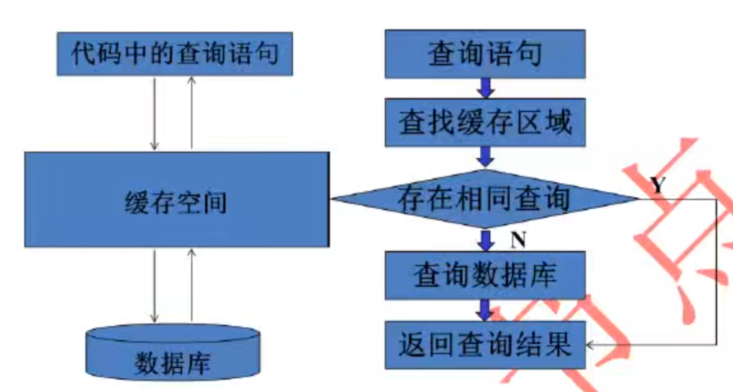
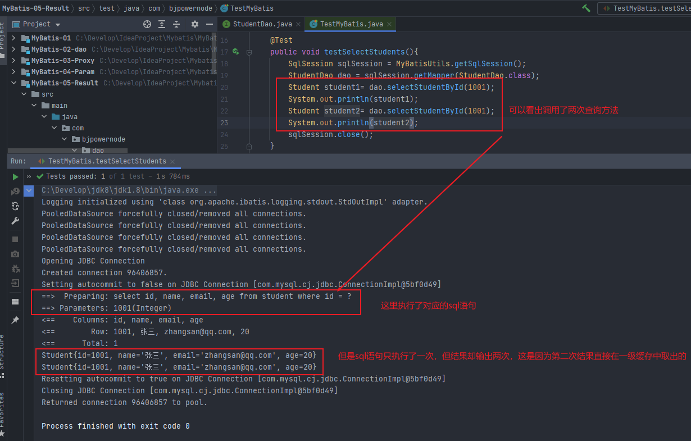

# Mybatis框架

## 一、框架概述

### 1.1软件开发常用结构

#### 1.1.1三层架构

三层架构包含的三层：

- 界面层（表示层、视图层）：接收用户的数据，显示本次请求的处理结果，使用web页面和用户交互。（jsp、html、servlet）
- 业务逻辑层：接收表示层传递过来的数据，检查数据，计算业务逻辑，调用数据访问层获取数据。（service）
- 数据访问层（持久层）：与数据库打交道，主要实现对数据的增删改查，将存储在数据库中的数据提交给业务层，同时将业务层处理的数据保存到数据库。（dao）

三层对应的包：

- 界面层：controller包（servlet）
- 业务逻辑层：service包（XXXservice类）
- 数据访问层：dao包（XXXdao类）

三层中类的交互关系：

- 用户使用界面层---->业务逻辑层---->数据访问层（持久层）---->数据库（mysql）

三层对应的处理框架：

- 界面层：之前用servlet，现在用SpringMVC
- 业务逻辑层：之前用service类，现在用Spring
- 数据访问层：之前用dao类，现在用mybatis


### 1.2框架

框架是一个舞台，一个模板。

> 模板：
>
> 1. 规定好了一些条款、内容。
> 2. 可以加入自己的东西。
>
> 框架是一个模块：
>
> 1. 框架中定义好了一些功能，这些功能是可用的。
> 2. 可以加入项目中自己的功能，这些功能可以利用框架中写好的功能。
> 3. 框架是一个软件，半成品的软件。定义好了一些基础功能，需要加入你的功能就是完整的。基础功能是可重复使用的，可升级的。
>
> 框架的特点：
>
> 1. 框架一般不是全能的，不能做所有的事情。
> 2. 框架是针对某一个领域有效，特长在某一个方面，比如mybatis做数据库操作强，但是不能干别的。


### 1.3使用JDBC的缺陷

- 使用JDBC编程会导致代码量大，开发效率低
- 需要关注Connection、Statement、ResultSet对象的创建和销毁
- 对ResultSet查询的结果，需要自己封装成List
- 重复的代码比较多
- 业务代码和数据库操作混在一起

为了解决JDBC的缺点，MyBatis诞生了。


### 1.4MyBatis框架

一个框架，早期叫做ibatis，代码在github

MyBatis是MyBatis SQL Mapper Framework for Java(sql映射框架)

1. sql mapper：sql映射

   **可以把数据库表中的一行数据，映射为一个Java对象，一行数据可以看作一个Java对象，操作这个对象就相当于操作表中的数据。**

2. data access objects（DAOs）:数据访问

   **对数据库执行增删改查。**


#### 1.4.1MyBatis提供了哪些功能

1. 提供了创建Connection，Statement，ResultSet的能力，不用开发人员创建这些对象了。
2. 提供了执行Sql语句的能力，不用开发人员执行。
3. 提供了循环Sql，把Sql的结果转为Java对象，List集合的能力。
4. 提供了关闭资源的能力，不用你手动关闭Connection，Statement，ResultSet。

**开发人员要做的是：**

- 提供sql语句。

**最后是：**

- 开发人员提供sql语句----->mybatis处理sql----->开发人员得到List集合或Java对象（表中的数据）

**总结：**

- MyBatis是一个sql映射框架，提供的数据库的操作能力，增强的JDBC，使用MyBatis让开发人员集中精神写sql就行，不必关心Connection，Statement，ResultSet的创建和关闭。


## 二、MyBatis入门

### 2.1案例—查询

先去GitHub上下载压缩包https://github.com/mybatis/mybatis-3/releases

压缩包中会附带一个帮助文档，需要按照文档中的配置进行配置。

创建表数据：


使用IDEA创建一个JAVASE项目，并完善目录结构

具体步骤：

> ```
> Mybatis-01:第一个MyBatis例子
> 
> 实现步骤：
>     1.新建的student表
>     2.加入maven的mybatis的依赖，mysql驱动的依赖
>     3.创建实体类，Student--->保存表中的一行数据
>     4.创建持久层的dao接口，定义操作数据库的方法
>     5.创建mybatis使用的配置文件叫做sql映射文件，写sql语句的，一般是一个表一个sql映射文件，这个文件是xml文件。
>       文件写在dao接口所在目录中。
>       文件名称和dao接口保持一致。
>     6.创建mybatis的主配置文件：一个项目一个主配置文件
>       主配置文件提供了数据库的连接信息和sql映射文件的位置信息
>     7.创建使用mybatis类，通过mybatis访问数据库
> ```

第一步：修改pom文件，添加依赖

```xml
<?xml version="1.0" encoding="UTF-8"?>

<project xmlns="http://maven.apache.org/POM/4.0.0" xmlns:xsi="http://www.w3.org/2001/XMLSchema-instance"
  xsi:schemaLocation="http://maven.apache.org/POM/4.0.0 http://maven.apache.org/xsd/maven-4.0.0.xsd">
  <modelVersion>4.0.0</modelVersion>

  <groupId>com.bjpowernode</groupId>
  <artifactId>MyBatis-01</artifactId>
  <version>1.0-SNAPSHOT</version>

  <properties>
    <project.build.sourceEncoding>UTF-8</project.build.sourceEncoding>
    <maven.compiler.source>1.8</maven.compiler.source>
    <maven.compiler.target>1.8</maven.compiler.target>
  </properties>

  <dependencies>
    <dependency>
      <groupId>junit</groupId>
      <artifactId>junit</artifactId>
      <version>4.11</version>
      <scope>test</scope>
    </dependency>

    <!-- mybatis依赖 -->
    <dependency>
      <groupId>org.mybatis</groupId>
      <artifactId>mybatis</artifactId>
      <version>3.5.1</version>
    </dependency>

    <!-- mysql驱动 -->
    <dependency>
        <groupId>mysql</groupId>
        <artifactId>mysql-connector-java</artifactId>
        <version>8.0.17</version>
    </dependency>


  </dependencies>

  <build>
      <resources>
          <resource>
              <!-- 所在的目录 -->
              <directory>src/main/java</directory>
              <!-- 包括目录下的.properties,.xml 文件都会扫描到 -->
              <includes>
                  <include>**/*.properties</include>
                  <include>**/*.xml</include>
              </includes>
              <filtering>false</filtering>
          </resource>

          <resource>
              <!-- 所在的目录 -->
              <directory>src/main/resources</directory>
              <!-- 包括目录下的.properties,.xml 文件都会扫描到 -->
              <includes>
                  <include>**/*.properties</include>
                  <include>**/*.xml</include>
              </includes>
              <filtering>false</filtering>
          </resource>
      </resources>
  </build>
</project>
```

第二步：创建对应实体类

第三步：创建Dao接口

```java
package com.bjpowernode.dao;

import com.bjpowernode.entity.Student;

import java.util.List;

// 接口操作student表
public interface StudentDao {
    
    // 查询Student表的所有数据
    public List<Student> selectStudents();
}

```

第四步：创建sql映射文件，xml格式，文件位置和接口位置一致。文件格式需要参考文档


```xml
<?xml version="1.0" encoding="UTF-8" ?>
<!DOCTYPE mapper
        PUBLIC "-//mybatis.org//DTD Mapper 3.0//EN"
        "http://mybatis.org/dtd/mybatis-3-mapper.dtd">
<mapper namespace="com.bjpowernode.dao.StudentDao">

    <!--
        select:表示查询操作

        id:表示你要执行的sql语句的唯一标识，mybatis会使用这个id的值来找到要执行的sql语句
           可以自定义，但是要求使用接口中的方法名称

        resultType:表示结果类型，是sql语句执行后得到的ResultSet，遍历这个ResultSet得到的Java对象的类型
                   值写的是类型的全限定名称
    -->
    <select id="selectStudents" resultType="com.bjpowernode.entity.Student">
        select id, name, email, age from student order by id
    </select>
</mapper>

<!--
    sql映射文件，写sql语句的，mybatis会执行这些语句

    1.这段用来指定约束文件的。
        <!DOCTYPE mapper
        PUBLIC "-//mybatis.org//DTD Mapper 3.0//EN"
        "http://mybatis.org/dtd/mybatis-3-mapper.dtd">

    2.约束文件的名称，扩展名.dtd
        mybatis-3-mapper.dtd

    3.约束文件的作用：限制、检查在当前文件中出现的标签，属性必须符合mybatis的要求。

    4.<mapper>是当前文件的根标签
      namespace：叫命名空间，唯一值，可以是自定义的字符串
                 要求使用dao接口的全限定名称:包名+类名

    5.在当前文件中，可以使用特定的标签来表示数据库的特定操作
        <select>：表示查询，select语句
        <update>：表示更新，就是说在update标签中写的是updateSQL语句
        <insert>：表示插入，insert语句
        <delete>：表示删除，delete语句
-->
```

第五步：创建连接数据库的配置文件，同样需要去帮助文档中找，放到resources根目录中


```xml
<?xml version="1.0" encoding="UTF-8" ?>
<!--
    mybatis的主配置文件:主要定义了数据库的配置信息，sql映射文件的位置
    1.约束文件
        <!DOCTYPE configuration
        PUBLIC "-//mybatis.org//DTD Config 3.0//EN"
        "http://mybatis.org/dtd/mybatis-3-config.dtd">
    mybatis-3-config.dtd：约束文件的名称
-->
<!DOCTYPE configuration
        PUBLIC "-//mybatis.org//DTD Config 3.0//EN"
        "http://mybatis.org/dtd/mybatis-3-config.dtd">
<!-- <configuration>:根标签，表示配置信息 -->
<configuration>
    <!--  <environments>:环境配置，用来配置数据库连接信息，可以有多个
          default:必须和某个environment的id值一样，告诉mybatis使用那个数据库的连接信息，也就是访问哪个数据库
    -->
    <environments default="mydev">
        <!-- <environment>:一个数据库的配置
            id是一个唯一值，自定义，用来表示环境的名称
        -->
        <environment id="mydev">
            <!-- <transactionManager>:mybatis的事务类型
                 type:JDBC表示使用JDBC中的Connection对象的commit, rollback做事务处理
             -->
            <transactionManager type="JDBC"/>
            <!--
                <dataSource>:表示数据源，连接数据库
                type:表示数据源的类型，POOLED表示使用连接池
            -->
            <dataSource type="POOLED">
                <!--
                    driver,url,username,password是固定的，不能自定义
                -->
                <!-- 数据库的驱动类名 -->
                <property name="driver" value="com.mysql.cj.jdbc.Driver"/>
                <!-- 连接数据库的url -->
                <property name="url" value="jdbc://mysql:localhost:3306/springdb?serverTimezone=UTC"/>
                <!-- 访问数据库的用户名 -->
                <property name="username" value="root"/>
                <!-- 访问数据库的密码 -->
                <property name="password" value="12345"/>
            </dataSource>
        </environment>
    </environments>

    <!-- 指定sql mapper（sql映射文件的位置） -->
    <mappers>
        <!--
            一个mapper标签指定一个文件的位置，可以有多个mapper
            从类路径开始的路径信息。 target/classes（类路径）
        -->
        <mapper resource="com/bjpowernode/dao/StudentDao.xml"/>
        <!-- <mapper resource="com/bjpowernode/dao/SchoolDao.xml"/>-->
    </mappers>
</configuration>
```

第六步：编写测试类

```java
package com.bjpowernode;

import com.bjpowernode.entity.Student;
import org.apache.ibatis.io.Resources;
import org.apache.ibatis.session.SqlSession;
import org.apache.ibatis.session.SqlSessionFactory;
import org.apache.ibatis.session.SqlSessionFactoryBuilder;

import java.io.IOException;
import java.io.InputStream;
import java.util.List;

public class MyApp {
    public static void main(String[] args) throws IOException {
        // 访问mybatis读取student数据
        // 1.定义mybatis主配置文件的名称，从类路径的根开始(target/classes)
        String config = "mybatis.xml";
        // 2.读取config表示的文件
        InputStream in = Resources.getResourceAsStream(config);
        // 3.创建sqlSessionFactoryBuilder对象
        SqlSessionFactoryBuilder builder = new SqlSessionFactoryBuilder();
        // 4.创建SqlSessionFactory对象
        SqlSessionFactory factory = builder.build(in);
        // 5.【重要】获取SqlSession对象，从SqlSessionFactory获取SqlSession
        SqlSession sqlSession = factory.openSession();
        // 6.【重要】指定要执行的sql语句的标识，sql映射文件中的namespace + "." + 标签的id值
        String sqlId = "com.bjpowernode.dao.StudentDao.selectStudents";
        // 7.执行sql语句，通过sqlId找到语句
        List<Student> studentList = sqlSession.selectList(sqlId);
        // 8.输出结果
        studentList.forEach(student -> System.out.println(student));
        // 9.关闭sqlSession对象
        sqlSession.close();
    }
}

```


### 2.2案例—添加

第一步：在接口中添加方法

```java
package com.bjpowernode.dao;

import com.bjpowernode.entity.Student;

import java.util.List;

// 接口操作student表
public interface StudentDao {

    // 查询Student表的所有数据
    public List<Student> selectStudents();

    // 插入Student信息
    // 参数表示要插入的数据
    // 返回值表示执行insert操作后影响数据库的行数
    public int insertStudent(Student student);
}

```

第二步：在mapper中添加sql语句

```xml
<?xml version="1.0" encoding="UTF-8" ?>
<!DOCTYPE mapper
        PUBLIC "-//mybatis.org//DTD Mapper 3.0//EN"
        "http://mybatis.org/dtd/mybatis-3-mapper.dtd">
<mapper namespace="com.bjpowernode.dao.StudentDao">

    <select id="selectStudents" resultType="com.bjpowernode.entity.Student">
        select id, name, email, age from student order by id
    </select>

    <!-- 插入操作 -->
    <insert id="insertStudent">
         insert into student(id, name, email, age) values (#{id}, #{name}, #{email}, #{age});
    </insert>
</mapper>
```

第三步：在测试类中添加测试方法

```java
package com.bjpowernode;

import com.bjpowernode.entity.Student;
import org.apache.ibatis.io.Resources;
import org.apache.ibatis.session.SqlSession;
import org.apache.ibatis.session.SqlSessionFactory;
import org.apache.ibatis.session.SqlSessionFactoryBuilder;
import org.junit.Test;

import java.io.IOException;
import java.io.InputStream;
import java.util.List;

public class TestMybatis {
    // 测试方法，测试功能
    @Test
    public void testInsert() throws IOException {
        // 访问mybatis读取student数据
        // 1.定义mybatis主配置文件的名称，从类路径的根开始(target/classes)
        String config = "mybatis.xml";
        // 2.读取config表示的文件
        InputStream in = Resources.getResourceAsStream(config);
        // 3.创建sqlSessionFactoryBuilder对象
        SqlSessionFactoryBuilder builder = new SqlSessionFactoryBuilder();
        // 4.创建SqlSessionFactory对象
        SqlSessionFactory factory = builder.build(in);
        // 5.【重要】获取SqlSession对象，从SqlSessionFactory获取SqlSession
        SqlSession sqlSession = factory.openSession();
        // 6.【重要】指定要执行的sql语句的标识，sql映射文件中的namespace + "." + 标签的id值
        String sqlId = "com.bjpowernode.dao.StudentDao.insertStudent";
        // 7.执行sql语句，通过sqlId找到语句
        Student student = new Student(1003, "张飞", "zhangfei@163.com", 25);
        int result = sqlSession.insert(sqlId, student);
        // mybatis不是默认自动提交事务，所以在insert， update， delete后边需要手动提交事务
        sqlSession.commit();
        // 8.输出结果
        if (result == 1){
            System.out.println("添加成功！");
        }else{
            System.out.println("添加失败！");
        }
        // 9.关闭sqlSession对象
        sqlSession.close();
    }
}

```


### 2.3配置日志功能

在mybatis.xml文件中，加入日志配置，可以在控制台输出执行的sql语句和参数

```xml
<configuration>
    <!-- settings:控制mybatis全局行为 -->
    <settings>
        <!-- 
			设置mybatis输出日志
			STDOUT_LOGGING表示将日志输出到控制台
		-->
        <setting name="logImpl" value="STDOUT_LOGGING"/>
    </settings>
</configuration>
```

**执行查询语句的输出日志：**


**执行添加语句的输出日志：**


### 2.4MyBatis中主要类的介绍

1. Resources：

   mybatis中的一个类，负责读取主配置文件

   ```java
   InputStream in = Resources.getResourceAsStream("mybatis.xml");
   ```

2. SqlSessionFactoryBuilder:

   用来创建SqlSessionFactory对象

   ```java
   SqlSessionFactoryBuilder builder = new SqlSessionFactoryBuilder();
   // 创建SqlSessionFactory对象
   SqlSessionFactory factory = builder.build(in);
   ```

3. SqlSessionFactory：

   重量级对象，程序创建这个对象耗时长，使用资源比较多。在整个项目中有一个就够用了。

   它是一个接口，接口的实现类：DefaultSqlSessionFactory

   这个接口的作用：获取SqlSession对象

   ```java
   SqlSession sqlSession = factory.openSession();
   ```

   > openSession()方法说明：
   >
   > 1. openSession()：无参数的，获取是非自动提交事务的SqlSession对象
   > 2. openSession(boolean)：openSession(true)获取自动提交事务的SqlSession对象，openSession(false)获取非自动提交事务的SqlSession对象

4. SqlSession：

   它是一个接口，定义了操作数据库的方法，例如：selectOne()，selectList()，insert()，update()，delete()，commit()，rollback()

   它的实现类DefaultSqlSession，里边完成了数据库操作的实现。

   使用要求：

   **它不是线程安全的，需要在方法内部使用，在执行sql语句之前，使用openSession()获取SqlSession对象，在执行完sql语句后，需要关闭它。执行SqlSession.close()，这样能保证它的使用是线程安全的。**


### 2.5使用工具类来封装重复操作

```java
package com.bjpowernode.utils;

import org.apache.ibatis.io.Resources;
import org.apache.ibatis.session.SqlSession;
import org.apache.ibatis.session.SqlSessionFactory;
import org.apache.ibatis.session.SqlSessionFactoryBuilder;

import java.io.IOException;
import java.io.InputStream;

public class MyBatisUtils {

    private static SqlSessionFactory factory = null;

    static {
        // 需要和项目中的文件名一致
        String config = "mybatis.xml";
        try {
            InputStream in = Resources.getResourceAsStream(config);
            // 创建SqlSessionFactory对象
            factory = new SqlSessionFactoryBuilder().build(in);
        } catch (IOException e) {
            e.printStackTrace();
        }
    }

    // 获取SqlSession的方法
    public static SqlSession getSqlSession(){
        SqlSession sqlSession = null;
        if (factory != null){
            // 非自动提交事务
            sqlSession = factory.openSession();
        }
        return sqlSession;
    }
}

```

测试

```java
package com.bjpowernode;

import com.bjpowernode.entity.Student;
import com.bjpowernode.utils.MyBatisUtils;
import org.apache.ibatis.io.Resources;
import org.apache.ibatis.session.SqlSession;
import org.apache.ibatis.session.SqlSessionFactory;
import org.apache.ibatis.session.SqlSessionFactoryBuilder;

import java.io.IOException;
import java.io.InputStream;
import java.util.List;

public class MyApp2 {
    public static void main(String[] args) throws IOException {
        // 【重要】获取SqlSession对象，从SqlSessionFactory获取SqlSession
        SqlSession sqlSession = MyBatisUtils.getSqlSession();
        // 【重要】指定要执行的sql语句的标识，sql映射文件中的namespace + "." + 标签的id值
        String sqlId = "com.bjpowernode.dao.StudentDao.selectStudents";
        // 执行sql语句，通过sqlId找到语句
        List<Student> studentList = sqlSession.selectList(sqlId);
        // 输出结果
        studentList.forEach(student -> System.out.println(student));
        // 关闭sqlSession对象
        sqlSession.close();
    }
}

```


## 三 、MyBatis的Dao代理

第一步：修改pom文件，添加依赖，插件

第二步：创建实体类

第三步：创建Dao接口

```java
package com.bjpowernode.dao;

import com.bjpowernode.entity.Student;

import java.util.List;

// 接口操作student表
public interface StudentDao {

    // 查询Student表的所有数据
    public List<Student> selectStudents();

}

```

第四步：创建mapper文件

```xml
<?xml version="1.0" encoding="UTF-8" ?>
<!DOCTYPE mapper
        PUBLIC "-//mybatis.org//DTD Mapper 3.0//EN"
        "http://mybatis.org/dtd/mybatis-3-mapper.dtd">
<mapper namespace="com.bjpowernode.dao.StudentDao">
    <select id="selectStudents" resultType="com.bjpowernode.entity.Student">
        select id, name, email, age from student order by id
    </select>
</mapper>
```

第五步：创建mybatis主配置文件

```xml
<?xml version="1.0" encoding="UTF-8" ?>
<!DOCTYPE configuration
        PUBLIC "-//mybatis.org//DTD Config 3.0//EN"
        "http://mybatis.org/dtd/mybatis-3-config.dtd">

<configuration>
    <settings>
        <setting name="logImpl" value="STDOUT_LOGGING"/>
    </settings>
    <environments default="mydev">
        <environment id="mydev">
            <transactionManager type="JDBC"/>
            <dataSource type="POOLED">
                <!-- 数据库的驱动类名 -->
                <property name="driver" value="com.mysql.cj.jdbc.Driver"/>
                <!-- 连接数据库的url -->
                <property name="url" value="jdbc:mysql://localhost:3306/springdb?serverTimezone=UTC"/>
                <!-- 访问数据库的用户名 -->
                <property name="username" value="root"/>
                <!-- 访问数据库的密码 -->
                <property name="password" value="12345"/>
            </dataSource>
        </environment>
    </environments>

    <!-- 指定sql mapper（sql映射文件的位置） -->
    <mappers>
        <!--
            一个mapper标签指定一个文件的位置，可以有多个mapper
            从类路径开始的路径信息。 target/classes（类路径）
        -->
        <mapper resource="com/bjpowernode/dao/StudentDao.xml"/>

    </mappers>
</configuration>
```

第六步：创建dao的实现类impl

```java
package com.bjpowernode.dao.impl;

import com.bjpowernode.dao.StudentDao;
import com.bjpowernode.entity.Student;
import com.bjpowernode.utils.MyBatisUtils;
import org.apache.ibatis.session.SqlSession;

import java.util.List;

public class StudentDaoImpl implements StudentDao {
    @Override
    public List<Student> selectStudents() {

        // 获取SqlSession对象
        SqlSession sqlSession = MyBatisUtils.getSqlSession();
        String sqlId = "com.bjpowernode.dao.StudentDao.selectStudents";
        List<Student> studentList = sqlSession.selectList(sqlId);
        studentList.forEach(student -> System.out.println(student));
        sqlSession.close();
        return studentList;
    }
}

```

第七步：编写测试方法

```java
package com.bjpowernode;

import com.bjpowernode.dao.StudentDao;
import com.bjpowernode.dao.impl.StudentDaoImpl;
import com.bjpowernode.entity.Student;
import org.junit.Test;

import java.util.List;

public class TestMyBatis {

    @Test
    public void testSelectStudents(){
        StudentDao dao = new StudentDaoImpl();
        List<Student> studentList = dao.selectStudents();
        studentList.forEach(student -> System.out.println(student));
    }
}

```


**在此基础上加入插入数据的操作**

第一步：在dao中添加方法

第二步：在mapper中添加sql语句

第三步：在dao的实现类中添加实现的方法

第四步：在测试类中测试


### 3.1分析传统dao模式的执行过程

分析测试类

```java
package com.bjpowernode;

import com.bjpowernode.dao.StudentDao;
import com.bjpowernode.dao.impl.StudentDaoImpl;
import com.bjpowernode.entity.Student;
import org.junit.Test;

import java.util.List;

public class TestMyBatis {

    @Test
    public void testSelectStudents(){
        StudentDao dao = new StudentDaoImpl();
        List<Student> studentList = dao.selectStudents();
        studentList.forEach(student -> System.out.println(student));
    }

    @Test
    public void testInsertStudent(){
        StudentDao dao = new StudentDaoImpl();
        Student student = new Student(1006, "关羽", "guanyu@qq.com", 26);
        int res = dao.insertStudent(student);
        System.out.println("成功插入" + res + "条数据");

    }
}

```

> 在测试类中dao调用的两个方法其实就是mapper中的两个sql

分析dao的实现类

```java
package com.bjpowernode.dao.impl;

import com.bjpowernode.dao.StudentDao;
import com.bjpowernode.entity.Student;
import com.bjpowernode.utils.MyBatisUtils;
import org.apache.ibatis.session.SqlSession;

import java.util.List;

public class StudentDaoImpl implements StudentDao {
    @Override
    public List<Student> selectStudents() {

        // 获取SqlSession对象
        SqlSession sqlSession = MyBatisUtils.getSqlSession();
        String sqlId = "com.bjpowernode.dao.StudentDao.selectStudents";
        List<Student> studentList = sqlSession.selectList(sqlId);
        studentList.forEach(student -> System.out.println(student));
        sqlSession.close();
        return studentList;
    }

    @Override
    public int insertStudent(Student student) {
        // 获取SqlSession对象
        SqlSession sqlSession = MyBatisUtils.getSqlSession();
        String sqlId = "com.bjpowernode.dao.StudentDao.insertStudent";
        int res = sqlSession.insert(sqlId, student);
        sqlSession.commit();
        sqlSession.close();
        System.out.println("成功插入" + res + "条数据");
        return res;
    }
}
```

> 在这两个方法中有大量的重复代码，可以进一步优化。

```java
package com.bjpowernode;

import com.bjpowernode.dao.StudentDao;
import com.bjpowernode.dao.impl.StudentDaoImpl;
import com.bjpowernode.entity.Student;
import org.junit.Test;

import java.util.List;

public class TestMyBatis {

    @Test
    public void testSelectStudents(){
        // com.bjpowernode.dao.StudentDao
        StudentDao dao = new StudentDaoImpl();
        /**
         * List<Student> studentList = dao.selectStudents();的调用
         * 1.dao对象，类型是StudentDao,全限定名称是com.bjpowernode.dao.StudentDao，使用反射机制可以拿到这个全限定名称
         *   全限定名称和mapper中的namespace是一致的。
         *
         * 2.方法名称，selectStudents，这个方法名称就是mapper中的id值 selectStudents
         *
         * 3.通过dao中方法的返回值也可以确定MyBatis要调用的SqlSession的方法
         *   如果返回值是List，调用的是SqlSession.selectList()方法
         *   如果返回值是int，或者是非List的，看Mapper文件中的标签是<insert><update>
         *   就会调用SqlSession的insert或者update等方法
         *
         * MyBatis的动态代理：MyBatis根据dao的方法调用，获取执行sql语句的信息
         * MyBatis根据你的dao接口，创建出一个dao接口的实现类，并创建这个类的对象。
         * 完成SqlSession调用方法，访问数据库
         */
        List<Student> studentList = dao.selectStudents();
        studentList.forEach(student -> System.out.println(student));
    }

    @Test
    public void testInsertStudent(){
        StudentDao dao = new StudentDaoImpl();
        Student student = new Student(1006, "关羽", "guanyu@qq.com", 26);
        int res = dao.insertStudent(student);
        System.out.println("成功插入" + res + "条数据");

    }
}

```


### 3.2MyBatis的动态代理

> MyBatis的动态代理：MyBatis根据dao的方法调用，获取执行sql语句的信息
> MyBatis根据你的dao接口，创建出一个dao接口的实现类，并创建这个类的对象。
> 完成SqlSession调用方法，访问数据库

第一步：将dao接口的实现类删除

第二步：修改测试类

```java
package com.bjpowernode;

import com.bjpowernode.dao.StudentDao;
import com.bjpowernode.entity.Student;
import com.bjpowernode.utils.MyBatisUtils;
import org.apache.ibatis.session.SqlSession;
import org.junit.Test;

import java.util.List;

public class TestMyBatis {

    @Test
    public void testSelectStudents(){
        /**
         * 使用MyBatis动态代理机制，使用SqlSession.getMapper(dao接口)
         * getMapper能够获取dao接口对应的实现类对象
         */
        SqlSession sqlSession = MyBatisUtils.getSqlSession();
        StudentDao dao = sqlSession.getMapper(StudentDao.class);
        // dao = com.sun.proxy.$Proxy2 ----> JDK的动态代理
        System.out.println("dao = " + dao.getClass().getName());
        // 调用dao的方法，执行数据库的操作
        List<Student> studentList = dao.selectStudents();
        studentList.forEach(student -> System.out.println(student));
    }

    @Test
    public void testInsertStudent(){
        SqlSession sqlSession = MyBatisUtils.getSqlSession();
        StudentDao dao = sqlSession.getMapper(StudentDao.class);
        Student student = new Student(1005, "elle", "elle@123.com", 23);
        int res = dao.insertStudent(student);
        sqlSession.commit();
        System.out.println("成功插入" + res + "条数据");
    }
}

```


### 3.3深入理解参数

如何将Java代码中的参数传递到mapper文件的sql语句中

#### 3.3.1parameterType

写在mapper文件中的一个属性，用来表示dao接口中方法参数的数据类型。

例如：StudentDao接口

public student selectStudentById(Integer id);

```xml
<?xml version="1.0" encoding="UTF-8" ?>
<!DOCTYPE mapper
        PUBLIC "-//mybatis.org//DTD Mapper 3.0//EN"
        "http://mybatis.org/dtd/mybatis-3-mapper.dtd">
<mapper namespace="com.bjpowernode.dao.StudentDao">
    <select id="selectStudentById" resultType="com.bjpowernode.entity.Student" parameterType="java.lang.Integer">
        select id, name, email, age from student where id = #{id}
    </select>
</mapper>
```

测试发现，parameterType属性加不加都不影响查询结果。

> parameterType：表示dao接口方法参数的数据类型，**它的值是Java的数据类型的全限定名称或MyBatis定义的别名**
>
> 例如：
>
> - parameterType="java.lang.Integer"
> - parameterType="int"
>
> **这个参数不是强制的，因为MyBatis通过反射机制能够发现接口参数的数据类型，所以可以没有。**

在MyBatis中的内置别名：

|  **别名**  | **映射的类型** |
| :--------: | :------------: |
|   _byte    |      byte      |
|   _long    |      long      |
|   _short   |     short      |
|    _int    |      int       |
|  _integer  |      int       |
|  _double   |     double     |
|   _float   |     float      |
|  _boolean  |    boolean     |
|   string   |     String     |
|    byte    |      Byte      |
|    long    |      Long      |
|   short    |     Short      |
|    int     |    Integer     |
|  integer   |    Integer     |
|   double   |     Double     |
|   float    |     Float      |
|  boolean   |    Boolean     |
|    date    |      Date      |
|  decimal   |   BigDecimal   |
| bigdecimal |   BigDecimal   |
|   object   |     Object     |
|    map     |      Map       |
|  hashmap   |    HashMap     |
|    list    |      List      |
| arraylist  |   ArrayList    |
| collection |   Collection   |
|  iterator  |    Iterator    |


#### 3.3.2传入一个简单类型的参数

```java
package com.bjpowernode.dao;

import com.bjpowernode.entity.Student;

import java.util.List;

public interface StudentDao {
	/*
		一个简单类型的参数
		简单类型：MyBatis把java的基本数据类型和String都叫简单类型
		在Mapper文件中获取简单类型的一个参数时，使用#{任意字符}
	*/
    Student selectStudentById(Integer id);
}
```


> ```xml
> #{任意字符}
> // 一个#{}对应PreparedStatement中的一个"?"
> ```
>
> 使用#{}之后，mybatis执行sql是使用的JDBC中的PreparedStatement对象。
>
> 
>
> 由mybatis执行下面的代码：
>
> ```java
> // 1.mybatis创建Connection，PreparedStatement对象
> String sql = "selete id, name, email, age from student where id = ?";
> PreparedStatement ps = conn.preparedStatement(sql);
> ps.setInt(1, 1001);
> // 2.执行sql封装为ResultType="com.bjpowernode.entity.Student"这个对象
> ResultSet rs = ps.executeQuery();
> Student stu = null;
> while(rs.next){
>     // 从数据库取表的行数据，存到java对象的属性中
>     stu = new Student();
>     stu.setId(rs.getInt("id"));
>     stu.setName(rs.getString("name"));
>     stu.setEmail(rs.getString("email"));
>     stu.setAge(rs.getInt("age"));
> }
> return stu; // 给了dao方法的返回值
> ```


#### 3.3.3传入多个参数

> **第一种方式：使用@Param命名参数（重要）**

> 接口：public List< Student > selectMulitParam(@Param("myname") String name, @Param("age") Integer age);
>
> 使用：@Param("参数名") String name
>
> mapper：
>
> ```xml
> <select>
> 	select * from student where name = #{myname} or age = #{myage}
> </select>
> ```
>
> 实现：
>
> ```java
> package com.bjpowernode.dao;
> 
> import com.bjpowernode.entity.Student;
> import org.apache.ibatis.annotations.Param;
> 
> import java.util.List;
> 
> // 接口操作student表
> public interface StudentDao {
> 
>     /**
>      * 多个参数：命名参数，在形参定义的前面加入@Param("自定义参数名称")
>      */
>     List<Student> selectMultiParam(@Param("myname") String name,@Param("myage") Integer age);
> }
> 
> ```
>
> ```xml
> <?xml version="1.0" encoding="UTF-8" ?>
> <!DOCTYPE mapper
>         PUBLIC "-//mybatis.org//DTD Mapper 3.0//EN"
>         "http://mybatis.org/dtd/mybatis-3-mapper.dtd">
> <mapper namespace="com.bjpowernode.dao.StudentDao">
>     <select id="selectMultiParam" resultType="com.bjpowernode.entity.Student">
>         select id, name, email, age from student where name = #{myname} or age = #{myage}
>     </select>
> </mapper>
> ```
>
> ```java
> package com.bjpowernode;
> 
> import com.bjpowernode.dao.StudentDao;
> import com.bjpowernode.entity.Student;
> import com.bjpowernode.utils.MyBatisUtils;
> import org.apache.ibatis.session.SqlSession;
> import org.junit.Test;
> 
> import java.util.List;
> 
> public class TestMyBatis {
>     @Test
>     public void testSelectMultiParam(){
>         SqlSession sqlSession = MyBatisUtils.getSqlSession();
>         StudentDao dao = sqlSession.getMapper(StudentDao.class);
>         System.out.println("dao = " + dao.getClass().getName());
>         List<Student> studentList = dao.selectMultiParam("李四", 20);
>         studentList.forEach(student -> System.out.println(student));
>         sqlSession.close();
>     }
> }
> ```
>
> 


> **第二种方式：使用对象传递参数（重要）**

> 使用Java对象传递参数，Java的属性值就是sql需要的参数值，每一个属性就是一个参数
>
> 语法：
>
> ```xml
> // 完整的语法格式，很少用
> #{属性名, javaType=类型名称, jdbcType=数据类型}
> // javaType: 用来指定Java中的属性类型
> // jdbcType: 用来说明在数据库中的数据类型
> // 例如: #{paramName, javaType=java.lang.String, jdbcType=VARCHAR}
> 
> // 简化的语法格式
> #{属性名}
> // javaType和jdbcType的值，MyBatis通过反射可以获取
> ```
>
> #### 支持的 JDBC 类型
>
> 为了以后可能的使用场景，MyBatis 通过内置的 jdbcType 枚举类型支持下面的 JDBC 类型。
>
> | `BIT`      | `FLOAT`   | `CHAR`        | `TIMESTAMP`     | `OTHER`   | `UNDEFINED` |
> | ---------- | --------- | ------------- | --------------- | --------- | ----------- |
> | `TINYINT`  | `REAL`    | `VARCHAR`     | `BINARY`        | `BLOB`    | `NVARCHAR`  |
> | `SMALLINT` | `DOUBLE`  | `LONGVARCHAR` | `VARBINARY`     | `CLOB`    | `NCHAR`     |
> | `INTEGER`  | `NUMERIC` | `DATE`        | `LONGVARBINARY` | `BOOLEAN` | `NCLOB`     |
> | `BIGINT`   | `DECIMAL` | `TIME`        | `NULL`          | `CURSOR`  | `ARRAY`     |
>
> 实现：
>
> 先创建一个保存参数的类
>
> ```java
> package com.bjpowernode.vo;
> 
> public class QueryParam {
>     private String paramName;
>     private Integer paramAge;
> 
>     public String getParamName() {
>         return paramName;
>     }
> 
>     public void setParamName(String paramName) {
>         this.paramName = paramName;
>     }
> 
>     public Integer getParamAge() {
>         return paramAge;
>     }
> 
>     public void setParamAge(Integer paramAge) {
>         this.paramAge = paramAge;
>     }
> }
> ```
>
> ```java
> package com.bjpowernode.dao;
> 
> import com.bjpowernode.entity.Student;
> import com.bjpowernode.vo.QueryParam;
> import org.apache.ibatis.annotations.Param;
> 
> import java.util.List;
> 
> // 接口操作student表
> public interface StudentDao {
>     /**
>      * 多个参数：使用java对象作为接口中方法的参数
>      */
>     List<Student> selectMultiObject(QueryParam param);
> }
> 
> ```
>
> ```xml
> <?xml version="1.0" encoding="UTF-8" ?>
> <!DOCTYPE mapper
>         PUBLIC "-//mybatis.org//DTD Mapper 3.0//EN"
>         "http://mybatis.org/dtd/mybatis-3-mapper.dtd">
> <mapper namespace="com.bjpowernode.dao.StudentDao">
> 
>     <!--
>     <select id="selectMultiObject" resultType="com.bjpowernode.entity.Student">
>         select id, name, email, age from student where name = #{paramName, javaType=java.lang.String, jdbcType=VARCHAR} or age = #{paramAge, javaType=java.lang.Integer, jdbcType=INTEGER}
>     </select>
>     -->
> 
>     <select id="selectMultiObject" resultType="com.bjpowernode.entity.Student">
>         select id, name, email, age from student where name = #{paramName} or age = #{paramAge}
>     </select>
> </mapper>
> ```
>
> ```java
> package com.bjpowernode;
> 
> import com.bjpowernode.dao.StudentDao;
> import com.bjpowernode.entity.Student;
> import com.bjpowernode.utils.MyBatisUtils;
> import com.bjpowernode.vo.QueryParam;
> import org.apache.ibatis.session.SqlSession;
> import org.junit.Test;
> 
> import java.util.List;
> 
> public class TestMyBatis {
> 
>     @Test
>     public void selectMultiObject(){
>         SqlSession sqlSession = MyBatisUtils.getSqlSession();
>         StudentDao dao = sqlSession.getMapper(StudentDao.class);
>         System.out.println("dao = " + dao.getClass().getName());
>         QueryParam queryParam = new QueryParam();
>         queryParam.setParamName("李四");
>         queryParam.setParamAge(20);
>         List<Student> studentList = dao.selectMultiObject(queryParam);
>         studentList.forEach(student -> System.out.println(student));
>         sqlSession.close();
>     }
> }
> ```
>
> 


> **第三种方式：按位置传值（不常用）**

> 参数位置从0开始，引用参数语法#{arg位置}，第一个参数是#{arg0}，第二个参数是#{arg1}
>
> **注意：mybatis3.3版本以及之前的版本使用#{0}，#{1}，从mybatis3.4开始使用#{arg0}方式**
>
> 实现：
>
> ```java
> package com.bjpowernode.dao;
> 
> import com.bjpowernode.entity.Student;
> import com.bjpowernode.vo.QueryParam;
> import org.apache.ibatis.annotations.Param;
> 
> import java.util.List;
> 
> // 接口操作student表
> public interface StudentDao {
>     /**
>      * 多个参数：按照位置传值
>      */
>     List<Student> selectMultiPosition(String name, Integer age);
> }
> 
> ```
>
> ```xml
> <?xml version="1.0" encoding="UTF-8" ?>
> <!DOCTYPE mapper
>         PUBLIC "-//mybatis.org//DTD Mapper 3.0//EN"
>         "http://mybatis.org/dtd/mybatis-3-mapper.dtd">
> <mapper namespace="com.bjpowernode.dao.StudentDao">
>     <select id="selectMultiPosition" resultType="com.bjpowernode.entity.Student">
>         select id, name, email, age from student where name = #{arg0} or age = #{arg1}
>     </select>
> </mapper>
> ```
>
> ```java
> package com.bjpowernode;
> 
> import com.bjpowernode.dao.StudentDao;
> import com.bjpowernode.entity.Student;
> import com.bjpowernode.utils.MyBatisUtils;
> import com.bjpowernode.vo.QueryParam;
> import org.apache.ibatis.session.SqlSession;
> import org.junit.Test;
> 
> import java.util.List;
> 
> public class TestMyBatis {
>     @Test
>     public void selectMultiPosition(){
>         SqlSession sqlSession = MyBatisUtils.getSqlSession();
>         StudentDao dao = sqlSession.getMapper(StudentDao.class);
>         List<Student> studentList = dao.selectMultiPosition("李四", 20);
>         studentList.forEach(student -> System.out.println(student));
>         sqlSession.close();
>     }
> }
> 
> ```
>
> 


> **第四种方式：使用Map传值（不建议用）**

> Map集合可以存储多个值，使用Map向mapper文件中一次传入多个参数，Map集合使用String的key，Object类型的值存储参数，mapper中使用#{key}引用参数
>
> 语法：
>
> ```xml
> #{key}
> ```
>
> 实现：
>
> ```java
> package com.bjpowernode.dao;
> 
> import com.bjpowernode.entity.Student;
> import com.bjpowernode.vo.QueryParam;
> import org.apache.ibatis.annotations.Param;
> 
> import java.util.List;
> import java.util.Map;
> 
> // 接口操作student表
> public interface StudentDao {
>     /**
>      * 多个参数：map存放多个值
>      */
>     List<Student> selectMultiByMap(Map<String, Object> map);
> }
> ```
>
> ```xml
> <?xml version="1.0" encoding="UTF-8" ?>
> <!DOCTYPE mapper
>         PUBLIC "-//mybatis.org//DTD Mapper 3.0//EN"
>         "http://mybatis.org/dtd/mybatis-3-mapper.dtd">
> <mapper namespace="com.bjpowernode.dao.StudentDao">
>     <select id="selectMultiByMap" resultType="com.bjpowernode.entity.Student">
>         select id, name, email, age from student where name = #{myname} or age = #{myage}
>     </select>
> </mapper>
> ```
>
> ```java
> package com.bjpowernode;
> 
> import com.bjpowernode.dao.StudentDao;
> import com.bjpowernode.entity.Student;
> import com.bjpowernode.utils.MyBatisUtils;
> import com.bjpowernode.vo.QueryParam;
> import org.apache.ibatis.session.SqlSession;
> import org.junit.Test;
> 
> import java.util.HashMap;
> import java.util.List;
> import java.util.Map;
> 
> public class TestMyBatis {
>     @Test
>     public void selectMultiByMap(){
>         SqlSession sqlSession = MyBatisUtils.getSqlSession();
>         StudentDao dao = sqlSession.getMapper(StudentDao.class);
>         Map<String, Object> map = new HashMap<>();
>         map.put("myname", "李四");
>         map.put("myage", 20);
>         List<Student> studentList = dao.selectMultiByMap(map);
>         studentList.forEach(student -> System.out.println(student));
>         sqlSession.close();
>     }
> }
> 
> ```
>
> 


#### 3.3.4#和$的区别

- #

  > 占位符，告诉mybatis使用实际的参数值代替，并使用PreparedStatement对象执行sql语句，#{...}代替sql语句中的"?"，这样更安全，迅速，通常也是首选。
  >
  > select id, name, email, age from student where id = #{id}
  >
  > 运行后：
  >
  > select id, name, email, age from student where id = ? 

- $

  > 字符串替换，告诉mybatis使用$包含的"字符串"替换所在的位置，使用Statement对象把sql语句和${}内容连接起来。
  >
  > 先将同一个方法的参数使用@Param（）命名为mapper中${}中的名字，再测试
  >
  > select id, name, email, age from student where id = ${id}
  >
  > 运行后
  >
  > select id, name, email, age from student where id = 1001 
  >
  > 相当于
  >
  > String sql = "select id, name, email, age from student where id =" + " 1001 ";
  >
  > 使用Statement对象执行sql，效率低，有sql注入的风险。
  >
  > **主要用在替换表名，列名，不同列排序等操作。**
  >
  > 假设，如果有这样的需求，按学号查询学生信息和按学生姓名查询学生信息
  >
  > 那么如果使用#{}的方式，需要在dao接口中写两个方法，分别在mapper中编写sql语句
  >
  > ```xml
  > <select id="findById" resultType="com.bjpowernode.domain.Student"> 
  >     select * from student where id=#{studentId} 
  > </select> 
  > <select id="findByEmail" resultType="com.bjpowernode.domain.Student"> 
  >     select * from student where email=#{stuentEmail} 
  > </select>
  > ```
  >
  > 如果使用${}的方式，可以在dao中编写一个方法
  >
  > ```java
  > Student findByDiffField(@Param("col") String colName,@Param("cval") Object colValue);
  > ```
  >
  > 在mapper中编写sql语句，通过不同的参数来进行不同的查询操作
  >
  > ```xml
  > <select id="findByDiffField" resultType="com.bjpowernode.domain.Student"> 
  > 	select * from student where ${col} = #{cval} 
  > </select>
  > ```
  >
  > ```java
  > @Test 
  > public void testFindDiffField(){ 
  >     SqlSession sqlSession = MyBatisUtils.getSqlSession();
  >     StudentDao dao = sqlSession.getMapper(StudentDao.class);
  >     Student student1 = dao.findByDiffField("'id'",1002); 
  >     System.out.println("按id列查询:"+student1); 
  >     Student student2 = dao.findByDiffField("'name'","'李四'"); 
  >     System.out.println("按name列查询:"+student2); 
  > }
  > ```
  >
  > **也可以通过${}来实现通过不同的列排序的操作。**
  
- 区别;

  > 1. #使用?在sql语句中做占位符，使用PreparedStatement执行sql，效率高
  > 2. #能够避免sql注入，更安全
  > 3. $不使用占位符，是字符串连接，使用Statement执行sql，效率低
  > 4. $有sql注入的风险，缺乏安全性
  > 5. $可以替换表名或者列名


### 3.4封装MyBatis输出结果

mybatis执行了sql语句，得到java对象。


#### 3.4.1resultType结果类型

它的值有两种，一种是类型的全限定名称，另一种是类型的别名

**如何自定义类型别名**

> 需要在主配置文件mybatis.xml中定义
>
> ```xml
> <typeAliases>
> 	<!-- 方式一 -->
>     <!-- 可以指定一个类型一个自定义别名, type:类型的全限定名称, alias:自定义别名 -->
>     <typeAlis type="全限定名称" alias="别名" />
>     <!-- 方式二 -->
>     <!-- 可以指定一个包中的所有类的别名就是类名, name:包名, 类名就是别名(类名不区分大小写) -->
>     <package name="包名" />
> </typeAliases>
> ```
>
> 之后就可以使用自定义别名了
>
> **不建议使用别名，因为如果两个包下有同名的类，不安全。全限定名称更准确**
>
> 实例：
>
> ```xml
> <?xml version="1.0" encoding="UTF-8" ?>
> <!DOCTYPE configuration
>         PUBLIC "-//mybatis.org//DTD Config 3.0//EN"
>         "http://mybatis.org/dtd/mybatis-3-config.dtd">
> 
> <configuration>
>     <settings>
>         <setting name="logImpl" value="STDOUT_LOGGING"/>
>     </settings>
>     <!-- 定义别名 -->
>     <typeAliases>
> 
>         <typeAlias type="com.bjpowernode.entity.Student" alias="stu" />
> 		<package name="com.bjpowernode.entity" />
>         
>     </typeAliases>
>     <environments default="mydev">
>         <!-- 省略 -->
>     </environments>
> 
>     <mappers>
>         <mapper resource="com/bjpowernode/dao/StudentDao.xml"/>
>     </mappers>
> </configuration>
> ```

> 1. 对象类型

指sql语句执行完毕后，数据转为java对象**（Java类型是任意的，不必一定是数据库实体类。如果转成的Java对象属性数量不一致，则将同名属性赋值，多余属性自动忽略）**

执行sql得到ResultSet转换的类型，使用类型的完全限定名或别名，**如果返回的是集合，那应该设置为集合的泛型，而不是集合本身。**

resultType和resultMap不能同时使用。

**处理方式：**

1. mybatis执行sql语句，然后mybatis调用类的无参构造方法，创建对象。

   

2. mybatis把ResultSet指定列值赋给同名的属性。


> 2. 基本类型

接口方法

```java
int countStudent();
```

mapper

```xml
<select id="countStudent" resultType="int"> 
    select count(*) from student 
</select>
```


> 3. Map类型

> 返回的结果：
>
> - 列名是map的key，列值是map的value
> - 最多只能返回一行记录，多行记录不行
>
> 实例：
>
> ```java
> // 接口
> Map<Object, Object> selectMapById(Integer id);
> ```
>
> ```xml
> <select id="selectMapById" resultType="java.util.HashMap">
>     select id, name from student where id = #{id}
> </select>
> ```
>
> ```java
> @Test
> public void testSelectMapById(){
>     SqlSession sqlSession = MyBatisUtils.getSqlSession();
>     StudentDao dao = sqlSession.getMapper(StudentDao.class);
>     Map<Object, Object> map = dao.selectMapById(1001);
>     System.out.println("map=" + map); // map={name=张三, id=1001}
>     sqlSession.close();
> }
> ```


#### 3.4.2resultMap结果映射

用来指定列名和java对象的属性对应关系。

1. 自定义列值赋给哪个属性
2. 当列名和属性名不一致时，一定使用resultMap
3. resultMap和resultType二选一，不能一起用

使用方式：

```xml
<!-- 
	先定义resultMap
	在select标签，使用resultMap来引用定义的
-->
<resultMap id="自定义名称表示定义的这个resultMap" type="Java类型的全限定名称" >
	<!-- 定义列名和java属性的关系 -->
    <!-- 主键列，使用id标签 -->
    <id column="列名" property="Java类型的属性名" />
    <!-- 非主键列，使用result -->
    <result column="列名" property="Java类型的属性名"/>
    <!-- ... -->
</resultMap>
```


实例：

接口

```java
package com.bjpowernode.dao;

import com.bjpowernode.entity.Student;

import java.util.List;

public interface StudentDao {

    List<Student> selectAllStudent();
}

```

mapper

```xml
<?xml version="1.0" encoding="UTF-8" ?>
<!DOCTYPE mapper
        PUBLIC "-//mybatis.org//DTD Mapper 3.0//EN"
        "http://mybatis.org/dtd/mybatis-3-mapper.dtd">
<mapper namespace="com.bjpowernode.dao.StudentDao">

    <resultMap id="studentMap" type="com.bjpowernode.entity.Student">
        <id column="id" property="id"/>
        <result column="name" property="name" />
        <result column="email" property="email" />
        <result column="age" property="age" />
    </resultMap>

    <select id="selectAllStudent" resultMap="studentMap">
        select id, name, email, age from student
    </select>
</mapper>
```

test

```java
package com.bjpowernode;

import com.bjpowernode.dao.StudentDao;
import com.bjpowernode.entity.Student;
import com.bjpowernode.utils.MyBatisUtils;
import org.apache.ibatis.session.SqlSession;
import org.junit.Test;

import java.util.List;

public class TestMyBatis {
    @Test
    public void testSelectAllStudent(){
        SqlSession sqlSession = MyBatisUtils.getSqlSession();
        StudentDao dao = sqlSession.getMapper(StudentDao.class);
        List<Student> studentList = dao.selectAllStudent();
        studentList.forEach(student -> System.out.println(student));
        sqlSession.close();
    }
}

```


**列名和属性名不同的第二种解决方案：**

如果想使用resultType，但列名不一致该如何解决

> resultType的默认原则：同名的列值赋给同名的属性，使用列别名。
>
> 因此可以修改sql语句，为列起别名，别名就是Java类的属性名
>
> ```xml
> <select id="selectDiffColProperty" resultType="com.bjpowernode.entity.MyStudent">
>     select id as stuId, name as stuName, email as stuEmail, age as stuAge from student
> </select>
> ```


### 3.5模糊查询Like

在Mybatis中可以有两种方式实现模糊查询

第一种：在Java代码中指定like的内容

```java
List<Student> selectLikeOne(String name);
```

```xml
<?xml version="1.0" encoding="UTF-8" ?>
<!DOCTYPE mapper
        PUBLIC "-//mybatis.org//DTD Mapper 3.0//EN"
        "http://mybatis.org/dtd/mybatis-3-mapper.dtd">
<mapper namespace="com.bjpowernode.dao.StudentDao">
    <select id="selectLikeOne" resultType="com.bjpowernode.entity.Student">
        select id, name, email, age from student where name like #{name}
    </select>
</mapper>
```

```java
@Test
public void testSelectLikeOne(){
    SqlSession sqlSession = MyBatisUtils.getSqlSession();
    StudentDao dao = sqlSession.getMapper(StudentDao.class);
    String name = "%张%";
    List<Student> studentList = dao.selectLikeOne(name);
    studentList.forEach(student -> System.out.println(student));
    sqlSession.close();
}
```

第二种：在Mapper文件中，拼接Like的内容

```java
List<Student> selectLikeTwo(String name);
```

```xml
<?xml version="1.0" encoding="UTF-8" ?>
<!DOCTYPE mapper
        PUBLIC "-//mybatis.org//DTD Mapper 3.0//EN"
        "http://mybatis.org/dtd/mybatis-3-mapper.dtd">
<mapper namespace="com.bjpowernode.dao.StudentDao">
    <select id="selectLikeTwo" resultType="com.bjpowernode.entity.Student">
        select id, name, email, age from student where name like "%" #{name} "%"
    </select>
</mapper>
```

```java
@Test
public void testSelectLikeTwo(){
    SqlSession sqlSession = MyBatisUtils.getSqlSession();
    StudentDao dao = sqlSession.getMapper(StudentDao.class);
    String name = "张";
    List<Student> studentList = dao.selectLikeTwo(name);
    studentList.forEach(student -> System.out.println(student));
    sqlSession.close();
}
```

**推荐第一种**


## 四、动态SQL

- 动态SQL：

  sql的内容是变化的，可以根据条件获取到不同的sql语句，主要是where部分发生变化。

  **动态SQL，要使用Java对象作为参数。**

### 4.1< if >、< where >、< foreach >标签

- 动态SQL的实现：

  主要依靠mybatis提供的标签：< if >、< where >、< foreach >

  > 1. < if >：判断条件
  >
  >    ```xml
  >    <if test="判断java对象的属性值">
  >    	部分sql语句
  >    </if>
  >    ```
  >
  >    实例：
  >
  >    ```java
  >    package com.bjpowernode.dao;
  >    
  >    import com.bjpowernode.entity.Student;
  >    import org.apache.ibatis.annotations.Param;
  >    
  >    import java.util.List;
  >    
  >    // 接口操作student表
  >    public interface StudentDao {
  >    
  >        List<Student> selectStudentIf(Student student);
  >    }
  >    
  >    ```
  >
  >    ```xml
  >    <?xml version="1.0" encoding="UTF-8" ?>
  >    <!DOCTYPE mapper
  >            PUBLIC "-//mybatis.org//DTD Mapper 3.0//EN"
  >            "http://mybatis.org/dtd/mybatis-3-mapper.dtd">
  >    <mapper namespace="com.bjpowernode.dao.StudentDao">
  >    
  >        <!--
  >            if
  >            <if test="使用参数Java对象的属性值作为判断条件，语法：属性=XX值">
  >        -->
  >        <select id="selectStudentIf" resultType="com.bjpowernode.entity.Student">
  >            select id, name, email, age from student
  >            where
  >            <if test="name != null and name != ''">
  >                name = #{name}
  >            </if>
  >            <if test="age > 0">
  >                and age > #{age}
  >            </if>
  >        </select>
  >    </mapper>
  >    ```
  >
  >    ```java
  >    package com.bjpowernode;
  >    
  >    import com.bjpowernode.dao.StudentDao;
  >    import com.bjpowernode.entity.Student;
  >    import com.bjpowernode.utils.MyBatisUtils;
  >    import com.bjpowernode.vo.QueryParam;
  >    import org.apache.ibatis.session.SqlSession;
  >    import org.junit.Test;
  >    
  >    import java.util.HashMap;
  >    import java.util.List;
  >    import java.util.Map;
  >    
  >    public class TestMyBatis {
  >    
  >        @Test
  >        public void testSelectStudentIf(){
  >            SqlSession sqlSession = MyBatisUtils.getSqlSession();
  >            StudentDao dao = sqlSession.getMapper(StudentDao.class);
  >            /* 三种情况 */
  >            /* 第一种情况：两个条件都满足 */
  >            // ==>  Preparing: select id, name, email, age from student where name = ? and age > ?
  >            // ==> Parameters: 李四(String), 20(Integer)
  >            // 程序正常：查到结果
  >            // Student student = new Student(null, "李四", null, 20);
  >    
  >            /* 第二种情况：没有name，只有age */
  >            // ==>  Preparing: select id, name, email, age from student where and age > ?
  >            // ==> Parameters: 20(Integer)
  >            // 程序报错：org.apache.ibatis.exceptions.PersistenceException:
  >            // Student student = new Student(null, null, null, 20);
  >    
  >            /* 第三种情况：只有name，没有age */
  >            // ==>  Preparing: select id, name, email, age from student where name = ?
  >            // ==> Parameters: 李四(String)
  >            // 程序正常：查到结果
  >            // Student student = new Student(null, "李四", null, null);
  >            List<Student> studentList = dao.selectStudentIf(student);
  >            studentList.forEach(stu -> System.out.println(stu));
  >            sqlSession.close();
  >        }
  >    }
  >    ```
  >
  >    **可以看到在第二种情况下，程序会出错，因为sql语句中多了一个and，那么应该如何修改呢**
  >
  >    可以在mapper的where后加上一个【永真】的条件
  >
  >    ```xml
  >    <?xml version="1.0" encoding="UTF-8" ?>
  >    <!DOCTYPE mapper
  >            PUBLIC "-//mybatis.org//DTD Mapper 3.0//EN"
  >            "http://mybatis.org/dtd/mybatis-3-mapper.dtd">
  >    <mapper namespace="com.bjpowernode.dao.StudentDao">
  >    
  >        <!--
  >            if
  >            <if test="使用参数Java对象的属性值作为判断条件，语法：属性=XX值">
  >        -->
  >        <select id="selectStudentIf" resultType="com.bjpowernode.entity.Student">
  >            select id, name, email, age from student
  >            where 1=1
  >            <if test="name != null and name != ''">
  >                and name = #{name}
  >            </if>
  >            <if test="age > 0">
  >                and age > #{age}
  >            </if>
  >        </select>
  >    </mapper>
  >    ```
  >
  > 2. < where >：用来包含多个< if >的，当多个< if >有一个成立的话，< where >标签会自动增加一个where关键字，并去掉if中多余的and，or等
  >
  >    ```xml
  >    <where>
  >    	<if test="">
  >        	部分SQL
  >        </if>
  >        <if test="">
  >        	部分SQL
  >        </if>
  >        ...
  >    </where>
  >    ```
  >
  >    实例：
  >
  >    ```java
  >    package com.bjpowernode.dao;
  >    
  >    import com.bjpowernode.entity.Student;
  >    import com.bjpowernode.vo.QueryParam;
  >    import org.apache.ibatis.annotations.Param;
  >    
  >    import java.util.List;
  >    
  >    // 接口操作student表
  >    public interface StudentDao {
  >        List<Student> selectStudentWhere(Student student);
  >    }
  >    ```
  >
  >    ```xml
  >    <?xml version="1.0" encoding="UTF-8" ?>
  >    <!DOCTYPE mapper
  >            PUBLIC "-//mybatis.org//DTD Mapper 3.0//EN"
  >            "http://mybatis.org/dtd/mybatis-3-mapper.dtd">
  >    <mapper namespace="com.bjpowernode.dao.StudentDao">
  >        <select id="selectStudentWhere" resultType="com.bjpowernode.entity.Student">
  >            select id, name, email, age from student
  >            <where>
  >                <if test="name != null and name != ''">
  >                    and name = #{name}
  >                </if>
  >                <if test="age > 0">
  >                    and age > #{age}
  >                </if>
  >            </where>
  >        </select>
  >    </mapper>
  >    ```
  >
  >    ```java
  >    package com.bjpowernode;
  >    
  >    import com.bjpowernode.dao.StudentDao;
  >    import com.bjpowernode.entity.Student;
  >    import com.bjpowernode.utils.MyBatisUtils;
  >    import org.apache.ibatis.session.SqlSession;
  >    import org.junit.Test;
  >    
  >    import java.util.List;
  >    
  >    public class TestMyBatis {
  >        @Test
  >        public void testSelectStudentWhere(){
  >            SqlSession sqlSession = MyBatisUtils.getSqlSession();
  >            StudentDao dao = sqlSession.getMapper(StudentDao.class);
  >            /* 三种情况 */
  >            /* 第一种情况：两个条件都满足 */
  >            // ==>  Preparing: select id, name, email, age from student WHERE name = ? and age > ?
  >            // ==> Parameters: 李四(String), 20(Integer)
  >            // 程序正常：查到结果
  >            // Student student = new Student(null, "李四", null, 20);
  >    
  >            /* 第二种情况：没有name，只有age */
  >            // ==>  Preparing: select id, name, email, age from student WHERE age > ?
  >            // ==> Parameters: 20(Integer)
  >            // 程序正常：查到结果
  >            // Student student = new Student(null, null, null, 20);
  >    
  >            /* 第三种情况：只有name，没有age */
  >            // ==>  Preparing: select id, name, email, age from student WHERE name = ?
  >            // ==> Parameters: 李四(String)
  >            // 程序正常：查到结果
  >            // Student student = new Student(null, "李四", null, null);
  >            List<Student> studentList = dao.selectStudentWhere(student);
  >            studentList.forEach(stu -> System.out.println(stu));
  >            sqlSession.close();
  >        }
  >    }
  >    ```
  >
  > 3. < foreach >：用来循环Java中的数组，List集合的，主要用在SQL的in语句。例如：查找学号是1001、1002、1003的学生信息
  >
  >    ```xml
  >    <!--
  >    	collection:表示接口中方法参数的类型，数组——>array，List集合——>list
  >        item:表示自定义表示数组或集合成员的一个变量
  >        open:循环开始时的字符
  >        close:循环结束时的字符
  >        separator:集合成员之间的分隔符
  >    -->
  >    <foreach collection="" item="" open="" close="" separator="">
  >    	
  >    </foreach>
  >    ```
  >
  >    select * from student where id in (1001, 1002, 1003)
  >
  >    ```java
  >    // 使用传统方式拼接sql语句的方式
  >    @Test
  >    public void testFor(){
  >        List<Integer> idList = new ArrayList<>();
  >        idList.add(1001);
  >        idList.add(1002);
  >        idList.add(1003);
  >        // String sql = "select * from student where id in (1001, 1002, 1003)";
  >        String sql = "select * from student where id in ";
  >        StringBuilder builder = new StringBuilder("");
  >    
  >        int init = 0;
  >        int len = idList.size();
  >    
  >        // 添加开始括号
  >        builder.append("(");
  >        for (Integer i : idList) {
  >            // 成员之间分隔符
  >            builder.append(i).append(",");
  >        }
  >        builder.deleteCharAt(builder.length() - 1);
  >        // 循环结尾
  >        builder.append(")");
  >        sql = sql + builder.toString();
  >        System.out.println("sql=" + sql); // sql=select * from student where id in (1001,1002,1003)
  >    }
  >    ```
  >
  >    **如果使用foreach标签该如何实现（第一种情况：List集合中是基本数据类型）**
  >
  >    ```java
  >    package com.bjpowernode.dao;
  >    
  >    import com.bjpowernode.entity.Student;
  >    
  >    import java.util.List;
  >    // 接口操作student表
  >    public interface StudentDao {
  >        List<Student> selectForeachOne(List<Integer> idList);
  >    }
  >    ```
  >
  >    ```xml
  >    <?xml version="1.0" encoding="UTF-8" ?>
  >    <!DOCTYPE mapper
  >            PUBLIC "-//mybatis.org//DTD Mapper 3.0//EN"
  >            "http://mybatis.org/dtd/mybatis-3-mapper.dtd">
  >    <mapper namespace="com.bjpowernode.dao.StudentDao">
  >        <select id="selectForeachOne" resultType="com.bjpowernode.entity.Student">
  >            select * from student where id in
  >            <foreach collection="list" item="myid" open="(" close=")" separator=",">
  >                #{myid}
  >            </foreach>
  >        </select>
  >    </mapper>
  >    ```
  >
  >    ```java
  >    package com.bjpowernode;
  >    
  >    import com.bjpowernode.dao.StudentDao;
  >    import com.bjpowernode.entity.Student;
  >    import com.bjpowernode.utils.MyBatisUtils;
  >    import org.apache.ibatis.session.SqlSession;
  >    import org.junit.Test;
  >    
  >    import java.util.ArrayList;
  >    import java.util.List;
  >    
  >    public class TestMyBatis {
  >        @Test
  >        public void testForOne(){
  >            SqlSession sqlSession = MyBatisUtils.getSqlSession();
  >            StudentDao dao = sqlSession.getMapper(StudentDao.class);
  >            List<Integer> idList = new ArrayList<>();
  >            idList.add(1001);
  >            idList.add(1002);
  >            idList.add(1003);
  >            List<Student> studentList = dao.selectForeachOne(idList);
  >            studentList.forEach(student -> System.out.println(student));
  >            sqlSession.close();
  >        }
  >    }
  >    ```
  >
  >    
  >
  >    **第二种情况：如果List集合中是对象该如何使用**
  >
  >    ```xml
  >    <select id="selectForeachTwo" resultType="com.bjpowernode.entity.Student">
  >        select * from student where id in
  >        <foreach collection="list" item="stu" open="(" close=")" separator=",">
  >            #{stu.id}
  >        </foreach>
  >    </select>
  >    ```
  >
  >    这种方式常用于批量插入。该方式十分灵活，可以通过不同的方式拼接sql。
  >
  > 4. < choose >标签：用来完成类似于Java中的switch...case功能
  >
  >    ```xml
  >    <choose>
  >    	<when test="判断Java对象的属性值">
  >        	SQL语句代码片段
  >        </when>
  >        <when test="判断Java对象的属性值">
  >        	SQL语句代码片段
  >        </when>
  >        ...
  >        <otherwise>
  >        	SQL语句代码片段
  >        </otherwise>
  >    </choose>
  >    ```
  >
  >    实例：
  >
  >    ```java
  >    package com.bjpowernode.dao;
  >    
  >    import com.bjpowernode.entity.Student;
  >    
  >    import java.util.List;
  >    
  >    // 接口操作student表
  >    public interface StudentDao {
  >        List<Student> selectStudentChoose(Student student);
  >    }
  >    ```
  >
  >    ```xml
  >    <?xml version="1.0" encoding="UTF-8" ?>
  >    <!DOCTYPE mapper
  >            PUBLIC "-//mybatis.org//DTD Mapper 3.0//EN"
  >            "http://mybatis.org/dtd/mybatis-3-mapper.dtd">
  >    <mapper namespace="com.bjpowernode.dao.StudentDao">
  >        <select id="selectStudentChoose" resultType="com.bjpowernode.entity.Student">
  >            select id, name, email, age from student
  >            <where>
  >            	<choose>
  >                	<when test="name != null and name != ''">
  >                    	and name = #{name}
  >                    </when>
  >                    <when test="age > 0">
  >                    	and age > #{age}
  >                    </when>
  >                </choose>
  >            </where>
  >        </select>
  >    </mapper>
  >    ```
  >
  >    ```java
  >    package com.bjpowernode;
  >    
  >    import com.bjpowernode.dao.StudentDao;
  >    import com.bjpowernode.entity.Student;
  >    import com.bjpowernode.utils.MyBatisUtils;
  >    import com.github.pagehelper.PageHelper;
  >    import org.apache.ibatis.session.SqlSession;
  >    import org.junit.Test;
  >    
  >    import java.util.ArrayList;
  >    import java.util.List;
  >    
  >    public class TestMyBatis {
  >        @Test
  >        public void testSelectStudentChoose(){
  >            SqlSession sqlSession = MyBatisUtils.getSqlSession();
  >            StudentDao dao = sqlSession.getMapper(StudentDao.class);
  >            /* 三种情况 */
  >            /* 第一种情况：两个条件都满足 */
  >            // ==>  Preparing: select id, name, email, age from student where name = ? and age > ?
  >            // ==> Parameters: 李四(String), 20(Integer)
  >            // 程序正常：查到结果
  >            Student student = new Student(null, "李四", null, 20);
  >    
  >            /* 第二种情况：没有name，只有age */
  >            // ==>  Preparing: select id, name, email, age from student where and age > ?
  >            // ==> Parameters: 20(Integer)
  >            // 程序报错：org.apache.ibatis.exceptions.PersistenceException:
  >            // Student student = new Student(null, null, null, 20);
  >    
  >            /* 第三种情况：只有name，没有age */
  >            // ==>  Preparing: select id, name, email, age from student where name = ?
  >            // ==> Parameters: 李四(String)
  >            // 程序正常：查到结果
  >            // Student student = new Student(null, "李四", null, null);
  >            List<Student> studentList = dao.selectStudentChoose(student);
  >            studentList.forEach(stu -> System.out.println(stu));
  >            sqlSession.close();
  >        }
  >    
  >    }
  >    ```


### 4.2代码片段

在SQL语句中，有一些代码是可以重复使用的，这样可以定义为代码片段。

语法：

```xml
<!-- 定义 -->
<sql id="代码片段的自定义名称">
	代码片段
</sql>
<!-- 使用 -->
<select id="XXX">
	<include refid="代码片段的ID" />
</select>
```

实例：

```xml
<?xml version="1.0" encoding="UTF-8" ?>
<!DOCTYPE mapper
        PUBLIC "-//mybatis.org//DTD Mapper 3.0//EN"
        "http://mybatis.org/dtd/mybatis-3-mapper.dtd">
<mapper namespace="com.bjpowernode.dao.StudentDao">

    <!-- 定义sql片段 -->
    <sql id="stuSql">
        select id, name, email, age from student
    </sql>

    <select id="selectStudentIf" resultType="com.bjpowernode.entity.Student">
        <include refid="stuSql" />
        where 1=1
        <if test="name != null and name != ''">
            and name = #{name}
        </if>
        <if test="age > 0">
            and age > #{age}
        </if>
    </select>

    <select id="selectStudentWhere" resultType="com.bjpowernode.entity.Student">
        <include refid="stuSql" />
        <where>
            <if test="name != null and name != ''">
                and name = #{name}
            </if>
            <if test="age > 0">
                and age > #{age}
            </if>
        </where>
    </select>

    <select id="selectForeachOne" resultType="com.bjpowernode.entity.Student">
        <include refid="stuSql" /> where id in
        <foreach collection="list" item="myid" open="(" close=")" separator=",">
            #{myid}
        </foreach>
    </select>

    <select id="selectForeachTwo" resultType="com.bjpowernode.entity.Student">
        <include refid="stuSql" /> where id in
        <foreach collection="list" item="stu" open="(" close=")" separator=",">
            #{stu.id}
        </foreach>
    </select>
</mapper>
```


## 五、关联关系查询

### 5.1关联查询

关联查询分为四种：

1. 一对一关联查询
2. 一对多关联查询
3. 多对一关联查询
4. 多对多关联查询

准备工作：准备两张表，country（国家），minister（部长），一个国家对应多个部长，部长表添加外键约束


为minister表中的countryid字段添加外键，引用country表中的cid

准备数据


#### 5.1.1一对多关联查询

一对多关联查询指，在查询一方对象的时候，同时将其所关联的多方对象也都查询出来。

**使用第一种方式实现（多表连接查询）：**

创建对应的实体类，由于minister表作为外键表，所以可以通过cid查询到对应的minister，所以需要在Country类中添加Set集合

```java
package com.bjpowernode.entity;

import java.util.Set;

public class Country {
    private Integer cid;
    private String cname;
    // 关联属性：可以使用List，Set，Array，一般使用Set，这是因为Set里的数据是无序，不能重复的
    private Set<Minister> ministers;
	// 省略setter、getter，构造器和toString()
}

```

```java
package com.bjpowernode.entity;

public class Minister {
    private Integer mid;
    private String mname;
	// 省略setter、getter，构造器和toString()
}
```

创建dao接口

```java
package com.bjpowernode.dao;

import com.bjpowernode.entity.Country;

public interface CountryDao {
    Country selectCountryById(Integer cid);
}
```

创建mapper

```xml
<?xml version="1.0" encoding="UTF-8" ?>
<!DOCTYPE mapper
        PUBLIC "-//mybatis.org//DTD Mapper 3.0//EN"
        "http://mybatis.org/dtd/mybatis-3-mapper.dtd">
<mapper namespace="com.bjpowernode.dao.CountryDao">

    <!-- 
		在映射文件中使用<collection>标签来体现出两个实体对象间的关联关系。
		property:指定关联属性
		ofType:集合属性的泛型类型
 	-->
    <resultMap id="countryMapper" type="com.bjpowernode.entity.Country">
        <id column="cid" property="cid" />
        <result column="cname" property="cname" />
        <collection property="ministers" ofType="com.bjpowernode.entity.Minister">
            <id column="mid" property="mid" />
            <result column="mname" property="mname" />
        </collection>
    </resultMap>
    <select id="selectCountryById" resultMap="countryMapper">
        select cid, cname, mid, mname from country, minister where cid = countryid and cid = #{cid}
    </select>
</mapper>
```

测试

```java
package com.bjpowernode;

import com.bjpowernode.dao.CountryDao;
import com.bjpowernode.entity.Country;
import com.bjpowernode.utils.MyBatisUtils;
import org.apache.ibatis.session.SqlSession;
import org.junit.Test;
public class TestMyBatis {

    @Test
    public void testSelectCountryById(){
        SqlSession sqlSession = MyBatisUtils.getSqlSession();
        CountryDao dao = sqlSession.getMapper(CountryDao.class);
        Country country = dao.selectCountryById(2);
        System.out.println(country);
    }
}
```


**使用第二种方式实现（多表单独查询）：**

只修改上边代码的mapper部分，通过两个sql语句来实现，在mysql中需要使用这样的sql语句查询

```sql
#先使用一个sql语句查询出cid=2的所有数据
select cid, cname from country where cid = 2;
#再使用一个sql语句查询出countryid=2的所有数据
select mid, mname from minister where countryid = 2;
```

实现：

```xml
<?xml version="1.0" encoding="UTF-8" ?>
<!DOCTYPE mapper
        PUBLIC "-//mybatis.org//DTD Mapper 3.0//EN"
        "http://mybatis.org/dtd/mybatis-3-mapper.dtd">
<mapper namespace="com.bjpowernode.dao.CountryDao">

    <select id="selectCountryById" resultMap="countryMapper">
        select cid, cname from country where cid = #{cid}
    </select>

    <resultMap id="countryMapper" type="com.bjpowernode.entity.Country">
        <id column="cid" property="cid" />
        <result column="cname" property="cname" />
        <collection property="ministers"
                    ofType="com.bjpowernode.entity.Minister"
                    select="selectMinisterByCountryId"
                    column="cid"/>
    </resultMap>

    <select id="selectMinisterByCountryId" resultType="com.bjpowernode.entity.Minister">
        select mid, mname from minister where countryid = #{countryid}
    </select>
</mapper>
```


可以和第一种方法的结果对比


#### 5.1.2多对一关联查询

多对一关联查询指，在查询多方对象的时候，同时将其所关联的一方对象也都查询出来。

同样需要修改实体类

```java
public class Country {
    private Integer cid;
    private String cname;
    // 省略生成方法
}
```

```java
public class Minister {
    private Integer mid;
    private String mname;
    // 关联属性因为是多对一，所以此处并不使用集合或者数组
    private Country country;
    // 省略生成方法
}
```

**同样有两种实现方式，第一种方式（多表连接查询）：**

dao接口

```java
package com.bjpowernode.dao;

import com.bjpowernode.entity.Minister;

public interface MinisterDao {
    Minister selectMinisterById(Integer mid);
}
```

mapper文件

```xml
<?xml version="1.0" encoding="UTF-8" ?>
<!DOCTYPE mapper
        PUBLIC "-//mybatis.org//DTD Mapper 3.0//EN"
        "http://mybatis.org/dtd/mybatis-3-mapper.dtd">
<mapper namespace="com.bjpowernode.dao.MinisterDao">

    <resultMap id="MinisterMapper" type="com.bjpowernode.entity.Minister">
        <id column="mid" property="mid" />
        <result column="mname" property="mname" />
        <!--
			在映射文件中使用<association>标签来体现两个实体对象之间多对一的关联关系
			property:指定关联属性
			javaType:指定关联属性的类型
		-->
        <association property="country" javaType="com.bjpowernode.entity.Country">
            <id column="cid" property="cid" />
            <result column="cname" property="cname" />
        </association>
    </resultMap>
    <select id="selectMinisterById" resultMap="MinisterMapper">
        select mid, mname , cid, cname from minister, country where countryid = cid and mid = #{mid}
    </select>
</mapper>
```

测试类

```java
package com.bjpowernode;

import com.bjpowernode.dao.CountryDao;
import com.bjpowernode.dao.MinisterDao;
import com.bjpowernode.entity.Country;
import com.bjpowernode.entity.Minister;
import com.bjpowernode.utils.MyBatisUtils;
import org.apache.ibatis.session.SqlSession;
import org.junit.Test;
public class TestMyBatis {
    @Test
    public void testSelectMinisterById(){
        SqlSession sqlSession = MyBatisUtils.getSqlSession();
        MinisterDao dao = sqlSession.getMapper(MinisterDao.class);
        Minister minister = dao.selectMinisterById(1);
        System.out.println(minister);
    }
}
```


**第二种方式（多表单独查询）：**

```xml
<?xml version="1.0" encoding="UTF-8" ?>
<!DOCTYPE mapper
        PUBLIC "-//mybatis.org//DTD Mapper 3.0//EN"
        "http://mybatis.org/dtd/mybatis-3-mapper.dtd">
<mapper namespace="com.bjpowernode.dao.MinisterDao">

    <select id="selectMinisterById" resultMap="MinisterMapper">
        select mid, mname, countryid from minister where mid = #{mid}
    </select>

    <resultMap id="MinisterMapper" type="com.bjpowernode.entity.Minister">
        <id column="mid" property="mid" />
        <result column="mname" property="mname" />
        <association property="country"
                     javaType="com.bjpowernode.entity.Country"
                     select="selectCountryById"
                     column="countryid"/>
    </resultMap>

    <select id="selectCountryById" resultType="com.bjpowernode.entity.Country">
        select cid, cname from country where cid = #{cid}
    </select>
</mapper>
```


#### 5.1.3自关联

自关联是指自己充当一方又充当多方

> 例如：在员工表中，员工和领导的关系，只有一张表，通过领导的员工号来实现自关联。
>
> 对于新闻栏目NewsColumn，可以充当一方，父栏目，也可以充当多方，子栏目，在数据库中只有一张表。
>
> 
>
> 

1. 以一对多的方式处理：

   **查询指定栏目的所有子孙栏目：**

   实体类

   ```java
   package com.bjpowernode.entity;
   
   import java.util.Set;
   
   // 新闻栏目，当前的新闻栏目被看作是一方，即父栏目
   public class NewsLabel {
       private Integer id;
       private String name;
       // 关联属性
       private Set<NewsLabel> newsLabels;
       // 省略生成方法
   }
   ```

   dao接口

   ```java
   package com.bjpowernode.dao;
   
   import com.bjpowernode.entity.NewsLabel;
   
   import java.util.List;
   
   public interface NewsLabelDao {
       List<NewsLabel> selectChildrenByParent(int pid);
   }
   ```

   如果要查询父栏目以及所有的子栏目，需要先查询父栏目，然后将父栏目的id作为pid的值继续查找子栏目，如果子栏目还有子栏目，则依然需要如此调用。

   ```sql
   select id, name from news where id = 2; # id=2, name=体育新闻
   select id, name from news where pid = 2; # id=3, name=NBA; id=4,name=CBA
   select id, name from news where pid = 3; #id=5, name=火箭; ...
   select id, name from news where pid = 4; #id=7, name=北京金隅; ...
   ...
   ```

   换成mapper文件则是这样的

   ```xml
   <mapper namespace="com.bjpowernode.dao.NewsLabelDao">
   
       <select id="selectChildrenByParent" resultMap="newslabelMapper">
           select id, name from newslabel where pid = #{pid}
       </select>
   
       <resultMap id="newslabelMapper" type="com.bjpowernode.entity.NewsLabel">
           <id column="id" property="id" />
           <result column="name" property="name" />
           <collection property="newsLabels"
                       ofType="com.bjpowernode.entity.NewsLabel"
                       select=""
                       column=""/>
       </resultMap>
   
       <select id="" resultMap="newslabelMapper">
           select id, name from newslabel where pid = #{pid}
       </select>
   </mapper>
   <!-- 这样我们可以发现这两条select标签是一样的内容！ -->
   ```

   所以需要修改，通过递归方式

   ```xml
   <?xml version="1.0" encoding="UTF-8" ?>
   <!DOCTYPE mapper
           PUBLIC "-//mybatis.org//DTD Mapper 3.0//EN"
           "http://mybatis.org/dtd/mybatis-3-mapper.dtd">
   <mapper namespace="com.bjpowernode.dao.NewsLabelDao">
   
       <select id="selectChildrenByParent" resultMap="newslabelMapper">
           select id, name from news where pid = #{pid}
       </select>
   
       <resultMap id="newslabelMapper" type="com.bjpowernode.entity.NewsLabel">
           <id column="id" property="id" />
           <result column="name" property="name" />
           <collection property="newsLabels"
                       ofType="com.bjpowernode.entity.NewsLabel"
                       select="selectChildrenByParent"
                       column="id"/>
       </resultMap>
   </mapper>
   ```

   ```java
   package com.bjpowernode;
   
   import com.bjpowernode.dao.CountryDao;
   import com.bjpowernode.dao.MinisterDao;
   import com.bjpowernode.dao.NewsLabelDao;
   import com.bjpowernode.entity.Country;
   import com.bjpowernode.entity.Minister;
   import com.bjpowernode.entity.NewsLabel;
   import com.bjpowernode.utils.MyBatisUtils;
   import org.apache.ibatis.session.SqlSession;
   import org.junit.Test;
   
   import java.util.List;
   
   public class TestMyBatis {
       @Test
       public void testSelectChildrenByParent(){
           SqlSession sqlSession = MyBatisUtils.getSqlSession();
           NewsLabelDao dao = sqlSession.getMapper(NewsLabelDao.class);
           List<NewsLabel> newsLabels = dao.selectChildrenByParent(2);
           newsLabels.forEach(newsLabel -> System.out.println(newsLabel));
       }
   }
   ```

   

   

   **查询指定栏目以及所有的子孙栏目：**

   dao接口

   ```java
   package com.bjpowernode.dao;
   
   import com.bjpowernode.entity.NewsLabel;
   
   
   public interface NewsLabelDao {
   
       NewsLabel selectNewsLabelById(int id);
   }
   ```

   mapper

   ```xml
   <?xml version="1.0" encoding="UTF-8" ?>
   <!DOCTYPE mapper
           PUBLIC "-//mybatis.org//DTD Mapper 3.0//EN"
           "http://mybatis.org/dtd/mybatis-3-mapper.dtd">
   <mapper namespace="com.bjpowernode.dao.NewsLabelDao">
   
       <!--
           这个sql语句只执行了一次，并将id传递给<collection>标签中的column，
           随后调用<collection>指定的select语句，返回的resultMap中继续将id传递给<collection>的column
           然后循环递归
       -->
       <select id="selectNewsLabelById" resultMap="newslabelMapper">
           select id, name from news where id=#{id}
       </select>
   
       <resultMap id="newslabelMapper" type="com.bjpowernode.entity.NewsLabel">
           <id column="id" property="id" />
           <result column="name" property="name" />
           <collection property="newsLabels"
                       ofType="com.bjpowernode.entity.NewsLabel"
                       select="selectNewsLabelByParent"
                       column="id"/>
       </resultMap>
   
       <select id="selectNewsLabelByParent" resultMap="newslabelMapper">
           select id, name from news where pid=#{pid}
       </select>
   
   </mapper>
   ```

   测试类

   ```java
   package com.bjpowernode;
   
   import com.bjpowernode.dao.NewsLabelDao;
   import com.bjpowernode.entity.NewsLabel;
   import com.bjpowernode.utils.MyBatisUtils;
   import org.apache.ibatis.session.SqlSession;
   import org.junit.Test;
   
   import java.util.List;
   
   public class TestMyBatis {
       @Test
       public void testSelectChildrenByParent(){
           SqlSession sqlSession = MyBatisUtils.getSqlSession();
           NewsLabelDao dao = sqlSession.getMapper(NewsLabelDao.class);
           NewsLabel newsLabel = dao.selectNewsLabelById(1);
           System.out.println(newsLabel);
       }
   }
   ```

   

2. 以多对一的方式处理：

   **查询当前栏目及其所有父栏目：**

   修改实体类：

   ```java
   package com.bjpowernode.entity;
   
   // 新闻栏目，当前的新闻栏目被看作是多方，即子栏目
   public class NewsLabel {
       private Integer id;
       private String name;
       // 关联属性
       private NewsLabel newsLabel;
   }
   ```

   dao接口：

   ```java
   package com.bjpowernode.dao;
   
   import com.bjpowernode.entity.NewsLabel;
   
   public interface NewsLabelDao {
   
       NewsLabel selectNewsLabelById(int id);
   }
   ```

   mapper：

   ```xml
   <?xml version="1.0" encoding="UTF-8" ?>
   <!DOCTYPE mapper
           PUBLIC "-//mybatis.org//DTD Mapper 3.0//EN"
           "http://mybatis.org/dtd/mybatis-3-mapper.dtd">
   <mapper namespace="com.bjpowernode.dao.NewsLabelDao">
   
   
       <select id="selectNewsLabelById" resultMap="newslabelMapper">
           select id, name, pid from news where id=#{id}
       </select>
   
       <resultMap id="newslabelMapper" type="com.bjpowernode.entity.NewsLabel">
           <id column="id" property="id" />
           <result column="name" property="name" />
           <association property="newsLabel"
                        javaType="com.bjpowernode.entity.NewsLabel"
                        select="selectNewsLabelByParent"
                        column="pid" />
       </resultMap>
   
       <select id="selectNewsLabelByParent" resultMap="newslabelMapper">
           select id, name, pid from news where id=#{pid}
       </select>
   
   </mapper>
   ```

   测试

   ```java
   package com.bjpowernode;
   
   import com.bjpowernode.dao.CountryDao;
   import com.bjpowernode.dao.MinisterDao;
   import com.bjpowernode.dao.NewsLabelDao;
   import com.bjpowernode.entity.Country;
   import com.bjpowernode.entity.Minister;
   import com.bjpowernode.entity.NewsLabel;
   import com.bjpowernode.utils.MyBatisUtils;
   import org.apache.ibatis.session.SqlSession;
   import org.junit.Test;
   
   import java.util.List;
   
   public class TestMyBatis {
       @Test
       public void testSelectNewsLabelById(){
           SqlSession sqlSession = MyBatisUtils.getSqlSession();
           NewsLabelDao dao = sqlSession.getMapper(NewsLabelDao.class);
           NewsLabel newsLabel = dao.selectNewsLabelById(8);
           System.out.println(newsLabel);
       }
   }
   ```

   

   可以将实体类定义成这种形式

   ```java
   package com.bjpowernode.entity;
   
   // 新闻栏目，当前的新闻栏目被看作是多方，即子栏目
   public class NewsLabel {
       private Integer id;
       private String name;
       private NewsLabel parent;
       private Set<NewsLabel> children;
   }
   ```

   

#### 5.1.4多对多关联查询

例如：一个学生可以 选多门课程，而一门课程可以被多个学生选，这就是多对多，多对多关系，通常是由两个互反的一对多关系组成，一般情况下，多对多关系会通过一个中间表来建立联系，例如选课表。

准备工作，准备表数据


实体类：

```java
package com.bjpowernode.entity;

import java.util.Set;

public class Student {
    private Integer sid;
    private String sname;
    private Set<Course> courses;
    // 省略
}
```

```java
package com.bjpowernode.entity;

import java.util.Set;

public class Course {
    private Integer cid;
    private String cname;
    private Set<Student> students;
    // 省略
}
```

**注意！当生成toString()方法时，由于是双向关联，会互相调用toString()方法，会导致栈溢出异常。所以只让一边看到另一边就可以，删除一方的输出**

dao接口

```java
package com.bjpowernode.dao;

import com.bjpowernode.entity.Student;

public interface StudentDao {
    Student selectStudentById(int sid);
}
```

mapper

```xml
<?xml version="1.0" encoding="UTF-8" ?>
<!DOCTYPE mapper
        PUBLIC "-//mybatis.org//DTD Mapper 3.0//EN"
        "http://mybatis.org/dtd/mybatis-3-mapper.dtd">
<mapper namespace="com.bjpowernode.dao.StudentDao">

    <select id="selectStudentById" resultMap="StudentMapper">
        select sid, sname, cid, cname
        from stu, middle, course
        where sid = stuid and cid = courseid and sid=#{sid}
    </select>

    <resultMap id="StudentMapper" type="com.bjpowernode.entity.Student">
        <id column="sid" property="sid" />
        <result column="sname" property="sname" />
        <collection property="courses" ofType="com.bjpowernode.entity.Course">
            <id column="cid" property="cid" />
            <result column="cname" property="cname" />
        </collection>
    </resultMap>
</mapper>
```

测试

```java
package com.bjpowernode;

import com.bjpowernode.dao.CountryDao;
import com.bjpowernode.dao.MinisterDao;
import com.bjpowernode.dao.NewsLabelDao;
import com.bjpowernode.dao.StudentDao;
import com.bjpowernode.entity.Country;
import com.bjpowernode.entity.Minister;
import com.bjpowernode.entity.NewsLabel;
import com.bjpowernode.entity.Student;
import com.bjpowernode.utils.MyBatisUtils;
import org.apache.ibatis.session.SqlSession;
import org.junit.Test;

import java.util.List;

public class TestMyBatis {
    @Test
    public void testSelectStudentById(){
        SqlSession sqlSession = MyBatisUtils.getSqlSession();
        StudentDao dao = sqlSession.getMapper(StudentDao.class);
        Student student = dao.selectStudentById(1);
        System.out.println(student);
    }
}
```


### 5.2延迟加载

MyBatis中的延迟加载，也叫懒加载，是指在进行关联查询时，按照设置延迟规则推迟对关联对象的select查询，延迟加载可以有效的减少数据库压力。

**注意：MyBatis的延迟加载只是对关联对象的查询有延迟设置，对于主加载对象都是直接执行查询语句的。**

**注意：只有使用多表单独查询才能使用延迟加载，多表连接查询无法使用延迟加载！！！**


**在MyBatis中，主查询是直接加载的。而关联查询可以【设置】延迟加载，不设置则也是直接加载，在执行主查询之后接着执行关联查询。**


#### 5.2.1关联对象的加载时机

> MyBatis根据对关联对象查询的select语句的执行时机，分为三种类型：
>
> 1. 直接加载：
>    - 执行完主加载对象的select语句，马上执行关联对象的select查询。
>    - 
>    - 
> 2. 侵入式延迟：
>    - 执行对主加载对象的查询时，不会执行对关联对象的查询。
>    - 但当要访问主加载对象的详情时，就会马上执行关联对象的select查询，即对关联对象的查询执行。
> 3. 深度延迟加载：
>    - 执行对主加载对象的查询时，不会执行对关联对象的查询。
>    - 访问主加载对象的详情时也不会执行关联对象的select查询。
>    - 只有当真正访问关联对象的详情时，才会执行对关联对象的select查询。

侵入式延迟加载需要设置：

```xml
<!-- 在主配置文件中的<configuration> -->
<settings>
    <!-- 侵入式延迟加载lazyLoadingEnabled：true、aggressiveLazyLoading：true -->
    <!-- lazyLoadingEnabled默认为false。 -->
    <setting name="lazyLoadingEnabled" value="true"/>
    <!-- aggressiveLazyLoading 3.4.1（包含）前默认为true，之后默认为false。 -->
    <setting name="aggressiveLazyLoading" value="true"/>
</settings>
```

再来运行这段代码


深度延迟加载需要设置：

```xml
<!-- 在主配置文件中的<configuration> -->
<settings>
    <!-- 深度延迟加载lazyLoadingEnabled：true、aggressiveLazyLoading：false -->
    <!-- lazyLoadingEnabled默认为false。 -->
    <setting name="lazyLoadingEnabled" value="true"/>
    <!-- aggressiveLazyLoading 3.4.1（包含）前默认为true，之后默认为false。 -->
    <setting name="aggressiveLazyLoading" value="false"/>
</settings>
```

再来运行这段代码


#### 5.2.2延迟加载配置


## 六、MyBatis配置文件

### 5.1< settings >中的一些配置

```xml
<!-- settings是 MyBatis 中全局的调整设置，它们会改变 MyBatis 的运行时行为,应谨慎设置 -->  
<settings>  
    <!-- 该配置影响的所有映射器中配置的缓存的全局开关。默认值true -->  
    <setting name="cacheEnabled" value="true"/>
    
    <!--延迟加载的全局开关。当开启时，所有关联对象都会延迟加载。 特定关联关系中可通过设置fetchType属性来覆盖该项的开关状态。默认值false  -->  
    <setting name="lazyLoadingEnabled" value="true"/>
    
    <!-- 启用后，任何方法调用都将加载对象的所有惰性属性。否则，将按需加载每个属性（另请参见lazyLoadTriggerMethods），mybatis版本3.4.1（包含）前默认为true，之后默认为false。 -->
    <setting name="aggressiveLazyLoading" value="false"/>
    
    <!-- 是否允许单一语句返回多结果集（需要兼容驱动）。 默认值true -->  
    <setting name="multipleResultSetsEnabled" value="true"/>
    
    <!-- 使用列标签代替列名。不同的驱动在这方面会有不同的表现， 具体可参考相关驱动文档或通过测试这两种不同的模式来观察所用驱动的结果。默认值true -->  
    <setting name="useColumnLabel" value="true"/>
    
    <!-- 允许 JDBC 支持自动生成主键，需要驱动兼容。 如果设置为 true 则这个设置强制使用自动生成主键，尽管一些驱动不能兼容但仍可正常工作（比如 Derby）。 默认值false  -->  
    <setting name="useGeneratedKeys" value="false"/>
    
    <!--  指定 MyBatis 应如何自动映射列到字段或属性。 NONE 表示取消自动映射；PARTIAL 只会自动映射没有定义嵌套结果集映射的结果集。 FULL 会自动映射任意复杂的结果集（无论是否嵌套）。 -->   
    <!-- 默认值PARTIAL -->  
    <setting name="autoMappingBehavior" value="PARTIAL"/>
    <setting name="autoMappingUnknownColumnBehavior" value="WARNING"/>
    
    <!--  配置默认的执行器。SIMPLE 就是普通的执行器；REUSE 执行器会重用预处理语句（prepared statements）； BATCH 执行器将重用语句并执行批量更新。默认SIMPLE  -->  
    <setting name="defaultExecutorType" value="SIMPLE"/>  
    
    <!-- 设置超时时间，它决定驱动等待数据库响应的秒数。 -->  
    <setting name="defaultStatementTimeout" value="25"/>  
    <setting name="defaultFetchSize" value="100"/>
    
    <!-- 允许在嵌套语句中使用分页（RowBounds）默认值False -->  
    <setting name="safeRowBoundsEnabled" value="false"/>
    
    <!-- 是否开启自动驼峰命名规则（camel case）映射，即从经典数据库列名 A_COLUMN 到经典 Java 属性名 aColumn 的类似映射。  默认false -->  
    <setting name="mapUnderscoreToCamelCase" value="false"/>  
    
    <!-- MyBatis 利用本地缓存机制（Local Cache）防止循环引用（circular references）和加速重复嵌套查询。  
              默认值为 SESSION，这种情况下会缓存一个会话中执行的所有查询。  
             若设置值为 STATEMENT，本地会话仅用在语句执行上，对相同 SqlSession 的不同调用将不会共享数据。  -->  
    <setting name="localCacheScope" value="SESSION"/>  
    
    <!-- 当没有为参数提供特定的 JDBC 类型时，为空值指定 JDBC 类型。 某些驱动需要指定列的 JDBC 类型，多数情况直接用一般类型即可，比如 NULL、VARCHAR 或 OTHER。  -->  
    <setting name="jdbcTypeForNull" value="OTHER"/>  
    
    <!--   指定哪个对象的方法触发一次延迟加载。  -->  
    <setting name="lazyLoadTriggerMethods" value="equals,clone,hashCode,toString"/>  
</settings>  
```


### 5.2< typeAliases >配置别名

```xml
<typeAliases>
	<typeAlias type="com.bjpowernode.entity.Student" alias="Student" />
    <package name="com.bjpowernode.entity" />
</typeAliases>
```


### 5.3< enviroments >配置环境信息

```xml
<environments default="mydev">
    <environment id="mydev">
        <transactionManager type="JDBC"/>
        <dataSource type="POOLED">
            <!-- 数据库的驱动类名 -->
            <property name="driver" value="com.mysql.cj.jdbc.Driver"/>
            <!-- 连接数据库的url -->
            <property name="url" value="jdbc:mysql://localhost:3306/springdb?serverTimezone=UTC"/>
            <!-- 访问数据库的用户名 -->
            <property name="username" value="root"/>
            <!-- 访问数据库的密码 -->
            <property name="password" value="12345"/>
        </dataSource>
    </environment>
</environments>
```

1. < transactionManager type="JDBC"/ >

   主要用来表示mybatis提交事务和回滚事务的方式，type是指事务处理的方式，具体有两个值

   - JDBC：表示mybatis底层是调用JDBC中的Connection对象的，commit、rollback
   - MANAGED：把mybatis的事务处理委托给其他的容器（一个服务器软件，一个框架(spring)）

2. < dataSource type="POOLED" >

   主要用来表示数据源，Java体系中，规定实现了Javax.sql.DataSource接口的都是数据源，数据源表示Connection对象的。

   

   通过type来指定数据源的类型：

   - POOLED：使用连接池，mybatis会创建PooledDataSource类
   - UNPOOLED：不使用连接池，在每次执行SQL语句的时候，先创建连接，执行sql，再关闭连接。mybatis会创建UnPooledDataSource类，管理Connection对象的使用。
   - JNDI：Java命名和目录服务（windows注册表）

3. 使用属性配置文件管理数据库信息：

   把数据库连接信息放到一个单独的文件中，和MyBatis主配置文件分开，目的是便于修改，保存，处理多个数据库的信息。

   > 1. 在resources目录中定义一个属性配置文件，XXX.properties，例如：jdbc.properties。在属性配置文件中定义数据格式：key=value
   >
   >    key：一般使用"."做多级目录。例如：jdbc.mysql.driver
   >
   >    ```properties
   >    jdbc.driver=com.mysql.cj.jdbc.driver
   >    jdbc.url=jdbc:mysql://localhost:3306/springdb?serverTimezone=UTC
   >    jdbc.username=root
   >    jdbc.password=12345
   >    ```
   >
   > 2. 在mybatis的主配置文件中，使用< properties >指定文件的位置，在需要使用值的地方，使用${key}
   >
   >    ```xml
   >    <?xml version="1.0" encoding="UTF-8" ?>
   >    <!DOCTYPE configuration
   >            PUBLIC "-//mybatis.org//DTD Config 3.0//EN"
   >            "http://mybatis.org/dtd/mybatis-3-config.dtd">
   >    
   >    <configuration>
   >    
   >        <!-- 指定properties文件的位置，从类路径的根开始 -->
   >        <properties resource="jdbc.properties" />
   >    
   >        <settings>
   >            <setting name="logImpl" value="STDOUT_LOGGING"/>
   >        </settings>
   >        <!-- 定义别名 -->
   >        <typeAliases>
   >            <typeAlias type="com.bjpowernode.entity.Student" alias="Student" />
   >        </typeAliases>
   >        <environments default="mydev">
   >            <environment id="mydev">
   >                <transactionManager type="JDBC"/>
   >                <dataSource type="POOLED">
   >                    <!-- 数据库的驱动类名 -->
   >                    <property name="driver" value="${jdbc.driver}"/>
   >                    <!-- 连接数据库的url -->
   >                    <property name="url" value="${jdbc.url}"/>
   >                    <!-- 访问数据库的用户名 -->
   >                    <property name="username" value="${jdbc.username}"/>
   >                    <!-- 访问数据库的密码 -->
   >                    <property name="password" value="${jdbc.password}"/>
   >                </dataSource>
   >            </environment>
   >        </environments>
   >    
   >        <!-- 指定sql mapper（sql映射文件的位置） -->
   >        <mappers>
   >            <mapper resource="com/bjpowernode/dao/StudentDao.xml"/>
   >        </mappers>
   >    </configuration>
   >    ```


### 5.4< mappers >指定多个mapper文件的方式

通常是在< mappers >中指定多个< mapper >标签来实现指定多个mapper文件的方式。

```xml
<mappers>
    <!--
            一个mapper标签指定一个文件的位置，可以有多个mapper
            从类路径开始的路径信息。 target/classes（类路径）
        -->
    <mapper resource="com/bjpowernode/dao/StudentDao.xml"/>
    <mapper resource="com/bjpowernode/dao/ClassDao.xml"/>
</mappers>
```

如果mapper文件过多，会导致代码量过大。

这样可以使用第二种方式，使用包名：

```xml
<mappers>
    <!--
		name:xml文件(mapper文件)所在的包名
		这个包中的所有xml文件一次都能加载给mybatis
		使用package的要求：
		1. mapper文件名称需要和接口名一样，大小写一样
		2. mapper文件和dao接口需要在同一目录中
    -->
	<package name="com.bjpowernode.dao" />
    <package name="com.bjpowernode.dao2" />
</mappers>
```


## 七、查询缓存

查询缓存的使用，主要是为了提高查询访问速度。将用户对同一数据的重复查询过程简化，不再每次均从数据库查询获取结果数据，从而提高访问速度。



MyBatis的查询缓存机制，根据缓存区的作用域与生命周期可划分为两种：一级查询缓存与二级查询缓存。

1. 作用域：
   - mybatis查询缓存的作用域是根据映射文件mapper的namespace划分的，相同namespace的mapper查询数据存放在同一个缓存区域。不同的namespace下的数据互不干扰。
   - 不论是一级缓存还是二级缓存，都是按照namespace进行分别存放的。
2. 一级缓存和二级缓存的不同之处：
   - SqlSession一旦关闭，则SqlSession中的数据将不存在，即一级缓存就不复存在。而二级缓存的生命周期会和整个应用同步，与SqlSession是否关闭无关。
   - 一级缓存是在同一线程（同一SqlSession）间共享数据，而二级缓存是在不同线程（不同的SqlSession）间共享数据。

### 7.1一级查询缓存

**在MyBatis中，一级查询缓存默认开启，且无法关闭！**

证明一级缓存存在：



**增删改对一级缓存的影响：**

> 增删改操作，无论是否进行提交SqlSession.commit()，都会清空一级缓存，使查询再次从数据库中查询。
>
> 
>
> 


### 7.2内置二级缓存

由于MyBatis从缓存中读取数据的依据与SQL的id相关，而非查询出的对象。所以，**使用二级缓存的目的，不是在多个查询间共享查询结果，而是为了防止同一查询（相同的Sql ID，相同的Sql语句）的反复执行。**


1. 内置二级缓存的开启：

   分为两步：

   - 第一步：实体序列化

     

     证明二级缓存存在：

     

   - 第二步：mapper映射中添加< cache/ >标签

     

2. 二级缓存的配置：

   

   属性说明：

   - eviction：逐出策略。当二级缓存中的对象达到最大值时，就需要通过逐出策略将缓存中的对象移出缓存，默认为LRU。
     - FIFO：First in First Out，先进先出
     - LRU：Least Recently Used，未被使用时间最长的
   - flushInterval：刷新缓存的时间间隔，单位毫秒，这里的刷新缓存即清空缓存。一般不指定，即当执行增删改的时候刷新缓存。
   - readOnly：设置缓存中数据是否只读。只读的缓存会给所有调用者返回缓存对象的相同实例，因此这些对象不能被修改，这提供了很重要的性能优势。但读写的缓存会返回缓存对象的拷贝。这会慢一些，但是安全。因此默认是false
   - size：二级缓存中可以存放的最多对象个数，默认为1024个

3. 二级缓存的存在性证明：

   > 对于映射文件中的同一个查询，肯定是同一个namespace中的查询（因为就是同一个查询）。在一次查询后，将SqlSession关闭，再进行一次相同查询，发现并没有到 DB 中进行查询。说明二级查询缓存是存在的。
   >
   > 
   >
   > 

4. 增删改对二级缓存的影响：

   - 默认对缓存的刷新：增删改操作，无论是否提交sqlSession.commit()，均会清空一级、二级的查询缓存，使查询再次从数据库中查询。

     ```java
     @Test
     public void testSelectStudents(){
         SqlSession sqlSession = MyBatisUtils.getSqlSession();
         StudentDao dao = sqlSession.getMapper(StudentDao.class);
         // 第一次查询
         Student student1= dao.selectStudentById(1001);
         System.out.println(student1);
         sqlSession.close();
         // 修改数据
         sqlSession = MyBatisUtils.getSqlSession();
         dao = sqlSession.getMapper(StudentDao.class);
         Student student = new Student(1002, "盖伦", null, null);
         int res = dao.updateStudentById(student);
         // 第二次查询
         Student student2= dao.selectStudentById(1001);
         System.out.println(student2);
         sqlSession.close();
     }
     ```

     

   - 可以设置增删改操作不刷新二级缓存：

     ```xml
     <?xml version="1.0" encoding="UTF-8" ?>
     <!DOCTYPE mapper
             PUBLIC "-//mybatis.org//DTD Mapper 3.0//EN"
             "http://mybatis.org/dtd/mybatis-3-mapper.dtd">
     <mapper namespace="com.bjpowernode.dao.StudentDao">
     
         <cache/>
         <!-- 在增删改操作的属性中加上flushCache="false" -->
         <update id="updateStudentById" flushCache="false">
             update student set name=#{name} where id = #{id}
         </update>
     </mapper>
     ```

     

5. 二级缓存的关闭：

   二级缓存默认为开启状态。若要将其关闭，则需要进行相关设置。根据关闭范围的大小，可以分为全局关闭与局部关闭。

   - 全局关闭：

     指整个应用的二级缓存全部关闭，所有查询均不使用二级缓存。

     全局开关在主配置文件的全局设置< settings />中该属性为cacheEnabled，

     ```xml
     <settings>
         <!-- 设置为false，则关闭。设置为true，则开启。默认为false，即二级缓存默认是开启的。 -->
         <setting name="cacheEnabled" value="false"/>
     </settings>
     ```

   - 局部关闭：

     指整个应用的二级缓存是开启的，但只针对某个< select />查询不使用二级缓存。

     此时可以单独只关闭该< select />标签的二级缓存。

     在该要关闭的< select />标签中，将其属性useCache设置为false，即可关闭该查询的二级缓存，默认为true

     ```xml
     <!-- 整个应用的二级缓存是打开的 -->
     <cache />
     <!-- 单独关闭该查询的二级缓存 -->
     <select useCache="false" id="selectStudentById" resultType="com.bjpowernode.entity.Student">
         select id, name, email, age from student where id = #{id}
     </select>
     ```

     


## 八、MyBatis注解式开发

Mybatis的注解，主要用来替换mapper文件，在mybatis官方文档中指出，若想真正发挥mybatis的功能，还是要使用mapper文件，并不建议使用注解方式来使用mybatis。

### 8.1@Insert

其value属性用于指定要执行的insert语句

```java
@Insert("insert into student(id, name, email, age) values (#{id}, #{name}, #{email}, #{age})")
int insertStudent(Student student);
```


### 8.2@SelectKey

用于替换XML中的< selectKey />标签，用于返回新插入数据的ID值（常用于订单和订单详情操作，插入订单详情需要获取刚刚新插入的订单ID）

**select @@identity和select LAST_INSERT_ID()**用来获取插入操作**之后**的数据自动增加的主键值


**SELECT UUID() FROM DUAL**可以在插入记录**之前**通过一个随机的序列号赋给主键值


```java
@Insert("insert into student(id, name, email, age) values (#{id}, #{name}, #{email}, #{age})")
@SelectKey(statement = "select @@identity",keyProperty = "id", resultType = Integer.class, before = false)
int insertStudent(Student student);
```

- statement：获取新插入记录主键值的 SQL 语句
- keyProperty：获取的该主键值返回后初始化对象的哪个属性
- resultType:返回值类型
- before：指定主键的生成相对于insert语句的执行先后顺序，该属性不能省略

### 8.3@Delete

其value属性用于指定要执行的delete语句

```java
@Delete("delete from student where id=#{id}")
int deleteStudent(int id);
```


### 8.4@Update

其value属性用于指定要执行的update语句

```java
@Update("update student set name=#{name}, email=#{email}, age=#{age} where id=#{id}")
int updateStudent(Student student);
```


### 8.5@Select

其value属性用于指定要执行的select语句

```java
@Select("select * from student where id=#{id}")
Student selectStudent(int id);
```


## 九、扩展

### 6.1PageHelper通用分页插件

用来做数据分页的

如果使用mysql，在sql语句中做分页功能的语句

```sql
#如果一页想显示3条数据
select * from student limit 0, 3
select * from student limit 3, 3
select * from student limit 6, 3
#limit ((页数-1) * 记录条数), 记录条数
```

在Mybatis中， 把对于limit的计算已经封装好了。

该如何使用？

1. 引入pageHelper依赖

   ```xml
   <?xml version="1.0" encoding="UTF-8"?>
   
   <project xmlns="http://maven.apache.org/POM/4.0.0" xmlns:xsi="http://www.w3.org/2001/XMLSchema-instance"
            xsi:schemaLocation="http://maven.apache.org/POM/4.0.0 http://maven.apache.org/xsd/maven-4.0.0.xsd">
       <modelVersion>4.0.0</modelVersion>
   
       <groupId>com.bjpowernode</groupId>
       <artifactId>MyBatis-06-dymSQL</artifactId>
       <version>1.0-SNAPSHOT</version>
   
       <properties>
           <project.build.sourceEncoding>UTF-8</project.build.sourceEncoding>
           <maven.compiler.source>1.8</maven.compiler.source>
           <maven.compiler.target>1.8</maven.compiler.target>
       </properties>
   
       <dependencies>
           <dependency>
               <groupId>junit</groupId>
               <artifactId>junit</artifactId>
               <version>4.11</version>
               <scope>test</scope>
           </dependency>
   
           <!-- mybatis依赖 -->
           <dependency>
               <groupId>org.mybatis</groupId>
               <artifactId>mybatis</artifactId>
               <version>3.5.1</version>
           </dependency>
   
           <!-- mysql驱动 -->
           <dependency>
               <groupId>mysql</groupId>
               <artifactId>mysql-connector-java</artifactId>
               <version>8.0.17</version>
           </dependency>
   
           <!-- pageHelper依赖 -->
           <dependency>
               <groupId>com.github.pagehelper</groupId>
               <artifactId>pagehelper</artifactId>
               <version>5.1.10</version>
           </dependency>
   
       </dependencies>
   
       <build>
           <resources>
               <resource>
                   <!-- 所在的目录 -->
                   <directory>src/main/java</directory>
                   <!-- 包括目录下的.properties,.xml 文件都会扫描到 -->
                   <includes>
                       <include>**/*.properties</include>
                       <include>**/*.xml</include>
                   </includes>
                   <filtering>false</filtering>
               </resource>
   
               <resource>
                   <!-- 所在的目录 -->
                   <directory>src/main/resources</directory>
                   <!-- 包括目录下的.properties,.xml 文件都会扫描到 -->
                   <includes>
                       <include>**/*.properties</include>
                       <include>**/*.xml</include>
                   </includes>
                   <filtering>false</filtering>
               </resource>
           </resources>
       </build>
   </project>
   ```

2. 加入plugin配置

   ```xml
   <?xml version="1.0" encoding="UTF-8" ?>
   <!DOCTYPE configuration
           PUBLIC "-//mybatis.org//DTD Config 3.0//EN"
           "http://mybatis.org/dtd/mybatis-3-config.dtd">
   
   <configuration>
   
       <!-- 指定properties文件的位置，从类路径的根开始 -->
       <properties resource="jdbc.properties" />
   
       <settings>
           <setting name="logImpl" value="STDOUT_LOGGING"/>
       </settings>
       <!-- 定义别名 -->
       <typeAliases>
           <!--
               可以指定一个类型一个自定义别名
               type:类型的全限定名称
               alias:自定义别名
           -->
           <typeAlias type="com.bjpowernode.entity.Student" alias="Student" />
       </typeAliases>
       
       <!-- 配置插件，必须在配置环境之前 -->
       <plugins>
           <plugin interceptor="com.github.pagehelper.PageInterceptor" />
       </plugins>
       
       <environments default="mydev">
           <environment id="mydev">
               <transactionManager type="JDBC"/>
               <dataSource type="POOLED">
                   <!-- 数据库的驱动类名 -->
                   <property name="driver" value="${jdbc.driver}"/>
                   <!-- 连接数据库的url -->
                   <property name="url" value="${jdbc.url}"/>
                   <!-- 访问数据库的用户名 -->
                   <property name="username" value="${jdbc.username}"/>
                   <!-- 访问数据库的密码 -->
                   <property name="password" value="${jdbc.password}"/>
               </dataSource>
           </environment>
       </environments>
   
       <!-- 指定sql mapper（sql映射文件的位置） -->
       <mappers>
           <!--
               一个mapper标签指定一个文件的位置，可以有多个mapper
               从类路径开始的路径信息。 target/classes（类路径）
           -->
           <mapper resource="com/bjpowernode/dao/StudentDao.xml"/>
   
       </mappers>
   </configuration>
   ```

3. 测试：

   ```java
   package com.bjpowernode.dao;
   
   import com.bjpowernode.entity.Student;
   
   import java.util.List;
   
   // 接口操作student表
   public interface StudentDao {
       List<Student> selectAll();
   }
   ```

   ```xml
   <?xml version="1.0" encoding="UTF-8" ?>
   <!DOCTYPE mapper
           PUBLIC "-//mybatis.org//DTD Mapper 3.0//EN"
           "http://mybatis.org/dtd/mybatis-3-mapper.dtd">
   <mapper namespace="com.bjpowernode.dao.StudentDao">
       <select id="selectAll" resultType="com.bjpowernode.entity.Student">
           select * from student order by id
       </select>
   </mapper>
   ```

   ```java
   package com.bjpowernode;
   
   import com.bjpowernode.dao.StudentDao;
   import com.bjpowernode.entity.Student;
   import com.bjpowernode.utils.MyBatisUtils;
   import com.github.pagehelper.PageHelper;
   import org.apache.ibatis.session.SqlSession;
   import org.junit.Test;
   
   import java.util.ArrayList;
   import java.util.List;
   
   public class TestMyBatis {
       @Test
       public void testSelectAll(){
           SqlSession sqlSession = MyBatisUtils.getSqlSession();
           StudentDao dao = sqlSession.getMapper(StudentDao.class);
           // 加入PageHelper方法，分页
           // pageNum:第几页，从1开始
           // pageSize:一页中有多少条数据
           PageHelper.startPage(1, 3);
           List<Student> studentList = dao.selectAll();
           studentList.forEach(stu -> System.out.println(stu));
           sqlSession.close();
       }
   }
   ```

   

   查看第二页的结果
   

   查看第三页的结果：

   