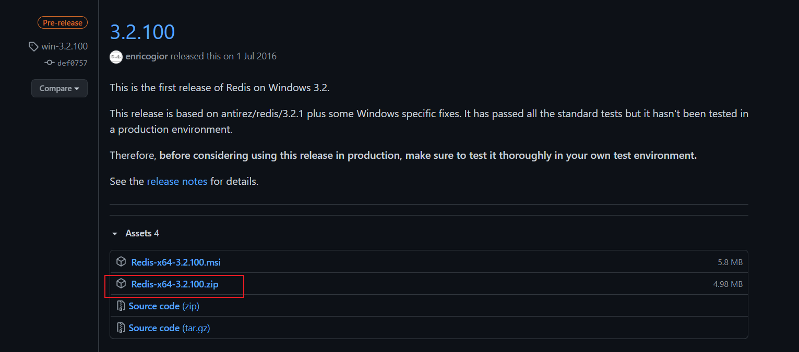

# Redis基础

## 一、NoSQL

### 1.1什么是NoSQL

NoSQL = Not Only SQL（不仅仅是SQL），也解释为non-relational（非关系型数据库）。

**在NoSQL数据库中数据之间是无联系的，无关系的。数据的结构是松散的，可变的。**


### 1.2为什么使用NoSQL

互联网应用的特点：访问量大、高并发、高可用、海量数据。

> 常用关系型数据库的瓶颈：
>
> - 无法应对每秒上万次的读写请求，无法处理大量集中的高并发操作。
> - 表中存储记录数量有限，一张表最多二百多列，横向可扩展能力有限。一张表的数据到达百万级，读写速度会逐渐下降。面对海量数据必须使用主从复制，分库分表，难以维护。
> - 无法通过增加硬件、服务节点来提高系统性能。
> - 大多数关系型数据库是收费的，成本高。


### 1.3NoSQL的优势

1. 可以处理大量的数据，高性能
   - 由于它的无关系性，数据库结构简单，NoSQL的缓存性能要比关系型数据库要高很多。
2. 灵活的数据模型
   - NoSQL无需事先为要存储的数据建立字段，随时可以存储自定义的数据格式。
3. 高可用
   - NoSQL有自己的高可用解决方案，主要关注在存储上。
4. 低成本
   - NoSQL数据库大部分都是开源免费的。


### 1.4NoSQL的劣势

1. 无关系，数据之间是无联系的。
2. 不支持标准的SQL，没有公认的NoSQL标准。
3. 没有关系型数据库的约束，大多数也没有索引的概念。
4. 没有事务，不能依靠事务实现ACID。
5. 没有丰富的数据类型（数据、日期、字符、二进制、大文本等）。


## 二、Redis的安装和使用

**Redis是当今非常流行的基于key-value结构的作为Cache使用的NoSQL数据库。**


### 2.1Redis介绍

Remote Dictionary Server（Redis）是一个开源的使用ANSI，使用C语言编写，基于内存亦可持久化的Key-Value数据库，Key字符类型，Value可以是字符串（String），哈希表（Map），列表（list），集合（sets）和有序集合（sorted sets）等类型，通常也被称为数据结构服务器。


主要存在于service和dao之间，用来保存用户经常访问的数据，为了减轻数据查询的次数和压力。


### 2.2在Windows上安装Redis

Windows版本的Redis是微软的开源部门提供的Redis，并不是原始版本的Redis。该版本适合开发人员学习使用，在生产环境中需要使用Linux系统来安装原始版本的Redis。

地址：https://github.com/MicrosoftArchive/redis/releases



下载解压缩即可


启动Redis服务

需要在文件夹中打开dos窗口，输入指令

```dos
redis-server.exe redis.windows.conf
```


该窗口不能关闭，打开客户端redis-cli.exe进行访问数据

```
// 创建一个数据
set key value [EX seconds] [PX milliseconds] [NX|XX]
// 将key输入k1，value输入v1，回车，即创建了一个map

// 查找一个数据
get key
// 将key输入k1，回车，查找数据
```


### 2.3在Linux上安装Redis


