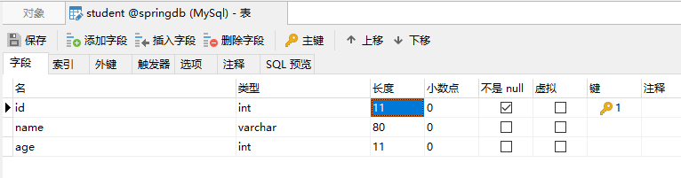
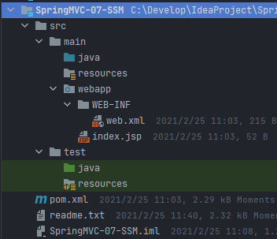
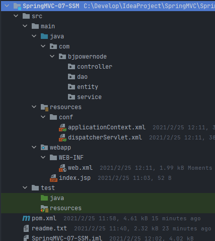
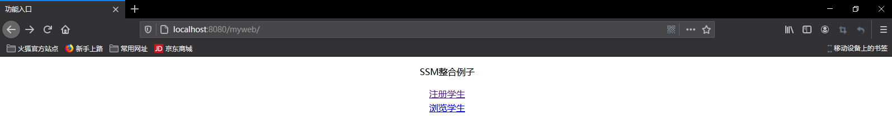
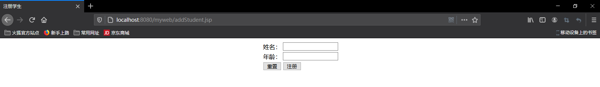
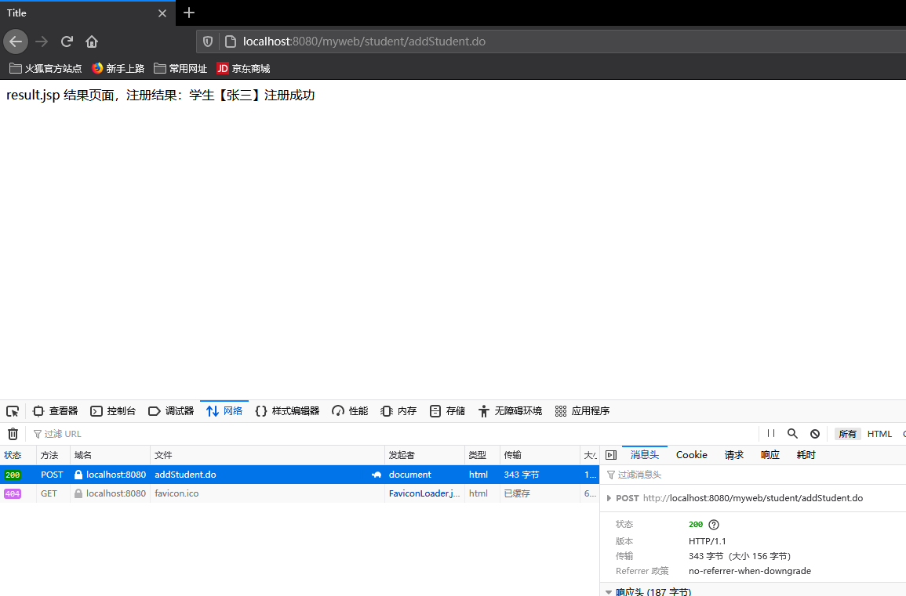
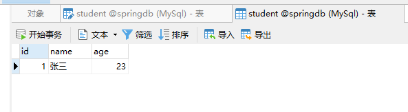
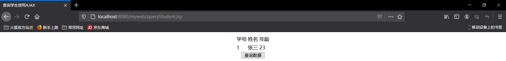

# SSM整合开发

即SpringMVC + Spring + MyBatis整合，SSM整合的实质，仅仅是将MyBatis整合到Spring中，因为SpringMVC原本就是Spring的一部分，不需要专门整合。

SSM整合的实现方式有两种：基于XML配置方式，基于注解配置方式


## 一、SSM整合开发思路

```
SSM整合开发：
SSM：SpringMVC + Spring + MyBatis

SpringMVC：视图层、界面层，负责接收请求，显示处理结果的。
Spring：业务层，管理Service，dao，工具类对象
MyBatis：持久层，用来访问数据库

用户发起请求--->使用SpringMVC接收请求--->Spring中的Service对象处理业务逻辑--->MyBatis处理数据

SSM整合也叫做SSI（IBatis也就是MyBatis前身），整合中有容器。
    1.第一个容器是SpringMVC容器，管理Controller控制器对象
    2.第二个容器是Spring容器，管理Service，Dao，工具类对象

我们要做的是把使用的对象要交给合适的容器创建和管理。
    1.把Controller还有Web开发的相关对象交给SpringMVC容器，这些Web用的对象写在SpringMVC配置文件中
    2.把Service，Dao对象定义在Spring的配置文件中，由Spring管理这些对象

SpringMVC容器和Spring容器是有关系的，关系已经确定好了的
SpringMVC容器是Spring容器的子容器，类似Java中的继承，但不是继承
子可以访问父中的内容，在子容器中的Controller可以访问父容器中的Service对象，就可以实现Controller使用Service对象。

实现步骤：
    0.使用Springdb的MySql库，表使用Student（id auto_increment, name, age）

    1.新建Maven web项目

    2.加入依赖
        1.SpringMVC, Spring, MyBatis三个框架依赖
        2.Jackson, MySql驱动, druid连接池
        3.jsp, servlet

    3.写web.xml文件
        1.注册DispatcherServlet，目的：1.创建SpringMVC容器对象，才能创建Controller类对象; 2.创建的是Servlet，才能接受用户的请求

        2.注册Spring的监听器ContextLoaderListener，目的：1.创建Spring容器对象，才能创建Service，Dao对象

        3.注册字符集过滤器，解决post请求乱码问题

    4.创建包，Controller包，Service包，Dao包，entity包

    5.写SpringMVC，Spring，MyBatis的配置文件
        1.SpringMVC配置文件
        2.Spring配置文件
        3.MyBatis主配置文件
        4.数据库的属性配置文件

    6.写代码，Dao接口和Mapper文件，Service和实现类，Controller，实体类。

    7.写JSP页面
```


## 二、搭建SSM开发环境

准备工作，数据库



第一步：创建Maven web项目



第二步：加入依赖

```xml
<?xml version="1.0" encoding="UTF-8"?>
<project xmlns="http://maven.apache.org/POM/4.0.0" xmlns:xsi="http://www.w3.org/2001/XMLSchema-instance"
         xsi:schemaLocation="http://maven.apache.org/POM/4.0.0 http://maven.apache.org/xsd/maven-4.0.0.xsd">
    <modelVersion>4.0.0</modelVersion>

    <groupId>com.bjpowernode</groupId>
    <artifactId>SpringMVC-07-SSM</artifactId>
    <version>1.0-SNAPSHOT</version>
    <packaging>war</packaging>

    <properties>
        <project.build.sourceEncoding>UTF-8</project.build.sourceEncoding>
        <maven.compiler.source>1.8</maven.compiler.source>
        <maven.compiler.target>1.8</maven.compiler.target>
    </properties>

    <dependencies>

        <!--单元测试-->
        <dependency>
            <groupId>junit</groupId>
            <artifactId>junit</artifactId>
            <version>4.11</version>
            <scope>test</scope>
        </dependency>

        <!--servlet依赖-->
        <dependency>
            <groupId>javax.servlet</groupId>
            <artifactId>javax.servlet-api</artifactId>
            <version>3.1.0</version>
            <scope>provided</scope>
        </dependency>

        <!-- jsp依赖 -->
        <dependency>
            <groupId>javax.servlet.jsp</groupId>
            <artifactId>jsp-api</artifactId>
            <version>2.2.1-b03</version>
            <scope>provided</scope>
        </dependency>

        <!--springmvc-->
        <dependency>
            <groupId>org.springframework</groupId>
            <artifactId>spring-webmvc</artifactId>
            <version>5.2.5.RELEASE</version>
        </dependency>

        <!--spring-->
        <dependency>
            <groupId>org.springframework</groupId>
            <artifactId>spring-tx</artifactId>
            <version>5.2.5.RELEASE</version>
        </dependency>
        <dependency>
            <groupId>org.springframework</groupId>
            <artifactId>spring-jdbc</artifactId>
            <version>5.2.5.RELEASE</version>
        </dependency>

        <!--jackson-->
        <dependency>
            <groupId>com.fasterxml.jackson.core</groupId>
            <artifactId>jackson-core</artifactId>
            <version>2.9.0</version>
        </dependency>
        <dependency>
            <groupId>com.fasterxml.jackson.core</groupId>
            <artifactId>jackson-databind</artifactId>
            <version>2.9.0</version>
        </dependency>

        <!--mybatis-->
        <dependency>
            <groupId>org.mybatis</groupId>
            <artifactId>mybatis-spring</artifactId>
            <version>1.3.1</version>
        </dependency>
        <dependency>
            <groupId>org.mybatis</groupId>
            <artifactId>mybatis</artifactId>
            <version>3.5.1</version>
        </dependency>

        <!--mysql驱动-->
        <dependency>
            <groupId>mysql</groupId>
            <artifactId>mysql-connector-java</artifactId>
            <version>8.0.17</version>
        </dependency>

        <!--druid连接池-->
        <dependency>
            <groupId>com.alibaba</groupId>
            <artifactId>druid</artifactId>
            <version>1.1.12</version>
        </dependency>
    </dependencies>

    <build>
        <resources>
            <resource>
                <!-- 所在的目录 -->
                <directory>src/main/java</directory>
                <!-- 包括目录下的.properties,.xml 文件都会扫描到 -->
                <includes>
                    <include>**/*.properties</include>
                    <include>**/*.xml</include>
                </includes>
                <filtering>false</filtering>
            </resource>

            <resource>
                <!-- 所在的目录 -->
                <directory>src/main/resources</directory>
                <!-- 包括目录下的.properties,.xml 文件都会扫描到 -->
                <includes>
                    <include>**/*.properties</include>
                    <include>**/*.xml</include>
                </includes>
                <filtering>false</filtering>
            </resource>
        </resources>
        <plugins>
            <plugin>
                <artifactId>maven-compiler-plugin</artifactId>
                <version>3.1</version>
                <configuration>
                    <source>1.8</source>
                    <target>1.8</target>
                </configuration>
            </plugin>
        </plugins>
    </build>
</project>
```

第三步：写web.xml文件

```xml
<?xml version="1.0" encoding="UTF-8"?>
<web-app xmlns="http://xmlns.jcp.org/xml/ns/javaee"
         xmlns:xsi="http://www.w3.org/2001/XMLSchema-instance"
         xsi:schemaLocation="http://xmlns.jcp.org/xml/ns/javaee http://xmlns.jcp.org/xml/ns/javaee/web-app_4_0.xsd"
         version="4.0">

    <!--注册DispatcherServlet中央调度器-->
    <servlet>
        <servlet-name>myweb</servlet-name>
        <servlet-class>org.springframework.web.servlet.DispatcherServlet</servlet-class>
        <init-param>
            <param-name>contextConfigLocation</param-name>
            <param-value>classpath:conf/dispatcherServlet.xml</param-value>
        </init-param>
        <load-on-startup>1</load-on-startup>
    </servlet>
    <servlet-mapping>
        <servlet-name>myweb</servlet-name>
        <url-pattern>*.do</url-pattern>
    </servlet-mapping>

    <!--注册ContextLoaderListener监听器-->
    <context-param>
        <param-name>contextConfigLocation</param-name>
        <param-value>classpath:conf/applicationContext.xml</param-value>
    </context-param>
    <listener>
        <listener-class>org.springframework.web.context.ContextLoaderListener</listener-class>
    </listener>
    
    <!--注册字符集过滤器-->
    <filter>
        <filter-name>characterEncodingFilter</filter-name>
        <filter-class>org.springframework.web.filter.CharacterEncodingFilter</filter-class>
        <init-param>
            <param-name>encoding</param-name>
            <param-value>utf-8</param-value>
        </init-param>
        <init-param>
            <param-name>forceRequestEncoding</param-name>
            <param-value>true</param-value>
        </init-param>
        <init-param>
            <param-name>forceResponseEncoding</param-name>
            <param-value>true</param-value>
        </init-param>
    </filter>
    <filter-mapping>
        <filter-name>characterEncodingFilter</filter-name>
        <url-pattern>/*</url-pattern>
    </filter-mapping>
</web-app>
```

第四步：创建包，Controller包，Service包，Dao包，entity包



第五步：编写SpringMVC，Spring，MyBatis的配置文件

1. SpringMVC配置文件

   ```xml
   <?xml version="1.0" encoding="UTF-8"?>
   <beans xmlns="http://www.springframework.org/schema/beans"
          xmlns:xsi="http://www.w3.org/2001/XMLSchema-instance"
          xmlns:context="http://www.springframework.org/schema/context"
          xmlns:mvc="http://www.springframework.org/schema/mvc"
          xsi:schemaLocation="http://www.springframework.org/schema/beans
          http://www.springframework.org/schema/beans/spring-beans.xsd
          http://www.springframework.org/schema/context
          https://www.springframework.org/schema/context/spring-context.xsd
          http://www.springframework.org/schema/mvc
          https://www.springframework.org/schema/mvc/spring-mvc.xsd">
   
       <!--springmvc配置文件，声明controller和其他web相关的对象-->
       <!--组件扫描器-->
       <context:component-scan base-package="com.bjpowernode.controller" />
   
       <!--视图解析器-->
       <bean class="org.springframework.web.servlet.view.InternalResourceViewResolver">
           <property name="prefix" value="/WEB-INF/jsp/" />
           <property name="suffix" value=".jsp" />
       </bean>
   
       <!--注解驱动：响应AJAX请求返回JSON；解决静态资源访问问题-->
       <mvc:annotation-driven />
   </beans>
   ```

2. Spring配置文件

   先配置数据库连接信息

   ```properties
   jdbc.url=jdbc:mysql://localhost:3306/springdb?serverTimezone=UTC
   jdbc.username=root
   jdbc.password=12345
   ```

   ```xml
   <?xml version="1.0" encoding="UTF-8"?>
   <beans xmlns="http://www.springframework.org/schema/beans"
          xmlns:xsi="http://www.w3.org/2001/XMLSchema-instance"
          xmlns:context="http://www.springframework.org/schema/context"
          xsi:schemaLocation="http://www.springframework.org/schema/beans http://www.springframework.org/schema/beans/spring-beans.xsd http://www.springframework.org/schema/context https://www.springframework.org/schema/context/spring-context.xsd">
   
       <!--spring配置文件：声明service，dao，工具类等对象-->
   
       <!--声明数据库配置文件信息位置-->
       <context:property-placeholder location="classpath:conf/jdbc.properties" />
   
       <!--声明数据源，连接数据库-->
       <bean id="dataSource" class="com.alibaba.druid.pool.DruidDataSource" init-method="init" destroy-method="close">
           <property name="url" value="${jdbc.url}" />
           <property name="username" value="${jdbc.username}" />
           <property name="password" value="${jdbc.password}" />
       </bean>
   
       <!--声明SqlSessionFactoryBean创建SqlSessionFactory-->
       <bean id="sqlSessionFactory" class="org.mybatis.spring.SqlSessionFactoryBean">
           <property name="dataSource" ref="dataSource" />
           <property name="configLocation" value="classpath:conf/mybatis.xml" />
       </bean>
       
       <!--声明mybatis的扫描器，创建dao对象-->
       <bean class="org.mybatis.spring.mapper.MapperScannerConfigurer">
           <property name="sqlSessionFactoryBeanName" value="sqlSessionFactory" />
           <property name="basePackage" value="com.bjpowernode.dao" />
       </bean>
       
       <!--声明service的注解@Service所在的包名位置-->
       <context:component-scan base-package="com.bjpowernode.service" />
       
       <!--事务配置：注解的配置或者aspectJ的配置-->
   </beans>
   ```

3. MyBatis主配置文件

   ```xml
   <?xml version="1.0" encoding="UTF-8" ?>
   <!DOCTYPE configuration
           PUBLIC "-//mybatis.org//DTD Config 3.0//EN"
           "http://mybatis.org/dtd/mybatis-3-config.dtd">
   
   <configuration>
   
       <settings>
           <!-- 设置mybatis输出日志 -->
           <setting name="logImpl" value="STDOUT_LOGGING"/>
       </settings>
   
       <!-- 设置别名 -->
       <typeAliases>
           <!--name:实体类所在包名com.bjpowernode.entity-->
           <package name="com.bjpowernode.entity"/>
       </typeAliases>
       
       <!-- 指定sql mapper（sql映射文件的位置） -->
       <mappers>
           <!--
               name：包名，这里面的所有mapper文件，一次都能加载com.bjpowernode.dao
               使用package的要求：
                   1.mapper文件名称和dao接口名必须完全一致，包括大小写
                   2.mapper文件和dao接口必须在同一目录
           -->
           <package name="com.bjpowernode.dao"/>
       </mappers>
   </configuration>
   ```


## 三、SSM整合注解开发

第六步：写代码，Dao接口和Mapper文件，Service和实现类，Controller，实体类

1. 创建实体类

   ```java
   package com.bjpowernode.entity;
   
   public class Student {
       private Integer id;
       private String name;
       private Integer age;
   
       public Integer getId() {
           return id;
       }
   
       public void setId(Integer id) {
           this.id = id;
       }
   
       public String getName() {
           return name;
       }
   
       public void setName(String name) {
           this.name = name;
       }
   
       public Integer getAge() {
           return age;
       }
   
       public void setAge(Integer age) {
           this.age = age;
       }
   }
   ```

2. 创建dao接口

   ```java
   package com.bjpowernode.dao;
   
   import com.bjpowernode.entity.Student;
   
   import java.util.List;
   
   public interface StudentDao {
       /**
        * 添加学生信息
        * @param student
        * @return
        */
       int addStudent(Student student);
   
       /**
        * 查询学生信息
        * @return
        */
       List<Student> queryStudents();
   }
   ```

3. 创建Mapper文件

   ```xml
   <?xml version="1.0" encoding="UTF-8" ?>
   <!DOCTYPE mapper
           PUBLIC "-//mybatis.org//DTD Mapper 3.0//EN"
           "http://mybatis.org/dtd/mybatis-3-mapper.dtd">
   <mapper namespace="com.bjpowernode.dao.StudentDao">
       
       <insert id="addStudent">
           insert into student(name, age) values (#{name}, #{age})
       </insert>
       
       <select id="queryStudents" resultType="Student">
           select id, name, age from student order by id desc
       </select>
   </mapper>
   ```

4. 创建service接口和实现类

   ```java
   package com.bjpowernode.service;
   
   import com.bjpowernode.entity.Student;
   
   import java.util.List;
   
   public interface StudentService {
       int addStudent(Student student);
       List<Student> queryStudents();
   }
   ```

   ```java
   package com.bjpowernode.service.impl;
   
   import com.bjpowernode.dao.StudentDao;
   import com.bjpowernode.entity.Student;
   import com.bjpowernode.service.StudentService;
   import org.springframework.beans.factory.annotation.Autowired;
   import org.springframework.stereotype.Service;
   
   import java.util.List;
   
   @Service
   public class StudentServiceImpl implements StudentService {
       // 引用类型自动注入@Autowired,@Resource
       @Autowired
       private StudentDao studentDao;
       
       @Override
       public int addStudent(Student student) {
           int nums = studentDao.addStudent(student);
           return nums;
       }
   
       @Override
       public List<Student> queryStudents() {
           return studentDao.queryStudents();
       }
   }
   ```

5. 创建Controller

   ```java
   package com.bjpowernode.controller;
   
   import com.bjpowernode.entity.Student;
   import com.bjpowernode.service.StudentService;
   import org.springframework.stereotype.Controller;
   import org.springframework.web.bind.annotation.RequestMapping;
   import org.springframework.web.servlet.ModelAndView;
   
   import javax.annotation.Resource;
   
   @Controller
   @RequestMapping("/student")
   public class StudentController {
       
       @Resource
       private StudentService service;
       
       // 注册学生
       @RequestMapping("addStudent.do")
       public ModelAndView addStudent(Student student){
           ModelAndView mv = new ModelAndView();
           String tips = "注册失败";
           // 调用service处理student
           int nums = service.addStudent(student);
           if (nums > 0){
               // 注册成功
               tips = "学生【" + student.getName() + "】注册成功";
           }
           // 添加数据
           mv.addObject("tips", tips);
           // 指定结果页面
           mv.setViewName("result");
           return mv;
       }
   }
   ```

   和对应的结果页面result.jsp

   ```jsp
   <%@ page contentType="text/html;charset=UTF-8" language="java" %>
   <html>
   <head>
       <title>Title</title>
   </head>
   <body>
       result.jsp 结果页面，注册结果：${tips}
   </body>
   </html>
   ```

第七步：编写jsp页面

1. 创建首页页面

   ```jsp
   <%@ page contentType="text/html;charset=UTF-8" language="java" %>
   <%
       String basePath = request.getScheme() + "://" +
               request.getServerName() + ":" +
               request.getServerPort() +
               request.getContextPath() + "/";
   %>
   <html>
   <head>
       <title>功能入口</title>
       <base href="<%=basePath%>" />
   </head>
   <body>
       <div align="center">
           <p>SSM整合例子</p>
           <table>
               <tr>
                   <td><a href="addStudent.jsp">注册学生</a></td>
               </tr>
               <tr>
                   <td><a href="queryStudent.jsp">浏览学生</a></td>
               </tr>
           </table>
       </div>
   </body>
   </html>
   ```

   

2. 创建注册页面

   ```jsp
   <%@ page contentType="text/html;charset=UTF-8" language="java" %>
   <%
       String basePath = request.getScheme() + "://" +
                         request.getServerName() + ":" +
                         request.getServerPort() +
                         request.getContextPath() + "/";
   %>
   <html>
   <head>
       <title>注册学生</title>
       <base href="<%=basePath%>" />
   </head>
   <body>
       <div align="center">
           <form action="student/addStudent.do" method="post">
               <table>
                   <tr>
                       <td>姓名：</td>
                       <td><input type="text" name="name"></td>
                   </tr>
                   <tr>
                       <td>年龄：</td>
                       <td><input type="text" name="age"></td>
                   </tr>
                   <tr>
                       <td><input type="reset" value="重置"></td>
                       <td><input type="submit" value="注册"></td>
                   </tr>
               </table>
           </form>
       </div>
   </body>
   </html>
   ```

   

3. 测试注册功能

   

   

第八步：使用AJAX实现查询学生信息功能

1. 加入JQuery

2. 在Controller中添加处理查询学生的方法

   ```java
   package com.bjpowernode.controller;
   
   import com.bjpowernode.entity.Student;
   import com.bjpowernode.service.StudentService;
   import org.springframework.beans.factory.annotation.Autowired;
   import org.springframework.stereotype.Controller;
   import org.springframework.web.bind.annotation.RequestMapping;
   import org.springframework.web.bind.annotation.ResponseBody;
   import org.springframework.web.servlet.ModelAndView;
   
   import javax.annotation.Resource;
   import java.util.List;
   
   @Controller
   @RequestMapping("/student")
   public class StudentController {
   
       @Resource
       private StudentService service;
   
       // 注册学生
       @RequestMapping("addStudent.do")
       public ModelAndView addStudent(Student student){
           // 省略
       }
   
       // 处理查询，响应ajax
       @RequestMapping("/queryStudents.do")
       @ResponseBody
       public List<Student> queryStudents(){
           // 参数检查，简单的数据处理
           List<Student> studentList = service.queryStudents();
           return studentList;
       }
   }
   ```

3. 编写queryStudent.jsp页面

   ````jsp
   <%@ page contentType="text/html;charset=UTF-8" language="java" %>
   <%
       String basePath = request.getScheme() + "://" +
               request.getServerName() + ":" +
               request.getServerPort() +
               request.getContextPath() + "/";
   %>
   <html>
   <head>
       <title>查询学生使用AJAX</title>
       <base href="<%=basePath%>" />
       <script type="text/javascript" src="js/jquery-3.3.1.min.js"></script>
       <script type="text/javascript">
           $(function (){
               // 在当前页面dom对象加载后，执行loadStudentData()
               loadStudentData();
   
               $("#btnLoader").click(function (){
                   loadStudentData();
               })
           })
   
           function loadStudentData(){
               $.ajax({
                   url:"student/queryStudents.do",
                   type:"get",
                   dataType:"json",
                   success:function (data){
                       // 清除旧的数据
                       $("#info").empty();
                       // 添加新的数据
                       $.each(data, function (i, n){
                           $("#info").append("<tr>")
                               .append("<td>" + n.id + "</td>")
                               .append("<td>" + n.name + "</td>")
                               .append("<td>" + n.age + "</td>")
                               .append("</tr>")
                       })
                   }
               })
           }
       </script>
   </head>
   <body>
       <div align="center">
           <table>
               <thead>
                   <tr>
                       <td>学号</td>
                       <td>姓名</td>
                       <td>年龄</td>
                   </tr>
               </thead>
               <tbody id="info">
   
               </tbody>
           </table>
           <input type="button" id="btnLoader" value="查询数据" />
       </div>
   </body>
   </html>
   ````

   

   

 