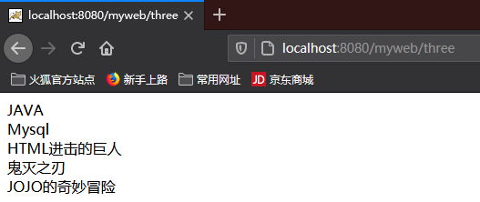
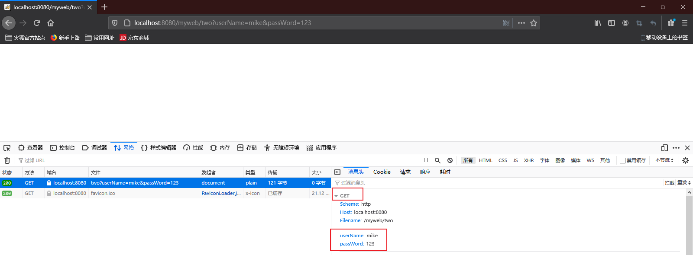
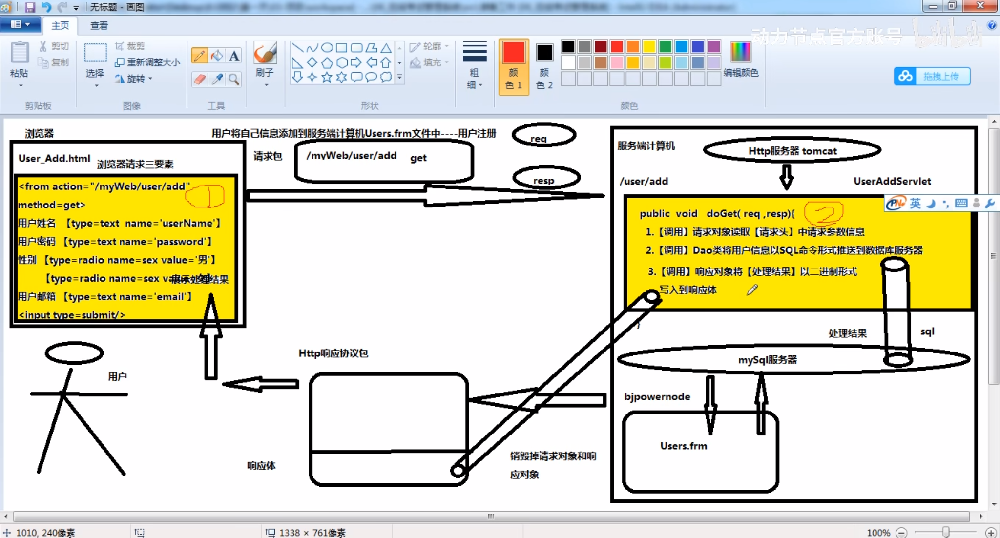

# Servlet基础

## 一、Servlet规范

### 1.1Servlet规范介绍

servlet规范来自于JavaEE规范中的一种

#### 1.1.1作用

1. 在servlet规范中，指定了【动态资源文件】开发步骤
2. 在servlet规范中，指定Http服务器调用动态文件的步骤
3. 在servlet规范中，指定Http服务器管理动态资源文件实例对象规则


## 二、Servlet接口实现类

1. Servlet接口来自于Servlet规范下的一个接口，这个接口存在Http服务器提供jar包。

2. Tomcat服务器下lib文件中有一个servlet-api.jar存放servlet接口（javax.servlet.Servlet）。

3. **Servlet规范中认为，Http服务器能调用的【动态资源文件】必须是一个Servlet接口的实现类。**

   >例如：
   >
   >​			class Student{
   >
   >​					// 不是动态资源文件，Tomcat无权调用			
   >
   >​			}
   >
   >
   >
   >​			class Teacher implements Servlet{
   >
   >​					// 合法动态资源文件，Tomcat有权利调用
   >
   >​					Servlet obj = new Teacher();
   >
   >​					obj.init();	
   >
   >​			}


## 三、Servlet接口实现类开发步骤

第一步：创建一个Java类继承于HttpServlet父类，使之成为一个Servlet接口实现类。

```java
public class OneServlet extends HttpServlet {

}
// oneServlet----extends---->(abstract)HttpServlet----extends---->(abstract)GenericServlet------implements---->(接口)Servlet
/*
Servlet接口：
              init
              getServletConfig
              getServletInfo
              destroy
              ----------------这四个方法对于servlet接口实现类没用

              service()
              ----------------有用

  Tomcat根据Servlet规范调用Servlet接口实现类规则：
              1.Tomcat有权创建Servlet接口实现类实例对象    Servlet oneServlet = new OneServlet();
              2.Tomcat根据实例对象调用Service方法处理当前请求 oneServlet.service();
*/
```

```java
// 源码中HttpServlet对父类的Service方法进行了重写
protected void service(HttpServletRequest req, HttpServletResponse resp) throws ServletException, IOException {
    	// 当浏览器发出请求后，Tomcat自动通过子类来调用父类实现的Service方法		oneServlet.service();
    	// 通过getMethod方法获取请求方式
        String method = req.getMethod();
        long lastModified;
    	// 通过判断请求方式执行对应的do方法
        if (method.equals("GET")) {
            lastModified = this.getLastModified(req);
            if (lastModified == -1L) {
                // doGet()
                // 此处的this指向的是HttpServlet的子类oneServlet
                this.doGet(req, resp);
            } else {
                long ifModifiedSince;
                try {
                    ifModifiedSince = req.getDateHeader("If-Modified-Since");
                } catch (IllegalArgumentException var9) {
                    ifModifiedSince = -1L;
                }

                if (ifModifiedSince < lastModified / 1000L * 1000L) {
                    this.maybeSetLastModified(resp, lastModified);
                    this.doGet(req, resp);
                } else {
                    resp.setStatus(304);
                }
            }
        } else if (method.equals("HEAD")) {
            lastModified = this.getLastModified(req);
            this.maybeSetLastModified(resp, lastModified);
          	// doHead()
            this.doHead(req, resp);
        } else if (method.equals("POST")) {
            // doPost()
            this.doPost(req, resp);
        } else if (method.equals("PUT")) {
            // doPut()
            this.doPut(req, resp);
        } else if (method.equals("DELETE")) {
            // doDelete()
            this.doDelete(req, resp);
        } else if (method.equals("OPTIONS")) {
            // doOptions()
            this.doOptions(req, resp);
        } else if (method.equals("TRACE")) {
            // doTrace()
            this.doTrace(req, resp);
        } else {
            String errMsg = lStrings.getString("http.method_not_implemented");
            Object[] errArgs = new Object[]{method};
            errMsg = MessageFormat.format(errMsg, errArgs);
            resp.sendError(501, errMsg);
        }

    }
```

```java
// 通过父类决定在何种情况下调用子类中方法----------【设计模式】-----------模板设计模式
// HttpServlet：service(){
// 							if(请求方式 == GET){
//								this.doGet();
//							}else if(请求方式 == POST){
//								this.doPost();
//							}
// }
// oneServlet.service()
```


第二步：重写HttpServlet父类中的两个方法，doGet()或doPost()

浏览器------ get ------->oneServlet.doGet()

浏览器------ post ------->oneServlet.doPost()


第三步：将Servlet接口实现类信息【注册】到Tomcat服务器

【网站】---------->【web】---------->【WEB-INF】---------->web.xml

```xml
<!-- 将Servlet接口实现类类路径地址交给Tomcat -->
<!-- 以下代码等同于 String myservlet = "com.bjpowernod.controller.Oneservlet"; -->
<servlet>
    <!-- 声明一个变量存储servlet接口实现类的类路径 -->
	<servlet-name>myservlet</servlet-name>
    <!-- 声明servlet接口实现类的类路径 -->
    <servlet-class>com.bjpowernod.controller.Oneservlet</servlet-class>
</servlet>

<!-- 为了降低用户访问Servlet接口实现难度，需要设置简短别名 -->
<servlet-mapping>
	<servlet-name>myservlet</servlet-name>
    <!-- 设置简短的请求别名，别名书写时必须以"/"开头 -->
    <url-pattern>/myservlet</url-pattern>
</servlet-mapping>

<!-- 此时如果浏览器要向tomcat索要oneServlet时的地址该如何书写 -->
<!-- http://localhost:8080/myweb/myservlet -->
```


## 四、Servlet对象生命周期

1. 网站中所有的Servlet接口实现类的实例对象，只能由Http服务器负责创建。开发人员不能手动创建Servlet接口实现类的实例对象。

2. 在默认的情况下，Http服务器接收到对于当前Servlet接口实现类第一次请求时，自动创建这个Servlet接口实现类的实例对象。

   在手动配置的情况下，要求Http服务器在启动时，自动创建某个Servlet接口实现类的实例对象。

   ```xml
   <servlet>
   	<servlet-name></servlet-name>
       <servlet-class></servlet-class>
       <!-- 这个标签的作用是在http服务器启动时，就创建这个servlet对象 -->
       <!-- 参数是一个大于0的任意整数，可以配置多个servlet的这个标签的参数，数字大小代表优先级 -->
       <load-on-startup>1</load-on-startup>
   </servlet>
   <servlet-maping>
   	<servlet-name></servlet-name>
       <url-pattern></url-pattern>
   </servlet-maping>
   ```

3. 在Http服务器运行期间，一个Servlet接口实现类只能被创建出一个实例对象。

4. 在Http服务器关闭的时候，自动将网站中所有的Servlet对象进行销毁。


### 4.1通过实例来观察生命周期

OneServlet.java

```java
package com.bjpowernode.controller;

import javax.servlet.*;
import javax.servlet.http.*;
import java.io.IOException;

public class OneServlet extends HttpServlet {

    public OneServlet() {
        System.out.println("OneServlet类被创建实例对象");
    }

    @Override
    protected void doGet(HttpServletRequest request, HttpServletResponse response) throws ServletException, IOException {
        System.out.println("OneServlet doGet is run...");
    }

    @Override
    protected void doPost(HttpServletRequest request, HttpServletResponse response) throws ServletException, IOException {

    }
}

```

TwoServlet.java

```java
package com.bjpowernode.controller;

import javax.servlet.*;
import javax.servlet.http.*;
import java.io.IOException;

public class TwoServlet extends HttpServlet {

    public TwoServlet() {
        System.out.println("TwoServlet类被创建实例对象");
    }

    @Override
    protected void doGet(HttpServletRequest request, HttpServletResponse response) throws ServletException, IOException {
        System.out.println("TwoServlet doGet is run...");
    }

    @Override
    protected void doPost(HttpServletRequest request, HttpServletResponse response) throws ServletException, IOException {

    }
}

```

web.xml

```xml
<?xml version="1.0" encoding="UTF-8"?>
<web-app xmlns="http://xmlns.jcp.org/xml/ns/javaee"
         xmlns:xsi="http://www.w3.org/2001/XMLSchema-instance"
         xsi:schemaLocation="http://xmlns.jcp.org/xml/ns/javaee http://xmlns.jcp.org/xml/ns/javaee/web-app_4_0.xsd"
         version="4.0">

    <servlet>
        <servlet-name>OneServlet</servlet-name>
        <servlet-class>com.bjpowernode.controller.OneServlet</servlet-class>
    </servlet>
    <servlet-mapping>
    <servlet-name>OneServlet</servlet-name>
    <url-pattern>/one</url-pattern>
    </servlet-mapping>

    <servlet>
        <servlet-name>TwoServlet</servlet-name>
        <servlet-class>com.bjpowernode.controller.TwoServlet</servlet-class>
        <!-- 通知tomcat在启动时负责创建TwoServlet实例对象 -->
        <load-on-startup>1</load-on-startup>
    </servlet>
    <servlet-mapping>
        <servlet-name>TwoServlet</servlet-name>
        <url-pattern>/two</url-pattern>
    </servlet-mapping>
</web-app>
```

**通过load-on-startup使第二个servlet更早的被创建**


**看运行结果，可知当tomcat启动时，twoServlet就被创建出来。而当访问oneServlet的请求时，oneServlet才被创建。**


**但是当再次访问oneServlet请求时，只会再次调用doGet方法，而不会创建实例对象。**

**当关闭tomcat时，自动销毁所有Servlet。**


## 五、HttpServletResponse接口

### 5.1介绍

1. HttpServletResponse接口来自于Servlet规范中，在Tomcat中存在servlet.api.jar中（javax.servlet.http.HttpServletResponse）。
2. HttpServletResponse接口实现类由Http服务器负责提供。
3. HttpServletResponse接口负责将doGet/doPost方法执行结果写入到响应体交给浏览器。
4. 开发人员习惯于将HttpServletResponse接口修饰的对象称为【响应对象】。


### 5.2主要功能

1. 将执行结果以二进制的形式写入到【响应体】中。
2. 设置响应头中【content-type】属性值，从而控制浏览器使用对应的编译器将响应体中的二进制数据编译为文字、图片、视频等。
3. 设置响应头中的【location】属性，将一个请求地址赋值给location，从而来控制浏览器向指定服务器发送请求。


### 5.3实例

```java
package com.bjpowernode.controller;

import javax.servlet.*;
import javax.servlet.http.*;
import java.io.IOException;
import java.io.PrintWriter;

/**
 * @author Mr.Feng
 */
public class OneServlet extends HttpServlet {
    @Override
    protected void doGet(HttpServletRequest request, HttpServletResponse response) throws ServletException, IOException {

        String result = "hello world"; // 执行结果

        // --------响应对象将结果写入响应体----------start
            // 1.通过响应对象，向tomcat索要输出流
            PrintWriter pw = response.getWriter();
            // 2.通过输出流，将执行结果以二进制形式写入到响应体
            pw.write(result);
        // --------响应对象将结果写入响应体----------end
    }
}

```


#### 5.3.1如果返回的是数字会怎么样？

```java
package com.bjpowernode.controller;

import javax.servlet.*;
import javax.servlet.http.*;
import javax.servlet.annotation.*;
import java.io.IOException;
import java.io.PrintWriter;

public class TwoServlet extends HttpServlet {
    @Override
    protected void doGet(HttpServletRequest request, HttpServletResponse response) throws ServletException, IOException {

        int money = 50; // 执行结果

        PrintWriter pw = response.getWriter();
        pw.write(money);
    }
}

```


> 问题：为什么浏览器接收到的数据是2而不是50？
>
> 原因：pw.write方法可以将【字符、字符串、ASCII码】写入响应体中。
>
> ​				ASCII码：	a----------97		2----------50
>
> ​				也就是说响应体中的数据50被当作了ASCII码
>
> 解决：在实际的开发中，都是通过pw,print()将真实的数据写入到响应体

```java
package com.bjpowernode.controller;

import javax.servlet.*;
import javax.servlet.http.*;
import javax.servlet.annotation.*;
import java.io.IOException;
import java.io.PrintWriter;

public class TwoServlet extends HttpServlet {
    @Override
    protected void doGet(HttpServletRequest request, HttpServletResponse response) throws ServletException, IOException {

        int money = 50; // 执行结果

        PrintWriter pw = response.getWriter();
        // pw.write(money);
        pw.print(money);
    }
}

```


#### 5.3.2如果返回的是一段html字符串会怎么样？

```java
package com.bjpowernode.controller;

import javax.servlet.*;
import javax.servlet.http.*;
import java.io.IOException;
import java.io.PrintWriter;

public class ThreeServlet extends HttpServlet {
    @Override
    protected void doGet(HttpServletRequest request, HttpServletResponse response) throws ServletException, IOException {
        String result = "JAVA<br/>Mysql<br/>HTML"; // 既有文字信息又有Html标签命令
        PrintWriter pw = response.getWriter();
        pw.print(result);
    }
}

```


> 问题：浏览器在接收到响应结果时，将< br/>作为文字内容展示，没有将其作为HTML标签来执行。
>
> 原因：浏览器在接收到响应包之前，根据响应头中的【content-type】属性的值，来采用对应的【编译器】对响应体中的【二进制内容】进行编译。
>
> ​				在默认的情况下，【content-type】属性的值是"text"	content-type="text";
>
> ​				此时浏览器会采用【文本编译器】对响应体二进制数据进行解析。
>
> 解决：一定要在得到输出流之前，通过响应对象来对响应头中的【content-type】属性重新赋值，用于指定浏览器采用正确的编译器编译。

```java
package com.bjpowernode.controller;

import javax.servlet.*;
import javax.servlet.http.*;
import javax.servlet.annotation.*;
import java.io.IOException;
import java.io.PrintWriter;

public class TwoServlet extends HttpServlet {
    @Override
    protected void doGet(HttpServletRequest request, HttpServletResponse response) throws ServletException, IOException {

        int money = 50; // 执行结果

        PrintWriter pw = response.getWriter();
        // pw.write(money);
        pw.print(money);
    }
}

```


#### 5.3.3如果返回的有文字会怎么样？

```java
package com.bjpowernode.controller;

import javax.servlet.*;
import javax.servlet.http.*;
import java.io.IOException;
import java.io.PrintWriter;

public class ThreeServlet extends HttpServlet {
    @Override
    protected void doGet(HttpServletRequest request, HttpServletResponse response) throws ServletException, IOException {
        String result = "JAVA<br/>Mysql<br/>HTML"; // 既有文字信息又有Html标签命令
        String result2 = "进击的巨人<br/>鬼灭之刃<br/>JOJO的奇妙冒险";
        // 设置content-type
        response.setContentType("text/html");
        PrintWriter pw = response.getWriter();
        pw.print(result);
        pw.print(result2);
    }
}

```


> 问题：浏览器接收到的文字无法正常显示。
>
> 原因：这是因为浏览器默认字符编码是ISO-8859-1，它无法对汉字进行编码。
>
> 解决：在获取输出流之前，通过响应对象对响应头中的content-type属性进行设置字符编码格式

```java
package com.bjpowernode.controller;

import javax.servlet.*;
import javax.servlet.http.*;
import java.io.IOException;
import java.io.PrintWriter;

public class ThreeServlet extends HttpServlet {
    @Override
    protected void doGet(HttpServletRequest request, HttpServletResponse response) throws ServletException, IOException {
        String result = "JAVA<br/>Mysql<br/>HTML"; // 既有文字信息又有Html标签命令
        String result2 = "进击的巨人<br/>鬼灭之刃<br/>JOJO的奇妙冒险";
        // 设置content-type
        response.setContentType("text/html;charset=utf-8");
        PrintWriter pw = response.getWriter();
        pw.print(result);
        pw.print(result2);
    }
}

```




#### 5.3.4如果返回的是链接会怎么样？

```java
package com.bjpowernode.controller;

import javax.servlet.*;
import javax.servlet.http.*;
import java.io.IOException;

public class FourServlet extends HttpServlet {
    @Override
    protected void doGet(HttpServletRequest request, HttpServletResponse response) throws ServletException, IOException {
        String result = "http://www.baidu.com";
        // 通过响应对象，将地址赋值给响应头中的location属性
        response.sendRedirect(result); // 响应头 location = "http://www.baidu.com";
        // 浏览器在接收到响应包之后，如果响应头中存在location这个属性，自动通过地址栏向location指定网站发送请求。
        // sendRedirect方法远程控制浏览器请求行为【请求地址，请求方式，请求参数】
    }
}

```


回车


也可以设置请求参数

```java
package com.bjpowernode.controller;

import javax.servlet.*;
import javax.servlet.http.*;
import java.io.IOException;

public class FourServlet extends HttpServlet {
    @Override
    protected void doGet(HttpServletRequest request, HttpServletResponse response) throws ServletException, IOException {
        // 设置请求参数
        String result = "http://www.baidu.com?username=mike";
        // 通过响应对象，将地址赋值给响应头中的location属性
        response.sendRedirect(result); // 响应头 location = "http://www.baidu.com";
        // 浏览器在接收到响应包之后，如果响应头中存在location这个属性，自动通过地址栏向location指定网站发送请求。
        // sendRedirect方法远程控制浏览器请求行为【请求地址，请求方式，请求参数】
    }
}

```


## 六、HttpServletRequest接口

### 6.1介绍

1. HttpServletRequest接口来自于Servlet规范中，在Tomcat中存在servlet.api.jar中（javax.servlet.http.HttpServletRequest）。
2. HttpServletRequest接口实现类由Http服务器负责提供。
3. HttpServletRequest接口负责在doGet/doPost方法运行时读取Http请求协议包中的信息。
4. 开发人员习惯于将HttpServletRequest接口修饰的对象称为【请求对象】。


### 6.2主要功能

1. 可以读取Http请求协议包中【请求行】信息
2. 可以读取保存在Http请求协议包中【请求头】或【请求体】中的请求参数信息。
3. 可以代替浏览器向Http服务器中申请资源文件的调用


### 6.3实例

#### 6.3.1通过请求对象来查看url、method以及uri的信息

```java
package com.bjpowernode.controller;

import javax.servlet.*;
import javax.servlet.http.*;
import java.io.IOException;

public class OneServlet extends HttpServlet {
    @Override
    protected void doGet(HttpServletRequest request, HttpServletResponse response) throws ServletException, IOException {

        // 1.通过请求对象，读取【请求行】中的【url】信息
        String url = request.getRequestURL().toString();
        // 2.通过请求对象，读取【请求行】中的【method】信息
        String method = request.getMethod();
        // 3.通过请求对象，读取【请求行】中的【uri】信息
        /**
         * uri：资源文件精准定位地址，在请求行中并没有uri这个属性
         *      实际上是从url中截取的一个字符串
         *      格式："/网站名/资源文件名"
         *      uri用于让Http服务器对被访问的资源文件进行定位
         */
        String uri = request.getRequestURI();
        System.out.println("url：" + url);
        System.out.println("method：" + method);
        System.out.println("uri：" + uri);
    }
}

```


#### 6.3.2通过请求对象获取前端请求参数

```html
<!DOCTYPE html>
<html lang="en">
<head>
    <meta charset="UTF-8">
    <title>Title</title>
</head>
<body>
    <center>
        <a href="/myweb/two?userName=mike&passWord=123" >通过超链接访问TwoServlet,并携带请求参数</a>
    </center>
</body>
</html>
```

```java
package com.bjpowernode.controller;

import javax.servlet.*;
import javax.servlet.http.*;
import java.io.IOException;
import java.util.Enumeration;

public class TwoServlet extends HttpServlet {
    @Override
    protected void doGet(HttpServletRequest request, HttpServletResponse response) throws ServletException, IOException {

        // 1.通过请求对象获得【请求头】中所有请求参数的名称
        Enumeration parameterNames = request.getParameterNames();// 将所有请求对象参数名称保存到一个枚举对象中
        while (parameterNames.hasMoreElements()){
            String name = (String) parameterNames.nextElement();
            // 2.通过请求对象读取指定的请求参数的值
            String value = request.getParameter(name);
            System.out.println("请求参数：" + name + "：" + value);
        }
    }
}
```





#### 6.3.3分别使用get/post方法从请求对象中读取请求参数

```html
<!DOCTYPE html>
<html lang="en">
<head>
    <meta charset="UTF-8">
    <title>Title</title>
</head>
<body>
    <center>
        <form action="/myweb/three" method="get">
            请求参数:<input type="text" name="username" /><br>
            <input type="submit" value="get方式访问ThreeServlet">
        </form>
        <br><br><br>
        <form action="/myweb/three" method="post">
            请求参数:<input type="text" name="username" /><br>
            <input type="submit" value="post方式访问ThreeServlet">
        </form>
    </center>
</body>
</html>
```

```java
package com.bjpowernode.controller;

import javax.servlet.*;
import javax.servlet.http.*;
import java.io.IOException;

public class ThreeServlet extends HttpServlet {
    @Override
    protected void doGet(HttpServletRequest request, HttpServletResponse response) throws ServletException, IOException {

        // 1.通过请求对象读取【请求头】中的请求参数信息
        String username = request.getParameter("username");
        System.out.println("从请求头中得到的参数值：" + username);
    }

    @Override
    protected void doPost(HttpServletRequest request, HttpServletResponse response) throws ServletException, IOException {

        // 1.通过请求对象读取【请求体】中的请求参数信息
        String username = request.getParameter("username");
        System.out.println("从请求头中得到的参数值：" + username);
    }
}

```


**使用get方式发送请求**


**使用post方式发送请求**


**如果输入的参数是中文会怎么样？**


> 问题：以GET方式发送中文参数时，可以得到正常结果
>
> ​			  以POST方式发送中文参数时，得到乱码
>
> 原因：浏览器以GET方式发送请求，请求参数保存到【请求头】中，在Http请求协议包到达Http服务器之后，第一件事就是进行解码
>
> ​			 请求头二进制内容由Tomcat负责解码，Tomcat8.5默认使用【utf-8】字符集。
>
> ​			 浏览器以POST方式发送请求，请求参数保存到【请求体】中，在Http请求协议包到达Http服务器之后，第一件事就是进行解码
>
> ​			 请求体二进制内容由当前请求对象【request】负责解码，request默认使用【ISO-8859-1】字符集，如果请求体参数是中文，将无法正常解码
>
> 解决：在POST请求方式下，在读取请求体内容之前，应该通知请求对象使用UTF-8字符集对请求体中的内容进行重新解码。

```java
@Override
    protected void doPost(HttpServletRequest request, HttpServletResponse response) throws ServletException, IOException {

        // 通知请求对象，使用utf-8字符集对请求体二进制内容进行重新解码
        request.setCharacterEncoding("utf-8");
        // 1.通过请求对象读取【请求体】中的请求参数信息
        String username = request.getParameter("username");
        System.out.println("从请求体中得到的参数值：" + username);
    }
```


## 七、请求对象和相应对象的生命周期

1. 在Http服务器接收到浏览器发送的【Http请求协议包】之后，自动为当前的【请求协议包】自动生成一个【请求对象】和一个【响应对象】
2. 在Http服务器调用doGet/doPost方法时，将【请求对象】和【响应对象】作为实参传递到方法中，确保doGet/doPost正确执行。
3. 在Http服务器准备推送Http响应协议包之前，负责将本次请求中关联的【请求对象】和【响应对象】销毁。


## 八、实例：在线考试管理系统

### 8.1用户注册

流程：



通过图片的流程图

准备工作：

创建数据库中的表结构，以及对应实体类，还有JDBC连接工具类和数据库对应的Jar包

第一步：创建html文件

```html
<!DOCTYPE html>
<html lang="en">
<head>
    <meta charset="UTF-8">
    <title>Title</title>
</head>
<body>
    <center>
        <form action="/myweb/user/add" method="get">
            <table border="2">
                <tr>
                    <td>用户名</td>
                    <td><input type="text" name="userName"/></td>
                </tr>
                <tr>
                    <td>用户密码</td>
                    <td><input type="password" name="password"/></td>
                </tr>
                <tr>
                    <td>用户性别</td>
                    <td>
                        <input type="radio" name="sex" value="男">男
                        <input type="radio" name="sex" value="女">女
                    </td>
                </tr>
                <tr>
                    <td>用户邮箱</td>
                    <td><input type="text" name="email"></td>
                </tr>
                <tr>
                    <td><input type="reset" value="重置"></td>
                    <td><input type="submit" value="注册"></td>
                </tr>
            </table>
        </form>
    </center>
</body>
</html>
```

第二步：创建Servlet并配置到web.xml中

```java
package com.bjpowernode.controller;

import com.bjpowernode.dao.userDao;
import com.bjpowernode.entity.Users;

import javax.servlet.*;
import javax.servlet.http.*;
import java.io.IOException;
import java.io.PrintWriter;

public class UserAddServlet extends HttpServlet {
    @Override
    protected void doGet(HttpServletRequest request, HttpServletResponse response) throws ServletException, IOException {

        String userName, password, sex, email;
        userDao dao = new userDao();
        Users users = null;
        int result = 0;
        PrintWriter pw = null;
        // 1.【调用请求对象】读取【请求头】参数信息，得到用户的注册信息
        userName = request.getParameter("userName");
        password = request.getParameter("password");
        sex = request.getParameter("sex");
        email = request.getParameter("email");

        // 2.【调用UserDao类】将用户信息填充到Insert命令中并借助JDBC规范发送到数据库服务器
        users = new Users(null, userName, password, sex, email);
        result = dao.add(users);
        // 3.调用【响应对象】将【处理结果】以二进制形式写入到响应体中。
        response.setContentType("text/html;charset=utf-8");
        pw = response.getWriter();
        if (result != 0){
            pw.print("<font style='color:red;font-size:40'>用户信息注册成功</font>");
        }else{
            pw.print("<font style='color:red;font-size:40'>用户信息注册失败</font>");
        }
    }
        // TOMCAT负责销毁【请求对象】和【响应对象】
        // TOMCAT负责将HTTP相应协议包推送到发起请求的浏览器上
        // 浏览器根据响应头content-type指定编译器对响应体二进制内容编译
        // 浏览器将编译后的结果在窗口中展示给用户
}
```

第三步：创建Dao

```java
package com.bjpowernode.dao;

import com.bjpowernode.entity.Users;
import com.bjpowernode.util.JdbcUtil;

import java.sql.PreparedStatement;
import java.sql.SQLException;

public class userDao {
    private JdbcUtil util = new JdbcUtil();

    // 用户注册
    public int add(Users users){
        int result = 0;
        String sql = "insert into users(userName, password, sex, email) values (?, ?, ?, ?)";
        PreparedStatement ps = util.createStatement(sql);
        try {
            ps.setString(1, users.getUserName());
            ps.setString(2, users.getPassword());
            ps.setString(3, users.getSex());
            ps.setString(4, users.getEmail());
            result = ps.executeUpdate();
        } catch (SQLException throwables) {
            throwables.printStackTrace();
        } finally {
            util.close();
        }
        return result;
    }
}

```


### 8.2查询用户

流程：


通过图片的流程图

第一步：编写Servlet并配置到web.xml

```java
package com.bjpowernode.controller;

import com.bjpowernode.dao.UserDao;
import com.bjpowernode.entity.Users;

import javax.servlet.*;
import javax.servlet.http.*;
import java.io.IOException;
import java.io.PrintWriter;
import java.util.List;

public class UserFindServlet extends HttpServlet {
    @Override
    protected void doGet(HttpServletRequest request, HttpServletResponse response) throws ServletException, IOException {

        UserDao userDao = new UserDao();
        PrintWriter pw = null;

        // 1.【调用Dao】将查询命令推送到数据库服务器上，得到所有用户信息【List】
        List<Users> userList = userDao.findAll();

        // 2.【调用响应对象】将用户信息结合<table>标签命令以二进制形式写入到响应体
        response.setContentType("text/html;charset=utf-8");
        pw = response.getWriter();
        pw.print("<table border='2' align='center'>");
        pw.print("<tr>");
        pw.print("<th>用户编号：</th>");
        pw.print("<th>用户姓名：</th>");
        pw.print("<th>用户密码：</th>");
        pw.print("<th>用户性别：</th>");
        pw.print("<th>用户邮箱：</th>");
        pw.print("</tr>");
        for (Users users : userList){
            pw.print("<tr>");
            pw.print("<td>"+ users.getUserId() +"</td>");
            pw.print("<td>"+ users.getUserName() +"</td>");
            pw.print("<td>*******</td>");
            pw.print("<td>"+ users.getSex() +"</td>");
            pw.print("<td>"+ users.getEmail() +"</td>");
            pw.print("</tr>");
        }
        pw.print("</table>");
    }
}

```

第二步：编写对应的dao

```java
// 查询所有用户信息
public List findAll(){
    String sql = "select * from users";
    PreparedStatement ps = util.createStatement(sql);
    ResultSet rs = null;
    List userList = new ArrayList();
    try {
        rs = ps.executeQuery();
        while (rs.next()){
            Integer userId = rs.getInt("userId");
            String userName = rs.getString("userName");
            String password = rs.getString("password");
            String sex = rs.getString("sex");
            String email = rs.getString("email");
            Users users = new Users(userId, userName, password, sex, email);
            userList.add(users);
        }
    } catch (SQLException throwables) {
        throwables.printStackTrace();
    } finally {
        util.close();
    }
    return userList;
}
```


### 8.3删除用户

```java
package com.bjpowernode.controller;

import com.bjpowernode.dao.UserDao;

import javax.servlet.*;
import javax.servlet.http.*;
import java.io.IOException;
import java.io.PrintWriter;

public class UserDeleteServlet extends HttpServlet {
    @Override
    protected void doGet(HttpServletRequest request, HttpServletResponse response) throws ServletException, IOException {

        String userId;
        UserDao dao = new UserDao();
        int result = 0;
        PrintWriter pw = null;
        // 1.【调用请求对象】读取【请求头】参数
        userId = request.getParameter("userId");
        // 2.【调用DAO】将用户编号填充到delete命令并发送到数据库服务器
        result = dao.delete(userId);
        // 3.【调用响应对象】将处理结果以二进制写入到响应体，交给浏览器
        response.setContentType("text/html;charset=utf-8");
        pw = response.getWriter();
        if (result == 1){
            pw.print("<font style='color:red;font-size:40'>用户信息删除成功</font>");
        }else {
            pw.print("<font style='color:red;font-size:40'>用户信息删除失败</font>");
        }
    }
}
```

```java
// 根据用户id删除用户信息
public int delete(String userId){
    String sql = "delete from users where userId = ?";
    PreparedStatement ps = util.createStatement(sql);
    int result = 0;
    try {
        ps.setInt(1, Integer.valueOf(userId));
        result = ps.executeUpdate();
    } catch (SQLException throwables) {
        throwables.printStackTrace();
    } finally {
        util.close();
    }
    return result;
}
```


### 8.4用户登录

流程：


第一步：创建html

```html
<!DOCTYPE html>
<html lang="en">
<head>
    <meta charset="UTF-8">
    <title>Title</title>
</head>
<body>
    <center>
        <form action="/myweb/login" method="post">
            <table border="2">
                <tr>
                    <td>登录名</td>
                    <td><input type="text" name="userName"></td>
                </tr>
                <tr>
                    <td>登录密码</td>
                    <td><input type="password" name="password"></td>
                </tr>
                <tr>
                    <td><input type="submit" value="登录"></td>
                    <td><input type="reset" value="重置"></td>
                </tr>
            </table>
        </form>
    </center>
</body>
</html>
```

```html
<!DOCTYPE html>
<html lang="en">
<head>
    <meta charset="UTF-8">
    <title>Title</title>
</head>
<body>
<center>
    <h1 style="color: red; font-size: 30px">登录信息不存在，请重新登录</h1>
    <form action="/myweb/login" method="post">
        <table border="2">
            <tr>
                <td>登录名</td>
                <td><input type="text" name="userName"></td>
            </tr>
            <tr>
                <td>登录密码</td>
                <td><input type="password" name="password"></td>
            </tr>
            <tr>
                <td><input type="submit" value="登录"></td>
                <td><input type="reset" value="重置"></td>
            </tr>
        </table>
    </form>
</center>
</body>
</html>
```

第二步：创建Servlet并配置web.xml

```java
package com.bjpowernode.controller;

import com.bjpowernode.dao.UserDao;

import javax.servlet.*;
import javax.servlet.http.*;
import java.io.IOException;

public class LoginServlet extends HttpServlet {
    @Override
    protected void doPost(HttpServletRequest request, HttpServletResponse response) throws ServletException, IOException {
        String userName, password;
        UserDao dao = new UserDao();
        int result = 0;
        // 1.调用请求对象对请求体使用utf-8字符集进行重新编译
        request.setCharacterEncoding("utf-8");
        // 2.调用请求对象读取请求体参数信息
        userName = request.getParameter("userName");
        password = request.getParameter("password");
        // 3.调用dao将查询验证信息推送到数据库服务器上
        result = dao.login(userName, password);
        // 4.调用响应对象，根据验证结果将不同资源文件地址写入到响应头，交给浏览器
        if (result == 1){
            response.sendRedirect("/myweb/index.html");
        }else {
            response.sendRedirect("/myweb/login_error.html");
        }
    }
}

```

第三步：创建dao

```java
// 登陆验证
public int login(String userName, String password){
    String sql = "select count(*) from users where userName=? and password=?";
    PreparedStatement ps = util.createStatement(sql);
    ResultSet rs = null;
    int result = 0;
    try {
        ps.setString(1, userName);
        ps.setString(2, password);
        rs = ps.executeQuery();
        while (rs.next()){
            result = rs.getInt("count(*)");
        }
    } catch (SQLException throwables) {
        throwables.printStackTrace();
    } finally {
        util.close(rs);
    }
    return result;
}
```


## 九、欢迎资源文件

### 9.1前提

用户可以记住网站名，但不会记住网站资源文件名


### 9.2默认欢迎资源文件

用户发送了一个针对某个网站的【默认请求】时，此时由Http服务器自动从当前网站返回的资源文件。

> 正常请求：http://localhost:8080/myweb/index.html
>
> 默认请求：http://localhost:8080/myweb/


### 9.3Tomcat服务器对于默认欢迎资源文件定位规则

> 1. 规则位置：根目录/conf/web.xml，从上到下依次打开对应资源文件。如果都没有对应文件，则报404。
>
>    


### 9.4设置当前网站的默认欢迎资源文件规则

1. 规则位置：网站/web/WEB-INF/web.xml

2. 规则命令：

   ```xml
   <welcome-file-list>
       <welcome-file>login.html</welcome-file>
       <!-- 也可以使用Servlet作为欢迎文件，但是开头的斜线必须删除 -->
       <welcome-file>user/find</welcome-file>
   </welcome-file-list>
   ```

3. 如果网站中设定了自定义默认文件定位规则，此时tomcat自带的定位规则将会失效


## 十、HTTP状态码

### 10.1介绍

> 1. 由三位数字组成的一个符号
> 2. Http服务器在推送响应包之前，根据本次请求处理情况，将Http状态码写入到响应包中【状态行】上
> 3. 作用：
>    - 如果Http服务器针对本次请求，返回了对应的资源文件，通过Http状态码通知浏览器应该如何处理这个结果
>    - 如果Http服务器针对本次请求，无法返回对应的资源文件，通过Http状态码向浏览器解释不能提供服务的原因


### 10.2分类

> 1. 组成：100---599之间
>
> 2. 1XX：
>
>    - 最有特征：100；通知浏览器本次返回的资源文件并不是一个独立的资源文件，需要浏览器在接收到响应包之后，继续向Http服务器索要依赖的其他资源文件。
>
> 3. 2XX：
>
>    - 最有特征：200；通知浏览器本次返回的资源文件是一个完整独立资源文件，浏览器在接收到之后不需要索要其他关联文件。
>
> 4. 3XX：
>
>    - 最有特征：302；通知浏览器本次返回的不是一个资源文件内容而是一个资源文件地址，需要浏览器根据这个地址自动发起请求来索要这个资源文件。
>
>      response.sendRedirect("资源文件地址")写入响应头中location，而这个行为导致Tomcat将302状态码写入状态行。
>
>      
>
> 5. 4XX：
>
>    - 404；通知浏览器，由于在服务端没有定位到被访问的资源文件，因此无法提供帮助。
>
>    - 405；通知浏览器，在服务端中已经定位到被访问的资源文件（必须是servlet），但是这个servlet对于浏览器采用的请求方式不能处理。
>
>      > 演示：通过get方式请求servlet，但在servlet中只保留dopost方法
>      >
>      > 
>
> 6. 5XX：
>
>    - 最有特征：500；通知浏览器，在服务端中已经定位到被访问的资源文件（必须是servlet），这个Servlet可以接收浏览器采用的请求方式，但是Servlet在处理请求期间由于Java异常导致处理失败。
>
>      > 演示：在servlet中写一个异常程序，然后发起对这个servlet的请求
>      >
>      > 
>      >
>      > 
>      >
>      > 


## 十一、多个Servlet之间的调用规则

### 11.1前提条件

某些来自于浏览器发送的请求，往往需要服务端中多个Servlet协同处理，但是浏览器一次只能访问一个Servlet，导致用户需要手动通过浏览器发起多次请求才能得到服务，这样会增加用户获得服务难度，导致用户放弃访问当前网站。


### 11.2提高用户体验规则

无论本次请求涉及到多少个Servlet，用户只需要【手动】通知浏览器发送一次请求即可。


### 11.3多个Servlet之间调用规则

1. 重定向解决方案
2. 请求转发解决方案


## 十二、重定向解决方案

### 12.1工作原理


> 1. 用户第一次通过【手动方式】通知浏览器访问OneServlet
> 2. OneServlet工作完毕后，将TwoServlet地址写入到响应头的location属性中，导致tomcat将302状态码写入到状态行
> 3. 在浏览器接收到响应包后，会读取到302状态码
> 4. 此时浏览器自动根据响应头中location属性地址发起第二次请求，访问TwoServlet去完成请求中剩余任务。


### 12.2命令

```java
response.sendRedirect("请求地址");
// 将地址写入到响应包中响应头中location属性中
```


### 12.3实现

先创建两个servlet

```java
package com.bjpowernode.controller;

import javax.servlet.*;
import javax.servlet.http.*;
import java.io.IOException;

public class OneServlet extends HttpServlet {
    @Override
    protected void doGet(HttpServletRequest request, HttpServletResponse response) throws ServletException, IOException {

        System.out.println("OneServlet......");

        // 重定向解决方案
        response.sendRedirect("/myweb/two"); //地址格式："/网站名/资源文件名"
    }
}

```

```java
package com.bjpowernode.controller;

import javax.servlet.*;
import javax.servlet.http.*;
import java.io.IOException;

public class TwoServlet extends HttpServlet {
    @Override
    protected void doGet(HttpServletRequest request, HttpServletResponse response) throws ServletException, IOException {

        System.out.println("TwoServlet........");
    }
}

```

发起请求


### 12.4特征

> 1. 请求地址
>    - 既可以把当前网站**内部的资源文件地址（/网站名/资源文件名）**发送给浏览器，也可以把**其他网站资源文件地址（http://ip地址:端口号/网站名/资源文件名）**发送给浏览器。
> 2. 请求次数
>    - 浏览器至少要发送两次请求，但是只有第一次请求是用户手动发送的。后续的请求都是浏览器自动发送。
> 3. 请求方式
>    - 重定向解决方案中通过地址栏来通知浏览器发起下一次请求，因此通过重定向解决方案调用的资源文件接收的请求方式一定是【Get】。


### 12.5缺点

> 重定向解决方案需要在浏览器与服务器之间进行多次往返，大量时间消耗在往返次数上，增加用户等待服务的时间。


## 十三、请求转发解决方案

### 13.1工作原理


> 用户第一次通过【手动方式】要求浏览器访问OneServlet。
>
> OneServlet工作完毕后，通过当前的请求对象代替浏览器向Tomcat发送请求，申请调用TwoServlet。
>
> Tomcat在接收到这个请求之后，自动调用TwoServlet来完成剩余任务。


### 13.2命令

```java
// 请求对象代替浏览器向Tomcat发送请求
// 1.通过当前请求对象生成资源文件申请报告对象
RequestDispatcher report = request.getRequestDispatcher("/资源文件名"); // 一定要以"/"开头
// 2.将报告对象发送给Tomcat
report.forward(当前请求对象, 当前响应对象);
```


### 13.3实现

创建两个servlet对象

```java
package com.bjpowernode.controller;

import javax.servlet.*;
import javax.servlet.http.*;
import java.io.IOException;

public class OneServlet extends HttpServlet {
    @Override
    protected void doGet(HttpServletRequest request, HttpServletResponse response) throws ServletException, IOException {

        System.out.println("OneServlet.......");
        // 请求转发
        // 1. 生成资源文件申请报告对象
        RequestDispatcher report = request.getRequestDispatcher("/two");
        // 2. 将报告对象发送给tomcat
        report.forward(request, response);
    }
}

```

```java
package com.bjpowernode.controller;

import javax.servlet.*;
import javax.servlet.http.*;
import java.io.IOException;

public class TwoServlet extends HttpServlet {
    @Override
    protected void doGet(HttpServletRequest request, HttpServletResponse response) throws ServletException, IOException {

        System.out.println("TwoServlet........");
    }
}

```


**可以看出地址栏没变，控制台输出语句。**


### 13.4优点

> 1. 无论本次请求涉及到多少个Servlet，用户只需要手动通过浏览器发送一次请求。
> 2. Servlet之间调用发生在服务端计算机上，节省服务器与浏览器之间往返次数增加处理服务速度。


### 13.5特征

> 1. 请求次数
>    - 在请求转发过程中，浏览器只发送了一次请求。
> 2. 请求地址
>    - 只能向tomcat服务器申请调用**当前网站下资源文件地址（"/资源文件名"）不要写网站名！**
> 3. 请求方式：
>    - 在请求转发过程中，浏览器只发送了一个Http请求协议包。参与本次请求的所有Servlet共享同一个请求协议包，因此，这些Servlet接收的请求方式与浏览器发送的请求方式保持一致。


## 十四、多个Servlet之间数据共享实现方案

1. 数据共享：OneServlet工作完毕后，将产生数据交给TwoServlet来使用。
2. Servlet规范中提供四种数据共享方案。
   - ServletContext接口
   - Cookie类
   - HttpSession接口
   - HttpServletRequest接口


### 14.1ServletContext接口

#### 14.1.1介绍

> 1. 来自于Servlet规范中的一个接口，在Tomcat中存在于servlet-api.jar中，在Tomcat中负责提供这个接口的实现类。
> 2. 如果两个Servlet来自于同一个网站，彼此之间通过网站的ServletContext实例对象实现数据共享。
> 3. 开发人员习惯于将ServletContext对象称为【全局作用域对象】


#### 14.1.2工作原理


> 1. 每一个网站都存在一个全局作用域对象，相当于一个Map集合。
> 2. 在这个网站中OneServlet可以将一个数据存入到全局作用域对象，当前网站中其他Servlet此时都可以从全局作用域对象得到这个数据。


#### 14.1.3全局作用域对象生命周期

> 1. 在Http服务器启动过程中，自动为当前网站在内存中创建一个全局作用域对象。
> 2. 在Http服务器运行期间时，一个网站只有一个全局作用域对象。
> 3. 在Http服务器运行期间，全局作用域对象一直处于存活状态。
> 4. 在Http服务器准备关闭时，负责将当前网站中的全局作用域对象进行销毁处理。


#### 14.1.4命令实现

> 在同一个网站中，OneServlet将数据共享给TwoServlet
>
> 1. 通过【请求对象】向Tomcat索要当前网站中的【全局作用域对象】
>
>    ```java
>    ServletContext application = request.getServletContext();
>    ```
>
> 2. 将数据添加到全局作用域对象作为【共享数据】
>
>    ```java
>    application.setAttribute("key1", 数据); // (key, value);
>    ```
>
> TwoServlet该如何取出【共享数据】
>
> 1. 通过【请求对象】向Tomcat索要当前网站中的【全局作用域对象】
>
>    ```java
>    ServletContext application = request.getServletContext();
>    ```
>
> 2. 从全局作用域对象得到指定关键字对应数据
>
>    ```java
>    Object 数据 = application.getAttribute("key1");
>    ```


### 14.2Cookie接口

#### 14.2.1介绍

> 1. Cookie来自于Servlet规范中的一个工具类，存在于Tomcat提供servlet-api.jar中
> 2. 如果两个Servlet来自于**同一个网站**，并且**为同一个浏览器/用户**提供服务，此时借助于Cookie对象进行数据共享
> 3. Cookie存放当前用户的私人数据，在共享数据的过程中提高服务质量
> 4. 在现实生活场景中，Cookie相当于用户在服务端得到的【会员卡】


#### 14.2.2工作原理


> 1. 用户通过浏览器第一次向Myweb发送请求申请OneServlet。
> 2. OneServlet在运行期间创建一个ookie存储与当前用户相关数据。
> 3. OneServlet工作完毕后，【将Cookie写入到响应头】交还给当前浏览器。
> 4. 浏览器收到响应包之后，将Cookie存储在浏览器的缓存中。
> 5. 一段时间后，用户通过【同一个浏览器】再次向【Myweb】网站发送申请TwoServlet时，浏览器需要无条件的将Myweb网站之前推送过来的Cookie，写入到请求头中发送过去。
> 6. 此时TwoServlet在运行时，就可以通过读取请求头中的Cookie中信息，得到OneServlet提供的共享数据。


#### 14.2.3命令实现

> 同一个网站的OneServlet和TwoServlet借助于Cookie实现数据共享
>
> 浏览器向myweb发送OneServlet请求
>
> 1. 创建一个Cookie对象保存共享数据（当前用户数据）
>
>    ```java
>    // 相当于一个Map，不同的是一个Cookie对象只能存放一个键值对
>    // 并且Cookie对象的键值对只能是String类型
>    // 键值对中的key不能是中文！！！
>    Cookie card = new Cookie("key1", "abc");
>    Cookie card1 = new Cookie("key2", "efg");
>    ```
>
> 2. 将Cookie写入到响应头中，交给浏览器
>
>    ```java
>    response.addCookie(card);
>    response.addCookie(card1);
>    ```
>
> 浏览器/用户 
>
> 1. 存到浏览器中
>
>    ```
>    // 响应包
>    【200】
>    【cookie:key1=abc】
>    【】
>    【处理结果】
>    ```
>
> 浏览器向myweb发送请求访问TwoServlet
>
> 1. 发送请求
>
>    ```
>    【url:/myweb/two  method:get】
>    【
>    	请求参数：xxxx
>    	Cookie：key1=abc/key2=efg
>    】
>    【】
>    【】
>    ```
>
> 2. 调用请求对象从请求头得到浏览器返回的Cookie
>
>    ```java
>    Cookie cookieArray[] = request.getCookies();
>    ```
>
> 3. 循环遍历数据得到每一个cookie的key和value
>
>    ```java
>    for(Cookie card : cookieArray){
>        String key = card.getName();
>        String value = card.getValue()
>    }
>    ```


#### 14.2.4实例

流程：


第一步：编写欢迎页面

```html
<!DOCTYPE html>
<html lang="en">
<head>
    <meta charset="UTF-8">
    <title>Title</title>
</head>
<body>
    <center>
        <font style="color: red; font-size: 40px">新会员申请开卡</font>
        <form action="/myweb/one" method="get">
            <table border="2">
                <tr>
                    <td>用户名：</td>
                    <td><input type="text" name="userName"></td>
                </tr>
                <tr>
                    <td>预存金额：</td>
                    <td><input type="text" name="money"></td>
                </tr>
                <tr>
                    <td><input type="reset" value="重置"></td>
                    <td><input type="submit" value="提交"></td>
                </tr>
            </table>
        </form>
    </center>
</body>
</html>
```

第二步：编写OneServlet

```java
package com.bjpowernode.controller;

import javax.servlet.*;
import javax.servlet.http.*;
import java.io.IOException;

public class OneServlet extends HttpServlet {
    @Override
    protected void doGet(HttpServletRequest request, HttpServletResponse response) throws ServletException, IOException {

        String userName, money;
        // 1.调用请求对象读取【请求头】参数信息
        userName = request.getParameter("userName");
        money = request.getParameter("money");

        // 2.开卡
        Cookie card1 = new Cookie("userName", userName);
        Cookie card2 = new Cookie("money", money);

        // 3.发卡,写入到响应头中交给浏览器
        response.addCookie(card1);
        response.addCookie(card2);

        // 4.通知浏览器将点餐页面内容写入到响应体中交给浏览器
        request.getRequestDispatcher("/index_2.html").forward(request, response);
    }
}

```

第三步：编写index_2.html页面

```html
<!DOCTYPE html>
<html lang="en">
<head>
    <meta charset="UTF-8">
    <title>Title</title>
</head>
<body>
    <center>
        <font style="color: red; font-size: 40px">点餐页面</font>
        <form action="/myweb/two">
            食物类型：
            <input type="radio" name="food" value="饺子">饺子：30元
            <input type="radio" name="food" value="面条">面条：20元
            <input type="radio" name="food" value="盖饭">盖饭：15元
            <input type="submit" value="提交">
        </form>
    </center>
</body>
</html>
```

第四步：编写TwoServlet

```java
package com.bjpowernode.controller;

import javax.servlet.*;
import javax.servlet.http.*;
import java.io.IOException;
import java.io.PrintWriter;

public class TwoServlet extends HttpServlet {
    @Override
    protected void doGet(HttpServletRequest request, HttpServletResponse response) throws ServletException, IOException {

        int jiaozi = 30;
        int miantiao = 20;
        int gaifan = 15;
        int money  = 0, xiaofei = 0;
        String userName = null, food = null;
        Cookie[] cookieArray = null;
        response.setContentType("text/html;charset=utf-8");
        PrintWriter pw = response.getWriter();
        Cookie newCard = null;

        // 1.读取请求头中的参数信息，得到食物类型
        food = request.getParameter("food");
        // 2.读取请求中的Cookie
        cookieArray = request.getCookies();
        // 3.刷卡消费
        for (Cookie cookie : cookieArray) {
            String key = cookie.getName();
            String value = cookie.getValue();
            if ("userName".equals(key)){
                userName = value;
            }else if ("money".equals(key)){
                money = Integer.valueOf(value);
                if ("饺子".equals(food)){
                    if (jiaozi > money){
                        pw.print("用户：" + userName + "余额不足，请充值");
                    }else {
                        newCard = new Cookie("money", (money-jiaozi)+"");
                        xiaofei = jiaozi;
                    }
                }else if ("面条".equals(food)){
                    if (miantiao > money){
                        pw.print("用户：" + userName + "余额不足，请充值");
                    }else {
                        newCard = new Cookie("money", (money-miantiao)+"");
                        xiaofei = miantiao;
                    }
                }else if("盖饭".equals(food)){
                    if (gaifan > money){
                        pw.print("用户：" + userName + "余额不足，请充值");
                    }else {
                        newCard = new Cookie("money", (money-gaifan)+"");
                        xiaofei = gaifan;
                    }
                }
            }
        }

        // 4.将用户卡返还给用户
        response.addCookie(newCard);

        // 5.将消费记录写到响应体中
        pw.print("用户" + userName + "本次消费" + xiaofei + "元，余额" + (money-xiaofei) + "元");
    }
}

```

运行结果：


选择饺子后提交


然后在地址栏中发起/index_2.html请求，继续选择饺子提交


依然保存cookie信息，提交后


#### 14.2.5Cookie生命周期

1. **Cookie销毁时机**

   > - 在默认情况下，Cookie对象存放在浏览器缓存中，因此只要浏览器关闭，Cookie对象就被销毁。
   >
   > - 在手动设置情况下，可以要求浏览器将接收的Cookie存放在客户端计算机上硬盘上，同时需要指定Cookie在硬盘上存活时间，在存货时间范围内，关闭浏览器关闭客户端计算机，关闭服务器。都不会导致Cookie被销毁。在存活时间到达时，Cookie自动 从硬盘上被删除。
   >
   >   ```java
   >   cookie.setMaxAge(60); // cookie在硬盘上存活一分钟
   >   ```


### 14.3HttpSession接口

#### 14.3.1介绍

> 1. HttpSession接口来自于Servlet规范中的一个接口，存在于Tomcat提供servlet-api.jar中，其实现类由Http服务器提供，Tomcat提供实现类存在于servlet-api.jar中
> 2. 如果两个Servlet来自于**同一个网站**，并且**为同一个浏览器/用户**提供服务，此时借助于HttpSession对象进行数据共享
> 3. 开发人员习惯于将HttpSession接口修饰的对象称为【会话作用域对象】


#### 14.3.2HttpSessioin和Cookie的区别(面试题)

>1. 存储位置：
>   - Cookie：存储在客户端计算机中（浏览器内存/硬盘）
>   - HttpSession：存储在服务端计算机的内存中
>2. 数据类型：
>   - Cookie对象存储的共享数据类型只能是**String**
>   - HttpSession对象存储的共享数据类型可以是任意类型**Object**
>3. 数据数量：
>   - 一个Cookie对象只能存储一个共享数据
>   - HttpSession使用Map集合存储共享数据，可以存储任意数量的共享数据
>4. 参照物：
>   - Cookie相当于客户在服务端【会员卡】
>   - HttpSession相当于客户在服务端【私人保险柜】


#### 14.3.3命令实现

> 同一个网站（myweb）下OneServlet将数据传递给TwoServlet
>
> OneServlet
>
> 1. 调用请求对象向Tomcat索要当前用户在服务端的私人储物柜
>
>    ```java
>    HttpSession session = request.getSession();
>    ```
>
> 2. 将数据添加到用户私人储物柜
>
>    ```java
>    session.setAttribute("key1", 共享数据);
>    ```
>
> 浏览器访问同一个网站（myweb）中的TwoServlet
>
> 1. 调用请求对象向Tomcat索要当前用户在服务端的私人储物柜
>
>    ```java
>    HttpSession session = request.getSession();
>    ```
>
> 2. 从会话作用域对象中得到OneServlet中提供的共享数据
>
>    ```java
>    Object 共享数据 = session.getAttribute("key1");
>    ```


#### 14.3.4HttpSession和用户的关联图

**Tomcat在创建一个HttpSession对象时，自动为这个HttpSession对象生成一个唯一的编号，这样每个用户就会对应一个唯一的HttpSession对象。**


> **Http服务器如何将用户和HttpSession关联起来？**
>
> 通过cookie关联。


#### 14.3.5实例


第一步：编写欢迎页面

```html
<!DOCTYPE html>
<html lang="en">
<head>
    <meta charset="UTF-8">
    <title>Title</title>
</head>
<body>
    <center>
        <font style="color: red; font-size: 40px">商品</font>
        <table border="2px">
            <tr>
                <th>商品名称</th>
                <th>商品单价</th>
                <th>商品详情</th>
                <th>放入购物车</th>
            </tr>
            <tr>
                <td>华为笔记本</td>
                <td>7000</td>
                <td>好</td>
                <td><a href="/myweb/one?goodName=华为笔记本">放入购物车</a></td>
            </tr>
            <tr>
                <td>华为手机</td>
                <td>4000</td>
                <td>好</td>
                <td><a href="/myweb/one?goodName=华为手机">放入购物车</a></td>
            </tr>
            <tr>
                <td>华为手表</td>
                <td>2000</td>
                <td>好</td>
                <td><a href="/myweb/one?goodName=华为手表">放入购物车</a></td>
            </tr>
            <tr align="center">
                <td colspan="4">
                    <a href="/myweb/two">查看我的购物车</a>
                </td>
            </tr>
        </table>
    </center>
</body>
</html>
```

第二步：编写OneServlet

```java
package com.bjpowernode.controller;

import javax.servlet.*;
import javax.servlet.http.*;
import java.io.IOException;

public class OneServlet extends HttpServlet {
    @Override
    protected void doGet(HttpServletRequest request, HttpServletResponse response) throws ServletException, IOException {

        String goodName = null;

        // 1. 调用请求对象获取请求参数
        goodName = request.getParameter("goodName");

        // 2. 调用请求对象向Tomcat索要用户在服务端的私人储物柜
        HttpSession session = request.getSession();

        // 3.将商品名添加到私人储物柜中
        Integer goodNum = (Integer) session.getAttribute(goodName);
        if (goodNum == null){
            session.setAttribute(goodName, 1);
        }else {
            session.setAttribute(goodName, goodNum + 1);
        }
    }
}

```

第三步：编写TwoServlet

```java
package com.bjpowernode.controller;

import javax.servlet.*;
import javax.servlet.http.*;
import java.io.IOException;
import java.util.Enumeration;

public class TwoServlet extends HttpServlet {
    @Override
    protected void doGet(HttpServletRequest request, HttpServletResponse response) throws ServletException, IOException {

        // 1. 调用请求对象向Tomcat索要用户在服务端的私人储物柜
        HttpSession session = request.getSession();

        // 2. 将session中所有的key读取出来,存放到枚举对象中
        Enumeration<String> goodNames = session.getAttributeNames();
        while (goodNames.hasMoreElements()){
            String goodName = goodNames.nextElement();
            int goodNum =(int) session.getAttribute(goodName);
            System.out.println("商品名称:" + goodName + ",商品数量:" + goodNum);
        }
    }
}

```


通过debug查看Session中的属性


查看购物车


#### 14.3.6getSession()和getSession(false)方法

```java
request.getSession();
request.getSession(false);
```

1. getSession();

   > - 如果当前用户在服务端已经拥有了自己的私人储物柜，要求tomcat将这个私人储物柜返回。
   > - 如果当前用户在服务端尚未拥有自己的私人储物柜，要求tomcat为当前用户创建一个全新的私人储物柜。

2. getSession(false);

   > - 如果当前用户在服务端已经拥有了自己的私人储物柜，要求tomcat将这个私人储物柜返回。
   > - 如果当前用户在服务端尚未拥有自己的私人储物柜，此时Tomcat将返回一个Null。


#### 14.3.7HttpSession的销毁时机

1. 用户与HttpSession关联时使用的Cookie只能存放在浏览器缓存中。

2. 在浏览器关闭时，意味着用户与他的HttpSession关系**被切断**。

3. 由于Tomcat无法检测浏览器何时关闭，因此在浏览器关闭时并不会导致Tomcat将浏览器关联的HttpSession进行销毁。

4. 为了解决这个问题，Tomcat会为每一个HttpSession对象设置【空闲时间】，这个空闲时间默认是三十分钟，如果当前HttpSession对象空闲时间达到30分钟，此时Tomcat认为用户已经放弃了HttpSession，此时Tomcat就会销毁掉这个HttpSession。

   > **该如何手动设置HttpSession空闲时间**
   >
   > 在当前网站/web/WEB-INF/web.xml
   >
   > ```xml
   > <session-config>
   >     <!-- 表示当前网站中每一个Session的最大空闲时间是五分钟 -->
   > 	<session-timeout>5</session-timeout>
   > </session-config>
   > ```


### 14.4HttpServletRequest接口实现数据共享

#### 14.4.1介绍

> 1. 在同一个网站中，如果两个Servlet之间通过【请求转发】方式进行调用，彼此之间共享同一个请求协议包。而一个请求协议包只对应一个请求对象，所以Servlet之间共享同一个请求对象，此时可以利用这个请求对象在两个Servlet之间实现数据共享。
> 2. 在请求对象实现Servlet之间数据共享功能时，开发人员将请求对象称为【请求作用域对象】。


#### 14.4.2命令实现

> OneServlet通过请求转发申请调用TwoServlet时，需要给TwoServlet提供共享数据。
>
> OneServlet
>
> 1. 将数据添加到【请求作用域对象】中的Attribute属性中
>
>    ```java
>    request.setAttribute("key1", 共享数据); //数据类型可以是任意类型Object
>    ```
>
> 2. 向Tomcat申请调用TwoServlet
>
>    ```java
>    request.getRequestDispatcher("/two").forward(request, response);
>    ```
>
> TwoServlet
>
> 1. 从当前请求对象中来得到OneServlet写入共享数据
>
>    ```java
>    Object 数据 = request.getAttribute("key1");
>    ```


#### 14.4.3实例

创建两个servlet

```java
package com.bjpowernode.controller;

import javax.servlet.*;
import javax.servlet.http.*;
import java.io.IOException;

public class OneServlet extends HttpServlet {
    @Override
    protected void doGet(HttpServletRequest request, HttpServletResponse response) throws ServletException, IOException {

        // 1. 将数据添加到请求作用域对象中，作为共享数据
        request.setAttribute("key1", "Hello World");

        // 2. 代替浏览器，向Tomcat索要TwoServlet来完成剩余任务。
        request.getRequestDispatcher("/two").forward(request,response);
    }
}

```

```java
package com.bjpowernode.controller;

import javax.servlet.*;
import javax.servlet.http.*;
import java.io.IOException;

public class TwoServlet extends HttpServlet {
    @Override
    protected void doGet(HttpServletRequest request, HttpServletResponse response) throws ServletException, IOException {

        // 1. 从同一个请求作用域对象中得到OneServlet中写入的共享数据
        String value =(String) request.getAttribute("key1");
        System.out.println("twoServlet得到的共享数据：" + value);
    }
}

```


## 十五、监听器接口

### 15.1介绍

> 1. **一组**来自于Servlet规范下的接口，共有八个接口，在Tomcat存在servlet-api.jar中。
> 2. 其实现类需要由开发人员自己实现，Http服务器提供jar包并没有对应的实现类。
> 3. 监听器接口用于监控【作用域对象生命周期的变化时刻】以及【作用域对象共享数据变化时刻】


### 15.2作用域对象

> 1. 在Servlet规范中，认为在服务端内存中可以在某些条件下为两个Servlet之间提供数据共享方案的对象，被称为【作用域对象】。
> 2. 在Servlet规范下作用域对象：
>    - ServletContext：全局作用域对象
>    - HttpSession：会话作用域对象
>    - HttpServletRequest：请求作用域对象


### 15.3监听器接口实现类开发规范

> 三步：
>
> 1. 根据监听的实际情况，选择对应监听器接口进行实现。
> 2. 重写监听器接口声明【监听事件处理方法】
> 3. 在web.xml中，将监听器接口实现类注册到Http服务器中。


### 15.4ServletContextListener接口

#### 15.4.1作用

> 通过这个接口可以合法的检测全局作用域对象被初始化时刻以及被销毁时刻。


#### 15.4.2监听事件处理方法

```java
public void contextInitlized(); //在全局作用域对象被Http服务器初始化时被调用
public void contextDestroy(); //在全局作用域对象被Http服务器销毁时触发调用
```


#### 15.4.3实现

```java
package com.bjpowernode.listener;

import javax.servlet.ServletContextEvent;
import javax.servlet.ServletContextListener;

public class OneListener implements ServletContextListener {
    @Override
    public void contextInitialized(ServletContextEvent servletContextEvent) {
        System.out.println("初始化.....");
    }

    @Override
    public void contextDestroyed(ServletContextEvent servletContextEvent) {
        System.out.println("销毁.....");
    }
}

```

```xml
<?xml version="1.0" encoding="UTF-8"?>
<web-app xmlns="http://xmlns.jcp.org/xml/ns/javaee"
         xmlns:xsi="http://www.w3.org/2001/XMLSchema-instance"
         xsi:schemaLocation="http://xmlns.jcp.org/xml/ns/javaee http://xmlns.jcp.org/xml/ns/javaee/web-app_4_0.xsd"
         version="4.0">

    <!-- 将监听器接口实现类注册到tomcat中 -->
    <listener>
        <listener-class>com.bjpowernode.listener.OneListener</listener-class>
    </listener>
</web-app>
```


### 15.5ServletContextAttributeListener接口

#### 15.5.1作用

> 通过这个接口合法的检测【全局作用域对象共享数据变化时刻】


#### 15.5.2监听事件处理方法

```java
public void contextAdd(); // 在全局作用域对象添加共享数据时被调用
public void contextReplaced(); // 在全局作用域对象更新共享数据时被调用
public void contextRemove(); // 在全局作用域对象删除共享数据时被调用
```


#### 15.5.3全局作用域对象共享数据变化时刻

```java
ServletContext application = request.getServletContext();
application.setAttribute("key1", 100); // 新增共享数据
application.setAttribute("key1", 200); // 更新共享数据
application.removeAttribute("key1"); // 删除共享数据
```


#### 15.5.4实现

第一步：编写Listener并配置到web.xml

```java
package com.bjpowernode.listener;

import javax.servlet.ServletContextAttributeEvent;
import javax.servlet.ServletContextAttributeListener;

public class OneListener implements ServletContextAttributeListener {
    @Override
    public void attributeAdded(ServletContextAttributeEvent servletContextAttributeEvent) {
        System.out.println("添加数据.....");
    }

    @Override
    public void attributeRemoved(ServletContextAttributeEvent servletContextAttributeEvent) {
        System.out.println("删除数据.....");
    }

    @Override
    public void attributeReplaced(ServletContextAttributeEvent servletContextAttributeEvent) {
        System.out.println("更新数据.....");
    }
}
```

第二步：编写Servlet并配置到web.xml

```java
package com.bjpowernode.servlet;

import javax.servlet.*;
import javax.servlet.http.*;
import java.io.IOException;

public class OneServlet extends HttpServlet {
    @Override
    protected void doGet(HttpServletRequest request, HttpServletResponse response) throws ServletException, IOException {
        ServletContext application = request.getServletContext();
        application.setAttribute("key1", 100); // 新增共享数据
        application.setAttribute("key1", 200); // 更新共享数据
        application.removeAttribute("key1"); // 删除共享数据
    }

    @Override
    protected void doPost(HttpServletRequest request, HttpServletResponse response) throws ServletException, IOException {

    }
}

```

在第10行加入断点通过debug运行


### 15.6如何利用监听器接口来提高程序运行速度

> 当我们使用JDBC+Servlet+JSP来对数据库进行操作时，大部分的时间都会花费在创建JDBC连接池的创建和销毁上。这样如果多用户一起来注册用户将会变得很慢。
>
> 这样我们可以在Tomcat启动时，创建多个Connection，当用户操作时，拿出一个Connection供用户使用，使用完后不进行销毁操作，继续供其他用户使用。
>
> 当Tomcat关闭时，将所有的Connection进行销毁操作。
>
> 那该如何得知Tomcat启动呢，这时候可以利用监听器接口来实现，因为服务器启动时会自动创建全局作用域对象。


#### 15.6.1实现

在第八章在线考试管理系统基础上更改

项目结构：


第一步：创建Listener

```java
package com.bjpowernode.listener;

import com.bjpowernode.util.JdbcUtil;

import javax.servlet.ServletContext;
import javax.servlet.ServletContextEvent;
import javax.servlet.ServletContextListener;
import java.sql.Connection;
import java.sql.SQLException;
import java.util.HashMap;
import java.util.Iterator;
import java.util.Map;

public class OneListener implements ServletContextListener {

    // 在Tomcat启动时，预先创建二十个Connection，在userDao.add()方法执行时，将事先创建好的Connection交给add方法
    @Override
    public void contextInitialized(ServletContextEvent servletContextEvent) {

        JdbcUtil util = new JdbcUtil();
        Map map = new HashMap();

        for (int i = 1; i <= 20; i++){
            Connection conn = util.createCon();
            System.out.println("在Http服务器启动时，创建Connection：" + conn);
            // true表示这个通道处于空闲状态，false表示这个通道正在被使用
            map.put(conn, true);
        }
        // 为了在Http服务器运行期间，一直都可以使用20个Connection，将Connection保存到全局作用域对象中
        ServletContext application = servletContextEvent.getServletContext();
        application.setAttribute("key1", map);
    }// map被销毁

    // 在Http关闭时，将全局作用域对象中的20个connection做销毁处理
    @Override
    public void contextDestroyed(ServletContextEvent servletContextEvent) {
        ServletContext application = servletContextEvent.getServletContext();
        Map map =(Map) application.getAttribute("key1");
        Iterator it = map.keySet().iterator();
        while (it.hasNext()){
            Connection conn =(Connection) it.next();
            if (conn != null){
                System.out.println( conn + "销毁.....");
                try {
                    conn.close();
                } catch (SQLException throwables) {
                    throwables.printStackTrace();
                }
            }
        }
    }
}

```

第二步：修改工具类

```java
package com.bjpowernode.util;

import javax.servlet.ServletContext;
import javax.servlet.http.HttpServletRequest;
import java.sql.*;
import java.util.Iterator;
import java.util.Map;

/**
 *  将JDBC规范下相关对象【创建】与【销毁功能】封装到方法
 *
 *   一。JDBC开发步骤：
 *      1.注册数据库服务器提供的Driver接口实现类
 *      2.创建一个连接通道交给Connection接口的实例对象【JDBC4Connection】管理
 *      3.创建一个交通工具交给PreparedStatement接口的实例对象【JDBC4PreparedStatement】管理
 *      4.由交通工具在Java工程与数据库服务器之间进行传输，推送SQL命令并带回执行结果
 *      5.交易结束后，销毁相关资源【Connection,PreparedStatement,ResultSet】
 */
public class JdbcUtil {

    private  Connection con = null;//类文件属性，可以在类文件中所有的方法中使用
    private  PreparedStatement ps=null;//类文件属性，可以在类文件中所有的方法中使用

    //---------------通过全局作用域对象得到Connection-------------Start----------重载方法！！开闭原则
    public  Connection  createCon(HttpServletRequest request){

        Connection conn = null;
        // 1.得到请求对象得到全局作用域对象
        ServletContext application = request.getServletContext();
        // 2.从全局作用域对象取出map
        Map map =(Map) application.getAttribute("key1");
        // 3.从map中得到处于空闲状态的connection
        Iterator it = map.keySet().iterator();
        while (it.hasNext()){
            conn =(Connection) it.next();
            boolean flag =(Boolean) map.get(conn);
            if (flag){
                map.put(conn, false);
                break;
            }
        }
        return conn;
    }

    public PreparedStatement createStatement(String sql, HttpServletRequest request){
        Connection con = createCon(request);
        try {
            ps = con.prepareStatement(sql);
        } catch (SQLException e) {
            e.printStackTrace();
        }
        return ps;
    }

    public void close(HttpServletRequest request){
        if(ps!=null){
            try {
                ps.close();
            } catch (SQLException e) {
                e.printStackTrace();
            }
        }
        ServletContext application = request.getServletContext();
        Map map =(Map) application.getAttribute("key1");
        map.put(con, true);
    }
    //---------------通过全局作用域对象得到Connection-------------Start----------重载方法！！开闭原则


    //静态语句块 static{}
    //在当前类文件第一次被加载到JVM时，JVM将会自动调用当前类文件静态语句块
    static{
        //1.注册数据库服务器提供的Driver接口实现类

        try {
            Class.forName("com.mysql.cj.jdbc.Driver");
        } catch (ClassNotFoundException e) {
            e.printStackTrace();
        }

        System.out.println("Driver接口实现类被注册了");
    }

    //封装Connection对象创建细节 不需要考虑使用对象创建细节
    public  Connection  createCon(){
        try {
            con = DriverManager.getConnection("jdbc:mysql://localhost:3306/bjpowernode?&serverTimezone=UTC&useSSL=false&allowPublicKeyRetrieval=true", "root", "12345");
        } catch (SQLException e) {
            e.printStackTrace();
            System.out.println("Connection对象创建失败。。。。。");
        }
        return con;
    }

    //封装PreparedStatement对象创建细节
    public PreparedStatement createStatement(String sql){

        Connection con = createCon();
        try {
            ps = con.prepareStatement(sql);
        } catch (SQLException e) {
            e.printStackTrace();
        }
        return ps;
    }

    //封装PreparedStatement对象与Connection对象销毁细节
    public void close(){
        if(ps!=null){
            try {
                ps.close();
            } catch (SQLException e) {
                e.printStackTrace();
            }
        }
        if(con!=null){
            try {
                con.close();
            } catch (SQLException e) {
                e.printStackTrace();
            }
        }
    }
    //封装PreparedStatement对象与Connection对象与ResultSet对象销毁细节
    public void close(ResultSet rs){
        if(rs!=null){
            try {
                rs.close();
            } catch (SQLException e) {
                e.printStackTrace();
            }
        }
        close();

    }
}

```

第三步：修改UserDao

```java
package com.bjpowernode.dao;

import com.bjpowernode.entity.Users;
import com.bjpowernode.util.JdbcUtil;

import javax.servlet.http.HttpServletRequest;
import java.sql.PreparedStatement;
import java.sql.ResultSet;
import java.sql.SQLException;
import java.util.ArrayList;
import java.util.List;

public class UserDao {
    private JdbcUtil util = new JdbcUtil();

    // 用户注册
    public int add(Users users){
        int result = 0;
        String sql = "insert into users(userName, password, sex, email) values (?, ?, ?, ?)";
        PreparedStatement ps = util.createStatement(sql);
        try {
            ps.setString(1, users.getUserName());
            ps.setString(2, users.getPassword());
            ps.setString(3, users.getSex());
            ps.setString(4, users.getEmail());
            result = ps.executeUpdate();
        } catch (SQLException throwables) {
            throwables.printStackTrace();
        } finally {
            util.close();
        }
        return result;
    }

    //---------------------------------------------------------------重载方法！！！！
    public int add(Users users, HttpServletRequest request){
        int result = 0;
        String sql = "insert into users(userName, password, sex, email) values (?, ?, ?, ?)";
        PreparedStatement ps = util.createStatement(sql, request);
        try {
            ps.setString(1, users.getUserName());
            ps.setString(2, users.getPassword());
            ps.setString(3, users.getSex());
            ps.setString(4, users.getEmail());
            result = ps.executeUpdate();
        } catch (SQLException throwables) {
            throwables.printStackTrace();
        } finally {
            util.close(request);
        }
        return result;
    }
    //---------------------------------------------------------------重载方法！！！！
    
    // 查询所有用户信息
    public List findAll(){
        String sql = "select * from users";
        PreparedStatement ps = util.createStatement(sql);
        ResultSet rs = null;
        List userList = new ArrayList();
        try {
            rs = ps.executeQuery();
            while (rs.next()){
                Integer userId = rs.getInt("userId");
                String userName = rs.getString("userName");
                String password = rs.getString("password");
                String sex = rs.getString("sex");
                String email = rs.getString("email");
                Users users = new Users(userId, userName, password, sex, email);
                userList.add(users);
            }
        } catch (SQLException throwables) {
            throwables.printStackTrace();
        } finally {
            util.close(rs);
        }
        return userList;
    }
    
    // 根据用户id删除用户信息
    public int delete(String userId){
        String sql = "delete from users where userId = ?";
        PreparedStatement ps = util.createStatement(sql);
        int result = 0;
        try {
            ps.setInt(1, Integer.valueOf(userId));
            result = ps.executeUpdate();
        } catch (SQLException throwables) {
            throwables.printStackTrace();
        } finally {
            util.close();
        }
        return result;
    }

    // 登陆验证
    public int login(String userName, String password){
        String sql = "select count(*) from users where userName=? and password=?";
        PreparedStatement ps = util.createStatement(sql);
        ResultSet rs = null;
        int result = 0;
        try {
            ps.setString(1, userName);
            ps.setString(2, password);
            rs = ps.executeQuery();
            while (rs.next()){
                result = rs.getInt("count(*)");
            }
        } catch (SQLException throwables) {
            throwables.printStackTrace();
        } finally {
            util.close(rs);
        }
        return result;
    }
}

```

第四步：修改servlet

```java
package com.bjpowernode.controller;

import com.bjpowernode.dao.UserDao;
import com.bjpowernode.entity.Users;

import javax.servlet.*;
import javax.servlet.http.*;
import java.io.IOException;
import java.io.PrintWriter;
import java.util.Date;

public class UserAddServlet extends HttpServlet {
    @Override
    protected void doGet(HttpServletRequest request, HttpServletResponse response) throws ServletException, IOException {

        String userName, password, sex, email;
        UserDao dao = new UserDao();
        Users users = null;
        int result = 0;
        PrintWriter pw = null;
        // 1.【调用请求对象】读取【请求头】参数信息，得到用户的注册信息
        userName = request.getParameter("userName");
        password = request.getParameter("password");
        sex = request.getParameter("sex");
        email = request.getParameter("email");

        // 2.【调用UserDao类】将用户信息填充到Insert命令中并借助JDBC规范发送到数据库服务器
        users = new Users(null, userName, password, sex, email);
        Date startDate = new Date();
        // 此处作出修改--------------------------------------------------
        result = dao.add(users, request);
        // 此处作出修改--------------------------------------------------
        Date endDate = new Date();
        System.out.println("添加消耗的时间：" + (endDate.getTime() - startDate.getTime())); // 10-20毫秒，修改后5-10毫秒
        // 3.调用【响应对象】将【处理结果】以二进制形式写入到响应体中。
        response.setContentType("text/html;charset=utf-8");
        pw = response.getWriter();
        if (result != 0){
            pw.print("<font style='color:red;font-size:40'>用户信息注册成功</font>");
        }else{
            pw.print("<font style='color:red;font-size:40'>用户信息注册失败</font>");
        }
    }
        // TOMCAT负责销毁【请求对象】和【响应对象】
        // TOMCAT负责将HTTP相应协议包推送到发起请求的浏览器上
        // 浏览器根据响应头content-type指定编译器对响应体二进制内容编译
        // 浏览器将编译后的结果在窗口中展示给用户
}

```

**修改后注册速度提升一倍！**


## 十六、过滤器接口（Filter）

### 16.1介绍

> 1. 来自于Servlet规范下的接口，在Tomcat中存在于servlet-api.jar包中
> 2. Filter接口实现类由开发人员负责提供，Http服务器不负责提供
> 3. Filter接口在Http服务器调用资源文件之前，对Http服务器进行拦截


### 16.2作用

> 1. 拦截Http服务器，帮助Http服务器检测当前请求合法性。
> 2. 拦截Http服务器，对当前请求进行增强操作。


### 16.3Filter接口实现类开发步骤

> 三步：
>
> 1. 创建一个Java类实线Filter接口
> 2. 重写Filter接口中的doFilter()方法
> 3. web.xml将过滤器接口实现类注册到Http服务器


### 16.4实现

第一步：编写filter

```java
package com.bjpowernode.filter;

import javax.servlet.*;
import java.io.IOException;
import java.io.PrintWriter;

public class OneFilter implements Filter {

    @Override
    public void init(FilterConfig filterConfig) throws ServletException {

    }

    @Override
    public void doFilter(ServletRequest servletRequest, ServletResponse servletResponse, FilterChain filterChain) throws IOException, ServletException {

        // 1.通过拦截请求对象得到请求包参数信息，从而得到来访用户的年龄
        String age = servletRequest.getParameter("age");
        // 2.根据年龄，帮助Http服务器判断本次请求的合法性
        if (Integer.valueOf(age) < 70){
            // 将拦截的请求对象和响应对象交还给tomcat，由tomcat继续调用资源文件
            filterChain.doFilter(servletRequest, servletResponse); // 放行
        }else{
            // 过滤器代替Http服务器拒绝本次请求
            servletResponse.setContentType("text/html;charset=utf-8");
            PrintWriter pw = servletResponse.getWriter();
            pw.print("<center><font style='color:red; font-size:40px'>年龄不符</font></center>");
        }
    }

    @Override
    public void destroy() {

    }
}

```

第二步：配置web.xml

```xml
<?xml version="1.0" encoding="UTF-8"?>
<web-app xmlns="http://xmlns.jcp.org/xml/ns/javaee"
         xmlns:xsi="http://www.w3.org/2001/XMLSchema-instance"
         xsi:schemaLocation="http://xmlns.jcp.org/xml/ns/javaee http://xmlns.jcp.org/xml/ns/javaee/web-app_4_0.xsd"
         version="4.0">

    <!-- 将过滤器类文件路径交给tomcat -->
    <filter>
        <filter-name>oneFilter</filter-name>
        <filter-class>com.bjpowernode.filter.OneFilter</filter-class>
    </filter>
    <!-- 通知tomcat在调用何种资源文件时需要被当前过滤器拦截 -->
    <filter-mapping>
        <filter-name>oneFilter</filter-name>
        <url-pattern>/158.png</url-pattern>
    </filter-mapping>
</web-app>
```

发起请求


### 16.5过滤器对拦截的请求进行增强操作

> 当用户发起post请求时，请求参数会隐藏并保存到请求包的请求体中，但请求体使用【ISO-8859-1】字符编码，但如果请求参数中存在中文，此时会乱码，需要在servlet中设置请求对象的setCharacterEncoding参数为utf-8解决乱码问题。
>
> 但如果有多个servlet需要写多次，为了降低书写难度，可以使用拦截器对请求进行拦截，并对当前请求对象设置字符编码问题。
>
> ```java
> doFilter(){
> 	request.setCharacterEncoding("utf-8");
> }
> ```

```html
<!DOCTYPE html>
<html lang="en">
<head>
    <meta charset="UTF-8">
    <title>Title</title>
</head>
<body>
    <center>
        <form action="/myweb/one" method="post">
            参数：<input type="text" name="userName" />
            <input type="submit" value="以Post方式访问OneServlet">
        </form>
    </center>
</body>
</html>
```

```java
package com.bjpowernode.controller;

import javax.servlet.*;
import javax.servlet.http.*;
import java.io.IOException;

public class OneServlet extends HttpServlet {

    @Override
    protected void doPost(HttpServletRequest request, HttpServletResponse response) throws ServletException, IOException {

        // 直接从请求体读取请求参数
        String userName = request.getParameter("userName");
        System.out.println("OneServlet 从请求体得到参数：" + userName);
    }
}

```

```java
package com.bjpowernode.filter;

import javax.servlet.*;
import java.io.IOException;

public class OneFilter implements Filter {
    @Override
    public void init(FilterConfig filterConfig) throws ServletException {

    }

    @Override
    public void doFilter(ServletRequest servletRequest, ServletResponse servletResponse, FilterChain filterChain) throws IOException, ServletException {

        // 通知拦截的请求对象，使用UTF-8字符集对当前请求体信息进行一次重新编辑
        servletRequest.setCharacterEncoding("utf-8");
        filterChain.doFilter(servletRequest,servletResponse);
    }

    @Override
    public void destroy() {

    }
}

```


### 16.6Filter拦截地址格式

1. 命令格式

   ```xml
   <filter-mapping>
   	<filter-name>OneFilter</filter-name>
       <url-pattern>拦截地址</url-pattern>
   </filter-mapping>
   ```

2. 作用

   > 拦截地址通知Tomcat在调用何种资源文件之前需要调用OneFilter过滤进行拦截

3. 要求Tomcat在调用**某一个具体文件**之前，来调用OneFilter拦截

   ```xml
   <!-- 不常用！！！ -->
   <url-pattern>/img/158.png</url-pattern>
   ```

4. 要求Tomcat在调用**某一个文件夹下所有的资源文件**之前，来调用OneFilter拦截

   ```xml
   <!-- 常用！！！ -->
   <url-pattern>/img/*</url-pattern>
   ```

5. 要求Tomcat在调用任意文件夹下**某种类型**文件之前，来调用OneFilter拦截

   ```xml
   <url-pattern>*.jpg</url-pattern>
   ```

6. 要求Tomcat在调用网站中任意文件之前，来调用OneFilter拦截

   ```xml
   <url-pattern>/*</url-pattern>
   ```

   

### 16.7过滤器防止用户恶意登录行为

> 通过直接在地址栏请求资源文件来避过登录行为。

解决方案;

第一种：在loginServlet中创建一个Session会话之后，在其他资源文件中添加getSession(false)来判断Session是否存在


```java
package com.bjpowernode.controller;

import com.bjpowernode.dao.UserDao;

import javax.servlet.*;
import javax.servlet.http.*;
import java.io.IOException;

public class LoginServlet extends HttpServlet {
    @Override
    protected void doPost(HttpServletRequest request, HttpServletResponse response) throws ServletException, IOException {
        String userName, password;
        UserDao dao = new UserDao();
        int result = 0;
        // 1.调用请求对象对请求体使用utf-8字符集进行重新编译
        request.setCharacterEncoding("utf-8");
        // 2.调用请求对象读取请求体参数信息
        userName = request.getParameter("userName");
        password = request.getParameter("password");
        // 3.调用dao将查询验证信息推送到数据库服务器上
        result = dao.login(userName, password);
        // 4.调用响应对象，根据验证结果将不同资源文件地址写入到响应头，交给浏览器
        if (result == 1){
            //-----------------------------------------------------------------
            // 在判定来访用户身份合法后，通过请求对象向tomcat申请一个HttpSession
            HttpSession session = request.getSession();
            //-----------------------------------------------------------------
            response.sendRedirect("/myweb/index.html");
        }else {
            response.sendRedirect("/myweb/login_error.html");
        }
    }
}

```

```java
package com.bjpowernode.controller;

import com.bjpowernode.dao.UserDao;
import com.bjpowernode.entity.Users;

import javax.servlet.*;
import javax.servlet.http.*;
import java.io.IOException;
import java.io.PrintWriter;
import java.util.List;

public class UserFindServlet extends HttpServlet {
    @Override
    protected void doGet(HttpServletRequest request, HttpServletResponse response) throws ServletException, IOException {

        UserDao userDao = new UserDao();
        PrintWriter pw = null;

        //-----------------------------------------------------------------
        // 索要当前用户在服务器HttpSession
        HttpSession session = request.getSession(false);
        if (session == null) {
            response.sendRedirect("/myweb/login_error.html");
            return;
        }
        //-----------------------------------------------------------------

        // 1.【调用Dao】将查询命令推送到数据库服务器上，得到所有用户信息【List】
        List<Users> userList = userDao.findAll();

        // 2.【调用响应对象】将用户信息结合<table>标签命令以二进制形式写入到响应体
        response.setContentType("text/html;charset=utf-8");
        pw = response.getWriter();
        pw.print("<table border='2' align='center'>");
        pw.print("<tr>");
        pw.print("<th>用户编号</th>");
        pw.print("<th>用户姓名</th>");
        pw.print("<th>用户密码</th>");
        pw.print("<th>用户性别</th>");
        pw.print("<th>用户邮箱</th>");
        pw.print("<th>操作</th>");
        pw.print("</tr>");
        for (Users users : userList) {
            pw.print("<tr>");
            pw.print("<td>" + users.getUserId() + "</td>");
            pw.print("<td>" + users.getUserName() + "</td>");
            pw.print("<td>*******</td>");
            pw.print("<td>" + users.getSex() + "</td>");
            pw.print("<td>" + users.getEmail() + "</td>");
            pw.print("<td><a href='/myweb/user/delete?userId=" + users.getUserId() + "'>删除用户</a></td>");
            pw.print("</tr>");
        }
        pw.print("</table>");
    }
}

```

> 缺点：
>
> - 增加开发难度（每一个Servlet都需要判断合法性）
> - 不能对静态资源文件保护（静态资源文件无法加入java代码）


第二种：通过过滤器可以对全部类型的文件进行过滤，以此来实现拦截的功能


> **添加过滤器并配置过滤器，但有一个问题**
>
> 如果为全部类型的文件配置过滤器，则会导致将登录页面拦截，这样会导致所有页面都无法访问。
>
> **该如何解决？**
>
> 在配置过滤器时，需要将登陆页面以及登录的servlet放行，所以可以根据用户发起请求的url中判断资源文件中是否包含**login**字符串。如果包含，则放行。

创建Filter

```java
package com.bjpowernode.filter;

import javax.servlet.*;
import javax.servlet.http.HttpServletRequest;
import javax.servlet.http.HttpServletResponse;
import javax.servlet.http.HttpSession;
import java.io.IOException;

public class OneFilter implements Filter {
    @Override
    public void init(FilterConfig filterConfig) throws ServletException {

    }

    @Override
    public void doFilter(ServletRequest servletRequest, ServletResponse servletResponse, FilterChain filterChain) throws IOException, ServletException {

        HttpServletRequest request = (HttpServletRequest) servletRequest;
        HttpServletResponse response = (HttpServletResponse) servletResponse;
        HttpSession session = null;
        // 1.调用请求对象读取请求的请求包中的URI，了解用户访问的资源文件是谁
        String uri = request.getRequestURI();// [/网站名/资源文件名]

        // 2.如果本次请求资源文件与登录相关【login.html / loginServlet】, 或者默认访问也放行
        if ("login".indexOf(uri) != -1 || "/myweb/".equals(uri)){
            filterChain.doFilter(request, response);
            return;
        }

        // 3.如果本次请求访问的是其他资源文件，需要得到用户在服务端的HttpSession
        session = request.getSession(false);
        if (session != null){
            filterChain.doFilter(request, response);
            return;
        }

        // 4.做拒绝请求
        request.getRequestDispatcher("/login_error.html").forward(request, response);
    }

    @Override
    public void destroy() {

    }
}

```

修改loginServlet，需要传回一个Session

```java
package com.bjpowernode.controller;

import com.bjpowernode.dao.UserDao;

import javax.servlet.*;
import javax.servlet.http.*;
import java.io.IOException;

public class LoginServlet extends HttpServlet {
    @Override
    protected void doPost(HttpServletRequest request, HttpServletResponse response) throws ServletException, IOException {
        String userName, password;
        UserDao dao = new UserDao();
        int result = 0;
        // 1.调用请求对象对请求体使用utf-8字符集进行重新编译
        request.setCharacterEncoding("utf-8");
        // 2.调用请求对象读取请求体参数信息
        userName = request.getParameter("userName");
        password = request.getParameter("password");
        // 3.调用dao将查询验证信息推送到数据库服务器上
        result = dao.login(userName, password);
        // 4.调用响应对象，根据验证结果将不同资源文件地址写入到响应头，交给浏览器
        if (result == 1){
            //-------------------------------------------------
            request.getSession();
            //-------------------------------------------------            
            response.sendRedirect("/myweb/index.html");
        }else {
            response.sendRedirect("/myweb/login_error.html");
        }
    }
}

```


