# SpringBoot框架

## 一、SpringBoot介绍

### 1.1SpringBoot的简介

SpringBoot是Spring家族中一个全新的框架，用来简化Spring应用程序的创建和开发过程。

在以往使用SSM框架进行开发的时候，搭建和整合的过程需要配置很多XML文件，而使用SpringBoot之后，可以完全抛弃繁琐的XML配置过程，采用大量的默认配置来简化开发过程。

所以采用SpringBoot可以非常容易和快速的创建基于Spring的应用程序，使编码更简单，配置更简单，部署更简单，监控更简单。


### 1.2SpringBoot的特性

- 快速创建基于Spring的应用程序
- 能够直接使用main方法启动内嵌的Tomcat服务器运行SpringBoot程序，不需要部署war包文件
- 提供约定的starter POM来简化Maven配置，使Maven配置更简单
- 自动化配置，根据项目的Maven依赖配置，SpringBoot自动配置Spring、SpringMVC等
- 提供了程序的健康检查等功能
- 基本可以完全不使用XML配置文件，采用注解配置


### 1.3SpringBoot四大核心

1. 自动配置
2. 起步依赖
3. Actuator（健康检测，不常用）
4. 命令行界面（不常用）


## 二、SpringBoot入门

### 2.1创建SpringBoot项目

第一步：新建模块，选择Spring Initializr，其他默认，下一步

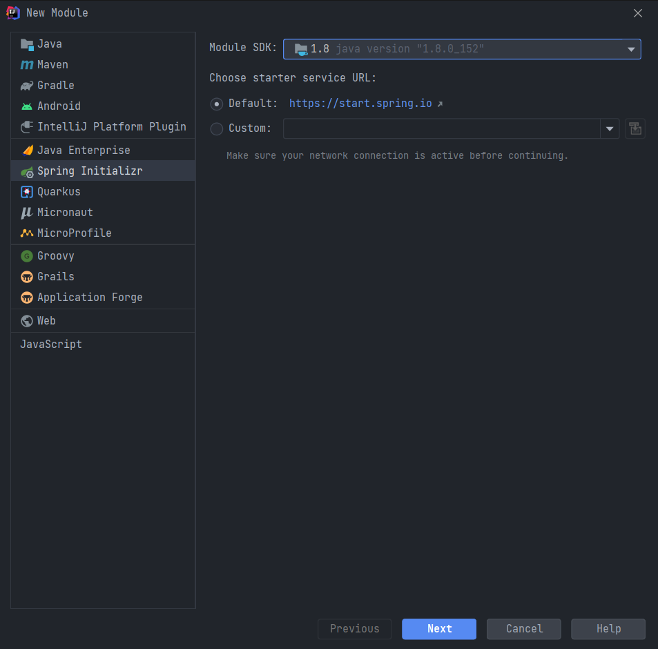

第二步：修改设置，下一步

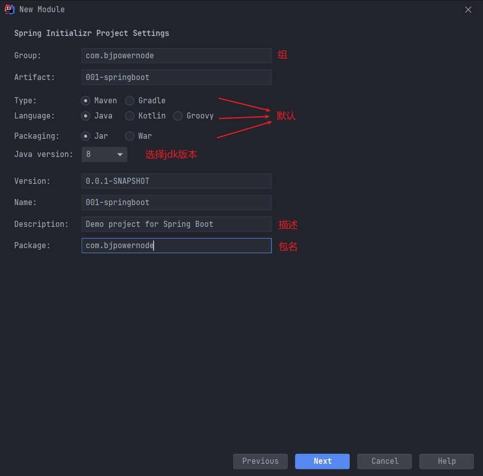

第三步：选择起步依赖

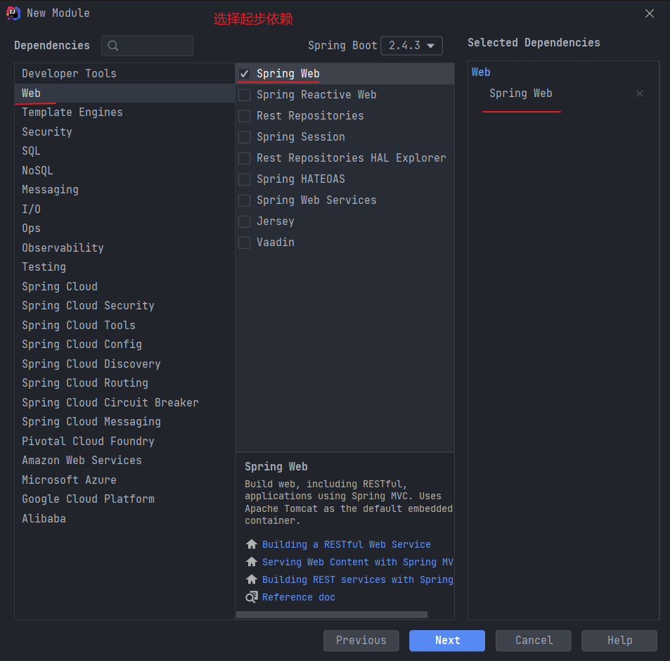

第四步：完成

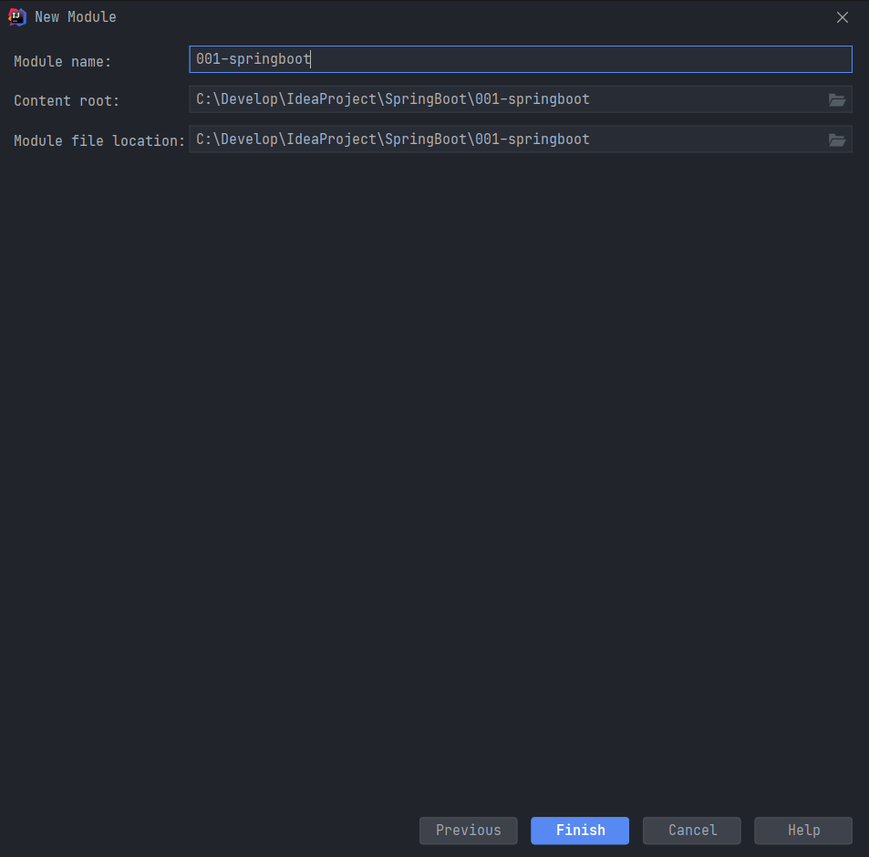

第五步：完成，项目结构如下

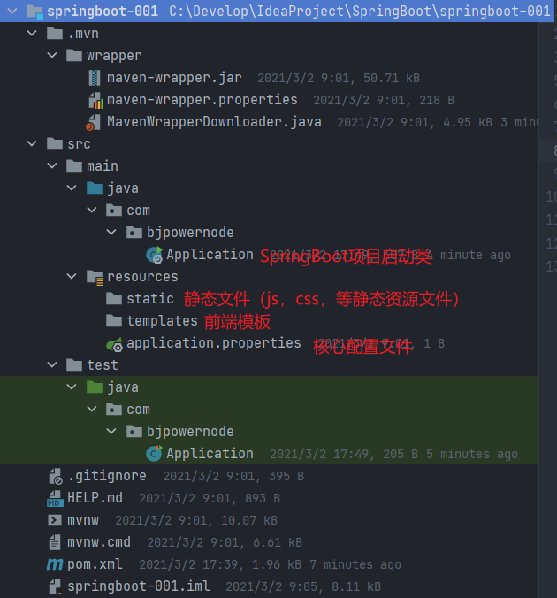

**POM.xml文件解读**

```xml
<?xml version="1.0" encoding="UTF-8"?>
<project xmlns="http://maven.apache.org/POM/4.0.0" xmlns:xsi="http://www.w3.org/2001/XMLSchema-instance"
         xsi:schemaLocation="http://maven.apache.org/POM/4.0.0 https://maven.apache.org/xsd/maven-4.0.0.xsd">

    <modelVersion>4.0.0</modelVersion>
    <!--父工程的GAV-->
    <parent>
        <groupId>org.springframework.boot</groupId>
        <artifactId>spring-boot-starter-parent</artifactId>
        <version>2.4.3</version>
        <relativePath/> <!-- lookup parent from repository -->
    </parent>

    <!--当前项目的GAV-->
    <groupId>com.bjpowernode</groupId>
    <artifactId>springboot-001</artifactId>
    <version>0.0.1-SNAPSHOT</version>

    <!--名字和描述-->
    <name>springboot-001</name>
    <description>Demo project for Spring Boot</description>

    <!--编译版本-->
    <properties>
        <java.version>1.8</java.version>
    </properties>

    <!--依赖-->
    <dependencies>

        <!--SpringBoot框架web项目起步依赖-->
        <dependency>
            <groupId>org.springframework.boot</groupId>
            <artifactId>spring-boot-starter-web</artifactId>
        </dependency>

        <!--SpringBoot框架测试起步依赖-->
        <dependency>
            <groupId>org.springframework.boot</groupId>
            <artifactId>spring-boot-starter-test</artifactId>
            <scope>test</scope>
            <exclusions>
                <exclusion>
                    <groupId>org.junit.vintage</groupId>
                    <artifactId>junit-vintage-engine</artifactId>
                </exclusion>
            </exclusions>
        </dependency>
    </dependencies>

    <build>
        <!--SpringBoot项目打包编译插件-->
        <plugins>
            <plugin>
                <groupId>org.springframework.boot</groupId>
                <artifactId>spring-boot-maven-plugin</artifactId>
            </plugin>
        </plugins>
    </build>

</project>
```


### 2.2创建一个SpringMVC的SpringBootController

第一步：创建SpringBoot项目

第二步：编写程序

> **注意：SpringBoot项目代码必须放到Application类所在的同级目录或下级目录中**

编写controller

```java
package com.bjpowernode.controller;

import org.springframework.stereotype.Controller;
import org.springframework.web.bind.annotation.RequestMapping;
import org.springframework.web.bind.annotation.ResponseBody;

@Controller
public class IndexController {
    @RequestMapping("/springboot/say")
    @ResponseBody
    public String say(){
        return "Hello SpringBoot";
    }
}

```

第三步：运行Application.java的主方法

测试：在浏览器中发起请求

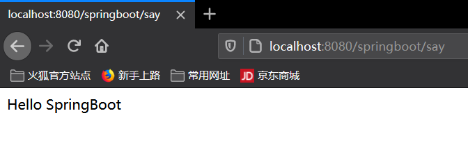

### 2.3使用SpringBoot的核心配置文件application.properties

先创建项目003

编写Controller

```java
package com.bjpowernode.controller;

import org.springframework.stereotype.Controller;
import org.springframework.web.bind.annotation.RequestMapping;
import org.springframework.web.bind.annotation.ResponseBody;

import java.util.HashMap;
import java.util.Map;

@Controller
public class IndexController {
    @RequestMapping("/say")
    @ResponseBody
    public String say(){
        return "Hello World";
    }

    @RequestMapping("/mapvalue")
    @ResponseBody
    public Map<String, Object> mapValue(){
        Map<String, Object> retMap = new HashMap<String, Object>();
        retMap.put("message", "SpringBoot Project");
        return retMap;
    }
}
```

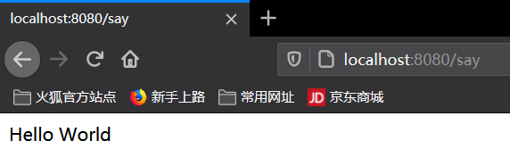

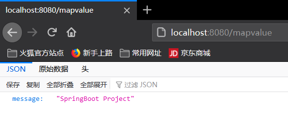

**配置核心配置文件**

```properties
#设置内嵌Tomcat端口号
server.port=9090

#设置上下文根
server.servlet.context-path=/springboot
```

再次访问请求

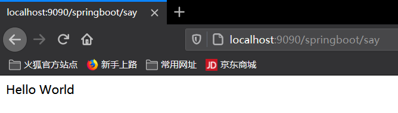

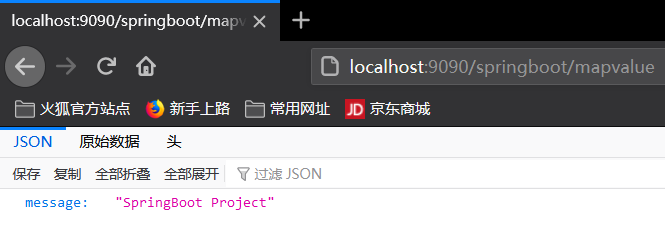

**注意：核心配置文件只能有一个！！！**


### 2.4使用SpringBoot的核心配置文件application.yml或application.yaml

第一步：创建controller

```java
package com.bjpowernode.controller;

import org.springframework.stereotype.Controller;
import org.springframework.web.bind.annotation.RequestMapping;
import org.springframework.web.bind.annotation.ResponseBody;

@Controller
public class IndexController {
    
    @RequestMapping("/say")
    @ResponseBody
    public Object say(String message){
        return "Say:Hello " + message;
    }
}

```

第二步：将application.properties文件删除，新建application.yml文件

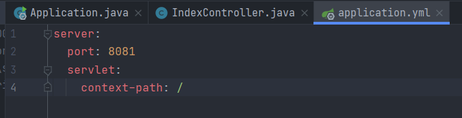

```yml
server:
  port: 8081
  servlet:
    context-path: /
```

**注意：格式必须按原生格式，不能删空格（这是字符序列化排版）**

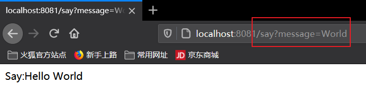

第二步：将application.yml文件删除，新建application.yaml文件

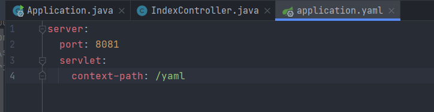

```yaml
server:
  port: 8081
  servlet:
    context-path: /yaml
```

**yaml和yml的区别：在yaml格式的文件中，可以直接打port，无需打出全名，回车自动补全**

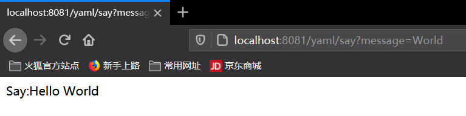


**如果application.properties、application.yml、application.yaml同时存在会出现什么情况？**

例：创建新工程，并创建出配置文件application.properties、application.yml

```java
package com.bjpowernode.controller;

import org.springframework.stereotype.Controller;
import org.springframework.web.bind.annotation.RequestMapping;
import org.springframework.web.bind.annotation.ResponseBody;

@Controller
public class IndexController {
    @RequestMapping("/say")
    @ResponseBody
    public String say(){
        return "Hello SpringBoot";
    }
}
```

application.properties

```properties
server.port=8081
server.servlet.context-path=/
```

application.yml

```yaml
server:
  port: 9090
  servlet:
    context-path: /yml
```

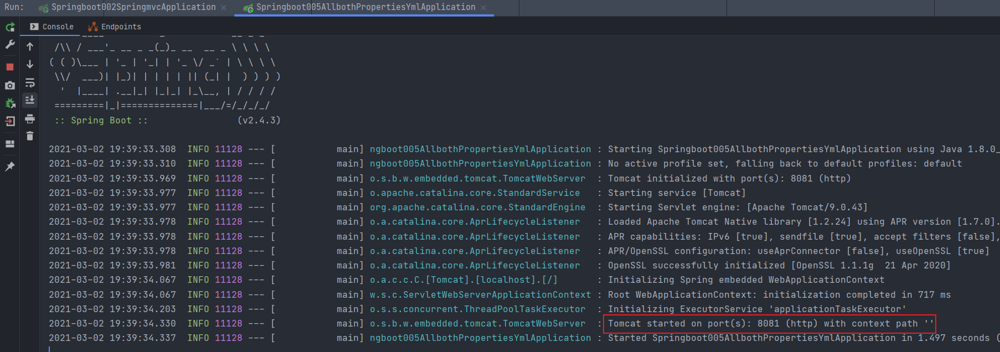

测试：

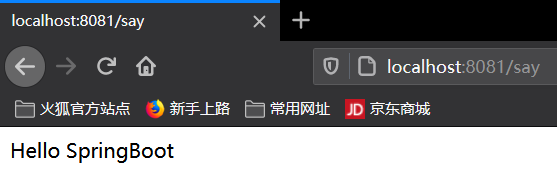

**当把application.properties删除之后，会使用application.yml的配置文件**

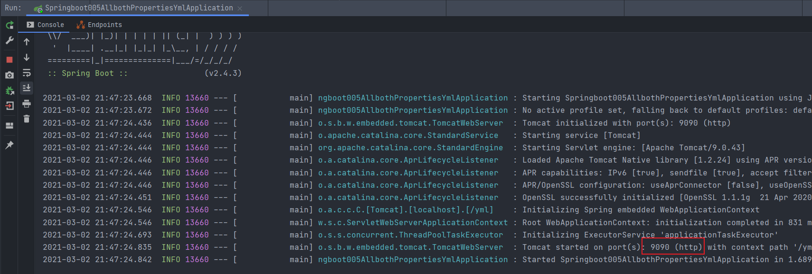

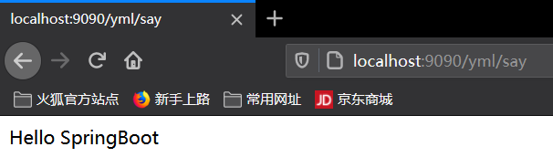

**当几种配置文件同时存在时，会优先使用后缀为properties的配置文件。**


### 2.5多环境下核心配置文件的使用

工作中，开发的环境有哪些？

- 开发环境
- 测试环境
- 准生产环境
- 生产环境

**由于在多种开发环境下的配置是不同的，为了方便在不同的环境之间切换， SpringBoot提供了多环境配置。**

**注意：配置各环境下的配置文件，但是文件命名有规则——> application-环境标识 .properties/yml**


#### 2.5.1多环境核心配置文件properties

例：先搭建环境，创建各开发环境下的配置文件

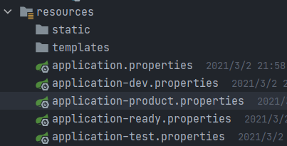

application-dev.properties

```properties
#开发环境配置文件
server.port=8080
server.servlet.context-path=/dev
```

application-test.properties

```properties
#测试环境的配置文件
server.port=8081
server.servlet.context-path=/test
```

application-ready.properties

```properties
#准生产环境配置文件
server.port=8082
server.servlet.context-path=/ready
```

application-product.properties

```properties
#生产环境配置文件
server.port=9090
server.servlet.context-path=/product
```

通过主配置文件来设置配置文件

```properties
#SpringBoot主核心配置文件
#激活使用的配置文件
#spring.profiles.active=环境标识
spring.profiles.active=dev
```

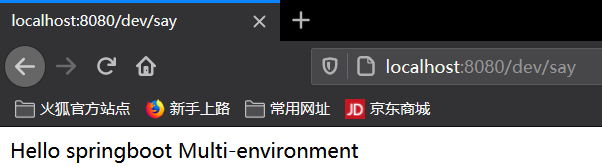

**等号右边的值和配置文件的环境标识名一致，可以通过更改总配置文件的配置，重新运行Application，查看启动的端口和上下文根。**


#### 2.5.2多环境核心配置文件yml

例：先搭建环境，创建各开发环境下的配置文件

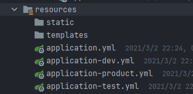

application-dev.yml

```yaml
#开发环境
server:
  port: 8080
  servlet:
    context-path: /dev
```

application-test.yml

```yaml
#测试环境
server:
  port: 8081
  servlet:
    context-path: /test
```

application-product.yml

```yaml
#生产环境
server:
  port: 9090
  servlet:
    context-path: /product
```

通过主配置文件来设置配置文件

```yaml
#主配置文件
spring:
  profiles:
    active: dev
```

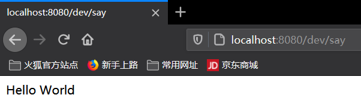

**等号右边的值和配置文件的环境标识名一致，可以通过更改总配置文件的配置，重新运行Application，查看启动的端口和上下文根。**


#### 2.5.3SpringBoot自定义配置

SprintBoot在核心配置文件applicati-on.properties中自定义配置

**第一种情况：自定义配置，一个一个获取***

例1：先创建好项目，创建controller和properties文件

```java
package com.bjpowernode.controller;

import org.springframework.stereotype.Controller;
import org.springframework.web.bind.annotation.RequestMapping;
import org.springframework.web.bind.annotation.ResponseBody;

@Controller
public class IndexController {
    @RequestMapping("/say")
    @ResponseBody
    public String say(){
        return "Hello";
    }
}
```

```properties
#设置内嵌Tomcat端口号
server.port=8080

#设置上下文根
server.servlet.context-path=/

#警告：Cannot resolve configuration property 'school.name'
school.name=bjpowernode
#警告：Cannot resolve configuration property 'websit' 
websit=http://www.bjpowernode.com
```

**那么在controller中该如何取得这两个数据呢？**

**需要用到注解@Value("${key}")**

```java
package com.bjpowernode.controller;

import org.springframework.beans.factory.annotation.Value;
import org.springframework.stereotype.Controller;
import org.springframework.web.bind.annotation.RequestMapping;
import org.springframework.web.bind.annotation.ResponseBody;

@Controller
public class IndexController {

    @Value("${school.name}")
    private String schoolName;
    
    @Value("${websit}")
    private String websit;

    @RequestMapping("/say")
    @ResponseBody
    public String say(){
        return "Hello:" + schoolName + websit;
    }
}
```

测试：

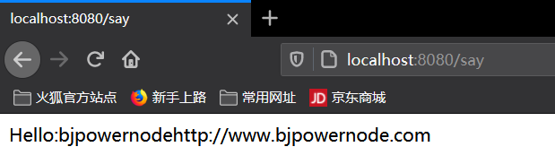

**在任何地方，只要使用这个注解，就可以拿到自定义参数的值。**


**第二种情况：自定义配置映射到一个对象**

例：先创建好项目，创建controller和properties文件

```java
package com.bjpowernode.controller;

import org.springframework.stereotype.Controller;
import org.springframework.web.bind.annotation.RequestMapping;
import org.springframework.web.bind.annotation.ResponseBody;

/**
 * @author Mr.Feng
 * @date 2021/3/3 20:15
 */
@Controller
public class IndexController {
    @RequestMapping("/say")
    @ResponseBody
    public String say(){
        return "Hello:";
    }
}
```

```properties
server.port=8080
server.servlet.context-path=/

#将这两个映射为一个对象
school.name=bjpowernode
school.websit=http://www.bjpowernode.com

#将这两个映射为一个对象
abc.name=abc
abc.websit=http://www.abc.com
```

**为了将配置文件中的配置映射成对象，需要创建映射类，并加上注解@Component和@ConfigurationProperties(prefix = "前缀名")**

```java
package com.bjpowernode.config;

import org.springframework.boot.context.properties.ConfigurationProperties;
import org.springframework.stereotype.Component;

@Component //将此类交给spring容器管理
@ConfigurationProperties(prefix = "school")
public class School {
    private String name;
    private String websit;
    // 省略getter和setter
}
```

修改controller，接收对象

```java
package com.bjpowernode.controller;

import com.bjpowernode.config.School;
import org.springframework.beans.factory.annotation.Autowired;
import org.springframework.stereotype.Controller;
import org.springframework.web.bind.annotation.RequestMapping;
import org.springframework.web.bind.annotation.ResponseBody;

@Controller
public class IndexController {
    
    @Autowired
    private School school;
    
    @RequestMapping("/say")
    @ResponseBody
    public String say(){
        return "Hello:" + school.getName() + " " + school.getWebsit();
    }
}
```

测试：

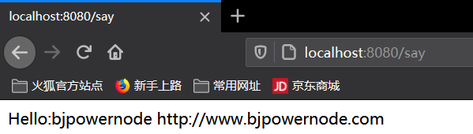

同理创建abc类，并修改controller文件

```java
package com.bjpowernode.controller;

import com.bjpowernode.config.Abc;
import com.bjpowernode.config.School;
import org.springframework.beans.factory.annotation.Autowired;
import org.springframework.stereotype.Controller;
import org.springframework.web.bind.annotation.RequestMapping;
import org.springframework.web.bind.annotation.ResponseBody;

@Controller
public class IndexController {

    @Autowired
    private School school;

    @Autowired
    private Abc abc;

    @RequestMapping("/say")
    @ResponseBody
    public String say(){
        return "Hello:" + school.getName() + " " + school.getWebsit() + " " + abc.getName() + " " + abc.getWebsit();
    }
}
```

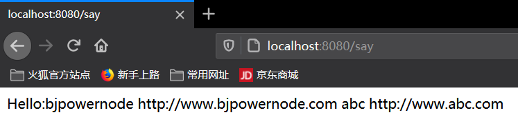

**注意：使用@ConfigurationProperties的时候，配置文件中的自定义属性必须有前缀，并且前缀名一致。**

**警告解决：**

在映射的实体类中加入@ConfigurationProperties注解的时候，IDEA会出现一个警告，但不影响程序运行：


点击Open Documentation，会打开一个网页，提示我们需要加入一个依赖，可以拷贝到pom文件中

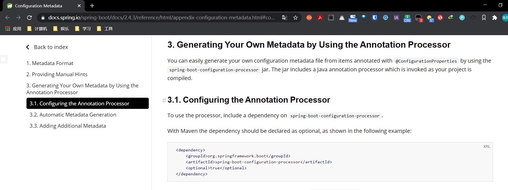

### 2.6SpringBoot前端使用JSP

创建项目，完善目录结构

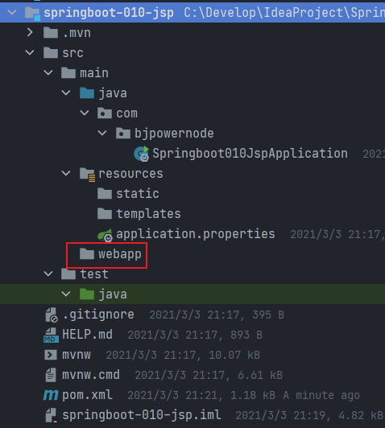

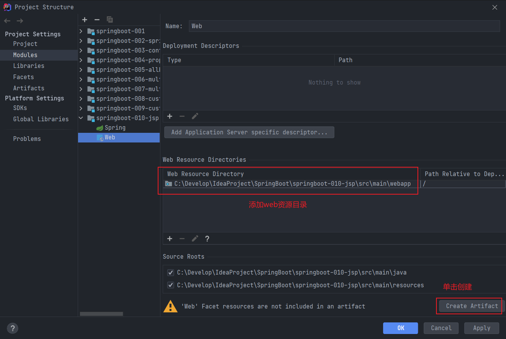

应用

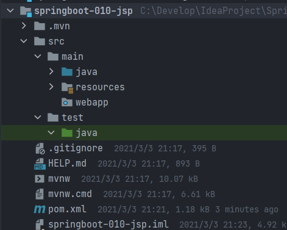

**为了展示JSP需要先解析，所以需要在POM文件中引入依赖，手动指定jsp最后编译的路径**

```xml
<?xml version="1.0" encoding="UTF-8"?>
<project xmlns="http://maven.apache.org/POM/4.0.0" xmlns:xsi="http://www.w3.org/2001/XMLSchema-instance"
         xsi:schemaLocation="http://maven.apache.org/POM/4.0.0 https://maven.apache.org/xsd/maven-4.0.0.xsd">
    <modelVersion>4.0.0</modelVersion>

    <parent>
        <groupId>org.springframework.boot</groupId>
        <artifactId>spring-boot-starter-parent</artifactId>
        <version>2.4.3</version>
        <relativePath/> <!-- lookup parent from repository -->
    </parent>

    <groupId>com.bjpowernode</groupId>
    <artifactId>springboot-010-jsp</artifactId>
    <version>0.0.1-SNAPSHOT</version>

    <properties>
        <java.version>1.8</java.version>
    </properties>

    <dependencies>

        <dependency>
            <groupId>org.springframework.boot</groupId>
            <artifactId>spring-boot-starter-web</artifactId>
        </dependency>

        <!--引入SpringBoot内嵌Tomcat对jsp的解析依赖，不添加就解析不了jsp-->
        <!--仅仅只是展示jsp页面，只添加以下一个依赖-->
        <dependency>
            <groupId>org.apache.tomcat.embed</groupId>
            <artifactId>tomcat-embed-jasper</artifactId>
        </dependency>

    </dependencies>

    <build>

        <!--
            SpringBoot项目默认推荐使用的前端引擎是thymeleaf
            现在我们要使用SpringBoot集成jsp，需要手动指定jsp最后编译的路径
            而且SpringBoot集成jsp编译jsp的路径是SpringBoot规定好的位置
            META-INF/resources
        -->
        <resources>
            <resource>
                <!--源文件夹-->
                <directory>src/main/webapp</directory>
                <!--指定编译到META-INF/resources-->
                <targetPath>META-INF/resources</targetPath>
                <!--指定源文件夹中的哪些资源要编译进去-->
                <includes>
                    <include>*.*</include>
                </includes>
            </resource>
        </resources>

        <plugins>
            <plugin>
                <groupId>org.springframework.boot</groupId>
                <artifactId>spring-boot-maven-plugin</artifactId>
            </plugin>
        </plugins>
    </build>
</project>
```

配置视图解析器

```properties
#配置视图解析器，前缀/后缀
spring.mvc.view.prefix=/
spring.mvc.view.suffix=.jsp
```

创建controller

```java
package com.bjpowernode.controller;

import org.springframework.stereotype.Controller;
import org.springframework.web.bind.annotation.RequestMapping;
import org.springframework.web.servlet.ModelAndView;

@Controller
public class IndexController {
    @RequestMapping("/say")
    public ModelAndView say(){
        ModelAndView mv = new ModelAndView();
        mv.addObject("message", "Hello World");
        mv.setViewName("say");
        return mv;
    }
}
```

创建jsp

```jsp
<%@ page contentType="text/html;charset=UTF-8" language="java" %>
<html>
<head>
    <title>Title</title>
</head>
<body>
    <h1>${message}</h1>
</body>
</html>
```

测试：

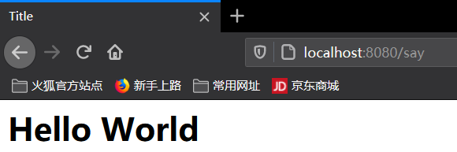


## 三、SpringBoot的Web开发

### 3.1SpringBoot集成MyBatis

需求：通过SpringBoot+Mybatis实现对数据库学生表的查询操作

准备数据库表，并准备数据

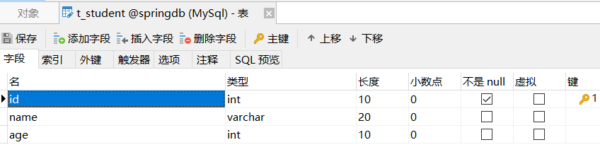

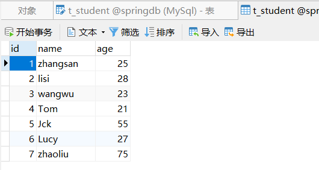

创建项目，整理pom文件，并添加依赖（需要添加mysql驱动，mybatis依赖，mybatis整合SpringBoot依赖）

```xml
<?xml version="1.0" encoding="UTF-8"?>
<project xmlns="http://maven.apache.org/POM/4.0.0" xmlns:xsi="http://www.w3.org/2001/XMLSchema-instance"
         xsi:schemaLocation="http://maven.apache.org/POM/4.0.0 https://maven.apache.org/xsd/maven-4.0.0.xsd">
    <modelVersion>4.0.0</modelVersion>
    <parent>
        <groupId>org.springframework.boot</groupId>
        <artifactId>spring-boot-starter-parent</artifactId>
        <version>2.4.3</version>
        <relativePath/> <!-- lookup parent from repository -->
    </parent>

    <groupId>com.bjpowernode</groupId>
    <artifactId>springboot-011-mybatis</artifactId>
    <version>0.0.1-SNAPSHOT</version>

    <properties>
        <java.version>1.8</java.version>
    </properties>

    <dependencies>
        <!--springboot框架Web项目起步依赖-->
        <dependency>
            <groupId>org.springframework.boot</groupId>
            <artifactId>spring-boot-starter-web</artifactId>
        </dependency>

        <!--Mysql驱动，无需指定版本号，springboot父工程中已经提供版本号，如果有需要也可以指定版本号-->
        <dependency>
            <groupId>mysql</groupId>
            <artifactId>mysql-connector-java</artifactId>
        </dependency>

        <!--Mybatis整合Springboot框架的起步依赖-->
        <dependency>
            <groupId>org.mybatis.spring.boot</groupId>
            <artifactId>mybatis-spring-boot-starter</artifactId>
            <version>2.0.0</version>
        </dependency>

    </dependencies>

    <build>
        <!--手动指定文件夹为resources-->
        <resources>
            <resource>
                <directory>src/main/java</directory>
                <includes>
                    <include>**/*.xml</include>
                </includes>
            </resource>
            <resource>
                <directory>src/main/resources</directory>
                <includes>
                    <include>**/*.properties</include>
                </includes>
            </resource>
        </resources>

        <plugins>
            <!--mybatis代码自动生成插件-->
            <plugin>
                <groupId>org.mybatis.generator</groupId>
                <artifactId>mybatis-generator-maven-plugin</artifactId>
                <version>1.3.6</version>
                <configuration>
                    <!--配置文件的位置-->
                    <configurationFile>GeneratorMapper.xml</configurationFile>
                    <verbose>true</verbose>
                    <overwrite>true</overwrite>
                </configuration>
            </plugin>

            <!--springboot项目编译打包插件-->
            <plugin>
                <groupId>org.springframework.boot</groupId>
                <artifactId>spring-boot-maven-plugin</artifactId>
            </plugin>
        </plugins>
    </build>

</project>
```

完善目录结构


#### 3.1.1Mybatis逆向工程

使用Mybatis提供的逆向工程生成实体类bean，映射文件，Dao接口

准备工作：

准备Mybatis逆向工程的配置文件（GeneratorMapper.xml）到项目的根目录下

```xml
<?xml version="1.0" encoding="UTF-8"?> <!DOCTYPE generatorConfiguration PUBLIC
        "-//mybatis.org//DTD MyBatis Generator Configuration 1.0//EN"
        "http://mybatis.org/dtd/mybatis-generator-config_1_0.dtd">
<generatorConfiguration>

    <!-- 指定连接数据库的JDBC驱动包所在位置，指定到你本机的完整路径 -->
    <classPathEntry location="C:\Develop\Maven\maven_repository_3.6.3\mysql\mysql-connector-java\8.0.23\mysql-connector-java-8.0.23.jar"/>

    <!-- 配置table表信息内容体，targetRuntime指定采用MyBatis3的版本 -->
    <context id="tables" targetRuntime="MyBatis3">

        <!-- 抑制生成注释，由于生成的注释都是英文的，可以不让它生成 -->
        <commentGenerator>
            <property name="suppressAllComments" value="true"/>
        </commentGenerator>

        <!-- 配置数据库连接信息 -->
        <jdbcConnection driverClass="com.mysql.cj.jdbc.Driver"
                        connectionURL="jdbc:mysql://localhost:3306/springdb"
                        userId="root"
                        password="12345">
        </jdbcConnection>

        <!-- 生成实体类，targetPackage指定model类的包名， targetProject指定生成的实体放在哪个工程下面-->
        <javaModelGenerator targetPackage="com.bjpowernode.entity"
                            targetProject="src/main/java">

            <property name="enableSubPackages" value="false"/>
            <property name="trimStrings" value="false"/>
        </javaModelGenerator>

        <!-- 生成MyBatis的Mapper.xml文件，targetPackage指定mapper.xml文件的包名， targetProject指定生成的mapper.xml放在哪个目录下面 -->
        <sqlMapGenerator targetPackage="com.bjpowernode.mapper"
                         targetProject="src/main/java">

            <property name="enableSubPackages" value="false"/>
        </sqlMapGenerator>

        <!-- 生成MyBatis的Mapper接口类文件,targetPackage指定Mapper接口类的包名， targetProject指定生成的Mapper接口放在哪个目录下面 -->
        <javaClientGenerator type="XMLMAPPER"
                             targetPackage="com.bjpowernode.mapper"
                             targetProject="src/main/java">

            <property name="enableSubPackages" value="false"/>
        </javaClientGenerator>

        <!-- 数据库表名及对应的Java模型类名，tableName表示数据库中的表名，domainObjectName表示实体类的名字 -->
        <table tableName="t_student"
               domainObjectName="Student"
               enableCountByExample="false"
               enableUpdateByExample="false"
               enableDeleteByExample="false"
               enableSelectByExample="false"
               selectByExampleQueryId="false"/>
    </context>
</generatorConfiguration>
```

在pom文件中添加mysql逆向工程依赖

```xml
<!--mybatis代码自动生成插件-->
<plugin>
    <groupId>org.mybatis.generator</groupId>
    <artifactId>mybatis-generator-maven-plugin</artifactId>
    <version>1.3.6</version>
    <configuration> <!--配置文件的位置-->
        <configurationFile>GeneratorMapper.xml</configurationFile>
        <verbose>true</verbose>
        <overwrite>true</overwrite>
    </configuration>
</plugin>
```

**如何生成？**

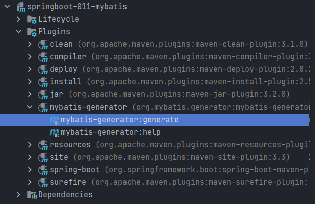

双击即可

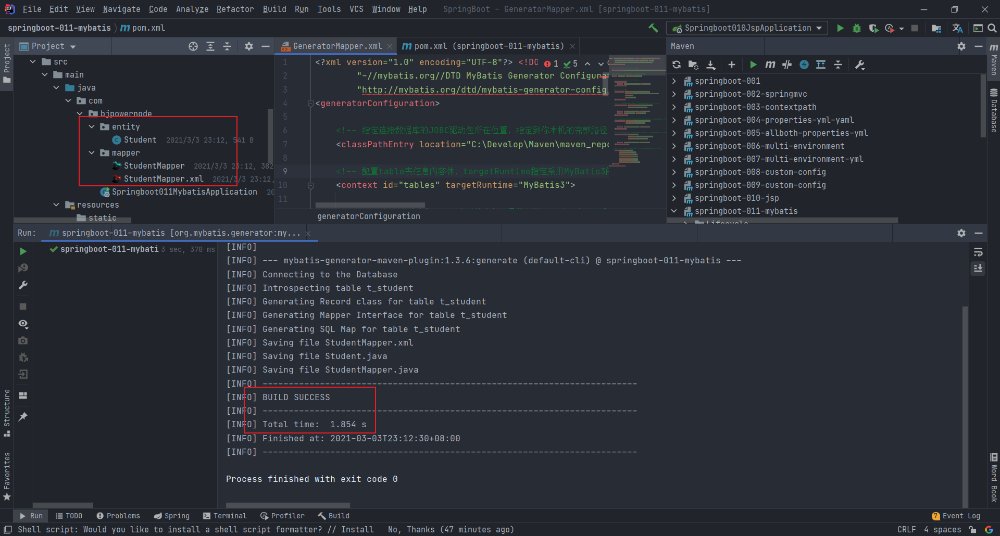

生成的mapper接口方法：

```java
package com.bjpowernode.mapper;

import com.bjpowernode.entity.Student;

public interface StudentMapper {
    // 根据主键删除记录
    int deleteByPrimaryKey(Integer id);
	// 新增记录
    int insert(Student record);
	// 选择性新增，属性可以为空
    int insertSelective(Student record);
	// 根据主键查找记录
    Student selectByPrimaryKey(Integer id);
	// 根据主键选择性修改记录，属性可以为空
    int updateByPrimaryKeySelective(Student record);
	// 根据主键修改记录
    int updateByPrimaryKey(Student record);
}
```

```xml
<?xml version="1.0" encoding="UTF-8"?>
<!DOCTYPE mapper PUBLIC "-//mybatis.org//DTD Mapper 3.0//EN" "http://mybatis.org/dtd/mybatis-3-mapper.dtd">
<mapper namespace="com.bjpowernode.mapper.StudentMapper">
  
  <resultMap id="BaseResultMap" type="com.bjpowernode.entity.Student">
    <!--
		id标签 只能修饰主键字段
		column 表示数据库中字段名称
		property 表示映射对象的属性名称
		jdbcType 表示列中数据库中字段的类型(可以省略)
	-->
    <id column="id" jdbcType="INTEGER" property="id" />
    <result column="name" jdbcType="VARCHAR" property="name" />
    <result column="age" jdbcType="INTEGER" property="age" />
  </resultMap>
  
  <sql id="Base_Column_List">
    id, name, age
  </sql>
  
  <select id="selectByPrimaryKey" parameterType="java.lang.Integer" resultMap="BaseResultMap">
    select 
    <include refid="Base_Column_List" />
    from t_student
    where id = #{id,jdbcType=INTEGER}
  </select>
  
  <delete id="deleteByPrimaryKey" parameterType="java.lang.Integer">
    delete from t_student
    where id = #{id,jdbcType=INTEGER}
  </delete>
  
  <insert id="insert" parameterType="com.bjpowernode.entity.Student">
    insert into t_student (id, name, age
      )
    values (#{id,jdbcType=INTEGER}, #{name,jdbcType=VARCHAR}, #{age,jdbcType=INTEGER}
      )
  </insert>
  
  <insert id="insertSelective" parameterType="com.bjpowernode.entity.Student">
    insert into t_student
    <!-- trim拼接标签，添加前缀后缀并去除最后多余的逗号 -->
    <trim prefix="(" suffix=")" suffixOverrides=",">
      <if test="id != null">
        id,
      </if>
      <if test="name != null">
        name,
      </if>
      <if test="age != null">
        age,
      </if>
    </trim>
    <trim prefix="values (" suffix=")" suffixOverrides=",">
      <if test="id != null">
        #{id,jdbcType=INTEGER},
      </if>
      <if test="name != null">
        #{name,jdbcType=VARCHAR},
      </if>
      <if test="age != null">
        #{age,jdbcType=INTEGER},
      </if>
    </trim>
  </insert>
  
  <update id="updateByPrimaryKeySelective" parameterType="com.bjpowernode.entity.Student">
    update t_student
    <set>
      <if test="name != null">
        name = #{name,jdbcType=VARCHAR},
      </if>
      <if test="age != null">
        age = #{age,jdbcType=INTEGER},
      </if>
    </set>
    where id = #{id,jdbcType=INTEGER}
  </update>
  
  <update id="updateByPrimaryKey" parameterType="com.bjpowernode.entity.Student">
    update t_student
    set name = #{name,jdbcType=VARCHAR},
      age = #{age,jdbcType=INTEGER}
    where id = #{id,jdbcType=INTEGER}
  </update>
  
</mapper>
```

**如果数据库中字段名称由多个单词构成，通过MyBatis逆向工程生成的对象属性名称会按照驼峰命名法生成。**

**其中：数据库中字段名称由多个单词构成时必须使用"_"分隔，例如："user_name"---->"userName"**

#### 3.1.2实现查找学生信息功能

创建controller类和service类

```java
@Controller
public class StudentController {
    @Resource
    private StudentService studentService;

    @RequestMapping("/student")
    @ResponseBody
    public Object student(Integer id){
        Student student = studentService.queryStudentById(id);
        return student;
    }
}
```

```java
@Service
public class StudentServiceImpl implements StudentService {

    @Autowired
    private StudentMapper studentMapper;

    @Override
    public Student queryStudentById(Integer id) {
        return studentMapper.selectByPrimaryKey(id);
    }
}
```

需要为mapper接口类中加入注解，扫描dao接口到spring容器

```java
@Mapper
public interface StudentMapper {
    int deleteByPrimaryKey(Integer id);

    int insert(Student record);

    int insertSelective(Student record);

    Student selectByPrimaryKey(Integer id);

    int updateByPrimaryKeySelective(Student record);

    int updateByPrimaryKey(Student record);
}
```

配置数据库连接

application.properties

```properties
#设置连接数据库配置
spring.datasource.driverClassName=com.mysql.cj.jdbc.Driver
spring.datasource.url=jdbc:mysql://localhost:3306/springdb?serverTimezone=UTC&serverTimezone=Asia/Shanghai
spring.datasource.username=root
spring.datasource.password=12345
```

运行：

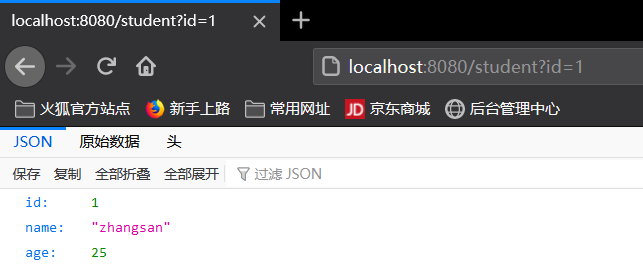

如果有多个Mapper文件，为了简化@Mapper注解，可以在入口函数上加入@MapperScan(basePackages = "Mapper文件路径")来扫描整个包下的Mapper文件

```java
// 开启spring配置
@SpringBootApplication
// 扫描com.bjpowernode.mapper包以及子包下的所有Mapper接口
@MapperScan(basePackages = "com.bjpowernode.mapper")
public class Springboot012Mybatis2Application {

    public static void main(String[] args) {
        SpringApplication.run(Springboot012Mybatis2Application.class, args);
    }
}
```

