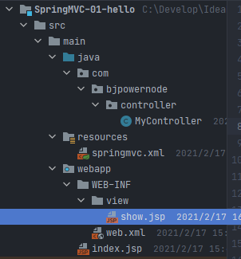
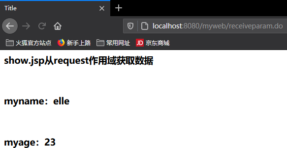
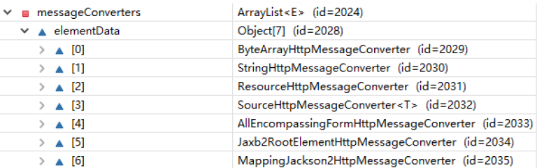
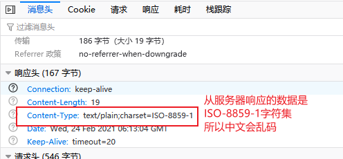
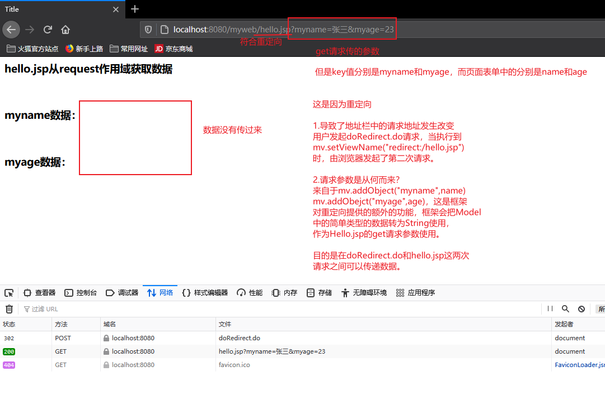
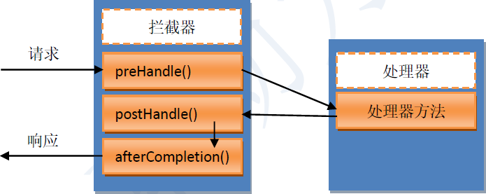

# SpringMVC框架

## 一、SpringMVC概述


### 1.1SpringMVC简介

- Spring web mvc，是Spring的一个框架，实际上是Spring的一个模块。专门做web开发的，可以理解成是servlet的一个升级。
- web开发底层是servlet，框架是在servlet基础上加入一些功能，让你做web开发方便。
- SpringMVC就是一个Spring，Spring是容器，ioc能够管理对象，使用< bean >，@Component，@Repository，@Service，@Controller
- SpringMVC能够创建对象，放入到容器中（SpringMVC容器），SpringMVC容器中放的是控制器对象**（使用@Controller注解创建控制器对象，把对象放入到SpringMVC容器中，把创建的对象作为控制器使用，这个控制器对象能够接收用户的请求，显示处理结果，当作一个servlet使用。）**
- **注意：使用@Controller注解创建的对象就是普通的类对象，不是Servlet。**SpringMVC赋予了控制器对象一些额外的功能。


> SpringMVC如何完成web开发的功能？
>
> web开发底层是servlet，springMVC中有一个对象是Servlet，叫DispatcherServlet（中央调度器）
>
> - DispatcherServlet：负责接收用户的所有请求，用户把请求给了DispatcherServlet，之后DispatcherServlet再把请求转发给我们的@Controller对象，最后是@Controller对象处理请求。
>
> index.jsp-----------> DispatcherServlet（Servlet）-------------> 转发/分配给 ------------> Controller对象（@Controller注解创建的对象）


### 1.2第一个SpringMVC程序

用户在页面发起一个请求，请求交给SpringMVC的控制器对象并显示请求的处理结果。

> 实现步骤：
>
> 1. 新建web Maven工程
>
> 2. 加入依赖
>
>    spring-webmvc依赖，间接把spring的依赖加入到项目
>
>    jsp，servlet依赖
>
> 3. 重点：在web.xml中注册springmvc框架的核心对象：DispatcherServlet
>
>    1. DispatcherServlet叫做中央调度器，是一个Servlet，它的父类是继承HttpServlet
>    2. DispatcherServlet也叫做前端控制器（front controller）
>    3. DispatcherServlet负责接收用户提交的请求，调用其它的控制器对象，并把请求的处理结果显示给用户
>
> 4. 创建一个发起请求的页面，index.jsp
>
> 5. 创建一个控制器类
>
>    1. 在类的上面加入@Controller注解，创建对象，并放入到SpringMVC容器中
>    2. 在类中的方法上加入@RequestMapping注解
>
> 6. 创建一个作为结果的jsp，显示请求的处理结果
>
> 7. 创建SpringMVC的配置文件（Spring的配置文件一样）
>
>    1. 声明组件扫描器，指定@Controller注解所在的包名
>    2. 声明视图解析器，帮助处理视图

第一步：新建maven工程

第二步：添加依赖

```xml
<?xml version="1.0" encoding="UTF-8"?>

<project xmlns="http://maven.apache.org/POM/4.0.0" xmlns:xsi="http://www.w3.org/2001/XMLSchema-instance"
  xsi:schemaLocation="http://maven.apache.org/POM/4.0.0 http://maven.apache.org/xsd/maven-4.0.0.xsd">
  <modelVersion>4.0.0</modelVersion>

  <groupId>com.bjpowernode</groupId>
  <artifactId>SpringMVC-01-hello</artifactId>
  <version>1.0-SNAPSHOT</version>
  <packaging>war</packaging>

  <properties>
    <project.build.sourceEncoding>UTF-8</project.build.sourceEncoding>
    <maven.compiler.source>1.8</maven.compiler.source>
    <maven.compiler.target>1.8</maven.compiler.target>
  </properties>

  <dependencies>
    <!--junit-->
    <dependency>
      <groupId>junit</groupId>
      <artifactId>junit</artifactId>
      <version>4.11</version>
      <scope>test</scope>
    </dependency>
    <!--servlet-->
    <dependency>
      <groupId>javax.servlet</groupId>
      <artifactId>javax.servlet-api</artifactId>
      <version>3.1.0</version>
      <scope>provided</scope>
    </dependency>
    <!--springMVC-->
    <dependency>
      <groupId>org.springframework</groupId>
      <artifactId>spring-webmvc</artifactId>
      <version>5.2.5.RELEASE</version>
    </dependency>
  </dependencies>

  <build>
    <plugins>
      <!-- 编码和编译和JDK版本 -->
      <plugin>
        <artifactId>maven-compiler-plugin</artifactId>
        <version>3.1</version>
        <configuration>
          <source>1.8</source>
          <target>1.8</target>
        </configuration>
      </plugin>
    </plugins>
  </build>
</project>

```

第三步：在web.xml中注册DispatcherServlet

> ```xml
> 注册springMVC的核心对象DispatcherServlet
> 需要在tomcat服务器启动后，创建DispatcherServlet对象的实例
> 为什么要创建DispatcherServlet对象的实例？
> 因为DispatcherServlet在他的创建过程中，会同时创建springmvc容器对象
> 读取springmvc的配置文件，把这个配置文件中的对象都创建好，当用户发起请求时就可以直接使用对象了。
> 
> servlet的初始化会执行init()方法，DispatcherServlet在init()中的{
>     // 创建容器，读取配置文件
>     WebApplicationContext ctx = new ClassPathXmlApplicationContext("springmvc.xml");
>     // 把容器对象放入到ServletContext中
>     getServletContext().setAttribute(key, ctx);
> }
> ```

```xml
<?xml version="1.0" encoding="UTF-8"?>
<web-app xmlns="http://xmlns.jcp.org/xml/ns/javaee"
         xmlns:xsi="http://www.w3.org/2001/XMLSchema-instance"
         xsi:schemaLocation="http://xmlns.jcp.org/xml/ns/javaee http://xmlns.jcp.org/xml/ns/javaee/web-app_4_0.xsd"
         version="4.0">
    <!--
        启动tomcat后报错：java.io.FileNotFoundException: Could not open ServletContext resource [/WEB-INF/springmvc-servlet.xml]
        springmvc创建容器对象时，读取的配置文件【默认是】：/WEB-INF/<servlet-name>-servlet.xml
    -->
    <servlet>
        <servlet-name>springmvc</servlet-name>
        <servlet-class>org.springframework.web.servlet.DispatcherServlet</servlet-class>

        <!--可以自定义springmvc读取的配置文件的位置-->
        <init-param>
            <!--springmvc的配置文件的位置的属性-->
            <param-name>contextConfigLocation</param-name>
            <!--指定自定义文件的位置-->
            <param-value>classpath:springmvc.xml</param-value>
        </init-param>

        <!--
            在tomcat启动后，创建Servlet对象
            load-on-startup:表示tomcat启动后创建对象的顺序。它的值是一个大于等于0的整数，数值越小，tomcat创建对象的时间越早
        -->
        <load-on-startup>1</load-on-startup>
    </servlet>

    <servlet-mapping>
        <servlet-name>springmvc</servlet-name>
        <!--
            使用框架时，url-pattern可以有两种值
            1.使用扩展名方式，语法：*.xxx (xxx是自定义的扩展名，常用的：*.do、*.action、*.mvc等等)
            2.使用斜杠"/"
        -->
        <url-pattern>*.do</url-pattern>
    </servlet-mapping>
</web-app>
```

第四步：创建一个发起请求的页面，index.jsp

```jsp
<%@ page contentType="text/html;charset=UTF-8" language="java" %>
<html>
<head>
    <title>Title</title>
</head>
<body>
    <p><a href="some.do">发起some.do的请求</a></p>
</body>
</html>
```

第五步：创建一个控制器类

```java
package com.bjpowernode.controller;

import org.springframework.stereotype.Controller;
import org.springframework.web.bind.annotation.RequestMapping;
import org.springframework.web.servlet.ModelAndView;

/*
	能处理请求的都是控制器（处理器）：MyController能处理请求，叫后端控制器（back controller）
*/
@Controller
public class MyController {
    /*
        处理用户提交的请求，springmvc中是使用方法来处理的。
        方法是自定义的，可以有多种返回值，多种参数，方法名称自定义
    */

    /**
     * 准备使用doSome方法处理some.do请求
     * @RequestMapping(请求映射)：作用是把一个请求地址和一个方法绑定在一起。
     *                          一个请求指定一个方法处理。
     *          属性：1.value是一个String，表示请求的uri地址的（some.do）。
     *               2.value的值必须是唯一的，不能重复，在使用时，推荐地址以"/"为开头
     *          位置：1.在方法上面，常用
     *               2.在类的上面
     *          说明：使用RequestMapping修饰的方法叫做处理器方法或者控制器方法
     *               使用@RequestMapping修饰的方法可以处理请求，类似于Servlet中的doGet/doPost
     *
     * 返回值：ModelAndView：表示本次请求的处理数据
     *       Model：数据，请求处理完成后，要显示给用户的数据
     *       View：视图，比如jsp等等
     */
    // 可以有多个请求@RequestMapping(value = {"/some.do", "/first.do"})
    @RequestMapping(value = "/some.do")
    public ModelAndView doSome(){  // doGet()------>service请求处理
        // 处理some.do请求，相当于service调用处理完成了。
        ModelAndView mv = new ModelAndView();
        // 添加数据，框架在请求的最后部分把数据放到request作用域。
        // request.setAttribute("msg", "欢迎使用mvc");
        mv.addObject("msg", "欢迎使用mvc");
        mv.addObject("fun", "执行的是doSome方法");

        // 执行视图，指定视图的完整路径
        // 框架对视图执行的forward操作，request.getRequestDispatcher("/show.jsp").forward(...)
        
        // 没配置视图解析器前
        // mv.setViewName("/WEB-INF/view/show.jsp");
        // 配置了视图解析器后，可以使用逻辑名称（文件名），指定视图
        // 框架会使用视图解析器的前缀 + 逻辑名称 + 后缀 组成完成路径，这里就是字符串连接操作 /WEB-INF/view/ + show + .jsp
        mv.setViewName("show");

        // 返回mv
        return mv;
    }
}
```

第六步：创建一个作为结果的jsp，显示请求的处理结果

```jsp
<%@ page contentType="text/html;charset=UTF-8" language="java" %>
<html>
<head>
    <title>Title</title>
</head>
<body>
    <h3>show.jsp从request作用域获取数据</h3>
    <br/>
    <h3>msg数据：${msg}</h3><br/>
    <h3>fun数据：${fun}</h3>
</body>
</html>
```

第七步：创建SpringMVC的配置文件

```xml
<?xml version="1.0" encoding="UTF-8"?>
<beans xmlns="http://www.springframework.org/schema/beans"
       xmlns:xsi="http://www.w3.org/2001/XMLSchema-instance"
       xmlns:context="http://www.springframework.org/schema/context"
       xsi:schemaLocation="http://www.springframework.org/schema/beans http://www.springframework.org/schema/beans/spring-beans.xsd http://www.springframework.org/schema/context https://www.springframework.org/schema/context/spring-context.xsd">
	<!-- 声明组件扫描器 -->
    <context:component-scan base-package="com.bjpowernode.controller" />
    <!-- 声明视图解析器，帮助处理视图，帮助开发人员设置视图文件路径 -->
    <!--
		为什么要声明视图解析器，如果用户直接访问show.jsp是可以访问的，但是没有内容。
		为了防止这种情况发生，可以将jsp文件放到/WEB-INF文件夹中，由于/WEB-INF中的内容对用户是不开放的，用户无法访问
	-->
    <bean class="org.springframework.web.servlet.view.InternalResourceViewResolver">
        <!--前缀：视图文件的路径-->
        <property name="prefix" value="/WEB-INF/view/"/>
        <!--后缀：视图文件的扩展名-->
        <property name="suffix" value=".jsp" />
    </bean>
</beans>
```



运行：


### 1.3SpringMVC的MVC组件


### 1.4SpringMVC请求处理过程

> 
>
> 1. 发起some.do请求
> 2. tomcat（web.xml中url-pattern知道*.do的请求是给DispatcherServlet的）
> 3. DispatcherServlet（根据springmvc.xml配置知道some.do----> doSome()方法）
> 4. DispatcherServlet把some.do转发给MyController.doSome()方法
> 5. 框架执行doSome()把得到的ModelAndView进行处理，转发到show.jsp


#### 1.4.1SpringMVC执行过程源代码分析

> 1. tomcat启动，创建容器的过程
>
>    通过load-on-start标签指定的1，创建DispatcherServlet对象，DispatcherServlet的父类是继承HttpServlet的，它是一个Servlet，在被创建时，会执行init()方法。
>
>    
>
>    在init()方法中
>
>    ```xml
>    // 创建容器，读取配置文件
>    WebApplicationContext ctx = new ClassPathXmlApplicationContext("springmvc.xml");
>    // 把容器对象放入到ServletContext中
>    getServletContext().setAttribute(key, ctx);
>    ```
>
>    上面创建容器的作用：
>
>    创建@Controller注解所在的类的对象，创建MyController对象，这个对象放入到springmvc的容器中，容器是map，类似map.put("myController",MyController对象)
>
>    
>
> 2. 请求的处理过程
>
>    1. 执行servlet的service()方法
>
>       ```java
>       protected void service(HttpServletRequest request, HttpServletResponse response)
>       ```
>
>       ```java
>       protected abstract void doService(HttpServletRequest request, HttpServletResponse response)
>       ```
>
>       ```java
>       protected void doDispatch(HttpServletRequest request, HttpServletResponse response){
>           //调用MyController的.doSome()方法
>       }
>       ```
>
>       


### 1.5SpringMVC执行流程（理解）

流程图：


> 1. 浏览器提交请求（some.do）到中央调度器（DispatcherServlet）
> 2. 中央调度器直接将请求（some.do）转发给【处理器映射器】
>    - 处理器映射器：框架把实现了HandlerMapping接口的类都叫做映射器（多个）
>    - 作用：根据请求，从SpringMVC容器对象中获取处理器对象
> 3. 处理器映射器会根据请求，找到处理该请求的处理器，并将其封装为【处理器执行链】后返回给中央调度器
>    - 处理器执行链（HandlerExecutionChain）：类中保存着1.处理器对象（MyController）2.项目中所有的拦截器（List< HandlerInterceptor > interceptorList）
>    - 【方法调用：mappedHandler = this.getHandler(processedRequest);】
> 4. 中央调度器根据处理器执行链中的处理器，找到能够执行该处理器的【处理器适配器】
>    - 处理器适配器：SpringMVC框架中的对象，需要实现HandlerAdapter接口
>    - 作用：执行处理器方法（调用MyController.doSome()方法得到返回值ModelAndView）
>    - 【（中央调度器中调用适配器）方法调用：HandlerAdapter ha = this.getHandlerAdapter(mappedHandler.getHandler());】
> 5. 处理器适配器调用执行处理器
>    - 【（执行处理器方法）方法调用：mv = ha.handle(processedRequest, response, mappedHandler.getHandler());】
> 6. 处理器将处理结果以及要跳转的视图封装到一个对象ModelAndView中，并将其返回给处理器适配器
> 7. 处理器适配器直接将结果返回给中央调度器
> 8. 中央调度器调用【视图解析器】，将ModelAndView中的视图名称封装为视图对象
>    - 视图解析器：SpringMVC框架中的对象，需要实现ViewResolver接口（可以有多个）
>    - 作用：组成视图完整路径，使用前缀和后缀，并创建一个View对象（一个接口，用来表示视图，在框架中jsp，html不是String表示，而是使用View和它的实现类表示视图）
> 9. 视图解析器将封装了的视图对象返回给中央调度器
> 10. 中央调度器调用视图对象，让其自己进行渲染，即进行数据填充，形成响应对象
> 11. 中央调度器响应浏览器


## 二、SpringMVC注解式开发

### 2.1@RequestMapping定义请求规则


#### 2.1.1指定模块名称

> 通过@RequestMapping注解可以定义处理器对于请求的映射规则。**该注解可以注解在方法上或者类上，其意义不同。**
>
> - 一个@Controller所注解的类中，可以定义多个处理器方法。
> - 不同的处理器方法所匹配的URI是不同的，这些**不同的URI通过方法上的@RequestMapping的value属性指定。**
> - **但如果这些请求具有相同的URI部分，则这些相同的URI可以被抽取到注解在类上的@RequestMapping的value属性中。**
> - 也就是说要访问处理器的指定方法，必须要在方法指定URI之前加上处理器类前定义的模块名称。

修改上边代码：

例：要访问两个方法，他们的URI分别是"/test/some.do"，"/test/other.do"

MyController.java:

```java
// 常规方式---------------------------------------------
/*
    @RequestMapping(value = "/test/some.do")
    public ModelAndView doSome(){  // doGet()------>service请求处理
        ModelAndView mv = new ModelAndView();
        mv.addObject("msg", "欢迎使用mvc");
        mv.addObject("fun", "执行的是doSome方法");
        mv.setViewName("show");
        return mv;
    }

    @RequestMapping(value = "/test/other.do")
    public ModelAndView doOther(){  // doGet()------>service请求处理
        ModelAndView mv = new ModelAndView();
        mv.addObject("msg", "欢迎使用mvc");
        mv.addObject("fun", "执行的是doOther方法");
        mv.setViewName("show");
        return mv;
    }
*/

// 使用类注解的方式------------------------------------------
@Controller
/**
 * @RequestMapping
 *      value:所有请求地址的公共部分，叫做模块名称
 *      位置：放在类的上面
 */
@RequestMapping(value = "/test")
public class MyController {

    @RequestMapping(value = "/some.do")
    public ModelAndView doSome(){  // doGet()------>service请求处理
        ModelAndView mv = new ModelAndView();
        mv.addObject("msg", "欢迎使用mvc");
        mv.addObject("fun", "执行的是doSome方法");
        mv.setViewName("show");
        return mv;
    }

    @RequestMapping(value = "/other.do")
    public ModelAndView doOther(){  // doGet()------>service请求处理
        ModelAndView mv = new ModelAndView();
        mv.addObject("msg", "欢迎使用mvc");
        mv.addObject("fun", "执行的是doOther方法");
        mv.setViewName("show");
        return mv;
    }
}

```


#### 2.1.2对请求提交方式的定义

> 在@RequestMapping中，有一个属性method，用来对被注解的方法所处理请求的提交方式进行限制，**即只有满足method属性指定的提交方式的请求，才会执行该被注解的方法。**
>
> method属性的值：RequestMethod枚举常量，常用的如下
>
> - RequestMethod.GET：get提交
> - RequestMethod.POST：post提交
>
> 客户端浏览器常用的请求方式如下：
>
> 
>
> **注意：如果不指定method属性，那么无论是get还是post，均可匹配。**

修改以上代码：

例：指定some.do为get请求方式，other.do为post请求方式：

```java
@Controller

@RequestMapping(value = "/test")
public class MyController {

    /**
     * @RequestMapping：请求映射
     *      属性：method，表示请求的方式。它的值是RequestMethod类枚举值
     *      例如：RequestMethod.GET表示get请求方式
     *           RequestMethod.POST表示post请求方式
     */
    @RequestMapping(value = "/some.do",method = RequestMethod.GET)
    public ModelAndView doSome(){  // doGet()------>service请求处理
        ModelAndView mv = new ModelAndView();
        mv.addObject("msg", "欢迎使用mvc");
        mv.addObject("fun", "执行的是doSome方法");
        mv.setViewName("show");
        return mv;
    }

    @RequestMapping(value = "/other.do", method = RequestMethod.POST)
    public ModelAndView doOther(){  // doGet()------>service请求处理
        ModelAndView mv = new ModelAndView();
        mv.addObject("msg", "欢迎使用mvc");
        mv.addObject("fun", "执行的是doOther方法");
        mv.setViewName("show");
        return mv;
    }
}

```

修改jsp页面

```jsp
<%@ page contentType="text/html;charset=UTF-8" language="java" %>
<html>
<head>
    <title>Title</title>
</head>
<body>
    <p><a href="test/some.do">发起some.do的get请求</a></p>
    <br/>
    <form action="test/other.do" method="post">
        <input type="submit" value="post请求other.do" />
    </form>
</body>
</html>
```


如果通过get方式去访问post请求会如何？


### 2.2处理器方法的参数

用户在提交请求时，必然会提交一些参数，那么如何接收用户提交请求的参数呢？

> 处理器方法包含以下四类参数，**这些参数会在系统调用时由系统自动赋值，即开发人员可以在方法内直接使用。**
>
> - HttpServletRequest
> - HttpServletResponse
> - HttpSession
> - 请求中所携带的请求参数
>
> 例如：
>
> ```java
> // 这些参数默认放在处理器方法的形参位置，使用哪个定义哪个，由系统调用时自动赋值
> @RequestMapping(value = "/some.do",method = RequestMethod.GET)
> public ModelAndView doSome(HttpServletRequest request, HttpServletResponse response, HttpSession session){
>     ModelAndView mv = new ModelAndView();
>     mv.addObject("msg", "欢迎使用mvc" + request.getParameter("name"));
>     mv.addObject("fun", "执行的是doSome方法");
>     mv.setViewName("show");
>     return mv;
> }
> ```
>
> 测试：带参数访问some.do请求
>
> 

如何获取请求中所携带的请求参数？

1. 逐个接收
2. 对象接收


#### 2.2.1逐个参数接收

> **要求：处理器方法的形参名和请求中参数名必须一致**
>
> 框架接收请求参数：
>
> 1. 使用request对象接收请求参数
>
>    String strName = request.getParameter("name");
>
>    String strAge = request.getParameter("age");
>
> 2. springmvc框架通过中央调度器DispatcherServlet调用MyController的doSome()方法，调用方法时，按名称对应，把接收的参数赋值给形参
>
>    doSome(strName, Integer.valueOf(strAge))
>
>    框架会提供类型转换的功能，能够把String字符串转为int，long，float，double等类型

例：

修改controller

```java
@Controller
public class MyController {
    /**
     * 逐个接收请求参数：
     *      要求：处理器方法的形参名和请求中参数名必须一致
     *      同名的请求参数赋值给同名的形参
     */
    @RequestMapping(value = "/receiveparam.do")
    public ModelAndView doSome(String name, int age){  // doGet()------>service请求处理
        ModelAndView mv = new ModelAndView();
        mv.addObject("myname", name);
        mv.addObject("myage", age);
        mv.setViewName("show");
        return mv;
    }
}
```

修改jsp

```jsp
<%@ page contentType="text/html;charset=UTF-8" language="java" %>
<html>
<head>
    <title>Title</title>
</head>
<body>
    <form action="receiveparam.do" method="post">
        姓名：<input type="text" name="name" /><br/>
        年龄：<input type="text" name="age" /><br/>
        <input type="submit" value="提交参数" />
    </form>
</body>
</html>
```

显示结果的jsp

```jsp
<%@ page contentType="text/html;charset=UTF-8" language="java" %>
<html>
<head>
    <title>Title</title>
</head>
<body>
    <h3>show.jsp从request作用域获取数据</h3>
    <br/>
    <h3>myname：${myname}</h3><br/>
    <h3>myage：${myage}</h3>
</body>
</html>
```

测试结果：





**注意：如果age不写，会怎么样？**

由于不写age，传到处理器方法中是一个空的字符串，通过valueOf转换，会出现错误，此时会报400状态码（客户端错误，表示提交请求参数过程中，发生了问题）

在spring的日志中，会抛出一个异常

```
19-Feb-2021 21:29:59.614 警告 
[http-nio-8080-exec-10] org.springframework.web.servlet.handler.AbstractHandlerExceptionResolver.logException Resolved 
// 方法参数类型不匹配异常
[org.springframework.web.method.annotation.MethodArgumentTypeMismatchException:  
// 字符串转换类型需要一个int类型，类型转换失败
Failed to convert value of type 'java.lang.String' to required type 'int'; 
nested exception is java.lang.NumberFormatException: For input string: ""]
```


**如何解决这个问题？**

可以换成Integer类型来接收，这样即使为空，也可以接收。但是这样做，如果输入的是汉字或者字母，依然会出错。


#### 2.2.2请求参数中文乱码问题

**当使用get方式提交表单时，默认使用UTF-8字符集，不会乱码。但如果使用post方式提交表单，默认使用ISO-8859-1字符集，会导致中文乱码，该如何解决乱码问题？**

可以使用过滤器来处理乱码问题，可以自定义，也可以使用框架中提供的过滤器（CharacterEncodingFilter）


**解决：在web.xml中注册声明过滤器**

```xml
<!--注册声明过滤器，解决post请求乱码问题-->
<filter>
    <filter-name>characterEncodingFilter</filter-name>
    <filter-class>org.springframework.web.filter.CharacterEncodingFilter</filter-class>
    <!--设置项目中使用的字符编码-->
    <init-param>
        <param-name>encoding</param-name>
        <param-value>utf-8</param-value>
    </init-param>
    <!--强制请求对象（HttpServletRequest）使用encoding编码的值-->
    <init-param>
        <param-name>forceRequestEncoding</param-name>
        <param-value>true</param-value>
    </init-param>
    <!--强制应答对象（HttpServletResponse）使用encoding编码的值-->
    <init-param>
        <param-name>forceResponseEncoding</param-name>
        <param-value>true</param-value>
    </init-param>
</filter>
<filter-mapping>
    <filter-name>characterEncodingFilter</filter-name>
    <!--
       /*:表示强制所有的请求先通过过滤器处理
    -->
    <url-pattern>/*</url-pattern>
</filter-mapping>
```


源代码中执行了这个方法设置了编码方式：

```java
protected void doFilterInternal(HttpServletRequest request, HttpServletResponse response, FilterChain filterChain) throws ServletException, IOException {
    String encoding = this.getEncoding();
    if (encoding != null) {
        if (this.isForceRequestEncoding() || request.getCharacterEncoding() == null) {
            request.setCharacterEncoding(encoding);
        }

        if (this.isForceResponseEncoding()) {
            response.setCharacterEncoding(encoding);
        }
    }
    filterChain.doFilter(request, response);
}
```


#### 2.2.3逐个接收请求参数中校正请求参数名@RequestParam

如果请求携带的参数名称和处理方法中指定的参数名称不同时，则需要在处理方法参数前，添加注解@RequestParam("请求参数名")，指定请求参数的名称，**该注解是对处理器方法参数进行修饰的。**

**请求参数名和处理方法参数名不一致的情况：**

```jsp
<%@ page contentType="text/html;charset=UTF-8" language="java" %>
<html>
<head>
    <title>Title</title>
</head>
<body>
    <form action="receiveproperty.do" method="post">
        姓名：<input type="text" name="rname" /><br/>
        年龄：<input type="text" name="rage" /><br/>
        <input type="submit" value="提交参数" />
    </form>
</body>
</html>
```

```java
/**
 * 请求中参数名称和处理方法的形参名不一样
 */
@RequestMapping(value = "/receiveproperty.do")
public ModelAndView receiveProperty(String name, int age){
    ModelAndView mv = new ModelAndView();
    mv.addObject("myname", name);
    mv.addObject("myage", age);
    mv.setViewName("show");
    return mv;
}
```


**使用@RequestParam注解修改代码：**

```java
/**
 * 请求中参数名称和处理方法的形参名不一样
 * @RequestParam：解决请求中参数名和形参名不一致的问题
 *      属性：1.value 请求中参数的名称
 *			 2.required 是一个boolean，默认是true
 *				true：表示请求中必须包含此参数
 *				false：表示请求中可以不包含此参数
 *      位置：在处理器方法的形参定义的前面
 */
@RequestMapping(value = "/receiveproperty.do")
public ModelAndView receiveProperty(@RequestParam(value = "rname") String name,
                                    @RequestParam("rage") int age){
    ModelAndView mv = new ModelAndView();
    mv.addObject("myname", name);
    mv.addObject("myage", age);
    mv.setViewName("show");
    return mv;
}
```


**如果复制请求地址，直接访问会怎么样？**


**需要一个字符串参数rname，这个问题发生在@RequestParam中。**


**将@RequestParam中的required属性设置为false会怎么样？**

```java
/**
 * 请求中参数名称和处理方法的形参名不一样
 * @RequestParam：解决请求中参数名和形参名不一致的问题
 *      属性：1.value 请求中参数的名称
 *			 2.required 是一个boolean，默认是true
 *				true：表示请求中必须包含此参数
 *				false：表示请求中可以不包含此参数
 *      位置：在处理器方法的形参定义的前面
 */
@RequestMapping(value = "/receiveproperty.do")
public ModelAndView receiveProperty(@RequestParam(value = "rname", required = false) String name,
                                    @RequestParam(value = "rage", required = false) Integer age){
    ModelAndView mv = new ModelAndView();
    mv.addObject("myname", name);
    mv.addObject("myage", age);
    mv.setViewName("show");
    return mv;
}
```


将url地址复制重新打开


可以打开，没有出现上边的错误


#### 2.2.4对象参数接收

创建一个保存请求参数值的普通类

```java
/**
 * 保存请求参数值的一个普通类
 */
public class Student {
    // 属性名和请求中参数名一样
    private String name;
    private Integer age;

    public Student() {
        System.out.println("===Student的无参数构造方法===");
    }

    public String getName() {
        return name;
    }

    public void setName(String name) {
        System.out.println("setName" + name);
        this.name = name;
    }

    public Integer getAge() {
        return age;
    }

    public void setAge(Integer age) {
        System.out.println("setAge" + age);
        this.age = age;
    }

    @Override
    public String toString() {
        return "Student{" +
                "name='" + name + '\'' +
                ", age=" + age +
                '}';
    }
}
```

mycontroller

```java
/**
 * 处理器方法形参是java对象，这个对象的属性名和请求中参数名一致
 * 框架会创建形参的java对象，给属性赋值
 * 请求中的参数名是name，框架会调用setName()
 */
@RequestMapping(value = "/receiveobject.do")
public ModelAndView receiveObject(Student myStudent){
    ModelAndView mv = new ModelAndView();
    mv.addObject("myname", myStudent.getName());
    mv.addObject("myage", myStudent.getAge());
    mv.addObject("myStudent", myStudent);
    mv.setViewName("show");
    return mv;
}
```

jsp页面

```jsp
<p>使用java对象接收请求参数</p>
<form action="receiveobject.do" method="post">
    姓名：<input type="text" name="name" /><br/>
    年龄：<input type="text" name="age" /><br/>
    <input type="submit" value="提交参数" />
</form>
```


**框架通过set方法来为同名属性来赋值。**


### 2.3处理器方法的返回值

使用@Controller注解的处理器的处理方法，其返回值常用的有四种类型：

1. ModelAndView
2. String
3. void
4. 返回自定义类型对象

可以根据不同的情况，使用不同的返回值。


#### 2.3.1返回ModelAndView

**当处理器方法处理完毕后，需要跳转到其他资源，并且又要在跳转的资源间传递数据，此时处理器方法返回ModelAndView比较好。**

如果在使用时，该处理器方法只是进行跳转而不传递数据，或只是传递数据而不向任何资源跳转（如ajax）。此时若返回ModelAndView，则会导致总是有一部分多余，要么Model多余，要么View多余。则此时返回ModelAndView将不合适。


#### 2.3.2返回String

**处理器方法返回的字符串可以指定逻辑视图名，通过视图解析器解析可以将其转换为物理视图地址。**

例1：处理器方法返回的字符串是逻辑视图名称

```jsp
<%@ page contentType="text/html;charset=UTF-8" language="java" %>
<html>
<head>
    <title>Title</title>
</head>
<body>
    <p>处理器方法返回String表示视图名称</p>
    <form action="returnString-view.do" method="post">
        姓名：<input type="text" name="name" /><br/>
        年龄：<input type="text" name="age" /><br/>
        <input type="submit" value="提交参数" />
    </form>
</body>
</html>
```

```java
/**
 * 处理器方法返回String---表示逻辑视图名称，需要配置视图解析器
 */
@RequestMapping(value = "/returnString-view.do")
public String doReturnView(String name, int age){
    // show:逻辑视图名称，项目中配置了视图解析器
    // 框架对视图执行forward转发操作
    return "show";
}
```


能够正常跳转页面，但是没有数据，此时可以手动添加数据。

```java
/**
 * 处理器方法返回String---表示逻辑视图名称，需要配置视图解析器
 */
@RequestMapping(value = "/returnString-view.do")
public String doReturnView(HttpServletRequest request, String name, Integer age){
    // 可以自己手工添加数据到request作用域
    request.setAttribute("myname", name);
    request.setAttribute("myage", age);
    // show:逻辑视图名称，项目中配置了视图解析器
    // 框架对视图执行forward转发操作
    return "show";
}
```


例2：处理器方法返回String，表示完整视图路径。

```jsp
<%@ page contentType="text/html;charset=UTF-8" language="java" %>
<html>
<head>
    <title>Title</title>
</head>
<body>
    <p>处理器方法返回String表示视图完整路径</p>
    <form action="returnString-view2.do" method="post">
        姓名：<input type="text" name="name" /><br/>
        年龄：<input type="text" name="age" /><br/>
        <input type="submit" value="提交参数" />
    </form>
</body>
</html>
```

```java
/**
 * 处理器方法返回String---表示完整视图路径，此时不能配置视图解析器
 */
@RequestMapping(value = "/returnString-view2.do")
public String doReturnView2(HttpServletRequest request, String name, Integer age){
    // 可以自己手工添加数据到request作用域
    request.setAttribute("myname", name);
    request.setAttribute("myage", age);
    // 完整视图路径
    // 框架对视图执行forward转发操作
    return "/WEB-INF/view/show.jsp";
}
```

**在配置了视图解析器的时候会发生如下情况：**


**所以不能配置视图解析器！！！**


#### 2.3.3返回void（了解）

**不能表示数据，也不能表示视图，对于处理器返回void的场景：AJAX响应。**若处理器对请求处理后，无需跳转到其他任何资源，此时可以让处理器方法返回void

**通过HttpServletResponse输出数据，响应AJAX请求，AJAX请求只需要数据，和视图无关。**

例：先引入json依赖，导入jquery

```xml
<!--Jackson依赖-->
<dependency>
    <groupId>com.fasterxml.jackson.core</groupId>
    <artifactId>jackson-core</artifactId>
    <version>2.9.0</version>
</dependency>

<dependency>
    <groupId>com.fasterxml.jackson.core</groupId>
    <artifactId>jackson-databind</artifactId>
    <version>2.9.0</version>
</dependency>
```

编写servlet

```java
/**
 * 处理器方法返回void---响应ajax请求
 */
// 手工实现ajax，json数据：代码有重复的
// 1.java对象转为json
// 2.通过HttpServletResponse输出json数据
@RequestMapping(value = "/returnVoid-ajax.do")
public void doReturnVoid(HttpServletResponse response, String name, Integer age) throws IOException {
    // 处理ajax，使用json做数据的格式
    // service调用完成，使用Student表示处理结果
    Student student = new Student();
    student.setName(name);
    student.setAge(age);
    String json = "";
    // 把结果对象转为json数据
    if (student != null){
        ObjectMapper om = new ObjectMapper();
        json = om.writeValueAsString(student);
        System.out.println("输出student转换的json====" + json);
    }

    // 输出数据，响应ajax的请求
    response.setContentType("application/json;charset=utf-8");
    PrintWriter pw = response.getWriter();
    pw.println(json);
    pw.flush();
    pw.close();
}
```

jsp

```jsp
<%@ page contentType="text/html;charset=UTF-8" language="java" %>
<html>
<head>
    <title>Title</title>
    <script type="text/javascript" src="js/jquery-3.3.1.min.js"></script>
    <script type="text/javascript">
        $(function (){
            $("button").click(function (){
                //alert("button click")
                $.ajax({
                    url:"returnVoid-ajax.do",
                    data:{
                        name:"zhangsan",
                        age:25
                    },
                    type:"post",
                    dataType:"json",
                    success:function (resp){
                        // resp从服务器端返回的是json格式的字符串{"name":"zhangsan","age":25}
                        // jquery会把字符串转为json对象，赋值给resp形参
                        alert(resp.name + " " + resp.age); // zhangsan 25
                    }
                })
            })
        })
    </script>
</head>
<body>
    <button id="btn">发起AJAX请求</button>
</body>
</html>
```


#### 2.3.4返回对象Object

**处理器方法也可以返回Object对象，这个Object可以是Integer，String，自定义对象，Map，List等等。但返回的对象不是作为逻辑视图出现的，而是作为直接在页面显示的数据出现的。**

**返回对象，需要使用@ResponseBody注解，将转换后的JSON数据放入到响应体中。**

> **使用json的数据格式做AJAX，实现步骤：**
>
> 1. 加入处理JSON的工具库依赖，springMVC默认使用jackson
> 2. 在SpringMVC配置文件中加入< mvc:annotation-driven >注解驱动，完成将JAVA对象转为JSON
> 3. 在处理器方法的上面加入@ResponseBody注解，完成将JSON数据放入到响应体中
>
> **SpringMVC处理器方法返回Object，可以转为json输出到浏览器，响应AJAX的内部原理：**
>
> 1. < mvc:annotation-driven >注解驱动
>
>    
>
>    注解驱动实现的功能是完成java对象到json，xml，text，二进制等数据格式的转换。
>
>    < mvc:annotation-driven >在加入到springmvc配置文件后，会自动创建HttpMessageConverter接口的七个实现类对象。
>
>    包括：MappingJackson2HttpMessageConverter（使用jackson工具库中的ObjectMapper实现java对象转为json字符串）
>
>    
>
>    | HttpMessageConverter接口实现类          | 作用                                                         |
>    | --------------------------------------- | ------------------------------------------------------------ |
>    | ByteArrayHttpMessageConverter           | 负责读取二进制格式的数据和写出二进制格式的数据               |
>    | StringHttpMessageConverter              | 负责读取字符串格式的数据和写出字符串格式的数据               |
>    | ResourceHttpMessageConverter            | 负责读取资源文件和写出资源文件数据                           |
>    | SourceHttpMessageConverter              | 能够读/写来自HTTP的请求与响应的javax.xml.transform.Source，支持DOMSource，SAXSource和StreamSource的XML格式 |
>    | AllEncompassingFormHttpMessageConverter | 负责处理表单（form）数据                                     |
>    | Jaxb2CollectionHttpMessageConverter     | 使用JAXB负责读取和写入XML标签格式的数据                      |
>    | **MappingJackson2HttpMessageConverter** | **负责读取和写入json格式的数据，利用Jackson的ObjectMapper读写json数据，操作Object类型数据，可读取application/json，响应媒体类型为application/json** |
>
>    HttpMessageConverter接口：消息转换器
>
>    这个接口的功能：定义了java对象转为json，xml等数据格式的方法。这个接口有很多的实现类，这些实现类完成了java对象到json，java对象到xml，java对象到二进制数据的转换。
>
>    ```java
>    // 这两个方法是控制器类把结果输出给浏览器时使用的
>    public interface HttpMessageConverter<T> {
>        //这个方法作用是检查处理器方法的返回值，能不能转为var2表示的数据格式，MediaType表示数据格式(例如:json,xml等)，如果检查能转为json，canWrite返回true
>        boolean canWrite(Class<?> var1, @Nullable MediaType var2);
>    	//这个方法作用是把处理器方法的返回值对象，调用jackson中的ObjectMapper转换为json字符串
>        void write(T var1, @Nullable MediaType var2, HttpOutputMessage var3) throws IOException, HttpMessageNotWritableException;
>    }
>    ```
>
> 2. @ResponseBody注解：
>
>    放在处理器方法的上面，通过HttpServletResponse输出数据，响应ajax请求的。


##### 2.3.4.1返回自定义类型对象

例：返回自定义类型对象

先在mvc配置文件中，配置好注解驱动

```xml
<!--注解驱动-->
<mvc:annotation-driven />
```

修改servlet代码

```java
/**
 * 处理器方法返回student---通过框架转为json，响应ajax请求
 * @ResponseBody：把处理器方法返回的对象转为json后，通过HttpServletResponse输出给浏览器
 *      位置：方法上面，和其他注解没有先后顺序关系
 */
@RequestMapping(value = "/returnStudentJson.do")
@ResponseBody
public Student doStudentJsonObject(String name, Integer age){
    // 调用service，获取请求结果数据，Student对象表示结果数据
    Student student = new Student();
    student.setName(name);
    student.setAge(age);
    return student; // 会被框架转为JSON
}
```

修改jsp代码

```jsp
<%@ page contentType="text/html;charset=UTF-8" language="java" %>
<html>
<head>
    <title>Title</title>
    <script type="text/javascript" src="js/jquery-3.3.1.min.js"></script>
    <script type="text/javascript">
        $(function (){
            $("button").click(function (){
                //alert("button click")
                $.ajax({
                    // url:"returnVoid-ajax.do",
                    url:"returnStudentJson.do",
                    data:{
                        name:"zhangsan",
                        age:25
                    },
                    type:"post",
                    dataType:"json",
                    success:function (resp){
                        // resp从服务器端返回的是json格式的字符串{"name":"zhangsan","age":25}
                        // jquery会把字符串转为json对象，赋值给resp形参
                        alert(resp.name + " " + resp.age); // zhangsan 25
                    }
                })
            })
        })
    </script>
</head>
<body>
    <button id="btn">发起AJAX请求</button>
</body>
</html>
```


> 返回对象框架的处理流程：
>
> 1. 框架会把返回值Student类型，调用框架中的ArrayList< HttpMessageConverter >中的每个类的canWrite()方法，来检查哪个HttpMessageConverter 接口的实现类能处理Student类型的数据。
> 2. 框架会调用实现类的write()方法，MappingJackson2HttpMessageConverter.write()，把student对象转换为json，**调用jackson中的ObjectMapper实现转为json**
> 3. 框架会调用@ResponseBody把2的结果数据输出到浏览器，ajax请求处理完成。


##### 2.3.4.2返回List集合

修改controller

```java
/**
 * 处理器方法返回List<Student>
 */
@RequestMapping(value = "/returnStudentJsonArray.do")
@ResponseBody
public List<Student> doStudentJsonObjectArray(String name, Integer age){
    List<Student> stuList = new ArrayList<>();
    // 调用service，获取请求结果数据，Student对象表示结果数据
    Student student1 = new Student();
    student1.setName("zhangsan");
    student1.setAge(23);
    Student student2 = new Student();
    student2.setName("lisi");
    student2.setAge(26);
    stuList.add(student1);
    stuList.add(student2);
    return stuList; // 会被框架转为JSON
}

// 将这个请求复制到url中回车，得到数据-----[{"name":"zhangsan","age":23},{"name":"lisi","age":26}]
```


接下来修改jsp

```jsp
<%@ page contentType="text/html;charset=UTF-8" language="java" %>
<html>
<head>
    <title>Title</title>
    <script type="text/javascript" src="js/jquery-3.3.1.min.js"></script>
    <script type="text/javascript">
        $(function (){
            $("button").click(function (){
                $.ajax({
                    url:"returnStudentJsonArray.do",
                    data:{
                        name:"zhangsan",
                        age:25
                    },
                    type:"post",
                    dataType:"json",
                    success:function (resp){
                        // [{"name":"zhangsan","age":23},{"name":"lisi","age":26}]
                        $.each(resp, function (i, n){
                            alert(n.name + " " + n.age)
                        })
                    }
                })
            })
        })
    </script>
</head>
<body>
    <button id="btn">发起AJAX请求</button>
</body>
</html>

```


> 返回List集合框架的处理流程：
>
> 1. 框架会把返回值List< Student >类型，调用框架中的ArrayList< HttpMessageConverter >中的每个类的canWrite()方法，来检查哪个HttpMessageConverter 接口的实现类能处理Student类型的数据。
> 2. 框架会调用实现类的write()方法，MappingJackson2HttpMessageConverter.write()，把student对象转换为json，**调用jackson中的ObjectMapper实现转为json数组**
> 3. 框架会调用@ResponseBody把2的结果数据输出到浏览器，ajax请求处理完成。


##### 2.3.4.3返回字符串对象

如果要返回字符串（数据），将处理器方法返回值修改为String即可，**但如果返回的字符串中带有中文字符，则接收页面将会出现乱码问题，此时需要使用@RequestMapping的produces属性来指定字符集。**

例：

修改controller

```java
/**
 * 处理器方法返回String，String表示数据，不是视图
 * 区分返回值String是数据还是视图，就看有没有@ResponseBody注解
 * 如果有@ResponseBody，返回的就是数据，如果没有，返回的就是视图
 */
@RequestMapping("/returnStringData.do")
@ResponseBody
public String doStringData(String name, Integer age){
    return "Hello World----表示数据";
}
```

```jsp
<%@ page contentType="text/html;charset=UTF-8" language="java" %>
<html>
<head>
    <title>Title</title>
    <script type="text/javascript" src="js/jquery-3.3.1.min.js"></script>
    <script type="text/javascript">
        $(function (){
            $("button").click(function (){
                //alert("button click")
                $.ajax({
                    url:"returnStringData.do",
                    data:{
                        name:"zhangsan",
                        age:25
                    },
                    type:"post",
                    // 由于返回的是String类型，所以ajax中对返回值的期望类型不能是JSON，否则报错！！！！！！！！！！！！！
                    // dataType:"json",
                    success:function (resp){
                        alert("返回的是文本数据=====" + resp);
                    }
                })
            })
        })
    </script>
</head>
<body>
    <button id="btn">发起AJAX请求</button>
</body>
</html>

```


**可以接收到返回的String类型，但是中文乱码。该如何解决乱码问题**



**解决方案：为@RequestMapping增加一个produces属性**

```java
/**
 * 处理器方法返回String，String表示数据，不是视图
 * 区分返回值String是数据还是视图，就看有没有@ResponseBody注解
 * 如果有@ResponseBody，返回的就是数据，如果没有，返回的就是视图
 *
 * 使用@RequestMapping中的produces属性来指定新的ContentType
 */
@RequestMapping(value = "/returnStringData.do", produces = "text/plain;charset=utf-8")
@ResponseBody
public String doStringData(String name, Integer age){
    return "Hello World----表示数据";
}
```


> 返回字符串对象框架的处理流程：
>
> 1. 框架会把返回值String类型，调用框架中的ArrayList< HttpMessageConverter >中的每个类的canWrite()方法，来检查哪个HttpMessageConverter 接口的实现类能处理String类型的数据。
> 2. 框架会调用实现类的write()方法，StringHttpMessageConverter.write()，把字符串按照指定的编码（默认是text/plain;charset=ISO-8859-1）来处理
> 3. 框架会调用@ResponseBody把2的结果数据输出到浏览器，ajax请求处理完成。


### 2.4< url-pattern/ >解读

#### 2.4.1配置

1. *.do

   没有特殊要求的情况下，SpringMVC的中央调度器DispatcherServlet的< url-pattern/ >常使用后缀匹配的方式，如写为*.do或者  *.action, *.mvc等。

2. /

   可以写为/，因为DispatcherServlet会将向静态资源的获取请求（例：.css，.js，.jpg，.png等）当作一个普通的Controller请求，中央调度器会调用处理器映射器查找响应的处理器，当然是找不到的。所以这种情况下，所有的静态资源获取请求也均会报404错误。

例：在index.jsp中存在一个访问图片的链接，使用*.do和/分别会导致什么样的结果

目录结构：


MyController

```java
@Controller
public class MyController {

    @RequestMapping(value = "/some.do")
    public ModelAndView doSome(String name, Integer age){
        ModelAndView mv = new ModelAndView();
        mv.addObject("myname", name);
        mv.addObject("myage", age);
        mv.setViewName("show");
        return mv;
    }
}
```

index.jsp

```jsp
<%@ page contentType="text/html;charset=UTF-8" language="java" %>
<html>
<head>
    <title>Title</title>
    <script type="text/javascript" src="js/jquery-3.3.1.min.js" ></script>
</head>
<body>
    <p></p>
    <form action="some.do" method="post">
        姓名：<input type="text" name="name" /><br/>
        年龄：<input type="text" name="age" /><br/>
        <input type="submit" value="提交参数" />
    </form>
    <br/>
    
</body>
</html>
```


**发起的请求是由哪些服务器程序处理的？**

```
http://localhost:8080/myweb/index.jsp------>由tomcat（jsp会转为servlet）处理
http://localhost:8080/myweb/js/jquery-3.3.1.min.js------>tomcat
http://localhost:8080/myweb/img/1.png------>tomcat
访问静态网页
http://localhost:8080/myweb/html/test.html------>tomcat
输入姓名年龄，提交之后的请求
http://localhost:8080/myweb/some.do------>DispatcherServlet
```

**说明tomcat本身能够处理静态资源的访问，像HTML，图片，JS文件都是静态资源。**

```xml
<!-- 
	在tomcat根目录/conf/web.xml中有这样一个servlet，它的名称叫default，在服务器启动时创建的
 -->
<!-- default这个servlet作用：1.处理静态资源 2.能够处理未映射的其他servlet的请求 -->
<!-- The default servlet for all web applications, that serves static     -->
<!-- resources.  It processes all requests that are not mapped to other   -->
<!-- servlets with servlet mappings (defined either here or in your own   -->
<!-- web.xml file).                                                       -->
<servlet>
    <servlet-name>default</servlet-name>
    <servlet-class>org.apache.catalina.servlets.DefaultServlet</servlet-class>
    <init-param>
        <param-name>debug</param-name>
        <param-value>0</param-value>
    </init-param>
    <init-param>
        <param-name>listings</param-name>
        <param-value>false</param-value>
    </init-param>
    <load-on-startup>1</load-on-startup>
</servlet>
<!--
	<url-pattern>/</url-pattern>:表示静态资源和未映射的请求都由default处理
-->
<servlet-mapping>
    <servlet-name>default</servlet-name>
    <url-pattern>/</url-pattern>
</servlet-mapping>
```

**当你的项目中< url-pattern >使用了/，它会替代tomcat中的default**

将刚才的项目中修改为/后，重新访问


**会发现无法访问静态资源文件，为什么？**

> **这是因为你的项目中使用了"/"，它会替代tomcat中的default。**
>
> 导致所有的静态资源都给DispatcherServlet处理，默认情况下DispatcherServlet没有处理静态资源的能力。
>
> 没有控制器对象能处理静态资源的访问，所以静态资源（html，js，css，jpg等）都是404
>
> **注意：动态资源是可以访问的，因为程序中有MyController控制器对象，能处理some.do请求**
>
> 
>
> 总结：
>
> 1. 使用扩展名方式：麻烦，但是图片会正常显示
> 2. 使用"/"方式：简洁，但是图片无法显示
>
> **下面将通过一些配置来解决静态资源无法访问的问题。**


#### 2.4.2静态资源访问

##### 2.4.2.1使用< mvc:default-servlet-handler/ >标签

> 需要在springmvc配置文件中加入: < mvc:default-servlet-handler >
>
> 原理是：加入这个标签后，框架会创建一个控制器对象DefaultServletRequestHandler（类似于MyController），DefaultServletRequestHandler可以把接收的请求转发给tomcat的default这个servlet。
>
> **注意：使用< mvc:default-servlet-handler/ >标签的同时还要加上< mvc:annotation-driven/ >标签来解决冲突问题。**

```xml
<?xml version="1.0" encoding="UTF-8"?>
<beans xmlns="http://www.springframework.org/schema/beans"
       xmlns:xsi="http://www.w3.org/2001/XMLSchema-instance"
       xmlns:context="http://www.springframework.org/schema/context"
       xmlns:mvc="http://www.springframework.org/schema/mvc"
       xsi:schemaLocation="http://www.springframework.org/schema/beans
       http://www.springframework.org/schema/beans/spring-beans.xsd
       http://www.springframework.org/schema/context
       https://www.springframework.org/schema/context/spring-context.xsd
       http://www.springframework.org/schema/mvc
       https://www.springframework.org/schema/mvc/spring-mvc.xsd">

    <context:component-scan base-package="com.bjpowernode.controller" />

    <bean class="org.springframework.web.servlet.view.InternalResourceViewResolver">
        <!--前缀：视图文件的路径-->
        <property name="prefix" value="/WEB-INF/view/"/>
        <!--后缀：视图文件的扩展名-->
        <property name="suffix" value=".jsp" />
    </bean>

    <!--注解驱动-->
    <!-- default-servlet-handler和@RequestMapping注解 有冲突，需要加入annotation-driven来解决 -->
    <mvc:annotation-driven />

    <!--第一种处理静态资源的方式-->
    <mvc:default-servlet-handler />
</beans>
```


##### 2.4.2.2使用< mvc:resources/ >标签（掌握）

在Spring3.0之后的版本中，Spring定义了专门用于处理静态资源访问请求的处理器ResourceHttpRequestHandler。并且添加了< mvc:resources/ >标签，专门用于解决静态资源无法访问问题，需要在springmvc配置文件中配置

```xml
<!--
	location:表示静态资源所在目录，**目录不要使用/WEB-INF/及其子目录**
	mapping:表示对该资源的请求（例：以/img/开始的请求，/img/1.png，/img/user/1.jpg等），**注意：后边是两个星号**
-->
<mvc:resources location="" mapping="" />
```

修改以上代码

```xml
<?xml version="1.0" encoding="UTF-8"?>
<beans xmlns="http://www.springframework.org/schema/beans"
       xmlns:xsi="http://www.w3.org/2001/XMLSchema-instance"
       xmlns:context="http://www.springframework.org/schema/context"
       xmlns:mvc="http://www.springframework.org/schema/mvc"
       xsi:schemaLocation="http://www.springframework.org/schema/beans
       http://www.springframework.org/schema/beans/spring-beans.xsd
       http://www.springframework.org/schema/context
       https://www.springframework.org/schema/context/spring-context.xsd
       http://www.springframework.org/schema/mvc
       https://www.springframework.org/schema/mvc/spring-mvc.xsd">

    <context:component-scan base-package="com.bjpowernode.controller" />

    <bean class="org.springframework.web.servlet.view.InternalResourceViewResolver">
        <!--前缀：视图文件的路径-->
        <property name="prefix" value="/WEB-INF/view/"/>
        <!--后缀：视图文件的扩展名-->
        <property name="suffix" value=".jsp" />
    </bean>

    <!--第二种处理静态资源的方式-->
    <!--
        mvc:resources:加入后框架会创建ResourceHttpRequestHandler这个处理器对象
        让这个对象处理静态资源的访问，不依赖tomcat服务器。
        mapping：访问静态资源的uri地址，使用通配符**
        location：静态资源在你的项目中的目录位置
    -->
    <mvc:resources mapping="/img/**" location="/img/" />
    <mvc:resources mapping="/html/**" location="/html/" />
    <mvc:resources mapping="/js/**" location="/js/" />

    <!--mvc:resources和@RequestMapping有一定的冲突，需要加注解驱动-->
    <mvc:annotation-driven />
</beans>
```


#### 2.4.3绝对路径和相对路径

在jsp，html中使用的地址，都是在前端页面中的地址，都是相对地址

> 地址的分类：
>
> 1. 绝对地址：带有协议名称的是绝对地址，http://www.baidu.com
>
> 2. 相对地址：没有协议开头的，test/some.do，/test/some.do。**相对地址不能独立使用，必须有一个参考地址，通过参考地址+相对地址本身才能指定资源。**
>
> 3. 参考地址：
>
>    **在你的页面中的访问地址不加"/"**
>
>    访问的是：http://localhost:8080/myweb/index.jsp
>
>    路径：http://localhost:8080/myweb/
>
>    资源：index.jsp
>
>    在index.jsp发起test/some.do请求，访问地址变为：http://localhost:8080/myweb/test/some.do
>
>    当你的地址没有斜杠开头，例如：test/some.do，当你点击链接时，访问地址是：当前页面的地址 + 链接的地址（http://localhost:8080/myweb/ + test/some.do）
>
>    
>
>    **在你的页面中的访问地址加"/"**
>
>    访问的是：http://localhost:8080/myweb/index.jsp
>
>    路径：http://localhost:8080/myweb/
>
>    资源：index.jsp
>
>    在index.jsp发起/test/some.do请求，访问地址变为：http://localhost:8080/test/some.do
>
>    当你的地址以斜杠开头，例如：/test/some.do，当你点击链接时，访问地址是：服务器地址 + 链接的地址（http://localhost:8080/ + test/some.do）
>
>    所以需要修改成：/myweb/test/some.do，这样可以正常访问，但这样不够灵活。
>
>    可以使用EL表达式来解决，修改成：${pageContext.request.contextPath}/test/some.do
>
>    **${pageContext.request.contextPath}：表示项目访问路径**

> 将controller中的视图设置为当前页面
>
> ```java
> @RequestMapping(value = "/test/some.do")
> public ModelAndView doSome(){
>     ModelAndView mv = new ModelAndView();
>     mv.addObject("msg", "欢迎使用mvc");
>     mv.addObject("fun", "执行的是doSome方法");
>     mv.setViewName("/index.jsp");
>     return mv;
> }
> ```
>
> jsp页面的请求是
>
> ```jsp
> <body>
>     <p><a href="test/some.do">发起some.do的get请求</a></p>
>     <br/>
> </body>
> ```
>
> 在index.jsp中访问user/some.do，访问后现在的地址：http://localhost:8080/myweb/test/some.do
>
> 访问的是：http://localhost:8080/myweb/test/some.do
>
> 路径：http://localhost:8080/myweb/test/
>
> 资源：some.do
>
> 然后在页面中对test/some.do再次访问时，访问地址变成：http://localhost:8080/myweb/test/test/some.do
>
> 
>
> **所以说在jsp中，如果不加"/"可能会导致这个问题，解决方案：**
>
> 1. 加入EL表达式：${pageContext.request.contextPath}/test/some.do
>
> 2. 加入一个< base >标签，是html语言中的标签，表示当前页面中访问地址的基地址。
>
>    你的页面中所有没有"/"开头的地址，都是以base标签中的地址为参考地址。
>
>    使用base中的地址 + test/some.do 组成访问地址
>
>    ```jsp
>    <%@ page contentType="text/html;charset=UTF-8" language="java" %>
>    <html>
>    <head>
>        <title>Title</title>
>        <base href="http://localhost:8080/myweb/">
>    </head>
>    <body>
>        <p><a href="test/some.do">发起some.do的get请求</a></p>
>        <br/>
>    </body>
>    </html>
>    ```
>
>    如此修改即可，为了防止以后修改服务器名称和项目名称，base标签还可以这么用。
>
>    ```jsp
>    <%@ page contentType="text/html;charset=UTF-8" language="java" %>
>    <%
>        String basePath = request.getScheme() + "://" + // 获取协议部分
>                          request.getServerName() + ":" + // 获取服务器ip
>                          request.getServerPort() + // 获取端口号
>                          request.getContextPath() + "/"; // 获取访问路径
>    %>
>    <html>
>    <head>
>        <title>Title</title>
>        <base href="<%=basePath%>" />
>    </head>
>    <body>
>        <p><a href="test/some.do">发起some.do的get请求</a></p>
>        <br/>
>    </body>
>    </html>
>    
>    ```
>


## 三、SpringMVC核心技术

### 3.1请求重定向和转发

当处理器对请求处理完毕后，向其他资源进行跳转时，有两种跳转方式：请求转发和重定向。**而根据跳转的资源类型，又可以分为两类：跳转到页面与跳转到其他处理器。**

**注意：对于请求转发的页面，可以是WEB-INF中的页面。而对于重定向的页面，不能是WEB-INF中的页面。因为重定向相当于用户再发出一次请求，而用户不能直接访问WEB-INF中的资源。**


**在SpringMVC中把原来Servlet中的请求转发和重定向操作进行了封装。现在可以使用简单的方式实现转发和重定向**

1. forward：表示转发，实现request.getRequestDispatcher("XXX.jsp").forward()操作
2. redirect：表示重定向，实现response.sendRedirect("XXX.jsp")操作

**forward和redirect都是关键字，它们都不与视图解析器一同工作。**


#### 3.1.1请求转发

当处理器方法返回ModelAndView时，需要在**setViewName()指定的视图前面添加forward:，并且此时的视图不再与视图解析器一同工作，这样可以在配置了视图解析器时指定不同位置的视图。视图页面必须写出相对于项目根的路径。forward操作不需要视图解析器。**

当处理器方法返回String时，在视图路径前面加入forward: 视图完整路径。

```java
new ModelAndView().serViewName("forward:视图文件完整路径");
```

例：

创建jsp页面

```jsp
<%@ page contentType="text/html;charset=UTF-8" language="java" %>
<%
    String basePath = request.getScheme() + "://" + // 获取协议部分
                      request.getServerName() + ":" + // 获取服务器ip
                      request.getServerPort() + // 获取端口号
                      request.getContextPath() + "/"; // 获取访问路径
%>
<html>
<head>
    <title>Title</title>
    <base href="<%=basePath%>" />
</head>
<body>
    <p>当处理器方法返回ModelAndView实现forward</p>
    <form action="doForward.do" method="post">
        姓名:<input type="text" name="name" /><br/>
        年龄:<input type="text" name="age" /><br/>
        <input type="submit" value="提交请求">
    </form>
</body>
</html>
```

controller

```java
package com.bjpowernode.controller;

import org.springframework.stereotype.Controller;
import org.springframework.web.bind.annotation.RequestMapping;
import org.springframework.web.servlet.ModelAndView;

@Controller
public class MyController {
    /**
     * 处理器方法返回ModelAndView，实现转发操作forward
     *      语法：setViewName("forward:视图文件完整路径")
     *      特点：不和视图解析器一同使用，就当项目中没有视图解析器
     */
    @RequestMapping(value = "/doForward.do")
    public ModelAndView doSome(){
        ModelAndView mv = new ModelAndView();
        mv.addObject("msg", "欢迎使用mvc");
        mv.addObject("fun", "执行的是doSome方法");
        // 这也是转发
        // mv.setViewName("show");
        // 显式转发
        mv.setViewName("forward:/WEB-INF/view/show.jsp");
        return mv;
    }
}
```

**转发的用处是：可以转发到view目录（视图解析器指定的目录）以外的资源文件。**


#### 3.1.2请求重定向

**在处理器返回的视图字符串的前面添加redirect:，可以实现重定向跳转。**

```java
new ModelAndView().serViewName("redirect:视图文件完整路径");
```

例：

修改jsp页面

```jsp
<%@ page contentType="text/html;charset=UTF-8" language="java" %>
<%
    String basePath = request.getScheme() + "://" + // 获取协议部分
                      request.getServerName() + ":" + // 获取服务器ip
                      request.getServerPort() + // 获取端口号
                      request.getContextPath() + "/"; // 获取访问路径
%>
<html>
<head>
    <title>Title</title>
    <base href="<%=basePath%>" />
</head>
<body>
    <p>当处理器方法返回ModelAndView实现redirect</p>
    <form action="doRedirect.do" method="post">
        姓名:<input type="text" name="name" /><br/>
        年龄:<input type="text" name="age" /><br/>
        <input type="submit" value="提交请求">
    </form>
</body>
</html>
```

修改controller

```java
package com.bjpowernode.controller;

import org.springframework.stereotype.Controller;
import org.springframework.web.bind.annotation.RequestMapping;
import org.springframework.web.servlet.ModelAndView;

@Controller
public class MyController {
    /**
     * 处理器方法返回ModelAndView，实现重定向操作redirect
     *      语法：setViewName("redirect:视图文件完整路径")
     *      特点：不和视图解析器一同使用，就当项目中没有视图解析器
     * 
     * 框架对重定向的操作：
     * 		1.框架会对Model中的简单类型的数据，转为String使用，作为hello.jsp的get请求参数使用。目的是在doRedirect.do和hello.jsp两次请求之间传递参数
     *		2.在目标hello.jsp页面可以使用参数集合对象 ${param}获取请求参数
     *			${param.myname}
     *		3.重定向不能访问WEB-INF目录下的资源
     */
    @RequestMapping(value = "/doRedirect.do")
    public ModelAndView doSome2(String name, Integer age){
        ModelAndView mv = new ModelAndView();
        // 数据放入到request作用域
        mv.addObject("myname", name);
        mv.addObject("myage", age);
        // 重定向
        mv.setViewName("redirect:/hello.jsp");
        // 注意！！！！！重定向不能访问WEB-INF目录下的资源
        // 会报404，因为重定向相当于用户重新发起一次请求，用户不能直接访问WEB-INF下的资源！！！！！！！
        // mv.setViewName("redirect:/WEB-INF/view/show.jsp");
        return mv;
    }
}
```

修改重定向后的视图

```jsp
<%@ page contentType="text/html;charset=UTF-8" language="java" %>
<html>
<head>
    <title>Title</title>
</head>
<body>
    <h3>hello.jsp从request作用域获取数据</h3>
    <br/>
    <h3>myname数据：${myname}</h3><br/>
    <h3>myage数据：${myage}</h3>
</body>
</html>
```



**那为什么在hello.jsp中的EL表达式取不到值呢？**

因为两次请求，是在两个request域中。

**该如何取参数呢？**

```jsp
<%--
  Created by IntelliJ IDEA.
  User: Mr.Feng
  Date: 2021/2/17
  Time: 16:22
  To change this template use File | Settings | File Templates.
--%>
<%@ page contentType="text/html;charset=UTF-8" language="java" %>
<html>
<head>
    <title>Title</title>
</head>
<body>
    <h3>hello.jsp从request作用域获取数据</h3>
    <br/>
    <h3>myname数据：${param.myname}</h3><br/>
    <h3>myage数据：${param.myage}</h3>
    <h3>取参数数据：<%=request.getParameter("myname")%></h3>
</body>
</html>
```


### 3.2异常处理

SpringMVC框架处理异常的常用方式：统一、全局的异常处理

将Controller中的所有异常处理都集中到一个地方，采用的是AOP的思想，把业务逻辑和异常处理代码分开，解耦合。

**使用两个注解，@ExceptionHandler，@ControllerAdvice**

> 异常处理步骤：
>
> 1. 新建maven web项目
> 2. 加入依赖
> 3. 新建一个自定义异常类MyUserException，再定义它的子类NameException，AgeException
> 4. 在Controller中抛出异常NameException，AgeException
> 5. 创建一个普通类，作为全局异常处理类
>    1. 在类的上面加入@ControllerAdvice
>    2. 在类中定义方法，方法的上面加入@ExceptionHandler
> 6. 创建处理异常的视图页面
> 7. 创建SpringMVC的配置文件
>    1. 创建组件扫描器，扫描@Controller所在的包
>    2. 创建组件扫描器，扫描@ControllerAdvice所在的包
>    3. 声明注解驱动

第一步：创建异常类

```java
public class MyUserException extends Exception{
    public MyUserException() {
        super();
    }

    public MyUserException(String message) {
        super(message);
    }
}
```

创建子类

```java
// 当用户姓名有异常，抛出NameException
public class NameException extends MyUserException{
    public NameException() {
        super();
    }

    public NameException(String message) {
        super(message);
    }
}
```

```java
// 当年龄有问题时，抛出AgeException
public class AgeException extends MyUserException{
    public AgeException() {
        super();
    }

    public AgeException(String message) {
        super(message);
    }
}
```

第二步：在Controller中抛出异常

```java
package com.bjpowernode.controller;

import com.bjpowernode.exception.AgeException;
import com.bjpowernode.exception.MyUserException;
import com.bjpowernode.exception.NameException;
import org.springframework.stereotype.Controller;
import org.springframework.web.bind.annotation.RequestMapping;
import org.springframework.web.servlet.ModelAndView;

@Controller
public class MyController {

    @RequestMapping(value = "/some.do")
    public ModelAndView doSome(String name, Integer age) throws MyUserException {
        ModelAndView mv = new ModelAndView();
        // 根据前期请求参数抛出异常
        if (!"zs".equals(name)){
            throw new NameException("姓名不正确");
        }
        if (age == null || age > 80){
            throw new AgeException("年龄比较大");
        }
        mv.addObject("myname", name);
        mv.addObject("myage", age);
        mv.setViewName("show");
        return mv;
    }
}
```

第三步：创建一个普通类来处理异常

```java
package com.bjpowernode.handler;

import com.bjpowernode.exception.AgeException;
import com.bjpowernode.exception.NameException;
import org.springframework.web.bind.annotation.ControllerAdvice;
import org.springframework.web.bind.annotation.ExceptionHandler;
import org.springframework.web.servlet.ModelAndView;

/**
 * @ControllerAdvice:控制器增强（给控制器类增加功能--异常处理功能）
 *      位置：在类的上面
 *      特点：必须让框架知道这个注解所在的包名，需要在SpringMVC配置文件中声明扫描器
 *      指定@ControllerAdvice所在的包名
 */
@ControllerAdvice
public class GlobalExceptionHandler {
    // 定义方法，处理发生的异常
    /**
     * 处理异常的方法和控制器方法的定义一样，可以有多个参数，也可以有ModelAndView，String，void对象类型的返回值
     *
     * 形参：Exception，表示Controller中抛出的异常对象
     * 通过形参可以获取发生的异常信息
     *
     * @ExceptionHandler(异常的class)：表示异常的类型，当发生此类型异常时，由当前方法处理
     */
    @ExceptionHandler(value = NameException.class)
    public ModelAndView doNameException(Exception exception){
        // 处理NameException的异常
        /*
            异常发生处理逻辑：
                1.需要把异常记录下来，记录到数据库，日志文件
                  记录日志发生的时间，哪个方法发生的，异常错误内容
                2.发送通知，把异常的信息通过邮件，短信，微信发送给相关人员
                3.给用户友好的提示
         */
        ModelAndView mv = new ModelAndView();
        mv.addObject("msg", "姓名必须是zs，其他用户不能访问");
        mv.addObject("ex", exception);
        mv.setViewName("nameError");
        return mv;
    }

    @ExceptionHandler(value = AgeException.class)
    public ModelAndView doAgeException(Exception exception){
        // 处理AgeException的异常
        /*
            异常发生处理逻辑：
                1.需要把异常记录下来，记录到数据库，日志文件
                  记录日志发生的时间，哪个方法发生的，异常错误内容
                2.发送通知，把异常的信息通过邮件，短信，微信发送给相关人员
                3.给用户友好的提示
         */
        ModelAndView mv = new ModelAndView();
        mv.addObject("msg", "您的年龄不能大于80");
        mv.addObject("ex", exception);
        mv.setViewName("ageError");
        return mv;
    }

    // 处理其他异常，NameException，AgeException以外，不知类型的异常
    @ExceptionHandler
    public ModelAndView doOtherException(Exception exception){
        // 处理其他异常
        ModelAndView mv = new ModelAndView();
        mv.addObject("msg", "发生了其他异常");
        mv.addObject("ex", exception);
        mv.setViewName("defaultError");
        return mv;
    }
}
```

**没有value的@ExceptionHandler注解的方法只能有一个，相当于if...else中的else**

第四步：创建结果页面

```jsp
<%@ page contentType="text/html;charset=UTF-8" language="java" %>
<html>
<head>
    <title>Title</title>
</head>
<body>
    nameError.jsp<br/>
    提示信息：${msg}<br/>
    系统消息：${ex.message}
</body>
</html>
```

```jsp
<%@ page contentType="text/html;charset=UTF-8" language="java" %>
<html>
<head>
    <title>Title</title>
</head>
<body>
    ageError.jsp<br/>
    提示信息：${msg}<br/>
    系统消息：${ex.message}
</body>
</html>
```

```jsp
<%@ page contentType="text/html;charset=UTF-8" language="java" %>
<html>
<head>
    <title>Title</title>
</head>
<body>
    defaultError.jsp<br/>
    提示信息：${msg}<br/>
    系统消息：${ex.message}
</body>
</html>
```

第五步：修改配置文件

```xml
<?xml version="1.0" encoding="UTF-8"?>
<beans xmlns="http://www.springframework.org/schema/beans"
       xmlns:xsi="http://www.w3.org/2001/XMLSchema-instance"
       xmlns:context="http://www.springframework.org/schema/context"
       xmlns:mvc="http://www.springframework.org/schema/mvc"
       xsi:schemaLocation="http://www.springframework.org/schema/beans 
       http://www.springframework.org/schema/beans/spring-beans.xsd 
       http://www.springframework.org/schema/context 
       https://www.springframework.org/schema/context/spring-context.xsd 
       http://www.springframework.org/schema/mvc 
       https://www.springframework.org/schema/mvc/spring-mvc.xsd">

    <context:component-scan base-package="com.bjpowernode.controller" />

    <bean class="org.springframework.web.servlet.view.InternalResourceViewResolver">
        <!--前缀：视图文件的路径-->
        <property name="prefix" value="/WEB-INF/view/"/>
        <!--后缀：视图文件的扩展名-->
        <property name="suffix" value=".jsp" />
    </bean>
    
    <!--处理异常需要的两步-->
    <context:component-scan base-package="com.bjpowernode.handler" />
    <mvc:annotation-driven />
</beans>
```


测试：

正确的数据


提交


姓名不正确的数据


提交


年龄不正确的数据


​	提交


其他异常时


提交


### 3.3拦截器

SpringMVC中的Interceptor拦截器的主要作用是拦截指定的用户请求，并进行相应的预处理与后处理。**其拦截的时间点在"处理器映射器根据用户提交的请求映射出了所要执行的处理器类，并且也找到了要执行该处理器类的处理器适配器，在处理器适配器执行处理器之前"**

拦截器是SpringMVC中的一种，需要实现HandlerInterceptor接口，拦截器和过滤器类似，功能方向侧重点不同

- 过滤器是用来过滤请求参数，设置编码字符集等工作
- 拦截器是拦截用户的请求，对请求做判断处理的

**拦截器是全局的，可以对多个controller做拦截**

一个项目中可以有0个或多个拦截器，它们在一起拦截用户的请求。

拦截器常用在：用户登录处理，权限检查，记录日志等。

> 使用步骤：
>
> 1. 定义类，实现HandlerInterceptor接口
> 2. 在SpringMVC配置文件中，声明拦截器，让框架知道拦截器的存在
>
> 执行时间：
>
> 1. 在请求处理之前，也就是controller类中的方法执行之前，先被拦截。
> 2. 在控制器方法执行之后，也会执行拦截器
> 3. 在请求处理完成后，也会执行拦截器
>
> **拦截器可以看作是多个controller中共用的功能，集中到拦截器统一处理，使用的AOP思想**


#### 3.3.1拦截器接口中的三个方法

```java
public interface HandlerInterceptor {
    default boolean preHandle(HttpServletRequest request, HttpServletResponse response, Object handler) throws Exception {
        return true;
    }

    default void postHandle(HttpServletRequest request, HttpServletResponse response, Object handler, @Nullable ModelAndView modelAndView) throws Exception {
    }

    default void afterCompletion(HttpServletRequest request, HttpServletResponse response, Object handler, @Nullable Exception ex) throws Exception {
    }
}
```

自定义拦截器类，实现拦截器接口

```java
package com.bjpowernode.handler;

import org.springframework.web.servlet.HandlerInterceptor;
import org.springframework.web.servlet.ModelAndView;

import javax.servlet.http.HttpServletRequest;
import javax.servlet.http.HttpServletResponse;

// 拦截器类：拦截用户请求
public class MyInterceptor implements HandlerInterceptor {
    /**
     * preHandle：预处理方法
     * 参数：Object handler：被拦截的控制器对象(MyController)
     * 返回值：boolean
     *      true:请求通过了拦截器的验证，可以执行处理器方法
     *      false:请求没有通过拦截器的验证，请求到达拦截器就被截止了，请求没有被处理
     * 特点：1.方法在控制器方法之前先执行(MyController的doSome方法之前)，用户的请求首先到达此方法
     *      2.在这个方法中可以获取请求的信息，验证请求是否符合要求，验证用户是否登录，验证用户是否有权限去访问某个链接地址(url)
     *        如果验证失败，可以截断请求，请求不能被处理。     如果验证成功，可以放行请求，此时控制器方法才能执行。
     */
    @Override
    public boolean preHandle(HttpServletRequest request, HttpServletResponse response, Object handler) throws Exception {
        System.out.println("拦截器MyInterceptor的preHandle()方法");
        return true;
    }

    /**
     * postHandle：后处理方法
     * 参数：Object handler：被拦截的控制器对象(MyController)
     *      ModelAndView modelAndView：处理器方法的返回值
     * 特点：1.在处理器方法之后执行的(MyController的doSome方法之后)
     *      2.能够获取到处理器方法的返回值ModelAndView，可以修改ModelAndView中的数据和视图，可以影响到最终的执行结果。
     *      3.主要是对原来的执行结果做二次修正
     */
    @Override
    public void postHandle(HttpServletRequest request, HttpServletResponse response, Object handler, ModelAndView modelAndView) throws Exception {
        System.out.println("拦截器MyInterceptor的postHandle()方法");
    }

    /**
     * afterCompletion：最后执行的方法
     * 参数：Object handler：被拦截的控制器对象(MyController)
     *      Exception ex：程序中发生的异常
     * 特点：1.在请求处理完成后执行的。框架中规定当你的视图处理完成后，对视图执行了forward，就认为请求处理完成。
     *      2.一般做资源回收工作，程序请求过程中创建了一些对象，在这里可以删除，把占用的内存回收。
     */
    @Override
    public void afterCompletion(HttpServletRequest request, HttpServletResponse response, Object handler, Exception ex) throws Exception {
        System.out.println("拦截器MyInterceptor的afterCompletion()方法");
    }
}
```

在SpringMVC中配置拦截器

```xml
<?xml version="1.0" encoding="UTF-8"?>
<beans xmlns="http://www.springframework.org/schema/beans"
       xmlns:xsi="http://www.w3.org/2001/XMLSchema-instance"
       xmlns:context="http://www.springframework.org/schema/context"
       xmlns:mvc="http://www.springframework.org/schema/mvc"
       xsi:schemaLocation="http://www.springframework.org/schema/beans
       http://www.springframework.org/schema/beans/spring-beans.xsd
       http://www.springframework.org/schema/context
       https://www.springframework.org/schema/context/spring-context.xsd 
       http://www.springframework.org/schema/mvc 
       https://www.springframework.org/schema/mvc/spring-mvc.xsd">

    <context:component-scan base-package="com.bjpowernode.controller" />

    <bean class="org.springframework.web.servlet.view.InternalResourceViewResolver">
        <!--前缀：视图文件的路径-->
        <property name="prefix" value="/WEB-INF/view/"/>
        <!--后缀：视图文件的扩展名-->
        <property name="suffix" value=".jsp" />
    </bean>

    <!--声明拦截器：拦截器可以有0或多个-->
    <mvc:interceptors>
        <!--声明第一个拦截器-->
        <mvc:interceptor>
            <!--指定拦截的请求uri地址，path就是uri地址，可以使用通配符**(任意的字符，文件或者多级目录和目录中的文件)-->
            <mvc:mapping path="/user/**"/>
            <!--声明拦截器对象-->
            <bean class="com.bjpowernode.handler.MyInterceptor" />
        </mvc:interceptor>
    </mvc:interceptors>
</beans>
```

测试


在Controller中添加输出语句后再测试


将preHandle()方法的返回值修改为false


##### 3.3.1.1拦截器中的第一个方法

> 当preHandle()方法的返回值为true时
>
> ```java
> /*
>     拦截器MyInterceptor的preHandle()方法
>     ======执行MyController中的doSome方法======
>     拦截器MyInterceptor的postHandle()方法
>     拦截器MyInterceptor的afterCompletion()方法
> */
> ```
>
> 当preHandle()方法的返回值为false时
>
> ```java
> /*
> 	拦截器MyInterceptor的preHandle()方法
> */
> ```

修改preHandler方法，给浏览器一个返回结果

```java
package com.bjpowernode.handler;

import org.springframework.web.servlet.HandlerInterceptor;
import org.springframework.web.servlet.ModelAndView;

import javax.servlet.http.HttpServletRequest;
import javax.servlet.http.HttpServletResponse;

// 拦截器类：拦截用户请求
public class MyInterceptor implements HandlerInterceptor {
    /**
     * preHandle：预处理方法
     * 参数：Object handler：被拦截的控制器对象(MyController)
     * 返回值：boolean
     *      true:
     *      false:
     * 特点：1.方法在控制器方法之前先执行(MyController的doSome方法之前)，用户的请求首先到达此方法
     *      2.在这个方法中可以获取请求的信息，验证请求是否符合要求，验证用户是否登录，验证用户是否有权限去访问某个链接地址(url)
     *        如果验证失败，可以截断请求，请求不能被处理。     如果验证成功，可以放行请求，此时控制器方法才能执行。
     */
    @Override
    public boolean preHandle(HttpServletRequest request, HttpServletResponse response, Object handler) throws Exception {
        System.out.println("拦截器MyInterceptor的preHandle()方法");
        // 给浏览器一个返回结果
        request.getRequestDispatcher("/tips.jsp").forward(request, response);
        return false;
    }
    // 省略下面代码
}
```


> 由此可知，preHandler方法很重要，是整个项目的入口，门户。
>
> 当返回true时，请求可以被处理。
>
> 当返回false时，请求到此方法就截止。


##### 3.3.1.2拦截器中的其他两个方法

1. postHandler方法

   > 最大的特点是能够接收到，处理器方法的返回值ModelAndView，可以对返回结果进行二次修正
   >
   > 修改过滤器方法
   >
   > ```java
   > package com.bjpowernode.handler;
   > 
   > import org.springframework.web.servlet.HandlerInterceptor;
   > import org.springframework.web.servlet.ModelAndView;
   > 
   > import javax.servlet.http.HttpServletRequest;
   > import javax.servlet.http.HttpServletResponse;
   > import java.util.Date;
   > 
   > // 拦截器类：拦截用户请求
   > public class MyInterceptor implements HandlerInterceptor {
   >     /**
   >      * preHandle：预处理方法
   >      * 参数：Object handler：被拦截的控制器对象(MyController)
   >      * 返回值：boolean
   >      *      true:
   >      *      false:
   >      * 特点：1.方法在控制器方法之前先执行(MyController的doSome方法之前)，用户的请求首先到达此方法
   >      *      2.在这个方法中可以获取请求的信息，验证请求是否符合要求，验证用户是否登录，验证用户是否有权限去访问某个链接地址(url)
   >      *        如果验证失败，可以截断请求，请求不能被处理。     如果验证成功，可以放行请求，此时控制器方法才能执行。
   >      */
   >     @Override
   >     public boolean preHandle(HttpServletRequest request, HttpServletResponse response, Object handler) throws Exception {
   >         System.out.println("拦截器MyInterceptor的preHandle()方法");
   >         // 给浏览器一个返回结果
   >         // request.getRequestDispatcher("/tips.jsp").forward(request, response);
   >         return true;
   >     }
   > 
   >     /**
   >      * postHandle：后处理方法
   >      * 参数：Object handler：被拦截的控制器对象(MyController)
   >      *      ModelAndView modelAndView：处理器方法的返回值
   >      * 特点：1.在处理器方法之后执行的(MyController的doSome方法之后)
   >      *      2.能够获取到处理器方法的返回值ModelAndView，可以修改ModelAndView中的数据和视图，可以影响到最终的执行结果。
   >      *      3.主要是对原来的执行结果做二次修正
   >      */
   >     @Override
   >     public void postHandle(HttpServletRequest request, HttpServletResponse response, Object handler, ModelAndView modelAndView) throws Exception {
   >         System.out.println("拦截器MyInterceptor的postHandle()方法");
   >         // 对原来的doSome执行结果，需要调整
   >         if(modelAndView != null){
   >             // 修改数据
   >             modelAndView.addObject("mydate", new Date());
   >             // 修改视图
   >             modelAndView.setViewName("other");
   >         }
   >     }
   > 
   >     /**
   >      * afterCompletion：最后执行的方法
   >      * 参数：Object handler：被拦截的控制器对象(MyController)
   >      *      Exception ex：程序中发生的异常
   >      * 特点：1.在请求处理完成后执行的。框架中规定当你的视图处理完成后，对视图执行了forward，就认为请求处理完成。
   >      *      2.一般做资源回收工作，程序请求过程中创建了一些对象，在这里可以删除，把占用的内存回收。
   >      */
   >     @Override
   >     public void afterCompletion(HttpServletRequest request, HttpServletResponse response, Object handler, Exception ex) throws Exception {
   >         System.out.println("拦截器MyInterceptor的afterCompletion()方法");
   >     }
   > }
   > ```
   >
   > 

2. afterCompletion方法

   > 计算从preHandler方法到afterCompletion方法之间花费多少时间
   >
   > ```java
   > package com.bjpowernode.handler;
   > 
   > import org.springframework.web.servlet.HandlerInterceptor;
   > import org.springframework.web.servlet.ModelAndView;
   > 
   > import javax.servlet.http.HttpServletRequest;
   > import javax.servlet.http.HttpServletResponse;
   > import java.util.Date;
   > 
   > // 拦截器类：拦截用户请求
   > public class MyInterceptor implements HandlerInterceptor {
   >     // 起始时间
   >     private long btime = 0;
   >     /**
   >      * preHandle：预处理方法
   >      * 参数：Object handler：被拦截的控制器对象(MyController)
   >      * 返回值：boolean
   >      *      true:
   >      *      false:
   >      * 特点：1.方法在控制器方法之前先执行(MyController的doSome方法之前)，用户的请求首先到达此方法
   >      *      2.在这个方法中可以获取请求的信息，验证请求是否符合要求，验证用户是否登录，验证用户是否有权限去访问某个链接地址(url)
   >      *        如果验证失败，可以截断请求，请求不能被处理。     如果验证成功，可以放行请求，此时控制器方法才能执行。
   >      */
   >     @Override
   >     public boolean preHandle(HttpServletRequest request, HttpServletResponse response, Object handler) throws Exception {
   >         // 获取当前时间
   >         btime = System.currentTimeMillis();
   >         System.out.println("拦截器MyInterceptor的preHandle()方法");
   >         // 给浏览器一个返回结果
   >         // request.getRequestDispatcher("/tips.jsp").forward(request, response);
   >         return true;
   >     }
   > 
   >     /**
   >      * postHandle：后处理方法
   >      * 参数：Object handler：被拦截的控制器对象(MyController)
   >      *      ModelAndView modelAndView：处理器方法的返回值
   >      * 特点：1.在处理器方法之后执行的(MyController的doSome方法之后)
   >      *      2.能够获取到处理器方法的返回值ModelAndView，可以修改ModelAndView中的数据和视图，可以影响到最终的执行结果。
   >      *      3.主要是对原来的执行结果做二次修正
   >      */
   >     @Override
   >     public void postHandle(HttpServletRequest request, HttpServletResponse response, Object handler, ModelAndView modelAndView) throws Exception {
   >         System.out.println("拦截器MyInterceptor的postHandle()方法");
   >         // 对原来的doSome执行结果，需要调整
   >         if(modelAndView != null){
   >             // 修改数据
   >             modelAndView.addObject("mydate", new Date());
   >             // 修改视图
   >             modelAndView.setViewName("other");
   >         }
   >     }
   > 
   >     /**
   >      * afterCompletion：最后执行的方法
   >      * 参数：Object handler：被拦截的控制器对象(MyController)
   >      *      Exception ex：程序中发生的异常
   >      * 特点：1.在请求处理完成后执行的。框架中规定当你的视图处理完成后，对视图执行了forward，就认为请求处理完成。
   >      *      2.一般做资源回收工作，程序请求过程中创建了一些对象，在这里可以删除，把占用的内存回收。
   >      */
   >     @Override
   >     public void afterCompletion(HttpServletRequest request, HttpServletResponse response, Object handler, Exception ex) throws Exception {
   >         System.out.println("拦截器MyInterceptor的afterCompletion()方法");
   >         long etime = System.currentTimeMillis();
   >         System.out.println("计算从preHandler到请求处理完成的时间=====" + (etime - btime));
   >     }
   > }
   > ```
   >
   > 
   >
   > 

##### 3.3.1.3拦截器的执行流程





#### 3.3.2多个拦截器的执行

创建两个拦截器

```java
public class MyInterceptor implements HandlerInterceptor {
    @Override
    public boolean preHandle(HttpServletRequest request, HttpServletResponse response, Object handler) throws Exception {
        System.out.println("11111-拦截器MyInterceptor的preHandle()方法");
        return true;
    }

    @Override
    public void postHandle(HttpServletRequest request, HttpServletResponse response, Object handler, ModelAndView modelAndView) throws Exception {
        System.out.println("11111-拦截器MyInterceptor的postHandle()方法");
    }

    @Override
    public void afterCompletion(HttpServletRequest request, HttpServletResponse response, Object handler, Exception ex) throws Exception {
        System.out.println("11111-拦截器MyInterceptor的afterCompletion()方法");
    }
}
```

```java
public class MyInterceptor2 implements HandlerInterceptor {
    @Override
    public boolean preHandle(HttpServletRequest request, HttpServletResponse response, Object handler) throws Exception {
        System.out.println("22222-拦截器MyInterceptor的preHandle()方法");
        return true;
    }

    @Override
    public void postHandle(HttpServletRequest request, HttpServletResponse response, Object handler, ModelAndView modelAndView) throws Exception {
        System.out.println("22222-拦截器MyInterceptor的postHandle()方法");
    }

    @Override
    public void afterCompletion(HttpServletRequest request, HttpServletResponse response, Object handler, Exception ex) throws Exception {
        System.out.println("22222-拦截器MyInterceptor的afterCompletion()方法");
    }
}
```

在springmvc配置文件中添加第二个过滤器

```xml
<?xml version="1.0" encoding="UTF-8"?>
<beans xmlns="http://www.springframework.org/schema/beans"
       xmlns:xsi="http://www.w3.org/2001/XMLSchema-instance"
       xmlns:context="http://www.springframework.org/schema/context"
       xmlns:mvc="http://www.springframework.org/schema/mvc"
       xsi:schemaLocation="http://www.springframework.org/schema/beans
       http://www.springframework.org/schema/beans/spring-beans.xsd
       http://www.springframework.org/schema/context
       https://www.springframework.org/schema/context/spring-context.xsd
       http://www.springframework.org/schema/mvc
       https://www.springframework.org/schema/mvc/spring-mvc.xsd">

    <context:component-scan base-package="com.bjpowernode.controller" />

    <bean class="org.springframework.web.servlet.view.InternalResourceViewResolver">
        <!--前缀：视图文件的路径-->
        <property name="prefix" value="/WEB-INF/view/"/>
        <!--后缀：视图文件的扩展名-->
        <property name="suffix" value=".jsp" />
    </bean>

    <!--声明拦截器：拦截器可以有0或多个-->
    <mvc:interceptors>
        <!--声明第一个拦截器-->
        <mvc:interceptor>
            <!--指定拦截的请求uri地址，path就是uri地址，可以使用通配符**(任意的字符，文件或者多级目录和目录中的文件)-->
            <mvc:mapping path="/**"/>
            <!--声明拦截器对象-->
            <bean class="com.bjpowernode.handler.MyInterceptor" />
        </mvc:interceptor>
        <!--声明第二个拦截器-->
        <mvc:interceptor>
            <mvc:mapping path="/**"/>
            <bean class="com.bjpowernode.handler.MyInterceptor2" />
        </mvc:interceptor>
    </mvc:interceptors>
</beans>
```

>  在框架中保存多个拦截器，是一个ArrayList，按照声明的先后顺序，放入到ArrayList中，所以先声明的放在前面，后声明的放在后面。

> 第一种情况：第一个拦截器preHandle=true；第二个拦截器preHandle=true
>
> 
>
> 当有多个拦截器时，形成拦截器链。拦截器链的执行顺序，与注册顺序一致。
>
> **当某一个拦截器的preHandle方法返回true并被执行到时，会向一个专门的方法栈中放入该拦截器的afterCompletion方法。**
>
> 
>
> 第二种情况：第一个拦截器preHandle=true；第二个拦截器preHandle=false
>
> 
>
> **从上边流程图中可以看出，只要有一个preHandle方法返回false，则执行链被断开，其后续的处理器方法和postHandle都是无法执行的。但是，不论执行链执行情况如何，只要方法栈中有方法（即preHandle方法返回true），就会执行方法栈中的afterCompletion方法，最终给出响应。**
>
> 
>
> 第三种情况：第一个拦截器preHandle=false；第二个拦截器preHandle=true
>
> 


#### 3.3.3拦截器和过滤器的区别

1. 过滤器是servlet规范中的对象，而拦截器是框架中的对象

2. 过滤器实现Filter接口的对象，拦截器是实现HandlerInterceptor接口的对象

3. 过滤器是用来设置request，response的参数，侧重对数据过滤的

   拦截器是用来验证请求的，能截断请求

4. 过滤器是在拦截器之前先执行的

5. 过滤器是tomcat服务器创建的对象，拦截器是springmvc容器中创建的对象

6. 过滤器是一个执行时间点，拦截器有三个执行时间点

7. 过滤器可以处理jsp，js，html等等，拦截器是侧重拦截controller的对象，如果你的请求不能被DispatcherServlet接收，这个请求不会执行拦截器内容。

8. 拦截器拦截普通类方法执行，过滤器过滤servlet请求响应


#### 3.3.4拦截器模拟用户登录验证

需求：只有经过登录的用户才能访问处理器，否则，将返回"无权访问"提示。

本案例的登录，只有一个jsp页面完成。即在该页面里将用户信息存入到session中，也就是说，只要访问过该页面，就说明登录了。没访问过，则为未登录用户。

> 实现步骤：
>
> 1. 创建maven项目
>
> 2. 修改web.xml注册中央调度器
>
> 3. 新建index.jsp发起请求
>
> 4. 创建MyController处理请求
>
> 5. 创建结果show.jsp
>
> 6. 创建一个login.jsp（模拟登录，把用户信息放入到Session中）
>
>    创建一个jsp，logout.jsp（模拟退出，将用户信息从Session中删除）
>
> 7. 创建拦截器，从Session中获取用户的登录数据，验证能否访问系统
>
> 8. 创建一个验证的jsp，如果验证失败，给出提示
>
> 9. 创建SpringMVC配置文件
>
>    声明组件扫描器，拦截器

第六步：创建两个页面，模拟登录退出

```jsp
<%@ page contentType="text/html;charset=UTF-8" language="java" %>
<html>
<head>
    <title>模拟登陆</title>
</head>
<body>
    模拟登陆, zs登录系统
    <%
        session.setAttribute("name", "zs");
    %>
</body>
</html>
```

```jsp
<%@ page contentType="text/html;charset=UTF-8" language="java" %>
<html>
<head>
    <title>Title</title>
</head>
<body>
    退出系统，从session中删除数据
    <%
        session.removeAttribute("name");
    %>
</body>
</html>
```

第七步：创建拦截器

```java
public class MyInterceptor implements HandlerInterceptor {

    /**
     * 验证登录的用户信息，正确return true，其他return false
     */
    @Override
    public boolean preHandle(HttpServletRequest request, HttpServletResponse response, Object handler) throws Exception {
        System.out.println("11111-拦截器MyInterceptor的preHandle()方法");
        String loginName = "";
        // 从session中获取name的值
        Object attr = request.getSession().getAttribute("name");
        if (attr != null){
            loginName = (String) attr;
        }
        // 判断登录的账号是否符合要求
        if (!"zs".equals(loginName)){
            // 不能访问系统
            // 给用户提示
            request.getRequestDispatcher("/tips.jsp").forward(request, response);
            return false;
        }
        // zs登录
        return true;
    }
}
```

测试，在index.jsp中输入数据，但数据并没有存到session中


结果：


登录系统，此时session中有数据：


再次登录index.jsp，输入任意数据


登陆成功！

