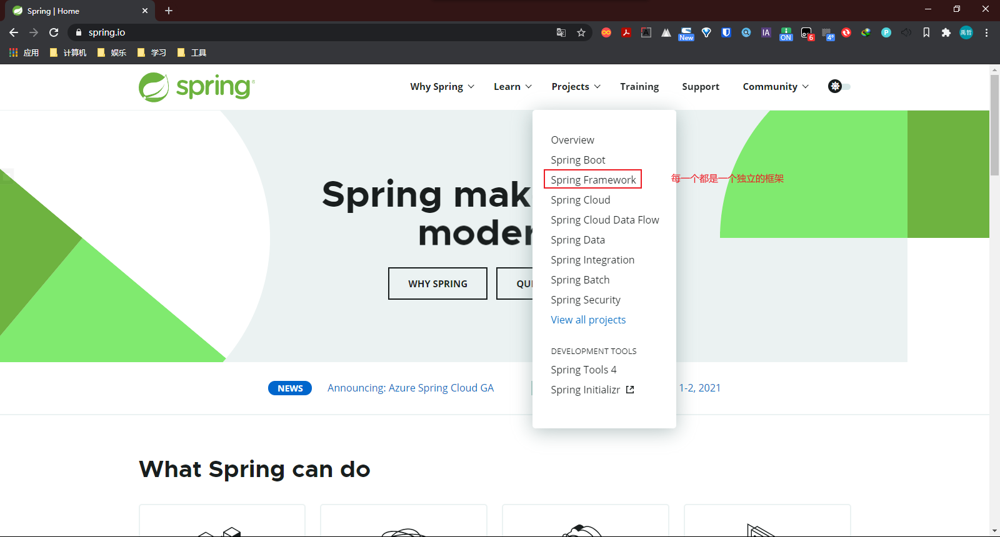
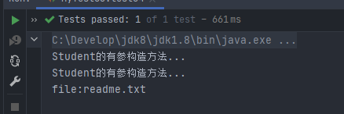
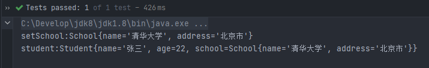
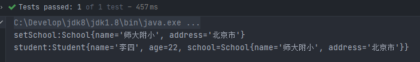
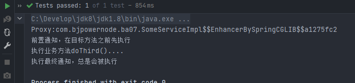
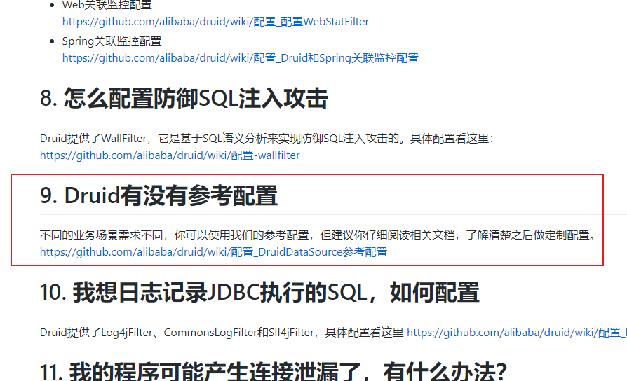
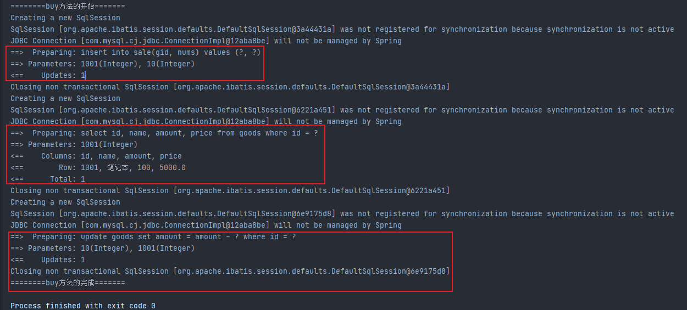

# Spring框架

## 一、Spring介绍

### 1.1Spring

出现在2002年左右，解决企业开发的难度，减轻对项目模块直接的管理，类和类之间的管理，帮助开发人员创建对象，管理对象之间的关系。

官网：https://spring.io/





Spring体系结构：


### 1.2Spring核心技术

IOC、AOP。能实现模块之间，类之间的解耦合。


### 1.3优点

Spring是一个框架，一个半成品的软件，有20多个模块组成，是一个容器管理对象，Spring是存储对象的容器。

1. 轻量：
   - Spring使用的jar包都比较小，核心功能所需的jar包总共3M左右
   - Spring运行占用的资源少，运行效率高，不依赖其他jar包
2. 针对接口编程，解耦合
   - Spring提供了Ioc控制反转，由容器管理对象，对象之间的依赖关系，对象之间的依赖解耦合。
3. AOP编程的支持
   - 通过Spring提供的AOP功能，方便进行面向切面的编程。
4. 方便集成各种优秀框架
   - Spring不排斥各种开源框架，提供了对各种框架的直接支持，简化框架的使用。


### 1.4框架该如何学习

框架是一个软件，是其他人写好的软件。

1. **知道框架能做什么。**mybatis--能够访问数据库，对表中的数据执行增删改查。
2. **框架的语法。**框架要完成一个功能，需要一定的步骤支持的。
3. **框架的内部实现。**框架的内部怎么做，原理是什么。
4. 通过学习，可以实现一个框架。


## 二、IoC控制反转

> 控制反转（IoC，Inversion of Control），是一个概念，是一种思想。其实现方法也多种多样，当前比较流行的就是依赖注入。
>
> 指将传统上由程序代码直接操控的对象调用权交给容器，通过容器来实现对象的装配和管理。
>
> 把对象的创建，赋值，管理工作都交给代码之外的容器实现，也就是对象的创建是由其他外部资源完成
>
> **控制反转就是对对象控制权的转移，从程序代码本身反转到了外部容器。通过容器实现对象的创建，属性赋值，依赖的管理。**
>
> - 依赖：class a 中使用了class b中的属性或方法，称class a 依赖 class b
> - **控制就是创建对象，对象的属性赋值，对象之间的关系管理。**
> - **反转指由原来的开发人员管理，创建对象的权限转移给代码之外的容器实现。由容器来代替开发人员管理对象，创建对象，给属性赋值。容器可以是一个服务器软件、一个框架。**
> - 正转指由开发人员在代码中，使用new构造方法创建对象，开发人员主动管理对象。（Student stu = new Student();）

为什么使用IoC：目的是为了减少对代码的改动，也能实现不同的功能，实现解耦合。

### 2.1Java中创建对象的方式

1. 构造方法

2. 反射机制

3. 序列化

4. 克隆

5. 动态代理

6. IoC（容器创建对象）

   - IoC的体现：Servlet

     1. 创建类继承HttpServlet

     2. 在web.xml中注册servlet

        ```xml
        <servlet>
        	<servlet-name>myServlet</servlet-name>
            <servlet-class>com.bjpowernode.controller.MyServlet</servlet-class>
        </servlet>
        ```

     3. 没有创建过Servlet对象（MyServlet myServlet = new MyServlet();）

     4. Servlet是Tomcat服务器它帮你创建的，Tomcat也称为容器。

        Tomcat作为容器：里面存放的有Servlet对象，监听器Listener对象，过滤器Filter对象。


### 2.2IoC的技术实现

DI（Dependency Injection）依赖注入，是IoC的技术实现。只需要在程序中提供要使用的对象的名称就可以，至于对象如何在容器中创建，赋值，查找都由容器内部实现。

Spring是使用DI实现了IoC的功能，**Spring底层创建对象，使用了反射机制。**

Spring是一个容器，管理对象，给属性赋值，底层是反射机制创建对象。


### 2.3Spring的第一个程序

```
Spring的ioc，由spring创建对象

实现步骤：
    1.创建maven项目
    2.加入maven的依赖
        spring的依赖，版本5.2.5
        junit依赖
    3.创建类（接口和他的实现类）
        和没有使用框架一样，就是普通的类
    4.创建spring需要使用的配置文件
        声明类的信息，这些类由spring创建和管理
    5.测试spring创建的对象
```

#### 2.3.1使用Spring创建对象并调用它的方法

第一步：创建一个普通JavaSE的maven工程，完善目录结构

第二步：加入Spring依赖

```xml
<dependency>
    <groupId>org.springframework</groupId>
    <artifactId>spring-context</artifactId>
    <version>5.2.5.RELEASE</version>
</dependency>
```

第三步：创建一个接口类

```java
package com.bjpowernode.service;

public interface SomeService {
    void doSome();
}
```

第四步：创建一个接口实现类

```java
package com.bjpowernode.service.impl;

import com.bjpowernode.service.SomeService;

public class SomeServiceImpl implements SomeService {
    @Override
    public void doSome() {
        System.out.println("执行了SomeServiceImpl的dosome方法...");
    }
}
```

第五步：在resources文件夹中创建spring config.xml文件类型的文件

```xml
<?xml version="1.0" encoding="UTF-8"?>
<beans xmlns="http://www.springframework.org/schema/beans"
       xmlns:xsi="http://www.w3.org/2001/XMLSchema-instance"
       xsi:schemaLocation="http://www.springframework.org/schema/beans
       http://www.springframework.org/schema/beans/spring-beans.xsd">

    <!-- 
        告诉spring创建对象
        声明bean，告诉spring要创建某个类的对象
        id:对象的自定义名称，是唯一值。spring通过这个名称来找到这个对象
        class:类的全限定名称（不能是接口，因为spring是反射机制创建对象，必须使用类）
        
        spring完成 SomeService someService = new SomeServiceImpl();
        spring将创建好的对象放到map中，spring框架中有一个map存放对象。
        springMap.put(id, 对象);
        例如：springMap.put(someService, new SomeServiceImpl());
        
        一个bean标签，声明一个对象
    -->
    <bean id="someService" class="com.bjpowernode.service.impl.SomeServiceImpl" />
</beans>

<!--
    spring的配置文件
    1.beans:根标签，在spring中把java对象称为bean。
    2.spring-beans.xsd 是约束文件，和mybatis的.dtd是一样的
-->
```

第六步：测试

```java
package com.bjpowernode;

import com.bjpowernode.service.SomeService;
import com.bjpowernode.service.impl.SomeServiceImpl;
import org.junit.Test;
import org.springframework.context.ApplicationContext;
import org.springframework.context.support.ClassPathXmlApplicationContext;

public class MyTest {

    // 传统正转方式创建对象
    @Test
    public void test01(){
        SomeService service = new SomeServiceImpl();
        service.doSome();
    }

    // 使用spring容器创建的对象
    @Test
    public void test02(){
        // 1.指定spring配置文件的名称
        String config = "beans.xml";
        // 2.创建表示spring容器的对象,ApplicationContext
        // ApplicationContext表示spring容器，通过这个容器获取对象
        // ClassPathXmlApplicationContext表示从类路径中加载spring的配置文件
        ApplicationContext ctx = new ClassPathXmlApplicationContext(config);// 这句话执行时开始创建对象

        // 从容器中获取某个对象，要调用容器的方法
        // getBean("配置文件中bean的id值");
        SomeService someService =(SomeService) ctx.getBean("someService");

        // 使用spring创建好的对象
        someService.doSome();
    }
}
```


#### 2.3.2证明对象是在创建ApplicationContext对象时创建的

在实现类中添加无参构造器

```java
package com.bjpowernode.service.impl;

import com.bjpowernode.service.SomeService;

public class SomeServiceImpl implements SomeService {
    public SomeServiceImpl() {
        System.out.println("SomeServiceImpl的无参构造方法...");
    }

    @Override
    public void doSome() {
        System.out.println("执行了SomeServiceImpl的dosome方法...");
    }
}
```

测试

```java
package com.bjpowernode;

import com.bjpowernode.service.SomeService;
import com.bjpowernode.service.impl.SomeServiceImpl;
import org.junit.Test;
import org.springframework.context.ApplicationContext;
import org.springframework.context.support.ClassPathXmlApplicationContext;

public class MyTest {
    @Test
    public void test03(){
        String config = "beans.xml";
        ApplicationContext act = new ClassPathXmlApplicationContext(config);
    }
}
```


> 所以说Spring默认创建对象的时间：是在创建spring的容器时，会创建配置文件中**所有的**对象。
>
> **spring创建对象：默认调用的是无参数的构造方法。**


#### 2.3.3怎么获取spring容器中Java对象的信息

在配置文件中，再配置一个bean

```java
@Test
public void test04(){
    String config = "beans.xml";
    ApplicationContext act = new ClassPathXmlApplicationContext(config);
    // 使用spring提供的方法，获取容器中定义的对象的数量
    int nums = act.getBeanDefinitionCount();
    System.out.println("容器中定义的对象数量：" + nums);
    // 容器中每个定义的对象的名称
    String[] names = act.getBeanDefinitionNames();
    for (String name : names) {
        System.out.println("容器中定义的对象名称：" + name);
    }
}
```


#### 2.3.4spring中bean的作用域

在< bean >标签中有六种作用域：

- singleton：默认的作用域，使用singleton定义的Bean在Spring容器中只有一个Bean实例
- prototype：Spring容器每次获取prototype定义的Bean，容器都将创建一个新的Bean实例
- request：在一次HTTP请求中容器将返回一个Bean实例，不同的HTTP请求返回不同的Bean实例。仅在WebSpring中使用。
- session：在一个HTTP Session中，容器将返回同一个Bean实例，仅在WebSpring中使用。
- application：为每个ServletContext对象创建一个实例，即同一个应用共享一个Bean实例。仅在WebSpring中使用。
- websocket：为每个WebSocket对象创建一个Bean实例。仅在WebSpring中使用。

**其中在Spring中常用singleton和prototype两种。**

```xml
<?xml version="1.0" encoding="UTF-8"?>
<beans xmlns="http://www.springframework.org/schema/beans"
       xmlns:xsi="http://www.w3.org/2001/XMLSchema-instance"
       xsi:schemaLocation="http://www.springframework.org/schema/beans
       http://www.springframework.org/schema/beans/spring-beans.xsd">
    <bean id="someService" class="com.bjpowernode.service.impl.SomeServiceImpl" scope="singleton"/>
    <bean id="someService1" class="com.bjpowernode.service.impl.SomeServiceImpl" scope="prototype"/>
</beans>
```

测试

```java
@Test
public void test06(){
    String config = "beans.xml";
    ApplicationContext act = new ClassPathXmlApplicationContext(config);
    SomeService service1 = (SomeService) act.getBean("someService");
    SomeService service2 = (SomeService) act.getBean("someService");
    System.out.println("singleton作用域的两个对象:" + "\nservice1:" + service1 + "\nservice2:" + service2);
    SomeService service3 = (SomeService) act.getBean("someService1");
    SomeService service4 = (SomeService) act.getBean("someService1");
    System.out.println("prototype作用域的两个对象:" + "\nservice3:" + service3 + "\nservice4:" + service4);
}
```


#### 2.3.5spring可以创建一个非自定义类的对象吗

```xml
<?xml version="1.0" encoding="UTF-8"?>
<beans xmlns="http://www.springframework.org/schema/beans"
       xmlns:xsi="http://www.w3.org/2001/XMLSchema-instance"
       xsi:schemaLocation="http://www.springframework.org/schema/beans
       http://www.springframework.org/schema/beans/spring-beans.xsd">
    <!--
        spring能创建一个非自定义类的对象吗，创建一个存在的某个类的对象
    -->
    <bean id="mydate" class="java.util.Date" />
</beans>
```

```java
package com.bjpowernode;

import com.bjpowernode.service.SomeService;
import com.bjpowernode.service.impl.SomeServiceImpl;
import org.junit.Test;
import org.springframework.context.ApplicationContext;
import org.springframework.context.support.ClassPathXmlApplicationContext;

import java.util.Date;

public class MyTest {
    @Test
    public void test05(){
        String config = "beans.xml";
        ApplicationContext act = new ClassPathXmlApplicationContext(config);
        Date date = (Date) act.getBean("mydate");
        System.out.println(date);
    }
}
```


### 2.4基于XML的DI

通过spring提供的语法给Java对象的属性完成赋值。

```
Spring-02-XML-DI: 在spring的配置文件中，给Java对象的属性赋值

di: 依赖注入，表示创建对象给属性赋值

di实现的语法，有两种：
    1.在spring的配置文件中，使用标签和属性完成，叫做基于XML的DI实现
    2.使用spring中的注解，完成属性赋值，叫做基于注解的DI实现
    
di语法分类：
    1.set注入(设值注入):spring调用类的set方法，在set方法可以实现属性的赋值
    2.构造注入：spring调用类的有参构造方法，创建对象。在构造方法中完成赋值
    
实现步骤：
    1.创建maven项目
    2.加入maven的依赖
        spring的依赖，版本5.2.5
        junit依赖
    3.创建类（接口和他的实现类）
        和没有使用框架一样，就是普通的类
    4.创建spring需要使用的配置文件
        声明类的信息，这些类由spring创建和管理
        通过spring的语法，完成属性的赋值
    5.测试spring创建的对象
```


#### 2.4.1set注入（设值注入）

spring调用类的setter方法，你可以在setter方法中完成赋值


##### 2.4.1.1简单类型的set注入


1. 简单类型的set注入

   ```xml
   <bean id="XXX" class="XXX">
       <!-- 一个property只能给一个属性赋值 -->
       <property name="属性名字" value="属性值" />
       <property name="属性名字" value="属性值" />
       ...
   </bean>
   ```

   实例：

   ```java
   package com.bjpowernode.ba01;
   
   public class Student {
       private String name;
       private Integer age;
   	// 省略setter和toString
   }
   ```

   ```xml
   <?xml version="1.0" encoding="UTF-8"?>
   <beans xmlns="http://www.springframework.org/schema/beans"
          xmlns:xsi="http://www.w3.org/2001/XMLSchema-instance"
          xsi:schemaLocation="http://www.springframework.org/schema/beans 
                              http://www.springframework.org/schema/beans/spring-beans.xsd">
       <bean id="myStudent" class="com.bjpowernode.ba01.Student">
           <property name="name" value="张三" /><!-- setName("张三") -->
           <property name="age" value="20" /><!-- setAge(20) -->
       </bean>
   </beans>
   ```

   ```java
   package com.bjpowernode;
   
   import com.bjpowernode.ba01.Student;
   import org.junit.Test;
   import org.springframework.context.ApplicationContext;
   import org.springframework.context.support.ClassPathXmlApplicationContext;
   
   public class MyTest {
   
       @Test
       public void test01(){
           String config = "ba01/applicationContext.xml";
           ApplicationContext act = new ClassPathXmlApplicationContext(config);
           Student student = (Student) act.getBean("myStudent");
           System.out.println("student对象=" + student);
       }
   }
   ```

   

2. 如果在实体类中没有setter方法，是否可以进行set注入

   

   **需要有setter方法。即使setter方法中没有赋值语句，也可以执行，只是属性依然为空。**

3. Setter方法是在何时执行的

   在Student类中，加入无参构造方法和setter方法，并执行查看结果

   

   **先创建对象，再调用setter方法。**

4. 观察以下代码：

   ```java
   package com.bjpowernode.ba01;
   
   public class Student {
       private String name;
       private Integer age;
   
   	// 省略无参构造，name和age的setter方法以及toString方法
       
       public void setEmail(String email){
           System.out.println("setEmail:" + email);
       }
   }
   ```

   ```xml
   <bean id="myStudent" class="com.bjpowernode.ba01.Student">
       <property name="name" value="张三" />
       <property name="age" value="20" />
       <property name="email" value="zhangsan@qq.com" />
   </bean>
   ```

   **这样可以运行吗？**

   

   **可以执行，只是执行了对应的set方法。**

5. 为什么在Student类中的age是int类型，而在注入时的value用了引号引起来？

   ```xml
   <bean id="myStudent" class="com.bjpowernode.ba01.Student">
   	<property name="name" value="李四" />
       <property name="age" value="22" />
   </bean>
   ```

   > **说明：不论类的属性是什么类型的变量，所有值都必须放在引号中，这个规则是XML文件的规则，所有的属性都必须放在引号中！！！**

   实例：使用bean创建一个日期类，自定义时间

   首先查看Date类中的方法，通过set方法来为参数赋值。

   

   ```xml
   <bean id="mydate" class="java.util.Date">
       <property name="time" value="88841564" />
   </bean>
   ```

   

   

##### 2.4.1.2引用类型的set注入

准备工作，先创建两个类

```java
public class School {
    private String name;
    private String address;
    // 省略生成setter和toString
}
```

```java
public class Student {
    private String name;
    private Integer age;
    // 声明一个引用类型
    private School school;
    // 省略生成setter和toString
}
```

使用传统方式创建对象

```java
@Test
public void test01(){
    Student student = new Student();
    student.setName("elle");
    student.setAge(20);
    School school = new School();
    school.setName("清华大学");
    school.setAddress("北京市");
    student.setSchool(school);
    System.out.println(student);
}
```

1. 引用类型的set注入

   ```xml
   <bean id="XXX" class="YYY">
   	<property name="属性名称" ref="bean的id(对象的名称)" />
   </bean>
   ```

   实例：

   ```xml
   <?xml version="1.0" encoding="UTF-8"?>
   <beans xmlns="http://www.springframework.org/schema/beans"
          xmlns:xsi="http://www.w3.org/2001/XMLSchema-instance"
          xsi:schemaLocation="http://www.springframework.org/schema/beans http://www.springframework.org/schema/beans/spring-beans.xsd">
       <bean id="myStudent" class="com.bjpowernode.ba02.Student">
           <property name="name" value="张三" />
           <property name="age" value="20" />
           <!-- 引用类型 -->
           <property name="school" ref="myschool" />
       </bean>
       <bean id="myschool" class="com.bjpowernode.ba02.School">
           <property name="name" value="清华大学" />
           <property name="address" value="北京市" />
       </bean>
   </beans>
   ```

   ```java
   @Test
   public void test02(){
       String config = "ba02/applicationContext.xml";
       ApplicationContext ac = new ClassPathXmlApplicationContext(config);
       Student student = (Student) ac.getBean("myStudent");
       System.out.println("student:" + student);
   }
   ```

   

   


#### 2.4.2构造注入

spring调用类有参构造方法，在创建对象的同时，在构造方法中给属性赋值

##### 2.4.2.1使用name、value方式注入

1. 构造注入

   ```xml
   <!--
   	<constructor-arg>标签：
   		1）一个<constructor-arg>表示构造方法的一个参数。
       <constructor-arg>属性：
           1）name:表示构造方法的形参名
           2）index:表示构造方法的参数的位置，参数从左往右位置是0，1，2...的顺序
           3）value:构造方法的形参类型是简单类型的，使用value
           4）ref：构造方法的形参类型是引用类型的，使用ref
   -->
   <bean id="XXX" class="YYY">
   	<constructor-arg name="" index="" value="" ref=""/>
       <constructor-arg name="" index="" value="" ref=""/>
       ...
   </bean>
   ```

   实例：

   ```xml
   <?xml version="1.0" encoding="UTF-8"?>
   <beans xmlns="http://www.springframework.org/schema/beans"
          xmlns:xsi="http://www.w3.org/2001/XMLSchema-instance"
          xsi:schemaLocation="http://www.springframework.org/schema/beans http://www.springframework.org/schema/beans/spring-beans.xsd">
       <bean id="myStudent" class="com.bjpowernode.ba03.Student">
           <constructor-arg name="name" value="张三" />
           <constructor-arg name="age" value="22" />
           <constructor-arg name="school" ref="myschool" />
       </bean>
       <bean id="myschool" class="com.bjpowernode.ba03.School">
           <property name="name" value="清华大学" />
           <property name="address" value="北京市" />
       </bean>
   </beans>
   ```

   ```java
   @Test
   public void test02(){
       String config = "ba03/applicationContext.xml";
       ApplicationContext ac = new ClassPathXmlApplicationContext(config);
       Student student = (Student) ac.getBean("myStudent");
       System.out.println("student:" + student);
   }
   ```

   

   > 多个bean之间的顺序是否有影响。
   >
   > **在Spring中，有二次扫描机制，第一次从上到下执行，先把所有的bean全部创建出来。**
   >
   > **第二次扫描bean中是否有引用数据类型的属性，如果有，会去自动找bean的id与之相匹配的bean进行赋值。**

##### 2.4.2.2使用index、value方式注入

1. 使用index属性

   ```xml
   <bean id="myStudent2" class="com.bjpowernode.ba03.Student">
       <!-- index的值并不一定要按顺序写，因为都是定位好的 -->
       <constructor-arg index="1" value="26" />
       <constructor-arg index="0" value="李四" />
       <constructor-arg index="2" ref="myschool2" />
       <!-- 在index省略的时候，顺序不能改变 -->
       <!--
       <constructor-arg value="李四" />
       <constructor-arg value="26" />
       <constructor-arg ref="myschool2" />
   	-->
   </bean>
   
   <bean id="myschool2" class="com.bjpowernode.ba03.School">
       <property name="name" value="北京大学" />
       <property name="address" value="北京市" />
   </bean>
   ```

   ```java
   @Test
   public void test03(){
       String config = "ba03/applicationContext.xml";
       ApplicationContext ac = new ClassPathXmlApplicationContext(config);
       Student student = (Student) ac.getBean("myStudent2");
       System.out.println("student:" + student);
   }
   ```

   

   

##### 2.4.2.3使用构造注入创建File对象

首先查看File类型的代码，其构造方法：


```xml
<bean id="myfile" class="java.io.File">
    <constructor-arg name="parent" value="C:\Develop\IdeaProject\Spring\Spring-02-XML-DI" />
    <constructor-arg name="child" value="readme.txt" />
</bean>
```

```java
@Test
public void test04(){
    String config = "ba03/applicationContext.xml";
    ApplicationContext ac = new ClassPathXmlApplicationContext(config);
    File file = (File) ac.getBean("myfile");
    System.out.println("file:" + file.getName());
}
```



**通过此案例明白，只要一个类有构造方法或者setter方法，就可以创建一个该类的对象。**

> 什么样的对象不适合放到Spring容器中：
>
> - 实体类对象：实体类数据来自于数据库中
> - Servlet、Listener、Filter：由Tomcat创建
>
> 什么样的对象适合放到Spring容器中：
>
> - dao类
> - Service类
> - Controller类
> - 工具类


#### 2.4.3引用类型属性自动注入

准备工作：修改实体类，在setSchool中加上输出语句，并修改配置文件的创建bean

```xml
<?xml version="1.0" encoding="UTF-8"?>
<beans xmlns="http://www.springframework.org/schema/beans"
       xmlns:xsi="http://www.w3.org/2001/XMLSchema-instance"
       xsi:schemaLocation="http://www.springframework.org/schema/beans 					   					http://www.springframework.org/schema/beans/spring-beans.xsd">
    
    <bean id="myStudent" class="com.bjpowernode.ba04.Student">
        <property name="name" value="张三" />
        <property name="age" value="22" />
        <!-- 注释引用类型设值注入-->
        <!-- <property name="school" ref="myschool" />-->
    </bean>
    <bean id="myschool" class="com.bjpowernode.ba04.School">
        <property name="name" value="清华大学" />
        <property name="address" value="北京市" />
    </bean>
</beans>
```


1. 引用类型的自动注入：spring框架根据某些规则可以给**引用类型**赋值。不用开发人员给引用类型赋值。

   使用规则：

   - byName：按名称注入，Java类中引用类型的属性名和spring容器中（配置文件）< bean >的id名称一样，且数据类型一致，这样的容器中的bean，spring能够赋值给引用类型。

     ```xml
     <bean id="XXX" class="YYY" autowire="byName">
         <!-- 简单类型赋值 -->
     </bean>
     ```

     实例：

     ```xml
     <bean id="myStudent" class="com.bjpowernode.ba04.Student" autowire="byName">
         <property name="name" value="张三" />
         <property name="age" value="22" />
         <!-- 引用类型-->
         <!-- <property name="school" ref="myschool" />-->
     </bean>
     <bean id="school" class="com.bjpowernode.ba04.School">
         <property name="name" value="清华大学" />
         <property name="address" value="北京市" />
     </bean>
     ```

     

   - byType：按类型注入，Java类中引用类型的数据类型和spring容器中（配置文件）< bean >的class属性是同源关系的，这样的bean能够赋值给引用类型。

     同源：一类的

     1. Java类中引用类型的数据类型和bean的class的值一样。
     2. Java类中引用类型的数据类型和bean的class的值是父子关系的。
     3. Java类中引用类型的数据类型和bean的class的值是接口和实现类关系的。

     ```xml
     <bean id="XXX" class="YYY" autowire="byType">
         <!-- 简单类型赋值 -->
     </bean>
     ```

     **Java类中引用类型的数据类型和bean的class的值一样。实例：**

     ```xml
     <?xml version="1.0" encoding="UTF-8"?>
     <beans xmlns="http://www.springframework.org/schema/beans"
            xmlns:xsi="http://www.w3.org/2001/XMLSchema-instance"
            xsi:schemaLocation="http://www.springframework.org/schema/beans http://www.springframework.org/schema/beans/spring-beans.xsd">
     
         <bean id="myStudent" class="com.bjpowernode.ba05.Student" autowire="byType">
             <property name="name" value="李四" />
             <property name="age" value="22" />
             <!-- 引用类型-->
             <!-- <property name="school" ref="myschool" />-->
         </bean>
         <bean id="myschool" class="com.bjpowernode.ba05.School">
             <property name="name" value="北大大学" />
             <property name="address" value="北京市" />
         </bean>
     </beans>
     ```

     ```java
     @Test
     public void test01(){
         String config = "ba05/applicationContext.xml";
         ApplicationContext ac = new ClassPathXmlApplicationContext(config);
         Student student = (Student) ac.getBean("myStudent");
         System.out.println("student:" + student);
     }
     ```

     

     **Java类中引用类型的数据类型和bean的class的值是父子关系的。实例：**

     首先创建一个School类的子类PrimarySchool，这样子类可以使用父类的属性和方法

     ```xml
     <?xml version="1.0" encoding="UTF-8"?>
     <beans xmlns="http://www.springframework.org/schema/beans"
            xmlns:xsi="http://www.w3.org/2001/XMLSchema-instance"
            xsi:schemaLocation="http://www.springframework.org/schema/beans http://www.springframework.org/schema/beans/spring-beans.xsd">
     
         <bean id="myStudent" class="com.bjpowernode.ba05.Student" autowire="byType">
             <property name="name" value="李四" />
             <property name="age" value="22" />
             <!-- 引用类型-->
             <!-- <property name="school" ref="myschool" />-->
         </bean>
         <!--<bean id="myschool" class="com.bjpowernode.ba05.School">
             <property name="name" value="北大大学" />
             <property name="address" value="北京市" />
         </bean>-->
     
         <!--声明子类-->
         <bean id="primaryschool" class="com.bjpowernode.ba05.PrimarySchool">
             <property name="name" value="师大附小" />
             <property name="address" value="北京市" />
         </bean>
     </beans>
     ```

     

     修改代码，如果是这样，那会是什么结果：

     ```xml
     <?xml version="1.0" encoding="UTF-8"?>
     <beans xmlns="http://www.springframework.org/schema/beans"
            xmlns:xsi="http://www.w3.org/2001/XMLSchema-instance"
            xsi:schemaLocation="http://www.springframework.org/schema/beans http://www.springframework.org/schema/beans/spring-beans.xsd">
     
         <bean id="myStudent" class="com.bjpowernode.ba05.Student" autowire="byType">
             <property name="name" value="李四" />
             <property name="age" value="22" />
             <!-- 引用类型-->
             <!-- <property name="school" ref="myschool" />-->
         </bean>
         <bean id="myschool" class="com.bjpowernode.ba05.School">
             <property name="name" value="北大大学" />
             <property name="address" value="北京市" />
         </bean>
     
         <!--声明子类-->
         <bean id="primaryschool" class="com.bjpowernode.ba05.PrimarySchool">
             <property name="name" value="师大附小" />
             <property name="address" value="北京市" />
         </bean>
     </beans>
     ```

     

     **注意：使用byType时，在xml配置文件中声明bean只能有一个符合条件的，多余一个是错误的。**


#### 2.4.4为应用指定多个Spring配置文件

1. 配置多个配置文件的优势：
   - 每个文件的大小比一个文件要小得多，效率高
   - 避免多人竞争带来的冲突
2. 多文件的分配方式：
   - 按功能模块分，一个模块一个配置文件
   - 按类的功能，数据库相关的配置一个配置文件，做事务相关的配置一个配置文件，做service功能的配置一个配置文件

**包含关系的配置文件，实例：**


spring-student.xml

```xml
<?xml version="1.0" encoding="UTF-8"?>
<beans xmlns="http://www.springframework.org/schema/beans"
       xmlns:xsi="http://www.w3.org/2001/XMLSchema-instance"
       xsi:schemaLocation="http://www.springframework.org/schema/beans http://www.springframework.org/schema/beans/spring-beans.xsd">

    <!--
        student模块所有bean的声明
    -->
    <bean id="myStudent" class="com.bjpowernode.ba06.Student" autowire="byType">
        <property name="name" value="张三" />
        <property name="age" value="30" />
    </bean>
</beans>
```

spring-school.xml

```xml
<?xml version="1.0" encoding="UTF-8"?>
<beans xmlns="http://www.springframework.org/schema/beans"
       xmlns:xsi="http://www.w3.org/2001/XMLSchema-instance"
       xsi:schemaLocation="http://www.springframework.org/schema/beans http://www.springframework.org/schema/beans/spring-beans.xsd">

    <!--
        school模块所有bean的声明
    -->
    <bean id="mySchool" class="com.bjpowernode.ba06.School">
        <property name="name" value="航空大学" />
        <property name="address" value="北京市" />
    </bean>
</beans>
```

spring-total.xml

```xml
<?xml version="1.0" encoding="UTF-8"?>
<beans xmlns="http://www.springframework.org/schema/beans"
       xmlns:xsi="http://www.w3.org/2001/XMLSchema-instance"
       xsi:schemaLocation="http://www.springframework.org/schema/beans http://www.springframework.org/schema/beans/spring-beans.xsd">

        <!--
            spring-total表示主配置文件：包含其他的配置文件的，主配置文件一般不定义对象的。
            语法：
                <import resource="其他配置文件的路径" />
                关键字："classpath:"表示类路径（class文件所在的目录），在spring的配置文件中要指定其他文件的位置
                需要使用classpath，告诉spring到哪去加载读取文件。
        -->
        <import resource="classpath:ba06/spring-school.xml" />
        <import resource="classpath:ba06/spring-student.xml" />
</beans>
```

测试：

```java
package com.bjpowernode;

import com.bjpowernode.ba06.Student;
import org.junit.Test;
import org.springframework.context.ApplicationContext;
import org.springframework.context.support.ClassPathXmlApplicationContext;

public class MyTest06 {

    @Test
    public void test01(){
        // 加载总文件
        String config = "ba06/spring-total.xml";
        ApplicationContext ac = new ClassPathXmlApplicationContext(config);
        Student student = (Student) ac.getBean("myStudent");
        System.out.println("student:" + student);
    }
}
```


**在包含关系的配置文件中，可以使用通配符"*"，表示任意字符（注意！主配置文件名称不能包含在通配符的范围内，不能叫spring-total.xml）**

```xml
<?xml version="1.0" encoding="UTF-8"?>
<beans xmlns="http://www.springframework.org/schema/beans"
       xmlns:xsi="http://www.w3.org/2001/XMLSchema-instance"
       xsi:schemaLocation="http://www.springframework.org/schema/beans http://www.springframework.org/schema/beans/spring-beans.xsd">

        <!--
            spring-total表示主配置文件：包含其他的配置文件的，主配置文件一般不定义对象的。
            语法：
                <import resource="其他配置文件的路径" />
                关键字："classpath:"表示类路径（class文件所在的目录），在spring的配置文件中要指定其他文件的位置
                需要使用classpath，告诉spring到哪去加载读取文件。
        -->
        <import resource="classpath:ba06/spring-*.xml" />
</beans>
```


### 2.5基于注解的DI（重点）

通过注解来完成Java对象的创建和赋值。

**使用注解的步骤：**

- 加入maven依赖，spring-context，在你加入spring-context的同时，间接加入spring-aop的依赖，使用注解必须使用spring-aop依赖。

  

- 在类中加入spring的注解（注解有不同功能的注解）

- 在spring的配置文件中，加入一个组件扫描器的标签，来说明注解在项目中的位置

**学习的注解有以下这些：**

- @Component
- @Repository
- @Service
- @Controller
- @Value
- @Autowired
- @Resource


#### 2.5.1@Component注解的使用

````java
/**
 * @Component创建对象的，等同于<bean>的功能
 * 属性：value就是对象的名称，也就是bean的id值。
 *      value是唯一的，创建的对象在整个spring容器中就一个。
 * 位置：在类的上面
 */
@Component(value="myStudent")
// 注解中，如果属性是value，则可以省略
@Component("myStudent")
// 可以不指定对象的名称，由Spring提供默认名称，类名首字母小写
@Component
````

1. 使用value属性，指定对象的名称：

   实例：

   ```java
   package com.bjpowernode.ba01;
   
   import org.springframework.stereotype.Component;
   
   /**
    * @Component创建对象的，等同于<bean>的功能
    * 属性：value就是对象的名称，也就是bean的id值。
    *      value是唯一的，创建的对象在整个spring容器中就一个。
    * 位置：在类的上面
    *
    * @Component(value = "myStudent") 等同于
    * <bean id=""myStudent class="com.bjpowernode.ba01.Student">
    * </bean>
    */
   @Component("myStudent")
   public class Student {
       private String name;
       private Integer age;
   	// 省略setter和toString，无参构造方法
   }
   ```

   ```xml
   <?xml version="1.0" encoding="UTF-8"?>
   <beans xmlns="http://www.springframework.org/schema/beans"
          xmlns:xsi="http://www.w3.org/2001/XMLSchema-instance"
          xmlns:context="http://www.springframework.org/schema/context"
          xsi:schemaLocation="http://www.springframework.org/schema/beans
          http://www.springframework.org/schema/beans/spring-beans.xsd
          http://www.springframework.org/schema/context
          https://www.springframework.org/schema/context/spring-context.xsd">
   
       <!--声明组件扫描器，组件就是Java对象-->
       <!--
           属性：base-package指定注解在你的项目中的包名
           工作方式：spring会扫描遍历base-package指定的包，把包中和子包中所有类，然后找到类中的注解，按照注解的功能去创建对象或给属性赋值
           
           加入了component-scan标签，配置文件的变化：
           1.加入新的约束文件：https://www.springframework.org/schema/context/spring-context.xsd
           2.给这个新的约束文件起个命名空间的名称：xmlns:context="http://www.springframework.org/schema/context"（使用context代表这个命名空间）
       -->
       <context:component-scan base-package="com.bjpowernode.ba01" />
   </beans>
   ```

   测试：

   ```java
   package com.bjpowernode;
   
   import com.bjpowernode.ba01.Student;
   import org.junit.Test;
   import org.springframework.context.ApplicationContext;
   import org.springframework.context.support.ClassPathXmlApplicationContext;
   
   public class MyTest01 {
   
       @Test
       public void test01(){
           String config = "ba01/applicationContext.xml";
           ApplicationContext ac = new ClassPathXmlApplicationContext(config);
           Student student = (Student) ac.getBean("myStudent");
           System.out.println("myStudent:" + student);
       }
   }
   ```

   

   > **在Spring中，和@Component功能一致，创建对象的注解还有：**
   >
   > - @Repository（用在持久层上）：放在dao的实现类上面，表示创建dao对象，dao对象是能访问数据库的。
   > - @Service（用在业务层上）：放在service的实现类上面，表示创建service对象，service对象是做业务处理，可以有事务等功能的。
   > - @Controller（用在控制器上）：放在控制器（处理器）类的上面，创建控制器对象的，控制器对象，能够接收用户提交的参数，显示请求的处理结果。
   >
   > **以上三个注解的使用语法和@Component一样，都能创建对象，但是这三个注解还有额外的功能**
   >
   > @Repository、@Service、@Controller是给项目分层的。它们三个和@Component的基本功能一样，但是这三个注解创建的对象是有额外的角色的。

2. 扫描多个包的方式

   - 第一种：

     ```xml
     <!-- 使用多次组件扫描器，指定不同的包 -->
     <context:component-scan base-package="com.bjpowernode.ba01" />
     <context:component-scan base-package="com.bjpowernode.ba02" />
     ...
     ```

   - 第二种：

     ```xml
     <!-- 使用分隔符(;或,)分隔多个包名 -->
     <context:component-scan base-package="com.bjpowernode.ba01;com.bjpowernode.ba02;..." />
     ```

   - 第三种：

     ```xml
     <!-- 指定父包 -->
     <context:component-scan base-package="com.bjpowernode" />
     ```


#### 2.5.2@Value注解的使用（为简单类型赋值的注解）


```java
/**
 * @Value:简单类型的属性赋值
 * 属性：value是String类型的，表示简单类型的属性值
 * 位置：
 *      1.在属性定义上面，无需set方法，推荐使用
 *      2.在set方法上面
 */
@Value(value="值")
private String name;
@Value("值")
private Integer age;
```

1. 在属性上面使用赋值，实例：

   ```java
   package com.bjpowernode.ba02;
   
   import org.springframework.beans.factory.annotation.Value;
   import org.springframework.stereotype.Component;
   
   @Component("myStudent")
   public class Student {
       @Value("张三")
       private String name;
       @Value("29")
       private Integer age;
   }
   
   ```

   省略扫描器

   ```java
   @Test
   public void test01(){
       String config = "ba02/applicationContext.xml";
       ApplicationContext ac = new ClassPathXmlApplicationContext(config);
       Student student = (Student) ac.getBean("myStudent");
       System.out.println("myStudent:" + student);
   }
   ```

   

2. 在set方法上面使用赋值，实例：

   ```java
   package com.bjpowernode.ba02;
   
   import org.springframework.beans.factory.annotation.Value;
   import org.springframework.stereotype.Component;
   
   @Component("myStudent")
   public class Student {
       private String name;
       private Integer age;
   
       public Student() {
           System.out.println("Student无参构造方法...");
       }
   
       @Value("张三")
       public void setName(String name) {
           System.out.println("setName:" + name);
           this.name = name;
       }
   
       @Value("29")
       public void setAge(Integer age) {
           System.out.println("setAge:" + age);
           this.age = age;
       }
   
       @Override
       public String toString() {
           return "Student{" +
                   "name='" + name + '\'' +
                   ", age=" + age +
                   '}';
       }
   }
   ```

   省略扫描器

   ```java
   @Test
   public void test01(){
       String config = "ba02/applicationContext.xml";
       ApplicationContext ac = new ClassPathXmlApplicationContext(config);
       Student student = (Student) ac.getBean("myStudent");
       System.out.println("myStudent:" + student);
   }
   ```

   


#### 2.5.3@Autowired注解的使用（为引用类型赋值的注解）

```java
// 声明一个引用类型
/**
 * 引用类型
 * @Autowired:spring框架提供的注解，实现引用类型的赋值
 * spring中通过注解给引用类型赋值，使用自动注入原理，支持byName，byType
 *
 * @Autowired:默认使用byType注入规则
 * 位置：
 *      1.在属性定义的上面，无需set方法，推荐使用
 *      2.在set方法上面
 */
@Autowired
private School school;
```

1. 使用byType方式赋值，实例：

   ```java
   @Component("myStudent")
   public class Student {
       @Value("elle")
       private String name;
       @Value("25")
       private Integer age;
       @Autowired
       private School school;
   }
   ```

   ```java
   @Component("mySchool")
   public class School {
       @Value("清华大学")
       private String name;
       @Value("北京市")
       private String address;
   }
   ```

   省略扫描器

   ```java
   @Test
   public void test01(){
       String config = "ba03/applicationContext.xml";
       ApplicationContext ac = new ClassPathXmlApplicationContext(config);
       Student student = (Student) ac.getBean("myStudent");
       System.out.println("myStudent:" + student);
   }
   ```

   

   **如果School是使用xml方式创建，依然可以通过注解来自动注入。**

   

2. 如果@Autowired自动注入失败，会怎么样？

   

   会报这个错误，可以看出后面有一个【Autowired(required=true)】

   ```java
   /*
   	在@Autowired中，有一个属性是required，其默认值是true
   	required=true:表示引用类型赋值失败，程序报错，终止执行
   */
   ```

   如果修改required的值为false呢？

   ```java
   @Autowired(required = false)
   private School school;
   ```

   

   可以发现程序正常执行，没自动注入的引用类型为空。**建议使用true，报错了可以调试。**

   

#### 2.5.4@Qualifier注解的使用（为引用类型赋值的注解）

```java
/**
 * 如果使用byName方式，需要做的是：
 *      1.在属性上面加入@Autowired
 *      2.在属性上面加入@Qualifier(value="bean的id"):表示使用指定名称的bean完成赋值
 */
@Autowired
@Qualifier("mySchool")
private School school;
```

使用byName方式赋值，通过XML和注解方式分别创建对象，实例：

```java
@Component("myStudent")
public class Student {
    @Value("elle")
    private String name;
    @Value("25")
    private Integer age;
    @Autowired
    @Qualifier("mySchool")
    private School school;
}
```

```java
@Component("mySchool")
public class School {
    @Value("清华大学")
    private String name;
    @Value("北京市")
    private String address;
}
```

```xml
<?xml version="1.0" encoding="UTF-8"?>
<beans xmlns="http://www.springframework.org/schema/beans"
       xmlns:xsi="http://www.w3.org/2001/XMLSchema-instance"
       xmlns:context="http://www.springframework.org/schema/context"
       xsi:schemaLocation="http://www.springframework.org/schema/beans
       http://www.springframework.org/schema/beans/spring-beans.xsd
       http://www.springframework.org/schema/context
       https://www.springframework.org/schema/context/spring-context.xsd">

    <context:component-scan base-package="com.bjpowernode.ba04" />
    <bean id="myXueXiao" class="com.bjpowernode.ba04.School">
        <property name="name" value="北京大学" />
        <property name="address" value="北京市" />
    </bean>
</beans>
```

```java
@Test
public void test01(){
    String config = "ba04/applicationContext.xml";
    ApplicationContext ac = new ClassPathXmlApplicationContext(config);
    Student student = (Student) ac.getBean("myStudent");
    System.out.println("myStudent:" + student);
}
```


#### 2.5.5@Resource注解的使用

Spring提供了对jdk中@Resource注解的支持，@Resource注解既可以按名称匹配bean，也可以按照类型匹配bean。

**默认按名称注入，即可用在属性上面，也可以用在set方法上。**

```java
/**
 * 引用类型
 * @Resource 来自JDK的注解，Spring提供了对这个注解的功能支持，可以使用它来给引用类型赋值
 * 使用的也是自动注入的原理，支持byName，byType，默认byName
 * 位置：
 *      1.在属性定义的上面，无需set方法，推荐使用。
 *      2.在set方法的上面
 */
// 默认是byName
@Resource
private School school;
```

1. 使用默认情况赋值，实例：

   ```java
   @Component("myStudent")
   public class Student {
       @Value("elle")
       private String name;
       @Value("25")
       private Integer age;
       /**
        * 引用类型
        * @Resource 来自JDK的注解，Spring提供了对这个注解的功能支持，可以使用它来给引用类型赋值
        * 使用的也是自动注入的原理，支持byName，byType，默认byName
        * 位置：
        *      1.在属性定义的上面，无需set方法，推荐使用。
        *      2.在set方法的上面
        */
       // 默认是byName:先使用byName自动注入，如果byName赋值失败，再使用byType
       @Resource
       private School school;
   }
   ```

   ```java
   @Component("mySchool")
   public class School {
       @Value("清华大学")
       private String name;
       @Value("北京市")
       private String address;
   }
   ```

   省略扫描器

   ```java
   @Test
   public void test01(){
       String config = "ba06/applicationContext.xml";
       ApplicationContext ac = new ClassPathXmlApplicationContext(config);
       Student student = (Student) ac.getBean("myStudent");
       System.out.println("myStudent:" + student);
   }
   ```

   

2. 只想使用byName方式赋值，实例：

   ```java
   @Component("myStudent")
   public class Student {
       @Value("elle")
       private String name;
       @Value("25")
       private Integer age;
       /**
        * 引用类型
        * @Resource 来自JDK的注解，Spring提供了对这个注解的功能支持，可以使用它来给引用类型赋值
        * 使用的也是自动注入的原理，支持byName，byType，默认byName
        * 位置：
        *      1.在属性定义的上面，无需set方法，推荐使用。
        *      2.在set方法的上面
        *      
        * @Resource只是用byName的方式，需要增加一个属性 name
        * name的值是bean的id
        */
       // 只使用byName
       @Resource(name = "mySchool")
       private School school;
   }
   ```

   其他不做修改

   

### 2.6XML和注解的对比

1. 注解
   - 优点：
     - 方便
     - 直观
     - 高效，代码量少
   - 缺点：
     - 修改需要重新编译
     - 有一定的侵入性
2. XML
   - 优点：
     - 配置和代码是分离的
     - 在XML中修改，无需编译代码，只需重启服务器即可将新的配置加载。
   - 缺点：
     - 编写麻烦，效率低
3. **建议经常变动的代码使用XML方式，而不经常变动的代码使用注解方式，注解为主，配置文件为辅**


### 2.7IoC能实现解耦合

ioc能够实现业务对象之间的解耦合，例如service和dao对象之间的解耦合。


## 三、AOP面向切面编程

### 3.1动态代理

指程序在整个运行过程中根本就不存在目标类的代理类。目标对象的代理对象只是由代理生成工具在运行时，由JVM根据反射机制动态生成的。

**作用（背会）：**

- **指可以在不改变原来目标方法功能的前提下，可以在代理中增强自己的功能代码。**
- **减少书写重复代码。**
- **专注业务逻辑代码。**
- **解耦合，让你的业务功能和日日志，事务等非业务功能分离。**


#### 3.1.1JDK动态代理

JDK的动态代理要求目标对象必须实现接口，从jdk1.3之后，java通过java.lang.reflect包提供三个类支持代理模式Proxy、Method和InvocationHandler


#### 3.1.2CGLIB动态代理

CGLIB（Code Generation Library），可以在运行期扩展java类与实现java接口。

使用JDK的动态代理要求目标类与代理类实现相同的接口，若目标类不存在接口，则无法使用该方式实现。此时需要使用CGLIB动态代理实现。

> 原理：
>
> 生成目标类的子类，而子类是增强过的，这个子类对象就是代理对象，所以，使用CGLIB生成动态代理，要求目标类必须能够被继承，即不能是final类。


实例：假设有一个service类，其中有两个方法，如何在不修改service的情况下，在执行每个方法之前输出执行方法的时间，在执行每个方法之后进行提交事务呢

```java
public interface SomeService {
    void doSome();
    void doOther();
}
```

```java
public class SomeServiceImpl implements SomeService {
    @Override
    public void doSome() {
        System.out.println("执行业务方法doSome");
    }

    @Override
    public void doOther() {
        System.out.println("执行业务方法doOther");
    }
}
```

```java
public class MyApp {
    public static void main(String[] args) {
        // 调用doSome、doOther
        SomeService service = new SomeServiceImpl();
        service.doSome();
        System.out.println("-----------------------");
        service.doOther();
    }
}
```

使用动态代理：

> 可以在程序的执行过程中，创建代理对象。
>
> 通过代理对象执行方法，给目标类的方法增加额外的功能（功能增强）
>
> JDK动态代理实现步骤：
>
> 1. 创建目标类SomeServiceImpl目标类，为它的doSome和doOther增加输出时间和提交事务
> 2. 创建InvocationHandler接口的实现类，在这个类实现给目标方法增加功能。
> 3. 使用jdk种类Proxy，创建代理对象，实现创建对象的能力。

实现：

```java
// 目标类的接口
public interface SomeService {
    void doSome();
    void doOther();
}
```

```java
// 目标类
public class SomeServiceImpl implements SomeService {
    @Override
    public void doSome() {
        System.out.println("执行业务方法doSome");
    }

    @Override
    public void doOther() {
        System.out.println("执行业务方法doOther");
    }
}
```

```java
// 需要增强的方法
public class ServiceTools {
    public static void doLog(){
        System.out.println("当前时间 = " + new Date());
    }

    public static void doTrans(){
        System.out.println("非业务功能-----提交事务-----------");
    }
}
```

```java
// 代理类
public class MyInvocationHandler implements InvocationHandler {

    // 由于目标对象是活动的，所以定义一个对象保存目标对象
    private Object target; // SomeServiceImpl类

    public MyInvocationHandler(Object target) {
        this.target = target;
    }

    @Override
    public Object invoke(Object proxy, Method method, Object[] args) throws Throwable {
        // 通过代理对象在执行方法时，会调用执行这个invoke()

        Object res = null;

        // 功能增强
        ServiceTools.doLog();
        // 执行目标类的方法，通过Method类实现
        res = method.invoke(target,args); // SomeServiceImpl.doOther(),SomeServiceImpl.doSome()
        // 功能增强
        ServiceTools.doTrans();

        // 目标方法的执行结果

        return res;
    }
}
```

```java
package com.bjpowernode;

import com.bjpowernode.handler.MyInvocationHandler;
import com.bjpowernode.service.SomeService;
import com.bjpowernode.service.impl.SomeServiceImpl;

import java.lang.reflect.InvocationHandler;
import java.lang.reflect.Proxy;

public class MyApp {
    public static void main(String[] args) {
        // 调用doSome、doOther
        /*SomeService service = new SomeServiceImpl();
        service.doSome();
        System.out.println("-----------------------");
        service.doOther();*/

        // 使用JDK的Proxy创建代理对象
        // 创建目标对象
        SomeService target = new SomeServiceImpl();
        // 创建InvocationHandler
        InvocationHandler handler = new MyInvocationHandler(target);
        // 使用Proxy创建代理
        /**
         * target.getClass().getClassLoader()：目标对象的类加载器，通过反射机制得到
         * SomeService.class.getInterfaces()：目标对象实现了哪些接口，通过反射机制得到
         * handler：代理对象要执行的功能
         */
        SomeService proxy = (SomeService) Proxy.newProxyInstance(target.getClass().getClassLoader(), target.getClass().getInterfaces(), handler);
        // 通过代理执行方法，会调用handler中的invoke()方法
        // 通过代理执行doSome()实际上是proxy对象通过handler调用了handler的invoke方法
        proxy.doSome();
        // public Object invoke(Object proxy, Method method, Object[] args), proxy对应上面的proxy对象, method对应proxy调用的方法，args对应调用方法时的参数
        System.out.println("============================================");
        proxy.doOther();
    }
}
```


**如果只有在doSome方法执行时，输出时间和提交事务，而doOther方法时，不需要。该如何实现？**

**可以判断method方法名字**

```java
package com.bjpowernode.handler;

import com.bjpowernode.service.impl.SomeServiceImpl;
import com.bjpowernode.util.ServiceTools;

import java.lang.reflect.InvocationHandler;
import java.lang.reflect.Method;

/**
 * @author Mr.Feng
 * @date 2021/1/28 19:47
 */
public class MyInvocationHandler implements InvocationHandler {

    // 由于目标对象是活动的，所以定义一个对象保存目标对象
    private Object target; // SomeServiceImpl类

    public MyInvocationHandler(Object target) {
        this.target = target;
    }

    @Override
    public Object invoke(Object proxy, Method method, Object[] args) throws Throwable {
        // 通过代理对象在执行方法时，会调用执行这个invoke()
        // 获取方法名称
        String name = method.getName();
        Object res = null;

        if ("doSome".equals(name)) {
            // 功能增强
            ServiceTools.doLog();
            // 执行目标类的方法，通过Method类实现
            res = method.invoke(target, args); // SomeServiceImpl.doSome()
            // 功能增强
            ServiceTools.doTrans();
        }else {
            res = method.invoke(target, args); // SomeServiceImpl.doOther()
        }
        // 目标方法的执行结果
        return res;
    }
}
```

再执行测试方法


### 3.2AOP简介

（Aspect Orient Programming）面向切面编程，基于动态代理，可以使用JDK，CGLIB两种代理方式。

AOP就是动态代理的规范化，把动态代理的实现步骤，让开发人员用一种统一的方式去用动态代理。

1. Aspect：
   - 切面，给你的目标类增加的功能，就是切面。比如上面的输出时间，提交事务等
   - 特点：一般都是非业务方法，独立使用的
2. Orient：
   - 面向，对着
3. Programming：
   - 编程

**怎样理解面向切面编程（背会）：**

- 分析项目功能时，找出切面
- 合理的安排切面的执行时间（在目标方法前还是目标方法后）
- 合理的安排切面执行的位置，在哪个类，哪个方法增加增强功能


### 3.3AOP相关概念

1. **Aspect（切面）**：
   - 表示增强的功能，就是一堆代码。完成某一个功能。非业务功能。
   - 常见的切面功能：日志，事务，统计信息，参数检查，权限验证。
2. **JoinPoint（连接点）**：
   - 连接业务方法和切面的位置。就是某类中的业务方法，比如上面SomeServiceImpl中的doSome()方法和doOther()方法。**一个方法**
3. **Pointcut（切入点）**：
   - 指多个连接点方法的集合。**多个方法**
4. **目标对象**：
   - 给哪个类的方法增加功能，这个类就叫目标对象
5. **Advice（通知）**：
   - 表示切面功能执行的时机。比如方法执行之前还是之后。

**一个切面有三个关键的要素：**

1. 切面的功能代码：切面要干什么？
2. 切面的执行位置：使用Pointcut表示切面执行的位置
3. 切面的执行时机：使用Advice表示时间，在你的目标方法之前还是之后


### 3.4AOP的实现

aop是一个规范，是对动态代理的一个规范化，标准。

aop的技术实现框架：

1. spring：spring在内部实现了AOP规范，能做AOP的工作。spring主要在事务处理时使用AOP。

   实际项目中很少使用spring的AOP实现，因为spring的AOP比较麻烦。

2. aspectJ：一个开源的专门做AOP的框架，spring中已经继承了aspectJ框架，通过spring就能使用aspectJ的功能了。

   aspectJ框架实现AOP有两种方式：

   - 使用XML配置文件：配置全局事务
   - 使用注解，在项目中要做AOP功能，一般都使用注解，aspectJ有五个注解


### 3.5aspectJ框架的使用

#### 3.5.1切面的执行时间

这个执行时间，在规范中叫Advice（通知，增强）

在aspectJ框架中，使用注解表示的，也可以使用XML配置文件中的标签：

1. @Before：
2. @AfterReturning：
3. @Around：
4. @AfterThrowing：
5. @After：


#### 3.5.2切面的执行位置

**使用切入点表达式（重点）**

```java
execution(modifiers-pattern? ret-type-pattern declaring-type-pattern?name-pattern(param-pattern) throws-pattern?)
// modifiers-pattern:访问权限类型(可选)
// ret-type-pattern:返回值类型(必须有)
// declaring-type-pattern:包名类名(可选)
// name-pattern(param-pattern):方法名(参数类型和参数个数) (必须有)
// throws-pattern:抛出异常类型(可选)
// ?:表示可选的部分
// 一共四个部分，空格分隔
execution(访问权限 方法返回值 方法声明(参数) 异常类型)
```

各部分之间使用空格分隔，其中可以使用通配符：

| 符号 |                             意义                             |
| :--: | :----------------------------------------------------------: |
|  *   |                       0至多个任意字符                        |
|  ..  | 用在方法参数中，表示任意多个参数。或者用在包名后，表示当前包及其子包路径 |
|  +   | 用在类名后，表示当前类及其子类。或者用在接口后，表示当前接口及其实现类 |

举例：

```java
execution(public * *(..))：任意公共方法
    
execution(* set*(..))：任何一个以"set"开始的方法
    
execution(* com.xyz.service.*.*(..))：在service包里的任意类的任意方法
    
execution(* com.xyz.service..*.*(..))：在service包或者子包里的任意类的任意方法。".."出现在类名中时，后边必须跟"*"，表示包、子包下的所有类
    
execution(* *..service.*.*(..))：所有包下的service子包下的所有类中的所有方法
    
execution(* *.service.*.*(..)：只有一级包下的service子包下所有类中所有方法
          
execution(* *.ISomeService.*(..))：只有一级包下的ISomeService接口中所有方法为切入点
          
execution(* *..ISomeService.*(..))：所有包下的ISomeService接口中所有方法为切入点
          
execution(* com.xyz.service.IAccountService.*(..))：IAccountService接口中的任意方法
          
execution(* com.xyz.service.IAccountService+.*(..))：IAccountService若为接口，则是接口中的任意方法及其所有实现类中的任意方法
          
execution(* joke(String,int))：所有的joke(String,int)方法，且joke()方法的第一个参数是String，第二个参数是int。如果方法中的参数类型是java.lang包下的类，可以直接使用类名，否则必须使用全限定类名。如joke(java.util.List,int)
          
execution(* joke(String,*))：所有的joke()方法，该方法的第一个参数是String，第二个参数是任意类型，只能是一个参数。
          
execution(* joke(String,..))：所有的joke()方法，该方法的第一个参数是String，后面可以有任意个数且参数类型不限
          
execution(* joke(Object))：所有的joke()方法，方法都拥有一个参数，且参数是Object类型，注意：joke(Object obj)是，joke(String s)和joke(User u)都不是
          
execution(* joke(Object+))：所有的joke()方法，方法都拥有一个参数，且参数是Object类型或该类的子类，注意：joke(Object obj)是，joke(String s)和joke(User u)也是
```


#### 3.5.3使用aspectJ实现AOP功能（掌握）

##### 3.5.3.1基本步骤

1. 创建maven项目

2. 加入依赖

   > 1. spring依赖：
   >
   >    ```xml
   >     <dependency>
   >        <groupId>org.springframework</groupId>
   >        <artifactId>spring-context</artifactId>
   >        <version>5.2.5.RELEASE</version>
   >    </dependency>
   >    ```
   >
   > 2. aspectJ依赖：
   >
   >    ```xml
   >    <dependency>
   >        <groupId>org.springframework</groupId>
   >        <artifactId>spring-aspects</artifactId>
   >        <version>5.2.5.RELEASE</version>
   >    </dependency>
   >    ```

3. 创建目标类：接口和他的实现类

   > 要做的是给类中的方法增加功能

4. 创建切面类：普通类

   > 1. 在类的上面，加入注解@Aspect
   >
   > 2. 在类中定义方法，方法就是切面要执行的功能代码
   >
   >    在方法的上面加入aspectj中的通知注解，例如@Before
   >
   >    有需要指定切入点表达式：execution()

5. 创建spring的配置文件：声明对象，把对象交给容器统一管理。

   > 声明对象可以使用xml或者注解
   >
   > 1. 声明目标对象
   >
   > 2. 声明切面类对象
   >
   > 3. 声明aspectJ框架中的自动代理生成器标签
   >
   >    自动代理生成器：用来完成代理对象的自动创建功能的

6. 创建测试类，从spring容器中获取目标对象（实际上就是代理对象）

   > 通过代理执行方法，实现AOP的功能增强


##### 3.5.3.2引入AOP约束

在AspectJ实现AOP时，要引入AOP的约束。

```xml
<?xml version="1.0" encoding="UTF-8"?>
<beans xmlns="http://www.springframework.org/schema/beans"
       xmlns:xsi="http://www.w3.org/2001/XMLSchema-instance" xmlns:aop="http://www.springframework.org/schema/aop"
       xsi:schemaLocation="http://www.springframework.org/schema/beans
       http://www.springframework.org/schema/beans/spring-beans.xsd
       http://www.springframework.org/schema/aop
       https://www.springframework.org/schema/aop/spring-aop.xsd">

    <aop:aspectj-autoproxy />
</beans>
```


#### 3.5.4基于注解的AOP实现（掌握）

实现步骤：

1. 定义业务接口与实现类：

   ```java
   public interface SomeService {
       void doSome(String name, Integer age);
   }
   ```

   ```java
   public class SomeServiceImpl implements SomeService {
       @Override
       public void doSome(String name, Integer age) {
           // 给doSome方法增加一个功能，在doSome()执行之前，输出方法的执行时间
           System.out.println("==========目标方法doSome()=========");
       }
   }
   ```

2. 定义切面类：

   ```java
   package com.bjpowernode.ba01;
   
   import org.aspectj.lang.annotation.Aspect;
   import org.aspectj.lang.annotation.Before;
   
   import java.util.Date;
   
   /**
    * @Aspect：是AspectJ框架中的注解
    * 作用：用来表示当前类是切面类
    * 切面类：是用来给业务方法增加功能的类，在这个类中有切面的功能代码
    * 位置：在类定义的上面
    */
   @Aspect
   public class MyAspect {
       /**
        * 定义方法，方法是实现切面功能的。
        * 方法的定义要求：
        *      1.公共方法 public
        *      2.没有返回值 void
        *      3.方法名称自定义
        *      4.方法可以有参数，也可以没有参数。
        *        如果有参数，参数不是自定义的。有几个参数类型可以使用。
        */
   
       /**
        * @Before 前置通知注解
        * 属性：value，是切入点表达式，表示切面的功能执行的位置
        * 位置：在方法的上面
        * 特点：
        *      1.在目标方法之前先执行的
        *      2.不会改变目标方法执行结果
        *      3.不会影响目标方法的执行
        */
       @Before(value = "execution(public void com.bjpowernode.ba01.SomeServiceImpl.doSome(String,Integer))") // 最完整的写法
       public void myBefore(){
           //  就是你切面要执行的功能代码
           System.out.println("前置通知：切面功能：要在目标方法之前输出执行时间：" + new Date());
       }
   }
   
   ```

   

   

切入表达式的多种写法：

```java
@Before(value = "execution(public void com.bjpowernode.ba01.SomeServiceImpl.doSome(String,Integer))") // 最完整的写法
@Before(value = "execution(void com.bjpowernode.ba01.SomeServiceImpl.doSome(String,Integer))") 
@Before(value = "execution(void *..SomeServiceImpl.doSome(String,Integer))") 
@Before(value = "execution(void *..SomeServiceImpl.doSome(..))") 
@Before(value = "execution(void *..SomeServiceImpl.do*(..))") 
@Before(value = "execution(* *..SomeServiceImpl.do*(..))") 
@Before(value = "execution(* do*(..))") 
```


##### 3.5.4.1@Before前置通知——方法有JoinPoint参数（掌握）

**在目标方法执行之前执行，被注解为前置通知的方法，可以包含一个JoinPoint类型参数。**

该类型的对象本身就是切入点表达式，通过该参数，可以获取切入点表达式、方法签名、目标对象等。

**不光前置通知的方法，可以包含一个JoinPoint参数，所有的通知方法均可包含该参数。**

实例：

```java
package com.bjpowernode.ba01;

import org.aspectj.lang.JoinPoint;
import org.aspectj.lang.annotation.Aspect;
import org.aspectj.lang.annotation.Before;

import java.util.Date;

/**
 * @Aspect：是AspectJ框架中的注解
 * 作用：用来表示当前类是切面类
 * 切面类：是用来给业务方法增加功能的类，在这个类中有切面的功能代码
 * 位置：在类定义的上面
 */
@Aspect
public class MyAspect {
    /**
     * 指定通知方法中的参数：JoinPoint
     * JoinPoint：业务方法（doSome），要加入切面功能的业务方法
     * 作用是：可以在通知方法中获取方法【执行时的信息】，例如方法名称，方法的实参。
     * 如果你的切面功能中需要用到方法的信息，就加入JoinPoint
     * 这个JoinPoint参数的值是由框架赋予的，必须是第一个位置的参数
     */
    @Before(value = "execution(void *..SomeServiceImpl.doSome(String,Integer))") // 最完整的写法
    public void myBefore(JoinPoint jp){
        // 获取方法的完整定义
        System.out.println("方法的签名（定义）= " + jp.getSignature());
        System.out.println("方法的名称 = " + jp.getSignature().getName());
        // 获取方法的实参
        Object[] args = jp.getArgs();
        for (Object arg : args) {
            System.out.println("参数 = " + arg);
        }
        // 就是你切面要执行的功能代码
        System.out.println("前置通知：切面功能：要在目标方法之前输出执行时间：" + new Date());
    }
}
```

测试

```java
public class MyTest01 {
    @Test
    public void test01(){
        String config = "applicationContext.xml";
        ApplicationContext ctx = new ClassPathXmlApplicationContext(config);
        // 从容器中获取目标对象
        SomeService proxy = (SomeService) ctx.getBean("someService");
        // 通过代理对象执行方法，实现目标方法执行时，增强了功能
        proxy.doSome("李四", 20);
    }
}
```


##### 3.5.4.2@AfterReturning后置通知——注解有returning属性（掌握）

**在目标方法执行之后执行，由于是目标方法之后执行，所以可以获取到目标方法的返回值。**

该注解的returning属性就是用于指定接收方法返回值的变量名的。

所以被注解为后置通知的方法，除了可以包含JoinPoint参数以外，还可以包含用于接收返回值的变量。

该变量最好是Object类型，因为目标方法返回值可能是任意类型。

实例：

```java
// 先创建一个目标类中的方法doOther
public interface SomeService {
    void doSome(String name, Integer age);
    String doOther(String name, Integer age);
}
```

```java
@Override
public String doOther(String name, Integer age) {
    System.out.println("==========目标方法doOther()=========");
    return "abcd";
    // 给doOther方法增加一个功能，在doOther()执行之后，输出提交事务
}
```

切面类

```java
package com.bjpowernode.ba02;

import org.aspectj.lang.JoinPoint;
import org.aspectj.lang.annotation.AfterReturning;
import org.aspectj.lang.annotation.Aspect;
import org.aspectj.lang.annotation.Before;

import java.util.Date;

/**
 * @Aspect：是AspectJ框架中的注解
 * 作用：用来表示当前类是切面类
 * 切面类：是用来给业务方法增加功能的类，在这个类中有切面的功能代码
 * 位置：在类定义的上面
 */
@Aspect
public class MyAspect {
    /**
     * 后置通知
     * 定义方法，方法是实现切面功能的。
     * 方法的定义要求：
     *      1.公共方法 public
     *      2.没有返回值 void
     *      3.方法名称自定义
     *      4.方法有参数，参数推荐使用Object，参数名自定义
     */

    /**
     * @AfterReturning：后置通知
     * 属性：
     *      1.value:切入点表达式
     *      2.returning：自定义的变量，用来表示目标方法的返回值，自定义变量名【必须】和通知方法的形参名一样
     * 位置：在方法定义的上面
     * 特点：
     *      1.在目标方法执行之后执行
     *      2.能够获取到目标方法的返回值，可以根据这个返回值做不同的处理功能
     *          Object res = doOther();
     *      3.可以修改这个返回值
     *
     *	后置通知的执行：
     *		Object res = doOther();
     *		myAfterReturning(res);
     */

    @AfterReturning(value = "execution(* *..SomeServiceImpl.doOther(..))",
                    returning = "res")
    public void myAfterReturning(Object res){
        // Object res是目标方法执行后的返回值，根据返回值做你的切面功能处理
        System.out.println("后置通知：在目标方法之后执行，获取的返回值是：" + res);
    }
}
```

测试：

```java
public class MyTest02 {
    @Test
    public void test01(){
        String config = "applicationContext.xml";
        ApplicationContext ctx = new ClassPathXmlApplicationContext(config);
        // 从容器中获取目标对象
        SomeService proxy = (SomeService) ctx.getBean("someService");
        // 通过代理对象执行方法，实现目标方法执行时，增强了功能
        String str = proxy.doOther("张三", 20);
        System.out.println("测试类，目标方法执行完毕，返回结果str：" + str);
    }
}
```


**如果将切面类中返回的结果修改，会怎么样？**

```java
package com.bjpowernode.ba02;

import org.aspectj.lang.JoinPoint;
import org.aspectj.lang.annotation.AfterReturning;
import org.aspectj.lang.annotation.Aspect;
import org.aspectj.lang.annotation.Before;

import java.util.Date;

@Aspect
public class MyAspect {
    @AfterReturning(value = "execution(* *..SomeServiceImpl.doOther(..))",
                    returning = "res")
    public void myAfterReturning(Object res){
        // Object res是目标方法执行后的返回值，根据返回值做你的切面功能处理
        System.out.println("后置通知：在目标方法之后执行，获取的返回值是：" + res);
        // 修改目标方法的返回值，看一下会影响最终方法调用结果
        if (res != null){
            res = "Hello World";
        }
    }
}
```

测试结果：


**通过结果可以得知，没有影响。**

**那如果返回的结果是一个Student类型会怎么样？**

实例：

```java
@Override
public Student doOther2(String name, Integer age) {
    System.out.println("==========目标方法doOther2()=========");
    Student student = new Student();
    student.setName(name);
    student.setAge(age);
    return student;
}
```

切面类：

```java
@Aspect
public class MyAspect {

    @AfterReturning(value = "execution(* *..SomeServiceImpl.doOther2(..))",
                    returning = "res")
    public void myAfterReturning(Object res){
        // Object res是目标方法执行后的返回值，根据返回值做你的切面功能处理
        System.out.println("后置通知：在目标方法之后执行，获取的返回值是：" + res);
        // 修改目标方法的返回值，看一下会影响最终方法调用结果
        if (res != null){
            ((Student) res).setName("李四");
            ((Student) res).setAge(29);
        }
        System.out.println("后置通知：修改获取的返回值，修改后的结果是：" + res);
    }
}
```

测试：

```java
public class MyTest02 {
    @Test
    public void test01(){
        String config = "applicationContext.xml";
        ApplicationContext ctx = new ClassPathXmlApplicationContext(config);
        // 从容器中获取目标对象
        SomeService proxy = (SomeService) ctx.getBean("someService");
        // 通过代理对象执行方法，实现目标方法执行时，增强了功能
        Student student = proxy.doOther2("张三", 20);
        System.out.println("测试类，目标方法执行完毕，返回结果student：" + student);
    }
}
```


**通过测试可以得知，如果是自定义类型，可以改变属性值！！！**


##### 3.5.4.3@Around环绕通知——增强方法有ProceedingJoinPoint（掌握）

**在目标方法执行之前之后执行，被注解为环绕增强的方法要有返回值，Object类型。**

并且方法可以包含一个ProceedingJoinPoint类型的参数。

接口ProceedingJoinPoint其有一个proceed()方法，用于执行目标方法。若目标方法有返回值，则该方法的返回值就是目标方法的返回值。

最后，环绕增强方法将其返回值返回。该增强方法实际是拦截了目标方法的执行。

实现：

```java
// 创建一个方法
public interface SomeService {
    String doFirst(String name, Integer age);
}
```

```java
@Override
public String doFirst(String name, Integer age) {
    System.out.println("==========目标方法doFirst()=========");
    return "doFirst";
}
```

切面类：

```java
@Aspect
public class MyAspect {
    /**
     * 环绕通知方法的定义格式：
     *      1.公共的 public
     *      2.有返回值 推荐使用Object
     *      3.方法名称自定义
     *      4.方法有参数，固定的参数ProceedingJoinPoint
     */

    /**
     * @Around：环绕通知
     *      属性：value：切入点表达式
     *      位置：在方法的定义上面
     * 特点：
     *      1.它是功能最强的通知
     *      2.在目标方法的前后都能增强功能
     *      3.控制目标方法是否被调用执行
     *      4.修改原来的目标方法的执行结果，影响最后的调用结果
     *
     * 环绕通知等同于JDK动态代理，InvocationHandler
     *
     * 参数：ProceedingJoinPoint等同于InvocationHandler的Method
     *      作用：执行目标方法
     * 返回值：就是目标方法的执行结果，可以被修改
     */
    @Around(value = "execution(* *..SomeServiceImpl.doFirst(..))")
    public Object myArount(ProceedingJoinPoint pjp) throws Throwable {
        // 实现环绕通知
        Object result = null;

        // 在目标方法之前加入功能
        System.out.println("环绕通知：在目标方法之前，输出时间：" + new Date());

        // 1.目标方法调用
        result = pjp.proceed(); // Method.invoke(); Object result = doFirst();

        // 2.在目标方法后加入功能
        System.out.println("环绕通知：在目标方法之后，提交事务");

        // 返回目标方法执行结果
        return result;
    }
}
```

测试：

```java
@Test
public void test01(){
    String config = "applicationContext.xml";
    ApplicationContext ctx = new ClassPathXmlApplicationContext(config);
    // 从容器中获取目标对象
    SomeService proxy = (SomeService) ctx.getBean("someService");
    // 通过代理对象执行方法，实现目标方法执行时，增强了功能
    String str = proxy.doFirst("张三", 20); // myAround()
    System.out.println("测试类，目标方法执行完毕，返回结果str：" + str );
}
```


**环绕通知的一些功能演示：**

1. 控制目标方法的执行

   查看ProceedingJoinPoint接口的源代码

   

   **由此可以看出，它可以调用JoinPoint的方法**

   实例：当目标方法的参数是"张三"时，执行目标方法。否则不执行

   修改切面类

   ```java
   @Aspect
   public class MyAspect {
       @Around(value = "execution(* *..SomeServiceImpl.doFirst(..))")
       public Object myArount(ProceedingJoinPoint pjp) throws Throwable {
   
           String name = "";
           
           //--------------------------------------------获取参数---------------------------------------
           // 获取第一个参数值
           Object[] args = pjp.getArgs();
           if (args != null && args.length > 1){
               Object arg = args[0];
               name = (String) arg;
           }
   		//--------------------------------------------获取参数---------------------------------------
           
           // 实现环绕通知
           Object result = null;
   
           // 在目标方法之前加入功能
           System.out.println("环绕通知：在目标方法之前，输出时间：" + new Date());
   
           // 1.目标方法调用
           //--------------------------------------------判断条件---------------------------------------
           if ("张三".equals(name)){
               // 符合条件
               result = pjp.proceed(); // Method.invoke(); Object result = doFirst();
           }
   		//--------------------------------------------判断条件---------------------------------------
           // 2.在目标方法后加入功能
           System.out.println("环绕通知：在目标方法之后，提交事务");
   
           // 返回目标方法执行结果
           return result;
       }
   }
   ```

   测试，当符合条件时

   

   不符合条件时：

   

2. 修改目标方法的执行结果，影响方法最后的调用结果

   修改切面类

   ```java
   @Aspect
   public class MyAspect {
       @Around(value = "execution(* *..SomeServiceImpl.doFirst(..))")
       public Object myArount(ProceedingJoinPoint pjp) throws Throwable {
   
           String name = "";
           // 获取第一个参数值
           Object[] args = pjp.getArgs();
           if (args != null && args.length > 1){
               Object arg = args[0];
               name = (String) arg;
           }
   
           // 实现环绕通知
           Object result = null;
   
           // 在目标方法之前加入功能
           System.out.println("环绕通知：在目标方法之前，输出时间：" + new Date());
   
           // 1.目标方法调用
           if ("张三".equals(name)){
               // 符合条件
               result = pjp.proceed(); // Method.invoke(); Object result = doFirst();
           }
   
           // 2.在目标方法后加入功能
           System.out.println("环绕通知：在目标方法之后，提交事务");
           //--------------------------------------------修改结果---------------------------------------
           if (result != null){
               result = "Hello World";
           }
   		//--------------------------------------------修改结果---------------------------------------	
           // 返回目标方法执行结果
           return result;
       }
   }
   ```

**环绕通知经常用来做事务，在目标方法之前开启事务，执行目标方法，在目标方法之后提交事务。**


##### 3.5.4.4@AfterThrowing异常通知——注解中有throwing属性（了解）

**当目标方法抛出异常后执行。**

该注解的throwing属性用于指定所发生的异常类对象。当然，被注解为异常通知的方法可以包含一个参数Throwable，参数名称为throwing指定的名称，表示发生的异常对象。

实现：

```java
public interface SomeService {
    void doSecond();
}
```

```java
public class SomeServiceImpl implements SomeService {
    @Override
    public void doSecond() {
        System.out.println("执行业务方法doSecond()....");
    }
}
```

切面类：

```java
@Aspect
public class MyAspect {
    /**
     * 异常通知方法的定义格式：
     *      1.公共的 public
     *      2.没有返回值
     *      3.方法名称自定义
     *      4.方法有一个参数Exception，如果还有就是JoinPoint
     */

    /**
     * @AfterThrowing：异常通知
     * 属性：
     *      1.value：切入点表达式
     *      2.throwing：自定义变量，表示目标方法抛出的异常对象
     *        变量名必须和方法的参数名一样
     * 特点：
     *      1.在目标方法抛出异常时执行
     *      2.可以做异常的监控程序，监视目标方法执行时是否有异常
     *        如果有异常，可以发送邮件、短信进行通知
     *
     * 执行：
     *		try{
     *			SomeServiceImpl.doSecond(..)
     *		}catch(Exception e){
     *			myAfterThrowing(e);
     *		}
     */

    @AfterThrowing(value = "execution(* *..SomeServiceImpl.doSecond(..))",
                   throwing = "ex")
    public void myAfterThrowing(Exception ex){
        System.out.println("异常通知：方法发生异常时，执行：" + ex.getMessage());
        // 发送邮件、短信、通知开发人员
    }
}
```

测试类，当不抛出异常的时候：

```java
@Test
public void test01(){
    String config = "applicationContext.xml";
    ApplicationContext ctx = new ClassPathXmlApplicationContext(config);
    // 从容器中获取目标对象
    SomeService proxy = (SomeService) ctx.getBean("someService");
    // 通过代理对象执行方法，实现目标方法执行时，增强了功能
    proxy.doSecond();
}
```


修改目标方法，使其抛出异常：

```java
@Override
public void doSecond() {
    System.out.println("执行业务方法doSecond()...." + (10/0));
}
```

测试结果：


##### 3.5.4.5最终通知（了解）

**无论目标方法是否抛出异常，该增强都会被执行。**

实例：

```java
public interface SomeService {
    void doThird();
}
```

```java
@Override
public void doThird() {
    System.out.println("执行业务方法doThird()....");
}
```

切面类

```java
@Aspect
public class MyAspect {
    /**
     * 最终通知方法的定义格式：
     *      1.公共的 public
     *      2.没有返回值
     *      3.方法名称自定义
     *      4.方法没有参数，如果有就是JoinPoint
     */

    /**
     * @After:最终通知
     * 属性：value 切入点表达式
     * 位置：方法上面
     * 特点：
     *      1.总是会执行
     *      2.在目标方法之后执行
     *
     * 执行：
     *		try{
     *			SomeServiceImpl.doThird(..);
     *		}catch(Exception e){
     *			
     *		}finally{
     *			myAfter();
     *		}
     */
    @After(value = "execution(* *..SomeServiceImpl.doThird(..))")
    public void myAfter(){
        System.out.println("执行最终通知，总是会被执行");
        // 一般做资源清除工作的
    }
}
```

测试：

```java
@Test
public void test01(){
    String config = "applicationContext.xml";
    ApplicationContext ctx = new ClassPathXmlApplicationContext(config);
    // 从容器中获取目标对象
    SomeService proxy = (SomeService) ctx.getBean("someService");
    // 通过代理对象执行方法，实现目标方法执行时，增强了功能
    proxy.doThird();
}
```


为什么总是被执行，在目标方法中抛出异常并测试：

```java
@Override
public void doThird() {
    System.out.println("执行业务方法doThird()...." + (10/0));
}
```


##### 3.5.4.6@Pointcut定位切入点

为一个目标方法增加前置通知和最终通知

```java
public interface SomeService {
    void doThird();
}
```

```java
@Override
public void doThird() {
    System.out.println("执行业务方法doThird()....");
}
```

切面类：

```java
@Aspect
public class MyAspect {
    @Before(value = "execution(* *..SomeServiceImpl.doThird(..))")
    public void myBefore(){
        System.out.println("前置通知，在目标方法之前先执行");
        // 一般做资源清除工作的
    }

    @After(value = "execution(* *..SomeServiceImpl.doThird(..))")
    public void myAfter(){
        System.out.println("执行最终通知，总是会被执行");
        // 一般做资源清除工作的
    }
}
```

测试：

```java
@Test
public void test01(){
    String config = "applicationContext.xml";
    ApplicationContext ctx = new ClassPathXmlApplicationContext(config);
    // 从容器中获取目标对象
    SomeService proxy = (SomeService) ctx.getBean("someService");
    // 通过代理对象执行方法，实现目标方法执行时，增强了功能
    proxy.doThird();
}
```


**可以看出在切面类中，同样的切入点表达式写了两遍，为了解决这样的问题可以使用@Pointcut注解。**

```java
@Aspect
public class MyAspect {

    @Before(value = "mypt()")
    public void myBefore(){
        System.out.println("前置通知，在目标方法之前先执行");
    }

    @After(value = "mypt()")
    public void myAfter(){
        System.out.println("执行最终通知，总是会被执行");
        // 一般做资源清除工作的
    }

    /**
     * @Pointcut：定义和管理切入点的，如果你的项目中，有多个切入点表达式是重复的，可以复用的，可以使用@Pointcut
     *
     * 属性：value：切入点表达式
     * 位置：在自定义方法上面
     * 特点：当使用了@Pointcut定义在一个方法的上面，此时这个方法的名称就是切入点表达式的别名
     *      其他的通知中，value属性就可以使用这个方法名称，代替切入点表达式了
     */
    @Pointcut(value = "execution(* *..SomeServiceImpl.doThird(..))")
    private void mypt(){
        // 无需代码
    }
}
```


**以上的实现方式都是JDK的动态代理，如果你的项目中没有接口该如何实现？**


##### 3.5.4.7CGLIB动态代理的实现

使用JDK动态代理输出目标对象的类名称


将之前JDK动态代理的项目中的接口类删除，并测试代码



**有接口，默认使用JDK动态代理方式。没有接口，会自动使用CGLIB动态代理。**


**如何在有接口的情况下，使用CGLIB代理呢？**

在配置文件中修改自动代理生成器

```xml
<!--
    如果你期望目标类有接口，使用CGLIB代理
    proxy-target-class="true"：告诉框架，要使用CGLIB动态代理
-->
<aop:aspectj-autoproxy proxy-target-class="true" />
```


## 四、Spring集成MyBatis

### 4.1思路

把mybatis框架和spring框架集成在一起，像一个框架一样使用，用的技术是IoC。

为什么ioc能把mybatis和spring集成在一起，像一个框架？

因为ioc能创建对象。可以把mybatis框架中的对象交给spring统一创建，开发人员从spring中获取对象。

开发人员就不用同时面对两个或多个框架了，就面对一个spring。

> 需要让spring创建以下对象
>
> 1. 独立的连接池类的对象，使用阿里的druid连接池
> 2. SqlSessionFactory对象
> 3. 创建dao对象

需要学习的就是上面三个的对象的创建语法，使用xml的bean标签

准备工作，使用的Student表


> ```
> 步骤：
>     1.新建maven项目
>     2.加入maven依赖
>         1.spring依赖
>         2.mybatis依赖
>         3.mysql驱动
>         4.spring的事务的依赖
>         5.mybatis和spring集成的依赖：mybatis官方提供，用来在spring项目中创建mybatis的SqlSessionFactory、dao对象的
>     3.创建实体类
>     4.创建dao接口和mapper文件
>     5.创建mybatis的主配置文件
>     6.创建Service接口和实现类，属性是dao
>     7.创建spring的配置文件：声明mybatis对象交给spring创建
>         1.数据源dataSource
>         2.SqlSessionFactory
>         3.dao对象
>         4.声明自定义的Service
>     8.创建测试类，获取Service对象，通过Service调用dao对象完成数据库的访问
> ```


### 4.2实例

第一步：创建maven项目

第二步：修改pom文件

```xml
<?xml version="1.0" encoding="UTF-8"?>

<project xmlns="http://maven.apache.org/POM/4.0.0" xmlns:xsi="http://www.w3.org/2001/XMLSchema-instance"
         xsi:schemaLocation="http://maven.apache.org/POM/4.0.0 http://maven.apache.org/xsd/maven-4.0.0.xsd">
    <modelVersion>4.0.0</modelVersion>

    <groupId>com.bjpowernode</groupId>
    <artifactId>Spring-06-mybatis</artifactId>
    <version>1.0-SNAPSHOT</version>

    <properties>
        <project.build.sourceEncoding>UTF-8</project.build.sourceEncoding>
        <maven.compiler.source>1.8</maven.compiler.source>
        <maven.compiler.target>1.8</maven.compiler.target>
    </properties>

    <dependencies>

        <!--单元测试-->
        <dependency>
            <groupId>junit</groupId>
            <artifactId>junit</artifactId>
            <version>4.11</version>
            <scope>test</scope>
        </dependency>

        <!--spring核心ioc-->
        <dependency>
            <groupId>org.springframework</groupId>
            <artifactId>spring-context</artifactId>
            <version>5.2.5.RELEASE</version>
        </dependency>

        <!--做spring事务用到的-->
        <dependency>
            <groupId>org.springframework</groupId>
            <artifactId>spring-tx</artifactId>
            <version>5.2.5.RELEASE</version>
        </dependency>
        <dependency>
            <groupId>org.springframework</groupId>
            <artifactId>spring-jdbc</artifactId>
            <version>5.2.5.RELEASE</version>
        </dependency>

        <!--mybatis依赖-->
        <dependency>
            <groupId>org.mybatis</groupId>
            <artifactId>mybatis</artifactId>
            <version>3.5.1</version>
        </dependency>

        <!--mybatis和spring集成的依赖-->
        <dependency>
            <groupId>org.mybatis</groupId>
            <artifactId>mybatis-spring</artifactId>
            <version>1.3.1</version>
        </dependency>

        <!--mysql驱动-->
        <dependency>
            <groupId>mysql</groupId>
            <artifactId>mysql-connector-java</artifactId>
            <version>8.0.17</version>
        </dependency>

        <!--阿里公司的数据库连接池-->
        <dependency>
            <groupId>com.alibaba</groupId>
            <artifactId>druid</artifactId>
            <version>1.1.12</version>
        </dependency>
    </dependencies>

    <build>
        
        <!--把src/main/java目录中的xml文件包含到输出结果中，输出到classes中-->
        <resources>
            <resource>
                <!-- 所在的目录 -->
                <directory>src/main/java</directory>
                <!-- 包括目录下的.properties,.xml 文件都会扫描到 -->
                <includes>
                    <include>**/*.properties</include>
                    <include>**/*.xml</include>
                </includes>
                <filtering>false</filtering>
            </resource>

            <resource>
                <!-- 所在的目录 -->
                <directory>src/main/resources</directory>
                <!-- 包括目录下的.properties,.xml 文件都会扫描到 -->
                <includes>
                    <include>**/*.properties</include>
                    <include>**/*.xml</include>
                </includes>
                <filtering>false</filtering>
            </resource>
        </resources>
        
        <!--指定jdk版本-->
        <plugins>
            <plugin>
                <artifactId>maven-compiler-plugin</artifactId>
                <version>3.1</version>
                <configuration>
                    <source>1.8</source>
                    <target>1.8</target>
                </configuration>
            </plugin>
        </plugins>
    </build>
</project>
```

第三步：创建实体类：

```java
public class Student {
    private Integer id;
    private String name;
    private String email;
    private Integer age;
    // 省略无参构造，有参构造，setter，getter，toString
}
```

第四步：创建dao接口和mapper文件

```java
public interface StudentDao {
    int insertStudent(Student student);
    List<Student> selectStudents();
}
```

```xml
<?xml version="1.0" encoding="UTF-8" ?>
<!DOCTYPE mapper
        PUBLIC "-//mybatis.org//DTD Mapper 3.0//EN"
        "http://mybatis.org/dtd/mybatis-3-mapper.dtd">
<mapper namespace="com.bjpowernode.dao.StudentDao">
    
    <insert id="insertStudent">
        insert into student values (#{id}, #{name}, #{email}, #{age})
    </insert>
    
    <select id="selectStudents" resultType="com.bjpowernode.entity.Student">
        select id, name. email, age from student order by id desc
    </select>
</mapper>
```

第五步：创建mybatis配置文件

```xml
<?xml version="1.0" encoding="UTF-8" ?>
<!DOCTYPE configuration
        PUBLIC "-//mybatis.org//DTD Config 3.0//EN"
        "http://mybatis.org/dtd/mybatis-3-config.dtd">

<configuration>

    <settings>
        <!-- 设置mybatis输出日志 -->
        <setting name="logImpl" value="STDOUT_LOGGING"/>
    </settings>

    <!-- 设置别名 -->
    <typeAliases>
        <!--name:实体类所在包名com.bjpowernode.entity-->
        <package name="com.bjpowernode.entity"/>
    </typeAliases>

    <!-- 指定sql mapper（sql映射文件的位置） -->
    <mappers>
        <!--name：包名，这里面的所有mapper文件，一次都能加载com.bjpowernode.dao-->
        <package name="com.bjpowernode.dao"/>
    </mappers>

</configuration>
```

第六步：创建service接口和它的实现类

```java
public interface StudentService {
    int addStudent(Student student);
    List<Student> queryStudent();
}
```

```java
public class StudentServiceImpl implements StudentService {

    // 引用类型Dao
    private StudentDao studentDao;

    // 使用set注入
    public void setStudentDao(StudentDao studentDao) {
        this.studentDao = studentDao;
    }

    @Override
    public int addStudent(Student student) {
        int nums = studentDao.insertStudent(student);
        return nums;
    }

    @Override
    public List<Student> queryStudent() {
        List<Student> studentList = studentDao.selectStudents();
        return studentList;
    }
}
```

第七步：创建spring的配置文件

1. 创建数据源连接池druid，官网https://github.com/alibaba/druid/

   查看中文文档，可以看到配置代码

   

   

   ```xml
    <bean id="dataSource" class="com.alibaba.druid.pool.DruidDataSource" init-method="init" destroy-method="close"> 
        <property name="url" value="${jdbc_url}" />
        <property name="username" value="${jdbc_user}" />
        <property name="password" value="${jdbc_password}" />
   
        <property name="filters" value="stat" />
   
        <property name="maxActive" value="20" />
        <property name="initialSize" value="1" />
        <property name="maxWait" value="60000" />
        <property name="minIdle" value="1" />
   
        <property name="timeBetweenEvictionRunsMillis" value="60000" />
        <property name="minEvictableIdleTimeMillis" value="300000" />
   
        <property name="testWhileIdle" value="true" />
        <property name="testOnBorrow" value="false" />
        <property name="testOnReturn" value="false" />
   
        <property name="poolPreparedStatements" value="true" />
        <property name="maxOpenPreparedStatements" value="20" />
   
        <property name="asyncInit" value="true" />
    </bean>
   ```

2. 创建mybatis中提供的SqlSessionFactoryBean类，这个类内部创建SqlSessionFactory

   ```xml
   <!--创建mybatis中提供的SqlSessionFactoryBean类，这个类内部创建SqlSessionFactory-->
   <bean id="sqlSessionFactory" class="org.mybatis.spring.SqlSessionFactoryBean">
       <!--set注入，把数据库连接池赋给dataSource属性-->
       <property name="dataSource" ref="myDataSource" />
       <!--
           mybatis主配置文件的位置
           configLocation的属性是Resource类型的，读取配置文件
           它的赋值，使用value，指定文件的路径，使用classpath:表示文件的位置
       -->
       <property name="configLocation" value="classpath:mybatis.xml" />
   </bean>
   ```

3. 创建dao对象

4. 创建service对象

```xml
<?xml version="1.0" encoding="UTF-8"?>
<beans xmlns="http://www.springframework.org/schema/beans"
       xmlns:xsi="http://www.w3.org/2001/XMLSchema-instance"
       xsi:schemaLocation="http://www.springframework.org/schema/beans http://www.springframework.org/schema/beans/spring-beans.xsd">
	<!--                                         第一个                                             -->
    <!--声明数据源DataSource，作用是连接数据库的-->
    <bean id="myDataSource" class="com.alibaba.druid.pool.DruidDataSource" init-method="init" destroy-method="close">
        <!--set注入给DruidDataSource提供数据库连接信息-->
        <property name="url" value="jdbc:mysql://localhost:3306/springdb?serverTimezone=UTC" />
        <property name="username" value="root" />
        <property name="password" value="12345" />
        <!--最大连接数-->
        <property name="maxActive" value="20" />
    </bean>

    <!--                                         第二个                                             -->
    <!--创建mybatis中提供的SqlSessionFactoryBean类，这个类内部创建SqlSessionFactory-->
    <bean id="sqlSessionFactory" class="org.mybatis.spring.SqlSessionFactoryBean">
        <!--set注入，把数据库连接池赋给dataSource属性-->
        <property name="dataSource" ref="myDataSource" />
        <!--
            mybatis主配置文件的位置
            configLocation的属性是Resource类型的，读取配置文件
            它的赋值，使用value，指定文件的路径，使用classpath:表示文件的位置
        -->
        <property name="configLocation" value="classpath:mybatis.xml" />
    </bean>

    <!--                                         第三个                                             -->
    <!--创建dao对象，使用SqlSession的个getMapper(StudentDao.class)-->
    <!--
        MapperScannerConfigurer：在内部调用getMapper()生成每个dao接口的代理对象
    -->
    <bean class="org.mybatis.spring.mapper.MapperScannerConfigurer">
        <!--指定SqlSessionFactory对象的id-->
        <property name="sqlSessionFactoryBeanName" value="sqlSessionFactory" />
        <!--指定包名，包名是dao接口所在的接口-->
        <!--
            MapperScannerConfigurer会扫描这个包中的所有接口，把每个接口都执行一次getMapper方法，得到每个接口的dao对象
            创建好的dao对象放入到spring容器中
        -->
        <!--多个包，可以使用逗号分隔value="com.bjpowernode.dao, com.bjpowernode.dao, ..."-->
        <property name="basePackage" value="com.bjpowernode.dao" />
    </bean>
    
    <!--                                         第四个                                             -->
    <!--声明service-->
    <bean id="studentService" class="com.bjpowernode.service.impl.StudentServiceImpl">
        <property name="studentDao" ref="studentDao" />
    </bean>
</beans>
```

第八步：测试

```java
@Test
public void test02(){
    String config = "applicationContext.xml";
    ApplicationContext ctx = new ClassPathXmlApplicationContext(config);
    // 获取spring容器中的dao对象
    StudentService service = (StudentService) ctx.getBean("studentService");
    Student student = new Student(1013, "盖伦", "gailun@qq.com", 30);
    int nums = service.addStudent(student);
    System.out.println("nums = " + nums);
}
```


**数据库中成功添加数据，那为什么不用提交事务呢？**

**因为在spring和mybatis整合在一起使用，事务是自动提交的。无需手动提交。**

```java
// 查询测试
@Test
public void test03(){
    String config = "applicationContext.xml";
    ApplicationContext ctx = new ClassPathXmlApplicationContext(config);
    // 获取spring容器中的dao对象
    StudentService service = (StudentService) ctx.getBean("studentService");
    List<Student> studentList = service.queryStudent();
    studentList.forEach(student -> System.out.println(student));
}
```


**将数据库连接信息单独放在资源文件中。**

```properties
jdbc.url=jdbc:mysql://localhost:3306/springdb?serverTimezone=UTC
jdbc.username=root
jdbc.password=12345
jdbc.max=20
```

修改spring配置文件

```xml
<?xml version="1.0" encoding="UTF-8"?>
<beans xmlns="http://www.springframework.org/schema/beans"
       xmlns:xsi="http://www.w3.org/2001/XMLSchema-instance"
       xmlns:context="http://www.springframework.org/schema/context"
       xsi:schemaLocation="http://www.springframework.org/schema/beans http://www.springframework.org/schema/beans/spring-beans.xsd http://www.springframework.org/schema/context https://www.springframework.org/schema/context/spring-context.xsd">

    <!--
        将数据库的配置信息写在一个独立的文件中，便于修改数据的配置
        spring知道jdbc.properties的文件位置
    -->
    <context:property-placeholder location="classpath:jdbc.properties" />

    <!--声明数据源DataSource，作用是连接数据库的-->
    <bean id="myDataSource" class="com.alibaba.druid.pool.DruidDataSource" init-method="init" destroy-method="close">
        <!--set注入给DruidDataSource提供数据库连接信息-->
        <!--
            使用属性配置文件中的数据，语法${key}
        -->

        <property name="url" value="${jdbc.url}" />
        <property name="username" value="${jdbc.username}" />
        <property name="password" value="${jdbc.password}" />
        <!--最大连接数-->
        <property name="maxActive" value="${jdbc.max}" />
    </bean>

    <!--创建mybatis中提供的SqlSessionFactoryBean类，这个类内部创建SqlSessionFactory-->
    <bean id="sqlSessionFactory" class="org.mybatis.spring.SqlSessionFactoryBean">
        <!--set注入，把数据库连接池赋给dataSource属性-->
        <property name="dataSource" ref="myDataSource" />
        <!--
            mybatis主配置文件的位置
            configLocation的属性是Resource类型的，读取配置文件
            它的赋值，使用value，指定文件的路径，使用classpath:表示文件的位置
        -->
        <property name="configLocation" value="classpath:mybatis.xml" />
    </bean>

    <!--创建dao对象，使用SqlSession的个getMapper(StudentDao.class)-->
    <!--
        MapperScannerConfigurer：在内部调用getMapper()生成每个dao接口的代理对象
    -->
    <bean class="org.mybatis.spring.mapper.MapperScannerConfigurer">
        <!--指定SqlSessionFactory对象的id-->
        <property name="sqlSessionFactoryBeanName" value="sqlSessionFactory" />
        <!--指定包名，包名是dao接口所在的接口-->
        <!--
            MapperScannerConfigurer会扫描这个包中的所有接口，把每个接口都执行一次getMapper方法，得到每个接口的dao对象
            创建好的dao对象放入到spring容器中
        -->
        <!--多个包，可以使用逗号分隔value="com.bjpowernode.dao, com.bjpowernode.dao, ..."-->
        <property name="basePackage" value="com.bjpowernode.dao" />
    </bean>

    <!--声明service-->
    <bean id="studentService" class="com.bjpowernode.service.impl.StudentServiceImpl">
        <property name="studentDao" ref="studentDao" />
    </bean>
</beans>
```


**spring文件的全部配置：**


## 五、Spring的事务

### 5.1相关概念

> 1. 什么是事务？
>
>    事务指一组sql语句的集合，集合中有多条sql语句，可能是insert、update、select、delete，我们希望这些sql语句都能成功，或者都失败。这些语句的执行是一致的，作为一个整体执行。
>
> 2. 在什么时候想到使用事务？
>
>    当我的操作，涉及到多个表，或者是多个sql语句的insert、update、delete。需要保证这些语句都是成功才能完成功能，或者都失败来保证操作是符合要求的。
>
>    在Java代码中写程序，控制事务，此时事务应该放在哪里？——放在Service类的业务方法上，因为业务方法可能会调用多个dao方法，执行多个sql语句。
>
> 3. 通常使用JDBC访问数据库，还是mybatis访问数据库，怎么处理事务。
>
>    （JDBC访问数据库，处理事务 Connection conn; conn.commit(); conn.rollback();）
>
>    （mybatis访问数据库，处理事务 SqlSession.commit(); SqlSession.rollback();）
>
> 4. 问题3中事务的处理方式，有什么不足。
>
>    1. 不同的数据库访问技术，处理事务的对象，方法不同，需要了解不同的数据库访问技术使用事务的原理。
>    2. 掌握多种数据库中事务的处理逻辑，什么时候提交事务，什么时候回滚事务。
>    3. 处理事务的多种方法。
>    4. 总结：多种数据库访问技术，有不同的事务处理机制，对象，方法。
>
> 5. 怎么解决不足？
>
>    spring提供了一种处理事务的统一模型，能使用统一的步骤，方式完成多种不同数据库访问技术的事务处理。
>
>    （使用spring的事务处理机制，可以完成mybatis访问数据库的事务处理，hibernate访问数据库的事务处理等等。）
>
> 6. 处理事务，需要怎么做，做什么？
>
>    spring处理事务的模型，使用的步骤都是固定的。把事务使用的信息提供给
>
>    1. **事务内部提交，回滚事务，使用的【事务管理器对象】，代替你完成commit，rollback**
>
>       事务管理器是一个接口和它的众多实现类
>
>       接口：PlatformTransactionManager，定义了事务重要方法commit，rollback
>
>       *spring事务默认的回滚方式：发生运行时异常和error时回滚，发生编译时异常时提交。但对于编译时异常，开发人员也可以手工设置回滚方式。*
>
>       实现类：spring把每一种数据库访问技术对应的事务处理类都创建好了
>
>       （使用mybatis访问数据库，创建好的是DateSourceTransactionManager，使用Hibernate访问数据库，创建好的是HibernateTransactionManager）
>
>       声明数据库访问技术对应的事务管理器实现类，在spring的配置文件中使用< bean >声明就可以了
>
>       （你要是用mybatis访问数据库，你应该在xml配置文件中声明 < bean id="XXX" clas="...DateSourceTransactionManager" >）
>
>    2. **你的业务方法需要什么样的事务，说明需要事务的类型**
>
>       说明方法需要的事务：
>
>       1. **事务的隔离级别：有四个值（常量），这些常量均以ISOLATION_开头，形式：ISOLATION_XXX**
>
>          - ISOLATION_DEFAULT：采用数据库默认的事务隔离级别（mysql默认是可重复读，Oracle默认是读已提交）
>          - ISOLATION_READ_UNCOMMITTED：读未提交，未解决任何并发问题
>          - ISOLATION_READ_COMMITTED：读已提交。解决脏读，存在不可重复读与幻读
>          - ISOLATION_REPEATABLE_READ：可重复读。解决脏读、不可重复读，存在幻读
>          - ISOLATION_SERIALIZABLE：串行化。不存在并发问题
>
>       2. **事务的超时时间：表示一个方法最长的执行时间，如果方法执行时超过了这个时间，事务就回滚。**
>
>          - TIMEOUT_DEFAULT：表示默认的超时时间
>          - 单位是秒，整数值，默认是-1表示没有最长时间。
>
>       3. **事务的传播行为（重要）：控制业务方法是不是有事务的，是什么样的事务的。**
>
>          **表示你的业务方法调用时，事务在方法之间是如何使用的。**
>
>          **有七个值（常量），这些常量都是以PROPAGATION_开头，形式：PROPAGATION_XXX**
>
>          - PROPAGATION_REQUIRED（掌握）
>
>            【指定的方法必须在事务中执行】，若当前存在事务，就加入到当前事务中；若当前没有事务，则创建一个新事务，这种传播行为是最常见的，也是spring默认的事务传播行为。
>
>            
>
>          - PROPAGATION_REQUIRES_NEW（掌握）
>
>            【总是新建一个事务】，若当前存在事务，就将当前事务挂起，直到新事务执行完毕。
>
>            
>
>          - PROPAGATION_SUPPORTS（掌握）
>
>            【指定的方法支持当前事务，但若当前没有事务，也可以以非事务方式执行。】
>
>            
>
>          - PROPAGATION_MANDATORY
>
>          - PROPAGATION_NESTED
>
>          - PROPAGATION_NEVER
>
>          - PROPAGATION_NOT_SUPPORTED
>
>    3. 提交事务，回滚事务的时机？
>
>       1. 当你的业务方法，执行成功，没有异常抛出，当方法执行完毕，spring在方法执行后自动提交事务，调用事务管理器的commit。
>
>       2. 当你的业务方法抛出运行时异常和ERROR时，spring执行回滚，调用事务管理器的rollback。
>
>       3. 当你的业务方法抛出非运行时异常，主要是受查异常时，提交事务。
>
>          受查异常主要是写代码时需要捕捉和抛出的异常。

**总结spring的事务：**

1. 管理事务的是事务管理器和它的实现类
2. spring的事务是一个统一模型
   1. 指定要使用的事务管理器实现类，使用< bean >
   2. 指定哪些类，哪些方法需要加入事务的功能
   3. 指定方法需要的隔离级别，传播行为，超时时间。


### 5.2实例：购买商品

需求：购买商品项目

实现购买商品，模拟用户下订单，向订单表添加销售记录，从商品表中减少库存。


实现步骤：

准备工作：创建数据库表（sale，goods）


**实际项目中，价格不要使用float，数据会丢失**


第一步：新建Maven项目，修改pom文件

```xml
<?xml version="1.0" encoding="UTF-8"?>

<project xmlns="http://maven.apache.org/POM/4.0.0" xmlns:xsi="http://www.w3.org/2001/XMLSchema-instance"
  xsi:schemaLocation="http://maven.apache.org/POM/4.0.0 http://maven.apache.org/xsd/maven-4.0.0.xsd">
  <modelVersion>4.0.0</modelVersion>

  <groupId>com.bjpowernode</groupId>
  <artifactId>Spring-07-transaction</artifactId>
  <version>1.0-SNAPSHOT</version>

  <properties>
    <project.build.sourceEncoding>UTF-8</project.build.sourceEncoding>
    <maven.compiler.source>1.8</maven.compiler.source>
    <maven.compiler.target>1.8</maven.compiler.target>
  </properties>

  <dependencies>

    <!--单元测试-->
    <dependency>
      <groupId>junit</groupId>
      <artifactId>junit</artifactId>
      <version>4.11</version>
      <scope>test</scope>
    </dependency>

    <!--spring核心ioc-->
    <dependency>
      <groupId>org.springframework</groupId>
      <artifactId>spring-context</artifactId>
      <version>5.2.5.RELEASE</version>
    </dependency>

    <!--做spring事务用到的-->
    <dependency>
      <groupId>org.springframework</groupId>
      <artifactId>spring-tx</artifactId>
      <version>5.2.5.RELEASE</version>
    </dependency>
    <dependency>
      <groupId>org.springframework</groupId>
      <artifactId>spring-jdbc</artifactId>
      <version>5.2.5.RELEASE</version>
    </dependency>

    <!--mybatis依赖-->
    <dependency>
      <groupId>org.mybatis</groupId>
      <artifactId>mybatis</artifactId>
      <version>3.5.1</version>
    </dependency>

    <!--mybatis和spring集成的依赖-->
    <dependency>
      <groupId>org.mybatis</groupId>
      <artifactId>mybatis-spring</artifactId>
      <version>1.3.1</version>
    </dependency>

    <!--mysql驱动-->
    <dependency>
      <groupId>mysql</groupId>
      <artifactId>mysql-connector-java</artifactId>
      <version>8.0.17</version>
    </dependency>

    <!--阿里公司的数据库连接池-->
    <dependency>
      <groupId>com.alibaba</groupId>
      <artifactId>druid</artifactId>
      <version>1.1.12</version>
    </dependency>
  </dependencies>

  <build>

    <!--把src/main/java目录中的xml文件包含到输出结果中，输出到classes中-->
    <resources>
      <resource>
        <!-- 所在的目录 -->
        <directory>src/main/java</directory>
        <!-- 包括目录下的.properties,.xml 文件都会扫描到 -->
        <includes>
          <include>**/*.properties</include>
          <include>**/*.xml</include>
        </includes>
        <filtering>false</filtering>
      </resource>

      <resource>
        <!-- 所在的目录 -->
        <directory>src/main/resources</directory>
        <!-- 包括目录下的.properties,.xml 文件都会扫描到 -->
        <includes>
          <include>**/*.properties</include>
          <include>**/*.xml</include>
        </includes>
        <filtering>false</filtering>
      </resource>
    </resources>

    <!--指定jdk版本-->
    <plugins>
      <plugin>
        <artifactId>maven-compiler-plugin</artifactId>
        <version>3.1</version>
        <configuration>
          <source>1.8</source>
          <target>1.8</target>
        </configuration>
      </plugin>
    </plugins>
  </build>
</project>
```

第二步：创建实体类

```java
public class Sale {
    private Integer id;
    private Integer gid;
    private Integer nums;
	// 省略无参、有参构造方法，getter、setter，toString
}
```

```java
public class Goods {
    private Integer id;
    private String name;
    private Integer amount;
    private Float price;
	// 省略无参、有参构造方法，getter、setter，toString
}
```

第三步：创建dao接口和映射文件

```java
public interface SaleDao {
    // 增加销售记录
    int insertSale(Sale sale);
}
```

```xml
<?xml version="1.0" encoding="UTF-8" ?>
<!DOCTYPE mapper
        PUBLIC "-//mybatis.org//DTD Mapper 3.0//EN"
        "http://mybatis.org/dtd/mybatis-3-mapper.dtd">
<mapper namespace="com.bjpowernode.dao.SaleDao">
    <insert id="insertSale">
        insert into sale(gid, nums) values (#{gid}, #{nums})
    </insert>
</mapper>
```

```java
public interface GoodsDao {
    // 更新库存
    // goods表示本次用户购买的商品信息，id，购买数量
    int updateGoods(Goods goods);
    
    //查询商品信息
    Goods selectGoods(Integer id);
}
```

```xml
<?xml version="1.0" encoding="UTF-8" ?>
<!DOCTYPE mapper
        PUBLIC "-//mybatis.org//DTD Mapper 3.0//EN"
        "http://mybatis.org/dtd/mybatis-3-mapper.dtd">
<mapper namespace="com.bjpowernode.dao.GoodsDao">

    <update id="updateGoods">
        update goods set amount = amount - #{amount} where id = #{id}
    </update>

    <select id="selectGoods" resultType="com.bjpowernode.entity.Goods">
        select id, name, amount, price from goods where id = #{id}
    </select>
</mapper>
```

第四步：创建mybatis主配置文件

```xml
<?xml version="1.0" encoding="UTF-8" ?>
<!DOCTYPE configuration
        PUBLIC "-//mybatis.org//DTD Config 3.0//EN"
        "http://mybatis.org/dtd/mybatis-3-config.dtd">

<configuration>

    <settings>
        <!-- 设置mybatis输出日志 -->
        <setting name="logImpl" value="STDOUT_LOGGING"/>
    </settings>

    <!-- 设置别名 -->
    <typeAliases>
        <!--name:实体类所在包名com.bjpowernode.entity-->
        <package name="com.bjpowernode.entity"/>
    </typeAliases>

    <!-- 指定sql mapper（sql映射文件的位置） -->
    <mappers>
        <!--name：包名，这里面的所有mapper文件，一次都能加载com.bjpowernode.dao-->
        <package name="com.bjpowernode.dao"/>
    </mappers>

</configuration>
```

JDBC配置文件：

```properties
jdbc.url=jdbc:mysql://localhost:3306/springdb?serverTimezone=UTC
jdbc.username=root
jdbc.password=12345
jdbc.max=20
```

第五步：创建service接口以及实现类（为了查看事务的回滚，在程序中创建一个自定义异常，在service中抛出，实现事务回滚）

```java
public interface BuyGoodsService {
    // 购买商品，goodsId:商品编号， nums:购买的数量
    void buy(Integer goodsId, Integer nums);
}
```

```java
public class BuyGoodsServiceImpl implements BuyGoodsService {
    private SaleDao saleDao;
    private GoodsDao goodsDao;

    public void setSaleDao(SaleDao saleDao) {
        this.saleDao = saleDao;
    }

    public void setGoodsDao(GoodsDao goodsDao) {
        this.goodsDao = goodsDao;
    }

    @Override
    public void buy(Integer goodsId, Integer nums) {
        System.out.println("========buy方法的开始=======");
        // 记录销售信息，向销售表添加记录
        Sale sale = new Sale();
        sale.setGid(goodsId);
        sale.setNums(nums);
        saleDao.insertSale(sale);
        // 更新库存
        Goods goods = goodsDao.selectGoods(goodsId);
        if (goods == null){
            // 商品不存在
            throw new NullPointerException("编号：" + goodsId + "商品不存在");
        }else if(goods.getAmount() < nums){
            // 商品库存不足
            throw new NotEnoughException("编号：" + goodsId + "库存不足");
        }
        // 修改库存
        Goods buyGoods = new Goods();
        buyGoods.setId(goodsId);
        buyGoods.setAmount(nums);
        goodsDao.updateGoods(buyGoods);
        System.out.println("========buy方法的完成=======");
    }
}
```

```java
// 创建自定义异常
// 自定义运行时异常
public class NotEnoughException extends RuntimeException{
    public NotEnoughException() {
        super();
    }

    public NotEnoughException(String message) {
        super(message);
    }
}
```

第六步：修改spring配置文件

```xml
<?xml version="1.0" encoding="UTF-8"?>
<beans xmlns="http://www.springframework.org/schema/beans"
       xmlns:xsi="http://www.w3.org/2001/XMLSchema-instance"
       xmlns:context="http://www.springframework.org/schema/context"
       xsi:schemaLocation="http://www.springframework.org/schema/beans http://www.springframework.org/schema/beans/spring-beans.xsd http://www.springframework.org/schema/context https://www.springframework.org/schema/context/spring-context.xsd">

    <!--
        将数据库的配置信息写在一个独立的文件中，便于修改数据的配置
        spring知道jdbc.properties的文件位置
    -->
    <context:property-placeholder location="classpath:jdbc.properties" />

    <!--声明数据源DataSource，作用是连接数据库的-->
    <bean id="myDataSource" class="com.alibaba.druid.pool.DruidDataSource" init-method="init" destroy-method="close">
        <!--set注入给DruidDataSource提供数据库连接信息-->
        <!--
            使用属性配置文件中的数据，语法${key}
        -->

        <property name="url" value="${jdbc.url}" />
        <property name="username" value="${jdbc.username}" />
        <property name="password" value="${jdbc.password}" />
        <!--最大连接数-->
        <property name="maxActive" value="${jdbc.max}" />
    </bean>

    <!--创建mybatis中提供的SqlSessionFactoryBean类，这个类内部创建SqlSessionFactory-->
    <bean id="sqlSessionFactory" class="org.mybatis.spring.SqlSessionFactoryBean">
        <!--set注入，把数据库连接池赋给dataSource属性-->
        <property name="dataSource" ref="myDataSource" />
        <!--
            mybatis主配置文件的位置
            configLocation的属性是Resource类型的，读取配置文件
            它的赋值，使用value，指定文件的路径，使用classpath:表示文件的位置
        -->
        <property name="configLocation" value="classpath:mybatis.xml" />
    </bean>

    <!--创建dao对象，使用SqlSession的个getMapper(StudentDao.class)-->
    <!--
        MapperScannerConfigurer：在内部调用getMapper()生成每个dao接口的代理对象
    -->
    <bean class="org.mybatis.spring.mapper.MapperScannerConfigurer">
        <!--指定SqlSessionFactory对象的id-->
        <property name="sqlSessionFactoryBeanName" value="sqlSessionFactory" />
        <!--指定包名，包名是dao接口所在的接口-->
        <!--
            MapperScannerConfigurer会扫描这个包中的所有接口，把每个接口都执行一次getMapper方法，得到每个接口的dao对象
            创建好的dao对象放入到spring容器中
        -->
        <!--多个包，可以使用逗号分隔value="com.bjpowernode.dao, com.bjpowernode.dao, ..."-->
        <property name="basePackage" value="com.bjpowernode.dao" />
    </bean>

    <!--声明service-->
    <bean id="buyGoodsService" class="com.bjpowernode.service.impl.BuyGoodsServiceImpl">
        <property name="goodsDao" ref="goodsDao" />
        <property name="saleDao" ref="saleDao" />
    </bean>
</beans>
```

第七步：测试：

```java
@Test
public void test01(){
    String config = "applicationContext.xml";
    ApplicationContext ctx = new ClassPathXmlApplicationContext(config);
    BuyGoodsService buyGoodsService = (BuyGoodsService) ctx.getBean("buyGoodsService");
    // 调用方法
    buyGoodsService.buy(1001,10);
}
```



执行成功，数据库数据改变。

**测试，购买数据库中不存在的商品，先关闭打印日志**

```java
@Test
public void test02(){
    String config = "applicationContext.xml";
    ApplicationContext ctx = new ClassPathXmlApplicationContext(config);
    BuyGoodsService buyGoodsService = (BuyGoodsService) ctx.getBean("buyGoodsService");
    // 调用方法
    buyGoodsService.buy(1005,10);
}
```


**数据库中sale表新增无效记录。**


**测试，购买商品库存不足。**

```java
@Test
public void test03(){
    String config = "applicationContext.xml";
    ApplicationContext ctx = new ClassPathXmlApplicationContext(config);
    BuyGoodsService buyGoodsService = (BuyGoodsService) ctx.getBean("buyGoodsService");
    // 调用方法
    buyGoodsService.buy(1001,200);
}
```


**数据库中sale表增加无效记录**

**所以，需要增加事务，使buy方法中所有的语句一致成功，或者一致失败。**


### 5.3为已经存在的方法添加事务功能（掌握）

spring框架中提供的事务处理方案：

1. **适合中小项目使用的，使用spring的事务注解管理事务（注解方式）：**

   > **spring框架自己用aop实现给业务方法增加事务的功能，使用@Transactional注解增加事务**
   >
   > @Transactional注解是spring框架自己的注解，放在public方法的上面，表示当前方法具有事务。
   >
   > 可以给注解的属性赋值，表示具体的隔离级别，传播行为，异常信息等。
   >
   > @Transactional的属性：
   >
   > - propagation：用于设置事务传播属性。该属性类型为Propagation枚举，默认为Propagation.REQUIRED
   > - isolation：用于设置事务的隔离级别。该属性类型为Isolation枚举，默认为Isolation.DEFAULT
   > - readOnly：用于设置该方法对数据库的操作是否是只读的。该属性为boolean，默认为false。可以在查询的时候使用true
   > - timeout：用于设置本操作与数据库连接的超时时限。单位为秒，类型int，默认为-1，没有时限。
   > - rollbackFor：指定需要回滚的异常类。类型为Class[]，默认值是空数组，若只有一个异常类时，可以不使用数组。
   > - rollbackForClassName：指定需要回滚的异常类类名。类型为String[]，默认值为空数组，若只有一个异常类时，可以不使用数组。
   > - noRollbackFor：指定不需要回滚的异常类。类型为Class[]，默认值是空数组，若只有一个异常类时，可以不使用数组。
   > - noRollbackForClassName：指定不需要回滚的异常类类名。类型为String[]，默认值为空数组，若只有一个异常类时，可以不使用数组。
   >
   > **注意：@Transactional注解只能用在public方法上。spring会忽略掉所有非pulic方法上的@Transactional注解。如果注解在类上，则表示该类上所有的方法均在执行时织入事务。**
   >
   > 实现步骤：
   >
   > 1. 需要声明事务管理器对象
   >
   >    ```xml
   >    < bean id="XXX" class="DataSourceTransactionManager" >
   >    ```
   >
   > 2. 开启事务注解驱动，告诉spring框架，我要使用注解的方式管理事务
   >
   >    spring使用aop机制，创建@Transactional所在的类代理对象，给方法加入事务的功能。
   >
   >    **spring给业务方法加入事务：在你的业务方法执行之前，先开启事务，在业务方法之后提交或回滚事务，使用aop的环绕通知**
   >
   >    例如：
   >
   >    ```java
   >    @Around("你要增加的事务功能的业务方法名称")
   >    Object myAround(){
   >        开启事务, spring来开启
   >        try{
   >            buy(1001, 10);
   >            spring的事务管理.commit();
   >        }catch(Exception e){
   >            spring的事务管理.rollback();
   >        }
   >    }
   >    ```
   >
   > 3. 在业务方法上面加入注解@Transactional
   >
   > 实例：
   >
   > 第一步：修改spring配置文件
   >
   > ```xml
   > <!-- 在spring配置文件中加入下列代码 -->
   > 
   > <!--使用spring的事务处理-->
   > <!--1. 声明事务管理器-->
   > <bean id="transactionManager" class="org.springframework.jdbc.datasource.DataSourceTransactionManager">
   >     <!--连接的数据库，指定数据源-->
   >     <property name="dataSource" ref="myDataSource" />
   > </bean>
   > <!--2. 开启事务注解驱动，告诉spring使用注解管理驱动，创建代理对象-->
   > <!--transaction-manager表示事务管理器对象的id-->
   > <tx:annotation-driven transaction-manager="transactionManager" />
   > ```
   >
   > 
   >
   > 第二步：使用注解修改业务方法
   >
   > ```java
   > @Transactional(
   >     propagation = Propagation.REQUIRED,
   >     isolation = Isolation.DEFAULT,
   >     readOnly = false,
   >     rollbackFor = {NullPointerException.class, NotEnoughException.class}
   > )
   > @Override
   > public void buy(Integer goodsId, Integer nums) {
   >     //省略
   > }
   > ```
   >
   > 第三步：测试
   >
   > ```java
   > // 测试正确的
   > @Test
   > public void test01(){
   >     String config = "applicationContext.xml";
   >     ApplicationContext ctx = new ClassPathXmlApplicationContext(config);
   >     BuyGoodsService buyGoodsService = (BuyGoodsService) ctx.getBean("buyGoodsService");
   >     System.out.println("service是代理：" + buyGoodsService.getClass().getName());
   >     // 调用方法
   >     buyGoodsService.buy(1001,10);
   > }
   > ```
   >
   > 
   >
   > ```java
   > // 测试购买数据库中没有的商品
   > @Test
   > public void test02(){
   >     String config = "applicationContext.xml";
   >     ApplicationContext ctx = new ClassPathXmlApplicationContext(config);
   >     BuyGoodsService buyGoodsService = (BuyGoodsService) ctx.getBean("buyGoodsService");
   >     // 调用方法
   >     buyGoodsService.buy(1005,10);
   > }
   > ```
   >
   > 
   >
   > **抛出异常，数据库中的数据没有变化。**
   >
   > ```java
   > // 测试购买超出库存的商品
   > @Test
   > public void test03(){
   >     String config = "applicationContext.xml";
   >     ApplicationContext ctx = new ClassPathXmlApplicationContext(config);
   >     BuyGoodsService buyGoodsService = (BuyGoodsService) ctx.getBean("buyGoodsService");
   >     // 调用方法
   >     buyGoodsService.buy(1001,200);
   > }
   > ```
   >
   > 
   >
   > **抛出异常，数据库中的数据没有变化。**
   >
   > **如何验证事务是否执行，再运行一次添加销售记录的方法，查看数据库中该条记录的编号。**
   >
   > 
   >
   > **由于使用的自动增长，而抛出异常的几个方法，由于执行了事务回滚，所以并没有更新数据库中的数据，但编号缺改变了。由此可以得出确实执行了插入数据操作，由于抛出异常后，事务回滚确实执行了。**
   >
   > *在buy方法上的事务注解属性都是默认值，@Transactional默认抛出运行时异常回滚事务，所以直接加@Transactional注解也可以。*
   >
   > **rollbackFor的机制：**
   >
   > 1. *spring框架会首先检查方法抛出的异常是不是在rollbackFor的属性值中，如果异常在rollbackFor列表中，不管是什么类型的异常，一定回滚。*
   > 2. *如果你抛出的异常不在rollbackFor列表中，spring会判断异常是不是RuntimeException，如果是，一定回滚。*

2. **适合大型项目，有很多的类和方法，需要大量的配置事务，使用AspectJ的AOP配置管理事务（配置文件方式，这种方式业务方法和事务配置完全分离）：**

   > *使用XML配置事务代理的方式的不足是，每个目标类都需要配置事务代理，当目标类比较多的时候，配置文件会变得很臃肿。*
   >
   > 实现步骤：都是在XML配置文件中实现的
   >
   > 1. 要使用的是AspectJ框架，需要加入依赖
   >
   >    ```xml
   >    <dependency>
   >        <groupId>org.springframework</groupId>
   >        <artifactId>spring-aspects</artifactId>
   >        <version>5.2.5.RELEASE</version>
   >    </dependency>
   >    ```
   >
   > 2. 声明事务管理器对象
   >
   >    ```xml
   >    < bean id="XXX" class="DataSourceTransactionManager" >
   >    ```
   >
   > 3. 声明方法需要的事务类型（配置方法的事务属性【隔离级别，传播行为，超时时限】）
   >
   > 4. 配置AOP，指定哪些类要创建代理
   >
   > 实例：
   >
   > 第一步：加入依赖
   >
   > ```xml
   > <dependency>
   >     <groupId>org.springframework</groupId>
   >     <artifactId>spring-aspects</artifactId>
   >     <version>5.2.5.RELEASE</version>
   > </dependency>
   > ```
   >
   > 第二步：修改spring配置文件
   >
   > ```xml
   >     <!--声明事务处理：和源代码完全分离-->
   >     <!--1. 声明事务管理器对象-->
   >     <bean id="transactionManager" class="org.springframework.jdbc.datasource.DataSourceTransactionManager">
   >         <property name="dataSource" ref="myDataSource" />
   >     </bean>
   > 
   >     <!--2. 声明业务方法它的事务属性（隔离级别，传播行为，超时时间）-->
   >     <!--
   >         id:自定义名称，表示<tx:advice>和</tx:advice>之间的内容
   >         transaction-manager：表示事务管理器对象的id
   >     -->
   >     <tx:advice id="myAdvice" transaction-manager="transactionManager">
   >         <!--tx:attributes：配置事务属性-->
   >         <tx:attributes>
   >             <!--
   >                 tx:method：给具体的方法配置事务属性，method可以有多个，分别给不同的方法设置事务属性
   >                 name:方法的名称，可以是完整的方法名称（不带有包和类），或者，方法名使用通配符（*表示任意字符）
   >                 propagation：传播行为
   >                 isolation：隔离级别
   >                 rollback-for：你指定的异常类名，全限定类名，发生异常一定回滚
   >             -->
   >             <tx:method name="buy" propagation="REQUIRED" isolation="DEFAULT" 
   >                        rollback-for="java.lang.NullPointerException, com.bjpowernode.exception.NotEnoughException"/>
   >         </tx:attributes>
   >     </tx:advice>
   >     
   >     <!--配置AOP-->
   >     <aop:config>
   >         <!--
   >             配置切入点表达式：指定哪些包中的类，要应用事务
   >             id:切入点表达式的名称，唯一值
   >             expression:切入点表达式，指定哪些类要使用事务，aspectJ会创建代理对象
   >         -->
   >         <aop:pointcut id="servicePt" expression="execution(* *..service..*.*(..))"/>
   >         <!--
   >             配置增强器：关联advice和pointcut
   >             advice-ref:通知，上面tx:advice的配置
   >             pointcut-ref:切入点表达式的id
   >         -->
   >         <aop:advisor advice-ref="myAdvice" pointcut-ref="servicePt" />
   >     </aop:config>
   > ```
   >
   > 第三步：测试
   >
   > 成功的测试，数据库数据更新
   >
   > 
   >
   > 购买不存在商品的测试，数据库中数据不更新
   >
   > 
   >
   > 购买超出库存数量的商品测试，数据库中数据不更新：
   >
   > 
   >
   > 再插入一条数据，查看数据库中id值，验证事务回滚：
   >
   > 
   >
   > **优势：和源代码完全分离，修改方便。大型项目建议使用配置文件方式。**


## 六、Spring与Web

在Web项目中如何使用Spring容器对象

之前在JavaSE项目中有main方法，执行代码是执行main方法的，在main里面创建容器对象。

```java
ApplicationContext ctx = new ClassPathXmlApplicationContext("applicationContext.xml");
```

Web项目中是在tomcat服务器上运行的。tomcat一启动，项目一直运行。


### 6.1实例（完成学生注册功能）

第一步：使用maven创建web项目并完善目录结构


第二步：修改pom文件，加入依赖

```xml
<?xml version="1.0" encoding="UTF-8"?>

<project xmlns="http://maven.apache.org/POM/4.0.0" xmlns:xsi="http://www.w3.org/2001/XMLSchema-instance"
         xsi:schemaLocation="http://maven.apache.org/POM/4.0.0 http://maven.apache.org/xsd/maven-4.0.0.xsd">
    <modelVersion>4.0.0</modelVersion>

    <groupId>com.bjpowernode</groupId>
    <artifactId>Spring-10-web</artifactId>
    <version>1.0-SNAPSHOT</version>
    <packaging>war</packaging>

    <properties>
        <project.build.sourceEncoding>UTF-8</project.build.sourceEncoding>
        <maven.compiler.source>1.8</maven.compiler.source>
        <maven.compiler.target>1.8</maven.compiler.target>
    </properties>

    <dependencies>

        <!--单元测试-->
        <dependency>
            <groupId>junit</groupId>
            <artifactId>junit</artifactId>
            <version>4.11</version>
            <scope>test</scope>
        </dependency>

        <!--spring核心ioc-->
        <dependency>
            <groupId>org.springframework</groupId>
            <artifactId>spring-context</artifactId>
            <version>5.2.5.RELEASE</version>
        </dependency>

        <!--做spring事务用到的-->
        <dependency>
            <groupId>org.springframework</groupId>
            <artifactId>spring-tx</artifactId>
            <version>5.2.5.RELEASE</version>
        </dependency>
        <dependency>
            <groupId>org.springframework</groupId>
            <artifactId>spring-jdbc</artifactId>
            <version>5.2.5.RELEASE</version>
        </dependency>

        <!--mybatis依赖-->
        <dependency>
            <groupId>org.mybatis</groupId>
            <artifactId>mybatis</artifactId>
            <version>3.5.1</version>
        </dependency>

        <!--mybatis和spring集成的依赖-->
        <dependency>
            <groupId>org.mybatis</groupId>
            <artifactId>mybatis-spring</artifactId>
            <version>1.3.1</version>
        </dependency>

        <!--mysql驱动-->
        <dependency>
            <groupId>mysql</groupId>
            <artifactId>mysql-connector-java</artifactId>
            <version>8.0.17</version>
        </dependency>

        <!--阿里公司的数据库连接池-->
        <dependency>
            <groupId>com.alibaba</groupId>
            <artifactId>druid</artifactId>
            <version>1.1.12</version>
        </dependency>

        <!-- servlet依赖 -->
        <dependency>
            <groupId>javax.servlet</groupId>
            <artifactId>javax.servlet-api</artifactId>
            <version>3.1.0</version>
            <scope>provided</scope>
        </dependency>

        <!-- jsp依赖 -->
        <dependency>
            <groupId>javax.servlet.jsp</groupId>
            <artifactId>jsp-api</artifactId>
            <version>2.2.1-b03</version>
            <scope>provided</scope>
        </dependency>
    </dependencies>

    <build>

        <!--把src/main/java目录中的xml文件包含到输出结果中，输出到classes中-->
        <resources>
            <resource>
                <!-- 所在的目录 -->
                <directory>src/main/java</directory>
                <!-- 包括目录下的.properties,.xml 文件都会扫描到 -->
                <includes>
                    <include>**/*.properties</include>
                    <include>**/*.xml</include>
                </includes>
                <filtering>false</filtering>
            </resource>

            <resource>
                <!-- 所在的目录 -->
                <directory>src/main/resources</directory>
                <!-- 包括目录下的.properties,.xml 文件都会扫描到 -->
                <includes>
                    <include>**/*.properties</include>
                    <include>**/*.xml</include>
                </includes>
                <filtering>false</filtering>
            </resource>
        </resources>

        <!--指定jdk版本-->
        <plugins>
            <plugin>
                <artifactId>maven-compiler-plugin</artifactId>
                <version>3.1</version>
                <configuration>
                    <source>1.8</source>
                    <target>1.8</target>
                </configuration>
            </plugin>
        </plugins>
    </build>
</project>
```

第三步：创建Student实体类，dao接口以及映射文件，service接口以及实现类

```java
public class Student {
    private Integer id;
    private String name;
    private String email;
    private Integer age;
	// 省略无参有参构造，setter,getter，toString
}
```

```java
public interface StudentDao {
    int insertStudent(Student student);
    List<Student> selectStudents();
}
```

```java
<?xml version="1.0" encoding="UTF-8" ?>
<!DOCTYPE mapper
        PUBLIC "-//mybatis.org//DTD Mapper 3.0//EN"
        "http://mybatis.org/dtd/mybatis-3-mapper.dtd">
<mapper namespace="com.bjpowernode.dao.StudentDao">
    <insert id="insertStudent">
        insert into student values (#{id}, #{name}, #{email}, #{age})
    </insert>

    <select id="selectStudents" resultType="com.bjpowernode.entity.Student">
        select id, name, email, age from student order by id desc
    </select>
</mapper>
```

```java
public interface StudentService {

    int addStudent(Student student);
    List<Student> queryStudent();
}
```

```java
public class StudentServiceImpl implements StudentService {

    // 引用类型Dao
    private StudentDao studentDao;

    // 使用set注入
    public void setStudentDao(StudentDao studentDao) {
        this.studentDao = studentDao;
    }

    @Override
    public int addStudent(Student student) {
        int nums = studentDao.insertStudent(student);
        return nums;
    }

    @Override
    public List<Student> queryStudent() {
        List<Student> studentList = studentDao.selectStudents();
        return studentList;
    }
}
```

第四步：创建一个jsp发起请求，有参数id，name。email，age

```jsp
<%@ page contentType="text/html;charset=UTF-8" language="java" %>
<html>
<head>
    <title>Title</title>
</head>
<body>
    <p>注册学生</p>
    <form action="reg" method="post">
        <table>
            <tr>
                <td>id：</td>
                <td><input type="text" name="id" /></td>
            </tr>
            <tr>
                <td>姓名：</td>
                <td><input type="text" name="name" /></td>
            </tr>
            <tr>
                <td>email：</td>
                <td><input type="text" name="email" /></td>
            </tr>
            <tr>
                <td>年龄：</td>
                <td><input type="text" name="age" /></td>
            </tr>
            <tr>
                <td>提交：</td>
                <td><input type="submit" value="注册" /></td>
            </tr>
        </table>
    </form>
</body>
</html>
```

第五步：创建Servlet并配置到web.xml中，接收请求参数，调用Service，调用dao完成注册

```java
public class RegisterServlet extends HttpServlet {
    @Override
    protected void doPost(HttpServletRequest request, HttpServletResponse response) throws ServletException, IOException {

        String strId = request.getParameter("id");
        String strName = request.getParameter("name");
        String strEmail = request.getParameter("email");
        String strAge = request.getParameter("age");
        
        // 创建spring的容器对象
        String config = "applicationContext.xml";
        ApplicationContext ctx = new ClassPathXmlApplicationContext(config);
        System.out.println("容器对象的信息=========" + ctx);
        
        // 获取service
        StudentService service = (StudentService) ctx.getBean("studentService");
        
        Student student = new Student();
        student.setId(Integer.parseInt(strId));
        student.setName(strName);
        student.setEmail(strEmail);
        student.setAge(Integer.parseInt(strAge));
        
        service.addStudent(student);
        
        // 给一个页面
        request.getRequestDispatcher("/result.jsp").forward(request, response);
    }
}
```

第六步：创建一个jsp作为完成显示结果的页面

```jsp
<%@ page contentType="text/html;charset=UTF-8" language="java" %>
<html>
<head>
    <title>Title</title>
</head>
<body>
result.jsp 注册成功
</body>
</html>
```

测试：启动tomcat


再次注册


**每次请求都会创建一个新的spring容器，spring容器中的所有bean对象都会创建一次。如果在短时间内发了多次请求，内存容易满，所以创建容器在servlet中不合适！**


### 6.2使用Spring的监听器ContextLoaderListener

需求：在web项目中，容器只需要创建一次就够了，把容器对象放入到全局作用域ServletContext中。

**怎么实现：使用监听器，当全局作用域对象被创建时，创建容器，放入ServletContext**

监听器作用：

1. 创建容器对象，执行ApplicationContext ctx = new ClassPathXmlApplicationContext("applicationContext.xml");
2. 把容器对象放入到ServletContext，ServletContext.setAttribute(key, ctx);

监听器可以自己创建，也可以使用框架中提交好的ContextLoaderListener


使用步骤：

第一步：在pom文件中加入依赖

```xml
<dependency>
    <groupId>org.springframework</groupId>
    <artifactId>spring-web</artifactId>
    <version>5.2.5.RELEASE</version>
</dependency>
```

第二步：在web.xml中注册监听器

```xml
<!--
    注册监听器ContextLoaderListener
    监听器被创建对象后，会自动读取/WEB-INF/applicationContext.xml
    为什么要读取文件：因为在监听器里边要创建ApplicationContext对象，需要加载配置文件。
    /WEB-INF/applicationContext.xml就是监听器默认读取的spring配置文件路径
-->
<listener>
    <listener-class>org.springframework.web.context.ContextLoaderListener</listener-class>
</listener>
```

启动tomcat会出现一个异常


**所以需要修改默认的文件位置**

```xml
    <!--
        注册监听器ContextLoaderListener
        监听器被创建对象后，会自动读取/WEB-INF/applicationContext.xml
        为什么要读取文件：因为在监听器里边要创建ApplicationContext对象，需要加载配置文件。
        /WEB-INF/applicationContext.xml就是监听器默认读取的spring配置文件路径
        
        可以修改默认的文件位置，使用context-param重新指定文件位置

		配置监听器：目的是创建容器对象，创建了容器对象，就能把spring.xml配置文件中的所有对象都创建好
		用户发起请求就可以直接使用对象了。
    -->
    <context-param>
        <!--
            contextConfigLocation：表示配置文件的路径
        -->
        <param-name>contextConfigLocation</param-name>
        <!--自定义配置文件的路径-->
        <param-value>classpath:applicationContext.xml</param-value>
    </context-param>
    <listener>
        <listener-class>org.springframework.web.context.ContextLoaderListener</listener-class>
    </listener>
```

这样就配置成功了

第三步：修改servlet

```java
public class RegisterServlet extends HttpServlet {
    @Override
    protected void doPost(HttpServletRequest request, HttpServletResponse response) throws ServletException, IOException {

        String strId = request.getParameter("id");
        String strName = request.getParameter("name");
        String strEmail = request.getParameter("email");
        String strAge = request.getParameter("age");

        // 创建spring的容器对象
        // String config = "applicationContext.xml";
        // ApplicationContext ctx = new ClassPathXmlApplicationContext(config);
        ApplicationContext ctx = null;
        // 获取ServletContext中的容器对象，创建好的容器对象，拿来就用
        String key = WebApplicationContext.ROOT_WEB_APPLICATION_CONTEXT_ATTRIBUTE;
        Object attr = getServletContext().getAttribute(key);
        if (attr != null){
            ctx = (ApplicationContext) attr;
        }

        System.out.println("容器对象的信息=========" + ctx);
        // 获取service
        StudentService service = (StudentService) ctx.getBean("studentService");

        Student student = new Student();
        student.setId(Integer.parseInt(strId));
        student.setName(strName);
        student.setEmail(strEmail);
        student.setAge(Integer.parseInt(strAge));

        service.addStudent(student);

        // 给一个页面
        request.getRequestDispatcher("/result.jsp").forward(request, response);
    }
}
```

测试：


再次注册


### 6.3工具类的使用

使用框架中的方法来获取容器

修改servlet

```java
public class RegisterServlet extends HttpServlet {
    @Override
    protected void doPost(HttpServletRequest request, HttpServletResponse response) throws ServletException, IOException {

        String strId = request.getParameter("id");
        String strName = request.getParameter("name");
        String strEmail = request.getParameter("email");
        String strAge = request.getParameter("age");

        // 创建spring的容器对象
        // String config = "applicationContext.xml";
        // ApplicationContext ctx = new ClassPathXmlApplicationContext(config);
        ApplicationContext ctx = null;
        // 获取ServletContext中的容器对象，创建好的容器对象，拿来就用
        /*String key = WebApplicationContext.ROOT_WEB_APPLICATION_CONTEXT_ATTRIBUTE;
        Object attr = getServletContext().getAttribute(key);
        if (attr != null){
            ctx = (ApplicationContext) attr;
        }*/

        ServletContext sc = getServletContext();
        ctx = WebApplicationContextUtils.getRequiredWebApplicationContext(sc);

        System.out.println("容器对象的信息=========" + ctx);
        // 获取service
        StudentService service = (StudentService) ctx.getBean("studentService");

        Student student = new Student();
        student.setId(Integer.parseInt(strId));
        student.setName(strName);
        student.setEmail(strEmail);
        student.setAge(Integer.parseInt(strAge));

        service.addStudent(student);

        // 给一个页面
        request.getRequestDispatcher("/result.jsp").forward(request, response);
    }
}
```

运行结果和之前一样。