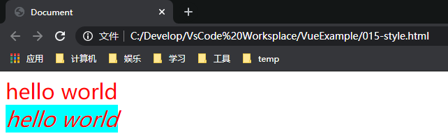

# Vue基础

## 一、Vue概述

### 1.1什么是Vuejs

一套构建用户界面的框架，只关注视图层的内容，它也是前端的主流框架之一。

前端三大主流框架：

- Angular.js
- React.js
- Vue.js

前端框架主要负责的是MVC中V的这一层，主要的工作就是和界面打交道，主要是用来对页面中的数据进行处理，以及制作前端页面相关的特效及动画。


### 1.2为什么使用Vuejs

对于处理数据的方面可以完全的替换掉原有的dom操作理念（之前我们常用的原生js以及jquery类库），通过Vuejs框架提供的指令，开发人员不再关心dom是如何渲染的，可以有更多的时间去关注业务逻辑。


### 1.3Vuejs版本的区别

Vuejs最普遍的两个版本，分别是Vue1.js和Vue2.js。

版本2在版本1的基础上进行了大量的改动，Vue2.js是最主流的版本。


### 1.4MVC和MVVM的区别

MVC结构：

主要是对服务端的分层开发思想。

MVVM结构：

是前端视图层的分层开发思想，主要是用来将每一个页面分为M，V，VM这三种组件。其中M表示页面中的数据，V表示页面元素，VM表示M和V之间的整体调度者（核心）


## 二、Vuejs基础语法

### 2.1第一个Vue程序

```html
<!DOCTYPE html>
<html lang="en">
<head>
    <title>Document</title>
    <script src="js/vue-2.4.0.js"></script>
</head>
<body>
    <!-- 在外层标签div中引入id属性值，将来Vuejs会通过该id，找到需要操作的元素 -->
    <div id="app">
        <!-- 在前端页面元素的部分，其中的内容以插值表达式的形式存在 -->
        <!-- 在两对p标签中引入插值表达式，相当于将p标签中的内容写活了，内容以变量的形式存在 -->
        <p>{{str1}}</p>
        <p>{{str2}}</p>
    </div>
</body>
<script>
    // 当Vuejs框架导入进来之后，在浏览器的缓存中，就已经存在一个Vue构造器
    // new出来的vm对象，就是页面中对于模型和视图（数据和页面元素）的整体调度者
    var vm = new Vue({
        el: "#app", // el元素表达的是指定为哪个标签进行相应的vue.js的操作
        data : {    // data元素表达的是对于数据的表达，数据约定俗成都是以json的形式来呈现的
            "str1" : "Hello World",
            "str2" : "Hello Vue"
        }
    });
</script>
</html>
```


### 2.2指令属性的基本使用

#### 2.2.1v-cloak

**使用v-cloak主要为了解决插值表达式的闪烁问题。**

使用插值表达式的问题：

- 在页面加载的过程中，在页面中的{{}}插值表达式首先会被页面认可为是html元素中的内容，所以浏览器会首先将{{}}展现在页面上，页面加载完毕后，插值表达式{{}}才会真正转变为动态赋予的值。这就会造成一种现象，如果将来终端在访问服务器的过程中，网速较慢，{{}}会首先展现出来，之后一闪而过，加载完毕才会加载出最终被赋予的内容。这就是所谓的插值表达式的闪烁问题。

```html
<!DOCTYPE html>
<html lang="en">
<head>
    <title>Document</title>
    <script src="js/vue-2.4.0.js"></script>
    <style>
        [v-cloak]{
            display: none;
        }
    </style>
</head>

<body>
    <div id="app">
        <p v-cloak>{{str1}}</p>
        <p v-cloak>{{str2}}</p>
    </div>
    <script>
        var vm = new Vue({
            el: "#app", 
            data : {    
                "str1" : "Hello World",
                "str2" : "Hello Vue"
            }
        });
    </script>
</body>
</html>
```


#### 2.2.2v-text和v-html

在Vuejs中，为页面中的元素渲染值，可以使用三种形式：

1. 插值表达式
2. v-text
3. v-html

```html
<!DOCTYPE html>
<html lang="en">
<head>
    <title>Document</title>
    <script src="js/vue-2.4.0.js"></script>
</head>
<body>
    <div id="app">
        <p>{{str1}}</p>
        <p v-text="str2"></p>
        <p v-html="str3"></p>
    </div>
    <script>
        var vm = new Vue({
            el: "#app", 
            data : {    
                "str1" : "AA",
                "str2" : "BB",
                "str3" : "CC"
            }
        });
    </script>
</body>
</html>
```


#### 2.2.4插值表达式与v-text/v-html的区别

在元素中添加原有的值以后会怎么样

```html
<!DOCTYPE html>
<html lang="en">
<head>
    <title>Document</title>
    <script src="js/vue-2.4.0.js"></script>
</head>
<body>
    <div id="app">
        <p>============={{str1}}=============</p>
        <p v-text="str2">=============</p>
        <p v-html="str3">=============</p>
    </div>
    <script>
        var vm = new Vue({
            el: "#app", 
            data : {    
                "str1" : "AA",
                "str2" : "BB",
                "str3" : "CC"
            }
        });
    </script>
</body>
</html>
```


```html
<!DOCTYPE html>
<html lang="en">
<head>
    <title>Document</title>
    <script src="js/vue-2.4.0.js"></script>
</head>
<body>
    <div id="app">
        <p>{{str1}}</p>
        <p v-text="str2"></p>
        <p v-html="str3"></p>
    </div>
    <script>
        var vm = new Vue({
            el: "#app", 
            data : {    
                "str1" : "<font color='red'>AA</font>",
                "str2" : "<font color='red'>BB</font>",
                "str3" : "<font color='red'>CC</font>"
            }
        });
    </script>
</body>
</html>
```


> 说明：
>
> - 对于元素中已经存在的值，只有插值表达式能够将值保留。在原有的值基础上添加动态数据。
> - v-text主要是用来赋予纯内容，如果内容中包含html标签，也会把它当成文本，不会被浏览器解析。
> - v-html除了能够为前端元素赋予内容之外，更重要的是如果内容本身含有html标签，最终会被浏览器解析。


#### 2.2.5v-bind

v-bind是Vuejs中，提供用于绑定属性的指令。

```html
<!DOCTYPE html>
<html lang="en">
<head>
    <title>Document</title>
    <script src="js/vue-2.4.0.js"></script>
</head>
<body>
    <div id="app">
        <input type="text" v-bind:value="str1" />
        <!-- 省略写法 -->
        <input type="button" :value="str2" />
    </div>
    <script>
        var vm = new Vue({
            el: "#app", 
            data : {    
                "str1" : "AA",
                "str2" : "BB"                        
            }
        });
    </script>
</body>
</html>
```


> v-bind的几种使用方式：
>
> 1. 直接使用指令属性v-bind来为元素中的属性进行绑定操作
>
> 2. 使用简化后的方式，将v-bind去除，直接使用":"来对元素中的属性进行绑定(v-bind:value="" --> :value="")
>
> 3. 该简写只针对v-bind，对于其他指令无效
>
> 4. 在使用v-bind对元素中的属性进行绑定的时候，可以直接在操作值的位置进行内容的拼接
>
>    ```html
>    <!DOCTYPE html>
>    <html lang="en">
>    <head>
>        <title>Document</title>
>        <script src="js/vue-2.4.0.js"></script>
>    </head>
>    <body>
>        <div id="app">
>            <input type="text" v-bind:value="str1" />
>            <input type="button" :value="str2" /><br/>
>            <input type="text" :value="str3+'Hello World'" />
>        </div>
>        <script>
>            var vm = new Vue({
>                el: "#app", 
>                data : {    
>                    "str1" : "AA",
>                    "str2" : "BB",
>                    "str3" : "CC"
>                }
>            });
>        </script>
>    </body>
>    </html>
>    ```
>
>    


#### 2.2.6v-on指令触发事件

使用v-on的形式绑定事件，相当于原生js中的onclick，绑定事件也有简化方式(v-on-->@)

语法格式：

```html
v-on:click="函数名"
@click="函数名"
```

```html
<!DOCTYPE html>
<html lang="en">
<head>
    <title>Document</title>
    <script src="js/vue-2.4.0.js"></script>
</head>
<body>
    <div id="app">
        <input type="button" :value="str1" v-on:click="fun1" /><br/>
        <input type="button" :value="str2" @click="fun2" /><br/>
    </div>
    <script>
        var vm = new Vue({
            el: "#app", 
            data : {    
                "str1" : "单击1",
                "str2" : "单击2"
            },
            methods : {
                fun1(){
                    alert("单击1");
                },
                fun2(){
                    alert("单击2");
                }
            }
        });
    </script>
</body>
</html>
```


methods表示Vuejs中对于绑定事件函数的定义，可以同时定义多个函数，多个函数之间使用逗号进行分隔。


##### 2.2.6.1事件修饰符的使用

1. event.stop

   > **使用stop来对事件冒泡机制进行阻止。**
   >
   > **什么是事件冒泡机制？**
   >
   > 在触发了内层元素的同时，也会随之继续触发外层元素（外层元素包裹了内层元素），点击了内层元素也可以被认为同时点击了外层元素，所以两个事件都会被触发。
   >
   > ```html
   > <!DOCTYPE html>
   > <html lang="en">
   > <head>
   >     <title>Document</title>
   >     <script src="js/vue-2.4.0.js"></script>
   > </head>
   > <body>
   >     <div id="app">
   >         <div style="width: 200px;height: 200px; background-color: cadetblue;" @click="fun1">
   >             <div style="width: 100px;height: 100px; background-color: burlywood;" @click="fun2">
   >             </div>
   >         </div>
   >     </div>
   >     <script>
   >         var vm = new Vue({
   >             el: "#app", 
   >             methods : {
   >                 fun1(){
   >                     alert("触发外层div");
   >                 },
   >                 fun2(){
   >                     alert("触发里层div");
   >                 }
   >             }
   >         });
   >     </script>
   > </body>
   > </html>
   > ```
   >
   > 如果单击外层div会触发fun1函数
   >
   > 
   >
   > 如果单击内层div会先触发fun2函数，随后触发fun1函数，这就是事件冒泡机制
   >
   > 
   >
   > 
   >
   > 使用stop来阻止事件冒泡
   >
   > ```html
   > <!-- 在需要阻止的事件后加上.stop -->
   > <div style="width: 100px;height: 100px; background-color: burlywood;" @click.stop="fun2"></div>
   > ```
   >
   > 
   >
   > 单击触发里层事件后并没有随之触发外层事件。

2. event.prevent

   > **使用prevent来阻止超链接默认的行为。**
   >
   > **什么是超链接的默认行为？**
   >
   > 所谓的默认行为指的是超链接中的href属性链接，在实际开发项目中，不仅仅只是按钮需要绑定事件控制行为，超链接的使用也需要遵循自己绑定事件触发行为的方式，所以a标签中href链接往往被我们以特殊的方式处理掉(< a href="javascript:void(0)" />)
   >
   > ```html
   > <!DOCTYPE html>
   > <html lang="en">
   > <head>
   >     <title>Document</title>
   >     <script src="js/vue-2.4.0.js"></script>
   > </head>
   > <body>
   >     <div id="app">
   >         <a href="http://www.baidu.com" @click="fun1">单击1</a>
   >     </div>
   >     <script>
   >         var vm = new Vue({
   >             el: "#app", 
   >             methods : {
   >                 fun1(){
   >                     alert("单击1");
   >                 }
   >             }
   >         });
   >     </script>
   > </body>
   > </html>
   > ```
   >
   > 
   >
   > 
   >
   > 使用prevent来阻止超链接默认的行为
   >
   > ```html
   > <a href="http://www.baidu.com" @click.prevent="fun1">单击1</a>
   > ```

3. event.capture

   > **使用capture来实现捕获触发事件的机制。**
   >
   > 使用第一个例子中外层div套用内层div(没有阻止冒泡)，单击内层div后事件触发机制为，先内层后外层。
   >
   > 加入了capture之后的效果
   >
   > ```html
   > <!DOCTYPE html>
   > <html lang="en">
   > <head>
   >     <title>Document</title>
   >     <script src="js/vue-2.4.0.js"></script>
   > </head>
   > <body>
   >     <div id="app">
   >         <div style="width: 200px;height: 200px; background-color: cadetblue;" @click.capture="fun1">
   >             <div style="width: 100px;height: 100px; background-color: burlywood;" @click="fun2">
   > 
   >             </div>
   >         </div>
   >     </div>
   >     <script>
   >         var vm = new Vue({
   >             el: "#app", 
   >             methods : {
   >                 fun1(){
   >                     alert("触发外层div");
   >                 },
   >                 fun2(){
   >                     alert("触发里层div");
   >                 }
   >             }
   >         });
   >     </script>
   > </body>
   > </html>
   > ```
   >
   > 
   >
   > 
   >
   > **单击内层div的效果先触发了外层div随之触发了内层div，也就是说被capture修饰的事件会优先触发。**

4. event.self

   > **使用self实现阻止事件冒泡行为机制。**
   >
   > 使用第一个例子中外层div套用内层div(没有阻止冒泡)演示。
   >
   > 在内层div中添加self之后的效果
   >
   > ```html
   > <!DOCTYPE html>
   > <html lang="en">
   > <head>
   >     <title>Document</title>
   >     <script src="js/vue-2.4.0.js"></script>
   > </head>
   > <body>
   >     <div id="app">
   >         <div style="width: 200px;height: 200px; background-color: cadetblue;" @click="fun1">
   >             <div style="width: 100px;height: 100px; background-color: burlywood;" @click.self="fun2">
   >                 <input type="button" value="单击" @click="fun3"/>
   >             </div>
   >         </div>
   >     </div>
   >     <script>
   >         var vm = new Vue({
   >             el: "#app",
   >             methods: {
   >                 fun1() {
   >                     alert("触发外层div");
   >                 },
   >                 fun2() {
   >                     alert("触发里层div");
   >                 },
   >                 fun3() {
   >                     alert("单击");
   >                 }
   >             }
   >         });
   >     </script>
   > </body>
   > </html>
   > ```
   >
   > 
   >
   > 
   >
   > **可以看出没有触发里层div的事件，也就是说添加了self的事件会被阻止。**
   >
   > 使用self实现的是阻止自身冒泡行为，并不会真正阻止冒泡行为。

5. event.once

   > **使用once实现只触发一次事件处理函数。**
   >
   > **once需要结合prevent来使用，有时可能会有需求同时为一个事件添加多个修饰符，连续的绑定即可**
   >
   > ```html
   > @click.prevent.once=""
   > ```
   >
   > ```html
   > <!DOCTYPE html>
   > <html lang="en">
   > <head>
   >     <title>Document</title>
   >     <script src="js/vue-2.4.0.js"></script>
   > </head>
   > <body>
   >     <div id="app">
   >         <a href="http://www.baidu.com" @click.prevent.once="fun1">单击</a>
   >     </div>
   >     <script>
   >         var vm = new Vue({
   >             el: "#app",
   >             methods: {
   >                 fun1() {
   >                     alert("单击");
   >                 }
   >             }
   >         });
   >     </script>
   > </body>
   > </html>
   > ```
   >
   > 单击第一次时
   >
   > 
   >
   > 关闭窗口后，没有跳转百度网
   >
   > 单击第二次时
   >
   > 
   >
   > 直接跳转百度网
   >
   > 可以得出once修饰符可以使事件只触发一次。


#### 2.2.7v-model

**使用v-model可以实现双向数据绑定。**

1. 单向数据绑定方式：

   **使用模型渲染视图**

   

   v-bind只能实现单向数据绑定，通过VM将模型绑定到视图上并渲染，无法通过该形式实现数据的双向绑定。

2. 双向数据绑定方式：

   **不仅能够通过模型渲染视图，也可以通过视图的变化更新模型的值。**

   

   ```html
   <!DOCTYPE html>
   <html lang="en">
   <head>
       <title>Document</title>
       <script src="js/vue-2.4.0.js"></script>
   </head>
   <body>
       <div id="app">
           <div>{{str1}}</div>
           <input type="text" v-model:value="str1" />
       </div>
       <script>
           var vm = new Vue({
               el: "#app",
               data : {
                   str1 : "aaa"
               }
           });
       </script>
   </body>
   </html>
   ```

   

   修改文本框中的值后：

   

   > **注意：v-model只能运用在表单元素中。**

3. 使用v-model实现简单的计算器功能

   ```html
   <!DOCTYPE html>
   <html lang="en">
   
   <head>
       <title>Document</title>
       <script src="js/vue-2.4.0.js"></script>
   </head>
   
   <body>
       <div id="app">
           
           <input type="text" v-model="num1" />
   
           <select v-model="sign">
               <option value="+">+</option>
               <option value="-">-</option>
               <option value="*">*</option>
               <option value="/">/</option>
           </select>
   
           <input type="text" v-model="num2" />
   
           <input type="button" value="=" @click="count"/>
   
           <input type="text" v-model="result" />
       </div>
       <script>
           var vm = new Vue({
               el: "#app",
               data : {
                   num1 : 0,
                   num2 : 0,
                   sign : "+",
                   result : 0
               },
               methods : {
                   count(){
                       if(this.sign == "+"){
                           this.result = parseInt(this.num1) + parseInt(this.num2);
                       }
                       else if(this.sign == "-"){
                           this.result = parseInt(this.num1) - parseInt(this.num2);
                       }
                       else if(this.sign == "*"){
                           this.result = parseInt(this.num1) * parseInt(this.num2);
                       }
                       else if(this.sign == "/"){
                           this.result = parseInt(this.num1) / parseInt(this.num2);
                       }
                   }
               }
           });
       </script>
   </body>
   </html>
   ```
   
   


#### 2.2.8使用class样式

1. class样式的使用

   案例一：传递一个class样式的数组，通过v-bind做样式的绑定

   案例二：通过三目运算符操作以上数组

   案例三：使用对象(json)来表达以上三目运算符的操作

   案例四：使用对象来引用样式

   案例五：通过模型来做样式渲染（这样使用必须直接将具体的boolean值结果赋值，不能以this.模型的形式做引用）

   ```html
   <!DOCTYPE html>
   <html lang="en">
   <head>
       <title>Document</title>
       <script src="js/vue-2.4.0.js"></script>
       <style>
           .style1{
               color: red;
           }
   
           .style2{
               background-color: aqua;
           }
   
           .style3{
               font-style: italic;
           }
   
           .style4{
               font-size: 30px;
           }
       </style>
   </head>
   <body>
       <div id="app">
           <!-- 原生方法 -->
           <span class="style1 style2 style3 style4">hello world</span><br/>
           <!-- 案例一 -->
           <span :class="['style1', 'style2', 'style3', 'style4']">hello world</span><br/>
           <!-- 案例二 -->
           <span :class="['style1', 'style2', 'style3', flag?'style4':'']">hello world</span><br/>
           <!-- 案例三 -->
           <span :class="['style1', 'style2', {'style3' : flag}, 'style4']">hello world</span><br/>
           <!-- 案例四 -->
           <span :class="{style1 : true, style2 : true, style3 : true, style4 : false}">hello world</span><br/>
           <!-- 案例五 -->
           <span :class="myStyle">hello world</span><br/>
       </div>
       <script>
           var vm = new Vue({
               el: "#app",
               data : {
                  flag : false,
                  myStyle : {style1 : true, style2 : true, style3 : false, style4 : false},
               }
           });
       </script>
   </body>
   </html>
   ```
   
   
   
2. style样式补充

   在实际开发中，对于style的使用，没有class广泛，通常style属性只是对个别指定元素的样式进行的补充使用。

   案例一：引用样式对象

   案例二：引用样式数组

   ```html
   <!DOCTYPE html>
   <html lang="en">
   <head>
       <title>Document</title>
       <script src="js/vue-2.4.0.js"></script>
   </head>
   <body>
       <div id="app">
           <!-- 案例一 -->
           <span :style="myStyle1">hello world</span><br/>
           <!-- 案例二 -->
           <span :style="[myStyle1, myStyle2]">hello world</span><br/>
       </div>
       <script>
           var vm = new Vue({
               el: "#app",
               data : {
                   myStyle1 : {color : 'red', 'font-size' : '30px'},
                   myStyle2 : {'font-style' : 'italic', 'background-color' : 'aqua'}
               }
           });
       </script>
   </body>
   </html>
   ```

   

   

#### 2.2.9v-for指令

1. v-for的基本使用

   基本语法：

   ````vue
   (变量名) in 数组名
   (变量名,下标) in 数组名
   (key,value) in 对象
   (key,value,下标) in 对象
   ````

   

   案例一：遍历普通字符串数组

   ```html
       <div id="app">
           <!-- 直接使用插值表达式，引用数组，通过下标展示 -->
           <p>插值表达式</p>
           <p>{{cityList[0]}}</p>
           <p>{{cityList[1]}}</p>
           <p>{{cityList[2]}}</p>
           <p>{{cityList[3]}}</p>
           <p>{{cityList[4]}}</p>
   
           <!-- 使用v-for形式遍历数组 -->
           <p>v-for形式</p>
           <p v-for="city in cityList">
               {{city}}
           </p>
   
           <!-- 遍历出所有的元素以及对应的下标 -->
           <p>v-for形式遍历出元素及下标</p>
           <p v-for="(city,index) in cityList">
               {{index}}---{{city}}
           </p>
       </div>
       <script>
           var vm = new Vue({
               el: "#app",
               data : {
                   cityList : ["北京", "上海", "沈阳", "大连", "广州"]
               }
           });
       </script>
   ```

   

   

   案例二：遍历对象数组

   ```html
       <div id="app">
           <p v-for="(city,index) in cityList">
               {{index}}---{{city.id}}---{{city.name}}
           </p>
       </div>
       <script>
           var vm = new Vue({
               el: "#app",
               data : {
                   cityList : [
                       {id:"A0001", "name":"北京"},
                       {id:"A0002", "name":"上海"},
                       {id:"A0003", "name":"沈阳"},
                       {id:"A0004", "name":"大连"},
                       {id:"A0005", "name":"广州"}
                   ]
               }
           });
       </script>
   ```

   

   

   案例三：遍历对象的属性和属性值

   ```html
       <div id="app">
   
           <p v-for="(value,key,index) in city1">
               {{index}}---{{key}}---{{value}}
           </p>
   
       </div>
       <script>
           var vm = new Vue({
               el: "#app",
               data : {
                   city1 : {id:"A0001", "name":"北京"}
               }
           });
       </script>
   ```

   

   

   案例四：遍历整型

   ```html
       <div id="app">
   
           <p v-for="count in 10">
               {{count}}
           </p>
   
       </div>
       <script>
           var vm = new Vue({
               el: "#app",
               data : {
                   
               }
           });
       </script>
   ```

   

2. v-for指令使用注意事项

   对于key属性的使用案例，可以使用key属性来进行唯一标识

   ```html
   v-for="(city,index) in cityList" :key="city.id"
   ```

   > key属性的作用：
   >
   > - 在实际开发项目中，使用v-for仅仅是将元素遍历出来并展示，在其他需求中，使用到指定的遍历出来的某一个元素，那么视图并没有为我们提供一个有效的辨识指定元素的方式。
   > - **所以在遍历元素的过程中，需要为每一条遍历出来的元素做一个有效的标识。这个标识就是该元素在页面中的唯一标识，将来使用到该元素的时候，页面可以通过该标识认准该元素。**
   > - 在v-for的使用过程中，添加key属性及属性值就是做这个标识的最好的手段。
   >
   > 对于key属性的应用，值得注意的是：
   >
   > 1. key属性值必须是一个数值或者字符串，对象不能当作属性值。
   > 2. key属性的应用，必须要搭配绑定v-bind指令，在使用的时候必须以该形式":key"来使用，否则系统不会生效。
   > 3. 对key属性所赋的值，必须是记录的唯一标识，通常使用记录的id


#### 2.2.10v-if指令和v-show指令

1. v-if

   使用格式：

   ```html
   v-if:"true/false"
   <!-- 当值为true时，则展现标签对中的信息 -->
   <!-- 当值为false时，则不展现标签对中的信息 -->
   ```

   ```html
   <!DOCTYPE html>
   <html lang="en">
   <head>
       <title>Document</title>
       <script src="js/vue-2.4.0.js"></script>
   </head>
   <body>
       <div id="app">
   
           <p v-if="true">
               显示该文本1
           </p>
   
           <p v-if="false">
               显示该文本2
           </p>
   
       </div>
       <script>
           var vm = new Vue({
               el: "#app",
               data : {
                   
               }
           });
       </script>
   </body>
   </html>
   ```

   

2. v-show

   使用格式和v-if一样

   ```html
   <!DOCTYPE html>
   <html lang="en">
   <head>
       <title>Document</title>
       <script src="js/vue-2.4.0.js"></script>
   </head>
   <body>
       <div id="app">
   
           <p v-show="true">
               显示该文本1
           </p>
   
           <p v-show="false">
               显示该文本2
           </p>
   
       </div>
       <script>
           var vm = new Vue({
               el: "#app",
               data : {
                   
               }
           });
       </script>
   </body>
   </html>
   ```

   

3. v-if和v-show的比较

   ```html
   <!DOCTYPE html>
   <html lang="en">
   <head>
       <title>Document</title>
       <script src="js/vue-2.4.0.js"></script>
   </head>
   <body>
       <div id="app">
   
           <p v-if="flag">
               显示该文本1
           </p>
   
           <p v-show="flag">
               显示该文本2
           </p>
   
       </div>
       <script>
           var vm = new Vue({
               el: "#app",
               data : {
                   flag : true
               }
           });
       </script>
   </body>
   </html>
   ```

   > - 效果一致
   >
   > - 如果boolean值为true，则完全一致，浏览器的查看器中查看也是一致
   >
   >   
   >
   > - 如果boolean值为false，则v-if的没有展示，而v-show的被隐藏
   >
   >   


## 三、综合应用

### 3.1需求分析

完成一个学生信息管理系统的查询列表操作，可对该列表进行添加，删除等操作。

```html
<!DOCTYPE html>
<html lang="en">
<head>
    <title>Document</title>
    <script src="js/vue-2.4.0.js"></script>
    <style>
        .hFontColor{
            color: brown;
        }
        .hAlign{
            text-align: center;
        }
        td{
            text-align: center;
        }
    </style>
</head>
<body>
    <div id="app">
         <!-- 搭建用来填写信息的文本框，搭建表结构 -->
         <h3 :class="hstyle">学生信息管理系统</h3>
         <hr width="100%" /><br/>

         <!-- 添加操作 -->
         编号：<input type="text" v-model="id"/>&nbsp;&nbsp;
         姓名：<input type="text" v-model="name"/>&nbsp;&nbsp;
         性别：<input type="text" v-model="gender"/>&nbsp;&nbsp;
         年龄：<input type="text" v-model="age"/>&nbsp;&nbsp;
         <input type="button" value="保存学员" @click="save" />&nbsp;&nbsp;&nbsp;&nbsp;

         <!-- 查询操作 -->
         <input type="text" v-model="sname" />
         <input type="button" value="搜索" @click="search" />

         <br/><br/>

         <!-- 表格 -->
         <table border="1" width="100%" align="center" cellpadding="6px" cellspacing="0px">
            <tr>
                <td>序号</td>
                <td>编号</td>
                <td>姓名</td>
                <td>性别</td>
                <td>年龄</td>
                <td>操作</td>
            </tr>

            <!-- 内容部分 -->
            <tr v-for="(stu,index) in sList" :key="stu.id">
                <td>{{index+1}}</td>
                <td>{{stu.id}}</td>
                <td>{{stu.name}}</td>
                <td>{{stu.gender}}</td>
                <td>{{stu.age}}</td>
                <!-- 在方法中传实参，不需要使用插值表达式 -->
                <td><a href="" @click.prevent="del(stu.id)">删除</a></td>
            </tr>
         </table>

    </div>
    <script>
        var vm = new Vue({
            el: "#app",
            data : {

                sList : [
                    {id:"A0001", name:"张三", gender:"男", age:"23"},
                    {id:"A0002", name:"李四", gender:"男", age:"24"},
                    {id:"A0003", name:"王五", gender:"男", age:"25"}
                ],
                searchList : [
                    {id:"A0001", name:"张三", gender:"男", age:"23"},
                    {id:"A0002", name:"李四", gender:"男", age:"24"},
                    {id:"A0003", name:"王五", gender:"男", age:"25"}
                ],

                id : "",
                name : "",
                gender : "",
                age : "",
                sname : "",
                hstyle : {hFontColor : true, hAlign:true}
            },
            methods : {
                save(){
                    var s = {id:this.id, name:this.name, gender:this.gender, age:this.age};
                    this.sList.push(s);
                },
                del(id){
                    for(var i = 0; i < this.sList.length; i++){
                        if(this.sList[i].id == id){
                            this.sList.splice(i, 1);
                        }
                    }
                },
                search(){
                    this.sList = [];
                    for(var i = 0; i < this.searchList.length; i++){
                        if(this.searchList[i].name.indexOf(this.sname) >= 0){
                            this.sList.push(this.searchList[i]);
                        }
                    }
                }
            }
        });
    </script>
</body>
</html>
```


