# Vue实战

## 一、过滤器

过滤器是一个通过输入数据，能够及时对数据进行处理并返回一个数据结果的简单函数。

**过滤器经常用在数据所需的格式化时使用。**

例如：字符串的格式化以及日期的格式化等等。

过滤器最大的作用就是体现其复用性，如果在处理前端某些文本信息每一次都要经过重复的特殊处理，那么我们一定是要编写一个过滤器来使用。

**过滤器能够使用在两个地方：插值表达式和指令**


### 1.1全局过滤器的使用

全局过滤器指的是所有VM对象都能共享使用的过滤器。

案例一：将所有的字母大写

```html
<!DOCTYPE html>
<html lang="en">
<head>
    <title>Document</title>
    <script src="js/vue-2.4.0.js"></script>
</head>
<body>
    <div id="app">
        <!-- 
            使用过滤器的语法：
            {{ 内容 | 过滤器}}
         -->
        <p>{{str1 | ucase}}</p>
    </div>
    <script>

        // 自定义全局过滤器
        /*
            语法：Vue.filter
            参数1：该过滤器的名称
            参数2：函数---过滤器的行为
                  参数---需要操作的数据
        */
        Vue.filter("ucase", function(value){
            // 通过value的形参取得了需要操作的值
            // 将值转换成大写字母
            value = value.toUpperCase();
            return value;
        })

        var vm = new Vue({
            el: "#app",
            data : {
                "str1" : "aaa"
            }
        });
    </script>
</body>
</html>
```

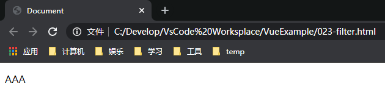

案例二：格式化时间的全局过滤器

```html
<!DOCTYPE html>
<html lang="en">
<head>
    <title>Document</title>
    <script src="js/vue-2.4.0.js"></script>
</head>
<body>
    <div id="app">
        <p>{{currentTime | DateTime}}</p>
    </div>
    <script>

        Vue.filter("DateTime", function(dateTime){
            var y = dateTime.getFullYear();
            // 如果不足两位，则前面补0
            var m = (dateTime.getMonth() + 1).toString().padStart(2, "0");
            var d = dateTime.getDate().toString().padStart(2, "0");
            var hour = dateTime.getHours().toString().padStart(2, "0");
            var min = dateTime.getMinutes().toString().padStart(2, "0");
            var sec = dateTime.getSeconds().toString().padStart(2, "0");

            return y + "-" + m + "-" + d + " " + hour + ":" + min + ":" + sec;
        })

        var vm = new Vue({
            el: "#app",
            data : {
                "currentTime" : new Date()
            }
        });
    </script>
</body>
</html>
```

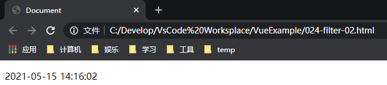


案例三：将所有的商品进行打折

```html
<!DOCTYPE html>
<html lang="en">
<head>
    <title>Document</title>
    <script src="js/vue-2.4.0.js"></script>
</head>
<body>
    <div id="app">
        <p v-for="(fruit, index) in fruitList" :key="fruit.id">
            {{fruit.id}}---{{fruit.name}}---{{fruit.price | priceCount}}
        </p>
    </div>
    <script>

        Vue.filter("priceCount", function(price){
            price = parseFloat(price) * 0.8;
            return price;
        })

        var vm = new Vue({
            el: "#app",
            data : {
                "fruitList" : [
                    {"id" : "A0001", "name" : "苹果", "price" : 10},
                    {"id" : "A0002", "name" : "香蕉", "price" : 15},
                    {"id" : "A0003", "name" : "西瓜", "price" : 13}
                ]
            }
        });
    </script>
</body>
</html>
```

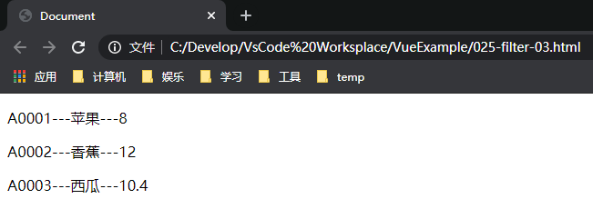

**以上案例都是在插值表达式中使用，除了在插值表达式中使用以外，还可以在bind属性指令中使用，只不过没有在插值表达式中使用广泛。**


#### 1.1.1连续使用多个过滤器的方式

```html
<!DOCTYPE html>
<html lang="en">
<head>
    <title>Document</title>
    <script src="js/vue-2.4.0.js"></script>
</head>
<body>
    <div id="app">
        <p>{{str1 | filter1 | filter2}}</p>
    </div>
    <script>
        // 将所有小写字母变成大写
        Vue.filter("filter1", function(value){
            return value.toUpperCase();
        })

        // 在原有字符基础上添加内容
        Vue.filter("filter2", function(value){
            return value + "123";
        })

        var vm = new Vue({
            el: "#app",
            data : {
                "str1" : "aaa"
            }
        });
    </script>
</body>
</html>
```

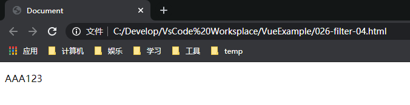


### 1.2私有过滤器的使用

私有过滤器指的是在指定的vm对象中来定义过滤器，该过滤器只在当前的vm对象中，会发挥作用，在其他的vm对象中无法使用。

语法格式：在vm对象中指定过滤器相关的属性和属性值。

```vue
var vm = new Vue({
	filters:{
		filter1: function(value){

                }
		filter2: function(value){

                }
		...
	}
})
```

案例一：

```html
<!DOCTYPE html>
<html lang="en">
<head>
    <title>Document</title>
    <script src="js/vue-2.4.0.js"></script>
</head>
<body>
    <div id="app1">
        <p>{{str1 | filter3}}</p>
    </div>

    <div id="app2">
        <p>{{str1 | filter3}}</p>
    </div>
    <script>
        var vm1 = new Vue({
            el: "#app1",
            data : {
                "str1" : "aaa"
            },
            filters : {
                filter3 : function(value){
                    return value + "bbb";
                },
            }
        });

        var vm2 = new Vue({
            el: "#app2",
            data : {
                "str1" : "aaa"
            }
        });
    </script>
</body>
</html>
```

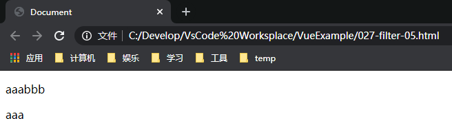

**私有过滤器和全局过滤器可以同名，在同名的情况下，默认会优先使用私有过滤器。遵循就近原则**


#### 1.2.1全局过滤器和私有过滤器搭配使用对值产生的传递性

```html
<!DOCTYPE html>
<html lang="en">
<head>
    <title>Document</title>
    <script src="js/vue-2.4.0.js"></script>
</head>
<body>

    <div id="app1">
        <p>{{str1 | filter1 | filter2 | filter3}}</p>
        <p>{{str1 | filter3 | filter2 | filter1}}</p>
    </div>

    <script>
        // 将所有小写字母变成大写
        Vue.filter("filter1", function(value){
            return value.toUpperCase();
        })

        // 在原有字符基础上添加内容
        Vue.filter("filter2", function(value){
            return value + "123";
        })

        var vm1 = new Vue({
            el: "#app1",
            data : {
                "str1" : "aaa"
            },
            filters : {
                filter3 : function(value){
                    return value + "bbb";
                },
            }
        });
    </script>
</body>
</html>
```

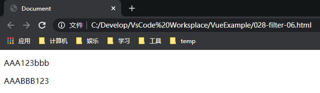

> **可以使用多个过滤器，多个过滤器在一起使用的时候，是具有信息传递性的。**


## 二、指令

### 2.1自定义全局指令

**指令与属性相似，是对指定元素样式或行为的赋予。**

在实际项目中，自定义一些我们所需的指令来有校的管理元素。

在页面中自定义的全局指令，可以为每一个VM对象中的元素提供服务，只要VM中的标签引用了全局指令，那么一定会即时生效。

一般情况下，我们普遍做的都是自定义全局指令来管理元素。

**注意：自定义指令需要经常搭配Vuejs中的钩子函数来进行操作。**

语法格式：

```vue
Vue.directive()
```

案例一：让文本框自动获取焦点

```html
<!DOCTYPE html>
<html lang="en">
<head>
    <title>Document</title>
    <script src="js/vue-2.4.0.js"></script>
</head>
<body>

    <div id="app1">
        请输入信息：<input type="text" v-dt1/>
    </div>

    <script>
        //自定义全局指令
        /*
            directive提供两个参数
            参数一：关于指令的名称，在定义的时候前面不需要加"v-"前缀，但是在使用过程中，一定要加上"v-"前缀
                    例如：指令名称为：dt1，使用时：v-dt1
            参数二：json对象，在这个对象身上，有一些指令相关的函数，这些函数可以在特定的阶段执行相关的操作（钩子函数）
        */
        Vue.directive("dt1", {
            /*
                以下定义的三个函数：这三个函数是与Vuejs对象生命周期密切相关的函数
                在每个函数中，第一个参数element，表示指令操作的元素
                注意：每一个element对象，同时也是一个原生Js对象（Dom对象）
            */

            // bind函数，每当指令绑定到该元素上的时候，会立即执行该函数，该函数只执行一次
            bind : function(element){

                // 将指定元素的文本信息改变颜色
                // 执行结果：文本框中的信息变红
                element.style.color = "red";

                // 页面加载完毕后，指定文本框自动获取焦点
                // 执行结果：文本框并没有自动获取焦点
                /*
                    在元素刚绑定了指令的时候，还没有插入到dom中去，这时候调用focus方法一定是没有作用的
                    一个元素只有插入到dom之后，才能够触发dom相关的方法（例如：使用focus方法取得焦点）
                */
               // element.focus();
                
            },

            // inserted函数，当元素插入到dom中时，会执行该函数，该函数只执行一次
            inserted : function(element){

                // 执行结果：文本框成功取得焦点
                element.focus();
            },

            // update函数：当Vuejs中的元素更新的时候，会触发该函数，元素是可以随时进行更新的，该函数可以触发多次。
            update : function(element){
                // 对于当前指令相关的测试，该函数暂时用不到
            }
        });
        
        var vm1 = new Vue({
            el: "#app1",
            data : {
                "str1" : "aaa"
            }
        });
    </script>
</body>
</html>
```

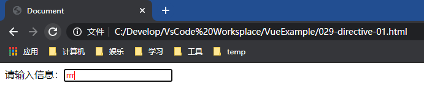


也可以通过参数为指令赋值

```html
<!DOCTYPE html>
<html lang="en">
<head>
    <title>Document</title>
    <script src="js/vue-2.4.0.js"></script>
</head>
<body>

    <div id="app1">
        请输入信息：<input type="text" v-dt1="'red'"/>
    </div>

    <script>
        //自定义全局指令

        Vue.directive("dt1", {

            /*
                参数二：在元素使用指令的时候，为函数传递的一个具体的值，该参数来接收该值，通过赋值的形式为元素来进行操作
            */
            bind : function(element, binding){
                // 执行结果：文本框中的信息会随着传递的参数值的变化而变化
                element.style.color = binding.value;
            }
        });
        
        var vm1 = new Vue({
            el: "#app1",
            data : {
                "str1" : "aaa"
            }
        });
    </script>
</body>
</html>
```

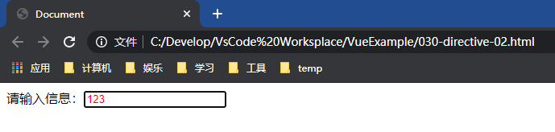


### 2.2自定义私有指令

私有指令是指在指定的vm对象中，只针对当前vm对象描述的元素生效的指令。其他的vm对象是不能够使用该指令的。

语法格式：

```
var vm = new Vue({
	directives : {
		指令1...
		指令2...
	}
})
```

案例一：

```html
<!DOCTYPE html>
<html lang="en">
<head>
    <title>Document</title>
    <script src="js/vue-2.4.0.js"></script>
</head>
<body>

    <div id="app1">
        <p v-mydt>显示信息</p>
    </div>

    <div id="app2">
        <p v-mydt>显示信息</p>
    </div>

    <script>
        var vm1 = new Vue({
            el: "#app1",
            directives : {
                "mydt" : {
                    bind : function(element){
                        element.style.color = "red"
                    }
                }
            }
        });

        var vm1 = new Vue({
            el: "#app2",
            directives : {
                "mydt" : {
                    bind : function(element){
                        element.style.color = "blue"
                    }
                }
            }
        });
    </script>
</body>
</html>
```

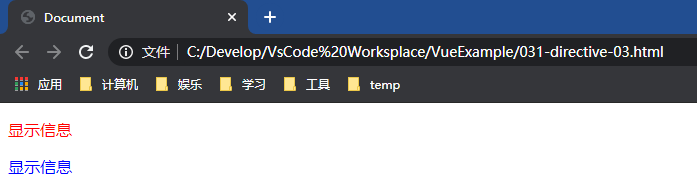


## 三、Vuejs对象的生命周期

### 3.1生命周期简介

指Vuejs对象从创建到销毁的全过程。


### 3.2创建阶段

1. new Vue()：执行代码 var vm = new Vue() 表示创建一个Vue对象

2. init（Events & Lifecycle）：执行完以上代码后，步入到对象初始化的前期阶段，表示通过以上代码我们创建了Vuejs对象，此时，在新建的对象身上，具备了一些生命周期相关的函数**（生命周期的钩子函数）**和默认的事件。但是其他的相关组件**（data、methods、filter等等）**还没有被创建。

   **执行init(Events & Lifecycle)之后，钩子函数都被创建出来，马上调用生命周期函数beforeCreate，在该函数执行的时候，我们最常使用的组件data和methods等，都还没有被创建出来。**

3. init(injections & reactivity)：**该阶段是对象初始化的后期阶段。执行init(injections & reactivity)的方式是调用生命周期函数created。在该函数中，data和methods都已经被初始化好了。**也就是说，使用methods的方法或data中的数据，最早可以在created方法中来进行操作。

4. init对象初始化阶段执行完毕后，通过对元素和模板进行判断，系统开始编辑模板，将Vue代码中的指令进行执行，然后在内存中生成一个编辑好的模板字符串，最终将该模板字符串渲染为内存中的DOM。但是此时只是在内存中渲染好了模板，并没有将模板挂载到页面中去。该阶段执行完毕后，执行beforeMount方法。

5. Create vm：该阶段是将内存中编译好的模板，替换到浏览器的页面中。该阶段执行完毕后，执行mounted方法。只要执行完了mounted方法，就表示整个Vue对象已经初始化完毕了，此时正式脱离创建阶段进入到运行阶段。**如果通过某些插件操作页面上的DOM节点，最早在mounted方法中进行。**


### 3.3运行阶段

6. Virtual DOM：该阶段会根据Data中的最新数据，重新渲染出一份最新的DOM树，当最新的内存DOM树被更新了之后，会把最新的DOM树重新渲染到页面中去，这时候就完成了使用Model去渲染视图的过程。**该阶段的执行会使用到两个函数beforeUpdate和updated，这两个函数会根据data数据的变化，可重复的执行多次。**
   当beforeUpdate方法执行的时候，页面中显示的还是以前的数据，但是data中保存的是更新后的新数据，页面此时还没和最新的数据保持同步。

   当updated方法执行的时候，页面中和data数据已经保持同步了，都是最新的数据了。


### 3.4销毁阶段

7. Teardown（拆卸）：该阶段为对象准备销毁阶段，当对象实例运行完毕后，达到了对象销毁的条件。**执行beforeDestroy函数，该函数的执行正式标志着对象从运行阶段进入到了销毁阶段。对象身上的所有组件data、methods、filter等都还处于可用状态（因为对象只是步入到了销毁阶段，还没销毁）。该函数执行完毕后，对象正式销毁。**
8. Destroyed：该阶段为对象销毁后的阶段，**该阶段会执行destroyed函数，当该函数执行的时候，对象已经被销毁了，里面的data、methods等组件也不能使用了。**

**以上生命周期中使用的所有的函数，就是VueJS生命周期中最重要的钩子函数。**


## 四、钩子函数

> 生命周期中的八个钩子函数
>
> **钩子函数一般都会有一个参数，叫做el，这个el就是钩子函数的第一个参数，el表示的是要执行动画的DOM元素，是一个原生JS的DOM元素。**
>
> **创建对象时的钩子函数**
>
> beforeCreate：
>
> - VueJs对象生命周期第一个钩子函数，表示实例在完全被创建出来之前，会执行该函数。
>
> - 注意：beforeCreate函数执行的时候，data和methods中的数据都还没有被初始化出来。
>
>   ```html
>   <body>
>       <div id="app">
>           <!-- 测试对象创建相关的钩子函数 -->
>           <span id="msg">{{str1}}</span>
>       </div>
>       <script>
>           var vm = new Vue({
>               el: "#app",
>               data : {
>                   "str1" : "aaa"
>               },
>               methods : {
>                   showInfo(){
>                       alert(this.str1 + "bbb");
>                   }
>               },
>               // 这是我们VueJs对象生命周期第一个钩子函数，表示实例在完全被创建出来之前，会执行该函数。
>               // 注意：beforeCreate函数执行的时候，data和methods中的数据都还没有被初始化出来
>               beforeCreate(){
>                   alert(this.str1); // 结果：undefinded，表示data中的数据没有被初始化
>                   this.showInfo(); // 结果：没有执行该函数，表示methods中的数据没有被初始化
>               }
>           });
>       </script>
>   </body>
>   ```
>
>   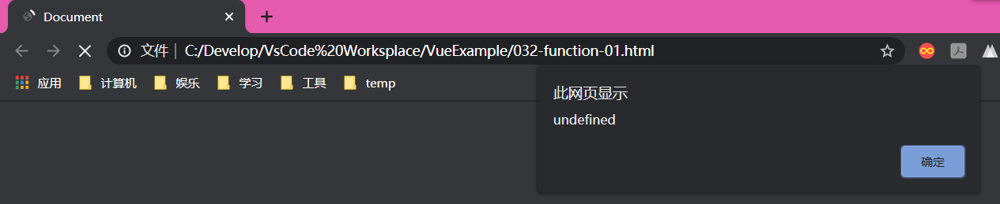
>
> created：
>
> - 在created中，data和methods等组件都已经被初始化完毕了。
>
> - 注意：此时还没有编辑模板。
>
> - 如果需要使用data中的数据和methods中的方法，最早只能在created方法中进行操作。
>
>   ```html
>   <body>
>
>       <div id="app">
>           <!-- 测试对象创建相关的钩子函数 -->
>           <span id="msg">{{str1}}</span>
>       </div>
>       <script>
>           var vm = new Vue({
>               el: "#app",
>               data : {
>                   "str1" : "aaa"
>               },
>               methods : {
>                   showInfo(){
>                       alert(this.str1 + "bbb");
>                   }
>               },
>               created(){
>                   alert(this.str1); // 结果：aaa
>                   this.showInfo(); // 结果：aaabbb
>               }
>           });
>       </script>
>   </body>
>   ```
>
>   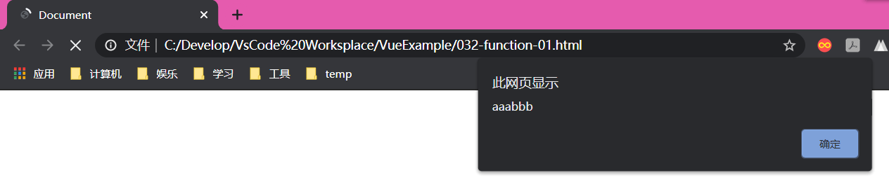
>
> beforeMount：
>
> - 该函数的执行，表示模板已经在内存中编辑成功，但是还没有将模板渲染到页面中。页面中的元素还没有被真正的替换成我们所需的值，只是在内存中写了一些模板字符串
>
>   ```html
>   <body>
>       <div id="app">
>           <!-- 测试对象创建相关的钩子函数 -->
>           <span id="msg">{{str1}}</span>
>       </div>
>       <script>
>           var vm = new Vue({
>               el: "#app",
>               data : {
>                   "str1" : "aaa"
>               },
>               methods : {
>                   showInfo(){
>                       alert(this.str1 + "bbb");
>                   }
>               },
>               beforeMount(){
>                   var msg = document.getElementById("msg").innerHTML;
>                   alert(msg); // 结果：{{str1}}，表示还没有将模板渲染到页面中
>               }
>           });
>       </script>
>   </body>
>   ```
>
>   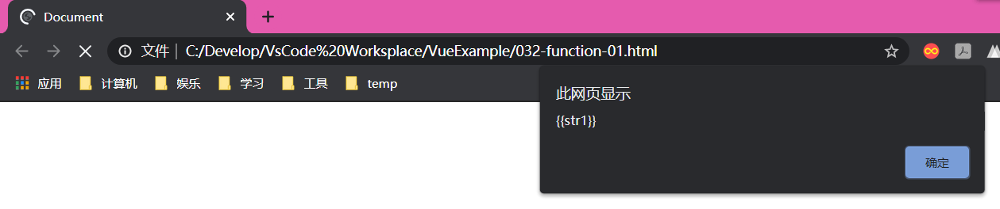
>
> mounted：
>
> - 该函数的执行，表示内存中的模板已经真实的挂载到了页面中，用户已经可以看到挂载好的页面了。
>
> - mounted函数是VueJs对象创建期间的最后一个生命周期函数，当我们执行完mounted方法之后表示实例已经被完全创建好了。
>
>   ```html
>   <body>
>       <div id="app">
>           <!-- 测试对象创建相关的钩子函数 -->
>           <span id="msg">{{str1}}</span>
>       </div>
>       <script>
>           var vm = new Vue({
>               el: "#app",
>               data : {
>                   "str1" : "aaa"
>               },
>               methods : {
>                   showInfo(){
>                       alert(this.str1 + "bbb");
>                   }
>               },
>               mounted(){
>                   var msg = document.getElementById("msg").innerHTML;
>                   alert(msg);  // 结果：aaa 表示内存中的模板已经同步到了页面中
>               }
>           });
>       </script>
>   </body>
>   ```
>
>   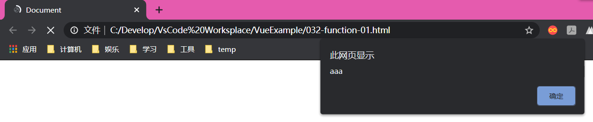
>
> 
>
> **对象运行时的钩子函数**
>
> beforeUpdate：
>
> - 在更新数据前，执行该函数，执行时，页面中显示的还是上一次的旧数据，此时data中的数据是最新的，页面尚未和最新的data中的数据保持同步。
>
>   ```html
>   <body>
>       <div id="app">
>           <!-- 测试对象创建相关的钩子函数 -->
>           <span id="msg">{{str1}}</span>
>           <br/><br/>
>           <!-- 测试对象运行相关的钩子函数 -->
>           请输入信息：<input type="text" v-model="str1" />
>       </div>
>       <script>
>           var vm = new Vue({
>               el: "#app",
>               data : {
>                   "str1" : "aaa"
>               },
>               methods : {
>                   showInfo(){
>                       alert(this.str1 + "bbb");
>                   }
>               },
>               beforeUpdate(){
>                   var msg = document.getElementById("msg").innerHTML;
>                   alert(msg); // 每一次展示的数据都是上一次的旧数据
>               },
>           });
>       </script>
>   </body>
>   ```
>
>   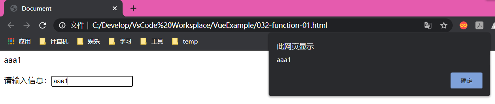
>
> updated：
>
> - 执行该函数时，页面和data数据已经保持同步，都是最新的数据
>
>   ```html
>   <body>
>       <div id="app">
>           <!-- 测试对象创建相关的钩子函数 -->
>           <span id="msg">{{str1}}</span>
>           <br/><br/>
>           <!-- 测试对象运行相关的钩子函数 -->
>           请输入信息：<input type="text" v-model="str1" />
>       </div>
>       <script>
>           var vm = new Vue({
>               el: "#app",
>               data : {
>                   "str1" : "aaa"
>               },
>               methods : {
>                   showInfo(){
>                       alert(this.str1 + "bbb");
>                   }
>               },
>               updated(){
>                   var msg = document.getElementById("msg").innerHTML;
>                   alert(msg); // 展示的是最新的data中的数据
>               }
>           });
>       </script>
>   </body>
>   ```
>
>   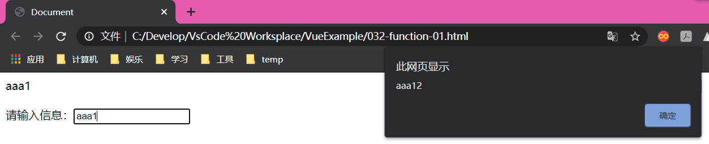
>
> beforeDestroy：
>
> - 执行该函数说明对象处于准备销毁阶段，对象中的组件在此函数中，仍然可以使用的。
>
> destroyed：
>
> - 执行该函数说明对象已经销毁完毕了，对象中的组件随着对象的销毁也不可用了。


## 五、VueJs的Ajax请求

VueJs本身不支持发送Ajax请求的，需要使用插件来实现。

1. vue-resource插件
2. axios插件


### 5.1使用vue-resource插件来实现get和post请求

创建一个Java Web工程，创建servlet并配置web.xml

**无参数形式：**

```java
public class MyServlet01 extends HttpServlet {

    @Override
    protected void doGet(HttpServletRequest request, HttpServletResponse response) throws ServletException, IOException {
        System.out.println("进入到get请求");
        Student stu = new Student("1001", "zs", "23");
        // 将stu对象解析成json返回给前台 {"id" : "", "name" : "", "age" : ""}
        String s = "{\"id\" : \""+ stu.getId() +"\", \"name\" : \""+ stu.getName() +"\", \"age\" : \""+ stu.getAge() +"\"}";

        response.getWriter().print(s);
    }

    @Override
    protected void doPost(HttpServletRequest request, HttpServletResponse response) throws ServletException, IOException {
        System.out.println("进入到post请求");
    }
}
```

```xml
<?xml version="1.0" encoding="UTF-8"?>
<web-app xmlns="http://xmlns.jcp.org/xml/ns/javaee"
         xmlns:xsi="http://www.w3.org/2001/XMLSchema-instance"
         xsi:schemaLocation="http://xmlns.jcp.org/xml/ns/javaee http://xmlns.jcp.org/xml/ns/javaee/web-app_4_0.xsd"
         version="4.0">

    <servlet>
        <servlet-name>MyServlet</servlet-name>
        <servlet-class>com.bjpowernode.servlet.MyServlet01</servlet-class>
    </servlet>
    <servlet-mapping>
        <servlet-name>MyServlet</servlet-name>
        <url-pattern>/MyServlet.do</url-pattern>
    </servlet-mapping>
</web-app>
```

创建jsp页面

```jsp
<%@ page contentType="text/html;charset=UTF-8" language="java" %>
<%
    String basePath = request.getScheme() + "://" + request.getServerName()+ ":" + request.getServerPort() + request.getContextPath() + "/";
%>
<html>
<head>
    <base href="<%=basePath%>">
    <title>Title</title>
    <script src="js/vue-2.4.0.js" ></script>
    <script src="js/vue-resource-1.3.4.js" ></script>
</head>
<body>
    <div id="app">
        <button @click="getStudent">点击取得学生信息</button>
        <br/><br/>
        编号：<span>{{id}}</span><br/>
        姓名：<span>{{name}}</span><br/>
        年龄：<span>{{age}}</span><br/>
    </div>

    <script>
        var vm = new Vue({
            el : "#app",
            data : {
                "id" : "",
                "name" : "",
                "age" : ""
            },
            methods : {
                getStudent(){
                    // 发出ajax请求，取得学生信息，在页面中局部刷新学生信息
                    // this.$http.get("请求路径",请求参数).then(回调函数)
                    this.$http.get("MyServlet.do").then(function (resp){
                        // 通过resp.body的形式来拿到服务器返回成功的数据
                        // alert(resp.body.id); // 1001
                        // alert(resp.id); // undefined

                        // 为页面赋值
                        this.id = resp.body.id;
                        this.name = resp.body.name;
                        this.age = resp.body.age;
                    })
                }
            }
        })
    </script>
</body>
</html>
```

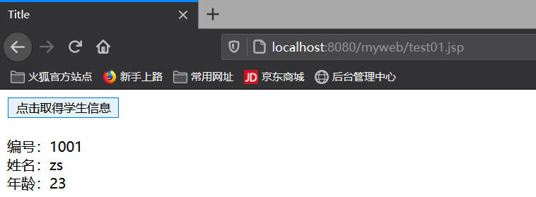

**有参数形式：**

对于参数的传递，get请求和post请求参数传递的语法是不同的，这一点有别于其他的前端语言。

对于get请求，必须是在路径的后面以url?key1=value1&key2=value2这种传统形式

```java
public class MyServlet01 extends HttpServlet {

    @Override
    protected void doGet(HttpServletRequest request, HttpServletResponse response) throws ServletException, IOException {
        System.out.println("进入到get请求");
        Student stu = new Student("1001", "zs", "23");
        String name = request.getParameter("name");
        System.out.println(name);
        String s = "";
        if ("zs".equals(name)){
            s = "{\"id\" : \""+ stu.getId() +"\", \"name\" : \""+ stu.getName() +"\", \"age\" : \""+ stu.getAge() +"\"}";
        }else {
            s = "{\"id\" : \"\", \"name\" : \"\", \"age\" : \"\"}";
        }
        // 将stu对象解析成json返回给前台 {"id" : "", "name" : "", "age" : ""}
        response.getWriter().print(s);
    }

    @Override
    protected void doPost(HttpServletRequest request, HttpServletResponse response) throws ServletException, IOException {
        System.out.println("进入到post请求");
    }
}
```

```jsp
<%@ page contentType="text/html;charset=UTF-8" language="java" %>
<%
    String basePath = request.getScheme() + "://" + request.getServerName()+ ":" + request.getServerPort() + request.getContextPath() + "/";
%>
<html>
<head>
    <base href="<%=basePath%>">
    <title>Title</title>
    <script src="js/vue-2.4.0.js" ></script>
    <script src="js/vue-resource-1.3.4.js" ></script>
</head>
<body>
    <div id="app">
        <button @click="getStudent">点击取得学生信息</button>
        <br/><br/>
        编号：<span>{{id}}</span><br/>
        姓名：<span>{{name}}</span><br/>
        年龄：<span>{{age}}</span><br/>
    </div>

    <script>
        var vm = new Vue({
            el : "#app",
            data : {
                "id" : "",
                "name" : "",
                "age" : ""
            },
            methods : {
                getStudent(){
                    // 发出ajax请求，取得学生信息，在页面中局部刷新学生信息
                    // this.$http.get("请求路径?key1=value1&key2=value2").then(回调函数)
                    this.$http.get("MyServlet.do?name=zs").then(function (resp){
                        // 通过resp.body的形式来拿到服务器返回成功的数据
                        // alert(resp.body.id); // 1001
                        // alert(resp.id); // undefined

                        // 为页面赋值
                        this.id = resp.body.id;
                        this.name = resp.body.name;
                        this.age = resp.body.age;
                    })
                }
            }
        })
    </script>
</body>
</html>
```

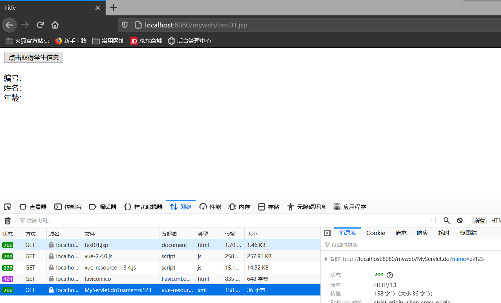

对于post请求，必须以请求体的方式来传递的，必须在后面加一个参数{emulateJSON:true}

```java
public class MyServlet01 extends HttpServlet {

    @Override
    protected void doGet(HttpServletRequest request, HttpServletResponse response) throws ServletException, IOException {
        System.out.println("进入到get请求");
        Student stu = new Student("1001", "zs", "23");
        String name = request.getParameter("name");
        System.out.println(name);
        String s = "";
        if ("zs".equals(name)){
            s = "{\"id\" : \""+ stu.getId() +"\", \"name\" : \""+ stu.getName() +"\", \"age\" : \""+ stu.getAge() +"\"}";
        }else {
            s = "{\"id\" : \"\", \"name\" : \"\", \"age\" : \"\"}";
        }
        // 将stu对象解析成json返回给前台 {"id" : "", "name" : "", "age" : ""}
        response.getWriter().print(s);
    }

    @Override
    protected void doPost(HttpServletRequest request, HttpServletResponse response) throws ServletException, IOException {
        System.out.println("进入到post请求");
        Student stu = new Student("1002", "ls", "24");
        String name = request.getParameter("name");
        System.out.println(name);
        String s = "";
        if ("ls".equals(name)){
            s = "{\"id\" : \""+ stu.getId() +"\", \"name\" : \""+ stu.getName() +"\", \"age\" : \""+ stu.getAge() +"\"}";
        }else {
            s = "{\"id\" : \"\", \"name\" : \"\", \"age\" : \"\"}";
        }
        response.getWriter().print(s);
    }
}
```

```jsp
<%@ page contentType="text/html;charset=UTF-8" language="java" %>
<%
    String basePath = request.getScheme() + "://" + request.getServerName()+ ":" + request.getServerPort() + request.getContextPath() + "/";
%>
<html>
<head>
    <base href="<%=basePath%>">
    <title>Title</title>
    <script src="js/vue-2.4.0.js" ></script>
    <script src="js/vue-resource-1.3.4.js" ></script>
</head>
<body>
    <div id="app">
        <button @click="getStudent">点击取得学生信息</button>
        <br/><br/>
        编号：<span>{{id}}</span><br/>
        姓名：<span>{{name}}</span><br/>
        年龄：<span>{{age}}</span><br/>
    </div>

    <script>
        var vm = new Vue({
            el : "#app",
            data : {
                "id" : "",
                "name" : "",
                "age" : ""
            },
            methods : {
                getStudent(){
                    // 发出ajax请求，取得学生信息，在页面中局部刷新学生信息
                    // post请求参数传递的方式，是以请求体的方式传递的，所以不能将挂在url地址栏后
                    // 发出post请求this.$http.post("请求路径", {"key1":"value1", "key2":"value2"}).then(回调函数)
                    this.$http.post("MyServlet02.do", {"name" : "ls"},{emulateJSON:true}).then(function (resp) {
                        this.id = resp.body.id;
                        this.name = resp.body.name;
                        this.age = resp.body.age;
                    })
                }
            }
        })
    </script>
</body>
</html>
```

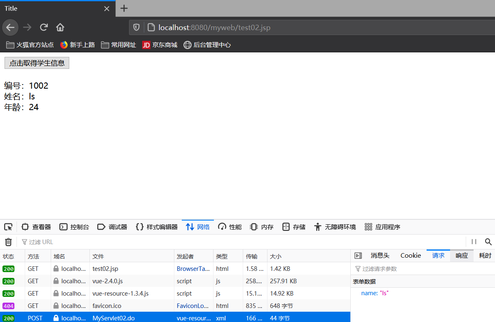


> 关于post请求传递参数的问题：
>
> - 手动发起的post请求，默认没有表单格式，所以有些服务器就处理不了，需要通过post方法的第三个参数{emulateJSON:true}设置，提交的内容类型就设置为了普通表单格式传递参数。


### 5.2使用axios插件来实现get和post请求

创建一个Java Web工程，创建servlet并配置web.xml

**无参数形式：**

```java
public class MyServlet02 extends HttpServlet {

    @Override
    protected void doGet(HttpServletRequest request, HttpServletResponse response) throws ServletException, IOException {
        System.out.println("进入到get请求");
        Student stu = new Student("A0001", "zl", "25");
        String s = "{\"id\" : \""+ stu.getId() +"\", \"name\" : \""+ stu.getName() +"\", \"age\" : \""+ stu.getAge() +"\"}";
        response.getWriter().print(s);
    }

    @Override
    protected void doPost(HttpServletRequest request, HttpServletResponse response) throws ServletException, IOException {
        System.out.println("进入到post请求");
    }
}
```

```xml
<servlet>
    <servlet-name>MyServlet03</servlet-name>
    <servlet-class>com.bjpowernode.servlet.MyServlet02</servlet-class>
</servlet>
<servlet-mapping>
    <servlet-name>MyServlet03</servlet-name>
    <url-pattern>/MyServlet03.do</url-pattern>
</servlet-mapping>
```

jsp页面

```jsp
<%@ page contentType="text/html;charset=UTF-8" language="java" %>
<%
    String basePath = request.getScheme() + "://" + request.getServerName()+ ":" + request.getServerPort() + request.getContextPath() + "/";
%>
<html>
<head>
    <base href="<%=basePath%>">
    <title>Title</title>
    <script src="js/vue-2.4.0.js" ></script>
    <script src="js/axios.min.js" ></script>
</head>
<body>
    <div id="app">
        <button @click="getStudent1">按钮1：点击取得学生信息</button>
        <button @click="getStudent2">按钮2：点击取得学生信息</button>
        <br/><br/>
        编号：<span>{{id}}</span><br/>
        姓名：<span>{{name}}</span><br/>
        年龄：<span>{{age}}</span><br/>
    </div>

    <script>
        var vm = new Vue({
            el : "#app",
            data : {
                "id" : "",
                "name" : "",
                "age" : ""
            },
            methods : {
              	// ------------------------------------方法一-----------------------------------------
                getStudent1(){
                    /*
                        在请求执行成功后，执行回调函数中的内容，回调函数处于其他函数的内部，this不会与任何的对象绑定（以this.data的形式引入数据就引不到了）
                        将指向vue对象的this赋值给外部方法定义的属性，然后在内部方法中使用该属性即可。
                    */

                    var _this = this;

                    axios({
                        method : "get", // 请求方式
                        url : "MyServlet03.do", // 请求路径
                    }).then(function (resp){
                        /*
                            之前使用vue-resource插件，对于值的处理，需要使用返回值.body的操作
                            而使用axios插件，同样需要对返回值进行操作，这次使用的是返回值.data的形式
                         */
                        // alert(resp.id); // undefined
                        // alert(resp.data.id); //A0001

                        _this.id = resp.data.id;
                        _this.name = resp.data.name;
                        _this.age = resp.data.age;
                    })
                },
                
                // ------------------------------------方法二-----------------------------------------
                getStudent2(){
                    axios({
                        method : "get", // 请求方式
                        url : "MyServlet03.do", // 请求路径
                        // 使用箭头表达式=>来代替原有的function做回调函数
                    }).then(resp => {
                        this.id = resp.data.id;
                        this.name = resp.data.name;
                        this.age = resp.data.age;
                    })
                }
            }
        })
    </script>
</body>
</html>
```

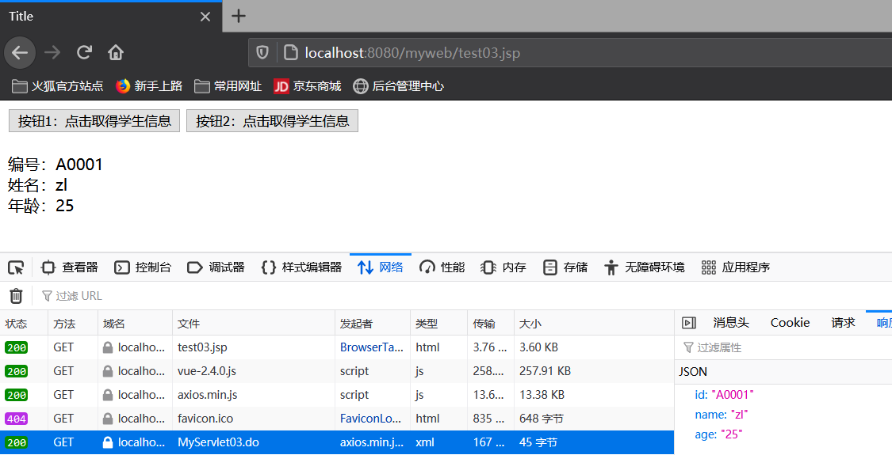

**有参数形式：**

对于get请求，可以使用路径的后面以url?key1=value1&key2=value2这种传统形式，也可以使用json串的形式

```java
public class MyServlet02 extends HttpServlet {

    @Override
    protected void doGet(HttpServletRequest request, HttpServletResponse response) throws ServletException, IOException {
        System.out.println("进入到get请求");
        Student stu = new Student("A0001", "zl", "25");
        String name = request.getParameter("name");
        String s = "";
        if ("zl".equals(name)){
            s = "{\"id\" : \""+ stu.getId() +"\", \"name\" : \""+ stu.getName() +"\", \"age\" : \""+ stu.getAge() +"\"}";
        }else {
            s = "{\"id\" : \"\", \"name\" : \"\", \"age\" : \"\"}";
        }
        response.getWriter().print(s);
    }

    @Override
    protected void doPost(HttpServletRequest request, HttpServletResponse response) throws ServletException, IOException {
        System.out.println("进入到post请求");
    }
}
```

```jsp
<%@ page contentType="text/html;charset=UTF-8" language="java" %>
<%
    String basePath = request.getScheme() + "://" + request.getServerName()+ ":" + request.getServerPort() + request.getContextPath() + "/";
%>
<html>
<head>
    <base href="<%=basePath%>">
    <title>Title</title>
    <script src="js/vue-2.4.0.js" ></script>
    <script src="js/axios.min.js" ></script>
</head>
<body>
    <div id="app">
        <button @click="getStudent1">按钮1：点击取得学生信息</button>
        <button @click="getStudent2">按钮2：点击取得学生信息</button>
        <br/><br/>
        编号：<span>{{id}}</span><br/>
        姓名：<span>{{name}}</span><br/>
        年龄：<span>{{age}}</span><br/>
    </div>

    <script>
        var vm = new Vue({
            el : "#app",
            data : {
                "id" : "",
                "name" : "",
                "age" : ""
            },
            methods : {
                // ------------------------------------方法一-----------------------------------------
                getStudent1(){
                    /*
                        在请求执行成功后，执行回调函数中的内容，回调函数处于其他函数的内部，this不会与任何的对象绑定（以this.data的形式引入数据就引不到了）
                        将指向vue对象的this赋值给外部方法定义的属性，然后在内部方法中使用该属性即可。
                    */

                    var _this = this;

                    axios({
                        method : "get", // 请求方式
                        url : "MyServlet03.do?name=zl123", // 请求路径
                    }).then(function (resp){
                        /*
                            之前使用vue-resource插件，对于值的处理，需要使用返回值.body的操作
                            而使用axios插件，同样需要对返回值进行操作，这次使用的是返回值.data的形式
                         */
                        // alert(resp.id); // undefined
                        // alert(resp.data.id); //A0001

                        _this.id = resp.data.id;
                        _this.name = resp.data.name;
                        _this.age = resp.data.age;
                    })
                },

                // ------------------------------------方法二-----------------------------------------
                getStudent2(){
                    axios({
                        method : "get", // 请求方式
                        url : "MyServlet03.do?name=zl", // 请求路径
                        // 使用箭头表达式=>来代替原有的function做回调函数
                    }).then(resp => {
                        this.id = resp.data.id;
                        this.name = resp.data.name;
                        this.age = resp.data.age;
                    })
                }
            }
        })
    </script>
</body>
</html>
```

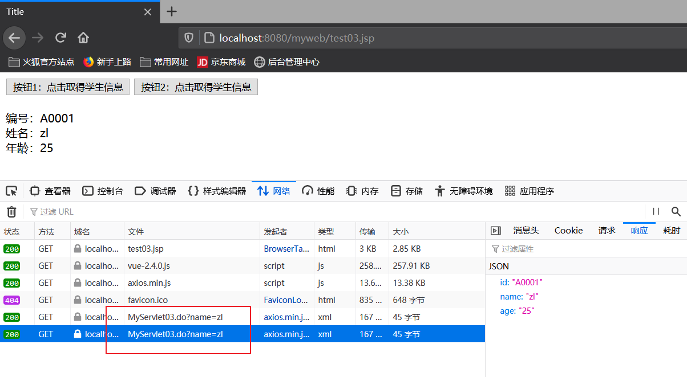

对于post请求，可以使用params ：json的形式来传递参数

```jsp
<%@ page contentType="text/html;charset=UTF-8" language="java" %>
<%
    String basePath = request.getScheme() + "://" + request.getServerName()+ ":" + request.getServerPort() + request.getContextPath() + "/";
%>
<html>
<head>
    <base href="<%=basePath%>">
    <title>Title</title>
    <script src="js/vue-2.4.0.js" ></script>
    <script src="js/axios.min.js" ></script>
</head>
<body>
    <div id="app">
        <button @click="getStudent1">按钮1：点击取得学生信息</button>
        <button @click="getStudent2">按钮2：点击取得学生信息</button>
        <br/><br/>
        编号：<span>{{id}}</span><br/>
        姓名：<span>{{name}}</span><br/>
        年龄：<span>{{age}}</span><br/>
    </div>

    <script>
        var vm = new Vue({
            el : "#app",
            data : {
                "id" : "",
                "name" : "",
                "age" : ""
            },
            methods : {
                // ------------------------------------方法一-----------------------------------------
                getStudent1(){
                    /*
                        在请求执行成功后，执行回调函数中的内容，回调函数处于其他函数的内部，this不会与任何的对象绑定（以this.data的形式引入数据就引不到了）
                        将指向vue对象的this赋值给外部方法定义的属性，然后在内部方法中使用该属性即可。
                    */

                    var _this = this;

                    axios({
                        method : "get", // 请求方式
                        url : "MyServlet03.do?name=zl", // 请求路径
                    }).then(function (resp){
                        /*
                            之前使用vue-resource插件，对于值的处理，需要使用返回值.body的操作
                            而使用axios插件，同样需要对返回值进行操作，这次使用的是返回值.data的形式
                         */
                        // alert(resp.id); // undefined
                        // alert(resp.data.id); //A0001

                        _this.id = resp.data.id;
                        _this.name = resp.data.name;
                        _this.age = resp.data.age;
                    })
                },

                // ------------------------------------方法二-----------------------------------------
                getStudent2(){
                    axios({
                        method : "post", // 请求方式
                        url : "MyServlet03.do", // 请求路径
                        params : {"name" : "zl"}
                        // 使用箭头表达式=>来代替原有的function做回调函数
                    }).then(resp => {
                        this.id = resp.data.id;
                        this.name = resp.data.name;
                        this.age = resp.data.age;
                    })
                }
            }
        })
    </script>
</body>
</html>
```

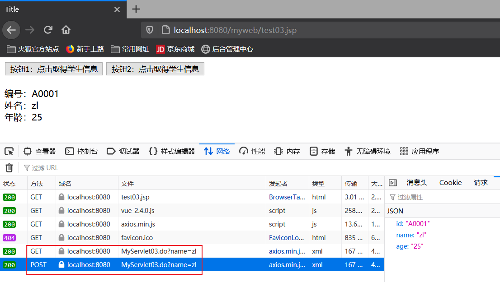


**axios的第二种实现方式：**

get请求

```jsp
<%@ page contentType="text/html;charset=UTF-8" language="java" %>
<%
    String basePath = request.getScheme() + "://" + request.getServerName()+ ":" + request.getServerPort() + request.getContextPath() + "/";
%>
<html>
<head>
    <base href="<%=basePath%>">
    <title>Title</title>
    <script src="js/vue-2.4.0.js" ></script>
    <script src="js/axios.min.js" ></script>
</head>
<body>
    <div id="app">
        <button @click="getStudent1">按钮1：点击取得学生信息</button>
        <br/><br/>
        编号：<span>{{id}}</span><br/>
        姓名：<span>{{name}}</span><br/>
        年龄：<span>{{age}}</span><br/>
    </div>

    <script>
        var vm = new Vue({
            el : "#app",
            data : {
                "id" : "",
                "name" : "",
                "age" : ""
            },
            methods : {
                getStudent1(){
                    axios.get(
                        "MyServlet03.do", // 请求路径
                        {params: {"name" : "zl"}}, // 请求参数
                    ).then(resp => {
                        this.id = resp.data.id;
                        this.name = resp.data.name;
                        this.age = resp.data.age;
                    })
                }
            }
        })
    </script>
</body>
</html>
```

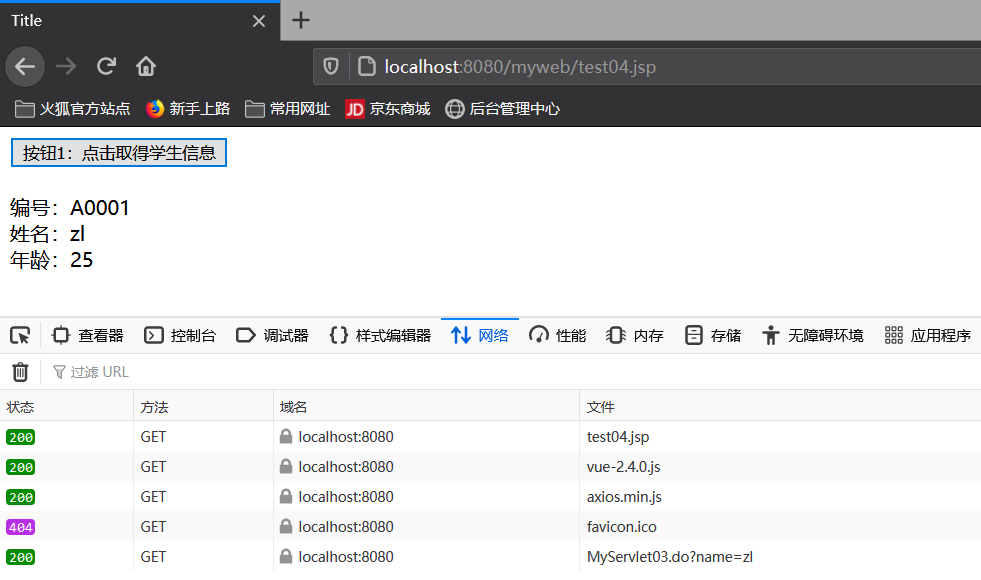

post请求

> 在该方式发送post请求中，发送的数据是一个Request Payload的数据格式，一般的数据格式都是Form Data格式，所以我们之前写的以json形式的参数就发送不出去，只能通过传统字符串的方式来发送参数。

```jsp
<%@ page contentType="text/html;charset=UTF-8" language="java" %>
<%
    String basePath = request.getScheme() + "://" + request.getServerName()+ ":" + request.getServerPort() + request.getContextPath() + "/";
%>
<html>
<head>
    <base href="<%=basePath%>">
    <title>Title</title>
    <script src="js/vue-2.4.0.js" ></script>
    <script src="js/axios.min.js" ></script>
</head>
<body>
    <div id="app">
        <button @click="getStudent1">按钮1：点击取得学生信息</button>
        <br/><br/>
        编号：<span>{{id}}</span><br/>
        姓名：<span>{{name}}</span><br/>
        年龄：<span>{{age}}</span><br/>
    </div>

    <script>
        var vm = new Vue({
            el : "#app",
            data : {
                "id" : "",
                "name" : "",
                "age" : ""
            },
            methods : {
                getStudent1(){
                    axios.post(
                        "MyServlet03.do", // 请求路径
                        "name=zl", // 请求参数
                    ).then(resp => {
                        this.id = resp.data.id;
                        this.name = resp.data.name;
                        this.age = resp.data.age;
                    })
                }
            }
        })
    </script>
</body>
</html>
```

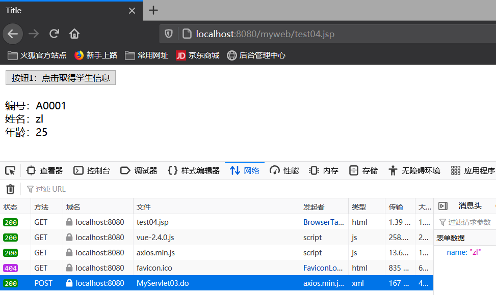

> 总结：axios的形式是一个基于Promise的Http请求客户端，用来发送请求，该形式也是vue2.0官方推荐的形式，官方在推出了该形式后，同时就不再对之前的vue-resource的形式进行更新和维护了，所以更推荐使用axios的形式来处理ajax请求。


### 5.3扩展：关于跨域请求的处理

同源：同源是指在一般情况下，浏览器发出请求访问的资源都是以相同的协议，域名和端口号下的。这样的请求即为默认同源策略的访问。

**由于浏览器的同源策略，凡是发送请求url的协议、域名、端口号三者间的任意一个或者多个与当前页面地址不同即为跨域。**

在实际项目开发中，使用的当前页面又可能会发出这样的请求，访问的是非同源的资源，那么我们需要进行跨域处理。

> 例如：
>
> 当前页面：http://192.168.1.1:8080/xxx/xxx.jsp
>
> http：协议
>
> 192.168.1.1：IP地址、域名
>
> 8080：端口号
>
> 发出请求：http://192.168.1.1:8080/xxx/yyy.do 该请求的协议、ip、端口号完全相同，就是发出的同源请求的操作。
>
> 发出请求：https://192.168.1.:8080/xxx/yyy.do （协议不同）或 http://192.168.1.2:8080/xxx/yyy.do （域名不同）或 http://192.168.1.1:8081/xxx/yyy.do （端口号不同）以上请求协议、域名、端口号三大要素均有不同，需要进行跨域请求的操作。


#### 5.3.1跨域请求的常用处理方式

1. 代理方式

   代理用于将请求发送给后台服务器，通过服务器来发送请求，然后将请求的结果传递给前端。通过nginx代理来实现操作。

   - 优点：跨域服务稳定。
   - 缺点：在使用到跨域处理的时候，必须要事先搭建nginx服务的代理环境，比较麻烦。

2. CORS方式

   CORS是W3C标准的方式，通过在web服务器端的设置，响应头Access-Control-Alow-Origin来指定哪些域可以访问本域的数据。

   - 优点：使用简单，支持基于Http协议的所有请求方式。
   - 缺点：跨域服务响应稍慢

3. jsonp方式（常用）

   通过动态插入一个script标签，浏览器对script的资源引用没有同源限制，同时资源加载到页面后会立即执行。

   - 优点：使用简单，跨域服务响应快，获取的数据是我们最常见的json格式的数据。
   - 缺点：只能发送get请求，无法发送post请求

4. 总结：由于在开发中发出跨域请求的目的通常是为了取得指定的资源数据，所以一般都是发出get请求，由于jsonp的形式使用简单，而且关于接收的响应数据，是使用最多的json格式的数据，所以该形式在企业中应用的比较广泛。


#### 5.3.2案例

当前项目所在服务器为

协议：http

域名：localhost

端口号：8080

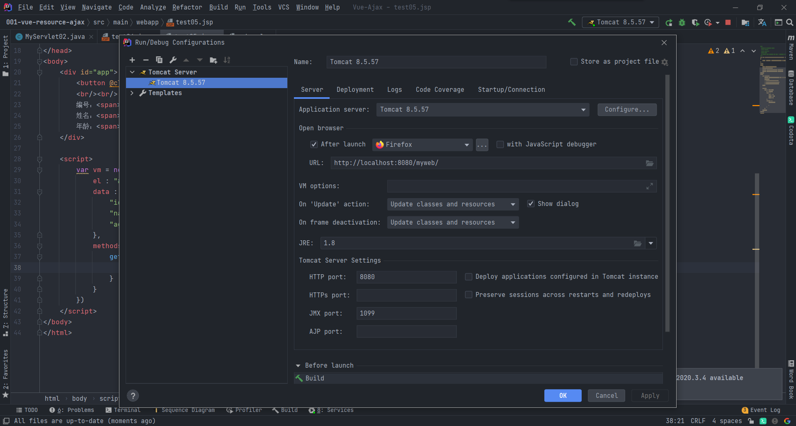

将请求发送到以下配置的服务器来从跨域的服务器中接收数据

协议：http

域名：localhost

端口号：8088

使用eclipse创建一个项目作为接收端，并改变端口号

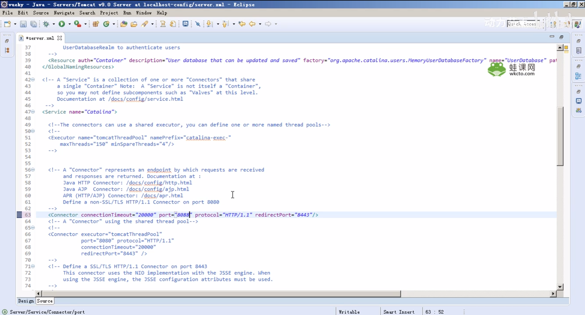

防止于idea的tomcat端口冲突，需要将以下两个端口号修改

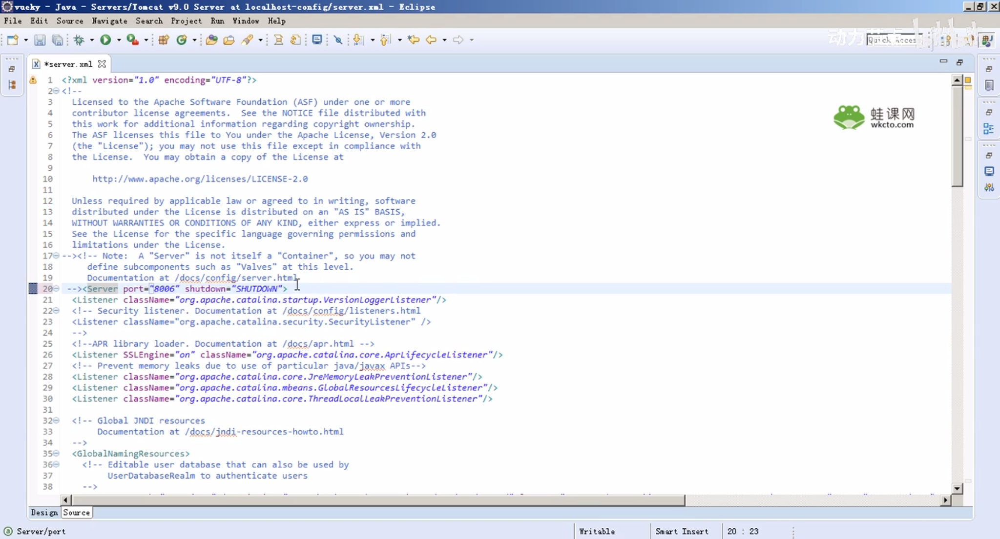

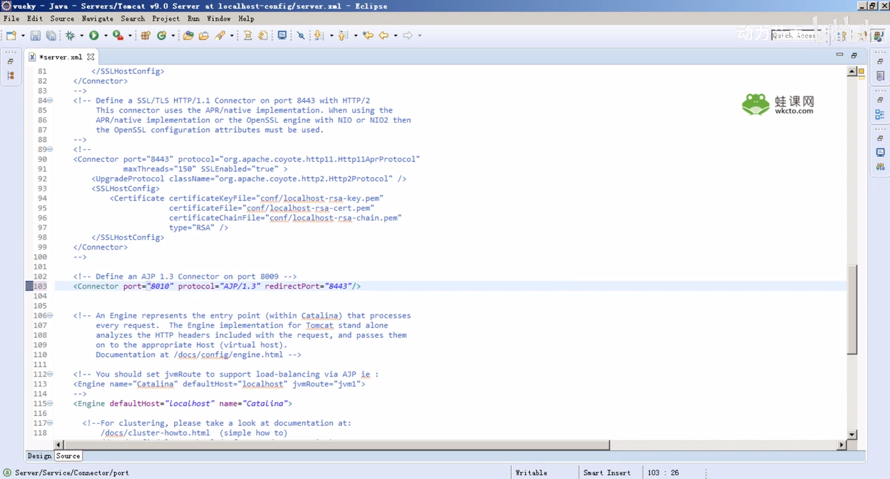

在eclipse中创建servlet并配置web.xml

```java
public class MyServlet01 extends HttpServlet {

    @Override
    protected void doGet(HttpServletRequest request, HttpServletResponse response) throws ServletException, IOException {
        System.out.println("进入到跨域请求服务器，正在执行doGet方法...");
        /*
            该服务器将要接收跨域请求
            必须要接收一个跨域请求的参数：callback
         */
        String callback = request.getParameter("callback");
        Student stu = new Student("ky-A0001", "ky-zs", "23");
        String s = "{\"id\" : \""+ stu.getId() +"\", \"name\" : \""+ stu.getName() +"\", \"age\" : \""+ stu.getAge() +"\"}";
        // 响应数据，必须加上callback，语法：callback(json)
        response.getWriter().print(callback + "(" + s + ")");
    }

    @Override
    protected void doPost(HttpServletRequest request, HttpServletResponse response) throws ServletException, IOException {
        System.out.println("进入到post请求");
    }
}
```

```xml
<servlet>
    <servlet-name>MyServlet01</servlet-name>
    <servlet-class>com.bjpowernode.servlet.MyServlet01</servlet-class>
</servlet>
<servlet-mapping>
    <servlet-name>MyServlet01</servlet-name>
    <url-pattern>/MyServlet01.do</url-pattern>
</servlet-mapping>
```

启动idea的服务和eclipse的服务，环境搭建完毕

在idea项目中创建jsp页面

```jsp
<%@ page contentType="text/html;charset=UTF-8" language="java" %>
<%
    String basePath = request.getScheme() + "://" + request.getServerName()+ ":" + request.getServerPort() + request.getContextPath() + "/";
%>
<html>
<head>
    <base href="<%=basePath%>">
    <title>Title</title>
    <script src="js/vue-2.4.0.js" ></script>
    <script src="js/vue-resource-1.3.4.js" ></script>
    <%-- 如果想要处理跨域请求，那么必须要使用vue-resource方式 --%>
    <%-- <script src="js/axios.min.js" ></script> --%>
</head>
<body>
    <div id="app">
        <button @click="getStudent">按钮1：点击取得学生信息</button>
        <br/><br/>
        编号：<span>{{id}}</span><br/>
        姓名：<span>{{name}}</span><br/>
        年龄：<span>{{age}}</span><br/>
    </div>

    <script>
        var vm = new Vue({
            el : "#app",
            data : {
                "id" : "",
                "name" : "",
                "age" : ""
            },
            methods : {
                getStudent(){
                    // 使用jsonp的形式发起跨域请求
                    this.$http.jsonp("http://localhost:8088/ky01/MyServlet01.do").then(function (resp){
                        this.id = resp.body.id;
                        this.name = resp.body.name;
                        this.age = resp.body.age;
                    })
                }
            }
        })
    </script>
</body>
</html>
```

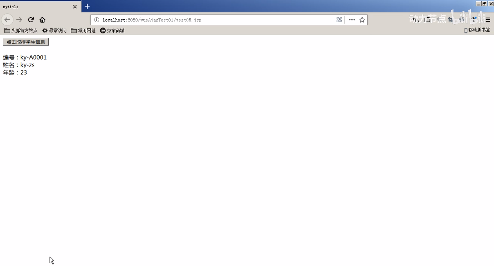

**主要应用于分布式架构中资源的访问。**


## 六、VueJs动画

在系统操作的过程中，用户体验有很多种，例如系统本身强大的功能体验，服务高效响应的体验，界面优化及视觉效果等，其中视觉上的动画体验是非常直观的，系统页面中的动画，主要是用来以多元化的形式动态的展示信息。

1. 进入/离开
   - 透明度（Opacity）：从0-1的过程和从1-0的过程。
   - v-enter：进入前
   - v-enter-to：进入后
   - v-enter-active：信息进入阶段
   - v-leave：离开前
   - v-leave-to：离开后
   - v-leave-active：信息离开过程


需求：点击按钮，展现信息，再次点击按钮，隐藏信息

```html
<!DOCTYPE html>
<html lang="en">
<head>
    <title>Document</title>
    <script src="js/vue-2.4.0.js"></script>
</head>
<body>
    <div id="app">
        <input type="button" value="点击" @click="flag = !flag"/>
        <br/><br/>
        <p v-if="flag">abcdef</p>
    </div>
    <script>
        var vm = new Vue({
            el: "#app",
            data : {
                "flag" : false
            }
        });
    </script>
</body>
</html>
```

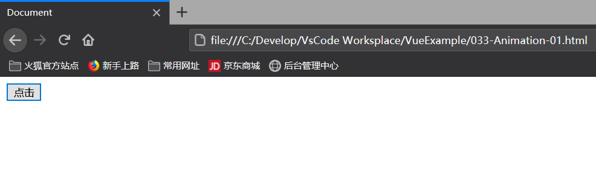

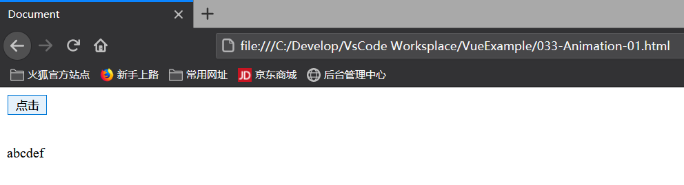

第一次加入动画效果，对于VueJs动画的引用，需要的样式

**v-enter、v-leave-to、v-enter-active、v-leave-active**

> - v-enter:这是一个时间点，是进入之前，元素的起始状态，此时还没有开始进入。
> - v-leave-to:这是一个时间点，是动画离开之后，离开的终止状态，此时元素动画已经结束。
> - v-enter-active:这是一个时间段，表示元素入场的过程
> - v-leave-active:这是一个时间段，表示元素离场的过程

通过以上四组样式的设定，可以完成信息的动画展现


### 6.1淡入/淡出

```html
<!DOCTYPE html>
<html lang="en">
<head>
    <title>Document</title>
    <script src="js/vue-2.4.0.js"></script>
    <!-- 自定义两组VueJs的样式，来控制transition内部的元素实现动画的效果 -->
    <style>
        /* 
            v-enter:这是一个时间点，是进入之前，元素的起始状态，此时还没有开始进入。
            v-leave-to:这是一个时间点，是动画离开之后，离开的终止状态，此时元素动画已经结束。
         */
         .v-enter,.v-leave-to{
             /* 设置起始状态和结束状态得挨透明度为0（表示隐藏元素） */
             opacity: 0;
             /* 该形式为普通的淡入淡出的动画效果，使用起来最简单，应用的最广泛 */
             transform: opacity;
            /* 滑入滑出指需改参数即可 */
            /* 从右向左滑入 */
            /* transform: translateX();  */
            /* 从下向上滑入 */
            /* transform: translateY();  */
         }

         /* 
            v-enter-active:这是一个时间段，表示元素入场的过程
            v-leave-active:这是一个时间段，表示元素离场的过程
          */
        .v-enter-active,.v-leave-active{
            /* 设置在指定的时间内完成动画的全部入场和离场的效果 */
            transition: all 0.8s ease;
        }
    </style>
</head>
<body>
    <div id="app">
        <input type="button" value="点击" @click="flag = !flag"/>

        <br/><br/>

        <!-- 
            对于以下p标签中的信息，我们需要使用动画进行控制
            需要使用transition标签，将需要被动画控制的元素包裹起来
            transition元素是Vue官方提供的
         -->
         <transition>
            <p v-if="flag">abcdef</p>
        </transition>
    </div>
    <script>
        var vm = new Vue({
            el: "#app",
            data : {
                "flag" : false
            }
        });
    </script>
</body>
</html>
```

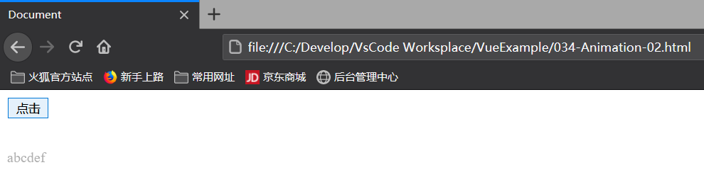


### 6.2弹入/弹出

```html
<!DOCTYPE html>
<html lang="en">
<head>
    <title>Document</title>
    <script src="js/vue-2.4.0.js"></script>
    <!-- 自定义两组VueJs的样式，来控制transition内部的元素实现动画的效果 -->
    <style>
        .v-enter-active{
            /* 设置弹入时长 */
            animation: bounce-in .5s;
        }

        .v-leave-active{
            /* 设置弹出时长 */
            animation: bounce-in .5s reverse;
        }

        /* 
            使用vue搭配css动画效果的实现
            @keyframes：是css3定义的动画规则
            bounce-in：表示弹入弹出的效果
         */
         @keyframes bounce-in{
             0%{
                 transform: scale(0);
             }

             50%{
                 transform: scale(1.5);
             }

             100%{
                 transform: scale(1);
             }
         }

    </style>
</head>
<body>
    <div id="app">
        <input type="button" value="点击" @click="flag = !flag"/>

        <br/><br/>

        <!-- 
            对于以下p标签中的信息，我们需要使用动画进行控制
            需要使用transition标签，将需要被动画控制的元素包裹起来
            transition元素是Vue官方提供的
         -->
         <transition>
            <p v-if="flag">abcdefghijklmnopqrstuvwxyz1234567890</p>
        </transition>
    </div>
    <script>
        var vm = new Vue({
            el: "#app",
            data : {
                "flag" : false
            }
        });
    </script>
</body>
</html>
```

### 6.3设置自定义v-前缀来区分不同元素

可以通过不同的v-前缀来区分不同的元素来给不同的元素来设置不同的动画效果

```html
<!DOCTYPE html>
<html lang="en">
<head>
    <title>Document</title>
    <script src="js/vue-2.4.0.js"></script>
    <!-- 自定义两组VueJs的样式，来控制transition内部的元素实现动画的效果 -->
    <style>
        .tran1-enter-active{
            /* 设置弹入时长 */
            animation: bounce-in .5s;
        }

        .tran1-leave-active{
            /* 设置弹出时长 */
            animation: bounce-in .5s reverse;
        }

        .tran2-enter-active{
            /* 设置弹入时长 */
            animation: bounce-in 3.5s;
        }

        .tran2-leave-active{
            /* 设置弹出时长 */
            animation: bounce-in 3.5s reverse;
        }
        
         @keyframes bounce-in{
             0%{
                 transform: scale(0);
             }

             50%{
                 transform: scale(1.5);
             }

             100%{
                 transform: scale(1);
             }
         }

    </style>
</head>
<body>
    <div id="app">
        <input type="button" value="点击" @click="flag1 = !flag1"/>

        <br/>

         <transition name="tran1">
            <p v-if="flag1">abcdefghijklmnopqrstuvwxyz1234567890</p>
        </transition>

        <br/><br/>

        <input type="button" value="点击" @click="flag2 = !flag2"/>

        <br/>

         <transition name="tran2">
            <p v-if="flag2">abcdefghijklmnopqrstuvwxyz1234567890</p>
        </transition>
    </div>
    <script>
        var vm = new Vue({
            el: "#app",
            data : {
                "flag1" : false,
                "flag2" : false
            }
        });
    </script>
</body>
</html>
```


### 6.4使用第三方样式类库来实现动画效果

```html
<!DOCTYPE html>
<html lang="en">
<head>
    <title>Document</title>
    <script src="js/vue-2.4.0.js"></script>
    <!-- 自定义两组VueJs的样式，来控制transition内部的元素实现动画的效果 -->
    <link rel="stylesheet" href="css/animate.css" />
</head>
<body>
    <div id="app">
        <input type="button" value="点击" @click="flag = !flag"/>

        <br/>

        <!-- 
            animate.css为我们提供了
            enter-active-class和leave-active-class
            用来操作元素进场和离场效果
            以弹入弹出的形式来处理进场和离场
            animated bounceIn
            animated bounceOut
         -->
         <transition enter-active-class="animated bounceIn" leave-active-class="animated bounceOut">
            <p v-if="flag">abcdefghijklmnopqrstuvwxyz1234567890</p>
        </transition>
        
        <!--
			可以将class = "animated" 写在元素中
			这样在enter-active-class和leave-active-class中就不用重复写animated了

			可以使用duration="毫秒值"来统一设置入场和离场动画的时长。
			参数也可以使用json对象的形式，来分别设置入场和离场的时长
			duration="{enter:200, leave:400}"
		-->
        <transition enter-active-class="bounceIn" leave-active-class="bounceOut" :duration="200">
            <p v-if="flag" class = "animated">abcdefghijklmnopqrstuvwxyz1234567890</p>
        </transition>
    </div>
    <script>
        var vm = new Vue({
            el: "#app",
            data : {
                "flag" : false
            }
        });
    </script>
</body>
</html>
```

 