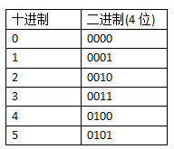
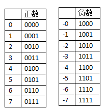
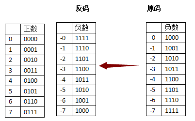
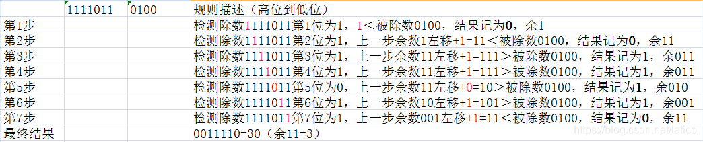

# 计算机基础相关

## 一、第一节课（位运算）

### 1.1.相关概念

1. 机器数：

   一个数在计算机中的二进制表示形式，叫做这个数的机器数。

   机器数是带符号的，在计算机用一个数的最高位存放符号，正数为0，负数为1。

   > +3：0000 0011
   >
   > -3：1000 0011

2. 真值：

   因为第一位是符号位，所以机器数的形式值就不等于真正的数值。所以，为区别起见，将带符号位的机器数对应的真正数值称为机器数的真值。

   > 0000 0011：+000 0011  —> +3
   >
   > 1000 0011：-000 0011 —> -3

### 1.2.原码、反码、补码：

1. 概念：

   对于一个数，计算机要使用一定的编码方式进行存储。原码，反码，补码是机器存储一个具体数字的编码方式。

   **注意：计算机中存储的是补码，计算机也是直接计算的补码，而如果人需要识别内存地址中的真值，则需要装换成原码。**

2. 为什么要使用原码反码补码？

   > - 最早的数字没有符号
   >
   >   
   >
   > - 后来区分出了正数和负数的概念
   >
   >   
   >
   >   这就是原码，但是实际上原码是有缺陷的，我们希望 （+1）和（-1）相加是0，但计算机只能算出0001+1001=1010 (-2)
   >
   > - 为了解决"正负相加"等于0的问题，在“原码”的基础上，人们发明了“反码”
   >
   >   
   >
   >   **反码就是除符号位的各位按位取反**
   >
   >   过去的（+1）和（-1）相加，变成了0001+1101=1111，刚好反码表示方式中，1111象征-0
   >
   >   但是依然有问题，有两个零的存在，(+0)和(-0)
   >
   > - 我们希望只有一个0，所以发明了"补码"，同样是针对"负数"做处理的
   >
   >   
   >
   >   **"补码"的意思是，从原来"反码"的基础上+1**
   >
   >   这样就解决了以上的所有问题。

3. 深入理解：

   https://www.cnblogs.com/wqbin/p/11142873.html

### 1.3浮点数的表示形式


### 1.4浮点数的计算


### 1.5计算机中的加减乘除法

**可以了解一下半加器，全加器，乘法器等电路知识。**

1. 加法：

   数据在内存中以二进制补码的形式存储，CPU在进行加法运算时直接将两个操作数的二进制补码相加，在转换成原码即可。

   > ```
   > 1）异或^ 不考虑进位的情况，异或的结果与按位加的结果是一样的。
   > 2）与&   判断是否有进位
   > 3）有进位 结果左移一位 继续 1） 2）
   > 4）无进位 输出结果
   > ```
   >
   > 4 + 5 = ?
   >
   > 0000 0100 + 0000 0101 = ?
   >
   > ```
   > 1) 异或
   >     0000 0100
   >    ^0000 0101
   >     ----------
   >     0000 0001
   > ```
   >
   > ```
   > 2) 判断是否有进位
   >    0000 0100
   >  & 0000 0101
   >  -----------
   >    0000 0100
   > ```
   >
   > ```
   > 3) 继续异或
   >   0000 0001
   >  ^0000 1000
   >  -----------
   >   0000 1001
   > ```
   >
   > ```
   > 4) 判断是否有进位
   >   0000 0001
   >  &0000 1000
   >  ----------
   >   0000 0000
   > ```
   >
   > ```
   > 5) 结果
   >  0000 1001
   > ```

2. 减法：

   CPU做减法时，将减数取负数，在与被减数相加得到结果。

   > 4 - 5 = ?
   >
   > 4 + ( - 5 ) = ?
   >
   > 0000 0100 + 1111 1011 = ?
   >
   > ```
   > 1) 异或
   >  0000 0100
   > ^1111 1011
   > -----------
   >  1111 1111
   > ```
   >
   > ```
   > 2) 判断是否有进位
   >   0000 0100
   >  &1111 1011
   >  ----------
   >   0000 0000
   > ```
   >
   > ```
   > 3) 结果
   >  1111 1111
   > ```
   >
   > **计算机得到的结果是补码，需要转换成原码才是最后的结果。**

3. 乘法：

   计算机在进行乘法运算时，和加法是一样的，X * Y 的结果是Y个X相加，只是计算机为了提高效率，引入了左移的机制。

   > 4 * 5 = ？
   >
   > 4 * 0000 0101 = ？
   >
   > 4 * （ 2^2 + 2^0 ） = ？
   >
   > 0000 0100 * 0000 0101 = ？
   >
   > 0000 0100 * 0000 0100 + 0000 0100 * 0000 0001 = ？
   >
   > 0000 0100 << 2 + 0000 0100 << 0 = ?
   >
   > 0001 0000 + 0000 0100 = ?
   >
   > 16 + 4 = 20

4. 除法：

   按照除数的高位到低位的数字依次和被除数进行比对，如果大于等于被除数，则此步结果记为1，并求得余数，如果小于被除数则将上一步的余数左移一步加上一位的数字再次比较，以此类推，最终将依次计算的结果相连组成二进制就是商，最后一次的余数就是求余的结果。

   > 123 / 4 = ？
   >
   > 0111 1011 / 0000 0100 = ？
   >
   > 
   >
   > 第五步中的上一步余数011左移加0 = 110，图片有误

### 1.6超大数


### 1.7位运算

