# 软件工程复习

## 第一章：软件工程概述

### 1.1概念

#### 1.1.1软件

**软件 = 程序 + 数据 + 文档**

> - 程序：不仅有可运行的代码，还有程序运行的配置环境；
> - 数据：不仅指程序中应用到的数据结构，还有数据的存储；
> - 文档：指在软件开发和维护过程中形成的文字记录，包括：使用说明书，在线帮助等。

#### 1.1.2软件产品

**软件是通过加工得到的一种逻辑产品**

#### 1.1.3软件产品的类型

> 1. 基础软件：系统软件（操作系统、语言处理系统），数据库，中间件。
> 2. 支撑软件：编程工具，建模工具，版本控制，软件测试。
> 3. 应用软件：个人软件，企业级软件等
> 4. 嵌入式软件：手机，平板上的软件，系统等

### 1.2软件的发展与软件危机

#### 1.2.2软件危机

**软件危机指的是计算机软件的开发和维护过程中所遇到的一系列严重问题。**

**软件危机包含两方面问题：**

> 1. 软件开发方面的问题：
>
>    软件规模日趋增大，内容日趋复杂，开发困难
>
> 2. 软件维护方面的问题：
>
>    需求和环境不断变化，使得维护数量不断膨胀

### 1.5软件工程的内容

**软件工程 = 计算机科学 （提供技术）+ 工程学 （制定规范）+ 管理学（进行管理）**

#### 1.5.1软件工程三要素

从计算机科学观点看，软件工程是一种层次化技术，分别是**过程、方法、工具。**

> - 过程：软件产品加工所经历的一系列有组织的活动
> - 方法：为软件开发提供"如何做"的技术
> - 工具：为过程和方法提供自动或半自动的支持

## 第二章：软件过程

### 2.2软件过程与软件生存周期

#### 2.2.1软件生存周期

**软件产品从定义到开发、使用和维护，直到最终被弃用，要经历一个漫长的时期，通常把软件经历的这个时期称为生存周期。**

1. **生存周期的阶段划分**

**分成三个大的阶段也称三个时期，即计划时期、开发时期和运行时期**

> 三个大的阶段细分为七个活动：
>
> 1. 计划时期：问题定义、可行性研究（目的：获取软件开发项目）
> 2. 开发时期：需求分析、总体设计、详细设计、实现（目的：实质性工作、构建高质量软件）
> 3. 运行时期：运行和维护（目的：最后，最长的阶段，维护，延长软件寿命）

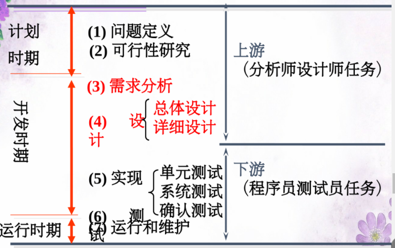

**软件过程 = 软件生存周期**

### 2.4软件开发模型

**传统模型：瀑布模型、快速原型模型**

**演化模型：增量模型、螺旋模型**

**现代模型：统一过程RUP、极限编程XP**

#### 2.4.1瀑布模型

1. 活动流程：

   **当前阶段结束后，形成文档。作为下一阶段开始的依据，阶段之间按照顺序依次进行。也称线性顺序模型**

2. 特点：

   > 1. 活动间具有顺序性和依赖性。
   > 2. 尽可能推迟程序的物理实现，减少返工量。
   > 3. 带“反馈环”
   > 4. **适合需求明确的系统**
   > 5. 用户需求完整准确，需求不能变化

3. 流程图：

   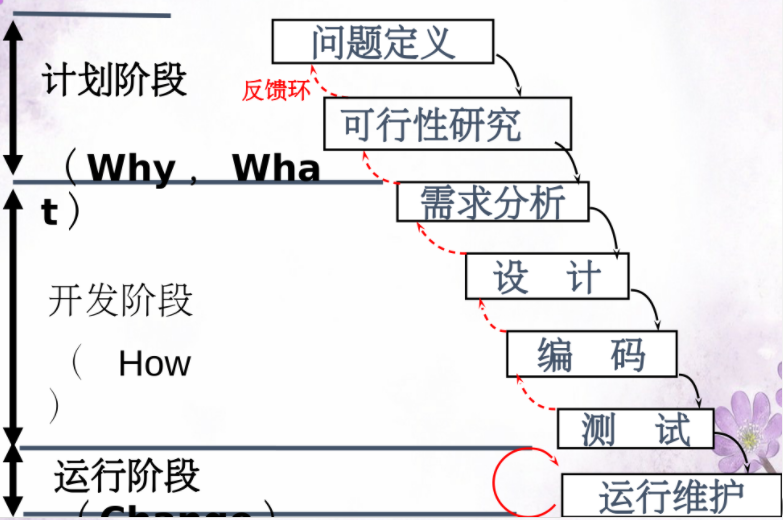

#### 2.4.2快速原型模型

1. 活动流程：

   **基本活动顺序依然遵照瀑布模型，主要是在需求分析阶段融进了循环往复的思想，以加快对需求的理解和确认。**

2. 特点：

   > 1. **适合客户说不清楚需求的系统**
   > 2. 增强了双方合作的信心
   > 3. 应用：二次开发
   > 4. 原型：样机，能运行，不可交付

3. 流程图：

   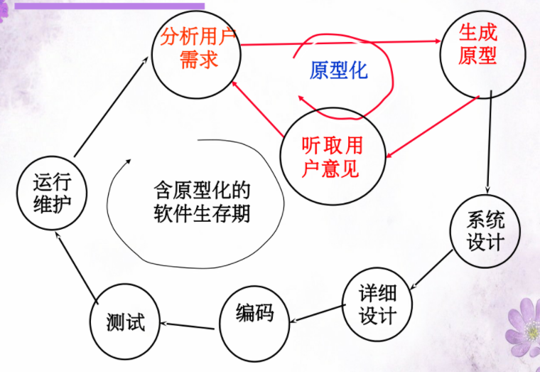

#### 2.4.3增量模型

1. 活动流程：

   **先完成一个系统子集的开发，再按同样的开发步骤增加子集，如此递增下去直至满足全部系统需求。**

2. 特点：

   > 1. 增量：是系统的一部分，可交付。其中最重要的是增量1，它是系统的核心，实现了系统基本的需求
   > 2. 对于需求不能完全被掌握和了解的系统，无须等待做出完整的需求就可入手
   > 3. 分步骤分块开发
   > 4. 应用：用来开发同一个产品的不同项目版本

3. 流程图：

   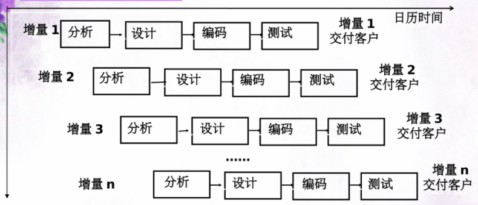

4. 增量模型和迭代模型的区别：

   > 增量模型：在每一个新的发布中逐步增加功能直到构造全部功能
   >
   > 迭代模型：一开始提交一个完整系统，在后续发布中补充完善各子系统功能
   >
   > 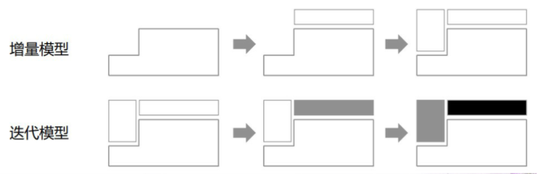

#### 2.4.4螺旋模型

1. 活动流程：

   **它是将瀑布模型、快速原型模型和增量模型结合起来的演进模型，并融进了其他模型所忽视的风险分析，特别适合于大型复杂的系统，适合于市售产品项目。**

2. 演进过程：

   > 一个新版本的发布周期要经过四圈：
   >
   > 1. 第一圈：问题定义、可行性分析
   > 2. 第二圈：需求分析
   > 3. 第三圈：总体设计
   > 4. 第四圈：详细设计、编码、测试
   >
   > 每圈运行分为四个象限：
   >
   > 1. 第二象限：制定计划
   > 2. 第一象限：风险分析
   > 3. 第四象限：实施工程
   > 4. 第三象限：客户评估

3. 特点：

   > 1. 多种模型的结合，融进了循环往复，演进思想
   > 2. 增加前三种模型所忽略的风险分析

4. 流程图：

   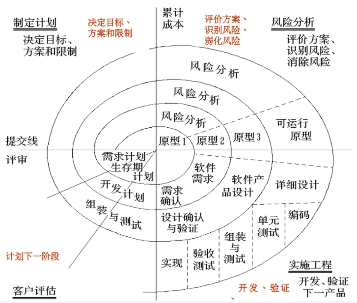

#### 2.4.5统一过程RUP

1. RUP的二维模型：

   > 分为时间轴（横轴）和活动内容轴（纵轴）
   >
   > 1. 横轴：划分为四个阶段，四个里程碑
   >    1. 初始阶段：
   >       - 该阶段关注整个项目进行中的关注业务需求
   >       - 里程碑：确定软件目标
   >    2. 细化阶段：
   >       - 该阶段主要完成领域问题分析和软件设计
   >       - 里程碑：构造软件结构
   >    3. 构造阶段：
   >       - 该阶段以系统实现和测试为主
   >       - 里程碑：得到初始功能
   >    4. 交付阶段：
   >       - 该阶段的重点是确保软件对最终用户是可用的
   >       - 里程碑：产品发布
   > 2. 纵轴：是活动内容组织，活动内容是九个核心工作流，分为六个核心过程工作流，三个核心支持工作流
   >    1. 六个核心过程工作流
   >       1. 业务建模
   >       2. 需求
   >       3. 分析设计
   >       4. 实施
   >       5. 测试
   >       6. 部署
   >    2. 核心支持工作流：
   >       1. 配置与变更管理
   >       2. 项目管理
   >       3. 环境

2. 流程图：

   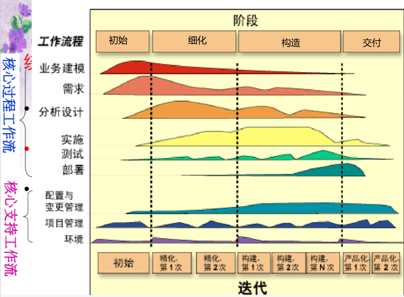

## 第三章：软件计划

### 3.1软件计划概述

1. 软件计划的内容和过程：

   **问题定义，可行性研究，指定项目计划**

### 3.3可行性分析

1. 可行性研究的内容分类：

   > - 技术可行性
   > - 经济可行性
   > - 社会可行性

## 第四章：软件需求基础

### 4.1需求分析概述

1. 需求分析的目的：

   **弄清用户对系统的细节要求，完整、准确、清晰、具体地回答目标系统“做什么”**

2. 需求工程：

   完整的软件需求是指需求工程，**需求工程包括“需求开发”和“需求管理”两部分。**

3. 需求开发的过程：

   **需求获取—>需求分析—>需求描述—>需求验证**

   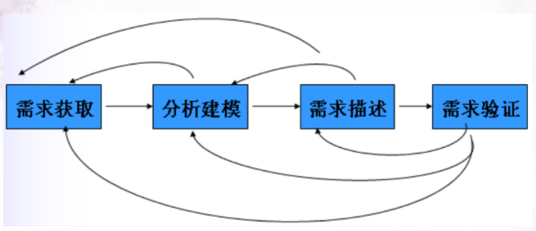

### 4.2需求获取

1. 需求的层次：

   **软件需求包括三个不同的层次：业务需求、用户需求、功能需求、也包括非功能需求。**

## 第五章：软件设计基础

### 5.1软件开发的逐步求精

1. 逐步求精的概念

   **抽象与细化**

### 5.2软件设计的总体任务

1. 软件设计包括两大部分：

   > 1. 结构设计：
   >    - 体系结构设计：支撑和管理软件运行的环境设计
   >    - 领域问题结构设计：满足需求的软件功能设计
   > 2. 详细设计：
   >    - 过程设计：对算法分析和程序设计
   >    - 人机交互界面的具体设计
   >    - 对数据库的物理设计

### 5.3模块化与信息隐藏

1. 衡量软件独立性的度量标准：

   > - 内聚度：一个模块内部各个元素间（语句和程序段）彼此的紧密程度的度量。
   > - 耦合度：指软件结构中各模块之间相互联系紧密程度的一种度量。
   >
   > 信息隐蔽、高内聚，低耦合

### 5.4详细设计

1. 判定表和判定树：

   1. 判定表：

      > 判定表由四部分组成：
      >
      > - 左上部列出所有条件
      > - 左下部是所有可能的动作
      > - 右上部表示各种条件组合的一个矩阵
      > - 右下部表示每种条件组合相对应的动作
      >
      > 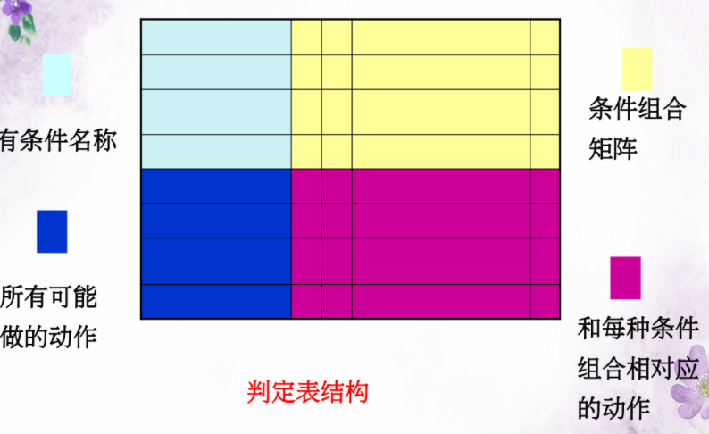

      

   2. 判定树：

      > 判定树的绘制步骤：
      >
      > 1. 提取问题中的条件
      > 2. 对条件按题意组合
      > 3. 为条件组合确定目标动作
      > 4. 绘制判定树

   3. 例题：

      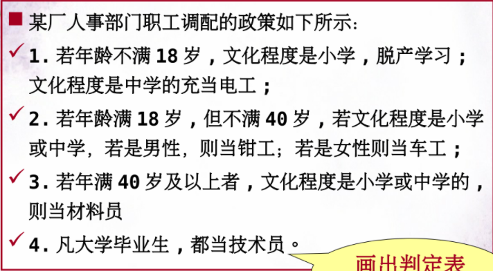

      - 判定表：

        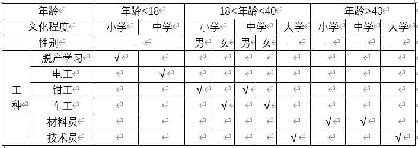

      - 判定树：

        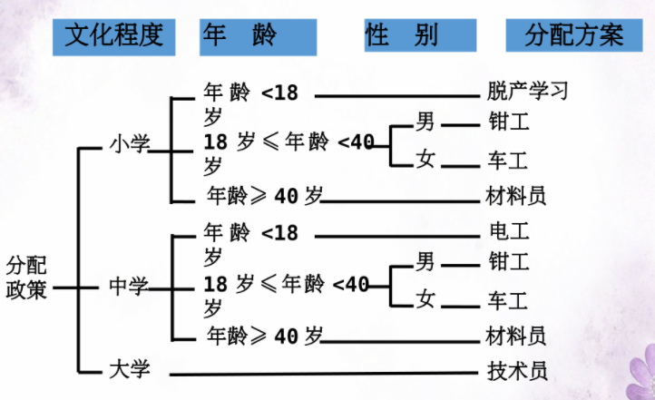

## 第六章：面向结构化从分析到设计

### 6.2面向数据流的结构化分析

**分析的思想：分解、抽象、多视图、自顶向下、逐层分解、逐步求精**

1. 建模的主要技术：

   > - 功能建模：数据流图DFD + 数据字典DD（核心）
   > - 数据建模：实体关系图ERD
   > - 行为建模：状态转换图STD

2. 数据流图DFD：

   1. 作用：

      **输入数据流到输出数据流的变换过程**

   2. 图形符号：

      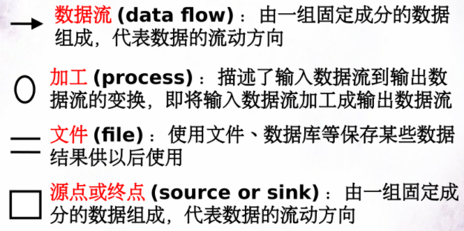

   3. 模型：

      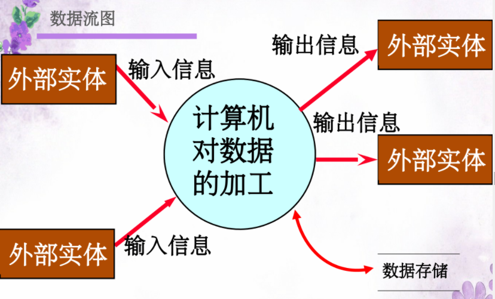

   4. 例子：

      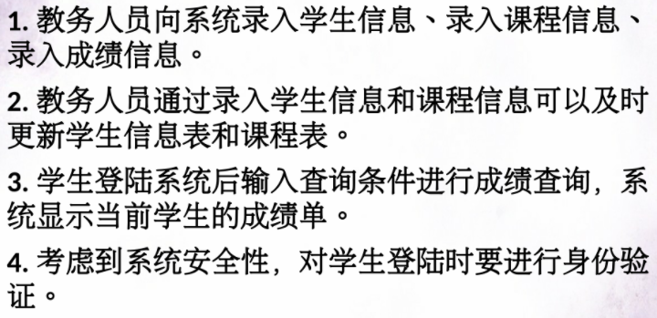

      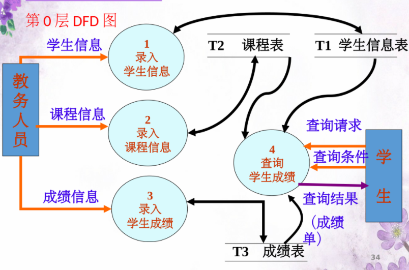

3. 数据字典DD：

   1. 作用：

      **描述数据流图中的数据内容**

   2. 描述的对象：

      **描述数据流图中出现的所有数据和加工**

   3. 数据字典的组成：

      > - 数据字典包括：数据流条目、数据存储条目、数据项条目、加工条目（加工小说明）
      > - 数据流条目可以有卡片式或表达式

   4. 例子：

      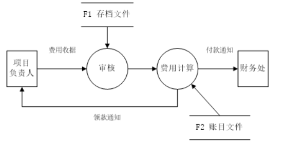

      数据流：费用收据、付款通知、领款通知

      加工：审核、费用计算

      外部实体：项目负责人、财务处

      数据存储：存档文件、账目文件

      描述：项目负责人提交费用收据给系统，系统调用存档文件进行审核，审核成功调用账目文件，进行费用计算，给财务处发送付款通知，给项目负责人发送领款通知。

## 第七章：面向对象从分析到设计

### 7.1面向对象开发简介

1. 五大特性：

   > 1. 抽象性
   > 2. 封装性
   > 3. 继承性
   > 4. 多态性
   > 5. 消息机制

### 7.2统一建模语言UML

#### 7.2.3UML图形元素

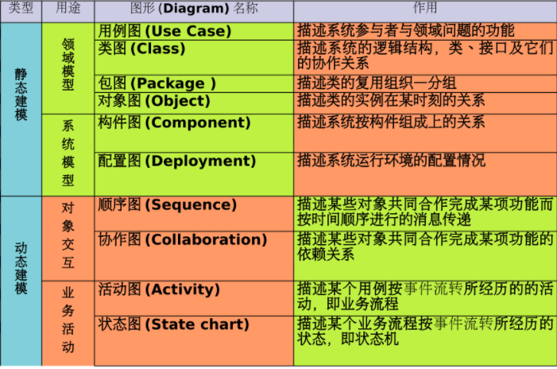

#### 7.2.4用例图

1. 图形符号：

   > - 角色、参与者
   > - 用例
   > - 关联

2. 用例之间的关系：

   - 包含关系：<< include >>

     如果多个用例之间某些行为是相同的，则可以将这些相同的行为提取出来单独作为一个用例。

     被包含用例是基本用例的一部分。

     带关键字<< include >>的虚线来表示，箭头指向被包含用例。

   - 扩展关系：<< extend >>

     被扩展的基本用例可以根据条件有选择地使用扩展用例的功能。

     扩展用例不是基本用例的一部分。

     带关键字<< extend >>的虚线来表示，箭头指向基础用例。

   - 泛化关系

     泛化符号用空心箭头从子用例指向父用例

3. 例子：

   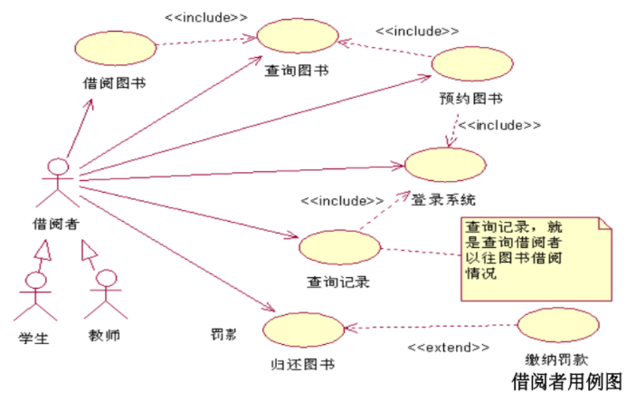

#### 7.2.5类图

1. 图形符号：

   > - 类Class
   > - 对象Object

2. 类之间的关系

   **类的外部关系可以归纳为三种：关联、泛化、依赖**

   > - 泛化：实线空心箭头，箭头指向父类
   > - 依赖：虚线箭头，箭头指向被依赖类
   > - 实现：虚线空心箭头，箭头指向接口类

   **关联符号有三种：一般关联、聚合、组成**

   > - 一般关联：实线
   > - 聚合：实线空心菱形，部分指向整体
   > - 组成：实线实心菱形，部分指向整体
   >
   > 聚合和组成的区别：
   >
   > - 组成是部分和整体之间的关系，有相同的生命周期

3. 例子：

   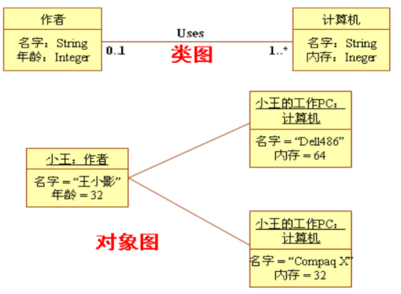

#### 7.2.6包图

包是对类进行的更高一级的组织形式，将语义上相关的元素进行分组，也就是对类实行分类组织，是一种比类更粗粒度的封装。

#### 7.2.7活动图

1. 泳道：

   **表达活动的责任，泳道明确表示哪些活动是由哪些对象进行的。**

#### 7.2.8顺序图

1. 图形元素：

   > - 对象类角色
   > - 生命线
   > - 激活期
   > - 消息

#### 7.2.9组件图和部署图

1. 组件图：

   **表示系统中的不同物理组件及其联系，它表达的是系统代码本身的结构。**

2. 配置图：

   **由节点构成，节点代表系统的硬件，组件在节点上驻留并执行。**

## 第八章：软件实现

### 8.2测试

1. 测试：

   **软件测试的目的是发现程序中的错误，是为了证明程序有错，而不是证明程序无措。**

   **不仅是测试程序，还应该对开发过程中所有的产品进行测试，包括文档，其目的是为了尽早地、尽可能多地发现并排除软件中潜在的错误。**

2. 白盒测试：

   **白盒测试也称结构测试或逻辑驱动测试，它是按照程序内部的结构测试程序，通过测试来检测产品内部动作是否按照设计规格说明书的规定正常进行，检验程序中的每条通路是否都能按预定要求正确工作。**

3. 黑盒测试：

   **黑盒测试意即把程序看成是一个黑盒子，无须了解模块里面的结构，仅通过其外在功能描述来进行测试，只检查程序是否达到需求规格说明书规定的功能，因而也称为功能测试。**

4. 测试过程：

   **单元测试、集成测试、功能测试、系统测试**

